# Lec 2: Story Proofs, Axioms Of Probability

📊 **Progress:** `30` Notes | `23` Screenshots

---

<kbd>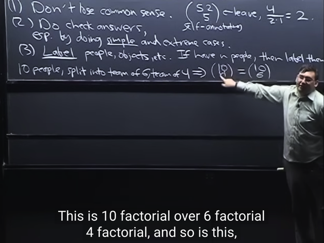</kbd>

🔗 **Related:** [LEC 2: STORY PROOFS, AXIOMS OF PROBABILITY](untitled.md#node-27)

> [!NOTE]
> gs nói về một ví dụ: tính số cách **split một team 10 người** thành
> **team 6** và **team 4**.
>
> Thì câu trả lời đơn giản là **(10 choose 4)**:  Ta có thể tính bằng cách
> Chia việc đếm thành 2 bước:**Bước 1: ĐẾM SỐ CÁCH CHỌN BỘ 4 NGƯỜI** từ 10 người: Có (10
> choose 4)
>
> Và bước 2: Với 6 người còn lại, chọn bộ 6 người: Dĩ nhiên nhiên có 6
> choose 6 = 1 cách chọn.
>
> Và dù 4 người được chọn ở bước một là ai thì vẫn chỉ có 1 cách chọn
> bộ 6 người Do đó theo product rule,ta sẽ có (10 choose 4)*1 cách chọn
> [bộ 4 người và bộ 6 người]
>
> Hoặc có thể lập luận rằng mỗi MỖI KHI TA CHỌN MỘT BỘ 4 NGƯỜI
> (10 choose 4 cách) THÌ CŨNG LÀ CŨNG LÀ MỘT CÁCH CHIA 10 RA
> LÀM 2 NHÓM 6,4. Nên kết qủa là (10 choose 4)
>
> Và ngược lại mỗi một cách chọn bộ 6 người CŨNG LÀ MỘT CÁCH
> CHIA 10 RA LÀM 2 NHÓM 6,4
>
> Do đó số cách chọn bộ 4 người CŨNG CHÍNH LÀ số cách chọn bộ 6
> người
>
> Thành ra đây **cũng là chứng minh theo story proof** rằng **(10 choose 4) 
> cũng chính là (10 choose 6)**Hay tổng quát hóa là ta có**(n choose k) = (n choose n-k)**

> [!NOTE]
> Một số ghi chú:
>
> ii) Luôn nên **check lại answer** bằng việc check **simple và extreme case**
> iii) **Luôn phân biệt** - giống như **mọi quả bóng màu xanh đều nên được label
> khác nhau**, chứ đừng vì ta thấy chúng giống nhau mà không phân biệt
> chúng ta sẽ mắc sai lầm.
>
> Cái này tương đồng với cs109 gs Cris có nói, **luôn distinct các thứ**, nhằm
> giúp có  **equally likely (possible) outcomes**

 

<kbd>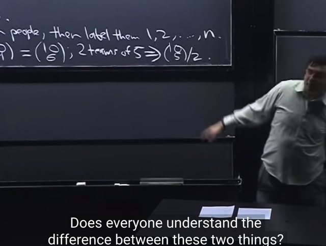</kbd>

> [!NOTE]
> Tuy nhiên nếu bài toán là (đếm số cách) **chia nhóm 10 người làm 2 nhóm 5/5**
> thì đáp án sẽ chỉ là (10 choose 5) / 2
>
> Lí do là, (10 choose 5) sẽ cho ta số cách chọn một bộ 5 người không care
> thứ tự như đã biết.
>
> Tuy nhiên nếu dùng con số đó, cho "số cách chia 10 người thành 2 nhóm
> 5/5" thì ta đã overcounting.
>
> Bởi lẽ trong (10 choose 5) cách, ta đã **coi: (1,2,3,4,5) và (6,7,8,9,10) là hai
> possible outcome khác nhau**. Nhưng chúng **chỉ là một cách chia**.
>
> Do đó kết quả phải là **(10 choose 5) / 2**

 

<kbd>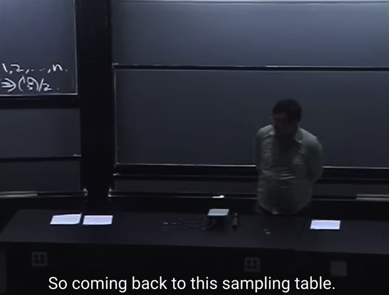</kbd>

> [!NOTE]
> đại khái là gs nhắc nhở rằng để apply **naive definition of probability** thì ta
> phải đảm bảo các possible outcome có tính chất **equally likely**. Và như vừa
> nói gs Crish của cs109 cho rằng tip là **luôn distinct các thứ ra** (mà gs này thì
> nói theo cách là luôn gán label cho mọi thứ).

 

<kbd>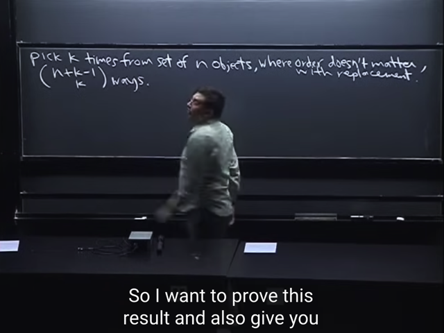</kbd>

> [!NOTE]
> Ở đây ta sẽ quay lại bài toán bữa trước, **chọn k item từ n item**. Nhưng ta**CÓ**
> REPLACEMENT (có hoàn lại, bốc xong bỏ lại) và **KHÔNG** CARE ORDER. Đây
> là case mà gs nói rằng khó.
>
> Trong bài trước ông đã cho biết kết quả sẽ là **(n + k - 1 choose k)** cách

 

<kbd>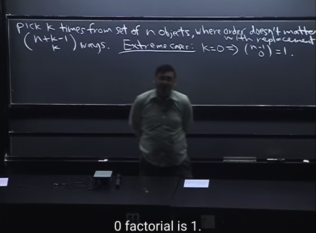</kbd>

> [!NOTE]
> thế thì gs B cho rằng ta sẽ tiếp cận theo lời khuyên hồi nãy, check **simple
> case** và **extreme case**. Tức là ta sẽ kiểm tra xem với các trường hợp
> simple và extreme thì công thức ta suy luận ra **có đúng không**.
>
> Đầu tiên là extreme case: **k = 0**. Theo công thức này (n - 1 choose 0) = 1
>
> Gs cho rằng ta nên hiểu tại sao (n choose 0) = 1 theo nghĩa là: có n item, thì**để chọn 0 cái** thì dù n là bao nhiêu cũng **chỉ có 1 cách chọn**: ĐÓ LÀ
> **KHÔNG LÀM GÌ**.
>
> Vậy **với simple case** này thì **công thức trên đúng**.
>
> Ý chính là, giả sử ta làm ra đáp án là (n+k-1 choose n), thì nhờ extreme case
> này ta sẽ thấy nó bằng (n - 1 choose n) sẽ là 0 (*). Và nó là sai, vì để chọn 0
> item từ n item phải có 1 cách chọn mới đúng.
>
> (*: ra 0 vì n-1 < n, và đương nhiên **không** có cách nào để chọn set có n item
> trong khi chỉ có n-1 item)

 

<kbd>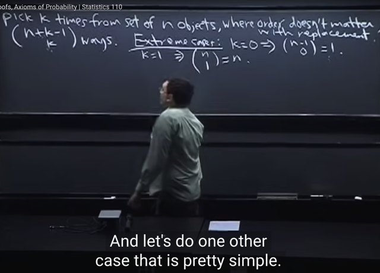</kbd>

🔗 **Related:** [LEC 1: PROBABILITY & COUNTING](untitled.md#node-17)

> [!NOTE]
> Tiếp, ta sẽ **check sample case khác là với** k = 1. Ta thấy công thức cho
> ra (n choose 1) = n. Kết quả này dễ thấy là hợp lí (make sense) vì **khi có
> n item, để chọn 1 cái** thì đương nhiên **có n cách chọn**.
>
> Và gs cũng cho biết nếu chỉ chọn 1 (k=1) thì rõ ràng là care hay không
> care thứ tự cũng đều như nhau cả.
>
> Ý là trong bài trước ta đã xét trường hợp CÓ replacement và CÓ quan
> tâm thứ tự, thì số cách chọn set k item từ n item ta đã biết là n^k. Thế thì
> nếu k = 1, thì n^k = n^1 = n. Nên mới nói khi k = 1 thì **dù CÓ hay
> KHÔNG quan  tâm thứ tự** thì kết quả vẫn **chỉ có n cách chọn**

 

<kbd>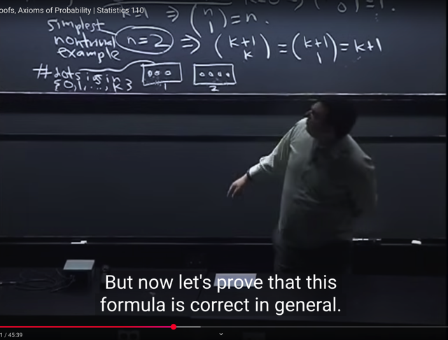</kbd>

🔗 **Related:** [LEC 2: STORY PROOFS, AXIOMS OF PROBABILITY](untitled.md#node-21)

> [!NOTE]
> Rồi, tiếp theo là chọn check với extreme case n = 2, mà ông gọi là **SIMPLEST NONTRIVIAL
> example**.
>
> Thì với n = k, thì công thức (n + 1 choose k) nó thành (k + 1 choose k).
>
> Mà ta vừa nãy đã biết (n choose k) cũng bằng (n choose n-k) nên
>
> (**k + 1 choose k) cũng chính là (k + 1 choose k + 1 - k) = (k + 1 choose 1)**
>
> Và (k+1 choose 1) thì bằng (**k+1)**(như n choose 1 thì bằng n: có n item, để chọn 1 thì có n
> cách)
>
> Thế thì quay lại đây, tại sao (k+1) là đúng?
>
> Vì thế này, bài toán lúc này trở thành đếm số cách **TỪ LỌ CÓ 2 VIÊN BI (đang xét n = 2 mà),
> CHỌN K LẦN**THEO CÁCH **CHỌN XONG BỎ VÀO LẠI** (WITH REPLACEMENT).
>
> Chú ý thứ nhất đó là: Bởi vì**chọn xong bỏ vào lại** nên ta **KHÔNG BỊ GIỞI HẠN BỞI SỐ
> OBJECT CÓ THỂ LẤY** trong lọ như khi chọn xong lấy ra luôn. Do đó **k  bằng bao nhiêu cũng
> được**, tức là cứ chọn xong bỏ vào lại **cho đến khi đủ k  lần chọn** thôi.
>
> Vậy thì ta sẽ hiểu rằng với thử nghiệm như vậy, thì làm sao để theo dõi các possible outcome
> của nó, để mà đếm, sao cho thỏa mãn yêu cầu là ta **không care thứ tự** của các viên bi
>
> Thế thì ông đề nghị ta hình dung là **CHO HAI VIÊN BI ĐƯỢC ĐÁNH SỐ p1, p2** ta chuẩn bị:
>
> + **2 CÁI HỘP** **CÓ ĐÁNH SỐ** B1, B2.
>
> + **K QUẢ BANH TRẮNG GIỐNG NHAU**, **KHÔNG CẦN ĐÁNH SỐ** ĐỂ PHÂN BIỆT.
>
> Để rồi trong k lần, **mỗi lần chọn viên bi nào (ví dụ bi p1) (rồi bỏ vào lại of course) thì LẤY MỘT
> QUẢ BANH TRẮNG BỎ VÀO HỘP B1** (để theo dõi mỗi viên bi được chọn mấy lần).
>
> Vậy thì dùng ví dụ của gs B thì ta cũng có thể hình dung rằng, với (ví dụ k = 7 lần bốc, thì ta có
> thể tạo ra 8 kết quả khác nhau: thể hiện bằng số trạng thái có thể xảy ra của hai cái hộp.
>
> Ví dụ như:
>
> B1 = 0, B2 = 7: khi cả 7 lần đều bốc trúng viên thứ 1
>
> B1 = 1, B2 = 6: Có 1 lần bốc trúng viên thứ 1 và 6 lần bốc trúng viên thứ 2 . .
>
> B1 = 7, B2 = 0: Cả 7 lần đều bốc trúng object thứ 1, 0 lần trúng viên thứ 2
>
> Cả thảy là có 8 (=k+1) possible outcome khi chọn 7 object trong lọ có 2 viên bi
>
> Vậy ý nói rằng với việc thử với n = 2, ta thấy **công thức (n+1 choose k) là đúng**

 

<kbd>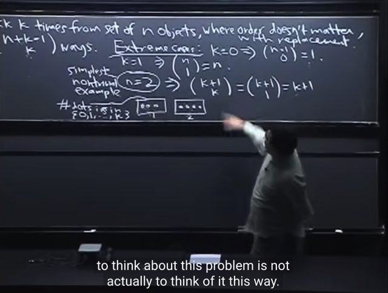</kbd>

> [!NOTE]
> gs cho biết điểm quan trọng khi học xác suất đó là HỌC CÁCH N**HẬN RA
> CÁC PATTERN** để **THẤY HAI BÀI TOÁN LÀ GIỐNG NHAU dù cho chúng
> CÓ VẺ LÀ KHÁC NHAU**

 

<kbd>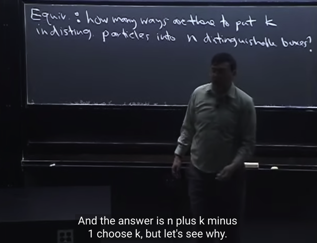</kbd>

> [!NOTE]
> Và đại khái là bài toán vừa rồi **ĐÃ TRỞ NÊN TƯƠNG TỰ** MỘT BÀI TOÁN
> KHÁC:
>
> Có **K QUẢ BANH TRẮNG** (KHÔNG ĐÁNH SỐ, COI NHƯ GIỐNG NHAU)
> VÀ **N CÁI HỘP CÓ ĐÁNH SỐ**
>
> Thì có mấy cách **BỎ** **K QUẢ BANH (TRẮNG / GIỐNG NHAU) ĐÓ VÀO N
> HỘP KHÁC NHAU**

 

<kbd>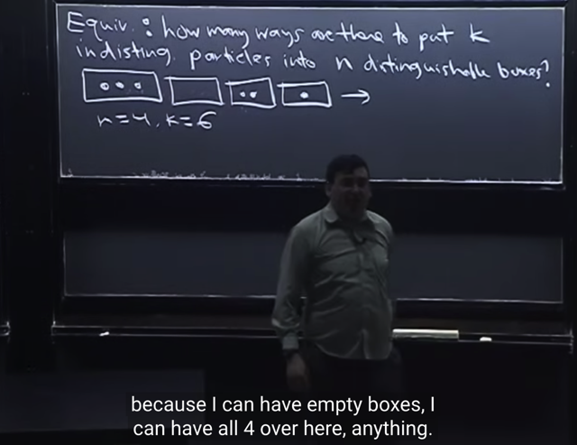</kbd>

> [!NOTE]
> gs B lấy ví dụ khác là với **n = 4** (ta có 4 box khác nhau) và**k = 6** (6
> object / particles giống nhau)
>
> Đại khái gs khuyên rằng ta nên **CHỌN CÁC GIÁ TRỊ CỤ THỂ SAO CHO
> NÓ KHÔNG QUÁ DÀI** (TEDIUS) để thông qua đó ta check công thức
> tổng quát và  "HÌNH DUNG ĐƯỢC VẤN ĐỀ"

 

<kbd>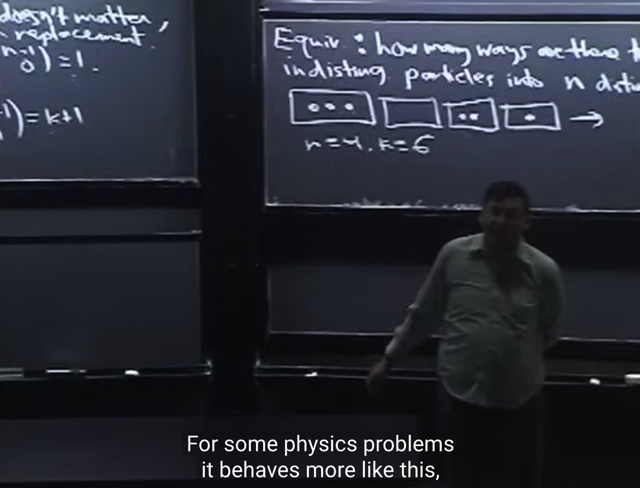</kbd>

> [!NOTE]
> gs chia sẻ thêm, **phần đông các trường hợ**p là ta sẽ làm việc với bài toán mà
> trong đó ta **có thể PHÂN BIỆT** được các thứ particles. Hay nói cách khác,
> ta**có thể gán label** cho chúng, ngay cả khi trông chúng giống nhau
>
> Ví dụ như trong bài toán chọn k viên bi từ trong lọ, ta có thể **COI NHƯ CÓ
> THỂ PHÂN BIỆT** được n quả banh khác nhau.
>
> Còn ngược lại, trong bài toán "tương tự" ở đây (cho k banh trắng / giống nhau
> , đếm số cách xếp vào n hộp có nhãn / khác nhau ), thì ta coi như / không cần 
> phân biệt các quả banh trắng

 

<kbd>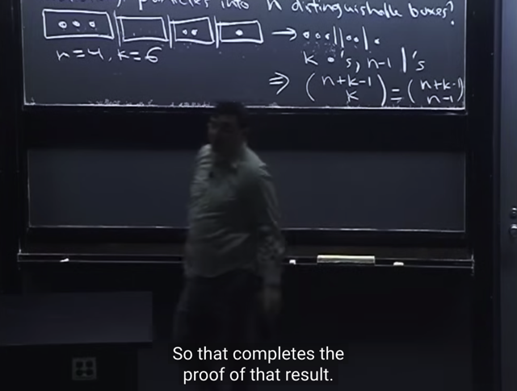</kbd>

> [!NOTE]
> Đại khái là việc chứng minh đã coi như xong một nửa khi ta đã vẽ ra như vầy.
>
> Khi đó, từ bài toán [có mấy cách bỏ **k banh trắng giống nhau** vào **n hộp khác nhau**] ta
> có thể coi nó giống như bài toán [có mấy cách **sắp xếp k banh trắng và n-1 "vách ngăn",
> và tất cả banh, vách ngăn đều giống nhau**]
>
> Vậy thì để trả lời, đầu tiên ta cũng giả sử đánh số cho mọi banh trắng và vách ngăn Tức là
> có phân biệt các viên bi, ví dụ như coi như có đánh số các viên bi, và cũng phân biệt các
> vách ngăn luôn. Thì khi đó ta sẽ có**(k+n-1)! hoán vị**.
>
> Sau đó vì ta không care thứ tự hoặc phân biệt các viên bi ta sẽ **CHIA BỚT CHO K!** (ĐÂY
> LÀ  HÀNH  ĐỘNG SỬA CHỮA KHI OVERCOUNTING) là **số hoán vị của bi** và **CHIA
> BỚT CHO (N-1)!** là **số hoán vị của các vách** ngăn.
>
> Để kết qủa là **(k+n-1)!/[k!(n-1)!]** **(1).**Và đây chính là**(k + n - 1 choose k),** và đương
> nhiên cũng bằng **(k + n - 1 choose n - 1)**
>
> Còn đáp án của thầy B còn có thể lập luận theo cách khác: Đó là ta **coi mọi viên bi là
> giống nhau và  mọi vách ngăn là giống nhau hết**, ta **chỉ quan tâm cách sắp xếp** của
> chúng. Thì từ một **set k viên bi và n-1 vách ngăn**, ta**cần sắp vào k + n - 1 chỗ trống**.
>
> Vậy thì khi đó, cứ bỏ k viên bi vào k chỗ trống xong thì n-1 chỗ trống còn lại là dành cho n-1
> vách ngăn. Hoặc ngược lại, cứ bỏ n-1 vách ngăn vào n-1 chỗ trống thì còn lại k chỗ để bỏ
> bi.
>
> Vậy bài toán **MỘT LẦN NỮA** trở thành**CÓ MẤY CÁCH CHỌN SET K CHỖ TRỐNG**
> (để bỏ bi) **TỪ (K+N-1) CHỖ TRỐNG**, ĐƯƠNG NHIÊN, **TA KHÔNG CARE THỨ TỰ**
> CỦA CHỖ TRỐNG. Thì hiểu như vậy sẽ dễ thấy nó chính là (**K+N-1 CHOOSE K)**
>
> Và như ví dụ hồi nãy ta biết rằng số cách chọn k chỗ trống cho viên bi thì cũng sẽ có bấy
> nhiêu cách chọn n-1 chỗ trống cho vách ngăn. Thể hiện cụ thể qua việc ta đã thấy (n
> choose k) = (n choose n-k). Nên ở đây
>
> (k+n-1 choose k) cũng chính là (k+n-1 choose n-1)
>
> Vậy kết quả là (k+n-1 choose k)  cũng bằng (k+n-1 choose n-1) **(2)**
>
> Theo công thức (n choose k) = n!/[(n-k!)k!] thì (k+n-1 choose k) sẽ là:
>
> (k+n-1)! / [(k+n-1-k)!(k!)] = **(k+n-1)!/[(n-1)!k!] và nó GIỐNG KẾT QUẢ TRÊN (1)
>
> VÀ ĐÂY LÀ CHỨNG  MINH XONG**

> [!NOTE]
> Với kiến thức sau khi đọc thêm về cũng ví dụ này nhưng trong sách Casella,
> mình có thể giải thích lại như sau:
>
> Bài toán đặt ra ở đây là đếm số cách chọn k item từ n item theo lối sampling
> có hoàn lại nhưng không care thứ tự.
>
> Ví dụ n = 10, k = 5. Cho rằng có 10 banh đánh số từ 1,..10 trong lọ
>
> (A) Không hoàn lại + có care thứ tự
>
> + Vì là không hoàn lại nên ta sẽ có các ví dụ 13567, 54678, KHÔNG THỂ CÓ
> có 12233).
>
> + Có care thứ tự nên coi 13567 và 15376 là HAI CÁI KHÁC NHAU.
>
> Do đó, ta làm theo 2 bước:
>
> 1) Đếm số tổ hợp (không quan tâm thứ tự) 5 banh khác nhau từ 10 banh:
>
> ⇨ (10 choose 5).
>
> 2) Với mỗi tổ hợp, có 5! hoán vị (cách sắp thứ tự)
>
> Dựa vào step rule, mỗi tổ hợp (dù là {1,2,3,5,6} hay {2,4,7,8,9}..) đều sẽ có 5!
> hoán vị. Nên kết quả của case này sẽ là: (10 choose 5) * 5!. Khái quát (n
> choose k) * k! = n!/(n-k)!
>
> (Ta cũng có thể đếm theo cách thứ hai là coi như tương đương bài toán: LẦN
> LƯỢT lấy từng banh trong 5 banh ra xếp vào vị trí từ 1 đến 5 để rồi ta có kết
> quả là 5*4*3*2*1. cũng là 10!/(10-5)!. Nhưng cách làm này HƠI KHÓ ĐỂ
> NHẬN RA RẰNG TA ĐÃ QUAN TÂM THỨ TỰ Ở CHỖ NÀO. Chính là khi ta
> cho vị trí thứ nhất có thể có n lựa chọn và vị trí thứ hai, có n-1 lựa chọn thì có
> nghĩa là ta đã cả tính chuỗi ví dụ như  21345 và 12345, đó chính là hành động
> có phân biệt thứ tự. Còn trong cách tính đầu tiên việc quan tâm đến thứ tự thể
> hiện rất rõ vì ta đã nhân với số hoán vị của mỗi tổ hợp)
>
> Tuy nhiên nếu vẽ ra thành dạng nhánh thì ta sẽ dễ thấy việc có care thứ tự:
>
> Tưởng tưởng từ 1 vẽ ra 10 nhánh đánh số 1,2..10 thể hiện rằng lấy bi thứ nhất có
> 10 khả năng. Từ mỗi nhánh trong 10 nhánh trên, ta lại vẽ ra 9 nhánh đánh số từ 
> 1 đến 10 chừa cái số của nhánh ra. Ví dụ từ nhánh 1 thì vẽ 9 nhánh đánh số từ 2-10
> Từ nhánh 2 vẽ 9 nhánh đánh số 1,3,4,...10. Điều này thể hiện việc chọn bi thứ hai
> ta chỉ còn 9 bi để chọn vì không còn bi mà bước trước đó đã chọn.
> Cứ tiếp tục như vậy.
>
> Khi đó ta sẽ đếm tổng số đường đi từ đầu đến cuối. Và nó chính là 10*9*8*7*6
> THÌ QUAN SÁT THẤY, TRONG SƠ ĐỒ NÀY, TA ĐÃ CÓ NHÁNH 21345 VÀ CŨNG
> CÓ NHÁNH 12345. ĐÓ CHÍNH LÀ CHO THẤY VIỆC TÍNH TOÁN ĐÃ PHÂN BIỆT
> THỨ TỰ CÁC BI (vì nếu ko ta đã không đếm cả hai mà coi chúng là một). Đồng
> thời sơ đồ cho thấy từ mỗi nhánh ở tầng một chỉ chia ra 9 nhánh ở tầng hai cho thấy  
> việc sampling là theo không hoàn lại.
>
> Còn nói về yếu tố "Không hoàn lại" thì cách đầu tiên ta dùng công thức tính
> tổ hợp (n choose k) LÀ ĐÃ PHẢN ÁNH ĐIỀU NÀY, VÌ KHI CHỌN TỔ HỢP THÌ
> KHÔNG CÓ CHUYỆN CÓ BỘ {1,1,3,3,7}, MÀ NÓ ĐÃ ĐANG TÍNH SỐ CÁCH
> CHỌN BỘ 5 BANH KHÁC NHAU RỒI. Còn trong cách thứ hai, yếu tố này phản
> ảnh trong việc KHO CHỌN BANH ĐẦU TIÊN CÓ N CÁCH CHỌN
>
> (B) Không hoàn lại + ko care thứ tự
>
> Với case B này thì nếu ta đã tính case A theo cách thứ nhất, thì nay vì không quan
> thứ tự nữa nên ta bỏ cái bước nhân với số hoán vị 5 banh của mỗi tổ hợp đi thôi.
> Và kết qủa của bài toán này chính là số tổ hợp 5 banh trong 10 banh: (10 choose 5)
> Khái quát (n choose k)
>
> Còn nếu ta tính theo cách thứ hai (mà trong đó như đã nói ta đã ngầm ẩn chứ việc
> quan tâm thứ tự) thì nay ta sẽ phải adjust / điều chỉnh. Bằng cách lập luận rằng:
>
> Trong kết quả tính ở case A, theo cách hai: 10*9*8*7*6, ta đã có quan tâm đến thứ
> tự của mỗi bộ 5 banh, có nghĩa là, với mỗi bộ 5 banh không care thứ tự, ta đã nhân
> thêm 5! lần. Vậy để điều chỉnh, ta sẽ phải chia 10*9*8*7*6 cho 5!. Kết quả là:
>
> [n!/(n-k)!] / k!, và cái này chính là  (n choose k)
>
> VẬY CÓ NHẬN XÉT, VIỆC ĐẾM CASE A THEO CÁCH THỨ 2 KHIẾN TA KHÓ HIỂU
> HƠN CÁCH THỨ NHẤT xuất phát từ việc ta phải ngầm ẩn hiểu về việc có care thứ
> tự

> [!NOTE]
> C) Có hoàn lại + có care thứ tự
>
> D) Có hoàn lại + không care thứ tự
>
> +) Giờ có hoàn lại, nên có thể có kết quả 22331; 12132, thậm chí 88888 
> (có thể gặp lại nhiều lần một banh nào đó)
>
> +) Nếu có care thứ tự (C) thì 22331 sẽ coi như khác với 23231, và 33221
>
> +) Nếu không care thứ tự (D), thì 22331 sẽ coi như giống 23231, và 33221
>
> Tính case C:
>
> Để làm case này, thì cần nhận ra rằng việc có hoàn lại khiến các bi có thể
> lặp lại trong mỗi possible outcome khiến sẽ rất khó nếu ta dùng cách thức
> tiếp cận bằng cách đếm tổ hợp bi, vốn dựa trên sampling không hoàn lại.
> Nên sẽ dễ hơn nếu ta theo cách làm thứ hai của case A: Vẽ nhánh. Như đã
> nói, việc vẽ nhánh đã ngầm ẩn việc quan tâm thứ tự rồi. Như đã phân tích
> lúc nãy. Bây giờ, với việc có hoàn lại, thì sơ đồ chỉ cần chỉnh lại là từ mỗi
> nhánh của tầng một, ta có thể có 10 nhánh thay vì 9, vì không còn cần phải
> tránh bi đã bốc ở bước một nữa. Do đó dễ thấy kết quả sẽ là 10*10*10*10*10
> = 10^5, khái quát: 10^k
>
> ====
>
> Ta tính trường hợp D:
>
> Đầu tiên có thể thấy, ta quan tâm số loại banh khác nhau có thể xuất hiện
> trong 5 banh: Ví dụ 22331 và 23231 đều có banh {1,2,3} xuất hiện, còn
> 88888 chỉ có banh {8} Vậy thì từ 10 banh, có thể có (10 c 1) + (10 c 2) + ...
> (10 c 5) tổ hợp banh có thể xuất hiện. Và vì ta không quan tâm thứ tự
> nên ta coi 22331 giống 23231 và chỉ tính nó là 1 - đại diện bởi tổ hợp {1,2,3}
>
> Cũng như 99988 cũng coi như 88999 hay 89899, và được đại diện bởi tổ
> hợp {8,9}.
>
> \~Vậy kết quả sẽ là số tổ hợp đại diện: (10 c 1) + (10 c 2) + ...(10 c 5)
>
> \~Cách lập luận này SAI, vì nói 88999 và 89899 được đại diện bởi tổ hợp {8,9}
> là SAI. VÌ NHƯ VẬY 88889 CŨNG ĐẠI DIỆN BỞI TỔ HỢP {8,9} TỪ ĐÓ TA
> COI 88889 VÀ 88999 LÀ MỘT / NHƯ NHAU. ĐIỀU NÀY SAI, vì tuy không
> care thứ tự nhưng 88889 có {4 con 8, 1 con 9}, NÓ KHÁC 88899 là {3 con 8,
> 2 con 9}.
>
> Do đó phải đếm số cấu hình ví dụ như từ tổ hợp {8,9} thì có bao nhiêu cấu 
> hình? ví dụ như {1 con 8, 4 con 9}, {2 con 8, 3 con 9},....
>
> Ta sẽ đếm số cấu hình ở note sau

> [!NOTE]
> Đầu tiên ta tính số cấu hình.
>
> Tức là ta tính số lượng các case ví dụ như:
>
> (2 con 4, 1 con 7, 2 con 9) 
> (2 con 4, 2 con 5, 1 con 10
> (5 con 8)
>
> Cấu hình (2 con 4, 1 con 7, 2 con 9)  sẽ đại diện cho tất cả những possible outcomes 
> có dạng {4,4,7,9,9} bao gồm 44799, 47499, 97944,....tức là ta chỉ quan tâm những
> con số xuất hiện, không quan tâm thứ tự của chúng.
>
> Cấu hình (5 con 8) sẽ đại diện cho số 88888
>
> Thế thì để đếm số cấu hình này ta sẽ chuyển đổi bài toán để coi:
>
> (2 con 4, 1 con 7, 2 con 9) = [có 2 viên đá trong ô số 4, 1 viên trong ô số 7, 1 viên trong ô số 9]
> (5 con 8) = [có 5 viên trong ô 8]
>
> Để rồi ta xét thử nghiệm: Chọn cách sắp xếp 5 viên đá giống nhau vào 10 ô đánh số 1,2..10
>
> và đơn giản hóa  như sau bằng cách coi như đây là hoán vị của 9 vách ngăn giống nhau | và
> 5 viên đá giống nhau v: 
>
> [có 2 viên đá trong ô số 4, 1 viên trong ô số 7, 1 viên trong ô số 9] = | | |v v| | | v | | |
>
> [5 viên trong ô 8] =  | | | | | | | v v v v v | |
>
> Vậy thì để đếm cái này, ta sẽ:
>
> Coi mọi viên và vách đều khác nhau trước để đếm số hoán vị của cả đám: (9 + 5)!
>
> Sau đó ta điều chỉnh / sửa sai bằng cách chia số hoán vị của đá, và của vách:
>
> (9 + 5)! / (9!5!) 
>
> Và đây chính là số cấu hình, như đã nói mỗi cấu hình đại diện cho một possible outcomes
> khi ta tính case D này: có hoàn lại, ko care thứ tự. 
>
> nên kết quả khái quát là (n + k -1)! / (n-1)!k! = **(n +k - 1 choose k)**

 

<kbd>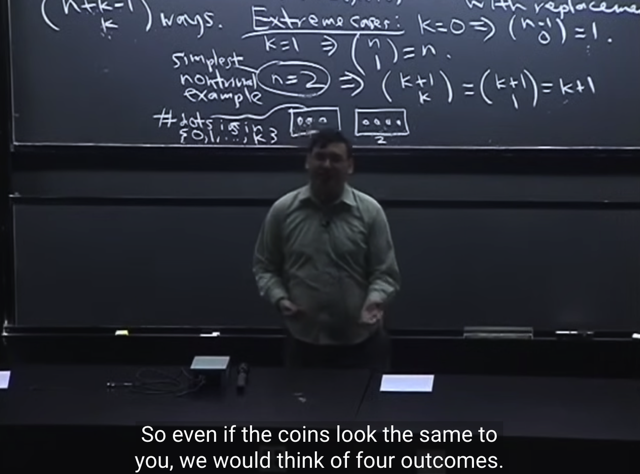</kbd>

> [!NOTE]
> Gs quay lại nói về n = 2 một chút. Đại ý rằng, giả sử ta có 2 coin. Thì
> khi tung, ta có 4 possible outcome có tính chất equally likely.
>
> Và giả sử như ta không phân biệt được 2 coin, thì về mặt nhận thứ ta
> vẫn có thể tự gán cho chúng label coin 1, coin 2.
>
> Hoặc coi như / chuyển thử nghiệm thành tung một coin 2 lần.

 

<kbd>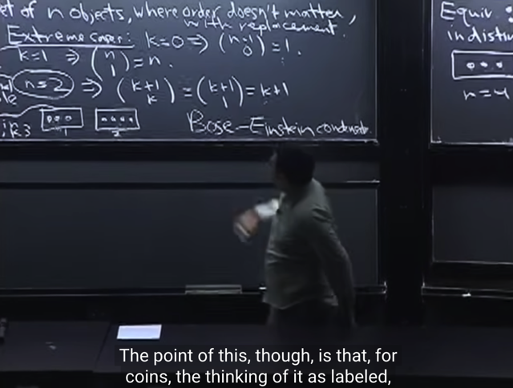</kbd>

> [!NOTE]
> gs nói sơ về câu chuyện về Bose-Einstein, có thể đọc thêm
> trong sách, không quan trọng

 

<kbd>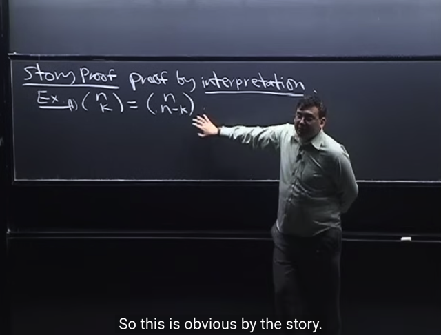</kbd>

🔗 **Related:** [-TÓM TẮT:   Bài toán Toy Collector:  Tìm expected value của số lần đi ăn để có đủ n loại  - EX = n(1 + 1/2 + 1/3 + ...1/n) ≈ ln(n) + γ  - CHỨNG MINH PART 2 CỦA UNIVERSALITY  - Cho X, Y, Z là các i.i.d positive random variable. Bài toán là tìm E(X / (X + Y + Z)). Nhờ symmetry tính ra rất dễ = 1/3  - Gặp lại LOTUS - Law of The Unconscious Statistician với bài toán cho X = U^2 với U~Unif(0,1), Y = e^x tìm E(Y), câu hỏi yêu cầu đáp án ở dạng  tích phân  - Để tìm PDF ta sẽ tìm CDF trước, lấy derivative của CDF là có PDF.  Và để tìm CDF ta sẽ dùng định nghĩa của nó để mà xây dựng lên  - X ~ Binomial (n, p), cần tìm distribution của n-X: n-X là một Bin(n, q) theo 2 cách  -Xây dụng PDF của Exp(λ): T (Thời gian chờ đến khi có email đầu tiên) là một Expo(λ) r.v: f(t) = (1-e^(-λ*t))' =  λ*e^(-λt)](_tóm_tắt_bài_toán_toy_collector_tìm_expected_value_của_số_lần_đi_ăn_để_có_đủ_n_loại_ex_n1_12_13_1n_l.md#node-481)

> [!NOTE]
> đại khái là Story proof nôm na là "dạng chứng minh bằng cách giải thích"
> thay vì chứng minh "bằng tính toán".
>
> Và ví dụ hồi nãy khi ta dùng lập luận rằng, giả sử **có n item khác nhau**,
> **mỗi một cách chọn k item** thì **cũng là một cách chọn n-k item còn lại**.
> Nên số cách chọn k item từ n items cũng bằng số cách chọn bộ n-k item
> từ n items. Do đó (n choose k) = (n choose n-k)
>
> Và đó là story proof - chứng minh bằng story / interpretation.
>
> Nó khác với việc chứng minh bằng tính toán ví dụ như lắp công thức
> (n choose k) vào hai vế ta sẽ có kết quả. Nhưng việc chứng minh bằng
> story giúp ta hiểu vấn đề tốt hơn trong xác suất

> [!NOTE]
> CHỨNG MINH (n choose k) = (n choose n-k) BẰNG STORY PROOF

 

<kbd>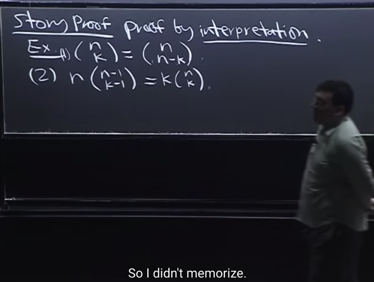</kbd>

> [!NOTE]
> gs lấy ví dụ 2 là công thức này mà ông chia sẽ là chính ông cũng
> không nhớ nhưng ông có thể ghi ra lại công thức nhờ vào "lập luận"
> (story proof ta có thể hiểu là việc chứng minh bằng lập luận)

> [!NOTE]
> CHỨNG MINH n(n-1 choose k-1) = k(n choose k) BẰNG STORY PROOF

 

<kbd>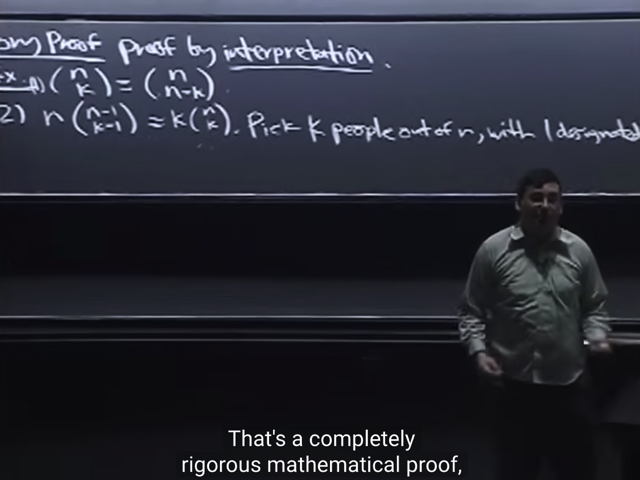</kbd>

🔗 **Related:** [TÓM TẮT:  Tiếp tục về CDF: Định nghĩa của CDF  Bước nhảy của CDFD là giá trị PMF tại đó  Tính chất của CDF: 1) Non decreasing, 2) right continuous và   3) F(x) -> 0 khi x -> -infinity, F(x) -> 1 khi x -> -infinity  - Định nghĩa Independent random variables theo independent event:  X, Y độc lập khi  + Continuous rv: P(X≤x, Y≤y) = P(X≤x) * P(Y≤y) với mọi x, y   + Discrete rv: P(X=x,Y=y) = P(X=x)*P(Y=y)  - Expected value: Là con số tóm tắt distribution của r.v  - Hai cách tính average  - E(X) = Σx x*P(X=x)  - X ~ Bern(p) thì E(X) = p  - FUNDAMENTAL BRIDGE: E(X) = P(A), X là indicator rv mang giá trị = 1 khi event A xảy ra và 0 khi ngược lại  - X ~ Bin(n, p):  E(X) = ∑ k=0,1..n [ k * (n choose k)*p^k*q^(n-k)] = ..= np  - TÍNH LINEARITY CỦA AVERAGE  - Tính lại E(X) của Bin(n, p) nhanh hơn bằng linearity, fundamental bridge và E(X) của Bern(p)  - TÍnh E(X) của Hypergeometric Dù các trial không độc lập nhưng dùng Symmetry, linearity, fundamental bridge vẫn tính được  - X ~ Geom(p): P(X=k) = q^k*p  - E(X) = p Σ k=0:infinity [k * q^k]](tóm_tắt_tiếp_tục_về_cdf_định_nghĩa_của_cdf_bước_nhảy_của_cdfd_là_giá_trị_pmf_tại_đó_tính_chất_của_cd.md#node-245)

> [!NOTE]
> Và lập luận đó là: Nếu có NHÓM N NGƯỜI (khác nhau),
> và ta PHẢI CHỌN K NGƯỜI, SAU ĐÓ CHỌN 1 NGƯỜI LÀM
> CHỦ TỊCH. Thì có mấy cách chọn?
>
> => Ta có thể tiến hành 2 bước (theo step rule hay multiplication
> rule): 
>
> Bước 1: Chọn nhóm k người trong n người: Ta có (n choose k)
> như đã biết.
>
> Bước 2: Chọn 1 người trong đó làm chủ tịch: Ta có k lựa chọn.
>
> Vậy theo step rule ta có **(n choose k)*k**
>
> Nhưng cũng bài toán chọn chủ tịch này ta có thể tính theo thứ
> tự ngược lại:
>
> Bước 1: Chọn 1 người làm chủ tịch: Có n lựa chọn.
>
> Bước 2: Chọn k-1 người để bỏ vào nhóm để thành nhóm k người
> với ông chủ tịch: Thì dễ thấy còn lại n-1 người, và cần chọn k-1 người 
>
> -> có (n-1 choose k-1) 
>
> Vậy kết quả là**n*(n-1 choose k-1)
>
> Vậy 
>
> k(n choose k) = n(n-1 choose k-1)**

 

<kbd>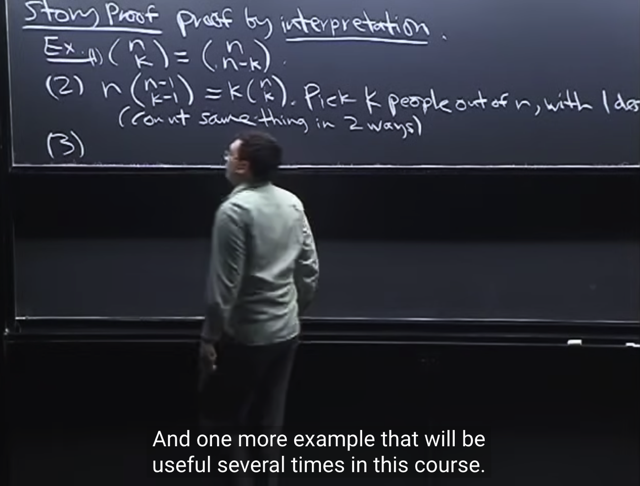</kbd>

> [!NOTE]
> và đó là cách thứ 1 để story proof: ĐẾM
> MỘT THỨ THEO 2 CÁCH

 

<kbd>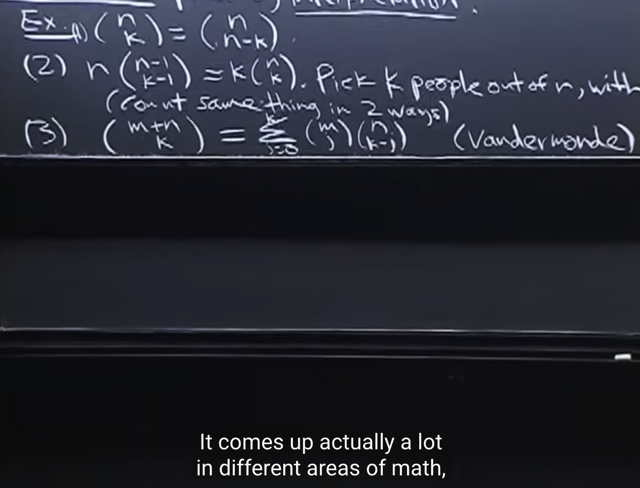</kbd>

> [!NOTE]
> Ví dụ thứ 3 là công thức có tên **Vandermonde**. Được dùng nhiều trong xác
> suất và các lĩnh vực khác.
>
> **(m+n choose k) = Tổng j=0:k (m choose j) * (n choose k-j)**
>
> Và ông cho rằng nếu mà phải chứng minh nó bằng tính toán thì sẽ rất rắc rối

> [!NOTE]
> CHỨNG MINH VANDEMRMONDE BẰNG STORY PROOF

 

<kbd>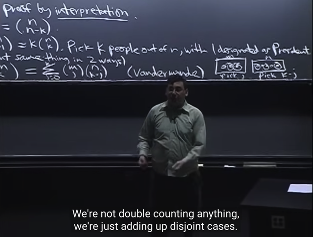</kbd>

🔗 **Related:** [TÓM TẮT:  - Tiếp tục Binomial distribution: 3 cách hiểu về rv ~ Bin(n, p)  - Định nghĩa về i.i.d  - CDF  - PMF cho Discrete random variables  - 2 tính chất để function là một valid PMF  - Binomial theorem  - Chứng minh X ~ Bin(n, p) và Y ~ Bin(m, p) thì (X+Y) ~ Bin(n+m, p)  Theo 3 cách  - Tìm PMF của X = số con xì khi sampling 5 lá từ bộ bài  - Khi sampling không hoàn lại thì X không phải là Binomial mà là HyperGeometric](tóm_tắt_tiếp_tục_binomial_distribution_3_cách_hiểu_về_rv_binn_p_định_nghĩa_về_iid_cdf_pmf_cho_discre.md#node-209)

> [!NOTE]
> Thế thì ta xem xét vế trái: Đương nhiên nó là **số cách chọn set k người từ set
> m+n người**: có (m+n choose k) cách chọn
>
> Vậy thì ta có thể **đếm cái này bằng cách khác**: bằng cách cho rằng có 2 nhóm: 
> nhóm A m người và nhóm B có n người.
>
> Thế thì để có k người, ta có thể lấy j người từ nhóm A: có (m choose j) cách,
> và k-j người từ nhóm B: có (n choose k-j) cách -> theo step rule ta sẽ có:
>
> (m choose j)*(n choose k-j) cách.
>
> Và đương nhiên ta có thể chọn j khác nhau từ 0 (chỉ lấy từ nhóm B) đến k (chỉ
> lấy từ nhóm A): Và các lựa chọn này đến từ k cách chọn không chồng lấn nhau, 
> nên theo**sum rule:**
>
> Tổng j=0:k [(m choose j)*(n choose k-j)]
>
> Do đó (**m+n choose k) = Tổng j=0:k [(m choose j)*(n choose k-j)]**
>
> Đó chính là story proof, chứng minh xong. MÀ THEO GS CHỈ CẦN VẦI DÒNG
> TRONG KHI NẾU DÙNG TÍNH TOÁN THÌ SẼ RẤT DÀI

 

<kbd>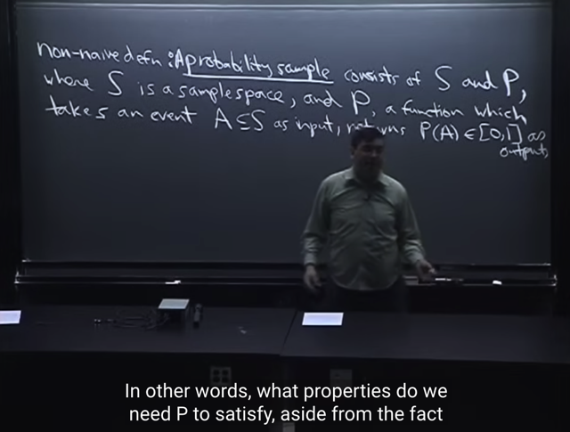</kbd>

🔗 **Related:** [TÓM TẮT:  - Tiếp tục Binomial distribution: 3 cách hiểu về rv ~ Bin(n, p)  - Định nghĩa về i.i.d  - CDF  - PMF cho Discrete random variables  - 2 tính chất để function là một valid PMF  - Binomial theorem  - Chứng minh X ~ Bin(n, p) và Y ~ Bin(m, p) thì (X+Y) ~ Bin(n+m, p)  Theo 3 cách  - Tìm PMF của X = số con xì khi sampling 5 lá từ bộ bài  - Khi sampling không hoàn lại thì X không phải là Binomial mà là HyperGeometric](tóm_tắt_tiếp_tục_binomial_distribution_3_cách_hiểu_về_rv_binn_p_định_nghĩa_về_iid_cdf_pmf_cho_discre.md#node-199)

> [!NOTE]
> Đại khái là ta sẽ qua **Non-naive definition** của xác suất:
>
> Đầu tiên làm quen với probability sample, nó sẽ bao gồm hai khái niệm:
>
> S: Là sample space mà ta đã gặp - tập hợp**mọi possible outcomes** và
> trong **naive** definition, ta cho rằng **mọi possible outcome đều có khả năng
> xảy ra như nhau (equally likely)**, còn bây giờ thì không như vậy nữa, mà
> dẫn tới có thêm khái niệm P sau đây
>
> P: **Là một function**, nhận input là **một event A** thuộc sample space S (gọi là
> A là subset của S) và output ra **xác suất xảy ra của event A - P(A)**
>
> Và **xác suất này có range [0:1]**

 

<kbd>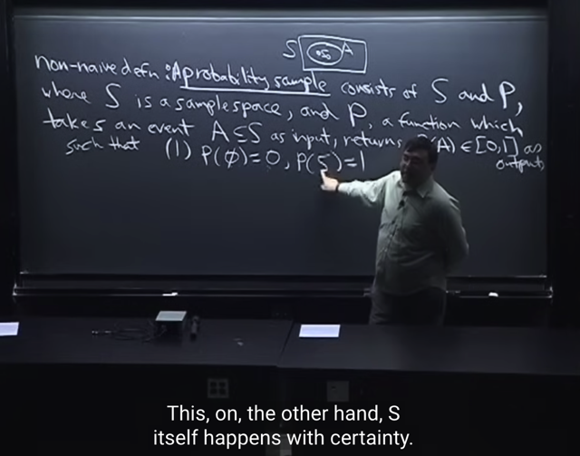</kbd>

> [!NOTE]
> tiếp, đại khái là gs cho biết dù xác suất có phức tạp thì thật ra nó **chỉ dựa trên
> vài Axiom (tiên đề)**.
>
> Axiom 1a): **P(empty set) = 0**
>
> Ta hiểu đại khái là: gs giải thích ta có sample space S (hình chữ nhật), và A là
> subset của S (hình oval). Thế thì gọi **S_0 là một possible outcome**.
>
> Thế thì **nếu S_0 thuộc event A, thì ta nói là event A xảy ra.**
>
> Vậy thì P(rỗng) ám chỉ **xác suất của "event rỗng"**, mà theo định nghĩa vừa rồi,
> đó là khi **S_0 thuộc subset rỗng**, mà điều này **đương nhiên là không thể xảy
> ra vì đã nói subset là rỗng rồi**, thì **dù mọi possible outcome S_0 đều không**
> **nằm trong subset rỗng.**
>
> Do đó **event rỗng không thể xảy ra -> P(rỗng) = 0**
>
> ===
>
> Axiom 1b) P(S) = 1: Lập luận như trên S đã bao gồm mọi possible outcome, nên
> S_0 luôn phải xuất hiện trong S, nên **xác suất "event S"** xảy ra là 100%

 

<kbd>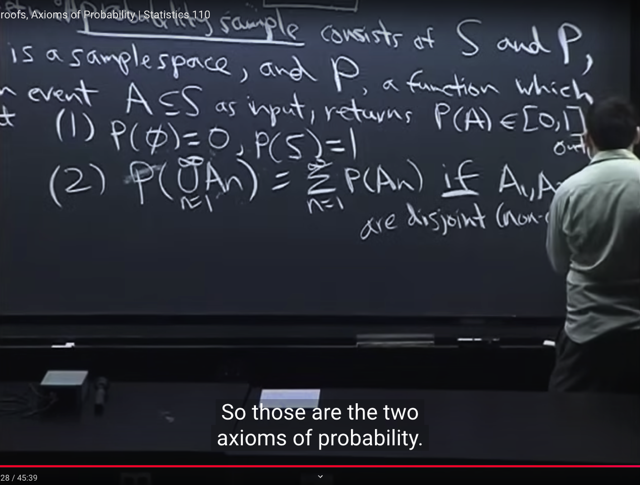</kbd>

> [!NOTE]
> Axiom 2): diễn đạt bằng lời là **xác suất của Union của n disjoint event An** 
> sẽ bằng **tổng xác suất của các event An** (disjoint: không chồng lấn nhau)
>
> Thế thì ông cho rằng **dựa vào 2 Axiom này ta có thể derive mọi theorem**

 

