# Lec 30: Chi-square, Student-t, Multi-variate Gaussian

📊 **Progress:** `24` Notes | `23` Screenshots

---
<a id="node-913"></a>

<p align="center"><kbd>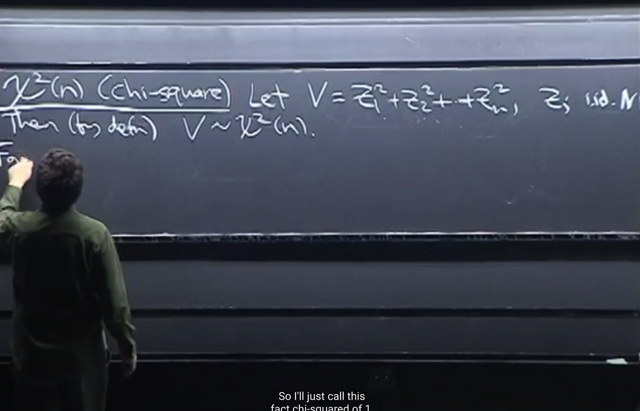</kbd></p>

> [!NOTE]
> Đại khái là ta sẽ biết về **Chi-Square** distribution: **V= `Σi=1:n` Zi^2** với **Zi
> ~ N(0,1)** khi đó ta sẽ có **V ~ Χ^2(n)**(kí tự giống như chữ X kiểu  là kí tự
> Chi `-` đọc là "cai")
>
> Gs cho biết**trong statistic** có**nhiều khi** ta **dùng các bình phương** của
> các đại lượng và **chúng iid**. Khi đó ta có **Chi-Square distribution**

> [!NOTE]
> ```text
> Chi-Square distribution: V= Σi=1:n Zi^2 với Zi
> ```
> ~ N(0,1) khi đó ta sẽ có V ~ `Chi-Square(n)`

<br>

<a id="node-914"></a>

<p align="center"><kbd>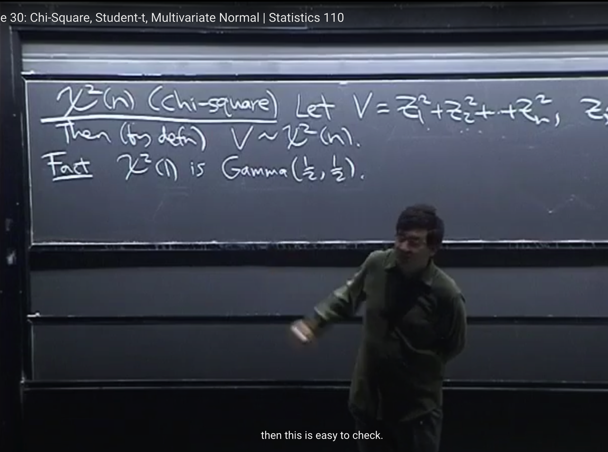</kbd></p>

> [!NOTE]
> **Chi-Square X^2**(1) đương nhiên là **chỉ có 1 Standard Normal rv**
> **bình phương**lên. Thì gs cho biết nó **thật ra** chính là một **Gamma(1/2, 1/2)**.
>
> Đại ý là ta có thể **đổi biến** để **chứng minh PDF của nó là Gamma
> PDF** có điều gs lưu ý là khi **bình phương** ta sẽ**cần để ý function sẽ
> có lúc tăng, lúc giảm**
>
> Vì ta đã**check các properties** của **Gamma** trong bài trước để thấy rằng nó
> **có nhiều ưu điểm** nên **Chi-Square (1)** cũng vậy

<br>

<a id="node-915"></a>

<p align="center"><kbd>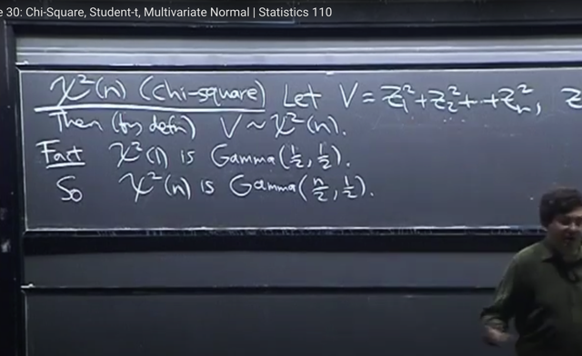</kbd></p>

🔗 **Related:** [LEC 25: ORDER STATISTIC & CONDITIONAL EXPECTATION](untitled.md#node-772)

> [!NOTE]
> Thế thì đại khái là bài trước ta đã biết, **nếu X1 ~ Gamma(a, n)**, **X2 ~
> Gamma(b, n)** thì **X1 `+` X2 ~ Gamma(a `+` b, n)** (link dẫn tới phần chứng minh
> bằng Story Proof) mà ta cũng dễ dàng chứng minh bằng story đại khái là
> **Gamma(a, λ)** random variable có story là**tổng a Expo(λ) random variables
> Gamma(b, λ)**random variable****có story là**tổng b Expo(λ) random variables**nên t**ổng của Gamma(a, λ) và Gamma(b λ)** sẽ là **Gamma(a `+` b, λ)**
>
> Đại khái là **thời gian chờ đến khi được phục vụ của người thứ a trong line** là
> tổng của **a khoảng thời gian** tuân theo **Expo(λ)**, và tổng thời gian sẽ ~**Gamma(a, λ)** 
> distribution.
>
> Do đó tổng của hai **Gamma(a, λ) và Gamma(b, λ)** có ý nghĩa là **tổng thời gian
> chờ đến lượt mình** của một line có `a+b` người, do đó **về mặt ý nghĩa nó sẽ
> tuân theo `Gamma(a+b,` λ)**
>
> Thế thì đây **Chi-Square (1) ~ `Gamma(1/2,` 1/2)**, còn **Chi Square(n)** theo định
> nghĩa là**tổng của n Zi^2**, tức là**tổng của n `Chi-Square` (1)**.
>
> Do đó dễ thấy distribution của nó sẽ là **Gamma(n/2, 1/2)**

> [!NOTE]
> `Chi-Square` (1) chính là `Gamma(1/2,` `1/2)`
>
> `Chi-Square` (n) chính là `Gamma(n/2,` `1/2)`

<br>

<a id="node-916"></a>

<p align="center"><kbd>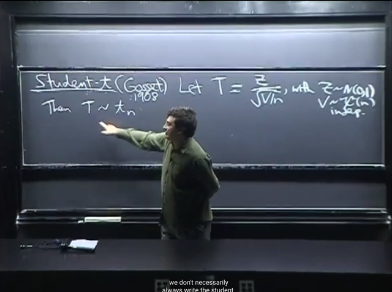</kbd></p>

> [!NOTE]
> Ta qua một **distribution** có **liên quan đến Normal** cũng nổi tiếng là
> **Student-t**.
>
> Đầu tiên gs đại khái là **kể câu chuyện** về **cái tên Student-t**, đại ý là
> một nhà  **statistician** muốn d**ấu tên** nên gọi distribution này là như
> vậy. Nói chung không quan trọng lắm.
>
> Thế thì gọi **T `=` Z `/` √(V/n)** trong đó **Z ~ N(0,1)**. **V ~ Chi-Square(n)**
> khi đó ta sẽ có **T ~ `t_n` `(Student-t` distribution)**
>
> Gs cho biết **n** gọi là **DEGREE OF FREEDOM** (bậc tự do), ở đây gs
> cho rằng ta **chỉ cần hiểu nó là một parameter.**
>
> Cụ thể là **tổng số hạng tử của Chi-Square** r.v V 
>
> (ta đã biết `Chi-Square(n)` rv có story là tổng của n Xj^2 bới Xj ~ N(0,1)
> mà bản thân mỗi Xj^2 là một `Chi-Square(1),` cũng là `Γ(1/2,1/2))`

> [!NOTE]
> T `=` Z `/` `√(V/n)` 
>
> trong đó Z ~ N(0,1). V ~ `Χ-Square(n)` khi đó ta sẽ có 
>
> T ~ `t_n` `(Student-t` distribution)

<br>

<a id="node-917"></a>

<p align="center"><kbd>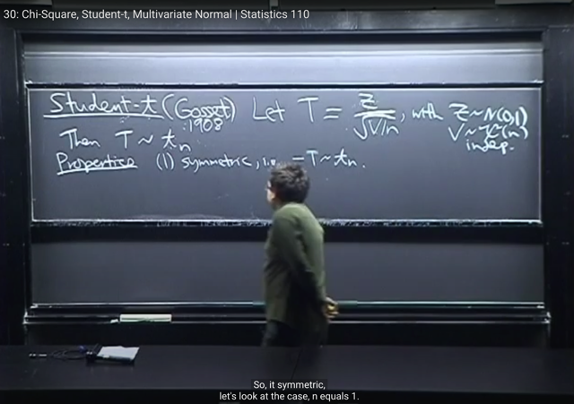</kbd></p>

> [!NOTE]
> **Một số tính chất** của `Student-t.` đầu tiên là **Symmetric**: 
>
> Đại khái là vì **T `=` Z `/` √(V/n)** thì trong đó: 
>
> **Z là N(0,1)** thì ta biết rằng **nó đối xứng**, nên `-Z` cũng ~ N(0,1). 
>
> Và còn **chia cho √(V/n)** là **số dương** nữa. Nên nó có tính **Symmetric** có
> nghĩa là nếu **T ~ t_n** thì **-T cũng ~ t_n**

<br>

<a id="node-918"></a>

<p align="center"><kbd>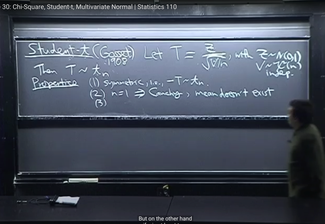</kbd></p>

> [!NOTE]
> Với **n `=` 1**, thì mẫu số ta có **V** với V là `Chi-square(1)` `-` chỉ là **bình
> phương của một Z1~N(0,1)
>
> Nên √V sẽ là** r.v là **giá trị tuyệt đối (?) của Z1**, mà vì N(0,1) **symmetric**,
> nên ta biết cả **Z1 và -Z1** đều ~ **N(0,1)**. Nên **|Z1| cũng ~ N(0,1)**.
>
> Vậy lúc này T là **tỉ số của hai N(0,1) r.v.s**
>
> Đây chính là **Cauchy** distribution mà ta đã học.
>
> Và ta cũng biết là, với **Cauchy distribution** thì **mean** của **nó không tồn
> tại** cũng như **variance không có giá trị hữu hạn**

<br>

<a id="node-919"></a>

<p align="center"><kbd>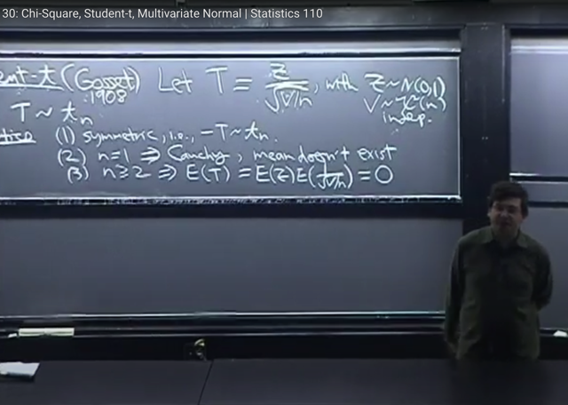</kbd></p>

> [!NOTE]
> Với **n lớn hơn 1** thì ta có tính chất là **E(T) `=` 0**. Đại khái là **tuy ta không thể
> có vụ `E(A/B)` `=` E(A)/E(B).**
>
> Nhưng ở đây, vì **Z** và **1/√(V/n) ĐỘC LẬP** (do các r.v Z và V độc lập) nên ta có
> thể có **E(Z * `(1/√(V/n))` `=` `E(Z)` * E(1/√(V/n))**
>
> Và **E(Z) `=` 0**.
>
> Gs nói lí do c**hỉ xét n>=2** là vì với **n=1, thì T là Cauchy**, nó **không có mean**.
>
> Và **t1 không có 1st moment**, **t2 không có 2nd moment**, **t3 không có 3rd
> moment...**

<br>

<a id="node-920"></a>

<p align="center"><kbd>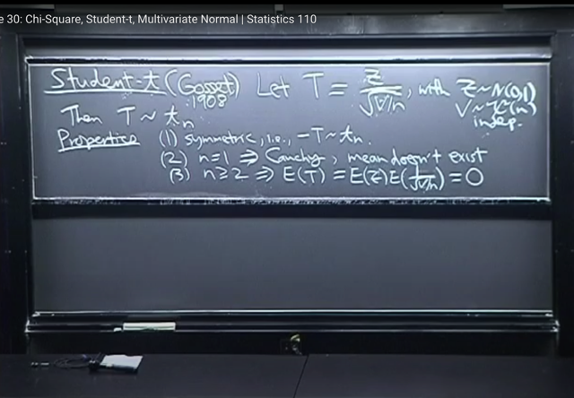</kbd></p>

> [!NOTE]
> đại khái là với **odd moment** thì **đều bằng 0**, đây là vì **tính symmetric** giống như
> ```text
> N(0,1) mà cũng dễ thấy là ví dụ E(T^3) = E(Z^3)*E[(1/√(V/b))^3] thì E(Z^3) là
> ```
> odd moment của N(0,1), nên bằng 0
>
> Còn với even moment, gs cho rằng nếu có tồn tại thì cũng dễ tìm nhờ LOTUS

<br>

<a id="node-921"></a>

<p align="center"><kbd>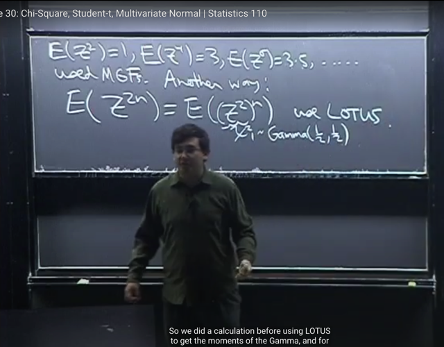</kbd></p>

> [!NOTE]
> đại khái là gs nhắc lại ta đã từng biết rằng các **even moment** của **Standard**
> **Normal** tuân theo pattern là **1,1*3, 3*5,...**
>
> Thế thì bài trước ta đã dùng **MGF** để chứng minh. Nhưng có thể có cách khác
> đó là, các event moment sẽ có dạng `E(Z^2n)` với n `=` 1,2....
>
> Thế thì bằng cách thể hiện `E(Z^2n)` `=` `E{[Z^2]^n}` thì ta có thể thấy Z^2 chính
> là tổng của 1 bình phương Standard Normal, nên nó chính là một `Chi-Square(1)`
> và ta đã biết rằng với `Chi-Square` (1) thì nó chính là `Gamma(1/2,` `1/2)` (có nghĩa 
> ```text
> là với n = 1 thì Chi-Square(n) chính là Gamma(1/2, 1/2)
> ```
>
> Vậy bài toán là tìm n moment của `Gamma(1/2,` `1/2).` Và gs cho rằng ta đã biết
> tìm moment của Gamma rất đơn giản, khi dùng LOTUS, ta sẽ thấy bên trong tích
> ```text
> phân sau khi nhập ..x^n*x^(1-a)(1-x)^(1-b).. thành x^(..)(1-x)^(1-b)...thì nó lại có
> ```
> dạng pdf của Gamma khác, và ta sẽ tìm được dễ dàng
>
> Và khi đó gs nói ta sẽ nhận ra thông qua các tính chất của Gamma để thấy kết
> quả như trên

<br>

<a id="node-922"></a>

<p align="center"><kbd>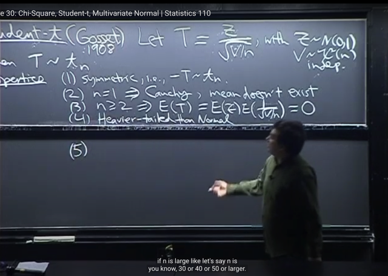</kbd></p>

> [!NOTE]
> tính chất quan trọng nữa của `Student-t` đó là nó `heavier-tailed` hơn Normal,
> tức là cái đuôi của nó nặng hơn, các sample mà ở xa mean có xác suất
> xuất hiện cao hơn.
>
> Gs lấy ví dụ của Cauchy khi n `=` 1. Thì pdf của nó là `1/pi(1+t^2)` gs cho rằng
> nó sẽ không giảm nhanh khi đi ra xa mean `(t->` inf) bằng Normal.Normal decay
> nhanh hơn nhiều

<br>

<a id="node-923"></a>

<p align="center"><kbd>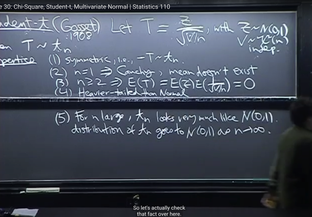</kbd></p>

> [!NOTE]
> tính chất thứ 5 là, khi n lớn đến inf thì tn sẽ trở nên giống với N(0,1)
> theo ý nghĩa là khi ta lấy limit n `->` inf cdf,pdf của nó thì nó sẽ converge
> về `cdf/pdf` của N(0,1)

<br>

<a id="node-924"></a>

<p align="center"><kbd>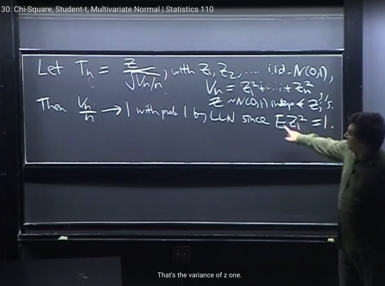</kbd></p>

> [!NOTE]
> Để chứng minh, ta xét Tn `=` `Z/sqrt(Vn/n)` với Zi iid ~ N(0,1). Z ~ N(0,1)
> independent với Zi
>
> Tức là, để chứng minh thì ta sẽ xét chuỗi số Tn với `n->` inf, và có quyền
> dùng chung một Z, bởi miễn sao các số hạng trong chuổi là Tn thôi. Thì 
> ý tưởng là ta sẽ xem Tn trở thành gì khi `n->` inf
>
> ```text
> Thế thì xét Vn/n khi n -> inf thì Vn/n sẽ -> 1 với xác suất = 1, đây là
> ```
> dựa trên Law of Large Number mà ta đã biết. Cụ thể là Vn là tổng của
> n Zi^2, sau đó chia cho n, như vậy nó là sample mean của n iid sample
> Xj^2 thì LLN nói rằng khi `n->inf` thì sample mean nó converge về true mean
> tức là theoretical mean `E(Xj^2).` Mà EXj^2 `=` 1 vì Xj ~ N(0,1) ta đã biết VarXj
> `=` 1, EXj `=` 0.

<br>

<a id="node-925"></a>

<p align="center"><kbd>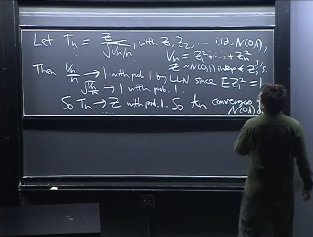</kbd></p>

> [!NOTE]
> Và do đó `sqrt(Vn/n)` cũng `->` 1 với xác suất `=` 1. Vậy Tn sẽ converge về Z với
> xác suất `=` 1.
>
> Và đấy chính là proof của việc nói rằng `n->inf` thì `tn->N(0,1)`
>
> Ta có thể hiểu đại khái là theo LLN. denominator `=` 1, nên Tn `=` Z khi `n->` inf
>
> Tóm lại khi n lớn nó trở thành Normal, còn khi n nhỏ thì nó giống Normal nhưng
> nặng đuôi hơn

<br>

<a id="node-926"></a>

<p align="center"><kbd>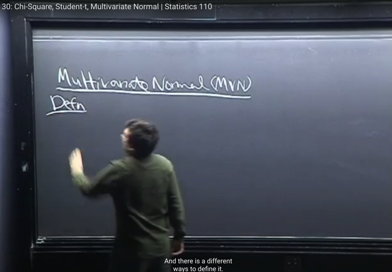</kbd></p>

> [!NOTE]
> ta qua multivariate distribution cuối cùng. Là `Multi-variate` Normal (MVN)
>
> ông nói ta có thể extend Normal qua MVN bằng cách lấy một đám normal
> r.v iid và bỏ nó vào thành một vector, và tính joint pdf của chúng. Nhưng làm
> vậy thì không interesting vì khi đó joint pdf chỉ là tích các marginal pdf (bởi
> chúng independent). 
>
> Ta sẽ interested in multivariate mà các rv có sự correlate với nhau.

<br>

<a id="node-927"></a>

<p align="center"><kbd>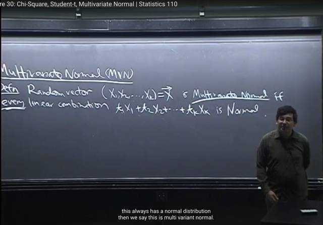</kbd></p>

🔗 **Related:** [LEC 30: CHI-SQUARE, STUDENT-T, MULTI-VARIATE GAUSSIAN](untitled.md#node-930)

> [!NOTE]
> định nghĩa đó là, xét một random vector (tức các component của vector là
> các random variables). thì X dc gọi là Multivariate Normal nếu mọi linear
> combination (mà 1806 ta đã biết là weight sum của chúng lại với các weights
> khác nhau) Tổng tjXj cũng là Normal r.v.
>
> (Đương nhiên tổng các rv Xj là một r.v)
>
> Nếu có thể tìm một linear combination nào của Xj mà ko phải Normal thì
> X không phải MVN

<br>

<a id="node-928"></a>

<p align="center"><kbd>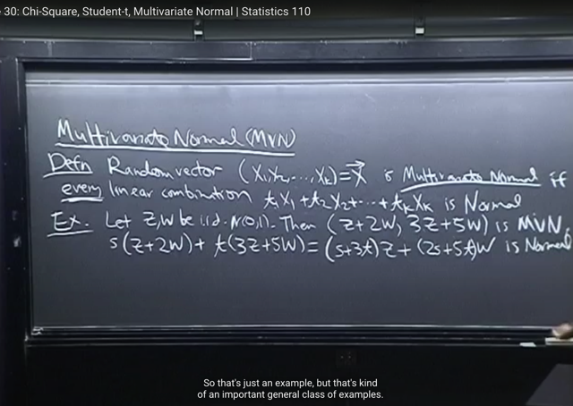</kbd></p>

> [!NOTE]
> gs lấy ví dụ cho Z, W là iid N(0,1) Thì vector `(Z+2W,` `3Z+5W)` là một MVN rv
>
> Là vì khi ta xét linear combination bất kì của hai component của vector là
> ```text
> Z+2W và 3Z+5W với coeffs s, t bất kì thì ta có (s+3t)Z + (2s+5t)W là tổng
> ```
> của hai Normal rv. Bài trước ta đã biết nó cũng là Normal.
>
> Tất nhiên ta tạo vector (Z, W) cũng đươc nhưng vậy thì ta không có MVN có
> các rv. correlate nhau

<br>

<a id="node-929"></a>

<p align="center"><kbd>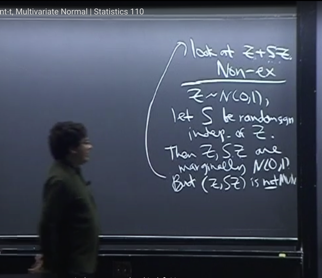</kbd></p>

> [!NOTE]
> gs cho một ví dụ không phải MVN: Cho Z là ~N(0,1), S là random sign
> (mang gía trị 1 hoặc `-1` với xác suất nào đó) independent of Z thì Z , SZ
> mình nó là N(0,1)
>
> SZ là N(0,1) vì ta biết tính đối xứng của N(0,1) nên Z và `-Z` đều là N(0,1)
>
> Tuy nhiên (Z, SZ) không phải MVN
>
> Vì ta có thể chỉ ra một linear combination của Z, và SZ không phải Normal
> mà cụ thể là `Z+SZ.` Ta sẽ thấy `1/2` thời gian nó mang giá trị Z (khi S `=` 1) và
> `1/2` còn lại nó mang giá trị 0 (khi `S=-1)` Do đó nó không thể nào là Normal
> được vì nó có dạng vừa continuous, vừa discrete

<br>

<a id="node-930"></a>

<p align="center"><kbd>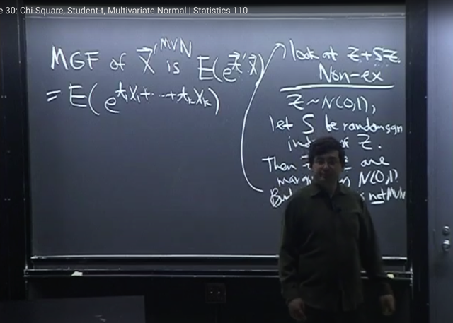</kbd></p>

🔗 **Related:** [LEC 30: CHI-SQUARE, STUDENT-T, MULTI-VARIATE GAUSSIAN](untitled.md#node-927)

> [!NOTE]
> Đại khái là với với single random variable X, thì MGF được định nghĩa là
> `E[e^tX],` còn với MVN, ta có vector X `=` [X1,X2...Xk] thì MGF của vector X
> là `E(e^[t1X1+t2X2+....tkXk]),` tức là mỗi Xj nhân với một constant tj, làm
> nên linear combination
>
> Thế thì trông nó có vẻ phức tạp, nhưng khi nhìn vào cái tổng tjXj và nhớ
> lại định nghĩa của MVN, ta sẽ nhớ rằng theo định nghĩa MVN, mọi linear
> combination  tjXj là một Normal rv

<br>

<a id="node-931"></a>

<p align="center"><kbd>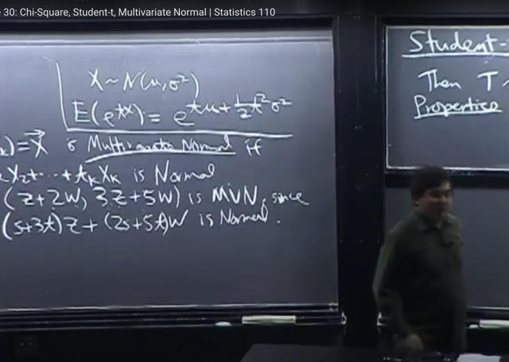</kbd></p>

> [!NOTE]
> Thế thì MGF của univariate Normal là
> như vầy (ta đã chứng minh)

<br>

<a id="node-932"></a>

<p align="center"><kbd>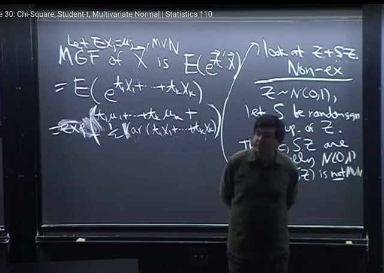</kbd></p>

> [!NOTE]
> Do đó, cái ta cần tính `E[e^(tổng` tjXj)] là `E[e^{một` normal rv X}] và
> theo MGF của univariate normal như vừa rồi, ta sẽ cần mu  và
> variance của nó để có `E[e^tX]` `=` e^t*mu `+` 0.5t^2sigma^2
>
> Thế thì vì đã nhận định với X `=` tổng j Xj, thì mean của nó là  tổng j
> `tj*mu_j` (cái này chứng minh đơn giản dựa vào linearity:
>
> ```text
> mean của [tổng tj*Xj] = E[t1*X1 + t2*X2 + ....tkXk]
> ```
>
> ```text
> = E(t1X1) + E(t2X2) + ...E(tkXk)
> ```
>
> ```text
> = t1*E(X1) + t2*E(X2) + ...tk*E(Xk)
> ```
>
> `=` mu1 `+` mu2 `+` ...muk
>
> Còn và variance của tổng tjXj thì cứ ghi là `Var(tổng` tjXj) mà ta đã
> biết cách triển khai nó ra là tổng các Variance của  mỗi term tjXj
> cũng như các covariance term giữa tiXi và tjXj

<br>

<a id="node-933"></a>

<p align="center"><kbd>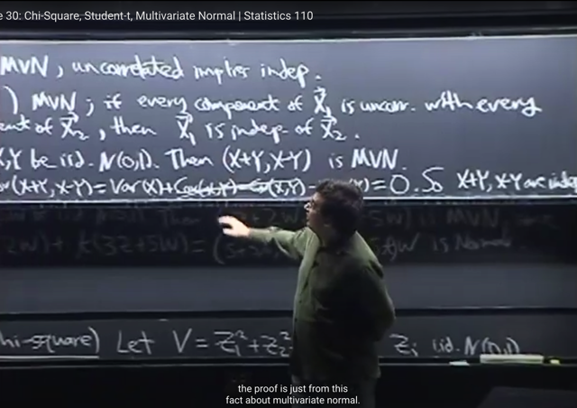</kbd></p>

<p align="center"><kbd></kbd></p>

<p align="center"><kbd>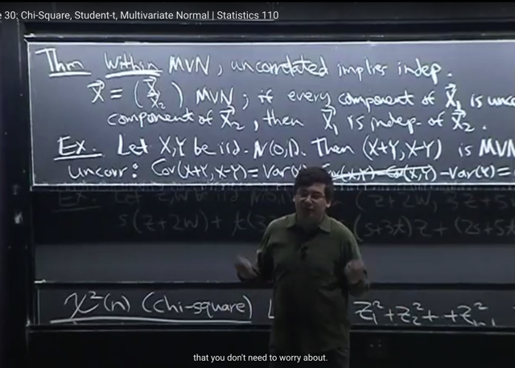</kbd></p>

🔗 **Related:** [LEC 21: COVARIANCE & CORRELATION](untitled.md#node-691)

> [!NOTE]
> Một tính chất rất hữu ích nữa của MVN, đó là trong bối cảnh MVN, thì UNCORRELATED IMPLIES
> INDEPENDENCE
>
> Cho vector X ~ MVN, và split nó thành hai vector X1, X2. Thì, nếu mọi component của X1 đều
> uncorrelated với mọi component của X2 thì  X1 sẽ independent với X2.
>
> Gs lấy ví dụ cho X,Y iid ~ N(0,1). khi đó ta đã chứng minh `(X+Y,` `X-Y)` là vector ~ MVN (ta đã chứng
> minh rằng mọi linear combination của `X+Y,` `X-Y` sẽ đều là N(0,1) nên theo định nghĩa vector này là
> MVN rn
>
> Thế thì split nó thành hai vector (có 1 component) là `[X+Y]` và `[X-Y]` thì, tính thử covariance giữa `X+Y`
> ```text
> và X_Y ta đã biết theo property 6 (link) rằng  CoV(X,X) + Cov(X,-Y) + Cov(Y,X) + Cov(Y,-Y)
> ```
>
> ```text
> Cov(X,-Y) = Cov(X, Y*-1) = -1*Cov(X,Y) (theo tính chất 4 của Cov)
> ```
>
> ```text
> Cov(X,Y) = Cov(Y,X) (theo tính chất 2 của Cov)
> ```
>
> ```text
> = Var(X) - Cov(X,Y) + Cov(X,Y) - Var(Y) = Var(X) - Var(Y)
> ```
>
> ```text
> và vì X, Y ~N(0,1) nên Var(X) = Var(Y) = 1
> ```
>
> ```text
> Vậy Cov(X+Y, X-Y) = 0
> ```
>
> Và theorem này sẽ cho ta biết rằng `X+Y,` `X-Y` independent. (đây chỉ là ví dụ,  gs không chứng minh
> theorem này)
>
> Nhưng ta chỉ cần nhớ theorem này rất hữu ích bởi nó sẽ cho ta biết rằng, nếu ta có các iid X1,X2 và
> rồi nếu như có thêm `X1+X2` và `X1-X2` independent nhau thì suy ra X1, X2 phải là Normal rvs
>
> ```text
> Bởi vì khi đó (X1+X2,X1-X2) là MVN, và X1+X2 uncorrelated với X1-X2 mà ta lại có X1+X2,
> ```
> independent với `X1-X2` thì điều này chỉ có thể xảy ra nếu trong bối cảnh MVN, tức là chỉ có thể xảy ra
> khi X1, X2 là normal (để `(X1+X2,` `X1-X2)` là MVN

<br>

