# Lec 3: Birthday Problem, Properties Of Probability

📊 **Progress:** `28` Notes | `24` Screenshots

---
<a id="node-45"></a>

<p align="center"><kbd>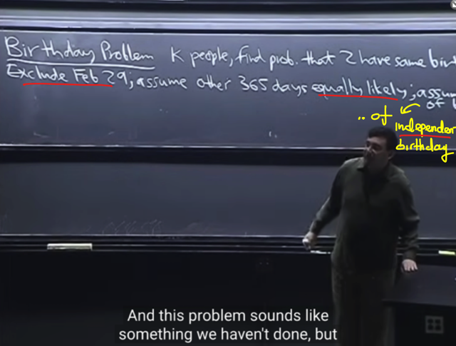</kbd></p>

> [!NOTE]
> Đại khái là đầu tiên gs sẽ nói về **Birthday** problem một ví dụ mà mọi lớp
> xác suất đều học (như cs109). Ta đã biết câu hỏi là giả sử có một lớp học,
> hoặc **một đám người** trong một căn phòng thì **cần bao nhiêu người để
> xác suất của việc có hai người trùng ngày sinh là lớn hơn 50%**
>
> Thế thì trước tiên ông assume:
>
> i) ta **chỉ tính năm có 365 ngày**
>
> ii) khi đẻ con, thì **một người có thể đẻ vào bất kì ngày nào với khả năng
> như nhau**, mặc dù thực tế có thống kê cho thấy xác suất của những ngày
> mà cách những ngày lễ 9 tháng thì có khả năng cao hơn (trở thành ngày
> sinh, ý là người ta thường đẻ con vào những ngày đó cao hơn, lí do thì ai
> cũng hiểu). Mục đích là **để các possible outcome** `-` ngày (trong 365 ngày)
> mà có người sinh `-` có khả năng bằng nhau (**equally likely**)
>
> iii) các birthday của các cá nhân trong lớp **độc lập nhau**, ngày sinh của
> người này là bao nhiêu **không ảnh hưởng đến ngày sinh của người khác**
> ví dụ như **không có ai sinh đôi**(vì khi trong phòng có sinh đôi sinh ba, thì
> ngày sinh  của một trong những cặp sinh đôi sẽ ảnh hưởng đến `/` cho biết
> thông tin của người còn lại)

<br>

<a id="node-46"></a>

<p align="center"><kbd>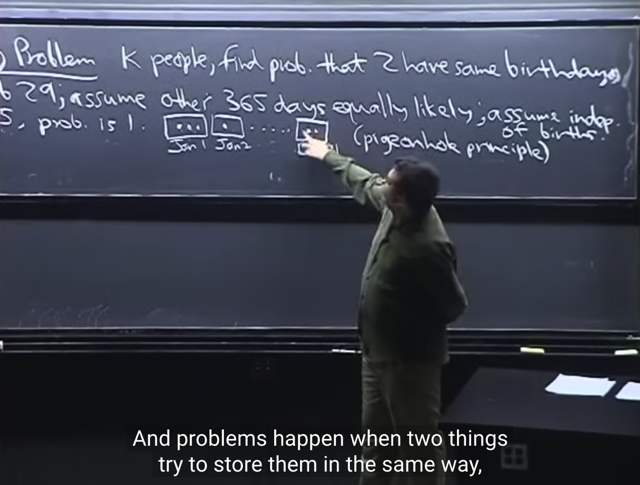</kbd></p>

> [!NOTE]
> thế thì đầu tiên, ta có thể lập luận để dẫn đến kết luận **nếu k (số người trong
> phòng) lớn hơn 365** thì **xác suất có cặp trùng ngày sinh `=` 1**
>
> Ta có thể thấy có thể chuyển nó thành **bài toán tương tự**: Ta có**k viên bi
> đánh** **số**, và muốn **xếp nó vào 365 cái hộp B1, B2...B365** (tượng trưng
> cho 365 ngày trong năm). Thì **mỗi một bộ ngày sinh của đám người đó**,
> **chính là một cách bỏ k viên bi có số vào các hộp**. Và xác suất có người
> trùng ngày sinh chính là **xác suất có hộp chứa 2 viên bi.**
>
> Vậy thì, dựa vào logic thông thường cũng dễ thấy **nếu có nhiều bi hơn số
> hộp thì CHẮC CHẮN phải có hộp chứa hơn 1 viên**. Đây cũng là **nguyên lý
> Dirichl**e hoặc "**pigeon hole**" như gs nói ở đây.
>
> Vậy xác suất có ngày sinh trùng nhau là chắc chắn (tức `=` 1) khi lớp có**hơn
> 365 người**

<br>

<a id="node-47"></a>

<p align="center"><kbd>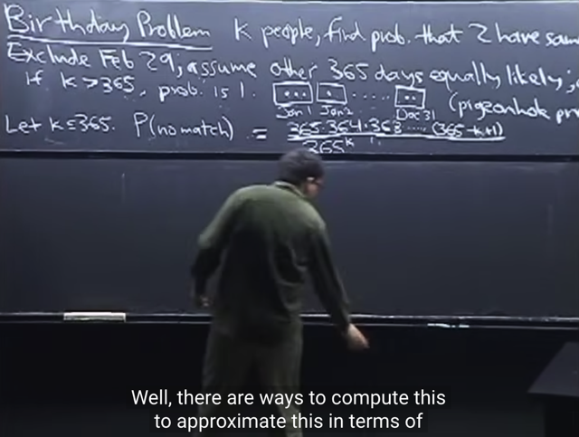</kbd></p>

> [!NOTE]
> tiếp theo ta sẽ tính xác suất có event trùng ngày sinh P(match) khi **k `=`
> 365**.
>
> gs lưu ý rằng **luôn nhớ rằng ta có các công cụ** như **complement**,
> **union**, **intersection**.. để dùng giúp việc tính xác suất của một event dễ
> hơn. Cụ thể **sẽ dễ hơn để tính P(no match)**, khi đó **P(match) `=` 1 `-` P(no
> match)**
>
> Và vì ta đã có assumption: equally likely events nên ta sẽ **dùng naive
> definition of probability**.
>
> Như cs109 gs Cris đã nói, đầu tiên xác định **sample space S**: Đếm **số
> possible outcomes `-` có bao nhiêu cách chọn ngày sinh cho 365 người**. Thì
> việc này có thể dùng product rule: làm 365 bước, mỗi bước chọn ngày sinh
> cho 1 người. Dễ thấy, mỗi người đều có 365 lựa chọn, và ngày sinh của
> người này không ảnh hưởng đến ngày sinh của người kia (như assumption
> ban đầu) nên theo product rule: 365*365*....*365 `=` **365^k** possible
> outcome.
>
> Còn **event (không trùng ngày sinh) space**: Ta sẽ **đếm số possible
> outcome `-` tức số cách chọn bộ ngày sinh của k người để không có ai 
> trùng nhau** cũng bằng cách thực hiện k step:
>
> Dễ thấy kết quả là `365*364*....*(365-k+1)`
>
> Gs chú ý, nhớ là phải `+1` vì: như vậy mới đủ k người. Nhưng cách check đó
> là nếu k `=` n thì tử số phải bằng 1, chứ không phải `=` 0 (nếu không có `+1)` để
> xác suất không trùng ngày sinh của 1 nhóm chỉ có 1 người là 1.
>
> Ta có thể tính hai cái trên theo cách khác là xem nó ứng với case nào trong
> 4 case để dùng ngay công thức thôi)
>
> Và P(match) `=` 1 `-` P(no match). Nói chung ta đã giải xong, để có P > 50 chỉ
> viêc **giải bất phương trình để ra kết quả k**

> [!NOTE]
> Nếu dùng công thức của 1 trong 4 case thì ta cần xem nó thuộc case nào:
>
> Cái này, là **chọn bộ k ngày sinh** (trong tổng số n `=` 365 ngày sinh): Đầu tiên có thể
> thấy nó là **sampling có hoàn lại**, vì **có quyền có nhiều người trùng ngày sinh**.
> nên giống như ta bốc banh trong lọ rồi bỏ vào lại. Và cái này c**ó quan tâm thứ
> tự** vì không có chuyện coi "ông thứ nhất sinh ngày 1, ông thứ hai sinh ngày 8,
> xxx"  cũng giống "ông thứ nhất sinh ngày 8, ông thứ hai sinh ngay 1,xxx" (xxx
> ý là chuỗi phía sau giống nhau) được. Do đó đây là case **có hoàn lại**và **có
> care thứ tự**, công thức sẽ là **n^k `=` 365^k**
>
> Còn event space cũng coi thử dùng công thức nào. Yêu cầu là đếm số cách
> chọn bộ k ngày sinh không trùng nhau từ `n=365` ngày sinh. Vậy thì thấy ngay
> đây là **sampling không hoàn lại (thì mới không trùng nhau), và cũng có care
> thứ tự**, vì cùng lí do nói trên.
>
> Nên nó sẽ ứng với sampling không hoàn lại `+` có care thứ tự: **n! `/` (n-k)!**
> ```text
> = 365! / (365-k)! = 365*364*..(365-k+1)
> ```

<br>

<a id="node-48"></a>

<p align="center"><kbd>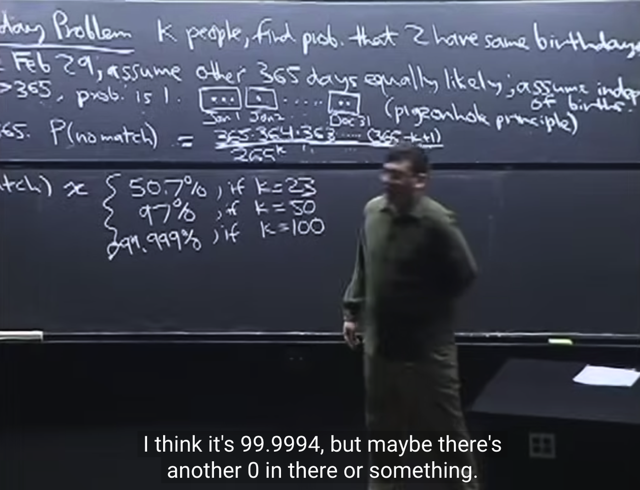</kbd></p>

> [!NOTE]
> đại khái là khi đó, ta **sẽ thấy chỉ với 23 người P đã cao hơn random (50%)**.
> với **50 người P đã là 97%**. Và với **100** người, dù nhiều nhưng chưa bằng
> `1/3` của 365 thì P đã là **99.99999%**

<br>

<a id="node-49"></a>

<p align="center"><kbd>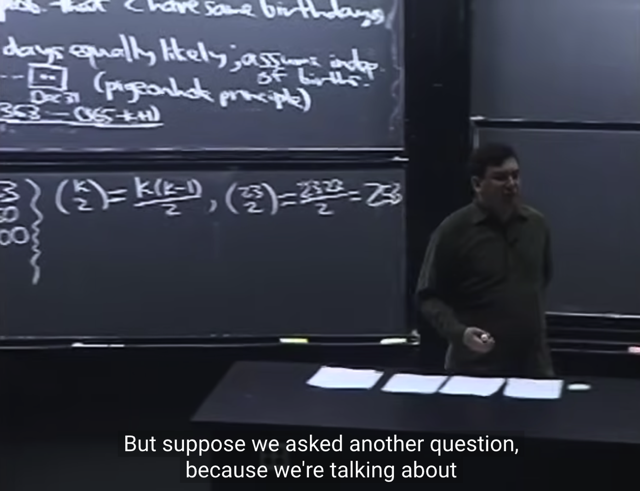</kbd></p>

> [!NOTE]
> đại khái là một chút phân tích để ta có thể **có chút lí giải** cho việc **tại sao khi
> k hơn 23 người mà P(match) đã hon 50%**
>
> Đại khái là, **nếu ta xét số cặp trong k người**. thì với **k `=` 23, số cặp đã là 
> 253**, ý là **tuy 23 người có vẻ không nhiều** nhưng **từ 23 người đó có thể tạo 
> ra rất nhiều cặp**, và số cặp sẽ tăng lên rất nhanh khi k tăng lên
>
> **Càng nhiều cặp**, ta có thể hiểu **đại khái được là sẽ càng dễ xảy ra cặp trùng
> ngày sinh**. Nhờ vậy có thể giúp ta "hiểu hiểu" được

<br>

<a id="node-50"></a>

<p align="center"><kbd>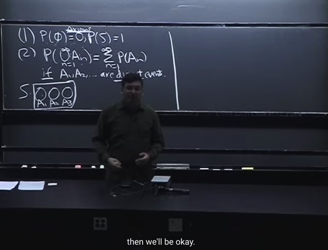</kbd></p>

🔗 **Related:** [TÓM TẮT:  Tiếp tục về conditional probability qua một số ví dụ  - Nói về việc để tính xác suất giống như diện tích của một hình phức tạp có thể dùng cách làm chia nhỏ S ra bởi một partion: P(B) = P(A1,B) + P(A2,B) + ...P(An,B) =  P(B)  = P(B|A1)*P(A1) + P(B|A2)*P(A2) + ....P(B|An)*P(An)  - Cái trên chính là LOTP: Law of Total Probability  - Chia S ra không đúng cách có thể khiến vấn đề phức tạp hơ,  thực hành nhiều sẽ có kinh nghiệm  - Ví dụ sampling hai lá bài, tính xác suất có 2 lá xì khi đã có một lá xì và xác suất cả hai lá xì khi đã có lá xì bích  - Ví dụ Disease test  - Complement rule P(A|B) = 1 - P(Ac|B)  - Một số sai lầm phổ biến liên quan đến conditional probability  - Định nghĩa về conditional independent](tóm_tắt_tiếp_tục_về_conditional_probability_qua_một_số_ví_dụ_nói_về_việc_để_tính_xác_suất_giống_như_diện_tích_của_một_hình_phức_tạp_có_thể_dùng_cách_làm_chia_nhỏ_s_ra_bởi_một_partion_pb_pa1b_pa2b_panb_pb_pba1pa1_pba2pa2_pbanpan_cái_trên_chính_là_lotp_law_of_total_probability_chia_s_ra_không_đúng_cách_có_thể_khiến_vấn_đề_phức_tạp_hơ_thực_hành_nhiều_sẽ_có_kinh_nghiệm_ví_dụ_sampling_hai_lá_bài_tính_xác_suất_có_2_lá_xì_khi_đã_có_một_lá_xì_và_xác_suất_cả_hai_lá_xì_khi_đã_có_lá_xì_bích_ví_dụ_disease_test_complement_rule_pab_1_pacb_một_số_sai_lầm_phổ_biến_liên_quan_đến_conditional_probability_định_nghĩa_về_conditional_independent.md#node-116)

> [!NOTE]
> gs B nhắc lại về **2 tiên đề** của xác suất mà ta đã biết bữa trước.
>
> Trong đó a**xiom 1** nói rằng **P(event empty) `=` 0** (xác suất một outcome
> thuộc  tập hợp rỗng bằng 0) và **P(S) `=` 1** (xác suất một outcome thuộc
> sample space bằng 1)
>
> Và **axiom 2** nói rằng **xác suất của n disjoint event** **bằng tổng xác suất của
> từng event**.
>
> Nói thêm, ta nhớ event là một subset của sample space mà ta quan tâm
> ví dụ khi tung một xí ngầu thì có 6 possible outcomes trong sample space,
> và event "số chẵn" sẽ có 3 outcomes. Thế thì event "rỗng" là subset không
> chứa outcome nào, nên như đã lập luận bữa trước, xác suất một outcome
> thuộc event rỗng bằng 0
>
> ý thứ hai quan trọng hơn đó là: ông nói có nhiều thảo luận về định nghĩa
> xác suất. Nhưng ta chỉ cần bám vào hai tiên đề này. **BẤT CỨ KHI NÀO
> HAI TIÊN ĐỀ NÀY ĐƯỢC THỎA MÃN THÌ FUNCTION `/` ĐẠI LƯỢNG ĐÓ
> LÀ XÁC SUẤT.**

> [!NOTE]
> ĐIỀU KIỆN ĐỂ FUNCTION VALID LÀM MÔT PROBABILITY FUNCTION

<br>

<a id="node-51"></a>

<p align="center"><kbd>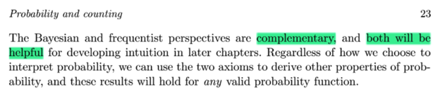</kbd></p>

<p align="center"><kbd></kbd></p>

<p align="center"><kbd>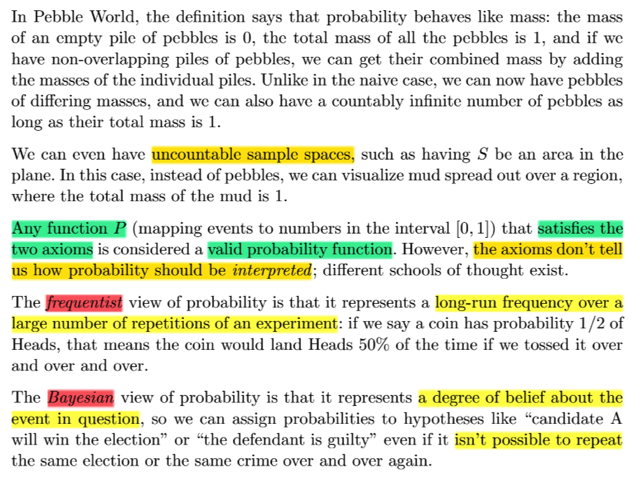</kbd></p>

> [!NOTE]
> Đoạn này trong sách có bổ sung về việc có **hai cách interpret khái niệm
> xác suất.**
>
> Theo trường phái **frequentist** thì ta sẽ kiến giải theo **TẦN SUẤT XẢY RA**
> của sự kiện khi **lặp đi lặp lại thử nghiệm nhiều lần (vô số lần)**
>
> Còn theo trường phái **Bayesian** thì ta kiến giải xác suất theo **MỨC ĐỘ TIN 
> TƯỞNG RẰNG SỰ KIỆN SẼ XẢY RA**
>
> Và gs cho rằng **cả hai đều hữu ích và bổ sung cho nhau**

<br>

<a id="node-52"></a>

<p align="center"><kbd>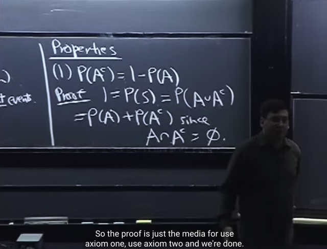</kbd></p>

> [!NOTE]
> từ hai tiên đề ta có **tính chất thứ nhất** của **(non-naive) xác suất**:
>
> **P(A^c) `=` 1 `-` P(A)**
>
> cái này gs cho biết là **ta đã xài**từ những bài trước rồi, vì **nó cũng đúng
> với naive probability**.
>
> **Chứng minh** nó cũng đơn giản:
>
> **B ắt đầu với tiên đề 1: P(S) `=` 1**. Và S đương nhiên là **bao gồm những
> gì thuộc A** **và những gì không thuộc A** (tức A^c). Nên:
>
> **S `=` A**∪**A^c** `=>` **P(S) `=` P(A union A^c) `=` 1 (1)**
>
> Thế mà **A và A^c không chồng lấn** (disjoint, kí hiệu là A intersect A^c `=`
> rỗng) vì định nghĩa của complement. Do đó theo axiom 2:
>
> **P(A union A^c) `=` P(A) `+` P(A^c)** **(2)**
>
> Vậy từ (1) và (2): ta có P(A) `+` P(A^c) `=` 1 `=>` **P(A) `=` 1 `-` P(A^c)**

> [!NOTE]
> PROPERTY: P(A^c) `=` 1 `-` P(A)

<br>

<a id="node-53"></a>

<p align="center"><kbd>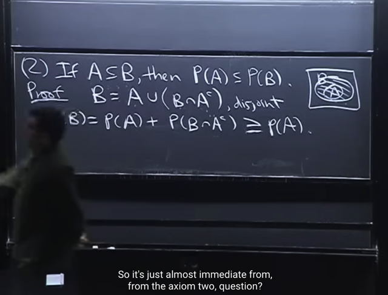</kbd></p>

> [!NOTE]
> Property #2:
>
> Tính chất thứ 2 là **nếu A là subset của B, thì P(A) nhỏ hơn hoặc bằng P(B)**
>
> Chứng minh như sau:
>
> Ta **chia B làm 2 phần**: **A** và **những gì thuộc B mà ở ngoài A** thì cái này chính
> là **intersection của B và A^c**:
>
> **B `=` A `+` (B intersect A^c)**
>
> Mà vì định nghĩa như vậy nên **A** và **(những phần ngoài A mà vẫn thuộc B)**
> **đương nhiên disjoint nhau**. Theo axiom 2 ta có: 
>
> **P[A `+` (B intersect A^c)] `=` P(A) `+` P(B intersect A^c)**
>
> Tiếp, theo định nghĩa, xác suất là giá trị **không** **âm** nên:
>
> P(B intersect A^c) `>=` 0  `<=>` **P(A) `+` P(B intersect A^c) `>=`  P(A)**====****Ngắn gọn hơn: 
>
> B ⊂ S ⇨ B ∩ S `=` B ⇔ B ∩ (A ∪ Ac) `=` B ⇔ (B ∩ A) ∪ (B ∩ Ac) `=` B
>
> ⇔ P[(B ∩ A) ∪ (B ∩ Ac)] `=` P(B) ⇔ P(B ∩ A) `+` (B ∩ Ac) `=` P(B) (axiom 2)
>
> ⇔ P(A) `+` P(B ∩ Ac) `=` P(B) (do A ⊂ B ⇨ A ∩ B `=` A)
>
> ⇨ P(A) ≤ P(B) do P(B ∩ Ac) ≥ 0 (axiom 1)

> [!NOTE]
> PROPERTY: A ⊂ B ⇨ P(A) ≤ P(B)

<br>

<a id="node-54"></a>

<p align="center"><kbd>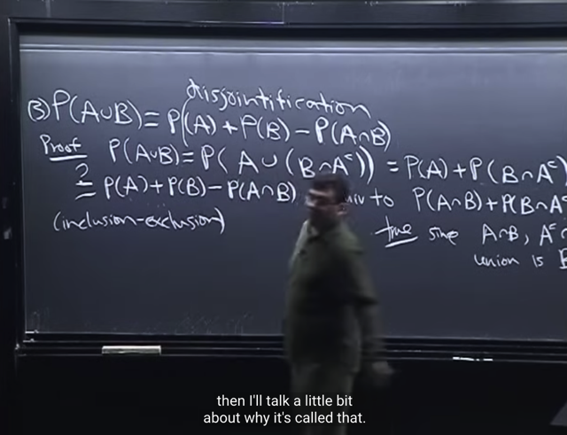</kbd></p>

<br>

<a id="node-55"></a>

<p align="center"><kbd>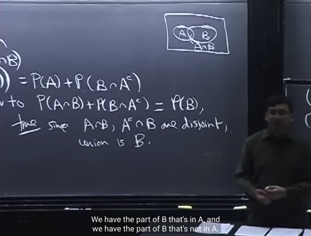</kbd></p>

> [!NOTE]
> **Property #3** đó là **P(A union B) `=` P(A) `+` P(B) `-` P(A intersect B)**
>
> Đại khái là, thực tế **không phải lúc nào ta cũng có các disjoint events**.
> Ở đây cũng vậy **A và B không disjoint**, tức **A intersect B KHÁC rỗng**.
>
> Nên **để áp dụng axiom 2**, gs cho biết ta sẽ **cần làm cho chúng disjoint
> mà ông gọi là disjointification**.
>
> Cụ thể **(A union B)** có thể được coi như là **A union [những gì ngoài
> A nhưng thuộc B]**, tương tự như hồi nãy:
>
> **(A union B) `=` [A union (A^c intersect B)]**
>
> Và vì định nghĩa complement nên đương nhiên A và (A^c intersect B)
> disjoint. Do đó ta có thể **áp dụng axiom 2**:
>
> **P[A union (A^c intersect B)] `=` P(A) `+` P(A^c intersect B)**
>
> Vậy P(A union B) `=` P(A) +**P(A^c intersect B)**
> Tiếp theo ta lập luận rằng, muốn chứng minh 
>
> P(A union B) `=` P(A) `+` **P(B) `-` P(A intersect B)**
>
> thì ta chỉ cần chứng minh P(B) `-` P(A intersect B) `=` P(A^c intersect B)
>
> hay **P(B) `=` P(A intersect B) `+` P(A^c intersect B)**
>
> Và điều này là đúng, bởi vì: 
>
> i) (A intersect B) và (A^c intersect B) là **disjoint events**: vì 1 outcome không thể
> vừa nằm trong A (nằm trong (A intersect B) tức là nằm trong A) và A^c 
> nằm trong (A^c intersect B) được.
>
> ii) Và B có thể tách thành 2 phần, một phần thuộc A, một phần thuộc A^c
> nên **B `=` (B intersect A) union (B intersect A^c)**
>
> nên theo axiom 2 ta có: 
>
> P(B) cũng là P((B intersect A) union (B intersect A^c)) 
>
> sẽ bằng (theo axiom 2) P(A intersect B) `+` P(A^c intersect B) `->` Chứng minh xong

> [!NOTE]
> PROPERTY: P(A ∪ B) `=` P(A) `+` P(B) `-` P(A ∩ B)

<br>

<a id="node-56"></a>

<p align="center"><kbd>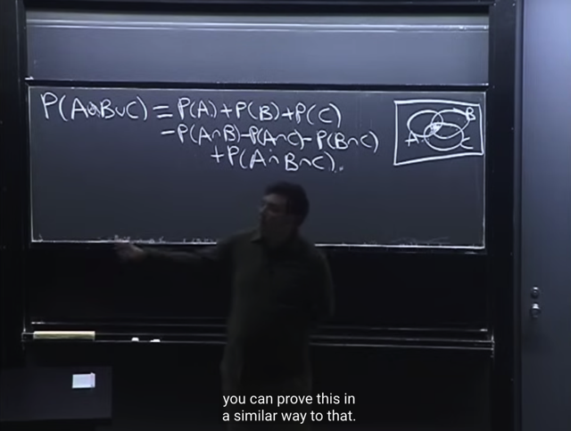</kbd></p>

> [!NOTE]
> Một ví dụ nữa **P(A u B u C) `=` P(A) `+` P(B) `+` P(C)**
>
> sau đó ta **trừ đi (adjust overcounting):** **(A ∩ B), (A ∩ C), (B ∩ C)**
>
> nhưng như vậy ta l**ại mất đi phần chính giữa** (vì ta **cộng nó 3 lần**,
> sau đó lại **trừ đi nó 3 lần** khi adjusting), do đó ta **sẽ phải cộng vào
> lại**: `+` P(A ∩ B ∩ C)
>
> Vậy nên P(A u B u C)
>
> ```text
> = P(A) + P(B) + P(C) - P(A ∩ B) - P(B ∩ C) - P(A ∩ C)  + P(A ∩ B ∩ C)
> ```
>
> (*) P(A, B) chính là cách notation khác của P(A ∩ B): Xác suất của event
> [event A và B cùng xảy ra]
>
> Để chứng minh cái này gs cho rằng hoàn toàn tương tự ví dụ trước

<br>

<a id="node-57"></a>

<p align="center"><kbd>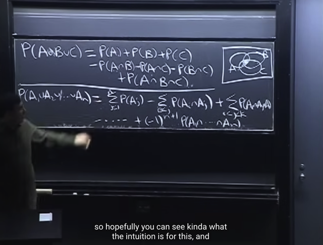</kbd></p>

> [!NOTE]
> **Công thức tổng quát của P(A1 u A2 ....u An)**là vầy, thấy có vẻ dài nhưng ý
> tưởng thì tương tự P( A u B u C) thôi đó là
>
> **Cộng hết các n cái P(A_j)**, các vùng **overlap giữa các cặp `A_i,` A_j** bị **đếm
> dư**.
>
> **Trừ** hết các cùng overlap `P(A_i` ∩ `A_j),` các vùng overlap giữa `A_i,` `A_j,`
> `A_k` bị mất
>
> **Cộng** các vùng overlap `P(A_i` ∩ `A_j` ∩ `A_k),` các vùng overlap giữa A_,
> `A_j,` `A_k,` `A_l` bị đếm dư
>
> **Trừ** đi các vùng overlap `P(A_i` ∩ `A_j` ∩ `A_k` ∩ `A_l)`
>
> cứ thế..
>
> Thì dấu của các term sẽ theo quy luật **+, `-,` `+,` -**....khái quát bởi:
>
> Khi số event của intersection là **chẵn thì là dấu (-)**, **còn lẻ thì là dấu (+)**
>
> nên khái quát là **(-1)^(n+1) * P(∩[A1, A2, ...An])**
>
> Cộng hết xong trừ các overcounting sau đó lại cộng vào lại cái bị bỏ mất... cứ
> tíêp tục vậy cho đến khi đúng. Gọi là **INCLUSION & EXCLUSION**
>
> Khúc này có lẽ **xem thêm sách để rõ hơn**

> [!NOTE]
> INCLUSION & EXCLUSION

<br>

<a id="node-58"></a>

<p align="center"><kbd>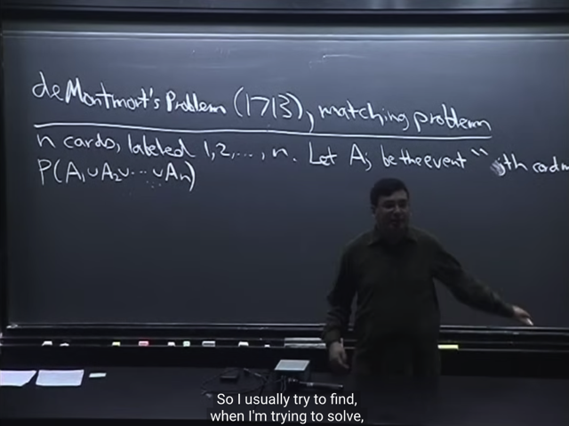</kbd></p>

> [!NOTE]
> Tiếp gs sẽ nói về bài toán **de Montmort's Problem**, hay còn gọi là **the
> matching problem**.
>
> Như sau: Gọi **bộ bài có n lá khác nhau dán nhãn từ 1 tới n.** **Shuffle** các lá
> bài, và cách thức sẽ là **ta sẽ rút các lá bài n lần**.
>
> Nếu khi **bốc ở lần thứ j**, **mà ta được lá j** (coi như gán nhãn lá bài từ 1 tới
> n, thay vì xì rô hay 5 bích) thì ta có một **matching event**.
>
> Khi đó ta gọi là thắng trò chơi.
>
> Lưu ý là **chọn bài rồi bỏ vô lại** chứ không phải chọn xong lấy ra luôn
>
> Câu hỏi là, **xác suất để xuất hiện một matching event**nơi mà lá thứ j có label
> j là bao nhiêu.
>
> Thế thì ta sẽ **gọi A1 là event mà lá thứ 1 (tức là rút được ở lần bốc thứ 1 có 
> label là 1.**Dễ thấy nếu A1 xảy ra thì ta có một matching event ngay tại lần bốc đầu 
> tiên**A2** là event mà lá thứ 2 có label là 2....**An** là event mà lá thứ n có label là n
>
> Khi đó **ta sẽ win game** nếu **MỘT TRONG trong các event A1, A2....An xảy ra**.
>
> Tức là: **matching event `=` A1**∪**A2**∪**....**∪**An
>
> mang ý nghĩa là matching event hay wining event là khi A1 hoặc A2 hoặc  ...An
> xảy ra.**
>
> Nên **P(matching) `=` P(A1**∪**A2**∪**....**∪**An)**

> [!NOTE]
> de Montmort's Problem ÁP DỤNG `INCLUSION/EXCLUSION`

<br>

<a id="node-59"></a>

<p align="center"><kbd>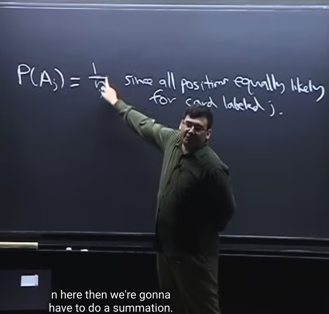</kbd></p>

> [!NOTE]
> Thế thì gs nói xác suất của event `A_j` (tức bốc lá thứ j, được lá j) là `1/n`
>
> Tại sao?
>
> Cách hiểu đơn giản là event `A_j` xảy ra khi, khi bốc lá thứ j, ta được lá j. Thế
> thì, **khi bốc một lá bài**, ta**có thể có bất kì lá nào trong n lá**. Và **khả năng xảy
> ra của các lá đều như nhau** (equally likely), thành ra áp dụng naive definition 
> of probability ta có `P(A_j)` `=` Event space size `/` Sample space size
>
> ```text
> (Nhờ Casella hiểu sâu hơn chút P(A_j) = P({s ∈ A_j}) = Σ {s ∈ A_j} P({s})
> ```
>
> [số possible outcomes thuộc `A_j]` * `1/[số` possible outcome trong S]
>
> P({s}) `=` `1/[số` possible outcome trong S] là nhờ axiom 2: P(S) `=` 1 ⇔ P({s: s ∈ S})
> ```text
> = 1 ⇔ Σ {s ∈ S} P({s}) = 1 ⇔ [số p.o trong S] P({s}) = 1 (do equally likely)
> ```
> ⇨ P({s}) `=` ...)
>
> Với **Sample space size là n** vì có n possible outcome khi bốc lá thứ j (có n lá bài)
>
> Và **Event space size là 1** vì chỉ có 1 outcome là thuộc event `A_j:` Đó là lá bài phải
> là "lá j" (nhắc lại, coi như các lá bài được đánh số từ 1 đến n)
>
> Vậy P(Aj) `=` xác suất xuất hiện lá j là **1/n**

<br>

<a id="node-60"></a>

<p align="center"><kbd>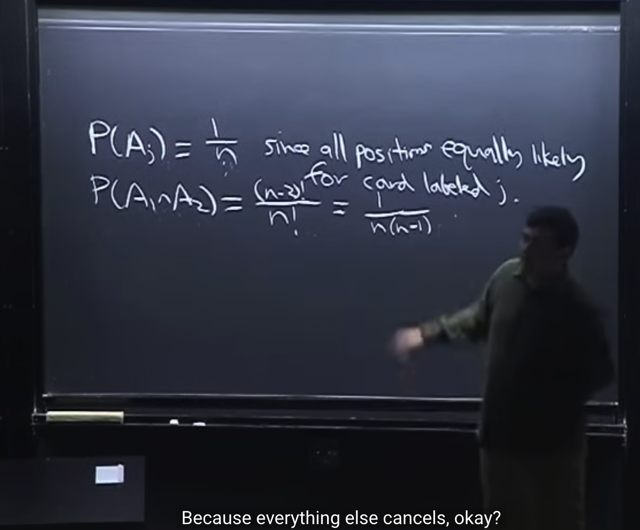</kbd></p>

> [!NOTE]
> Tiếp theo ta sẽ tính xác suất **(A1 ∩ A2)**: Tức là **lá bốc lần đầu là lá 1**
> (có label 1) **VÀ** **lá bốc lần thứ 2 là label 2** và các lá khác thì không care.
>
> Gs tính theo naive definition:
>
> **Sample space là mọi hoán vị của n lá bài: ta có n!.**
>
> Và event space: Ta sẽ đếm **số cách sắp n lá sao thỏa event A1 intersect
> A2**: lá thứ 1 có label 1, lá thứ 2 là label 2.
>
> Dễ thấy nó sẽ là `(n-2)!,` cụ thể là có thể tính theo step rule hoặc lập luận
> đơn giản là: lá label 1 nằm vị trí thứ 1, lá label 2 nằm vị trí thứ 2, thì là cố
> định rồi, còn lại `n-2` lá kia thì ta không care, nên có `(n-2)` hoán vị của
> chúng `->` tổng số các cách sắp thỏa event A1 intersect A2 là (**n-2)!**
>
> Hoặc lập luận theo step rule: Bước 1 chọn label cho lá thứ nhất để có A1:
> Chỉ có 1 outcome (đó là lá đó phải có label bằng 1). Bước 2 chọn label
> cho lá thứ hai để có A2: Cũng chỉ có 1 outcome (đó là lá đó phải có label
> 2). Bước 3 chọn label cho lá thứ 3: Có `n-2` possible outcome  (vì lá label 1
> và label 2 đã nằm ở hai vị trí đầu). Bước 4 chọn label cho lá thứ 4: có `n-3`
> possible outcome (vì đã "xài 3 label" cho 3 lá đầu)...Đến bước n, chọn
> label cho lá thứ n: có 1 cách chọn. Vậy theo step rule: ta có `(n-2)*(n-1)*...`
> 2*1 `=` `(n-2)!`
>
> Từ đó xác suất P(A1 intersect A2)  `=` `(n-2)!/n!` `=` **1/[n(n-1)]**

<br>

<a id="node-61"></a>

<p align="center"><kbd>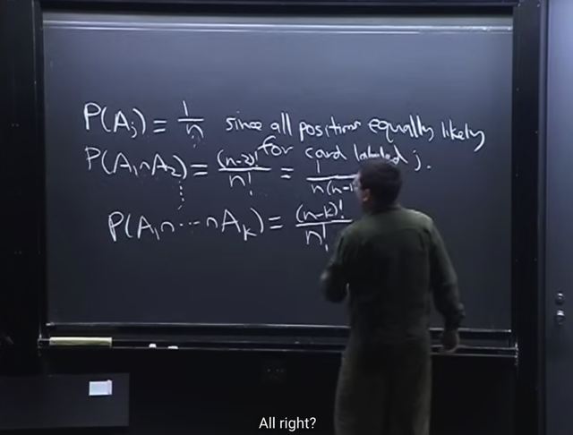</kbd></p>

> [!NOTE]
> Tương tự, tính **xác suất của event Intersect (A1, A2...Ak)**:
>
> Event (A1, A2...Ak) xảy ra khi lá 1 mang số 1, lá 2 mang số 2, ... lá k mang
> số k. Thì còn lại `n-k` lá sau thì có thể mang label với thứ tự bất kì
>
> Số cách sắp sao cho (A1, A2...Ak) sẽ chính là là số hoán vị của `n-k` lá ở
> sau: **(n-k)!**
>
> P(A1, A2...Ak) `=` **(n-k)!/n!**

<br>

<a id="node-62"></a>

<p align="center"><kbd>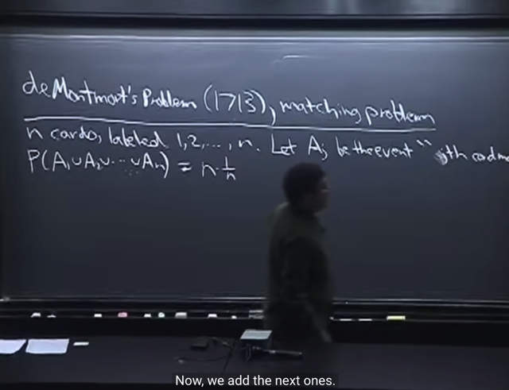</kbd></p>

> [!NOTE]
> rồi, cuối cùng ta có thể **áp dụng công thức của inclusion `/` exclusion** để
> tính  **P(A1 u A2 ....u An)**:
>
> Đầu tiên là**tổng các p(A_j)**: **P(A1) `+` P(A2) `+` ....P(An)**
>
> `(1/n)` `+` `(1/n)` `+` .... `=` **n*(1/n)**

<br>

<a id="node-63"></a>

<p align="center"><kbd>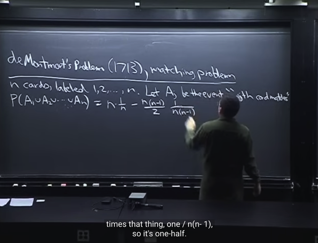</kbd></p>

> [!NOTE]
> Tiếp là **trừ đi các P(A1 ∩ A2), P(A2 ∩ A3)...**
>
> Và v**ới n item thì sẽ có (n choose 2) cặp, vậy ta có** (n choose 2) cặp `(A_i,` `A_j)` 
> hay có (n choose 2) event `(A_i` ∩ `A_j)`
>
> Và mỗi cái đều có P `=` `1/[n(n-1)]` như đã tính. Do đó ta có:
>
> **-** (n choose 2) * `1/[n(n-1)]` `=` **- `[n*(n-1)/2]` * 1/[n(n-1)]**

<br>

<a id="node-64"></a>

<p align="center"><kbd>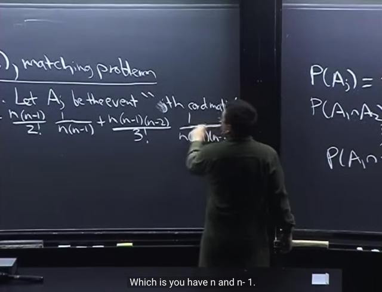</kbd></p>

> [!NOTE]
> Tiếp, như công thức khái quát, ta sẽ CỘNG lại cho các
> ∩ của 3 event: P(∩[A1,A2,A3]), P(∩[A2,A3,A4])...
>
> Và hoàn toàn dễ hiểu, ta có (n choose 3) bộ 3 như vậy. Mỗi cái có P là
>
> **(n-3)!/n! `=` 1/[n(n-1)(n-2)]**Nên: **+ (n choose 3) * `1/[n(n-1)(n-2)]`
>
> `=` `+` `[n*(n-1)*(n-2)/3!]` * 1/[n(n-1)(n-2)]**

<br>

<a id="node-65"></a>

<p align="center"><kbd>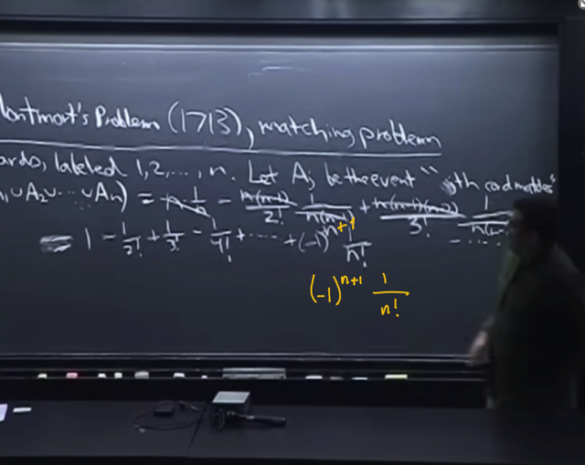</kbd></p>

> [!NOTE]
> và các term **cancel out** hết để ta còn lại dãy số này:
>
> **1 `-` `1/2!` `+` `1/3!` `-` `1/4!` `+` ... `+` `(-1)^(n+1)` `/` n!**

<br>

<a id="node-66"></a>

<p align="center"><kbd>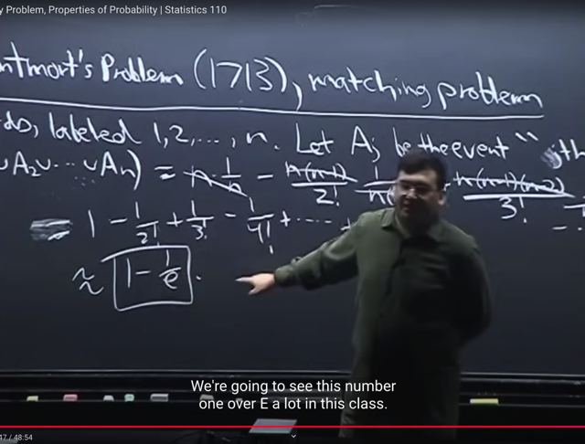</kbd></p>

> [!NOTE]
> Và gs cho biết dễ thấy **nó chính là Taylor series của 1 `-` 1/e**
> Làm rõ thêm, ta đã biết công thức Taylor expansion của function f(x) tại x `=` a
> khái quát là
>
> f(x) `=` Tổng n [giá trị đạo hàm cấp n của f tại `a]*[x-a]^n` `/` n!
>
> Thế thì xét function**f(x) `=` 1 `-` 1/e^x** `=` 1 **- e^(-x)**
>
> ```text
> f'(x) = d[1 - e^(-x)]/dx = - d[e^-x]/dx = - d[e^-x]/d(-x) * d(-x)/dx = - e^-x * (-1)
> ```
>
> `=` `e^-x` 
>
> f''(x) `=` `d(e^-x)/dx` `=` `d(e^-x)/d(-x)` * `d(-x)/dx` `=` `e^-x` * `(-1)` `=` **- e^(-x)**f'''(x) `=` sẽ ra lại **e^-x**Dẫn đến ta có thể thấy **Taylor series của f(x) `=` 1 `-` `1/e^x` expand tại a `=` 0**
>
> ```text
> [1-1/e^0] + f'(0)*(x-0)^1 / 1! + f''(0)*(x-0)^2 / 2! + f'''(0)*(x-0)^3 / 3! + ....
> ```
>
> **= 0 `+` 1 `+` `(-1)*x^2/2` `+` `(+1)*x^3/3!` `-` ...**
>
> Vậy thì với x `=` 1, ta có
>
> ```text
> 1 - e^(-x) = 1 - e^(-1) = 1 - 1/e = = 0 + 1 + (-1)*1^2/2 + (+1)*1^3/3! - ...
> ```
>
> **= 1 `-` `1/2!` `+` `1/3!` `-` `1/4!` .... CHỨNG MINH XONG**

<br>

