# Lec 4: Conditional Probability

📊 **Progress:** `34` Notes | `26` Screenshots

---

<a id="node-68"></a>
## Tóm Tắt:

> [!NOTE]
> TÓM TẮT:
>
> `-` Tiếp tục Matching problem
>
> `-` Định nghĩa về hai event độc lập
>
> `-` Bài toán `Newton-Peps`
>
> `-` Định nghĩa của conditional probability và cách hiểu về nó
>
> `-` Các định lý liên quan

<br>

<a id="node-69"></a>

<p align="center"><kbd>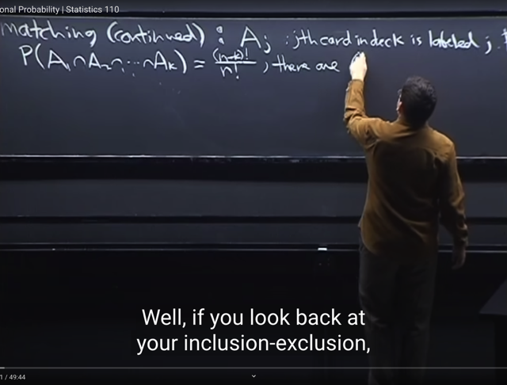</kbd></p>

> [!NOTE]
> ta sẽ tiếp tục **matching problem**. Nhắc lại đó là trò chơi mà ta sẽ **cứ lần lượt
> lấy từng lá bài** (đánh số từ 1 đến n) và luật là thì **nếu lá thứ j có label là j** thì
> ta có **matching event**. Và ta muốn **tính xác suất matching event** xuất hiện
>
> Thế thì bữa trước ta đã **gọi Aj là event mà lá thứ j có label j**.
>
> Thì **matching event** biểu diễn bởi: (**A1 u A2 u A3... An)** mang ý nghĩa là
>
> lá thứ 1 có label 1, HOẶC , lá thứ 2 có label 2, ...hoặc lá thứ n có label là n.
>
> (Chú ý, không ai nói rằng ta bốc các lá bài và khi có matching thì dừng, thành ra
> sau khi bốc n lá, có thể có nhiều event Aj xảy ra, nhưng miễn là có ít nhất một
> event Aj xảy ra thì ta sẽ có matching event)
>
> Bài trước ta **đã dùng Exclusion `/` Inclusion để tính.**
>
> Thế thì gs sẽ **tiếp cận theo cách khác** ở bài này. Đầu tiên nói lại,
>
> P(∩(A1, A2....Ak)) `=` `(n-k)!/n!`
>
> Vì sao: Vì bài trước đã nói, event A1, A2.. ...Ak cùng xảy ra. Thì tức là đây  là
> outcome mà **SỐ CÁCH SẮP CỦA N LÁ BÀI SAO CHO lá thứ 1 có label 1, lá
> thứ 2 có label 2... lá thứ k có label k**. Thì dễ thấy số lượng của outcome này
> này chỉ còn là **số hoán vị của  những lá từ thứ `k+1` đến thứ n (có `n-k` lá)** `=>`
> **(n-k)!**
>
> Còn sample space thì đương nhiên là**tất cả cách sắp xếp của n lá bài**: n!
>
> `=>` P(A1, A2,...Ak) `=` **(n-k)! `/` n!**

<br>

<a id="node-70"></a>

<p align="center"><kbd>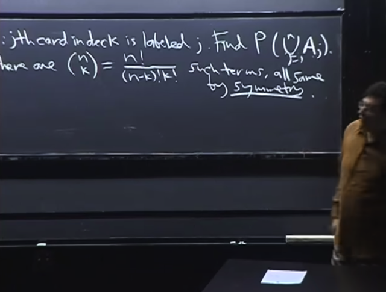</kbd></p>

> [!NOTE]
> Và đương nhiên ta có (n choose k) cái này vì ta có (n choose k) cách chọn k
> item khác nhau từ n item
>
> ví dụ như k `=` 3 đi sẽ có (52 choose 3) bộ 3 số không care thứ tự từ 52 số
>
> Nên ta sẽ có P(∩(A1, A2, A3)), P(∩(A1, A2, A4)), ...,P(∩(A3, A4, A5))...và sẽ là 
> (52 choose 3) bộ
>
> như đã biết công thức của n choose k là **n!/[(n-k)!k!]**
>
> Và mọi term trong **(n choose k)** term này đều có vai trò như nhau (**symmetry**)

<br>

<a id="node-71"></a>

<p align="center"><kbd>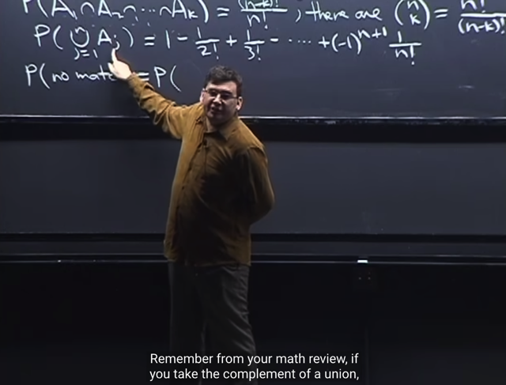</kbd></p>

> [!NOTE]
> và trong bài trước ta đã
> đi đến kế quả này.

<br>

<a id="node-72"></a>

<p align="center"><kbd>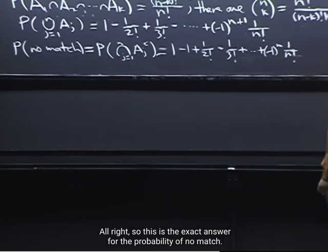</kbd></p>

> [!NOTE]
> Và từ đó ta có thể tính P(no match). Thì như trong sách mình đã thấy gs nói về
> định lí **De Morgan**: **complement (phủ định) của union** là **intersection của
> các complement. (A**∪**B)c `=` Ac ∩ Bc**
>
> ```text
> Nên P(no match) là P(∩ (Ac_1, Ac_2....) và = 1 - P(match)
> ```

<br>

<a id="node-73"></a>

<p align="center"><kbd>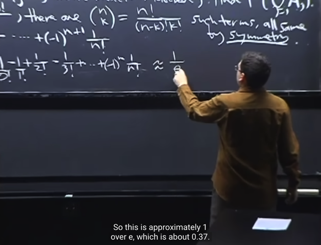</kbd></p>

> [!NOTE]
> và ta hoàn toàn có thể tự triển khai như bữa trước để thấy đây là Taylor series
> ```text
> 1/e^x tại x = -1. (Bữa trước P(match) là Taylor series của f(x) = 1 - 1/e^x
> ```
> expand tại a `=` 0, và tính tại x `=` 1)

<br>

<a id="node-74"></a>

<p align="center"><kbd>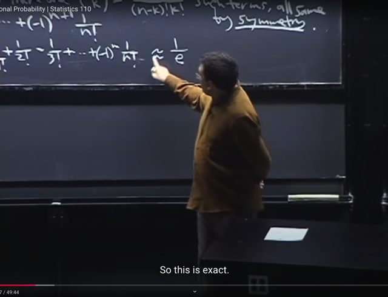</kbd></p>

> [!NOTE]
> đại khái là gs nói thêm về tại sao lại xuất hiện số e ở đây. về việc khi
> ta tăng n đến vô hạn thì dãy số này converge về `1/e`

<br>

<a id="node-75"></a>

<p align="center"><kbd>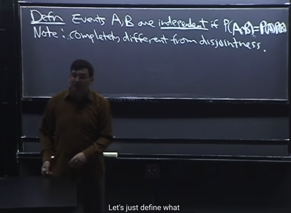</kbd></p>

> [!NOTE]
> tiếp ta sẽ qua định nghĩa về 2 event độc lập:
>
> **Hai event A, B độc lập nếu như P(A ∩ B) `=` P(A)*P(B)**
>
> Và gs chú ý rằng nó **hoàn toàn khác** với khái niệm **disjointness**
> vốn có nghĩa là khi "event **A xảy ra** thì event**B không thể xảy
> ra**" .
>
> Còn việc hai sự kiện độc lập thì khi **A xảy ra** thì B **có thể xảy ra
> hoặc không**, không liên quan gì.

<br>

<a id="node-76"></a>

<p align="center"><kbd>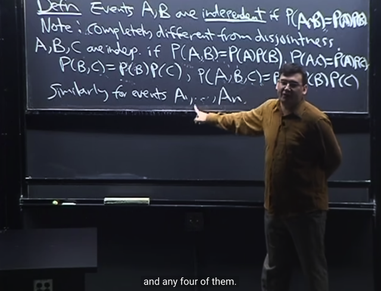</kbd></p>

> [!NOTE]
> Thế thì với 3 event A, B, C. Ta gọi chúng là independent event nếu
>
> **i) Các cặp event independent**: tức P(A ∩ B) `=` P(A)*P(B), P(A ∩ C) `=`
> P(A)*P(C) P(B ∩ C) `=` P(B)*P(C)
>
> *Ở đây gs nói rằng ta có thể dùng **dấu phẩy** để thể hiện intersection `-` sự
> kiện các event cùng xảy ra. **P(A ∩ B) ghi là P(A, B) cũng được**
>
> Tuy nhiên, define như vậy chưa đủ, vì **mới chỉ xét sự độc lập giữa các cặp
> event với nhau**.
>
> nên ta cần thêm:
>
> **ii)** **P(A, B, C) `=` P(A)*P(B)*P(C)**
>
> Và CHÚ Ý RẰNG TA **CẦN CẢ HAI** i) và ii)
>
> Và tương tự như vậy với định nghĩa n event A1, A2...An independent. ví dụ như
> n `=` 4, thì ta cần: 
>
> i) **các cặp** event độc lập 
>
> ii) **các bộ 3** event độc lập và 
>
> iii) **bộ 4 event** độc lập 
>
> tiếp tục vậy ...
>
> Do việc định nghĩa như vậy với n event rất dài dòng nên **sau này ta sẽ có
> cách khác**

<br>

<a id="node-77"></a>

<p align="center"><kbd>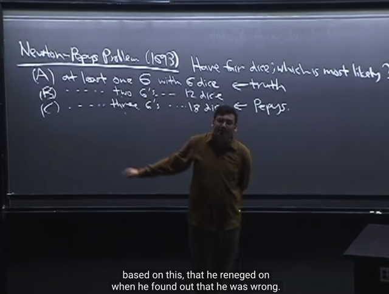</kbd></p>

> [!NOTE]
> gs lấy ví dụ cho cái này. Đó là bài toán **Newton-Peps**. Đại khái là ông
> Peps muốn Newton giải giùm bài toán trong đó cần xác định rằng trong 
> **xác suất của 3 event sau đây, cái nào cao hơn**.
>
> A: có ít nhất 1 lần ra 6 nút khi tung 6 xí ngầu 
> B: có ít nhất 2 lần ra 6 nút khi tung 12 xí ngầu
> C: có ít nhất 3 lần ra 6 nút khi tung 18 xí ngầu
>
> *Tung 6 xí ngầu hay tung 1 xí ngầu 6 lần thì cũng như nhau (đã nói về
> cái này rồi)
>
> Đoán: C
>
> Sự thật Newton giải ra : A

> [!NOTE]
> BÀI TOÁN `NEWTON-PEPS`

<br>

<a id="node-78"></a>

<p align="center"><kbd>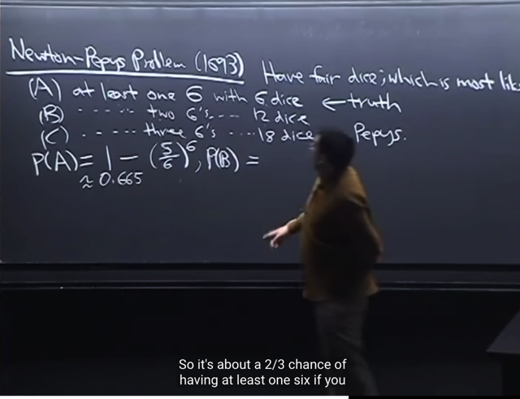</kbd></p>

> [!NOTE]
> Ta sẽ thử tính P(A) `-` xác suất xảy ra ít nhất một con 6 khi tung xúc xắc 6 lần
>
> Gs nói rằng khi mà ta thấy event define theo kiểu "**at least**" thì đương nhiên ta sẽ nghĩ
> đến **union**. Và như hồi nãy khi vận dụng theorem **De Morgan** `-` **"complement của
> union"** là "**intersection của các complement"**, cho phép ta tính dễ hơn bằng cách
> tính **intersection**, nhờ vậy sẽ vận dụng được định nghĩa **independent** của các
> event (ví dụ P(A ∩ B), hay P(A, B) `=` P(A)*P(B)
>
> Ta sẽ tính xác suất của event "**không có xúc xắc nào ra 6 nút**".
>
> Gs cho rằng với bài toán này, ta có thể dùng**naive definition** của xác suất để tính,
> nhưng **định nghĩa về independent event cho ta cách tính khác.**
>
> Vì bài toán tung xí ngầu này đương nhiên giả định**các xí ngầu đều FAIR** nên có  tính
> chất EQUALLY LIKELY và các xí ngầu **INDEPENDENT** nhau, tức là **xí ngầu này ra
> mấy nút không ảnh hưởng gì đến xí ngầu kia ra mấy** **nút.**Nếu gọi event `"X1!=6"` là event "xí ngầu thứ nhất không ra 6", `"X2!=6"` là event "xí ngầu
> thứ 2 không ra sáu", tương tự như vậy. Thì**vì nhận định các xí ngầu Independent**,
> **nên các event `X1!=6,` X2!=6,**...**X6!=6** đều **INDEPENDENT**
>
> Do đó ta **có thể ÁP DỤNG ĐỊNH NGHĨA CÁC EVENT ĐỘC LẬP** như sau:
>
> P[xí ngầu 1 không ra 6 nút, xí ngầu 2 không ra 6 nút, ....xí ngầu 6 không ra 6 nút] `=`
> **P(X1!=6, `X2!=6,` ...X6!=6)**
>
> hay nói gọn là `P(A_c)` `=`  P[ko có xí ngầu nào ra 6 nút]
>
> sẽ bằng:
>
> P[xí ngầu 1 không ra 6 nút] * P[xí ngầu 2 không ra 6 nút] * ...P[xí ngầu 6 không ra 6 nút]
>
> `=` **P(X1!=6) * `P(X2!=6)` * ... * P(X6!=6)**
>
> Rồi để tính `P(X_i!=6)` `=` P[xí ngầu i không ra 6 nút], **áp dụng naive definition** của
> probability:
>
> i) **Sample space**: Có 6 (equally likely) possible outcome khi tung một xí ngầu ⇨ xác suất
> của một outcome là `1/6`
>
> ii) **Event space**: Có 5 possible outcome thuộc event "không ra 6 nút"
>
> `=>` Theo naive definition of probability, P[xí ngầu i không ra 6 nút] `=` **(5/6)**
>
> Vì xí ngầu nào cũng vậy nên ta sẽ có P[không có xí ngầu nào ra 6 nút] `=` `(5/6)*(5/6)...`
> `(5/6)` (6 lần)
>
> **= (5/6)^6**
>
> Vậy **P[có ít nhất 1 xí ngầu ra 6 nút] `=` P(A) `=` 1 `-` P(Ac) `=` 1 `-` `(5/6)^6` ~ 0.665**

> [!NOTE]
> Viết ngắn lại:
>
> Đặt Xi là event xí ngầu thứ i ra 6.
>
> Và A là event ta đang quan tâm: Có ít nhất một lần ra 6 
>
> ⇨ Ac `=` Không có xí ngầu nào ra 6.
>
> ⇨ Ac `=` X1^c ∩ X2^c ...∩ X6^c `=` `∩i=1:6` Xi^c
>
> ```text
> ⇨ P(Ac) = P(∩i=1:6 Xi^c) = Πi=1:6 P(Xi^c) (do Xi^c independent)
> ```
>
> ```text
> =Πi=1:6 (5/6) = (5/6)^6
> ```
>
> ```text
> ⇨ P(A) = 1 - P(Ac) = 1 - (5/6)^6
> ```

<br>

<a id="node-79"></a>

<p align="center"><kbd>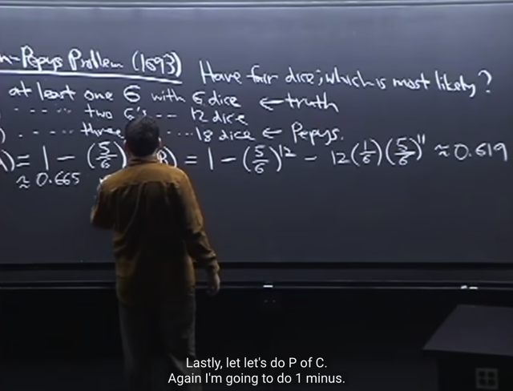</kbd></p>

> [!NOTE]
> Tiếp, tính P(B) (có ít nhất 2 lần ra 6 nút khi tung 12 nút)
>
> Tương tự ta cũng tính `P(B_c)` `=` (xác suất trong 18 lần tung không có việc ra 2 con 6.
>
> Thế thì event không ra 2 con 6 sẽ bao gồm: 
>
> `B_c1` `=` [**KHÔNG** ra con 6 lần nào trong 12 lần tung] **hoặc**
>
> `B_c2` `=` [Chỉ ra con 6 **MỘT** lần trong 12 lần tung]
>
> ```text
> B_c = B_c1 U B_c2
> ```
>
> Và dễ thấy chúng disjoint nên **P(B_c) `=` `P(B_c1)` `+` `P(B_c2)` theo axiom 3**
>
> i) Tính `P(B_c1):` Thì hoàn toàn tương tự như vừa rồi tính P(Ac): ta sẽ có **(5/6)^12**
>
> ii) TÍnh `P(B_c2):` 
>
> Lập luận như sau: 
>
> Event `B_c2` `=` [Chỉ ra con 6 MỘT lần trong 12 lần tung] là **union của các event**
>
> **B_c2 `=` (K1**∪**K2**∪**...**∪**K12)**
>
> Với: 
>
> `-` K1 `=` [**xí ngầu 1 ra 6 nút, 11 cái còn lại ra khác 6 nút**] **= (X1, X2c, ...X11c)**
>
> `-` K2 `=` [**xí ngầu 2 ra 6 nút, 11 cái còn lại ra khác 6 nút**] `=` (X1c, X2, ...X11c)
>
> ...
>
> Như đã lập luận, các xí ngầu là bình thường, nên **FAIR** (để các mặt đều equally likely)
> và **INDEPENDENT** (Để không có chuyện con này ra mấy kéo theo con kia ra mấy) 
>
>
>
> Do đó các event X1, X2c, ..đều là **INDEPENDENT** **EVENTS.** 
>
> (Trong sách Casella có nói về một theorem là nếu A, B độc lập thì (Ac, B) (A, Bc) (Ac, Bc)
> đều độc lập)
>
> Do đó ta có thể áp dụng định nghĩa **independent event** để tính xác suất của K1 sẽ là:
>
> P(K1) `=` P(X1, X2c, ...X11c) `=` P(X1) * P(X2c) *...* P(X11c)
>
> ```text
> rồi, theo định nghĩa của naive definition thì dễ thấy P(X1=6) = 1/6. P(X_ic) = 5/6
> ```
>
> Vậy **P(K1) `=`  `P(X1=6,` `X2!=6,` `...X11!=6)` `=` (1/6)*(5/6)^11**
>
> Hoàn toàn tương tự ta có
>
> P(K2) `=` P(K3) `=` ... `=` P(K12) `=` P[X2 `=` 6, `X1!=6,..X11!=6]` `=` **(1/6)*(5/6)^11**
>
> Và vì 12 sự kiện này K1, K2...K12 **DISJOINT** nên theo **Axiom 2** của xác suất ta có 
>
> **P(B_c2)** `=` P(K1 u K2 ...u K12) `=` P(K1) `+` P(K2) `+` ...P(K12) 
>
> ```text
> = (1/6)*(5/6)^11 + ...(12 lần) + (1/6)*(5/6)^11
> ```
>
> **= 12 * `(1/6)*(5/6)^11`
>
> Vậy P(B) `=` 1 `-` `P(B_c)` 
>
> ```text
> = 1 - P(B_c1) - P(B_c2)
> ```
>
> `=` 1 `-` `(5/6)^12` `-` 12 * `(1/6)*(5/6)^11` `~=` 0.619**

> [!NOTE]
> Viết ngắn lại:
>
> B `=` có ít nhất 2 lần ra 6 nút trong 12 lần tung xí ngầu
>
> ⇨ Bc `=` không có đủ 2 lần ra 6 nút trong 12 lần tung
>
> `=` U ∪ V với: 
>
> U `=` không có lần nào ra 6 nút trong 12 lần tung và V `=` chỉ có một lần ra 6 nút
>
> U `=` ∩i `=` 1:12 Xic (Xi là event lần thứ i trong 12 lần tung, ra được 6 nút)
>
> ```text
> ⇨ P(U) = P(∩i=1:12 Xic) = Πi=1:12 P(Xic) = (5/6)^12
> ```
>
> V `=` ∩j Kj với Kj là intersection của 11 Xic và 1 Xj
>
> Và có 12 event như vậy. Mỗi cái có xác suất `(1/6)*(5/6)^11` 
>
> ⇨ P(V) `=` `12*(1/6)*(5/6)^11`
>
> ⇨ P(B) `=` 1 `-` P(Bc) `=` 1 `-` P(U) `-` P(V) `=` **1 `-` `(5/6)^12` `-` 2*(1/6)*(5/6)^11**

<br>

<a id="node-80"></a>

<p align="center"><kbd>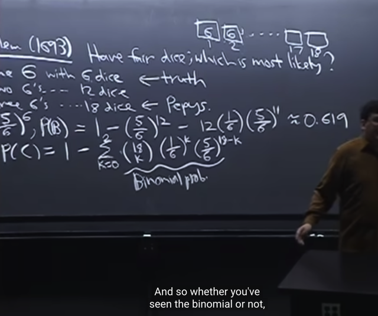</kbd></p>

> [!NOTE]
> Tiếp, ta sẽ tương tự, tính P(C) `-` xác suất của sự kiện: [**có 3 lần cho ra 6 nút
> trong 18 lần tung**]
>
> Ta cũng sẽ tính xác suất của complement of C, tức sự kiện không ra được 3
> con 6 trong 18 lần: Thế thì sự kiện `C_c` này, cũng là **union của 3 sự kiện
> khác C_ck**:
>
> `C_ck` `=` [Trong 18 lần tung xí ngầu, có k lần ra 6, còn lại đều không ra 6], 
> với k `=` 0,1,2.
>
> Ví dụ, k `=` 0 tức là "không có lần nào ra 6 trong 18 lần tung xí ngầu" (đương
> nhiên cũng y như tung 18 con xí ngầu không có con nào ra 6 nút).
>
> Và dễ thấy, các event này đều DISJOINT, theo Axiom 2, `P(C_c)` sẽ bằng 
>
> `P(C_c)` `=` **TỔNG** k các `P(C_ck)` (k `=` 0,1,2) (1)
>
> Tiếp theo, ta tính `P(C_ck),` tức xác xuất của sự kiện "có k lần ra 6 trong
> 18 lần tung xí ngầu" (hoặc có k xí ngầu ra 6 trong khi tung 18 con xí ngầu)
>
> Giả sử k `=` 2, ta xét một sự kiện cụ thể "của" `C_c2:` 
>
> ```text
> (X1=6,X2=6,X3!=6,...X18!=6) tức là xí ngầu 1,2 ra 6, còn lại thì khác 6,
> ```
> ```text
> rồi (X1=6,X3=6,X2!=6,...X18!=6) tức là xí ngầu 1,3 ra 6, còn lại thì khác 6
> ```
>
> Thì có thể thấy số sự kiện tương tự như trên là **SỐ CÁCH CHỌN SET CÓ
> 2 XÍ NGẦU TRONG 18 XÍ NGẦU, KHÔNG CARE THỨ TỰ**. Như đã quá
> biết, nó chính là (18 choose 2)
>
> Và dễ thấy (18 choose 2) event trên đều **DISJOINT**, nên theo Axiom 2,
> `P(C_c2)` là P[union của (18 choose 2)] event nói trên] và `=` Tổng P của 
> từng cái (2)
>
> ```text
> Rồi, ta sẽ xem P của một sự kiện, ví dụ (X1=6,X2=6,X3!=6,...X18!=6)
> ```
> Thì cái này tương tự như các câu trước, ta ứng dụng **naive definition** để
> dễ dàng thấy P sẽ là **(1/6)^2*(5/6)^16**
>
> Và vì vai trò các xí ngầu đều như nhau (symmetric) nên sự kiện nào trong
> (18 choose 2) cái đều có xác suất là `(1/6)^2*(5/6)^16`
>
> Vậy từ điểm (1), ta sẽ có `P(C_c2)` `=` Tổng của (18 choose 2) cái P mà mỗi
> cái đều bằng `(1/6)^2*(5/6)^16` `=>` `P(C_c2)` `=` **(18 choose 2) `(1/6)^2*(5/6)^16`
>
> Tiếp, đương nhiên ta có thể khái quát với k:
>
> `P(C_ck)` `=` (18 choose k) * `(1/6)^k` * (5/6)^(18-k)**Và từ (1) ta sẽ có: `P(C_c)` `=` Tổng `k=0,1,2` (18 choose k) * `(1/6)^k` * `(5/6)^(18-k)`
>
> Và P(C) `=` 1 `-` `P(C_c)` `=` **1 `-` Tổng `k=0,1,2` (18 choose k) * `(1/6)^k` * `(5/6)^(18-k)`
>
> `~=` 0.597**

<br>

<a id="node-81"></a>

<p align="center"><kbd>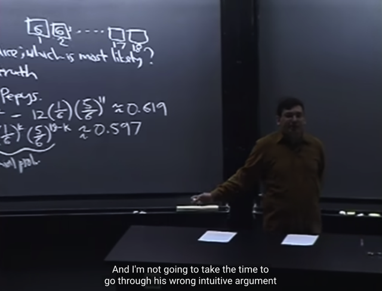</kbd></p>

> [!NOTE]
> Và gs B cho biết (18 choose k) * `(1/6)^k` * `(5/6)^(18-k)` cũng chính là
> **BINOMIAL PROBABILITY
>
> Cho thấy A chính là event có xác suất cao nhất**Điểm thú vị là Newton tuy tính đúng, nhưng khi ông cố gắng lập luận thì ông
> đã mắc sai lầm. Gs cho biết phần lập luận của Newton rất khó hiểu, và **một
> nhà toán học khác đã chứng minh, rằng tuy khó hiểu, nhưng chắc chắn
> Newton đã lập luận sai** khi trong đó ông đã luôn dựa trên giả định rằng các
> dice fair.

<br>

<a id="node-82"></a>

<p align="center"><kbd>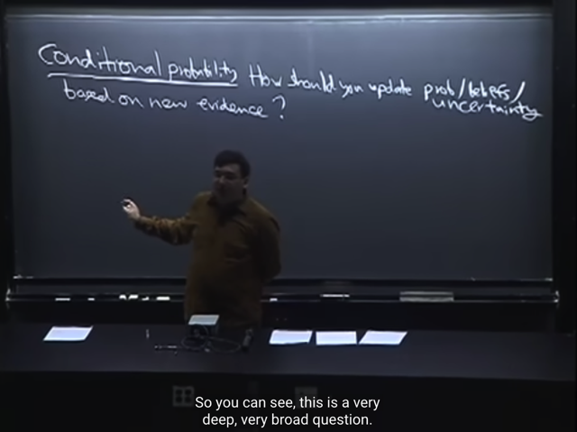</kbd></p>

> [!NOTE]
> Ta sẽ qua nội dung quan trọng: **Conditional probability**.
>
> Đầu tiên gs đề nghị ta ví von thế này: Ta đã biết, xác suất là nhánh toán giúp ta
> deal với sự không chắc chắn của thế giới. Thế thì, trong cuộc sống ta luôn **có
> một niềm ti**n ban đầu, mức độ tin tưởng nào đó về điều không chắc chắn.
> Nhưng **mỗi ngày trôi qua, ta luôn học thêm một điều gì đó mới mẻ.**
>
> Câu hỏi đặt ra là, VỚI **NHỮNG ĐIỀU MỚI HỌC** ĐƯỢC, TA SẼ **CẬP
> NHẬT** MỨC ĐỘ TIN TƯỞNG, NIỀM TIN HAY SỰ KHÔNG CHẮC CHẮN CỦA
> MÌNH NHƯ THẾ NÀO,.

<br>

<a id="node-83"></a>

<p align="center"><kbd>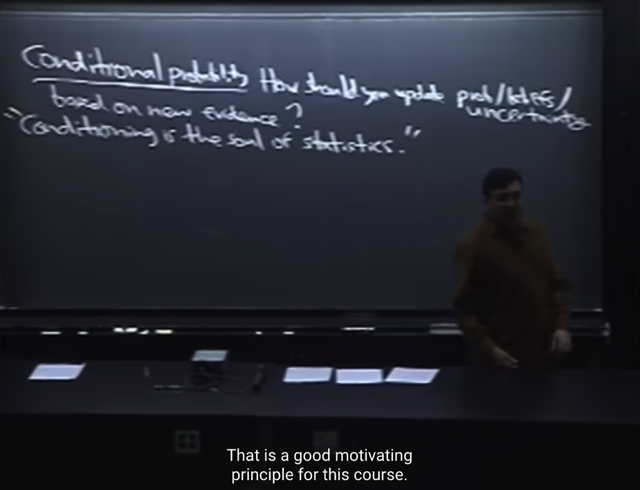</kbd></p>

> [!NOTE]
> Và theo gs, **Conditioning** là **linh
> hồn của xác suất thống kê**

<br>

<a id="node-84"></a>

<p align="center"><kbd>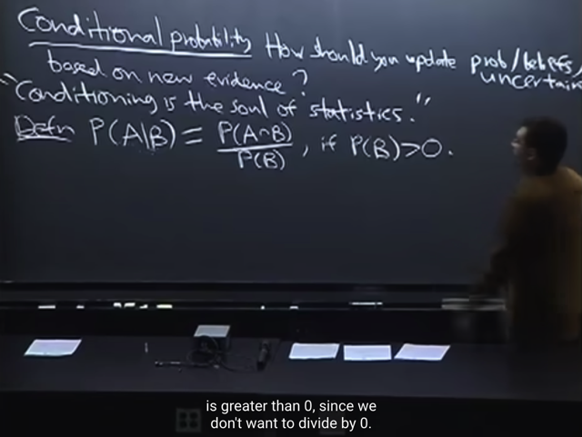</kbd></p>

🔗 **Related:** [TÓM TẮT:  - Tiếp tục Expo(λ): PDF CỦA EXPO(λ): f(x) = λ e^(-λx) x > 0  - Check tính valid của PDF của Expo  - CDF CỦA EXPO(λ) : F_X(x) = 1 - e^(-λx)  - X ~ Expo(λ) thì  Y = λX thì Y sẽ ~ Expo(1)  - Chứng minh rằng X ~ Expo(λ) thì  Y = λX thì Y sẽ ~ Expo(1)  - EX OF EXPO(1) = 1  - VARIANCE OF EXPO(1) = 1  - X~EXPO(λ) thì Y= λX sẽ ~EXPO(1)   EY = 1 ⇨ E(X) = E(Y/λ) = 1/λ EY = 1/λ  VARIANCE OF EXPO(λ) = 1/λ^2  Var(Y) = 1 ⇨ Var(X) = Var(Y/λ) = (1/λ^2) Var(Y) = (1/λ^2)  Memoryless thể hiện bởi equation: P(X ≥ s+t | X ≥ s) = P(X ≥ t)  chứng minh nếu X ~ Expo(λ) thì nó sẽ thỏa mãn Memoryless equation   P(X ≥ s), thì cái này gọi là Survivor function  Survivor function với X~Expo(λ): P(X ≥ s) = e^(-λs)  -Nhờ tính chất Memoryless nên nếu X~Expo(λ) E(X|X > a) = a + 1 / λ](tóm_tắt_tiếp_tục_expoλ_pdf_của_expoλ_fx_λ_e_λx_x_0_check_tính_valid_của_pdf_của_expo_cdf_của_expoλ_f_xx_1_e_λx_x_expoλ_thì_y_λx_thì_y_sẽ_expo1_chứng_minh_rằng_x_expoλ_thì_y_λx_thì_y_sẽ_expo1_ex_of_expo1_1_variance_of_expo1_1_xexpoλ_thì_y_λx_sẽ_expo1_ey_1_ex_eyλ_1λ_ey_1λ_variance_of_expoλ_1λ2_vary_1_varx_varyλ_1λ2_vary_1λ2_memoryless_thể_hiện_bởi_equation_px_st_x_s_px_t_chứng_minh_nếu_x_expoλ_thì_nó_sẽ_thỏa_mãn_memoryless_equation_px_s_thì_cái_này_gọi_là_survivor_function_survivor_function_với_xexpoλ_px_s_e_λs_nhờ_tính_chất_memoryless_nên_nếu_xexpoλ_exx_a_a_1_λ.md#node-505)

> [!NOTE]
> Thế thì định nghĩa của conditional probability, kí hiệu P(A|B) mang ý nghĩa
> là:
>
> Xét sự kiện A, như đã biết, ta gọi P(A) là xác suất nó xảy ra.
>
> Thế thì, xét sự kiện B. Giả sử B đã xảy ra. Thế thì **nếu B không liên quan
> gì đến A** (B irrelevant A) thì **việc B xảy ra** **không cho biết thêm gì về (khả
> năng xảy ra của) A**.
>
> Nhưng n**ếu sự kiện B có liên quan đến A**. Khi đó **việc B xảy ra** sẽ **CẬP
> NHẬT THÊM THÔNG TIN**, giúp ta có thể **đánh giá lại xác suất A xảy ra**
>
> Theo định nghĩa P(A|B) `=` P(A,B) `/` P(B). với điều kiện P(B) > 0
>
> Ta sẽ hiểu cái này như thế nào.

> [!NOTE]
> ĐỊNH NGHĨA CỦA CONDITIONAL PROBABILITY

<br>

<a id="node-85"></a>

<p align="center"><kbd>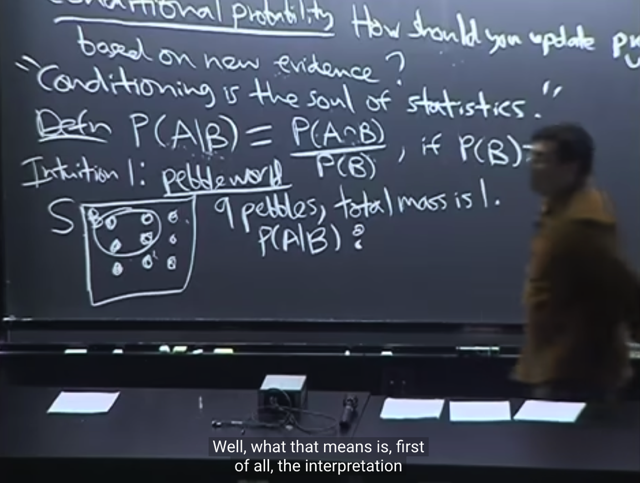</kbd></p>

🔗 **Related:** [LEC 19: JOINT, CONDITIONAL AND MARGINAL DISTRIBUTION](untitled.md#node-613)

> [!NOTE]
> Gs nói về cách hiểu cái này như sau:
>
> Gỉa sử ta có sample space S, với 9 viên sỏi (pepble) đại diện do 9
> **possible outcome**. Tổng khối lượng của chúng là 1 (mỗi viên có thể có
> pass `=` `1/9` theo như naive definition, nhưng cũng có thể không có P
> khác nhau theo `non-naive` definition).
>
> Như đã biết **event là subset của sample space**. Gọ**i event B là subset chứa
> 4 possible outcome này**

<br>

<a id="node-86"></a>

<p align="center"><kbd>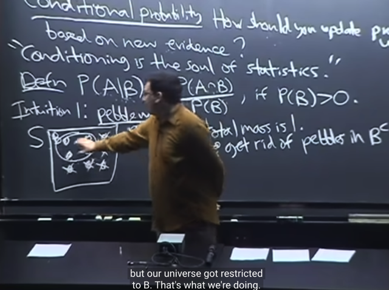</kbd></p>

🔗 **Related:** [TÓM TẮT:  - Bài toán Monty Hall  - Giải bằng sơ đồ nhánh   - Giải bằng LOTP  - Simpson paradox  - Controller/](tóm_tắt_bài_toán_monty_hall_giải_bằng_sơ_đồ_nhánh_giải_bằng_lotp_simpson_paradox_controller.md#node-141)

> [!NOTE]
> Thế thì **ý nghĩa của P(A|B)**: **B đã xảy ra**, nên đồng nghĩa **các possible
> outcome không thuộc B không thể xảy ra**, **trở nên irrelevant** (ko liên
> quan nữa), nên ta **bỏ đi các possible outcome trong B_c**

<br>

<a id="node-87"></a>

<p align="center"><kbd>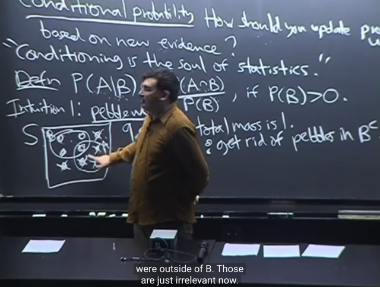</kbd></p>

> [!NOTE]
> Và gỉa sử A là subset có 4 possible outcome này, thì **sau khi có B**, (và từ đó
> **bỏ đi các possible outcome không thuộc B**) thì **A chỉ còn có một possible
> outcome có thể xảy ra**
>
> Suy ngẫm 1 chút. Trước khi biết B xảy ra, thì có 4 possible outcome của A có
> thể xảy ra. Nhưng sau khi biết B xảy ra thì chỉ còn có 1 possible outcome của
> A có thể xảy ra thôi.
>
> Và cái possible outcome này chính là (A ∩ B). mang ý nghĩa là:
>
> Việc **event A xảy ra lúc này trở thành `/` đồng nghĩa event (A ∩ B) xảy
> ra**
>
> Và đương nhiên **xác suất của A xảy ra lúc này chính là xác suất xảy ra cái
> outcome chung của A và B.**
>
> Câu hỏi là tại sao lại chia cho P(B)?

<br>

<a id="node-88"></a>

<p align="center"><kbd>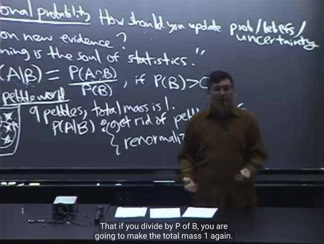</kbd></p>

> [!NOTE]
> Thì câu trả lời là, sau khi bỏ đi complement of B (tức B^c) ta sẽ **tiếp tục tính xác
> suất như thông thường**. Tuy nhiên vấn đề là **lúc này các possible outcome còn
> lại KHÔNG CÒN CÓ TỔNG MASS `=` 1 NỮA**. Do đó việc chia cho P(B) đơn giản
> chính là bước **RENORMALIZE**: **Để các possible outcome có tổng bằng 1 lại.**
> Gs cho rằng ta có thể **dùng algebra để chứng minh** điều này
>
> Ta giả sử possible outcome equally likely: mỗi cái đều có xác suất `=` `1/9`
>
> `->` P(B) `=` `4/9` (theo naive definition, vì event B chứa 4 possible outcomes, và
> sample space size là 9)
>
> ```text
> Dễ thấy sau khi chia cho P(B), P(mỗi outcome) sẽ là 1/9 : 4/9 = 1/4
> ```
>
> Điều này phù hợp với việc **sau khi bỏ B_complement**, **chỉ còn 4 possible
> outcomes** `->` mỗi outcomes sẽ có xác suất xảy ra là `1/4`

<br>

<a id="node-89"></a>

<p align="center"><kbd>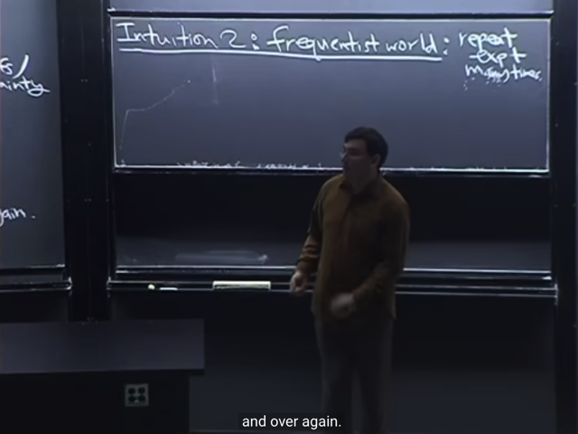</kbd></p>

> [!NOTE]
> tiếp, Intuition 1 có thể coi như cách hiểu về conditional probability theo quan
> điểm thứ nhất Pepple world nơi mà ta thực hiện thử nghiệm 1 lần, và đánh giá
> xác suất theo ý nghĩa là **KHẢ NĂNG** xảy ra. 
>
> Còn quan điểm thứ 2 là theo ý nghĩa**TẦN SUẤT xảy ra** khi ta t**hực hiện thử 
> nghiệm nhiều lần** (Frequentist)

<br>

<a id="node-90"></a>

<p align="center"><kbd>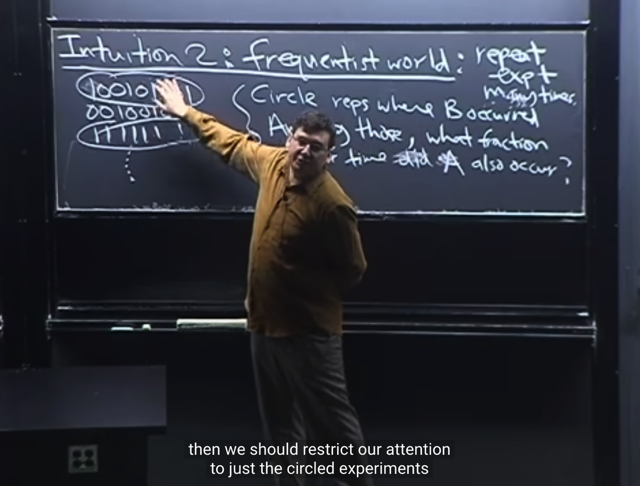</kbd></p>

> [!NOTE]
> Thế thì, với góc nhìn này, gỉa sử ta lấy ví dụ tạo các chuỗi binary thế này
> nhiều lần. Rồi, ta circle cái chuỗi thuộc event B.
>
> Câu hỏi là, hay ý nghĩa của P(A|B) đó là: **trong các event B**, **tỉ lệ bao nhiêu
> trong đó là event A**

<br>

<a id="node-91"></a>

<p align="center"><kbd>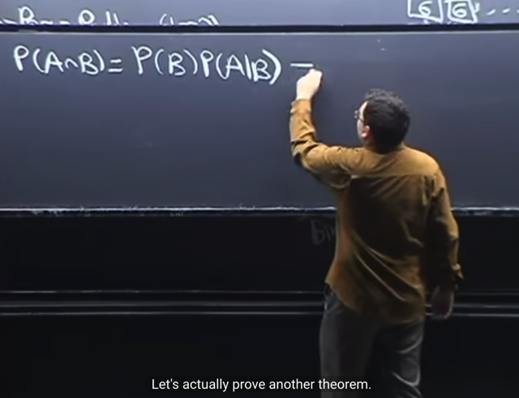</kbd></p>

> [!NOTE]
> Ta qua theorem đầu tiên **giúp tính P(A,B):**
>
> (việc chứng minh) rất đơn giản đó là từ định nghĩa của P(A|B) `=` P(A,B) `/` P(B)
>
> Ta **nhân 2 vế cho P(B)** là có ngay:
>
> **P(A,B) `=` P(B)*P(A|B)**
>
> Và gs nói rằng đó cũng cũng là chứng minh theorem

> [!NOTE]
> THEOREM: P(A ∩ B) `=` P(B)*P(A|B)

<br>

<a id="node-92"></a>

<p align="center"><kbd>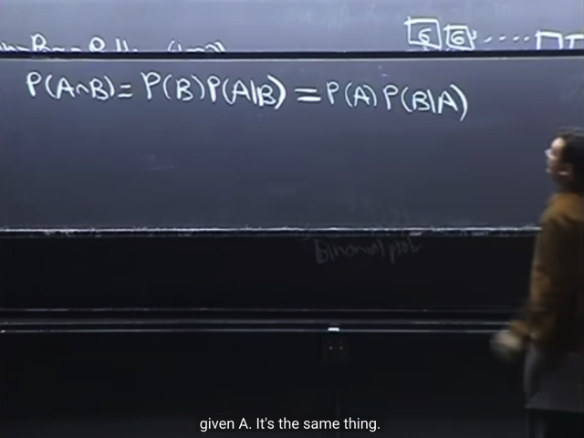</kbd></p>

🔗 **Related:** [TÓM TẮT:  Tiếp tục về conditional probability qua một số ví dụ  - Nói về việc để tính xác suất giống như diện tích của một hình phức tạp có thể dùng cách làm chia nhỏ S ra bởi một partion: P(B) = P(A1,B) + P(A2,B) + ...P(An,B) =  P(B)  = P(B|A1)*P(A1) + P(B|A2)*P(A2) + ....P(B|An)*P(An)  - Cái trên chính là LOTP: Law of Total Probability  - Chia S ra không đúng cách có thể khiến vấn đề phức tạp hơ,  thực hành nhiều sẽ có kinh nghiệm  - Ví dụ sampling hai lá bài, tính xác suất có 2 lá xì khi đã có một lá xì và xác suất cả hai lá xì khi đã có lá xì bích  - Ví dụ Disease test  - Complement rule P(A|B) = 1 - P(Ac|B)  - Một số sai lầm phổ biến liên quan đến conditional probability  - Định nghĩa về conditional independent](tóm_tắt_tiếp_tục_về_conditional_probability_qua_một_số_ví_dụ_nói_về_việc_để_tính_xác_suất_giống_như_diện_tích_của_một_hình_phức_tạp_có_thể_dùng_cách_làm_chia_nhỏ_s_ra_bởi_một_partion_pb_pa1b_pa2b_panb_pb_pba1pa1_pba2pa2_pbanpan_cái_trên_chính_là_lotp_law_of_total_probability_chia_s_ra_không_đúng_cách_có_thể_khiến_vấn_đề_phức_tạp_hơ_thực_hành_nhiều_sẽ_có_kinh_nghiệm_ví_dụ_sampling_hai_lá_bài_tính_xác_suất_có_2_lá_xì_khi_đã_có_một_lá_xì_và_xác_suất_cả_hai_lá_xì_khi_đã_có_lá_xì_bích_ví_dụ_disease_test_complement_rule_pab_1_pacb_một_số_sai_lầm_phổ_biến_liên_quan_đến_conditional_probability_định_nghĩa_về_conditional_independent.md#node-101)

> [!NOTE]
> Và chỉ việc swap A và B ta sẽ có thể chứng minh luôn rằng nó P(A, B) cũng
> chính là P(A)*P(B|A), đó là theorem thứ 2
>
> Và liên hệ với Independent event theorem ta đã có khi A, B independent thì
> P(A,B) `=` P(A)*P(B) (independent event)
>
> P(A,B) `=` P(A)*P(B) `=` P(B)*P(A|B)
>
> ⇨ P(A|B) `=` P(A)
>
> Và như vậy khi A, B độc lập thì P(A|B) `=` P(A) mang ý nghĩa là **khi A, B
> independent** thì **việc B xảy ra không cung cấp thêm thông tin gì** **về xác
> suất của A**. Để rồi **xác suất A xảy ra khi B đã xảy ra** **vẫn y nguyên** là
> **xác xuất của A riêng lẻ** (không biết B xảy ra hay không)

> [!NOTE]
> THEOREM: P(A)*P(B|A) `=` P(B)*P(A|B)

<br>

<a id="node-93"></a>

<p align="center"><kbd>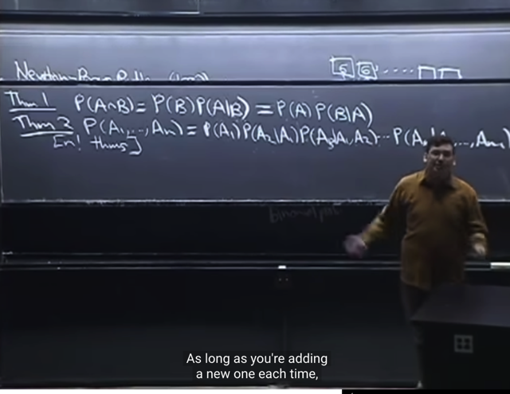</kbd></p>

> [!NOTE]
> Và theorem 2
>
> Và gs nói đùa rằng đây thực chất là n! theorem vì ta có thể bắt đầu với A7,
> sau đó là A4|A7....
>
> ý là P(A1, A2...An) có thể biểu diễn bởi chuỗi các event có n! hoán vị
>
> `=` P(A1)P(A2|A1)P(A3|A1,A2)....
>
> `=` P(A7)P(A2|A7)P(A3|A7,A2)...

> [!NOTE]
> THEOREM 
>
> P(A1, A2...An) có thể biểu diễn bởi chuỗi các event có n! hoán vị
>
> `=` P(A1)P(A2|A1)P(A3|A1,A2)....
>
> `=` P(A7)P(A2|A7)P(A3|A7,A2)...

<br>

<a id="node-94"></a>

<p align="center"><kbd>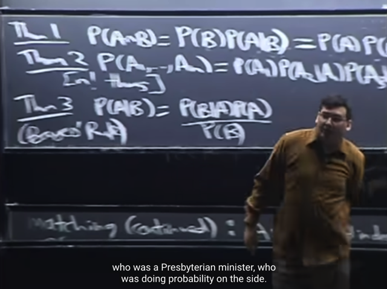</kbd></p>

> [!NOTE]
> Và chia hai vế của theorem 1: P(B)P(A|B) `=` P(A)P(B|A) cho P(B) ta
> sẽ có:
>
> P(A|B) `=` P(A)*P(B|A) `/` P(B)
>
> Và đây chính là **BAYES RULE là một trong những theorem** **CỰC
> KÌ QUAN TRỌNG**

> [!NOTE]
> BAYES THEOREM: P(A|B) `=` P(A)*P(B|A) `/` P(B)

<br>

