# Lec 5: Conditional Probability, Law Of Total Probability

📊 **Progress:** `36` Notes | `36` Screenshots

---

<a id="node-96"></a>
## Tóm Tắt:

> [!NOTE]
> TÓM TẮT:
>
> Tiếp tục về conditional probability qua một số ví dụ
>
> `-` Nói về việc để tính xác suất giống như diện tích của một hình
> phức tạp có thể dùng cách làm chia nhỏ S ra bởi một partion:
> ```text
> P(B) = P(A1,B) + P(A2,B) + ...P(An,B) =  P(B)
> ```
> `=` P(B|A1)*P(A1) `+` P(B|A2)*P(A2) `+` ....P(B|An)*P(An)
>
> `-` Cái trên chính là LOTP: Law of Total Probability
>
> `-` Chia S ra không đúng cách có thể khiến vấn đề phức tạp hơ,
>  thực hành nhiều sẽ có kinh nghiệm
>
> `-` Ví dụ sampling hai lá bài, tính xác suất có 2 lá xì khi đã có một lá xì
> và xác suất cả hai lá xì khi đã có lá xì bích
>
> `-` Ví dụ Disease test
>
> `-` Complement rule P(A|B) `=` 1 `-` P(Ac|B)
>
> `-` Một số sai lầm phổ biến liên quan đến conditional probability
>
> `-` Định nghĩa về conditional independent

<br>

<a id="node-97"></a>

<p align="center"><kbd>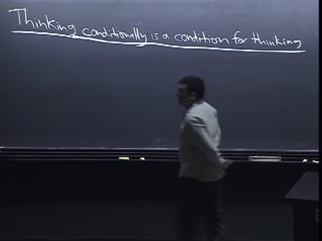</kbd></p>

> [!NOTE]
> Đại khái là bài này ta sẽ **tiếp tục với conditional probability**. Gs cho rằng
> tuy **công thức các theorem có vẻ đơn giản** nhưng ta **cần phải thực sự
> hiểu được bản chất của nó**.
>
> Nên bài này ta sẽ thảo luận một số ví dụ.
>
> Đầu tiên ông viết câu này: "Thinking conditionally is a condition for thinking"
> tạm dịch là khi suy nghĩ về một vấn đề, ta phải nghĩ về nó trong một điều
> kiện nào đó

<br>

<a id="node-98"></a>

<p align="center"><kbd>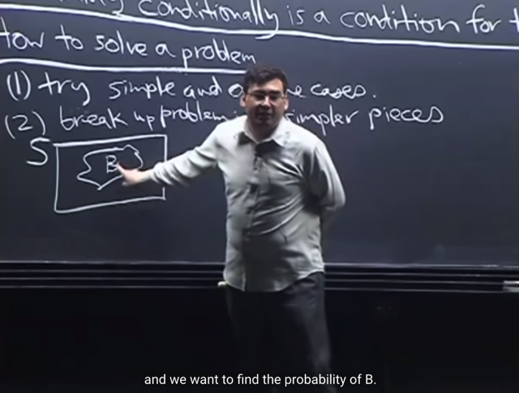</kbd></p>

> [!NOTE]
> ông nói tiếp về **cách giải một vấn đề (trong xác suất)**
>
> **Cách thứ nhất** đã nói trước đây, đó là **thử xét các simple case và extreme
> case**
>
> Và **cách thứ hai** hữu ích cho mọi lĩnh vực khác đó là **chia nhỏ vấn đề** và
> lặp lại việc này cho đến khi nào ta có rất nhiều các vấn đề rất đơn giản, khi đó
> ta **chỉ việc giải quyết từng vấn đề và gom lại**
>
> Thế thì lấy ví dụ ta cần tính xác suất của một event B, thể hiện trong  ven
> diagram là **một hình dạng như vầy**. **Giống như tính diện tích của cái hình
> có hình thù kì quặc vậy (đương nhiên tổng diện tích S `=` 1)**

<br>

<a id="node-99"></a>

<p align="center"><kbd>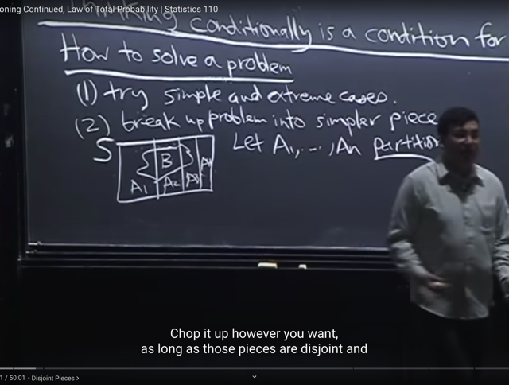</kbd></p>

> [!NOTE]
> Thế thì ta có thể **chia S ra thành các partition, A1, A2, ...An** **không nhất
> thiết phải là hình chữ nhật**, partition **ý chỉ là các vùng không chồng lấn**
> (disjoint) và **cùng nhau (union) sẽ tạo ra S.**

> [!NOTE]
> PARTITION

<br>

<a id="node-100"></a>

<p align="center"><kbd>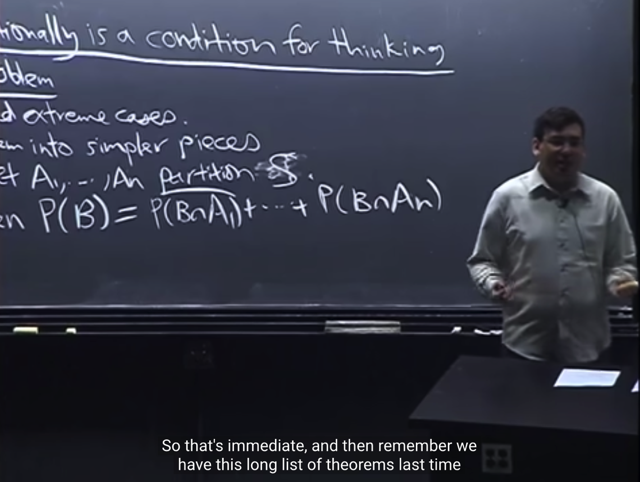</kbd></p>

🔗 **Related:** [TÓM TẮT:  - Bài toán Monty Hall  - Giải bằng sơ đồ nhánh   - Giải bằng LOTP  - Simpson paradox  - Controller/](tóm_tắt_bài_toán_monty_hall_giải_bằng_sơ_đồ_nhánh_giải_bằng_lotp_simpson_paradox_controller.md#node-145)

> [!NOTE]
> Khi đó, **hoàn toàn chỉ cần dựa vào Axiom 2** của xác suất ta sẽ có
>
> ```text
> Bởi vì B = (A1, B) U (A2, B) + ... U (An, B) nên P(B) = P((A1, B) U (A2,B) + ... U
> ```
> (An, B))
>
> (Nhờ Casella mà ta hiểu rõ hơn cái này: Xuất phát từ B ⊂ S ⇨ B ∩ S `=` B
> ⇔ B `=` B ∩ (∪i Ai) (do ∪i Ai `=` S) ⇔ B `=` ∪i (B ∩ Ai) (distributive law) ⇨ P(B)
> `=` P(∪i (B ∩ Ai))
>
> **mà A1, A2...An disjoint nên các event (A1,B); (A2,B);...(An,B) cũng disjoint**nên theo Axiom 2 ta có xác suất của union của các disjoint event chính là bằng
> tổng của xác suất mỗi event:**=> P(P((A1, B) U (A2,B) `+` ... U (An, B))) `=` P(A1,B) `+` P(A2,B) `+` ...P(An,B)**và do đó **P(B) `=` P(A1,B) `+` P(A2,B) `+` ...P(An,B)**

<br>

<a id="node-101"></a>

<p align="center"><kbd>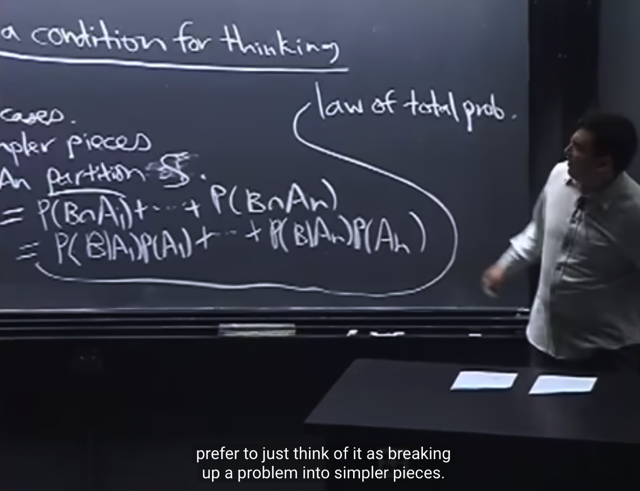</kbd></p>

🔗 **Related:** [TÓM TẮT:  - Tiếp tục Matching problem  - Định nghĩa về hai event độc lập  - Bài toán Newton-Peps  - Định nghĩa của conditional probability và cách hiểu về nó  - Các định lý liên quan](tóm_tắt_tiếp_tục_matching_problem_định_nghĩa_về_hai_event_độc_lập_bài_toán_newton_peps_định_nghĩa_của_conditional_probability_và_cách_hiểu_về_nó_các_định_lý_liên_quan.md#node-92)

> [!NOTE]
> Và tiếp P(B ∩ A1) hay P(B, A1) theo **conditional theorem** bữa trước ta
> đã biết
>
> **P(B, A1) `=` P(B|A1)*P(A1)** (và cũng bằng **P(A1|B)*P(B)**)
>
> do đó ta có thể ghi tiếp P(B) như vầy.
>
> **P(B) `=` P(B|A1)*P(A1) `+` P(B|A2)*P(A2) `+` ....P(B|An)*P(An)**
>
> Và gs cho biết đây chính là **LOTP**: **LAW OF TOTAL PROBABILITY**. Nhưng
> ông đề nghị **chỉ việc hiểu nó là việc ta chia nhỏ vấn đề** để tính B mà thôi

<br>

<a id="node-102"></a>

<p align="center"><kbd>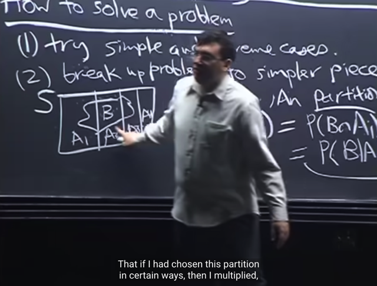</kbd></p>

🔗 **Related:** [TÓM TẮT:  Tiếp tục về conditional probability qua một số ví dụ  - Nói về việc để tính xác suất giống như diện tích của một hình phức tạp có thể dùng cách làm chia nhỏ S ra bởi một partion: P(B) = P(A1,B) + P(A2,B) + ...P(An,B) =  P(B)  = P(B|A1)*P(A1) + P(B|A2)*P(A2) + ....P(B|An)*P(An)  - Cái trên chính là LOTP: Law of Total Probability  - Chia S ra không đúng cách có thể khiến vấn đề phức tạp hơ,  thực hành nhiều sẽ có kinh nghiệm  - Ví dụ sampling hai lá bài, tính xác suất có 2 lá xì khi đã có một lá xì và xác suất cả hai lá xì khi đã có lá xì bích  - Ví dụ Disease test  - Complement rule P(A|B) = 1 - P(Ac|B)  - Một số sai lầm phổ biến liên quan đến conditional probability  - Định nghĩa về conditional independent](tóm_tắt_tiếp_tục_về_conditional_probability_qua_một_số_ví_dụ_nói_về_việc_để_tính_xác_suất_giống_như_diện_tích_của_một_hình_phức_tạp_có_thể_dùng_cách_làm_chia_nhỏ_s_ra_bởi_một_partion_pb_pa1b_pa2b_panb_pb_pba1pa1_pba2pa2_pbanpan_cái_trên_chính_là_lotp_law_of_total_probability_chia_s_ra_không_đúng_cách_có_thể_khiến_vấn_đề_phức_tạp_hơ_thực_hành_nhiều_sẽ_có_kinh_nghiệm_ví_dụ_sampling_hai_lá_bài_tính_xác_suất_có_2_lá_xì_khi_đã_có_một_lá_xì_và_xác_suất_cả_hai_lá_xì_khi_đã_có_lá_xì_bích_ví_dụ_disease_test_complement_rule_pab_1_pacb_một_số_sai_lầm_phổ_biến_liên_quan_đến_conditional_probability_định_nghĩa_về_conditional_independent.md#node-116)

🔗 **Related:** [TÓM TẮT:  - Tiếp tục Binomial distribution: 3 cách hiểu về rv ~ Bin(n, p)  - Định nghĩa về i.i.d  - CDF  - PMF cho Discrete random variables  - 2 tính chất để function là một valid PMF  - Binomial theorem  - Chứng minh X ~ Bin(n, p) và Y ~ Bin(m, p) thì (X+Y) ~ Bin(n+m, p)  Theo 3 cách  - Tìm PMF của X = số con xì khi sampling 5 lá từ bộ bài  - Khi sampling không hoàn lại thì X không phải là Binomial mà là HyperGeometric](tóm_tắt_tiếp_tục_binomial_distribution_3_cách_hiểu_về_rv_binn_p_định_nghĩa_về_iid_cdf_pmf_cho_discrete_random_variables_2_tính_chất_để_function_là_một_valid_pmf_binomial_theorem_chứng_minh_x_binn_p_và_y_binm_p_thì_xy_binnm_p_theo_3_cách_tìm_pmf_của_x_số_con_xì_khi_sampling_5_lá_từ_bộ_bài_khi_sampling_không_hoàn_lại_thì_x_không_phải_là_binomial_mà_là_hypergeometric.md#node-203)

> [!NOTE]
> Gs cho rằng statistic là vừa là khoa học vừa là nghệ thuật nên ta **càng thực
> hành nhiều**thì sẽ càng tốt.
>
> Phương pháp**chia nhỏ vấn đề** vừa nói **hữu ích hay không** tùy thuộc **CÁCH
> THỨC CHÚNG TA CHIA NHỎ VẤN ĐỀ** NHƯ THẾ NÀO.
>
> Nếu chia nhỏ S ra thành các phần A1, A2... **không đúng** cách ta có thể **biến
> 1 vấn đề phức tạp thành n vấn đề phức tạp**
>
> Nhưng phần lớn các bài toán, với kinh nghiệm ta sẽ thấy **CÓ THỂ CHIA S 
> GIÚP VIỆC TÍNH CÁC P(B|A1)*P(A1) rất ĐƠN GIẢN**
>
> Và thực hành nhiều sẽ giúp ta biết phải chia partition như thế nào

<br>

<a id="node-103"></a>

<p align="center"><kbd>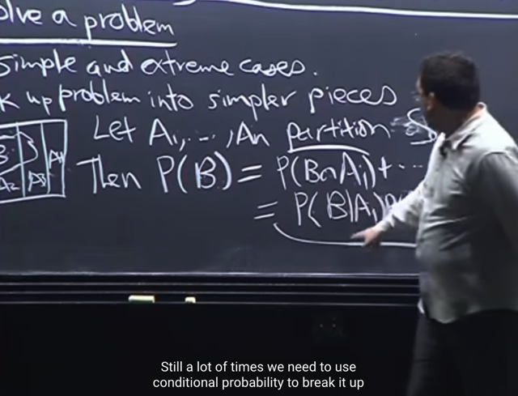</kbd></p>

> [!NOTE]
> tiếp, gs đặt câu hỏi là **tại sao conditional probability lại quan trọng?**
>
> Là bởi thứ nhất, như đã nói bữa trước, **nó xuất hiện rất nhiều**. Vì nó liên quan
> đến việc k**hi ta có thêm hiểu biết về một vấn đề** thì ta sẽ **update lại tính chắc
> chắn của nó**.
>
> Và thứ hai, như có thể thấy, **dù ta chỉ đang muốn tính một unconditional
> probability P(B)**, nhưng **để tính nó**, nhiều khi ta **sẽ cần dùng conditional
> probability**

<br>

<a id="node-104"></a>

<p align="center"><kbd>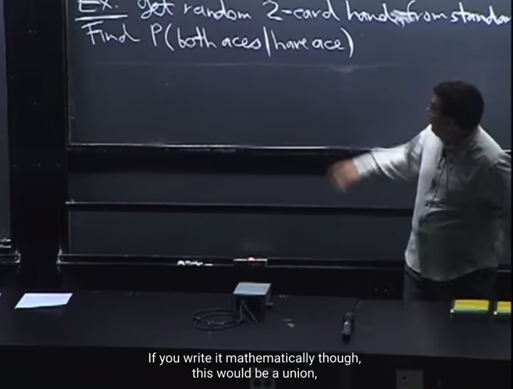</kbd></p>

> [!NOTE]
> ví dụ, thực hiện động tác **lấy ngẫu nhiên 2 lá bài** từ bộ bài tiêu chuẩn.
>
> Câu hỏi là **giả sử đã có một lá xì**, thì**xác suất ta có 2 lá xì là bao nhiêu**.
>
> **P(lấy được 2 lá xì | lấy được 1 lá xì) `=` ?**
>
> Đây là gs **định nghĩa event bằng lời**, ông cho rằng nếu muốn define bằng
> kí hiệu thì event B (lấy được 1 lá xì) là **(Lá 1 `=` xì U Lá 2 là xì) (hoặc `/` union)**Và như event A, cả hai lá đều xì sẽ là **(Lá 1 là xì, Lá 2 là xì)** (và `/` intersect)****Ta cần tính **P(A|B)**

<br>

<a id="node-105"></a>

<p align="center"><kbd></kbd></p>

> [!NOTE]
> Và câu hỏi thứ hai là **P(cả hai lá đều
> là xì | đã có lá xì bích) ?**

<br>

<a id="node-106"></a>

<p align="center"><kbd>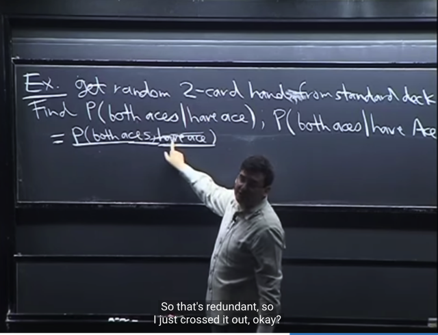</kbd></p>

> [!NOTE]
> Thế thì ta sẽ giải quyết câu 1. Theo **conditional probability theorem**:
>
> P(A|B) `=` `P(A,B)/P(B)`
>
> Vậy P(A,B) ở đây là **P(both aces, have ace)**. Thế thì, vì trong trường hợp này
> **'both aces' cũng sẽ chứa `/` bao hàm 'have aces"**- t'c là **event 'có ít nhất một
> lá xì' đương nhiên là subset của event 'cả hai lá đều xì'** nên
>
> Để chặt chẽ có thể chứng minh: both aces ⊂ have ace: Gỉa sử s là p.o ∈ both
> ace, tức là nó là một kết quả (rút 2 lá), mà cả hai lá là ace, vậy thì vì tập have
> ace là tập mọi p.o có các outcome chứa ít nhất một lá ace, nên dễ thấy s cũng
> thuộc tập này. Và một theorem trong sách Casella đã chứng minh nếu A ⊂ B ⇨
> A ∩ B `=` A
>
> **⇨ both ace**⊂**have ace ⇨ (both aces ∩ have ace) `=` both ace
>
> ⇨ P(both aces, have ace) `=` P(both aces)**
>
> Theo conditional probability definition:
>
> P(both aces | have ace) `=` P(have ace) `/` P(both ace ∩ have ace)
>
> `=` **P(both aces) `/` P(have ace)**Và ta sẽ **tính hai cái trên theo naive definition**, vì ở đây mọi kết quả (possible
> outcome) khi rút 2 lá bài đều equally likely
>
> me: Thử tính trước:
>
> P(both aces) hay xác suất bốc được 2 lá aces từ bộ bài 52 lá.
>
> `-` Sample space: vì experiment là bốc hai lá không quan tâm thứ tự, nên số
> possible  outcomes là số cách cách chọn set 2 lá bài theo lối sampling không
> hoàn lại và  không care thứ tự từ 52 lá: (52 choose 2)
>
> `-` Event space: số possible outcome mà cả hai lá đều là xì, chính là số cách chọn
> set 2  lá xì không care thứ tự  từ 4 lá xì: (4 choose 2)
>
> `=>` **P(both aces)** `=` **(4 choose 2) `/` (52 choose 2)**
>
> P(have aces), xác suất chọn được ít nhất một lá x, ta sẽ tính complement của
> nó: xác suất không có là nào ra xì:
>
> `-` Sample space: Vẫn là số cách chọn set 2 lá từ 52 lá: (52 choose 2)
>
> `-` Event space: Số bộ 2 lá chọn từ 48 lá khác xì: (48 choose 2)
>
> Vậy P(have `aces_c)` `=` (48 choose 2) `/` (52 choose 2)
>
> `=>` **P(have aces) `=` 1 `-` P(have `aces_c)`
>
> `=` 1 `-` (48 choose 2)** **/ (52 choose 2)**====
>
> Hoặc tính P(have ace) cách khác:
>
> P(lá 1 `=` xì U lá 2 `=` xì)
>
> nên ta tính complement của nó theo De Morgan's Law nói rằng
>
> "Complement của unions `=` Intersection of complement"
>
> Nên: (lá 1 `=` xì U lá 2 `=` xì) `=` (lá 1 khác xì) ∩ (lá 2 khác xì)
>
> ⇨ P(lá 1 `=` xì U lá 2 `=` xì) `=` P[(lá 1 khác xì) ∩ (lá 2 khác xì)]
>
> ```text
> = P(lá 1 khác xì) * P(lá 2 khác xì) = (48/52)*(47/51) = 48*47 / 52*51
> ```
>
> ⇨ P(have ace) `=` 1 `-` `48*47/52*51`
>
> (Kết quả của hai cách quả thật là giống nhau:
>
> ```text
> 1 - (48 choose 2) / (52 choose 2) = 1 - (48!/2!46!)/(52!/2!/50!) = 1 - (48!50!/46!52!)
> ```
>
> `=` 1 `-` `(48*47/52*51)`

<br>

<a id="node-107"></a>

<p align="center"><kbd>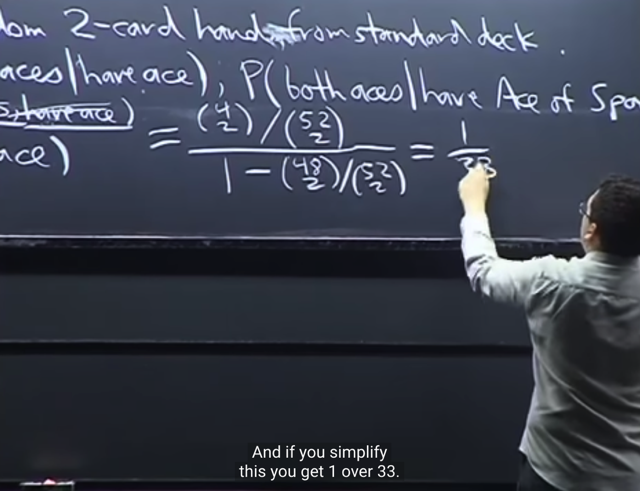</kbd></p>

> [!NOTE]
> gs: Correct! và nó ra **1/33**

<br>

<a id="node-108"></a>

<p align="center"><kbd>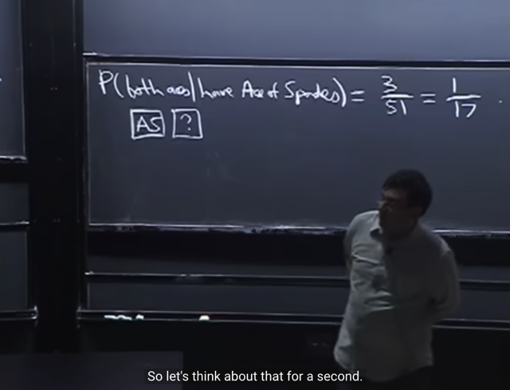</kbd></p>

> [!NOTE]
> Qua câu hai `-` tính P(both ace | ace of spade)
>
> gs cho rằng ta có thể lập luận tương tự câu 1. Nhưng cách lập luận đơn
> giản hơn đó là:
>
> Vẽ hai lá bài như này, và ta **đã có một lá Ace of Space**. Lá kia chưa biết.
> Thế thì **xác suất P(both aces| have ace of Space)** sẽ trở thành **xác suất lá
> còn lại là Ace**. Và dễ dàng tính theo naive definition:
>
> Sample space: 51 (vì giờ coi như bộ bài mất 1 lá AS)
>
> Event space: 3: Chỉ có 3 lá ace trong đó.
>
> Kết quả là `3/51` `=` 1 `/` 17 `=` **2/34** gần gấp đôi P(both ace | have ace) `=` `1/33`
>
>
> `====`
>
> Bàn thêm một chút: Cách tính này chính là phản ánh ý nghĩa của conditional
> probability: Khi B đã xảy ra, nó trở thanh sample space mới, để rồi việc A có
> xảy ra hay không chính là việc A ∩ B có xảy ra hay không. Nên để tính P(A|B)
> thì chính là ta tính P(A ∩ B) có điều để renormalize lại thỏa tổng xác suất bằng
> 1 khi sample space trở thành B thì ta phải chia P(A ∩ B) cho P(B). 
>
> Thế thì ở đây, cái việc ta tính P(both ace | ace of spade) sở dĩ là `3/51` là vì:
>
> Sample space bây giờ là B. Tính số p.o trong B là các p.o có ít nhất một lá là xì bích
> có nghĩa là nó là tập mọi bộ 2 lá mà trong đó một lá là xì bích. Dễ thấy số lượng
> cũa nó chính là số lựa chọn của lá còn lại: 51
>
> Event (A ∩ B) có thể coi là event A trong sample space mới: tức là chỉ xét những
> cặp `Ace-Ace` trong sample space B. Và điều này đồng nghĩa số lượng chính là số
> lá Ace trong 51 lá: Có 3 lá.
>
> Tính P(A) trong sample space mới theo naive definition: `3/51.`
>
> Nếu tính bằng P(A ∩ B) `/` P(B) thì cũng ra vậy: 
>
> P(B): tức là tính xác suất của B trong sample space gốc `=` [số po trong B] * xác suất 
> một outcome.
>
> P(A ∩ B) `=` P(A) do A ⊂ B, P(A) `=` [số po trong A ∩ B] * xác suất một outcome
>
> ⇨ P(A|B) `=` [số po trong A ∩ B]] `/` [số po trong B]
>
> [số po trong A ∩ B]: tức là đếm số po mà hai lá đều là Ace và có một lá là Ace of spade: 
>
> dĩ nhiên chính là số lá Ace còn lại: 3
>
> [số po trong B]: tức là đếm số po mà một lá là Ace of space: 1*51
>
> ```text
> Kết quả: 3 / 51 = 3/51 = 4*3*2/51
> ```
>
> Qua đây để hiểu sâu hơn bản chất của P(A|B) `=` P(A ∩ B) `/` P(B) là cập nhật sample
> space S thành B thì P(A|B) chính là P(A) trong sample space mới.
>
> `====`
>
> Vậy có thể tính P(both ace | have ace) theo cách này không. Vấn đề là ở case này khi
> B là have ace thì ta không biết lá ace cụ thể nào. Nên do đó không biết sample space
> mới là gì.
>
> Nếu ta biết cụ thể ace là ace spade như ví dụ trên, thì ta có thể xác định sample space 
> mới (là B) là tập các po trong sample space cũ S mà một lá là ace spade: Có nghĩa là
> ta có thể khoanh vùng lại để xét các kết quả mà một lá trong đó là xì bích thôi. Để rồi
> ta có thể đếm số po của A trong sample space mới là 3
>
> Còn đây, dù biết một lá là xì đã ra, nhưng không biết cụ thể là lá nào, nên không khoanh
> vùng được để mà tính theo lối đếm số po của A trong sample space mới.

<br>

<a id="node-109"></a>

<p align="center"><kbd>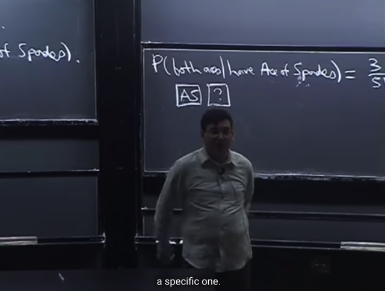</kbd></p>

> [!NOTE]
> Và đại khái là, dù **ví dụ có vẻ đơn giản** như ta có thể suy nghĩ để **gợi mở rất 
> nhiều vấn đề**. Tại sao lại như vậy, hai cái chỉ khác nhau ở chỗ, trường hợp
> 1 ta **không biết chất của lá Ac**e. Và trường hợp 2 ta **biết thêm chất của
> lá bài**. Mà xác suất có 2 lá Ace **tăng lên gấp đôi.**
>
> Gs khuyến khích ta suy nghĩ. Và gợi ý rằng. Điểm khác nhau đó quan trọng.
> Vì**việc biết chất là Space** giúp ta có thể **biết chắc chắn lá đầu tiên là lá 
> nào trong 4 lá Ace** (để rồi có thể vẽ ra 2 ô như vầy) **còn ở câu 1 ta chỉ biết đã
> có 1 lá Ace chứ không biết cụ thể là lá nào.**

<br>

<a id="node-110"></a>

<p align="center"><kbd>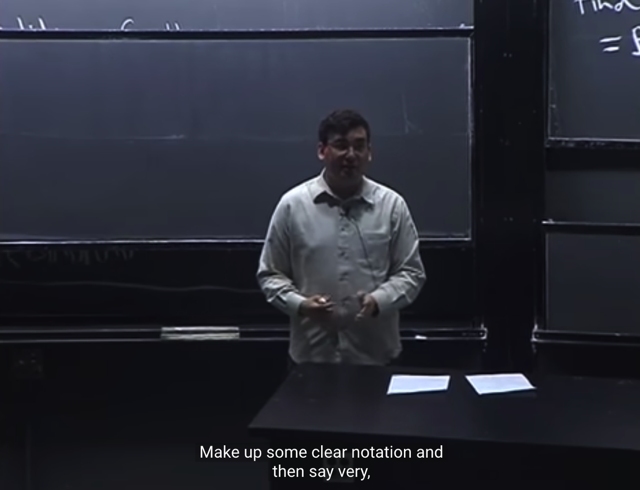</kbd></p>

> [!NOTE]
> Tiếp theo ta sẽ nói về một ví dụ về **Disease test** và qua đó ta sẽ nhớ
> về tầm quan trọng của việc khi làm homework, cần**phải DEFINE
> RÕ RÀNG CÁI MÀ TA MUỐN TÌM CÁI GÌ, GIVEN CÁI GÌ**

> [!NOTE]
> VÍ DỤ: DISEASE TEST

<br>

<a id="node-111"></a>

<p align="center"><kbd>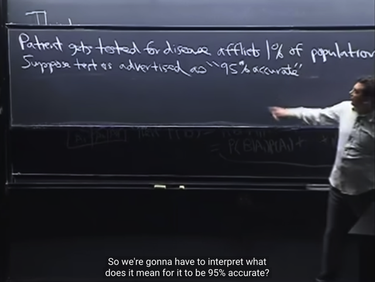</kbd></p>

> [!NOTE]
> Bài toán là, patient **xét nghiệm** một loại bệnh có **tỉ lệ mắc bệnh là 1%**
> trong cư dân. Và cho rằng **phương pháp xét nghiệm có độ chính xác
> 95%**

<br>

<a id="node-112"></a>

<p align="center"><kbd>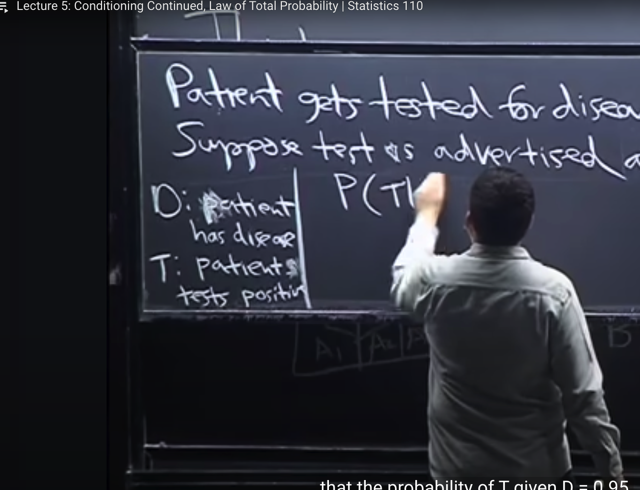</kbd></p>

> [!NOTE]
> Thế thì ta sẽ định nghĩa một số notation: D là event "**bệnh nhân BỊ BỆNH**"
>
> Và T là event "**bệnh nhân KẾT QUẢ XÉT NGHIỆM CÓ BỆNH**" (dương tính
> `/` positive)

<br>

<a id="node-113"></a>

<p align="center"><kbd>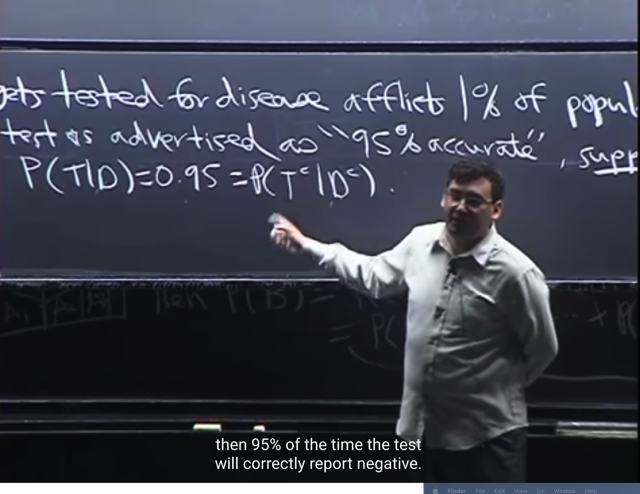</kbd></p>

> [!NOTE]
> Thế thì gs cho biết ta sẽ **diễn dịch `/` interpret con số 95%** là như sau:
>
> Nếu một người **thực sự có bệnh (event D đã xảy ra)**, thì xác suất (của event) 
> **kết quả xét nghiệm dương tính** (event T) sẽ là: 
>
> P(T|D) `=` 95%
>
> Và nó cũng là **nếu một người không có bệnh (event**Dc) thì xác suất (của
> event) **kết quả xét nghiệm ra âm tính** (Tc) là: 
>
> P(Tc|Dc) là 95%
>
> P(T|D) `=` P(Tc|Dc) `=` 95%

<br>

<a id="node-114"></a>

<p align="center"><kbd>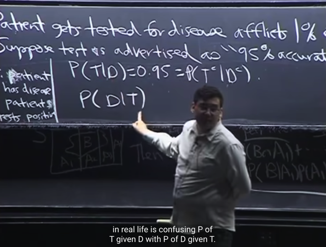</kbd></p>

> [!NOTE]
> Tuy nhiên đó chỉ là diễn dịch của con số 95%.
>
> Là xác suất [kết quả dương tính | bệnh nhân có bệnh]: P(T|D)
>
> Trong khi đó, cái **bệnh nhân quan tâm** là:
>
> **Xác suất** [**họ có bệnh | kết quả xét nghiệm là dương tính**]: **P(D|T)**
>
> Và đây là**SAI LẦM PHỔ BIẾN TRONG STATISTIC LÀ KHÔNG PHÂN
> BIỆT ĐƯỢC HAI CÁI NÀY P(T|D) VÀ P(D|T)**

<br>

<a id="node-115"></a>

<p align="center"><kbd>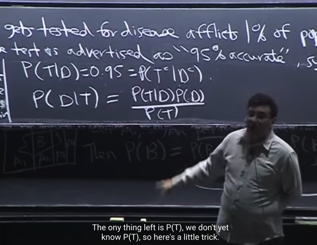</kbd></p>

> [!NOTE]
> Thế thì ta đã biết hai cái này liên hệ nhau qua **Bayes rule**:
>
> P(T|D)*P(D) `=` P(D|T)*P(T) `=>` **P(D|T) `=` P(T|D)*P(D)/P(T)**
>
> Thế thì trong đó, P(D) ta đã có `-` chính là **xác suất mắc bệnh trong dân cư**
> **1%**. Ta **cần tìm** **P(T) `-` xác suất kết qủa test dương tính**
>
> Thế thì ông nói rằng ta thấy trong nhiều sách ghi về Bayes rule có phần mẫu số
> phức tạp, ông cho rằng công thức đó là khi đã áp dụng Law of total probability 
> để tính mẫu số chứ còn Bayes rule thì như này thôi

<br>

<a id="node-116"></a>

<p align="center"><kbd>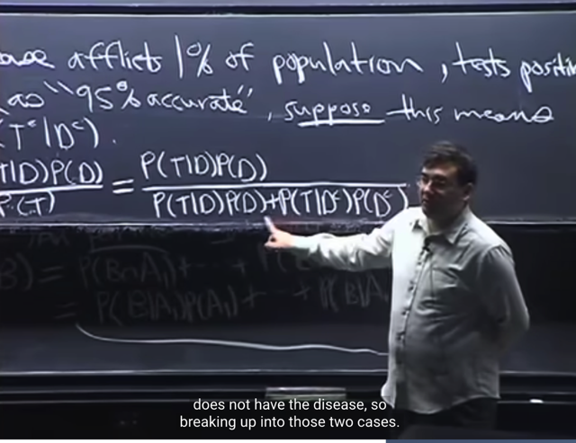</kbd></p>

🔗 **Related:** [TÓM TẮT:  Tiếp tục về conditional probability qua một số ví dụ  - Nói về việc để tính xác suất giống như diện tích của một hình phức tạp có thể dùng cách làm chia nhỏ S ra bởi một partion: P(B) = P(A1,B) + P(A2,B) + ...P(An,B) =  P(B)  = P(B|A1)*P(A1) + P(B|A2)*P(A2) + ....P(B|An)*P(An)  - Cái trên chính là LOTP: Law of Total Probability  - Chia S ra không đúng cách có thể khiến vấn đề phức tạp hơ,  thực hành nhiều sẽ có kinh nghiệm  - Ví dụ sampling hai lá bài, tính xác suất có 2 lá xì khi đã có một lá xì và xác suất cả hai lá xì khi đã có lá xì bích  - Ví dụ Disease test  - Complement rule P(A|B) = 1 - P(Ac|B)  - Một số sai lầm phổ biến liên quan đến conditional probability  - Định nghĩa về conditional independent](tóm_tắt_tiếp_tục_về_conditional_probability_qua_một_số_ví_dụ_nói_về_việc_để_tính_xác_suất_giống_như_diện_tích_của_một_hình_phức_tạp_có_thể_dùng_cách_làm_chia_nhỏ_s_ra_bởi_một_partion_pb_pa1b_pa2b_panb_pb_pba1pa1_pba2pa2_pbanpan_cái_trên_chính_là_lotp_law_of_total_probability_chia_s_ra_không_đúng_cách_có_thể_khiến_vấn_đề_phức_tạp_hơ_thực_hành_nhiều_sẽ_có_kinh_nghiệm_ví_dụ_sampling_hai_lá_bài_tính_xác_suất_có_2_lá_xì_khi_đã_có_một_lá_xì_và_xác_suất_cả_hai_lá_xì_khi_đã_có_lá_xì_bích_ví_dụ_disease_test_complement_rule_pab_1_pacb_một_số_sai_lầm_phổ_biến_liên_quan_đến_conditional_probability_định_nghĩa_về_conditional_independent.md#node-102)

🔗 **Related:** [LEC 3: BIRTHDAY PROBLEM, PROPERTIES OF PROBABILITY](untitled.md#node-50)

> [!NOTE]
> Vậy **P(T) để vậy thì khó tìm** nhưng **áp dụng phương pháp chia nhỏ vấn
> đề** khi nãy ta sẽ lập luận như sau (cũng là law of total probability LOTP):
>
> Nhớ lại hồi nãy ta chia S thành A1, A2...An disjoint thì B `=` (B,A1) U (B,A2) ....
> .(B,An) `=>` P(B) `=` P[(B,A1) U (B,A2) .....(B,An)]
>
> Thì ở đây chính là ta chia S ra làm 2 disjoint partition D và Dc và tổng của
> chúng là S, do đó ta có:
>
> ```text
> T = T ∩ S (do T ⊂ S) = T ∩ (D ∪ Dc) = (T, D) U (T, Dc) => P(T) = P[(T, D) U (T, Dc)]
> ```
>
> tiếp theo, thì vì D và Dc disjoint nên (T, D) và (T, Dc) cũng disjoint dẫn tới ta
> có thể dùng Axiom 2 của Probability để có tiếp:
>
> P[(T, D) U (T, Dc)] `=` P(T,D) `+` P(T,Dc).
>
> Rồi sau đó, ta sẽ **dùng theorem 2 của conditional probability**: P(A,B) `=`
> P(A|B)*P(B)
>
> P(T,D) `=` P(T|D)*P(D), và P(T,Dc) `=` P(T|Dc)*P(Dc)
>
> Vậy P(T) được break ra thành **P(T|D)*P(D) `+` P(T|Dc)*P(Dc)**giúp ta có thể
> tính dễ dàng.
>
> Đây cũng là dạng mà **một số sách ghi về Bayes rule**

<br>

<a id="node-117"></a>

<p align="center"><kbd>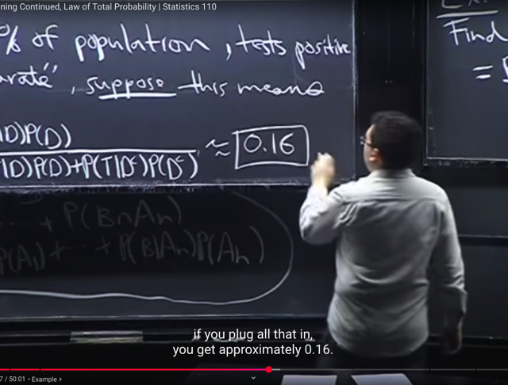</kbd></p>

> [!NOTE]
> Và tới đây, các term P(T|D), P(D) đều đã có, ta còn cần P(T|Dc) và P(Dc):
>
> `====`
>
> P(T|Dc) thì `=` 1 `-` P(Tc|Dc)
>
> Chứng minh như sau:
>
> Theo conditional theorem
>
> ```text
> P(T|Dc) + P(Tc|Dc) = P(T,Dc)/P(Dc) + P(Tc,Dc)/P(Dc)
> ```
>
> `=` [P(T,Dc) `+` `P(Tc,Dc)]/P(Dc)`
>
> Tiếp, vì T và Tc là disjoint, nên (T,Dc) disjoint (Tc,Dc) nên áp dụng Axiom 2:
>
> P[(T,Dc) U (Tc,Dc)] `=` P(T,Dc) `+` P(Tc,Dc)
>
> Và **(T,Dc) U (Tc,Dc) chính là Dc: Cái này không phải dựa vào  theorem**
> nào mà chỉ là logic thông thường: (T,Dc) là những gì của Dc mà nằm trong
> T. Và (Tc,Dc) là những gì của Dc mà nằm ngoài T Thành ra hai phần đó
> hợp lại chính là toàn bộ Dc. Đơn giản hơn: Dc ⊂ S ⇨ Dc `=` Dc ∩ S 
> `=` Dc ∩ (T ∪ Tc) `=` (Dc ∩ T) ∪ Dc ∩ Tc) (distributive law)
>
> Vậy:
>
> ```text
> = P(T|Dc) + P(Tc|Dc) = 1 => P(T|Dc) = 1 - P(Tc|Dc)
> ```
>
> `====`
>
> Còn P(Dc) `=` 1 `-` P(D).
>
> Thế vào hết ta sẽ có P(D|T) `=` 0.16

<br>

<a id="node-118"></a>

<p align="center"><kbd>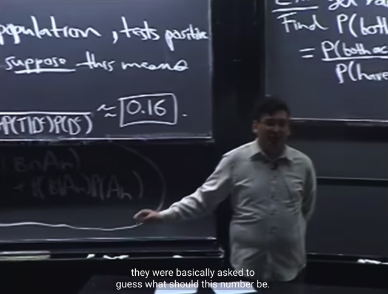</kbd></p>

> [!NOTE]
> gs: Điều này là một câu chuyện khá thú vị khi khi khảo sát các gs Harvard
> phần lớn đều cho ra kết quả đâu đó 70, 80%.
>
> Bài học là, ta nên thử test lại, và để đảm bảo các test independent, ta nên
> dùng cách test khác.

<br>

<a id="node-119"></a>

<p align="center"><kbd>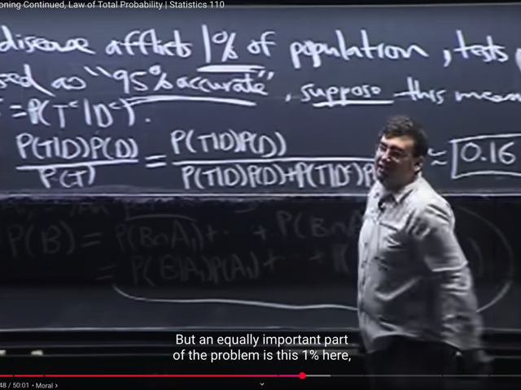</kbd></p>

> [!NOTE]
> và gs cho rằng, những **nhận định sai của con người** là do họ **quá
> tập trung vào con số 95%** mà **bỏ qua 1%** là con số cũng quan trọng
>
> và có nghĩa là trong tình huống này, **khả năng kết quả xét nghiệm sai
> thấp** nhưng **khả năng xuất hiện bệnh cũng rất thấp**. Và hai cái này
> **compete** nhau.

<br>

<a id="node-120"></a>

<p align="center"><kbd>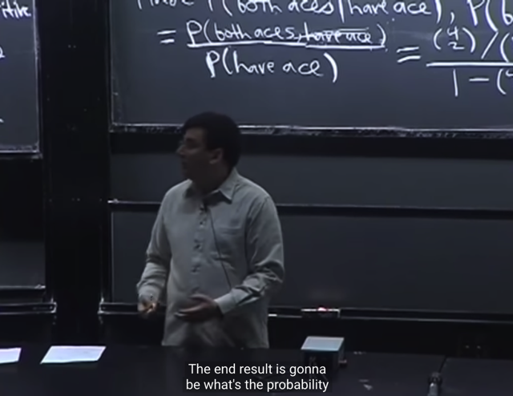</kbd></p>

> [!NOTE]
> đại khái là gs nói về **tính nhất quán (coherent) của Bayes rul**e: Nôm na
> là: Giả sử ta điều tra tội phạm trong đó ta có **xác suất một nghi phạm có
> tội**. Và ta **có 2 event**, tình tiết mới (clues).
>
> Thế thì ta có thể **dùng intersection của chúng để update xác suất**
>
> Hoặc cũng có thể lần lượt: **dùng cái thứ nhất, update xác suất sau đó**.
> Sau đó **dùng cái thứ 2, update xác suất.**
>
> Kết quả sẽ ra **giống nhau.**

<br>

<a id="node-121"></a>

<p align="center"><kbd>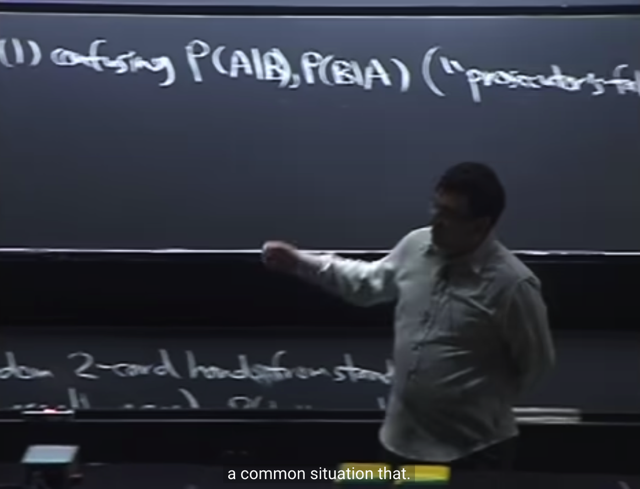</kbd></p>

> [!NOTE]
> gs nói qua **một số sai lầm phổ biến** liên quan đến conditional probability
>
> 1) **Lẫn lộn giữa P(A|B) và P(B|A)** còn có tên gọi là **Prosecutor's fallacy**(**Sai lầm của công tố viên**) nói về đại khái là lẫn lộn giữa:
>
> Xác suất [**nghi phạm có tội]** dựa trên [**bằng chứng có được**] `-` Đó là P(A|B)
> Và Xác suất [**bằng chứng xuất hiện**] dựa trên [**việc nghi phạm có tội**]. Đó
> chính là P(B|A)
>
> Thế thì câu chuyện là có một vụ án một **bà mẹ có 2 em bé bị chết**, không rõ lí
> do và người ta truy tố cô này với lập luận như sau:
>
> Xác suất một em bé tự nhiên chết không có lí do gì chỉ có `1/8500.` Và do đó xác
> ```text
> suất 2 đứa chết một cách khơi khơi ở đây sẽ là (1/8500)*(1/8500) = 1/mấy triệu
> ```
>
> Và từ đó ý là người ta quy kết bà mẹ có tội.
>
> Tức là, gs nói họ đang tính xác suất mà hai em bé chết trên giả định là bà mẹ vô
> tội: **P(die | innocent)** để rồi thấy nó quá thấp ⇨ P(dia | có tội) `=` 1 `-` P(die | innocent)
> là rất cao ⇨ có tội.
>
> Và họ đang **lẫn lộn nó với P(innocent | die).**Đây mới là cái cần tính.
>
> Và trong cách tính P(die | innocent), họ **cũng mắc sai lầm khi nhân
> (1/8500)*(1/8500)** vì điều này**chỉ đúng nếu ta có hai event độc lập**. Trong khi
> giả định này chưa chắc đúng **vì có thể vì lí do gì đó liên quan đến gen khiến 1
> đứa chết sẽ khiến khả năng đứa kia chết cao hơn**. Nhưng bỏ qua chuyện đó.
> Thì **nếu đúng ta phải tính P(innocent | die)**
>
> Và theo Bayes rule, ta sẽ cần tính thêm **P[innocent]** và **P[die]** để áp vào:
>
> P(innocent | die) `=` P(die | innocent) * **P(innocent)** `/` **P(die)**
>
> Thế thì khi đó **ta sẽ thấy rằng P[innocent] sẽ rất cao**, vì trong số hàng tỉ bà mẹ
> trên thế giới, **xác suất có bà mẹ giết con mình là rất thấp**.
>
> Và từng đó nếu như ta tính ra ta sẽ thấy, giống như ví dụ hồi nãy, P[innocent |
> die] sẽ rất cao `->` người mẹ vô tội

> [!NOTE]
> Một số sai lầm phổ biến liên quan đến conditional probability

<br>

<a id="node-122"></a>

<p align="center"><kbd>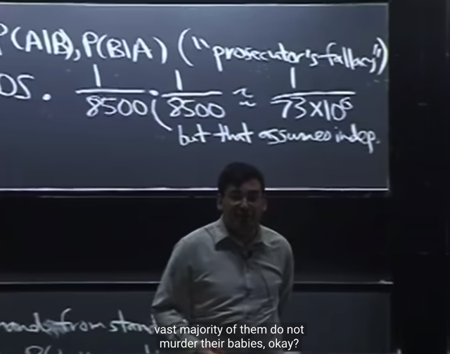</kbd></p>

<br>

<a id="node-123"></a>

<p align="center"><kbd>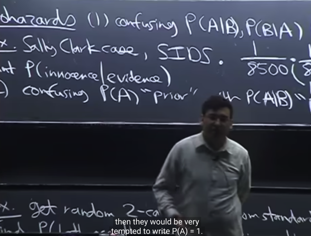</kbd></p>

<p align="center"><kbd></kbd></p>

<p align="center"><kbd>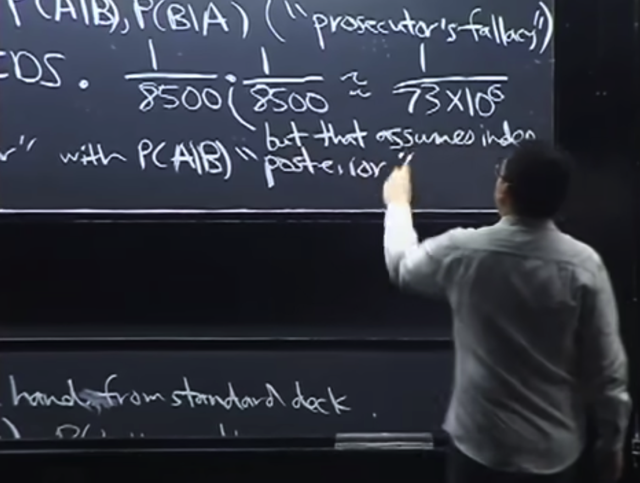</kbd></p>

> [!NOTE]
> Sai lầm thứ hai là **LẪN LỘN GIỮA PRIOR PROBABILITY P(A) VÀ
> POSTERIOR PROBABILITY P(A|B)**

<br>

<a id="node-124"></a>

<p align="center"><kbd>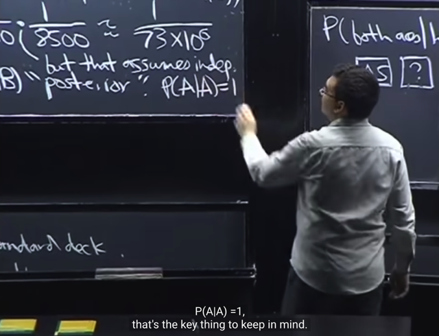</kbd></p>

> [!NOTE]
> Gs nói rằng, ví dụ như đề bài cho: **cho rằng sự kiện A đã xảy ra**... Thì nếu ta
> **dựa vào đó để phán rằng P(A) `=` 1 là SAI**. Vì điều đó **chỉ thể hiện P(A|A) `=` 1**
>
> Mang ý nghĩa là: **cho trước A đã xảy ra**, thì **DỰA VÀO ĐÓ** ta **biết A chắc
> chắn đã xảy ra** (xác suất bằng 1). Chứ ta **KHÔNG BIẾT GÌ về P(A)** `-` là xác
> suất A xảy ra nếu không có thông tin gì.
>
> Do đó gs: **PHẢI LUÔN CÂN NHẮC KĨ** TA SẼ **ĐỂ GÌ Ở BÊN PHẢI** VÀ **BÊN
> TRÁI DẤU VERTICAL BAR**

> [!NOTE]
> Cho rằng sự kiện A đã xảy ra... Thì nếu ta dựa vào đó để phán rằng P(A) `=`
> 1 là SAI. Vì điều đó chỉ thể hiện P(A|A) `=` 1

<br>

<a id="node-125"></a>

<p align="center"><kbd>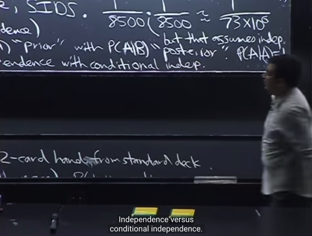</kbd></p>

> [!NOTE]
> Sai lầm phổ biến thứ 3 là LẪN LỘN GIỮA **INDEPENDENCE** VÀ
> **CONDITIONAL INDEPENDENCE**

<br>

<a id="node-126"></a>

<p align="center"><kbd>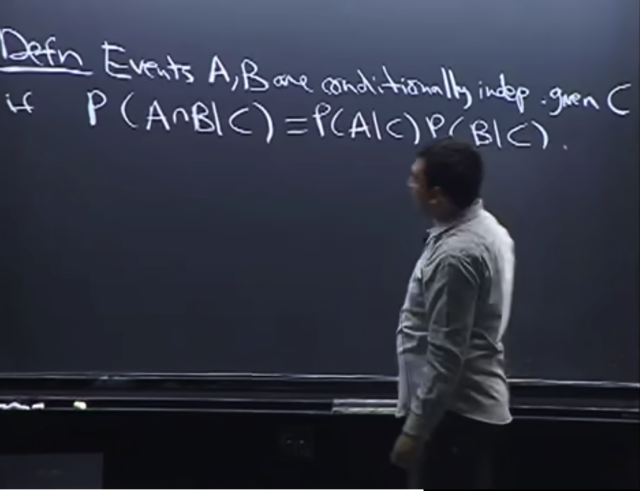</kbd></p>

> [!NOTE]
> Thế thì ta có **định nghĩa về CONDITIONAL INDEPENDENCE**: 
>
> A, B gọi là **conditionally independent given C** nếu:
>
> **P(A ∩ B | C)** `=` **P(A|C) * P(B|C)**
>
> Giống như định nghĩa Independent event. Nhưng **mọi thứ lúc này
> phải "conditioned on C"**

> [!NOTE]
> ĐỊNH NGHĨA VỀ CONDITIONAL INDEPENDENCE:
> P(A ∩ B | C) `=` P(A|C) * P(B|C)

<br>

<a id="node-127"></a>

<p align="center"><kbd>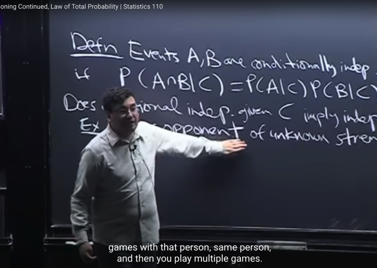</kbd></p>

> [!NOTE]
> Gs cho rằng có 2 câu hỏi tự nhiên sẽ nảy ra đó là:
>
> 1.Việc **conditional independent given C** có **tự nhiên imply independent** (tức là **nếu có
> conditional independent** thì có thể **ngụ ý cũng (unconditional)  independent** không)?
>
> Câu trả lời là **KHÔNG**.
>
> Đại khái là giả sử ta **đánh một chuỗi các ván cờ** với một ông đối thủ.
>
> Đầu tiên ta cần nhấn mạnh lại khái niệm **INDEPENDENT** **EVENT**: Đó là **XÁC SUẤT
> CỦA EVENT SAU KHÔNG BỊ ẢNH HƯỞNG BỞI KẾT QUẢ EVENT TRƯỚC**.
>
> Ví dụ trong tình huống này, nếu **KẾT QUẢ CÁC VÁN TRƯỚC** đều **KHÔNG ẢNH
> HƯỞNG** đến **XÁC SUẤT THẮNG của các ván sau đó** thì ta sẽ nói rằng chúng độc lập
>
> Thì gs cho rằng TUY thực tế có thể là nếu mình thắng ổng nhiều ván liên tiếp thì ổng sẽ
> chán nản để rồi đánh dở đi để rồi các ván sau sẽ dễ thắng hơn. Hoặc ngược lại ổng đánh
> càng tập trung hơn để các ván sau càng khó thắng hơn.
>
> Thế thì sẽ hợp lí hơn nếu ta ta **giả sử hai điều trên không xảy ra.**
>
> Có nghĩa là:
>
> **DÙ CÁC VÁN TRƯỚC CÓ KẾT QUẢ RA SAO**, THÌ **KHẢ NĂNG MÌNH THẮNG ÔNG
> ĐÓ Ở VÁN NÀY VẪN GIỮ NGUYÊN** NHƯ VẬY.
>
> Tức là nếu ổng đánh dở thì (và dẫn tới các ván trước ta đều thắng) thì xác suất mình thắng
> ổng ở ván sau (SẼ CAO) NHƯNG **KHÔNG TĂNG THÊM, HAY GIẢM ĐI** hay nếu ổng
> đánh hay thì xác suất ta thắng (SẼ THẤP) NHƯNG **KHÔNG TĂNG THÊM HAY GIẢM ĐI**
>
> Đây chính là **CONDITIONAL INDEPENDENT. P(THẮNG | TRÌNH ĐỘ CỦA ĐỐI THỦ X)**
>
> Tức là "**dựa trên một đối thủ cho trước**, thì **kết qủa các game đấu đều là các
> independen**t": [Thắng ván 1 | ông X], và [Thắng ván 2 | ông X] là event độc lập
>
> `====`
>
> Tuy nhiên nếu bỏ yếu tố điều kiện ra, tức là chỉ xét **P(thắng) thay vì P(thắng | đối thủ X)**
> thì ta sẽ thấy**các event (thắng ván 1), (thắng ván 2)...(thắng ván 10) không độc lập**.
>
> Ví dụ, ở ván đầu tiên, thì P(thắng 1) là 50%, nhưng sau 10 ván thắng liên tục, xác suất
> thắng không còn là 50% nữa mà sẽ cao hơn
>
> Lí do là vì nếu các ván trước đều thắng, điều đó sẽ giúp **bổ sung thông tin về trình độ của
> đối thủ**, giúp ta **biết xác suất thắng sẽ cao hơn**. Có nghĩa là **XÁC SUẤT CỦA VIỆC
> THẮNG GAME SAU BỊ ẢNH HƯỞNG BỞI KẾT QUẢ CÁC GAME TRƯỚC**.
>
> Do đó việc các conditional event [thắng ván i | đánh với ông X] độc lập không imply
> các event [thắng ván i] độc lập

<br>

<a id="node-128"></a>

<p align="center"><kbd>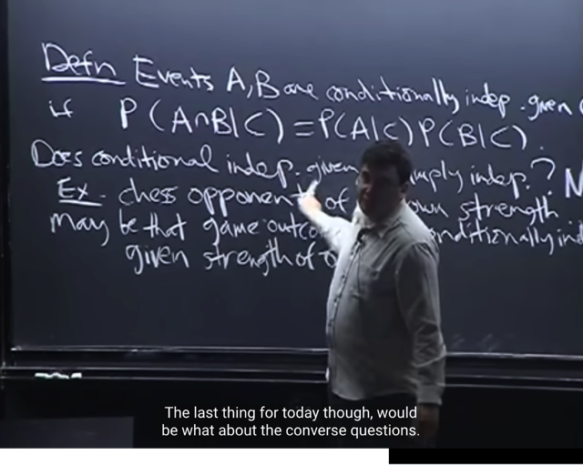</kbd></p>

<br>

<a id="node-129"></a>

<p align="center"><kbd>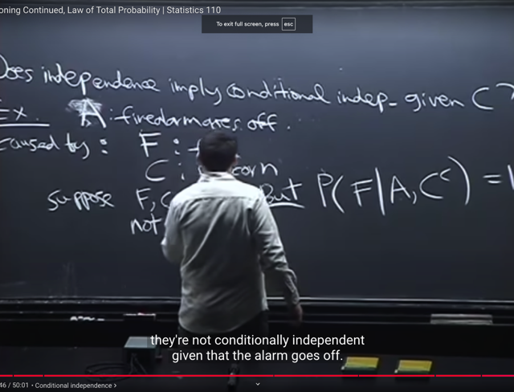</kbd></p>

> [!NOTE]
> Câu hỏi tự nhiên tiếp theo là nếu có 2 **INDEPENDENT** A và B thì có **ngụ ý
> cũng là** **CONDITIONAL INDEPENDENT GIVEN C KHÔNG `-` tức có thể suy
> ra A|C và B|C  cũng independent được ko**
>
> Answer là không. Lấy ví dụ như sau: Gọi A là event chuông báo động cháy kêu
> lên. F và C là hai event duy nhất có thể kích hoạt chuông: Có cháy và có người
> nướng bỏng ngô. Thế thì dễ hiểu là ta **có thể coi như là F và C independent**
> (vì **việc nướng bỏng ngô** tuy có thể nhưng **ít khả năng gây cháy thật**)
>
> Khi đó F, C **INDEPENDENT**, tức việc có người nướng bỏng ngô**không ảnh
> hưởng gì  đến xác suất xảy ra cháy P(F)**. Ngược lại v**iệc xảy ra cháy F,
> không ảnh hưởng  đến xác suất có người nướng bắp P(C)**
>
> Tuy nhiên khi xét điều kiện đã xảy ra cháy A, thì **P(F|A) sẽ BỊ ẢNH HƯỞNG**
> bởi VIỆC **CÓ HOẶC KHÔNG XẢY RA C**. Cụ thể là
>
> Nếu alarm kêu (A xảy ra), và không có ai nướng bắp (C ko xảy ra,hay Cc) thì
> **CHẮC CHẮN LÀ CÓ CHÁY**: P(F|A,Cc) `=` 1
>
> Nhưng nếu alarm kêu (A xảy ra) và có người nướng bắp (C xảy ra) thì **CHƯA
> CHẮC LÀ CÓ CHÁY**: P(F|A, C) `<=` 1
>
> Như vậy tuy **C không ảnh hưởng đến P(F)** nhưng **C có ảnh hưởng đến
> P(F|A)** (vì nếu không có người nướng bắp tức C không xảy ra mà alarm kêu
> thì chắc chắn có cháy `-` P(F|A) `=` 1; còn nếu có người nướng bắp và alarm kêu
> thì cũng chưa chắc có cháy tức P(F|A) nhỏ hơn 1)
>
> và ngược lại **F không ảnh hưởng đến P(C),** nhưng **F có ảnh hưởng đến
> P(C|A)**(vì nếu không cháy tức F không xảy ra mà alarm kêu thì chắc chắn có
> người nướng bắp P(C|A) `=` 1, ngược lại nếu có cháy mà alarm kêu thì chưa
> chắc có người nướng bắp tức P(C|A) < 1)
>
> Do đó **F và C INDEPENDENT** nhưng F|A và C|A **KHÔNG INDEPENDENT**

<br>

<a id="node-130"></a>

<p align="center"><kbd>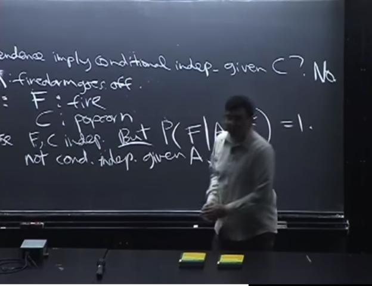</kbd></p>

<br>

