# Lec 6: Monty Hall, Simpson's Paradox

📊 **Progress:** `27` Notes | `23` Screenshots

---

<a id="node-132"></a>
## Tóm Tắt:

> [!NOTE]
> TÓM TẮT:
>
> `-` Bài toán Monty Hall
>
> `-` Giải bằng sơ đồ nhánh 
>
> `-` Giải bằng LOTP
>
> `-` Simpson paradox
>
> `-` `Controller/`

<br>

<a id="node-133"></a>

<p align="center"><kbd>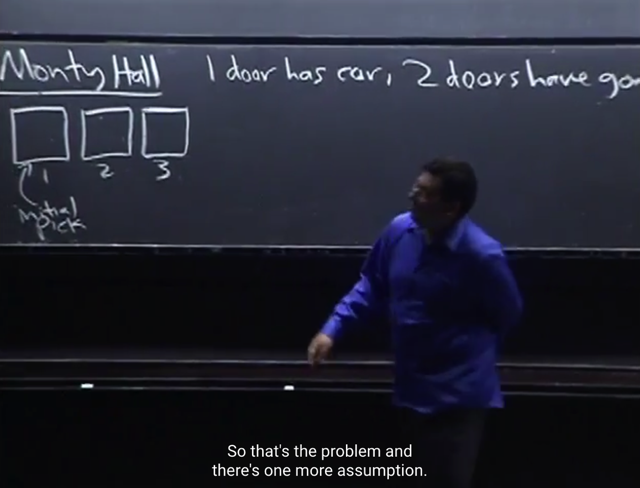</kbd></p>

> [!NOTE]
> Đầu tiên ta sẽ gặp lại bài toán nổi tiếng **Monty Hall**.
>
> Trò chơi là có 3 cánh cửa, che dấu **1 chiếc xe hơi** và **2 con dê**. Ta không biết
> cái nào nằm đâu. Và **giả định là ta muốn chiếc xe**, và **Monty biết** cái nào nằm
> đâu.
>
> Yêu cầu là ta chọn một cánh cửa. **Vì tính đối xứng**, cho rằng ta **chọn cái thứ
> nhất**. Lúc này**Monty sẽ mở một trong hai cánh cửa còn lại CÓ con dê**.
> (Vì Monty biết trong hai cái còn lại sẽ ít nhất có một con dê) Và Monty hỏi ta
> rằng ta **có muốn đổi lựa chọn không**.
>
> Câu hỏi là, ta có **NÊN ĐỔI HAY KHÔNG**?

<br>

<a id="node-134"></a>

<p align="center"><kbd>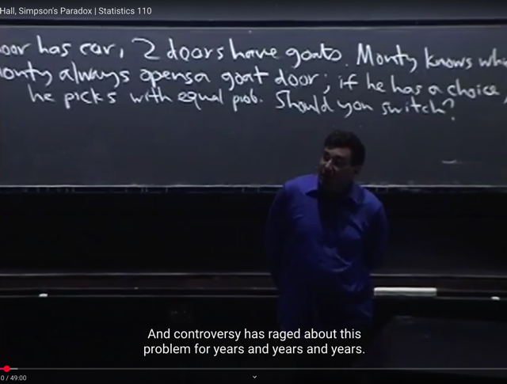</kbd></p>

> [!NOTE]
> Gs lưu ý ta **cần một giả định quan trọng nữa** đó là, **nếu trong trường hợp
> mà Monty có hai lựa chọn**. Đồng nghĩa là**khi ta chọn cái cửa lúc đầu trúng
> cái có cái xe**. Để hai cửa còn lại đều là dê, thì Monty có thể chọn một trong
> hai cái.
>
> Thì gỉa định là **nếu tình huống này xảy ra**, **ổng sẽ chọn ngẫu nhiên với
> equally likely**. Nó sẽ khác với việc giả sử trong tình huống đó ổng đang đứng
> ở cái cửa thứ 2, và vì để cho tiện ổng mở luôn cái đó, thì điều này sẽ khiến hai
> option có con dê không equally likely. Thì đó là bài toán mở rộng của Monty
> Hall, gọi là **Lazy Monty Hall** (có nghĩa là nó sẽ thay đổi kết qủa)
>
> Còn ở đây ta sẽ giả định equally likely khi Monty có 2 options chọn goat door

<br>

<a id="node-135"></a>

<p align="center"><kbd>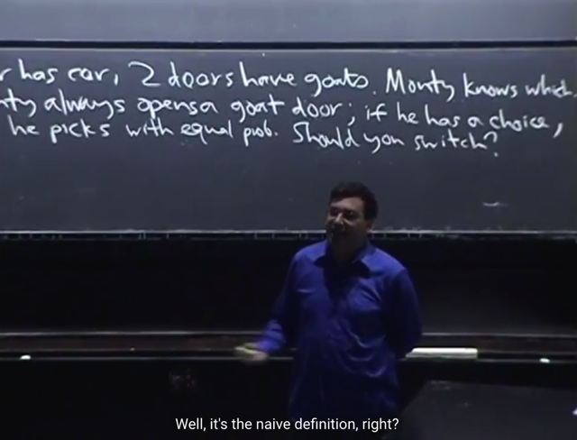</kbd></p>

> [!NOTE]
> Thế thì đứng trước câu hỏi này, ta có nên đổi qua door 3 hay không. (giả sử
> Monty mở cái thứ 2)
>
> Gs cho biết thêm sở dĩ **rất nhiều tranh cãi** là vì người ta**không hiểu về xác
> suất** cũng như là **không liệt kê đầy đủ các giả định** nói trên.
>
> Và câu trả lời là ta **nên đổi**, vì khi đó **xác suất chọn được cái xe sẽ là 2/3** thay
> vì stick với lựa chọn đầu tiên thì xác suất chọn được cái xe sẽ **chỉ là 1/3.**

<br>

<a id="node-136"></a>

<p align="center"><kbd>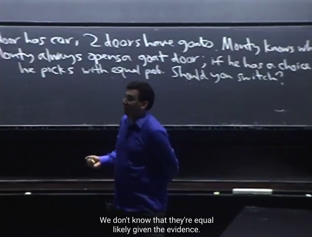</kbd></p>

> [!NOTE]
> Nếu như ta lập luận rằng à có 2 cửa (cái ta chọn và cái còn lại sau khi Monty
> mở một cái), trong đó có 1 cửa có xe hơi, thì xác suất là `50-50` (nên không có
> lí do gì mà nên đổi) thì đó là lập luận **SAI**.
>
> Vì gs cho rằng ta đang **LẠM DỤNG NAIVE DEFINITION** probability, vì điều
> trên chỉ đúng nếu như trong tình huống **các possible outcome đều**
> **EQUALLY LIKELY** ví dụ như, **cho 2 cửa có một xe một dê**, thì đúng là khi
> đó các possible outcome khi chọn một cửa là equally likely.
>
> Nhưng ở đây, trong bài toán này có 3 cửa, chứa 2 dê 1 xe, đã chọn một cửa
> rồi ông Monty mở một cửa có dê, thì lúc này tuy vẫn là 2 cửa có một dê một
> xe nhưng **dựa vào (condition on) những gì đã có**, thì các possible outcome
> **KHÔNG CÒN EQUALLY LIKELY NỮA. DO ĐÓ XÁC SUẤT KHÔNG CÒN
> LÀ 50-50**.

<br>

<a id="node-137"></a>

<p align="center"><kbd>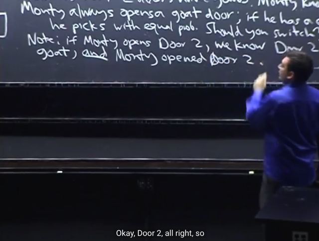</kbd></p>

> [!NOTE]
> Thế thì **không làm mất tính khái quát**, **cho rằng Monty mở cửa thứ 2**,
> đương nhiên là cho thấy con dê.
>
> Thì gs lưu ý rằng: **Sai lầm khó thấy mà người ta hay mắc phải** khi lập
> luận như vừa rồi đó là, v**iệc Monty mở cửa 2 cho thấy con dê** thực ra có
> **2 sự kiện:** 1) **Cửa số 2 có con dê** và 2) **Monty chọn cửa 2**
>
> Và ta **PHẢI DỰA TRÊN** (CONDITION ON) **CẢ HAI SỰ KIỆN NÀY**

<br>

<a id="node-138"></a>

<p align="center"><kbd>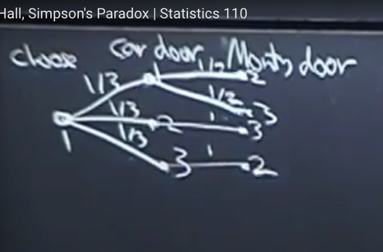</kbd></p>

> [!NOTE]
> rồi, gs sẽ giải thích bài toán này theo ba cách. Và ông cho rằng việc vẽ sơ đồ
> TREE DIAGRAM sẽ rất có ích
>
> Sơ đồ như sau: Như đã nói, **cho rằng ban đầu ta chọn door 1**. Thì **có 3
> trường hợp /** **khả năng cho vị trí thật sự của cái xe với** khả năng như
> nhau nên ta vẽ 3 nhánh I,II,III thể hiện 3 possible outcome của vị trí cái xe với xác
> suất `1/3.`
>
> Tiếp theo xét mỗi trường hợp:
>
> 1) Cái xe ở sau cửa 1: Ở trường hợp này, tức là ta đã chọn đúng, cửa 2 và 3
> kia đều là dê, nên Monty có thể mở một trong hai. Với giả định hồi nãy đã nói
> là ổng sẽ chọn ngẫu nhiên. Nên mỗi event mở cửa 2, và 3 đều equally likely,
> có xác suất là `1/2.` Vẽ 2 nhánh từ nhánh I thể hiện việc Monty có thể mở cửa 
> 2 hoặc 3 với xác suất đều là `1/2.`
>
> 2) Cái xe ở sau cửa 2: Lúc này, Monty chỉ có thể mở cửa 3 vì đó là cửa có
> con dê còn lại (con thứ nhất nằm trong cửa 1 là cái ta chọn). Nên xác suất
> Monty mở cửa 3 là 1. Vẽ một nhánh từ nhánh II để thể hiện Monty mở cửa 3 với
> xác suất là 1.
>
> 3) Cái xe ở sau door 3: Tương tự Monty chỉ có thể mổ door 2. Xác suất Monty
> mở cửa 2 là 1

> [!NOTE]
> GIẢI MONTY HALL BẰNG SƠ ĐỒ NHÁNH

<br>

<a id="node-139"></a>

<p align="center"><kbd>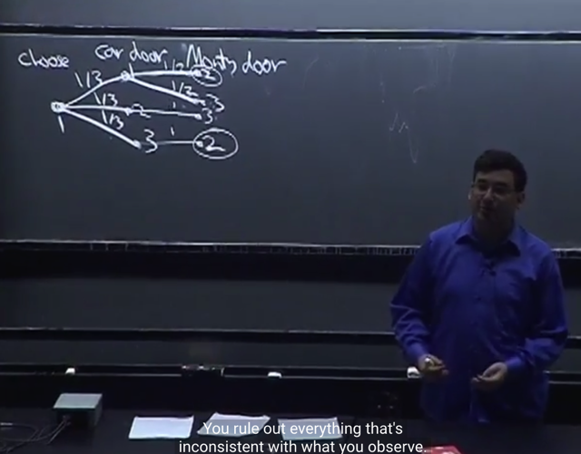</kbd></p>

> [!NOTE]
> Và việc dùng Tree Diagram có lợi ích gì. Đó là, ví dụ sự thật là Monty chọn mở
> cửa 2. Thì ta sẽ biết rằng **có 2 nhánh có thể dẫn đến điều này**, từ đó ta loại bỏ
> hai nhánh kia.
>
> Nó giống như khi ta dùng ven diagram với pepple, với P(A|B): khi cho B đã xảy
> ra ta xóa bỏ đi các pepple không nằm trong B

<br>

<a id="node-140"></a>

<p align="center"><kbd>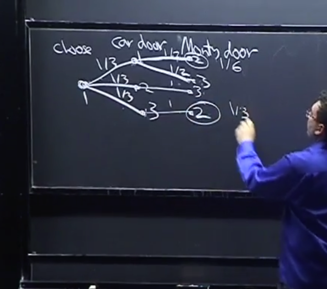</kbd></p>

> [!NOTE]
> Và với mỗi nhánh, **vì các sự kiện độc lập**: ví dụ như event [cái xe nằm
> sau door 1] và event [monty chọn mở cửa 2] là **độc lập**, nên **DỰA TRÊN
> ĐỊNH NGHĨA CỦA CÁC INDEPENDENT EVENT,**ta có: 
>
> P([cái xe nằm sau door 1] intersect [Monty chọn mở cửa 2]) sẽ bằng
>
> P([cái xe nằm sau door 1])*P([Monty chọn mở cửa 2]) `=` `(1/3)` * `(1/2)` `=` **1/6**
>
> Tương tự, 
>
> P([xe nằm sau cửa 3] intersect [Monty chọn cửa 3]) `=` `(1/3)` * (1) `=` **1/3**

<br>

<a id="node-141"></a>

<p align="center"><kbd>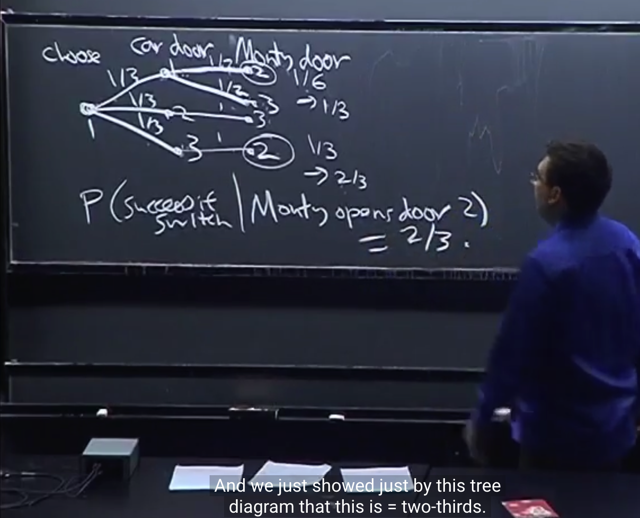</kbd></p>

🔗 **Related:** [TÓM TẮT:  - Tiếp tục Matching problem  - Định nghĩa về hai event độc lập  - Bài toán Newton-Peps  - Định nghĩa của conditional probability và cách hiểu về nó  - Các định lý liên quan](tóm_tắt_tiếp_tục_matching_problem_định_nghĩa_về_hai_event_độc_lập_bài_toán_newton_peps_định_nghĩa_của_conditional_probability_và_cách_hiểu_về_nó_các_định_lý_liên_quan.md#node-86)

> [!NOTE]
> Và tương tự như khi sau khi ta bỏ đi các pepple không nằm trong B, ta
> **RENORMALIZING** để các xác suất có tổng bằng 1. Thì đây cũng vậy, ta
> sẽ nhân 2 cho mỗi cái để đưa chúng về `1/3` và `2/3` (có tổng bằng 1)
>
> Như vậy, cho thấy **P([cái xe nằm sau cửa 1], [monty mở cửa 2]) là 1/3**
>
> trong khi **P([cái xe nằm sau cửa 3], [monty mở cửa 2]) là 2/3**
>
> Đồng nghĩa là nếu dựa trên sự kiện Monty mở cửa 2, thì **XÁC SUẤT CÁI 
> XE Ở CỬA 3 là CAO HƠN hơn:**P([cái xe nằm sau cửa 3] | [monty mở cửa 2]) 
>
> `=` P([cái xe nằm sau cửa 3] ∩ [monty mở cửa 2]) `/` P([monty mở cửa 2])
>
> P([cái xe nằm sau cửa 1] | [monty mở cửa 2]) 
>
> `=` P([cái xe nằm sau cửa 1] ∩ [monty mở cửa 2]) `/` P([monty mở cửa 2])
>
> và vì P([cái xe nằm sau cửa 3] ∩ [monty mở cửa 2]) 
> > P([cái xe nằm sau cửa 1] ∩ [monty mở cửa 2])
>
> nên P([cái xe nằm sau cửa 3] | [monty mở cửa 2]) 
> > P([cái xe nằm sau cửa 1] | [monty mở cửa 2]) 
>
> Do đó nên đổi.
> ****(chú ý là vì tính đối xứng `/` các cửa có vai trò như nhau) nên nếu Monty
> chọn cửa 3 thì hoàn toàn tương tự ta cũng sẽ có xác suất cái xe nằm
> ở cửa 2 | Monty chọn cửa 3 cao hơn xác suất cái xe nằm ở cửa 1 | Monty 
> chọn cửa 2.

<br>

<a id="node-142"></a>

<p align="center"><kbd>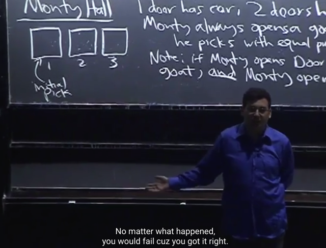</kbd></p>

> [!NOTE]
> Và **INTUITIVELY** GIẢI THÍCH CHO CÁI NÀY, gọi là HIỂU NÔM NA tại sao lại
> vậy như vầy:
>
> CHỈ CÓ **1 KHẢ NĂNG** MÀ TRONG ĐÓ TA CHỌN ĐÚNG NGAY TỪ
> ĐẦU ĐỂ RỒI, NẾU ĐỔI TA SẼ THUA.
>
> trong khi đó,
>
> CÓ TỚI **2 KHẢ NĂNG** MÀ TRONG ĐÓ TA CHỌN SAI TỪ ĐẦU (TỨC
> CÓ CON DÊ), VÀ VÌ MONTY MỞ RA CỬA CON DÊ THÌ NẾU ĐỔI TA SẼ
> CÓ CÁI XE.
>
> DO ĐÓ, RÕ RÀNG LÀ TA LUÔN NÊN ĐỔI

<br>

<a id="node-143"></a>

<p align="center"><kbd>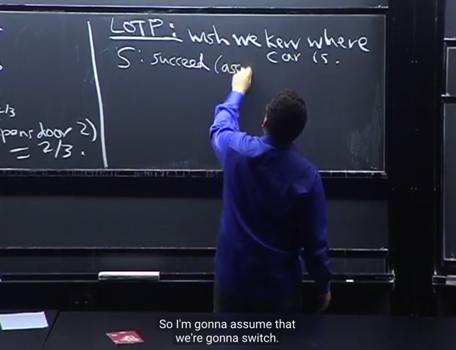</kbd></p>

> [!NOTE]
> Tiếp gs sẽ nói về cách giải thứ 2, sử dụng LOTP `-` **Law of Total Probability**.
>
> Thế thì đầu tiên gs nhấn mạnh rằng, khi làm theo cái này, mấu chốt là
> ta **QUYẾT ĐỊNH LÀ SẼ DỰA VÀO CÁI GÌ (WHAT TO CONDITION ON)**Và gs cho biết rằng m**ột điểm hay ho của Statistic và Probability** đó là,
> không như trong các môn khác, nếu ta bị stuck, thì việc nói rằng "**Giá
> như tôi biết `/` có điều này, giá như tôi biết điều kia**" không ích lợi gì.
>
> Nhưng với probability, thì khi ta nảy sinh những suy nghĩ như vậy thì nó gợi
> **ý cho ta DỰA TRÊN `/` CONDITION ON NHỮNG CÁI ĐÓ (đây là cách tiếp
> cận "wishful thinking" mà gs sẽ nói đến nhiều lần sau này)**Và trong bài toán này, sẽ dễ hiểu khi ta **GIÁ NHƯ BIẾT ĐƯỢC VỊ TRÍ
> CÁI XE, và ta sẽ condition on that**

> [!NOTE]
> GIẢI MONTY HALL BẰNG LOTP

<br>

<a id="node-144"></a>

<p align="center"><kbd>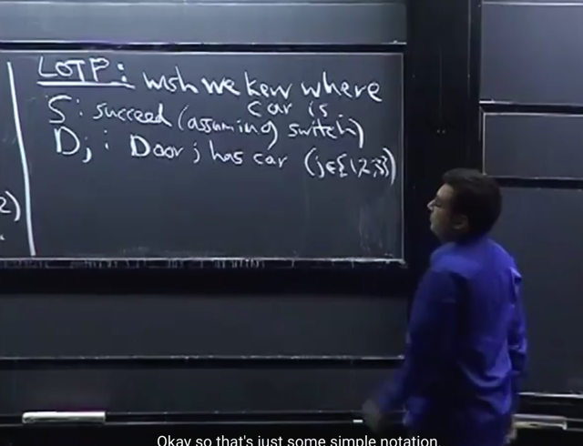</kbd></p>

> [!NOTE]
> Tiếp ta sẽ **define event S** là sự kiện [ta thành công**thắng được cái xe**
> bằng cách **luôn chọn switch**].
>
> Có nghĩa là khi được hỏi có muốn đổi cửa sau khi Monty đã mở cửa có dê ko
> thì ta sẽ theo chiến lược là **luôn chọn đổi**. Và ta muốn biết xác suất [chọn
> được cửa có xe] nếu theo chiến lược như vậy, tức là **xác suất của event S.**
>
> Và gọi **Dj** là sự kiện [**Cái door j có cái xe**], ví dụ**D1** là sự kiện [**cái xe
> nằm sau cửa 1**]

<br>

<a id="node-145"></a>

<p align="center"><kbd>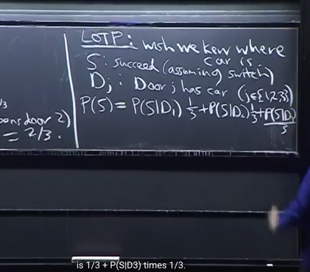</kbd></p>

🔗 **Related:** [TÓM TẮT:  Tiếp tục về conditional probability qua một số ví dụ  - Nói về việc để tính xác suất giống như diện tích của một hình phức tạp có thể dùng cách làm chia nhỏ S ra bởi một partion: P(B) = P(A1,B) + P(A2,B) + ...P(An,B) =  P(B)  = P(B|A1)*P(A1) + P(B|A2)*P(A2) + ....P(B|An)*P(An)  - Cái trên chính là LOTP: Law of Total Probability  - Chia S ra không đúng cách có thể khiến vấn đề phức tạp hơ,  thực hành nhiều sẽ có kinh nghiệm  - Ví dụ sampling hai lá bài, tính xác suất có 2 lá xì khi đã có một lá xì và xác suất cả hai lá xì khi đã có lá xì bích  - Ví dụ Disease test  - Complement rule P(A|B) = 1 - P(Ac|B)  - Một số sai lầm phổ biến liên quan đến conditional probability  - Định nghĩa về conditional independent](tóm_tắt_tiếp_tục_về_conditional_probability_qua_một_số_ví_dụ_nói_về_việc_để_tính_xác_suất_giống_như_diện_tích_của_một_hình_phức_tạp_có_thể_dùng_cách_làm_chia_nhỏ_s_ra_bởi_một_partion_pb_pa1b_pa2b_panb_pb_pba1pa1_pba2pa2_pbanpan_cái_trên_chính_là_lotp_law_of_total_probability_chia_s_ra_không_đúng_cách_có_thể_khiến_vấn_đề_phức_tạp_hơ_thực_hành_nhiều_sẽ_có_kinh_nghiệm_ví_dụ_sampling_hai_lá_bài_tính_xác_suất_có_2_lá_xì_khi_đã_có_một_lá_xì_và_xác_suất_cả_hai_lá_xì_khi_đã_có_lá_xì_bích_ví_dụ_disease_test_complement_rule_pab_1_pacb_một_số_sai_lầm_phổ_biến_liên_quan_đến_conditional_probability_định_nghĩa_về_conditional_independent.md#node-100)

> [!NOTE]
> Thì khi đó theo **Law of Total Probability** ta sẽ có P(S) như vầy.
>
> Lập luận lại cái này như sau:
>
> ```text
> S ⊂ Ω ⇨ S = S ∩ Ω (ở đây dùng Ω kí hiệu cho sample space vì S đã dùng để
> ```
> kí hiệu event "thắng với chiến thuật luôn chọn đổi") 
>
> ⇔ S `=` S ∩ (∪i Di) (vì D1, D2, D3 là partition)
>
> ⇔ S `=` ∪i (S ∩ Di)
>
> ⇨ P(S) `=` P(∪i (S ∩ Di)) `=` `Σi` P(S ∩ Di) | dùng axiom 3
> ****Áp dụng **Conditional probability theorem:**P(S,D1) `=` P(S|D1)*P(D1)
>
> P(S,D2) `=` P(S|D2)*P(D2),
>
> P(S,D3) `=` P(S|D3)*P(D3)
>
> Và P**(D1), P(D2), P(D3) là prior probability**, lần lượt là xác suất cái xe nằm sau
> cửa 1,2,3. Đương nhiên đều bằng **1/3 (do equally likely và naive definition)**
>
> **TỪ đó P(S) `=` `Σi` P(S|Di)P(Di) `=` `P(S|D1)(1/3)` `+` `P(S|D2)(1/3)` `+` P(S|D3)(1/3)**

<br>

<a id="node-146"></a>

<p align="center"><kbd>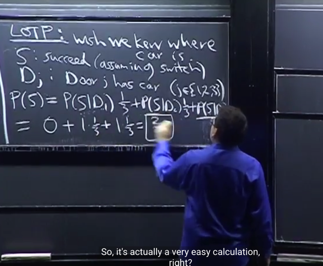</kbd></p>

> [!NOTE]
> Thế thì ta xét **P(S|D1)**. Đó là gì, đó chính là xác suất của S (ta **thắng
> với chiến thuật là luôn chọn switch**) **dựa trên** sự kiện [**cái xe nằm sau
> door 1**]
>
> Rõ ràng, nếu cái**xe nằm sau cửa 1, mà ta chọn đổi thì ta chắc chắn sẽ
> thua**, do đó xác suất [thắng nếu chọn đổi], khi (condition on) [xe nằm ở
> cửa 1] sẽ `=` 0
>
> Do đó  P(S|D1) `=` 0
>
> Tương tự, P(S|D2): là xác suất ta thắng nếu đổi, khi xe nằm ở door 2, thì
> dễ thấy nếu xe nằm ở door 2 thì ĐƯƠNG NHIÊN MONTY SẼ MỞ CỬA 3
> và do đó nếu ta chọn đổi (từ cửa 1) thì ta sẽ chỉ có thể đổi sang của 2, thì
> CHẮC CHẮN SẼ THẮNG
>
> Nên **P(S|D2) `=` 1**
>
> Tương tự, dựa trên việc xe nằm ở cửa 3 thì Monty sẽ mở cửa 2, và khi đó
> ta chọn đổi thì ta sẽ đổi sang cửa 3 và chắc chắn sẽ thắng `=>` **P(S|D3) `=`
> 1**
>
> Vậy P(S) tức **P(dành chiến thắng nếu luôn chọn đổi)
>
> ```text
> = P(S|D1)*(1/3) + P(S|D2)*(1/3) + P(S|D3)*(1/3)
> ```
>
> ```text
> = 0*1/3 + 1*1/3 + 1*(1/3)
> ```
>
> `=` `2/3`
>
> Và như vậy P(Sc) là xác suất của event "thắng với chiến lươc không chọn
> đổi" chỉ có `1/3`
>
> để ý xác suất của event này `=` `1/3` vì nó là xác suất chọn được cái cửa
> đúng, và vì việc bỏ cái xe vào cửa nào là hoàn toàn ngẫu nhiên nên xác suất
> chọn được cửa đúng là 1/3**

<br>

<a id="node-147"></a>

<p align="center"><kbd>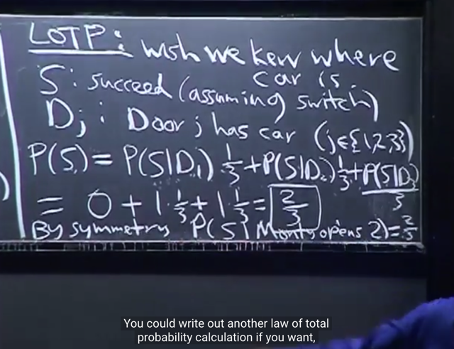</kbd></p>

> [!NOTE]
> Đại khái là vừa rồi là P(S) tức ý là không condition on "monty mở cửa nào".
>
> Gs nói rằng nếu ta muốn tính P(S|Monty mở cửa 2) thì vì**cửa 2 hay 3 trước
> khi Monty mở đều có vai trò như nhau (symmetry)** nên ta sẽ thấy trong
> trường hợp này conditional probability P(S|Monty mở cửa 2) cũng sẽ bằng
> P(S|Monty mở của 3) `=` P(S)
>
> Nhưng nếu như ở một trường hợp khác, khi cửa 2 và 3 đều chứa con
> dê, Monty **vì tiện lợi nên thích mở cửa 2 hơn của 3**. thì lúc này không còn
> tính chất đối xứng của cửa 2 và 3 nữa.
>
> Khi đó (như đã nói, sẽ là bài toán Lazy Monty Hall), nếu ta tính unconditional
> probability P(S), sẽ vẫn ra `2/3,` Nhưng conditional probability sẽ khác nhau
> tức là **P(S|Monty mở cửa 2) sẽ khác P(S}|Monty mở cửa 3)**

<br>

<a id="node-148"></a>

<p align="center"><kbd>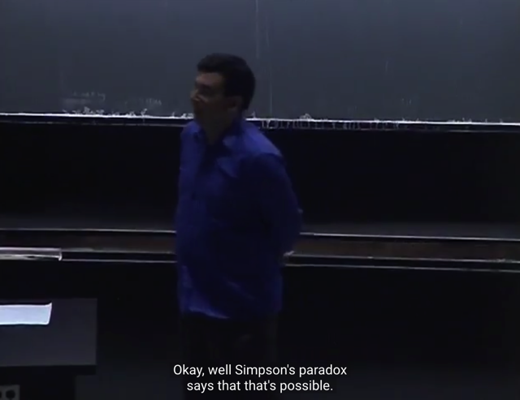</kbd></p>

> [!NOTE]
> Tiếp gs nói về **Simpson Paradox** `-` Nghịch lý Simpson. 
>
> (trước tiên ta phải hiểu k**hông có cái gì thật sự là nghịch lý**. Bởi nếu nó tồn
> tại, sẽ có những sự thực mâu thuẫn, thế giới sẽ không vận hành được.
> Điều gọi là nghịch lý chỉ là n**ghe qua thì thấy mâu thuẫn**, và nó đòi hỏi ta
> phải s**uy nghĩ sâu hơn thì mới hiểu được**)
>
> Quay lại nghịch lý này. Câu hỏi là như vầy: Giả sử có **hai ông bác sĩ**. Trong
> đó **ông A luôn làm tốt hơn ông B ở mọi ca phẫu thuật**. Có thể nào, **về tổng
> thể ông B lại giỏi hơn ông A được không**.
>
> Câu hỏi ngày nghe qua rõ ràng là ta dễ trả lời là không. Vì ở mọi cuộc phẫu
> thuật A đều giỏi hơn thì trung bình lại A cũng sẽ tốt hơn chứ làm sao đổi
> chiều được.
>
> Nhưng n**ghịch lý Simpson nói rằng điều này có thể xảy ra**

> [!NOTE]
> SIMPSON PARADOX

<br>

<a id="node-149"></a>

<p align="center"><kbd>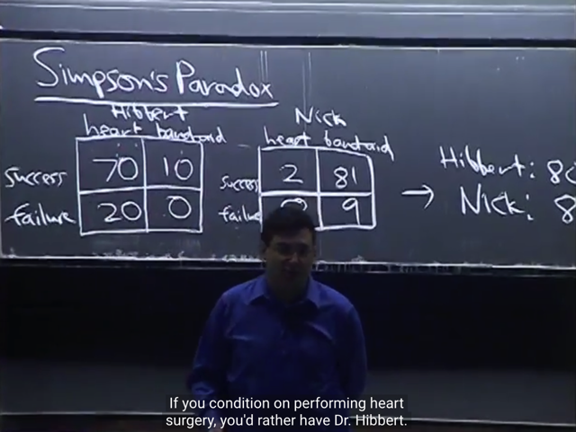</kbd></p>

> [!NOTE]
> thế thì ví dụ như vầy, bác sĩ A có kết quả khi mổ tim là **70/20**. Với tháo băng
> là **10/0**. trong khi đó bác sĩ B có kết quả mổ tim là **2/8** (fail 8 ca), tháo băng
> là (**81/9**)
>
> Vậy ở đây **xét từng loại bệnh thì bs A đều tốt hơn**.
>
> Nhưng khi trung bình lại thì**tỉ lệ thành công của bs B cao hơn (success rate là
> `(2+81)/(2+8+81+9)` `=` 83% lớn hơn của bs A là `(70+10)/(70+20+10)` `=` 80%**
>
> Nghịch lý này dễ thấy là **bởi bs B làm nhiều ca tháo băng, là loại dễ**, khiến
> **trung bình lại thì tỉ lệ thành công cao hơn bs A**.
>
> Do đó gs nói chắc chắn là **có nhiều bs hàng đầu thế giới** nhưng**tỉ lệ của họ
> không cao lắm** vì họ **chỉ làm những ca khó nhất**
>
> Ở trong made up example này ta dễ dàng thấy được bản chất của điều này,
> nhưng khi ở ví dụ khác, đôi khi lại khó để thấy hơn

<br>

<a id="node-150"></a>

<p align="center"><kbd>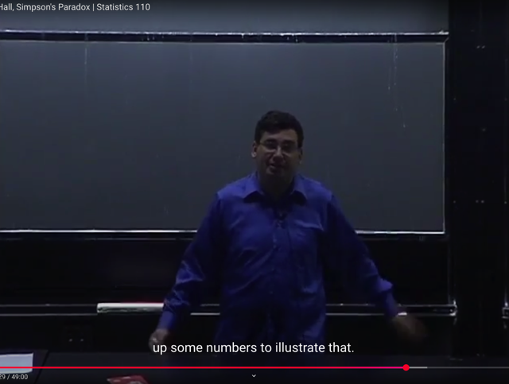</kbd></p>

> [!NOTE]
> một ví dụ khác là **hai cầu thủ bóng chày**. Người A có **tỉ lệ đánh trúng bóng
> tốt** **hơn người B ở cả hai mùa**. Nhưng **trung bình lại người B lại có tỉ lệ
> cao hơn**.
>
> Và hoàn toàn tương tự, ta có thể chế ra vài con số để có thể liên  hệ tương tự
> như ví dụ hai bác sĩ.
>
> Và hiểu nôm na là, **tuy người A có tỉ lệ thành công cao hơn người B ở cả hai
> mùa**. Nhưng**chỉ cần người B có thực hiện nhiều cú đánh  hơn người A ở
> mùa sau**, y như bs B làm 90 ca thay băng trong đó fail 9, tỉ lệ thành công
> `81/90` (so với bs A chỉ làm 10 ca thay băng,  thành công cả 10, tỉ lệ `100/100)`
> **sẽ giúp kéo tổng tỉ lệ thành công của bs B lên cao hơn A.**

<br>

<a id="node-151"></a>

<p align="center"><kbd>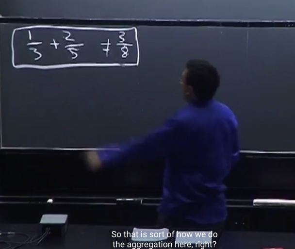</kbd></p>

> [!NOTE]
> đại khái là, một **góc nhìn khác** lí giải tại sao xảy ra Simpson paradox .
> Đó là, giống như khi **cộng phân số**, đương nhiên là **sẽ sai khi ta
> cộng tử với tử, mẫu với mẫu**.
>
> Và đó chính là cách mà ta "thấy" ban đầu khi nghe bs A có tỉ lệ thành
> công cao hơn bs B ở mọi loại phẫu thuật, và **ta đang "nghĩ sai rằng" tỉ lệ
> thành công của A bằng cách cộng tử và tử mẫu và mẫu**, do đó ta mới
> nghĩ ra như vậy thì A về trung bình cũng sẽ có tỉ lệ cao hơn B.
>
> Nhưng v**ấn đề là cộng phân số vậy không đúng**, cho nên **mới xảy ra
> thực tế rằng khi tính tỉ lệ trung bình một cách chính xác, ta sẽ thấy B có
> thể cao hơn A.**
>
> Nói chung ý là, cái việc ta cho rằng A có tỉ lệ thành công cao hơn B ở
> từng bệnh nên trung bình lại ổng cũng có tỉ lệ thành công cao hơn B là
> do ta đang cộng phân số theo kiểu sai đó.a

<br>

<a id="node-152"></a>

<p align="center"><kbd>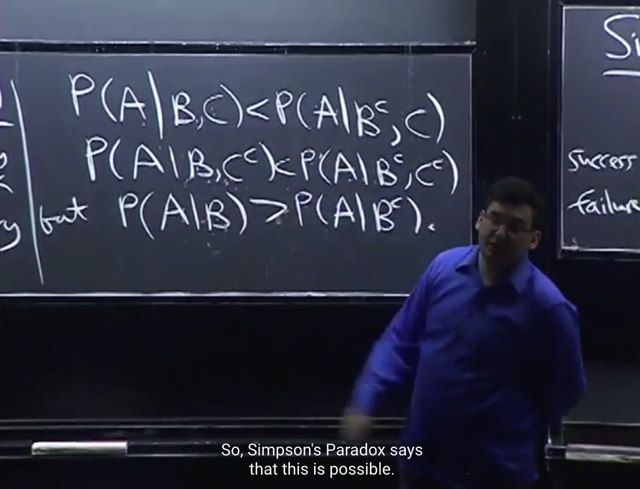</kbd></p>

> [!NOTE]
> Nếu **đặt A là event cuộc phẫu thuật thành công**. **B là event phẫu thuật bởi
> bác sĩ 2** (Nick) (**Bc sẽ là event phẫu thuật bởi bs 1**), và **C là event cuộc
> phẫu thuật là bệnh tim** (cuộc phẫu thuật là **tháo băng sẽ là Cc**)
>
> Khi đó việc bác sĩ 1 có tỉ lệ thành công cao hơn bs 2 ở cả hai loại phẫu thuật
> được thể hiện bởi:
>
> Xác suất thành công bởi bs 2 ở bệnh tim nhỏ hơn xác suất thành công bởi bs 1
> khi phẫu thuật tim: P(A|B,C) < P(A|Bc,C)
>
> Xác suất thành công bởi bs 2 ở việc tháo băng nhỏ hơn xác suất thành công bởi
> bs 1 khi làm tháo băng: P(A|B,Cc) < P(A|Bc,Cc)
>
> Tuy nhiên khi tính tỉ lệ thành công trung bình, thì **P(A|B) có thể lơn hơn
> P(A|Bc)**

<br>

<a id="node-153"></a>

<p align="center"><kbd>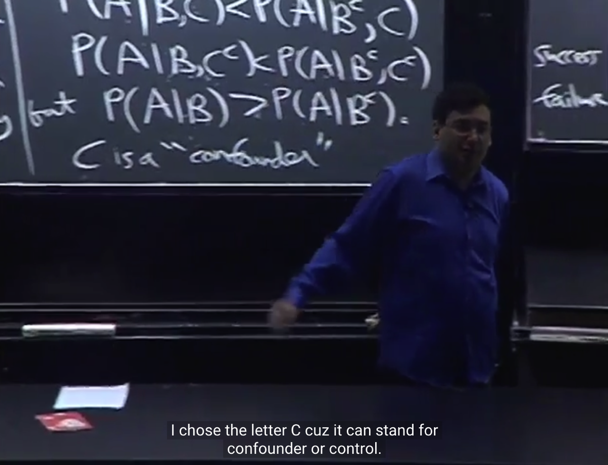</kbd></p>

> [!NOTE]
> C gọi là **CONFOUNDER `/` CONTROLLER**  đại khái là **yếu tố cần
> phải condition on**, mà **nếu ta không dựa trên nó**, thì ta sẽ **đánh giá
> sai xác suất thành công.**
>
> Nói nôm na là, **C sẽ cung cấp thêm thông tin** (ở đây là loại phẫu thuật
> cụ thể) để từ đó **xác suất thành công sẽ phản ánh đúng hơn trình độ
> thực tế của bác sĩ.**

> [!NOTE]
> CONFOUNDER `/` CONTROLLER

<br>

<a id="node-154"></a>

<p align="center"><kbd>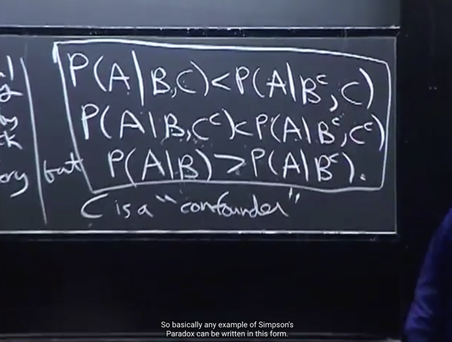</kbd></p>

> [!NOTE]
> và công thức khái quát của
> Simpson paradox là như này.

<br>

<a id="node-155"></a>

<p align="center"><kbd>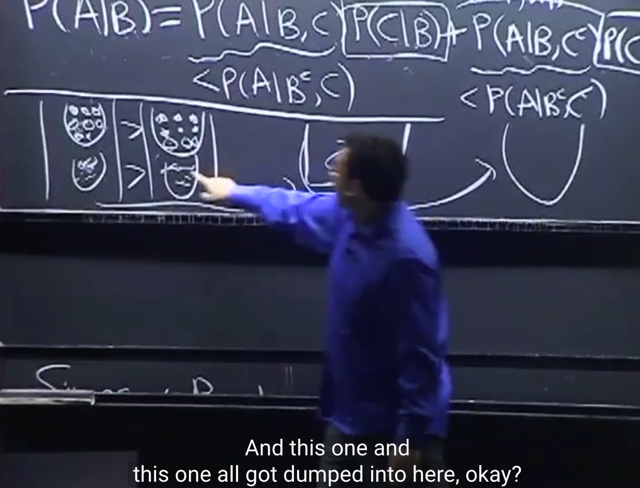</kbd></p>

> [!NOTE]
> Một ví dụ nữa đó là **có 2 loại kẹo** và trong đó **có 1 loại kẹo dâu ưa thích**.
> Có 4 lọ, và **cả hai lọ bên trái đều có tỉ lệ kẹo dâu ưa thích cao hơn**. gs cho
> rằng ta có thể tự nghĩ ra những con số để cho thấy khi **đổ hai lọ bên trái vào 1
> lọ to** (và hai lọ bên phải cũng vậy) thì kết quả **lọ to bên phải sẽ có tỉ lệ kẹo ưu
> thích cao hơn**.
>
> Vậy thì mình tự chọn số lượng như sau để điều này xảy ra: Gọi T là lọ trái, P
> là lọ phải. số đứng trước là loại ưa thích
>
> T1:70:20 (**77**%) P1: 2:8  (**20**%)
>
> T2: 10:0 (**100**%) P2: 81:9 (**81**%)
>
> Có thể thấy cả hai trường hợp, lọ bên trái đều có tỉ lệ kẹo ưa thích cao hơn ở
> lọ 1 thì bên trái là 77% kẹo dâu, bên phải chỉ có 20% ở lọ 2 thì bên trái là
> 100% kẹo dâu, bên phải chỉ có 81%
>
> Nhưng xét tỉ lệ kẹo dâu trong lọ to
>
> T: 80:20 `->` lọ to bên trái chỉ có **80%** kẹo dâu
>
> P: 83:17 `->` lọ to bên phải là **83%** kẹo dâu
>
> Như vậy trong **lọ to tỉ lệ kẹo dâu bên phải cao hơn**

<br>

