# Lec 7: Gambler's Ruin & Random Variables

📊 **Progress:** `37` Notes | `40` Screenshots

---

<a id="node-157"></a>
## `-tóm` Tắt:

> [!NOTE]
> `-TÓM` TẮT:
>
>  Bài toán Gambler's Ruin
>
> `-` Random variable
>
> `-` Bern(p) random variable
>
> `-` Bin(n, p) random variable
>
> `-` Định nghĩa của Distribution
>
> `-` Công thức của PMF Bin (n, p)

<br>

<a id="node-158"></a>

<p align="center"><kbd></kbd></p>

> [!NOTE]
> Đầu tiên gs nhấn mạnh Stat110 hầu như chỉ xoay quanh 2 thứ
> quan trọng: **Conditioning** và random variable **Distribution**

<br>

<a id="node-159"></a>

<p align="center"><kbd>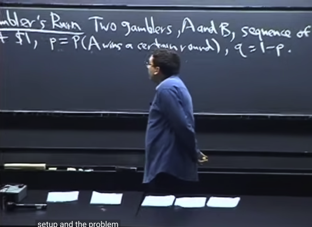</kbd></p>

> [!NOTE]
> Ta sẽ học về **Gambler's Ruin**. Bài toán là, có **hai người chơi cá cược** với
> nhau **một chuỗi các ván đấu** (cược 1 đô mỗi ván) **cho đến khi một trong
> hai người hết tiền**. Gọi **p là xác suất ông A thắng ở một ván nào đó**, q `=`
> 1 `-` p, xác suất ông B thắng.

> [!NOTE]
> Bài toán Gambler's Ruin

<br>

<a id="node-160"></a>

<p align="center"><kbd>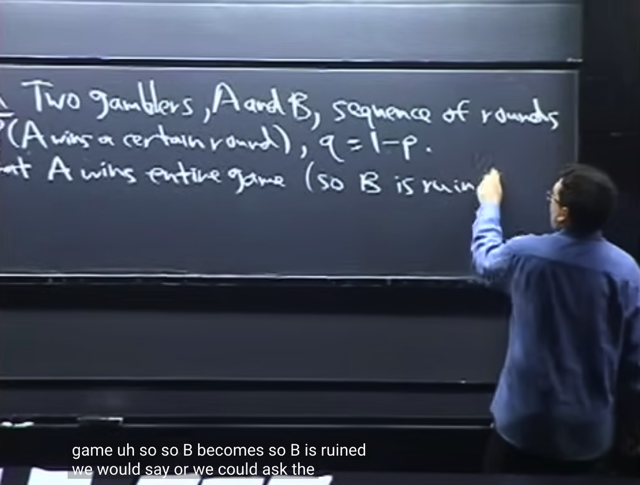</kbd></p>

> [!NOTE]
> và câu hỏi là ta sẽ **tính xác suất ông A
> thắng chung cuộc (B là ruiner)**

<br>

<a id="node-161"></a>

<p align="center"><kbd>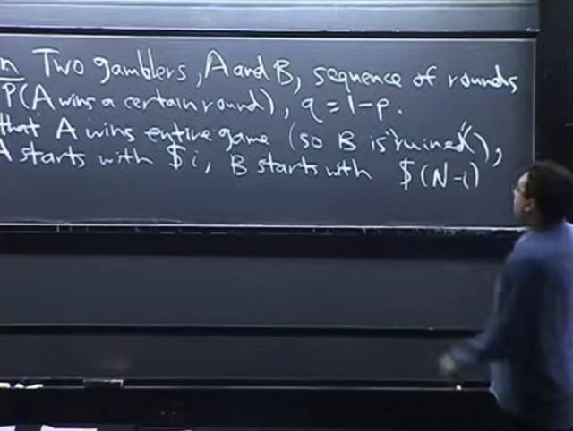</kbd></p>

> [!NOTE]
> và giả sử s**ố tiền ban đầu của A là i**, của **B là N-i**. Và đây là hệ kín,
> chỉ có **N dollar chạy qua lại** giữa 2 người cho **đến khi 1 người có
> hết N dollar**

<br>

<a id="node-162"></a>

<p align="center"><kbd>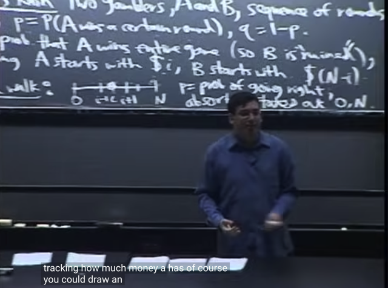</kbd></p>

> [!NOTE]
> thế thì gs nói rằng bài toán này **xảy ra ở nhiều lĩnh vực**, ví dụ như
> **Random Walk** trong tài chính
>
> Bài toán này cũng có set up tương tự, **bắt đầu ở** **i đâu đó từ 0 tới N**. Và
> mỗi random walk có thể **đi đến `i+1` hoặc về i-1** với **p là xác suất đi tới**,
> **1-p là xác suất đi lui**. Và khi đạt vị trí 0 hoặc N gọi là **Absorb state** thì
> game over

<br>

<a id="node-163"></a>

<p align="center"><kbd>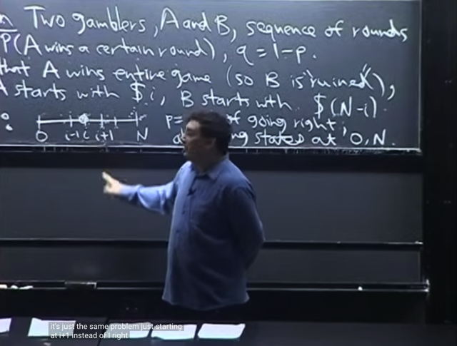</kbd></p>

> [!NOTE]
> Theo gs thì đối diện với vấn đề này, ta thấy khá khó, ở chỗ **không biết có
> bao nhiêu ván đấu**, vì **về lí thuyết số ván có thể kéo dài vô hạn**, khi current
> state cứ **nhảy đi nhảy về ở một điểm i nào đó** và không bao giờ đạt N hoặc 0.
>
> Nhưng bài toán này **có một đặc điểm** đó là**giả sử ở step đầu A thắng**, để
> **current state là i+1** (nếu B thắng thì i thành `i-1,` vì đã đặt i là số tiền ban đầu
> của A mà) thì **ta lại có bài toán y hệt**chẳng qua là **khác initial money thôi**.
>
> Từ đó nó **gợi ý cho mình về thứ để dựa vào** (conditioned on)

<br>

<a id="node-164"></a>

<p align="center"><kbd>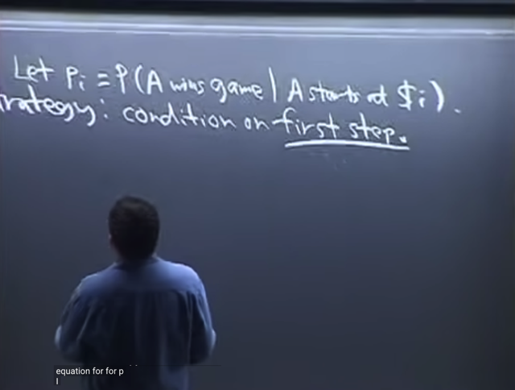</kbd></p>

> [!NOTE]
> Gọi **P_i là xác suất ông A thắng chung cuộc** conditioned on **A có i dollar
> ban đầu**.
>
> Ta sẽ đặt ra strategy đó là condition on first step (ý là ai thắng ở step
> đầu). Gọi là **First Step Analysis**

<br>

<a id="node-165"></a>

<p align="center"><kbd>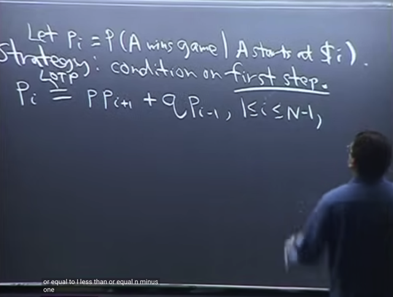</kbd></p>

> [!NOTE]
> Thế thì dựa trên **Law of Total Probability (LOTP)** thì, xác suất A thắng khi bắt
> đầu với i dollar sẽ bằng:
>
> **P_i `=` p*P_(i `+1)` `+` q*P_(i-1)**
>
> Vì sao: Vì để A thắng chung cuộc thì sẽ là có thể chia ra làm 1 trong 2 khả năng sau: 
>
> i) **A thắng ván đầu** (chuyển từ i thành `i+1)` và **thắng chung cuộc từ i+1**
>
> ii) **A thua ván đầu** (chuyển từ i thành `i-1` và **thắng chung cuộc từ i-1** 
>
> Do đó: 
>
> [A thắng chung cuộc từ i] `=` 
>
> [A thắng step đầu] **∩** [A thắng chung cuộc từ `i+1]`
>
> ∪
>
> [A thua step đầu] **∩** [A thắng chung cuộc từ `i-1]`
>
> Và đây là union của các disjoint event nên dựa vào **Axiom 2**: 
>
> P[A thắng chung cuộc từ i] `=` 
>
> P[A thắng step đầu] ∩ [A thắng chung cuộc từ `i+1]`
>
> `+` P[A thua step đầu] ∩ [A thắng chung cuộc từ `i-1]`
>
> Và vì [A thắng step đầu] và [A thắng chung cuộc từ `i+1]` là hai event **INDEPENDENT**
> nên **theo định nghĩa của independent events**: 
>
> P[A thắng step đầu] ∩ [A thắng chung cuộc từ `i+1]` `=` 
>
> P[A thắng step đầu] * P[A thắng chung cuộc từ `i+1]`
>
> Tương tự, 
>
> P[A thua step đầu] ∩ [A thắng chung cuộc từ `i-1]`
>
> `=` P[A thua step đầu] * P[A thắng chung cuộc từ `i-1]`
>
> Do đó P[A thắng chung cuộc từ i] `=` `P_i` 
>
> `=` P[A thắng step đầu] * P[A thắng chung cuộc từ `i+1]` 
>
> `+` P[A thua step đầu] * P[A thắng chung cuộc từ `i-1]`
>
> **P_i `=` p* `P_(i+1)`  `+` q* P_(i-1)**

<br>

<a id="node-166"></a>

<p align="center"><kbd>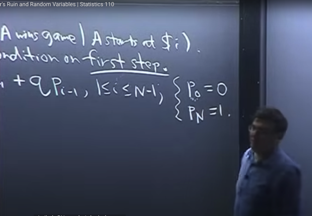</kbd></p>

> [!NOTE]
> Với điều kiện i từ 1 tới `N-1` vì khi i `=` 0, có nghĩa là A start với zero dollar
> thì xác suất A thắng chung cuộc là ko có `P_0` `=` 0. Tương tự khi A start với
> N dollar thì chắc chắn là A thắng chung cuộc rồi `P_N` `=` 1

<br>

<a id="node-167"></a>

<p align="center"><kbd>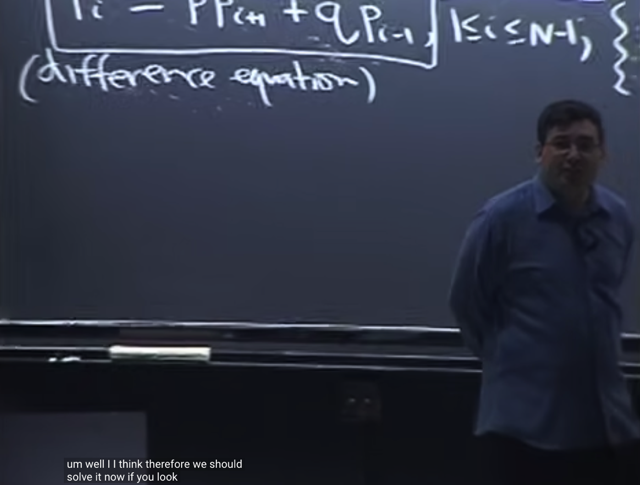</kbd></p>

> [!NOTE]
> Và đây là một DIFFERENCE EQUATION

<br>

<a id="node-168"></a>

<p align="center"><kbd>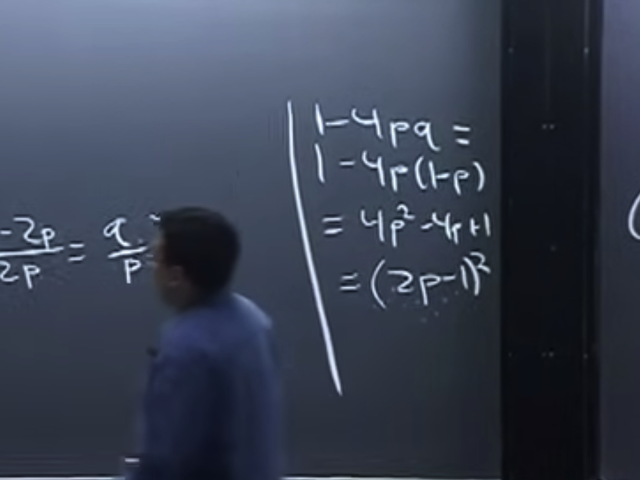</kbd></p>

<p align="center"><kbd></kbd></p>

<p align="center"><kbd>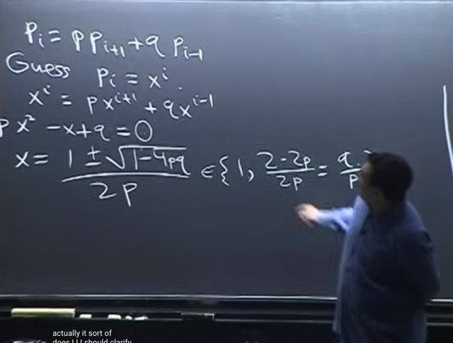</kbd></p>

> [!NOTE]
> đại khái gs B cho rằng để solve **difference equation** này. Ta sẽ thường
> **đoán nghiệm đặc biệt** trước, **thế vào xem có phải là nghiệm không**. 
>
> Ở đây ông đoán **P_i `=` x^i** thế vào ta có
>
> **x^i `=` `p*x^(i+1)` `+` q*x^(i-1)**<=> 
>
> ```text
> p*x^(i+1) - x^i + q*x^(i-1)  = 0
> ```
>
> Và giả sử x khác 0, **chia hai vế cho x^(i-1)** ta có quadratic equation: 
>
> px^2 `-` x `+` q `=` 0
>
> ```text
> Giải ra x = [1+/- sqrt(1-4pq)]/2p
> ```
>
> ```text
> 1 - 4pq = 1 - 4p(1-p) = 1 - 4p + 4p^2 = (2p - 1)^2 nên sqrt[(2p - 1)^2]
> ```
>
> `=` 2p `-` 1
>
> Vậy có hai solution: 
>
> x1  `=` (1 `+` 2p `-` `1)/2p` `=` **1**
>
> x2 `=` (1 `-` 2p `+` `1)/2p` `=` `(1-p)/p` `=` **q/p**
>
> Vậy **P_i, xác suất A thắng khi bắt đầu với i dollar là 1 hoặc q/p**

<br>

<a id="node-169"></a>

<p align="center"><kbd>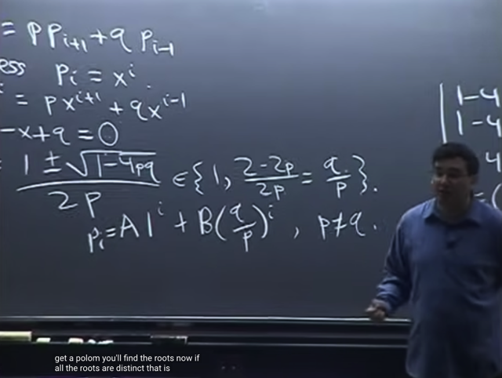</kbd></p>

<br>

<a id="node-170"></a>

<p align="center"><kbd>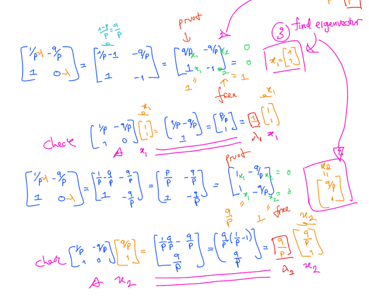</kbd></p>

<p align="center"><kbd>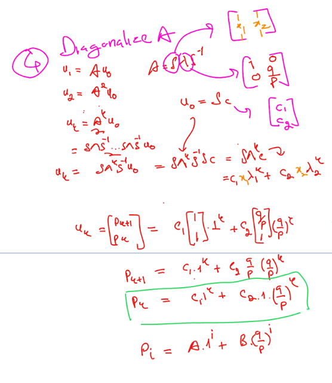</kbd></p>

<p align="center"><kbd>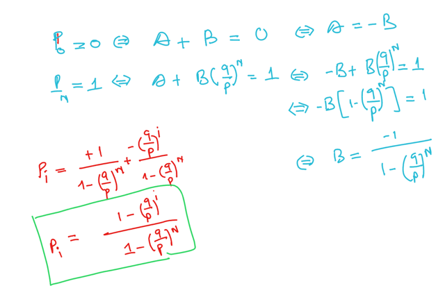</kbd></p>

<p align="center"><kbd></kbd></p>

<p align="center"><kbd></kbd></p>

<p align="center"><kbd></kbd></p>

<p align="center"><kbd>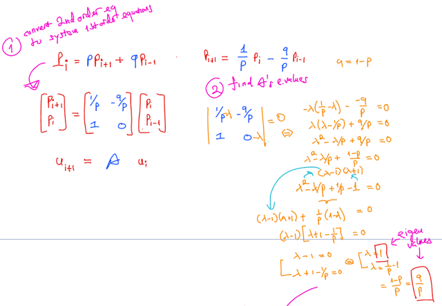</kbd></p>

> [!NOTE]
> Giải difference equation này bằng 18.06.
>
> Bước 1 ta sẽ **chuyển second order equation** thành **system of first order
> equations**
>
> ```text
> u_i+1 = Au_i
> ```
>
> Bước 2 ta sẽ t**ìm eigenvector và eigenvalues**. Tìm eigenvalues bằng cách thiết
> lập**characteristic equations** **det (A `-` λI) `=` 0**. Giải ra hai**eigenvalues 1 và q/p**
>
> Bước 3 thế vào**tìm `null-space` basis của A** **- λI**, chính là eigenvector của A (*)
>
> (*) Vì eigenvector của A sẽ thõa mãn: Ax `=` λx, tương đương (A `-` λI)x `=` 0 Cho nên
> eigenvector của A chính là solution của (A `-` λI)x `=` 0 đương nhiên nó chính là vector
> trong nullspace của A `-` λI.
>
> ra **x1 `=` [1, 1]** (Check lại thì thấy Ax1 `=` λ1x1) và **x2 `=` `[q/p,` 1]**
>
> Bước 4: Vì có đủ hai eigenvector độc lập nên A có thể **diagonalized** thành
> SΛSinv
>
> Và do đó **u_k+1 `=` `Au_k` `=` `SΛSinv.u_k` với** S là matrix tạo bởi 2 cols là
> eigenvectors của A, L là diagonal matrix với eigenvalues của A trên đường chéo.
>
> cho rằng u0 `=` Sc (vì columns của S là một bộ basis vector, nên nó span R2, đương
> nhiên u0 có thể được thể hiện bằng linear combination của các S's columns, với c
> là vector các coefficients)
>
> Khi đó ta có `u_k` (hay `u_i)` `=` A^k.u0 `=` S.L^k.(SinvS).c `=` S.L^k.c `=` **c1x1λ1^k `+`
> c2x2λ2^k**
>
> Từ đó ta có `p_k` (hay `p_i)` =**c1*1^k `+` c2*(q/p)^k** như đáp án của gs B: **A*1^i `+`
> B(q/p)^i**

<br>

<a id="node-171"></a>

<p align="center"><kbd>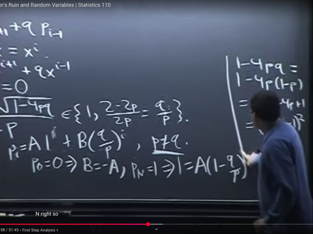</kbd></p>

> [!NOTE]
> ```text
> Và ta sẽ dựa vào P_0 = 0, P_1 = 1
> ```
> để tìm A, B (hay c1, c2)

<br>

<a id="node-172"></a>

<p align="center"><kbd>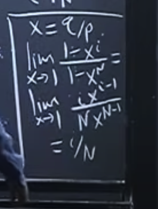</kbd></p>

<p align="center"><kbd></kbd></p>

<p align="center"><kbd>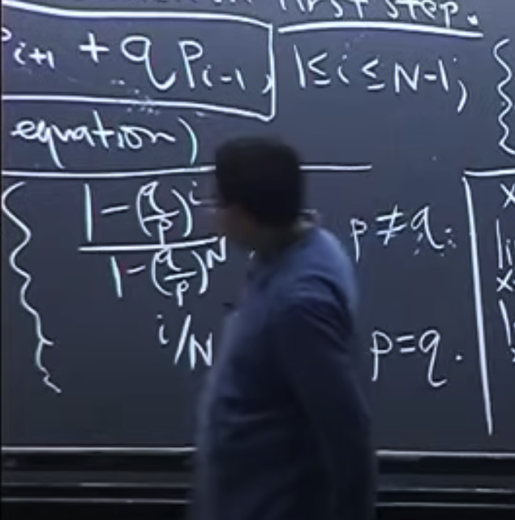</kbd></p>

> [!NOTE]
> ```text
> Thế thì từ đó ta có P_i = (1 - q/p)^i / (1-q/p)^N nếu p khác q
> ```
>
> Nhưng nếu p `=` q thì gs cho biết khi đó x1 `=` x2 `=` 1. Thì ông cho biết việc solve phương trình
> vi phân trở nên phức tạp hơn. Điều này khi liên hệ với cách giải bằng matrix diagonalization
> của mình thì nó sẽ là khi A có hai eigenvalues đều bằng 1. Và matrix (A `-λI)` là matrix 
> rank 1 chỉ có 1 vector trong basis của nullspace chỉ có một eigenvector độc lập. 
>
> Lúc đó A không thể diagonalizable (Cũng chưa biết sẽ làm gì vì 1806 không có nói)
>
> ```text
> Thì cách làm là ta sẽ tìm limit của solution (tức là lim của (1-x^i)/(1-x^N) khi x -> 1)
> ```
>
> ```text
> nó sẽ là lim (lấy derivative tử và mẫu, cái này sẽ ôn lại khi 1801) = lim (i*x^(i-1) / N*x^(N-1)
> ```
>
> `=` **i `/` N**

> [!NOTE]
> Quay lại sau khi finish 18.01

<br>

<a id="node-173"></a>

<p align="center"><kbd>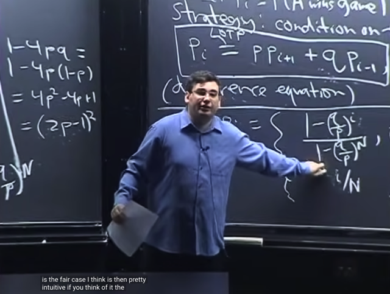</kbd></p>

> [!NOTE]
> Thế thì**khi p `=` q** tức là ta có**fair case**: hai người chơi được xác
> suất thắng tại ván i như nhau thì từ kết quả là **P_i `=` i `/` N** cho ta
> nhận xét rằng **xác suất thắng chung cuộc của A là tỉ lệ thuận với số
> tiền ban đầu của A**.
>
> Hay nói cách khác **ông nào có vốn nhiều** hơn thì **xác suất thắng
> chung cuộc cao hơn**

<br>

<a id="node-174"></a>

<p align="center"><kbd>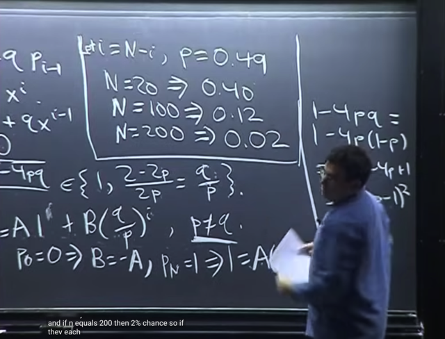</kbd></p>

> [!NOTE]
> Và g**s cho một số tính toán cụ thể** để thấy rằng giả sử hai ông bắt đầu với
> ```text
> cùng số tiền (i = N - i <=> i = N/2) và cho rằng p (tức xác suất thắng
> ```
> một ván cụ thể của A) **chỉ nhỏ hơn của B chút đỉnh** là 49%, (q `=` 51%).
>
> Thì ta thấy **khi N (tổng số tiền) tăng lên từ 20 đến 100** thì xác suất thắng
> chung cuộc của A **giảm từ 40% xuống còn 2%.**Cụ thể là:****Với i `=` `N/2` thì `P_i` `=` [1 `-` `(49/51)^(N/2)]` `/` [1 `-` (49/51)^N]****
> N `=` 20: `P_i` `=` 0.401
>
> N `=` 100: `P_i` `=` 0.119
>
> N `=` 200: `P_i` `=` 0.017
>
> Và ý nghĩa của nó chính là:
>
> i) Ngay cả **khi ta có fair case**, tức xác suất thắng mỗi ván bằng nhau thì
> ông nào có **nhiều tiền hơn** sẽ có **xác suất thắng (chung cuộc) cao hơn**.
> Và trong casino **nhà cái** thường có**nhiều tiền hơn người chơi.**
>
> ii) Nhưng thường**cuộc chơi không công bằng**, **rất có thể là người chơi
> luôn có xác suất thắng thấp hơn một chút so với nhà cái**. Và kết cục là
> **chơi càng nhiều** (số tiền tổng cộng N càng lớn) thì **xác suất thắng chung
> cuộc của người chơi càng thấp.**
>
> Do đó nó có tên là **Gambler's ruin là vậy**

<br>

<a id="node-175"></a>

<p align="center"><kbd>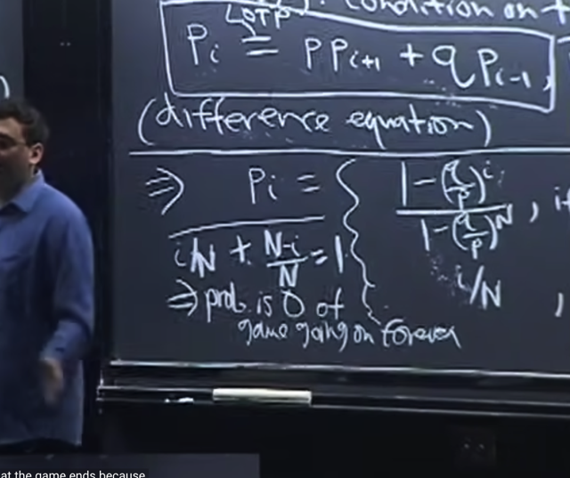</kbd></p>

> [!NOTE]
> Và cuối cùng là gs bàn **về một khả năng** đó là **không có ai thắng chung
> cuộc** khi tình trạng **oscillation** (cứ ông A thắng 1 ván rồi đến B thắng 1 ván
> tiếp tục như vậy mãi mãi)
>
> Thế thì gs cho rằng ta có thể **tính xác suất B thắng chung cuộc**, và không cần
> làm lại từ đầu mà **chỉ cần đổi vị trí của A và B** thì ta sẽ thấy **xác suất B thắng
> chung cuộc trong fair case là (N-i)/N**.
>
> Để rồi ta có **xác suất A thắng chung cuộc** và **xác suất B thắng chung cuộc**
> trong trường hợp fair case có **tổng bằng 1**.
>
> Do đó, **tuy về mặt logic tình trạng oscillation có thể xảy ra** nhưng **về mặt xác
> suất  thì xác suất của nó bằng 0** (vì tổng xác suất của A thắng và B thắng chung
> cuộc đã bằng 1 rồi, **không còn chỗ nào cho oscillation** nữa)
>
> Với unfair case gs cho rằng ta **cũng sẽ thấy tương tự**

<br>

<a id="node-176"></a>

<p align="center"><kbd>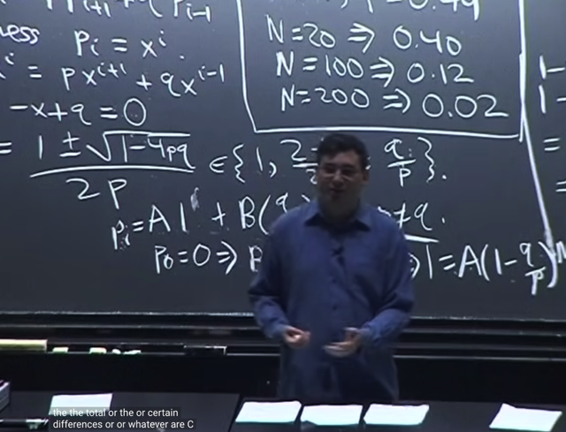</kbd></p>

> [!NOTE]
> Tiếp theo, đại khái là gs cho rằng ta có thể thấy **việc đặt ra notation cho các
> event bắt đầu trở nên phiền phức**. Ta sẽ thảo luận qua **random** **variable**

<br>

<a id="node-177"></a>

<p align="center"><kbd>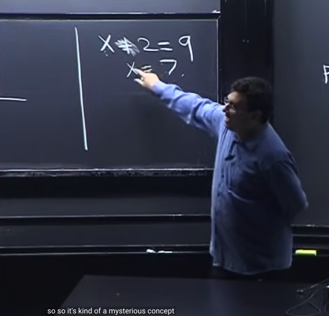</kbd></p>

> [!NOTE]
> đại khái là gs dành vài phút để nói về **khái niệm của variable**. Theo một
> sinh viên thì variable là một **abstract** notation để **chỉ một thứ có thể có
> nhiều giá trị** khác nhau.
>
> Gs lấy ví dụ nếu ta nói x của equation này thì nó không phải variable vì nó
> **chỉ có thể bằng 7**, là một **constant**.
>
> Nhưng **kể cả khi equation có nhiều solution** thì **nó cũng là constant.**
>
> Gs cho rằng theo quan điểm của ông **để thể hiện ý tưởng variable** có thể có
> nhiều giá trị thì ta **cần dùng đến** **FUNCTION**.

<br>

<a id="node-178"></a>

<p align="center"><kbd>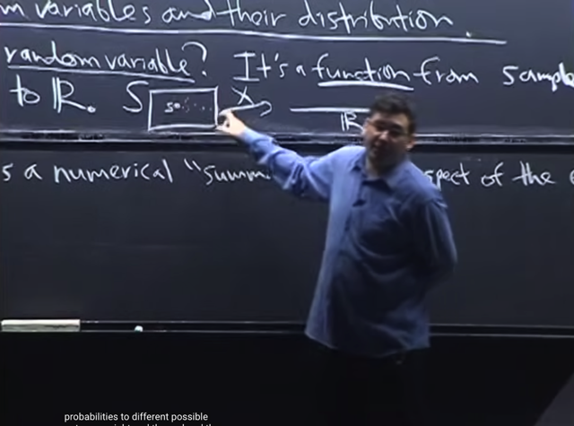</kbd></p>

> [!NOTE]
> Thế thì gs định nghĩa rằng, **random variable là một FUNCTION** map giữa
> **SAMPLE SPACE đến R**
>
> Đại khái là, ta đã biết Sample space S là tập hợp **mọi possible outcome** của
> một experiment, thế thì **s** (s nhỏ) là một **possible outcome** và được **map** với
> **một giá trị trên R** bởi function (đã nói random variable là một function).

<br>

<a id="node-179"></a>

<p align="center"><kbd>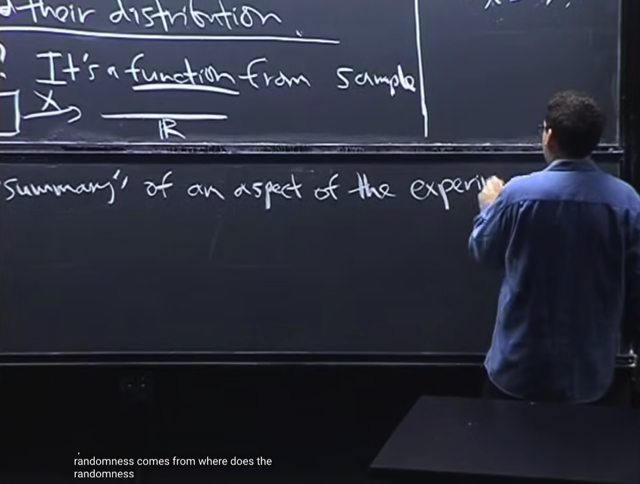</kbd></p>

> [!NOTE]
> và có thể coi như nó là một **numerical** "**summarization**" `-` một **con số tóm tắt 
> một khía cạnh nào đó của experiment**.
>
> Thế thì yếu tố **random** (trong random variable) đến từ việc **s đến từ sample
> space S**, ví dụ như sampling tromg sample space S ra một giá trị cụ thể s
> (là một possible outcome) và function (ý nói random variable) sẽ **map nó với
> một số thực R**
>
> Đó là định nghĩa của **Random Variable**

> [!NOTE]
> ĐỊNH NGHĨA RANDOM VARIABLE

<br>

<a id="node-180"></a>

<p align="center"><kbd>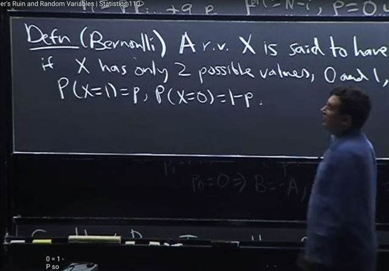</kbd></p>

> [!NOTE]
> Ví dụ đầu tiên ta sẽ làm quen với **Bernoulli distribution**:
>
> Một **random variable X** được cho là có Bernoulli distribution Bern (p) nếu như X
> **CHỈ** có **2 possible value là 0 và 1** Với **P(X=1) `=` p và `P(X=0)` `=` 1-p.**
>
> (gs cho biết ông sẽ nói về định nghĩa của "distribution" sau)
>
> Tức là khi thực hiện experiment thì **dù ta có possible value s nào** từ Sample
> space S thì nó cũng **chỉ được map với 2 giá trị trên R là 1 hoặc 0**

> [!NOTE]
> BERNOULLI RANDOM VARIABLE

<br>

<a id="node-181"></a>

<p align="center"><kbd>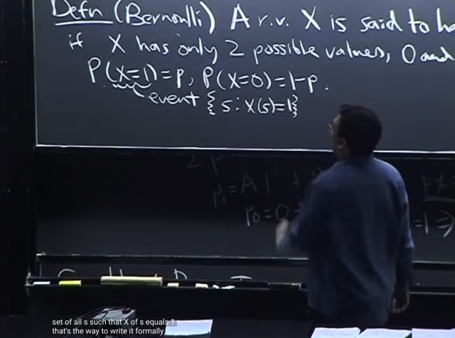</kbd></p>

> [!NOTE]
> Và đương nhiên **X `=` 1** là một **EVENT**, và nó có thể được coi là **event
> space**(ta đã biết event là một subset của sample space) chứa 
> **mọi possible outcome s được map với 1:** **{s: X(s) `=` 1}**
>
> Nhớ lại khái nhiệm **event space**, là **subset của sample space** chứa các
> possible outcome thỏa một đặc điểm nào đó mà ta quan tâm'

<br>

<a id="node-182"></a>

<p align="center"><kbd>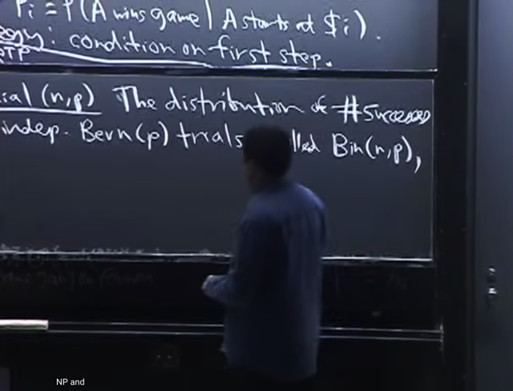</kbd></p>

> [!NOTE]
> Tiếp ví dụ thứ hai ta sẽ biết về **Binomial (n, p)** được định nghĩa là: Giả sử
> ta có **n thử nghiệm độc lập** mà **xác suất thành công của mỗi thử nghiệm
> tuân theo theo Bern (p)** (ví dụ tung đồng xu n lần)
>
> Thì đặt X là **số lần ra kết quả `=` 1 (số lần success),  thì distribution của X 
> sẽ là Binomial (n, p).**Có nghĩa là, story của Binomial random variable là: một random variable 
> đếm số `/` mang giá trị của trial success trong chuỗi n Bern(p) trial****X sẽ có gía trị từ **0 tới n**

> [!NOTE]
> BINOMIAL (N, P) DISTRIBUTION

<br>

<a id="node-183"></a>

<p align="center"><kbd>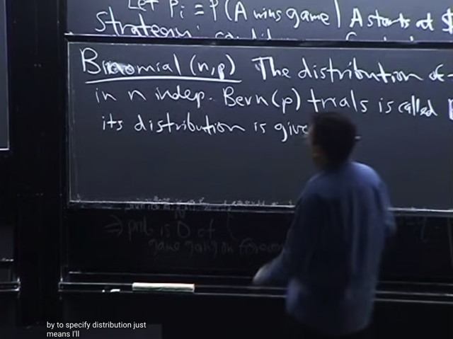</kbd></p>

> [!NOTE]
> Ta có thể hiểu distribution là một **bản** **hướng dẫn**(**blueprint**) cho biết **xác suất**
> của event **[random variable mang giá trị nào đó]** là bao nhiêu****Tức là distribution sẽ **chỉ dẫn** cho biết giá trị của xác suất mà random variable
> mang các possible value khác nhau**Nó là một CHỈ DẪN cho giá trị XÁC SUẤT gắn với một random variable**Và ta sẽ muốn định nghĩa xác suất của event (X `=` K): P(X `=` K) nó sẽ giúp ta có
> specification của một distribution

> [!NOTE]
> ĐỊNH NGHĨA CỦA DISTRIBUTION

<br>

<a id="node-184"></a>

<p align="center"><kbd>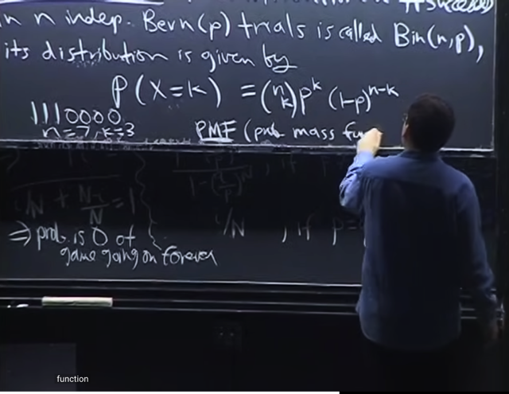</kbd></p>

🔗 **Related:** [LEC 17: MOMENT GENERATING FUNCTIONS](untitled.md#node-557)

🔗 **Related:** [TÓM TẮT:  - Tiếp tục Binomial distribution: 3 cách hiểu về rv ~ Bin(n, p)  - Định nghĩa về i.i.d  - CDF  - PMF cho Discrete random variables  - 2 tính chất để function là một valid PMF  - Binomial theorem  - Chứng minh X ~ Bin(n, p) và Y ~ Bin(m, p) thì (X+Y) ~ Bin(n+m, p)  Theo 3 cách  - Tìm PMF của X = số con xì khi sampling 5 lá từ bộ bài  - Khi sampling không hoàn lại thì X không phải là Binomial mà là HyperGeometric](tóm_tắt_tiếp_tục_binomial_distribution_3_cách_hiểu_về_rv_binn_p_định_nghĩa_về_iid_cdf_pmf_cho_discrete_random_variables_2_tính_chất_để_function_là_một_valid_pmf_binomial_theorem_chứng_minh_x_binn_p_và_y_binm_p_thì_xy_binnm_p_theo_3_cách_tìm_pmf_của_x_số_con_xì_khi_sampling_5_lá_từ_bộ_bài_khi_sampling_không_hoàn_lại_thì_x_không_phải_là_binomial_mà_là_hypergeometric.md#node-194)

> [!NOTE]
> Công thức của Binomial(n, p) distribution là như vầy:
>
> Ta có thể lập luận như sau (để có công thức):
>
> Ta có n **INDEPENDENT** experiments như tung n đồng xu (ví dụ như n `=` 7)
> ```text
> trong đó có k = 3 lần ra Head (map với X = 1), và n-k = 4 lần ra Tail (map với X = 0).
> ```
>
> Khi đó, xác suất xảy ra của kết quả cụ thể này (HHHTTTT) sẽ tính như sau:
>
> Đó là ta dùng **định nghĩa của** **INDEPENDENT** **event** để có xác suất của
> **n `=` 7 event độc lập**này (**joint probability**) P(H,H,H,T,T,T,T) là **tích của xác suất
> của từng sự kiện**.
>
> P(H,H,H,T,T,T,T) `=` P(H)*P(H)*P(H)*P(T)*P(T)*P(T)*P(T)
>
> Và như đã nói **mỗi experiment có possible outcome tuân theo Bernoulli
> distribution Bern(p)** nên theo định nghĩa của **Bern (p): P(H) `=` p, và P(T) `=` 1 `-` p**
>
> Do đó P(H,H,H,T,T,T,T) `=` `p^3*(1-p)^4`  | khái quát sẽ là **p^k(1-p)^(n-k)**Thế thì (**H,H,H,T,T,T,T**) **chỉ là một event thuộc event space** (là số lần success `=`
> `k=3)` khi thực hiện `n=7` experiment.
>
> Với `n=7` experiments thì **có bao nhiêu "cách" để có k success**: Dễ hiểu ta sẽ
> dùng quy tắc đếm và thấy rằng nó là số hoán vị của bộ 3 H và 4 T, nhưng không
> cần phân biệt các H và T. Nên ta có thể tính số hoán vị `(=n!)` và chia bớt cho số
> ```text
> hoán vị của k=3 cai H (/k!) và chia tiếp số hoán vị của n-k cái T (/(n-k)!) để có
> ```
> kết qủa là **n!/(k!(n-k)!)**. Nhưng cũng có thể nghĩ theo cách khác để thấy đây là
> số cách chọn một set k item trong n item (để làm vị trí của các H), khi đó là số 
> cách chọn k object từ n object không care thứ tự: **(n choose k), cũng là `=` 
> n!/(k!(n-k)!)**
>
> Vậy event **[có k lần success trong n lần**] là**union của (n choose k) event này**
>
> Và các event này **disjoint**
>
> Do đó theo **Axiom 2** của xác suất P([có k lần success trong n lần]) `=` **Tổng xác
> suất mỗi event** 
>
> Và **mỗi event này có xác suất xảy ra là p^k(1-p)^(n-k).**
>
> **P([có k lần success trong n lần]) `=` `P(X=k)` =** **(n choose k)*p^k*(1-p)^(n-k)**====
>
> Bàn thêm chút: P(H,H,H,T,T,T,T) `=` P(H)*P(H)*P(H)*P(T)*P(T)*P(T)*P(T) là sao?
>
> Nếu nghĩ theo cách H là event "tung đồng xu ra H" trong n lần tung độc lập, để
> (H,H,H,T,T,T,T) là intersection của n event độc lập, và dùng định nghĩa của independent
> event ta có vế phải.
>
> Cũng có thể nghĩ theo event trong sample space gốc, trong đó mỗi 
> possible outcome là kết quả của việc tung n đồng xu.
>
> ```text
> Thì khi đó (HHHTTTT) = {s ∈ S: lần 1 = H, lần 2 = H,...lần n = T}
> ```
>
> Và nó là intersection của:
>
> (H******) ∩ (*H*****) ∩ (**H****) ∩ (***T***) ∩ (****T**) ∩ (*****T*) ∩ (******T)
>
> Để rồi, vì các lần tung độc lập nên các event trong intersection trên cũng độc lập
>
> ⇨ xác suất của intersection cũng `=` tích xác suất từng cái.
>
> Và P(H******) thì cũng là là p, vì event Chuỗi H****** xảy ra thì cũng là event lần tung đầu 
> tiên ra H, và xác suất của việc lần tung đầu tiên ra H là p.
>
> tương tự P(*H*****) cũng là P("lần tung thứ 2 ra H") `=` p

> [!NOTE]
> CÔNG THỨC CỦA BIN(N,P) PMF

<br>

<a id="node-185"></a>

<p align="center"><kbd>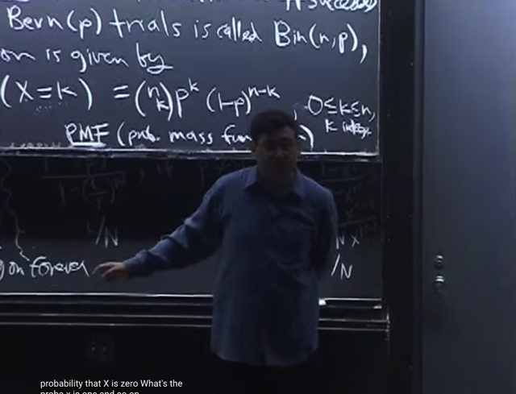</kbd></p>

🔗 **Related:** [-TÓM TẮT:   Bài toán Toy Collector:  Tìm expected value của số lần đi ăn để có đủ n loại  - EX = n(1 + 1/2 + 1/3 + ...1/n) ≈ ln(n) + γ  - CHỨNG MINH PART 2 CỦA UNIVERSALITY  - Cho X, Y, Z là các i.i.d positive random variable. Bài toán là tìm E(X / (X + Y + Z)). Nhờ symmetry tính ra rất dễ = 1/3  - Gặp lại LOTUS - Law of The Unconscious Statistician với bài toán cho X = U^2 với U~Unif(0,1), Y = e^x tìm E(Y), câu hỏi yêu cầu đáp án ở dạng  tích phân  - Để tìm PDF ta sẽ tìm CDF trước, lấy derivative của CDF là có PDF.  Và để tìm CDF ta sẽ dùng định nghĩa của nó để mà xây dựng lên  - X ~ Binomial (n, p), cần tìm distribution của n-X: n-X là một Bin(n, q) theo 2 cách  -Xây dụng PDF của Exp(λ): T (Thời gian chờ đến khi có email đầu tiên) là một Expo(λ) r.v: f(t) = (1-e^(-λ*t))' =  λ*e^(-λt)](_tóm_tắt_bài_toán_toy_collector_tìm_expected_value_của_số_lần_đi_ăn_để_có_đủ_n_loại_ex_n1_12_13_1n_lnn_γ_chứng_minh_part_2_của_universality_cho_x_y_z_là_các_iid_positive_random_variable_bài_toán_là_tìm_ex_x_y_z_nhờ_symmetry_tính_ra_rất_dễ_13_gặp_lại_lotus_law_of_the_unconscious_statistician_với_bài_toán_cho_x_u2_với_uunif01_y_ex_tìm_ey_câu_hỏi_yêu_cầu_đáp_án_ở_dạng_tích_phân_để_tìm_pdf_ta_sẽ_tìm_cdf_trước_lấy_derivative_của_cdf_là_có_pdf_và_để_tìm_cdf_ta_sẽ_dùng_định_nghĩa_của_nó_để_mà_xây_dựng_lên_x_binomial_n_p_cần_tìm_distribution_của_n_x_n_x_là_một_binn_q_theo_2_cách_xây_dụng_pdf_của_expλ_t_thời_gian_chờ_đến_khi_có_email_đầu_tiên_là_một_expoλ_rv_ft_1_e_λt_λe_λt.md#node-481)

> [!NOTE]
> Và đây là PMF **Probability Mass Function**- function cho biết với **input
> k bằng mấy** (integer từ 0 tới n) thì **P(X=k) là bao nhiêu**

> [!NOTE]
> PROBABILITY MASS FUNCTION `-` PMF

<br>

<a id="node-186"></a>

<p align="center"><kbd>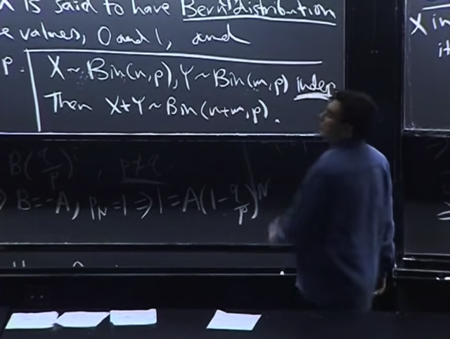</kbd></p>

> [!NOTE]
> và gs cho biết **một tính chất của Binomial distribution**:
>
> Nếu **X tuân theo (kí hiệu ~) Bin (n, p)** và **Y tuân theo Bin (m, p)** và X,
> Y độc lập nhau. Thì **X `+` Y sẽ tuân theo Bin `(n+m,` p)**

<br>

<a id="node-187"></a>

<p align="center"><kbd>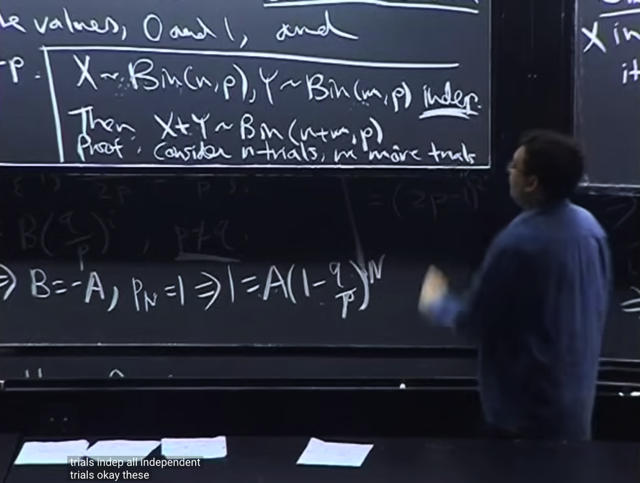</kbd></p>

> [!NOTE]
> Và gs cho rằng ta có thể c**hứng minh n**ó dễ dàng
>
> Chứng minh như sau:
>
> X ~ Bin(n,p) sẽ có ý nghĩa: X là số lần success khi thực hiện chuỗi n trial Bern(p)
> và `P(X=k)` được quy định bởi Binomial distribution Bin (n,p) 
>
> là (n choose `k)*p^k*(1-p)^(n-k)`
>
> Y ~ Bin(m,p) sẽ có nghĩa là Y là số lần success khi thực hiện chuỗi m trial Bern(p)
> và `P(Y=k)` được quy định bởi Binomial distribution Bin (m,p)
>
> là (m choose `k)*p^k*(1-p)^(m-k)`
>
> Thế thì: 
>
> Nếu X là số lần thành công của chuỗi n Bern(p) trials, Y là số lần thành công của 
> m Bern(p) trials thì đương nhiên **X+Y là số lần thành công của chuỗi `n+m` Bern(p)
> trials**.
>
> Do đó, **theo định nghĩa** thì **X+Y sẽ ~ `Bin(n+p,` p) (**Đây là chứng minh theo story)

<br>

