# Lec 8: Random Variables & Their Distributions

📊 **Progress:** `41` Notes | `40` Screenshots

---

<a id="node-189"></a>
## Tóm Tắt:

> [!NOTE]
> TÓM TẮT:
>
> `-` Tiếp tục Binomial distribution: 3 cách hiểu về rv ~ Bin(n, p)
>
> `-` Định nghĩa về i.i.d
>
> `-` CDF
>
> `-` PMF cho Discrete random variables
>
> `-` 2 tính chất để function là một valid PMF
>
> `-` Binomial theorem
>
> `-` Chứng minh X ~ Bin(n, p) và Y ~ Bin(m, p) thì `(X+Y)` ~ `Bin(n+m,` p)
>
> Theo 3 cách
>
> `-` Tìm PMF của X `=` số con xì khi sampling 5 lá từ bộ bài
>
> `-` Khi sampling không hoàn lại thì X không phải là Binomial mà là
> HyperGeometric

<br>

<a id="node-190"></a>

<p align="center"><kbd>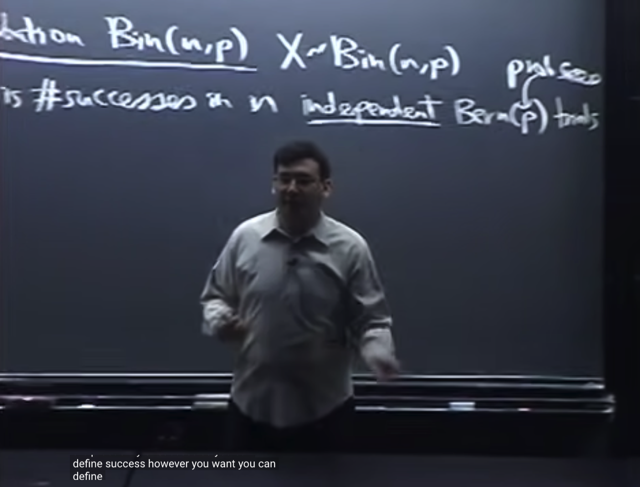</kbd></p>

> [!NOTE]
> Ta sẽ tiếp tục nói về **Binomial** distribution Bin(n, p) và gs sẽ nói về **3
> intuition** (3 cách hiểu, đều quan trọng)
>
> Đầu tiên như bữa trước đã biết, nói X ~ Bin(n,p) thì có nghĩa X là **số lần
> success** trong **n** **INDEPENDENT** Bern(p) trial `-` tức là**mỗi trial có kết
> quả tuân theo Bernoulli distribution** Bern(**p**)
>
> Và Bern(p) trial đơn giản có nghĩa là **xác suất success của mỗi trial là p,
> xác suất fail là 1-p**(đây là định nghĩa của Bernoulli distribution)

<br>

<a id="node-191"></a>

<p align="center"><kbd></kbd></p>

> [!NOTE]
> Cách hiểu thứ hai đó là khi nói X ~ Bin(n, p) là 
>
> X là **TỔNG** của n **INDICATOR VARIABLES** X1, X2...Xn

<br>

<a id="node-192"></a>

<p align="center"><kbd>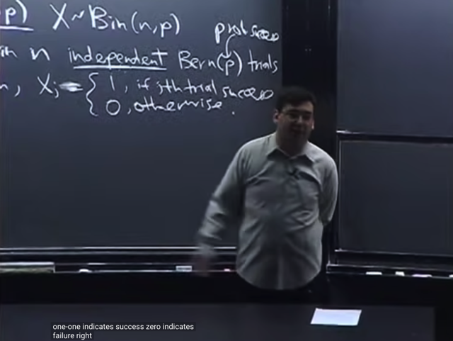</kbd></p>

> [!NOTE]
> Trong đó **mỗi indicator variable X_j** sẽ có giá trị bằng **1** nếu trial
> **success** và bằng **0** nếu ngược lại trial **fail**.

<br>

<a id="node-193"></a>

<p align="center"><kbd></kbd></p>

🔗 **Related:** [TÓM TẮT:  Tiếp tục về CDF: Định nghĩa của CDF  Bước nhảy của CDFD là giá trị PMF tại đó  Tính chất của CDF: 1) Non decreasing, 2) right continuous và   3) F(x) -> 0 khi x -> -infinity, F(x) -> 1 khi x -> -infinity  - Định nghĩa Independent random variables theo independent event:  X, Y độc lập khi  + Continuous rv: P(X≤x, Y≤y) = P(X≤x) * P(Y≤y) với mọi x, y   + Discrete rv: P(X=x,Y=y) = P(X=x)*P(Y=y)  - Expected value: Là con số tóm tắt distribution của r.v  - Hai cách tính average  - E(X) = Σx x*P(X=x)  - X ~ Bern(p) thì E(X) = p  - FUNDAMENTAL BRIDGE: E(X) = P(A), X là indicator rv mang giá trị = 1 khi event A xảy ra và 0 khi ngược lại  - X ~ Bin(n, p):  E(X) = ∑ k=0,1..n [ k * (n choose k)*p^k*q^(n-k)] = ..= np  - TÍNH LINEARITY CỦA AVERAGE  - Tính lại E(X) của Bin(n, p) nhanh hơn bằng linearity, fundamental bridge và E(X) của Bern(p)  - TÍnh E(X) của Hypergeometric Dù các trial không độc lập nhưng dùng Symmetry, linearity, fundamental bridge vẫn tính được  - X ~ Geom(p): P(X=k) = q^k*p  - E(X) = p Σ k=0:infinity [k * q^k]](tóm_tắt_tiếp_tục_về_cdf_định_nghĩa_của_cdf_bước_nhảy_của_cdfd_là_giá_trị_pmf_tại_đó_tính_chất_của_cdf_1_non_decreasing_2_right_continuous_và_3_fx_0_khi_x_infinity_fx_1_khi_x_infinity_định_nghĩa_independent_random_variables_theo_independent_event_x_y_độc_lập_khi_continuous_rv_pxx_yy_pxx_pyy_với_mọi_x_y_discrete_rv_pxxyy_pxxpyy_expected_value_là_con_số_tóm_tắt_distribution_của_rv_hai_cách_tính_average_ex_σx_xpxx_x_bernp_thì_ex_p_fundamental_bridge_ex_pa_x_là_indicator_rv_mang_giá_trị_1_khi_event_a_xảy_ra_và_0_khi_ngược_lại_x_binn_p_ex_k01n_k_n_choose_kpkqn_k_np_tính_linearity_của_average_tính_lại_ex_của_binn_p_nhanh_hơn_bằng_linearity_fundamental_bridge_và_ex_của_bernp_tính_ex_của_hypergeometric_dù_các_trial_không_độc_lập_nhưng_dùng_symmetry_linearity_fundamental_bridge_vẫn_tính_được_x_geomp_pxk_qkp_ex_p_σ_k0infinity_k_qk.md#node-250)

> [!NOTE]
> Và gs bổ sung thêm với cách hiểu thứ 2, ta có **X1, X2..Xn** có tính chất **i.i.d**
>
> Đây là lần chính thức ta được học khái niệm **INDEPENDENT IDENTICALLY 
> DISTRIBUTED**:
>
> Gs cho biết **rất nhiều người lẫn lộn** giữa **random variable** và **distribution**
>
> `-` **Random variable** như đã biết ở bài trước được định nghĩa là **function** map
> giữa **một possible outcome trong sample space S của một experiment**
> với một **giá trị numerical trên R**.
>
> `-` Còn**distribution** là **BẢN CHỈ DẪN CHO GIÁ TRỊ CỦA XÁC SUẤT** của event 
> [**random variable mang giá trị cụ thể nào đó]** là bao nhiêu.
>
> Vậy nên có thể **có nhiều random variable** nhưng **tuân theo cùng distribution**.
>
> Và ở đây ta có n random variable X1, X2 ...Xn, chúng **INDEPENDENT** vì
> theo định nghĩa của Binomial là **n trial độc lập**. Và **IDENTICAL**có nghĩa là
> **CHÚNG CÙNG TUÂN THEO MỘT DISTRIBUTION**, ở đây nó là **Bern (p)**

> [!NOTE]
> INDEPENDENT IDENTICALLY DISTRIBUTED (I.I.D)

<br>

<a id="node-194"></a>

<p align="center"><kbd>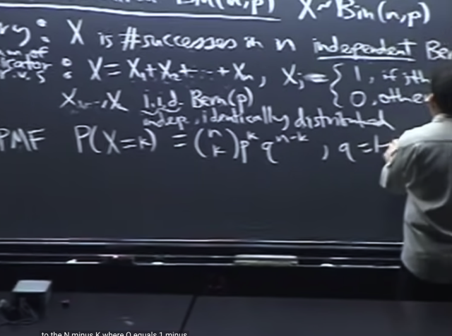</kbd></p>

🔗 **Related:** [-TÓM TẮT:   Bài toán Gambler's Ruin  - Random variable  - Bern(p) random variable  - Bin(n, p) random variable  - Định nghĩa của Distribution  - Công thức của PMF Bin (n, p)](_tóm_tắt_bài_toán_gamblers_ruin_random_variable_bernp_random_variable_binn_p_random_variable_định_nghĩa_của_distribution_công_thức_của_pmf_bin_n_p.md#node-184)

> [!NOTE]
> Và cách hiểu thứ 3 là dùng function **PMF: P(X `=` k)** `=` **(n choose k)*p^k*q^(n-k)**
> trong đó q `=` 1 `-` p

<br>

<a id="node-195"></a>

<p align="center"><kbd></kbd></p>

> [!NOTE]
> Đại khái là gs nói lại **định nghĩa của random variable** chỉ là **function**
> **map** **giữa possible outcome s** trong **sample space** với **giá trị
> numerical R**.
>
> Lấy hình ảnh pebble như thế này, ta có **sample space** với **các possible
> outcome** là các viên sỏi. Thì **bằng cách đánh số vào các viên sỏi, ta đã
> map chúng với các R value. 
>
> Thế thì hành động đánh số vào các viên sỏi chính là ta define ra một
> function map giữa một possible outcome (viên sỏi) với một con số (label
> của viên sỏi) chính là ta đã define random variable.**
>
> Và khi đó X `=` 7 mang ý nghĩa chính là một **EVENT**, bởi vì như ta đã biết cũng
> như đã nói lại trong bài trước, **event** là **subset của sample space** chứa các
> possible outcome mà ta quan tâm. Trong trường hợp này, **X `=` 7 là subset
> các possible outcome có label `=` 7.**Thể hiện theo toán học: X `=` 7 `=` {s ∈ S: X(s) `=` 7} để thấy rõ nó là một event**Và xác suất của event này, sẽ cho PMF `P(X=k)` quy định**

<br>

<a id="node-196"></a>

<p align="center"><kbd>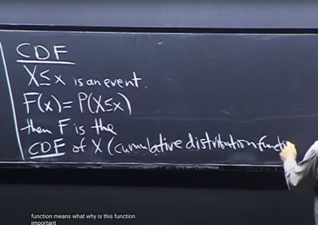</kbd></p>

> [!NOTE]
> Và khi đã hiểu **X `=` 7 là một event** thì **X ≤ x** (x là giá trị nào đó)
> **cũng là một EVENT** (là subset của sample space chứa các possible
> outcomes có label bé hơn hoặc bằng 7)
>
> X ≤ x `=` {s ∈ S: X(s) ≤ x}
>
> Thì với event này ta cũng sẽ **quan tâm với xác suất của nó**. Và
> **function theo x kí hiệu F(x)** cho biết **xác suất của event** **(X ≤ x)**
> gọi là **CDF of X**
>
> (**CUMULATIVE DISTRIBUTION FUNCTION**)

> [!NOTE]
> CUMULATIVE DISTRIBUTION FUNCTION CDF

<br>

<a id="node-197"></a>

<p align="center"><kbd></kbd></p>

> [!NOTE]
> gs: Đại khái ta **cứ hiểu là X là kết quả của function** mapping từ một
> r**andom experiment** (possible outcome) với **một giá trị thực**.
>
> gs: Và **đó là một cách nữa để mô tả distribution**, nó cho ta biết xác
> suất của các giá trị khác nhau của X

<br>

<a id="node-198"></a>

<p align="center"><kbd>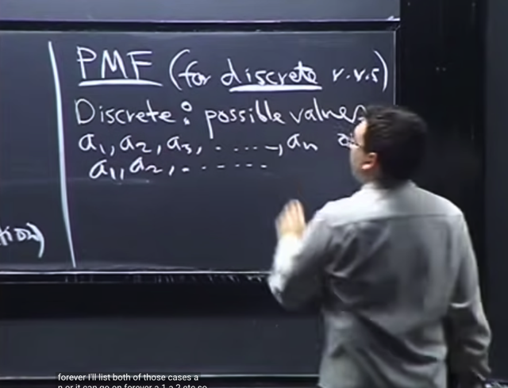</kbd></p>

> [!NOTE]
> Ta sẽ bàn thêm về **PMF**. Gs lưu ý nó **CHỈ DÀNH CHO DISCRETE 
> random variables.**
>
> Định nghĩa về **discrete**: Đại khái là **khi ta có thể LIST ra các
> possible values**. Cho **dù list có thể dài hữu hạn hoặc vô hạn.
>
> a1, a2, ....an**

> [!NOTE]
> DISCRETE RANDOM VARIABLE

<br>

<a id="node-199"></a>

<p align="center"><kbd>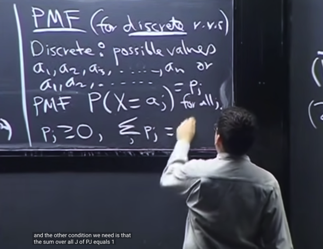</kbd></p>

🔗 **Related:** [LEC 2: STORY PROOFS, AXIOMS OF PROBABILITY](untitled.md#node-41)

> [!NOTE]
> Khi đó **PMF** là function cho biết **P(X `=` `a_j)` với mọi j**
>
> Và gọi P(X `=` `a_j)` là `p_j` thì ta sẽ phải có:
>
> **p_j `>=` 0**
>
> **Σ j `p_j` `=` 1**.
>
> Đây xuất phát từ **hai tính chất của xác suấ**t là **không âm**, và t**ổng xác suất của
> mọi possible outcome bằng 1**.
>
> Gs: **khi nào ta CHỨNG MINH ĐƯỢC `p_j` thỏa hai điều trên thì ta có PMF valid**====
>
> Sau khi đọc Casella ta có thể thấy **vì sao ta cần hai tính chất đó.**
>
> ```text
> p_j tức P(X = a_j) và theo như Casella thì ta phải hiểu đây là P_X(X = a_j) tức
> ```
> là induced probability function, được định nghĩa bởi probability function P.
>
> ```text
> P_X(X = a_j) = P({s ∈ S: X(s) = a_j}) | Đây là định nghĩa của induced probability
> ```
> function.
>
> ```text
> Và ..= Σ {s ∈ S: X(s) = a_j} P({s}) | Đây là định nghĩa của probability function P
> ```
>
> Theo axiom 1: P({s}) ≥ 0, từ đó **TA CẦN `P_X(X` `=` `a_j)` ≥ 0.**
>
> ```text
> Tiếp, Σj p_j = Σj P(X = a_j) = Σj P_X(X = a_j)
> ```
>
> ```text
> = Σj P({s ∈ S: X(s) = a_j}) | Định nghĩa induced probability func
> ```
>
> Tới đây, vì các event {s ∈ S: X(s) `=` `a_j}` với j khác nhau là các disjoint event.
>
> Nên theo axiom 3 (sách casella, còn ở class này là axiom 2):
>
> ```text
> Σj P({s ∈ S: X(s) = a_j}) = P[∪j {s ∈ S: X(s) = a_j}] (tức là P của ∪ các event)
> ```
>
> ```text
> Và ∪j {s ∈ S: X(s) = a_j} = S ⇨ ... = P(S)
> ```
>
> Mà P(S) `=` 1 theo Axiom 1 nên **TA CẦN `Σj` `p_j`  `=` 1**

<br>

<a id="node-200"></a>

<p align="center"><kbd>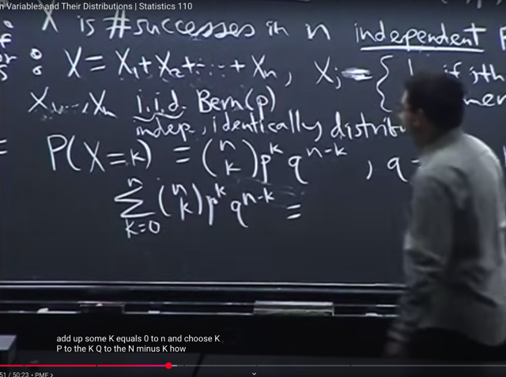</kbd></p>

> [!NOTE]
> Gs quay lại **Binomial** để**check xem P(X `=` k) có thỏa hai tính chất**
> trên của PMF
>
> thì cái thứ nhất (không âm) dễ thấy là thỏa.
>
> Còn tại sao **Σ `k=0:n` P(X `=` k)** `=` 1?

<br>

<a id="node-201"></a>

<p align="center"><kbd>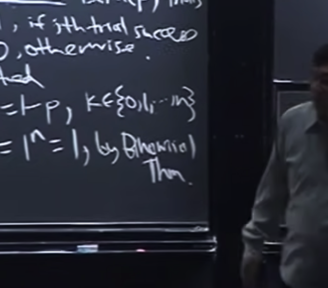</kbd></p>

<p align="center"><kbd>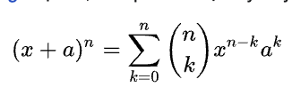</kbd></p>

<p align="center"><kbd></kbd></p>

<p align="center"><kbd></kbd></p>

<p align="center"><kbd>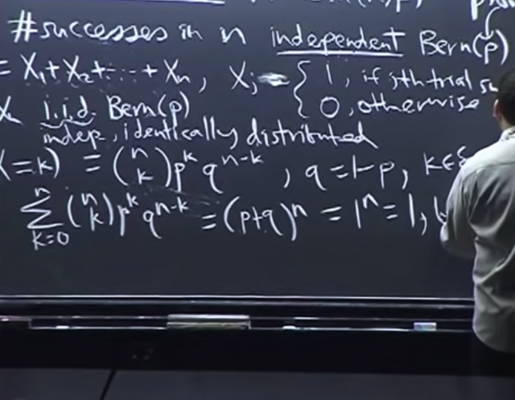</kbd></p>

> [!NOTE]
> Thì công thức này `Σk=0:n` (n choose `k)*p^k*q*(n-k)` chính là **(p+q)^n**theo **BINOMIAL THEOREM** (**ĐỊNH LÝ NHỊ THỨC**)
>
> Và vì **p `+` q `=` 1**nên ta có kết quả là **1^n `=` 1**

<br>

<a id="node-202"></a>

<p align="center"><kbd>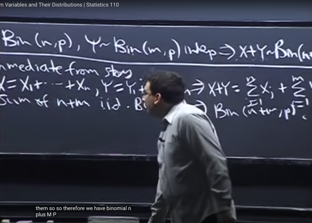</kbd></p>

> [!NOTE]
> Quay lại **một tính chất của Binomial** đã nói bữa trước đó là nếu
>
> **X ~ Bin(n, p) và Y ~ Bin(m, p) thì `(X+Y)` ~ `Bin(n+m,` p)**
>
> Và bữa trước ta đã chứng minh nó theo "lập luận" `/` hay story. Đơn giản là vì
> **X là số lần success của n Bern(p) trials** và **Y là số lần success của m
> Bern(p)** trials thì **X+Y đương nhiên sẽ là số lần success của `n+m` Bern(p)
> trials.**
>
> Do đó `X+Y` ~ `Bin(n+m,` p)
>
> `====`
>
> Gs giải thích theo cách thứ hai, sử dụng cách hiểu thứ hai của Binomial
> distribution. Đó là nếu X ~ Bin(n, p) thì X là **TỔNG CỦA N INDICATOR
> FUNCTION (INDICATOR RANDOM VARIABLE), MÀ MỖI  FUNCTION CÓ
> THỂ CÓ KẾT QỦA BẰNG 1 VỚI XÁC SUẤT P HOẶC 0 VỚI XÁC SUẤT 1-P**
>
> X ~ Bin(n, p) `=>` X `=` X1 `+` ...Xn,
>
> Trong đó `X_j` là trial có kết quả tuân theo Bernoulli Bern(p)
>
> Y ~ Bin(m, p)  `=>` Y `=` Y1 `+` ... Ym
>
> Các `Y_j` cũng là các trial có kết quả tuân theo Bernoulli Bern(p)
>
> ```text
> => X + Y = X1 + ..Xn + Y1 + ...Ym
> ```
>
> Vậy theo cách hiểu Binomial ở trên, **X `+` Y LÀ TỔNG CỦA n `+` m INDICATOR
> FUNCTION MỖI CÁI CÓ KẾT QUẢ 1 HOẶC 0 THEO BERN (P) NÊN  `X+Y` SẼ
> TUÂN THEO `BINOMIAL(n+m,` p)**

> [!NOTE]
> Chứng minh X ~ Bin(n, p) và Y ~ Bin(m, p) thì `(X+Y)` ~ `Bin(n+m,` p)
>
> Theo 3 cách

<br>

<a id="node-203"></a>

<p align="center"><kbd></kbd></p>

🔗 **Related:** [TÓM TẮT:  Tiếp tục về conditional probability qua một số ví dụ  - Nói về việc để tính xác suất giống như diện tích của một hình phức tạp có thể dùng cách làm chia nhỏ S ra bởi một partion: P(B) = P(A1,B) + P(A2,B) + ...P(An,B) =  P(B)  = P(B|A1)*P(A1) + P(B|A2)*P(A2) + ....P(B|An)*P(An)  - Cái trên chính là LOTP: Law of Total Probability  - Chia S ra không đúng cách có thể khiến vấn đề phức tạp hơ,  thực hành nhiều sẽ có kinh nghiệm  - Ví dụ sampling hai lá bài, tính xác suất có 2 lá xì khi đã có một lá xì và xác suất cả hai lá xì khi đã có lá xì bích  - Ví dụ Disease test  - Complement rule P(A|B) = 1 - P(Ac|B)  - Một số sai lầm phổ biến liên quan đến conditional probability  - Định nghĩa về conditional independent](tóm_tắt_tiếp_tục_về_conditional_probability_qua_một_số_ví_dụ_nói_về_việc_để_tính_xác_suất_giống_như_diện_tích_của_một_hình_phức_tạp_có_thể_dùng_cách_làm_chia_nhỏ_s_ra_bởi_một_partion_pb_pa1b_pa2b_panb_pb_pba1pa1_pba2pa2_pbanpan_cái_trên_chính_là_lotp_law_of_total_probability_chia_s_ra_không_đúng_cách_có_thể_khiến_vấn_đề_phức_tạp_hơ_thực_hành_nhiều_sẽ_có_kinh_nghiệm_ví_dụ_sampling_hai_lá_bài_tính_xác_suất_có_2_lá_xì_khi_đã_có_một_lá_xì_và_xác_suất_cả_hai_lá_xì_khi_đã_có_lá_xì_bích_ví_dụ_disease_test_complement_rule_pab_1_pacb_một_số_sai_lầm_phổ_biến_liên_quan_đến_conditional_probability_định_nghĩa_về_conditional_independent.md#node-102)

> [!NOTE]
> Tuy vậy ta sẽ làm theo cách khác là tìm PMF của `X+Y:`
>
> Đại khái là gs dùng cách tiếp cận **wishful thinking**. Để cho rằng `/` ước
> rằng ta biết  X, để mà **condition on X**.
>
> Khi đó `P(X+Y=k)` sẽ là:
>
> Xét event `X+Y=k:`
>
> **(X+Y=k) `=` `(X=0,` `X+Y=k)` U `(X=1,` `X+Y=k)` U ... U `(X=k,` X+Y=k)**
>
> ```text
> => P(X+Y=k) = P( (X=0, X+Y=k) U (X=1, X+Y=k) U ... U (X=k, X+Y=k) ) (1)
> ```
>
> Tại sao, vì đây đơn thuần là từ set theory: Gọi event `X+Y` là B và `X=i` là `A_i`
> thì  với mọi possible value của X ta sẽ có **các disjoint events A_i** mà
> **union của mọi `A_i` sẽ tạo nên sample space**. Thì khi đó, B `=` (B, A1) U
> (B, A2) U...(B, Aj) giống  như hình ảnh minh họa bằng pebble world của gs
> B bữa trước (theo link nâu)
>
> ```text
> Hoặc nói rõ hơn: (X+Y=k) = (X+Y=k) ∩ S (Vì X+Y=k ⊂ S,  (nên nhớ, X+Y=k
> ```
> có bản chất cũng chỉ là một event trong sample space gốc: `X+Y=k` thể hiện
> {s ∈ S: `(X+Y)(s)` `=` k}, `X+Y` là một random variable được tạo bởi tổng hai
> random variable X, Y, thì bản chất nó cũng chỉ là một function).  ...⇔
> ```text
> (X+Y=k) = (X+Y=k) ∩ (∪i=0:k (X=i)) | Vì ∪ với mọi i từ 0 đến k (X=i) = S.
> ```
>
> ```text
> ⇔ (X+Y=k) = ∪i=0:k [(X+Y=k) ∩ (X=i)]
> ```
>
> ```text
> ⇔ P(X+Y=k) = P(∪i=0:k [(X+Y=k) ∩ (X=i)])
> ```
>
> Và đương nhiên vì `X=j` với j `=` 0,1,...k là các disjoint events nên `(X=j,`
> `X+Y=k)` cũng là các disjoint events. Do đó sử dụng Axiom 2 xác suất ta có:
>
> ```text
> P((X=0, X+Y=k) U (X=1, X+Y=k) U ...(X=k, X+Y=k)) = P(X=0, X+Y=k)
> ```
> ```text
> + P(X=1, X+Y=k) + ... P(X=k, X+Y=k) (2)
> ```
>
> Dùng conditional theorem P(A,B) `=` P(A|B)*P(B), ta có:
>
> ```text
> P(X=0, X+Y=k) = P(X+Y=k|X=0)*P(X=0) P(X=1, X+Y=k) =
> ```
> ```text
> P(X+Y=k|X=1)*P(X=1) .. P(X=k, X+Y=k) = P(X+Y=k|X=k)*P(X=k)
> ```
>
> ```text
> Thế thì (2) sẽ tiếp tục = P(X+Y=k|X=0)*P(X=0) + ... P(X+Y=k|X=k)*P(X=k)
> ```
> (3)
>
> Từ (1), (3) ta kết luận:
>
> **P(X+Y=k)** **=** **Σ j P(X+Y=k|X=j)*P(X=j)**

<br>

<a id="node-204"></a>

<p align="center"><kbd>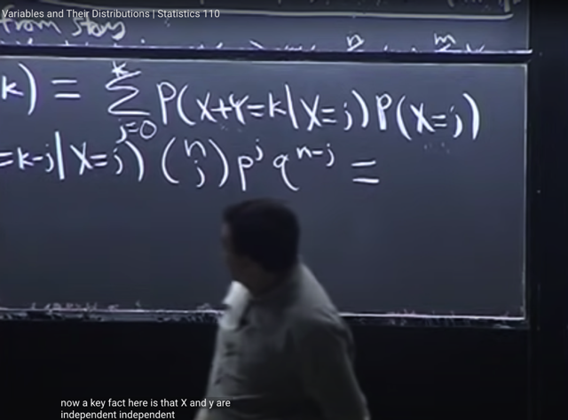</kbd></p>

<p align="center"><kbd></kbd></p>

<p align="center"><kbd>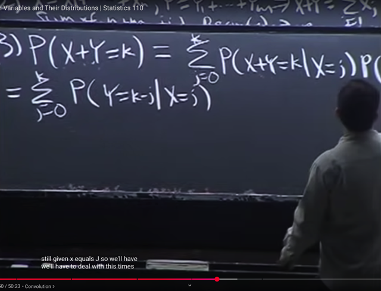</kbd></p>

> [!NOTE]
> ```text
> P(X+Y=k) = Σ j P(X+Y=k|X=j)*P(X=j)
> ```
>
> ```text
> Tiếp theo, bởi vì X+Y=k sẽ tương đương / cùng là một event với Y=k-X nên:
> ```
>
> ```text
> (Việc hiểu thấu bản chất của X+Y=k là một event trong S: {s ∈ S: (X+Y)(s) = k}
> ```
>
> ```text
> và nó cũng là {s ∈ S: X(s) + Y(s) = k} do Z=X+Y là một random variable mới được
> ```
> tạo thành bởi tổng hai rvs X, Y và theo định nghĩa này Z(s) `=` X(s) `+` Y(s), hay
> `(X+Y)(s)` `=` X(s) `+` Y(s).
>
> ```text
> Mà X(s) + Y(s) = k ⇔ Y(s) = k - X(s) nên {s ∈ S: X(s) + Y(s) = k} cũng chính là
> ```
> ```text
> {s ∈ S: Y(s) = k - X(s)} đến lượt cái này là chính là event Y=k-X)
> ```
>
> ```text
> ⇨ (X+Y=k) = (Y=k-X) (dùng dấu bằng ở đây ý là hai event là một)
> ```
>
> ```text
> ⇨ (X+Y=k, X=j) = (Y=k-X, X=j)
> ```
>
> ```text
> mà (Y=k-X, X=j) thì đương nhiên là = (Y=k-j, X=j) bởi đây là intersect của hai event
> ```
> ```text
> X=j, và Y = k-X. Thì vì X=j nên ta có quyền thay vào Y = k-X để có Y = k-j.
> ```
>
> ```text
> (Chặt chẽ hơn:  (Y=k-X, X=j) = {s ∈ S: Y(s) = k - X(s), X(s) = j}
> ```
>
> Dấu phẩy trong định nghĩa set này về cơ bản mang ý nghĩa liệt kê các tiêu chuẩn 
> mà ta có. Do đó ta có quyền sử dụng X(s) `=` j để thế vào Y(s) `=` k `-` X(s). Từ đó 
> ```text
> set {s ∈ S: Y(s) = k - X(s), X(s) = j} cũng bằng {s ∈ S: Y(s) = k - j, X(s) = j}, từ đó
> ```
> ```text
> ta có (X+Y=k, X=j) = (Y=k-X, X=j))
> ```
>
>
> Vậy thì **(Y=k-X, `X=j)` `=` `(Y=k-j,` X=j)**
>
> nên đương nhiên **P(X+Y=k, `X=j)` `=` `P(Y=k-X,` X=j)** và dẫn đến khi apply conditional
> theorem cho hai event ở hai vế ta cũng sẽ có:
>
> ```text
> P(X+Y=k|X=j)*P(X=j) = P(Y=k-j|X=j)*P(X=j)
> ```
> **⇔ `P(X+Y=k|X=j)` `=` P(Y=k-j|X=j)** 
>
> ```text
> Ngắn gọn: (Y=k-X, X=j) = {s ∈ S: Y(s) = k - X(s), X(s) = j}
> ```
>
> ```text
> = {s ∈ S: Y(s) = j - X(s), X(s) = j} = (Y=k-j, X=j)
> ```
>
> ```text
> ⇨ P(Y=k-X, X=j) = P(Y=k-j, X=j)
> ```
>
> ```text
> ⇨ P(Y=k-X | X=j)P(X=j) = P(Y=k-j | X=j)P(X=j)
> ```
>
> ```text
> ⇨ P(Y=k-X | X=j) = P(Y=k-j | X=j)
> ```
>
> `=====`
>
> Cách 2:  Cứ phân tích trực tiếp cái `P(Y=k-X` | `X=j)`
>
> ```text
> (Y=k-X | X=j) có bản chất là event X = j đã xảy ra, nó thay thế sample space gốc
> ```
>
> ```text
> Nên (Y=k-X | X=j) thực ra là {s ∈ {s ∈ S: X(s) = j}, Y(s) = k - X(s)}
> ```
>
> thế thì dĩ nhiên ý nghĩa của tập này là xét các s sao cho X(s) `=` j, thì cái nào là
> thỏa Y(s) `=` k `-` X(s). Do đó dĩ nhiên có quyền xài X(s) `=` j.
>
> ```text
> ⇨ {s ∈ {s ∈ S: X(s) = j}, Y(s) = k - X(s)} = {s ∈ {s ∈ S: X(s) = j}, Y(s) = k - j}
> ```
>
> và vế phải chính là `(Y=k` `-` j | X `=` j)
>
> ```text
> Do đó P(Y=k-X | X=j) = P(Y=k-j | X=j)
> ```
>
> Và `P(X=j)` theo công thức PMF của Binomial Bin(n, p)
>
> **P(X=j) `=` (n choose j)*p^j*q^(n-j)**

<br>

<a id="node-205"></a>

<p align="center"><kbd>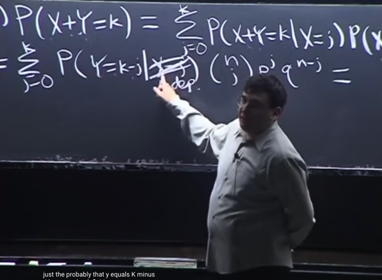</kbd></p>

🔗 **Related:** [TÓM TẮT:  Tiếp tục về CDF: Định nghĩa của CDF  Bước nhảy của CDFD là giá trị PMF tại đó  Tính chất của CDF: 1) Non decreasing, 2) right continuous và   3) F(x) -> 0 khi x -> -infinity, F(x) -> 1 khi x -> -infinity  - Định nghĩa Independent random variables theo independent event:  X, Y độc lập khi  + Continuous rv: P(X≤x, Y≤y) = P(X≤x) * P(Y≤y) với mọi x, y   + Discrete rv: P(X=x,Y=y) = P(X=x)*P(Y=y)  - Expected value: Là con số tóm tắt distribution của r.v  - Hai cách tính average  - E(X) = Σx x*P(X=x)  - X ~ Bern(p) thì E(X) = p  - FUNDAMENTAL BRIDGE: E(X) = P(A), X là indicator rv mang giá trị = 1 khi event A xảy ra và 0 khi ngược lại  - X ~ Bin(n, p):  E(X) = ∑ k=0,1..n [ k * (n choose k)*p^k*q^(n-k)] = ..= np  - TÍNH LINEARITY CỦA AVERAGE  - Tính lại E(X) của Bin(n, p) nhanh hơn bằng linearity, fundamental bridge và E(X) của Bern(p)  - TÍnh E(X) của Hypergeometric Dù các trial không độc lập nhưng dùng Symmetry, linearity, fundamental bridge vẫn tính được  - X ~ Geom(p): P(X=k) = q^k*p  - E(X) = p Σ k=0:infinity [k * q^k]](tóm_tắt_tiếp_tục_về_cdf_định_nghĩa_của_cdf_bước_nhảy_của_cdfd_là_giá_trị_pmf_tại_đó_tính_chất_của_cdf_1_non_decreasing_2_right_continuous_và_3_fx_0_khi_x_infinity_fx_1_khi_x_infinity_định_nghĩa_independent_random_variables_theo_independent_event_x_y_độc_lập_khi_continuous_rv_pxx_yy_pxx_pyy_với_mọi_x_y_discrete_rv_pxxyy_pxxpyy_expected_value_là_con_số_tóm_tắt_distribution_của_rv_hai_cách_tính_average_ex_σx_xpxx_x_bernp_thì_ex_p_fundamental_bridge_ex_pa_x_là_indicator_rv_mang_giá_trị_1_khi_event_a_xảy_ra_và_0_khi_ngược_lại_x_binn_p_ex_k01n_k_n_choose_kpkqn_k_np_tính_linearity_của_average_tính_lại_ex_của_binn_p_nhanh_hơn_bằng_linearity_fundamental_bridge_và_ex_của_bernp_tính_ex_của_hypergeometric_dù_các_trial_không_độc_lập_nhưng_dùng_symmetry_linearity_fundamental_bridge_vẫn_tính_được_x_geomp_pxk_qkp_ex_p_σ_k0infinity_k_qk.md#node-231)

🔗 **Related:** [TÓM TẮT:  - Chứng minh tính linearity của expectation  - Negative binomial: Số failure cho đến khi có r success  (Mở rộng của Geomegtric (số failure cho đến khi có success đầu)   - P(X=n) = (n+r-1 choose n) * p^r * q^n  - E(X) = rq/p  - Cần để ý xem quy ước là start at 0 hay 1 đối với Negative Binomial  - Bài toán Putnam tính expect value của X = số chữ số là local maxima  trong n chữ số  - St. Peterburg Paradox](tóm_tắt_chứng_minh_tính_linearity_của_expectation_negative_binomial_số_failure_cho_đến_khi_có_r_success_mở_rộng_của_geomegtric_số_failure_cho_đến_khi_có_success_đầu_pxn_nr_1_choose_n_pr_qn_ex_rqp_cần_để_ý_xem_quy_ước_là_start_at_0_hay_1_đối_với_negative_binomial_bài_toán_putnam_tính_expect_value_của_x_số_chữ_số_là_local_maxima_trong_n_chữ_số_st_peterburg_paradox.md#node-270)

> [!NOTE]
> Tiếp theo ta sẽ **sử dụng sự thật** rằng X, Y là các **INDEPENDENT**
> **VARIABLE**
>
> Gs nói ta tuy chưa nói về định nghĩa chính thức của independent variable
> nhưng có thể hiểu**tương tự** như **INDEPENDENT** **EVENT**: Đó là:
>
> **Việc event `X=j` có xảy ra không KHÔNG CUNG CẤP THÊM THÔNG TIN GÌ
> VỀ EVENT Y=k-j**. Do đó ta có thể bỏ đi condition.
>
> ```text
> Do đó: P(Y=k-j | X = j) = P(Y=k-j | \~X = j\~) = P(Y=k-j)
> ```

<br>

<a id="node-206"></a>

<p align="center"><kbd>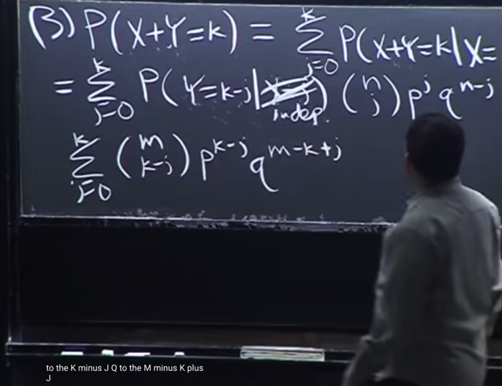</kbd></p>

> [!NOTE]
> Và again theo công thức PMF của **Y~ Bin(m, p)** ta có 
>
> ```text
> P(Y=k-j) = (m choose k-j)*p^(k-j)*q^(m-k+j)
> ```

<br>

<a id="node-207"></a>

<p align="center"><kbd>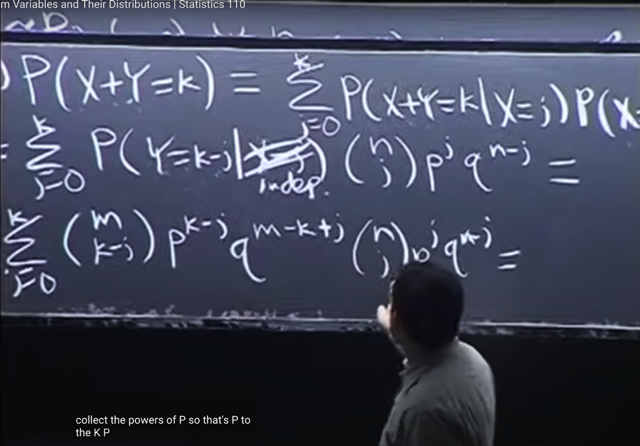</kbd></p>

> [!NOTE]
> gom (nhân) `p^k-j` và p^j để có **p^k** cũng như là `q^(m-k+j)` với `q^(n-j)`
> thành **q^(m+n-k)**
>
> Và vì hai cái này không còn phụ thuộc j nên **bỏ ra ngoài dấu tổng.**

<br>

<a id="node-208"></a>

<p align="center"><kbd>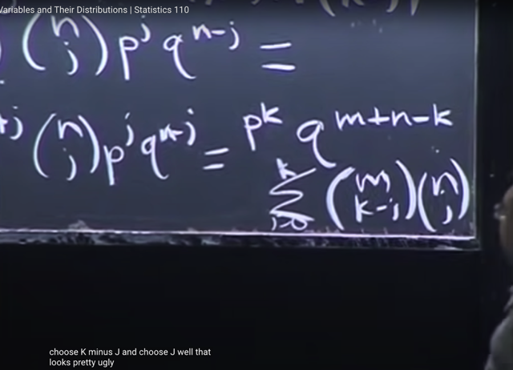</kbd></p>

> [!NOTE]
> Còn trong dấu tổng là **(m choose `k-j)` * (n choose j)**

<br>

<a id="node-209"></a>

<p align="center"><kbd>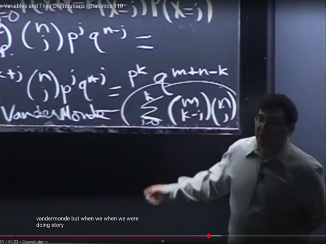</kbd></p>

🔗 **Related:** [LEC 2: STORY PROOFS, AXIOMS OF PROBABILITY](untitled.md#node-40)

🔗 **Related:** [TÓM TẮT:  - Tiếp tục Binomial distribution: 3 cách hiểu về rv ~ Bin(n, p)  - Định nghĩa về i.i.d  - CDF  - PMF cho Discrete random variables  - 2 tính chất để function là một valid PMF  - Binomial theorem  - Chứng minh X ~ Bin(n, p) và Y ~ Bin(m, p) thì (X+Y) ~ Bin(n+m, p)  Theo 3 cách  - Tìm PMF của X = số con xì khi sampling 5 lá từ bộ bài  - Khi sampling không hoàn lại thì X không phải là Binomial mà là HyperGeometric](tóm_tắt_tiếp_tục_binomial_distribution_3_cách_hiểu_về_rv_binn_p_định_nghĩa_về_iid_cdf_pmf_cho_discrete_random_variables_2_tính_chất_để_function_là_một_valid_pmf_binomial_theorem_chứng_minh_x_binn_p_và_y_binm_p_thì_xy_binnm_p_theo_3_cách_tìm_pmf_của_x_số_con_xì_khi_sampling_5_lá_từ_bộ_bài_khi_sampling_không_hoàn_lại_thì_x_không_phải_là_binomial_mà_là_hypergeometric.md#node-219)

> [!NOTE]
> Và đó chính là **VanderMonde Identity: theo đó, nó sẽ bằng `(m+n` choose k)**
>
> Ta có thể lập luận nhanh lại như sau:
>
> Mục tiêu là đếm số bộ k items từ `m+n` items.
>
> Thế thì, đương nhiên ta có ngay **(m+n choose k)**cách chọn.
>
> Tuy nhiên có thể làm kiểu khác là **lấy j items từ nhóm n items** ta có **(n choose j)** và 
> **lấy `k-j` items từ nhóm m items:** **(m choose k-j)**. Với j `=` 0....k
>
> Theo product rule: Số cách chọn ở mỗi giá trị của j sẽ là  **(m choose j)*(n choose k-j)**Và với k bằng các giá trị khác nhau, ta sẽ có các cách chọn không chồng lấn,
> do đó theo sum rule:**tổng số cách chọn sẽ là `Σ` j (m choose j)*(n choose k-j)**Và như vậy **(m+n choose k) `=` `Σ` j (m choose j)*(n choose k-j)**Do đó **P(X+Y=k) `=` `(m+n` choose k) * p^k * `q^(m+n` `-` k) 
>
> ĐIỀU NÀY CHO THẤY `P(X+Y=K)` TUÂN THEO CÔNG THỨC PMF CỦA BINOMIAL 
> `BIN(m+n,` k) cho ta kết luận `X+Y` ~ `Bin(m+n,` k)**

<br>

<a id="node-210"></a>

<p align="center"><kbd>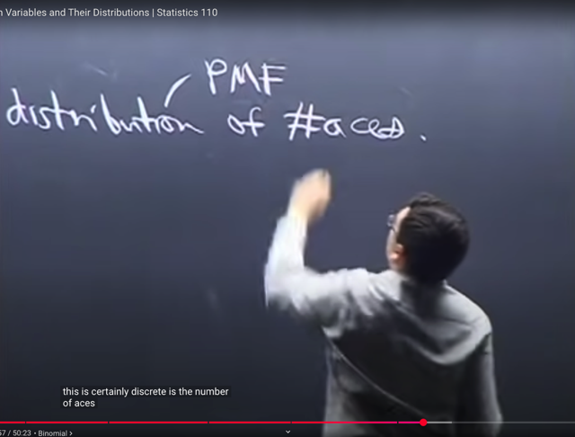</kbd></p>

> [!NOTE]
> gs sẽ dùng ví dụ này để nói về việc **khi nào thì không phải là Binomial**.
>
> Nhấn mạnh rằng Binomial Bin(n,p) phải là khi các n event có tính chất  i.i.d:
> **INDEPENDENT IDENTICALLY DISTRIBUTED**
>
> Tức là n event đều **độc lập** và đều có **cùng một distribution là Bern(p)**
>
> Thì ở đây, bài toán đặt ra là **tìm distribution** của **số con xì** khi **lấy 5 lá
> bài**.
>
> (Rõ ràng ta hiểu là lấy 5 lá bài và đếm số lá xì trong đó thì đây có nghĩa là lần
> lượt lấy 5 lá `/` hoặc lấy ra 5 lá rồi đếm số lá xì VÀ **LẤY THÌ LẤY RA LUÔN**
> **KHÔNG BỎ VÀO LẠI**, tức nó chính là **SAMPLING WITHOUT
> REPLACEMENT**, CHỨ KHÔNG PHẢI LÀ LẤY RA RỒI BỎ VÀO LẠI lấy ra
> rồi bỏ vào lại `/` SAMPLING WITH REPLACEMENT từ bộ bài 5 lá để xem có
> mấy lá xì vì tí nữa ta sẽ nói thêm rằng nếu là lấy rồi bỏ vào lại thì sẽ khác)
>
> Gs cho biết điều này đồng nghĩa ta **cần tìm PMF hoặc CDF** nhưng **thường sẽ
> dễ hơn khi tìm PMF**. (số là Xì trong set 5 lá sẽ có các giá trị khả dĩ rời rạc 0,
> 1..5. Nên nó là một discrete random variable, nên nó sẽ có PMF)

> [!NOTE]
> TÌM PMF CỦA "X `=` SỐ CON XÌ KHI
> SAMPLING 5 LÁ TỪ BỘ BÀI"

<br>

<a id="node-211"></a>

<p align="center"><kbd>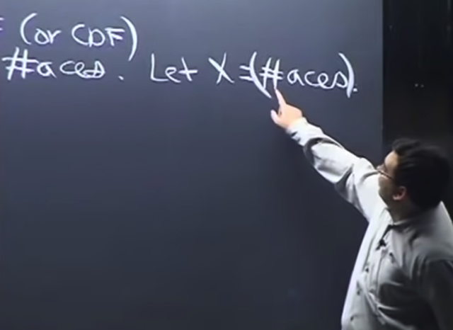</kbd></p>

> [!NOTE]
> Gs nhắc lại rằng khi đặt X `=` số con xì trong 5 lá bài, thì ta **đang tạo ra một
> random variable** như định nghĩa, là một function. Và ta dễ thấy khó hiểu vì
> sao đây là function, vì thông thường ta hay thấy function theo kiểu f(x) `=` x^2
> hay sao đó.
>
> Nhưng gs nhấn mạnh ta cần hiểu đây là **function** **map** giữa một
> **possible** **outcome** trong sample space với **một giá trị R**. Ở đây là map
> một **possible outcome khi bốc 5 lá bài từ bộ bài (tức là một set 5 lá)** và map
> nó với **con số thực thể hiện số con xì trong 5 lá đó**. Đó là một function.
>
> Nhờ Casella ta hiểu hơn chỗ này:
>
> X là function, map giữa s là một possible outcome trong original sample space
> S với X(s) sample space của X, gọi là range của X, là trục số thực R.
>
> Vậy thì s là một p.o khi rút 5 lá từ bộ bài, thì với mỗi một possible outcome, 
> thằng X, đóng vai function, sẽ đi đếm số lá Xì trong set 5 lá này, để thông
> báo môt con số, chính là X(s). HIểu vậy sẽ rất rõ X là một function mà trong
> cái trên random variable thì chữ random xuất phát từ việc ta có các possible
> outcome trong original sample space.

<br>

<a id="node-212"></a>

<p align="center"><kbd>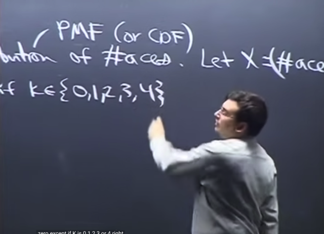</kbd></p>

> [!NOTE]
> Thế thì đại khái là ta **cần tìm PMF**, chính là `P(X=k)` với k `=` {0,1,2,3,4}. Và
> gs cho biết ta **nên luôn tìm cách list các possible value cho random variable
> nếu có thể** vì có thể **giúp ta tránh những sai lầm** ví dụ như tính xác suất
> của **một event không thể xảy ra** hoặc**thiếu một giá trị có thể xảy ra**.
>
> Ở đây dĩ nhiên **k không thể lớn hơn 4** vì trong **bộ bài chỉ có 4 con xì**.
>
> Và như vậy **P(X=k) `=` 0** nếu **k khác {0,1,2,3,4}**
>
> Tiếp theo ta sẽ thấy distribution của X ở đây không phải Binomial. Bởi vì,
> theo định nghĩa của Binomial Bin(n, p), thì X là số lần success khi thực hiện n
> independent trial Bern(p). Điểm cần nhấn mạnh là **MỌI TRIALS PHẢI**
> **INDEPENDENT**VÀ **MỌI TRIALS ĐỀU CÓ KẾT QUẢ TUÂN THEO
> CÙNG MỘT DISTRIBUTION** là Bern(p): tức là đều có thể ra 1 (success) với
> xác suất p và ra 0 (fail) với xác suất `1-p`
>
> Còn ở đây, khi lần lượt chọn n `=` 5 lá bài, thì **Ở MỖI LẦN, XÁC SUẤT THÀNH
> CÔNG (CHỌN ĐƯỢC XÌ) KHÔNG GIỐNG NHAU**. Ví dụ nếu 4 lá đầu đều là xì, 
> thì sẽ khiến xác suất chọn được lá xì (tức là xác suất của success) trong trial thứ 
> 5 sẽ là 0.
>
> Do đó n trial **KHÔNG INDEPENDENT**, và chúng **CŨNG KHÔNG IDENTICAL** vì 
> như đã nói **XÁC SUẤT SUCESS Ở MỖI TRIAL KHÔNG TUÂN THEO CÙNG  
> MỘT DISTRIBUTION BERN (p)**vì xác suất success (p) mỗi lần mỗi khác.
>
> Nếu mà là lấy ra lá bài, xem có phải là xì không, rồi bỏ vào lại, rồi mới lấy tiếp
> thì đây là sampling with replacement. Khi đó dễ thấy các Bern(p) trial đều độc
> lập, và xác suất success cũng sẽ giống nhau (đều bằng `4/52).` Khi đó ta sẽ có
> Binomial(n,p) distribution.

> [!NOTE]
> NẾU X `=` SỐ LÁ XÌ KHI SAMPLING (KHÔNG HOÀN LẠI) 5 LÁ TỪ BỘ
> BÀI THÌ NÓ KHÔNG PHẢI BINOMIAL

<br>

<a id="node-213"></a>

<p align="center"><kbd>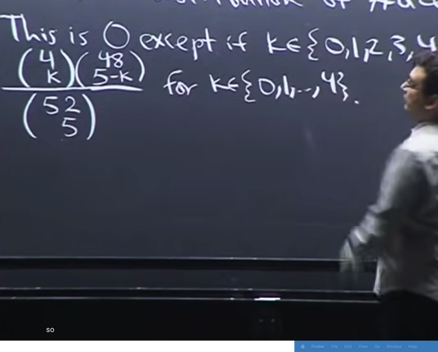</kbd></p>

> [!NOTE]
> Lập luận như vậy để **cho thấy X không theo Binomial**. Còn để tính `P(X=k).` Ta có
> thể **dùng naive definition** vì việc rút 5 lá từ 52 lá thì các possible outcome đều có 
> khả năng như nhau `-` tính chất **equally likely**
>
> Sample space: Rút 5 lá trong 52 lá, ta có **sample space** có size `=` (52 choose 5) 
> possible outcome ⇨ P({s}) `=` `1/(52` choose 5)
>
> Event space: Đếm **số bộ 5 lá có k lá xì**. Ta sẽ đếm theo 2 bước
>
> i) chọn k lá xì: (4 choose k)
>
> ii) chọn `5-k` lá khác xì `(52-4` choose `5-k)`
>
> Theo step rule: (4 choose k)*(48 choose `5-k)`
>
> Vậy `P(X=k)` `=` **(4 choose k)*(48 choose `5-k)` `/` (52 choose 5)**

<br>

<a id="node-214"></a>

<p align="center"><kbd></kbd></p>

> [!NOTE]
> và gs cho biết kết quả này khiến ta liên hệ với **The Elk problem**(đọc trong
> sách). Thì ý chính là khi học class này ta sẽ**phát triển khả năng nhìn thấy các
> bài toán tương tự nhau**

<br>

<a id="node-215"></a>

<p align="center"><kbd>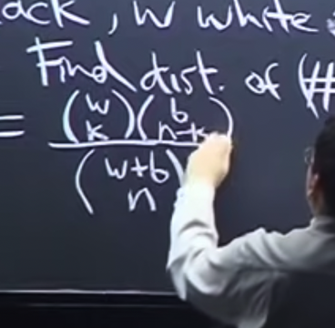</kbd></p>

<p align="center"><kbd></kbd></p>

<p align="center"><kbd>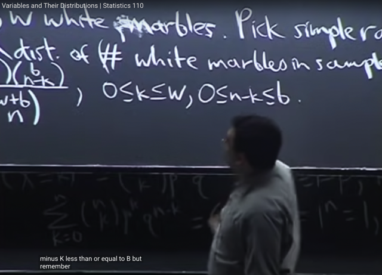</kbd></p>

> [!NOTE]
> Thế thì khái quát hơn, gs cho **bài toán Marble**: có b bi đen, w bi trắng. Câu
> hỏi là: khi **chọn n viên bi**, thì gọi X là **số bi trắng X trong n bi sẽ có
> distribution là gì**.
>
> Thì đây cũng **y chang bài toán Elk problem** hoặc bài toán số con xì trong 5
> lá vừa rồi.
>
> Trong bài toán số con xì trong 5 lá thì cũng là bộ bài có 48 lá khác xì, 4 lá xì,
> chọn `n=5` lá, tìm distribution của số lá xì thì có thể thấy nó cũng y như trong lọ
> có b bi đen, w bi trắng, chọn n bi, tìm distribution của số bi trắng
>
> Ta cũng sẽ có **P(X=k) `=` (w choose k)*(b choose `n-k)` `/` `(b+w` choose n)**

> [!NOTE]
> BÀI TOÁN MARBLE, HOÀN TOÀN TƯƠNG TỰ, VÀ CHO THẤY
> X KHÔNG PHẢI LÀ BINOMIAL MÀ LÀ HYPERGEOMETRIC

<br>

<a id="node-216"></a>

<p align="center"><kbd>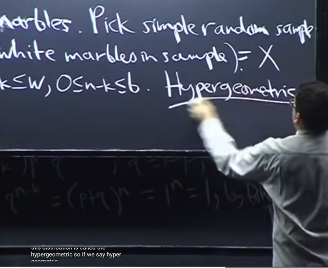</kbd></p>

> [!NOTE]
> Và distribution này có tên gọi là **Hypergeometric** distribution
>
> Và gs đề nghị ta hãy nhớ về nó, liên hệ nó với Elk problem, hoặc Ace
> problem hoặc Marble problem

<br>

<a id="node-217"></a>

<p align="center"><kbd>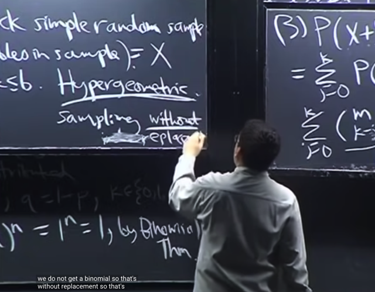</kbd></p>

> [!NOTE]
> Và ĐIỂM **KHÁC BIỆT MẤU CHỐT** CỦA **HYPERGEOMETRIC** VÀ
> **BINOMIAL** ĐÓ LÀ SAMPLING **WITH** `/` **WITHOUT** REPLACEMENT.
>
> Ví dụ khi chọn bi mà mỗi lần **chọn xong thì bỏ vào lại**, hoặc chọn lá bài
> xong bỏ vào lại (**sampling with replacement**) thì:
>
> 1) **Xác suất chọn được bi trắng** hoặc xác suất chọn **được lá xì** **ở mỗi
> lần đều như nhau** tức là **XÁC SUẤT SUCCESS Ở MỖI TRIAL ĐỀU NHƯ
> NHAU** (thỏa yêu cầu **IDENTICAL**)
>
> 2) Và cũng nhờ vậy mà kết quả ở trial trước K**HÔNG ẢNH HƯỞNG ĐẾN
> XÁC SUẤT SUCCESS Ở TRIAL SAU** (THỎA TÍNH **INDEPENDENT**). Thì
> khi đó ta có **BINOMIAL**.
>
> Còn nếu **sampling without replacement**, chọn xong lấy ra luôn (without
> replacement `=` KHÔNG HOÀN LẠI)  thì ta sẽ không có i.i.d nên sẽ là
> **HYPERGEOMETRIC**

> [!NOTE]
> ĐIỂM KHÁC BIỆT MẤU CHỐT CỦA HYPERGEOMETRIC VÀ
> BINOMIAL ĐÓ LÀ SAMPLING WITH `/` WITHOUT REPLACEMENT.

<br>

<a id="node-218"></a>

<p align="center"><kbd>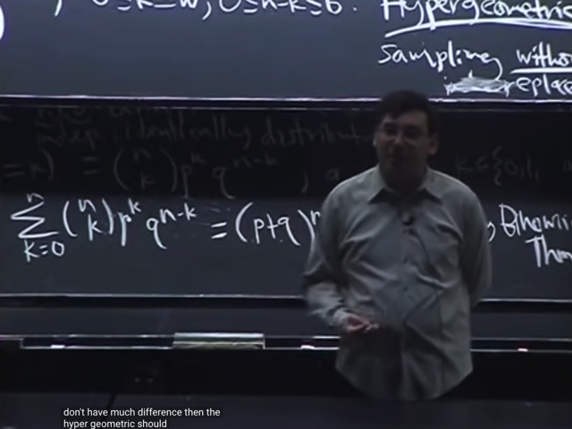</kbd></p>

> [!NOTE]
> gs cho biết thêm đại khái là nếu giả sử ta **có 1 tỉ viên bi** và **chỉ sampling
> 10 viên** khi đó việc **replacement hay không không khác nhau lắm**. Dẫn
> đến trong trường hợp này **binomial và hypergeometric sẽ approximately
> nhau**

> [!NOTE]
> Khi số lượng bi trong lọ là rất lớn thì kết quả sẽ
> không khác nhau mấy khi đó Binomial và
> Hypergeometric sẽ trở nên gần giống nhau

<br>

<a id="node-219"></a>

<p align="center"><kbd>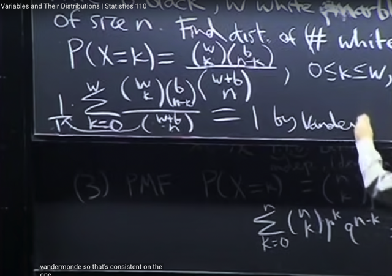</kbd></p>

🔗 **Related:** [TÓM TẮT:  - Tiếp tục Binomial distribution: 3 cách hiểu về rv ~ Bin(n, p)  - Định nghĩa về i.i.d  - CDF  - PMF cho Discrete random variables  - 2 tính chất để function là một valid PMF  - Binomial theorem  - Chứng minh X ~ Bin(n, p) và Y ~ Bin(m, p) thì (X+Y) ~ Bin(n+m, p)  Theo 3 cách  - Tìm PMF của X = số con xì khi sampling 5 lá từ bộ bài  - Khi sampling không hoàn lại thì X không phải là Binomial mà là HyperGeometric](tóm_tắt_tiếp_tục_binomial_distribution_3_cách_hiểu_về_rv_binn_p_định_nghĩa_về_iid_cdf_pmf_cho_discrete_random_variables_2_tính_chất_để_function_là_một_valid_pmf_binomial_theorem_chứng_minh_x_binn_p_và_y_binm_p_thì_xy_binnm_p_theo_3_cách_tìm_pmf_của_x_số_con_xì_khi_sampling_5_lá_từ_bộ_bài_khi_sampling_không_hoàn_lại_thì_x_không_phải_là_binomial_mà_là_hypergeometric.md#node-209)

> [!NOTE]
> Cuối cùng gs check xem `P(X=k)` (cuả Hypergeometric) có thỏa 2 tính chất của
> PMF.
>
> Tính chất ko âm thì dễ thấy là thỏa rồi.
>
> Ta cần check xem tổng mọi k của `P(X=k)` có bằng 1 không,
>
> Thì mẫu số không dính đến k nên đưa ra ngoài: `1/(w+b` choose n)
>
> Và **[tổng k (w choose k)*(b choose n-k)]** sẽ một lần nữa chính là
> **Vandermonde** identity `=` **(w+b choose n)**
>
> Từ đó ta có `(w+b` choose n) ở tử và mẫu `->` **Tổng k `P(X=k)` `=` 1**

<br>

<a id="node-220"></a>

<p align="center"><kbd></kbd></p>

> [!NOTE]
> Mấy phút cuối gs sẽ cho ta hình dung về **CDF**.
>
> Đại khái là khi **x rất nhỏ** thì **xác suất X nhỏ hơn x cũng sẽ rất nhỏ**, và
> khi **x tăng dần thì P(X<x)** cũng tăng dần lên 1
>
> Do đó đồ thị **CDF** khi X là continuous có dạng như vầy

<br>

<a id="node-221"></a>

<p align="center"><kbd>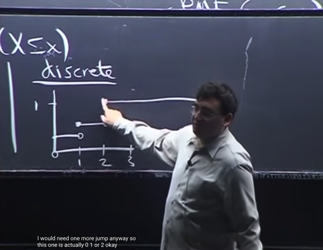</kbd></p>

> [!NOTE]
> còn với discrete thì đồ thị sẽ có các bước nhảy như vầy vì X có giá trị discrete
> 0,1,2,3
>
> Nên gs nói nếu là biến discrete thì dùng PMD sẽ dễ hơn CFD

<br>

