# Lec 9: Expectation, Indicator Random Variables, Linearity

📊 **Progress:** `63` Notes | `41` Screenshots

---

<a id="node-223"></a>
## Tóm Tắt:

> [!NOTE]
> TÓM TẮT:
>
> Tiếp tục về CDF: Định nghĩa của CDF
>
> Bước nhảy của CDFD là giá trị PMF tại đó
>
> Tính chất của CDF: 1) Non decreasing, 2) right continuous và 
>
> ```text
> 3) F(x) -> 0 khi x -> -infinity, F(x) -> 1 khi x -> -infinity
> ```
>
> `-` Định nghĩa Independent random variables theo independent event:
>
> X, Y độc lập khi
>
> `+` Continuous rv: P(X≤x, Y≤y) `=` P(X≤x) * P(Y≤y) với mọi x, y 
>
> ```text
> + Discrete rv: P(X=x,Y=y) = P(X=x)*P(Y=y)
> ```
>
> `-` Expected value: Là con số tóm tắt distribution của r.v
>
> `-` Hai cách tính average
>
> ```text
> - E(X) = Σx x*P(X=x)
> ```
>
> `-` X ~ Bern(p) thì `E(X)` `=` p
>
> `-` FUNDAMENTAL BRIDGE: `E(X)` `=` P(A), X là indicator rv mang giá
> trị `=` 1 khi event A xảy ra và 0 khi ngược lại
>
> ```text
> - X ~ Bin(n, p):  E(X) = ∑ k=0,1..n [ k * (n choose k)*p^k*q^(n-k)] = ..= np
> ```
>
> `-` TÍNH LINEARITY CỦA AVERAGE
>
> `-` Tính lại `E(X)` của Bin(n, p) nhanh hơn bằng linearity, fundamental
> bridge và `E(X)` của Bern(p)
>
> `-` TÍnh `E(X)` của Hypergeometric Dù các trial không độc lập nhưng
> dùng Symmetry, linearity, fundamental
> bridge vẫn tính được
>
> `-` X ~ Geom(p): `P(X=k)` `=` q^k*p
>
> ```text
> - E(X) = p Σ k=0:infinity [k * q^k]
> ```

<br>

<a id="node-224"></a>

<p align="center"><kbd>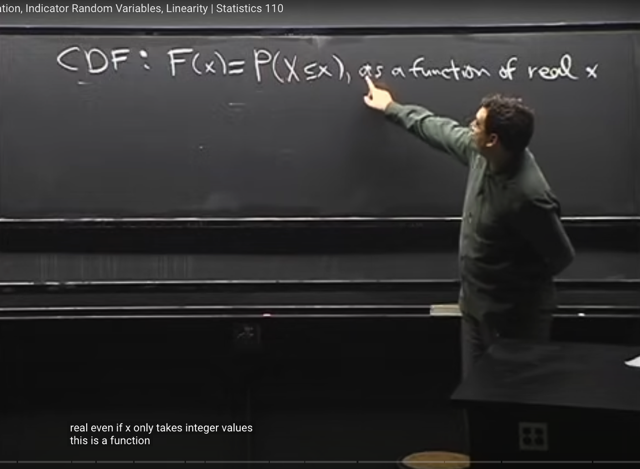</kbd></p>

<br>

<a id="node-225"></a>

<p align="center"><kbd>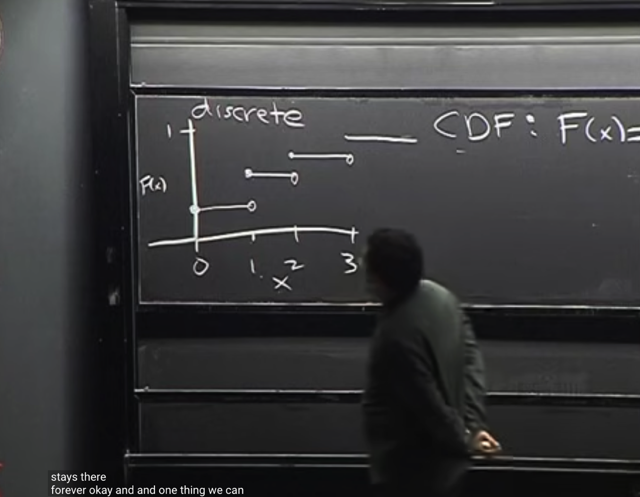</kbd></p>

> [!NOTE]
> Khi x từ **-infinity tăng dần đến 0** (nhưng chưa bằng 0) thì vì X chỉ có các possible
> value là 0,1,2..., nên event X < x **không thể xảy ra**, hay nói cách khác, **vì các event có bản
> chất là subset của sample space** **chứa các possible outcome**, thì **không có possible
> outcome nào trong sample space được map với label âm cả**. Do đó event `X<=x` với x
> âm là một subset rỗng. Do đó **xác suất của event này bằng 0 theo định nghĩa.** 
>
> Nhưng ngay khi x `=` 0, bởi vì **có tồn tại possible outcome mà  được map với label 0** (do
> đề bài cho X có các possible value `=` 0,1,2..) nên **event X `=` 0 cũng như là event X `<=` x
> với x `=` 0 CÓ CHỨA POSSIBLE OUTCOME**. Thành ra xác suất của event này đã**trở
> nên dương**, tạo nên bước nhảy tại x `=` 0
>
> Sau đó, khi **x tăng dần từ 0 đến `~=1,` P(X ≤ x) không đổi**. Nguyên nhân là do chỉ có các
> possible outcome được map với các labeL****có các gía trị rời rạc (discrete) 0,1,2,3 Nên
> các event: (X ≤ 0), (X ≤ 0.5), (X ≤ 0.999) thực ra **đều chỉ chứa duy nhất cùng một
> possible outcome (là cái có label 0)**
>
> Rồi khi x `=` 1 thì **event X ≤ 1** sẽ **chứa thêm một possible outcome nữa** `-` đó là **outcome
> mà được map với label 1** (thông qua random variable X là function). Do đó xét trên góc
> độ các event là các subset của sample space thì **event `X<=1` sẽ chứa các event `X=0` và
> X=1** (theo ý nghĩa subset `X<=1` chứa hai subset là `X=1` và `X=0).Tức` là ta có **(X<=1) `=`
> `(X=0)` U (X=1)**
>
> Nên tại đây **P(X<=x) `=` `P(X=0` U `X=1)` và đây là union của các disjoint event** nên  theo
> **axiom 2** `=` `P(X=0)` `+` `P(X=1)` `=>` F(x)  c**ó bước nhảy lên từ `P(X=0)` lên `P(X=0)` `+` P(X=1)**.
> Nói cách khác độ lớn của bước  chính là bằng `P(X=1)`
>
> Tiếp tục, từ `x=1` tới `x~=2,` các event `X<=x` thực chất vẫn chứa cùng số possible outcome
> với event `(X=0` U `X=1),` nên `P(X<=x)` không đổi, đường F(x) đi ngang.
>
> ```text
> Khi x = 2. event X<=x có thêm event X = 2. Nên P(X<=2) = P(X=0 U X=1 U X=2) =
> ```
> ```text
> P(X=0) + P(X=1) + P(X=2). Và sẽ tiếp tục có bước nhảy của F(x) với độ lớn chính là
> ```
> `P(X=2)`
>
> **Tóm tắt như sau:**
>
> x<0: P(X≤x) `=` P(∅) `=` 0 Vì khi x<0 thì không có giá trị nào có thể xảy ra của X mà ≤ x 
> được nên event X ≤ x là subset rỗng, ko chứa possible outcome nào.
>
> x thuộc [0,1): event X≤x chứa các possible outcome sao cho X `=` 0. Nên P(X≤x) chính
> là **P(X=0)** cũng là **bước nhảy đầu tiên** của F(x)
>
> ```text
> x thuộc [1,2): event X<= x chứa các possible outcome sao cho X=0 U X=1 nên P(X<=x)
> ```
> chính là `P(X=0` U `X=1)` `=` `P(X=0)` `+` `P(X=1).` Nên F(x) có bước nhảy ngay tại `x=1` với **độ
> lớn `=` P(X=1)**
>
> ```text
> x thuộc [2, 3): event X <= x chứa các possible outcome sao cho X=0 U X=1  hoặc X=2.
> ```
> Nên `P(X<=x)` chính là `P(X=0` U `X=1` U `X=2).` F(x) có bước nhảy tại `x=2` với **độ lớn `=`
> P(X=2)**
>
> ```text
> x >= 3: event X<=x chứa mọi possible outcome: X=0 U X=1 U X=2 U X=3. Nên P(X<=x)
> ```
> ```text
> = P(X=0 U X=1 U X=2 U X=3) = 1
> ```

<br>

<a id="node-226"></a>

<p align="center"><kbd>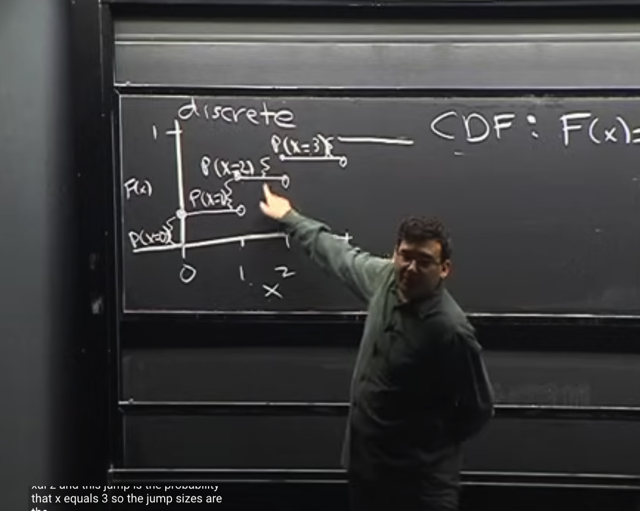</kbd></p>

> [!NOTE]
> và các **bước nhảy như đã nói chính là các gía trị của PMF**.
> điều này giúp kết nối PMF và CDF

> [!NOTE]
> BƯỚC NHẢY CỦA CDF CHÍNH
> LÀ GIÁ TRỊ PMF TẠI ĐÓ

<br>

<a id="node-227"></a>

<p align="center"><kbd>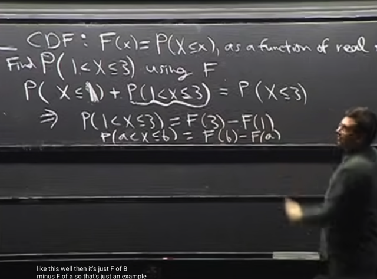</kbd></p>

> [!NOTE]
> Từ đó ta có thể **dùng CDF** để trả lời các câu hỏi như vầy tìm**P(1 < X ≤ 3)**
>
> Ta sẽ **tách** event X `<=` 3 thành **union của 2 disjoint event**:
>
> ```text
> (X<=3) = (X<=1) U (1<X<=3)
> ```
>
> Theo **axiom 2**: `P(X<=3)` `=` `P(X<=1)` `+` `P(1<X<=3)`
>
> ```text
> =>  P(1<X<=3) = P(X<=3) - P(X<=1)
> ```
>
> Và đấy chính là**F(3)**- **F(1)** Vì F(x) là `P(X<=x)`
>
> Khái quát lên thì **P(a < X `<=` b) `=` F(b) `-` F(a)**
>
> Và với discrete random variable ta phải cẩn thận các dấu < `/` `=`

> [!NOTE]
> P(a < X ≤ b) `=` F(b) `-` F(a)

<br>

<a id="node-228"></a>

<p align="center"><kbd>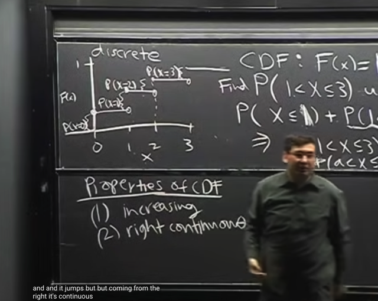</kbd></p>

> [!NOTE]
> Tiếp gs nói qua **vài tính chất của CDF**. Đầu tiên dễ thấy là nó **luôn tăng**
> (dù là có bước nhảy nhưng nó **không bao giờ giảm**, điều này cũng dễ hiểu vì
> **khi tăng x**, xác suất **X ≤ x  sẽ ngày càng lớn**, hay khi tăng x thì càng ngày
> có **càng nhiều possible outcome mà label nhỏ hơn x** khiến **số possible
> outcome trong subset `/` event (X `<=` x) ngày càng nhiều lên** `->` xác suất của
> event sẽ tăng lên
>
> Tiếp theo là tính chất "**right continuous**" mang ý nghĩa là khi **tiến dần một mốc
> nào đó từ bên phải** ví dụ lim của F(x) khi x `->` 2 từ bên phải thì **kết quả sẽ
> converge về F(2)** nhưng ngược lại khi `x->` 2 từ bên trái thì sẽ không như vậy
>
> Nên **hàm số chỉ liên tục từ phải sang trái**, còn khi đi từ trái sang phải thì nó
> không liên tục
>
> \~Cái này có thể cần 18.01 để hiểu rõ hơn: \~Trong bài 2 MIT 18.01, gs có nói về
> khái niệm **CONTINUITY**, được định nghĩa là, nếu function có tính chất **continuous**
> tại x0 nếu **lim f(x) `x->x0` `=` f(x0)** và điều nằm có nghĩa là:
>
> Cả **left-hand limit** và **right-hand limit** của f(x) tại x0: kí hiệu là l**im `x->x0-` [f(x)]** và
> **lim `x->x0+` f(x)** đều **tồn tại** và **bằng nhau** `(=` f(x0))
>
> Vậy ở đây, gs nói về **right continuous**, chính là việc **tồn tại `right-hand` limit**:
> **lim `x->x0+`  f(x) `=` f(x0)**

> [!NOTE]
> Quay lại sau khi học 18.01: Đã quay lại

> [!NOTE]
> TÍNH CHẤT CỦA CDF:
>
> `+` `NON-DECREASING`
>
> `+` RIGHT CONTINUOUS
>
> ```text
> + F(x) -> 0 khi x -> -infinity, F(x) -> 1 khi x -> -infinity
> ```

<br>

<a id="node-229"></a>

<p align="center"><kbd>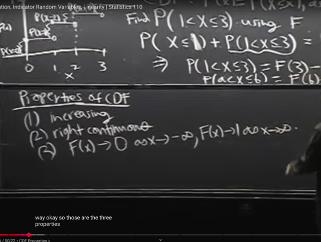</kbd></p>

🔗 **Related:** [TÓM TẮT:  - Tiếp tục Expo(λ): PDF CỦA EXPO(λ): f(x) = λ e^(-λx) x > 0  - Check tính valid của PDF của Expo  - CDF CỦA EXPO(λ) : F_X(x) = 1 - e^(-λx)  - X ~ Expo(λ) thì  Y = λX thì Y sẽ ~ Expo(1)  - Chứng minh rằng X ~ Expo(λ) thì  Y = λX thì Y sẽ ~ Expo(1)  - EX OF EXPO(1) = 1  - VARIANCE OF EXPO(1) = 1  - X~EXPO(λ) thì Y= λX sẽ ~EXPO(1)   EY = 1 ⇨ E(X) = E(Y/λ) = 1/λ EY = 1/λ  VARIANCE OF EXPO(λ) = 1/λ^2  Var(Y) = 1 ⇨ Var(X) = Var(Y/λ) = (1/λ^2) Var(Y) = (1/λ^2)  Memoryless thể hiện bởi equation: P(X ≥ s+t | X ≥ s) = P(X ≥ t)  chứng minh nếu X ~ Expo(λ) thì nó sẽ thỏa mãn Memoryless equation   P(X ≥ s), thì cái này gọi là Survivor function  Survivor function với X~Expo(λ): P(X ≥ s) = e^(-λs)  -Nhờ tính chất Memoryless nên nếu X~Expo(λ) E(X|X > a) = a + 1 / λ](tóm_tắt_tiếp_tục_expoλ_pdf_của_expoλ_fx_λ_e_λx_x_0_check_tính_valid_của_pdf_của_expo_cdf_của_expoλ_f.md#node-495)

> [!NOTE]
> Tính chất thứ 3 là F(x) `->` 0 khi x `->` `-infinity,` 
>
> và F(x) `->` 1 khi x `->` infinity

<br>

<a id="node-230"></a>

<p align="center"><kbd>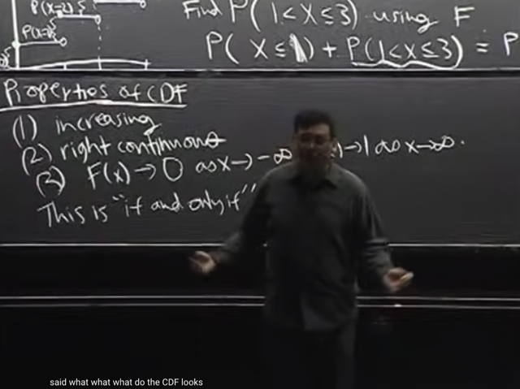</kbd></p>

> [!NOTE]
> và khi một function**thỏa mãn 3 properties**
> này thì **nó là một valid CDF**

<br>

<a id="node-231"></a>

<p align="center"><kbd>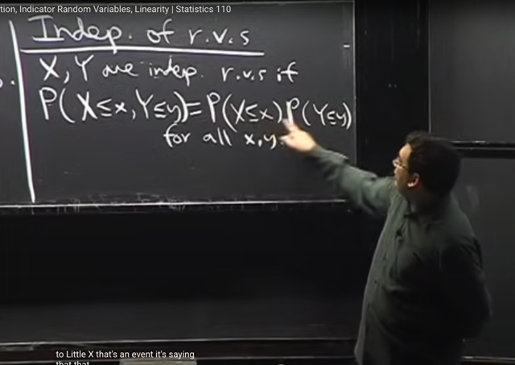</kbd></p>

🔗 **Related:** [TÓM TẮT:  - Tiếp tục Binomial distribution: 3 cách hiểu về rv ~ Bin(n, p)  - Định nghĩa về i.i.d  - CDF  - PMF cho Discrete random variables  - 2 tính chất để function là một valid PMF  - Binomial theorem  - Chứng minh X ~ Bin(n, p) và Y ~ Bin(m, p) thì (X+Y) ~ Bin(n+m, p)  Theo 3 cách  - Tìm PMF của X = số con xì khi sampling 5 lá từ bộ bài  - Khi sampling không hoàn lại thì X không phải là Binomial mà là HyperGeometric](tóm_tắt_tiếp_tục_binomial_distribution_3_cách_hiểu_về_rv_binn_p_định_nghĩa_về_iid_cdf_pmf_cho_discre.md#node-205)

> [!NOTE]
> Tiếp theo gs chính thức nói về định nghĩa **INDEPENDENT RANDOM
> VARIABLES**
>
> Như bài trước đã biết sơ rằng nếu **giá trị cụ thể của một random variable** này
> **không cung cấp thêm thông tin** gì về **giá trị của random variable kia.**
>
> Thế thì định nghĩa chính thức, ta sẽ cũng liên hệ nó, **ĐƯA NÓ VỀ** **INDEPENDENT
> EVENT**. Đó là hai r.v X, Y sẽ **INDEPENDENT** nếu như:
>
> **P(X<=x, `Y<=y)` `=` `P(X<=x)` * `P(Y<=y)` với mọi x, y**
>
> Phải hiểu là khi diễn đạt `/` đưa định nghĩa independent random variable với 
> **independent event**, thì có nghĩa là **nếu event `X<=x` và event `Y<=y` independent**
> thì có random variable X và random variable Y independent
>
> Vế trái, `P(X<=x,` `Y<=y)` được gọi là **JOINT CDF** và ta sẽ gặp lại sau. Thế thì ta có
> thể thấy nó **CHÍNH LÀ ĐỊNH NGHĨA CỦA 2 INDEPENDENT EVENTS**. (event A,
> B độc lập nếu P(A,B) `=` P(A)*P(B))
>
> 2 event ở đây là `(X<=x)` và `(Y<=y)` để rồi xác suất của **join (intersection) event
> `(X<=x,` Y<=y)**  chính là bằng **tích xác suất của từng event**

> [!NOTE]
> ĐỊNH NGHĨA CỦA INDEPENDENT RANDOM VARIABLE
> THEO INDEPENDENT EVENTS
>
> CONTINUOUS RV:
>
> P(X≤x, Y≤y) `=` P(X≤x) * P(Y≤y) với mọi x, y

<br>

<a id="node-232"></a>

<p align="center"><kbd>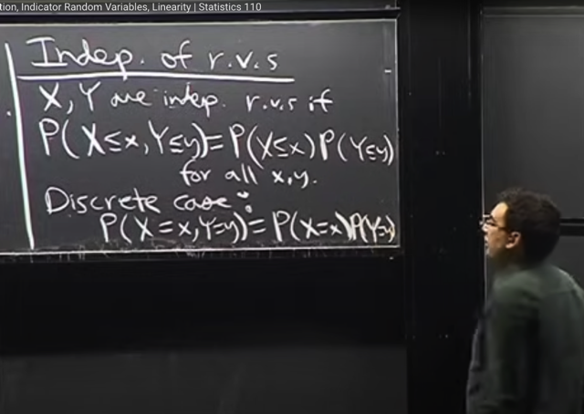</kbd></p>

> [!NOTE]
> Trong discrete case, nó trở thành **P(X=x,Y=y) `=` P(X=x)*P(Y=y)**
>
> mang ý nghĩa là vì nếu X, Y độc lập thì**việc X bằng bao nhiêu không giúp
> ích gì cho việc xác định Y bằng bao nhiêu** do đó sẽ đồng nghĩa là **hai
> event `X=x` và `Y=y` nên độc lập với nhau**, và từ đó cho phép ta định nghĩa
> hai random variable độc lập**BẰNG CÁCH THỂ HIỆN** **hai event độc lập
> `X=x` và `Y=y`
>
> Và gs cho biết ta chỉ được dùng cái này khi discrete case, vì với
> continous case thì cả hai vế đều bằng 0**

> [!NOTE]
> ĐỊNH NGHĨA CỦA INDEPENDENT RANDOM VARIABLE
> THEO INDEPENDENT EVENTS
>
> DISCRETE RV:
>
> ```text
> P(X=x,Y=y) = P(X=x)*P(Y=y) với mọi x. y
> ```

<br>

<a id="node-233"></a>

<p align="center"><kbd></kbd></p>

> [!NOTE]
> Ta sẽ qua nói về **Average**. Gs cho biết khi **không nói gì thêm** thì ta
> có thể hiểu average là **Means**, hoặc có tên khác là **Expected Values**Theo gs đại khái là **vì sao ta cần average của random variable**. Là
> bởi vì, với random variable, ta biết, **trước khi thực hiện experiment** **ta
> không biết nó có giá trị gì**, **chỉ sau khi experiment thì ta mới biết nó có
> giá trị cụ thể**. (again, nhắc lại định nghĩa của random variable là function
> map giữa một possible outcome trong sample space với một real value).
>
> Thế thì ý tưởng là tuy ta chỉ biết giá trị cụ thể của random variable sau khi
> thực hiện experiment nhưng ta **vẫn muốn predict gía trị của random
> variable**. Thì đó chính là lí do ta **muốn tính average của nó**

> [!NOTE]
> AVERAGE

<br>

<a id="node-234"></a>

<p align="center"><kbd></kbd></p>

> [!NOTE]
> Và điều đó mang ý nghĩa là giúp ta **có một con số** (average) để
> **"tóm tắt" lại distribution của random variable.**Tuy nhiên điều này có thể **không đủ**, vì **distribution có thể rất
> phức tạp** nên việc tóm lược thông tin qua mỗi một con số
> (average) là không đủ. Do đó những bài sau ta sẽ làm quen với các
> con số khác **đo lường mức biến động của random variable như
> variance, standard deviation**....
>
> Nhưng để có các con số này ta v**ẫn cần phải có average** để từ đó
> mới có thể  tính các giá trị đo lường sự biến động

<br>

<a id="node-235"></a>

<p align="center"><kbd>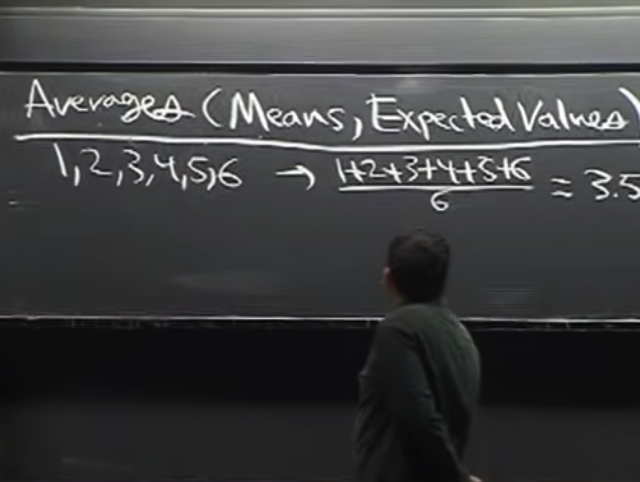</kbd></p>

> [!NOTE]
> gs lấy ví dụ mean của 7 con số này: 1,2,3,4,5,6,7
>
> Và ông cho biết **để tính mean** của chúng thật ra ta chỉ cần **lấy
> trung bình**của **hai giá trị đầu cuối** `(1+6)/2` `=` 3.5

<br>

<a id="node-236"></a>

<p align="center"><kbd>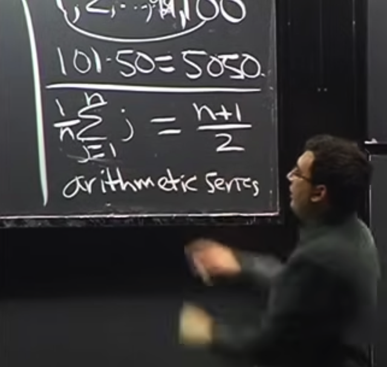</kbd></p>

> [!NOTE]
> Thế thì ta biết thêm chuỗi **1,2,3..n** này gọi là **arithmetic** series:
>
> Ông kể bài toán tìm tổng của chuỗi 1,2...99,100 mà nhà toán hoạc Gauss đã giải
> ```text
> hồi nhỏ. Ông phát hiện 1+100 = 2+99 = ..50 cặp như vậy
> ```
>
> Nên tổng của chúng là 50*101 
>
> Thì ở đây cũng vậy tổng của chuỗi 1,2.....n là : **n/2 cặp mỗi cặp có tổng `=` n+1**
>
> Thành ra trung bình của chúng là **(1/n)*(n/2)*(n+1) `=` (n+1)/2**

> [!NOTE]
> HAI CÁCH TÍNH AVERAGE: 
>
> CÁCH 1: CỘNG LẠI HẾT RỒI CHIA TỔNG SỐ LƯỢNG

<br>

<a id="node-237"></a>

<p align="center"><kbd>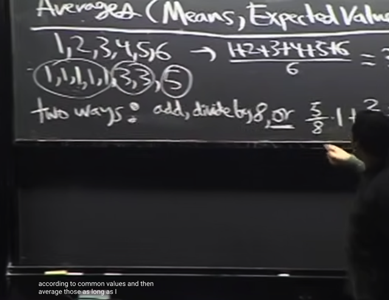</kbd></p>

> [!NOTE]
> Thế thì**nếu các giá trị có repeat** thì sao, ví dụ chuỗi **1,1,1,1,1,3,3,5**
>
> Gs cho rằng sẽ có **2 cách làm:**
>
> Đầu tiên đơn giản là **cộng lại** **(1+1+1+1+1+3+3+5)** và **chia số lượng (8)**

<br>

<a id="node-238"></a>

<p align="center"><kbd>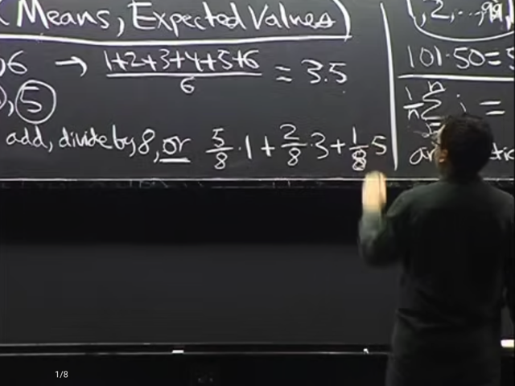</kbd></p>

> [!NOTE]
> Nhưng cách thứ hai đó là ta sẽ **tính average của các con số** **trong** đây
> là 1, 3, 5 nhưng vì mỗi con **xuất hiện nhiều lần khác nhau** nên ta sẽ
> **gắn trọng số cho chúng:** 
>
> **1***[**trọng số của 1 là 5/8** vì 1 xuất hiện 5 lần trong tổng cộng 8 lần] `+` **3***[t**rọng số
> của 3 là 2/8** vì 3 xuất hiện 2 lần] `+` **5***[t**rọng số của 5 là 1/8** vì nó chỉ xuất
> hiện 1 lần]
>
> Kết quả vẫn ra như cách 1.
>
> Đây chính là **WEIGHTED AVERAGE.**Để ý CÁC WEIGHT **KHÔNG ÂM** VÀ **CÓ TỔNG BẰNG 1**

> [!NOTE]
> CÁCH 2: TÍNH WEIGHTED AVERAGE: TỔNG CÁC CON SỐ 
> NHÂN VỚI TRỌNG SỐ CỦA NÓ

<br>

<a id="node-239"></a>

<p align="center"><kbd>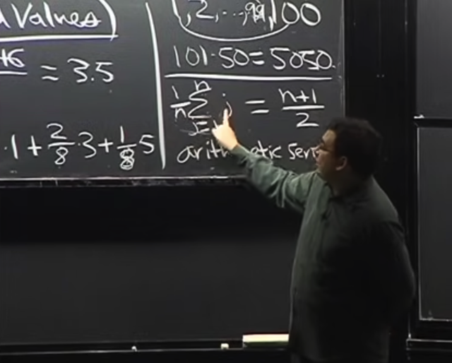</kbd></p>

> [!NOTE]
> Và sự thật thì khi tính "**un-weight average**" thực chất **vẫn là weighted 
> average** chẳng qua là **các weight đều bằng nhau** và bằng **1/n** thôi.

<br>

<a id="node-240"></a>

<p align="center"><kbd>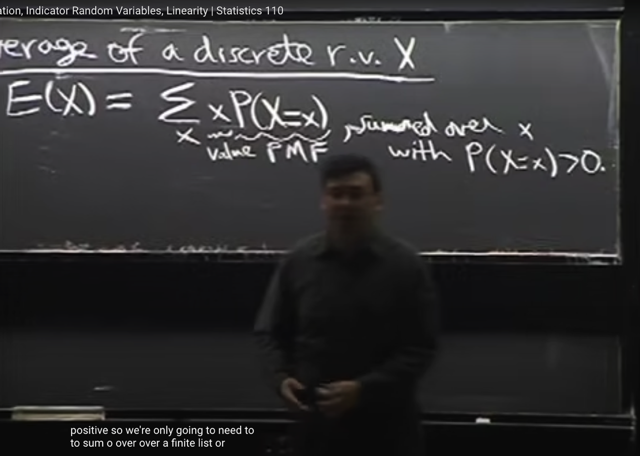</kbd></p>

> [!NOTE]
> Và từ đó ta có định nghĩa của **Average của discrete random variable X**
>
> Kí hiệu là **E(X)**
>
> Và công thức hoàn toàn g**iống như khi tính weight average**: của các
> **possible value x**, với **trọng số tương ứng** cho possible value đó hoàn toàn
> dễ hiểu sẽ chính là **dùng xác suất tương ứng P(X=x)**
>
> Nên **E(X) `=` Tổng x [x*P(X=x)]** với **mọi possible value (có thể có của X)** hay
> mọi x sao cho `P(X=x)` > 0
>
> Trong đó **P(X=x) là hàm PMF**, x là **possible value của X**

> [!NOTE]
> `E(X),` là weight average của các possible values của X với weight là 
> ```text
> P(X=x): E(X) = Σx xP(X=x)
> ```

<br>

<a id="node-241"></a>

<p align="center"><kbd>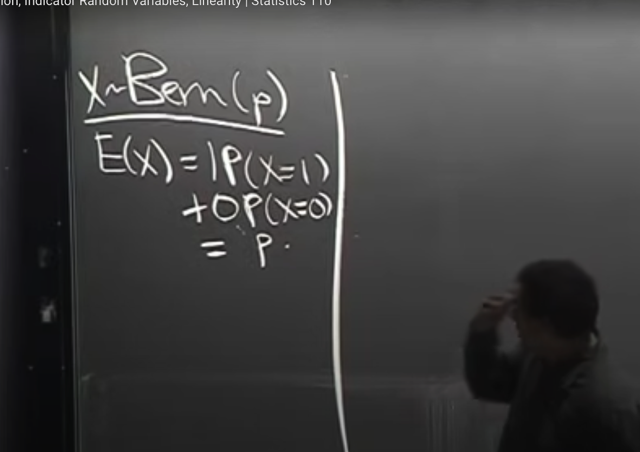</kbd></p>

> [!NOTE]
> Ví dụ đầu tiên ta **xem xét average** của **Bernoulli** random variable X~ **Bern(p)**:
>
> Như đã biết X~Bern(p) thì X chỉ có 1 trong 2 possible value là **x=1** với **P(X=1)** `=` p
> và **x=0** với **P(X=0) `=` 1-p** 
>
> Nên `E(X)` `=` `1*P(X=1)` `+` `0*P(X=0)` `=` 1*p `+` `0*(1-p)` `=` **p**
>
> Rất đơn giản

> [!NOTE]
> X ~ Bern(p) thì `E(X)` `=` p

<br>

<a id="node-242"></a>

<p align="center"><kbd>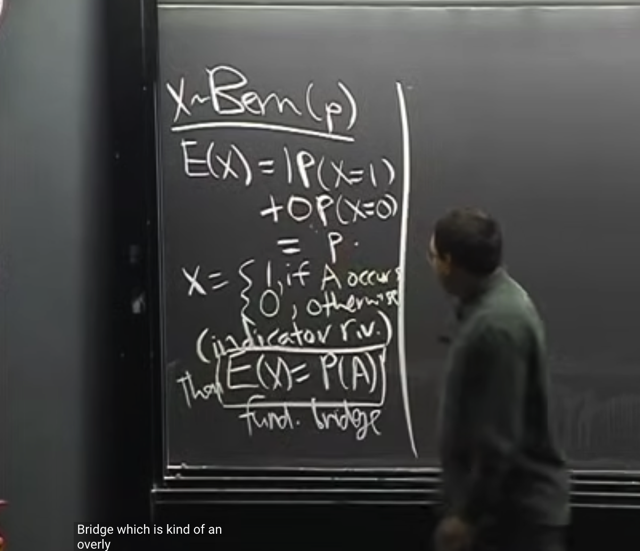</kbd></p>

> [!NOTE]
> Tuy nhiên gs cho rằng **có ý nghĩa sâu sắc và quan trọng** **tiềm ẩn** đằng
> sau.
>
> Ông lấy ví dụ gỉa sử **có một event A**, ta gọi **X `=` 1 khi A xảy ra** và **X `=` 0
> khi A không xảy ra**.
>
> Thì random variable X được gọi là một **INDICATOR** **RANDOM VARIABLE**.
>
> Và đương nhiên nó **vẫn là một Bernoulli random variable** (vì chỉ mang hai giá
> trị khả dĩ là 1, 0) với **xác suất success** gắn với xác suất A xảy ra **p `=` P(A)**
>
> Khi đó ta có **E(X) `=` p (**vì vừa mới chứng minh average của Bern(p) là bằng p)
> và p lúc này chính là xác suất A xảy ra P(A): **p `=` P(A)**Từ đó **E(X) `=` P(A) đây là FUNDAMENTAL BRIDGE `-` một cái rất quan trọng 
> và hữu dụng sau này**

> [!NOTE]
> FUNDAMENTAL BRIDGE

<br>

<a id="node-243"></a>

<p align="center"><kbd>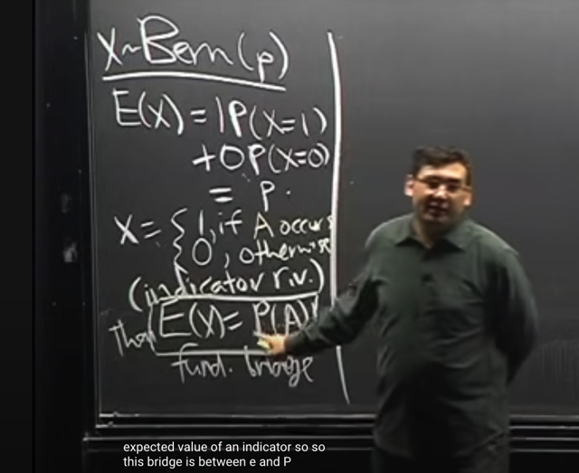</kbd></p>

> [!NOTE]
> Và ông cho rằng cái này rất quan trọng và gọi nó là **FUNDAMENTAL BRIDGE**: ý
> nghĩa là, nó giúp **nối kết** giữa **XÁC SUẤT CỦA MỘT EVENT** với
> **EXPECTED VALUE CỦA MỘT INDICATOR RANDOM VARIABLE**

> [!NOTE]
> FUNDAMENTAL BRIDGE `E(X)` `=` P(A)

<br>

<a id="node-244"></a>

<p align="center"><kbd>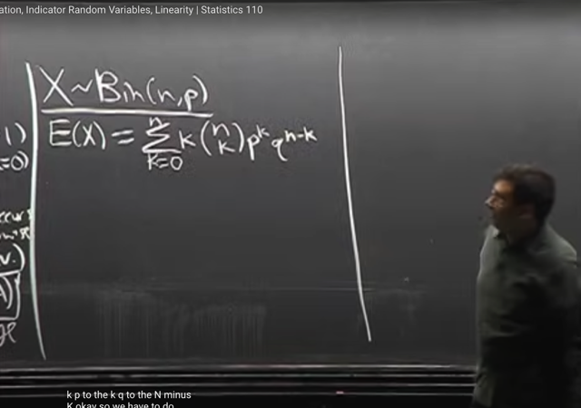</kbd></p>

> [!NOTE]
> Tiếp ta làm qua **Binomial** random variable **X~Bin(n, p)**
>
> Tương tự `E(X)` sẽ là **weight average** của **các possible value của X** với
> **weight** là xác  suất của  việc (event) X `=` possible value đó.
>
> Với Bin(n,p) r.v ta nhớ nó (random variable) **có ý nghĩa** là **SỐ LẦN
> SUCCESS** khi thực hiện **n i.i.d Bern(p) trials**(mỗi trial có kết quả tuân theo
> Bernoulli distribs p)
>
> Do đo các possible value của X đương nhiên là**0,1,....n**
>
> (Nhớ thêm một cái nữa là với Binomial, thì ta sampling with replacement, tức là
> ví dụ rút lá bài từ bộ bài, xem nó có phải là lá xì (success) không, xong bỏ vào
> lại,  còn nếu ta quan tâm số lần success cùng bối cảnh trên nhưng thực hiện
> theo cách sampling **without** replacement `-` lấy xong KHÔNG bỏ vào lại) thì
> khi đó ta có HyperGeometric distribution, sẽ học cái này sau)
>
> Và xác suất xảy ra của mỗi possible value, tức event `X=k,` sẽ là **P(X=k)  `=` (n
> choose k)*p^k*q^(n-k)**
>
> (Review nhanh: `X=k` có nghĩa là trong chuỗi n Bern(p) trials có k success, n `-` k
> failures. Các trials này đều độc lập nên xác suất của chuỗi này sẽ là `p^k(1-p)^n-k`
> Và có (n choose k) chuỗi như vậy tương ứng với (n choose k) cách chọn vị trí các
> ```text
> success không quan tâm thứ tự. Do đó P(X=k) = P(∪k (n choose k) p^k(1-p)^n-k),
> ```
> các chuỗi này disjoint ⇨ ... `=` **Σk (n choose k) p^k(1-p)^n-k)**
>
> Do đó `E(X)` `=` **∑ `k=0,1..n` [ k * (n choose k)*p^k*q^(n-k)]**

> [!NOTE]
> CHỨNG MINH `E(X)` CỦA BIN(n, p)
> `=` np THEO THỦ CÔNG

<br>

<a id="node-245"></a>

<p align="center"><kbd>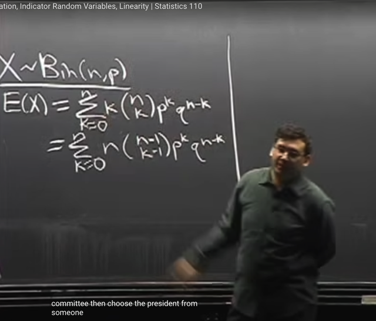</kbd></p>

🔗 **Related:** [LEC 2: STORY PROOFS, AXIOMS OF PROBABILITY](untitled.md#node-37)

> [!NOTE]
> Thế thì, nếu như không có k, để chỉ là **∑ `k=0..n` (n choose k)*p^k*q^(n-k)** 
> thì như đã biết nó sẽ là**(p+q)^k** theo **Binomial Theorem** và ra bằng 1^k `=` 1
>
> Tuy nhiên có k thì ta phải tìm cách tính.
>
> Thế thì bài trước ta đã có cái công thức này: 
>
> **k*(n choose k) `=` `n*(n-1` choose k-1)**, 
>
> xuất phát từ bài toán chọn group k người và chọn một người trong đó làm president
>
> Thì ta có hai cách tính: 
>
> Cách 1: Chọn group trước (có n choose k cách chọn) và chọn
> một trong đó làm president: có k cách chọn. `=>` Có k*(n choose k) cách chọn.
>
> Cách 2: Chọn president trước (có n cách chọn), sau đó tạo group có `k-1`
> ```text
> người cho president: (có n-1 choose k-1) cách chọn => Có n*(n-1 choose k-1)
> ```
>
> Vậy **k*(n choose k) `=` `n*(n-1` choose k-1)**

<br>

<a id="node-246"></a>

<p align="center"><kbd>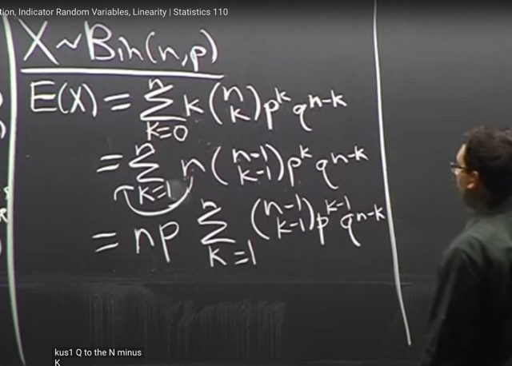</kbd></p>

> [!NOTE]
> Vậy dùng identity vừa rồi để thay k*(n choose k) bằng `n*(n-1` choose `k-1)`
>
> Và đ**ưa n ra ngoài** vì nó không dính tới k.
>
> Và cũng **đưa bớt một p ra ngoài** để ở trong còn `p^(k-1)` cho match với
> `(n-1` choose `k-1)`
>
> Ngoài ra gs cho rằng ta có thể thay vì cho k `=` 0,1..n thì có thể cho k `=` 1,2,..
> ...n vì dù sao **vói k `=` 0 thì term đầu tiên trong tổng các k*(n choose k)...
> cũng bằng 0**

<br>

<a id="node-247"></a>

<p align="center"><kbd>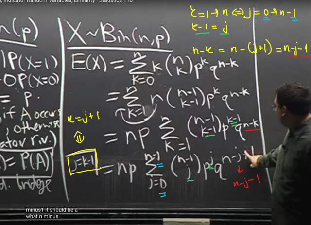</kbd></p>

> [!NOTE]
> ```text
> Tới đây đặt j = k - 1 thì np∑k=1:n (n-1 choose k-1)*p^k-1*q^n-k sẽ bằng
> ```
>
> ```text
> np∑j=0:n-j (n-1 choose j)*p^j*q^(n-j-1)
> ```

<br>

<a id="node-248"></a>

<p align="center"><kbd>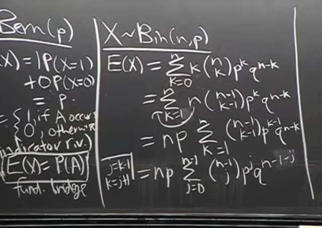</kbd></p>

> [!NOTE]
> Khi đó ta có dạng Binomial theorem để nguyên cục sau np là
> ```text
> (p+q)^(n-1) = 1^(n-1) = 1
> ```
>
> Để kết quả là với X~Bin(n, p) thì **E(X) =** **np**

> [!NOTE]
> X ~ Bin(n, p) thì `E(X)` `=` np

<br>

<a id="node-249"></a>

<p align="center"><kbd>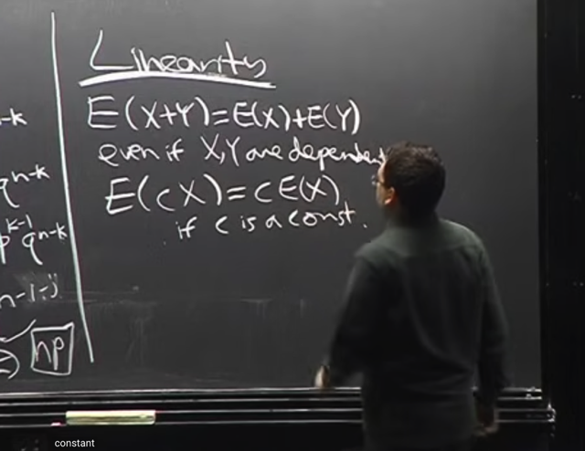</kbd></p>

> [!NOTE]
> Tiếp, gs cho biết một trong những tính chất hữu ích nhất khi làm việc với 
> average đó là tính chất **LINEARITY**.
>
> Nó cho phép**i) `E(X+Y)` `=` `E(X)` `+` E(Y)** cho **dù X và Y có dependent nhau**Ta sẽ chứng minh sau còn bây giờ cứ xài trước
>
> ii) **E(c*X) `=` c*E(X)**

> [!NOTE]
> TÍNH LINEARITY CỦA AVERAGE

<br>

<a id="node-250"></a>

<p align="center"><kbd>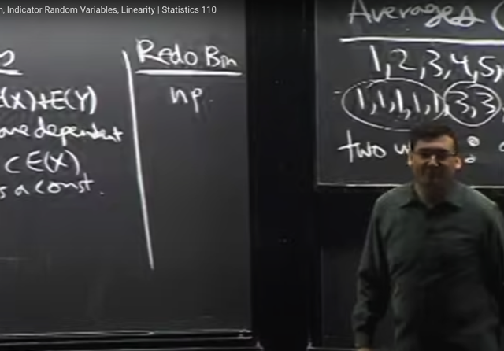</kbd></p>

🔗 **Related:** [TÓM TẮT:  - Tiếp tục Binomial distribution: 3 cách hiểu về rv ~ Bin(n, p)  - Định nghĩa về i.i.d  - CDF  - PMF cho Discrete random variables  - 2 tính chất để function là một valid PMF  - Binomial theorem  - Chứng minh X ~ Bin(n, p) và Y ~ Bin(m, p) thì (X+Y) ~ Bin(n+m, p)  Theo 3 cách  - Tìm PMF của X = số con xì khi sampling 5 lá từ bộ bài  - Khi sampling không hoàn lại thì X không phải là Binomial mà là HyperGeometric](tóm_tắt_tiếp_tục_binomial_distribution_3_cách_hiểu_về_rv_binn_p_định_nghĩa_về_iid_cdf_pmf_cho_discre.md#node-193)

🔗 **Related:** [TÓM TẮT:  Poisson distribution X ~Pois(λ)  PMF P(X=k) = e^-λ λ^k / k! k = 0,1,2....  - Chứng minh PMF valid: không âm và Σk P(X=k) = 1  - E(X) = λ  - Story của Poison: Số success trial khi có rất nhiều trial với xác suất success nhỏ  - Poison paradigm: Có nhiều event Ai, xác suất xảy ra mỗi event nhỏ π ⇨ Có thể approx số event xảy ra (success) bởi Pois distribution  - Poison paradigm cho phép các event có thể weak independent  E[#số event xảy ra] = λ = Σ π  - KHI n LỚN VÀ p NHỎ LẠI (ĐỂ GẦN TRỞ VỀ POISSON PARADIGM) thì BINOMIAL (n, p) SẼ CONVERGE VỀ POISSON  Chứng minh khi n LỚN ĐẾN VÔ CÙNG và p NGÀY CÀNG NHỎ thì BINOMIAL sẽ CONVERGE về POISSON.  - Trở lại Bài toán Birthday tính xác suất có ít nhất 1 bộ 3 người trùng ngày sinh: Vì số bộ 3 người là lớn, và xác suất 1 bộ 3 người trùng ngày sinh xảy ra là nhỏ, nên số bộ 3 trùng ngày sinh có thể approx bởi poison r.v Từ đó ta tính E(X) để có λ. Và từ đó tính P(có ít nhất 1 bộ trùng ngày sinh) =  P(X!=0) = 1 - P(X=0)](tóm_tắt_poisson_distribution_x_poisλ_pmf_pxk_e_λ_λk_k_k_012_chứng_minh_pmf_valid_không_âm_và_σk_pxk_.md#node-322)

> [!NOTE]
> **Dựa vào tính chất Linearity** này ta có thể redo việc **tính `E(X)` của
> X~Bin(n,p)** như sau:
>
> Theo định nghĩa, đúng hơn là theo cách hiểu thứ hai về Binomial (n,p) 
> (theo link đễ xem lại)
>
> X là **tổng của n indicator random variable Bern(p)**:
>
> **X `=` X1 `+` X2 `+` ...Xj `+` ...Xn** 
>
> ```text
> với Xj có hai possible value là 1 hoặc 0 với xác suất P(Xj=1) = p và P(Xj=0) = 1-p
> ```
>
> Nên theo tính chất linearity **E(X) `=` `E(X1)` `+` `E(X2)` ....E(Xn)**
>
> Và vừa rồi ta cũng biết với **X_j ~ Bern(p)  thì `E(X_j)` `=` p**. 
>
> Nên `E(X)` `=` `p+p+..p` `=` **n*p**

> [!NOTE]
> TÍNH LẠI EX CỦA BIN(n,p) DÙNG STORY, LINEARITY, FUNDAMENTAL BRIDGE

<br>

<a id="node-251"></a>

<p align="center"><kbd>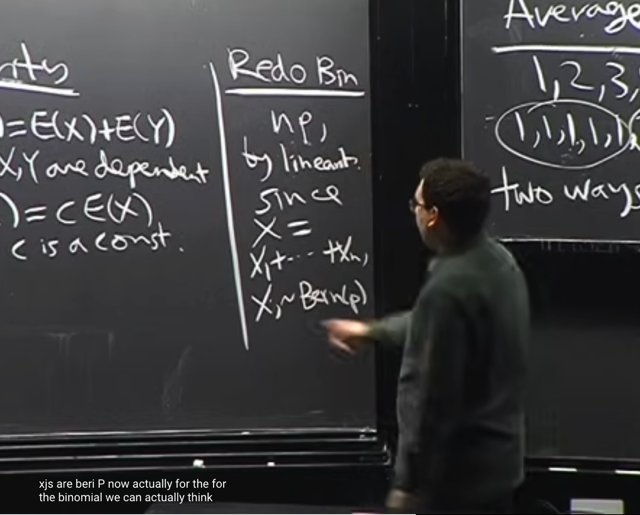</kbd></p>

> [!NOTE]
> Cách tiếp cận này giúp ta đi
> đến kết quả rất nhanh.

<br>

<a id="node-252"></a>

<p align="center"><kbd>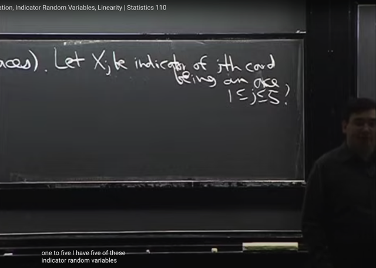</kbd></p>

> [!NOTE]
> Ta sẽ quay lại ví dụ **Hypergeometric** distribution: 
>
> **Chọn 5 lá bài**, thì **số lá xì** trong 5 lá (lấy lá bài ra thì không bỏ vô lại tức
> Sampling **without** replacement) sẽ tuân theo Hypergeometric distribution
> (Như nãy đã nói nếu Sampling with replacement thì là Binomial)
>
> Ở đây ta cần tính `E(X)`
>
> Thế thì gs nói đại khái là vốn dĩ trong ví dụ này ta **không care thứ tự** khi
> **chỉ quan tâm số lá Xì** trong 5 lá. Tuy nhiên **để cho dễ** khi tính `E(x)` ta vẫn 
> c**ho rằng ta lần lượt rút 5 lá** và **gọi Xj là indicator random variable** mang 
> **giá trị 1 nếu lá thứ j là xì** và mang giá trị **0 nếu lá thứ j không phải xì**.

> [!NOTE]
> `E(X)` CỦA HYPERGEOMETRIC

<br>

<a id="node-253"></a>

<p align="center"><kbd>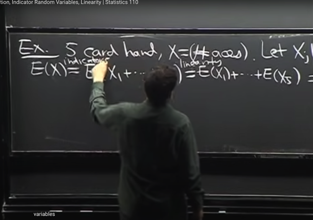</kbd></p>

> [!NOTE]
> Thế thì từ đó, X có thể coi là **tổng của 5 indicator random variables**
> nên **E(X) `=` `E(X1` `+` X2 `+` ...X5)**
>
> Và theo **linearity**, nó bằng `E(X1)` `+` `E(X2)` `+` `....E(X5)`

<br>

<a id="node-254"></a>

<p align="center"><kbd>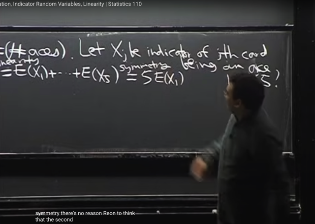</kbd></p>

🔗 **Related:** [-TÓM TẮT:   Z^(số lẻ), ta luôn có E(Z^(số lẻ) = 0, gọi là ODD MOMENT  - Symmetry còn giúp ta kết luận (nếu Z ~ N(0,1) thì -Z cũng là một N(0,1)  - X = μ + σZ sẽ ~ N(μ, σ^2)  - Sẽ tốt hơn nếu ta hiểu Standard Normal Z ~ N(0,1) trước, sau đó hiểu rằng khi scale và shift Z với σ và μ khác nhau thì ta sẽ có bất kì một Normal distribution N(μ, σ^2) nào  - PROPERTIES CỦA VAR(X):  + Var(X + c) = Var(X)  + Var(cX) = c^2*Var(X)  + Var(X) luôn không âm, và nó chỉ bằng 0 nếu X là constant  + Variance KHÔNG CÓ TÍNH LINEARITY:  + Var(X+Y) không bằng Var(X) + Var(Y) TRỪ KHI X, Y INDEPENDENT  X không i.i.d với chính nó X, mà nó EXTREMELY DEPENDENT với chính nó. Do đó bất cứ khi nào ta ÁP DỤNG CÔNG  THỨC NÀO ĐÓ MÀ CẦN CÁC RANDOM VARIABLE CÓ X1, X2 CÓ  TÍNH I.I.D VÀO X VÀ CHÍNH NÓ THÌ ĐỀU LÀ SAI  - CHỨNG MINH VAR X N(μ, σ) = σ^2  - Z = (X - μ) / σ và gs cho biết nó được gọi là STANDARDIZATION (chuẩn hóa)  Giúp từ NORMAL X ~ N(μ, σ) ta có STANDARD NORMAL Z ~ N(0,1)  - Xây dựng PDF của N(μ, σ^2) từ N(0, 1):  fX(x) = 1/(σ√2π) * [e^(-((x-μ)/σ)^2/2)]  - Nếu X ~ N(μ, σ^2) thì -X ~ N(-μ, σ^2  - Nếu X1 ~ N(μ1, σ1^2), X2 ~ N(μ2, σ2^2) và X1, X2 independent thì:  X1 + X2 ~ N(μ1 + μ2, σ1^2 + σ2^2)  X1 - X2 ~ N(μ1 - μ2, σ1^2 + σ2^2)  - 68-95-99.7 rule  - Chứng minh 0^k / k! + 1^k / k! + 2^k / k! + .... = e^k  ⇨ Tổng k=0,1...infinity λ^k/k! = e^λ  - Tìm variance của Poisson (λ) để chứng minh nó có MEAN VÀ VARIANCE ĐỀU LÀ λ  - Khi standardize, ví dụ đơn vị là km, thì (x - μ) / σ sẽ  (km - km) / km = km / km = 1 TỨC Ý NÓI LÀ KHÔNG CÒN CARE ĐƠN VỊ LÀ GÌ NỮA  - X~Bin(n,p), Var(X) = npq (q = 1-p)  - Chứng minh LOTIS](_tóm_tắt_zsố_lẻ_ta_luôn_có_ezsố_lẻ_0_gọi_là_odd_moment_symmetry_còn_giúp_ta_kết_luận_nếu_z_n01_thì_z.md#node-452)

🔗 **Related:** [LEC 21: COVARIANCE & CORRELATION](untitled.md#node-710)

> [!NOTE]
> Thế thì tại đây, nếu mà là trong bối cảnh Binomial, tức các indicator random
> variable đều identical independent, ta sẽ có các `E(Xj)` đều bằng p vì các
> indicator random variable trong Binomial đều tuân theo Bern(p) tức là có xác
> suất success là p.
>
> Khi đó ta sẽ có kết quả `E(X)` là n*p như hồi nãy vừa tính `E(X)`
>
> Còn ở đây, gs cho biết rằng tuy ta **chưa biết mỗi indicator random variable
> có average value là bao nhiêu**, nhưng ta thấy chúng **CÓ TÍNH ĐỐI XỨNG
> SYMMETRY**.
>
> Có nghĩa là tuy mỗi lần rút bài theo cách không hoàn lại, xác suất có lá ace sẽ 
> khác nhau nhưng vì tính đối xứng nên **cho phép ta có expected value của 
> chúng đều bằng nhau.**
>
> Và từ đó `E(X1)` `=` `E(X2)` `=` ... `E(X5)` `=>` **E(X) `=` 5E(X1)**Và rồi để tính `E(X1)` ta dùng**fundamental bridge** hỗi nãy:
>
> `E(X)` `=` P(A)... (mang ý nghĩa là expected value của indicator random
> variable (gắn với một event A, để A xảy ra thì X `=` 1, ngược lại thì X `=` 0) sẽ
> bằng xác suất của sự kiện A xảy ra)
>
> ...để connect **expected value của indicator random variable** X với **xác suất
> event A** là [lá 1 là ace] xảy ra. Và P([lá 1 là ace]) có thể dễ dàng tính dựa
> trên **naive definition** `=` `4/52` `=` `1/13`
>
> `====`
>
> Sau khi thảo luận với ChatGPT, nó khẳng định cách hiểu như sau là đúng:
> Đó là tuy ta đang trong bài toán mà **X không phải là Binomial** random
> variable vì ở mỗi trial, **xác suất success khác nhau**. Nhưng **đó (xác suất
> đó) là conditional probability** (tức là P[lá 2 là xì|lá 1] sẽ khác P[lá 1 là xì], rồi
> P[lá 3 là xì| lá 1, lá 2] sẽ khác P[lá 2 là xì|lá 1]), và nó **không bắt buộc
> unconditional probability (tức xác suất một lá bài là Xì) phải khác nhau**.
>
> Do đó khi ta sử dụng tính đối xứng để có các `E(Xj)` đều bằng nhau, và sau
> đó sử dùng fundamental bridge để connect `/` chuyển đổi `E(Xj)` thành P(Aj) thì
> ta (nhờ cách làm dùng **linearity**, **symmetry**, **fundamental** **bridge**)
> để simplify vấn đề để có thể dùng unconditional probability)

<br>

<a id="node-255"></a>

<p align="center"><kbd>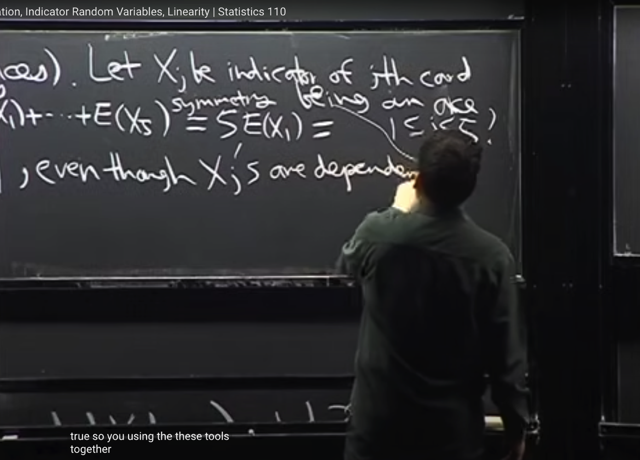</kbd></p>

> [!NOTE]
> Và ở đây gs chính là khẳng định lại ý của mình trong note vừa rồi  khi cho
> rằng các công cụ **SYMMETRY**, tính **LINEARITY** của expected value,
> và **FUNDAMENTAL** **BRIDE** rất powerful giúp ta trong những bài toán
> mà các trial không independent identical.

<br>

<a id="node-256"></a>

<p align="center"><kbd>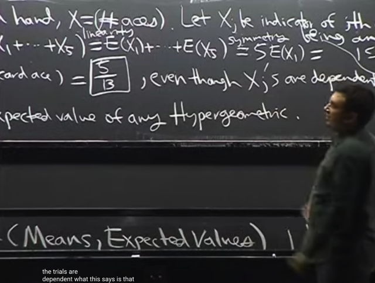</kbd></p>

> [!NOTE]
> và như đã thấy nó giúp ta tính expected value của bất kì
> Hypergeometric nào dù các event không i.i.d

<br>

<a id="node-257"></a>

<p align="center"><kbd>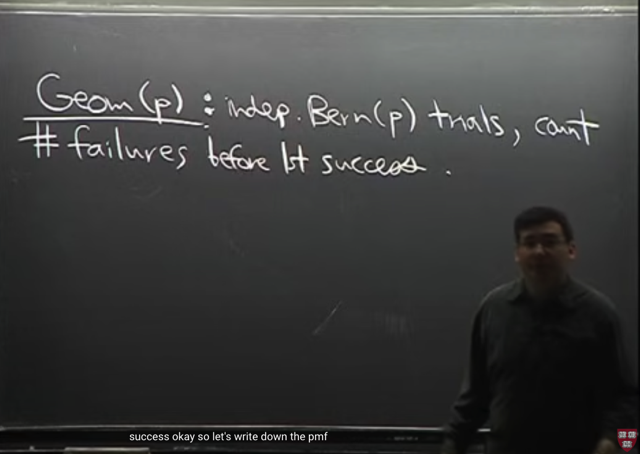</kbd></p>

🔗 **Related:** [-TÓM TẮT:   Bài toán Toy Collector:  Tìm expected value của số lần đi ăn để có đủ n loại  - EX = n(1 + 1/2 + 1/3 + ...1/n) ≈ ln(n) + γ  - CHỨNG MINH PART 2 CỦA UNIVERSALITY  - Cho X, Y, Z là các i.i.d positive random variable. Bài toán là tìm E(X / (X + Y + Z)). Nhờ symmetry tính ra rất dễ = 1/3  - Gặp lại LOTUS - Law of The Unconscious Statistician với bài toán cho X = U^2 với U~Unif(0,1), Y = e^x tìm E(Y), câu hỏi yêu cầu đáp án ở dạng  tích phân  - Để tìm PDF ta sẽ tìm CDF trước, lấy derivative của CDF là có PDF.  Và để tìm CDF ta sẽ dùng định nghĩa của nó để mà xây dựng lên  - X ~ Binomial (n, p), cần tìm distribution của n-X: n-X là một Bin(n, q) theo 2 cách  -Xây dụng PDF của Exp(λ): T (Thời gian chờ đến khi có email đầu tiên) là một Expo(λ) r.v: f(t) = (1-e^(-λ*t))' =  λ*e^(-λt)](_tóm_tắt_bài_toán_toy_collector_tìm_expected_value_của_số_lần_đi_ăn_để_có_đủ_n_loại_ex_n1_12_13_1n_l.md#node-464)

> [!NOTE]
> Phần cuối ta sẽ b**iết thêm một distribution nổi tiếng** là **Geometric (p)**.
>
> Bài toán là thực hiện **n** i.i.d Bern(p) trial. Nhưng khác với Binomial khi ta
> quan tâm số trial success trong n trial.
>
> Ở đây, ta quan tâm **SỐ TRIAL FAIL TRƯỚC KHI SUCCESS LẦN ĐẦU
> TIÊN**
>
> Như thường lệ ta cũng sẽ thử tính `/` xây dựng công thức **PMF** tức là
> function quy định **P(X=k)** với k khác nhau và **E(X)**.
>
> Gs lưu ý ta rằng cái này nó **còn khác với Binomial ở chỗ** trong Bin(n,p) **n là
> số lần trials, CỐ ĐỊNH CHO TRƯỚC**. Còn ở đây **CỨ TIẾP TỤC CHO ĐẾN
> KHI TRIAL SUCCESS  LẦN ĐẦU NÊN TA THẤY KHÔNG CÓ PARAM n**

> [!NOTE]
> GEOMETRIC DISTRIBUTION

<br>

<a id="node-258"></a>

<p align="center"><kbd>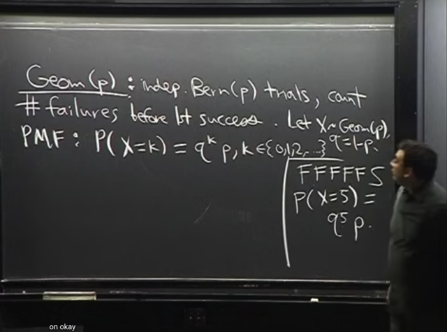</kbd></p>

> [!NOTE]
> Thế thì PMF lập luận như sau:
>
> Gs lấy ví dụ ta có**5 fail trước khi có success** đầu tiên: [F,F,F,F,F,S]
>
> thì khi đó `P(X=5)` với ý nghĩa là **xác suất của [số lần fail trước khi 1st success 
> là 5]** **CHÍNH LÀ XÁC SUẤT XẢY RA CỦA CHUỖI NÀY [F,F,F,F,F,S]**
>
> Vì sao nói vậy, là vì **event** [**số lần fail trước khi 1st success là 5**] thực ra,
> diễn dịch ra  **chính là** event **[F,F,F,F,F,S]**, bởi vì **đâu còn chuỗi nào khác
> mà đồng  nghĩa với "số lần fail trước khi 1st success là 5"**
>
> Nói ngắn gọn:
>
> event `(X=5)` `=` event [số lần fail trước khi 1st success là 5] `=` event [F,F,F,F,F,S]
>
> Vậy **P(X=5) `=` P([F,F,F,F,F,S])**
>
> và với 6 INDEPENDENT EVENTS, sử dụng**ĐỊNH NGHĨA CỦA
> INDEPENDENT EVENTS** ta sẽ có:
>
> P([F,F,F,F,F,S]) `=` P(F)*P(F)*P(F)*P(F)*P(F)*P(S)
>
> Và **mỗi trial là theo Bern(p)** nên **P(F) `=` 1-p** `=` q, **P(S) `=` p**
>
> Vậy **P(X=k) `=` q^k*p**

> [!NOTE]
> GEOMETRIC Geom(p) PMF: `P(X=k)` `=` q^k*p

<br>

<a id="node-259"></a>

<p align="center"><kbd>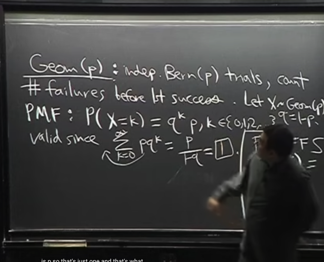</kbd></p>

🔗 **Related:** [TÓM TẮT:  - Tính MGF M(t) của Expo(1) = 1/(1-t) t < 1  - Khi đã có MGF, như bài trước ta đã biết các lí do mà MGF quan trọng trong đó có reason #1 đó là ta chỉ cần tính đạo hàm cấp n của nó sẽ cho ta n'th moment.  - Dù ta có thể tính đạo hàm nhiều lần để có 1st, 2nd moment nhưng có cách hay hơn. Bằng cách nhận ra 1/(1-t) liên quan đến Geometric series  a + ar + ar^2 = Tổng k=0:infinity a*r^k với |r| < 1 sẽ converge về a/[1-r]  Nên 1/1-t chính là Tổng n=0:infinity t^n với |t| < 1  Thế thì theo gs, từ đây cho phép ta KHỎI CẦN TÍNH ĐẠO HÀM CẤP N ĐỂ CÓ MOMENT THỨ N LÀM GÌ CHO MỆT, mà chỉ cần ĐỌC NÓ RA THÔI  Cụ thể là ta đã biết ở bài trước rằng, n'th moment = đạo hàm cấp n của M(t) (là coefficient của (t^n / n!) khi expand M(t) theo Taylor series tại 0)  Do đó, bằng cách tạo ra (t^n / n!) thì BẤT CỨ CÁI GÌ GẮN VỚI NÓ CHÍNH LÀ COEFFICIENT, VÀ CHÍNH LÀ N'TH MOMENT  Do đó ta sẽ nhân thêm n! và chia n! để có (t^n / n!). Như vậy cái lòi ra làm coefficient của t^n/n! ở đây là n! CHÍNH LÀ N'TH MOMENT.  Từ đó cho phép ta ĐỌC LUÔN RẰNG: 1ST MOMENT (EX) LÀ 1!, 2ND MOMENT E(X^2) LÀ 2!  N'TH MOMENT CỦA EXPO(1) E(X^n) = n!  -  đây là tính chất RẤT MẠNH CỦA MGF. Vì ví dụ như khi tính n'th moment (E[X^n]) thì nếu dùng LOTUS, ta phải TÍNH TÍCH PHÂN (INTEGRAL) VÀ CÓ THỂ GẶP NHỮNG TÍCH PHÂN RẤT PHỨC TẠP.  Trong khi đó, nếu ta có MGF, để có nth moment, ta CHỈ CẦN TÍNH DERIVATIVE MÀ DERIVATIVE THÌ THƯỜNG DỄ HƠN LÀ TÍNH TÍCH PHÂN  -Từ n'th moment của Expo(1) ta dễ dàng có n'th moment của Y ~ Expo(λ): E[Y^n] = n! / λ^n  - N'TH MOMENT CỦA N(0,1) VỚI N LẺ ĐỀU BẰNG 0  - MGF CỦA POIS(λ) = e^[λ(e^t-1)]  - Nếu Y ~ Pois(µ) và X~Pois(λ) và biết X, Y INDEPENDENT thì X+Y ~ Pois(λ+µ)](tóm_tắt_tính_mgf_mt_của_expo1_11_t_t_1_khi_đã_có_mgf_như_bài_trước_ta_đã_biết_các_lí_do_mà_mgf_quan_.md#node-570)

> [!NOTE]
> Tiếp theo gs **check** xem công thức trên **có phải là valid PMF không.**
>
> Tính chất **không âm** thì dễ thấy ok rồi.
>
> Ta cần **check tổng q^k*p với mọi k có bằng 1 hay không**.
>
> **Tổng k [p*q^k]**= **p Tổng k: [q^k]**
>
> Và tổng của q^k với k `=` 1, 2....là **GEOMETRIC** SERIES. có giá trị bằng**1/(1-q)**
> ```text
> Nên kết quả là p/(1-q) = p/p = 1
> ```

> [!NOTE]
> Geometric series
> học trong 18.01

<br>

<a id="node-260"></a>

<p align="center"><kbd>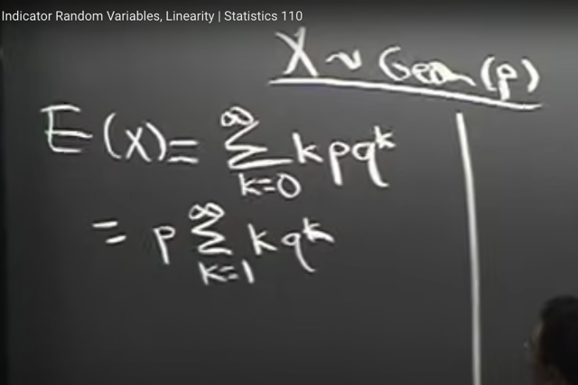</kbd></p>

🔗 **Related:** [TÓM TẮT:  Tiếp tục về CDF: Định nghĩa của CDF  Bước nhảy của CDFD là giá trị PMF tại đó  Tính chất của CDF: 1) Non decreasing, 2) right continuous và   3) F(x) -> 0 khi x -> -infinity, F(x) -> 1 khi x -> -infinity  - Định nghĩa Independent random variables theo independent event:  X, Y độc lập khi  + Continuous rv: P(X≤x, Y≤y) = P(X≤x) * P(Y≤y) với mọi x, y   + Discrete rv: P(X=x,Y=y) = P(X=x)*P(Y=y)  - Expected value: Là con số tóm tắt distribution của r.v  - Hai cách tính average  - E(X) = Σx x*P(X=x)  - X ~ Bern(p) thì E(X) = p  - FUNDAMENTAL BRIDGE: E(X) = P(A), X là indicator rv mang giá trị = 1 khi event A xảy ra và 0 khi ngược lại  - X ~ Bin(n, p):  E(X) = ∑ k=0,1..n [ k * (n choose k)*p^k*q^(n-k)] = ..= np  - TÍNH LINEARITY CỦA AVERAGE  - Tính lại E(X) của Bin(n, p) nhanh hơn bằng linearity, fundamental bridge và E(X) của Bern(p)  - TÍnh E(X) của Hypergeometric Dù các trial không độc lập nhưng dùng Symmetry, linearity, fundamental bridge vẫn tính được  - X ~ Geom(p): P(X=k) = q^k*p  - E(X) = p Σ k=0:infinity [k * q^k]](tóm_tắt_tiếp_tục_về_cdf_định_nghĩa_của_cdf_bước_nhảy_của_cdfd_là_giá_trị_pmf_tại_đó_tính_chất_của_cd.md#node-262)

> [!NOTE]
> Tiếp ta tính `E(X)` của X~ Geom(p):
>
> Theo định nghĩa đã biết `E(X)` là **weighted average** các giá trị p**ossible value k**
> của X (chính là các k) với **weight là xác suất P(X=k)**
>
> Nên ta có `E(X)` `=` **Tổng `k=0,1,..inf` [k * P(X=k)]** `=` **Tổng `k=0:infinity` [k * pq^k]**
>
> **Bỏ p ra ngoài** vì không dính k: `=` p `Σk=0:infinity` [k * q^k]
>
> Tiếp xem phần note theo

<br>

<a id="node-261"></a>

<p align="center"><kbd>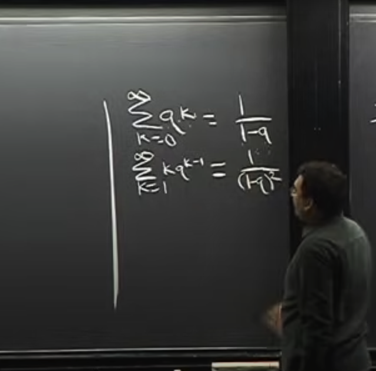</kbd></p>

> [!NOTE]
> Đại khái là, nếu ta không có k thì **∑k=0,1,...inf k*q^k** là **Geometric**
> **series** như vừa rồi
>
> Nhưng **vì ta có k** cho nên gs cho rằng**đầu tiên ta cứ viết theo kiểu như ta
> không có k**, để có geometric series `=` `1/(1-q)`
>
> **∑k=0,1,...inf q^k `=` 1/(1-q)**
>
> Sau đó ta sẽ **tìm cách để có k**, thì dễ thấy nếu **LẤY ĐẠO HÀM (TAKE
> DERIVATIVE) HAI VẾ** ta **sẽ có k ở bên trái**, vì derivative của q^k `=` `k*q^(k-1).`
>
> ```text
> ∑k=0,1,...inf q^k = 1/(1-q)
> ```
>
> Đạo hàm hai vế theo q:
>
> `d/dq` vế trái `=` `d/dq` `[∑k=0,1,...inf` q^k] `=` `Σ` `d/dq` q^k `=` **Σ kq^(k-1)**d/dq vế phải `=` `d/dq` `1/(1-q)` `=` `[d/d(1-q)` `(1/1-q)]` . `[d/dq` `(1-q)]` `=` `-1/(1-q)^2` . `-1` 
>
> `=` **1/(1-q)^2**
>
> **∑k=0,1,...inf `k*q^(k-1)` `=` 1/(1-q)^2**
>
> (sau khi lấy derivative hai vế ông cho rằng có thể cho k từ 1 vì với k `=` 0 thì
> hạng tử trong tổng cũng bằng 0 thôi, nhưng để k từ 0 cũng không sao)

<br>

<a id="node-262"></a>

<p align="center"><kbd>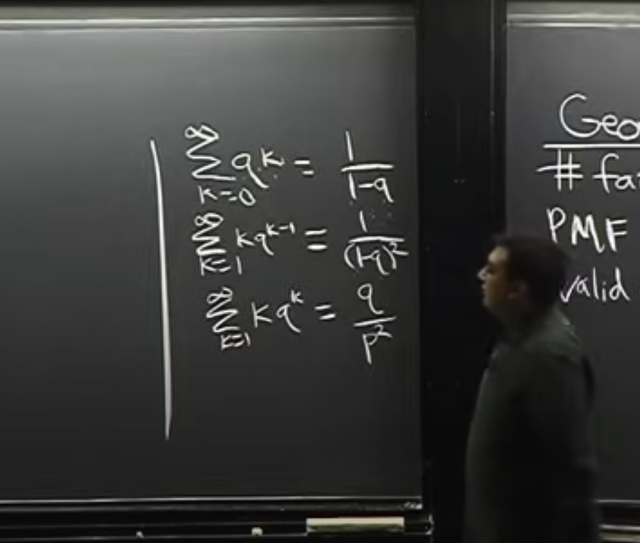</kbd></p>

🔗 **Related:** [TÓM TẮT:  Tiếp tục về CDF: Định nghĩa của CDF  Bước nhảy của CDFD là giá trị PMF tại đó  Tính chất của CDF: 1) Non decreasing, 2) right continuous và   3) F(x) -> 0 khi x -> -infinity, F(x) -> 1 khi x -> -infinity  - Định nghĩa Independent random variables theo independent event:  X, Y độc lập khi  + Continuous rv: P(X≤x, Y≤y) = P(X≤x) * P(Y≤y) với mọi x, y   + Discrete rv: P(X=x,Y=y) = P(X=x)*P(Y=y)  - Expected value: Là con số tóm tắt distribution của r.v  - Hai cách tính average  - E(X) = Σx x*P(X=x)  - X ~ Bern(p) thì E(X) = p  - FUNDAMENTAL BRIDGE: E(X) = P(A), X là indicator rv mang giá trị = 1 khi event A xảy ra và 0 khi ngược lại  - X ~ Bin(n, p):  E(X) = ∑ k=0,1..n [ k * (n choose k)*p^k*q^(n-k)] = ..= np  - TÍNH LINEARITY CỦA AVERAGE  - Tính lại E(X) của Bin(n, p) nhanh hơn bằng linearity, fundamental bridge và E(X) của Bern(p)  - TÍnh E(X) của Hypergeometric Dù các trial không độc lập nhưng dùng Symmetry, linearity, fundamental bridge vẫn tính được  - X ~ Geom(p): P(X=k) = q^k*p  - E(X) = p Σ k=0:infinity [k * q^k]](tóm_tắt_tiếp_tục_về_cdf_định_nghĩa_của_cdf_bước_nhảy_của_cdfd_là_giá_trị_pmf_tại_đó_tính_chất_của_cd.md#node-260)

🔗 **Related:** [TÓM TẮT:  - Chứng minh tính linearity của expectation  - Negative binomial: Số failure cho đến khi có r success  (Mở rộng của Geomegtric (số failure cho đến khi có success đầu)   - P(X=n) = (n+r-1 choose n) * p^r * q^n  - E(X) = rq/p  - Cần để ý xem quy ước là start at 0 hay 1 đối với Negative Binomial  - Bài toán Putnam tính expect value của X = số chữ số là local maxima  trong n chữ số  - St. Peterburg Paradox](tóm_tắt_chứng_minh_tính_linearity_của_expectation_negative_binomial_số_failure_cho_đến_khi_có_r_succ.md#node-283)

> [!NOTE]
> Và để có lại Tổng k `=0:inf` pq^k ta sẽ nhân 2 vế cho q khi đó ta có bên phải là
> ```text
> q/(1-q)^2 = q/p^2
> ```
>
> `∑k=0,1,...inf` k*q^k `=` `q/(1-q)^2` **= `q/p^2` 
>
> Kết quả là (nhớ là còn một cái p ta để ra ngoài tổng hồi nãy) `pq/p^2` `=` q/p**

> [!NOTE]
> GEOMETRIC `E(X)` `=` `q/p`

<br>

<a id="node-263"></a>

<p align="center"><kbd>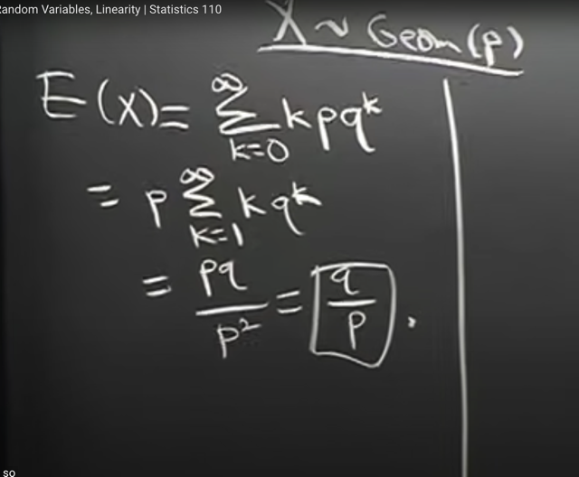</kbd></p>

🔗 **Related:** [-TÓM TẮT:   Bài toán Toy Collector:  Tìm expected value của số lần đi ăn để có đủ n loại  - EX = n(1 + 1/2 + 1/3 + ...1/n) ≈ ln(n) + γ  - CHỨNG MINH PART 2 CỦA UNIVERSALITY  - Cho X, Y, Z là các i.i.d positive random variable. Bài toán là tìm E(X / (X + Y + Z)). Nhờ symmetry tính ra rất dễ = 1/3  - Gặp lại LOTUS - Law of The Unconscious Statistician với bài toán cho X = U^2 với U~Unif(0,1), Y = e^x tìm E(Y), câu hỏi yêu cầu đáp án ở dạng  tích phân  - Để tìm PDF ta sẽ tìm CDF trước, lấy derivative của CDF là có PDF.  Và để tìm CDF ta sẽ dùng định nghĩa của nó để mà xây dựng lên  - X ~ Binomial (n, p), cần tìm distribution của n-X: n-X là một Bin(n, q) theo 2 cách  -Xây dụng PDF của Exp(λ): T (Thời gian chờ đến khi có email đầu tiên) là một Expo(λ) r.v: f(t) = (1-e^(-λ*t))' =  λ*e^(-λt)](_tóm_tắt_bài_toán_toy_collector_tìm_expected_value_của_số_lần_đi_ăn_để_có_đủ_n_loại_ex_n1_12_13_1n_l.md#node-467)

> [!NOTE]
> Kết quả ta có vầy `q/p`

<br>

<a id="node-264"></a>

<p align="center"><kbd>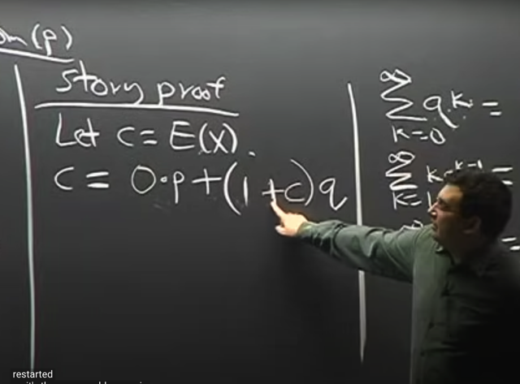</kbd></p>

> [!NOTE]
> Cách giải khác ngắn hơn theo Story proof, Đại khái là gọi c là `E(X)` thì:
>
> ```text
> c = 0*p + (1+c)*q từ đó giải ra c = q/p
> ```
>
> Gọi c là số lần cho đến khi trial success. Thì event
>
> [c lần trial cho đến khi success] `=` [lần đầu success luôn] U [lần đầu fail, và
> success sau c lần (bởi đã nói, có c lần trial cho đến khi success)] 
>
> chưa hiểu
>
> Là vầy: X ~ Geom(p) có story là số trial Bern(p) fail cho đến khi có success.
>
> Và `E(X)` không gì khác là weight average các possible value của X, với 
> weight là xác suất nó mang possible values đó.
>
> Vậy thì có vô số possible value vì theo theo lí thì chuỗi fail có thể vô tận.
> Nhưng trong đó nhất định có một possible value là x `=` 0, điều này tương
> ứng với việc ngay lần trial đầu tiên đã success, nên không có lần nào fail 
> và như vậy với possible value x `=` 0 này thì trọng số của nó là P(success)
> `=` p. Ta có 0*p là vậy.
>
> Còn lại, những lần khác sẽ đều quy lại là (1 `+` EX) với trong số là q...???

> [!NOTE]
> Chưa hiểu

<br>

