# C1w1_introduction To N.n

📊 **Progress:** `4` Notes | `24` Screenshots

---

## What's A Neural Network

 

### The term "Deep Learning" refers to training Neural Networks, sometimes very

> [!NOTE]
> The term "Deep Learning" refers to training Neural Networks, sometimes very
> large Neural Networks.
>
> A Neural Network is a function that can be used to predict outcomes based on
> inputs, often implemented using neurons.
>
> Neurons are individual units in a Neural Network that receive input and generate
> output based on a set of weights and biases.
>
> A simple example of a Neural Network is using linear regression to predict
> housing prices based on house size.
>
> In the example, the input (house size) goes through a single neuron that applies
> a linear function and a ReLU function to generate the predicted price.
>
> A larger Neural Network can be built by stacking multiple neurons together to
> handle more complex inputs and outputs.
>
> The process of training a Neural Network involves giving it input/output pairs and
> adjusting the weights and biases of the neurons to minimize prediction error.
>
> A more complex Neural Network can be used to predict housing prices based on
> multiple features such as number of bedrooms, zip code, and walkability.

 

<kbd>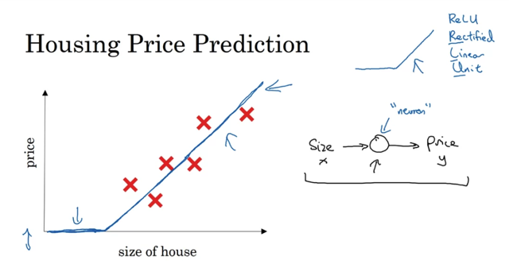</kbd>

 

<kbd>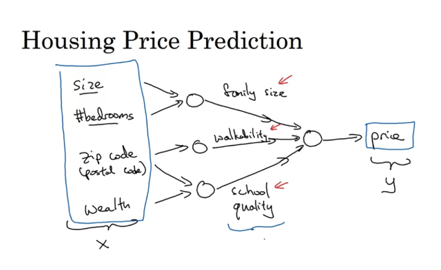</kbd>

 

<kbd>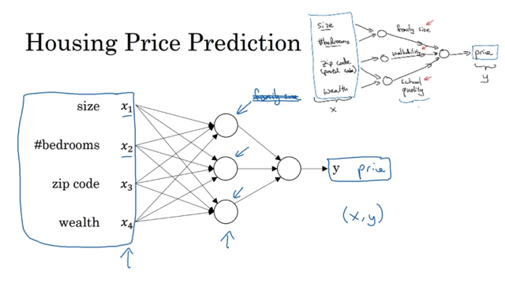</kbd>

 

## Supervised Learning With N.n

 

### 1 The majority of economic value created by neural networks has been through

> [!NOTE]
> 1 The majority of economic value created by neural networks has been through
> supervised learning.
>
> 2 Various applications of neural networks include online advertising, computer
> vision, speech recognition, machine translation, and autonomous driving.
>
> 3 Different types of neural networks are useful for different applications, such as
> convolutional neural networks (CNNs) for image applications and recurrent
> neural networks (RNNs) for sequence data.
>
> 4 Standard CNN and RNN architectures are used for image and
> one-dimensional sequence data, respectively.
>
> 5 Machine learning can be applied to structured data and unstructured data.
>
> 6 Structured data refers to databases of data, while unstructured data includes
> audio, images, and text.

> [!NOTE]
> 1 What is the main focus of the discussion?
> The main focus of the discussion is the various applications of neural networks, specifically the success of supervised learning in creating economic value.
>  2 What is supervised learning?
> Supervised learning is a type of machine learning in which the algorithm is trained on labeled data, with input/output pairs. The algorithm learns to predict the output given the input, and is optimized to minimize the error between predicted and actual output.
>  3 What are some examples of successful applications of neural networks?
> Neural networks have been applied effectively to online advertising, computer vision, speech recognition, machine translation, and autonomous driving, among other applications.
>  4 How are different types of neural networks used for different applications?
> Different types of neural networks are used for different applications based on the characteristics of the data being analyzed. For example, convolutional neural networks (CNNs) are used for image applications, while recurrent neural networks (RNNs) are used for sequence data.
>  5 What is the difference between structured and unstructured data?
> Structured data refers to data that is organized in a database, with well-defined columns and meanings for each feature. Unstructured data, on the other hand, refers to data such as raw audio, images, or text, which do not have a predetermined structure.

 

<kbd>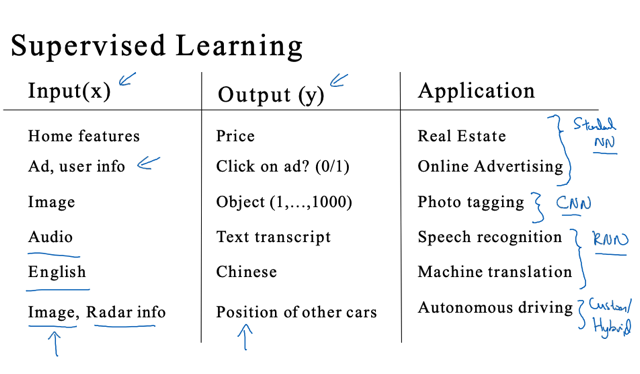</kbd>

 

<kbd>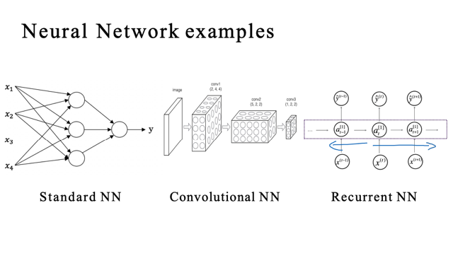</kbd>

 

<kbd>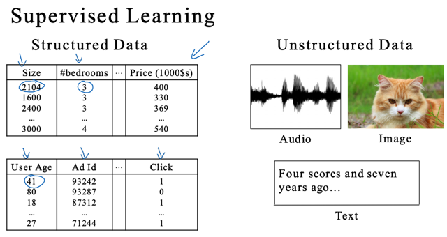</kbd>

 

## Why Is Deep Learning Taking Off?

 

### Sure, here is a more detailed answer with indexed points:  1 The video discusses the reasons behind the

> [!NOTE]
> Sure, here is a more detailed answer with indexed points:  1 The video discusses the reasons behind the
> rise of deep learning, despite the fact that the basic technical ideas behind deep learning have been
> around for decades.
>
> 2 The main driver behind the rise of deep learning is the amount of data that is now available for various
> tasks, such as spam classification, ad click prediction, and self-driving cars.
>
> 3 Traditional learning algorithms like support vector machines or logistic regression show a plateau in
> performance after a certain point, as the amount of data increases.
>
> 4 However, with deep learning, the performance can continue to improve as more data is added, and the
> neural network size increases.
>
> 5 This is because deep learning algorithms can take advantage of the huge amounts of data that are now
> available, and larger neural networks can be trained to process that data.
>
> 6 In fact, today, the most reliable way to improve the performance of a neural network is to either train a
> larger network or to add more data.
>
> 7 The amount of labeled data is plotted on the x-axis in the video, where labeled data refers to the training
> examples with both input X and label Y.
>
> 8 In the regime of smaller training sets, the relative ordering of the algorithms is not well defined, and
> performance depends more on the skill of the engineer at hand-engineering features.
>
> 9 However, in the regime of very large training sets, very large M, neural networks are seen to dominate
> the other approaches.
>
> 10 The rise of deep learning has been made possible by the scale of data and the scale of computation,
> such as the ability to train large neural networks on CPUs or GPUs.
>
> 11 Additionally, there have been significant algorithmic innovations in deep learning that have made neural
> networks faster, such as the switch from sigmoid to ReLU activation functions.
>
> 12 Overall, deep learning has taken off due to the combination of scale, both in terms of data and
> computation, and significant algorithmic innovations.

 

<kbd>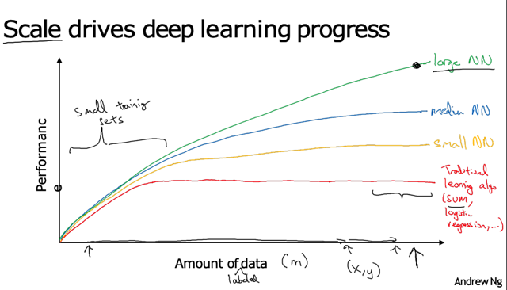</kbd>

> [!NOTE]
> Đại khái là:..
>
> Những algorithm 'cũ' như SVM khi có nhiều data nó sẽ tốt hơn nhưng
>  vẫn bị giới hạn, đại khái là sẽ không biết làm gì với quá nhiều data.
>
> Còn n.n phức tạp thì càng nhiều data nó càng tốt.
>
> Muốn n.n perform tốt thì phải 1-Nhiều data, 2-Phức tạp
>
> Do 'Big data' có được từ
> digitalization, sự phát triển của
> Camera, Mobile phone,...
>
> Nếu 'Small training set' thì performance sẽ tuỳ thuộc vào
> skill của con người như 'feature engineering' nên một model
> bằng SVM làm tốt có thể vượt trội n.n. Tuy nhiên nếu ở phân khúc
> 'Big data' thì Big n.n sẽ vượt trội những algorithm khác.

 

<kbd>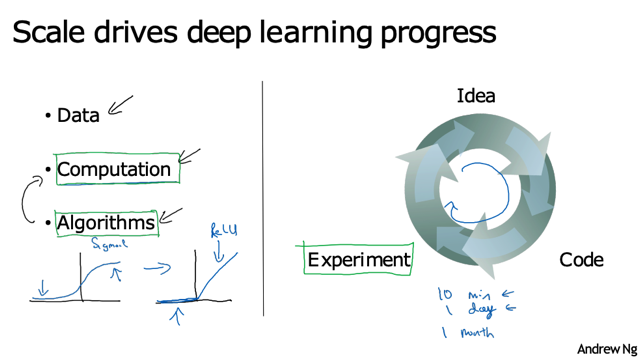</kbd>

> [!NOTE]
> Đại khái là:..
>
> Máy tính nhanh hơn giúp tăng tốc Quá trình Idea - Thử - Điều chỉnh
>
> Những algorithm mới cũng giúp quá trình 'Training' nhanh hơn
> ví dụ thay Sigmoid bằng Relu.

 

<kbd></kbd>

> [!NOTE]
> Data, sự phát triển của phần cứng sẽ giúp
> Deep learning còn phát triển nữa trong những năm tới.

 

<kbd>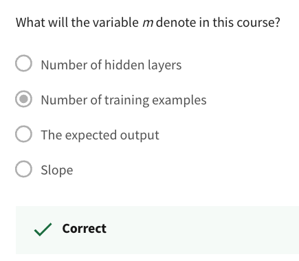</kbd>

 

## About This Course

 

### The speaker gives an overview of the first course in a deep learning specialization,

> [!NOTE]
> The speaker gives an overview of the first course in a deep learning specialization,
> which comprises five courses. The first course covers the most important
> foundations of deep learning, including building and working with a deep neural
> network. The course is four weeks long, with each week covering new material and
> including 10 multiple-choice questions to check understanding. In week two, learners
> will learn about the basics of neural network programming and practice implementing
> the algorithms through a programming exercise. In week three, learners will code up
> a single hidden layer neural network, and in week four, they will build a deep neural
> network with many layers. The speaker encourages learners to take the
> multiple-choice questions seriously and to use them to check their understanding of
> the material.

 

<kbd>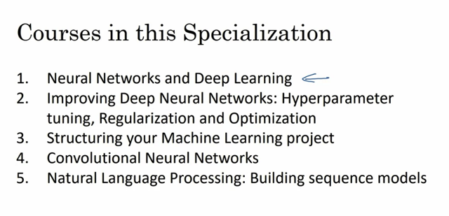</kbd>

 

<kbd>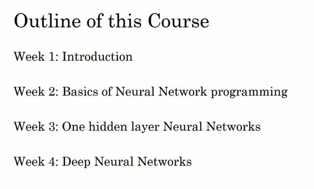</kbd>

 

## Quiz

 

<kbd></kbd>

 

<kbd>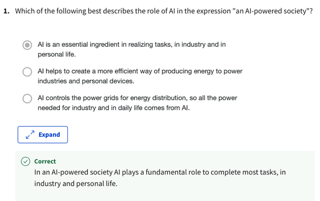</kbd>

 

<kbd>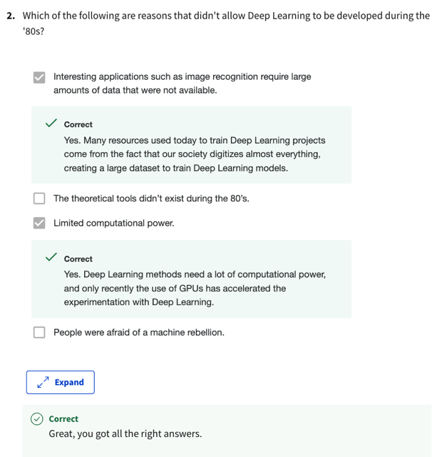</kbd>

 

<kbd>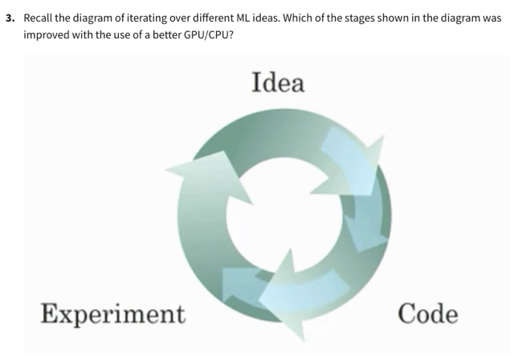</kbd>

 

<kbd>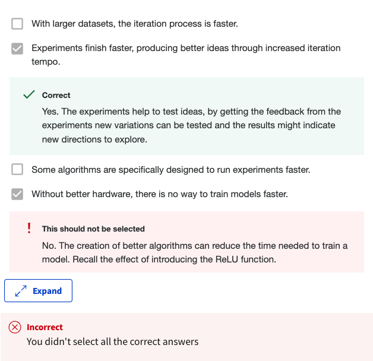</kbd>

 

<kbd>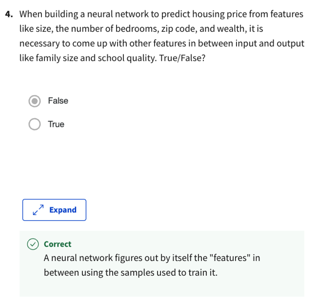</kbd>

 

<kbd>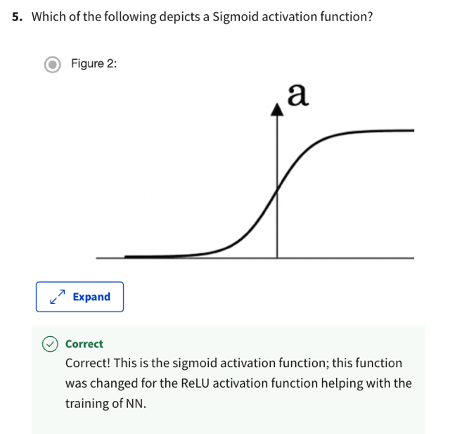</kbd>

 

<kbd>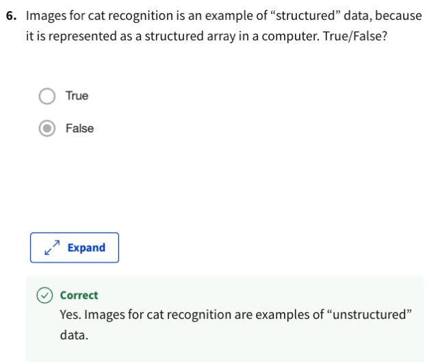</kbd>

 

<kbd>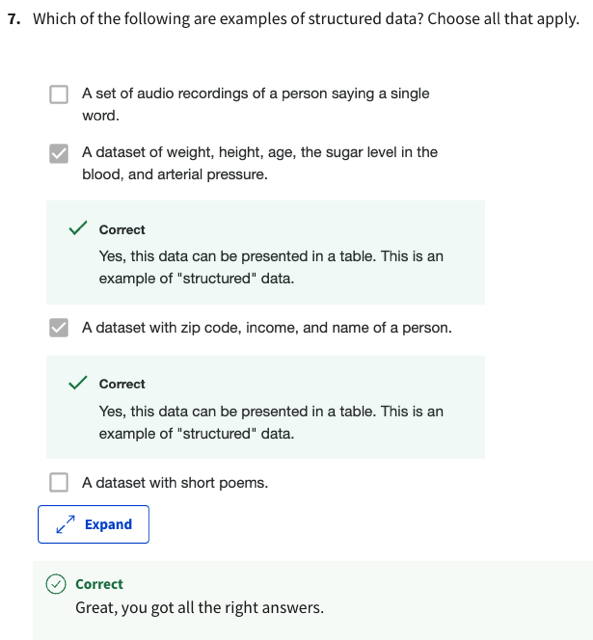</kbd>

 

<kbd></kbd>

 

<kbd>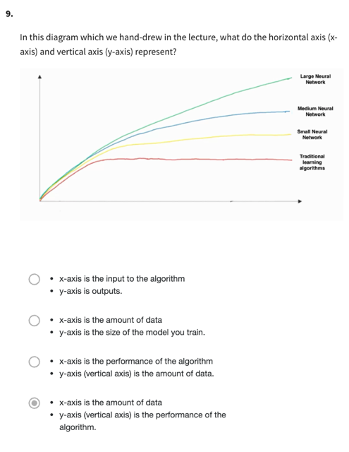</kbd>

 

<kbd>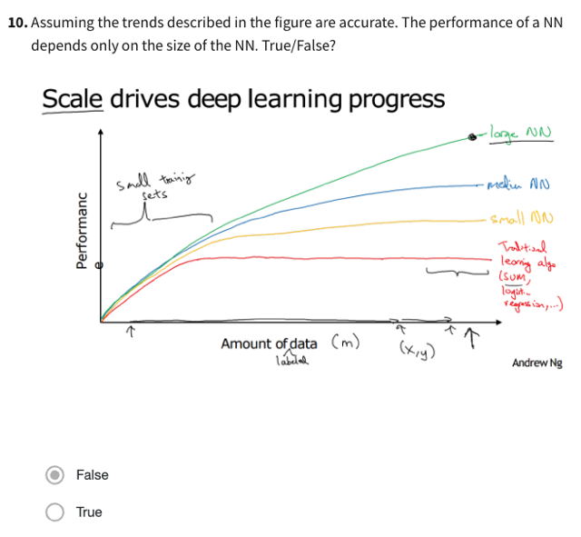</kbd>

 

