# C1w2_n.n Basic

📊 **Progress:** `64` Notes | `167` Screenshots

---

**Learning Objectives**
 • Build a logistic regression model structured as a shallow neural network
 • Build the general architecture of a learning algorithm, including parameter initialization, cost function and gradient calculation, and optimization implemetation (gradient descent)
 • Implement computationally efficient and highly vectorized versions of models
 • Compute derivatives for logistic regression, using a backpropagation mindset
 • Use Numpy functions and Numpy matrix/vector operations
 • Work with iPython Notebooks
 • Implement vectorization across multiple training examples
 • Explain the concept of broadcasting

## Logistic Regression As A Neural Network

 

### Binary Classification

 

- 1 The basics of neural network programming include techniques that are important to process the entire training set.  2 The computation of a neural network is organized in forward propagation and backward propagation.  3 Logistic regression is an algorithm for binary classification that is going to be used to convey the ideas.  4 To turn pixel intensity values into a feature vector, they are unrolled to get a long feature vector that lists all the red, green and blue pixel intensity values of the image.  5 Binary classification aims to learn a classifier that can input an image represented by a feature vector x and predict whether the corresponding label y is 1 or 0.  6 Notations used in the course include lowercase m to denote the number of training samples, M_train, to emphasize that this is the number of training examples, and m_subscript_test to denote the number of test examples.  7 A matrix X is defined by taking the training set inputs x1, x2, and so on, and stacking them in columns.
  > Sure, here is a more detailed answer with indexed main ideas:
>  1 In this week's materials, the basics of neural network programming will be covered.
>  2 Processing the entire training set without an explicit for loop is important in neural network implementation.
>  3 Computation of a neural network is usually organized into a forward propagation step, followed by a backward propagation step.
>  4 Logistic regression is an algorithm for binary classification that will be used to illustrate the concepts in this week's materials.
>  5 An input image is represented in a computer using three separate matrices corresponding to the red, green, and blue color channels.
>  6 To turn the pixel intensity values into a feature vector, the pixel values are unrolled into an input feature vector x.
>  7 The feature vector x is defined as a long vector listing out all the red, green and blue pixel intensity values of the image.
>  8 The dimension of the feature vector x is nx=12288 for a 64 by 64 image with 3 color channels.
>  9 Binary classification aims to learn a classifier that can input an image represented by feature vector x and predict whether the corresponding label y is 1 or 0, indicating whether it is a cat image or a non-cat image.
>  10 A single training example is represented by a pair (x,y) where x is an x-dimensional feature vector and y is either 0 or 1.
>  11 A training set comprises lowercase m training examples, written as (x1, y1) for the first training example up to (xm, ym) for the last training example.
>  12 The number of training samples is denoted by lowercase m, and sometimes written as M = M train to emphasize that it is the number of training examples.
>  13 A test set may be denoted by m subscript test to denote the number of test examples.
>  14 The training set inputs are stacked in columns to define a matrix, capital X, with M columns and NX rows.
>  15 The matrix X can alternatively be defined by stacking the train examples in rows, but the column-wise convention is used in neural network implementation.

   

    
    
<kbd>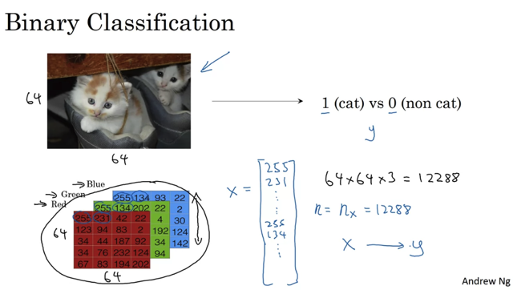</kbd>

     

    
    
<kbd>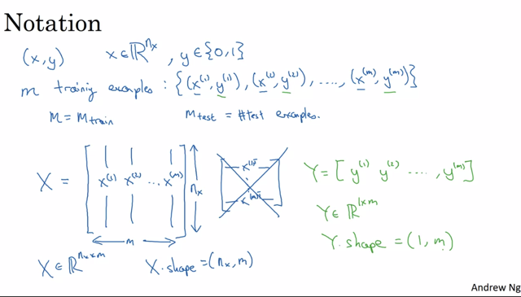</kbd>

    > Đại khái là:..
>
> Thường thì define X dạng mxn, nhưng đối với n.n thì define nm 
> sẽ dễ làm hơn. Y cũng vậy.

     

### Logistic Regression

 

- 1 Logistic regression is a learning algorithm used for binary classification problems where the output labels Y are either zero or one.  2 Given an input feature vector X, the goal of logistic regression is to output a prediction Y hat, which is the probability that Y is equal to one given X.  3 The parameters of logistic regression are W, which is an X-dimensional vector, and b, which is a real number.  4 The initial idea of using Y hat as a linear function of the input X, Y hat = w transpose X + b, is not effective for binary classification because it does not guarantee that Y hat will be between zero and one.  5 Instead, logistic regression uses the sigmoid function to ensure that Y hat is between zero and one.  6 The sigmoid function maps any real number Z to a value between zero and one, with values close to one for large positive Z, and values close to zero for large negative Z.  7 The formula for the sigmoid function is sigmoid of Z = 1 / (1 + e^(-Z)).  8 The parameters W and B of logistic regression are learned by defining a cost function, which will be explained in the next video.  9 There is an alternative notation for logistic regression that uses an extra feature called X0, but in this course, W and B are kept separate.
  > 1 Logistic regression is a learning algorithm used for binary classification problems. It's used when the output labels Y in a supervised learning problem are all either zero or one.
>  2 Given an input feature vector X, such as an image that you want to recognize as either a cat picture or not a cat picture, you want an algorithm that can output a prediction, which we'll call Y hat. Y hat is your estimate of Y, and should be the probability of the chance that Y is equal to one given the input features X.
>  3 X is an X-dimensional vector, given that the parameters of logistic regression will be W, which is also an X-dimensional vector, together with b, which is just a real number.
>  4 One thing you could try, that doesn't work, would be to have Y hat be W transpose X plus B, kind of a linear function of the input X. But this isn't a very good algorithm for binary classification because you want Y hat to be the chance that Y is equal to one. So in logistic regression, our output is instead going to be Y hat equals the sigmoid function applied to this quantity.
>  5 The sigmoid function is used in logistic regression to map any real-valued number to a value between 0 and 1, which can be interpreted as a probability. The formula for the sigmoid function is sigmoid of Z, where Z is a real number, is one over one plus E to the negative Z.
>  6 The quantity Z is defined as W transpose X plus B. The sigmoid function ensures that Y hat is between 0 and 1, which makes sense for a probability.
>  7 If Z is very large, then E to the negative Z will be close to zero. So then sigmoid of Z will be approximately one over one plus something very close to zero, which is close to 1. Conversely, if Z is very small, or it is a very large negative number, then sigmoid of Z becomes one over one plus E to the negative Z, which is close to 0.
>  8 When implementing logistic regression, your job is to try to learn parameters W and B so that Y hat becomes a good estimate of the chance of Y being equal to one.
>  9 There are different notational conventions for logistic regression. In some conventions, an extra feature called X0 is defined as equal to one, so that X is in R of NX plus one. Y hat is then defined to be equal to the sigmoid of theta transpose X, where theta is a vector that includes both W and B. In this class, however, B and W are kept as separate parameters.
>  10 In the next video, we'll look at how to define a cost function to change the parameters W and B.

   

    
    
<kbd>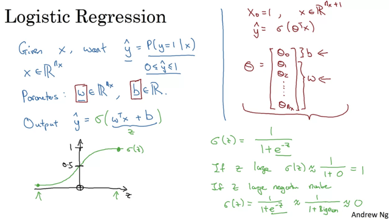</kbd>

     

    
    
<kbd>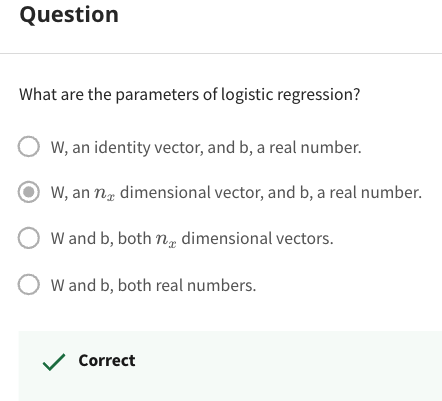</kbd>

     

### Logistic Regression Cost Function

 

- 1 Logistic regression model to train parameters W and B for given training examples.  2 Definition of the cost function to measure how well the algorithm is performing on the training set.  3 Convention of superscript parentheses I to index different training examples.  4 Use of a different loss function in logistic regression, which is negative y log y hat plus 1 minus y log 1 minus y hat.  5 Justification of the loss function, where it tries to make y hat large if y is equal to one and small if y is equal to zero.
  > Sure, here's a more detailed response:
>  1 Logistic regression model and training parameters:
>  2 In the previous video, the logistic regression model was introduced, which aims to learn the parameters W and B. To do this, a cost function needs to be defined, which will be used to train the logistic regression model.
>  3 Cost function:
>  4 The cost function used in logistic regression is negative y log y hat plus 1 minus y log 1 minus y hat. This loss function plays a similar role as squared error, but it will give an optimization problem that is convex, making it easier to optimize. The intuition behind this loss function is that we want to minimize the loss as much as possible.
>  5 Training set:
>  6 To learn the parameters W and B, a training set of examples is given. The goal is to find parameters that, on the training set, the predictions of the model (y hat i) will be close to the actual labels of the training set (y i).
>  7 Sigmoid function and notation:
>  8 To predict the output y hat for each training example, the sigmoid function is applied to the dot product of W and X plus B. The dot product of W and X plus B is also defined as Z. Throughout the course, a notation convention will be used that the superscript parentheses i refers to data be it X or Y or Z or something else associated with the ith training example.
>  9 Loss function for logistic regression:
>  10 The chosen loss function for logistic regression is negative y log y hat plus 1 minus y log 1 minus y hat. If y is equal to 1, we want negative log y hat to be as small as possible, which means we want log y hat to be as large as possible, and therefore y hat to be close to 1. If y is equal to 0, we want Log 1 minus y hat to be as large as possible, which means y hat to be as close to 0 as possible. This loss function will push the parameters to make y hat as close to the true label as possible.
>  11 Convex optimization:
>  12 The loss function used in logistic regression results in an optimization problem that is convex, making it easier to optimize than a non-convex optimization problem, which could have multiple local optima.
>  13 Future justification:
>  14 In the future, there will be an optional video to provide a more formal justification for using the loss function in logistic regression.

   

    
    
<kbd>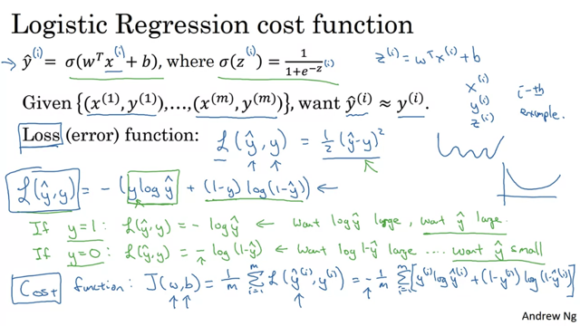</kbd>

    > Đại khái là:..
>
> Ở đây ổng dùng kí tự sigma - σ để biểu thị hàm Sigmoid.
> Mấy khoá khác ổng dùng chữ g.
>
> Define Loss function cho Logistic Regression (y^-y)^2/2 cũng được
> nhưng nó lại khiến G.D không work, do lúc này hàm J sẽ non-convex
> Do đó người ta define Loss function kiểu khác:
> ylog(y^) + (1 - y)log(1-y^)
>
> Và Cost function là trung bình cộng (mean value) tất cả Loss 
> của toàn bộ dataset m

     

    
    
<kbd>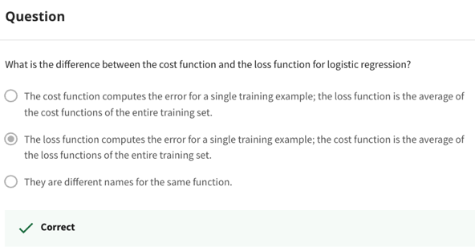</kbd>

     

### Gradient Descent

 

- 1 Recap of logistic regression and its loss and cost functions.  2 Discussion of the convexity of the cost function and why it's important for logistic regression.  3 Explanation of gradient descent as an optimization algorithm to find the best parameters for the cost function.  4 Description of how gradient descent updates the values of the parameters to approach the minimum of the cost function.  5 Explanation of the role of the learning rate in controlling the size of steps in the gradient descent algorithm.
  > Sure, here's a more detailed answer with indexing:
>  1 Logistic regression and loss function:
>  2 Logistic regression is a machine learning algorithm used for classification problems. To train a logistic regression model, we need to define a loss function that measures how well the algorithm is doing on a single training example. For logistic regression, the loss function is typically the cross-entropy loss function.
>  3 Cost function:
>  4 In addition to the loss function, we also need to define a cost function that measures how well the parameters W and B are doing on the entire training set. The cost function for logistic regression is typically defined as the average of the loss function over the entire training set.
>  5 Gradient descent:
>  6 To train the logistic regression model, we use the gradient descent algorithm to minimize the cost function by updating the parameters W and B. Gradient descent works by taking steps in the direction of the steepest slope of the cost function. In other words, it takes a step in the direction of the negative gradient of the cost function.
>  7 Convexity of cost function:
>  8 The cost function for logistic regression is a convex function, which means it has a single minimum point. This is why we use this particular cost function for logistic regression. Convexity ensures that gradient descent will always converge to the global minimum, no matter where we start from.
>  9 Initialization:
>  10 To start the gradient descent algorithm, we need to initialize the parameters W and B to some values. It's common practice to initialize the parameters to 0, although random initialization can also work.
>  11 Learning rate:
>  12 The learning rate alpha controls the size of the steps we take in the direction of the negative gradient. If alpha is too small, the algorithm will take a long time to converge. If alpha is too large, the algorithm may overshoot the minimum and fail to converge.
>  13 Derivative term:
>  14 The derivative term in the gradient descent update is the partial derivative of the cost function with respect to the parameters W and B. In other words, it tells us how the cost function changes as we change the values of W and B. This derivative is used to update the values of W and B in each iteration of the algorithm.
>  15 Implementation:
>  16 In practice, we use code to implement the gradient descent algorithm. The code typically includes a loop that updates the values of W and B in each iteration until the algorithm converges. The loop includes the gradient descent update formula, which updates the values of W and B using the learning rate and the derivative term.
> Overall, the gradient descent algorithm is a powerful tool for training machine learning models, including logistic regression. By minimizing the cost function, we can find the optimal values of the parameters W and B that make our model as accurate as possible.

   

    
    
<kbd>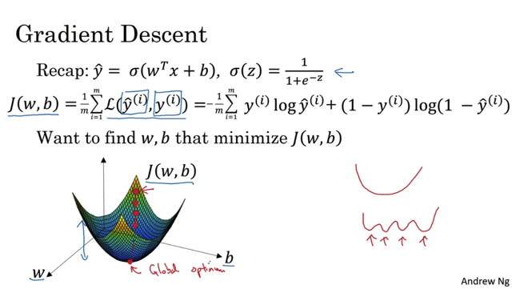</kbd>

    > Đại khái là:..
>
> "And \/**for logistic regression**\/, almost any initialization  method works.
> Usually you Initialize the values of 0, Random initialization also works, but
> people don't usually do that for  logistic regression.\/**But because this
> function is convex, no matter where you initialize, you should get to the
> same point or roughly the same point."**\/
>
> Vì hàm J convex nên dù có Initialize (W, b) thế nào - Random hay cho
> bằng 0 thì nó sẽ đều converge về global optima

     

    
    
<kbd>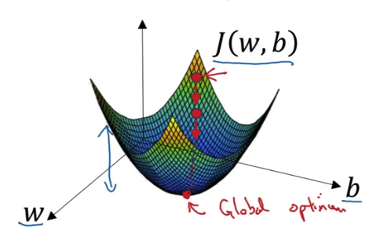</kbd>

     

    
    
<kbd>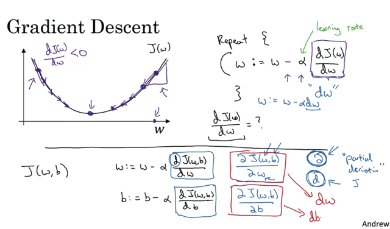</kbd>

    > Một ghi chú nhỏ không quan trọng lắm:
> Trong calculus người ta dùng kí tự **'∂'**- gọi là
> kí tự '\/**Partial derivative**\/' khi hàm J depend on 2 params
> trở lên còn nếu chỉ 1 param thì dùng chữ **'d'**
>
> Ổng cho là làm vậy chỉ tổ phức tạp nên ở đây dùng chữ 'd' hết.
>
> Trong code sẽ là **dw, db (hay dj_dw, dj_db)**

     

    
    
<kbd>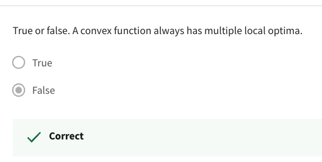</kbd>

     

### Derivatives

 

- 1 The video aims to help people gain an intuitive understanding of calculus and derivatives.  2 Even if someone does not have a deep understanding of calculus, they can still apply deep learning.  3 Forward and backward functions will encapsulate everything one needs to know about calculus for deep learning.  4 Calculus is important for deep learning, but intuitive understanding is enough to build and apply algorithms.  5 The video will explore the details of derivatives, but for experts in calculus, this video may be skipped.  6 The video explains the concept of derivatives by plotting a straight line and exploring how the slope changes.  7 The slope of a line represents the derivative, which is the rate of change of the function.  8 The slope or derivative is defined as the height divided by the width of a small triangle.  9 When the slope is equal to three, it means that if you nudge a variable a to the right, f(a) goes up three times as much as you nudged the value of a.
  > 1 The speaker aims to provide an intuitive understanding of calculus and derivatives for those who may not have studied them since college.
>  2 A deep understanding of calculus is not necessary to apply neural networks and deep learning effectively.
>  3 The speaker suggests that watching the videos and completing the programming homeworks successfully is sufficient to apply deep learning. In week four, they will introduce forward and backward functions that encapsulate everything that needs to be done with respect to calculus, so the viewer does not need to worry about them beyond that.
>  4 Despite this, the speaker believes that gaining an intuitive understanding of calculus and derivatives will be useful for building and successfully applying these algorithms.
>  5 The speaker presents a simple linear function, f(a) = 3a, and demonstrates how small changes in a can result in changes in f(a).
>  6 The speaker uses the slope of the function, or derivative, to describe the relationship between changes in a and changes in f(a).
>  7 Specifically, when the speaker nudges a to the right by a small amount, f(a) goes up by three times as much, and the slope or derivative of the function f(a) at a = 2 or a = 5 is three.
>  8 The speaker uses the term "derivative" to describe the slope of the function, but notes that the concept can be thought of as a "slope" instead.
>  9 The speaker explains that the derivative is defined as the height divided by the width of a small triangle and that the amount that f(a) changes is proportional to the amount that a changes.
>  10 The speaker notes that the derivative formula can be written as df(a)/da or d/da[f(a)], and that both formulas represent the slope of the function.
>  11 Overall, the speaker aims to provide an accessible and intuitive introduction to calculus and derivatives for those interested in deep learning, even if they have not studied these concepts in some time.

   

    
    
<kbd>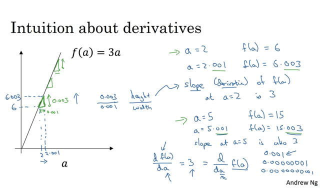</kbd>

    > Official definition thì 'small value' không phải là 0.01, hay 0.0001
> mà là một khoảng vô cùng nhỏ. Nhưng đại khái definition của
> Derivative là chỉ vậy:  **"Khi kéo a tăng lên một khoảng hàm f(a)
> \/cũng tăng lên một khoảng gấp mấy lần\/ thì đó chính là
> derivative của hàm f tại a"** 
>
> Và cũng là slop - Độ dốc của hàm f(a) tại a.
>
> Và đối với hàm linear thì thấy rõ là độ dốc ở đâu cũng bằng nhau.

     

    
    
<kbd>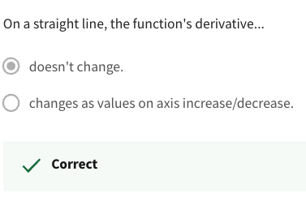</kbd>

     

### More Derivative Examples

 

- 1 The video demonstrates a slightly more complex example where the slope of the function varies at different points in the function.  2 The function used as an example is f(a) = a².  3 The video shows that the slope of the function at a given point can be determined by nudging a slightly to the right and observing the change in f(a).  4 The video explains that the ratio of the height of the triangle over the width of the triangle is different at different points on the curve, which is why the derivative is different at different points.  5 The video shows that if you pull up a calculus textbook, you'll find that the slope of the function a² is equal to 2a.  6 The video demonstrates that the derivative of f(a) = a² is equal to 4 when a = 2 and 10 when a = 5.  7 The video explains that the derivative is defined using infinitesimally small nudges to a, which is why the amount that f(a) goes up isn't exactly given by the formula but is only approximately given by the derivative.
  > 1 The video discusses a slightly more complex example where the slope of a function can be different at different points on the function.
>  2 The video starts with an example of the function f(a) = a², and looks at the point a=2, where f(a) = 4.
>  3 By nudging a slightly to the right to a=2.001, f(a) becomes approximately 4.004, which means that when a=2, f(a) = 4, and when a=2.001, f(a) = 4.004.
>  4 Drawing a triangle with the base being the small nudge to the right (0.001) and the height being the change in f(a) (0.004), it can be seen that if a is nudged to the right, f(a) goes up four times as much. This means that the slope (derivative) of f(a) at a=2 is 4.
>  5 The video then discusses how the slope (derivative) of f(a) is different for different values of a, using the example of a=5. When a=5, f(a) = 25, and by nudging a to the right by a tiny amount to a=5.001, f(a) goes up to approximately 25.010, meaning that the slope of f(a) at a=5 is 10.
>  6 The video explains that the reason derivatives are different at different points is because the ratio of the height of the triangle to the width of the triangle is different at different points on the curve.
>  7 The video then mentions that a calculus textbook will tell you that the derivative of f(a) = a² is 2a, and that this formula is consistent with the previous examples. When a=2, the slope of f(a) is 2x2=4, and when a=5, the slope of f(a) is 2x5=10.
>  8 The video concludes by mentioning that the reason why the value of f(a) wasn't exactly 4.004 is because derivatives are defined using infinitesimally small nudges to a, rather than 0.001, which is not infinitesimally small. The video also gives some more quick examples of how to find the derivative of a function.

   

    
    
<kbd>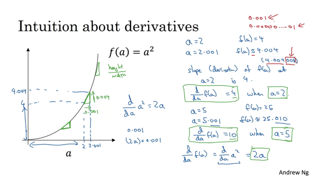</kbd>

    > Đại khái là nếu trong sách Calculus ta thấy công thức tính 
> d_f(a)/d_a = **2a** với f = a^2 thì có nghĩa là : 
>
> Nếu kéo a lên một khoảng tiny ví dụ 0,001 thì 
> hàm f = a^2 sẽ tăng lên 1 khoảng \/**gấp 2a lần**\/ = 2a*0.001

     

    
    
<kbd>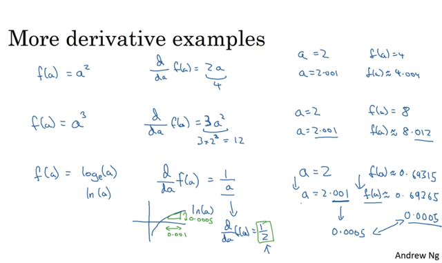</kbd>

     

    
    
<kbd>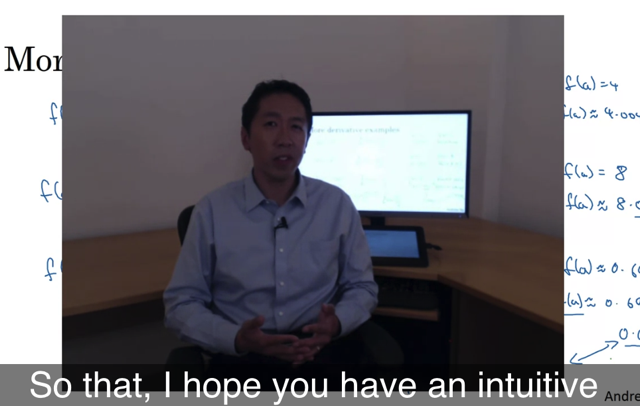</kbd>

    > Wrap up: 
> \/**Derivative của một function (tại điểm nào đó) đơn giản chỉ là 
> độ dốc của function đó (tại điểm nào đó)**\/
> 1. The derivative of the function just means **the slope** of a function 
> and the slope of a function can be different at different points on the 
> function
>
> 2. Muốn xem công thức của tính derivative cho các hàm khác nhau
> thì có thể mở sách Calculus ra xem.

     

### Computation Graph

 

- 1 Introduction: Explanation of forward pass and backward pass in neural networks using computation graph.  2 Example problem: Computing a function J of three variables a, b, and c, which is J = 3(a + bc).  3 Steps to compute J:  4 a. Compute u = bc.  5 b. Compute V = a * u.  6 c. Compute J = 3V.  7 Computation graph: Visual representation of the three steps with a, b, and c as inputs, and u, V, and J as the intermediate and final outputs, respectively.  8 Example calculation: Values of a, b, and c are given as 5, 3, and 2, respectively. The values of u, V, and J are computed as 6, 30, and 33, respectively, using the computation graph.  9 Importance of computation graph: Useful for optimizing a special output variable, such as J, in neural networks.  10 Left-to-right computation: The computation graph enables a left-to-right pass for computing the value of J.  11 Right-to-left computation: In order to compute derivatives, a right-to-left pass is needed, which is explained in the next video.
   

    
    
<kbd>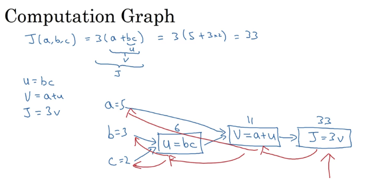</kbd>

    > Nền tảng đằng sau tên gọi khái niệm của 'Forward propagation' đại khái là
> để tính value (ví dụ của cost function J) thì tính từ trái qua phải. Còn tính
> derivative thì ngược lại (Back propagation)

     

### Derivatives With A Computation Graph

 

- 1 Introduction: The video discusses how to use a computation graph to figure out derivative calculations for a function J by taking a cleaned-up version of the computation graph used in the previous video.  2 Derivative of J with respect to v: The video demonstrates how to compute the derivative of J with respect to v, which is equal to 3, by increasing the value of v by 0.001, using the analogy of the previous video where f(a) = 3a and df/da = 3.  3 Derivative of J with respect to a: The video illustrates how to calculate dJ/da, which is also equal to 3, by changing the value of a by 0.001 and breaking it down to the chain rule, where dv/da = 1 and dJ/dv = 3, which when multiplied give dJ/da = 3.  4 Backward calculation: The video shows how computing dJ/dv can help in calculating dJ/da and how it's a backward calculation to find the derivatives of the variables that come before J.  5 Notational Convention: The video introduces a new notational convention, which is to call the final output variable, J in this case, as "dvar" while computing the derivative of the final output variable with respect to intermediate variables.
  > Sure! In the video, the presenter works through an example of using a computation graph to compute a function J, and then demonstrates how to use that computation graph to calculate derivatives of J with respect to different variables.
>  1 Computing derivative of J with respect to v:
> The presenter starts by explaining that the derivative of J with respect to v is equal to 3, because J is defined as 3 times v. In other words, if the value of v is changed by a little bit (e.g., from 11 to 11.001), J will also change by 3 times that amount (e.g., from 33 to 33.003). This is analogous to the example from the previous video where f(a) = 3a and df/da = 3. This step of computing the derivative of J with respect to v is called one step of backpropagation.
>  2 Computing derivative of J with respect to a:
> The presenter then moves on to computing the derivative of J with respect to a, which is a bit more complicated. They start by setting a = 5 and then bumping it up to 5.001. This change in a propagates through the computation graph to affect the value of v, which in turn affects the value of J. The presenter uses the chain rule from calculus to break down this process, and shows that the derivative of J with respect to a is equal to 3 (the same as the derivative of J with respect to v), because dv/da = 1 and dv/dJ = 3.
>  3 Notational convention for backpropagation:
> Finally, the presenter introduces a new notational convention for backpropagation. They explain that in most cases, there will be some final output variable (in this case, J) that you want to optimize or calculate the derivative of with respect to some other variable. When implementing backpropagation in software, you can denote the derivative of the final output variable with respect to some other variable as dvar.

   

    
    
<kbd>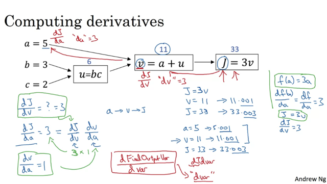</kbd>

    > 1.Đại khái là để tính derivative thì tính theo chiều ngược lại, ví dụ
> để tính dJ_da thì phải tính dJ_dv, dv_da và:
>
> dJ_da = dJ_dv . dv_da
>
> và nó gọi là 'Chain rule' trong calculus 
>
> 2.Đại khái là trong code sẽ viết gọn dFinalOutput/dVar thành dVar
> Ví dụ:
>  'dJ_da' thành 'da', 'dJ_dv' thành 'dv' thôi.

     

    
    
<kbd>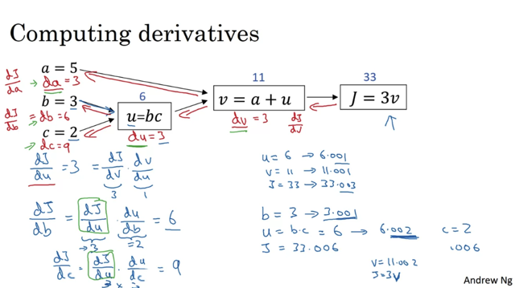</kbd>

    > So that was the computation graph and how does a forward or
> left to right calculation to compute the **cost function** such as J
> that you might want to optimize. And a backwards or a right to
> left calculation to compute **derivatives**

    > So the key takeaway from this video, from this example, is that 
> when computing derivatives and computing all of these 
> derivatives, the most efficient way to do so is \/**through a right 
> to left computation**\/ following the direction of the red arrows

     

    
    
<kbd>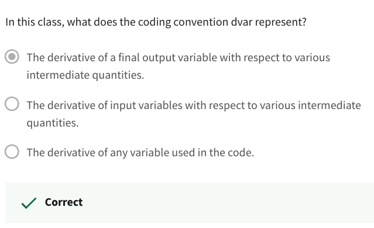</kbd>

     

### Logistic Regression Gradient Descent

 

- Main ideas:  1 Introduction to computing derivatives for implementing gradient descent for logistic regression.  2 Explanation of the key equations necessary to implement gradient descent for logistic regression using computation graphs.  3 Forward propagation steps of computing loss on a single training example.  4 Backward propagation steps to compute the derivatives of the loss with respect to each variable.  5 Explanation of the derivative of the loss with respect to A and how it is computed.  6 Deriving the derivative of the loss with respect to Z using the chain rule.  7 Computation of how much W and B need to be changed.  8 Explanation of how to update W1, W2, and B to perform one step of gradient descent with respect to a single example.
  > Welcome back. In this video, the main topic is computing derivatives for implementing gradient descent in logistic regression. The focus is on the key equations needed to perform gradient descent, which will help you modify the model parameters to reduce loss. Here are the main ideas discussed in the video:
>  1 Using a computation graph: The video starts with using a computation graph to represent the logistic regression model. While it may seem like an overkill for deriving gradient descent for logistic regression, the use of a computation graph is beneficial to get familiar with the ideas before working with full-fledged neural networks.
>  2 Forward propagation steps: The video describes the forward propagation steps for computing the loss on a single training example. The predictions Y_hat are calculated from the input features X1 and X2, and model parameters W1, W2, and B. The loss is then computed using the output of the model A and the ground truth label Y.
>  3 Computing derivatives: To modify the parameters W and B and reduce the loss, the derivatives of the loss with respect to the model parameters must be calculated. The first step in this process is computing the derivative of the loss with respect to the variable A, which is represented by the variable DA in the code. The formula for DA is derived using calculus, and it is -Y/A + (1-Y)/(1-A).
>  4 Backward propagation steps: The video then discusses the backward propagation steps for computing the derivatives with respect to the model parameters. The derivative of the loss with respect to the variable Z (represented by the variable DZ) is calculated using the formula A-Y. The derivatives with respect to the parameters W1, W2, and B are then calculated using the formulas DW1=X1\/DZ, DW2=X2\/DZ, and DB=DZ, respectively.
>  5 Gradient descent updates: Once the derivatives have been computed, the model parameters can be updated using gradient descent. The updates for W1, W2, and B are W1=W1-alpha\/DW1, W2=W2-alpha\/DW2, and B=B-alpha*DB, respectively. Alpha is the learning rate, which determines the size of the updates.
> In summary, the video explains how to compute derivatives and implement gradient descent for logistic regression with respect to a single training example. This is a fundamental step in training logistic regression models, which are typically trained on multiple examples to achieve high accuracy.

   

    
    
<kbd>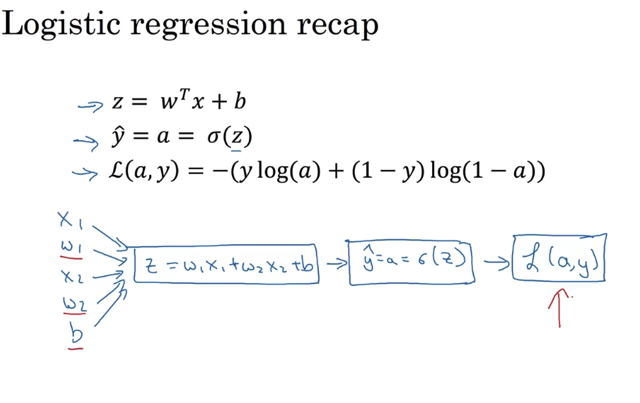</kbd>

     

    
    
<kbd>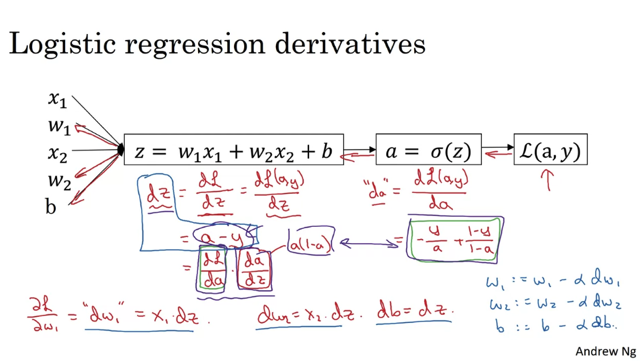</kbd>

    > Đại khái đây chính là đi ngược lại (Back Prop) để  ..
>
> ..tính ra '\/**derivative of cost function J with respect to w, b**\/ 
> Hay viết gọn là dj_dw (or dw) và dj_db (or db)  
> Phục vụ cho việc \/**dùng Gradient Descent update w, b sao 
> cho minimize J**\/.

    > Có thể xem lại sách Calculus để tự tính lại derivative (đạo hàm)
> của: 
> - hàm Loss function L = -( ylog(a) + (1-y)log(1-a) ) -> dL_da
> - hàm sigmoid a = sigmoid(z) -> da_dz
> - hàm z = w(transpose).x + b -> dz_dw, dz_db

     

    
    
<kbd>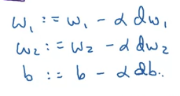</kbd>

    > D\/**ùng Gradient Descent update w,
> b sao cho minimize J**\/.

     

    
    
<kbd>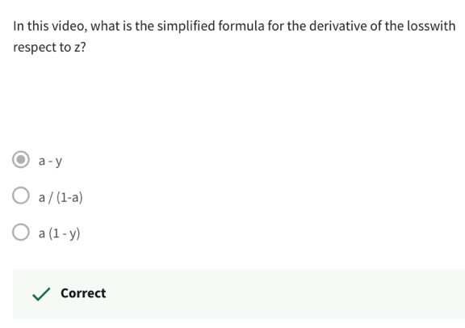</kbd>

     

### Gradient Descent On M Examples

 

- 1 Reminder of the definition of the cost function J.  2 Explanation of how to compute derivatives for the cost function J with respect to each parameter w and b for m training examples.  3 Derivatives with respect to each parameter are computed as the average of derivatives with respect to each parameter for the individual loss terms.  4 An algorithm is presented that computes the derivatives of the cost function J with respect to each parameter w and b.  5 Details of the algorithm are presented, including initialization, for loop over training set, calculations for the accumulator values, division by m to compute the averages, and updating of parameter values.  6 Two weaknesses with the algorithm are noted: two for loops are needed to implement logistic regression and it assumes that the number of features is known.
  > Sure, I'd be happy to provide more detail on the main ideas presented in the text.
>  1 Computing derivatives and implementing gradient descent for logistic regression with m training examples:
>  2 In a previous video, you learned how to compute derivatives and implement gradient descent for logistic regression with respect to just one training example. Now, the focus is on implementing these same concepts with m training examples. To get started, we need to understand the definition of the cost function J, which is the average of the loss function for each training example. Specifically, J equals one over m multiplied by the sum of the loss when your algorithm outputs a_i on example y_i. Here, a_i is the prediction on the ith training example, which is sigma of z_i, where z_i is w transpose x_i plus b.
>  3 Derivatives with respect to the cost function:
>  4 To compute the derivatives of the cost function with respect to each parameter (w_1, w_2, b), we need to take the average of the derivatives with respect to each training example. We can use the same technique as before to compute these derivatives for each training example (dw_1_i, dw_2_i, and d_b_i). Once we have the derivatives for each training example, we can sum them up and then divide by m to obtain the overall gradient that we can use to implement gradient descent.
>  5 Algorithm for implementing logistic regression with gradient descent:
>  6 To implement logistic regression with gradient descent, we can use the following algorithm:
>  • Initialize J, dw_1, dw_2, and d_b to zero.
>  • Use a for loop to iterate over the m training examples.
>  • Compute z_i = w transpose x_i + b and a_i = sigma of z_i.
>  • Update J with the loss function, J += -[y_i log a_i + (1 - y_i) log (1 - a_i)].
>  • Compute dz_i = a_i - y_i and update dw_1, dw_2, and d_b accordingly.
>  • Divide dw_1, dw_2, and d_b by m to obtain the averages.
>  • Update w_1, w_2, and b using gradient descent: w_1 = w_1 - learning rate * dw_1, w_2 = w_2 - learning rate * dw_2, and b = b - learning rate * d_b.
>  7 Weaknesses with the current implementation:
>  8 There are two main weaknesses with the current implementation. Firstly, we need to write two for loops to implement logistic regression using gradient descent. The first for loop iterates over the m training examples, and the second for loop iterates over all the features. This can become time-consuming for large datasets with many features. Secondly, the current implementation assumes that the input data has only two features. If we have more features, we need to perform similar computations for dw_t, dw_n, and so on, which can become cumbersome.

   

    
    
<kbd>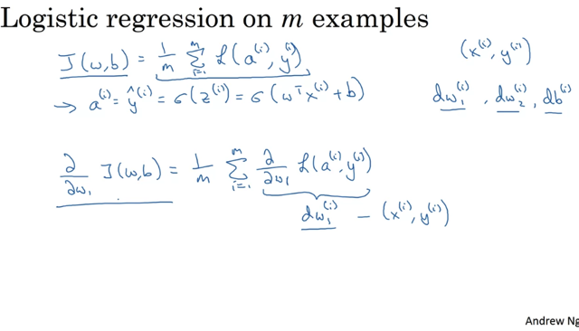</kbd>

    > Derivative of J w.r.t w, b trên toàn bộ m dataset X, y - dJ_dw, dJ_db
> Tính bằng cách lấy trung bình của tất cả
> Derivative of J w.r.t w, b trên từng dataset x(i), y(i) - dJ_dw(i), dJ_db(i)

     

    
    
<kbd>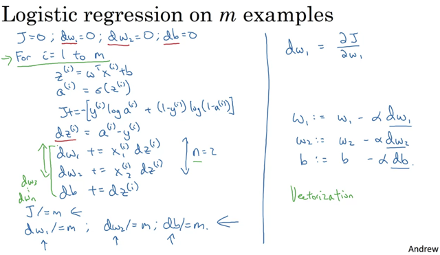</kbd>

    > Không khó hiểu gì nhưng nhắc cho để ý:
> 1. J, dw, db là 'accumulator' 
> -> Update bằng operator += trong loop nên không có superscrip (i) 
> còn dz là đv từng dataset nên có superscrip (i) - dz(i)
>
> 2. Toàn bộ ở đây chỉ là **1 iteration - để update dw, db một lần.**

    > Dễ dàng thấy có 2 nhược điểm:
>
> Phải dùng 2 for loop, 1 cái loop over m training set, 1 cái
> loop tất cả  các feature để tính dw: Ở đây chỉ có dw1, dưa
> nhưng thực tế có n feature với n có khi cả ngàn.
>
> Solution : **Vectorization**

     

    
    
<kbd>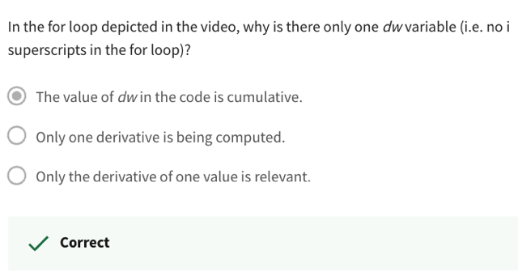</kbd>

     

### DERIVATION OF dL/dz

 

- ...
   

    
    
<kbd>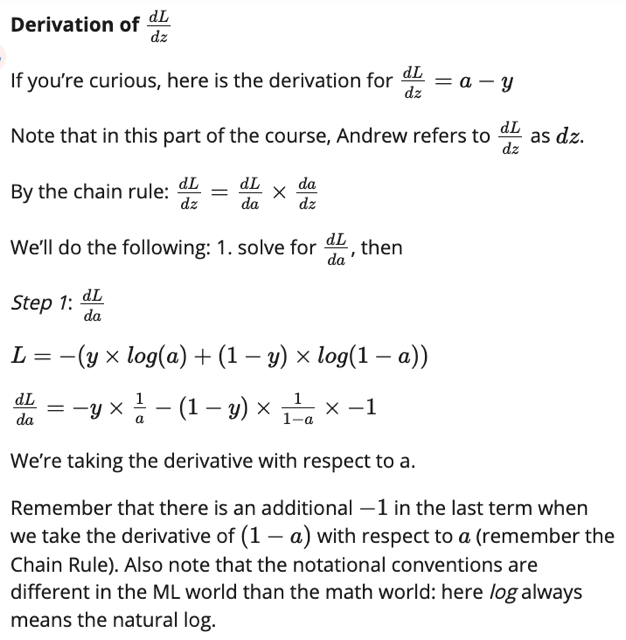</kbd>

     

    
    
<kbd>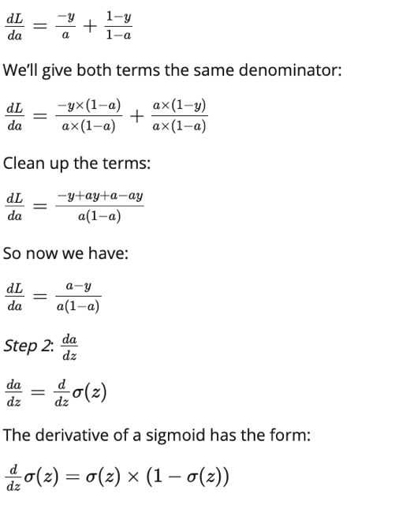</kbd>

     

    
    
<kbd>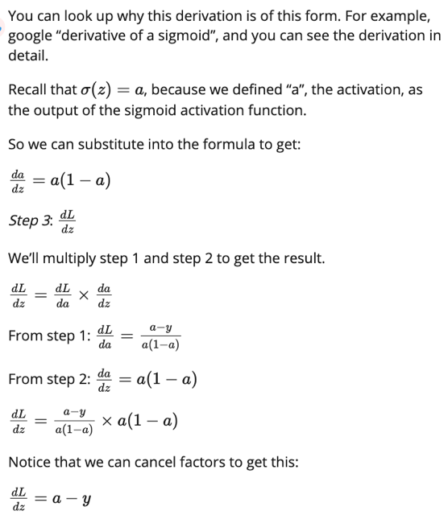</kbd>

     

    
    
<kbd>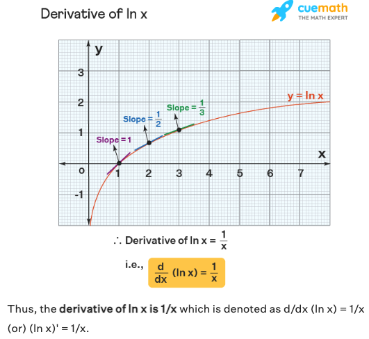</kbd>

     

    
    
<kbd>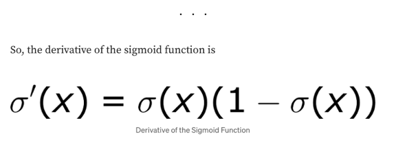</kbd>

     

## Python And Vectorization

 

### Vectorization

 

- 1 The course teaches strategies for structuring a machine learning project to improve efficiency and quickly get systems working.  2 The example given is of improving a cat classification system with 90% accuracy.  3 There are many ideas to try to improve a deep learning system, but choosing the wrong approach can waste time.  4 The course teaches strategies for analyzing a machine learning problem to identify the most promising ideas to pursue.  5 The instructor will share lessons learned from building and shipping deep learning products.  6 The strategies taught in the course are unique and not commonly taught in university deep learning courses.  7 Machine learning strategy has changed with the emergence of deep learning algorithms.  8 The course aims to make learners more effective at getting deep learning systems to work.
   

    
    
<kbd>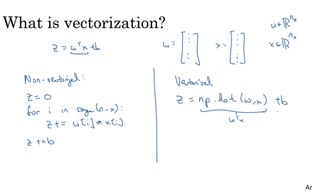</kbd>

     

    
    
<kbd>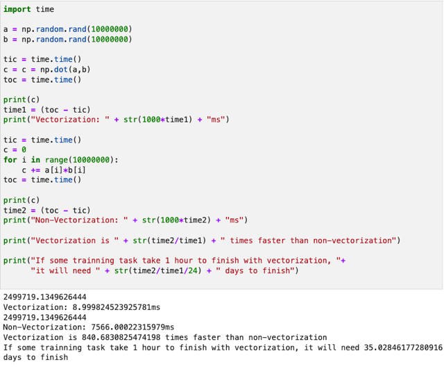</kbd>

    > 2499719.1349626444
> Vectorization: 8.999824523925781ms
> 2499719.1349626444
> Non-Vectorization: 7566.00022315979ms
> Vectorization is \/**840**\/.6830825474198 times faster than non-vectorization
> If some trainning task take **1 hour** to finish with vectorization, 
> it will need **35 days** to finish

     

    
    
<kbd>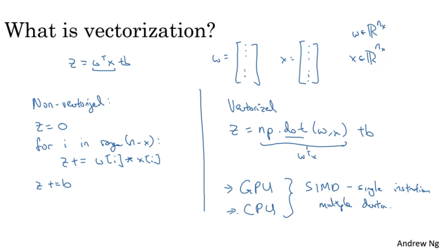</kbd>

    > And it turns out that both GPU and CPU have parallelization instructions. 
> They're sometimes called SIMD instructions. 
> This stands for a single instruction multiple data.
>
> But what this basically means is that, if you use built-in functions 
> such as this np. function or other functions that don't require 
> you explicitly implementing a for loop. 
> It enables Python numPy to take much better advantage of 
> parallelism to do your computations much faster.
>
> And this is true both computations on CPUs and computations on GPUs. 
> It's just that GPUs are remarkably good at these SIMD calculations but 
> CPU is actually also not too bad at that. 
> Maybe just not as good as GPUs.

    > Rule of thumb is to avoid for - loop as much as possible

     

    
    
<kbd>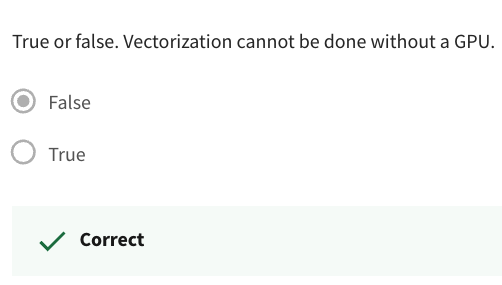</kbd>

     

### Vectorization More Example

 

- 1 Rule of thumb: avoid explicit for-loops whenever possible to speed up code.  2 Example 1: Vector multiplication using matrix A and vector v - non-vectorized implementation using two for-loops, vectorized implementation using np dot (A,v).  3 Example 2: Exponential operation on every element of vector v - non-vectorized implementation using a for-loop, vectorized implementation using np.exp(v).  4 NumPy built-in functions for element-wise operations.  5 Applying vectorization to logistic regression gradient descent implementation to eliminate one of the two for-loops.  6 Eliminating the need for a for-loop over training examples in logistic regression with further vectorization.  7 Vectorization can significantly speed up code.
  > 1 What is the rule of thumb when programming neural networks or regression?
> The rule of thumb when programming neural networks or regression is to avoid explicit for-loops whenever possible. While it's not always possible to completely eliminate for-loops, using built-in functions or finding alternative ways to compute what's needed will often result in faster code.
>  2 What is the definition of matrix multiplication for computing vector u as the product of matrix A and vector v?
> The definition of matrix multiplication for computing vector u as the product of matrix A and vector v is that the ith element of u (Ui) is equal to the sum over j of Aij times Vj.
>  3 What is the non-vectorized implementation of computing vector u as the product of matrix A and vector v?
> The non-vectorized implementation of computing vector u as the product of matrix A and vector v involves two for-loops, looping over both i and j. The process involves initializing u to a vector of zeros, then using for-loops to compute the elements one at a time.
>  4 What is the vectorized implementation of computing vector u as the product of matrix A and vector v?
> The vectorized implementation of computing vector u as the product of matrix A and vector v involves using the NumPy built-in function np.dot(A,v), which eliminates the need for two for-loops.
>  5 What built-in function in Python and NumPy allows for computing exponential operations on every element of a vector?
> The built-in function in Python and NumPy that allows for computing exponential operations on every element of a vector is np.exp(v).
>  6 How does using built-in functions in NumPy help eliminate the need for for-loops?
> Using built-in functions in NumPy can help eliminate the need for for-loops by allowing you to compute vectors with a single call to a single function, rather than using explicit for-loops to compute elements one at a time.
>  7 How can vectorization help improve the performance of code?
> Vectorization can help improve the performance of code by eliminating the need for for-loops, which can be slow and inefficient, and instead using built-in functions or alternative methods to compute elements all at once. This can result in faster code that runs more efficiently.
>  8 How does vectorization help in logistic regression gradient descent implementation?
> In logistic regression gradient descent implementation, vectorization helps to eliminate one of the two for-loops that are typically used. By using a vector value operation to update dw (the derivative) rather than a for-loop, code can run faster and more efficiently. With further vectorization techniques, it's even possible to process entire training sets without needing a for-loop over the training examples.

   

    
    
<kbd>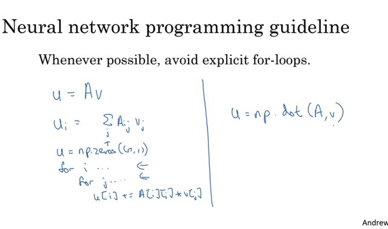</kbd>

     

    
    
<kbd>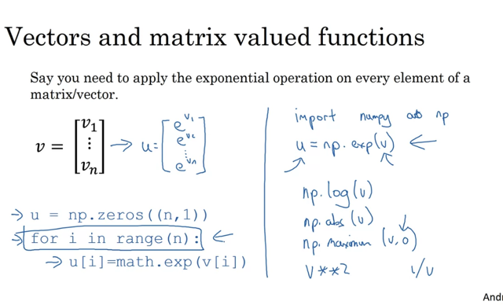</kbd>

     

    
    
<kbd>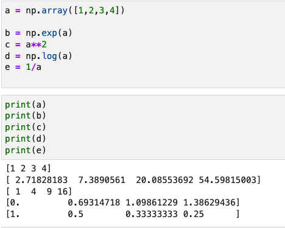</kbd>

     

### Vectorizing Logstic Regression

 

- Main ideas:  1 The video explains how to vectorize the implementation of logistic regression and process the entire training set without using explicit for loops.  2 The four propagation steps of logistic regression are explained with an example of making a prediction on M training examples.  3 The matrix X is defined as the training inputs, stacked together in different columns, and a matrix Z is defined to compute all the values of Z1, Z2,...,ZM in one step.  4 The values A1, A2,...,AM are computed using a vectorized sigmoid function that takes the matrix Z as input.  5 Stacking lowercase A results in a new variable, capital A.  6 The video concludes that instead of looping over M training examples to compute Z and A, you can use the one-line code to compute all Z and A at the same time.
  > Sure, here's a more detailed summary of the video, with each point indexed:
>  1 The video discusses how vectorization can significantly speed up your code, and specifically how to vectorize the implementation of logistic regression. The goal is to be able to process an entire training set at once, without using explicit for loops.
>  2 Logistic regression has four propagation steps that are needed to make predictions on M training examples. To make a prediction on the first example, you need to compute Z (using a familiar formula), then compute the activations (y hat) for the first example. To make a prediction on the second training example, you need to compute Z and y hat for the second example, and so on for all M training examples.
>  3 To carry out these propagation steps without explicit for loops, the video introduces a matrix capital X, which is a matrix of training inputs stacked together in columns. X is an NX by M matrix (where N is the number of features and M is the number of training examples). The video then shows how you can compute all of the Z values (Z1 to ZM) in one step, using a 1 by M matrix constructed from the weights (W), the transposed X matrix (X^T), and a bias term (B).
>  4 The matrix multiplication W^T * X results in a row vector (W^T * X) that contains the products of each weight and feature for each training example. Adding the bias term (B) to this row vector results in another row vector of length M, where each element is the sum of the corresponding dot product and bias term. This row vector contains all of the Z values (Z1 to ZM).
>  5 The video introduces another variable, capital Z, which is a matrix obtained by horizontally stacking the lowercase Z values (Z1 to ZM). The video shows that the implementation of the calculation for capital Z in Python using numpy is simply: capital_Z = np.dot(W.T, X) + B.
>  6 Next, the video shows how to compute all of the activation values (A1 to AM) for the training examples using the sigmoid function. A new variable, capital A, is introduced, which is obtained by horizontally stacking the lowercase A values. The video mentions that the programming assignment for the course includes details on how to implement a vector-valued sigmoid function that can take in the matrix capital Z and output the matrix capital A.
>  7 In summary, instead of looping over M training examples to compute the Z and A values one at a time, you can use the one-line code capital_Z = np.dot(W.T, X) + B to compute all of the Z values at once, and then use an appropriately implemented sigmoid function to compute all of the A values at once. This is a vectorized implementation of logistic regression that is much faster than using explicit for loops.

   

    
    
<kbd>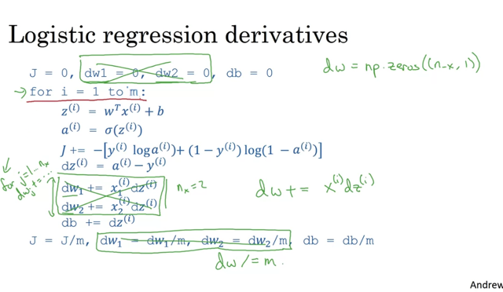</kbd>

     

    
    
<kbd>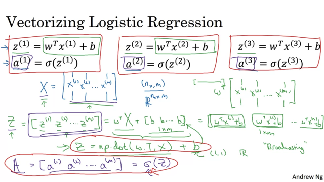</kbd>

    > X = n x m (ở khoá trước đây nó define dạng m x n)
>
> W = n x 1 -> W(T) = 1 x n 
>
> Z = W(T) . X = 1 x n . n x m = 1 x m
>
> W(T) . X + b thì b sẽ dc broadcast thành [b b ...b] = 1x m
>
> =>  W(T) . X + b = 1 x m + 1 x m = 1 x m
>
> Hàm sigmoid nhận vector được =>
> a(Z) = 1x m

     

    
    
<kbd>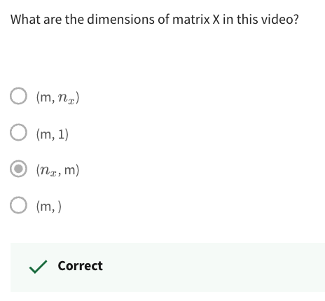</kbd>

     

### Vectorizng Logistic Regression' S Gradient Computation

 

- Main ideas:  1 The previous video demonstrated how vectorization could be used to compute the predictions for an entire training set simultaneously.  2 This video shows how to use vectorization for gradient computation for all M training samples.  3 The new variable dZ is defined as dz1, dz2, ..., dzm, which is a 1 by m matrix or an m dimensional row vector.  4 dz can be computed as A - Y where A and Y are defined as a1 through am and y1 through ym, respectively.  5 Vectorization can be used to implement the derivative calculations efficiently.  6 The vectorized implementation of db is one over m times np.sum of dz, while the vectorized implementation of dw is one over m times the matrix X times dz transpose.  7 The previous implementation of logistic regression was highly inefficient and required loops over dw1, dw2, etc.  8 The new implementation uses vectorization to replace the loops, making it more efficient.  9 The updated code involves computing capital Z as w transpose X + B, then calculating a as sigmoid of capital Z, dz as A - Y, dw as 1/m x dz transpose, and db as 1/m times np.sum of dz.  10 The vectorized implementation allows for the computation of updates to the parameters without a for loop over the training set.
   

    
    
<kbd>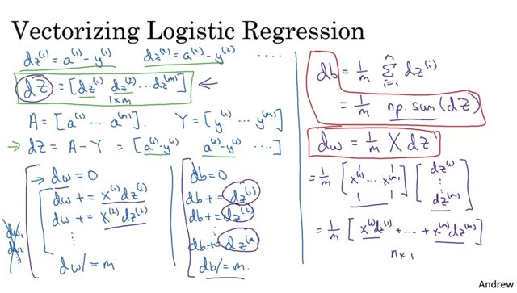</kbd>

    > QUAN TRỌNG

     

    
    
<kbd>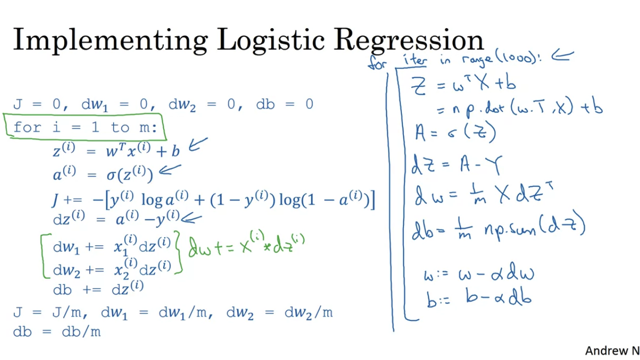</kbd>

    > Now, I know I said that we should get rid of explicit for loops whenever
> you can but if you want to implement multiple iterations as a gradient
>  descent then \/**you still need a for loop over the number of
>  iterations**\/. So, if you want to have a thousand iterations of gradient
> descent, you might still need a for loop over the iteration
> number. \/**There is an outermost for loop like that then I don't think there
> is any way to get rid of that for loop**\/
>
>
> Còn cái for loop iteration để update w, b thì không thể có cách nào
> bỏ được vì cơ chế của Gradient Descent phải vậy

     

    
    
<kbd>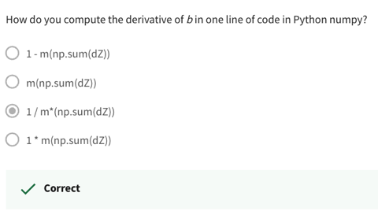</kbd>

     

### Broadcasting In Python

 

- 1 Broadcasting is a technique to make Python code run faster.  2 Broadcasting allows performing operations between arrays with different shapes.  3 In the video, broadcasting is explained using an example of calculating the percentage of calories from carbs, proteins, and fats in 100 grams of four different foods.  4 Broadcasting can be used to sum down columns of a matrix and divide each column by their corresponding sum without using an explicit for-loop.  5 The video demonstrates how to sum vertically using axis 0, which sums down the columns, and how to reshape a matrix.  6 The reshape command is a constant time operation and can be used to ensure that matrices have the correct size.  7 The video explains how broadcasting works, and provides examples of adding a 4 by 1 vector to a number and multiplying a 4 by 3 matrix by a 1 by 3 matrix.
   

    
    
<kbd>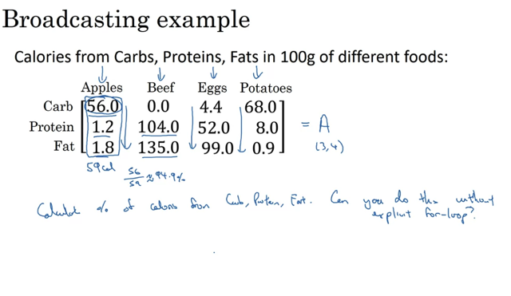</kbd>

     

    
    
<kbd>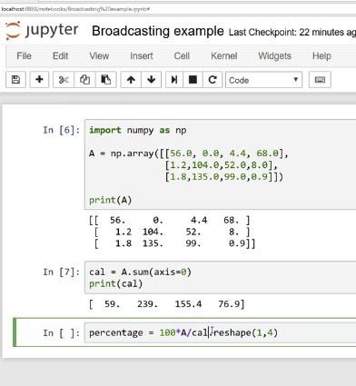</kbd>

    > A.sum(axis = 0) => Sum vertically

     

    
    
<kbd>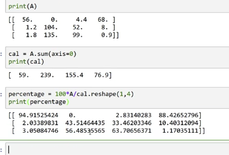</kbd>

     

    
    
<kbd>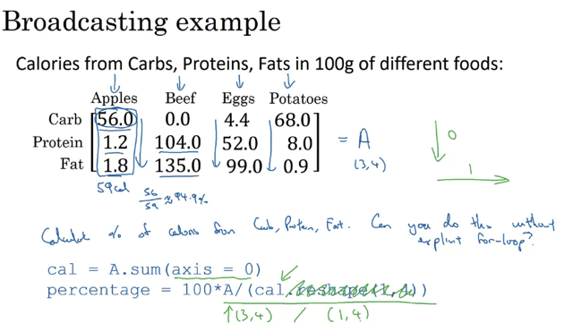</kbd>

    > 'Cal' vốn dĩ đã là 1x4 rồi nhưng ổng
> nói thêm lệnh reshape cho  chắc ăn
> không sao cả.

     

    
    
<kbd>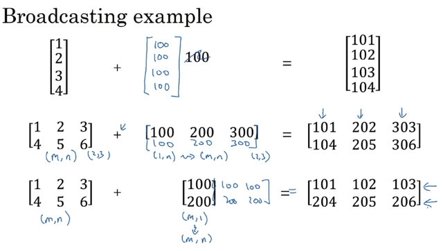</kbd>

     

    
    
<kbd>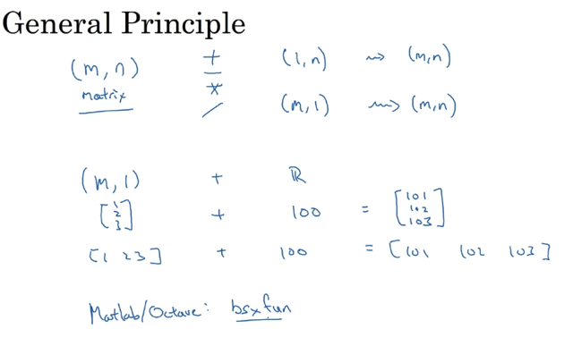</kbd>

    > Trong Octave/Matlab bsxfun làm việc tương tự

     

### A Note On Python/ Numpy Vectors

 

- 1 Python numpy's broadcasting operations and flexibility are both strengths and weaknesses of the programming language.  2 Broadcasting and flexibility can cause subtle and strange bugs in the code if not used correctly.  3 The rank 1 array in Python numpy is a funny data structure that behaves inconsistently as either a row vector or a column vector, making it nonintuitive.  4 It is recommended to use (n, 1) or (1, n) arrays to ensure consistent behavior.  5 Assertion statements can be used to check the dimensions of arrays and ensure consistent behavior.  6 Reshaping rank 1 arrays can also ensure consistent behavior.
   

    
    
<kbd></kbd>

    > Rank 1 array - 1-Dimensional array behave rất kì cục (ex.
> a.T cũng y nguyên), ko phải row vector cũng ko phải
> column vector.

     

    
    
<kbd></kbd>

    > Nên luôn luôn defin Rank 2 array

     

    
    
<kbd></kbd>

    > 1. Đừng dùng Rank 1 array, dùng Rank 2
>
> 2.Đừng ngại reshape để chắc chắn mình đang có shape 
> mong muốn
>
> 3.Dùng Assert để báo lỗi khi shape ko đúng

     

    
    
<kbd></kbd>

     

### Quick Tour Notebook

 

- ...
   

    
    
<kbd></kbd>

    > Có issue gì thì Restart Kernel

     

### Logistic Regression Cost Function

 

- 1 In this optional video, the speaker justifies the use of the cost function for logistic regression that was introduced in an earlier video.  2 In logistic regression, the prediction y hat is the sigmoid of w transpose x + b, where sigmoid is a familiar function. The goal is to interpret y hat as the probability that y=1 given x.  3 The chance that y=1 given x is y hat, and the chance that y=0 given x is 1- y hat.  4 These two equations can be summarized into a single equation: (y hat ^ y )(1- y hat)^(1-y) for y=0 or 1. This equation is a correct definition for p(y|x).  5 Because the log function is a strictly monotonically increasing function, maximizing log p(y|x) gives a similar result as optimizing p(y|x).  6 The loss function for a single example is -[y log y hat + (1-y) log (1- y hat)].  7 The cost function for the entire training set is the negative sum of the loss function over all m examples. This is derived using the principle of maximum likelihood estimation, which means choosing the parameters that maximize the probability of the observations in the training set.
   

    
    
<kbd></kbd>

    > Notation: IID = I**dentically Independently Distributed**
> IID là viết tắt của "Independent and Identically Distributed". Nó có 
> nghĩa là một tập hợp các biến ngẫu nhiên độc lập với nhau và có 
> phân bố (tức các xác suất xuất hiện của các giá trị của biến) giống 
> nhau. Điều này có nghĩa là mỗi biến ngẫu nhiên trong tập hợp này 
> không bị ảnh hưởng bởi biến khác và tất cả chúng có cùng một 
> phân bố xác suất.

    > "Now, finally, because the log function is a strictly monotonically 
> increasing function, your maximizing log p(y|x) should give you 
> a similar result as optimizing p(y|x)."
>
> ChatGPT: The statement is referring to the use of logarithmic functions in 
> machine learning and how they can affect optimization. A log function
>  is a mathematical function that takes a positive real number as input 
> and returns its logarithm to the base of a specified number. In this 
> context, \_\/**"strictly monotonically increasing"\_ means that as the input to
>  the log function increases, its output also increases and does so in a 
> consistent, one-to-one relationship.**\/
>
> Therefore, maximizing the logarithm of the conditional probability 
> p(y|x) (the probability of observing a target variable y given a feature 
> x) should give similar results as optimizing p(y|x) directly. \/**This is 
> because the log function preserves the ordering of the original values
>  and allows for optimization in log-space, which can often be 
> computationally easier and faster.**\/

     

    
    
<kbd></kbd>

    > **Maximum likelihood estimation** is like when you are trying to guess
>  what the best answer is to a question.
> Imagine you have a big jar of candy, and you have to guess how many
>  candies are inside.
> You might start by making a guess, like 50. Then, your friend would tell 
> you if your guess is too high or too low.
> You would keep adjusting your guess until you get as close as 
> possible to the correct answer.
> In the same way, maximum likelihood estimation is a way for a 
> computer to make its best guess about something, by using all the 
> information it has, and constantly adjusting its guess until it gets as 
> close as possible to the correct answer.

     

## Quiz: Neural Network Basic

 

<kbd></kbd>

 

<kbd></kbd>

 

<kbd></kbd>

 

<kbd></kbd>

 

<kbd></kbd>

 

<kbd></kbd>

 

<kbd></kbd>

 

<kbd></kbd>

 

<kbd></kbd>

 

<kbd></kbd>

 

## Programming Assignment

 

### Some Notes

 

  
  
<kbd></kbd>

   

  
  
<kbd></kbd>

   

  
  
<kbd></kbd>

   

  
  
<kbd></kbd>

   

  
  
<kbd></kbd>

   

  
  
<kbd></kbd>

   

### Python Basic With Numpy

 

  
  
<kbd></kbd>

   

  
  
<kbd></kbd>

   

  
  
<kbd></kbd>

   

  
  
<kbd></kbd>

   

  
  
<kbd></kbd>

   

  
  
<kbd></kbd>

   

  
  
<kbd></kbd>

   

  
  
<kbd></kbd>

   

  
  
<kbd></kbd>

  
<kbd></kbd>

  
<kbd></kbd>

   

  
  
<kbd></kbd>

   

  
  
<kbd></kbd>

   

  
  
<kbd></kbd>

   

  
  
<kbd></kbd>

   

  
  
<kbd></kbd>

  > "This is a 3 by 3 by 2 array, typically images will be (num_px_x, num_px_y,3)
> where 3 represents the RGB values"
>
> Đây là một ma trận 3 x 3 x 2, thông thường hình ảnh sẽ có dạng (num_px_x,
> num_px_y, 3) trong đó 3 biểu diễn cho các giá trị RGB.  RGB là một mô hình
> màu sắc mà sử dụng 3 giá trị rời rạc để biểu  diễn một màu sắc cụ thể.
> num_px_x và num_px_y là chiều rộng  và chiều cao của hình ảnh.

   

  
  
<kbd></kbd>

  > Cái này là 2 colors channels image

   

  
  
<kbd></kbd>

   

  
  
<kbd></kbd>

   

  
  
<kbd></kbd>

   

  
  
<kbd></kbd>

   

  
  
<kbd></kbd>

   

  
  
<kbd></kbd>

   

  
  
<kbd></kbd>

   

  
  
<kbd></kbd>

   

  
  
<kbd></kbd>

   

  
  
<kbd></kbd>

  
<kbd></kbd>

  
<kbd></kbd>

   

  
  
<kbd></kbd>

   

  
  
<kbd></kbd>

   

  
  
<kbd></kbd>

   

  
  
<kbd></kbd>

   

  
  
<kbd></kbd>

   

  
  
<kbd></kbd>

   

  
  
<kbd></kbd>

   

  
  
<kbd></kbd>

  > * or np.multiply() = . * in Matlab

   

  
  
<kbd></kbd>

   

  
  
<kbd></kbd>

  > Nếu để keepdims = True thì bị lỗi tại Loss expect a float.

   

  
  
<kbd></kbd>

   

  
  
<kbd></kbd>

   

  
  
<kbd></kbd>

   

  
  
<kbd></kbd>

  > So sánh function .dot() khi input là vector (1D array) và matrix (2D array)

   

- Grade
   

    
    
<kbd></kbd>

     

### Logistic Regression With A Neural Network Mindset

> [!NOTE]
> Build a logistic regression classifier to recognize cats.  This
> assignment will step you through how to do this with a
> Neural Network mindset, and will also hone your intuitions
> about deep learning.

 

  
  
<kbd></kbd>

   

  
  
<kbd></kbd>

   

  
  
<kbd></kbd>

   

  
  
<kbd></kbd>

   

- mpl.imshow()
   

    
    
<kbd></kbd>

     

    
    
<kbd></kbd>

     

    
    
<kbd></kbd>

     

    
    
<kbd></kbd>

     

  
  
<kbd></kbd>

  > Hàm reshape cứ nhớ là nếu cho cái dimension = -1 thì đại khái
> là bảo Python tự tính.

   

  
  
<kbd></kbd>

   

  
  
<kbd></kbd>

  > Trong ví dụ dưới u.shape là 2x3x2 nên khi 
> reshape(u.shape[0], -1) hay reshape(u.shape[2], -1) thì cũng 
> như nhau vì đều là reshape(2, -1). 
> Có nghĩa là ta bảo nó làm sao có 2 row, còn lại số column 
> bao nhiêu thì tự tính.
>
> Vả nếu nó tính ko ra được (đại khái là nó không chia element 
> đều ra được thì nó sẽ báo lỗi)
> Ví dụ có 12 unit (2x3x2) mà reshape(5,-1) thì nó sẽ lỗi vì 12 cái 
> mà muốn sắp thành 5 hàng thì ko chẵn.
> Nhưng reshape(6,-1) thì ok => 6x2

   

  
  
<kbd></kbd>

   

  
  
<kbd></kbd>

   

  
  
<kbd></kbd>

   

  
  
<kbd></kbd>

   

  
  
<kbd></kbd>

   

  
  
<kbd></kbd>

  
<kbd></kbd>

  
<kbd></kbd>

  > Vì hàm np.exp() accept vector or matrix -> dùng nó
> trong hàm sigmoid cũng sẽ accept vector . matrix

   

  
  
<kbd></kbd>

  > Nếu define b = 0 -> b sẽ là int

   

  
  
<kbd></kbd>

   

  
  
<kbd></kbd>

   

  
  
<kbd></kbd>

  > Chỉ có hơi rắc rối chưa quen dùng hàm **np.dot
>
> Và khác với Khoá ML cũ, X define dạng n x m 
> (chứ không phải m x n) nên lấy m = X.shape[1]**

   

  
  
<kbd></kbd>

   

  
  
<kbd></kbd>

   

  
  
<kbd></kbd>

   

  
  
<kbd></kbd>

   

- hàm np.dot()
   

    
    
<kbd></kbd>

    > np.dot()
>
> 2 Matrix thì tuân thủ quy tắc size matrix

     

    
    
<kbd></kbd>

    > (2x3) không thể .dot với (2x3)

     

    
    
<kbd></kbd>

    > np.dot()
>
> 2 1D array thì + lại.

     

    
    
<kbd></kbd>

    > np.dot()
>
> 1D array với Matrix cột thì được, coi matrix cột như 1D array

     

  
  
<kbd></kbd>

   

  
  
<kbd></kbd>

   

  
  
<kbd></kbd>

   

  
  
<kbd></kbd>

  > **CHÚ Ý BƯỚC NÀY**w = w.reshape(X.shape[0], 1) **LÀ ĐỂ CHẮC CHẮN
> W CÓ SHAPE MONG MUỐN
>
> Trong lecture ổng có nhấn mạnh đừng ngại reshape để đảm bảo shape
> đúng**

   

  
  
<kbd></kbd>

   

  
  
<kbd></kbd>

   

  
  
<kbd></kbd>

   

  
  
<kbd></kbd>

   

  
  
<kbd></kbd>

   

  
  
<kbd></kbd>

  > **optimize(...X_train, Y_train,...) mới đúng, chứ với X, Y là sai**

   

  
  
<kbd></kbd>

  > **Comment**: Training accuracy is close to 100%. 
> This is a **good** sanity check: your model is working and has high 
> enough capacity to fit the training data. 
> Test accuracy is **70%. It is actually not bad for this simple model,** 
> given the small dataset we used and that logistic regression is a 
> linear classifier. But no worries, you'll build an even better classifier 
> next week!
> Also, you see that the model is **clearly overfitting** the training data. 
> Later in this specialization you will learn how to reduce overfitting, 
> for example by using **regularization**.

   

  
  
<kbd></kbd>

   

  
  
<kbd></kbd>

   

  
  
<kbd></kbd>

  > **Thử với các learning rate khác nhau**

   

  
  
<kbd></kbd>

  
<kbd></kbd>

  
<kbd></kbd>

   

  
  
<kbd></kbd>

   

  
  
<kbd></kbd>

   

