# C1w3_shalow Neural Networks

📊 **Progress:** `27` Notes | `94` Screenshots

---

**Learning Objectives**
 • Describe hidden units and hidden layers
 • Use units with a non-linear activation function, such as tanh
 • Implement forward and backward propagation
 • Apply random initialization to your neural network
 • Increase fluency in Deep Learning notations and Neural Network Representations
 • Implement a 2-class classification neural network with a single hidden layer
 • Compute the cross entropy loss

## Neural Networks Overview

 

### 1 Overview of the week's topic: The speaker provides an introduction to the topic of

> [!NOTE]
> 1 Overview of the week's topic: The speaker provides an introduction to the topic of
> implementing a neural network.
>
> 2 Recap of logistic regression: The speaker briefly recaps the logistic regression model, which
> involves computing a z-value based on input features x and parameters w and b, then using a
> sigmoid function to calculate the output value a or y-hat, which is used to compute the loss
> function L.
>
> 3 Neural network structure: The speaker introduces the structure of a neural network, which
> involves stacking together many sigmoid units. Each node in the network involves two
> calculations: a z-like calculation and an a-like calculation. The network is composed of layers,
> with superscript square brackets used to refer to quantities associated with each layer.
>
> 4 Calculation of z and a: The speaker explains that the network starts by computing z1 based on
> input features x, then computes a1 as the sigmoid of z1. The process is repeated to compute z2
> and a2, which is the final output of the neural network and is also referred to as y-hat.
>
> 5 Backward calculation: The speaker notes that the network requires a backward calculation in
> order to compute derivatives and make updates to the parameters w and b. This calculation
> involves computing da2, dz2, dw2, and db2 in a right-to-left manner.
>
> 6 Key takeaway: The speaker emphasizes that a neural network is essentially an extension of
> logistic regression, where the z and a calculations are repeated multiple times. The notation and
> details can be complex, but they will be further explained in upcoming videos.

 

  
  
<kbd>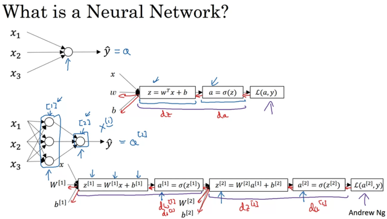</kbd>

   

## Neural Network Representation

 

### 1 Explanation of a two-layer neural network with multiple hidden units

> [!NOTE]
> 1 Explanation of a two-layer neural network with multiple hidden units
>
> 2 The neural network computes the output in the same way as logistic
> regression but repeatedly
>
> 3 Each node in the hidden layer of the neural network performs two
> steps of computation
>
> 4 The first step is the computation of z = w transpose x + b
>
> 5 The second step is the computation of a = sigmoid(z)
>
> 6 The notation used in the computation of a and z
>
> 7 Explanation of the first and second hidden units in the neural
> network
>
> 8 The process of vectorizing the computation for efficiency
>
> 9 The matrix of weight vectors and input features multiplied to get z
>
> 10 Adding the bias vector to z
>
> 11 The outcome of the computation corresponds to the values of z for
> each hidden unit.
>
> 12 The vector is called the vector of activations.

> [!NOTE]
> 1 In the last video, a single hidden layer neural network was introduced.
>  2 In this video, the details of how this neural network computes its outputs are explained.
>  3 The neural network's computation process is similar to logistic regression, but repeated many times.
>  4 A two-layer neural network is shown, and its computation process is explained in depth.
>  5 Logistic regression has two steps of computation: first, it computes z as follows, and then it computes the activation as a sigmoid function of z.
>  6 A neural network follows the same two steps of computation, but it repeats these steps many times.
>  7 Focusing on one of the nodes in the hidden layer, we see that it has two steps of computation: first, it computes z = w^T x + b, and second, it computes a = sigmoid(z).
>  8 Notational conventions are used to refer to different layers and nodes in the neural network, with l referring to the layer number and i referring to the node number.
>  9 The computation for the second node in the hidden layer is similar, but with different parameters.
>  10 The computation for additional hidden layer nodes is also similar, and the corresponding equations are derived and shown on the next slide.
>  11 The equations for computing z can be vectorized, which is more efficient than using a for loop.
>  12 The parameter vectors w for each logistic regression unit can be stacked together to form a matrix, and then multiplied by the input features x to compute z as a vector.
>  13 The bias terms b for each node in the hidden layer can also be added as a vector to compute z.
>  14 The resulting vector of z values corresponds exactly to the z values computed for each node in the hidden layer.
>  15 This vector of z values is denoted as z_1, and it is a key intermediate result in the computation process of the neural network.

 

  
  
<kbd>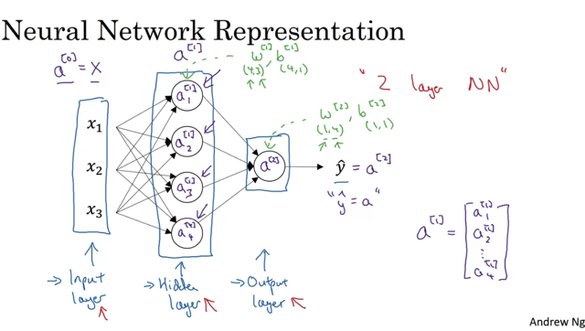</kbd>

   

## Computing A Neural Network's Output

 

### 1 The video provides justification for the vectorized implementation for

> [!NOTE]
> 1 The video provides justification for the vectorized implementation for
> propagation through a neural network by considering the forward propagation
> calculation for a few examples.
>
> 2 The matrix X is formed by stacking together all of the training examples, and
> when this matrix is multiplied by W, the resulting matrix contains the
> corresponding outputs stacked up in columns.
>
> 3 The video recapitulates the steps for implementing forward propagation for
> one training example at a time and then shows how to vectorize it across all
> training examples at the same time.
>
> 4 The video also highlights the symmetry in the equations for the different
> layers of the neural network and how deeper neural networks repeat the same
> computation even more times.
>
> 5 Finally, the video notes that sigmoid functions are not always the best choice
> for neural networks and hints at the topic of the next video, which will explore
> using different activation functions.

> [!NOTE]
> Sure! In this video, we dive deeper into the implementation of vectorizing neural networks across multiple training examples. We start by justifying the correctness of the equations we wrote down in the previous video for vectorizing neural networks.
> To do this, we consider the forward propagation calculation for a few examples, where we compute the product of the weight matrix w1 and the input feature vectors x1, x2, and x3, resulting in the output vectors z12, z12, and z13. We stack these input feature vectors vertically to form the matrix X and compute X times w1, resulting in a matrix Z1 where each column corresponds to the output vectors z12, z12, and z13.
> We then show that stacking the training examples in columns and computing matrix multiplication allows us to vectorize the first step of forward propagation, i.e., z1 = w1x + b1, across all m training examples simultaneously. We also show that a similar analysis allows us to vectorize all four steps of forward propagation.
> We then recap the process of vectorizing neural networks across multiple training examples and highlight the symmetry between the first and second pairs of equations. This symmetry shows that the different layers of a neural network are roughly doing the same thing or just doing the same computation over and over.
> Finally, we discuss the limitations of using sigmoid functions throughout our neural networks and introduce the concept of activation functions. We explain that different activation functions can be used in different layers of a neural network and that choosing the right activation function is important for achieving good performance. In the next video, we will dive deeper into different types of activation functions and how to choose the right one for your neural network.

 

  
  
<kbd>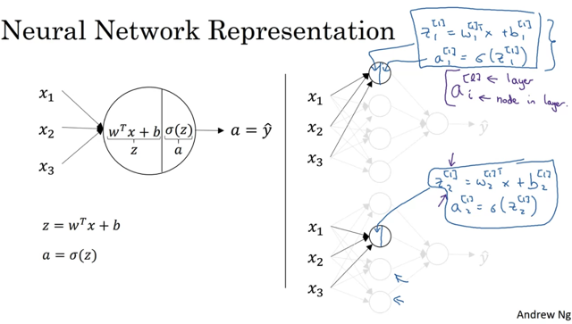</kbd>

   

  
  
<kbd>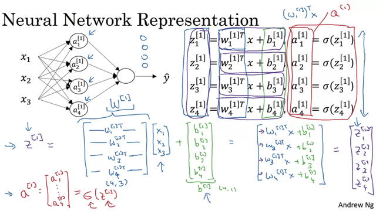</kbd>

   

  
  
<kbd>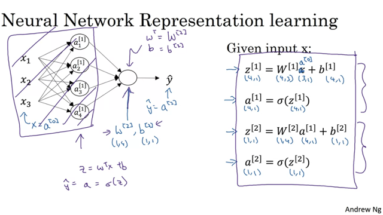</kbd>

   

## Vectorizing Across Multiple

 

### 1 To compute the prediction on a neural network for multiple training

> [!NOTE]
> 1 To compute the prediction on a neural network for multiple training
> examples, you need to vectorize the computation process.
>
> 2 To do this, you need to repeat the process for each training example,
> using the activation function notation a\\_2\\_.
>
> 3 To get rid of the repetition, you can stack the training examples in
> columns to create a matrix X.
>
> 4 You can then compute the value of the different variables, Z[1], A[1],
> Z[2], and A[2], using the matrix X, and the weights W and biases b.
>
> 5 By stacking the vectors in columns for Z[1], A[1], Z[2], and A[2], you
> can create the matrices Z[1], A[1], Z[2], and A[2], respectively.
>
> 6 Vectorizing the computation process allows you to compute the
> predictions of all your training examples at the same time.

> [!NOTE]
> 1 In the last video, we learned how to compute the prediction on a neural network for a single training example.
>  2 In this video, we learn how to vectorize across multiple training examples in a similar way to logistic regression.
>  3 To do this, we stack up different training examples in different columns of a matrix, and use the same equations as before with slight modifications to make the neural network compute the outputs on all the examples at the same time.
>  4 The equations we use to compute z1, a1, z2, and a2 for a single training example are the same as before, but with a superscript round bracket i added to all variables that depend on the training example.
>  5 To compute the predictions of all the training examples with an unvectorized implementation, we use a for loop to implement the four equations for each training example.
>  6 To vectorize the computation, we need to compute Z[1] = W[1] X + b[1], A[1] = sigma of Z[1], Z[2] = W[2] A[1] + b[2], and A[2] = sigma point of Z[2].
>  7 We define the matrix X to be equal to our training examples stacked up in columns and use this matrix to compute the output of the neural network for all training examples.
>  8 We stack the column vectors of z[1], a[1], z[2], and a[2] for each training example in columns to get the matrices Z[1], A[1], Z[2], and A[2] that allow us to compute the output of the neural network for all training examples.
>  9 The notation used in this course is designed to make vectorization steps as easy as possible and to help students implement these algorithms correctly.

 

  
  
<kbd>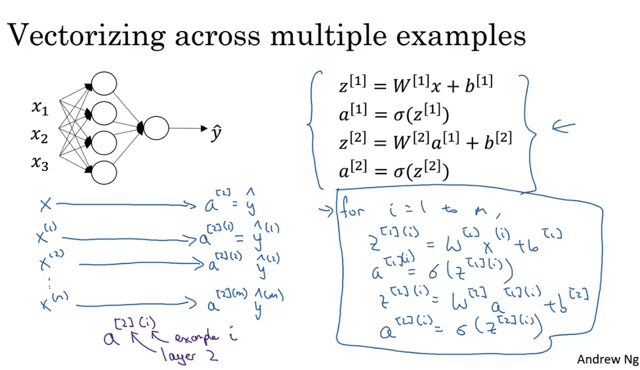</kbd>

   

  
  
<kbd>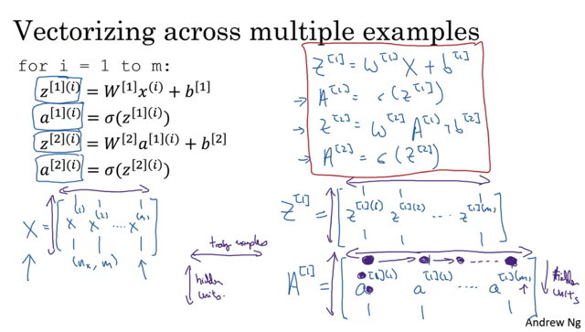</kbd>

   

## Explanation For Vectorized Implementation

 

### Main ideas:  1 The previous video discussed the vectorized implementation of neural

> [!NOTE]
> Main ideas:  1 The previous video discussed the vectorized implementation of neural
> network propagation through training examples horizontally stacked in the matrix x.
>
> 2 The justification for the correctness of the equations was explained by going
> through part of the forward propagation calculation for a few examples.
>
> 3 The training set X is formed by vertically stacking the vectors x1, x2, etc. and
> multiplying it by w gives the corresponding z values, which are also vertically stacked
> in matrix capital Z1.
>
> 4 Python broadcasting allows adding the bias term b to the values while maintaining
> the correct values.
>
> 5 Similar reasoning can be used to show that all four steps of the forward
> propagation calculation work.
>
> 6 Recap of the four steps of forward propagation and how they can be vectorized
> across multiple training examples using stacked matrices.
>
> 7 The symmetry between the equations for z1 and a1 and z2 and a2 shows that the
> different layers of a neural network are doing the same computation.
>
> 8 Next, the video will discuss why the sigmoid function is not the best choice for
> neural networks.

> [!NOTE]
> 1 Vectorization of neural network training:
>  2 The video discusses how to use vectorization to speed up the training of a neural network. To do this, we stack the training examples horizontally in a matrix called X. We then derive a vectorized implementation for propagating through the neural network. This involves multiplying the input matrix X with the weight matrix W and adding the bias term b. By stacking the resulting column vectors for each training example, we can calculate the output for all training examples at once.
>  3 Justification for vectorization:
>  4 The video provides further justification for why the equations used in the vectorization implementation are correct. It walks through part of the forward propagation calculation for a few examples, ignoring the bias term for simplicity. By multiplying the weight matrix with each input column vector, we can derive the corresponding output column vectors. Stacking these output column vectors for each example in the input matrix X gives us the full output matrix Z. The video shows that this line of code: z1 = w1x + b1, is a correct vectorization of the first step of the forward propagation calculation for one training example.
>  5 Recap of vectorization:
>  6 The video then recaps the previous steps and explains how we can vectorize the entire neural network for all training examples. We stack up the training examples in columns and stack up the corresponding output column vectors for each layer of the network. By doing this, we can use matrix multiplication to calculate the output for all training examples at once. The video shows that all four lines of the forward propagation calculation can be vectorized in a similar way.
>  7 Symmetry of the equations:
>  8 The video points out that there is a certain symmetry to the equations used in the vectorized implementation. Because the input feature vector x is equal to a0, the first equation can also be written as z1 = w1a0 + b1. This symmetry shows that the different layers of a neural network are essentially doing the same thing, just with different inputs and weights.
>  9 Using different activation functions:
>  10 Finally, the video notes that we have been using sigmoid functions throughout the neural network so far, but that this is not always the best choice. The next video will discuss how to use different activation functions, including ReLU and softmax.

 

  
  
<kbd>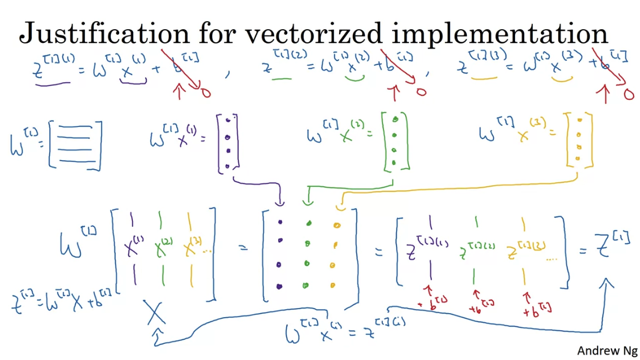</kbd>

   

  
  
<kbd>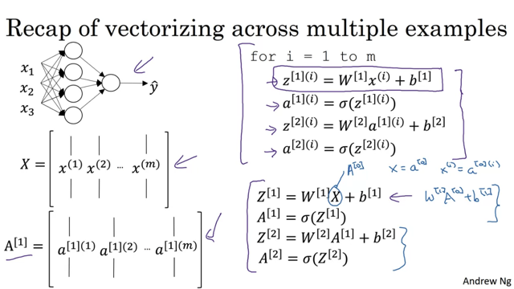</kbd>

> [!NOTE]
> **ĐẠI KHÁI LÀ CHỈ CÓ VẬY THÔI, MORE DEEPLY N.N CŨNG CHỈ 
> LÀ LẶP LẠI NHIỀU LẦN NHỮNG PHÉP TÍNH KIỂU NÀY.**
>
> So this kind of shows that the different layers of a neural network
> are roughly doing the same thing or just doing the same
> computation  over and over. And here we have two-layer neural
> network where we  go to a much deeper neural network in next
> week's videos. You see  that \/**even deeper neural networks are
> basically taking these two steps and just doing them even more
> times**\/than you're seeing here

   

## Activation Functions

 

### Main ideas:  1 Choice of activation function is an important decision when

> [!NOTE]
> Main ideas:  1 Choice of activation function is an important decision when
> building a neural network.
>
> 2 The sigmoid function is commonly used but there are other options that can
> work better.
>
> 3 The hyperbolic tangent (tan h) function is often a better choice for hidden
> layers.
>
> 4 The mean of activations using tan h is closer to zero, making learning easier.
>
> 5 The sigmoid function is useful for binary classification output layers.
>
> 6 The rectified linear unit (ReLU) and Leaky ReLU are popular choices for
> hidden layers.
>
> 7 The ReLU and Leaky ReLU have advantages over sigmoid and tan h
> functions.
>
> 8 Choosing an activation function depends on the specific task and the
> individual preferences of the user.

> [!NOTE]
> Sure, here's a more detailed answer, indexed for clarity:
>  1 When building a neural network, one of the choices you need to make is the activation function to use in the hidden layers and at the output units.
>  2 The sigmoid activation function is commonly used, but other options may work better in some cases.
>  3 In general, we can use a nonlinear function g(z) as an activation function. The sigmoid function goes between zero and one, while the hyperbolic tangent function (tanh) goes between +1 and -1.
>  4 The tanh function is often preferred over the sigmoid function for hidden units because the mean of the activations that come out of the hidden layer is closer to having a zero mean. This makes learning for the next layer a little bit easier. However, the sigmoid function may be used for the output layer in binary classification tasks, where y is either zero or one and y hat should be between zero and one.
>  5 The activation functions can be different for different layers, and sometimes square brackets superscripts are used to denote that the activation functions are different for different layers.
>  6 One downside of both the sigmoid function and the tanh function is that if z is either very large or very small, then the slope of the function becomes very small, which can slow down gradient descent.
>  7 The rectified linear unit (ReLU) is a popular choice in machine learning, where a = max(0,z). The derivative is one when z is positive and zero when z is negative, except when z is exactly zero (in which case the derivative is not well defined, but it usually works just fine in practice).
>  8 The ReLU is increasingly the default choice of activation function for hidden units. However, the Leaky ReLU, which has a slight slope when z is negative, may work better than the ReLU in some cases.
>  9 If the output is a zero-one value (e.g., in binary classification), the sigmoid activation function is a natural choice for the output layer.
>  10 In general, the ReLU or Leaky ReLU activation functions are good choices for hidden units.

 

  
  
<kbd>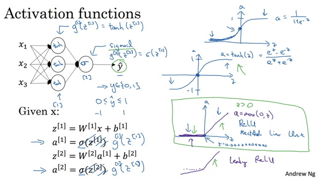</kbd>

> [!NOTE]
> - Hàm **tanh** tốt hơn sigmoid vì nó đại khái là 'center' hơn, kiểu 
> như quay quay 0 thay vì 0.5 như sigmoid giúp g.d chạy nhanh 
> hơn kiểu kiểu như tại sao ',mean normalization' giúp g.d chạy 
> nhanh hơn vậy.
>
> - Do đó hàm **sigmoid** ít dùng nữa trừ việc dùng cho output là a 
> binary classification vì tự nhiên sigmoid sẽ phù hợp hơn khi 
> xuất ra giá trị P trong khoảng (0,1)
>
> - Hidden layer: **Relu, Leaky Relu** or Tanh trong đó:
> **Cứ default Relu, còn thích cứ thử Leaky Relu** 
>
> - Tại sao Relu tốt hơn thì:
> Đại khái là hàm Relu hay Leaky Relu có **'derivative' ít bị bằng
> 0**hơn (Nhìn vào đồ thị hàm sigmoid và Tanh có 2 đầu đi 
> ngang - hoặc gần ngang 
> -> Đạo hàm bằng 0) 
> -> Làm chậm quá trình gradient descent

   

  
  
<kbd>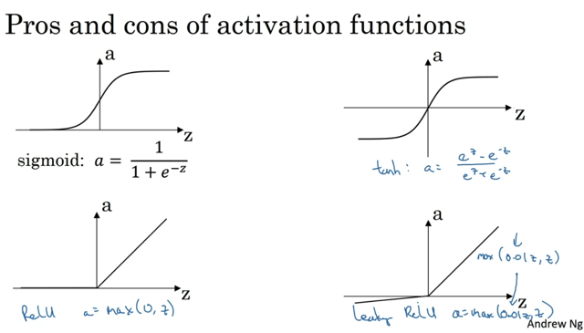</kbd>

   

  
  
<kbd>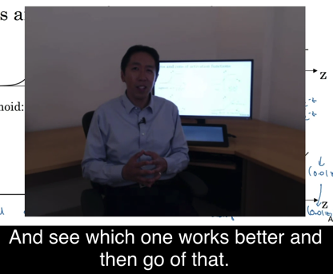</kbd>

> [!NOTE]
> Đại khái là khi làm thực tế có nhiều lúc ko biết chọn bao
> nhiêu layer, bao nhiêu unit, dùng activation function, initializa
> như thế nào ...thì nếu thấy không  chắc biết dùng cái nào
> thay vì cái nào thì **cứ thử hết và dùng CV set để so sánh kết
> quả**. Khi đó mình sẽ có 1 cảm giác / cảm nhận về 'evolution'
> của algorithm thay vì cứ nhắm mắt nghe theo lời khuyên nên
> dùng hàm Relu hay gì gì vì có thể nó không đúng với trường
> hợp cụ thể của mình

   

## Why Do You Need Non-linear Activation Functions

 

### 1 A neural network needs a non-linear activation function to compute interesting functions.

> [!NOTE]
> 1 A neural network needs a non-linear activation function to compute interesting functions.
>
> 2 The linear activation function, which just outputs whatever was input, is not useful because
> the neural network outputs a linear function of the input.
>
> 3 Even in deep neural networks with many layers, if linear activation functions are used, the
> network is just computing a linear activation function and is therefore not computing more
> interesting functions.
>
> 4 One place where a linear activation function might be used is in the output layer for
> regression problems, where the output y-hat is a real number going anywhere from minus
> infinity to plus infinity.
>
> 5 However, in this case, the hidden units should not use activation functions or should use
> non-linear activation functions like ReLU or tanh.
>
> 6 Using a linear activation function in the hidden layer is extremely rare except for some
> special circumstances relating to compression.
>
> 7 The non-linear activation function is a critical part of neural networks because it allows for
> the computation of more interesting functions.
>
> 8 In the next video, the slope or the derivatives of individual activation functions will be
> discussed to set up for the discussion on gradient descent.

> [!NOTE]
> Sure, here's a more detailed answer with indexed main ideas:
> Topic: Why does a neural network need a non-linear activation function?
>  1 A neural network needs a non-linear activation function to compute interesting functions.
>  2 The four prop equations for the neural network are:
>  • a(1) = g(z(1)) = g(W(1)x + b)
>  • z(2) = a(2) = g(W(2)a(1) + b)
>  • L(a(2),y) = 1/2(a(2) - y)^2
>  • J(W,b) = 1/m ∑L(a(2),y)
>  3 It's possible to get rid of the activation function g and set a(1) = z(1) or g(z) = z. This is called the linear activation function, also known as the identity activation function because it just outputs whatever was input.
>  4 However, if a(2) is just equal to z(2), then the model is just computing y or y-hat as a linear function of the input features x.
>  5 A neural network with linear activation functions or no activation function is just outputting a linear function of the input. This means that no matter how many layers the network has, it's still just computing a linear activation function, so it might as well not have any hidden layers.
>  6 If you use a linear activation function in one layer and a sigmoid function in another, then the model is no more expressive than standard logistic regression without any hidden layer. A linear hidden layer is more or less useless because the composition of two linear functions is itself a linear function.
>  7 To compute more interesting functions, you need to throw a non-linear item in the network, such as a non-linear activation function.
>  8 The one place you might use a linear activation function is if you're doing machine learning on a regression problem where y is a real number, such as predicting housing prices. In this case, it might be okay to have a linear activation function in the output layer so that y-hat is also a real number.
>  9 However, the hidden units should not use the activation function, and instead, ReLU, tanh, Leaky ReLU, or another non-linear activation function can be used.
>  10 Using a linear activation function in the hidden layer is extremely rare, except for some special circumstances relating to compression.
>  11 To summarize, having a non-linear activation function is a critical part of neural networks, as it allows for the computation of more interesting functions.

 

  
  
<kbd>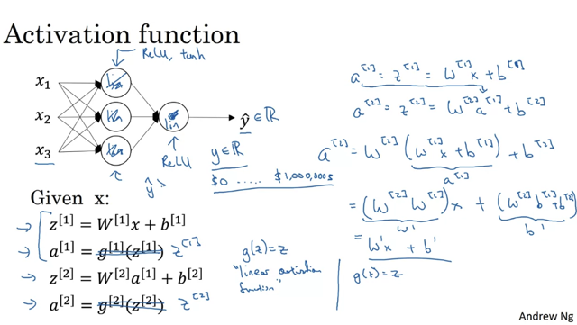</kbd>

> [!NOTE]
> 1. Linear apply to linear = linear, nên dùng cho hidden layer thì cũng 
> coi như không có hidden layer = không 'learn' thêm được
> Interesting feature nào.
>
> Trừ những trường hợp rất đặc biệt (rất hiếm) chứ ko dùng linear
> Function ở hidden layer
>
>  2. Trừ trường hợp output layer là regression (ví dụ predict
> House price) thì dùng linear function thôi.

   

## Derivatives Of Activation Functions

 

### Main ideas:  1 Backpropagation in neural networks requires

> [!NOTE]
> Main ideas:  1 Backpropagation in neural networks requires
> computing the slope or derivative of the activation functions.
>
> 2 Sigmoid activation function has a derivative formula of g(z) * (1 -
> g(z)).
>
> 3 The Tanh activation function has a derivative formula of 1 - a^2.
>
> 4 ReLU activation function has a derivative of 0 for z < 0 and 1 for z >
> 0.
>
> 5 Leaky ReLU activation function has a small positive slope for z < 0
> and a slope of 1 for z > 0.

 

  
  
<kbd>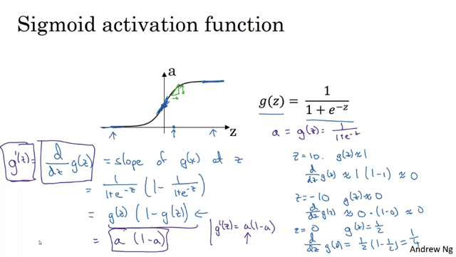</kbd>

   

  
  
<kbd>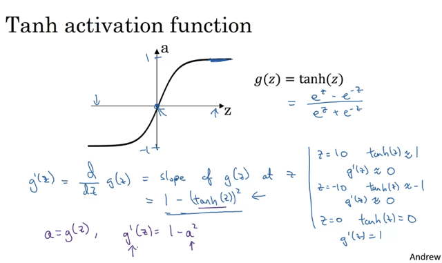</kbd>

> [!NOTE]
> But you can think of it as that, **the chance of z being exactly 0.
> 000000 Is so small** that it almost doesn't matter where you  set
> the derivative to be equal to when z is equal to 0

> [!NOTE]
> Finally, here's how you compute the derivatives for the ReLU and
> Leaky ReLU activation functions. For the value g of z is equal to
> max of (0,z), so the derivative is equal to, turns out to be 0 , if z is
> less than 0 and 1 if z is greater than 0. **It's actually undefined,
> technically undefined if z is equal to exactly 0.**

   

  
  
<kbd>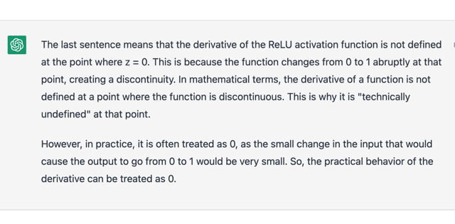</kbd>

> [!NOTE]
> Giải thích tại sao derivative của relu lại undefine tại  z = 0

   

  
  
<kbd>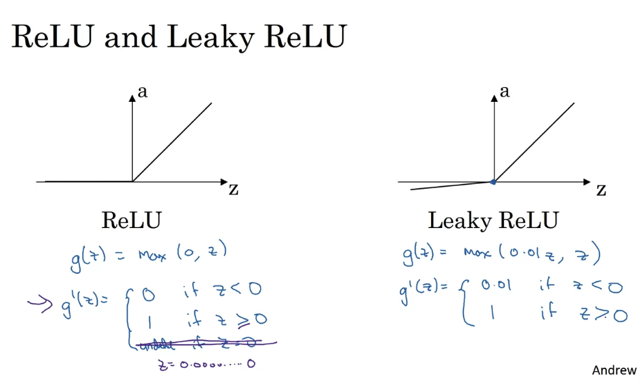</kbd>

   

## Gradient Descent For Neural Networks

 

### 1 Introduction to implementing gradient descent for neural network with

> [!NOTE]
> 1 Introduction to implementing gradient descent for neural network with
> one hidden layer.
>
> 2 Explanation of the parameters and dimensions for a neural network
> with a single hidden layer.
>
> 3 Cost function for binary classification and how to train the parameters
> using gradient descent.
>
> 4 Initialization of parameters and the importance of random initialization.
>
> 5 Derivatives of the cost function with respect to the parameters W1,
> B1, W2, and B2.
>
> 6 Forward propagation for computation of neural network outputs.
>
> 7 Back propagation for computing derivatives and updating the
> parameters using gradient descent.
>
> 8 Explanation of Python NumPy commands used to compute the
> derivatives.

> [!NOTE]
> Sure, I can provide a more detailed explanation of the main ideas in the text, using indexed style for clarity:
>  1 Introduction to implementing gradient descent for a neural network with one hidden layer: The author introduces the topic of implementing gradient descent for a neural network with one hidden layer, indicating that they will be providing the equations needed to implement back-propagation or gradient descent. They also mention that they will provide further intuition in a future video.
>  2 Neural network parameters and dimensions: The author provides an overview of the parameters and dimensions of a neural network with a single hidden layer, including the dimensions of the matrices W1, B1, W2, and B2, and the number of input features, hidden units, and output units.
>  3 Cost function for binary classification: The author assumes that the neural network is being used for binary classification and introduces the cost function for this case, which is the average of the loss function L over M examples.
>  4 Initializing parameters and computing predictions: The author discusses the importance of initializing parameters randomly and introduces the process of computing predictions for each example, followed by computing the derivatives of the cost function with respect to each parameter.
>  5 Gradient descent update: The author explains the gradient descent update formula for updating the parameters, including W1, B1, W2, and B2.
>  6 Forward propagation equations: The author provides the equations for forward propagation, including Z1 = W1X + B1, A1 = activation function applied element-wise to Z1, Z2 = W2A1 + B2, and A2 = G2(Z2), where G2 is the sigmoid function.
>  7 Computing derivatives using back propagation: The author introduces the back propagation step and provides the equations for computing the derivative of the cost function with respect to each parameter, including DZ2 = A2 - Y, DW2 = A1\/DZ2.T/M, DB2 = np.sum(DZ2, axis=1, keepdims=True)/M, DZ1 = W2.T\/DZ2\/G1'(Z1), DW1 = X\/DZ1.T/M, and DB1 = np.sum(DZ1, axis=1, keepdims=True)/M, where G1' is the derivative of the activation function used in the first hidden layer.
>  8 Summary of equations for forward and back propagation: The author summarizes the equations for forward and back propagation, emphasizing the key equations for computing the derivatives of the cost function with respect to the parameters, and notes that they will provide more detail on the derivation of these equations in a future video.
> Overall, the text provides a detailed explanation of the process of implementing gradient descent for a neural network with one hidden layer, including the key equations for forward and back propagation, and emphasizes the importance of properly initializing parameters and computing the derivatives of the cost function with respect to each parameter.

 

  
  
<kbd>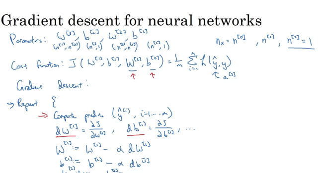</kbd>

   

  
  
<kbd>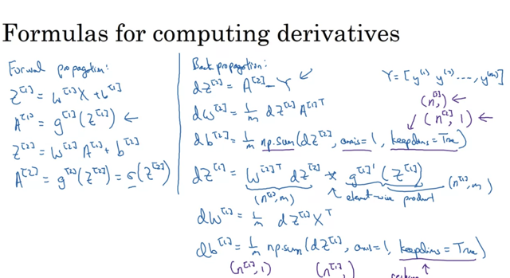</kbd>

   

## Backpropagation Intuition

 

### 1 The video explains the intuition for deriving the equations for backpropagation

> [!NOTE]
> 1 The video explains the intuition for deriving the equations for backpropagation
> using a computation graph.
>
> 2 The forward pass in logistic regression involves computing z, A, and A loss,
> while the backward pass involves computing da, dz, dw, and db.
>
> 3 The loss function for logistic regression is L(a, y) = -y log A - (1 - y) log(1 - A).
>
> 4 Da for logistic regression is equal to -y/A + (1 - y)/(1 - A).
>
> 5 Dz for logistic regression is equal to A - y, which is computed using the chain
> rule of calculus.
>
> 6 Dw for logistic regression is equal to dz times x, while db is equal to dz.
>
> 7 In a two-layer neural network, backpropagation computes da2, dz2, dw2, and
> db2, and then computes da1, dz1, dw1, and db1.
>
> 8 Da1 and dz1 are often collapsed into one step in practice.
>
> 9 Dz1 is computed as w2 transpose times dz2 times an element-wise product of
> g1 prime of z1.
>
> 10 The computation for dz2 is the same as for logistic regression, dz2 = a2 - y.
>
> 11 Dw2 is equal to dz2 times a1 transpose, and db2 is equal to dz2.
>
> 12 There is an extra transpose in dw2 compared to dw for logistic regression
> because a1 is a row vector while w2 is a column vector.

> [!NOTE]
> The video discussed the intuition behind back-propagation and the computation graph used to derive the back-propagation equations. The video also mentioned that this content was optional, and viewers can choose to watch it or not.
>  1 Computation Graph and Forward Pass:
>  2 The video started by briefly discussing logistic regression and the forward pass computation graph used to compute z, A, A_loss. It also mentioned the backward pass used to compute da, dz, dw, and db. The loss definition was also given as L(a,y) = -ylog(A) - (1-y)log(1-A).
>  3 Deriving the Equations for Back-Propagation:
>  4 The video then focused on how the equations for back-propagation were derived using the computation graph. It was explained that taking the derivative of the loss function with respect to A would give the formula for da, and that da = -y/A + (1-y)/(1-A). The chain rule of calculus was then used to compute dz, which is equal to da times g'(z), where g(z) is the sigmoid activation function used in logistic regression.
>  5 Back-Propagation for Neural Networks:
>  6 The video then introduced the concept of back-propagation for neural networks and discussed a two-layer neural network with input, hidden, and output layers. The computation graph was explained and it was shown how back-propagation would work for this network. The steps involved computing dz2, dw2, and db2 for the output layer, followed by computing dz1, dw1, and db1 for the hidden layer.
>  7 Steps for Computing dz1:
>  8 To compute dz1, we need to first compute da1. However, in practice, the computation for da1 and dz1 are usually collapsed into one step. To compute dz1, we use the equation dz1 = w2^T * dz2 * g1'(z1), where w2^T is the transpose of the weight matrix w2, g1'(z1) is the derivative of the activation function used for the hidden layer, and dz2 is the error in the output layer.
>  9 Differences between Back-Propagation for Logistic Regression and Neural Networks:
>  10 The video also highlighted some differences between back-propagation for logistic regression and neural networks. For example, the role of a1 in the neural network is similar to that of x in logistic regression. However, a1 is a column vector, while x is a row vector, which means there is an extra transpose involved when computing dw2.
> Overall, the video provides an intuitive explanation of back-propagation and how it works for neural networks. The viewer can use this understanding to implement back-propagation in their own neural network models.

 

  
  
<kbd>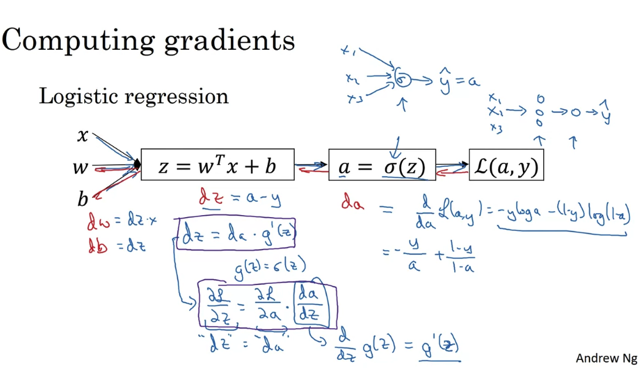</kbd>

   

  
  
<kbd>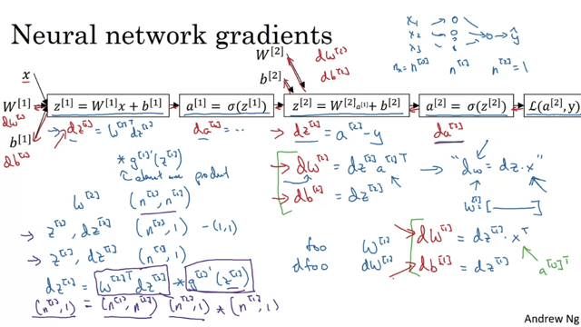</kbd>

> [!NOTE]
> One tip when implementing backprop, if you just make sure that the
> dimensions of your matrices match up, if you think through, what are the
> dimensions of your various matrices including w^1, w^2, z^1, z^2, a^1, a^2,
> and so on, and **just make sure that the dimensions of these matrix
> operations may match up**, sometimes that will **already eliminate quite a lot
> of bugs** in backprop

   

  
  
<kbd>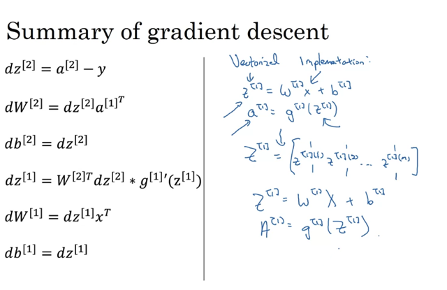</kbd>

   

  
  
<kbd>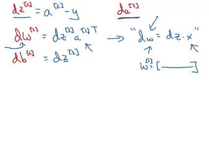</kbd>

> [!NOTE]
> Chỗ này nói trông giống của Logistic regression chỉ
> khác thêm cái  'transpose' là do W quan hệ với w theo
> kiểu W là matrix mà các  hàng là w.T .

> [!NOTE]
> This step is quite similar for logistic regression, where we
> had that  dw was equal to dz times x, except that now, a^1
> plays the role of  x, and there's an extra transpose there.
> Because the relationship  between the capital matrix
> W and our individual parameters w  was, there's a
> transpose there, because w is equal to a row vector.In the
> case of logistic regression with the single output, dw^2 is
> like  that, whereas w here was a column vector. That's why
> there's an extra  transpose for a^1, whereas we didn't for x
> here for logistic regression.

   

  
  
<kbd>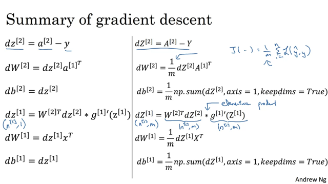</kbd>

   

## Random Initialization

 

### 1 When changing the neural network, it is important to initialize the weights

> [!NOTE]
> 1 When changing the neural network, it is important to initialize the weights
> randomly.
>
> 2 For logistic regression, initializing the weights to zero was okay, but it won't
> work for neural networks.
>
> 3 Initializing w to all zeros and then applying gradient descent creates
> symmetry between the hidden units.
>
> 4 Symmetry means that both hidden units are computing the same function
> and will remain symmetric after every iteration.
>
> 5 The solution is to initialize the parameters randomly.
>
> 6 You can use np.random.randn to generate a Gaussian random variable for
> w1, multiply it by a very small number, such as 0.01, and initialize b to zero.
>
> 7 The same applies to w2 and b2.
>
> 8 Initializing weights to very large values causes the activation function to be
> saturated, which slows down learning.
>
> 9 Multiplying by a small number, such as 0.01, is reasonable to avoid the
> saturation of the activation function.
>
> 10 Same goes for w2.

> [!NOTE]
> Sure, I'd be happy to provide a more detailed answer with indexed main ideas.
>  1 Why is it important to initialize weights randomly when changing a neural network?
>  2 When changing a neural network, it's important to initialize the weights randomly to avoid a symmetry breaking problem. If you initialize the weights to all zero and then apply gradient descent, it won't work, because every hidden unit will compute the same function, and no matter how long you train the neural network, all hidden units will still be computing the same function.
>  3 Why is it okay to initialize logistic regression weights to zero, but not neural network weights?
>  4 For logistic regression, it was okay to initialize the weights to zero. But for a neural network, it's not okay to initialize the weights to all zero.
>  5 How does initializing weights to all zero cause a symmetry breaking problem?
>  6 Initializing the weights to all zero causes a symmetry breaking problem because for any example given, every hidden unit will compute the same function. When computing backpropagation, both hidden units will initialize the same way, and after every single iteration of training, both hidden units will still be computing exactly the same function. Therefore, no matter how long you train your neural network, both hidden units will still be computing exactly the same function.
>  7 Why is it necessary for different hidden units to compute different functions?
>  8 It's necessary for different hidden units to compute different functions to make the neural network more expressive and able to learn complex features.
>  9 How can we solve the symmetry breaking problem?
>  10 The solution to the symmetry breaking problem is to initialize the parameters randomly. To do this, we can set w1 = np.random.randn(2,2)*0.01, which generates a Gaussian random variable (2,2) and multiplies it by a very small number, such as 0.01. b can be initialized to zeros, since it does not have the symmetry problem. Similarly, w2 can be initialized randomly, and b2 can be initialized to zero.
>  11 Why do we usually prefer to initialize weights to very small random values?
>  12 We usually prefer to initialize weights to very small random values because if the weights are too large, then some values of z will be either very large or very small. This can cause the tanh or sigmoid activation function to be saturated, slowing down learning. By multiplying the Gaussian random variable by a very small number, we ensure that the weights are small enough to prevent saturation.
>  13 When is it less of an issue to initialize weights to very large random values?
>  14 It's less of an issue to initialize weights to very large random values if there are no sigmoid or tanh activation functions throughout the neural network. However, if the neural network includes a sigmoid function for binary classification, it's important not to initialize the weights to too large of a value, as this can cause saturation and slow down learning.

 

  
  
<kbd>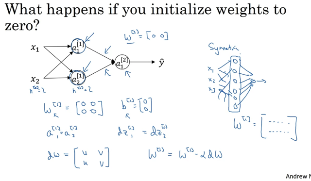</kbd>

> [!NOTE]
> Đại khái là nếu initialize params  = 0 hết thì gradient descent thì cả network
> các hidden layer vô nghĩa

   

  
  
<kbd>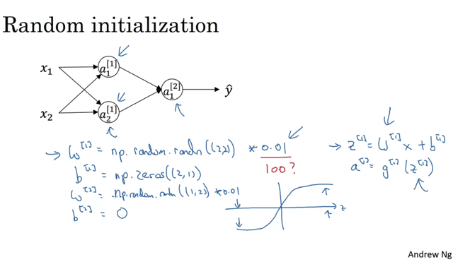</kbd>

> [!NOTE]
> Giải pháp là small random number.
>
> Tại sao không phải large random number, vì khi đó đại khái là
> Ta sẽ bắt đầu ở đoạn cuối hay đầu của đồ thị hàm sigmoid, tanh
> nơi mà đường đồ thị nằm ngang - > Derivative = 0 => 
> dẫn đến là Gradient descent rất chậm.

   

  
  
<kbd>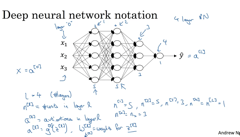</kbd>

   

## Quiz: Shallow Neural Network

 

<kbd>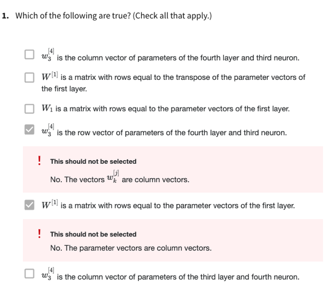</kbd>

 

<kbd>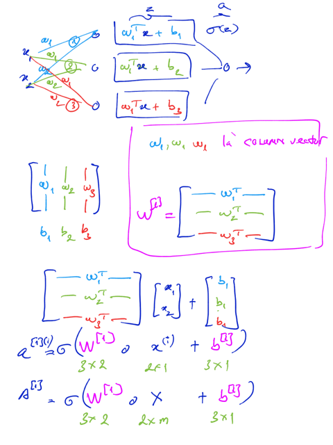</kbd>

 

<kbd>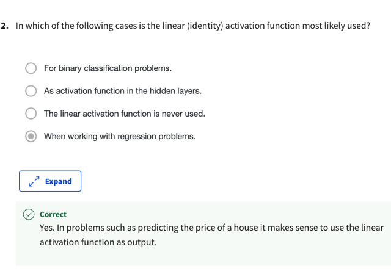</kbd>

 

<kbd>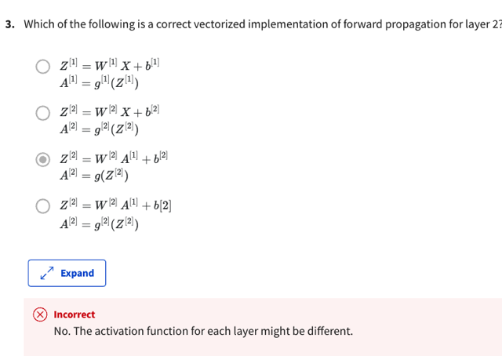</kbd>

 

<kbd>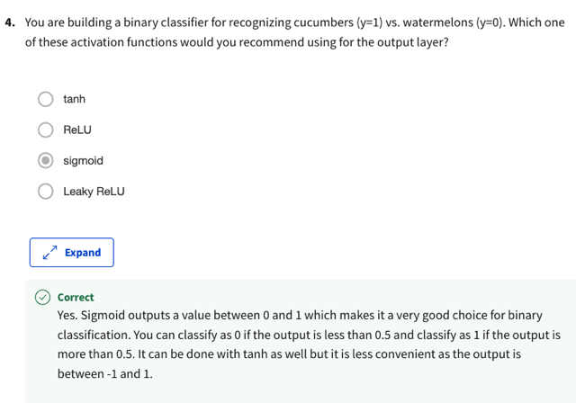</kbd>

 

<kbd>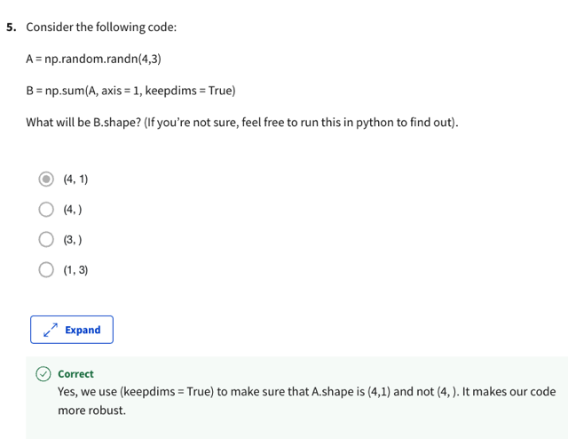</kbd>

 

<kbd>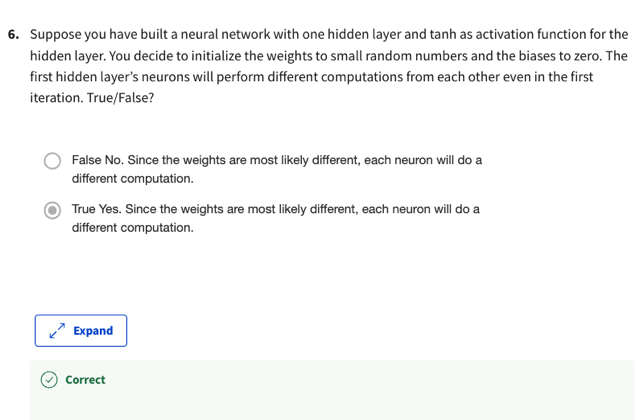</kbd>

 

<kbd>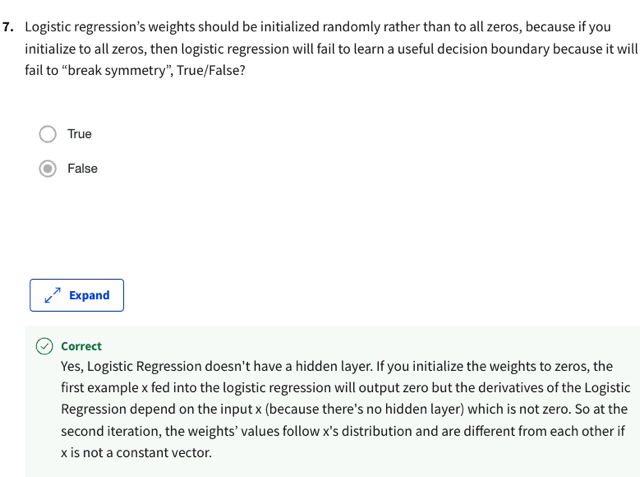</kbd>

 

<kbd>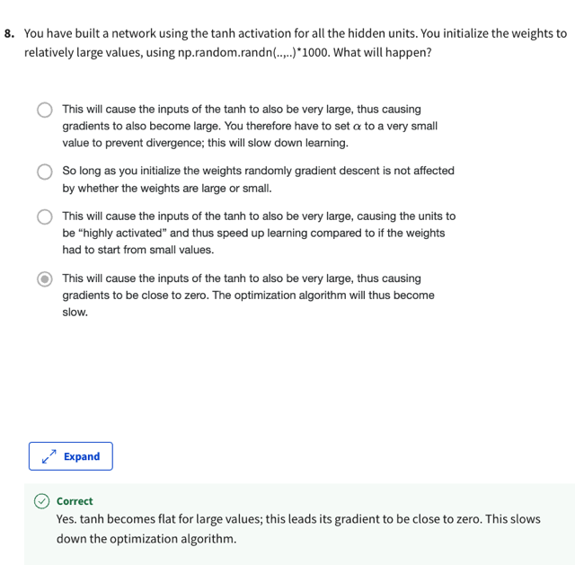</kbd>

 

<kbd>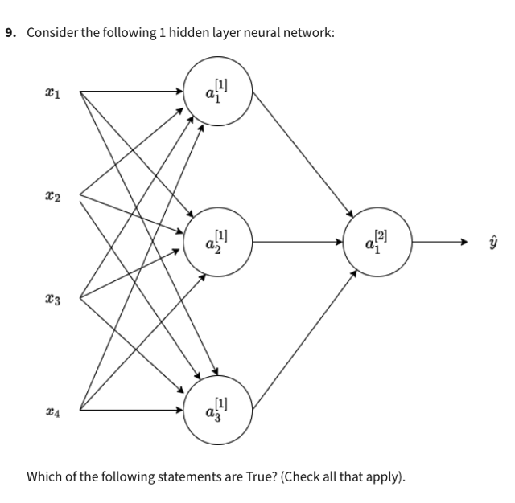</kbd>

 

<kbd>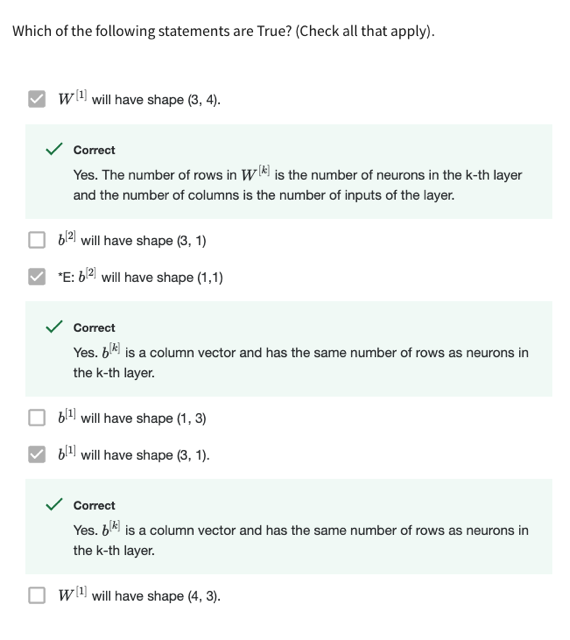</kbd>

 

<kbd>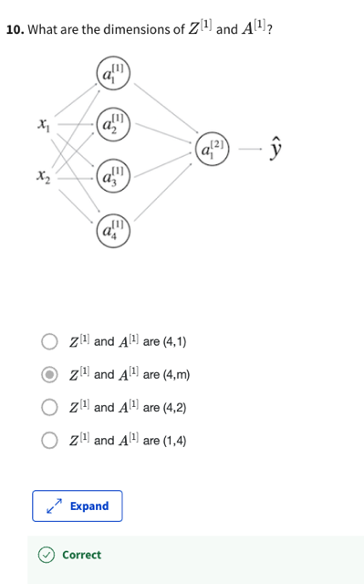</kbd>

 

## Programming Assignment: Planar Data

> [!NOTE]
> PROGRAMMING ASSIGNMENT: PLANAR DATA
> CLASSIFICATION WITH ONE HIDDEN LAYER

 

### 1. + 2.

 

  
  
<kbd>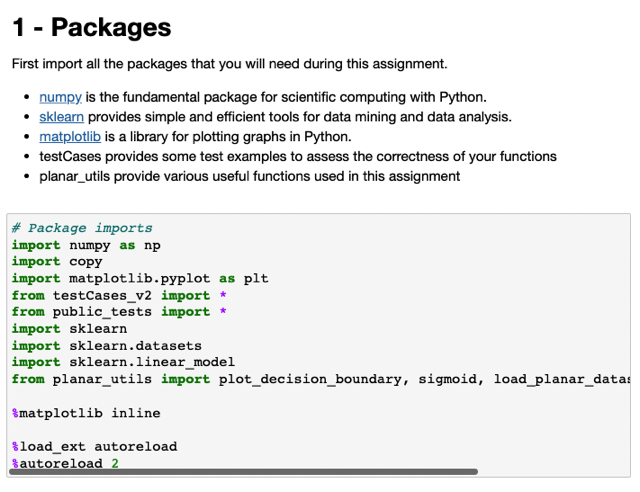</kbd>

   

  
  
<kbd>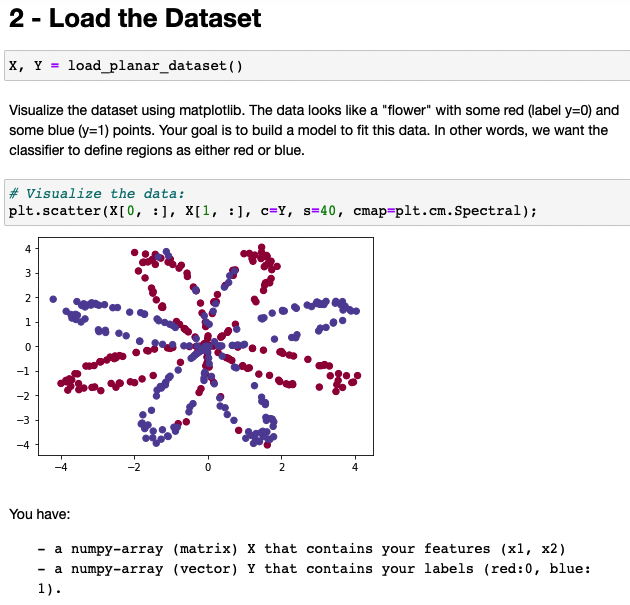</kbd>

   

  
  
<kbd>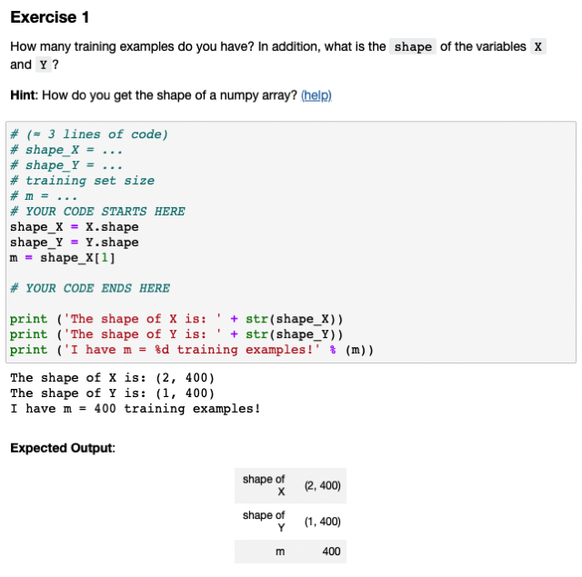</kbd>

   

### 3 - Simple Logistic Regression

 

  
  
<kbd>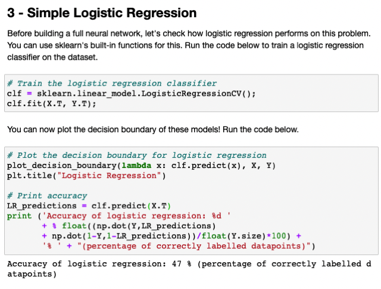</kbd>

   

  
  
<kbd>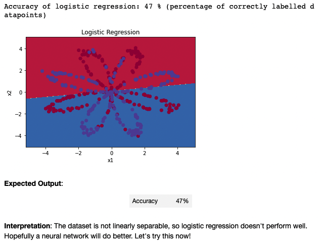</kbd>

   

### 4.2 - Initialize the model's parameters

 

### 4 - Neural Network model¶

 

  
  
<kbd>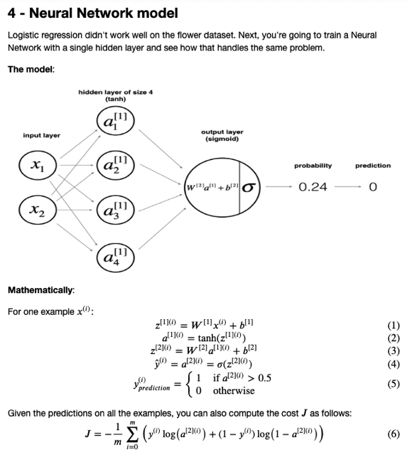</kbd>

   

  
  
<kbd>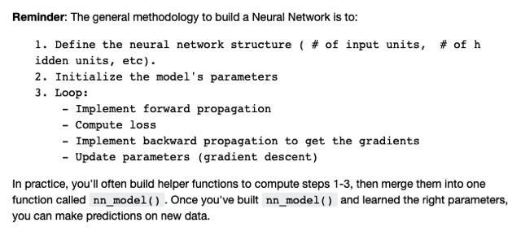</kbd>

   

### 4.1 - Defining the neural network structure

 

  
  
<kbd>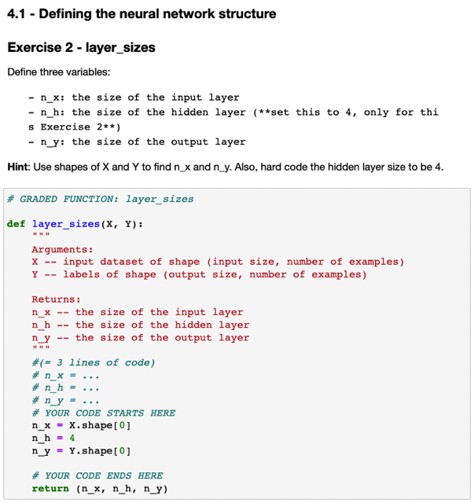</kbd>

   

  
  
<kbd>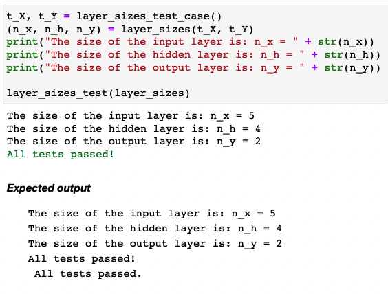</kbd>

   

### 4.2 - Initialize the model's parameters

 

  
  
<kbd>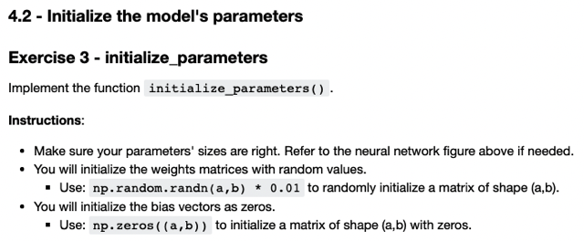</kbd>

   

  
  
<kbd>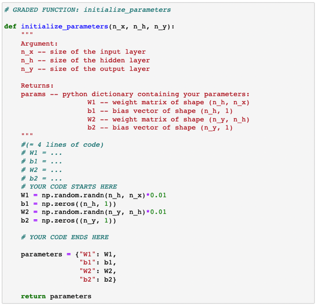</kbd>

   

  
  
<kbd></kbd>

   

### 4.3 - The loop

 

  
  
<kbd></kbd>

   

  
  
<kbd></kbd>

   

  
  
<kbd></kbd>

   

### 4.4 - Compute the Cost

 

  
  
<kbd></kbd>

   

  
  
<kbd></kbd>

   

  
  
<kbd></kbd>

   

### 4.5 - Implement Backpropagation

 

  
  
<kbd></kbd>

   

  
  
<kbd></kbd>

  
<kbd></kbd>

  
<kbd></kbd>

   

  
  
<kbd></kbd>

   

### 4.6 - Update Parameters

 

  
  
<kbd></kbd>

   

  
  
<kbd></kbd>

  
<kbd></kbd>

  
<kbd></kbd>

   

  
  
<kbd></kbd>

   

### 4.7 - Integration

 

  
  
<kbd></kbd>

   

  
  
<kbd></kbd>

   

  
  
<kbd></kbd>

   

### 5 - Test the Model

 

- 5.1 - Predict
   

    
    
<kbd></kbd>

     

    
    
<kbd></kbd>

     

- 5.2 - Test the Model on the Planar Dataset
   

    
    
<kbd></kbd>

     

    
    
<kbd></kbd>

     

    
    
<kbd></kbd>

     

### 6 - Tuning hidden layer size

 

  
  
<kbd></kbd>

  
<kbd></kbd>

  
<kbd></kbd>

   

### 7- Performance on other datasets

 

  
  
<kbd></kbd>

   

### Thực Hành F.p & B.p

 

- L.g
   

    
    
<kbd></kbd>

     

    
    
<kbd></kbd>

     

- S.n.n
   

    
    
<kbd></kbd>

     

    
    
<kbd></kbd>

     

- N.n
   

  
  - Foward Prop
     

      
      
<kbd></kbd>

       

      
      
<kbd></kbd>

       

      
      
<kbd></kbd>

       

      
      
<kbd></kbd>

       

      
      
<kbd></kbd>

       

  
  - Backward Prop
     

      
      
<kbd></kbd>

       

      
      
<kbd></kbd>

       

      
      
<kbd></kbd>

       

      
      
<kbd></kbd>

       

      
      
<kbd></kbd>

       

## Ian Goodfellow

 

<kbd></kbd>

> [!NOTE]
> I think one thing that I got from your courses at Stanford is that linear
> algebra and probability are very important, that people get excited about
> the machine learning algorithms, but if you want to be a really excellent
> practitioner, you've got to master the basic math that underlies the whole
> approach in the first place.

> [!NOTE]
> I think a lot of people that want to get into AI start thinking that they absolutely need
> to get a Ph.D. or some other kind of credential like that. I don't think that's actually a
> requirement anymore. One way that you could get a lot of attention is to write good
> code and put it on GitHub. If you have an interesting project that solves a problem
> that someone working at the top level wanted to solve, once they find your GitHub
> repository, they'll come find you and ask you to come work there. A lot of the people
> that I've hired or recruited at OpenAI last year or at Google this year, I first became
> interested in working with them because of something that I saw that they released
> in an open-source forum on the Internet

> [!NOTE]
> So read your book, practice the materials and post on GitHub and
> maybe on Archive. I think if you learned by reading the book, it's
> really important to also work on a project at the same time, to either
> choose some way of applying machine learning to an area that you
> are already interested in

> [!NOTE]
> ML Security

> [!NOTE]
> Like if you're a field biologist and you want to get into deep learning,
> maybe you could use it to identify birds, or if you don't have an idea for
> how you'd like to use machine learning in your own life, you could pick
> something like making a Street View house numbers classifier, where all
> the data sets are set up to make it very straightforward for you. And that
> way, you get to exercise all of the basic skills while you read the book or
> while you watch Coursera videos that explain the concepts to you

 

