# C2w1_practical Aspects Of Deep Learning

📊 **Progress:** `54` Notes | `131` Screenshots

---

Discover and experiment with a variety of different initialization methods, apply L2 regularization and dropout to avoid model overfitting, then apply gradient checking to identify errors in a fraud detection model.
**Learning Objectives**
 • Give examples of how different types of initializations can lead to different results
 • Examine the importance of initialization in complex neural networks
 • Explain the difference between train/dev/test sets
 • Diagnose the bias and variance issues in your model
 • Assess the right time and place for using regularization methods such as dropout or L2 regularization
 • Explain Vanishing and Exploding gradients and how to deal with them
 • Use gradient checking to verify the accuracy of your backpropagation implementation
 • Apply zeros initialization, random initialization, and He initialization
 • Apply regularization to a deep learning model

## Setting Up Your Machine Learning Application

 

### Train Dev Test Sets

 

- 1 The course is about practical aspects of deep learning and making neural network work well by \\*optimizing hyperparameters\\*, \\*data setup\\*, and optimization \\*algorithms\\*.  2 Deep learning has been successful in various areas including \\*natural language processing\\*, \\*computer vision\\*, \\*speech recognition\\*, structured data, computer security, and logistics.  3 Intuitions from one application area \\*do not always transfer to another\\*, and it is difficult to guess the best choice of \\*hyperparameters\\* on the first attempt.  4 Applied deep learning is an\\* iterative process\\* where \\*setting up data sets efficiently\\* can help make progress quicker.  5 The workflow of training deep learning algorithms involves \\*training on a training set,\\* using a \\*dev set\\* or hold-out cross-validation set to \\*choose the best model\\*, and \\*evaluating\\* the final model on a \\*test set\\* for an \\*unbiased estimate\\* of its performance.  6 In the previous era of machine learning, a \\*70/30\\* train-test split was widely considered best practice, but in the modern \\*big data\\* era, different rules of thumb are required.
  > 1 The practical aspects of deep learning:
  >  2 Welcome to this course on the practical aspects of deep learning. In this week, you'll learn the **practical aspects** of how to make your neural network work well, ranging from **hyperparameter tuning** to **optimizing your data** and **learning algorithm**to make sure that your neural network runs efficiently.
  >
  >  - Importance of hyperparameter tuning:
  >  4 When training a neural network, you have to make a lot of decisions, such as how many layers will your neural network have, how many **hidden units**should each layer have, what's the learning rate, and what are the **activation** **functions** you want to use for the different layers. It's almost impossible to guess the right values for all of these hyperparameters on your first attempt, so applied machine learning is a highly iterative process where you refine your ideas and choices based on the outcomes of experiments.
  >
  >  - **Transferability** of **intuitions** across **different domains**:
  >  6 Intuitions from one domain or application area often do not transfer to other application areas. The best choices may depend on the amount of data, the number of input features, and the configuration of GPUs and CPUs. So, finding a good choice of network for your application is an iterative process that requires going around the cycle of training, testing, and refining many times.
  >
  >  7 Setting up data sets well:
  >  8 Setting up your data sets well, in terms of your train, development, and test sets can make you much more efficient at the iterative process of finding a good choice of network for your application.
  >
  >  9 The traditional workflow:
  >  10 The workflow is that you keep on training algorithms on your training set and use your development set (also called hold-out cross validation set) to see which of many different models performs best. When you have a final model that you want to evaluate, you can take the best model you have found and evaluate it on your test set to get an unbiased estimate of how well your algorithm is doing.
  >
  >  11 The traditional train/test split:
  >  12 In the previous era of machine learning, it was common practice to split your data according to maybe a 70/30% in terms of a train/test split or a 60/20/20% split in terms of train/dev/test split. However, in the modern big data era, these ratios may not be appropriate anymore.
  >
  >  13 The importance of big data:
  >  14 In the modern big data era, where you might have a million examples in total, it's important to have more data for your training set to make sure that your neural network has enough examples to learn from. In this case, the traditional train/test split ratios may not be appropriate anymore.

   

    
    
<kbd>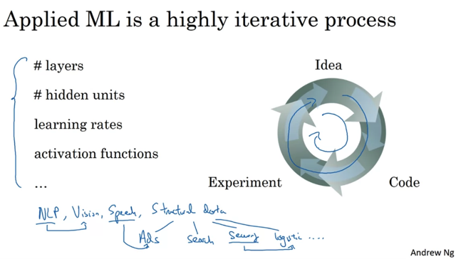</kbd>

    > And what I've seen is that intuitions from one domain or from one
    > application area often **do not transfer** to other application areas. And the
    > best choices may **depend on the amount of data** you have, the
    > **number of input features** you have through your **computer
    > configuration** and whether you're training on **GPUs** **or CPUs**. And if
    > so, exactly what **configuration** of GPUs and CPUs...and many other things.

    > Even **very experienced** deep learning people find it almost **impossible** to
    > correctly guess the **best choice of hyperparameters** the very first time. And
    > so today, applied deep learning is a very **iterative process** where you
    > just have to **go around this cycle many times** to hopefully **find a good
    > choice of network** for your application

     

    
    
<kbd>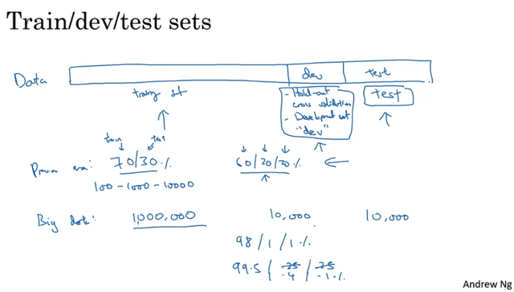</kbd>

    > Đại khái là hồi xưa data ít thì chia 7/3/3 còn nay thì thường chỉ 98/1/1 là đủ

     

    
    
<kbd>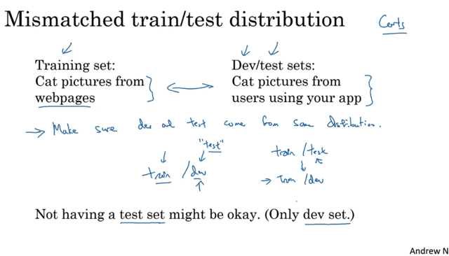</kbd>

    > Đv vấn đề mismatched train/test đại khái là training set và test set
    > có feature khác nhau. Ví dụ ảnh để train thì dùng ảnh chất lượng
    > cao còn ảnh để test thì lại do user upload lên có chất lượng kém.
    > Lời khuyên / nguyên tắc tối thượng là
    >
    > '**Make sure the dev & test come from the same distribution"**Cụ thể trong trường hợp này thì phải dùng web images để  train
    > còn user upload image để cross validation + test

    > Cái nữa là không nhất thiết phải có test sét vì
    > thật ra nó chỉ đóng vai trò 'công bố' tỉ lệ đúng
    > của model 1 cách khách quan. Nếu không có
    > nhu cầu này thì ko cần test set.

     

### Bias / Variance

 

- 1 Good machine learning practitioners have a \\*sophisticated understanding\\* of \\*bias\\* and \\*variance\\*.  2 Bias and Variance is e\\*asily learned\\* but \\*difficult to master.\\*  3 In Deep Learning area, there is\\* less discussion\\* of the \\*Bias/Variance trade-off.\\*  4 Bias and variance are visualized through a 2D example in which a straight line represents underfitting, an overly complex curve represents overfitting, and a medium complexity curve represents a reasonable fit.  5 High dimensional problems require metrics such as the \\*train set error\\* and the \\*development set error\\* to \\*understand bias and variance\\*.  6 \\*High variance\\* is determined when an algorithm performs \\*well on the training set\\* but \\*poorly on the development set\\*.  7 \\*High bias\\* is determined when an algorithm is \\*not performing well on the training set\\* and \\*does not fit the data well\\*.  8 \\*High bias\\* and \\*high variance\\* occur when an algorithm is \\*not performing well on the training\\* set and \\*does not generalize well to the development set.\\*  9 Low bias and low variance occur when an algorithm is \\*performing well on the training set\\* and \\*generalizes well to the development set\\*.  10 Analyzing bias and variance is predicated on the \\*assumption\\* that the \\*optimal error is nearly 0%\\*.
  > 1 The importance of understanding Bias and Variance in machine learning: The speaker notes that almost all really good machine learning practitioners have a sophisticated understanding of Bias and Variance. While Bias and Variance are easily learned, they are difficult to master. Even if one has a basic understanding of Bias and Variance, there is often more nuance to it than expected. Understanding these concepts is important for developing effective machine learning models.
  >
  > 2 Bias/Variance trade-off in Deep Learning Error: The speaker notes that while Bias and Variance are still talked about in the context of Deep Learning era, there has been less discussion of the Bias/Variance trade-off. In a simple 2D example, one can plot the data and visualize the Bias and Variance. However, in high-dimensional problems, one cannot plot the data and visualize the decision boundary. Instead, there are a couple of different metrics to understand Bias and Variance.
  >
  >  3 Train set error and development set error: Continuing with the example of cat picture classification, the speaker notes that the two key numbers to look at to understand Bias and Variance are the train set error and the development set error. For instance, if the train set error is 1% and the dev set error is 11%, the algorithm is doing very well on the training set but poorly on the development set, suggesting high variance.
  >
  > 4 High variance vs. high bias: If the train set error is 15% and the dev set error is 16%, the algorithm is not even fitting the training data well, suggesting high bias. In contrast, if the algorithm has 15% training set error and, say, 30% dev set error, it has high bias and high variance. Lastly, if the algorithm has 0.5% training set error and 1% dev set error, it has low bias and low variance.
  >
  > 5 The assumption of Bayes error: The analysis is predicated on the assumption that human-level performance gets nearly 0% error, or more generally, that the optimal error, sometimes called Bayes error, is nearly 0%. If the optimal error or Bayes error were much higher, say, it were 15%, then a classifier with 15% training set error would not be considered to have high bias or high variance. This case presents a unique challenge for analyzing Bias and Variance when no classifier can do very well, for example, if there are really blurry images.

   

    
    
<kbd>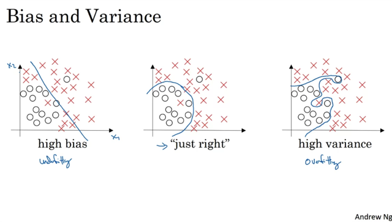</kbd>

    > Vấn đề là đv 2D thì còn plot được, còn nhiều D hơn
    > thì phải có cách khác để nhận biết vấn đề overfitting

     

    
    
<kbd>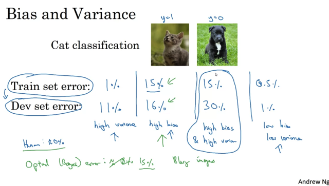</kbd>

    > Đại khái là những nhận định trên phải giả định **Bayes error** là 0%.
    > Chứ nếu lớn hơn, ví dụ như 14%, thì 15% của training error không
    > phải là high bias.
    >
    > Và thực tế nhiều vấn đề Bayes error ko phải là 0%

     

    
    
<kbd>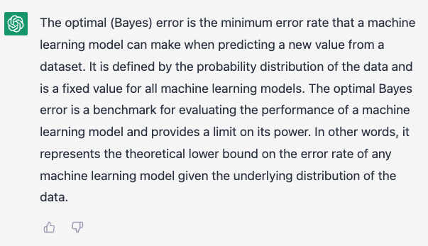</kbd>

    > Optimal (Bayes) error là gì?

     

    
    
<kbd>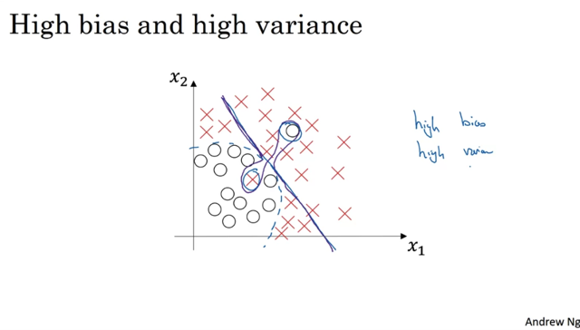</kbd>

     

### Basic Recipe For Machine Learning

 

- 1 The \\*basic\\* \\*recipe\\* for training a neural network involves \\*diagnosing\\* whether the algorithm has \\*high bias or high variance\\*.  2 If there is a \\*high bias\\*, solutions could be \\*adding more hidden layers,\\* \\*more hidden units,\\* or training it for a\\* longer time.\\* One could also try different neural network \\*architectures\\* to see if there' s a better-suited one for the problem at hand.  3 If there is a \\*high variance\\*, adding \\*more data\\* is the best solution, if possible. If not, \\*regularization\\* or trying a \\*different\\* neural network architecture could help.  4 Selecting the \\*appropriate solution\\* for the problem is \\*essential\\*. If one has a \\*high bias\\* problem, getting \\*more data \\*is \\*not\\* always the most efficient solution.  5 \\*Deep learning\\* has made it easier to reduce bias and variance without necessarily increasing the other.
   

  
  - Sure, here's a more detailed answer with indexed style:  In the previous video, the concept of bias and variance in machine learning algorithms was introduced. These concepts can help diagnose issues with an algorithm's performance and guide improvements.  When training a neural network, a basic recipe can be used. After an \\*initial model is trained\\*, the following steps can be taken:  Determine if the algorithm has \\*high bias\\* by evaluating its performance on the training set. If high bias is detected, try \\*increasing the complexity\\* of the network, training for a \\*longer period of time\\*, using \\*more advanced optimization\\* algorithms, or experimenting with \\*different\\* neural network \\*architectures\\*. Continue trying these approaches until bias is reduced to acceptable levels, as indicated by \\*good performance on the training set.\\*  Once bias is under control, evaluate the algorithm for \\*high variance\\* by looking at its performance on the \\*development set.\\* If high variance is detected, try \\*getting more data,\\* using \\*regularization\\* techniques, or experimenting with \\*different neural network architectures\\*. Continue trying these approaches\\* until both bias and variance are at acceptable levels\\*. The set of approaches to try will depend on whether the algorithm has a bias or variance problem. It is \\*important to be clear\\* about \\*which type of problem\\* is present to select the m\\*ost useful approaches\\* to try.  In the past, there was a \\*bias-variance tradeoff\\* where \\*reducing one type of error could increase the other\\*. However, in the era of deep learning and big data, it is possible to reduce bias or variance without hurting the other type of error as much. Increasing the size of the network and getting more data are both effective approaches for reducing error without introducing the tradeoff.  The basic recipe for machine learning presented in the video provides a \\*systematic approach\\* to improving algorithm performance. By \\*understanding\\* the b\\*ias-variance tradeoff\\* and \\*selecting appropriate approaches\\* to try, it is possible to drive down b\\*oth types of error\\* and achieve good performance.
    > Quy trình

     

      
      
<kbd>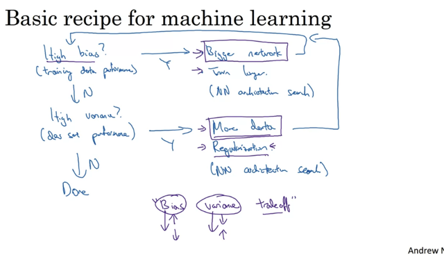</kbd>

      > High bias -> 
      > - Dùng bigger (more complex) network
      > - Train longer
      > - Different NN architecture (sẽ nói sau)
      >
      > High variace: 
      > - Train in more data
      > - Regularization
      > - Different NN architecture

      > Đv vấn đề **trade off giữa bias vs variance**thì đại khái là ổng nói
      > **ngày xưa thô**i còn với modern n.n thì nếu có **nhiều data** (fix
      > issue high variance) + dùng **big network** (fix issue high bias) thì
      > không hề có chuyện phải trade of giữa bias và variance. Có
      > chăng là '**computational time**'. Và đây chính là **ưu điểm quan trọng**
      > rất lớn của N.N giúp nó phát triển mạnh

       

## Connect With Your Mentors And Fellow Learners On Discourse!

 

## Regularizing Your Neural Network

 

### Clarification About Upcoming Regularization Video

 

- ...
   

    
    
<kbd>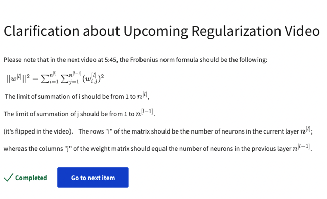</kbd>

     

### Regularization

 

- 1 \\*Regularization\\* is a technique used to \\*prevent overfitting\\* or \\*reduce variance\\* in neural networks.  2 One common way to perform regularization is by \\*adding a regularization term\\* to the \\*cost function\\* of the network.  3 The most common type of regularization is \\*L2 regularization\\*, which \\*adds a term to the cost function\\* that is proportional to the \\*squared norm of the weight parameters\\* of the network.  4 \\*L1 regularization\\* is an alternative to \\*L2 regularization\\* that adds a term proportional to the \\*absolute value of the weight parameters\\* instead of their squared value. This can \\*make the weight vector sparse\\*, but it is \\*not as commonly used as L2\\* regularization.  5 The\\* regularization parameter\\*, \\*lambda\\*, is used to control the strength of the regularization and is \\*typically set using a development set\\* or cross-validation.  6 Regularization is used \\*not only in logistic regression\\* but also in \\*neural networks\\*, where the regularization term is added to the cost function for all the parameters in the network.  7 L2 regularization in neural networks adds a term proportional to the \\*squared norm\\* \\*of all the weight parameters\\* in the network.  8 Lambda is a hyperparameter that needs to be tuned for regularization to work effectively.
  > 1 What is overfitting and how can it be addressed?
  >  2 If your neural network is overfitting your data, that means it's fitting the training data too well and not generalizing to new, unseen data. One of the main ways to address overfitting is through regularization, which helps to reduce variance in the network.
  >
  >  3 What is regularization and how does it work?
  >  4 Regularization is a technique used to prevent overfitting by adding a penalty term to the cost function. In logistic regression, for example, this penalty term is lambda/2m times the squared L2 norm of the weight vector w. The lambda term is the regularization parameter that needs to be tuned using a development set or cross-validation.
  >
  >  5 What is L2 regularization?
  >  6 L2 regularization is the most common type of regularization used in practice. It works by adding a penalty term to the cost function that is proportional to the squared L2 norm of the weight vector w. The effect of L2 regularization is to shrink the weight vector towards zero, which reduces variance in the network.
  >
  >  7 Why is L2 regularization applied only to the weight vector and not to the bias term?
  >  8 The weight vector w usually has many more parameters than the bias term b, especially in high-dimensional problems where overfitting is more likely to occur. Therefore, adding regularization to w has a greater effect on reducing variance than adding regularization to b.
  >
  >  9 What is L1 regularization?
  >  10 L1 regularization is another type of regularization that works by adding a penalty term to the cost function that is proportional to the L1 norm of the weight vector w. Unlike L2 regularization, L1 regularization tends to produce sparse weight vectors with many zero entries, which can help with model compression.
  >
  >  11 Why is L2 regularization more commonly used than L1 regularization?
  >  12 L2 regularization is used much more often than L1 regularization in practice because it has been shown to produce better generalization performance in many cases. However, L1 regularization may be useful in certain situations where model sparsity is important.
  >
  >  13 How is regularization applied to a neural network?
  >  14 In a neural network, regularization can be applied by adding a penalty term to the cost function that is proportional to the squared L2 norm of all the weight matrices in the network. The regularization parameter lambda needs to be tuned using a development set or cross-validation.
  >
  >  15 What is the formula for the squared L2 norm of a matrix?
  >  16 The squared L2 norm of a matrix is defined as the sum of the squares of all its elements. For a weight matrix w with dimensions n[l] x n[l-1], where l is the layer number, the formula for the squared L2 norm is lambda/2m * sum(i=1 to n[l-1], j=1 to n[l]) w[i,j]^2.
  >
  >  17 How is the lambda parameter represented in Python?
  >  18 Lambda is a reserved keyword in Python, so in the programming exercises, l-a-m-b-d is used instead to represent the lambda regularization parameter.

   

    
    
<kbd>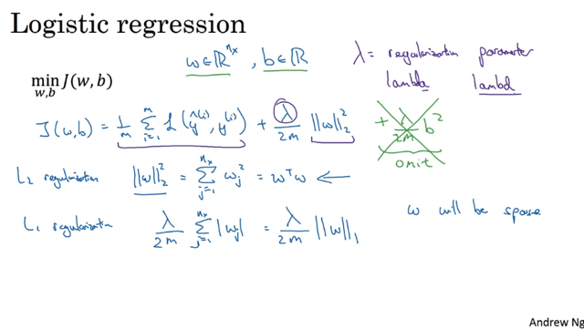</kbd>

    > Đại khái là ôn lại để regularize **Logistic Regression**, add thêm 1
    > R**eg term** bằng **(lambda/2m)* tổng bình phương các weight**
    > nếu là L2, nếu là L1 thì **(lambda/2m)*tổng giá trị tuyệt đối của
    > weight.**
    >
    > Mà đối với L2, tổng bình phương các weight chính là**bình
    > phương của norm** (gọi là L2 norm, **Frobenius norm**) của
    > vector W (=[w1,w2..wn])
    >
    > Make weight vector W **sparse** đại khái là**w_j bị set = 0** khiến
    > **vector hay matrix W có nhiều chỗ 0 gọi là sparse**, **còn L2 thì
    > nó chỉ ém w về gần bằng 0 thôi**
    >
    > Weight decay chính là cách gọi khác của L2 regularization

     

    
    
<kbd>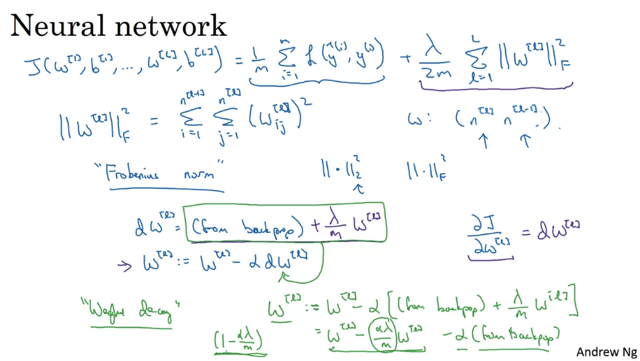</kbd>

    > **"Frobenius norm"** The Frobenius norm is a matrix norm that defines
    > the magnitude of  a matrix. It is defined as the**square root of the sum
    > of the squares  of all the elements of a matrix**. In other words, it
    > calculates the **L2  norm of a matrix**. It is commonly used in linear
    > algebra and in the  training of machine learning models, particularly in
    > deep learning. In the context of deep learning, the **Frobenius norm** of
    > the weight  matrix of a layer is often used as a **regularization term** to
    > **encourage** the model to have **small weights**, which helps to prevent
    > **overfitting** and improve the **generalization** performance of the model.
    > The Frobenius norm is also used to measure the **similarity between
    > two matrices**, by calculating the distance between the two matrices.
    >
    > **"Weight decay"**Weight decay is a regularization technique used in
    > training machine learning models, especially neural networks, to
    > p**revent overfittin**g  and improve the generalization performance of the
    > model. It works  by **adding a penalty term to the loss function** that is
    > proportional to  the magnitude of the model weights. **This penalization
    > discourages  the model from having too high weights**, which reduces
    > the  magnitude of weights and therefore the complexity of the model,
    > leading to a better generalization to unseen data. **The term weight
    > decay is often used interchangeably** with **L2 regularization.**

    > Tương tự trong NN cũng add **regularization term** vào **cost function**
    > bằng **tổng bình phương tất cả các weight của toàn network**nhân với
    > lambda/2m. Khi triển khai ra chút xíu thì được kiểu như khi update w thì
    > nhân w với 1 hệ số bằng (**1 - alpha.lambda/m)**nhỏ hơn 1 nên **khiến
    > w nhỏ lại** một chút (trước khi update với derivative (- alpha*dJ/dw) lại
    > gọi là **weight decay**

     

  
  - 1 What is overfitting and how can it be addressed?  2 If your neural network is overfitting your data, that means it's fitting the training data too well and not generalizing to new, unseen data. One of the main ways to address overfitting is through regularization, which helps to reduce variance in the network.  3 What is regularization and how does it work?  4 Regularization is a technique used to prevent overfitting by adding a penalty term to the cost function. In logistic regression, for example, this penalty term is lambda/2m times the squared L2 norm of the weight vector w. The lambda term is the regularization parameter that needs to be tuned using a development set or cross-validation.  5 What is L2 regularization?  6 L2 regularization is the most common type of regularization used in practice. It works by adding a penalty term to the cost function that is proportional to the squared L2 norm of the weight vector w. The effect of L2 regularization is to shrink the weight vector towards zero, which reduces variance in the network.  7 Why is L2 regularization applied only to the weight vector and not to the bias term?  8 The weight vector w usually has many more parameters than the bias term b, especially in high-dimensional problems where overfitting is more likely to occur. Therefore, adding regularization to w has a greater effect on reducing variance than adding regularization to b.  9 What is L1 regularization?  10 L1 regularization is another type of regularization that works by adding a penalty term to the cost function that is proportional to the L1 norm of the weight vector w. Unlike L2 regularization, L1 regularization tends to produce sparse weight vectors with many zero entries, which can help with model compression.  11 Why is L2 regularization more commonly used than L1 regularization?  12 L2 regularization is used much more often than L1 regularization in practice because it has been shown to produce better generalization performance in many cases. However, L1 regularization may be useful in certain situations where model sparsity is important.  13 How is regularization applied to a neural network?  14 In a neural network, regularization can be applied by adding a penalty term to the cost function that is proportional to the squared L2 norm of all the weight matrices in the network. The regularization parameter lambda needs to be tuned using a development set or cross-validation.  15 What is the formula for the squared L2 norm of a matrix?  16 The squared L2 norm of a matrix is defined as the sum of the squares of all its elements. For a weight matrix w with dimensions n[l] x n[l-1], where l is the layer number, the formula for the squared L2 norm is lambda/2m * sum(i=1 to n[l-1], j=1 to n[l]) w[i,j]^2.  17 How is the lambda parameter represented in Python?  18 Lambda is a reserved keyword in Python, so in the programming exercises, l-a-m-b-d is used instead to represent the lambda regularization parameter.
     

### Why Regularization Reduces Overfitting?

 

- 1 \\*Regularization\\* helps with \\*overfitting\\* and r\\*educing variance\\* problems.  2 The addition of an \\*extra term\\* \\*penalizes weight matrices\\* from being \\*too large\\*.  3 By cranking up \\*lambda\\*, which is the \\*regularization parameter\\*, the weights will be \\*closer to zero\\* and it will \\*simplify the network\\*, making it \\*less prone to overfitting\\*.  4 If the \\*regularization parameter\\* is large, the \\*weights are small\\*, and the activation function is \\*tanh\\*, then each layer will be \\*roughly linear\\* and the \\*whole network will compute a linear function\\*.  5 The network will be computing something \\*not too far from a big linear function,\\* which is a simple function, rather than a complex highly non-linear function, making it \\*less able to overfit\\*.  6 Implementational tip: when implementing regularization, the cost function J is modified by adding an extra term that penalizes the weights being too large.
  > 1 Why does regularization help with overfitting?
  >  2 Regularization helps with overfitting by adding an extra term to the cost function that penalizes large weight values. This penalty term encourages the model to use simpler, more generalizable patterns instead of complex, overfitting ones.
  >  3 Why does it help with reducing variance problems?
  >  4 Reducing variance in a model means making it less sensitive to small changes in the training data. Regularization achieves this by shrinking the weights towards zero, making the model more robust and less prone to overfitting.
  >  5 Intuition behind regularization: simplified neural networks
  >  6 Regularization can be thought of as reducing the complexity of the neural network by shrinking the weights towards zero. This can result in a simpler network that is less prone to overfitting. In the extreme case where the regularization parameter is very large, the weights are effectively zeroed out, resulting in a much simpler network.
  >  7 Intuition behind regularization: impact on activation functions
  >  8 Regularization can also affect the activation functions used in the network. For example, with the tanh activation function, small weights will result in small values for the input to the activation function. This can cause the activation function to behave more like a linear function, resulting in a simpler, more interpretable model.
  >  9 Implementational tip: debugging gradient descent with regularization
  >  10 When implementing gradient descent with regularization, it's important to plot the training and validation error as a function of the regularization parameter. This can help determine the optimal value of the regularization parameter that balances bias and variance in the model.

   

    
    
<kbd>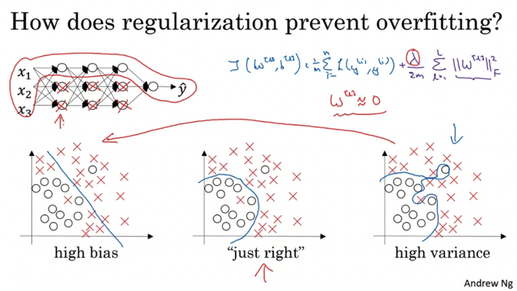</kbd>

    > Đại khái là tương tự như tác dụng của Reg đ/v các algorithm
    > khác thì đv N.N cũng vậy nó sẽ **'ÉM' (penalize)** cho các các
    > **params w không thể lớn được thậm chí gần = 0**, từ đó nó
    > khiến cho model trở nên **simple** hơn (trong lecture  ổng nói vẽ
    > vậy là có ý như w ở các hidden layer thành gần 0 hết dẫn đến
    > model nó **'dần trở nên như 1 linear regression model'**. Nhưng
    > thực tế không phải w nó bằng 0 mà là nó trở nên nhỏ đi nên giảm
    > độ ảnh hưởng đến model.

    > Penalize có nghĩa là phạt hoặc trừng phạt. Trong
    > khoa học máy  tính, từ này thường được sử dụng
    > để miêu tả việc thêm một điều  kiện giới hạn hoặc
    > hạn chế cho một mô hình trong quá trình huấn
    > luyện, để tránh overfitting và cải thiện hiệu suất tổng
    > quát của mô hình.

     

    
    
<kbd>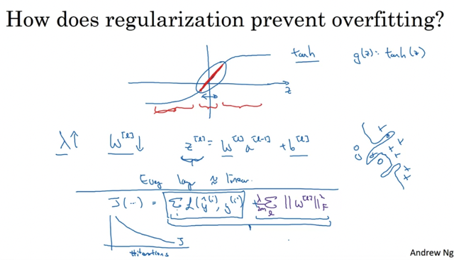</kbd>

    > Đại khái là nếu sét **lambda lớn** để Regularization tác dụng
    > mạnh **ém weight nhỏ xuống** thì vì z = wa + b, **z cũng sẽ
    > nhỏ lại**
    >
    > vì thế a = g(z) mà g thường là tanh, sigmoid, hay relu thì **đều
    > có tính chất 'LINEAR' trong đoạn z nhỏ**. Hiểu đại khái là sẽ
    > **khiến toàn bộ hệ thống trở nên linear hơn** -> **tăng độ bias,
    > giảm tính variance.**

    > Và khi dùng Regularization thì nhớ add RegTerm
    > khi tính J nếu không sẽ không thấy J giảm khi
    > Iteration Gradient Descent

    > Ví dụ ổng lấy hàm tanh cho thấy nếu z trong
    > khoảng nhỏ quanh 0, thì g(z) sẽ gần như tuyến
    > tính. Đối với sigmoid cũng tương tự.

     

  
  - 1 Why does regularization help with overfitting?   2 Regularization helps with overfitting by adding an extra term to the cost function that penalizes large weight values. This penalty term encourages the model to use simpler, more generalizable patterns instead of complex, overfitting ones.  3 Why does it help with reducing variance problems?  4 Reducing variance in a model means making it less sensitive to small changes in the training data. Regularization achieves this by shrinking the weights towards zero, making the model more robust and less prone to overfitting.  5 Intuition behind regularization: simplified neural networks  6 Regularization can be thought of as reducing the complexity of the neural network by shrinking the weights towards zero. This can result in a simpler network that is less prone to overfitting. In the extreme case where the regularization parameter is very large, the weights are effectively zeroed out, resulting in a much simpler network.  7 Intuition behind regularization: impact on activation functions  8 Regularization can also affect the activation functions used in the network. For example, with the tanh activation function, small weights will result in small values for the input to the activation function. This can cause the activation function to behave more like a linear function, resulting in a simpler, more interpretable model.  9 Implementational tip: debugging gradient descent with regularization  10 When implementing gradient descent with regularization, it's important to plot the training and validation error as a function of the regularization parameter. This can help determine the optimal value of the regularization parameter that balances bias and variance in the model.
     

### Dropout Regularization

 

- 1 \\*Dropout\\* is a \\*powerful regularization technique\\* to \\*prevent over-fitting\\* in neural networks.  2 Dropout involves \\*randomly setting some nodes to zero\\* during training, which results in a much \\*smaller network\\*.  3 By training on smaller networks for each example, the network can be \\*regularized\\*.  4 There are \\*different ways\\* to implement dropout, with the most common being the \\*inverted dropout technique\\*.  5 \\*Inverted dropout \\*involves generating a \\*random matrix\\* with a \\*probability of eliminating hidden units\\*, \\*element-wise multiplying the activation matrix by the dropout matrix\\*, and \\*scaling up the output.\\*  6 Inverted dropout helps to \\*avoid reducing the expected value of the output \\*while regularizing the network, regardless of the keep probability value used.
  > Sure, I'd be happy to provide more detail with indexed main ideas.
  >  1 Dropout regularization:
  >  2 In addition to L2 regularization, dropout is another powerful technique for regularization in neural networks. Dropout is a regularization technique that randomly sets activations to zero during the training process to prevent overfitting.
  >
  > 3 Applying dropout to a neural network:
  >  4 When applying dropout, we go through each of the layers of the network and set a probability of eliminating a node in the neural network. For each node in each layer, we toss a coin with a 50/50 chance of keeping or eliminating the node. If a node is eliminated, we remove all the outgoing connections from that node, resulting in a much smaller network. We then train this much smaller network using backpropagation.
  >
  > 5 Training with different neural networks:
  >  6 For each training example, we train it using one of these neural networks that we obtain after eliminating nodes with dropout. We repeat this process for each training example, resulting in different neural networks for each example.
  >
  >  7 Implementing dropout using inverted dropout:
  >  8 There are a few ways to implement dropout, but the most common technique is called inverted dropout. Inverted dropout involves creating a random matrix with the same shape as the layer's activations, where each element of the matrix has a certain probability of being set to zero.
  >
  > 9 Keep probability:
  >  10 This probability, also known as keep.prob, determines the probability of keeping each node in the layer. For example, if keep.prob is set to 0.8, there is a 20% chance of eliminating any given node.
  >
  > 11 Scaling up activations:
  >  12 We then take the activations from the layer and multiply them element-wise with the random matrix created using the keep.prob value. This has the effect of zeroing out a certain percentage of the activations. We then scale up the resulting activations by dividing them by the keep.prob value, which ensures that the expected value of the activations is maintained.
  >
  > 13 Benefits of dropout:
  >  14 Using dropout can help to prevent overfitting by reducing the interdependence of the neurons in the network, forcing them to learn more robust features. Dropout has been shown to be a highly effective regularization technique and is widely used in deep learning.

   

    
    
<kbd>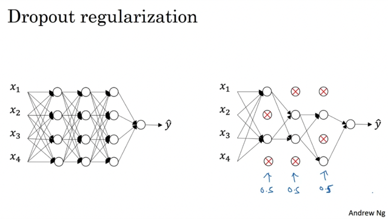</kbd>

    > Đại khái cách làm này là với **mỗi lần train** từ 1 bộ
    > dataset ta sẽ **randomly bỏ bớt một số hidden unit**

     

    
    
<kbd>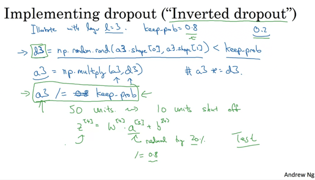</kbd>

    > Đại khái nó sẽ tạo matrix d3 cùng shape với a3, nhưng mỗi item là 1 - true.
    > 0 - false trong đó **khả năng 1 - true là 80%  khả năng 0 - false là 20%.
    > Gọi là keep-prob = 0,8**
    >
    > a3 = **np.multiply(a3, d3)** sẽ bỏ bớt unit (set = 0)
    >
    > Cuối cùng là lấy a3 = **a3 / 0.8** đại khái là để **cho nó lớn lên lại** để nó
    > **'not change the expected value'**

     

    
    
<kbd>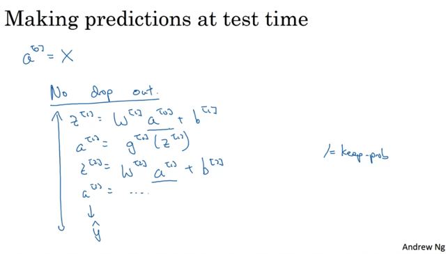</kbd>

    > Lúc prediction thì đừng có drop out

     

  
  - Sure, I'd be happy to provide more detail with indexed main ideas.  1 Dropout regularization:  2 In addition to L2 regularization, dropout is another powerful technique for regularization in neural networks. Dropout is a regularization technique that randomly sets activations to zero during the training process to prevent overfitting.  3 Applying dropout to a neural network:  4 When applying dropout, we go through each of the layers of the network and set a probability of eliminating a node in the neural network. For each node in each layer, we toss a coin with a 50/50 chance of keeping or eliminating the node. If a node is eliminated, we remove all the outgoing connections from that node, resulting in a much smaller network. We then train this much smaller network using backpropagation.  5 Training with different neural networks:  6 For each training example, we train it using one of these neural networks that we obtain after eliminating nodes with dropout. We repeat this process for each training example, resulting in different neural networks for each example.  7 Implementing dropout using inverted dropout:  8 There are a few ways to implement dropout, but the most common technique is called inverted dropout. Inverted dropout involves creating a random matrix with the same shape as the layer's activations, where each element of the matrix has a certain probability of being set to zero.  9 Keep probability:  10 This probability, also known as keep.prob, determines the probability of keeping each node in the layer. For example, if keep.prob is set to 0.8, there is a 20% chance of eliminating any given node.  11 Scaling up activations:  12 We then take the activations from the layer and multiply them element-wise with the random matrix created using the keep.prob value. This has the effect of zeroing out a certain percentage of the activations. We then scale up the resulting activations by dividing them by the keep.prob value, which ensures that the expected value of the activations is maintained.  13 Benefits of dropout:  14 Using dropout can help to prevent overfitting by reducing the interdependence of the neurons in the network, forcing them to learn more robust features. Dropout has been shown to be a highly effective regularization technique and is widely used in deep learning.
     

### Clarification About Upcoming Understanding Dropout Video

 

- ...
   

    
    
<kbd>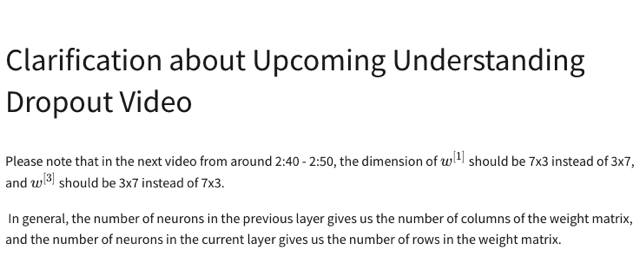</kbd>

     

### Understanding Dropout

 

- 1 Dropout is a \\*regularization\\* technique that randomly knocks out units in a neural network, giving the effect of working with a \\*smaller network\\*, which can \\*prevent overfitting\\*.  2 Dropout \\*shrinks the squared norm of the weights\\* by \\*spreading out the weights\\*, which is similar to \\*L2 regularization\\*.  3 The L2 penalty on different ways can be different depending on the size of the activation being multiplied into that way, making dropout an adaptive form of L2 regularization.  4 To implement \\*dropout\\*, a \\*keep-prop\\* is chosen, which is the \\*chance of keeping a unit in each layer\\*, and it is feasible to \\*vary keep-prop by layer\\* to reduce overfitting.  5 It is possible to \\*apply dropout to the input layer\\*, but it is \\*less common in practice\\*.  6 Dropout is frequently used in c\\*omputer visio\\*n due to the\\* large input sizes\\* and lack of data, but should \\*only be used if overfitting occurs.\\*  7 The \\*downside\\* of using dropout is that it introduces \\*additional hyperparameters\\* to search for using cross-validation, and it is important to consider \\*which layers are most prone to overfitting.\\*
  > 1 What is dropout?
  >  2 Dropout is a regularization technique used in neural networks to prevent overfitting. It randomly drops out or "knocks out" units in the network on each iteration, effectively creating a smaller network.
  >
  >  3 How does dropout work as a regularizer?
  >  4 Dropout works as a regularizer by preventing units from relying too heavily on any one feature, forcing them to spread out their weights and not overfit to specific patterns in the data. This leads to a shrinking effect on the squared norm of the weights, similar to the effect of L2 regularization. In fact, dropout can be shown to be an adaptive form of L2 regularization, where the penalty on different weights varies depending on the size of the activation being multiplied into that weight.
  >
  >  5 What is the intuition behind dropout from the perspective of a single unit?
  >  6 The intuition behind dropout from the perspective of a single unit is that, for a unit to do its job, it needs to generate a meaningful output based on its inputs. However, with dropout, inputs can get randomly eliminated, meaning that any one feature could go away at random. This makes the unit reluctant to put too much weight on any one input, and instead, it spreads out its weights and gives a little bit of weight to each of the inputs. This, in turn, has a regularizing effect on the network.
  >
  >  7 How can the keep prop be varied by layer when implementing dropout?
  >  8 The keep prop, which is the chance of keeping a unit in each layer, can be varied by layer when implementing dropout. For example, in a network with three input features and seven hidden units, the first weight matrix (W1) would be 7x3, the second (W2) would be 7x7, and the third (W3) would be 3x7, and so on. The keep prop can be set to a lower value for layers where you worry more about overfitting and a higher value for layers where you worry less about overfitting. In practice, a keep prop of 1.0 is common for the input layer, where you want to keep all the features.
  >
  >  9 What are some implementation tips for using dropout?
  >  10 Some implementation tips for using dropout include:
  >  • Using dropout only if you're worried about overfitting
  >  • Varying the keep prop by layer to apply a more powerful form of dropout to layers with more parameters
  >  • Applying dropout to the input layer only if needed, with a keep prop close to 1.0
  >  • Being mindful of the hyperparameters involved in using dropout and using cross-validation to find the best values
  >  • Being aware that dropout is commonly used in computer vision applications, but it can also be used in other areas where overfitting is a concern.

   

    
    
<kbd>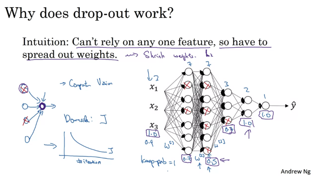</kbd>

    > Apply d**ifferent Keep-Prob cho layer khác nhau,** layer nào **nhiều
    > unit** -> **độ overfitting cao** thì cho **K.P nhỏ** (Để dropout nhiều)
    > và ngược lại.
    >
    > Hay dùng trong Computer Vision (do dễ bị overfitting)
    >
    > Downside: Đại khái là J ko còn được define tốt nữa dẫn đến **ko đo
    > lường sự giảm của J** được (trong quá trình G.D vẽ ra **learning
    > curve.** Nên đại khái ổng nói là ổng sẽ **turn off D.O để make sure J
    > giảm dần rồi sau đó mới mở lên.**
    >
    > "So you lose this **debugging tool** to have a plot a draft like this. So
    > what I usually do is **turn off drop out** or if you will **set keep-propped
    > = 1** and run my code and make sure that it is monitored quickly
    > decreasing J. And then **turn on drop out**"

    > Đại khái là vì các feature (ý là input vào một layer, chính là output của layer
    > trước) có thể biến mất tuỳ hứng nên các hidden unit nó sẽ học cách' không
    > phụ thuộc vào 1 feature nào mà sẽ **'spreading out the weights'**

     

  
  - 1 What is dropout?  2 Dropout is a regularization technique used in neural networks to prevent overfitting. It randomly drops out or "knocks out" units in the network on each iteration, effectively creating a smaller network.  3 How does dropout work as a regularizer?  4 Dropout works as a regularizer by preventing units from relying too heavily on any one feature, forcing them to spread out their weights and not overfit to specific patterns in the data. This leads to a shrinking effect on the squared norm of the weights, similar to the effect of L2 regularization. In fact, dropout can be shown to be an adaptive form of L2 regularization, where the penalty on different weights varies depending on the size of the activation being multiplied into that weight.  5 What is the intuition behind dropout from the perspective of a single unit?  6 The intuition behind dropout from the perspective of a single unit is that, for a unit to do its job, it needs to generate a meaningful output based on its inputs. However, with dropout, inputs can get randomly eliminated, meaning that any one feature could go away at random. This makes the unit reluctant to put too much weight on any one input, and instead, it spreads out its weights and gives a little bit of weight to each of the inputs. This, in turn, has a regularizing effect on the network.  7 How can the keep prop be varied by layer when implementing dropout?  8 The keep prop, which is the chance of keeping a unit in each layer, can be varied by layer when implementing dropout. For example, in a network with three input features and seven hidden units, the first weight matrix (W1) would be 7x3, the second (W2) would be 7x7, and the third (W3) would be 3x7, and so on. The keep prop can be set to a lower value for layers where you worry more about overfitting and a higher value for layers where you worry less about overfitting. In practice, a keep prop of 1.0 is common for the input layer, where you want to keep all the features.  9 What are some implementation tips for using dropout?  10 Some implementation tips for using dropout include:  • Using dropout only if you're worried about overfitting  • Varying the keep prop by layer to apply a more powerful form of dropout to layers with more parameters  • Applying dropout to the input layer only if needed, with a keep prop close to 1.0  • Being mindful of the hyperparameters involved in using dropout and using cross-validation to find the best values  • Being aware that dropout is commonly used in computer vision applications, but it can also be used in other areas where overfitting is a concern.
     

### Other Regularization Methods

 

- 1 Introduction to regularization techniques in neural networks  2 \\*Data augmentation\\* as a regularization technique, including flipping and cropping images to create new examples  3 \\*Early stopping\\* as a technique to prevent overfitting by stopping the training process early  4 How early stopping works by selecting a mid-size parameter value for the neural network  5 Downside of using early stopping and \\*separating optimization and regularization\\* tasks in machine learning.
  > Sure, here's a more detailed answer, still using indexed style:
  >  1 Regularization techniques: In addition to L2 regularization and dropout, there are other techniques for reducing overfitting in neural networks. One such technique is data augmentation, which involves adding synthetic training examples to the dataset by applying random transformations to existing examples, such as flipping an image horizontally or taking random crops. This can help to make the training set less redundant and provide more variety for the model to learn from. Another technique is early stopping, which involves monitoring the validation error as the model is trained and stopping the training process when the error stops improving or starts to increase. This can help to prevent the model from overfitting to the training data by finding the best point at which to stop training.
  >
  > 2 Data augmentation: Data augmentation is a technique for creating additional training examples by applying random transformations to existing examples in the dataset. For example, flipping an image horizontally or taking random crops can help to provide more variety for the model to learn from. This technique can be especially useful when it's difficult or expensive to obtain more data. However, it's important to use transformations that are relevant to the problem at hand, such as flipping a cat image horizontally but not vertically.
  >
  > 3 Early stopping: Early stopping is a technique for preventing overfitting by monitoring the validation error as the model is trained and stopping the training process when the error stops improving or starts to increase. This helps to find the best point at which to stop training and prevent the model from overfitting to the training data. However, it's important to be aware of the potential downsides of early stopping, such as the need to choose an appropriate stopping point and the potential for increased computational cost.
  >
  > 4 Choosing regularization techniques: When choosing regularization techniques for a neural network, it's important to consider the trade-off between reducing bias and reducing variance. L2 regularization can help to reduce variance by penalizing large weights, while dropout can help to reduce variance by randomly dropping out units during training. Data augmentation can also help to reduce variance by providing more variety for the model to learn from. On the other hand, early stopping can help to reduce variance by finding the best point at which to stop training, but may also increase bias if the model is not allowed to train for long enough.
  >
  > 5 Separating optimization and regularization: One approach to machine learning is to separate the tasks of optimization and regularization. In this approach, the focus is on finding the best values of the weights and biases that minimize the cost function, without considering methods for reducing overfitting. After optimizing the cost function, regularization techniques such as L2 regularization, dropout, or data augmentation can be applied to reduce overfitting. This can simplify the process of choosing among the space of possible algorithms and hyperparameters, making machine learning easier to understand and implement.

   

    
    
<kbd>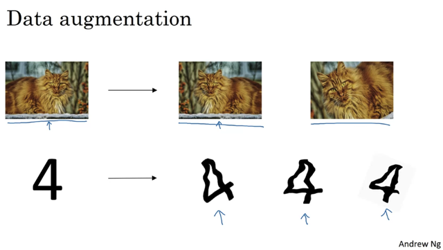</kbd>

    > Đại khái là tạo thêm data thì sẽ giảm Overfitting

     

    
    
<kbd>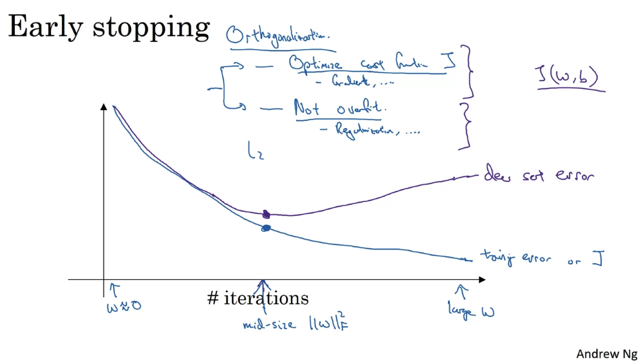</kbd>

    > **Early stoping:**Pros**: Chỉ chạy G.D rồi quyết định stop để lấy ra W.b
    > Cons: V**i phạm phương pháp MỖI LẦN 1 VIỆC - 
    > **Orthogonalization**: Tức là Tập trung giảm J hoặc tập trung 
    > giảm Overfitting -> Nó phải hy sinh việc tìm ra W, b sao cho J min 
    > để đánh đổi việc không bị overfitting
    >
    > **L2_Reg** 
    > Pros Cứ Train cho đã đời mà ko sợ (Overfiting)
    > Cons: là phải chọn **lambda** -> More computational expensive

     

  
  - Sure, here's a more detailed answer, still using indexed style:  1 Regularization techniques: In addition to L2 regularization and dropout, there are other techniques for reducing overfitting in neural networks. One such technique is data augmentation, which involves adding synthetic training examples to the dataset by applying random transformations to existing examples, such as flipping an image horizontally or taking random crops. This can help to make the training set less redundant and provide more variety for the model to learn from. Another technique is early stopping, which involves monitoring the validation error as the model is trained and stopping the training process when the error stops improving or starts to increase. This can help to prevent the model from overfitting to the training data by finding the best point at which to stop training.  2 Data augmentation: Data augmentation is a technique for creating additional training examples by applying random transformations to existing examples in the dataset. For example, flipping an image horizontally or taking random crops can help to provide more variety for the model to learn from. This technique can be especially useful when it's difficult or expensive to obtain more data. However, it's important to use transformations that are relevant to the problem at hand, such as flipping a cat image horizontally but not vertically.  3 Early stopping: Early stopping is a technique for preventing overfitting by monitoring the validation error as the model is trained and stopping the training process when the error stops improving or starts to increase. This helps to find the best point at which to stop training and prevent the model from overfitting to the training data. However, it's important to be aware of the potential downsides of early stopping, such as the need to choose an appropriate stopping point and the potential for increased computational cost.  4 Choosing regularization techniques: When choosing regularization techniques for a neural network, it's important to consider the trade-off between reducing bias and reducing variance. L2 regularization can help to reduce variance by penalizing large weights, while dropout can help to reduce variance by randomly dropping out units during training. Data augmentation can also help to reduce variance by providing more variety for the model to learn from. On the other hand, early stopping can help to reduce variance by finding the best point at which to stop training, but may also increase bias if the model is not allowed to train for long enough.  5 Separating optimization and regularization: One approach to machine learning is to separate the tasks of optimization and regularization. In this approach, the focus is on finding the best values of the weights and biases that minimize the cost function, without considering methods for reducing overfitting. After optimizing the cost function, regularization techniques such as L2 regularization, dropout, or data augmentation can be applied to reduce overfitting. This can simplify the process of choosing among the space of possible algorithms and hyperparameters, making machine learning easier to understand and implement.
     

## Setting Up Your Optimization Problem

 

### Normalizing Inputs

 

- 1 \\*Normalizing inputs\\* can \\*speed up\\* neural network training.  2 The normalization process involves \\*subtracting the mean\\* and \\*normalizing the variances\\* of the input features.  3 It is important to \\*use the same normalization parameters\\* for both \\*training\\* and \\*test\\* sets.  4 Normalizing input features helps to ensure that the\\* cost function\\* is more \\*symmetric\\* and \\*easier to optimize\\*.  5 Features should be on \\*similar scales\\* to avoid \\*elongated cost functions\\* and \\*slow gradient descent\\*.  6 Normalizing features is especially important when the \\*input features\\* come from \\*dramatically different scales.\\*  7 Normalization generally \\*does not harm performance\\*, and is often \\*beneficial in speeding up\\* training.  8 There are other techniques to speed up neural network training that will be discussed in the next section.
  > ure, here's a more detailed answer:
  >
  >  1 Normalizing Inputs: When training a neural network, one technique to speed up the training is to normalize your inputs. This involves two steps:
  >
  >  2 a. Subtract out or zero out the mean: This step involves calculating the mean of the input features using the formula mu = 1/m * sum(x_i) and subtracting it from each training example, so x_i becomes x_i - mu.
  >
  >  3 b. Normalize the variances: In this step, the variance of each feature is calculated using the formula sigma^2 = 1/m * sum(x_i^2) and then each example is divided by this vector sigma. This ensures that each feature has equal variance and results in a more symmetric cost function.
  >
  >  4 Importance of Normalizing Inputs: Normalizing inputs is important because if the features are on very different scales, it's more likely that the cost function will be elongated and the parameters will take on very different values. This results in a more difficult optimization problem, and the gradient descent algorithm may take a lot of steps before it finds the minimum. Normalizing the inputs ensures that the cost function is more symmetric, and gradient descent can go straight to the minimum without oscillating around.
  >
  >  5 When to Normalize Inputs: Normalizing inputs is particularly important when the features come from very different scales, such as one feature ranging from 1-1000 and another from 0-1. However, performing this type of normalization typically doesn't harm the training algorithm, and it's often done regardless of the feature scales. If the features come in on similar scales, such as all ranging from -1 to 1, then this step is less important, but it can still be helpful in speeding up training.
  >
  > 6 Consistency in Normalization: When normalizing the training data, it's important to use the same mu and sigma to normalize the test set. This ensures that the data goes through the same transformation, and the test set is scaled in the same way as the training set.
  >
  >  7 Other Techniques to Speed up Training: There are other techniques to speed up training of neural networks, such as:
  >  8 a. Using an appropriate learning rate
  >  9 b. Using early stopping to prevent overfitting
  >  10 c. Regularization to prevent overfitting
  >  11 d. Using dropout to prevent overfitting
  >  12 e. Using batch normalization to stabilize training
  >  13 f. Using a better optimization algorithm such as Adam, RMSProp, or Adagrad.

   

    
    
<kbd>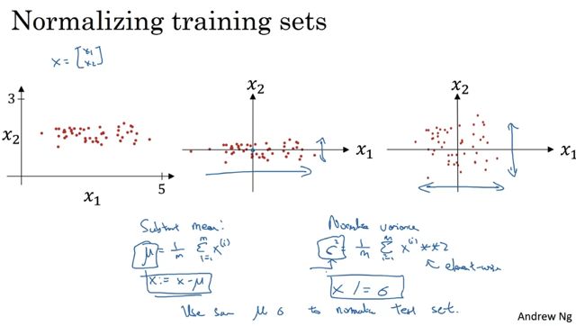</kbd>

     

    
    
<kbd>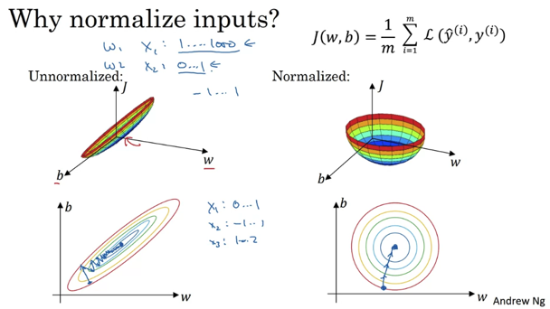</kbd>

     

  
  - ure, here's a more detailed answer:  1 Normalizing Inputs: When training a neural network, one technique to speed up the training is to normalize your inputs. This involves two steps:  2 a. Subtract out or zero out the mean: This step involves calculating the mean of the input features using the formula mu = 1/m * sum(x_i) and subtracting it from each training example, so x_i becomes x_i - mu.  3 b. Normalize the variances: In this step, the variance of each feature is calculated using the formula sigma^2 = 1/m * sum(x_i^2) and then each example is divided by this vector sigma. This ensures that each feature has equal variance and results in a more symmetric cost function.  4 Importance of Normalizing Inputs: Normalizing inputs is important because if the features are on very different scales, it's more likely that the cost function will be elongated and the parameters will take on very different values. This results in a more difficult optimization problem, and the gradient descent algorithm may take a lot of steps before it finds the minimum. Normalizing the inputs ensures that the cost function is more symmetric, and gradient descent can go straight to the minimum without oscillating around.  5 When to Normalize Inputs: Normalizing inputs is particularly important when the features come from very different scales, such as one feature ranging from 1-1000 and another from 0-1. However, performing this type of normalization typically doesn't harm the training algorithm, and it's often done regardless of the feature scales. If the features come in on similar scales, such as all ranging from -1 to 1, then this step is less important, but it can still be helpful in speeding up training.  6 Consistency in Normalization: When normalizing the training data, it's important to use the same mu and sigma to normalize the test set. This ensures that the data goes through the same transformation, and the test set is scaled in the same way as the training set.  7 Other Techniques to Speed up Training: There are other techniques to speed up training of neural networks, such as:  8 a. Using an appropriate learning rate  9 b. Using early stopping to prevent overfitting  10 c. Regularization to prevent overfitting  11 d. Using dropout to prevent overfitting  12 e. Using batch normalization to stabilize training  13 f. Using a better optimization algorithm such as Adam, RMSProp, or Adagrad.
     

### Vanishing / Exploding Gradients

 

- 1 The problem of data \\*vanishing\\* and \\*exploding\\* gradients in deep neural networks  2 The effect of \\*weight initialization\\* on the vanishing and exploding gradients  3 Mathematical explanation of the effect of weight initialization on the output Y and activations A  4 The intuition behind the \\*exponential increase\\* or \\*decrease\\* of activations with a very deep network  5 The similar exponential increase or decrease of gradients as \\*a function of the number of layers\\*  6 The difficulty of training when gradients are exponentially smaller or larger than L  7 The partial solution to the problem of vanishing and exploding gradients: \\*careful choice of weight initialization\\*
  > 1 The problem of vanishing and exploding gradients: When training a very deep neural network, the derivatives or slopes of the network can sometimes get very small or very large, making training difficult. This is known as the problem of vanishing and exploding gradients.
  >  2 Weight initialization and its impact on the problem: Careful choices of random weight initialization can significantly reduce the problem of vanishing and exploding gradients.
  >  3 The structure of a neural network: A neural network has layers and hidden units, and each layer has weight matrices W1, W2, W3, etc. The output Y is the result of a multiplication of all the weight matrices and the input X.
  >  4 Linear activation function and biases: In the video, the activation function used is a linear function and the bias is ignored to simplify the calculation.
  >  5 The impact of weight matrices on activations: If each weight matrix is slightly larger than 1 times the identity matrix, the activations will increase exponentially as a function of the number of layers L. On the other hand, if each weight matrix is slightly smaller than the identity matrix, the activations will decrease exponentially.
  >  6 The impact of weight matrices on gradients: The same argument can be used to show that the derivatives or gradients of the network will also increase or decrease exponentially as a function of the number of layers.
  >  7 The difficulty of training deep networks: If the activations or gradients increase or decrease exponentially as a function of the number of layers, it can make training difficult, especially if the gradients become exponentially smaller than L.
  >  8 Partial solution to the problem: Careful choice of weight initialization can help to alleviate the problem of vanishing and exploding gradients, but it doesn't completely solve the problem.
  >  9 Importance of weight initialization: Weight initialization is an important aspect of training neural networks and can have a significant impact on the success of the training.
  >  10 Conclusion: Vanishing and exploding gradients can be a significant problem when training deep neural networks, but careful weight initialization can help to mitigate the problem.

   

    
    
<kbd>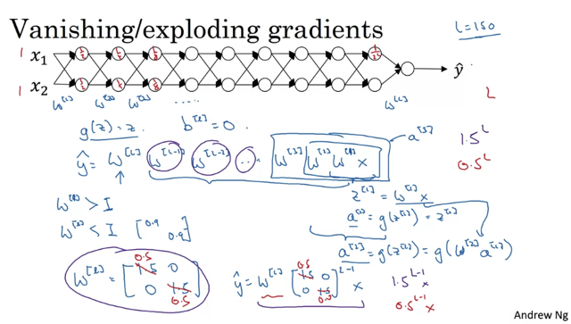</kbd>

    > **Vanishing and Exploding Gradients:**
    > Chữ **gradient** ý muốn nói 'Sự thay đổi của the output of the model
    > do sự thay đổi của tham số' (the change in the output of a model 
    > with respect to a change in its weights)
    >
    > **Vanishing** **gradient** ý nói khi gradient quá nhỏ khiến cho model
    > update rất chậm, khiến quá trình training rất chậm thậm chí dừng
    > luôn.
    >
    > **Exploding** **gradient** thì ngược lại, khiến model update quá nhanh, 
    > khiến kết quả không stable.
    >
    > Một số giải pháp là dùng hàm activation khác như **Relu, Tanh** và **initialization**

    > I - Identity matrix **[1 0; 0 1]**
    >
    > Đại khái ổng giả sử 1 NN như vầy, coi như không dùng activation function
    > - g(z) = z và bỏ qua b giả thì triển khai ra  được y^ là = W[L] (W[L-1]**(L-1))X  (giả sử thêm W của
    > hidden unit bằng nhau)
    >
    > Ý muốn nói có nghĩa là y^ sẽ là một function theo số mũ L Từ đó nếu W của hidden unit nhỏ hơn
    > Identity matrix 1 chút ví dụ như 0.5 0; 0 0,5 thì y^ sẻ nhỏ đi theo cấp luỹ thừa của L tức là sẽ rất rất
    > nhỏ
    >
    > Ngược lại nếu W của hidden unit lớn hơn một chút, thì y^ sẽ lớn theo cấp luỹ thừa
    >
    > Thì ý ổng là tương tự như như ở đây lấy việc **tính activation qua các layer** ra để minh hoạ thì với
    > g**radient nó cũng vậy**, từ đó tạo ra hiện tượng **exploding gradient** và **vanishing gradient**

     

    
    
<kbd>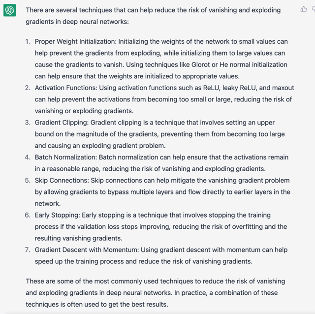</kbd>

     

  
  - 1 The problem of vanishing and exploding gradients: When training a very deep neural network, the derivatives or slopes of the network can sometimes get very small or very large, making training difficult. This is known as the problem of vanishing and exploding gradients.  2 Weight initialization and its impact on the problem: Careful choices of random weight initialization can significantly reduce the problem of vanishing and exploding gradients.  3 The structure of a neural network: A neural network has layers and hidden units, and each layer has weight matrices W1, W2, W3, etc. The output Y is the result of a multiplication of all the weight matrices and the input X.  4 Linear activation function and biases: In the video, the activation function used is a linear function and the bias is ignored to simplify the calculation.  5 The impact of weight matrices on activations: If each weight matrix is slightly larger than 1 times the identity matrix, the activations will increase exponentially as a function of the number of layers L. On the other hand, if each weight matrix is slightly smaller than the identity matrix, the activations will decrease exponentially.  6 The impact of weight matrices on gradients: The same argument can be used to show that the derivatives or gradients of the network will also increase or decrease exponentially as a function of the number of layers.  7 The difficulty of training deep networks: If the activations or gradients increase or decrease exponentially as a function of the number of layers, it can make training difficult, especially if the gradients become exponentially smaller than L.  8 Partial solution to the problem: Careful choice of weight initialization can help to alleviate the problem of vanishing and exploding gradients, but it doesn't completely solve the problem.  9 Importance of weight initialization: Weight initialization is an important aspect of training neural networks and can have a significant impact on the success of the training.  10 Conclusion: Vanishing and exploding gradients can be a significant problem when training deep neural networks, but careful weight initialization can help to mitigate the problem.
     

### Weight Initialization For Deep Networks

 

- 1 Problem of vanishing and exploding gradients in very deep neural networks  2 Partial solution is a better or more \\*careful choice of random initialization\\* for the neural network  3 Example of initializing weights for a single neuron  4 Generalizing to deep networks  5 Setting \\*variance of weights\\* to \\*prevent z from blowing up\\* or becoming \\*too small\\*  6 Setting weight matrix W for a certain layer to \\*np.random.randn\\* times \\*square root of 1 over the number of features\\* that are fed into each neuron in layer l  7 Using a variance of \\*2/n\\* for \\*ReLu\\* activation function, and \\*1/n\\* for TanH activation function  8 Different initialization formulas: \\*Xavier\\* initialization and \\*Yoshua Bengio's\\* formula  9 The \\*variance\\* parameter can be tuned with \\*hyperparameters\\*  10 Importance of choosing a\\* reasonable scaling for weight initialization\\* to avoid exploding or vanishing gradients  11 The trick can help neural networks trained much more quickly
  > Sure, here is a more detailed summary of the video:
  >  1 The video discusses the problem of vanishing and exploding gradients in deep neural networks, where the gradients of the loss function with respect to the weights become either too small or too large, leading to slow or unstable learning.
  >  2 One partial solution to this problem is to use better weight initialization techniques, which can help control the scale of the activations and gradients throughout the network.
  >  3 To understand weight initialization, the video starts with the example of a single neuron, where the input features are multiplied by weights and summed up to produce an activation value, which is then passed through an activation function to produce an output.
  >  4 To prevent the activation values from becoming too large or too small, it is desirable to set the variance of the weights to an appropriate value. In particular, if the number of input features is large, the weights should be scaled down by a factor proportional to the square root of the number of input features, in order to keep the activation value from growing too large.
  >  5 For a deep neural network with multiple layers, the same principle applies, but with the number of input features replaced by the number of units in the previous layer. Specifically, the variance of the weights for each layer should be scaled down by a factor proportional to the square root of the number of units in the previous layer.
  >  6 The video notes that this initialization technique works particularly well with ReLU activation functions, and that a scaling factor of 2/n (rather than 1/n) should be used for ReLU in order to achieve better performance.
  >  7 Other activation functions may require different initialization techniques. For example, the Tanh activation function may require a scaling factor of 1/sqrt(n) instead of 2/sqrt(n), which is known as the Xavier initialization.
  >  8 In practice, the variance of the weights can be adjusted by a hyperparameter, which can be tuned to achieve better performance on a particular task.
  >  9 Overall, weight initialization is an important technique for improving the stability and efficiency of deep learning, and should be carefully considered when designing and training deep neural networks.

   

    
    
<kbd>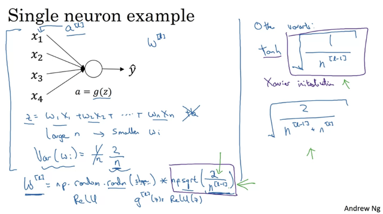</kbd>

    > Đại khái là ini weight randomly nhưng nhân thêm (element-wise) với:
    >
    > random(...)*sqrt(**2/số feature = unit của layer trước**)  (**2/fan_in**)
    >
    > thì cái này có tên là **He (hoặc Klaiming) - initialization**, work tốt 
    > với reLU, LeakyReLU, ELU, GELU, Swish, Mish.. 
    > Do ông **Kaiming He** phát minh (Ageron p.360)
    >
    > Nếu activation là None, tanh, softmax thì dùng Glorot /Xavier initilization:
    > thay term trong sqrt bằng **1/fan_average**
    >
    > với fan là chỉ số feature vào hoặc ra một layer:
    > nên fan_average là 0.5(số unit layer trước + số unit layer này)
    >
    > Chỗ này ông Andrew bị nhầm, Xavier phải là 1/fan_avg = 2/(n[l-1]+n[l])
    > mới đúng ổng chỉ cái trên là sai.
    >
    > Cái trên **1/fan_in** là **LeCun** initialization work tốt đv **SELU** (Ageron)

    > Nói chung là các công thức ini He/Kaiming - Glorot / Xavier - LeCun khác nhau
    > chút đỉnh ở cái term trong dấu sqrt và mỗi cái sẽ work tốt tuỳ activation function.

     

  
  - Sure, here is a more detailed summary of the video:  1 The video discusses the problem of vanishing and exploding gradients in deep neural networks, where the gradients of the loss function with respect to the weights become either too small or too large, leading to slow or unstable learning.  2 One partial solution to this problem is to use \\*better weight initialization techniques\\*, which can help \\*control the scale\\* of the \\*activations\\* \\*and\\* \\*gradients\\* throughout the network.  3 To understand weight initialization, the video starts with the example of a single neuron, where the input features are multiplied by weights and summed up to produce an activation value, which is then passed through an activation function to produce an output.  4 To prevent the activation values from becoming too large or too small, it is desirable to \\*set the variance of the weights to an appropriate value\\*. In particular, if the number of input features is large, the weights should be \\/\\*scaled down by a factor proportional to the square root of the number of input features\\*\\/, in order to keep the activation value from growing too large.  5 For a \\*deep neural network\\* with multiple layers, the same principle applies, but with the number of input features replaced by the \\*number of units in the previous layer\\*. Specifically, the variance of the weights for each layer should be \\/\\*scaled down by a factor proportional to the square root of the number of units in the previous layer.\\*\\/  6 The video notes that this initialization technique works particularly well with \\*ReLU\\* activation functions, and that a scaling factor of 2/n (rather than 1/n) should be used for ReLU in order to achieve better performance.  7 \\*Other activation functions\\* may require different initialization techniques. For example, the \\*Tanh\\* activation function may require a \\*scaling factor of 1/sqrt(n) instead of 2/sqrt(n)\\*, which is known as the \\*Xavier initialization\\*.  8 In practice, the \\*variance of the weights \\*can be \\*adjusted by a hyperparameter\\*, which can be \\*tuned\\* to achieve better performance on a \\*particular task.\\*  9 Overall, \\*weight initialization\\* is an important technique for improving the \\*stability\\* and \\*efficiency\\* of deep learning, and should be carefully considered when designing and training deep neural networks.
     

### Numerical Approximation Of Gradients

 

- 1 Backpropagation implementation requires testing to ensure correctness  2 Numerically approximating computations of gradients helps build up to gradient checking  3 Two-sided difference gives a better approximation of the gradient than a one-sided difference  4 Formal definition of a derivative is f of theta plus epsilon minus f of theta minus epsilon over 2 epsilon  5 Error of approximation is on the order of epsilon squared for the formal definition and on the order of epsilon for the two-sided difference  6 Two-sided difference is preferred for gradient checking, even though it runs twice as slow as one-sided difference
  > 1 When implementing backpropagation, it's important to check that your implementation is correct.
  >  2 One way to do this is through gradient checking, which involves approximating the gradient of a function numerically.
  >  3 To approximate the gradient, you can nudge the input variable (e.g. theta) by a small amount (e.g. epsilon) to get two new values of the function (f(theta+epsilon) and f(theta-epsilon)).
  >  4 You can then compute the height of a larger triangle using these two values, which provides a more accurate estimate of the gradient.
  >  5 This method involves taking a two-sided difference, rather than a one-sided difference, which leads to greater accuracy in the approximation.
  >  6 The approximation error for the two-sided difference is on the order of epsilon squared, which is much smaller than the error for the one-sided difference (which is on the order of epsilon).
  >  7 When doing gradient checking, it's important to use the more accurate two-sided difference method, even though it may be slower.
  >  8 The formal definition of the derivative involves taking the limit of the difference quotient as epsilon approaches zero.
  >  9 The approximation error for a non-zero value of epsilon is on the order of epsilon squared.
  >  10 The two-sided difference method involves computing f(theta+epsilon) and f(theta-epsilon), which provides a better approximation of the gradient and reduces the approximation error.

   

    
    
<kbd>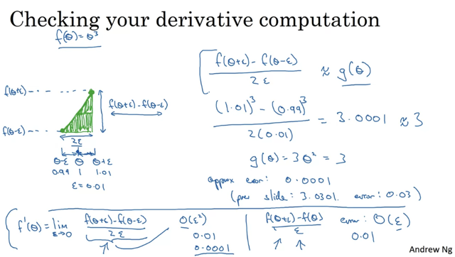</kbd>

    > Khúc cuối ổng nói đại khái là vầy, có 2 cách tính gần đúng 
    > giá trị (**dJ/dθ**) để thực hiện việc Gradient Checking - So sánh giá
    > trị gần đúng của dJ/dθ (or dJ/dw, dJ/db) với kết quả của 
    > Gradient descent để đảm bảo G.D đang chạy đúng )
    >
    > Thì dùng '**2 side difference approximation**' sẽ chính xác hơn 
    > là **1-side difference approximation**

    > Đại khái là check xem (trong quá trình backprop) gradient
    > mình tính có đúng không (đây là đ.v việc tự backprop chứ
    > làm bằng Keras thì khỏi bàn)
    > Cách làm là so sánh dJ/dtheta với 'gần đúng của dJ/dtheta) tính bằng
    > [ J(theta+epsilon)-J(theta-epsilon) ] / 2*epsilon
    >
    > Ổng lấy ví dụ hàm J(theta) = theta***3 -> dJ/dtheta = 3*theta**2
    > thì giả dụ với theta = 1 thì tính bằng gần đúng sẽ ra
    > 3.0001 gần bằng với 3*1**2 = 3.
    >
    > Đại khái là ổng minh hoạ việc tính ra term gần đúng của dj/dtheta
    > sẽ gần bằng dj/dtheta lúc Backprop.
    >
    > Còn về cách tính thì nhìn hình là hiểu:
    > dJ/dtheta (derivative / đạo hàm của hàm J w.r.t theta) chính là hệ số
    > góc của tiếp tuyến với hàm J tại theta (=tang của góc bởi tiếp tuyến
    > và phương ngang) -> thì góc này có thể tính gần đúng bằng
    > góc dưới của tam giác màu xanh lá.

     

    
    
<kbd>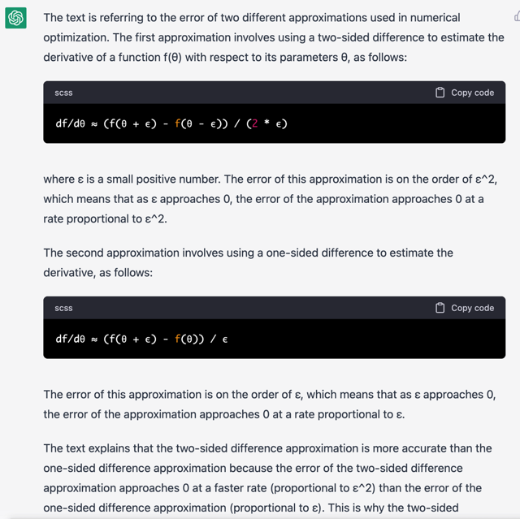</kbd>

    > Đại khái là 1 cái thì error giảm (về không) với 1 tốc
    > độ tỉ lệ thuận với bình phương của epsilon nên
    > nhanh hơn cái kia chỉ tỉ lệ thuận với epsilon nên
    > cái đầu chính xác hơn

     

  
  - 1 When implementing \\*backpropagation\\*, it's important to \\*check that your implementation is correct.\\*  2 One way to do this is through\\* gradient checking\\*, which involves \\*approximating the gradient of a function numerically\\*.  3 To approximate the gradient, you can \\*nudge\\* the\\* input variable\\* (e.g. \\*theta\\*) by a \\*small amount\\* (e.g. \\*epsilon\\*) to get two new values of the function (\\*f(theta+epsilon) and f(theta-epsilon)\\*).  4 You can then compute the height of a larger triangle using these two values, which provides a more accurate estimate of the gradient.  5 This method involves taking a\\* two-sided difference\\*, rather than a \\*one-sided difference\\*, which leads to \\*greater accuracy\\* in the approximation.  6 The approximation \\*error for the two-sided difference\\* is on the order of \\*epsilon squared\\*, which is much smaller than the \\*error for the one-sided difference\\* (which is on the order of \\*epsilon\\*).  7 When doing gradient checking, it's important to use the more accurate two-sided difference method, even though it may be slower.  8 The formal definition of the derivative involves taking the limit of the difference quotient as epsilon approaches zero.  9 The approximation error for a non-zero value of epsilon is on the order of epsilon squared.  10 The two-sided difference method involves computing f(theta+epsilon) and f(theta-epsilon), which provides a \\*better approximation of the gradient\\* and \\*reduces the approximation error.\\*
     

### Gradient Checking

 

- 1 Gradient checking is a technique to debug and verify the correctness of back propagation implementations in neural networks.  2 To implement gradient checking, the first step is to \\*reshape all the network parameters into a giant vector theta. \\* 3 The cost function J is then expressed as a \\*function of theta.\\*  4 Next, all the \\*derivatives\\* of the cost function with respect to the network \\*parameters\\* are also \\*reshaped into a giant vector d theta\\*.  5 To perform gradient checking, a \\*loop\\* is implemented for \\*each component of theta\\*, where a two-sided difference is taken for each component of theta.  6 The \\*difference is then divided by 2 epsilon\\* to \\*approximate\\* the partial derivative of J with respect to that component of theta.  7 The approximation for each component is then computed for every value of i.  8 The d\\*ifference between the approximation and the actual derivative\\* is then computed u\\*sing the Euclidean distance formula\\*.  9 If the \\*difference is very smal\\*l (i.e., less than\\* 10^-7\\*), the derivative approximation is l\\*ikely correct.\\*  10 If the difference is larger, it is possible that there is a bug in the implementation, and the individual components of d theta should be checked to locate the source of the problem.
  > Sure, I'd be happy to provide a more detailed answer for you!
  >  1 Gradient checking is a technique used to debug and verify the implementation and backpropagation process in a neural network. It can save a lot of time and help identify bugs in implementations.
  >  2 To implement gradient checking, the first step is to take all the network parameters, such as W1, B1, etc., and reshape them into a giant parameter vector called theta. This involves reshaping all the W's into vectors and concatenating them with the other parameters.
  >  3 Next, the cost function J is transformed into a function of theta. The derivatives, such as dW[1], db[1], etc., are then reshaped into a giant vector called d theta.
  >  4 To implement gradient checking, a loop is used to compute d theta approx i for each component of theta. This involves taking a two-sided difference of J of theta by nudging theta i up and down by a small amount (epsilon) and computing the difference between these values.
  >  5 The two resulting vectors, d theta approx and d theta, are then compared to check if they are approximately equal. This is done by computing the Euclidean distance between the vectors and normalizing it by the lengths of the vectors.
  >  6 A good value for epsilon is around 10^-7, and if the formula gives a value of 10^-7 or smaller, the derivative approximation is likely correct. If it is around 10^-5, it's worth double-checking the components of the vector. If it is larger than 10^-3, there may be a bug somewhere, and it's important to investigate individual components of d theta to try and track down the source of the problem.
  > Overall, gradient checking is an important technique for debugging and verifying neural network implementations, and can help save time and prevent bugs in the backpropagation process.

   

    
    
<kbd>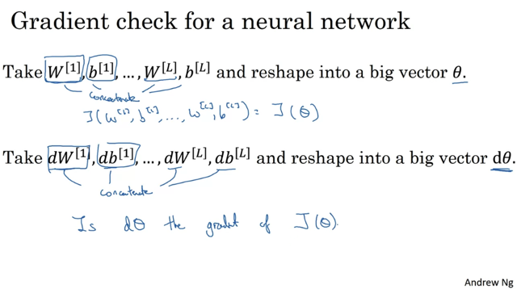</kbd>

     

    
    
<kbd>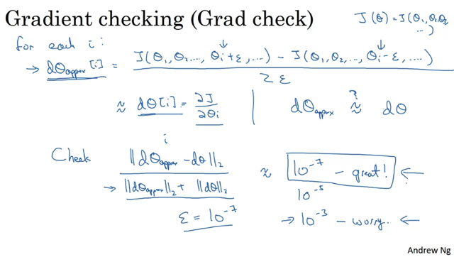</kbd>

    > Đại khái là dùng '2-side difference approximation' để tính ra vector
    > **d(θ_approx)** rồi so sánh xem nó có **gần bằng** với **d(θ)**
    > hay không
    >
    > Check bằng công thức trong hình.

    > "So when implementing a neural network, what often happens is 
    > I'll implement foreprop, implement backprop. And then I might find 
    > that this grad check has a relatively **big value**. And then I will 
    > suspect that there **must be a bug**, go in **debug, debug, debug**. 
    > And after debugging for a while, If I find that it **passes grad 
    > check with a small value**, then you can be much **more 
    > confident** that it's then correct."

    > Loop trong vector **Θ** chứa toàn bộ params **θ_i**, để tính  **dθ_i
    > approx** - giá trị approximation của dJ w.r.t từng θ_i,  mỗi cái tính bằng
    > công thức đã biết:
    >
    > **dθ_i = [J(θ_i + epsilon) - J(θ_i - epsilon)] / 2*epsilon**
    >
    > Bỏ vào để ra vector **dΘ_approx**
    >
    > So sánh: Không phải là so từng cái mà là so cả vector **dΘ_approx** với
    > **dΘ** (cái này là từ backprop) bằng cách dùng **Euclidean norm** (còn
    > gọi là L2 norm) của **hiệu 2 vector này**. 
    >
    > Tức là tính norm của **dΘ_approx - dΘ**
    >
    > Công thức tính L2 norm là bằng square root của tổng bình phương các
    > element trong vector.
    >
    > Với cách tính này kiểu như **sqrt của tổng bình phương các sai  lệch**
    > giữa **dθ_i approx** và **dθ_i** vậy
    >
    > So sánh sai lệch này nếu nhỏ hơn 10^-7 thì ok tự tin là tính derivative
    > đúng

     

    
    
<kbd>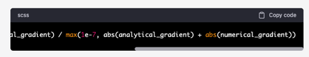</kbd>

    
<kbd></kbd>

    
<kbd>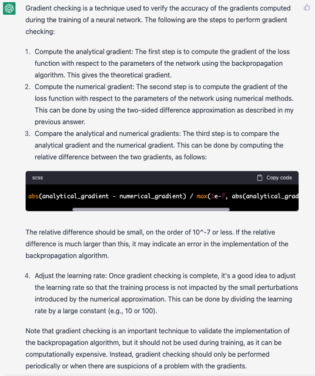</kbd>

     

  
  - Sure, I'd be happy to provide a more detailed answer for you!  1 Gradient checking is a technique used to debug and verify the implementation and \\*backpropagation\\* process in a neural network. It can \\*save a lot of time\\* and help identify bugs in implementations.  2 To implement gradient checking, the first step is to \\*take all the network parameters\\*, such as W1, B1, etc., and \\*reshape them into a giant parameter vector called theta\\*. This involves \\*reshaping all the W's into vectors\\* and \\*concatenating\\* them with the other parameters.  3 Next, the \\*cost function J is transformed into a function of theta\\*. The derivatives, such as dW[1], db[1], etc., are then \\*reshaped into a giant vector called d theta\\*.  4 To implement gradient checking, \\*a loop\\* is used to compute \\*d theta approx I\\* for each component of theta. This involves taking a two-sided difference of J of theta by nudging theta I up and down by a small amount (epsilon) and computing the difference between these values.  5 The two resulting vectors, \\*d theta approx\\* and \\*d theta\\*, are then compared to check if they are approximately equal. This is done by computing the \\*Euclidean distance between the vectors\\* and \\*normalizing it by the lengths of the vectors\\*.  6 A good value for \\*epsilon\\* is around \\*10^-7\\*, and if the formula gives a value of 10^-7 or smaller, the derivative approximation is likely correct. \\*If it is around 10^-5, it's worth double-checking the components of the vector\\*. If it is l\\*arger than 10^-3\\*, there may be a \\*bug somewhere\\*, and it's important to investigate individual components of d theta to try and track down the source of the problem. Overall, gradient checking is an important technique for debugging and verifying neural network implementations, and can help save time and prevent bugs in the backpropagation process.
     

### Gradient Checking Implementation Notes

 

- 1 Gradient checking is a \\*useful tool for debugging\\* neural networks.  2 Grad check \\*should not be used during training\\*, only for \\*debugging\\*.  3 If an algorithm \\*fails grad check\\*, look at \\*individual components to identify the bug.\\*  4 Remember to \\*include regularization when using grad check.\\*  5 \\*Dropout\\* is difficult to use with \\*grad check because of its randomness\\*.  6 \\*Turn off dropout\\* when using \\*grad chec\\*k to double check correctness.  7 It is possible that implementation of backpropagation is \\*correct\\* \\*only when weights and biases are close to 0\\*.  8 It is recommended to \\*run grad check\\* at \\*random initialization\\* and \\*after some training\\*.  9 Week 1 materials covered setting up train, dev, and test sets, analyzing bias and variance, regularization, and gradient checking.  10 The programming exercise in week 1 will allow for the application of these concepts.
  > 1 In this video, the speaker shares some practical tips and notes on implementing gradient checking for a neural network.
  >  2 One of the tips is to only use gradient checking for debugging and not during training. This is because computing d theta approx i for all values of i is a slow computation. Instead, backprop should be used to compute d theta for implementing gradient descent.
  >  3 If an algorithm fails grad check, the speaker advises to look at the individual components to identify the bug. By examining the different values of i, the location of the bug can be determined. For example, if the values of theta or d theta are very far off, all corresponding to dbl for some layer, the bug might be in how the derivative with respect to parameters b is being computed.
  >  4 Another tip is to remember the regularization term when doing grad check. If regularization is being used in the cost function, it's important to include that term in the calculation of d theta.
  >  5 Dropout cannot be easily checked with grad check because in every iteration, dropout randomly eliminates different subsets of hidden units. This makes it difficult to compute the cost function J that dropout is doing gradient descent on. Therefore, grad check should be implemented without dropout, and dropout should be turned on afterwards.
  >  6 It's possible that the implementation of backprop may be correct only when w and b are close to 0 and become more inaccurate as w and b become larger. To address this, the speaker suggests running grad check at random initialization and then training the network for a while before running grad check again.
  >  7 Overall, the video covers a range of topics, including setting up train, dev, and test sets, analyzing bias and variance, applying different forms of regularization, and gradient checking. These concepts are further elaborated in the week's programming exercise.

   

    
    
<kbd>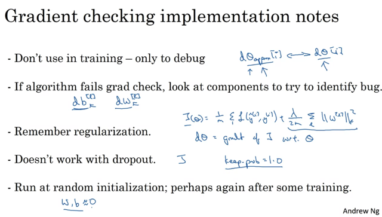</kbd>

    > Đại khái là so sánh thấy sai khác lớn là biết có bug rồi
    > thì bấy giờ ta sẽ **xem xét đơn lẻ dw, db so với dθ [i]**
    > Giả sử thấy dw thì gần bằng còn db thì khác chứng tỏ sai
    > đâu đó chỗ db. Nói chung là nó sẽ giúp **khoanh vùng bug**Nhớ add **Regularization** term khi tính J (tính J để tính 
    > numerical_gradient)
    >
    > **Tắt Dropout** khi làm Gradient Checking vì nó khiến 
    > tính toán J sai. Làm G.C xong thì bật lên lại

    > "It is not impossible, rarely happens, but it's not impossible
    > that  your implementation of gradient descent is **correct
    > when w and b  are close to 0, so at random initialization**.
    > But that as you run  gradient descent and w and b become
    > bigger, maybe your  implementation of backprop is correct
    > only when w and b is  close to 0, but it **gets more inaccurate
    > when w and b become large**. So one thing you could do, I
    > don't do this very often, but one thing  you could do is **run
    > grad check at random initialization** and then  train the
    > network for a while so that w and b have some time  to
    > wander away from 0, from your small random initial values. "
    >
    > Đại khái là có thể (dù hiếm) xảy ra là back-prop chạy đúng
    > khi W, b nhỏ ~0 còn khi nó lớn hơn 0 thì lại sai. Do đó ý ổng
    > nói là ồng hay run grad check khi ini xong  rồi train một thời
    > gian cho w, b nó thay đổi khỏi 0 thì grad-check lại

     

    
    
<kbd>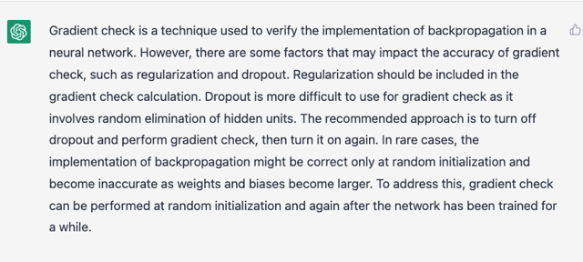</kbd>

     

    
    
<kbd>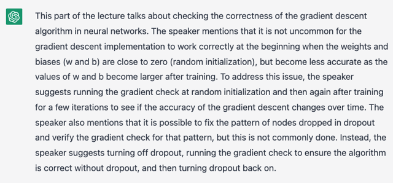</kbd>

    > Đại khái là run G.C khi ini (ban
    > đầu) và khi đã train 1 lúc

     

  
  - 1 In this video, the speaker shares some \\*practical tips\\* and \\*notes\\* on implementing gradient checking for a neural network.  2 One of the tips is to only use gradient checking for \\*debugging\\* and \\*not during training\\*. This is because computing d theta approx i for all values of i is a slow computation. Instead, backprop should be used to compute d theta for implementing gradient descent.  3 If an algorithm \\*fails grad check\\*, the speaker advises to look at the \\*individual components to identify the bug\\*. By \\*examining the different values of i\\*, the location of the bug can be determined. For example, if the values of theta or d theta are very far off, all corresponding to dbl for some layer, the bug might be in how the derivative with respect to parameters b is being computed.  4 Another tip is to \\*remember the regularization term when doing grad check\\*. If regularization is being used in the cost function, it's \\*important to include \\*that term in the calculation of d theta.  5 \\*Dropout\\* cannot be easily checked with grad check because in every iteration, dropout \\*randomly eliminates different subsets of hidden unit\\*s. This makes it difficult to compute the cost function J that dropout is doing gradient descent on. Therefore, grad check should be \\*implemented without dropout\\*, and dropout should be turned on afterwards.  6 It's possible that the implementation of backprop may be \\*correct\\* \\*only\\* when w and b are\\* close to 0\\* and become more \\*inaccurate as w and b become larger.\\* To address this, the speaker \\*suggests running grad check at random initialization\\* and then training the network for a while before r\\*unning grad check again\\*.  7 Overall, the video covers a range of topics, including setting up train, dev, and test sets, analyzing bias and variance, applying different forms of regularization, and gradient checking. These concepts are further elaborated in the week's programming exercise.
     

## Quiz

 

<kbd></kbd>

 

<kbd>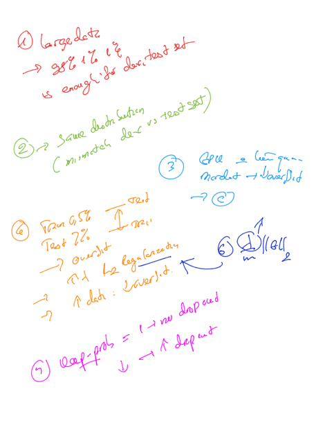</kbd>

 

<kbd>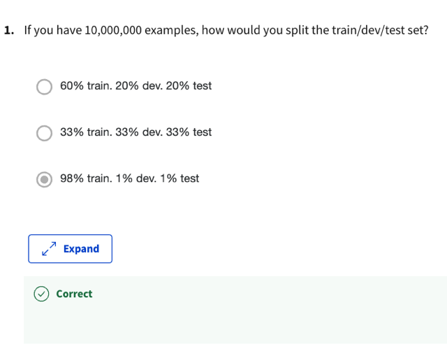</kbd>

 

<kbd></kbd>

 

<kbd>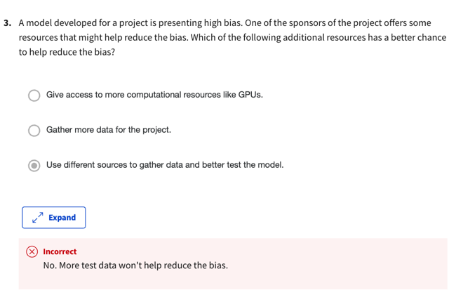</kbd>

 

<kbd></kbd>

 

<kbd>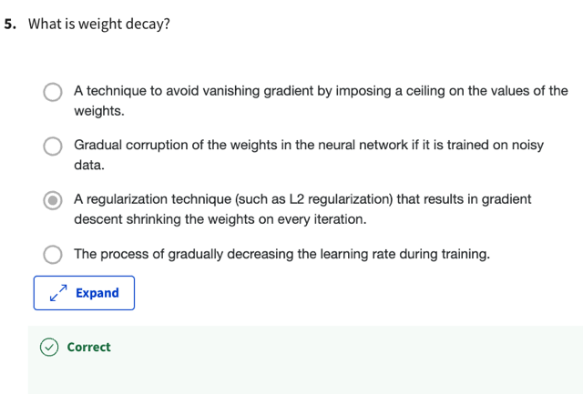</kbd>

 

<kbd>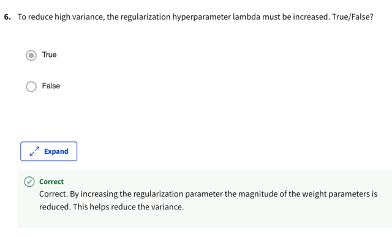</kbd>

 

<kbd>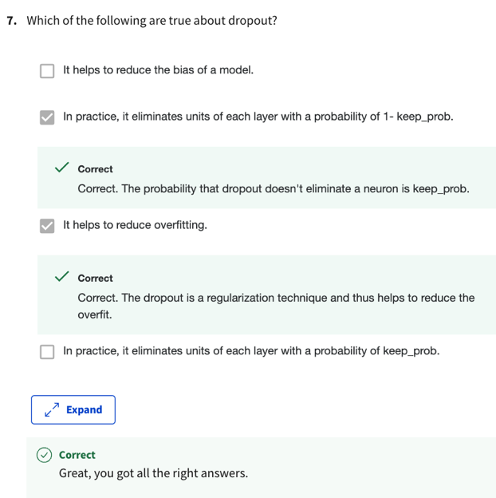</kbd>

 

<kbd>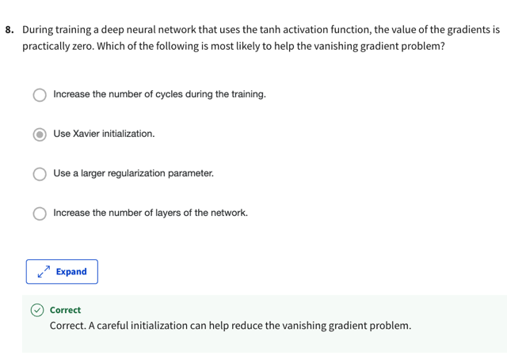</kbd>

 

<kbd>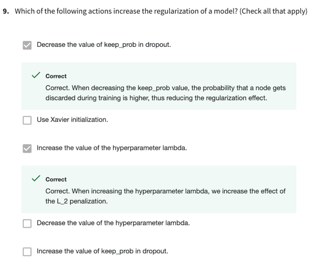</kbd>

 

<kbd>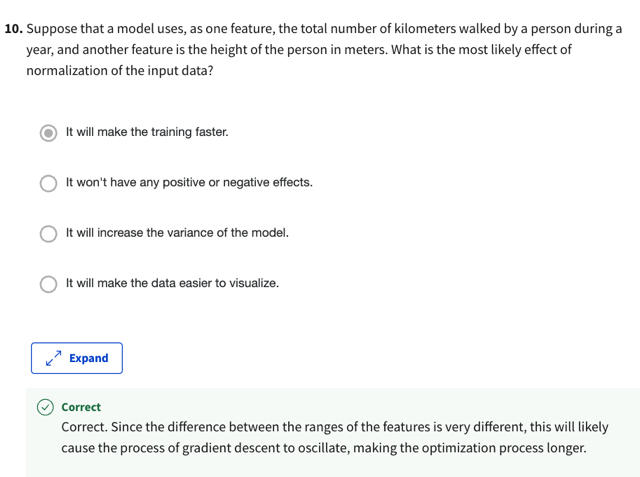</kbd>

 

## Programming Assignments

 

### How to Download your Notebook

 

  
  
<kbd></kbd>

   

  
  
<kbd></kbd>

   

### Programming Assignments 1: Initialization

 

  
  
<kbd>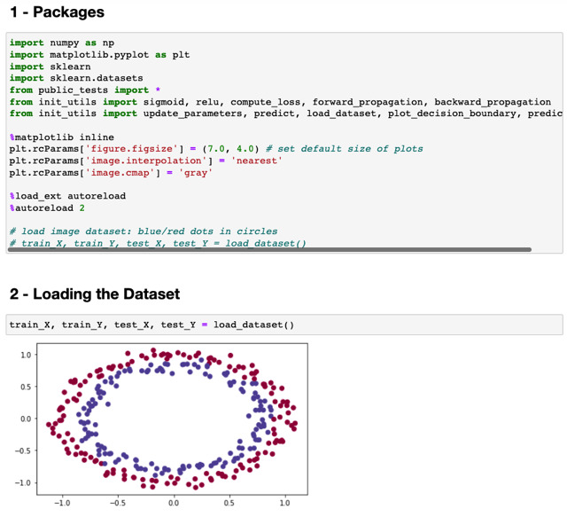</kbd>

   

  
  
<kbd>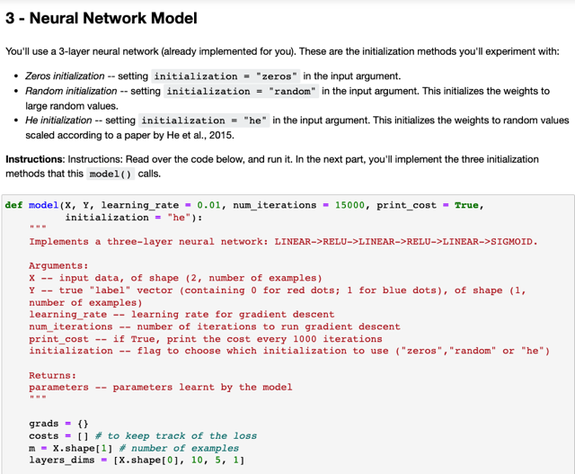</kbd>

   

  
  
<kbd>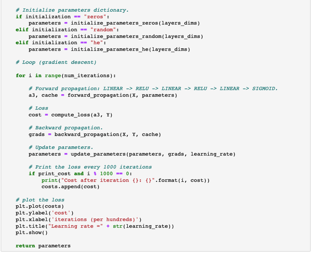</kbd>

   

- 4 - Zero Initialization
   

    
    
<kbd>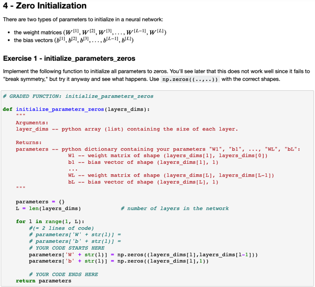</kbd>

     

    
    
<kbd>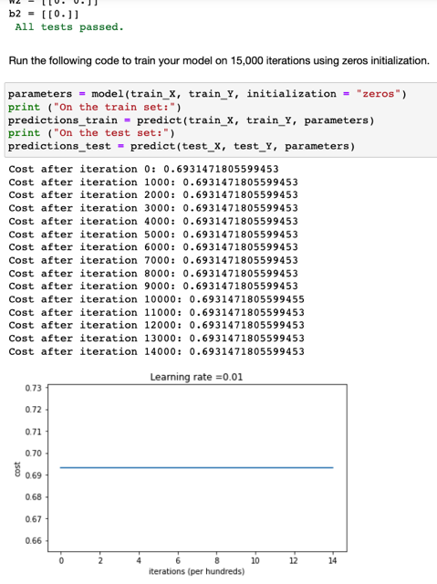</kbd>

     

    
    
<kbd>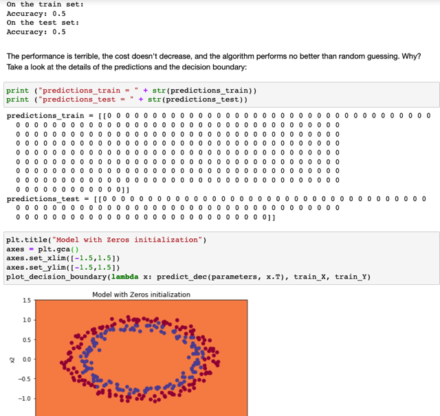</kbd>

     

    
    
<kbd>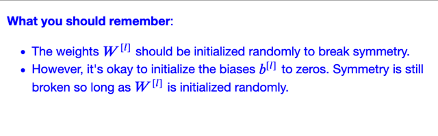</kbd>

    
<kbd></kbd>

    
<kbd></kbd>

     

- 5 - Random Initialization
   

    
    
<kbd></kbd>

     

    
    
<kbd></kbd>

     

    
    
<kbd></kbd>

     

    
    
<kbd></kbd>

     

    
    
<kbd></kbd>

     

- 6 - He Initialization
   

    
    
<kbd></kbd>

     

    
    
<kbd></kbd>

     

    
    
<kbd></kbd>

     

    
    
<kbd></kbd>

     

- 7 - Conclusions
   

    
    
<kbd></kbd>

     

    
    
<kbd></kbd>

     

### Programming Assignments 2: Regularization

 

- 1 - Packages
   

    
    
<kbd></kbd>

     

    
    
<kbd></kbd>

     

- 2 - Problem Statement
   

    
    
<kbd></kbd>

     

- 3 - Loading the Dataset
   

    
    
<kbd></kbd>

     

- 4 - Non-Regularized Model
   

    
    
<kbd></kbd>

     

    
    
<kbd></kbd>

    
<kbd></kbd>

    
<kbd></kbd>

     

    
    
<kbd></kbd>

    
<kbd></kbd>

    
<kbd></kbd>

     

- 5 - L2 Regularization
   

    
    
<kbd></kbd>

    
<kbd></kbd>

    
<kbd></kbd>

     

    
    
<kbd></kbd>

     

    
    
<kbd></kbd>

     

    
    
<kbd></kbd>

    
<kbd></kbd>

    
<kbd></kbd>

     

    
    
<kbd></kbd>

     

    
    
<kbd></kbd>

     

    
    
<kbd></kbd>

     

- 6 - Dropout
   

    
    
<kbd></kbd>

     

    
    
<kbd></kbd>

     

    
    
<kbd></kbd>

     

    
    
<kbd></kbd>

     

    
    
<kbd></kbd>

     

  
  - 6.1 - Forward Propagation with Dropout
     

      
      
<kbd></kbd>

      
<kbd></kbd>

      
<kbd></kbd>

       

      
      
<kbd></kbd>

      
<kbd></kbd>

      
<kbd></kbd>

       

  
  - 6.2 - Backward Propagation with Dropout
     

      
      
<kbd></kbd>

       

      
      
<kbd></kbd>

      
<kbd></kbd>

      
<kbd></kbd>

       

      
      
<kbd></kbd>

       

      
      
<kbd></kbd>

       

      
      
<kbd></kbd>

       

- 7 - Conclusions
   

    
    
<kbd></kbd>

     

    
    
<kbd></kbd>

     

### Programming Assignments: Gradient Checking

 

- Gradient Checking
   

    
    
<kbd></kbd>

     

    
    
<kbd></kbd>

     

    
    
<kbd></kbd>

     

- 4 - 1-Dimensional Gradient Checking
   

    
    
<kbd></kbd>

     

    
    
<kbd></kbd>

     

    
    
<kbd></kbd>

     

    
    
<kbd></kbd>

     

    
    
<kbd></kbd>

    
<kbd></kbd>

    
<kbd></kbd>

     

- 5 - N-Dimensional Gradient Checking
   

    
    
<kbd></kbd>

     

    
    
<kbd></kbd>

     

    
    
<kbd></kbd>

    > Ở đây ổng cố tình làm sai chỗ dW2 ( *2 -> Sai, ko có *2
    > làm gì) và db1 (4 ./ .. -> Sai, 1/ mới đúng).
    > Mục đích để tí nữa Gradient Check thấy sai và xem lại

     

    
    
<kbd></kbd>

     

    
    
<kbd></kbd>

     

    
    
<kbd></kbd>

     

    
    
<kbd></kbd>

     

    
    
<kbd></kbd>

     

    
    
<kbd></kbd>

     

    
    
<kbd></kbd>

     

