# C2w2_optimization Algorithms

📊 **Progress:** `49` Notes | `102` Screenshots

---

## Mini-batch Gradient Descent

 

### 1 Introduction to **optimization algorithms** for **faster neural network training**.

> [!NOTE]
> 1 Introduction to **optimization algorithms** for **faster neural network training**.
>
> 2 **Vectorization** allows for **processing large training sets** without an explicit For
> loop.
>
> 3 Gradient descent algorithm requires **processing the entire training set** before
> taking one step.
>
> 4 Mini-batch gradient descent algorithm involves dividing training sets into
> **mini-batches** and **processing them iteratively** for faster training.
>
> 5 Mini-batches consist of a **subset of the training set** and are processed in a
> For loop using one step of gradient descent.
>
> 6 The dimensions of XT and YT for mini-batches are MX by 1,000 and 1 by 1,
> 000, respectively.
>
> 7 The mini-batch gradient descent algorithm is **more efficient** than the batch
> gradient descent algorithm for large training sets.

> [!NOTE]
> Sure, I'd be happy to provide more detail on the main ideas presented in the text.
>  1 Optimization algorithms for faster training: The text introduces the concept of optimization algorithms, which can enable faster training of neural networks. As machine learning is an iterative and empirical process, it often involves training a large number of models to find one that performs well. However, training on large datasets can be slow, so having efficient optimization algorithms can speed up the process and improve efficiency for teams.
>  2 Mini-batch gradient descent: The text goes on to explain mini-batch gradient descent, which is an optimization algorithm that enables faster training of neural networks. Instead of processing the entire training set at once, mini-batch gradient descent splits the data into smaller subsets called mini-batches. These mini-batches typically contain around 1,000 examples each.
>  3 Notation for mini-batches: The text introduces new notation to represent mini-batches. X superscript curly braces 1 through 5,000 represents the input data for each mini-batch, while Y superscript curly braces 1 through 5,000 represents the corresponding output data.
>  4 Implementation of mini-batch gradient descent: To run mini-batch gradient descent, the text explains that you would run a For loop for T equals 1 to 5,000, representing the 5,000 mini-batches. Inside the loop, one step of gradient descent is implemented using the mini-batch XT, YT. This allows progress to be made even before the entire training set has been processed, resulting in faster training times.
>  5 Vectorization for processing large datasets: The text also mentions that vectorization can be used to process all m examples in a training set relatively quickly. However, when m is very large (e.g., 5 million or 50 million), even vectorization can be slow. Mini-batch gradient descent allows progress to be made with smaller subsets of the data, enabling faster training times overall.
>  6 Comparison to batch gradient descent: The text notes that mini-batch gradient descent is different from batch gradient descent, which processes the entire training set at once. While batch gradient descent is sometimes referred to as "batch" because it processes the entire set at once, mini-batch gradient descent is so-named because it processes smaller subsets (i.e., mini-batches) of the data.
> Overall, the text provides an overview of mini-batch gradient descent as an optimization algorithm for faster training of neural networks. It introduces new notation for mini-batches and explains how the algorithm is implemented. It also highlights the importance of optimization algorithms in improving efficiency for machine learning teams.

 

<kbd>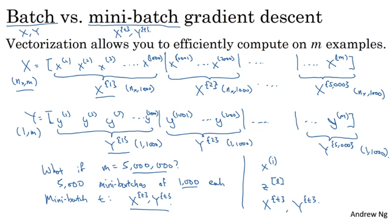</kbd>

   

<kbd>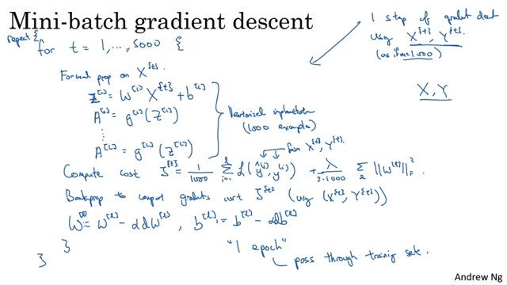</kbd>

   

<kbd>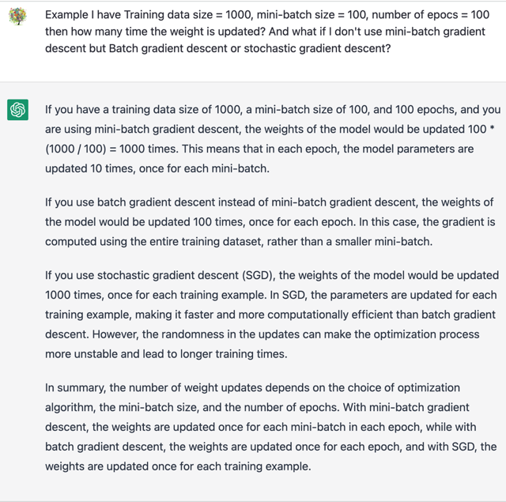</kbd>

> [!NOTE]
> **Epoc chính là số Iteration** thôi 
> Trong mỗi epoch/Iteration:
>
> Đ/v **mini batch**: nó sẽ chạy lần lượt tất
> cả các mini-batch ví dụ có 10 mini-batch thì nó update w,b **10 lần.**
>
> Còn đ/v **batch**: thì mỗi epoch nó chạy hết toàn bộ m data rồi update
> w,b **1 lần**
>
> Còn đ/v **Stochastic** thì để mỗi epoc / iteration nó chạy từng dataset
> và mỗi lần chạy nó update w,b 1 lần -> mỗi epoch/iteration nó update
> W,b **1000 lần. -> Câu dưới ChatGPT nó trả lời sai ở chỗ Stochastic**

   

<kbd>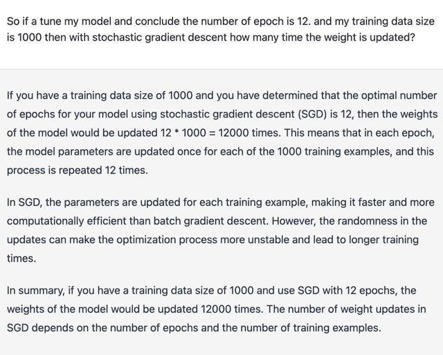</kbd>

   

<kbd>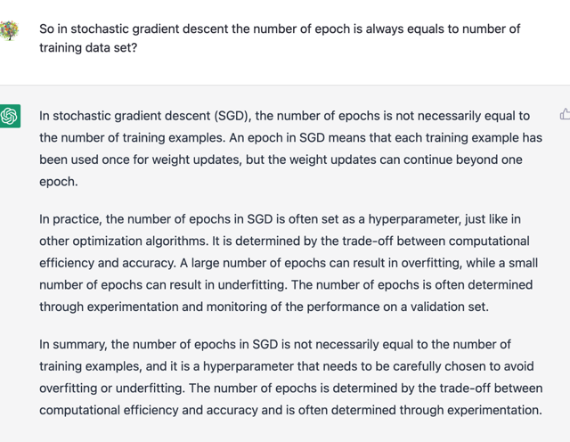</kbd>

   

- Sure, I'd be happy to provide more detail on the main ideas presented in the text.  1 **Optimization algorithms** for **faster** training: The text introduces the concept of **optimization algorithms**, which can **enable faster training** of neural networks. As machine learning is an iterative and empirical process, it often involves training a large number of models to find one that performs well. However, training on large datasets can be slow, so having efficient optimization algorithms can speed up the process and improve efficiency for teams.  2 **Mini-batch gradient** **descent**: The text goes on to explain mini-batch gradient descent, which is an optimization algorithm that enables **faster training** of neural networks. Instead of processing the entire training set at once, mini-batch gradient descent **splits the data into smaller subsets** called **mini-batches**. These mini-batches typically contain around **1,000** **examples** each.  3 Notation for mini-batches: The text introduces new notation to represent mini-batches. X superscript curly braces 1 through 5,000 represents the input data for each mini-batch, while Y superscript curly braces 1 through 5,000 represents the corresponding output data.  4 Implementation of mini-batch gradient descent: To run mini-batch gradient descent, the text explains that you would run a **For loop** for T equals 1 to 5,000, representing the 5,000 mini-batches. Inside the loop, **one step of gradient descent is implemented using the mini-batch** XT, YT. This **allows progress to be made even before the entire training set has been processed**, resulting in **faster training times.**  5 **Vectorization** for processing large datasets: The text also mentions that vectorization can be used to process all m examples in a training set relatively quickly. **However, when m is very large** (e.g., 5 million or 50 million),**even vectorization can be slow**. Mini-batch gradient descent allows progress to be made with smaller subsets of the data, enabling faster training times overall.  6 **Comparison** to batch gradient descent: The text notes that mini-batch gradient descent is different from batch gradient descent, which **processes the entire training set at once**. While batch gradient descent is sometimes referred to as "**batch**" because it processes the entire set at once, mini-batch gradient descent is so-named because it processes smaller subsets (i.e., mini-batches) of the data.  Overall, the text provides an overview of mini-batch gradient descent as an **optimization algorithm** for faster training of neural networks. It introduces new notation for mini-batches and explains how the algorithm is implemented. It also highlights the importance of optimization algorithms in improving efficiency for machine learning teams.
   

## Understanding Mini-batch Gradient Descent

 

### 1 The **cost function should decrease on every iteration** of batch

> [!NOTE]
> 1 The **cost function should decrease on every iteration** of batch
> gradient descent.
>
> 2 Mini-batch gradient descent **may not decrease the cost function
> on every iteration** due to training on different mini-batches.
>
> 3 **The size of the mini-batch** used in gradient descent is a
> **parameter that needs to be chosen**.
>
> 4 A **mini-batch size** of **m** results in **batch** gradient descent, while a
> mini-batch size of **1** results in **stochastic** gradient descent.
>
> 5 **Batch** gradient descent takes **too much time per iteration** for a
> large training set, while **stochastic** gradient descent can be
> **extremely noisy**.
>
> 6 The mini-batch size used in practice is usually somewhere in
> between **1 and m**, as these values are respectively too small and
> too large.

> [!NOTE]
> 1 Mini-batch gradient descent allows for progress to be made even when the entire training set has not been processed yet. The cost function J(t) may not decrease on every iteration due to processing different mini-batches X(t), Y(t), resulting in a noisier trend downwards.
>  2 The size of the mini-batch is a parameter that needs to be chosen. The two extremes are:
>  • Batch gradient descent, where the mini-batch size is equal to the training set size m. In this case, the entire training set is processed on every iteration.
>  • Stochastic gradient descent, where the mini-batch size is equal to 1. In this case, each example is its own mini-batch, and the gradient descent step is taken with just a single training example at a time.
>  3 Batch gradient descent can take relatively large steps with low noise, but takes too long per iteration when processing a large training set. Stochastic gradient descent can be extremely noisy and won't ever converge, but is faster per iteration when processing a small training set.
>  4 In practice, the mini-batch size used will be somewhere between 1 and m. If the mini-batch size is too small, then the noise from processing individual examples will be too high. If the mini-batch size is too large, then the time per iteration will be too long. A good mini-batch size allows for a balance between the two.

 

<kbd>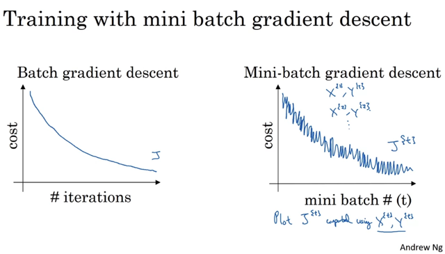</kbd>

   

<kbd>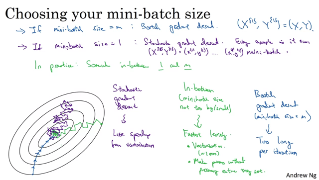</kbd>

> [!NOTE]
> Mini batch size = m thì chính là \/**Batch:**\/Với data lớn thì nó 
> rất lâu vì mỗi lần 'chạy' g.d là nó phải tính toàn bộ data 
>
> Mini batch size = 1 thì ta có \/**Stochastic**\/
> Ưu điểm của nó là **cho ra 'progress' ngay chỉ với 1 training sample.**
> Và cái vấn đề 'zig zac / noisy' của nó có thể cải thiện bằng
> cách chọn learning rate nhỏ hơn.
> Tuy nhiên Stochastic có nhược điểm là coi như vứt bỏ sức 
> mạnh của **vectorization**

> [!NOTE]
> Chỉ với **mini batch** thì có được cả 2 ưu điểm:
> - **Progress mà không phải đợi tính hết cả bộ data**
> - Vẫn tận dụng được sức mạnh của **vectorization**

   

<kbd>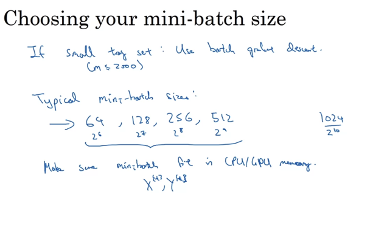</kbd>

> [!NOTE]
> - Nếu training size nhỏ thì không cần mini-batch làm gì ví dụ 
> <**2000**. Còn lớn hơn thì nên dùng mini batch.
>
> - **Thử nhiều giá trị** **mini-batch size 2^6, 2^7**... Typical use là 
> 64-512. 
>
> - Đảm bảo mini batch data **fit CPU/GPU memory** -> Cái này 
> phải thì  tuỳ vào application và data gì nhưng đại khái phải 
> check, nếu không nó sẽ fail

   

- 1 Mini-batch gradient descent **allows for progress** to be made even w**hen the entire training set has not been processed yet**. The cost function J(t) may **not decrease on every iteration** due to processing different mini-batches X(t), Y(t), resulting in a **noisier trend downwards.**  2 The **size** of the mini-batch is a **parameter that needs to be chosen**. The two extremes are:  • **Batch** gradient descent, where the mini-batch size is equal to the training set size **m**. In this case, the entire training set is processed on every iteration.  • **Stochastic** gradient descent, where the mini-batch size is equal to **1**. In this case, **each example is its own mini-batch**, and the gradient descent step is taken with just a single training example at a time.  3 **Batch** gradient descent can take relatively **large steps** with **low noise**, but takes **too long per iteration** when processing a**large training set**. **Stochastic** gradient descent can be **extremely noisy** and **won't ever converg**e, but is **faster** per iteration when processing a **small** training set.  4 In practice, the **mini-batch size** used will be s**omewhere between 1 and m**. If the mini-batch size is **too small**, then the **noise** from processing individual examples will be too high. If the mini-batch size is **too large**, then the time per iteration will be **too long**. A good mini-batch size allows for a **balance** between the two.
   

## Exponentially Weighted Averages

 

### 1 The speaker wants to show some **optimization algorithms** that are

> [!NOTE]
> 1 The speaker wants to show some **optimization algorithms** that are
> **faster than gradient descent.**
>
> 2 To understand these algorithms, it is necessary to understand
> **exponentially weighted averages**, also known as **exponentially
> weighted moving averages.**
>
> 3 The speaker provides an example of **how to compute** exponentially
> weighted averages using the d**aily temperature data from London**.
>
> 4 The formula for computing exponentially weighted averages is
> given, and its general formula is presented.
>
> 5 The speaker explains how to **vary the parameter beta** to obtain
> **different effect**s, such as a **smoother** or **noisier** curve, or **faster** or
> **slower adaptation** to temperature changes.
>
> 6 Varying **beta** is a **hyperparameter** that can be tuned to optimize
> learning algorithms.

> [!NOTE]
> 1 Introduction: The speaker wants to introduce a few optimization algorithms that are faster than gradient descent.
>  2 Exponentially Weighted Averages: To understand these algorithms, it is important to understand exponentially weighted averages, also known as exponentially weighted moving averages in statistics.
>  3 Temperature Data Example: The speaker provides an example of daily temperature data from London over the course of a year.
>  4 Computation of Moving Average: In order to compute the trends or moving average of the temperature, the speaker proposes a formula using an exponentially weighted average. The formula initializes V0 to zero and then averages it with a weight of 0.9 times the previous value plus 0.1 times the temperature of that day. The more general formula is V on a given day is 0.9 times V from the previous day plus 0.1 times the temperature of that day.
>  5 Plotting the Moving Average: The computed moving average is plotted in red and shows a smoother curve than the original data.
>  6 Varying the Beta Parameter: The speaker then discusses how varying the beta parameter in the formula can lead to different effects. A high beta value results in a smoother curve but more latency in adapting to temperature changes, while a low beta value results in a noisier curve but quicker adaptation to temperature changes.
>  7 Importance of Choosing the Right Beta Value: The speaker notes that the choice of beta value is a hyperparameter that can affect the performance of a learning algorithm and that there is usually some value in between that works best.

 

<kbd>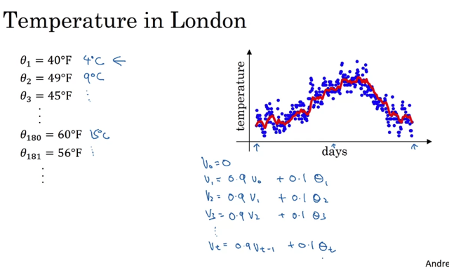</kbd>

   

<kbd>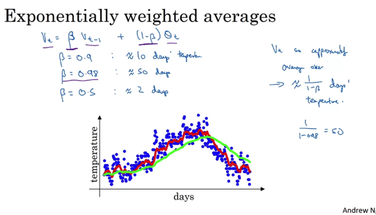</kbd>

> [!NOTE]
> Beta lớn -> **Lấy nhiều ảnh hưởng của quá khứ**, 
> **giảm ảnh hưởng của hiện tại** 
> -> **Trễ nhận ra sự thay đổi hơn**
> -> **Đường cong smooth hơn** do nó thay đổi 
> chậm hơn
>
> Ngược lại nó **nhạy hơn,** đường cong nó **wiggly hơn**.

   

<kbd>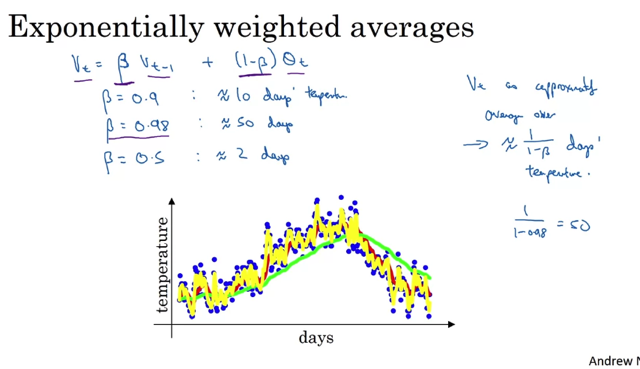</kbd>

> [!NOTE]
> Ngược lại beta nhỏ -> nó nhạy hơn, đường cong nó wigly hơn.

   

- 1 Introduction: The speaker wants to introduce a few optimization algorithms that are f**aster** than g**radient descent.**  2 **Exponentially Weighted Averages**: To understand these algorithms, it is important to understand exponentially weighted averages, also known as **exponentially weighted moving averages** in statistics.  3 **Temperature** Data Example: The speaker provides an example of **daily temperature data**from London over the course of a year.  4 **Computation** of Moving Average: In order to compute the trends or moving average of the temperature, the speaker proposes a formula using an **exponentially weighted average**. The formula initializes **V0** to zero and then averages it with a **weight of 0.9 times** the**previous value** plus**0.1 times** the temperature **of that day**. The more general formula is V on a given day is 0.9 times V from the previous day plus 0.1 times the temperature of that day.  5 Plotting the Moving Average: The computed moving average is plotted in red and shows a **smoother** curve than the original data.  6 Varying the **Beta** Parameter: The speaker then discusses how**varying the beta paramete**r in the formula can **lead to different effects**. A **high beta** value results in a **smoother curve** but more **latency in adapting to temperature changes**, while a l**ow beta** value results in a **noisier curve** but **quicker adaptation** to temperature changes.  7 Importance of **Choosing the Right Beta** **Value**: The speaker notes that the choice of beta value is a **hyperparameter** that can affect the performance of a learning algorithm and that there is usually some value in between that works best.
   

## Understand Exponentially Weighted Averages

 

### 1 **Exponentially weighted averages**is a **key** **component** of several optimization

> [!NOTE]
> 1 **Exponentially weighted averages**is a **key** **component** of several optimization
> algorithms used to train neural networks.
>
> 2 The video delves deeper into intuitions for understanding the algorithm.
>
> 3 The **key equation** for implementing exponentially weighted averages is
> presented.
>
> 4 **Different values of beta** result in different **exponentially decaying functions**.
>
> 5 The algorithm computes averages of daily temperatures.
>
> 6 The equation for computing V100 is derived.
>
> 7 **V100** is a **weighted average of theta values**, where the **weight decays
> exponentially over time**.
>
> 8 The daily temperature is multiplied by an **exponentially decaying function** and
> then **summed up to compute V100**.
>
> 9 All **coefficients** add up to one, or very close to one, up to a detail called **bias
> correction.**
>
> 10 It takes about **10 days** for the height of the **exponentially decaying function** to
> **decay** to around **1/3** or one over **e** of the peak.
>
> 11 When **beta equals 0.9,** the algorithm is as if computing an **exponentially
> weighted average** that focuses on the **last 10 days' temperature.**

> [!NOTE]
> 1 In the last video, we learned about exponentially weighted averages (EWAs), which are a key component of several optimization algorithms used to train neural networks.
>  2 In this video, the focus is on understanding the intuition behind EWAs and how they compute averages of daily temperature.
>  3 The key equation for implementing EWAs is presented, which includes a parameter called beta that determines the weight given to past values.
>  4 Different values of beta result in different weights for past values, and the resulting graph shows an exponentially decaying function.
>  5 To understand how this function is computing averages of daily temperature, the equation is rearranged with decreasing values of T.
>  6 This rearranged equation is then used to calculate V100, which is the average of theta values from day 100 to day 1.
>  7 The coefficients of the theta values in the equation can be expanded out and simplified, showing that V100 is a weighted sum of theta values.
>  8 This sum of theta values is weighted by an exponentially decaying function, which results in a graph that decays exponentially from theta 100 to theta 1.
>  9 The value of beta determines how quickly the weight given to past values decays, with larger values resulting in slower decay.
>  10 The number of days that the EWA averages over can be calculated based on the value of beta, with beta equal to 0.9 resulting in an average over the last 10 days.
>  11 More generally, if beta is 1-epsilon, where epsilon is small, then the EWA averages over approximately 1/epsilon days.
>  12 This video provides a detailed understanding of the intuition behind EWAs and how they work to compute averages of daily temperature.

 

<kbd>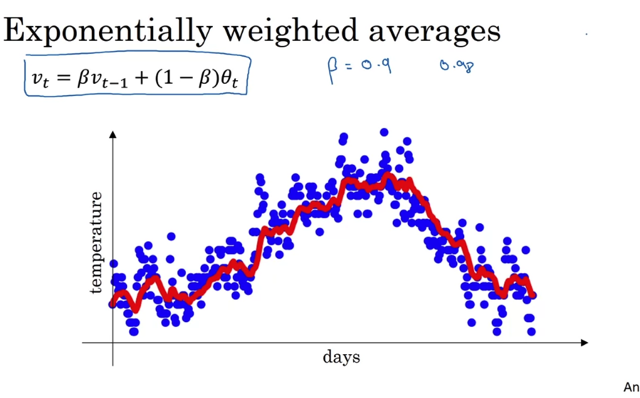</kbd>

   

<kbd>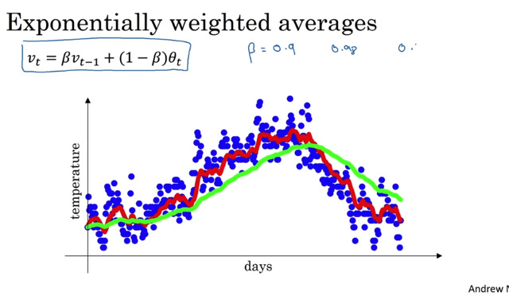</kbd>

   

<kbd>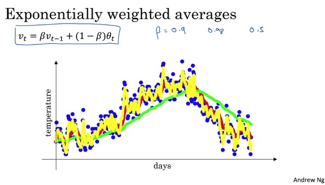</kbd>

   

<kbd>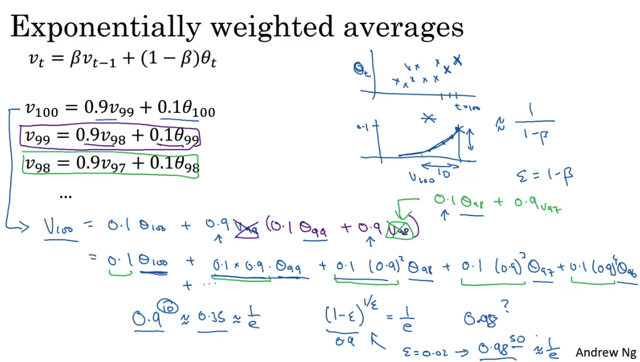</kbd>

> [!NOTE]
> Đại khái là ..V100 sau khi triển khai thành ra:
>
> = 0.1*θ_100 + 0.1*0.9^1*θ_99 + 0.1*0.9^2*θ_98 +...
>
> thì đại khái là 2 cái này element-wised nhân nhau rồi sum up
>
> [θ_1,...θ_99, θ_100]
>
> và
>
> [... 0,1*0.9^2, 0,1*0.9, 0.1] = là hàm gọi là **exponentially decaying function**2. Cái nữa mà ổng sẽ nói thêm sau là các coefficient 
> 0.1 + 0,1*0.9^1 + 0.1*0.9^2 ...~= 1 mà gọi là **correctness bias** gì đó

> [!NOTE]
> Thì điều này đại khái đồng nghĩa là nếu **beta = 0,9** tương đương **eps = 0.1** thì
> kiểu như vt sẽ là average của 10 ngày trước đó cái này chưa hiểu lắm

   

<kbd>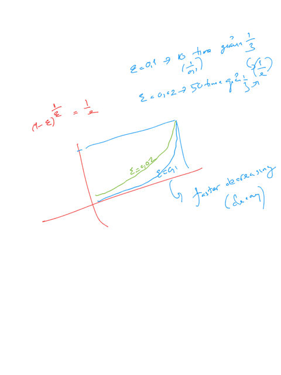</kbd>

> [!NOTE]
> Đại khái là **exponentially decaying function** có quy luật là
>
> (1-eps)**(1/eps) = 1/e ~= 0.3
>
> là sau 1/eps ngày thì value **giảm còn** ~= 1/3 ban đầu
> Ví dụ eps = 0.1 thì mất 10 ngày
> Ví dụ eps = 0.02 thì mất 50 ngày

   

<kbd>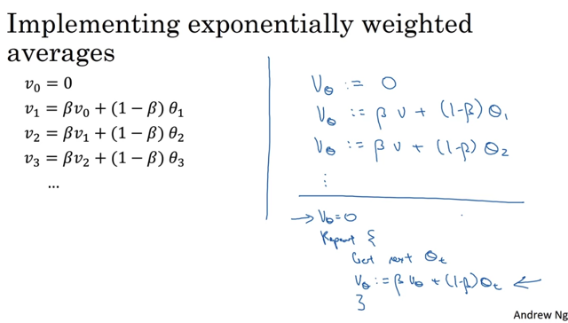</kbd>

> [!NOTE]
> Đại khái là implement như thế nào thì
> trong code không có v1,v2,...mà là
> repeatedly assigning

   

- 1 In the last video, we learned about **exponentially weighted averages** (EWAs), which are a **key component** of several optimization algorithms used to train neural networks.  2 In this video, the focus is on understanding the intuition behind EWAs and how they compute averages of daily temperature.  3 The**key equation** for implementing EWAs is presented, which includes a parameter called **beta** that determines the **weight given to past values**.  4 **Different** **values** of **beta** result in **different weights for past values**, and the resulting graph shows an exponentially decaying function.  5 To understand how this function is computing averages of daily temperature, the equation is **rearranged** with decreasing values of T.  6 This **rearranged** **equation** is then used to **calculate V100**, which is the average of theta values from day 100 to day 1.  7 The **coefficients** of the **theta** **values** in the equation can be expanded out and simplified, showing that V100 is a weighted sum of theta values.  8 This sum of theta values is weighted by an **exponentially decaying function**, which results in a graph that **decays exponentially from theta 100 to theta 1.**  9 The value of **beta** determines **how quickly the weight given to past values decays**, with **larger values resulting in slower decay.** 10 The number of days that the **EWA** averages over can be calculated based on the value of **beta**, with beta equal to 0.9 resulting in an average over the last 10 days.  11 More generally, if beta is **1-epsilon**, where **epsilon is small,** then the **EWA** averages over **approximately 1/epsilon days.**  12 This video provides a **detailed understanding** of the intuition behind EWAs and how they work to compute averages of daily temperature.
   

## Bias Correction In Exponentially Weighted Averages

 

### 1 **Exponentially weighted moving averages** can be used to \\*smooth out

> [!NOTE]
> 1 **Exponentially weighted moving averages** can be used to **smooth out
> noisy data** and **capture trends** over time.
>
> 2 When implementing **exponential moving averages,** **bias correction** can
> **improve accuracy**, especially during the**initial phas**e of the estimate.
>
> 3 Without bias correction, the e**stimate may start off much lower than
> expected**, leading to a **biased assessment.**
>
> 4 To correct this bias, instead of using **V_t** as the estimate, we use **V_t
> divided by 1-Beta^t**, where t is the current day.
>
> 5 As **t becomes large**, **Beta to the t approaches 0**, so **bias correction
> becomes less important**.
>
> 6 Implementing bias correction can help obtain a **better estimate of the
> data** during the **initial phase of learning**.
>
> 7 While most implementations of exponentially weighted moving averages
> **do not include bias correction**, it can be **useful in certain situations**.
>
> 8 With these concepts, we can build **better optimization algorithm**s using
> **exponential moving averages.**

 

<kbd>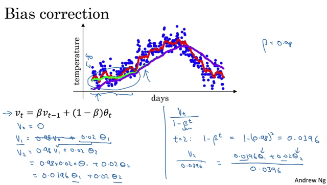</kbd>

> [!NOTE]
> Đại khái là với cách tính 'Exponentially weighted average'
> thì những lúc đầu t nhỏ, bởi vì initialize v_0 = 0 nên đại khái là
> giá trị tính ra sai lệch rất lớn so với giá trị thực tế.
>
> Cách khắc phục là 'Bias correction', sau khi tính vt thì chia cho 
> (1-beta^t)
>
> Thì giai đoạn đầu với t nhỏ, -> việc điều chỉnh v_t = v_t/(1-beta^t)
> sẽ giúp **fix sự sai lệch trên.** 
>
> Ví dụ trong hình ổng nói nếu không có B.C, thì v_1 chỉ bằng 0.02 theta_1,
> v_2 chỉ bằng 0,0196 theta_1 + 0,02 theta_2 đại khái là nhỏ hơn rất nhiều theta_2 
> -> Dẫn đến sai lệch ở khúc đầu
>
> Còn khi chia cho 1 - beta**t thì :
>
> v_1 = v_1/(1-0.98**1) = 0.02theta_1/0.02 = bằng ra lại theta_2 -> Hết lệch
>
> v_2 = v_2/(0.0396) = ..nói chung là việc chia cho term này giúp 'khôi
> phục' - có thể không nguyên vẹn nhưng khắc phục tình trạng cách biệt lớn ban đầu.
>
> Giai đoạn sau, t lớn, beta^t tiến về 0 -> 1-beta^1 tiến về 1 
> -> **hiệu ứng của Bias correction mất dần.**

   

## Gradient Descent With Momentum

 

### 1 The Momentum algorithm or **Gradient Descent with Momentum** is an

> [!NOTE]
> 1 The Momentum algorithm or **Gradient Descent with Momentum** is an
> **optimization algorithm** that works **faster** than **standard Gradient Descent.**
>
> 2 The basic idea is to compute an **exponentially weighted average** of the
> **gradients** and use that to update weights instead of using the gradients
> themselves.
>
> 3 Gradient Descent often **oscillates** and takes many steps to reach the
> minimum, **preventing** the use of **larger learning rates.**
>
> 4 **Momentum** **smooths out** the steps of Gradient Descent by taking a **more
> straightforward path** and **damping out the oscillations to the minimum.**
>
> 5 Momentum can be **viewed as** providing **acceleration** to a **ball rolling down a
> bowl-shaped function** and **momentum terms** **represent velocity**.
>
> 6 The algorithm involves**computing the derivatives**, computing **vdW** and **vdb**,
> and updating the **weights** using vdW and vdb.
>
> 7 Momentum works for some people as an **analogy** of a ball rolling down a
> bowl but may not work for everyone.

> [!NOTE]
> 1 The video discusses the algorithm called momentum, or gradient descent with momentum, which almost always works faster than the standard gradient descent algorithm.
>  2 The basic idea of the momentum algorithm is to compute an exponentially weighted average of the gradients and use that gradient to update the weights instead of using the usual gradient.
>  3 The standard gradient descent algorithm often takes many steps and oscillates towards the minimum because it cannot use a large learning rate due to the oscillations.
>  4 The momentum algorithm smooths out the steps of gradient descent by computing a moving average of the derivatives for w. It averages out the oscillations in the vertical direction, where slowing things down is desired, and takes steps that are much smaller in the vertical direction but are more directed to moving quickly in the horizontal direction.
>  5 The momentum algorithm works by computing vdW to be Beta vdw plus 1 minus Beta dW, where Beta is a hyperparameter between 0 and 1, and similarly computing vdb.
>  6 The weights are updated using W gets updated as W minus the learning rate times vdW, and similarly, b gets updated as b minus alpha times vdb.
>  7 An analogy to understand the momentum algorithm is to think of the derivatives providing acceleration to a ball that is rolling down a hill, while the momentum terms represent velocity.
>  8 The momentum algorithm prevents the ball from speeding up without limit by applying a row of friction, which is similar to how the momentum algorithm applies the Beta hyperparameter.
>  9 Finally, the video presents the algorithm and its implementation details.

 

<kbd>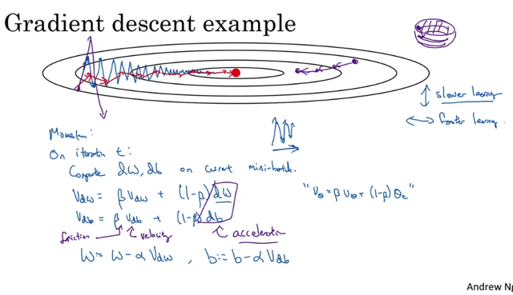</kbd>

> [!NOTE]
> Vấn đề của G.D là nó sẽ bị **zic zac** ở 1 phương không mong muốn
> (một feature nào đó, hiểu đại khái thôi). Nên ta phải khắc phục bằng
> cách **khống chế learning rate alpha**. Nhưng điều này lài làm chậm
> quá trình G.D. Đại khái là chúng ta bị một mâu thuẫn là **muốn 
> G.D đi mạnh ở cái hướng mà nó sẽ tới minimum** (muốn vậy phải để
> Alpha lớn) nhưng lại phải **khống chế cái phương tán loạn kia** để nó
> không bị 'Diverge') (muốn vậy phải để alpha nhỏ.) Do đó 
> G.D không thể nhanh được.
>
>
> Đại khái thay vì update W, b bởi dW, db
> thì nay ta update bởi **vdW**, **vdb**
> trong đó vdW, vcb tính bằng phương pháp **'Exponentially weighted 
> average'**
>
> Đại khái hệ quả là làm cho 'đường đi' của Gradient Descent nó
> **bớt zic zac/ tán loạn** về phương ngang (đang lấy ví dụ như trong 
> hình) mà **bước dài hơn về phương dọc** (là phương sẽ đến minimum)

> [!NOTE]
> Advantages of gradient descent with momentum over traditional 
> gradient descent include:
>  1 Faster Convergence: Momentum helps **accelerate 
> gradient descent in the right direction**, thus speeding up 
> convergence. It helps to **overcome the problems of oscillations
>  or getting stuck in local minima**, which are commonly faced in 
> traditional gradient descent.
>  2 Stabilization: Gradient descent with momentum tends to 
> **dampen oscillations and moves more smoothly towards the 
> minimum**. This can lead to faster convergence and better results.
>
>  3 Handling of sparse gradients: **Sparse gradients** occur 
> when the gradient vector has **mostly zero entrie**s. Momentum helps 
> to overcome this problem by **accumulating the gradient information**
> over multiple iterations, providing a **more robust update**.
>
> Overall, gradient descent with momentum provides a better 
> optimization experience compared to traditional gradient descent. 
> However, **it is important to note that the choice of optimization 
> algorithm depends on the specific problem, and it is always a good 
> idea to experiment with different optimization algorithms**to 
> determine which one works best for a given problem.

> [!NOTE]
> Cũng chưa hiểu tại sao lại tương đương việc vận tốc với gia
> tốc momentum gì đó trong bài toán ball roll down the hill

   

<kbd>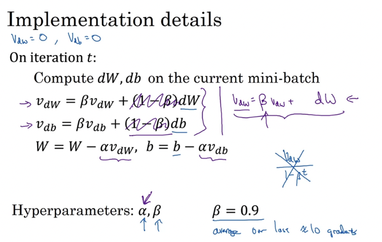</kbd>

> [!NOTE]
> Đại khái là có 2 phiên bản, cái nào cũng được.
> 1 cái là vdw = beta*vdw + (1-beta)*dw 
> 1 cái bỏ cái 1-beta đi mà tính vdw = beta*vdw + dw luôn
>
> Riêng mr Andrew prefer cái đầu hơn. 
>
> Beta thường chọn là 0.9 còn alpha phải tune riêng
>
> Và trong thực tế người ta cũng không bias correction vì sau chừng
> 10 iteration là hiện tượng (sai lệch ban đầu này) cũng không còn

> [!NOTE]
> Finally, I just want to mention that if you read the literature on gradient descent with
> momentum often you see it with this term omitted, with this 1 minus Beta term
> omitted. So you end up with vdW equals Beta vdw plus dW. And the net effect of
> using this version in purple is that vdW ends up being scaled by a factor of 1 minus
> Beta, or really 1 over 1 minus Beta.
>
> And so when you're performing these gradient descent updates, alpha just
> needs to change by a corresponding value of 1 over 1 minus Beta. In practice,
> both of these will work just fine, it just affects what's the best value of the learning
> rate alpha.
>
> But I find that this particular formulation is a little less intuitive. Because one impact
> of this is that if you end up tuning the hyperparameter Beta, then this affects the
> scaling of vdW and vdb as well. And so you end up needing to retune the learning
> rate, alpha, as well, maybe.
>
> Chưa hiểu khúc này lắm nhưng chắc cũng không quan trọng mấy mà đại khái là
> nó chỉ ảnh hưởng chút đến best value của alpha

   

- 1 The video discusses the **algorithm** called **momentum**, or **gradient descent with momentum**, which almost always works **faster** than the **standard gradient descent algorithm.**  2 The basic idea of the momentum algorithm is to compute an **exponentially weighted average of the gradients** and **use that gradient to update the weights instead of using the usual gradient.**  3 The standard gradient descent algorithm often takes many steps and **oscillates** towards the minimum because it cannot use a l**arge learning rate** due to the **oscillations**.  4 The momentum algorithm **smooths out the steps** of gradient descent by **computing a moving average of the derivatives for w**. It **averages out the oscillations** in the **vertical direction**, **where** **slowing things down is desired**, and **takes steps that are much smaller in the vertical direction** but are **more directed to moving quickly in the horizontal direction.**  5 The momentum algorithm works by computing **vdW** to be **Beta vdw plus 1 minus Beta dW**, where Beta is a **hyperparameter** between 0 and 1, and similarly computing **vdb**.  6 The weights are updated using **W gets updated as W minus the learning rate times vdW**, and similarly, b gets updated as b minus alpha times vdb.  7 An analogy to understand the momentum algorithm is to think of the **derivatives** providing **acceleration** to a ball that is **rolling down a hill**, while the **momentum terms represent velocity.** 8 The **momentum** algorithm **prevents the ball from speeding up without limit by applying a row of friction**, which is similar to how the momentum algorithm applies the Beta hyperparameter.  9 Finally, the video presents the algorithm and its implementation details.
   

## Rmsprop

 

### 1 RMSprop is another algorithm that can**speed up gradient descent,** and it aims to

> [!NOTE]
> 1 RMSprop is another algorithm that can**speed up gradient descent,** and it aims to
> **slow down learning in the vertical direction** and **speed up learning in the horizontal
> direction**.
>
> 2 On each iteration, RMSprop computes the**derivative of the parameters on the
> current mini-batch**, then keeps an **exponentially weighted average** of the **squares of
> these derivatives.**
>
> 3 **RMSprop** updates the parameters by dividing the **derivative** of each **parameter** by
> the **square root** of the**exponentially weighted average** of the **squares of the
> derivatives of that parameter.**
>
> 4 The effect of this is that the **updates in the vertical direction** **are divided by a much
> larger number**, which helps **damp out oscillations**, whereas the **updates in the
> horizontal direction are divided by a smaller number.**
>
> 5 In practice, **RMSprop** is used in a **high-dimensional space of parameters**, and it can
> **damp out oscillations** in a **subset of parameters.**
>
> 6 RMSprop stands for **Root Mean Squared Prop** because it **squares** the derivatives and
> then takes the**square root at the end.**
>
> 7 To avoid division by zero, RMSprop adds a s**mall epsilon to the denominator.**
>
> 8 In the next video, RMSprop will be combined with momentum.

> [!NOTE]
> 1 What is RMSprop and how does it work?
>  2 RMSprop is another algorithm, in addition to momentum, that can speed up gradient descent. It stands for root mean square prop and it is designed to slow down the learning in the vertical direction and speed up learning in the horizontal direction. To accomplish this, on each iteration, RMSprop computes the derivative of the current mini-batch as usual, then it keeps an exponentially weighted average of the squares of the derivatives, which is denoted as SdW and Sdb. These terms are updated as follows: SdW = beta * SdW + (1 - beta) * dW^2 and Sdb = beta * Sdb + (1 - beta) * db^2, where beta is a hyperparameter and the squaring operation is an element-wise operation. Next, RMSprop updates the parameters as follows: W = W - learning_rate * dW / sqrt(SdW) and b = b - learning_rate * db / sqrt(Sdb), where learning_rate is the hyperparameter that controls how big of a step is taken during each iteration.
>  3 How does RMSprop help with oscillations in the vertical direction?
>  4 RMSprop helps with oscillations in the vertical direction by slowing down the learning rate in that direction. This is achieved by keeping a larger value of Sdb, which is the exponentially weighted average of the squares of the derivatives in the vertical direction. The derivatives in the vertical direction tend to be much larger than those in the horizontal direction, due to the steep slope of the function in the vertical direction. As a result, Sdb will be relatively large, and when db is divided by sqrt(Sdb) in the update equation for b, the resulting update will be much smaller than in the horizontal direction, effectively damping out the oscillations in the vertical direction.
>  5 How does RMSprop help with faster learning in the horizontal direction?
>  6 RMSprop helps with faster learning in the horizontal direction by speeding up the learning rate in that direction. This is achieved by keeping a smaller value of SdW, which is the exponentially weighted average of the squares of the derivatives in the horizontal direction. The derivatives in the horizontal direction tend to be much smaller than those in the vertical direction, due to the gentle slope of the function in the horizontal direction. As a result, SdW will be relatively small, and when dW is divided by sqrt(SdW) in the update equation for W, the resulting update will be much larger than in the vertical direction, effectively allowing for faster learning in the horizontal direction.
>  7 How is RMSprop applied in practice?
>  8 In practice, RMSprop is applied by computing the derivatives of the current mini-batch as usual, then keeping an exponentially weighted average of the squares of the derivatives in each dimension of the parameter vector. The resulting terms SdW and Sdb are used to update the parameters in each dimension, with a learning rate that is scaled by the inverse square root of SdW or Sdb, respectively. To prevent division by zero, a small constant is added to SdW and Sdb before taking the square root. Additionally, a hyperparameter beta is used to control the weighting of the current and previous values in the exponential moving averages of SdW and Sdb, respectively. In practice, beta is typically set to a value between 0.9 and 0.99.

 

<kbd>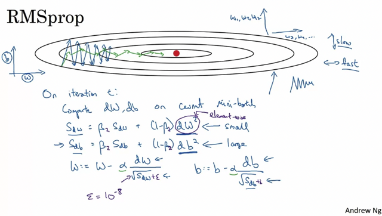</kbd>

> [!NOTE]
> Đại khái là với **param nào mà khiến G.D đi sai hướng - oscillate**,
> ví dụ ở đây cho dễ hình dung là b, thì **average weight của nó
> sẽ lớn** -> việc **chia db cho sqrt(sdb)** sẽ làm **b nhỏ lại** -> **Giảm bớt 
> ảnh hường của b, giảm bớt oscillation**
>
> Ngược lại với weight/param nào khiến G.D đi đúng hướng, 
> ở đây ví dụ là w, thì nó ít oscillation -> sdw nhỏ -> dw chia 
> cho sqrt(sdw) không ảnh hưởng mấy đến w -> giữ hướng 
> đi đúng đó.

> [!NOTE]
> Bài sau sẽ kết hợp momentum và
> RMSProp nên đánh beta2 để phân biệt.
>
> Thêm epsilon để không bị chia cho 0

   

- 1 What is RMSprop and how does it work?  - RMSprop is **another algorithm**, in addition to momentum, that can **speed up gradient descen**t. It stands for **root** **mean** **square** **prop** and it is designed to**slow down the learning in the vertical direction** and **speed up learning in the horizontal direction**. To accomplish this, on each iteration, RMSprop **computes the derivative of the current mini-batch** as usual, then it keeps an **exponentially weighted average** **of the squares of the derivatives**, which is denoted as **SdW** and **Sdb**. These terms are updated as follows: SdW = beta * SdW + (1 - beta) * dW^2 and Sdb = beta * Sdb + (1 - beta) * db^2, where beta is a hyperparameter and the squaring operation is an element-wise operation. Next, RMSprop updates the parameters as follows: **W = W - learning_rate * dW / sqrt(SdW)** and b = b - learning_rate * db / sqrt(Sdb), where learning_rate is the hyperparameter that controls how big of a step is taken during each iteration.  2 How does RMSprop help with oscillations in the vertical direction?  - RMSprop helps with oscillations in the vertical direction by slowing down the learning rate in that direction. This is achieved by keeping a larger value of Sdb, which is the exponentially weighted average of the squares of the derivatives in the vertical direction. The derivatives in the vertical direction tend to be much larger than those in the horizontal direction, due to the steep slope of the function in the vertical direction. As a result, Sdb will be relatively large, and when db is divided by sqrt(Sdb) in the update equation for b, the resulting update will be much smaller than in the horizontal direction, effectively damping out the oscillations in the vertical direction.  3 How does RMSprop help with faster learning in the horizontal direction?  - RMSprop helps with faster learning in the horizontal direction by speeding up the learning rate in that direction. This is achieved by keeping a smaller value of SdW, which is the exponentially weighted average of the squares of the derivatives in the horizontal direction. The derivatives in the horizontal direction tend to be much smaller than those in the vertical direction, due to the gentle slope of the function in the horizontal direction. As a result, SdW will be relatively small, and when dW is divided by sqrt(SdW) in the update equation for W, the resulting update will be much larger than in the vertical direction, effectively allowing for faster learning in the horizontal direction.  4 How is RMSprop applied in practice?  - In practice, RMSprop is applied by computing the derivatives of the current mini-batch as usual, then keeping an exponentially weighted average of the squares of the derivatives in each dimension of the parameter vector. The resulting terms SdW and Sdb are used to update the parameters in each dimension, with a learning rate that is scaled by the inverse square root of SdW or Sdb, respectively. To prevent division by zero, a small constant is added to SdW and Sdb before taking the square root. Additionally, a hyperparameter beta is used to control the weighting of the current and previous values in the exponential moving averages of SdW and Sdb, respectively. In practice, beta is typically set to a value between 0.9 and 0.99.
   

## Clarification About Upcoming Adam Optimization Video

 

### ...

 

<kbd>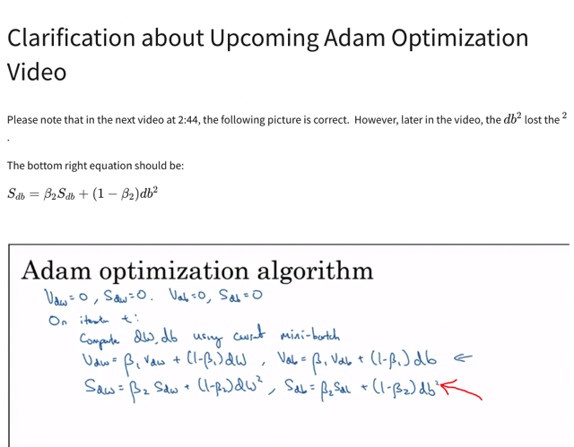</kbd>

   

## Adam Optimization Algorithm

 

### 1 Introduction:  2 During the history of deep learning, many optimization algorithms were

> [!NOTE]
> 1 Introduction:  2 During the history of deep learning, many optimization algorithms were
> proposed by researchers, but few generalize well across a wide range of neural networks.
> The deep learning community developed **skepticism** about new optimization algorithms,
> preferring to **use gradient descent with momentum** as a **reliable approach**.
>
> 3 **RMSprop** and **Adam Optimization Algorithm:**  4 RMSprop and the Adam optimization
> algorithm are two algorithms that have been shown to **work well across a wide range of
> deep learning architectures**. The Adam optimization algorithm is a **combination** of
> **momentum** and **RMSprop**. It uses hyperparameters **Beta_1** and **Beta_2** to calculate the
> **moving** **weighted** **average** **of the derivatives and their squares**.
>
> 5 Implementation of Adam:  6 To implement Adam, we first initialize **V_dw**, **V_db**, **S_dw**,
> and **S_db** to zero. We then compute the derivatives, dw, and db, using mini-batch gradient
> descent, and calculate the momentum and RMSprop updates using **Beta_1** and **Beta_2**.
> **Bias correction** is implemented **to correct** V_dw, V_db, S_dw, and S_db. Finally, the
> weights are updated using the learning rate hyperparameter **Alpha** and the **RMSprop-like**
> update.
>
> 7 Hyper-parameters and Tuning:  8 The Adam optimization algorithm has several
> **hyper-parameters** that need to be tuned, including **Alpha**, **Beta_1**, **Beta_2**, and **Epsilon**.
> Alpha is the learning rate and needs to be tuned, while default values of Beta_1, Beta_2,
> and Epsilon are often used. Beta_1 computes the mean of the derivatives, and Beta_2 is
> used to compute the exponentially weighted average of the squares. The term Adam
> stands for **Adaptive** **Moment** **Estimation**.
>
> 9 Conclusion and Further Discussion:  10 The Adam optimization algorithm is an **effective
> learning algorithm** that allows for quicker training of neural networks. However, tuning the
> hyperparameters is necessary for optimal performance.

 

<kbd>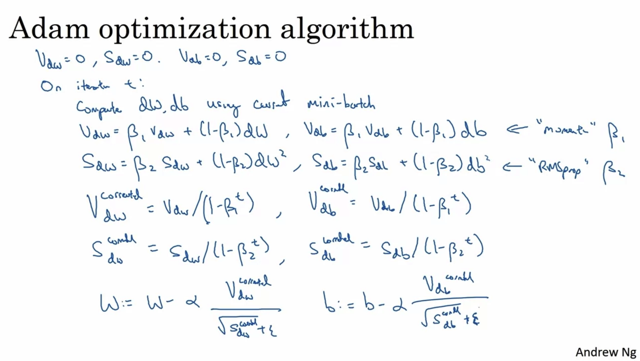</kbd>

> [!NOTE]
> Adam algorithm kết hợp giữa momentum g.d và RMSprop

   

<kbd>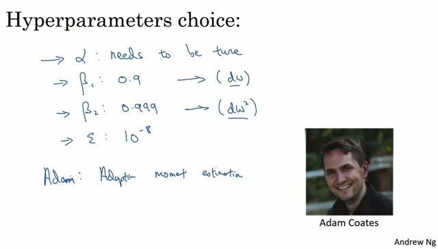</kbd>

> [!NOTE]
> Các hyperparam beta1, beta2, epsilon thường dùng và chỉ cần
> tune Alpha. và Adam không liên quan gì ông này Adam Coat

   

## Clarification About Learning Rate Decay Video

 

### ...

 

<kbd>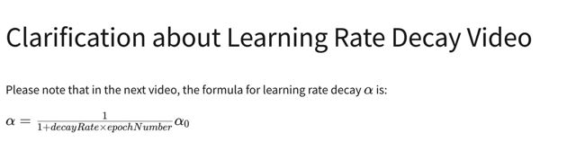</kbd>

   

## Learning Rate Decay

 

### 1 **Learning rate** **decay** is a technique that can help **speed up** the learning algorithm by

> [!NOTE]
> 1 **Learning rate** **decay** is a technique that can help **speed up** the learning algorithm by
> **gradually reducing** the **learning rate over time**.
>
> 2 By using a **smaller** learning rate, the algorithm can **oscillate** in a **tighter region** **around
> the minimum** instead of **wandering far away** as training goes on and on.
>
> 3 One way to implement **learning rate decay** is to set the **learning rate Alpha** to be equal
> to **1 over 1 plus a paramete**r (decay rate times epoch num) times some**initial learning
> rate Alpha 0.**
>
> 4 Other than this formula for learning rate decay, there are other ways people use to
> decay the learning rate **manually**, using **exponential decay**, learning rate that decreases
> and discretizes, etc.
>
> 5 **Manual decay** is sometimes used when **training only a small number of models** and
> the **learning rate is controlled by hand**, **hour-by-hour**, **day-by-day**.
>
> 6 Next week, when we talk about **hyperparameter tuning**, there will be more **systematic
> ways** to organize all the **hyperparameters** and **efficiently search amongst them.**
>
> 7 **Learning rate decay** is usually **lower** down on the **list of things to try**, compared to
> **setting a fixed value of Alph**a and **getting it to be well-tuned**, which has a huge impact on
> training.
>
> 8 Lastly, the concept of **local optima** and **saddle points** in **neural network**s are briefly
> mentioned as a topic for future discussion.

> [!NOTE]
> 1 Learning rate decay can help speed up learning algorithms:
>  2 One way to improve learning algorithms is to implement learning rate decay, which involves slowly reducing the learning rate over time. This can help the algorithm converge more effectively and avoid getting stuck in a noisy region. The intuition behind this approach is that during the initial steps of learning, larger steps can be taken, but as learning approaches convergence, smaller steps become necessary.
>  3 Implementation of learning rate decay:
>  4 To implement learning rate decay, you can set the learning rate Alpha to be equal to 1 over 1 plus a parameter (decay rate) times the epoch num, times an initial learning rate Alpha 0. One epoch is one pass through the data, and as you iterate through the data, the learning rate gradually decreases according to this formula.
>  5 Other ways to implement learning rate decay:
>  6 In addition to the formula for learning rate decay described above, there are other ways to implement it, such as exponential decay, where Alpha is equal to some number less than 1 times epoch num times Alpha 0. There are also other formulas that people use, including a learning rate that decreases discretely over time.
>  7 Manual decay:
>  8 In some cases, people may opt for manual decay, which involves watching the model as it trains and manually adjusting the learning rate as needed. However, this method is only feasible for training a small number of models.
>  9 Choosing hyperparameters:
>  10 With the various options available for implementing learning rate decay, it can be overwhelming to select the best hyperparameters. However, systematic methods for choosing hyperparameters will be discussed in the next week's lecture.
>  11 Importance of fixed learning rate:
>  12 While learning rate decay can be helpful, setting a fixed learning rate that is well-tuned can have a huge impact on the effectiveness of learning algorithms. Learning rate decay may be a lower priority on the list of things to try when optimizing the model.
>  13 Local optima and saddle points:
>  14 In addition to discussing learning rate decay, the lecture also briefly touches on local optima and saddle points in neural networks. These concepts relate to the challenge of avoiding getting stuck in suboptimal solutions during training.

 

<kbd>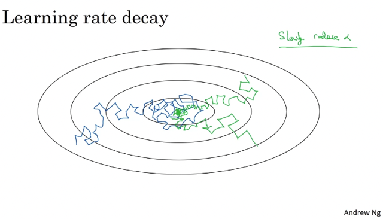</kbd>

> [!NOTE]
> Đại khái là với mini-bactch gradient descent với **Fixed alpha** thì 
> **J sẽ không converge chính xác về Minimum** mà sẽ **loanh quanh** khu
> vực đó. Vấn đề này có thể **tạm chấp nhận** vì dù sao mini-batch 
> giúp G.D nhanh hơn và kết quả cũng không qúa tệ.
>
> Tuy nhiên có thể improve vấn đề này bằng cách cho alpha **giảm 
> dần - Decay**

   

<kbd>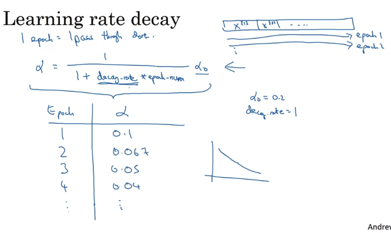</kbd>

   

<kbd>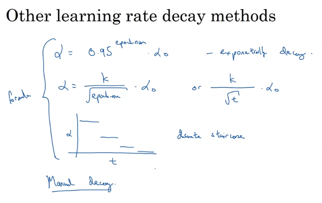</kbd>

> [!NOTE]
> **Manually decay:**Đại khái là tự adjust alpha thủ công
> chỉ dc khi training vài model hàng giờ, hàng ngày liền
> thì cách này đại khái là theo dõi model và tự điều chỉnh
> alpha****If you're **training just one model at a time**, and if your
> model takes **many hours** or even many **days to train**,
> what some people would do is **just watch your model**
> as it's training over a large number of days, and then
> now you say, **oh, it looks like the learning rate slowed
> down, I'm going to decrease Alpha a little bit**.Of course,
> this works, this **manually controlling Alpha**, really **tuning
> Alpha by hand, hour-by-hour, day-by-day**. This works
> only if you're training **only a small number of model**s, but
> **sometimes people do that as well**

> [!NOTE]
> Một số cách thức decay alpha hay dùng

   

## The Problem Of Local Optima

 

### 1 In the early days of deep learning, people were concerned about

> [!NOTE]
> 1 In the early days of deep learning, people were concerned about
> optimization algorithms getting stuck in **bad local optima**.
>
> 2 As our understanding of deep learning has advanced, **our understanding
> of local optima is changing**.
>
> 3 Most points of zero gradient in a cost function are actually **saddle points
> rather than local optima**, especially in **high-dimensional spaces**.
>
> 4 **Plateaus** can**slow down learning** and are a **problem for optimization
> algorithms**.
>
> 5 **Sophisticated** **optimization** algorithms, such as **momentum**, **RmsProp**,
> and **Adam**, can help **overcome the problem of plateaus**.
>
> 6 Our understanding of high-dimensional optimization problems is still
> evolving.

> [!NOTE]
> 1 In the early days of deep learning, people used to worry about the optimization algorithm getting stuck in bad local optima. They used to think that there were a lot of local optima in the cost function surface and that it would be easy for the optimization algorithm to get stuck in one of them.
>  2 However, as the theory of deep learning has advanced, our understanding of local optima has also changed. Most points of zero gradient in a cost function are actually saddle points rather than local optima. In a high-dimensional space, it's much more likely to run into a saddle point than a local optimum.
>  3 Plateaus can slow down learning because they are regions where the derivative is close to zero for a long time. Gradient descent will move down the surface, but because the gradient is near zero, the surface is quite flat, and it can take a long time to reach the bottom of the plateau. This is where more sophisticated optimization algorithms like momentum, RmsProp, or Adam can help speed up learning.
>  4 Algorithms like Adam can help speed up the rate at which the optimization algorithm moves down the plateau and then gets off it.
>  5 Our understanding of high-dimensional spaces is still evolving, and it's hard to have good intuitions about what these spaces really look like. However, one takeaway from this video is that we're unlikely to get stuck in bad local optima as long as we're training a reasonably large neural network with many parameters and the cost function is defined over a high-dimensional space.
>  6 The main problem in optimization is plateaus, and algorithms like momentum and Adam can help overcome this problem.

 

<kbd>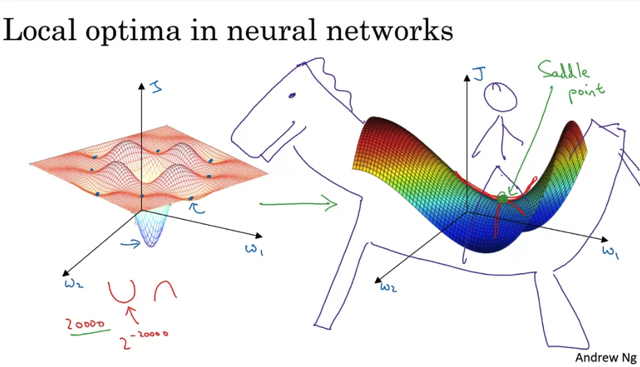</kbd>

> [!NOTE]
> Đại khái là trong thực tế khó gặp l**ocal optima - Stuck /
> không có đường xuống nữa** ( - vấn đề mà ML lúc trước hay
> nói đến) mà là thường là dạng **Saddle - nơi luôn có đường
> để xuống.**

   

<kbd>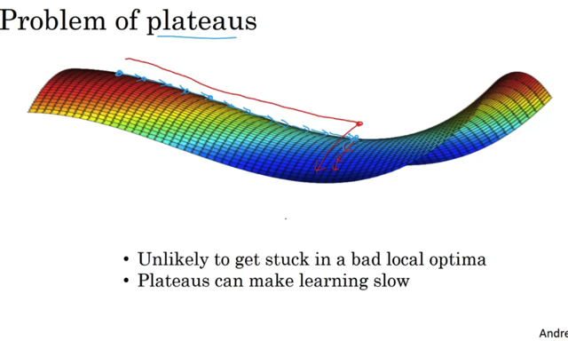</kbd>

> [!NOTE]
> Nên vấn đề là **không phải ta sẽ bị stuck ko xuống được
> nữa** mà là khi gặp mấy cái saddle này ta sẽ **xuống rất rất chậm**
>
> *Ta ở đây ý nói J trong quá trình training, xuống ở đây ý nói 
> việc giảm J trong quá trình G.D
>
> Và vấn đề trên đ**ã được giải quyết** bằng nhưng **Algorithm** cải tiến
> như **momentum**, **Adam**

   

## Quiz

 

<kbd>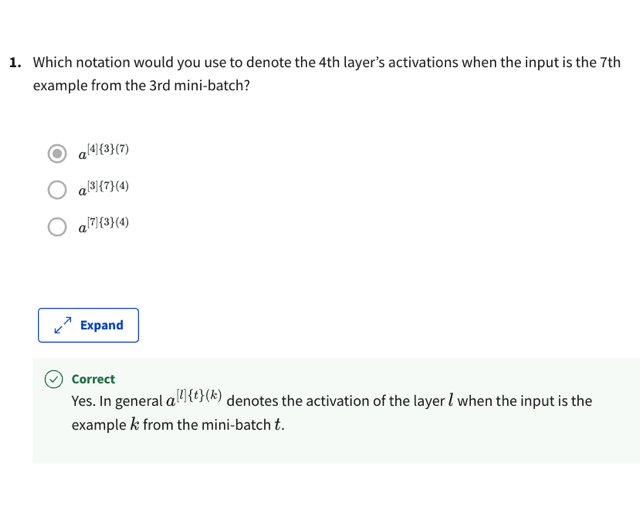</kbd>

 

<kbd>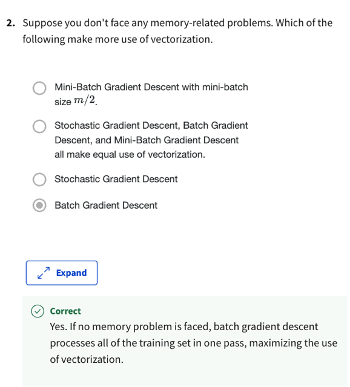</kbd>

 

<kbd>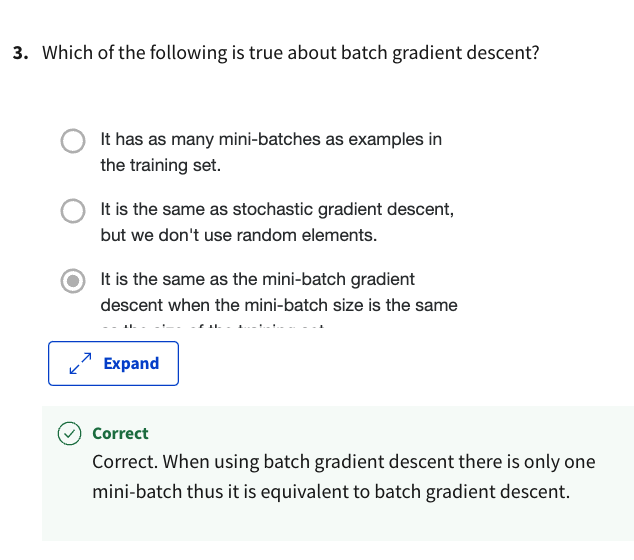</kbd>

 

<kbd>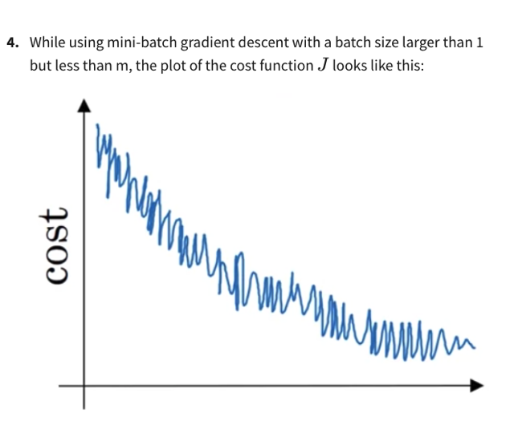</kbd>

 

<kbd>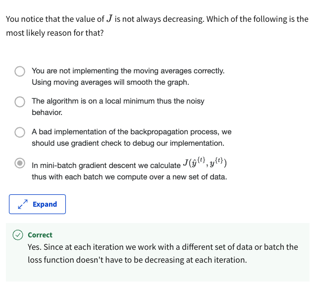</kbd>

 

<kbd>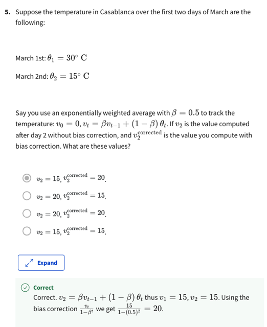</kbd>

 

<kbd>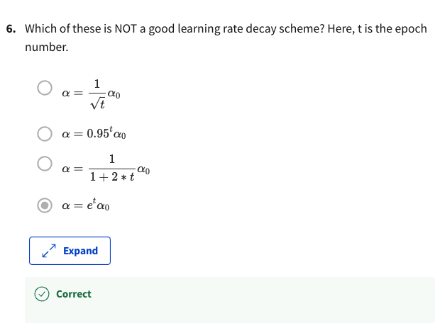</kbd>

 

<kbd>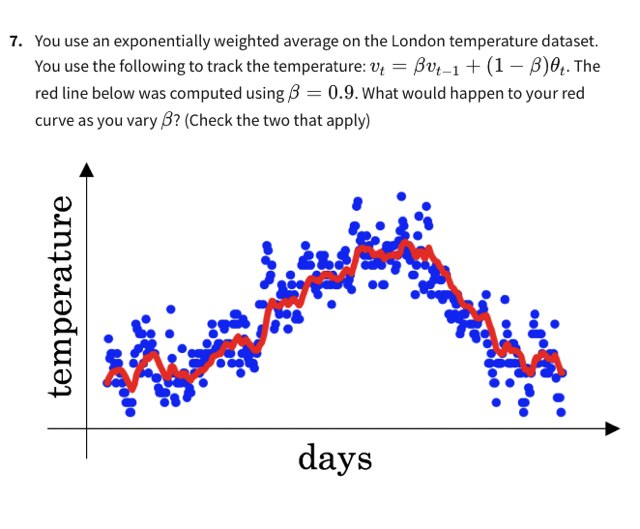</kbd>

 

<kbd>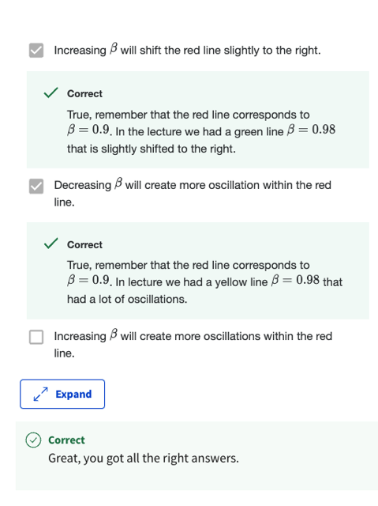</kbd>

 

<kbd>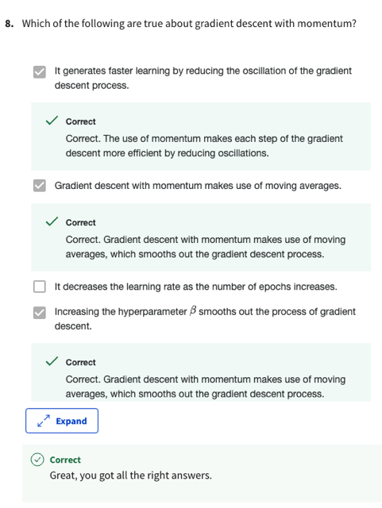</kbd>

 

<kbd>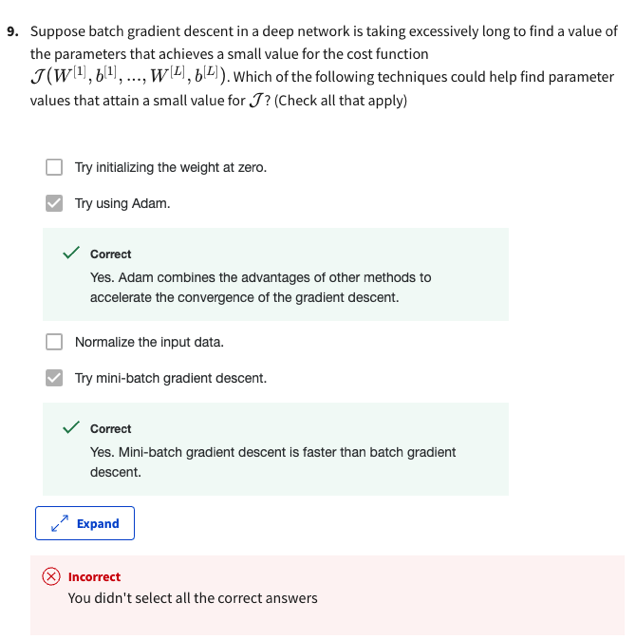</kbd>

 

<kbd>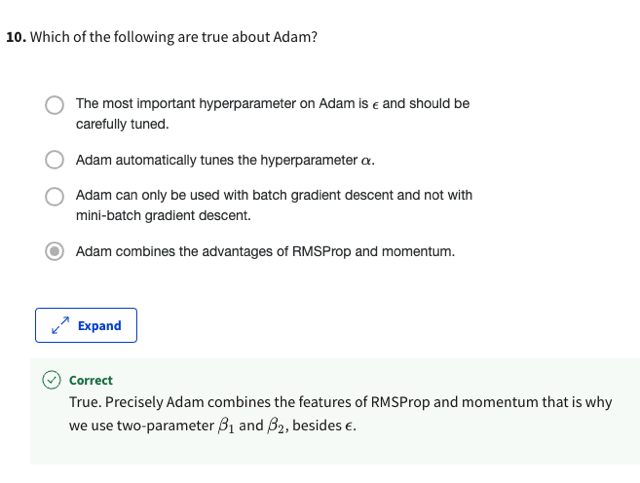</kbd>

 

## Programming Assignment

 

### Optimization Methods

 

<kbd>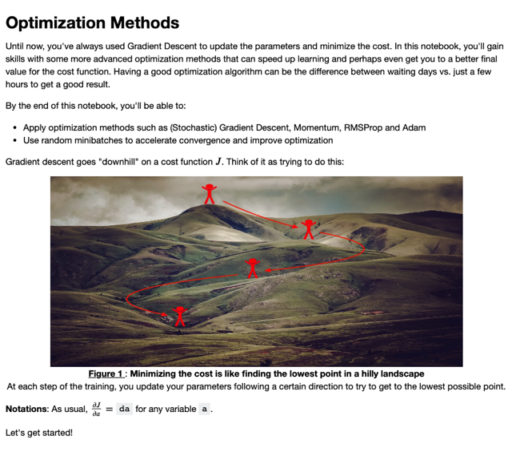</kbd>

   

### 1- Packages

 

<kbd>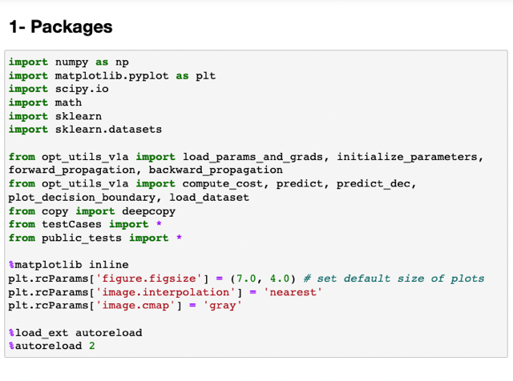</kbd>

   

### 2 - Gradient Descent

 

- Exercise 1 - update_parameters_with_gd
> [!NOTE]
> Update params như thông thường

   

    
    
<kbd>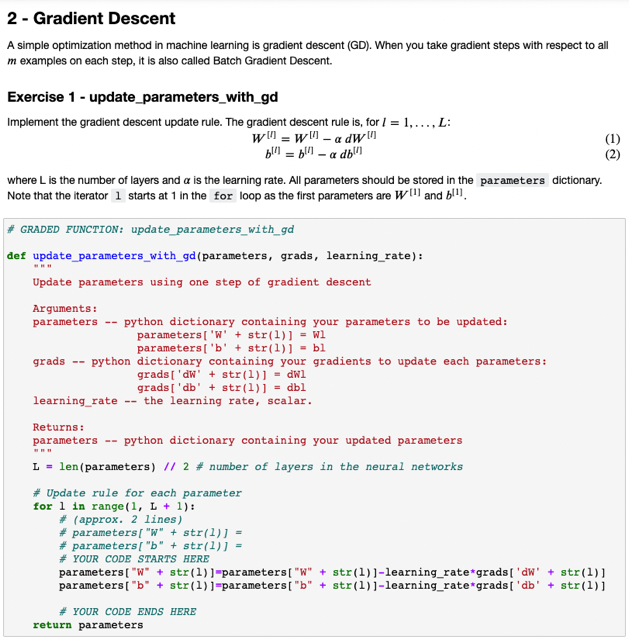</kbd>

     

    
    
<kbd>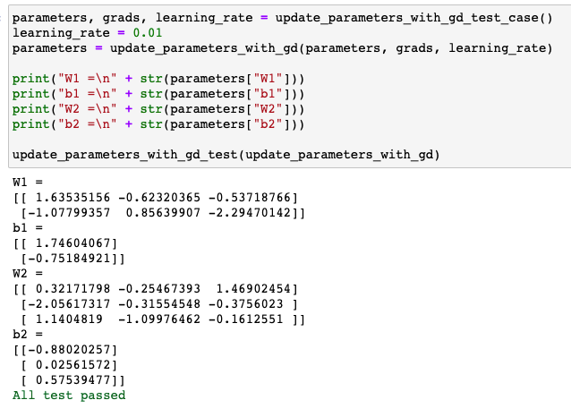</kbd>

     

    
    
<kbd>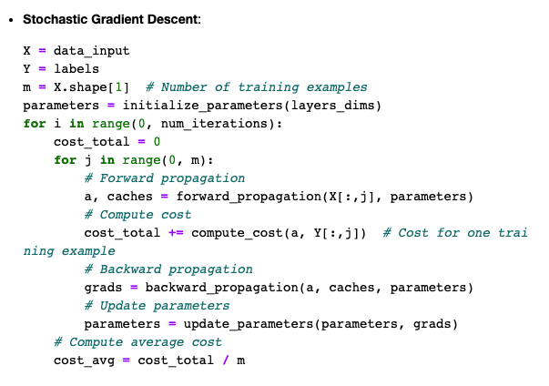</kbd>

    
<kbd></kbd>

    
<kbd>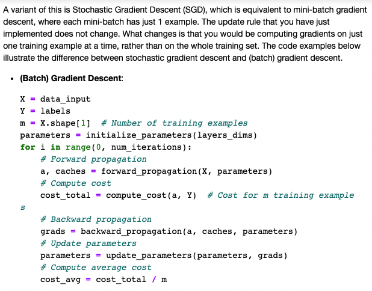</kbd>

     

    
    
<kbd>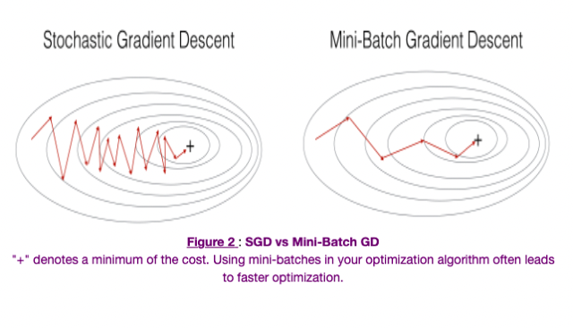</kbd>

    
<kbd></kbd>

    
<kbd>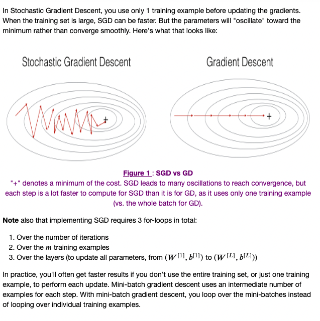</kbd>

     

### 3 - Mini-Batch Gradient Descent

 

- 2 steps: Shuffle & Partition
   

    
    
<kbd></kbd>

     

    
    
<kbd></kbd>

     

- Exercise 2 - random_mini_batches
> [!NOTE]
> Chia bộ data thành các mini batch,
> Số mini_batch = K  + 1 bộ lẻ 
> (nếu có thì size = m - K*mini_batch_size)
> K = np.roundoff(m/mini_batch_size).

   

    
    
<kbd></kbd>

     

    
    
<kbd></kbd>

     

    
    
<kbd></kbd>

     

    
    
<kbd></kbd>

     

    
    
<kbd></kbd>

     

    
    
<kbd></kbd>

     

- Note
> [!NOTE]
> *NOTE

   

    
    
<kbd></kbd>

    > [!NOTE]
    > *NOTE

     

### 4 - Momentum

 

- Exercise 3 - initialize_velocity
> [!NOTE]
> Chỉ ini vdW1, vdb1, ...vdWL, vdbL bởi 
> np.zeros(shape)
> Với shape tương ứng của W1, b1,..WL, bL
> Bỏ vào trong dictionary v luôn
> Ex. v[dw1=...], v[db1=...]

   

    
    
<kbd></kbd>

     

    
    
<kbd></kbd>

     

    
    
<kbd></kbd>

     

- Exercise 4 - update_parameters_with_momentum
> [!NOTE]
> Update params with MOMENTUM
> Thay vì update W,b với dW, db thông thường thì
> Nay update W với vdW, vdb
> Với vdW, vdb Tính theo công thức **Exponentially 
> Weight Average**
>
> vdW = beta*vdW + (1-beta)*dW 
> vdb = beta*vdb + (1-beta)*db

   

    
    
<kbd></kbd>

     

    
    
<kbd></kbd>

     

- Note
> [!NOTE]
> *NOTE

   

    
    
<kbd></kbd>

    > [!NOTE]
    > *NOTE

     

### 5 - Adam

 

- Exercise 5 - initialize_adam
> [!NOTE]
> Chỉ ini vdW1, vdb1, ...vdWL, vdbL 
> sdW1, sdb1, ...sdWL, sdbL
> bởi np.zeros(shape)
> Với shape tương ứng của W1, b1,..WL, bL
> Bỏ vào trong dictionary v luôn
> Ex. v[dw1=...], v[db1=...]

   

    
    
<kbd></kbd>

     

    
    
<kbd></kbd>

     

    
    
<kbd></kbd>

     

- Exercise 6 - update_parameters_with_adam
> [!NOTE]
> Update params with ADAM

   

    
    
<kbd></kbd>

     

    
    
<kbd></kbd>

     

    
    
<kbd></kbd>

     

### 6 - Model with different Optimization algorithms

> [!NOTE]
> Lần lượt thử train model với 3 loaị để coi cái 
> nào tốt hơn: G.D, Momentum, Adam

 

- 'Moons' dataset
   

    
    
<kbd></kbd>

     

    
    
<kbd></kbd>

    
<kbd></kbd>

    
<kbd></kbd>

     

- 6.1 - Mini-Batch Gradient Descent
   

    
    
<kbd></kbd>

    
<kbd></kbd>

    
<kbd></kbd>

     

- 6.2 - Mini-Batch Gradient Descent with Momentum
   

    
    
<kbd></kbd>

    
<kbd></kbd>

    
<kbd></kbd>

     

- 6.3 - Mini-Batch with Adam
   

    
    
<kbd></kbd>

     

    
    
<kbd></kbd>

     

- 6.4 - Summary
> [!NOTE]
> *NOTE

   

    
    
<kbd></kbd>

    > [!NOTE]
    > *NOTE

     

### 7 - Learning Rate Decay and Scheduling

 

- Thêm 'Learning decay' element
   

    
    
<kbd></kbd>

     

    
    
<kbd></kbd>

    
<kbd></kbd>

    
<kbd></kbd>

     

- 7.1 - Decay on every iteration
   

  
  - Exercise 7 - update_lr
     

      
      
<kbd></kbd>

       

      
      
<kbd></kbd>

       

      
      
<kbd></kbd>

      > [!NOTE]
      > *NOTE

       

- 7.2 - Fixed Interval Scheduling
   

  
  - Exercise 8 - schedule_lr_decay
     

      
      
<kbd></kbd>

       

      
      
<kbd></kbd>

       

- 7.3 - Using Learning Rate Decay for each Optimization Method
   

  
  - 7.3.1 - Gradient Descent with Learning Rate Decay
     

      
      
<kbd></kbd>

       

      
      
<kbd></kbd>

       

  
  - 7.3.2 - Gradient Descent with Momentum and Learning Rate Decay
     

      
      
<kbd></kbd>

       

      
      
<kbd></kbd>

       

  
  - 7.3.3 - Adam with Learning Rate Decay
     

      
      
<kbd></kbd>

       

      
      
<kbd></kbd>

       

- 7.4 - Achieving similar performance with different methods
> [!NOTE]
> *NOTE

   

    
    
<kbd></kbd>

    > [!NOTE]
    > *NOTE

     

