# C2w3_hyperparamter Tuning, Batch Normalization & Programming Frameworks

📊 **Progress:** `56` Notes | `89` Screenshots

---

Explore TensorFlow, a deep learning framework that allows you to build neural networks quickly and easily, then train a neural network on a TensorFlow dataset.
**Learning Objectives**
 • Master the process of hyperparameter tuning
 • Describe softmax classification for multiple classes
 • Apply batch normalization to make your neural network more robust
 • Build a neural network in TensorFlow and train it on a TensorFlow dataset
 • Describe the purpose and operation of GradientTape
 • Use tf.Variable to modify the state of a variable
 • Apply TensorFlow decorators to speed up code
 • Explain the difference between a variable and a constant

## Hyperparams Tuning

> [!NOTE]
> 1ST REVIEWED

 

### Tuning Process

 

- 1 There are a lot of hyperparameters that need to be set when training deep neural networks, such as \\*learning rate\\*, \\*momentum term\\*,\\* number of layers,\\* number of hidden units, mini-batch size, and learning rate decay.  2 Some of these hyperparameters are \\*more important than others\\*. \\*Learning rate\\* is the\\* most important,\\* followed by \\*momentum term\\*, \\*mini-batch size\\*, and number of \\*hidden units.\\*  3 It's difficult to know in advance which hyperparameters will be the most important, so it's important to\\* try out a wide range of values\\*.  4 \\*Sampling at random\\* is a \\*better approach\\* than systematically exploring values in a \\*grid\\* because it allows for a \\*more rich exploration\\* of the hyperparameter space.  5\\* Coarse to fine sampling\\* is a \\*common practice\\* that involves \\*zooming\\* \\*in\\* on \\*promising areas\\* of the \\*hyperparameter space\\* and exploring more densely within that area.
  > 1 Hyperparameters in neural networks: Neural networks involve setting a lot of different hyperparameters, ranging from the learning rate alpha to the momentum term beta, the hyperparameters for the Adam Optimization Algorithm (beta one, beta two, and epsilon), the number of layers, the number of hidden units for the different layers, and the mini-batch size.
>  2 Importance of hyperparameters: Some of these hyperparameters are more important than others. The most important hyperparameter to tune is usually the learning rate alpha. Other hyperparameters that should be considered next include the momentum term (0.9 is a good default), the mini-batch size (to ensure the optimization algorithm is running efficiently), and the hidden units.
>  3 Tuning hyperparameters: How do you go about finding a good setting for these hyperparameters? It's important to systematically organize your hyperparameter tuning process to make it more efficient for you to converge on a good setting of the hyperparameters.
>  4 Sampling hyperparameters: In earlier generations of machine learning algorithms, if you had two hyperparameters, it was common practice to sample the points in a grid and systematically explore these values. However, in deep learning, it's better to choose the points at random to try out on a randomly chosen set of points. This is because it's difficult to know in advance which hyperparameters are going to be the most important for your problem.
>  5 Importance of sampling at random: Some hyperparameters are much more important than others. If you sample in a grid, you might find that you've only tried out a few values of the most important hyperparameter, while having tried out many different values of a less important hyperparameter. Sampling at random helps to explore a more diverse set of possible values for the most important hyperparameters, whatever they turn out to be.
>  6 Coarse to fine sampling scheme: Another common practice when sampling hyperparameters is to use a coarse to fine sampling scheme. This involves starting with a larger set of hyperparameters and then zooming in to a smaller region of the hyperparameters to sample more densely within this space. This can help to focus more resources on searching within the most promising regions of hyperparameters.

   

    
    
<kbd>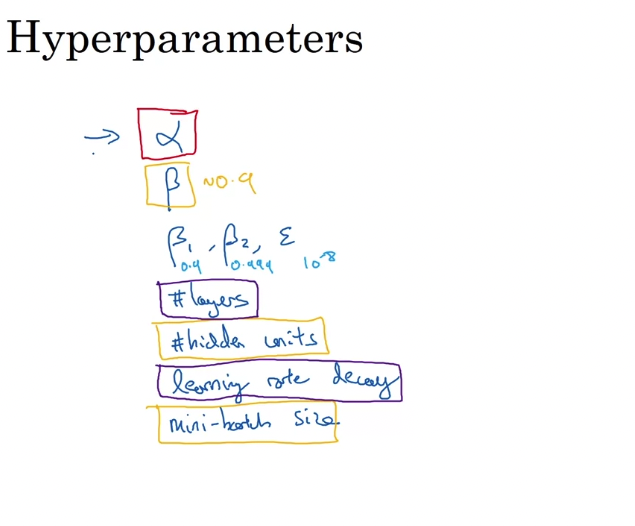</kbd>

     

    
    
<kbd>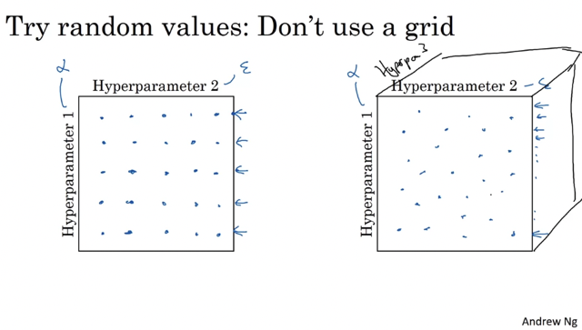</kbd>

    > Khó biết được hyperparam nào là quan trọng (khiến Model tốt)
>
> Nên thay vì làm theo kiểu Grid như hồi đầu của ML, bây giờ
> nên chọn **Random** .

     

    
    
<kbd>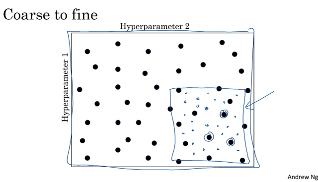</kbd>

    > Khi thấy 'vị trí' nào cho kết qua tốt -> Zoom vào khu
> vực đó **(Coarse to fine)**

     

  
  - 1 Hyperparameters in neural networks: Neural networks involve setting a lot of different hyperparameters, ranging from the learning rate alpha to the momentum term beta, the hyperparameters for the Adam Optimization Algorithm (beta one, beta two, and epsilon), the number of layers, the number of hidden units for the different layers, and the mini-batch size.  2 Importance of hyperparameters: Some of these hyperparameters are more important than others. The most important hyperparameter to tune is usually the learning rate alpha. Other hyperparameters that should be considered next include the momentum term (0.9 is a good default), the \\*mini-batch size\\* (to ensure the optimization algorithm is running efficiently), and the hidden units.  3 \\*Tuning\\* \\*hyperparameters\\*: How do you go about finding a good setting for these hyperparameters? It's important to \\*systematically organize your hyperparameter\\* tuning process to make it more efficient for you to converge on a good setting of the hyperparameters.  4 \\*Sampling\\* hyperparameters: In earlier generations of machine learning algorithms, if you had two hyperparameters, it was common practice to sample the points in a grid and systematically explore these values. However, in deep learning, it's better to choose the\\* points at random\\* to try \\*out on a randomly chosen set of points\\*. This is because it's difficult to know in advance which hyperparameters are going to be the most important for your problem.  5 Importance of sampling at random: Some hyperparameters are \\*much more important than other\\*s. If you sample in a grid, you might find that you' ve only tried out a few values of the most important hyperparameter, while having tried out many different values of a less important hyperparameter. Sampling at random helps to explore a \\*more diverse set of possible values for the most important hyperparameters\\*, whatever they turn out to be.  6 \\*Coarse to fine sampling\\* scheme: Another common practice when sampling hyperparameters is to use a \\*coarse to fine sampling scheme\\*. This involves \\*starting with a larger set of hyperparameters\\* and then \\*zooming in to a smaller region\\* of the hyperparameters to sample m\\*ore densely within this space.\\* This can help to\\* focus more resources on searching within the most promising regions\\* of hyperparameters.
     

### Using An Appropriate Scale To Pick Hyperparameters

 

- 1\\* Random sampling\\* over hyperparameters allows \\*efficient search\\* over their space.  2 It is \\*important\\* to pick the \\*appropriate scale\\* on which to explore the hyperparameters.  3 \\*Sampling uniformly at random \\*over the range of hyperparameters might be \\*reasonable for certain hyperparameters,\\* such as the \\*number of hidden units\\* and \\*layers\\* in a neural network.  4 It is\\* not reasonable\\* to sample uniformly at random over the range of all hyperparameters.  5 Searching for hyperparameters on a\\* log scale\\* is \\*more reasonable\\*, especially for hyperparameters such as the \\*learning rate.\\*  6 To sample on a log scale, you need to take the \\*low\\* and \\*high values\\*, take \\*logs\\* to figure out what \\*a\\* and\\* b\\* are, sample \\*r\\* \\*uniformly between a and b\\*, and set the \\*hyperparameter to be 10 to the power of r.\\*  7 Sampling for the hyperparameter \\*beta\\* used for computing exponentially weighted averages is \\*tricky\\* and \\*should not be\\* \\*sampled on a linear scale. \\* 8 To explore the r\\*ange of values for beta\\*, it is important to \\*consider the range of values for the corresponding exponentially weighted average\\*s.
  > 1 Sampling hyperparameters at random can be an efficient way to search over their space, but it's important to pick the appropriate scale to explore them.
>  2 Uniformly sampling hyperparameters may not be appropriate for all ranges of values. For example, when searching for the learning rate alpha, using a linear scale from 0.0001 to 1 would result in sampling mostly from the range of 0.1 to 1. Instead, it's better to use a logarithmic scale where values are spaced equally on the log scale.
>  3 To sample on a logarithmic scale in Python, you can use the following code:
>  • Let r = -4 * np.random.rand()
>  • A randomly chosen value of alpha would then be alpha = 10 to the power of r
>  • This results in alpha being sampled between 10 to the -4 and 10 to the 0
>  4 In a more general case, if you want to sample between 10 to the a and 10 to the b on a log scale, you can use the following steps:
>  • Take the log base 10 of the low value to find a
>  • Take the log base 10 of the high value to find b
>  • Sample r uniformly at random between a and b
>  • Set the hyperparameter to be 10 to the r
>  5 Another tricky case is sampling the hyperparameter beta used for computing exponentially weighted averages. In this case, it's important to understand the effect of changing the value of beta on the average. Using a linear scale to sample beta between 0.9 and 0.999 may not be effective since the values are spaced closely together near 0.999. Instead, a good way to sample beta is to use the formula beta = 1 - 10 to the power of -x, where x is sampled uniformly at random between 1 and 4.
>  6 Overall, it's important to understand the range of values that each hyperparameter can take and to choose an appropriate scale for sampling in order to efficiently explore their space.

   

    
    
<kbd>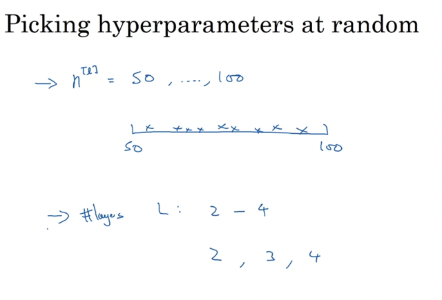</kbd>

    > Ví dụ như ta đang chọn random số hidden unit cho layer mà
> Ta nhắm chừng trong khoảng 50 - 100, thế là lẽ dĩ nhiên ta
> lấy random vài giá trị trong khoảng này.
>
> Hoặc số layer nhắm chừng trong khoảng 2,3,4, ta cứ thử từng 
> cái 2,3,4..
> Thì đại khái là cái hyperparam kiểu này ta làm vâỵ được, nhưng đối 
> với cái khác thì không....

     

    
    
<kbd>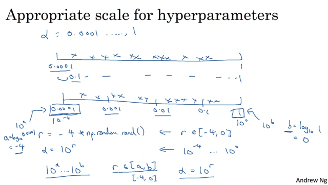</kbd>

    > Ví dụ như alpha nhắm trong khoảng từ 0.001 tới 1
> Nếu ta cũng làm như cách làm ở thằng hidden unit
> thì đại khái là ta sẽ 90% là chọn alpha từ 0.1-1. chỉ còn 10%
> từ 0.001-0.1
> 90 hay 10 là đại ý nói do cái **scale nó ko bằng nhau** nên 
> không làm vậy được.
>
> Thay vào đó phải làm theo kiểu lấy **log**.
>
> Ví dụ muốn lấy từ 0.0001 - 1. Thừ xem **0.0001** là log(a) **a bao nhiêu**.
> **1** là log(b) ->**b bao nhiêu.**
> -> Dẫn tới bài toán chọn **r random trong đoạn [a,b]** ->**alpha = 10^r**

     

    
    
<kbd>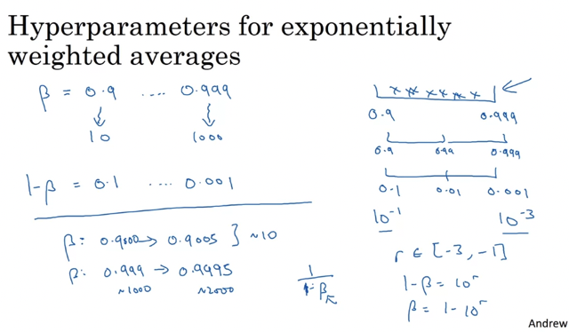</kbd>

    > Tương tự như vậy với beta.
>
> Nhớ lại (1-epsilon)^(1/epsilon)
>
> 0.9000 -> 0.9005: Tăng 0.0005
> Beta = 0.9 -> epsilon = 0.1 -> 1/epsilon = 10 thì hiểu đại khái là nó lấy 
> Trung bình của 10 ngày trước đó.
> Beta = 0.9005 -> Epsilon = 0.095 -> 1/epsilon cũng cỡ 10 (10,05)
>
> 0.9990 -> 0.9995: Cũng tăng 0.0005
> Beta = 0.9990 -> epsilon = 0.001 -> 1/epsilon = 1000
> Beta = 0.9995 -> epsilon = 0.0005 -> 1/epsilon = 2000
>
> Có nghĩa là trong đoạn cùng là 0.0005 mà mức ảnh hưởng của nó
> hoàn toàn khác nhau

     

    
    
<kbd>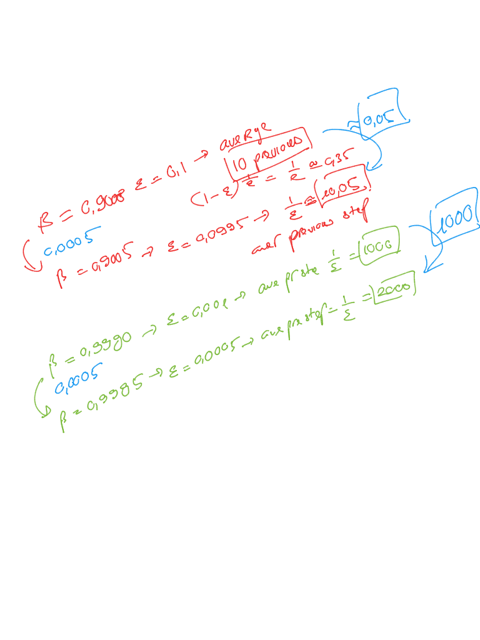</kbd>

     

  
  - 1 Sampling hyperparameters at random can be an efficient way to search over their space, but it's important to pick the appropriate scale to explore them.  2 Uniformly sampling hyperparameters may not be appropriate for all ranges of values. For example, when searching for the learning rate alpha, using a linear scale from 0.0001 to 1 would result in sampling mostly from the range of 0.1 to 1. Instead, it's better to use a logarithmic scale where values are spaced equally on the log scale.  3 To sample on a logarithmic scale in Python, you can use the following code:  • Let r = -4 * np.random.rand()  • A randomly chosen value of alpha would then be alpha = 10 to the power of r  • This results in alpha being sampled between 10 to the -4 and 10 to the 0  4 In a more general case, if you want to sample between 10 to the a and 10 to the b on a log scale, you can use the following steps:  • Take the log base 10 of the low value to find a  • Take the log base 10 of the high value to find b  • Sample r uniformly at random between a and b  • Set the hyperparameter to be 10 to the r  5 Another tricky case is sampling the hyperparameter beta used for computing exponentially weighted averages. In this case, it's important to understand the effect of changing the value of beta on the average. Using a linear scale to sample beta between 0.9 and 0.999 may not be effective since the values are spaced closely together near 0. 999. Instead, a good way to sample beta is to use the formula beta = 1 - 10 to the power of -x, where x is sampled uniformly at random between 1 and 4.  6 Overall, it's important to understand the range of values that each hyperparameter can take and to choose an appropriate scale for sampling in order to efficiently explore their space.
     

### Hyperparams Tuning In Practice: Pandas Vs. Caviar

 

- 1 Intuitions about hyperparameter settings from one application area may or may not transfer to a different one, but \\*cross-fertilization among different domains\\* is \\*increasingly common\\*.  2 \\*Hyperparameter settings\\* can get \\*stale\\* due to \\*changes\\* in \\*data\\* or \\*computational resources,\\* so it's recommended to \\*retest\\* or \\*reevaluate hyperparameters\\* at least once \\*every several months.\\*  3 Two \\*major ways\\* of searching for hyperparameters are the \\*panda approac\\*h, where \\*one model\\* is \\*gradually tweaked\\*, and the \\*caviar approach\\*, where \\*many mode\\*ls are trained \\*in parallel \\*and the b\\*est one is chosen.\\*  4 The choice between the two approaches \\*depends on the amount of computational resources\\* available.
  > 1 Importance of cross-fertilization in deep learning:
>  2 Deep learning is applied in various application areas, and intuitions about hyperparameter settings from one area may or may not transfer to a different one. However, there is a lot of cross-fertilization among different application domains, with researchers reading increasingly from other domains to look for inspiration for cross-fertilization. For example, ideas developed in computer vision, such as Confonets or ResNets, have been successfully applied to speech, and vice versa.
>  3 The risk of stale hyperparameter settings:
>  4 Intuitions about the best hyperparameter settings can get stale over time, even when working on the same problem. For instance, a good setting that was once found may no longer work due to changes in data or hardware. Therefore, it is recommended to retest or reevaluate hyperparameters periodically, maybe at least once every several months, to ensure that the current hyperparameter values are still suitable.
>  5 Two major schools of thought in hyperparameter search:
>  6 There are two major ways in which people go about searching for hyperparameters: babysitting one model and training many models in parallel.
>  7 Babysitting one model:
>  8 If computational resources are limited, then one approach is to babysit one model by gradually nudging up and down the parameters. For example, one might initialize the parameters randomly and start training, then gradually watch the learning curve, maybe the cost function or dataset error, gradually decrease over the first day. At the end of the day, one might try increasing the learning rate a little bit and see how it performs, and then adjust the parameters again the following day, and so on. The approach is called the panda approach, as it is similar to how pandas have few children and put a lot of effort into ensuring their survival.
>  9 Training many models in parallel:
>  10 If there are enough computational resources, then one can train many models in parallel with different hyperparameters. Each model generates its own learning curve, and the best hyperparameter setting is selected based on which model performs the best. This approach is called the caviar strategy, as it is similar to how fish reproduce by laying many eggs and not paying too much attention to any one of them.
>  11 Choosing between the two approaches:
>  12 The choice between the two approaches is mainly a function of how much computational resources are available. If there are enough resources, then the caviar strategy can be used to try a lot of different hyperparameter settings and select the best one quickly. However, if resources are limited, then the panda approach can be used to gradually adjust the hyperparameters of one model over time.

   

    
    
<kbd>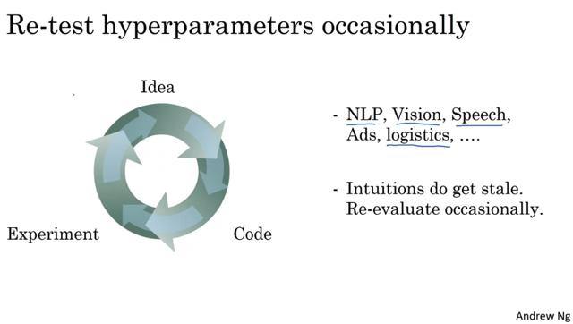</kbd>

    > Đại khái là nên **retest hyperparams vài tháng một lần** vì
> những **sự thay đổ**i có thể khiến cái mình đã tune ngon 
> hết ngon
> Ví dụ: Data thay đổi, server khác, 
>
> Còn chuyển từ domain này qua domain khác thì đại ý là 
> Deep learning nó có ưu điểm là kế thừa được những cái từ
> domain khác, nhưng hyperparam thì không, phải tune lại.

     

    
    
<kbd>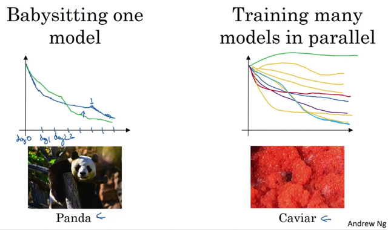</kbd>

    > Đại khái là máy mạnh thì **chạy nhiều model cùng lúc** rồi **xem
> cái nào ngon nhất**.-> Như cá hồi đẻ trứng
>
> Còn không thì c**hăm như chăm con**, từng ngày từng ngày 
> theo dõi và điều chỉnh. Ví dụ ngày thứ 2 thử giảm alpha xuống 
> Qua thứ 3 thấy ok, thử cái khác qua thứ 4 thấy nó không ổn,
> liền quay lại setting của ngày thứ 3, thử setting khác -> Chăm 
> như chăm con

     

  
  - 1 Importance of \\*cross-fertilization\\* in deep learning:  2 Deep learning is applied in various application areas, and\\* intuitions about hyperparameter settings\\* from one area \\*may or may not transfer\\* to a different one. However, there is a lot of \\*cross-fertilization among different application domains\\*, with researchers reading increasingly from other domains to look for inspiration for cross-fertilization. For example, ideas developed in \\*computer vision\\*, such as \\*ConVnets\\* or \\*ResNets\\*, have been successfully applied to \\*speech\\*, and vice versa.  3 The risk of \\*stale hyperparameter settings:\\*  4 Intuitions about the \\*best hyperparameter settings can get stale over time,\\* even when working on the same problem. For instance, a good setting that was once found may \\*no longer work\\* due to c\\*hanges in data or hardware\\*. Therefore, it is recommended to \\*retest\\* or \\*reevaluate\\* \\*hyperparameters\\* \\*periodically\\*, maybe at least\\* once every several months\\*, to ensure that the current hyperparameter values are\\* still suitable.\\*  5 Two major \\*schools of thought \\*in \\*hyperparameter search\\*:  6 There are two major ways in which people go about searching for hyperparameters: \\*babysitting\\* one model and \\*training\\* many models in \\*parallel\\*.  7 \\*Babysitting\\* one model:  8 If c\\*omputational resources are limited\\*, then one approach is to \\*babysit\\* one model by \\*gradually nudging up\\* and \\*down the parameters\\*. For example, one might initialize the parameters randomly and start training, then gradually watch the learning curve, maybe the cost function or dataset error, gradually decrease over the first day. At the end of the day, one might try increasing the learning rate a little bit and see how it performs, and then adjust the parameters again the following day, and so on. The approach is called the p\\*anda approach\\*, as it is similar to how pandas have few children and \\*put a lot of effort into ensuring their survival\\*.  9 Training\\* many models in parallel:\\*  10 If there are \\*enough computational resources\\*, then one can train \\*many models\\* in \\*parallel\\* with \\*different hyperparameters\\*. Each model generates its \\*own learning curve\\*, and the \\*best hyperparameter setting\\* is selected based on\\* which model performs the best\\*. This approach is called the \\*caviar strategy\\*, as it is similar to how fish reproduce by laying many eggs and not paying too much attention to any one of them.  11 Choosing between the two approaches:  12 The choice between the two approaches is mainly a function of how \\*much computational resources are available\\*. If there are enough resources, then the caviar strategy can be used to try a lot of different hyperparameter settings and select the best one \\*quickly\\*. However, if \\*resources are limited\\*, then the panda approach can be used to gradually adjust the hyperparameters of one model over time.
     

## Batch Normalization

> [!NOTE]
> 1ST REVIEWED

 

### Clarification About Upcoming

> [!NOTE]
> CLARIFICATION ABOUT UPCOMING
> NORMALIZATION ACTIVATIONS IN A NETWORK

 

- ...
   

    
    
<kbd>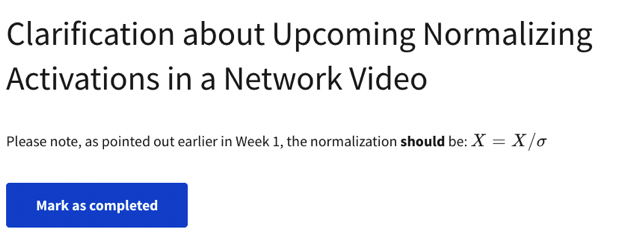</kbd>

     

### Normalization Activations In A Network

 

- 1 Batch normalization is a deep learning algorithm that was created by Sergey Ioffe and Christian Szegedy.  2 Batch normalization can make the hyperparameter search problem much easier, make neural networks more robust, and enable easy training of very deep networks.  3 Normalizing input feature values can speed up learning in models such as logistic regression.  4 Batch normalization can be used to normalize the mean and variance of activations in hidden layers.  5 Batch normalization normalizes the values of z before the activation function is applied, and this is done much more often in practice.  6 To implement batch norm, you compute the mean and variance of intermediate values, normalize the values using mean and variance, and use learnable parameters gamma and beta to set the mean and variance of the normalized values to desired values.  7 Gamma and beta parameters can be updated using gradient descent or other algorithms, just like the weights of a neural network.
  > 1 Algorithm: Batch Normalization
>  • Batch normalization is an algorithm developed by Sergey Ioffe and Christian Szegedy.
>  • It is one of the most important ideas in the rise of deep learning.
>  • Batch normalization makes hyperparameter search easier and makes neural networks more robust.
>  • It enables a much bigger range of hyperparameters that work well and allows for easier training of even very deep networks.
>  2 Normalizing Input Features
>  • When training a model, such as logistic regression, normalizing input features can speed up learning.
>  • To normalize input features, compute the means and subtract them from the training sets.
>  • Then compute the variances and normalize the dataset according to the variances.
>  • This can turn the contours of the learning problem from elongated to round, making it easier for algorithms like gradient descent to optimize.
>  3 Normalizing Hidden Layer Activations
>  • For deeper models, not only do you have input features x, but also activations a1 in one layer, a2 in the next layer, and so on.
>  • Batch normalization normalizes the mean and variance of the activations a2 to make training of parameters w3 and b3 more efficient.
>  • By normalizing hidden layer activations, you can train w3 and b3 faster, as a2 is the input to the next layer, and therefore affects the training of w3 and b3.
>  4 Batch Normalization Implementation
>  • Given some intermediate values in your neural network, compute the mean and variance.
>  • Then normalize each value by subtracting the mean and dividing by the standard deviation.
>  • For numerical stability, add epsilon to the denominator in case sigma squared turns out to be zero in some estimate.
>  • Compute z tilde = gamma * zi_norm + beta, where gamma and beta are learnable parameters of your model.
>  • Gamma and beta allow you to set the mean of z tilde to be whatever you want it to be.
>  • By appropriately setting gamma and beta, you can make hidden unit values have other means and variances as well.
>  • Gamma and beta are updated using gradient descent or some other algorithm, just like the weights of your neural network.

   

    
    
<kbd>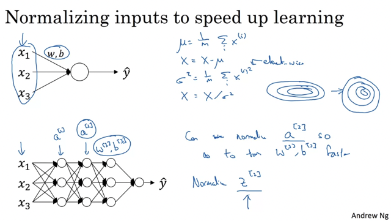</kbd>

    > Đại khái là cũng như normalization đ.v X giúp ích cho việc training
> thì normalize các hidden unit output cũng vậy.

     

    
    
<kbd>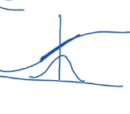</kbd>

    
<kbd></kbd>

    
<kbd>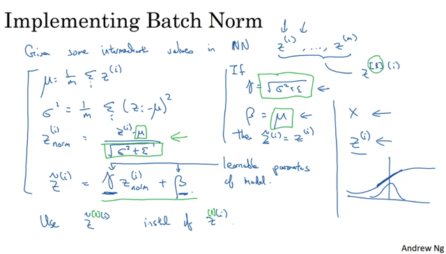</kbd>

    > Ở đây nó cũng normalize Theo kiểu tương tự 
> feature scaling (-mu) + mean normalization (/sigma)
>
> Nhưng có cái là 'không muốn cho mean = 0 để tận dụng khả
> năng của hàm sigmoid gì gì đó nên thay vì dùng
> z_norm, dùng z~ (Đọc là z tilde) = Gamma*z_norm + beta và Train
> Gamma và Beta như W, b.
>
> Chưa hiểu thì từ từ sẽ hiểu

    > Đại khái là nếu data chỉ loanh quanh quanh
> mốc z = 0 thì sigmoid(z) chỉ loanh quanh mốc 0.
> 5 và đoạn này nó khá tuyến tính nên nó sẽ
> không tận dụng được khả năng phi tuyến tính
> của hàm sigmoid

     

### Fitting Batch Norm Into A Neural Network

 

- 1 Introduction to deep neural networks as a series of computations with multiple layers, each layer computing two things: Z and A.  2 Traditional process of computing Z and A without Batch Normalization.  3 Batch Normalization explained as a new layer that normalizes the Z values using Beta and Gamma parameters, computed for each layer.  4 The intuition behind using normalized values instead of un-normalized ones in computing the activations.  5 The new parameters added to the network for each layer where Batch Normalization is applied.  6 Optimization methods such as gradient descent, RMSprop, and Adam used for updating Beta and Gamma parameters.  7 Implementation of Batch Normalization in deep learning frameworks.  8 Mini-batch processing used in applying Batch Normalization during training.
  > Sure, here's a more detailed answer with indexed main ideas:
>  1 The equations for Batch Norm were previously introduced for a single hidden layer. In this context, Batch Norm takes the value Z1 and applies normalization to it using the Batch Norm parameters Beta 1 and Gamma 1 to get the normalized value Z tilde 1. This normalized value is then fed into the activation function to get A1.
>  2 In the case of a deep neural network, each unit can be viewed as performing a two-step computation, where Z is computed first and then fed into the activation function to get A. This process is repeated for each layer of the network.
>  3 When applying Batch Norm to a deep network, the normalized value Z tilde is used instead of the un-normalized value Z. For example, in the first layer, Z tilde 1 is computed and fed into the activation function to get A1. In the second layer, Z tilde 2 is computed using Z2 and Batch Norm parameters Beta 2 and Gamma 2.
>  4 The parameters of the network now include not only the usual W and B parameters for each layer, but also additional parameters Beta and Gamma for each layer where Batch Norm is applied.
>  5 The optimization method used to train the network can be any method of choice, such as gradient descent or Adam. The Batch Norm parameters can be updated using the chosen optimization method.
>  6 Batch Norm is typically applied using mini-batches of the training set. For each mini-batch, Z and A are computed for each layer using the parameters specific to that mini-batch. Mean and variance are computed for Z in that mini-batch, and Batch Norm is applied to the normalized Z value using the parameters Beta and Gamma for that layer. This process is repeated for each mini-batch in order to perform one step of gradient descent.
>  7 In most deep learning frameworks, Batch Norm is implemented as a built-in function that can be called with a single line of code. However, understanding how Batch Norm works can provide a better understanding of the training process and help with debugging.

   

    
    
<kbd>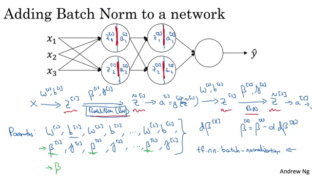</kbd>

    > Thêm bước tính từ z -> z ~ (z tilde) nữa
>
> Và training thêm d_beta và d_gamma nữa
> (update beta, gamma như W, b bằng G.D vậy
>
> Nếu dùng Framework như TensorFlow thì không
> cần làm chỉ cần khai báo nó tự làm. Nói chung là
> chỉ cần hiểu nó làm gì là được.

     

    
    
<kbd>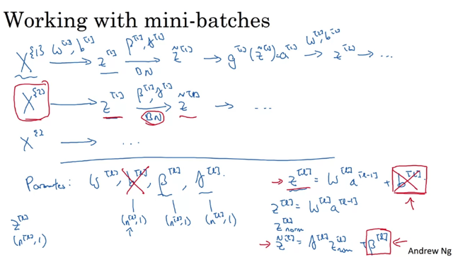</kbd>

    > 1. Thường là làm việc với Mini-batch, thì nó sẽ như vầy, như vầy..
> Các step normalize (Batch norm) sẽ chỉ đ.v từng mini. batch 
>
> 2. Với Batch-norm thì param b trở nên vô nghĩa, nên có thể bỏ.
>
> 3.Beta[l] Gamma[l] sẽ cùng size / shape (n[l], 1) với b[l]

     

    
    
<kbd>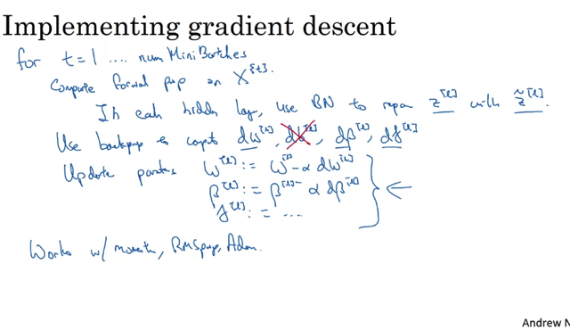</kbd>

    > Put them together

     

### Why Does Batch Norm Work

 

- 1 Batch normalization speeds up learning by normalizing all input features to take on a similar range of values.  2 Batch normalization makes weights deeper in a network more robust to changes to weights in earlier layers by addressing the problem of covariate shift.  3 Covariate shift occurs when the distribution of X changes, and it becomes necessary to retrain a learning algorithm even if the ground truth function mapping from X to Y remains unchanged.  4 From the perspective of a certain layer in a deep network, it gets some values from the earlier layers and has to map them to Y-hat, but these values change as the parameters in earlier layers change, causing the problem of covariate shift.  5 Batch normalization reduces the amount that the distribution of hidden unit values shifts around, ensuring that their mean and variance remain the same, making the network more robust to the problem of covariate shift.
  > 1 One reason why batch normalization works is that it normalizes the input features (X) to have a similar range of values, which can speed up learning. Instead of having some features that range from zero to one and others from one to a thousand, normalizing all features to have mean zero and variance one can make learning faster.
>  2 Batch normalization also makes weights deeper in the network more robust to changes in earlier layers. This is because of the problem of covariate shift, which occurs when the distribution of input data changes. If a network is trained on black cats and then tested on colored cats, for example, the network might not perform well. Even if the ground truth function mapping from inputs to outputs remains the same, the network might need to be retrained. Batch normalization helps reduce the amount that the distribution of hidden unit values shifts around, ensuring that the mean and variance remain the same. This makes the network more robust to changes in the input distribution.
>  3 Batch normalization works by normalizing the values in each batch, meaning that each batch has its own mean and variance. This reduces the effects of batch-to-batch variation in the network's performance. By normalizing the values, batch normalization also makes it easier for the network to learn the weights, which can improve generalization.
>  4 Batch normalization also introduces two additional parameters per activation unit, gamma and beta. These parameters can be used to shift and scale the normalized values, giving the network more flexibility to learn a wider range of functions. By controlling the means and variances of the activations, gamma and beta can help the network learn more quickly and generalize better.
>  5 There are some potential drawbacks to batch normalization, including increased computational cost and the possibility of overfitting if not used carefully. However, overall, batch normalization is a powerful technique for improving the performance and generalization of neural networks, and it is widely used in practice.

   

    
    
<kbd>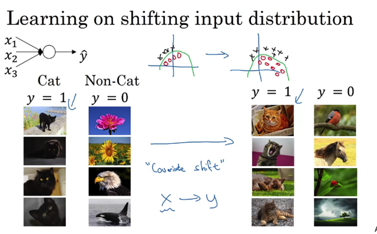</kbd>

    > **Covariate shift.**And the idea is that, if you've learned some X to Y mapping, 
> if the distribution of X changes, then you might need to retrain 
> your learning algorithm.

     

    
    
<kbd>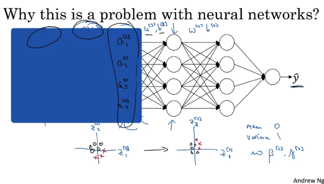</kbd>

    
<kbd></kbd>

    
<kbd>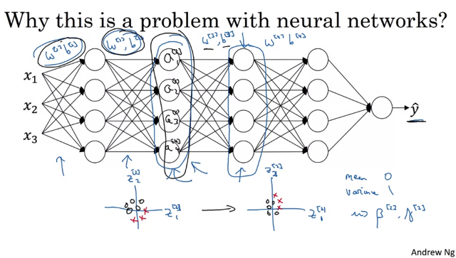</kbd>

    > "So from the perspective of the third hidden layer, these hidden unit
> values are changing all the time, and so it's suffering from  the problem
> of covariate shift" 
> Đại khái là params được update liên tục dẫn đến cái **"DISTRIBUTION
> CỦA INPUT CỦA HIDDEN LAYER"** thay đổi liên tục nên gây khó khăn
> cho quá trình training. -> Batch Norm giúp fix vấn đề này

     

    
    
<kbd>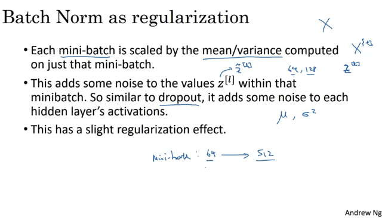</kbd>

     

    
    
<kbd>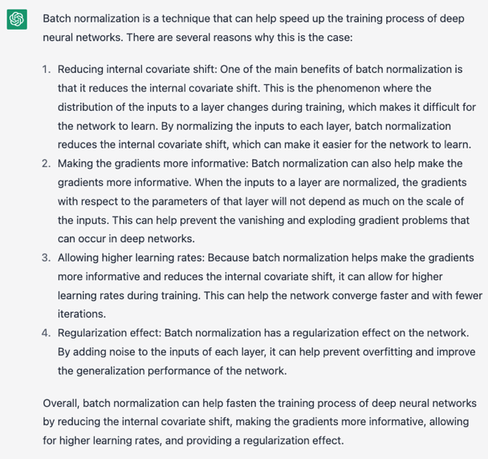</kbd>

    > **Covariate shift:**This is the phenomenon where the
> **distribution of the inputs to a layer changes during training**,
> which makes it difficult for the network to learn. By normalizing the
> inputs to each layer, batch normalization reduces the internal
> covariate shift, which can make it easier for the network to learn.

     

### Batch Norm At Test Time

 

- 1 Batch normalization processes data in mini batches during training.  2 During training, mean and variance are computed on the entire mini batch.  3 During test time, processing a single example at a time, you need to estimate mean and variance from training data.  4 Exponentially weighted averages are used to estimate mean and variance from training data.  5 At test time, use the estimated mean and variance to scale the test example.  6 Deep learning frameworks usually have default ways to estimate mean and variance.  7 Using batch normalization can help train deeper networks and improve learning algorithm efficiency.
  > Sure, here's a more detailed summary of the video:
>  1 Batch normalization at test time:
>  1 During training, batch normalization is done one mini-batch at a time. The mean and variance are computed on each mini-batch, and used to normalize the data.
>  2 At test time, you may not have a mini-batch of data to process, so you need to come up with a separate estimate of the mean and variance.
>  3 In typical implementations, an exponentially weighted moving average is used to estimate the mean and variance across mini-batches during training. This running average is then used at test time to normalize the data.
>  2 The benefits of using deep learning frameworks:
>  1 Deep learning frameworks provide high-level APIs that make it easier to write and train deep neural networks.
>  2 They often provide pre-trained models that you can use out-of-the-box or fine-tune for your specific use case.
>  3 They can handle low-level details like GPU optimization, distributed training, and automatic differentiation, which would be difficult and time-consuming to implement from scratch.
>  3 How to choose a deep learning framework:
>  1 Look for a framework that has good documentation and an active community.
>  2 Consider the programming language you're comfortable with, as many frameworks support multiple languages.
>  3 Look for a framework that has the features you need for your specific use case, such as support for specific types of layers or optimization algorithms.
>  4 Common deep learning frameworks:
>  1 TensorFlow: A popular framework developed by Google that is known for its scalability and support for distributed training.
>  2 PyTorch: Another popular framework that is known for its ease of use and flexibility. It is often preferred by researchers and academics.
>  3 Keras: A high-level API that can run on top of TensorFlow or other backends. It is known for its simplicity and ease of use.
>  4 Caffe: A framework developed by Berkeley that is known for its speed and efficiency on image-based tasks.

   

    
    
<kbd>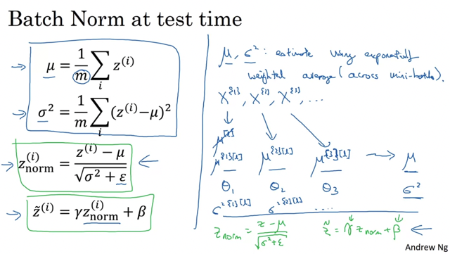</kbd>

    > But that test time, you might need to process a single example at
> a time. So, the way to do that is to estimate mu and sigma
> squared from your training set and there are many ways to do
> that. You could **in theory run your whole training set through
> your final  network to get mu and sigma squared**. But in
> practice, what people  usually do is implement and exponentially
> weighted average where  you **just keep track of the mu and
> sigma squared values you're  seeing during training** and use
> and exponentially the weighted  average, also sometimes called
> the running average, to just get a  rough estimate of mu and
> sigma squared and then you use those  values of mu and sigma
> squared that test time to do the scale and  you need the head
> and unit values Z

     

## Multiclass Classification

 

### Clarification About Upcoming Softmax

 

- ...
   

    
    
<kbd>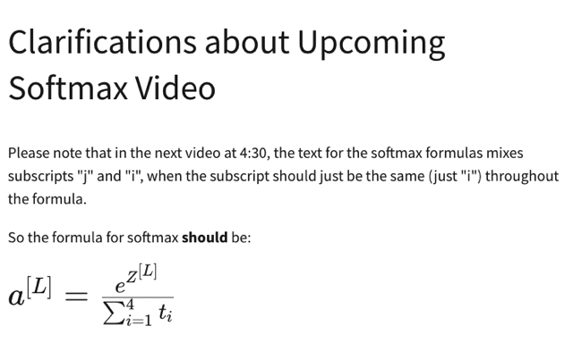</kbd>

     

### Softmax Regression

 

- 1 \\*Binary\\* \\*classification\\* involves two possible labels, \\*0\\* or \\*1\\*.  2 \\*Softmax\\* \\*regression\\* is a \\*generalization\\* of \\*logistic regression\\* used for recognizing \\*multiple classes\\*.  3 Softmax regression uses a \\*Softmax\\* \\*layer\\* to generate the \\*probabilities\\* for \\*each of the classes\\*.  4 The number of \\*units\\* in the \\*Softmax\\* layer is \\*equal to the number of classes\\*.  5 The \\*Softmax\\* \\*activation\\* \\*function\\* computes a temporary variable, t, which is e to the power of the output of the final layer.  6 The output of the Softmax activation function, aL, is the vector t normalized to sum to 1.  7 The i-th element of the output vector aL represents the p\\*robability of the input belonging to the i-th class\\*.  8 The \\*probabilities\\* generated by the Softmax layer should \\*sum to 1.\\*
  > 1 Softmax regression is a generalization of logistic regression for multiple classes. Instead of just recognizing two classes, Softmax regression allows you to recognize one of C possible classes, where C is the number of classes you're trying to categorize your inputs into.
>  2 To use Softmax regression, you need to build a new neural network where the upper layer has C units. The goal is for each unit to output the probability of its corresponding class, given the input x.
>  3 The output labels y hat in Softmax regression are a C by 1 dimensional vector, where each element represents the probability of its corresponding class.
>  4 Because probabilities should sum to one, the elements in y hat should also sum to one.
>  5 The standard model for Softmax regression uses a Softmax layer in the output layer to generate these probabilities. The Softmax activation function is used to compute the output of the final layer.
>  6 The Softmax activation function takes the linear part of the layer (zL) and computes a temporary variable (t), which is e to the zL (element-wise). Then, the output aL is computed by normalizing t to sum to one. This ensures that the elements in aL represent probabilities that sum to one.
>  7 In the Softmax layer, the output aL is a C by 1 dimensional vector, where each element represents the probability of its corresponding class. The i-th element of aL is computed as ti divided by the sum of all the ti's, where ti is the i-th element of the vector t.
>  8 An example is given to illustrate how the Softmax activation function works. In the example, zL is a four-dimensional vector: 5, 2, -1, 3. Using the Softmax activation function, we compute t, which is e to the 5, e to the 2, e to the -1, e to the 3. We then normalize t to sum to one, which gives us the output aL, where each element represents the probability of its corresponding class.

   

    
    
<kbd>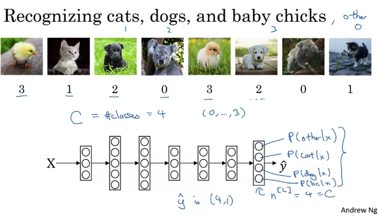</kbd>

     

    
    
<kbd>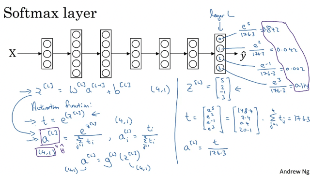</kbd>

     

    
    
<kbd>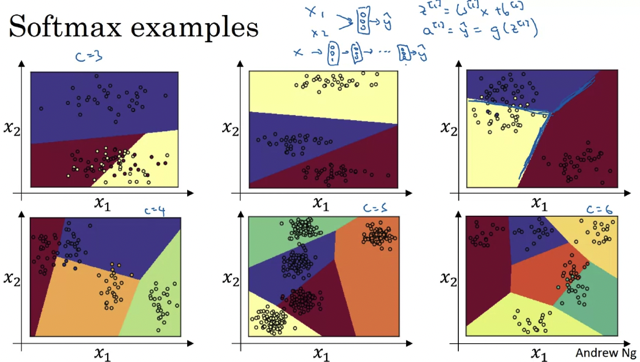</kbd>

     

  
  - 1 Softmax regression is a generalization of logistic regression for multiple classes. Instead of just recognizing two classes, Softmax regression allows you to recognize \\*one of C possible classes,\\* where C is the number of classes you're trying to categorize your inputs into.  2 To use Softmax regression, you need to build a new neural network where the upper layer has C units. The goal is for each unit to output the probability of its corresponding class, given the input x.  3 The output labels y hat in Softmax regression are a C by 1 dimensional vector, where each element represents the \\*probability of its corresponding class.\\*  4 Because \\*probabilities should sum to one\\*, the \\*elements in y hat should also sum to one.\\*  5 The standard model for Softmax regression uses a \\*Softmax layer\\* in the output layer to generate these probabilities. The Softmax activation function is used to compute the output of the final layer.  6 The \\*Softmax\\* activation function takes the\\* linear part\\* of the layer (\\*zL\\*) and computes a temporary variable (t), which is e to the zL (element-wise). Then, the output aL is computed by normalizing t to sum to one. This ensures that the elements in aL \\*represent probabilities that sum to one.\\*  7 In the Softmax layer, the output aL is a C by 1 dimensional vector, where each element represents the probability of its corresponding class. The i-th element of aL is computed as ti divided by the sum of all the ti's, where ti is the i-th element of the vector t.  8 An example is given to illustrate how the Softmax activation function works. In the example, zL is a four-dimensional vector: 5, 2, -1, 3. Using the Softmax activation function, we compute t, which is e to the 5, e to the 2, e to the -1, e to the 3. We then normalize t to sum to one, which gives us the output aL, where each element represents the probability of its corresponding class.
     

### Training A Softmax Classifier

 

- 1 Softmax activation function was introduced in the previous video and in this video, we will deepen our understanding of softmax classification and learn about the training model that uses a softmax layer.  2 Softmax classification generalizes the logistic activation function to C classes and if C=2, then softmax with C=2 essentially reduces to logistic regression.  3 The loss function used in softmax classification is the negative sum of j=1 through C of yj log yhat j, where yj is the true label and yhat j is the predicted probability of the class j.  4 The loss function tries to make the corresponding probability of the true class as high as possible, which is a form of \\*maximum likelihood estimation.\\*  5 To reduce the loss on the training set, the neural network adjusts the predicted probability of the true class.
  > 1 Softmax activation function: In the previous video, you learned about the softmax activation function, which is used in the output layer of neural networks to classify data into multiple classes. It takes in a vector of inputs and outputs a vector of probabilities that sum up to 1.
>  2 Softmax classification: In this video, you deepen your understanding of softmax classification, which is a way to classify data using the softmax activation function. Softmax regression or the softmax identification function generalizes the logistic activation function to C classes rather than just two classes.
>  3 Softmax vs. hard max: The name softmax comes from contrasting it to what's called a hard max which would have taken the vector Z and matched it to a vector of zeros and ones. A hard max function will look at the elements of Z and just put a 1 in the position of the biggest element of Z and then 0s everywhere else. In contrast, a softmax is a more gentle mapping from Z to probabilities.
>  4 Training a neural network with softmax output layer: To train a neural network with a softmax output layer, you need to define a loss function that measures the difference between the predicted probabilities and the ground truth labels. The loss function used in softmax classification is the negative sum of the products of the ground truth labels and the logarithm of the predicted probabilities.
>  5 Loss function example: Let's take an example of an image of a cat that falls into Class 1, and the ground truth label is 0 1 0 0. Let's say that the neural network is currently outputting a vector of probabilities of 0.1, 0.4, 0.2, and 0.3. The loss function for this example would be -log(0.4), which is the negative logarithm of the predicted probability of Class 2, the ground truth class.
>  6 Maximizing probability of ground truth class: To minimize the loss function, the neural network needs to maximize the probability of the ground truth class. This is achieved by adjusting the weights and biases in the network using backpropagation and gradient descent. If the learning algorithm is trying to make the loss function small, then the only way to do that is to make the probability of the ground truth class as high as possible.

   

    
    
<kbd>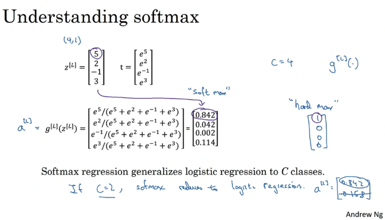</kbd>

     

    
    
<kbd>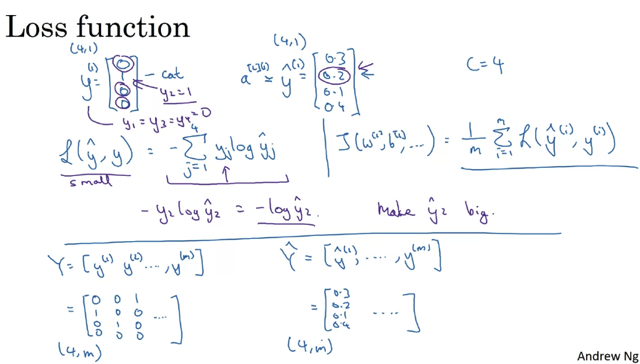</kbd>

    > Hiểu đại khái Machine nó sẽ muốn làm gì:
> Muốn min L thì phải min Sum y_iLog(y^_i), mà y_1, y_3, y_4 = 0 
> -> Phải min y_2log(y^_2) mà y_2 = 1 
> -> Phải min log(y^_2)
> -> Phải max y^_2
>
> Softmax thật ra là mở rộng khái quát hoá của Logistic Regression

     

    
    
<kbd>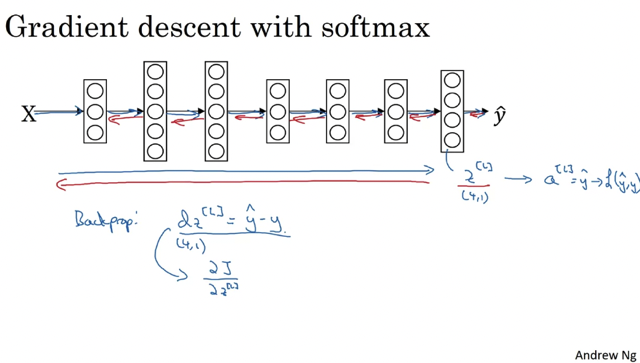</kbd>

    > Programming assignment này sẽ bắt đầu dùng Framework 
> (TensorFlow) nên chỉ cần ForProp, BackProp nó sẽ làm giùm
> mình nhưng đại khái cũng giống cách tính BackProp bữa trước
> làm thôi, chỉ có cái là h y nó có C hàng chứ 1 ko phải 1 hàng

     

## Introduction To Programming Frameworks

 

### Deep Learning Frameworks

 

- 1 Deep learning algorithms can be implemented from scratch using Python and NumPY, but more complex models may require the use of deep learning software frameworks.  2 Implementing everything yourself from scratch becomes increasingly impractical as models get larger and more complex.  3 There are now many good deep learning software frameworks available to help implement complex models, such as convolutional neural networks and recurring neural networks.  4 Choosing a framework depends on several factors, including ease of programming, running speeds, and whether or not the framework is truly open.  5 Some popular deep learning frameworks include TensorFlow, PyTorch, Keras, and Caffe.  6 Each of these frameworks has a dedicated user and developer community, and each is a credible choice for some subset of applications.  7 The criteria recommended for choosing a framework include ease of programming, running speeds, and whether or not the framework is truly open.  8 Truly open frameworks are those that are not only open source but also have good governance and are not under the control of a single company.  9 Multiple frameworks could be a good choice depending on the user's preferences and the application they are working on.  10 Using a deep learning software framework can make development of machine learning applications more efficient by providing a higher level of abstraction than just a numerical linear algebra library.
   

    
    
<kbd>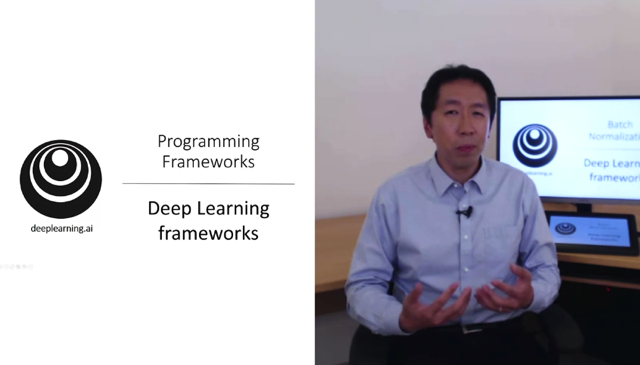</kbd>

    > Đại khái là khi làm các bài toán lớn thì sử dụng các lib sẽ giúp 
> ta tiện hơn

     

    
    
<kbd>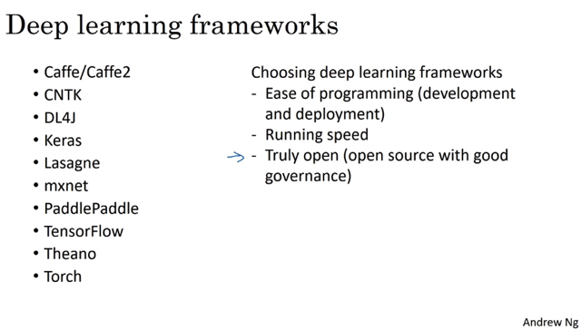</kbd>

    > Các Framework này improve liên tục và đây là 1 số tiêu chí để chọn F.W

     

### Tensorflow

 

  
  
<kbd>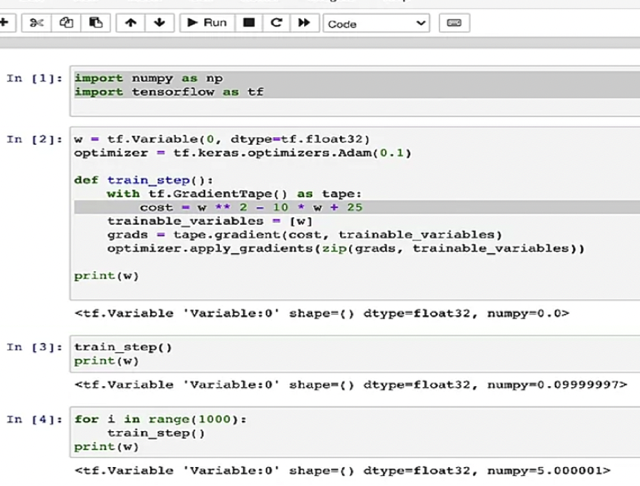</kbd>

   

  
  
<kbd>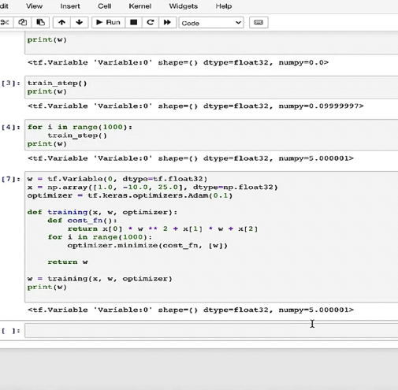</kbd>

   

  
  
<kbd>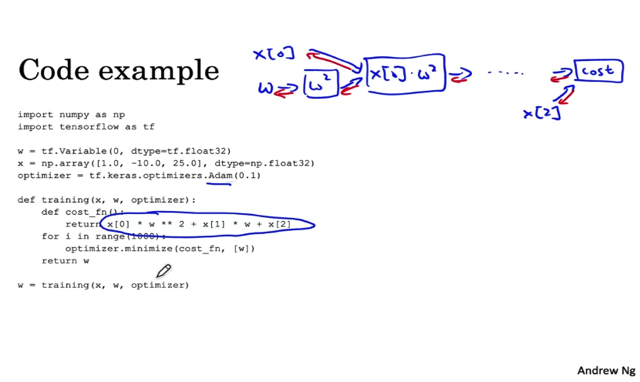</kbd>

  > Đại khái là T.S nó sẽ tự tính BackProp

   

### Learn About Gradient Tape And More

 

  
  
<kbd></kbd>

   

## Quiz

 

<kbd></kbd>

 

<kbd>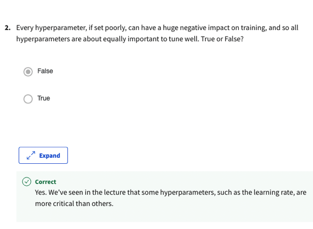</kbd>

> [!NOTE]
> Không 'equally' vì rõ ràng Alpha quan trọng hơn Epsilon nhiều

 

<kbd>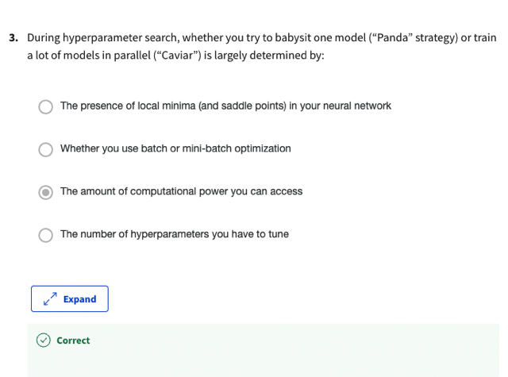</kbd>

> [!NOTE]
> Này quá rõ, nếu máy mạnh thì chạy nhiều cái cùng lúc

 

<kbd>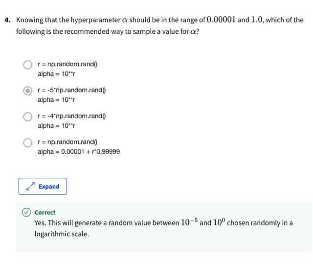</kbd>

 

<kbd>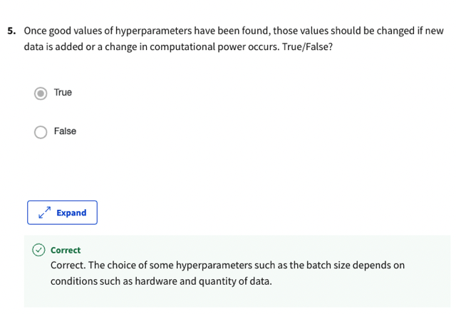</kbd>

 

<kbd>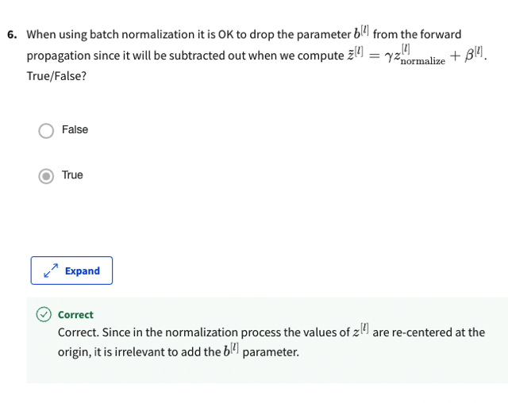</kbd>

 

<kbd>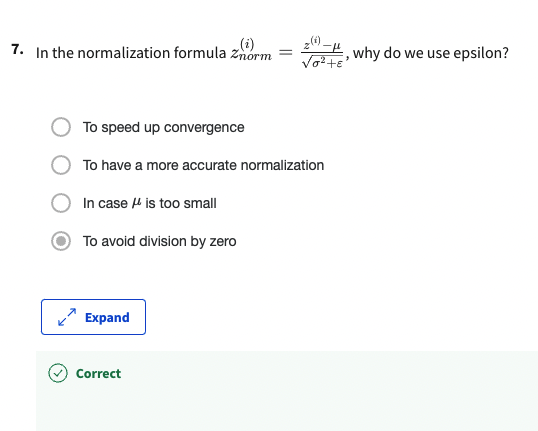</kbd>

 

<kbd>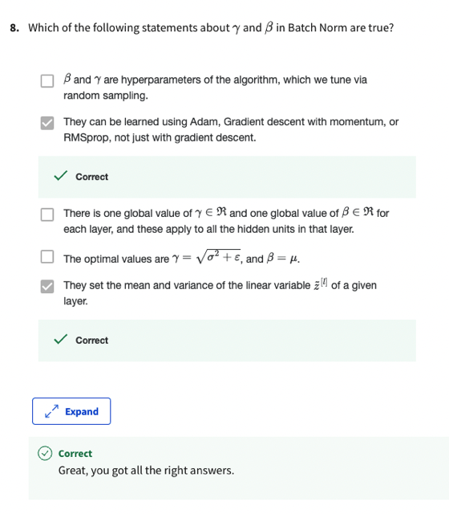</kbd>

> [!NOTE]
> Beta gammar được train như Web bằng G.D ...nên câu
> đầu sai, câu 2 đúng.
>
> Beta[l], gammae[l] cũng như, b[l] là. vector mỗi unit 1 cái
> nên không phải là 1 R cho cả layer -> Câu 3 sai
>
> Câu 4 sai vì ko phải là Optimal value, mà đó là value khiến
> cho  Gamma và Beta vô nghĩa (Khiến Z~ bằng Z)
>
> Câu 5 đúng

 

<kbd>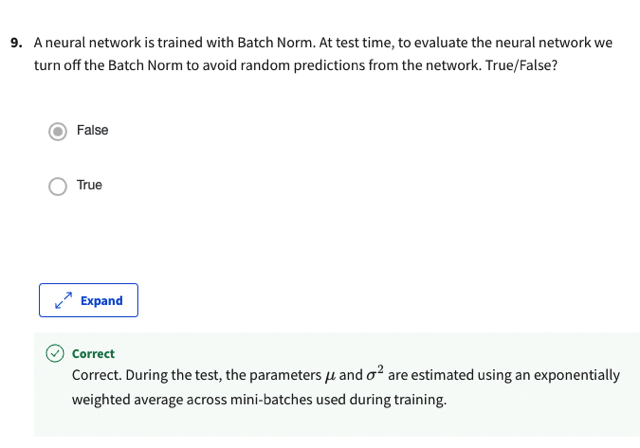</kbd>

> [!NOTE]
> Sai vì vẫn có tính Batch Norm

 

<kbd></kbd>

 

## Programming Assignment

 

### Introduction to TensorFlow

 

- .
   

    
    
<kbd>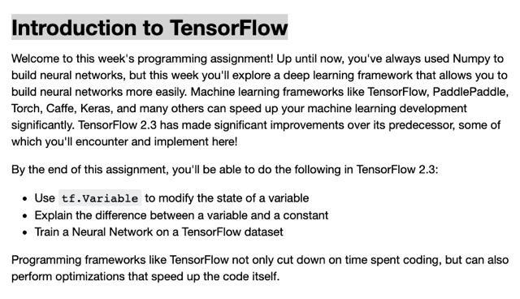</kbd>

     

    
    
<kbd>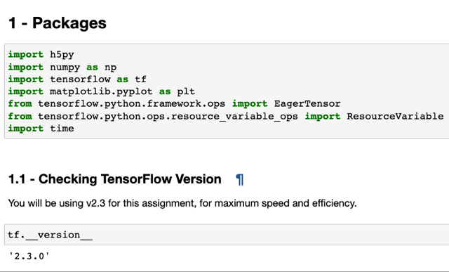</kbd>

     

- Checking TensorFlow Version
   

### 2 - Basic Optimization with GradientTape

 

### Basic Optimization with GradientTape

 

  
  
<kbd>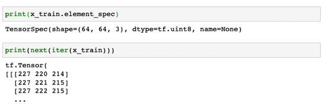</kbd>

  
<kbd></kbd>

  
<kbd>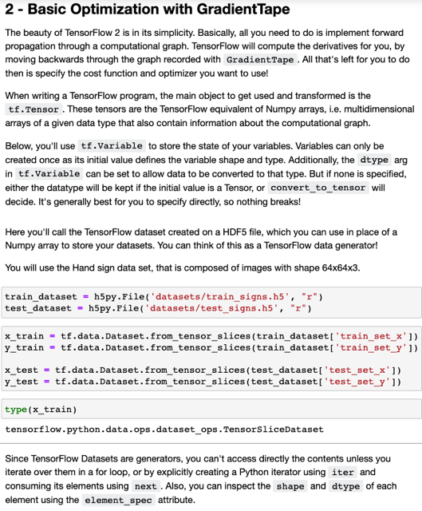</kbd>

   

  
  
<kbd>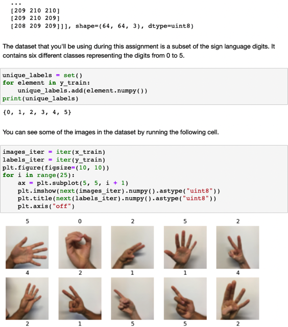</kbd>

   

  
  
<kbd>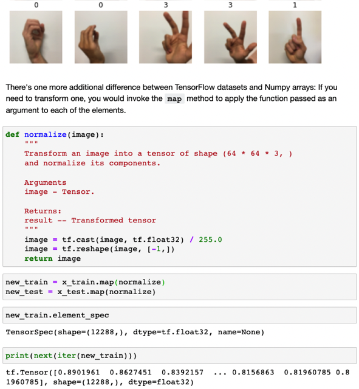</kbd>

   

### 2.1 - Linear Function

> [!NOTE]
> Làm quen với TF Khai báo
> Constant với tf.constant() .
> tf.matmul(), tf.add() Tính
> thử Y = WX + b bằng T.F

 

  
  
<kbd>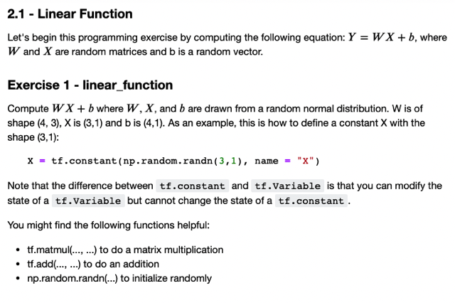</kbd>

   

- Exercise 1 - linear_function
   

    
    
<kbd>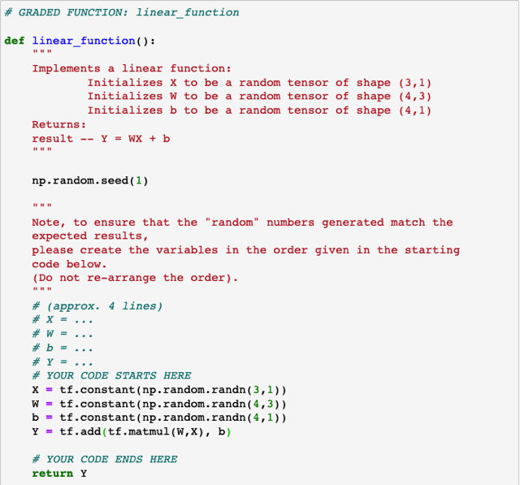</kbd>

     

    
    
<kbd>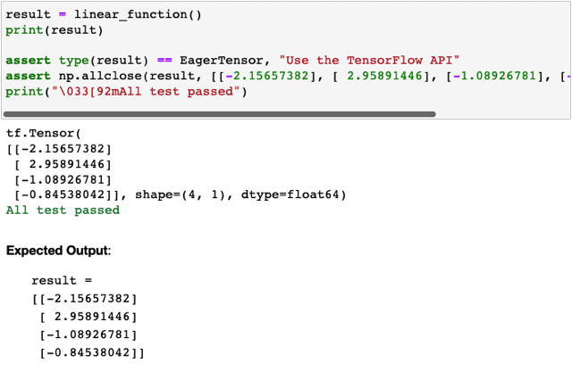</kbd>

     

### 2.2 - Computing the Sigmoid

> [!NOTE]
> Làm quen với TF
> tf.keras.activation.sigmoid()
> tf.cast(.., tf.float32)

 

  
  
<kbd>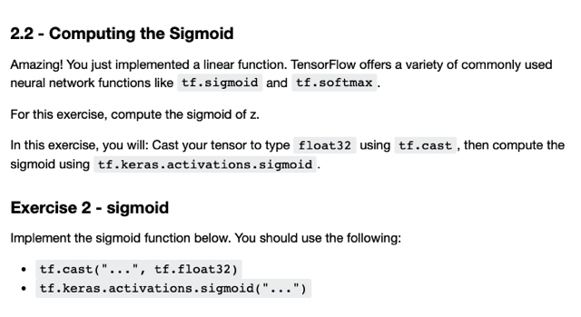</kbd>

   

- Exercise 2 - sigmoid
   

    
    
<kbd>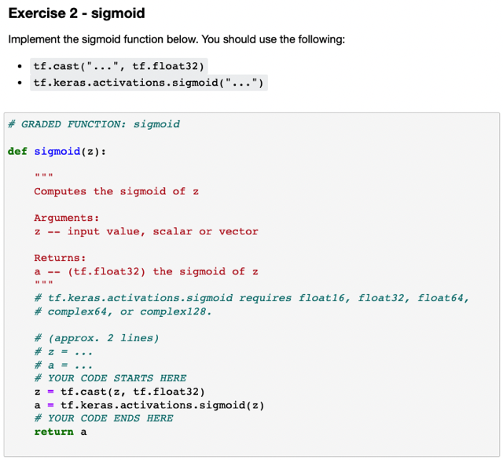</kbd>

     

    
    
<kbd>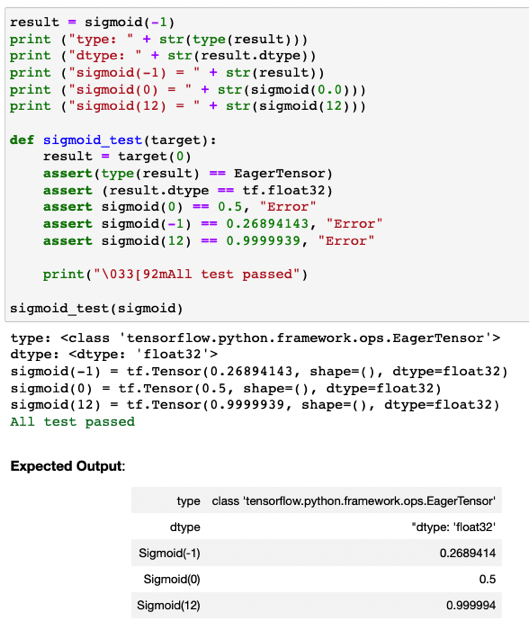</kbd>

     

### 2.3 - Using One Hot Encodings

> [!NOTE]
> One hot encoding with TF
> Dùng tf.one_hot(labels, depth)
> và tf.reshape(.., [-1, ]) để

 

  
  
<kbd>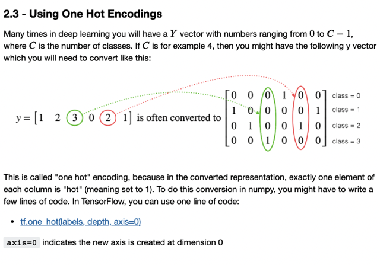</kbd>

   

- Exercise 3 - one_hot_matrix
   

    
    
<kbd>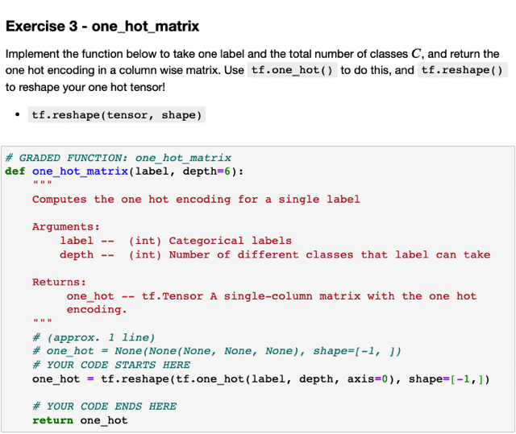</kbd>

     

    
    
<kbd>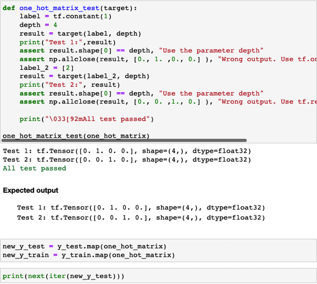</kbd>

     

    
    
<kbd>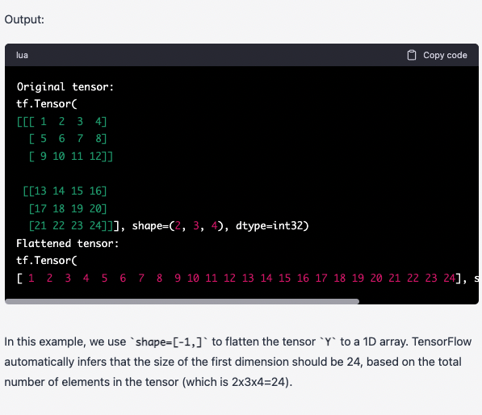</kbd>

    
<kbd></kbd>

    
<kbd>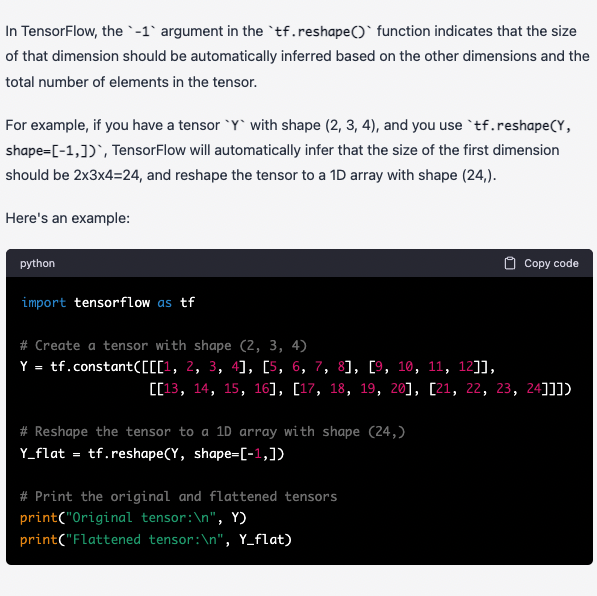</kbd>

    > Argument -1 có nghĩa là để nó tự chuyển thành 1D vector size bằng
> mấy cái kia nhân lại (dồn lại hết thành 1 row)

     

### 2.4 - Initialize the Parameters

> [!NOTE]
> Initialize bằng GlorotNormal.

 

  
  
<kbd>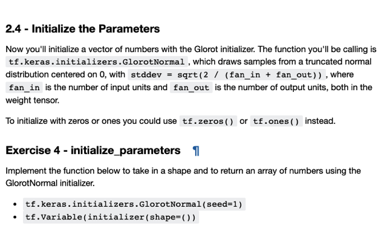</kbd>

   

- Exercise 4 - initialize_parameters
   

    
    
<kbd>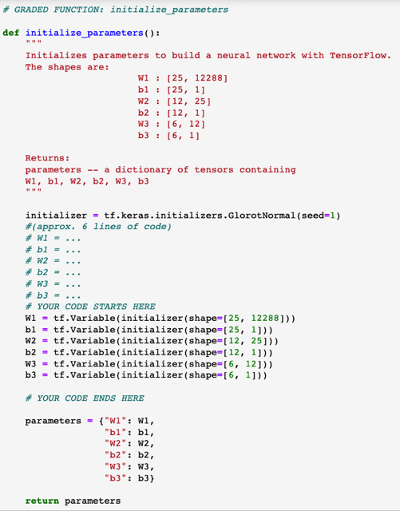</kbd>

     

    
    
<kbd>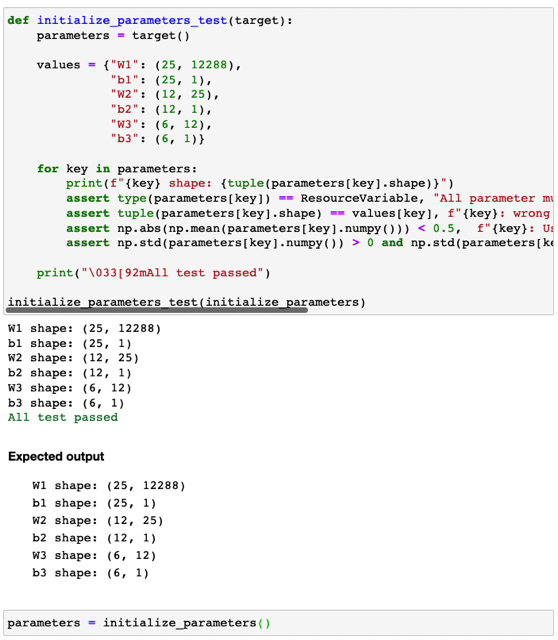</kbd>

     

### 3 - Building Your First Neural Network in TensorFlow

 

### 3.2 Compute the Total Loss

> [!NOTE]
> Viết hàm tính loss function dùng TF's 
> categorical_crossentropy(logits, labels)
>
> Cứ tưởng kẹt ở Excersie này, người ta đã gợi ý là phải đảm
> bảo argument's shape đúng mà. Có điều không có nói vụ 
> **from_logits** khiến mò mãi mới đúng
>
> 1. Chú ý thứ tự argument, **(labels, logits)**
>
> 2. Vì yêu cầu shape = (no. examples - m, no. features - n) nên
> phải **transpose**. Với TF, dùng **tf.transpose()**
> 3.Phải thêm**from_logits = True**mới đúng

> [!NOTE]
> **from_logits = True** có nghĩa là Y^ (output của last layer
> trong n.n) vẫn ở dạng 'raw output', không phải dạng '
> Probability'.
>
> Layer cuối cùng nó để Linear (tức là tính tính Z3 = Z[L] =
> W[L]. A[L-1] + b[L] và không tính A[L] hay nói cách khác g[L] =
> L (không áp dụng hàm rêu hay sigmoid gì cả)  Để rồi mới bỏ
> Z[L] đó vào Softmax để tính ra Probability
>
> Thì đây cũng vậy, cái mà mình bỏ vào cùng với y là Z, là **raw
> output** chứ không phải là **Probability** nên phải ghi rõ
> **from_logit = True**Nếu không ghi, hoặc để = false, hàm categorical_crossentropy
> sẽ apply **Softmax** (tính ra Probability) rồi mới tính Loss

 

  
  
<kbd>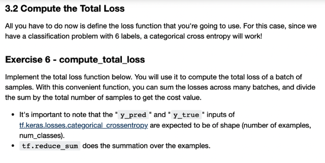</kbd>

   

- Exercise 6 - compute_total_loss
   

    
    
<kbd>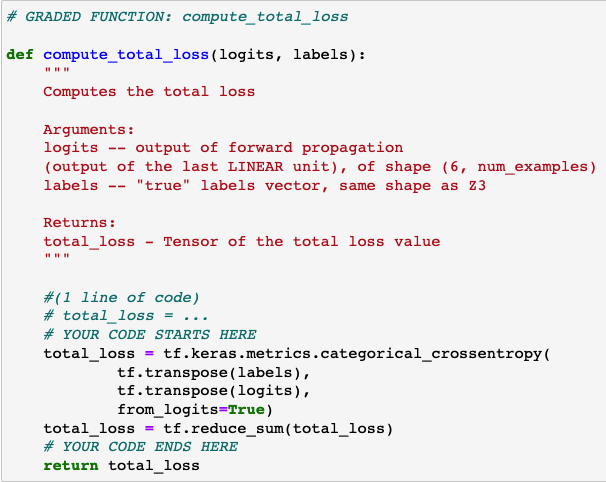</kbd>

     

    
    
<kbd>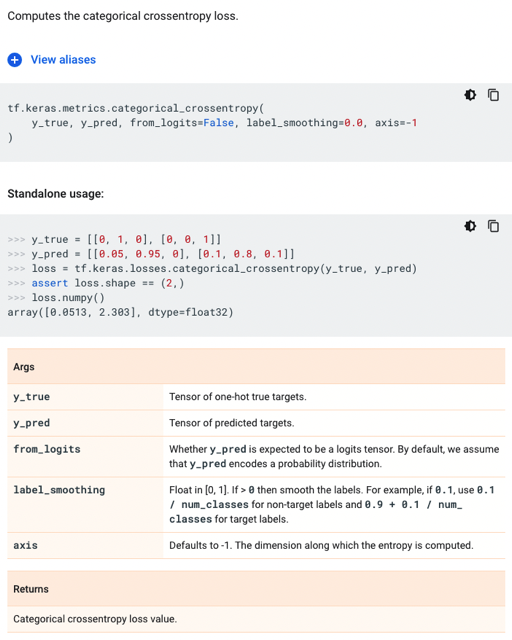</kbd>

     

    
    
<kbd>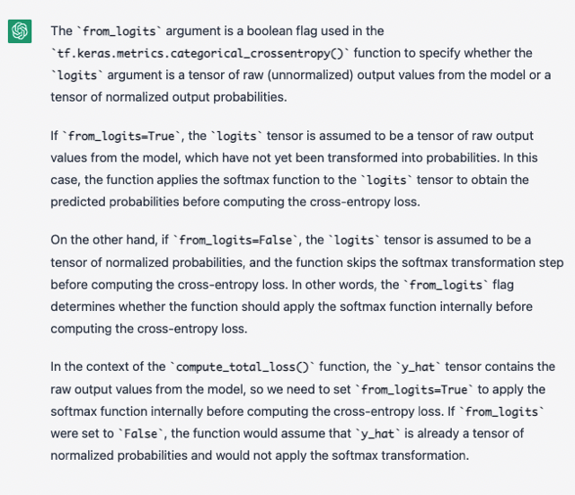</kbd>

    > **from_logits = True** có nghĩa là Y^ (output của last layer
> trong n.n) vẫn ở dạng 'raw output', không phải dạng '
> Probability'.
>
> Nhớ lại, layer cuối cùng nó để Linear (tức là tính tính Z[L] =
> W[L]. A[L-1] + b[L] và không tính A[L] hay nói cách khác g[L] =
> L (không áp dụng hàm rêu hay sigmoid gì cả)  Để rồi mới bỏ
> Z[L] đó vào Softmax để tính ra Probability
>
> Thì đây cũng vậy, cái mà mình bỏ vào cùng với y là Z, là **raw
> output** chứ không phải là **Probability** nên phải ghi rõ
> **from_logit = True**Nếu không ghi, hoặc để = false, hàm categorical_crossentropy
> sẽ apply **Softmax** (tính ra Probability) rồi mới tính Loss

     

    
    
<kbd>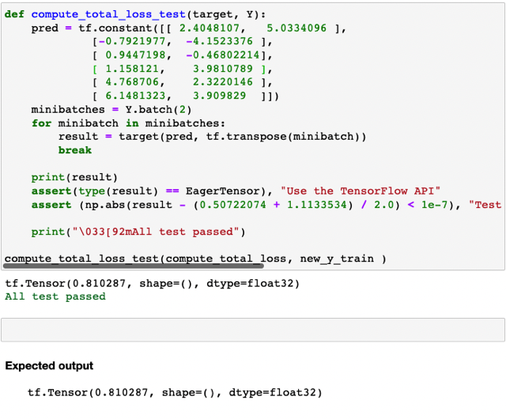</kbd>

     

### 3.1 - Implement Forward Propagation

> [!NOTE]
> Forward Prop với tf
> Thay vì dùng np.dot(), relu() thì dùng 
> tf.matmul(), tf.add() và 
> tf.keras.activations.relu()

 

  
  
<kbd>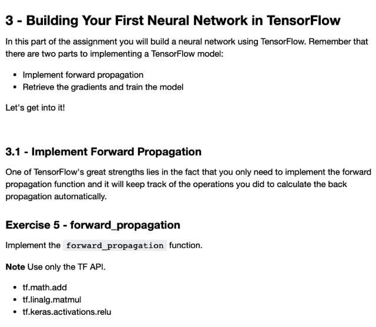</kbd>

   

- Exercise 5 - forward_propagation
   

    
    
<kbd>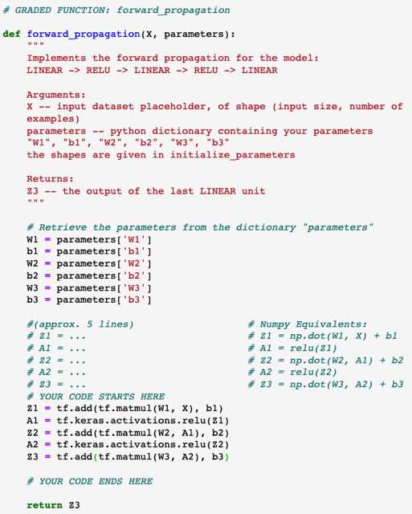</kbd>

     

    
    
<kbd>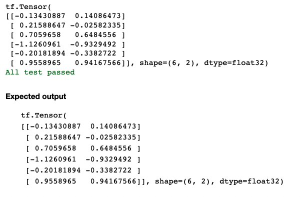</kbd>

     

### 3.3 - Train the Model

> [!NOTE]
> Build modal để train dùng TF

 

  
  
<kbd>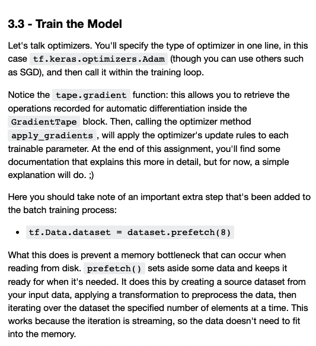</kbd>

   

  
  
<kbd>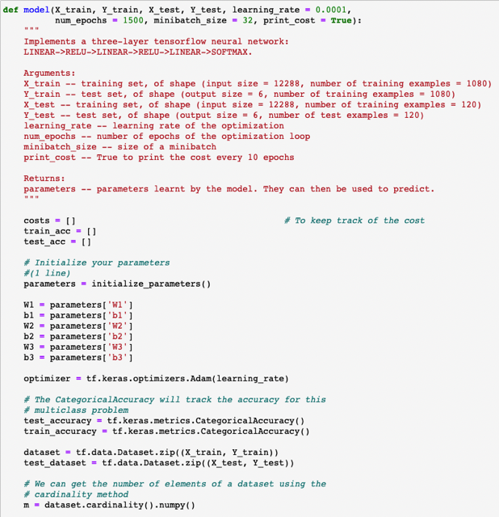</kbd>

   

  
  
<kbd>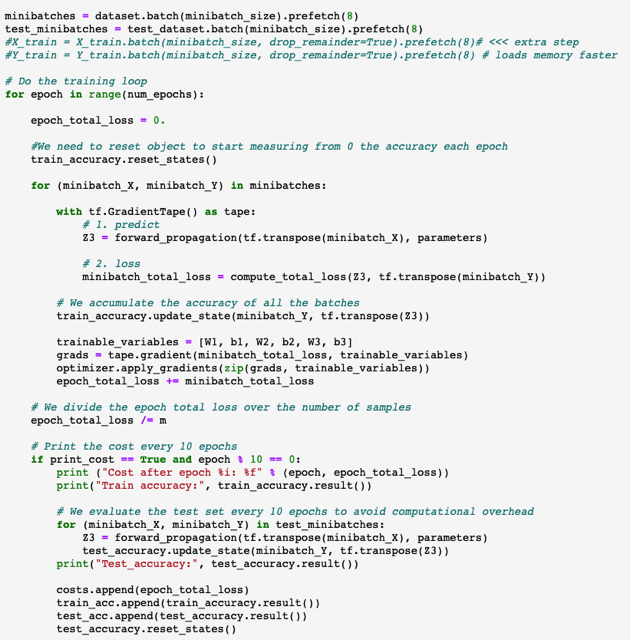</kbd>

   

  
  
<kbd>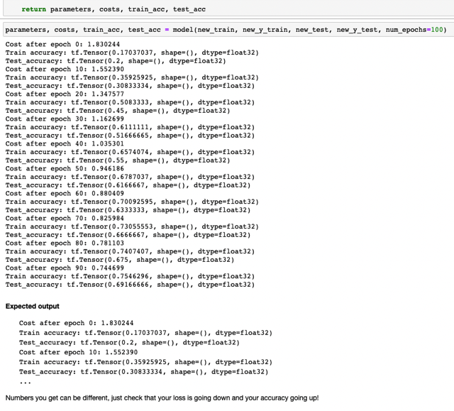</kbd>

   

  
  
<kbd>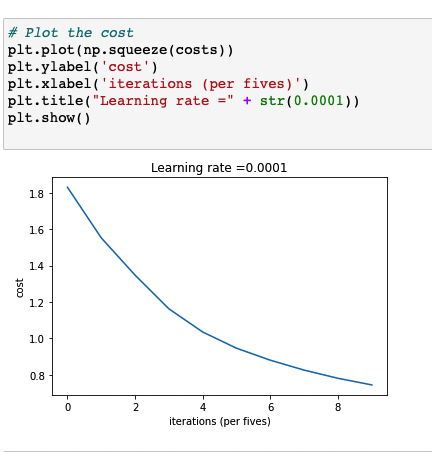</kbd>

   

  
  
<kbd>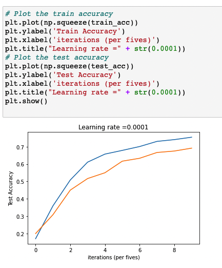</kbd>

   

- optimizer = tf.keras.optimizers. Adam(learning_rate)
  > Dùng optimizer Adam

   

- dataset = tf.data.Dataset. zip((X_train, Y_train))
  > Đại khái là nó giúp tạo 1 Dataset modal
> để dùng cho  training bằng TF

   

    
    
<kbd>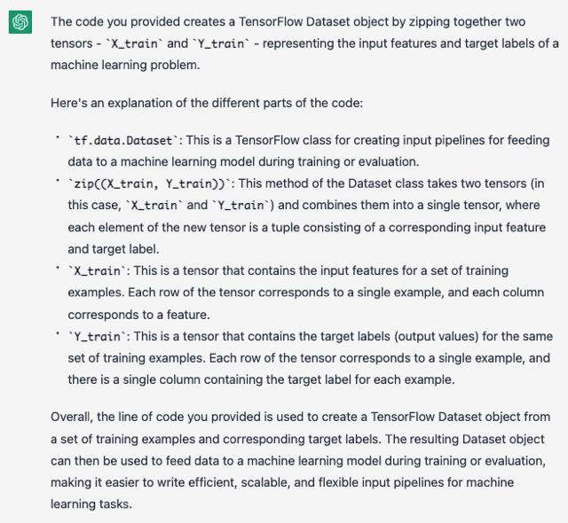</kbd>

     

- grads = tape. gradient(minibatch_total_loss, trainable_variables)
  > Notice the tape.gradient function: this allows you to
> retrieve the operations recorded for **automatic
> differentiation** inside the GradientTape block.
>
> Đây chính là bước T.F giúp mình tính Gradient dW1, db1, dW2, db2..

   

    
    
<kbd>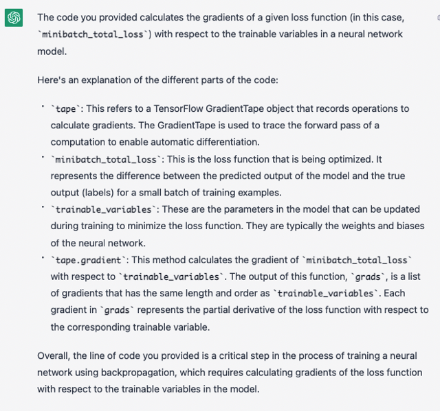</kbd>

     

- optimizer. apply_gradients(zip(grads, trainable_variables))
  > Then, calling the optimizer method
> **apply_gradients**, will apply the optimizer's
> update rules to each trainable parameter.
>
> Đây chính là bước mà T.F nó update W1, b1,
> W2, b2... với dW1, db1, dW2, db2...
>
> Và với optimizer là Adam thì nó sẽ update theo 
> kiểu Adam: Momentum + RMSProp

   

    
    
<kbd>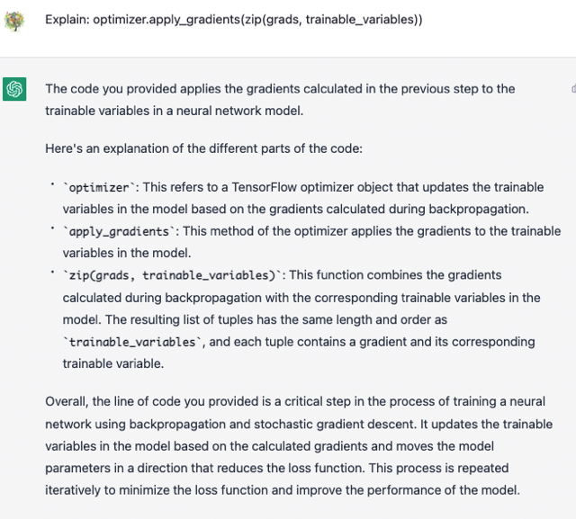</kbd>

     

- minibatches = dataset. batch(minibatch_size).prefetch(8)
  > Đại khái là bước này giúp chuẩn bị mini-batch 
> - **Chia data thành từng Mini-batch**, và **load trước 
> 8 cái (prefetch(8))** để khi chạy cái này thì luôn có 
> sẵn 8 cái giúp nhanh hơn

   

    
    
<kbd>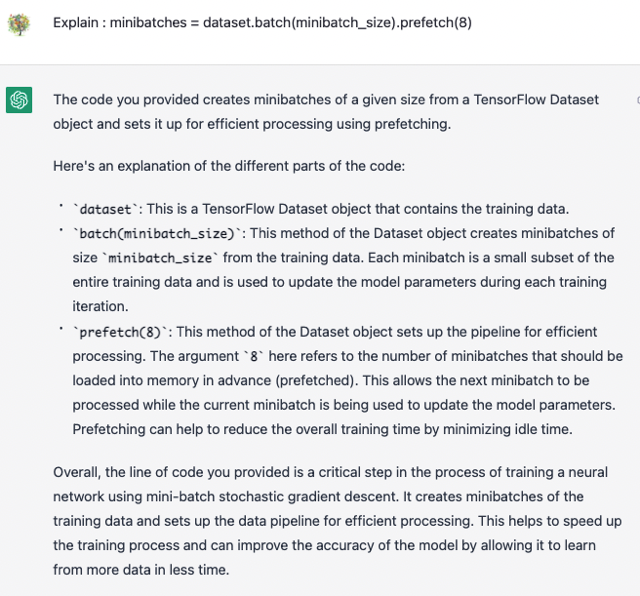</kbd>

     

- #We need to reset object to start measuring from 0 the accuracy each epoch train_accuracy.reset_states()  # We accumulate the accuracy of all the batches train_accuracy.update_state(minibatch_Y, tf.transpose(Z3))
  > CategoricalAccuracy của TF này giúp tính độ ' accuracy'
> của Z3 và Y. Mỗi iteration/epoch reset lại để train xong thì
> update

   

    
    
<kbd>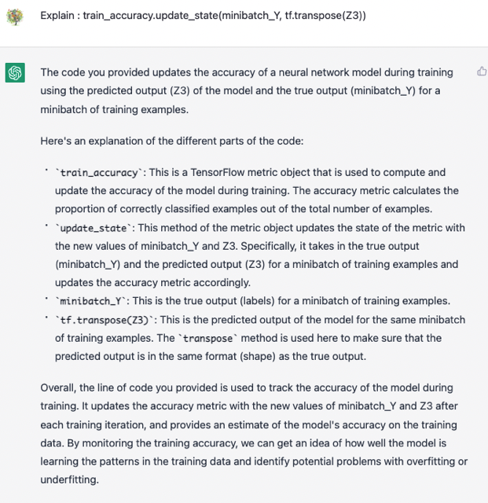</kbd>

     

- costs.append(epoch_total_loss)             train_acc.append(train_accuracy.result())             test_acc.append(test_accuracy.result())
  > Sau mỗi lần train-update params (mỗi
> iteration). cứ 100 lần thì ghi lại cót,
> accuracy để tí nữa plot ra

   

### 4 - Bibliography

 

## References

> [!NOTE]
> In this assignment, you were introducted to tf.GradientTape, which records operations for differentation. Here are a couple of resources for diving deeper into what it does and why:
> Introduction to Gradients and Automatic Differentiation: \_https://www.tensorflow.org/guide/autodiff\_
> GradientTape documentation: \_https://www.tensorflow.org/api_docs/python/tf/GradientTape\_

 

<kbd>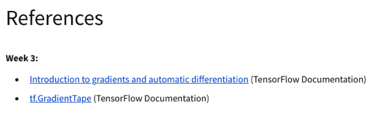</kbd>

 

