# C3w1_machine Learning Strategy 1

📊 **Progress:** `43` Notes | `48` Screenshots

---

Streamline and optimize your ML production workflow by implementing strategic guidelines for goal-setting and applying human-level performance to help define key priorities.
**Learning Objectives**
 • Explain why Machine Learning strategy is important
 • Apply satisficing and optimizing metrics to set up your goal for ML projects
 • Choose a correct train/dev/test split of your dataset
 • Define human-level performance
 • Use human-level performance to define key priorities in ML projects
 • Take the correct ML Strategic decision based on observations of performances and dataset

## Introduction To Ml Strategy

 

### Why Ml Strategy

 

- 1 The course teaches strategies for structuring a machine learning project to improve efficiency and quickly get systems working.  2 The example given is of improving a cat classification system with 90% accuracy.  3 There are many ideas to try to improve a deep learning system, but choosing the wrong approach can waste time.  4 The course teaches strategies for analyzing a machine learning problem to identify the most promising ideas to pursue.  5 The instructor will share lessons learned from building and shipping deep learning products.  6 The strategies taught in the course are unique and not commonly taught in university deep learning courses.  7 Machine learning strategy has changed with the emergence of deep learning algorithms.  8 The course aims to make learners more effective at getting deep learning systems to work.
> [!NOTE]
> Sure, here is a more detailed summary of the passage:
>  1 Introduction to the course: The passage is an introduction to a course on machine learning strategy, specifically on how to structure a machine learning project. The goal of the course is to teach students how to more quickly and efficiently get their machine learning systems working.
>  2 Motivating example: The passage starts with a motivating example of a person working on a cat image classification project. After working on the project for some time, the person has achieved 90% accuracy, but this is not good enough for the project's application. The person has many ideas on how to improve the system but needs to determine the most effective strategy to use.
>  3 Challenges with improving a deep learning system: When trying to improve a deep learning system, there are many potential ideas or strategies to try, such as collecting more data, training the algorithm longer, trying different optimization algorithms, or changing the network architecture. However, choosing poorly can result in wasted time and effort.
>  4 Importance of machine learning strategy: Given the potential risks of wasting time and effort, having effective ways to determine the most promising strategies to try is essential. This is where machine learning strategy comes in, which involves analyzing a machine learning problem to identify the most promising things to try.
>  5 Course objectives: The course aims to teach a number of strategies for analyzing a machine learning problem, as well as share lessons learned from building and shipping many deep learning products. The course materials are unique and not typically taught in universities' deep learning courses. The strategies taught in the course are tailored to the era of deep learning and can help students become more effective at getting their deep learning systems to work.

   

    
    
<kbd>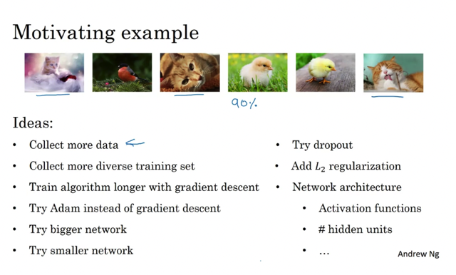</kbd>

    > [!NOTE]
    > Đâu là hướng đi khôn ngoan
    > nhất để cải thiện model

     

### Orthogonalization

 

- In machine learning, "**orthogonalization**" refers to the principle of **separating concerns** so that changes in one aspect of the system do not affect other aspects.  Specifically, it means breaking down the machine learning process into modular components, each of which has a specific responsibility, and ensuring that  **changes to one component do not have unintended consequences for other components**. This makes it easier to develop, debug, and maintain complex machine learning systems.
   

    
    
<kbd>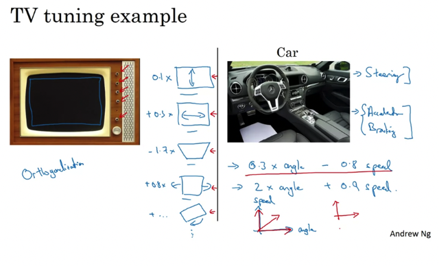</kbd>

    > [!NOTE]
    > Tách bạch mục tiêu ra để dễ kiểm soát

     

    
    
<kbd>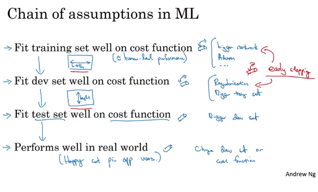</kbd>

    > [!NOTE]
    > In machine learning, "**orthogonalization**"
    > refers to **the principle of separating
    > concerns so that changes in one aspect of
    > the system do not affect other aspects**.
    >
    > Specifically, it means **breaking down the
    > machine learning process into modular
    > components**, each of which has a **specific
    > responsibility**, and ensuring that 
    >
    > **changes to one component do not have unintended
    > consequences for other components**. This
    > makes it easier to develop, debug, and
    > maintain complex machine learning systems.

     

## Settng Up Your Goal

 

### Single Number Evaluation Metric

 

- 1 Using a **single evaluation metric** can help improve progress in a machine learning project by quickly determining if the new idea is working better or worse than the last one.  2 **Precision** and **recall** are reasonable ways to evaluate the performance of classifiers in terms of recognizing images of cats.  3 Using precision and recall as evaluation metrics can present a **problem of tradeoff**, making it difficult to determine which classifier is better if one classifier does better on recall while the other does better on precision.  4 **Combining precision and recall into a single evaluation metric** can help quickly select the better classifier. The standard way to combine precision and recall is using an F1 score, which is the harmonic mean of precision and recall.  5 Having **a well-defined dev set and a single evaluation metric allows** for quicker selection of the better classifier and speeds up the iterative process of improving the machine learning algorithm.  6 In building a cat app for cat lovers in four major geographies, using a single evaluation metric is necessary to compare the performance of two classifiers that have different errors for different geographies.
> [!NOTE]
> 1 The importance of a single real number evaluation metric in machine learning:
>  • A single real number evaluation metric allows for quick evaluation of different ideas for learning algorithms or hyperparameters and helps teams to iterate more efficiently.
>  • It is recommended to set up a single real number evaluation metric for your problem when starting a machine learning project.
>  • An example of a single real number evaluation metric is the F1 score, which combines precision and recall.
>  • Having a well-defined dev set, along with a single number evaluation metric, speeds up the iterative process of improving a machine learning algorithm.
>  2 Precision and Recall:
>  • Precision is the percentage of the examples recognized by the classifier that are actually positive cases (e.g., images of cats).
>  • Recall is the percentage of actual positive cases that the classifier correctly identified.
>  • There is often a tradeoff between precision and recall, and both are important in evaluating a classifier.
>  3 F1 Score:
>  • The F1 score is a standard way of combining precision and recall.
>  • It is the harmonic mean of precision and recall.
>  • It is a useful evaluation metric that allows for quick comparison of different classifiers.
>  4 Examples of using a single evaluation metric:
>  • In the example of building a cat classifier, using the F1 score as a single evaluation metric allowed for a quick comparison of two classifiers.
>  • In the example of a cat app for cat lovers in different geographies, the error rate can be used as a single evaluation metric for comparing classifiers.

   

    
    
<kbd>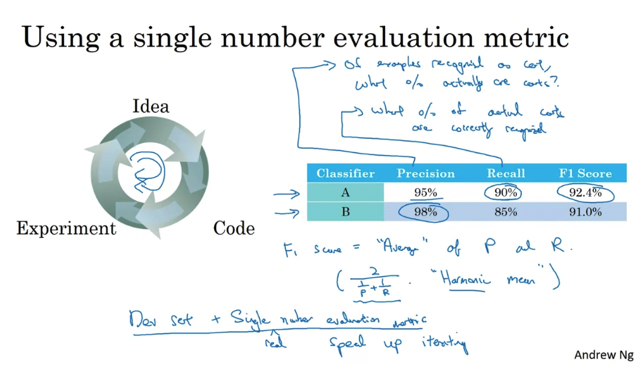</kbd>

    > [!NOTE]
    > Có một metric để đo lường thì sẽ nhanh hơn nhiều metric.

     

    
    
<kbd>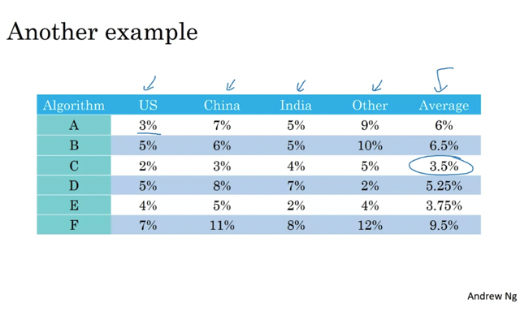</kbd>

     

### Satisficing And Optimizing Metric

 

- 1 Introduction: It is **not always easy to combine** all the  things you care about into a single evaluation metric.  2 Setting up **satisficing** and **optimizing** metrics: It is sometimes useful to set up satisficing and optimizing metrics  to evaluate multiple factors. Satisficing metrics are those that**just need to be good enough**,  while optimizing metrics are those that you want to **maximize**.  3 Example 1: Combining accuracy and running time to evaluate a cat's classifier.  4 Example 2: Combining accuracy and false positives to evaluate a trigger word detection system.  5 Summary: If there are multiple things you care about, you can set up one as an optimizing metric and one or more as satisficing metrics to quickly evaluate multiple options.     6 Evaluation metrics must be calculated on a**training set, development set, or test set.**
> [!NOTE]
> Sure! Here are the main ideas of the passage, with more detail:
>  1 It can be difficult to combine all the things you care about into a single evaluation metric.
>  • The author suggests using both optimizing and satisficing metrics.
>  • An optimizing metric is the one you want to maximize, while satisficing metrics are the ones that just need to be good enough.
>  2 Example 1: choosing a classifier based on both accuracy and running time.
>  • The author uses accuracy as the optimizing metric.
>  • Running time is a satisficing metric, with a threshold of 100 milliseconds.
>  • This allows for a clear way to pick the best classifier based on both criteria.
>  3 Example 2: building a wake word detection system.
>  • The author uses accuracy as the optimizing metric.
>  • The number of false positives is a satisficing metric, with a threshold of one per 24 hours.
>  4 Having multiple metrics can help you quickly evaluate and choose the best option.
>  • Choose one metric as optimizing, and the others as satisficing.
>  • This allows you to look at multiple criteria at once.
>  5 Evaluation metrics must be calculated on a training, development, or test set.
>  • The author will discuss guidelines for setting up these sets in the next video

   

    
    
<kbd>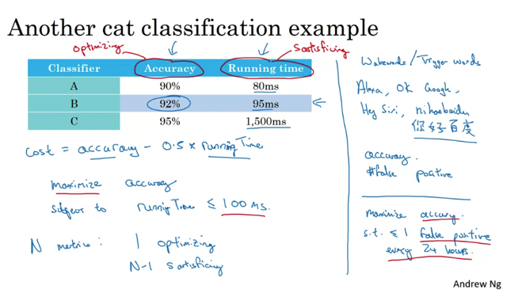</kbd>

    > [!NOTE]
    > Đại khái là Nên đánh giá theo cách như thế này: 
    > Có 1 cái metric để Optimize/ Maximize và những cái
    > còn lại để 'Satisfy'

     

### Train / Dev / Test Distributions

 

- 1 Setting up training, development and test sets properly is **crucial** for maximizing team efficiency when building machine learning applications.  2 The **dev** set, also known as the development set, is **used to evaluate different models** and pick one to improve for the final test set.  3 \\/**Dev and test sets need to come from the same distribution**\\/ to avoid unexpected and unwanted results.  4 **Randomly shuffling all data into the dev and test sets** is the best way to ensure that both sets have data from all regions and the same distribution.  5 Teams can waste a lot of time and effort by setting up **dev** and **test** sets from different distributions or not taking into account all possible data sources they may encounter.  6 **Choose a dev set and test set to reflect data expected to be encountered in the future,** and consider important for the application's success.
> [!NOTE]
> Sure, here is a more detailed summary of the main ideas in the video on how to set up your dev and test sets in machine learning:
>  1 The way you set up your training dev, or development sets and test sets, can have a huge impact on how rapidly you or your team can make progress on building machine learning applications.
>  2 Teams, even teams in very large companies, often set up these data sets in ways that really slow down, rather than speed up, the progress of the team.
>  3 The dev set, also called the development set, or sometimes called the hold-out cross-validation set, is used to evaluate different ideas and models that have been trained on the training set, and to pick the best one.
>  4 Machine learning teams are often very good at innovating and trying different ideas to get closer and closer to hitting the bullseye or the optimal model for their specific task.
>  5 Having dev and test sets from different distributions is like setting a target, having your team spend months trying to aim closer and closer to the bullseye, only to realize after months of work that you need to move the target somewhere else.
>  6 To avoid this, it's important to ensure that both the dev and test sets come from the same distribution, which is the distribution of all of your data mixed together.
>  7 When setting up your dev and test sets, it's important to choose a dev set and test set that reflects the data you expect to get in the future and that is important to do well on.
>  8 It's also important to establish a single evaluation metric or target that the team should aim for, and that can be used to quickly evaluate different models and ideas.
>  9 Finally, it's important to monitor your performance on the dev set and to avoid overfitting, which is when your model becomes too complex and performs well on the dev set but poorly on the test set. To avoid overfitting, it's important to use regularization techniques and to constantly monitor your model's performance on the test set.

   

    
    
<kbd>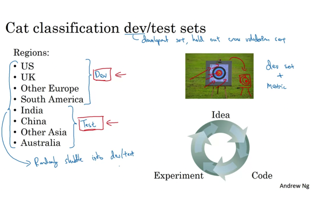</kbd>

    > [!NOTE]
    > So, having dev and test sets from different distributions is like 
    > **setting a target**, having your team **spend months trying to 
    > aim closer** and closer to bull's eye, only to realize after 
    > months of work that, you'll say, "Oh wait, **to test it, I'm going 
    > to move target over here**." And, the team might say, 
    > "Well, why did you make us spend months optimizing for a 
    > different bull's eye when suddenly, you can move the bull's eye to 
    > a different location somewhere else?"

     

    
    
<kbd>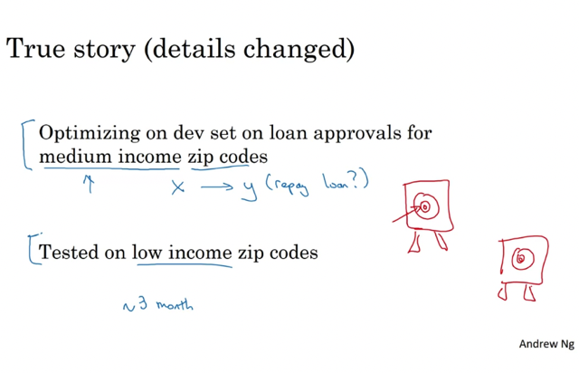</kbd>

    > [!NOTE]
    > Đại khái là phân chia dev/test set sai (ko cùng 1 distribution) sẽ
    > dẫn đến sau khi train ngon rồi thì test sai bét.
    >
    > Do đó đây nói đến việc **định hướng train/dev set ban đầu rất
    > quan trọng.**

     

    
    
<kbd>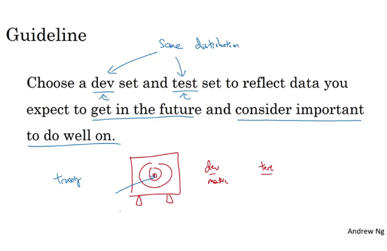</kbd>

    > [!NOTE]
    > I recommend for setting up a **dev** set and **test** set is, choose
    > a dev set and test set to **reflect data you expect to get in
    > future** and consider important to do well on. And, in
    > particular, the dev set and the test set here, should come
    > from **the same distribution**. So, **whatever type of data you
    > expect to get in the future, and want to do well o**n, **try to
    > get data that looks like that**. \/**And, whatever that data is, put
    > it into both your dev set and your test set.**\/

    > [!NOTE]
    > **""And, whatever that data is, put
    > it into both your dev set and your test set."**

     

### Size Of The Dev Set And Test Sets

 

- 1 Introduction  • Guidelines for setting up dev and test sets are changing in the era of Deep Learning.  • The old rule of thumb of a **70/30 split no longer applies**.  • Best practices are to **use more data for training and less for dev and tests**, especially when dealing with larger data sets.  2 Dev Set  • **Dev sets should come from the same distribution as the test set.**  • The size of the dev set should be big enough for its purpose, which helps evaluate different ideas and pick up from AOP better.  • When working with larger data sets, using a much smaller fraction of the data for the dev set is reasonable.  3 Test Set  • The purpose of the test set is to **evaluate the final system's performance**.  • The guideline is to set the test set big enough to give high confidence in the overall performance of the system.  • Having millions of examples in the test set may not always be necessary.  • The test set size could be much less than 30% of the data, depending on the application.  4 Train-Dev Set  • Some applications may not require a high level of confidence in the overall performance of the final system.  • Using a train-dev set and acknowledging the absence of a test set may be appropriate.  • It's not recommended, but **having a large dev set may allow for the absence of a separate test set.**  5 Changing Evaluation Metrics and Dev/Test Sets  • Sometimes, mid-way through a machine learning problem, it **may be necessary to change the evaluation metric or dev/test sets**.  • It's important to be aware of when to do this and how to properly set up the new evaluation metric and dev/test sets.
   

    
    
<kbd>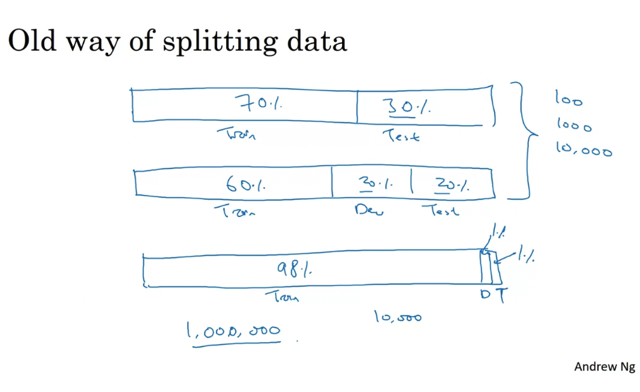</kbd>

     

    
    
<kbd>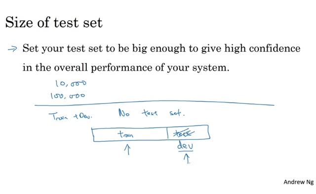</kbd>

    > [!NOTE]
    > Đại khái là NGÀY NAY BIG DATA thì chỉ cần 1%,2% cho Dev / Test set
    > là đủ cho MỤC ĐÍCH của nó rồi.
    >
    > Thậm chí có thể không cần Test set mặc dù ổng vẫn recommend 
    > Train / Dev (CV) / Test set với Test set để cho ra con số performance
    > trước khi ship đi.

    > [!NOTE]
    > 1 The guidelines for **setting up dev and test sets are changing in the Deep
    > Learning era**, especially because of the larger data set sizes we are
    > working with.
    >
    > 2 In earlier eras of machine learning, a **70/30 or 60/20/20** split for training,
    > dev, and test sets was reasonable, but **with larger data sets, it is now
    > reasonable to use a much smaller fraction of data for dev and test sets**.
    >
    > 3 The purpose of the test set is to evaluate the performance of the final
    > system, and it should be set to a size that **gives high confidence in the
    > overall performance of the system**. For some applications, a smaller test
    > set size may be sufficient.
    >
    > 4 For some applications, **a train and dev set without a test set may be
    > sufficient** if a high confidence in the overall performance of the final system
    > is not needed.
    >
    > 5 It is important to be rigorous about **calling the dev set a dev set** if it is
    > being used for tuning rather than evaluation.
    >
    > 6 In the era of big data, the old**rule of thumb** for setting up dev and test
    > sets **no longer applies**, and the trend is to **use more data for training
    > and less for dev and test sets.**
    >
    > 7 It may be necessary to change the evaluation metric or the dev and test
    > sets partway through a machine learning problem, depending on the
    > progress made and the goals of the project.

     

### When To Change Dev / Test Sets And Metrics

 

- 1 **Evaluation metrics are essential** in ML projects for setting targets and enabling the team to achieve better results.  2 **Evaluation metrics should be changed when the original metric does not lead to the desired results**. Pornographic images and non-pornographic images should be treated differently in evaluation metrics.  3 **Orthogonalization** is a technique that can be used to break ML projects into separate steps to achieve better results. One step involves defining a metric that captures what one wants to do, while the other step involves placing the target accurately.  4 To achieve better results in ML projects, one needs to**focus on different steps and adjust the knobs** that correspond to these steps.
   

    
    
<kbd>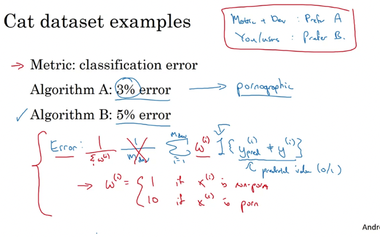</kbd>

    > [!NOTE]
    > Đại khái là kết quả ko như ý muốn thì ta cần thay đổi
    >
    > Model A ít sai hơn như khi sai lại nhận định có hình sex là mèo.
    > Model B sai nhiều hơn nhưng ko có hình sex -> Phải sao cho nó ít
    > nhận sai hình sex hơn
    >
    > Than đổi hàm J để nó nhấn mạnh sự quan trọng của việc Đánh giá
    > sai đ/v Porn image bằng cách thêm tham số
    >
    > Đại ý là không cần stick với hàm cost thường dùng mà có thể điều
    > chỉnh để thoả mãn nhu cầu

    > [!NOTE]
    > For the purpose of this video, don't worry too much about the
    > details of how we define a new error metric, the point is that
    > **if you're not satisfied with your old error metric then don't
    > keep coasting with an error metric you're unsatisfied with,
    > instead try to define a new one that you think better
    > captures your preferences in terms of what's actually a better
    > algorithm.**

    > [!NOTE]
    > So when this happens, when your evaluation metric is no longer
    > correctly rank ordering preferences between algorithms, in this
    > case is mispredicting that Algorithm A is a better algorithm, then
    > that's a sign that you should change your evaluation metric or
    > perhaps your development set or test set.

     

    
    
<kbd>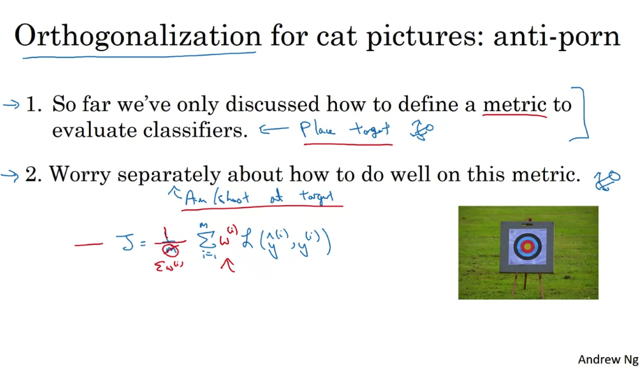</kbd>

    > [!NOTE]
    > Đại khái là đây là ví dụ minh hoạ cho '**Orthogonalization**'
    > principle: Mỗi thứ 1 núm vặn độc lập với nhau.
    >
    > Cụ thể hơn:
    >
    > Step 1 là ta **define metric cho chính xác.**
    > Step 2 là ta **làm sao để cải thiện metric này**.
    >
    > Đó đại khái hai bước độc lập, phù hợp với nguyên tắc
    > **Mỗi lúc một việc hay mỗi núm 1 chức năng độc lập**

    > [!NOTE]
    > In machine learning, "orthogonalization"
    > refers to **the principle of separating
    > concerns so that changes in one aspect of
    > the system do not affect other aspects**.
    >
    > Specifically, it means **breaking down the
    > machine learning process into modular
    > components**, each of which has a **specific
    > responsibility**, and ensuring that 
    >
    > **changes to one component do not have unintended
    > consequences for other components**. This
    > makes it easier to develop, debug, and
    > maintain complex machine learning systems.

     

    
    
<kbd>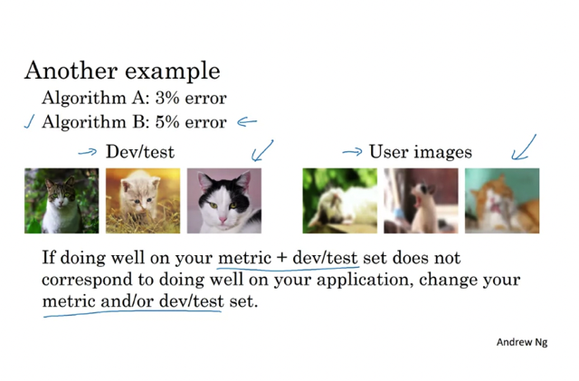</kbd>

    > [!NOTE]
    > But the overall guideline is**if your current metric and data
    > you are evaluating on doesn't correspond to doing well on
    > what you actually care about, then change your metric
    > and/or your dev/test set** to better capture what you need
    > your algorithm to actually do well on.
    >
    > Đại khái đây nói đến trường hợp train model để (detect
    > mèo) ngon rồi nhưng thực tế user xài ảnh của họ tự chụp
    > khiến model chạy hết ngon thì  sẽ nói vấn đề này sau nhưng
    > ý nói ở đây là phải thay đổi metric  và target

     

    
    
<kbd></kbd>

    > [!NOTE]
    > Having an **evaluation metric and the dev set allows you to much
    > more quickly make decisions** about is Algorithm A or Algorithm
    > B better. It really speeds up how quickly you or your team can
    > iterate. So my recommendation is, **even if you can't define the
    > perfect evaluation metric and dev set, just set something up
    > quickly and use that to drive the speed of your team iterating.**

    > [!NOTE]
    > And if later down the line you find out that it wasn't a good one, you
    > have better idea, change it at that time, it's perfectly okay. But what I
    > recommend against for the most teams is to **run for too long without
    > any evaluation metric and dev set** up because that can slow down
    > the efficiency of what your team can iterate and improve your
    > algorithm.

     

## Comparing To Human-level Performance

 

### Why Human-level Performance

 

- Main ideas of the lecture are as follows:  1 Machine learning teams are interested in comparing machine learning systems to human-level performance because of the advances in deep learning, and because the workflow is more efficient when the machine is trying to do something that humans can do.  2 Progress in accuracy for machine learning tasks tends to be relatively rapid as you approach human-level performance, but then slows down once you surpass it.  3 **Bayes optimal error** is the best possible error for any function mapping from x to y, and it is the theoretical limit that the machine learning algorithm **can approach but never surpass**.  4 Progress often slows down when you surpass human-level performance because the performance is not far from Bayes' optimal error, and **certain tactics for improving performance are harder to apply once the algorithm surpasses human-level performance**.  5 Comparing to human-level performance is helpful because machine learning algorithms tend to be good at replicating tasks that people can do and catching up to human-level performance.  6 How humans can help improve machine learning algorithms and why comparing algorithm performance to human performance is helpful. When humans are better at a task than the algorithm, labeled data can be obtained from humans to train the algorithm. Human error analysis can also be used to gain insights into improving algorithm performance. However, once the algorithm surpasses human performance, these tactics become harder to apply. Additionally, knowing how well humans can perform on a task can help to better understand how to balance reducing bias and reducing variance in the algorithm.
   

    
    
<kbd>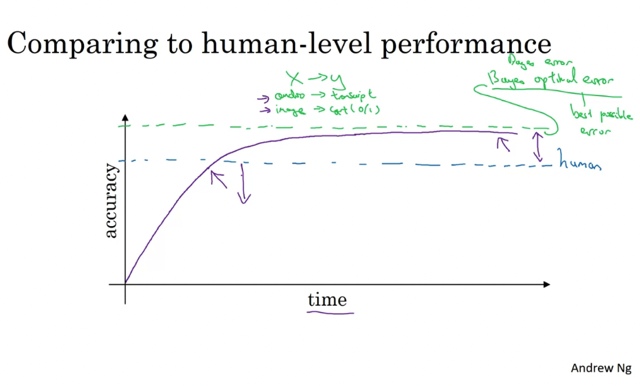</kbd>

    > [!NOTE]
    > Tăng nhanh, khi vượt qua H.L.P thì chậm lại và ko
    > qua được Bayes Optimal Error

     

    
    
<kbd>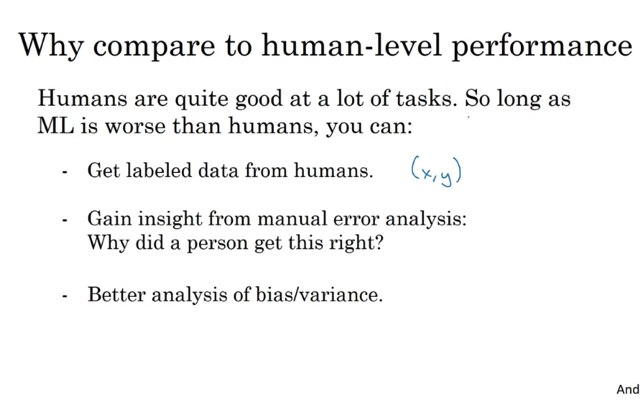</kbd>

    > [!NOTE]
    > Đại khái là, nguyên nhân dẫn đến việc 'chậm' lại sau khi
    > surpass H.L.P là vì trước đó ML có thể nhờ con người làm
    > những việc con người giỏi như label data giùm, từ đó ML
    > có thể học dc nhiều, Nhưng sau khi vượt rồi thì không còn
    > biết nhờ ai nữa sự tiến bộ sẽ chậm lại

     

### Avoidable Bias

 

- Trong bài giảng này, chúng ta tìm hiểu về khái niệm human-level performance, là một chỉ số để đo độ chính xác của một mô hình học máy so với con người. Với ví dụ phân loại hình ảnh mèo, nếu con người có độ chính xác gần như hoàn hảo thì human-level error là 1%. Nếu mô hình của chúng ta đạt được 8% lỗi trên tập huấn luyện và 10% lỗi trên tập phát triển, đó là một dấu hiệu cho thấy mô hình của chúng ta không hoạt động tốt trên tập huấn luyện. Trong trường hợp này, chúng ta cần tập trung vào giảm bias bằng cách tăng kích thước của mạng neural hoặc tăng thời gian huấn luyện.  Tuy nhiên, nếu human-level error không phải là 1% mà thấp hơn do ảnh trong tập dữ liệu quá mờ hoặc không rõ ràng, chúng ta có thể tập trung vào giảm variance bằng cách sử dụng regularization hoặc tăng số lượng dữ liệu huấn luyện.  Bên cạnh đó, ta còn có khái niệm **avoidable bias, là sự chênh lệch giữa lỗi tập huấn luyện và lỗi Bayes**, tức là lỗi tối thiểu mà chúng ta có thể đạt được. Nếu mô hình đang có avoidable bias, ta nên tập trung vào giảm bias bằng cách tăng kích thước mạng neural hoặc thời gian huấn luyện. Ngược lại, nếu mô hình đang có phần variance lớn hơn, ta nên tập trung vào giảm variance bằng cách sử dụng regularization hoặc tăng số lượng dữ liệu huấn luyện. (ChatGPT)
> [!NOTE]
> Đại khái là **HLP gần bằng với Bayes Optimal Error**
> Khoảng cách giữa HLP và Training error là **Avoidable Bias** - Có 
> thể giảm được (bằng More complex model....)
>
> Khoảng cách giữa Dev error và Training error là **Variance** - Có
> thể giảm bằng những phương cách giảm vấn đề High variance
> như (Regularization, more data,,,)
>
> **Tuỳ trường hợp cái nào lớn giữa Avoidable Bias và. Variance 
> mà ta sẽ focus vô improve cái bias hay variance.**

   

    
    
<kbd>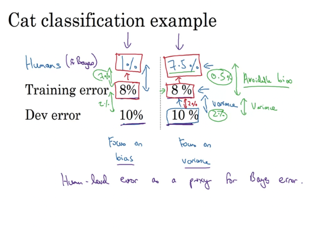</kbd>

    > [!NOTE]
    > Tức là, tuỳ vào tính chất công việc (để đánh giá liệu H.L.P có tốt hay 
    > không, có tiệm cận với Bayes error ko), tuỳ vào Khoảng cách giữa 
    > training error với H.L.P và Dev error - training error.
    >
    > Ví dụ bên trái nếu Avoidable bias lớn hơn nhiều Variance,
    > nên tập trung vào **giảm avoidable bias**
    >
    > Ví dụ ở bên phải:
    > Nếu ta nghĩ rằng đ/v công việc này H.L.P đã rất tốt và do đó
    > đã tiệm cận với Bayes error rồi thì ta nên cho rằng H.L.P ~=
    > Bayes thì dù ta có improve để Training error từ 8 -> 7.5% 
    > (giảm bias) cũng ko bằng tập trung vào improve 
    > dev set từ 10 -> 8% (Giảm variance)
    >
    > Còn giả dụ với 7.5% error của H.L.P nhưng ta có cơ sở để tin rằng
    > H.L.P chưa tiệm cận được Bayes error (giả định là 3% chẳng hạn) 
    > thì ta nên tiếp tục improve Training error.

     

    
    
<kbd>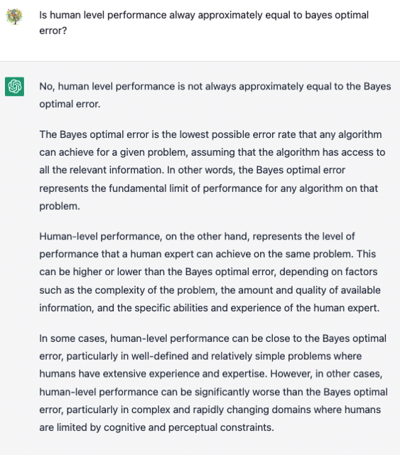</kbd>

    > [!NOTE]
    > Vẫn có những vấn đề H.L.P bằng thậm chí vượt Bayes
    > và ngược lại thua xa Bayes, nơi mà máy tính có thể vuợt qua
    > Do con nguoì bị hạn chế ở một số khả năng mà máy tính có
    > thế mạnh hơn con người.

     

### Understanding Human-level Performance

 

- • The phrase "human-level performance" can be used casually in research articles, but it can be defined more precisely as an estimate of Bayes error.  • The definition of human-level error can vary depending on the context, such as surpassing the performance of a typical doctor.  • Defining human-level performance is important for analyzing bias and variance in machine learning projects.  • A measure of avoidable bias can be calculated as the difference between the estimate of Bayes error and the training error.  • The focus of improvement should be on reducing the larger issue between bias and variance in the learning algorithm.
> [!NOTE]
> 1 The video discusses how to define the phrase "human-level performance" in a more precise way, particularly in the context of machine learning projects.
>  2 Human-level error can be used as a proxy or estimate for Bayes error, which is the best possible error any function could achieve.
>  3 The video uses a medical image classification example to demonstrate how different levels of expertise can achieve different error rates, ranging from 3% for untrained humans to 0.5% for a team of experienced doctors.
>  4 The video argues that the most useful definition of human-level performance for estimating Bayes error is the error rate achieved by a team of experienced doctors, which is 0.5% or lower.
>  5 The video acknowledges that there may be other definitions of human-level performance that are more appropriate for certain purposes, such as surpassing a typical doctor's performance.
>  6 The video emphasizes the importance of being clear about the purpose of defining human-level performance and how it is used in the analysis of bias and variance.
>  7 The video uses an error analysis example to show how the choice of human-level performance definition can affect the estimation of avoidable bias and variance in a machine learning project.
>  8 The video concludes that in cases where the avoidable bias is larger than the variance problem, the focus should be on bias reduction techniques such as training a bigger network.

   

    
    
<kbd>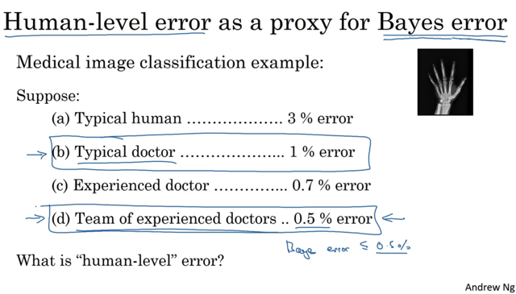</kbd>

    > [!NOTE]
    > ...

     

    
    
<kbd>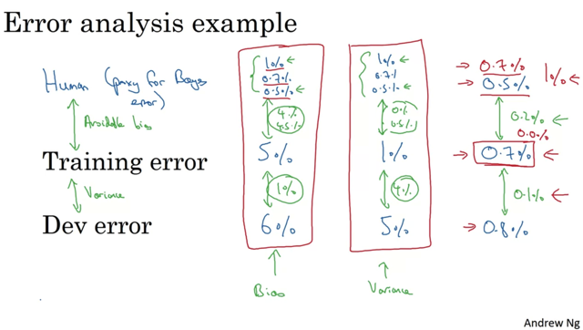</kbd>

     

    
    
<kbd>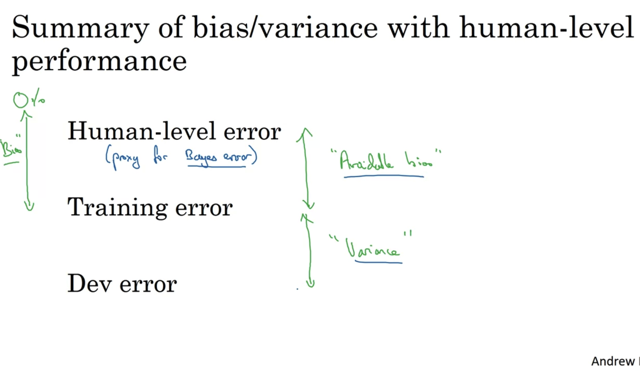</kbd>

     

### Surpassing Human-level Performance

 

- 1 Many teams aim to surpass human-level performance on specific tasks, which can be exciting. However, as performance approaches or exceeds human-level, machine learning progress becomes more challenging.  2 The example of a problem with a team of humans achieving a 0.5% error rate, a single human 1% error rate, and an algorithm with 0.6% training error and 0.8% dev error illustrates the concept of avoidable bias. In this case, the Bayes error is estimated to be 0.5%, making the avoidable bias at least 0.1% with a variance of 0.2%.  3 In a more difficult example, where a team of humans and a single human have the same error rates as before, but the algorithm has 0.3% training error and 0.4% dev error, it's unclear whether to focus on reducing bias or variance, because the Bayes error is unknown.  4 Once a machine learning system surpasses human-level performance, it becomes harder to use human intuition to improve performance further. While progress is still possible, the tools for pointing in a clear direction may not be as effective.  5 Examples of problems where machine learning significantly surpasses human-level performance include online advertising, product recommendations, logistics, and predicting loan repayment. These are structured data problems where humans tend to be less skilled. However, surpassing human-level performance on natural perception tasks like computer vision, speech recognition, and natural language processing is more challenging.  6 Some medical tasks, such as reading ECGs, diagnosing skin cancer, and certain radiology tasks, have seen machines surpass human-level performance, but it's harder for machines to perform well on natural perception tasks due to the superior ability of humans in these areas.  7 Deep learning systems have surpassed human-level performance on some supervisory problems, but this is challenging as performance approaches human-level and requires vast amounts of data.
   

    
    
<kbd>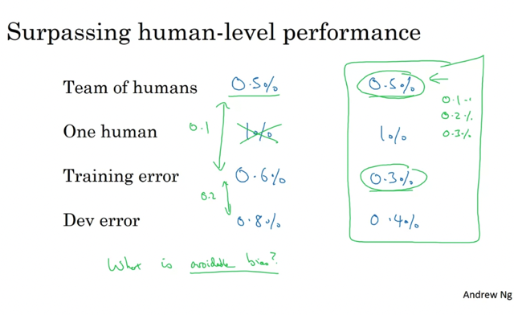</kbd>

    > [!NOTE]
    > Đại khái là một số trường hợp khó mà xác định được có thể improve được
    > nữa hay không  (Xác định Avoidable bias là bao nhiêu). Ví dụ khi hiệu suất
    > của model đã vượt nhóm con người

     

    
    
<kbd>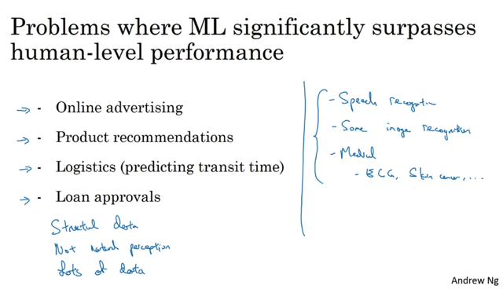</kbd>

     

### Improving Your Model Performance

 

- Guidelines to improve the performance of your learning algorithm:  1 Address avoidable bias issues:  • Train a bigger model.  • Train longer.  • Use a better optimization algorithm such as ADS momentum, RMSprop, or Adam.  • Find a better neural network architecture or set of hyperparameters.  2 Address variance problems:  • Get more data to train on.  • Try regularization techniques such as L2 regularization, dropout, or data augmentation.  • Try various neural network architecture/hyperparameters search.  3 Use the difference between training error and proxy for Bayes error to estimate avoidable bias, and the difference between dev error and training error to estimate variance problems.  4 To reduce avoidable bias, increase the model size, train longer, or use a better optimization algorithm.  5 To address variance problems, get more data, try regularization techniques, or explore other neural network architecture/hyperparameters.  Applying these guidelines systematically can make your machine learning team more efficient, systematic, and strategic in improving the performance of your learning algorithm.
   

    
    
<kbd>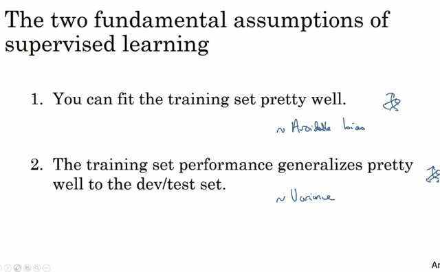</kbd>

     

    
    
<kbd>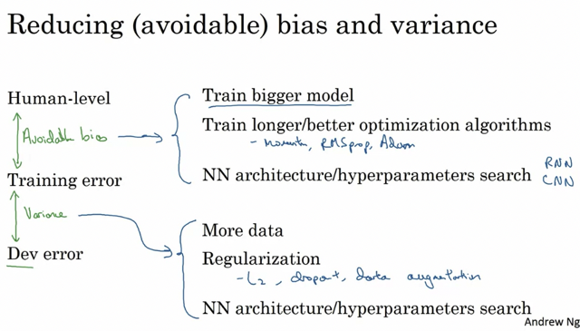</kbd>

     

    
    
<kbd></kbd>

    > [!NOTE]
    > I think that this notion of bias or avoidable bias and variance
    > is one of those things that's **easily learnt but tough to
    > master. And if you're able to systematically apply the
    > concepts from this week's video, you actually will be much
    > more efficient and much more systematic and much more
    > strategic than a lot of machine learning teams in terms of
    > how to systematically go about improving the performance
    > of your machine learning system**

     

## Ml Flight Simulator

 

<kbd></kbd>

 

<kbd>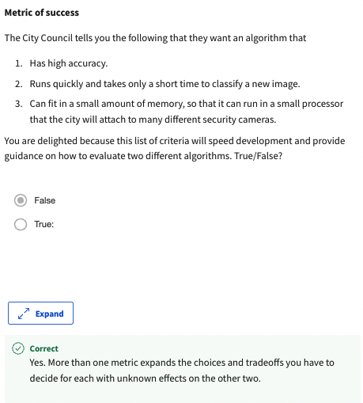</kbd>

 

<kbd>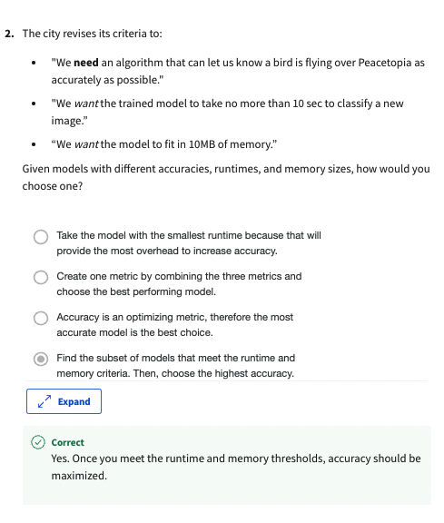</kbd>

 

<kbd>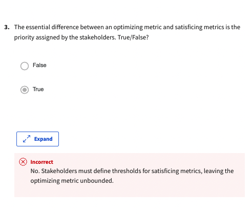</kbd>

> [!NOTE]
> Đại khái là stakeholder chỉ define threshold cho
> Satisficing metric thôi, không đụng đến Optimizing. Câu
> này phải hiểu nó hỏi là: Có phải khác biệt chủ yếu giữa
> optimizing metric và. Satisficing metric là mức độ Priority
> mà thằng Stakeholder chỉ định hay không.
>
> Thì câu trả lời phải là không, vì thằng stkaeholder nó chỉ
> chỉ định cái threshold cho Satisficing metric thôi, không
> phải là bảo rằng cái này quan trọng hơn cái kia để mà
> phải tập trung vào cái này hơn  cái kia (đại loại vậy)
>
> Câu này sai là do mình hiểu sai ý câu hỏi

 

<kbd>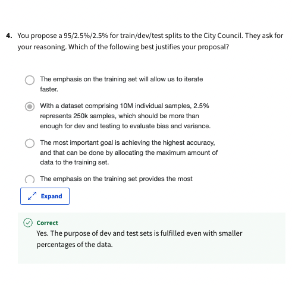</kbd>

> [!NOTE]
> ...

 

<kbd>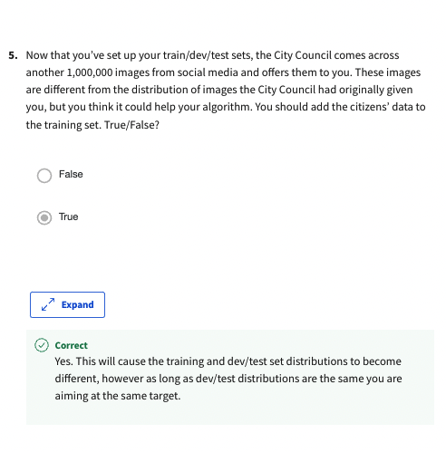</kbd>

> [!NOTE]
> ...

 

<kbd>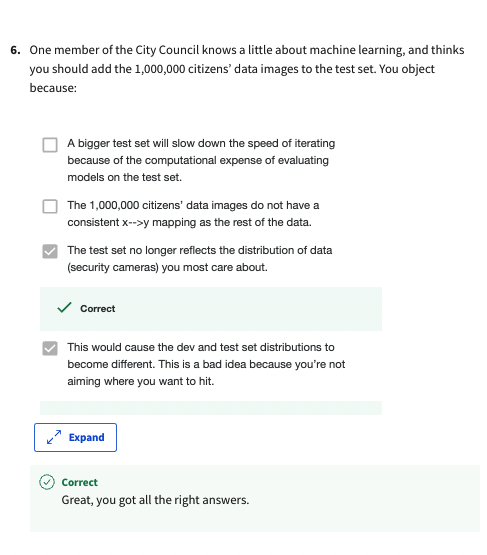</kbd>

> [!NOTE]
> ...

 

<kbd>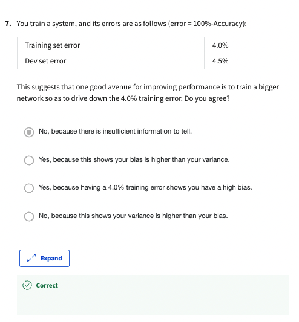</kbd>

> [!NOTE]
> ...

 

<kbd>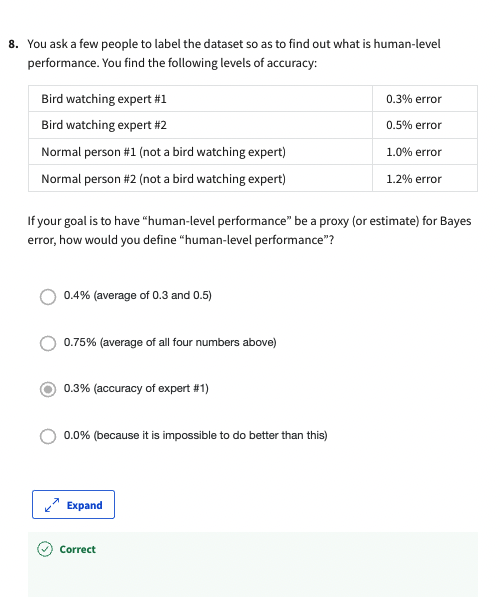</kbd>

 

<kbd>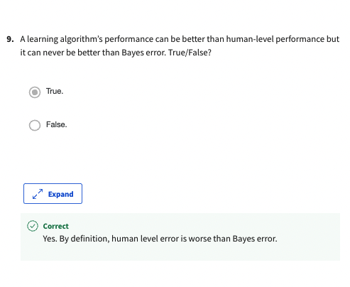</kbd>

 

<kbd>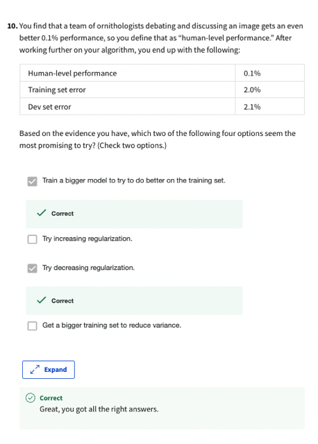</kbd>

 

<kbd>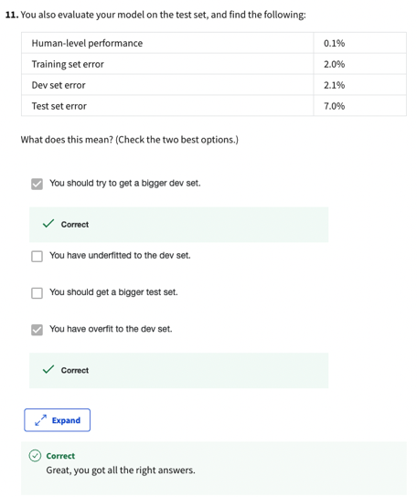</kbd>

<kbd></kbd>

<kbd>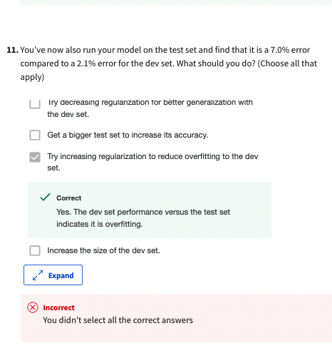</kbd>

> [!NOTE]
> Hiểu đại khái là tăng Dev set để nó phản ánh
> đúng hơn với thực tế thì nó sẽ cho kết quả gần
> với test set hơn -> giảm Variance với Test set

 

<kbd>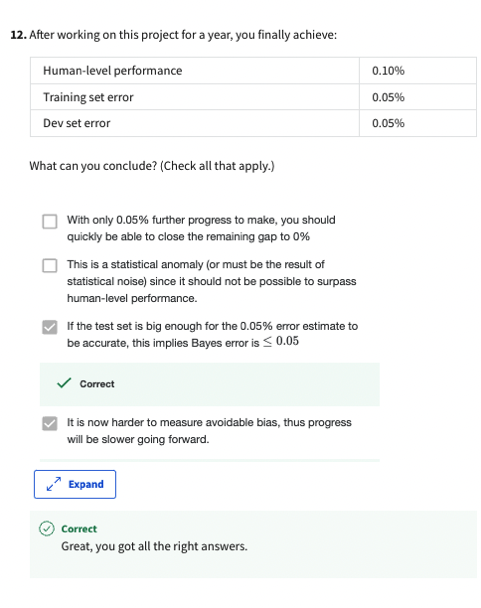</kbd>

 

<kbd>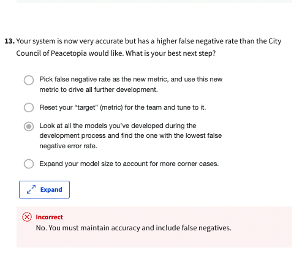</kbd>

> [!NOTE]
> Khả năng là phải chọn Expand...vì cả hai solution 'reset' new
> metric đều sẽ làm giảm Accuracy vì nó sẽ vi phạm nguyên tắc
> Orthogonalization

 

<kbd>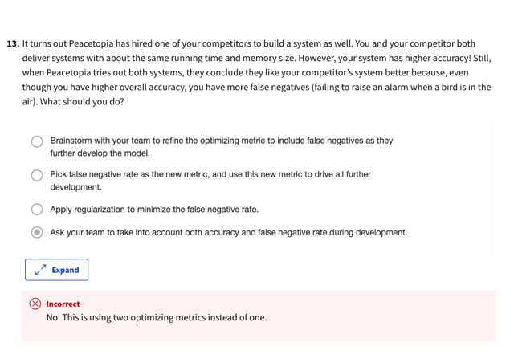</kbd>

> [!NOTE]
> ???

 

<kbd>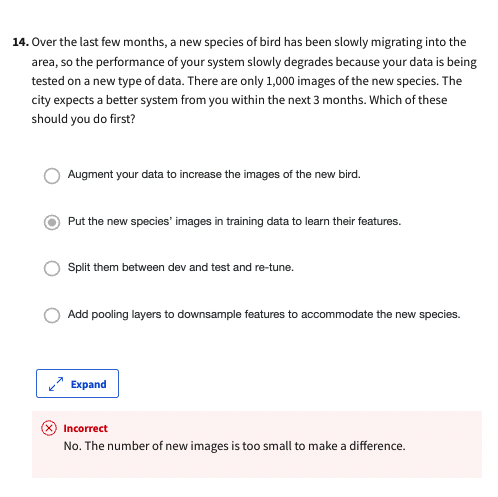</kbd>

> [!NOTE]
> ???

 

<kbd>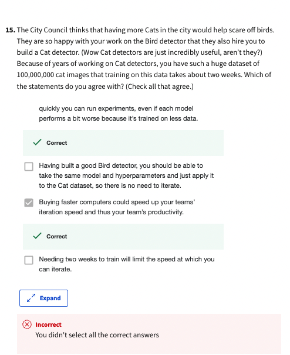</kbd>

> [!NOTE]
> Cái Needing two week .... rõ ràng đúng, sao ko chọn ta

 

<kbd>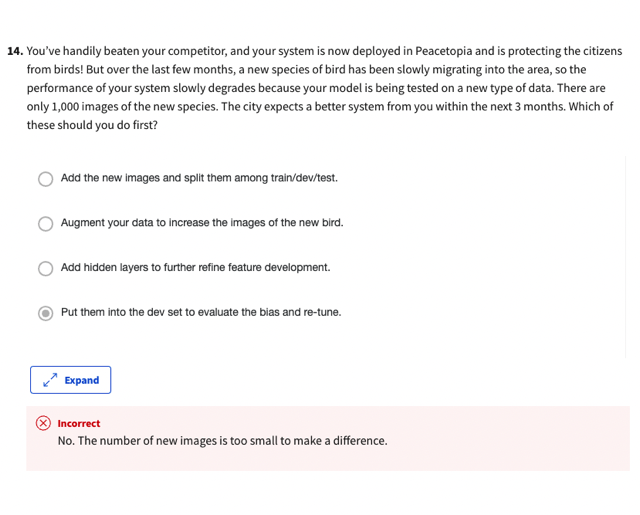</kbd>

 

<kbd></kbd>

 

## Interview

 

