# C3w2_machine Learning Strategy 2

📊 **Progress:** `39` Notes | `40` Screenshots

---

## Error Analysis

 

### Carrying Out Error Analysis

 

- 1 Introduction to error analysis in machine learning  2 The process of error analysis and its significance in identifying the next steps for learning algorithms  3 Importance of examining mistakes that algorithms make to gain insights  4 Example of using error analysis in a cat classifier  5 The error analysis procedure and its effectiveness in identifying the worth of investing time and effort  6 Ceiling on performance in machine learning  7 Evaluating multiple ideas in parallel using error analysis
> [!NOTE]
> 1 Error analysis is a process that can give insights into improving the performance of a learning algorithm that is not yet at the level of human performance.
>
>  2 An example is given of a cat classifier that achieves 90% accuracy on a dev set, but is still performing much worse than desired.
>
>  3 One proposed solution is to focus on the misclassification of dogs as cats, which may involve collecting more dog pictures or designing features specific to dogs.
>
>  4 Before embarking on such a project, it is important to determine whether it is worth the effort.
>
>  5 A simple error analysis procedure is described to quickly assess the potential impact of addressing the dog misclassification problem.
>
>  6 The first step is to obtain about 100 mislabeled dev set examples and manually examine them to determine how many of them are actually pictures of dogs.
>
>  7 If only a small percentage of the mislabeled examples are dog pictures, the potential for improvement by addressing the dog misclassification problem is limited.
>
>  8 If a large percentage of the mislabeled examples are dog pictures, there is greater potential for improvement by addressing the dog misclassification problem.
>
>  9 Error analysis can be used to evaluate the potential impact of multiple ideas for improving a learning algorithm, not just a single idea like the dog misclassification problem.
>
>  10 Error analysis can save time and help focus efforts on the most promising directions for improving a learning algorithm.

   

    
    
<kbd>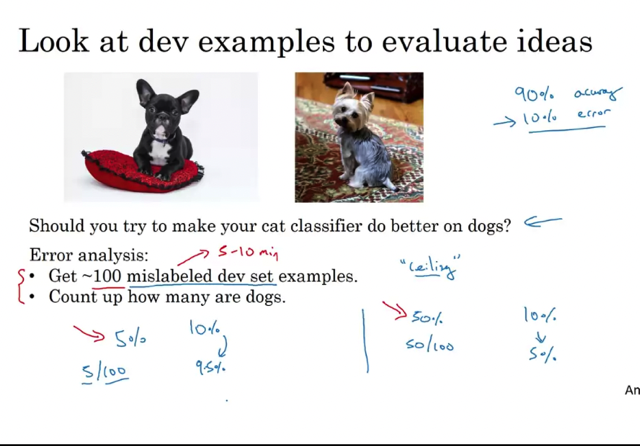</kbd>

    > Đại khái là làm sao biết hướng đi nào sẽ đáng công sức bỏ ra nhất
    > trong số các option (ví dụ improve hình bị mờ, improve hình nhầm
    > lẫn chó vs mèo)

     

    
    
<kbd>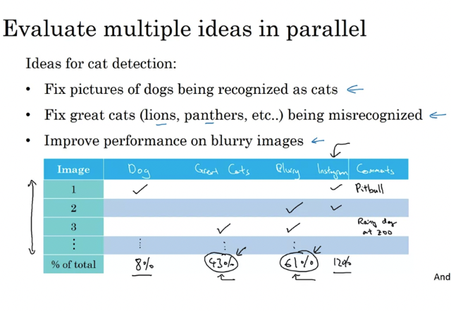</kbd>

    > Đại khái là ta sẽ xem trong 100 wrong label thử mỗi option sẽ improve dc
    > bao nhiêu % từ đó chọn hướng đi nào lợi nhất

     

### Cleaning Up Incorrectly Labeled Data

 

- 1 The supervised learning problem consists of input X and output labels Y.  2 Sometimes data can be incorrectly labeled, which refers to when the label assigned by a human to a piece of data is incorrect.  3 Deep learning algorithms are \\*robust to random errors in the training set, as long as the errors are not too far from random\\*. In other words, if the errors are reasonably random, it's probably okay to leave them as they are and not spend too much time fixing them.  4 Deep learning algorithms are \\*less robust to systematic errors\\*, which occur when the labeler consistently labels certain things incorrectly.  5 If there are incorrectly labeled examples in the dev set or test set, it's recommended to add an extra column to count up the number of examples where the label Y was incorrect during error analysis.  6 If the incorrectly labeled examples in the dev set or test set make a \\*significant difference\\* to your ability to evaluate algorithms, then it's \\*worthwhile to spend time fixing them\\*. Otherwise, it might not be the best use of your time.  7 To decide whether it's worth reducing the number of mislabeled examples, you should look at the overall dev set error, the percentage of errors due to incorrect labels, and the percentage of errors due to all other causes.
   

    
    
<kbd>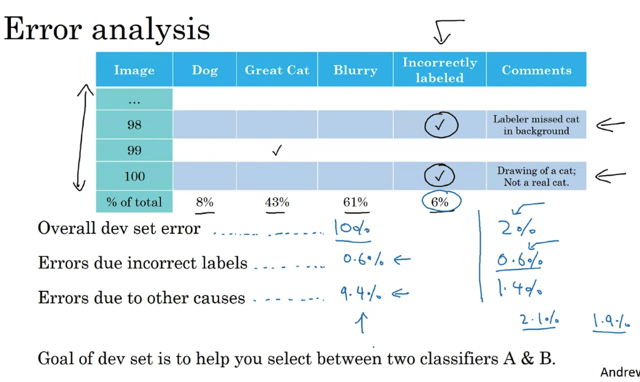</kbd>

    > Trong training set, nếu số lượng ít / không đáng kể 
    > thì không ảnh hưởng gì.
    >
    > N.N không bị ảnh hưởng đ.v random error (Systematically error thì
    > ảnh hưởng lớn hơn)

     

    
    
<kbd>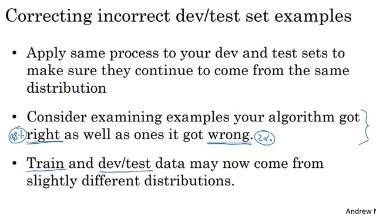</kbd>

    > Trong dev set, thì ta đánh dấu nó trong 100 trường hợp 
    > coi nó chiếm bao nhiêu % của error để đánh giá
    > xem có nên ưu tiên xứ lý không.
    >
    > Ví dụ: 10% error, trong đó có 0.6% là do mislabeled -> 9.4% là do 
    > mấy cái khác -> Nên focus mấy cái khác.
    > Cũng 2% error, có 0.6% mislabeled thì lúc naỳ mislabeled chiếm
    > tới 30% của error -> Nên fix mislabeled.
    >
    > Và đã fix thì fix cả Test set. Và again, không cần fix training set.

     

  
  - When errors due to incorrect labels are high on the dev set, it becomes more worthwhile to fix them.  If the dev set is not reliable due to incorrect labels, selecting between two classifiers becomes difficult.  It is important to apply the same process for both dev and test sets, as they need to come from the same distribution.  When examining mislabeled examples, it is important to look at both the ones the algorithm got right and the ones it got wrong.  Correcting labels on the training set is less important than on the dev and test sets, but it's okay if they come from a slightly different distribution.  Deep learning requires less human insight, but practical systems often require more manual error analysis.  Researchers should not be reluctant to manually look at examples to improve their systems.
     

      
      
<kbd></kbd>

      > "Nó chán nhưng nó đáng"
      >
      > \/"Maybe it's not the most interesting thing to do, to sit
      > down and look at a 100 or a couple hundred examples to
      > counter the number of errors. But this is something that I
      > so do myself. When I'm leading a machine learning team
      > and I want to understand what mistakes it is making, I
      > would actually go in and look at the data myself and try to
      > counter the fraction of errors. And I think that because
      > these minutes or maybe a small number of hours of
      > counting data can really help you prioritize where to go
      > next. I find this a very good use of your time and I
      > urge you to consider doing it if you've built a machine
      > learning system and you're trying to decide what ideas or
      > what directions to prioritize things"\/

       

### Build Your First System Quickly, Then Iterate

 

- Build something quick and iterate
   

    
    
<kbd>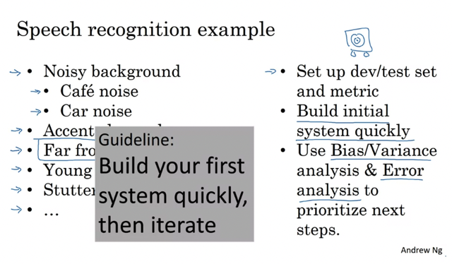</kbd>

    > Build something quick and iterate

     

## Mismatched Training & Dev/test Set

 

### Training & Testing On Difference Distributions

 

- 1 Deep learning algorithms need a lot of labeled data to be effective, but many teams will use whatever data they can find, even if it is not from the same distribution as their dev and test data.  2 When training on data from a \\*different distribution than dev and test data\\*, there are best practices to follow.  3 An example is given of a mobile app that needs to recognize cats in images uploaded by users. The app has access to two data sources: images from the mobile app (the desired distribution) and images downloaded from the web (a different distribution).  4 One option is to combine the two datasets and \\*randomly shuffle them into train, dev, and test sets.\\* The disadvantage of this option is that the dev set will be \\*biased\\* towards the web distribution of images, rather than the mobile app distribution that the team actually cares about.  5 Another option is to use \\*all of the web images for the training set\\* and a \\*small portion of the mobile app images\\*, while using \\*only mobile app images for the dev and test sets\\*. This option ensures that the dev set is representative of the mobile app distribution, which is what the team cares about.
   

    
    
<kbd>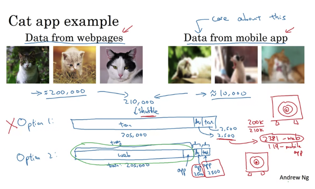</kbd>

    > Đại khái là option 1 trộn lại (web images + mobile images) rồi chia ra
    > cho train - dev - test nhưng cái này thì do web images lớn nên
    > thành ra web image sẽ chiếm số đông trong dev/test set -> Bias
    >
    > Cách hay hơn là dùng web + 1 phần mobile image cho train,
    > Dev, test chỉ dùng mobile -> Đảm bảo Dev / Test chung một
    >  distribution

     

    
    
<kbd>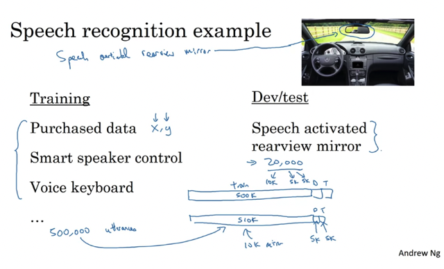</kbd>

     

### Bias And Variance With Mismatched Data Distribution

 

<kbd>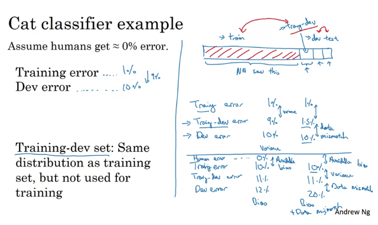</kbd>

> [!NOTE]
> Đại khái là để giải quyết người ta dùng 1 nhóm nữa gọi là **training-dev**
> bao gồm cả train và dev để check performance.
>
> Nếu nó cách xa thằng train chứng tỏ error là do sự khác nhau giữa 
> distribution của train và dev.test còn nếu nó ko xa mấy với train
> mà lại xa với dev performance thì chứng tỏ algorithm bị high variance.

   

<kbd>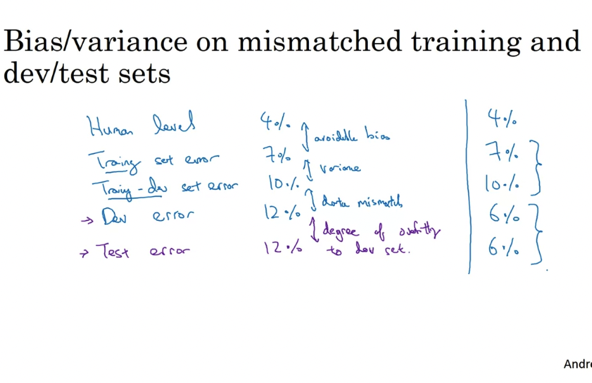</kbd>

> [!NOTE]
> Đại khái là đôi khi dev error nó lại thấp hơn cả Train-Dev và Train 
> là bởi vì lí do nào đó data của Dev, Test lại 'dễ' hơn. 
> Ví dụ trong trường hợp này hình của Dev, Test set lại rõ hơn chẳng
> hạn khiến algorithm work tốt trên nhóm data này hơn là nhóm data 
> của training set.

> [!NOTE]
> Nói chung khoảng cách giữa các nhóm sẽ định nghĩa trạng 
> thái bias variance như sau
>
> HLP / Bayes - Training set error: Avoidable bias
> Training error - Training-Dev error: Variance: 
>
> Hiểu đại khái là model đã gặp/train trên data của training set 
> rồi nên nếu có sự khác nhau giữa training error và training-dev 
> error thì chỉ có thể là do model bị high variance giữa training - dev 
> set.
>
> Traning-dev error và Dev: Mismatch distribution giữa training set
> và dev set
>
> Dev error và Test error: ..

   

<kbd>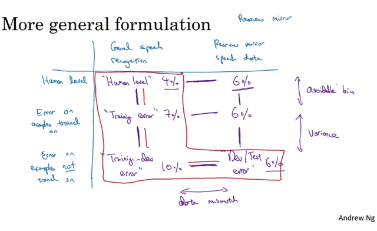</kbd>

   

### Addressing Data Mismatch

 

- 1 Data mismatch problem can occur when the training data comes from a different distribution than the dev and test sets.  2 Manual error analysis can be carried out to \\*understand the differences between the training set and dev/test sets\\*, which can help identify categories of errors.  3 Insights gained from error analysis can be used to \\*make training data more similar to dev/test sets\\* or \\*collect more data\\* similar to the dev/test sets.  4 \\*Artificial data synthesis\\* can be used to make training data more similar to the dev/test sets by simulating data that wasn't originally present.  5 Caution should be exercised while using artificial data synthesis as it can lead to overfitting if not done correctly.
   

    
    
<kbd>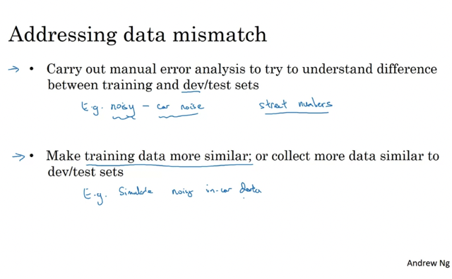</kbd>

    > Đại khái giải pháp là  
    > - Error analysis và tìm hiểu tại sao khác nhau, khác chỗ nào rồi
    > - Tạo / chế / xào nấu sao cho training data
    > nó trở nên giống giống dev.test data

     

    
    
<kbd>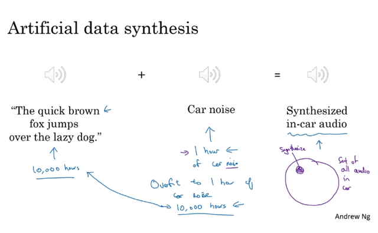</kbd>

    > Chỉ có cái là phải chú ý vụ này: Đại khái là giống như bắt chước nhưng ko hết

     

    
    
<kbd>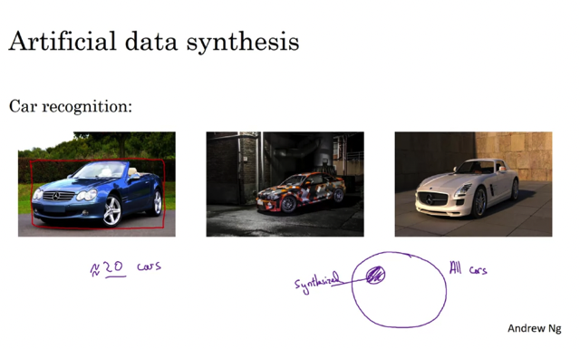</kbd>

    > ..sẽ khiến overfit

     

## Learning From Multi Tasks

 

### Transfer Learning

 

- 1 Transfer learning is a powerful idea in deep learning that involves using knowledge learned from one task to help solve a different task.  2 In transfer learning, the last output layer of the neural network is deleted, and a new set of randomly initialized weights is created for the new task.  3 There are two ways to retrain the neural network with the new task data set: retrain only the weights of the last layer or retrain all the layers of the neural network.  4 Pre-training is the initial phase of training on image recognition data to pre-initialize the weights of the neural network, while fine-tuning is updating all the weights after training on the new data set.  5 Transfer learning makes sense when there is a lot of data for the problem being transferred from but relatively less data for the problem being transferred to.  6 Examples of using transfer learning include adapting an image recognition neural network to a radiology diagnosis task or a speech recognition system to a wake words detection system.
> [!NOTE]
> Sure, I'd be happy to provide a more detailed explanation of transfer learning in deep learning.
>  1 Definition of transfer learning
>  2 Transfer learning is a technique in deep learning where knowledge learned by a neural network for a specific task can be reused or adapted to perform a different task. This means that a neural network trained on one task, such as image recognition, can leverage its learned features and apply them to another task, such as radiology diagnosis or speech recognition.
>  3 How transfer learning works
>  4 To implement transfer learning, you first train a neural network on a specific task, such as image recognition. Once you have trained the network, you can then modify the network by removing the last output layer and the weights feeding into it. You then create a new set of randomly initialized weights for the last layer and have it output the target variable for the new task, such as radiology diagnosis.
> Next, you initialize the weights of the new layer, retrain the neural network using a new dataset X Y, where X is the input data for the new task, such as radiology images, and Y is the target variable for the new task, such as diagnoses. You have several options for retraining the neural network depending on the amount of data available for the new task. If you have a small dataset, you might only want to retrain the weights of the last layer. If you have a large dataset, you can retrain all the layers of the network. The initial phase of training on the original task is called pre-training, and updating all the weights afterward is called fine-tuning.
>  3 Examples of transfer learning
>  4 One example of transfer learning is using a neural network trained on image recognition to improve radiology diagnosis. By leveraging the knowledge learned from the image recognition task, such as detecting edges, curves, and positive objects, a neural network can learn to perform radiology diagnosis more efficiently, even with a smaller dataset.
> Another example of transfer learning is using a speech recognition system to build a wake words or trigger words detection system. By modifying the last layer of the neural network and retraining it using a new dataset, a neural network can learn to recognize specific wake words or trigger words, such as "Alexa" or "OK Google."
>  4 When transfer learning makes sense
>  5 Transfer learning makes sense when you have a large amount of data for the task you are transferring from and relatively less data for the task you are transferring to. For example, if you have a million examples for image recognition and only 100 examples for radiology diagnosis, you can leverage the knowledge learned from the image recognition task to improve radiology diagnosis. In contrast, if you have a small dataset for both tasks, it may not be beneficial to use transfer learning.

   

    
    
<kbd>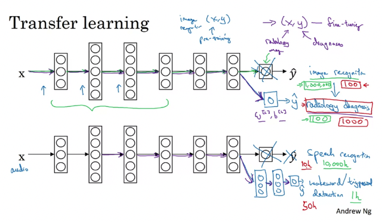</kbd>

    > Đại khái là: Xài lại một cái model đã được train cho một vấn
    > đề tương tự (v.d Image Recognition & Radiology diagnosis,
    > speech recognition & wake up call)
    >
    > Nếu nhiều data thì train lại toàn bộ,
    > còn không thì train lại 1, 2 layer cuối thôi.
    >
    > Những "\/feature học được"\/ từ task A giúp ích cho task B

     

    
    
<kbd>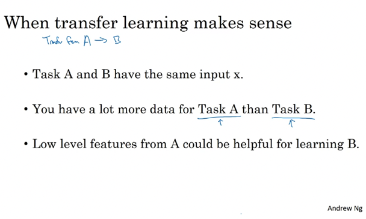</kbd>

    > KHI NÀO THÌ NÊN DÙNG 'TRANSFER LEARNING'?

     

### Multi-task Learning

 

- 1 Introduction to transfer learning and multi-task learning  2 Example of building a self-driving car with multi-task learning  3 Multi-label classification with four labels: pedestrians, cars, stop signs, and traffic lights  4 Training a neural network with a loss function to predict values of y  5 Main difference compared to earlier binary classification examples  6 Ability to assign multiple labels to a single image in multi-task learning  7 Training one neural network to perform multiple tasks results in better performance than training multiple separate neural networks  8 Advantages of multi-task learning.
   

    
    
<kbd>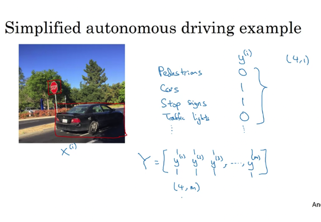</kbd>

     

    
    
<kbd>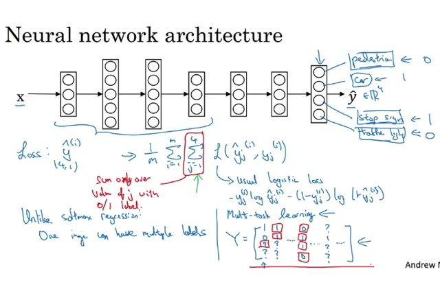</kbd>

    > Này khác Softmax: Softmax: **Môĩ dataset x(i) chỉ có 1 label** (trong số có C
    > label) Multi-Label: **Mỗi dataset x(i) có thể có nhiều label**
    >
    > Loss function giống như hàm logistic chỉ có thêm caí loop qua các label
    > thôi
    >
    > Chỉ tính những cái có label 1/0 còn ko có label thì bỏ qua. Đại khái muốn
    > nói trường hợp một số không có label chẳng hạn y(3) = [1 0 ? ? 1] = Có
    > pedestrian, không có car , stops ign và traffic light thì ko biết

     

    
    
<kbd>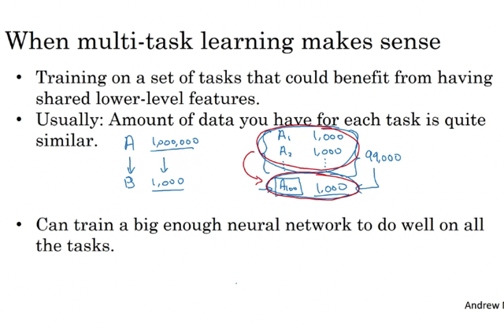</kbd>

    > Đại khái là nhiều vấn đề cần train nhưng mỗi vấn đề có ít data thôi ví dụ
    > 1000 và **train cùng lúc nó sẽ lợi hơn** vì cùng chung những cái gọi là '
    > Low level features' như góc cạnh, màu sắc....

     

    
    
<kbd>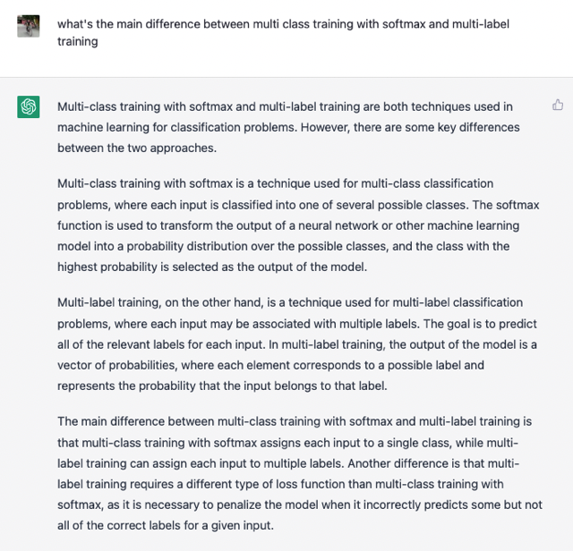</kbd>

    > Nhắc lại chút về khác biệt giữa
    > Multi-class training và multi-label training
    >
    > Chú ý là multi task training có thể là multi-label training nhưng
    > cũng có thể là trang nhiều thứ khác cùng lúc như xác định object +
    > xác dinh vị trí của object đó trong 1 picture chẳng hạn.

    > Multi-class: mỗi data set chỉ có 1 label, do đó tuy y cũng là vector
    > có C (số class/label) item nhưng chỉ có 1 item = 1, còn lại bằng 0
    >
    > y^ ra là vector C item và dưới dạng probability sao cho tổng bằng
    > 1. và cái cao nhất sẽ xác định label của nó (dataset đó)
    >
    > Còn multi-label: Mỗi dataset có thể có nhiều label, y là C-dimension
    > Vector thì có thể có nhiều vị trí = 1.
    >
    > y^ ra là vector C chiều, chứa probability dataset đó cho từng label
    > và Sum các probability này không cần phải bằng 1

     

## End-to-end Deep Learning

 

### What's E2e Deep Learning

 

- End-to-end deep learning is a \\*recent development\\* in deep learning that replaces multi-stage data processing systems with a single neural network. Traditional data processing systems required multiple stages of processing, such as feature extraction and machine learning algorithms. End-to-end deep learning, on the other hand, \\*takes an input and outputs a direct result, bypassing many intermediate steps.\\* End-to-end deep learning\\* works best with large data sets\\* and can be challenging for researchers who have spent many years designing individual steps of the pipeline. One example of end-to-end deep learning is speech recognition, where a neural network can directly output a transcript from an audio clip. However, end-to-end deep learning is not always the best approach, as it may \\*require a lot of data to work well.\\* For example, in face recognition turnstiles, a multi-step approach of face detection, cropping, and identity estimation works better than directly feeding the raw image to a neural net.
   

    
    
<kbd>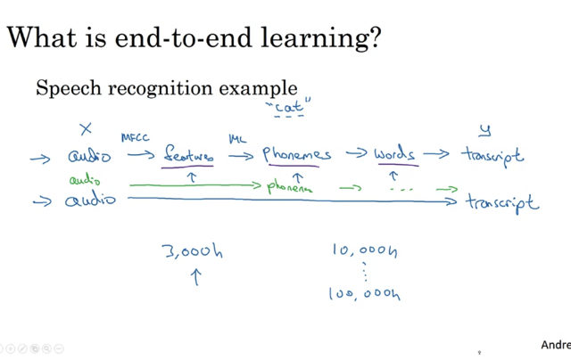</kbd>

    > Đại khái là nếu có nhiều thật nhiều data, thì có thể dùng e2e learning.

     

    
    
<kbd>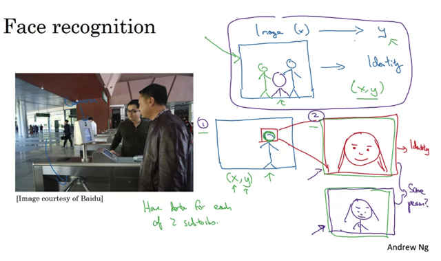</kbd>

    > Lấy face recognition làm ví dụ, chia làm nhiều bước thì cần ít
    > data (ở mỗi bước) hơn, còn e2e thì phải nhiều data mới dc

     

    
    
<kbd>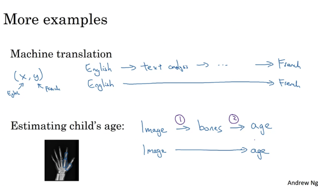</kbd>

     

### Whether To Use End2end Deep Learning

 

- 1 Benefits of End-to-End Deep Learning  • Lets the data speak and captures the statistics in the data without reflecting \\*human preconceptions\\*  • Simplifies the design workflow by reducing the need for hand designing of components  2 Drawbacks of End-to-End Deep Learning  • \\*Requires a large amount of data\\* to learn the direct mapping from input (X) to output (Y)  • \\*Excludes potentially useful hand-designed components that could inject manual knowledge into the algorithm\\*  3 Key question in deciding whether to use End-to-End Deep Learning  • Do you have sufficient data to learn the function of the complexity needed to map from X to Y?  4 Examples of applications and their complexity in learning the function  • Image recognition and identifying the position of bones seems relatively simple  • Autonomous driving is a much more complex problem that may require more data and a combination of approaches.
   

    
    
<kbd>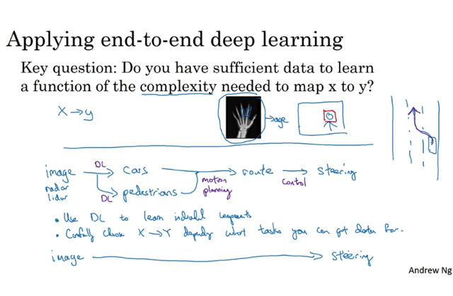</kbd>

    > Không bị preconception: Đại khái không bị giới hạn bởi những
    > quy tắc hay nói đúng hơn là những cái con người đặt ra ví dụ
    > nhận biết giọng nói, con người đặt ra các 'âm' (phonemes) Cat =
    > cờ ah tờ nhưng máy tính nó có  thể ' nhìn' data theo kiểu của nó,
    > do đó có thể hiệu quả hơn con người.

    > Không tận dụng những 'kiến thức' do người truyền vào, đại khái 
    > có thể hiểu là do nó bỏ qua bước 'Feature processing' nơi mà con
    > người giúp xác định feature nào là quan trọng (ví dụ vậy)

    > Chỉ ok nếu có rất rất nhiều data.

     

## Ml Flight Simulator

 

<kbd>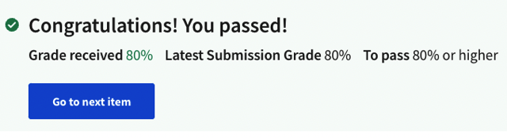</kbd>

 

<kbd></kbd>

> [!NOTE]
> Ghi nhớ lời thầy tuân theo nguyên tắc: **Start quick & iterate**

 

<kbd>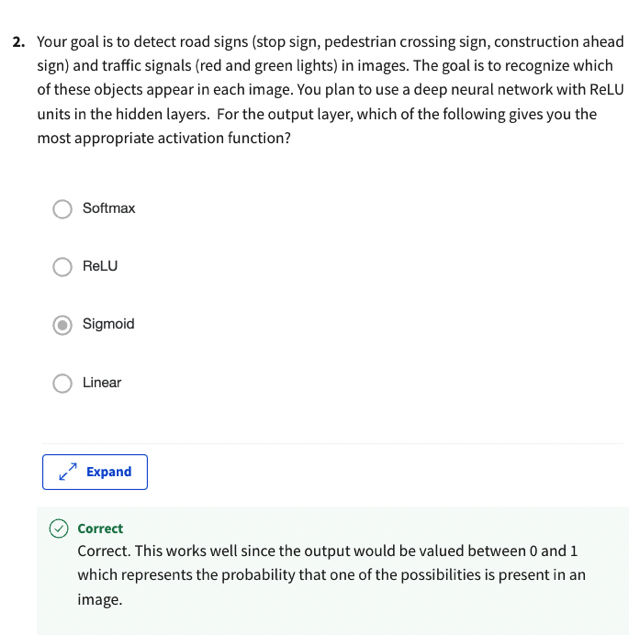</kbd>

> [!NOTE]
> Bài toán classification tất nhiên phải xài sigmoid, không phải là multiclass
> nên ko xài softmax

 

<kbd>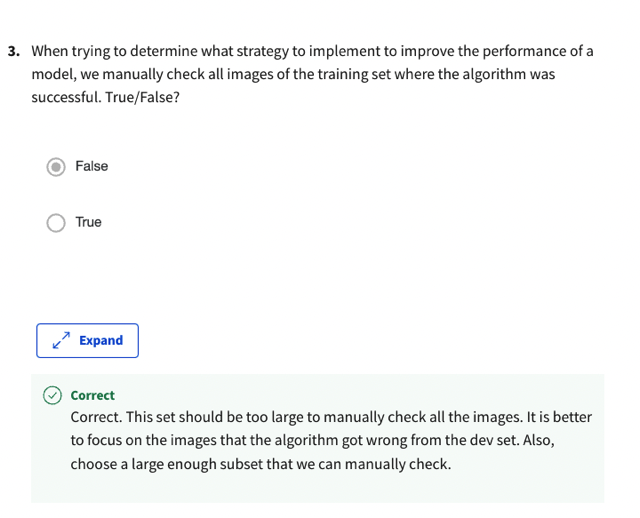</kbd>

> [!NOTE]
> Training dataset quá lớn 900.000 nên dù trong bài học có nói
> bên cạnh việc check wrong case thì nên check cả right case
> Nhưng do data lớn quá nên chỉ nên focus ơn wrong case thôi

 

<kbd>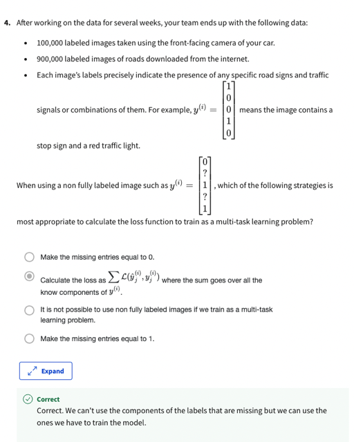</kbd>

> [!NOTE]
> Trong bài giảng có nói, loop qua các label và bỏ qua
> label nào ko biết

 

<kbd>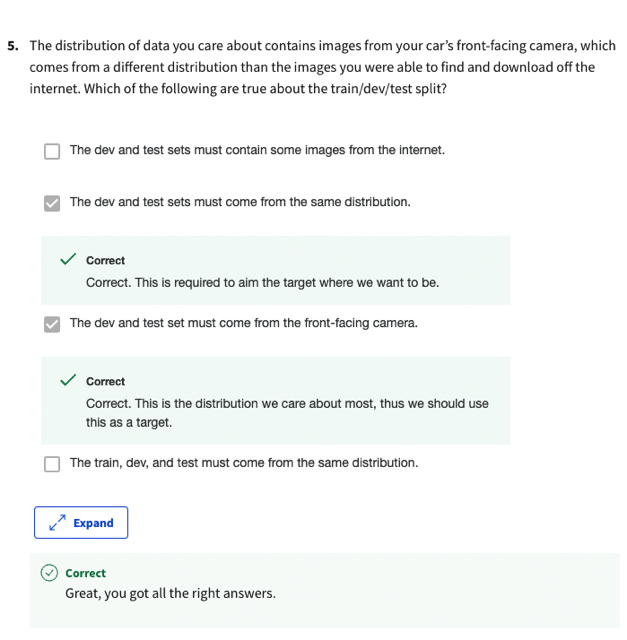</kbd>

> [!NOTE]
> Thứ nhất là **dev,set nhất định phải cùng distribution**là nguyên tắc rồi.
>
> Thứ hai là dev,set phải**reflex data mà model phải dự đoán trong
> tương lai** (production data) mà ở đây là Front-face cam, nên 
> dev.set phải dùng F.f cam images.

 

<kbd>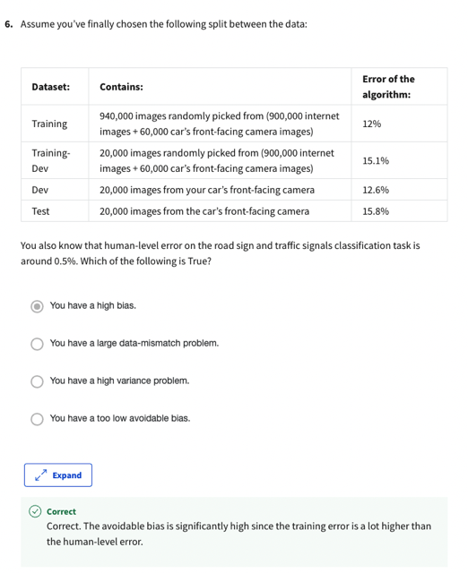</kbd>

> [!NOTE]
> H.L error: 0.5% mà Training là 12% -> Avoidable bias tới
> 11%. Các nhau quá lớn. So với 3% so với training-dev
> Không high bias thì là gì

 

<kbd>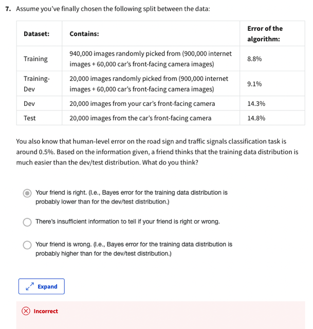</kbd>

> [!NOTE]
> Tại sao sai

 

<kbd>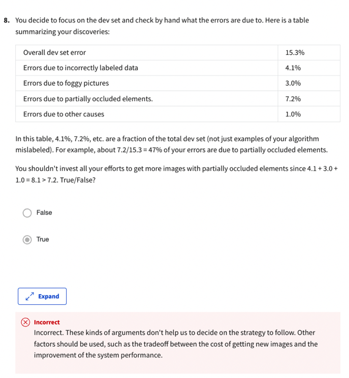</kbd>

> [!NOTE]
> Lập luận kiểu này không hữu ích. Các yếu tố nên
> cân nhắc nên là tradeoff giữa chi phí phải bỏ ra để thu
> thập thêm dữ liệu và khả năng cải thiện hiệu suất

 

<kbd>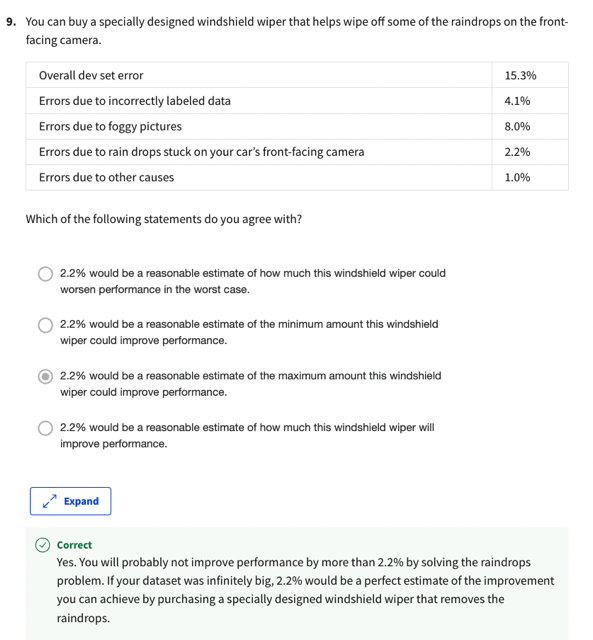</kbd>

 

<kbd>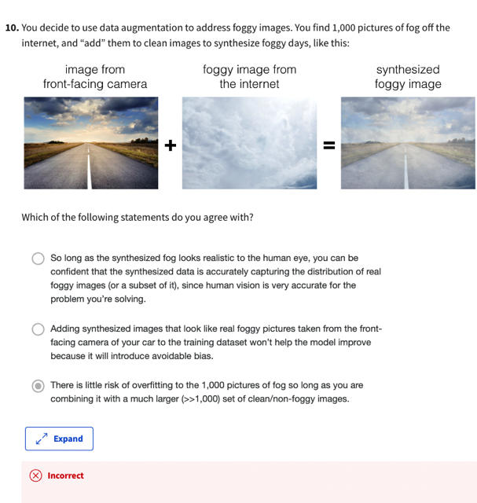</kbd>

> [!NOTE]
> Tại sao sai

 

<kbd>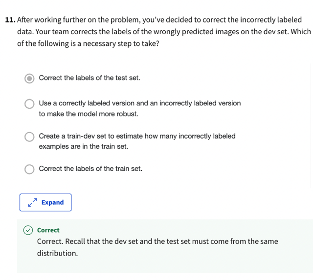</kbd>

> [!NOTE]
> Nguyên tắc dev.test cùng distribution. Và trong bài giảng có nói đã
> sửa phải sửa cả dev lẫn test

 

<kbd>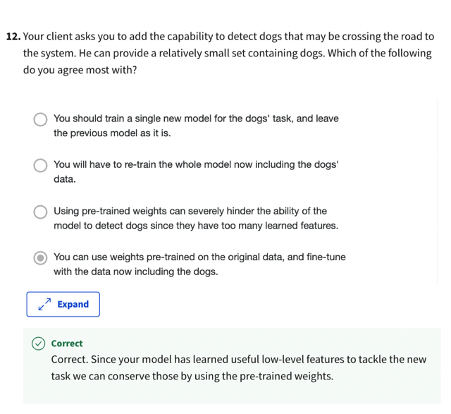</kbd>

> [!NOTE]
> Xem lại khi nào thì nên dùng 'Transfer-learning'
> Hai task có same input X: Đều là hình chụp đường phố
> Task A có data lớn hơn task B nhiều: 900.000 
> Task A và task B đều có chung các low-level features: Đều học cách
> nhận diện những yếu tố trong các hình ảnh về đường phố

 

<kbd>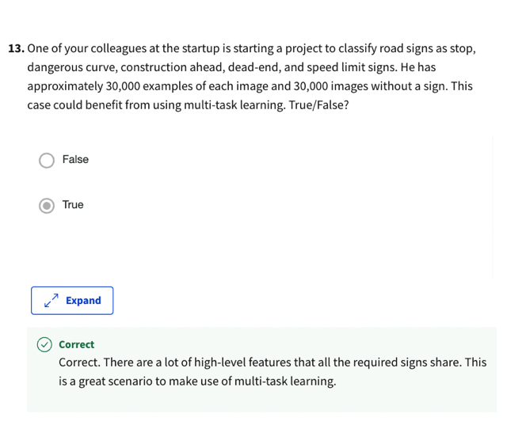</kbd>

> [!NOTE]
> Classify nhiều các sam sam nhau, mỗi cái có 1 ít data, đều học từ những
> caí lơ-level features -> Rất phù hợp cho multi training

 

<kbd>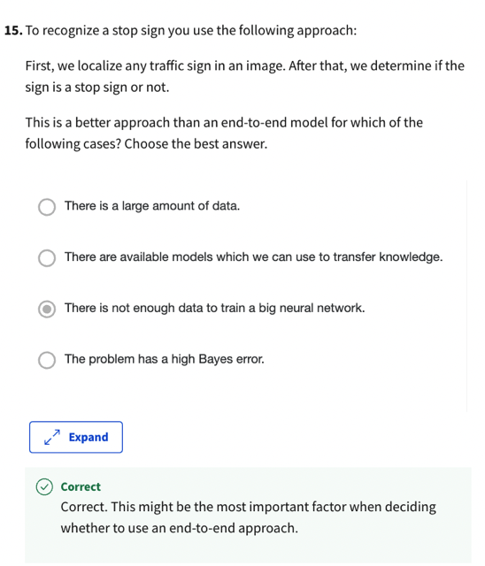</kbd>

> [!NOTE]
> Muốn dùng E2E quan trọng nhất phải có cực nhiều data

 

<kbd>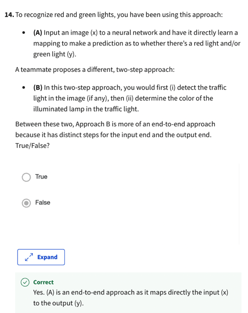</kbd>

 

