# C4w2_deep Convolutional Models: Case Studies

📊 **Progress:** `57` Notes | `130` Screenshots

---

Discover some powerful practical tricks and methods used in deep CNNs, straight from the research papers, then apply transfer learning to your own deep CNN.
**Learning Objectives**
 • Implement the basic building blocks of ResNets in a deep neural network using Keras
 • Train a state-of-the-art neural network for image classification
 • Implement a skip connection in your network
 • Create a dataset from a directory
 • Preprocess and augment data using the Keras Sequential API
 • Adapt a pretrained model to new data and train a classifier using the Functional API and MobileNet
 • Fine-tine a classifier's final layers to improve accuracy

## Why look at case studies?

 

### 1 Case studies of effective convolutional neural networks

> [!NOTE]
> 1 Case studies of effective convolutional neural networks
>
> 2 Importance of looking at **case studies** to gain intuition and
> confidence in building effective convnets
>
> 3 **Transferability of neural network architecture** across different
> computer vision tasks
>
> 4 **Potential satisfaction in reading research papers** from the field
> of computer vision
>
> 5 Outline of the next few videos: classic networks such as
> **LeNet**-5, **AlexNet**, and **VGG**; **ResNet**, a deep 152-layer neural
> network with interesting tricks; and the **Inception** neural network
>
> 6 Benefits of learning from these examples, even for those not
> working in computer vision, as ideas are **cross-fertilizing** into
> other disciplines.

 

<kbd>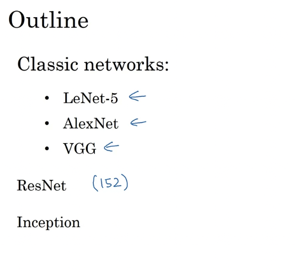</kbd>

   

## Classic Networks

 

### Xem qua 1 số classic ConvNet

> [!NOTE]
> Xem qua 1 số classic ConvNet
> Nhận xét chung là nó thường có cấu trúc là 
> **Conv - Pool - Conv - Pool ...Conv - Pool- FC - FC.. -FC - Sofmax 
> Qua các layer thì nH, nW giảm, nC tăng**

 

<kbd>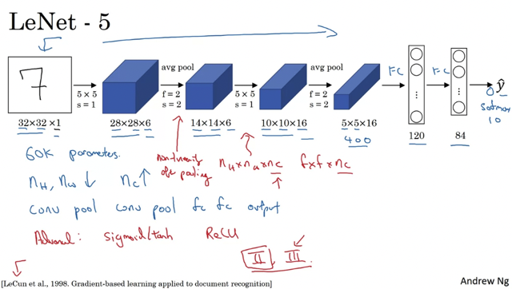</kbd>

> [!NOTE]
> Một số nhận xét:
> Qua các layer:
> nH, nW giảm, nC tăng
> Conv - Pool  - Conv - Pool
> **60k** params

   

<kbd>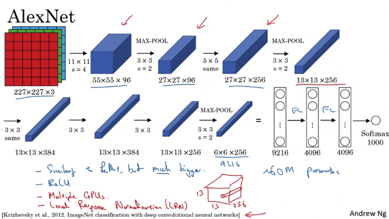</kbd>

> [!NOTE]
> Một số nhận xét:
> Giống như LeNet như bigger
> **~60 mils** params

   

<kbd>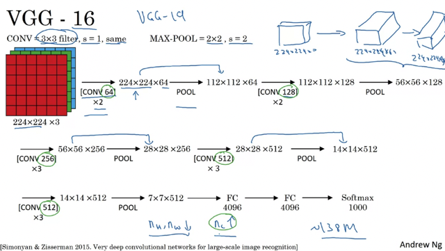</kbd>

> [!NOTE]
> Một số nhận xét:
> Giống như Alexnet nhưng bigger
> **~138 mils** params

   

## Resnet

 

### Training **very deep** neural networks is difficult due to **vanishing** and **exploding**

> [!NOTE]
> Training **very deep** neural networks is difficult due to **vanishing** and **exploding**
> gradient problems.
>
> **Skip connections** are a solution to these problems as they **allow activations from
> one layer to be fed to another layer much deeper** in the network, allowing the
> building of **ResNets**.
>
> **ResNets** are built from **residual blocks** which consist of a main path of layers and
> a shortcut that allows information to flow directly to deeper layers.
>
> Adding these residual blocks to a plain network turns it into a ResNet and allows
> for the training of **much deeper neural networks without significant loss** in
> performance.
>
> ResNets **help with the vanishing and exploding gradient problems**, allowing the
> training of **much deeper neural networks**without **compromising performance**.

 

<kbd>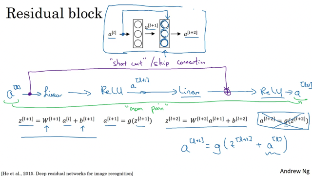</kbd>

> [!NOTE]
> Đại khái là Residual block nó có thêm cái 
> '**Shortcut /Skip Connection**' chuyển a[l] vào step tính a[l+2]
>
> a[l+2] = g(z[l+2] + a[l])
>
> Khi vì lí do nào đó, params khiến**z[l+1] = 0** có thể do hiện tượng
> gradient exploding / vanishing thì a[l+2] sẽ bằng g(a[l]) = max(0, a[l]) (reLU) = a[l]
> từ đó đại khái là **không bị mất thông tin**

   

<kbd>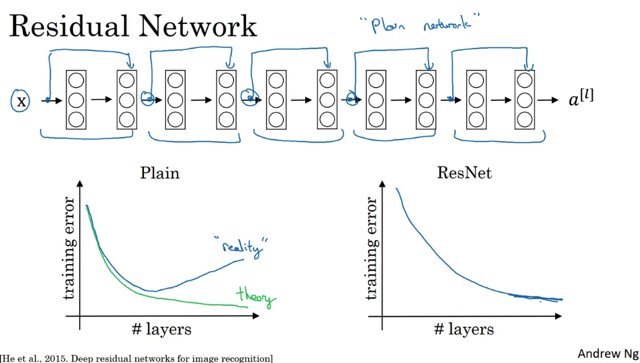</kbd>

> [!NOTE]
> Đại khái là RestNet giúp khắc phục vấn đề**nhiều layer thì
> performance giảm** do Gradient Vanishing / Exploding từ đó
> **cho phép train very deep network**

   

## Why Resnets Work

 

### 1 **Residual Networks (ResNets)** work well in terms of training because they

> [!NOTE]
> 1 **Residual Networks (ResNets)** work well in terms of training because they
> can be made **deeper without decreasing performance** on the training set.
>
> 2 Making neural networks **deeper** can **hurt the ability to train them well** on
> the training set, which is a prerequisite to doing well on the holdout, test
> sets or during deployment.
>
> 3 ResNets include **residual blocks**with **shortcut connections**, making it
> easy for these extra layers to **learn the identity function**.
>
> 4 **The identity function is easy to learn**, so the addition of extra layers in the
> neural network **doesn't hurt** its ability to perform **as well as a simpler
> network without these extra layers**.
>
> 5 **Same convolutions** are often used in ResNets to **ensure** that the
> dimension of the **input**and**output**of the layers**are equal**, making it easier
> to **carry out** the **shortcut connection** and the addition of two equal
> dimension vectors.

> [!NOTE]
> Sure, here's a more detailed answer with indexed main ideas:
>  1 ResNets are deep neural networks that work well because they can be made deeper without significantly hurting performance on the training set, which is a prerequisite for good performance on the test set.
>  2 The reason ResNets can be made deeper without hurting performance is because of the use of residual blocks, which include a skip connection that allows the network to learn the identity function more easily.
>  3 Let's look at an example to see how the skip connection works in a ResNet block. Suppose we have an input X feeding into a neural network that outputs activation a[l]. We want to make the network deeper by adding two extra layers to output a[l+2]. We add a residual block with a skip connection to achieve this. If we assume all activations are greater than or equal to zero, then a[l+2] can be expressed as g(w[l+2] * a[l+1] + b[l+2] + a[l]), where g is the activation function and w[l+2] and b[l+2] are the weights and biases for the added layers.
>  4 If we use L2 regularization to shrink the weights, w[l+2], and assume b[l+2] = 0 for simplicity, then we can see that if w[l+2] = 0, the entire term w[l+2] * a[l+1] + b[l+2] disappears, leaving just a[l] as the input to the activation function. If g is the ReLU function, which outputs only non-negative numbers, then g(a[l]) = a[l]. This means that the identity function is easy for the residual block to learn, and it can easily make a[l+2] equal to a[l].
>  5 Adding two extra layers with a residual block does not significantly hurt performance because the residual block can easily learn the identity function. However, the goal is not just to avoid hurting performance but to improve it. If the added layers can learn something useful, then the network can do even better than simply learning the identity function.
>  6 In very deep plain networks without residual connections, it becomes difficult to learn even the identity function, which is why adding more layers can actually hurt performance. ResNets work because they make it easy for the extra layers to learn the identity function, and from there they have a chance of learning something useful.
>  7 Another detail worth noting is that the dimensions of z[l+2] and a[l] must be the same for the skip connection to work. This is why same convolutions are often used in ResNets to preserve the dimensions of the inputs and outputs of each layer, making it easier to carry out the skip connection and the addition of the two vectors. If the dimensions are different, an extra matrix must be added to make the dimensions match.

 

<kbd>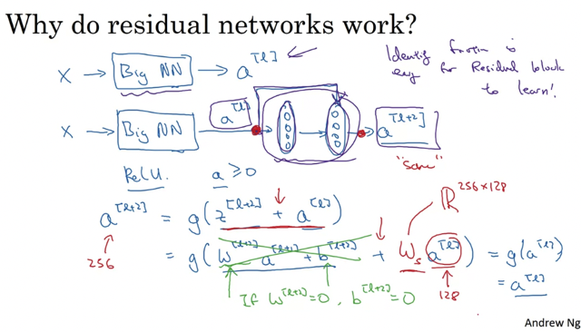</kbd>

> [!NOTE]
> Đại khái là nếu regularization (ví dụ vậy) bóp W, b (l+1) bằng 0 thì a[l+2] sẽ
> bằng g(a[l]) và = a[l] vì g là reLU 
>
> Có nghĩa là ..nếu gradient vanishing xảy ra, thì ..không bị làm sao cả,
>  a[l+2] chỉ đơn giản là a[l+2] quay lại bằng a[l] thay vì =0
> (ý ổng nói network rất dễ learn được identity function đại khái là 
> vậy)   
>
> Bằng 0 có nghĩa là không học được gì nữa (hiểu đại khái vậy, vì nếu
> a[l+2] = 0 thì mấy cái layer sau = 0 hết)
>
> Đo đó, với 'Skip connection' thì đầu tiên là **add thêm extra layer, hay
>  tạo very deep network sẽ không gây hại** đến model.
>
> Và từ ko gây haị thì chỉ có thể nâng lên thành improve hệ
> thống, ý nói nếu tệ nhất mà chỉ ko gây hại thì chắc chắn phải có thể
> improve rồi.
>
> Ngược lại, nếu không có Skip connection, thì việc add thêm layer rất dễ
> dẫn đến việc hệ thống bị stuck khi W bị = 0

> [!NOTE]
> Đại khái là để a[l+2] bằng size với a[l], ta nhân thêm a[l] với 1 matrix **Ws**. Ws
> có thể **trainable** hoặc **fixed value** Hoặc với ConvNet thì dùng **Same
> padding** để giữ size của input và output

   

<kbd>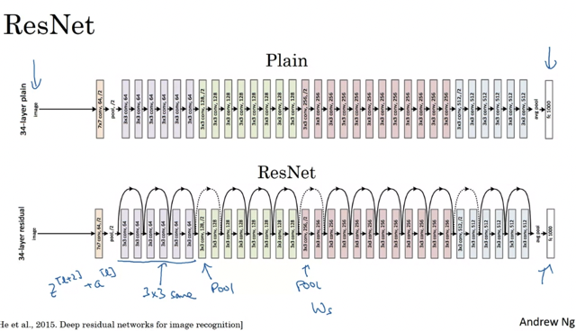</kbd>

> [!NOTE]
> Một ví dụ 
> Conv conv conv pool, conv conv .. conv pool
> ..
>
> Sau pool (size nó giảm) thì dùng Ws để khôi phục:
> Chưa rõ lắm nhưng đại khái là vậy

   

- Sure, here's a more detailed answer with indexed main ideas:    1 **ResNets** are deep neural networks that work well because they can be made **deeper** without **significantly hurting performance** on the **training** **set**, which is a **prerequisite** for good performance on the test set.  2 The reason **ResNets** can be made deeper without hurting performance is because of the use of **residual blocks**, which include a **skip connection** that allows the network to **learn the identity function** more easily.  3 Let's look at an example to see how the skip connection works in a ResNet block. Suppose we have an input X feeding into a neural network that outputs activation **a[l]**. We want to make the network deeper by adding two extra layers to output **a[l+2]**. We add a **residual block** with a **skip connection** to achieve this. If we assume all activations are greater than or equal to zero, then a[l+2] can be expressed as **g(w[l+2] * a[l+1] + b[l+2] + a[l])**, where g is the activation function and w[l+2] and b[l+2] are the weights and biases for the added layers.  4 If we use **L2 regularization to shrink the weights**, w[l+2], and assume b[l+2] = 0 for simplicity, then we can see that if w[l+2] = 0, the **entire term w[l+2] * a[l+1] + b[l+2] disappears**, leaving just **a[l]** **as the input to the activation function**. If g is the ReLU function, which outputs only non-negative numbers, then **g(a[l]) = a[l].** This means that the **identity function** is **easy for the residual block to learn**, and it can easily make **a[l+2] equal to a[l].**  5 Adding two extra layers with a residual block **does not significantly hurt performance** because the **residual block can easily learn the identity function**. However, the goal is not just to avoid hurting performance but to improve it. **If the added layers can learn something useful**, then the **network can do even better than simply learning the identity function.**  6 In **very deep plain networks** without residual connections, it becomes **difficult to learn even the identity function**, which is why **adding more layers can actually hurt performance**. **ResNets** **work because they make it easy for the extra layers to learn the identity function**, and from there they **have a chance of learning something useful.**  7 Another detail worth noting is that the **dimensions of z[l+2] and a[l] must be the same** for the skip connection to work. This is why s**ame convolutions are often used in ResNets to preserve the dimensions of the inputs and outputs of each layer**, making it **easier to carry out the skip connection** and the addition of the two vectors. **If the dimensions are different, an extra matrix must be added to make the dimensions match.**
   

## Networks In Networks And

> [!NOTE]
> NETWORKS IN NETWORKS AND
> 1X1 CONVOLUTIONS

 

### 1 Using a **one-by-one convolution** can help in designing content

> [!NOTE]
> 1 Using a **one-by-one convolution** can help in designing content
> architectures.
>
> 2 A one-by-one convolution can **multiply an image by a single number**
> or **perform a more complex operation**.
>
> 3 A one-by-one convolution takes each position in an input volume and
> applies a **fully connected neural network** to it.
>
> 4 A one-by-one convolution is sometimes called a "**network in network**"
> and has been influential in other neural network architectures.
>
> 5 One way to use a one-by-one convolution is to **shrink the number of
> channels** in an input volume.
>
> 6 A one-by-one convolution **adds nonlinearity** and **allows for learning a
> more complex function in a network**.

 

<kbd>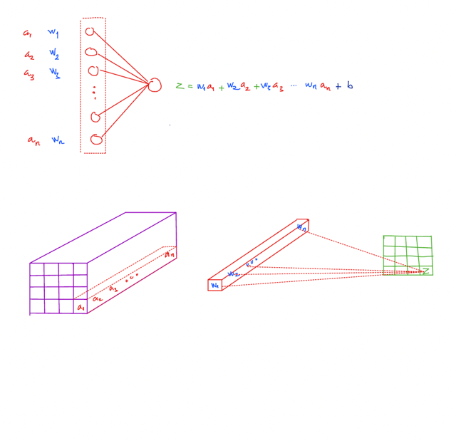</kbd>

<kbd></kbd>

<kbd>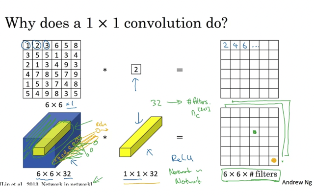</kbd>

> [!NOTE]
> Đại khái nó giống như apply 1 fully connected cho mỗi position của volumn (nhìn hình sẽ hiểu).

   

<kbd>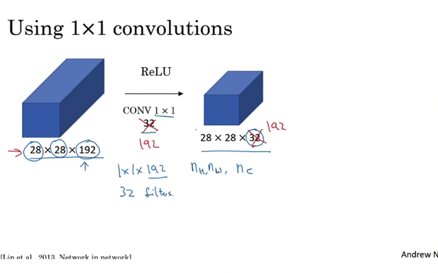</kbd>

> [!NOTE]
> Đại khái là 1x1 Conv có thể có công dụng giúp giảm n_c, giống  cách
> như Pool giúp giảm n_h, n_w
>
> Ví dụ xài 32 cái filer 1x1x192 sẽ giúp tạo output 28x28x32
>
> Còn không (nếu không muốn giảm n_c - giữ nguyên 1x1x192) thì nó
> cũng giúp tăng hiệu quả học tập lên

   

## Inception Network Motivation

 

<kbd>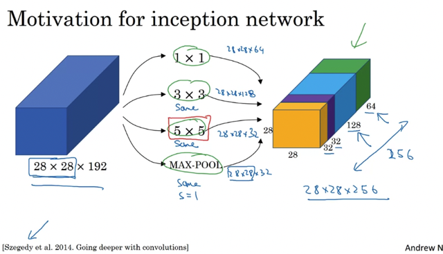</kbd>

> [!NOTE]
> Đại khái là khỏi phải suy nghĩ giữa chọn filter size là 1x1, hay 3x3, hay
> 5x5 rồi dùng **conv** hay **pool**, thì cứ dùng hết:
>
> 64 cái filter 1x1 ra cục xanh lá 28x28x64
> 128 cái filter 3x3 same padding -> 28x28x128
> 32 cái filter 5x5 same padding -> 28x28x32
> 32 cái max pooling -> 28x28x32
>
> Xong stack lại và để cho máy tính nó**\/tự quyết định sẽ dùng cái nào\/**

> [!NOTE]
> *Cái 1x1 ghi là 28x28x64 thì đương nhiên phải hiểu là
> **xài 64 cái filter có size 28x28x192.** Tương tự 128 cái
> filter 3x3x192 32 cái filter 5x5x192

 

<kbd>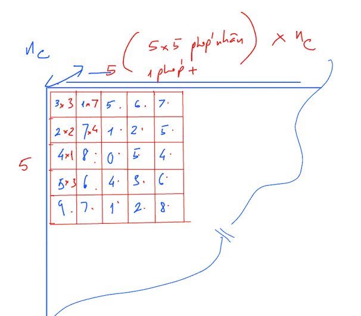</kbd>

<kbd>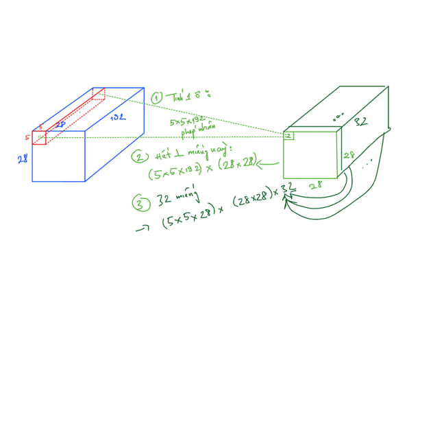</kbd>

<kbd></kbd>

<kbd></kbd>

<kbd>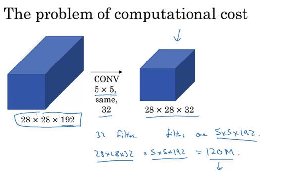</kbd>

> [!NOTE]
> Tại sao lại nhân 5x5x192 đã hiểu: Mỗi lần convol là nó tính 5x5 phép
> nhân rồi cộng lại - là cho 1 lớp, có nc lớp -> 5x5xnc phép nhân

 

<kbd>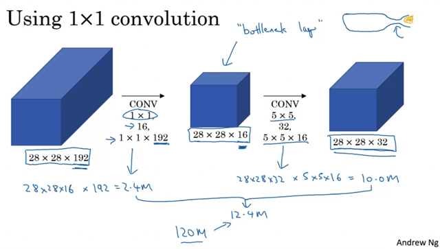</kbd>

> [!NOTE]
> Đại khái là bằng cách dùng 1x1 Convolution, số phép tính cần thiết giảm đi 1/10
>
> 28x28x192 - 32 cái filter 5x5 same padding -> **28x28x32: 120m params**
> thì nếu dùng 2 bước với 1x1 filter
>
> 28x28x192 - dùng 16 cái 1x1 -> 28x28x16 - dùng 32 cái 5x5 same padding -> **28x28x32: thì chỉ có 12m params**

 

## Inception Network

 

### 1 The inception module takes the activation from a previous layer as input

> [!NOTE]
> 1 The inception module takes the activation from a previous layer as input
> and **outputs multiple feature maps of different sizes.**
>
> 2 The inception network is made up of a **series of inception blocks**, which
> consist of **multiple inception modules** concatenated together.
>
> 3 The inception network **repeats these inception blocks** in different positions
> in the network.
>
> 4 The inception network also includes **additional side branches**, which **use
> hidden layers to make predictions** alongside the main output layer.
>
> 5 The side branches help to **ensure that the features computed are useful
> for making predictions**.

 

<kbd>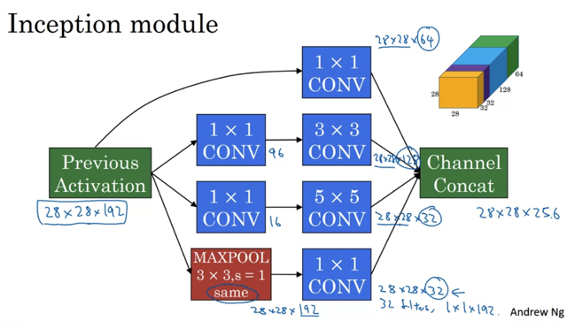</kbd>

> [!NOTE]
> Ứng dụng ý tưởng ở lecture trước, Inception module sử dụng đủ loại filter, chú ý là như đã nói, dùng 2 bước
> với 16 cái 1x1(x192) và 3x3(x16) gọi là bottle-neck layer thay vì 3x3(x192) same padding để giảm số params

   

<kbd>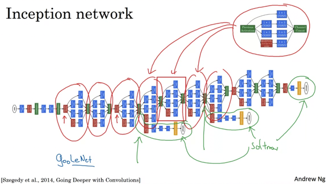</kbd>

> [!NOTE]
> Đại khái (Inception network) là nhiều Inception module
>
> Additional side branched: Dùng softmax tại các hidden layer, đại khái là
> cũng generate well predicting và giảm overfitting
>
> Term "Inception" đúng là đến từ phim Inception
>
> Cái trong hình dưới là GoogleNet

   

## Mobilenet

 

### 1 Introduction to **MobileNets**, a **convolutional neural network architecture** used for

> [!NOTE]
> 1 Introduction to **MobileNets**, a **convolutional neural network architecture** used for
> computer vision that can run on devices with **low computational power**.
>
> 2 Need for **MobileNets** as other neural networks are **computationally expensive.**
>
> 3 Explanation of the **normal convolution process** used in other neural networks.
>
> 4 **Computational cost** of normal convolution determined.
>
> 5 Introduction of **depthwise separable convolution** used in **MobileNets**.
>
> 6 Explanation of how the **depthwise convolution** works.
>
> 7 Calculation of the computational cost of depthwise convolution.

 

<kbd>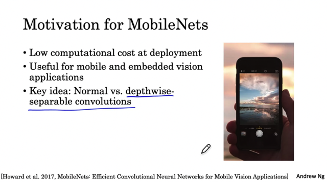</kbd>

   

<kbd>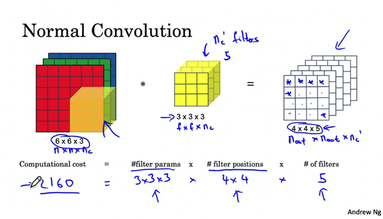</kbd>

> [!NOTE]
> Đại khái là tính lại xem Convolution thông
> thường cần bao nhiêu phép tính

> [!NOTE]
> Trong Normal Conv: Mỗi lần cái filter convol để tính ra 1 số cho 1
> dimension của output, nó tính cho từng dimension của input sau
> đó nó **cộng lại cho nên kết quả là chỉ còn 1 channel, nhưng có
> nc cái filter thì thành ra cục output có nc channel**6x6x3 -  1 filter 3x3x3 -> 4x4x**1** 
> x **5 cái** filter thành ra **4x4x5**

   

<kbd>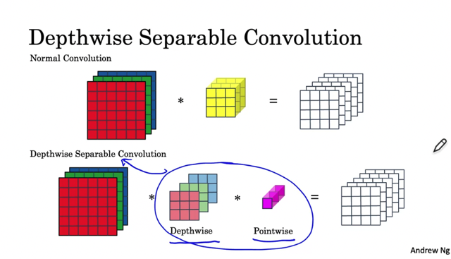</kbd>

> [!NOTE]
> Còn depthwise thì
> nó khác 1 chút

   

<kbd>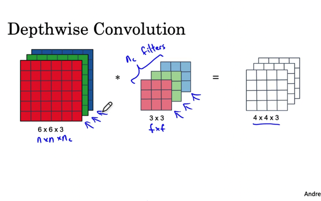</kbd>

> [!NOTE]
> **DepthWise** đại khái là ở mỗi lần filter convol nó sẽ tính riêng từng
> dimension, và không cộng lại để 'ép' lại thành 1 channel.

   

<kbd>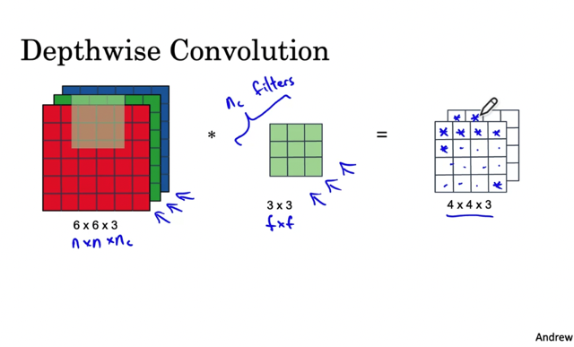</kbd>

<kbd>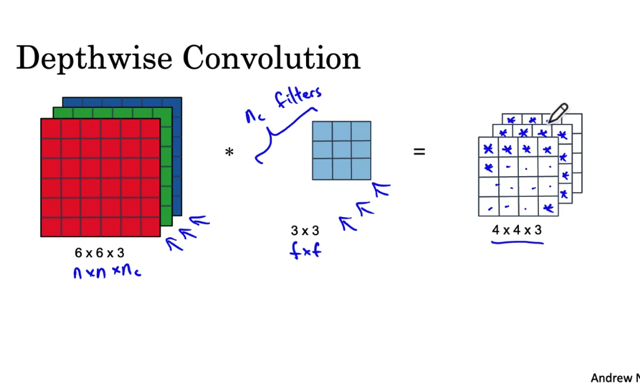</kbd>

<kbd></kbd>

<kbd></kbd>

<kbd>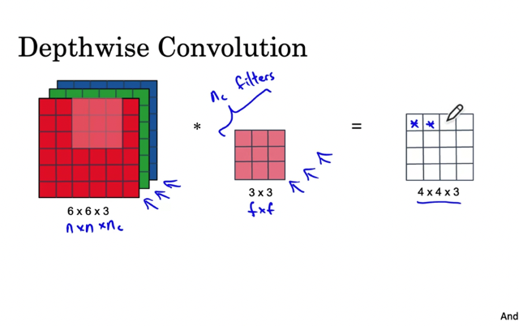</kbd>

   

<kbd>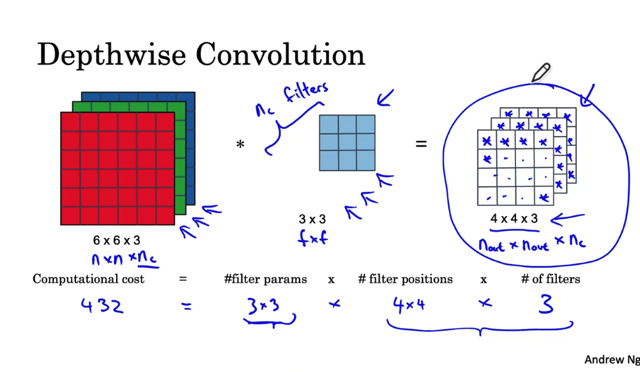</kbd>

> [!NOTE]
> Kết quả là sau khi convol với 1 filter nó
> vẫn giữ số channel của input (chứ không
> ép lại thành 1 channel)
>
> 6x6x**3** - 1 **(chỉ một)** filter 3x3x3 -> 4x4x**3**

   

<kbd>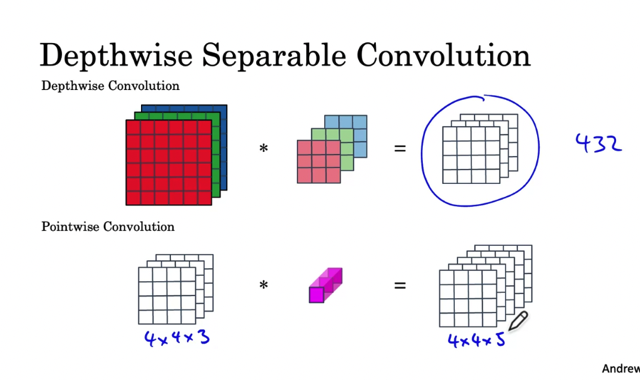</kbd>

> [!NOTE]
> Sau đó cái cục này được convol qua 5 cái
> 1x1x3 filter để thành ra **4x4x5** giống như
> output của normal convolution '

   

<kbd>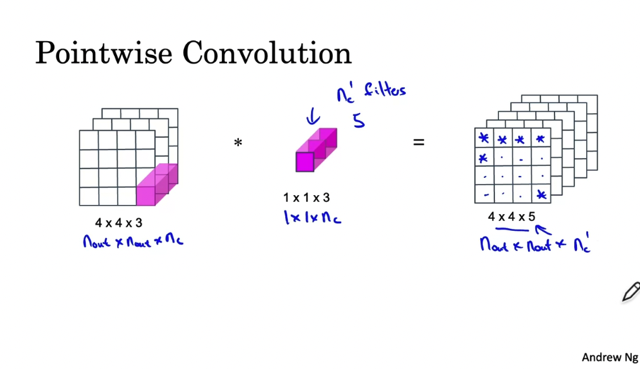</kbd>

<kbd>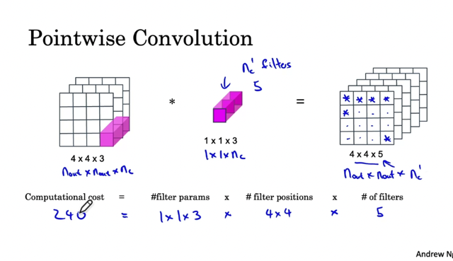</kbd>

<kbd></kbd>

<kbd></kbd>

<kbd>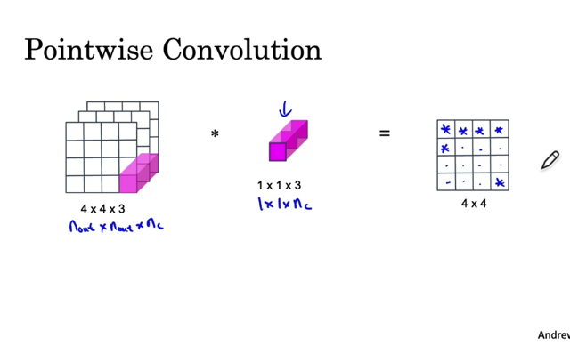</kbd>

   

<kbd>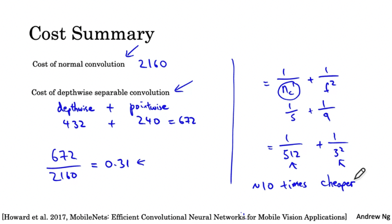</kbd>

> [!NOTE]
> Đại khái là cho thấy cùng là từ input 6x6x3 -> output 4x4x5 nhưng
> dùng **Depth-wise Separable Convolution** giúp giảm **~10x**computational expensive so với **normal convolution**

   

<kbd>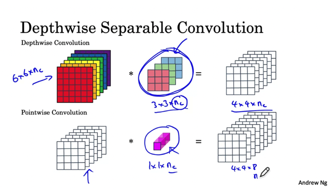</kbd>

> [!NOTE]
> Đại khái là ổng nói đúng ra là phải vẽ icon thành nhiều lớp hơn 3x3xnc
> nếu nc = 8 chẳng hạn phải vẽ thành 8 lớp nhưng quy ước cứ giữ icon
> như vậy cho gọn và mình tự hiểu là được

   

## Mobilenet Architecture

 

### Main ideas:  1 **MobileNet** is a neural network that uses a **depthwise**

> [!NOTE]
> Main ideas:  1 **MobileNet** is a neural network that uses a **depthwise**
> **separable** **convolutional operation** to **reduce computational cost.**
> 2 The **MobileNet v1** architecture uses a block comprising a **depthwise
> convolutional operation** and a **stack** of **13 layers** to make a
> **classification** prediction.
>
> 3 **MobileNet v2** is an **improvement** over the basic MobileNet
> architecture that **includes a residual connection** and an**expansion
> layer**before the **depthwise** convolution and the **pointwise** convolution.
>
> 4 MobileNet v2 repeats the block **17 times** and uses **pooling**,
> **fully-connected**, and **softmax layers** to make a classification prediction.
>
> 5 The MobileNet v2 **bottleneck block** **increases the size** of the
> representation within the block and **projects it back down to a smaller
> set of values**, **reducing the amount of memory** **needed** to store
> activations from layer to layer.

 

<kbd>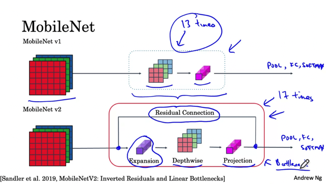</kbd>

   

<kbd>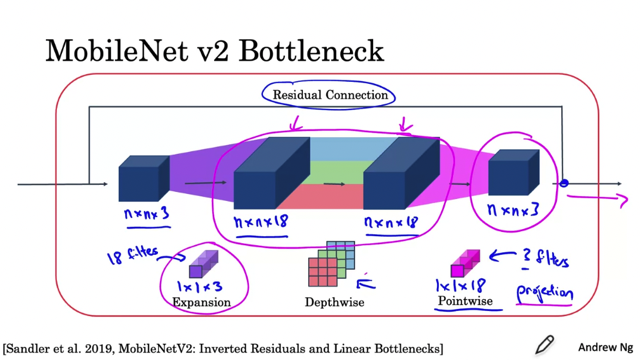</kbd>

> [!NOTE]
> Đại khái là nó expand ra để tính toán được nhiều feature hữu
> ích hơn, sau đó co lại để đáp ứng điều kiện dung lượng bộ nhớ
> hạn hẹp -> Tốt hơn MobileNet v1 mà vẫn đáp ứng bộ nhớ nhỏ
>
> Expand: nxnx3 - 18 cái filter 1x1x3 -> nxnx18
>
> Depth-wise: nxnx18 - 1 cái filter n_hxn_w x18 **depth-wise** -> nxn18
>
> (Khúc này có lẽ phải hiểu là dùng same padding để giữ size n
> và n_h, n_w ổng cũng không nói tới nhưng cũng không quan trọng)
>
> Projection: nxnx18 - 3 cái 1x1x18 -> nxn3

> [!NOTE]
> Đại khái như vậy là đủ hiểu
> MobileNet v2 rồi, muốn xem
> kĩ hơn để biết chi tiết thì đọc
> Paper của Sandler

> [!NOTE]
> Từ nxnx3 -> nxnx18 thì ta dùng 18 cái filter 1x1x3
>
> Còn từ nxnx18 về lại nxnx3 thì dùng 3 cái filter 1x1x18

   

## Efficientnet

 

### 1 The benefits of using **computationally efficient neural networks** like

> [!NOTE]
> 1 The benefits of using **computationally efficient neural networks** like
> MobileNet V1 and V2.
>
> 2 The **challenge** of adapting neural networks to **different devices** with
> varying **computational resources**.
>
> 3 The concept of **EfficientNet** and how it can be used to **scale up** **or
> down** neural networks based on a **device's computational budget**.
>
> 4 The three factors that can be adjusted to scale up or down neural
> networks:**image resolution**, network **depth**, and layer **width**.
>
> 5 The importance of **finding the right trade-off between image
> resolution, network depth, and layer width** to optimize neural network
> performance for a specific device.
>
> 6 The usefulness of **open source implementations of EfficientNet** for
> adapting neural network architectures to specific devices.

 

<kbd>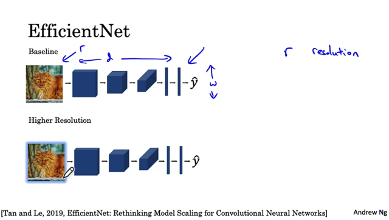</kbd>

> [!NOTE]
> Dùng higher resolution image

   

<kbd>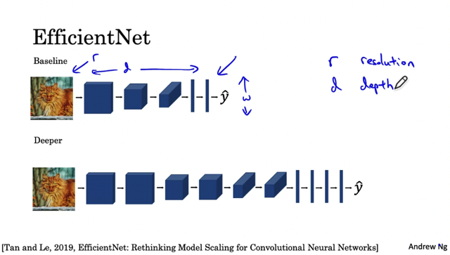</kbd>

> [!NOTE]
> Dùng deeper network

   

<kbd>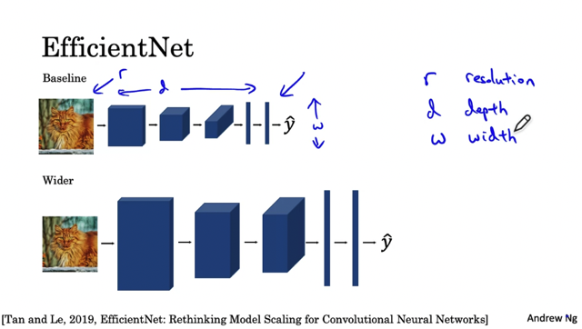</kbd>

> [!NOTE]
> Dùng wider network

   

<kbd>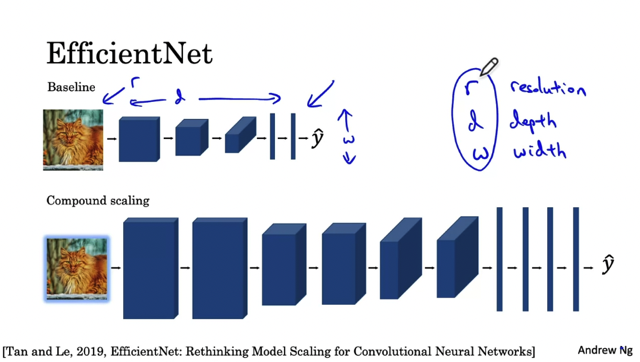</kbd>

> [!NOTE]
> Câu hỏi là: Với cụ thể 1 giới hạn về khả năng tính toán, làm
> sao để chọn được / quyết định được r, d, w? Hay nói cách
> khác là  scale cái nào lên và giữ nguyên cái nào hoặc scale
> cùng lúc cả 3 cái lên với tỉ lệ bao nhiêu? -> **Loot at
> OpenSource implementation of EfficientNet**

   

<kbd></kbd>

> [!NOTE]
> Build N.N for mobile devices, embedded devices

   

## Using Open-source

> [!NOTE]
> USING OPEN-SOURCE
> IMPLEMENTATION

 

### 1 **Practical advice** on using neural network and **ConvNet** **architectures**

> [!NOTE]
> 1 **Practical advice** on using neural network and **ConvNet** **architectures**
>
> 2 Importance of **open-source implementations** for **replicating** neural
> networks
>
> 3 **Difficulty** of replicating neural networks without **open-source
> implementations**
>
> 4 Benefits of using **open-source implementations**, such as **faster
> implementation and transfer learning**
>
> 5 Using **GitHub** to find open-source implementations

 

<kbd></kbd>

> [!NOTE]
> Đại khái là nên search (GitHub) và xài cái người ta làm

   

## Transfer Learning

 

### 1 **Pre-training** and**transfer learning** can help build computer vision

> [!NOTE]
> 1 **Pre-training** and**transfer learning** can help build computer vision
> applications faster.
>
> 2 Many **pre-trained models are available for download**, which have
> already been **trained on large public datasets**.
>
> 3 Using transfer learning, **pre-trained weights can be used as a starting
> point** for a new task.
>
> 4 **Frozen** **layers** in pre-trained models can be used to **extract features** that
> can be used for a new classification problem.
>
> 5 **Pre-computing features from frozen layers** can help speed up training
> with a small dataset.
>
> 6 **Fewer layers can be frozen** if there is a **larger labeled dataset** available.
>
> 7 If there is a **lot of data** available, **the whole pre-trained network can be
> used for training.**
>
> 8 There are different ways to initialize the last few layers of the network
> for the new classification problem.
>
> 9 The number of layers frozen and trained on top can be adjusted based
> on the available dataset size.

 

<kbd>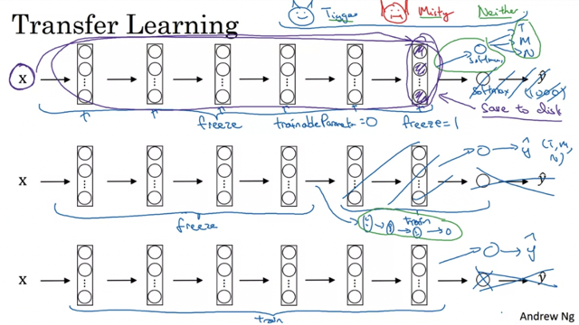</kbd>

> [!NOTE]
> Đại khái là:  Nếu có ít data, cứ giữ nguyên hidden layers, và train cái layer cuối
> thôi. **Precompute** đại khái là (từ feature x của mình **tính output của layer cuối
> trước với cái n.n của người ta - như 1 function**) để khi chạy G.D để training layer
> cuối của mình thì khỏi phải làm bước tính toán này (forward propagation)
>
> Nếu có nhiều data hơn thì freeze mấy layer đầu thôi, train mấy layer cuối thậm chi
> train lại hết, coi các weight đã train của họ như initialization

   

<kbd>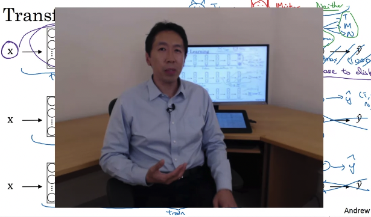</kbd>

> [!NOTE]
> Đại khái là ổng nói Transfer learning hầu như là cái phải
> làm, trừ khi mình có rất rất nhiều data thì mới làm từ
> đầu

   

## Data Augmentation

 

### 1 **Computer vision** task often **requires more data** to improve performance.

> [!NOTE]
> 1 **Computer vision** task often **requires more data** to improve performance.
>
> 2 **Data augmentation** is a **commonly used technique** to improve the
> performance of computer vision systems.
>
> 3 **Mirroring** and **random cropping** are frequently used data augmentation
> techniques.
>
> 4 **Color shifting** is another commonly used data augmentation technique.
>
> 5 The motivation behind color shifting is to make the learning algorithm
> more robust to changes in image color.
>
> 6 **PCA Color Augmentation** is a specific implementation of color shifting.
>
> 7 **Loading images from a hard disk using a CPU** thread is a common
> implementation of data augmentation in practice.

 

<kbd>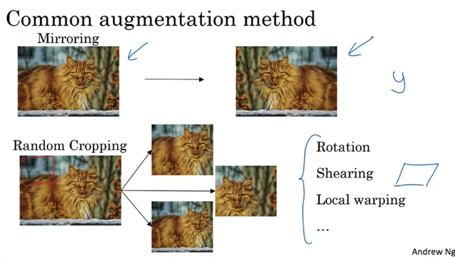</kbd>

   

<kbd>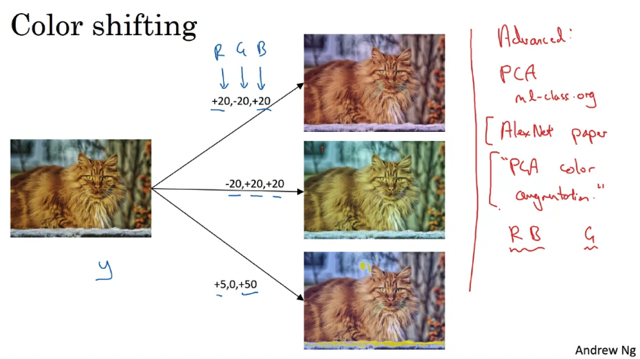</kbd>

   

<kbd>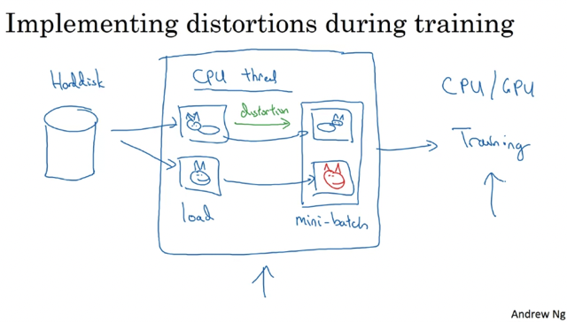</kbd>

   

## State Of Computer Vision

 

### 1 Deep learning has been successfully applied to various problems, including

> [!NOTE]
> 1 Deep learning has been successfully applied to various problems, including
> computer vision.
>
> 2 **Computer vision is a complex problem**, and **deep learning requires a large
> amount of data to achieve good performance.**
>
> 3 There is often a **trade-off** between the **amount of data available** and **the need
> for hand-engineering** in machine learning.
>
> 4 The computer vision literature has historically**relied more on
> hand-engineering**due to **limited data availability**, but with the **increase in data**
> sets, the **use of hand-engineering has decreased**.
>
> 5 **Object detection**, a subset of computer vision, has **smaller data sets** and
> therefore requires more **complex algorithms** and **specialized components.**
> 6 **Transfer learning** is a technique that can help in cases where there is **limited
> data.**
> 7 Researchers in computer vision are enthusiastic about **achieving high
> performance on standardized benchmark** data sets and competitions.

 

<kbd>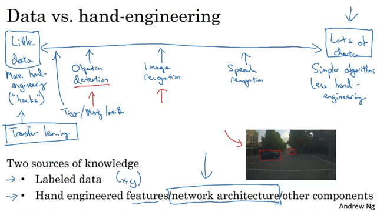</kbd>

   

<kbd>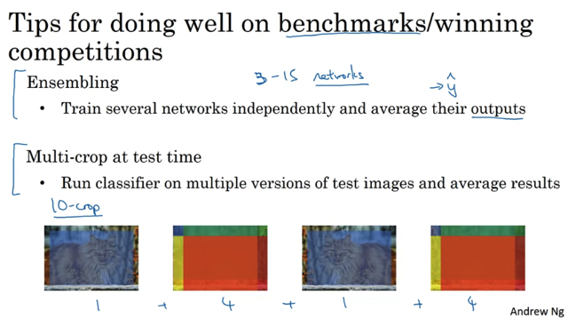</kbd>

   

<kbd>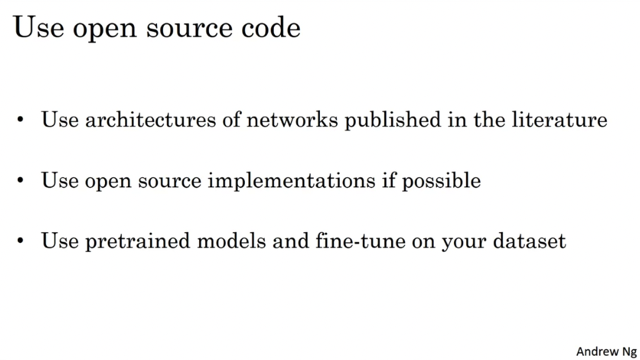</kbd>

   

## Quiz

 

<kbd>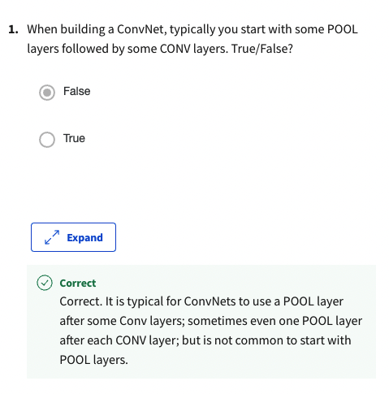</kbd>

 

<kbd>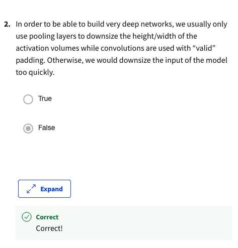</kbd>

 

<kbd>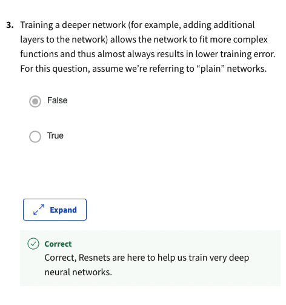</kbd>

 

<kbd>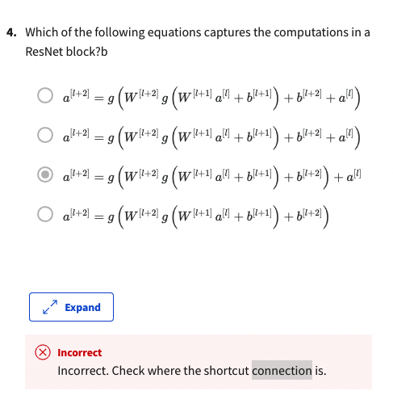</kbd>

> [!NOTE]
> a[l+2] = g(z[l+2] + a[l]) (a[l] bỏ trong activation
> function luôn)
>
> vì g hay dùng ReLU nên nếu z[l+2] = 0 thì a[l+2] =
> max(0, a[l]) = a[l]

 

<kbd>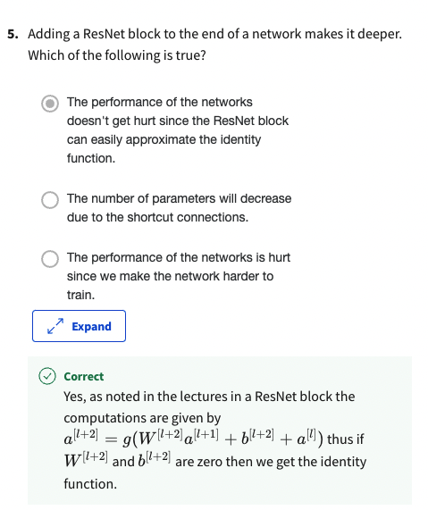</kbd>

 

<kbd>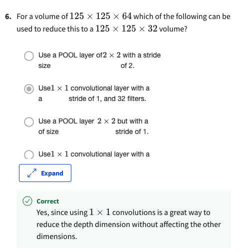</kbd>

 

<kbd>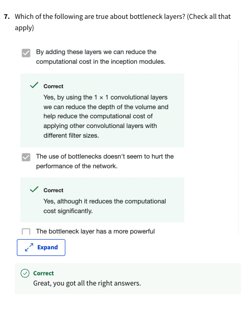</kbd>

 

<kbd>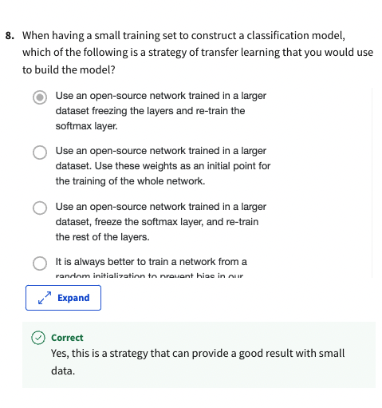</kbd>

 

<kbd>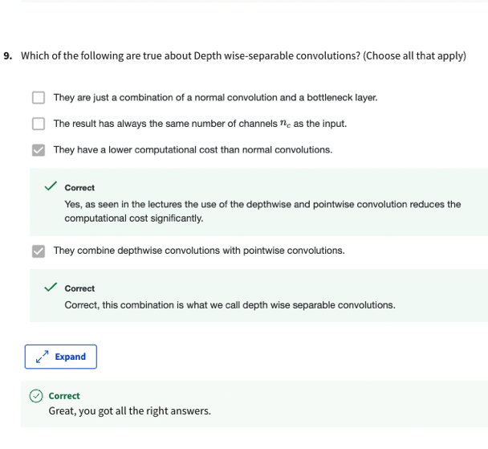</kbd>

 

<kbd>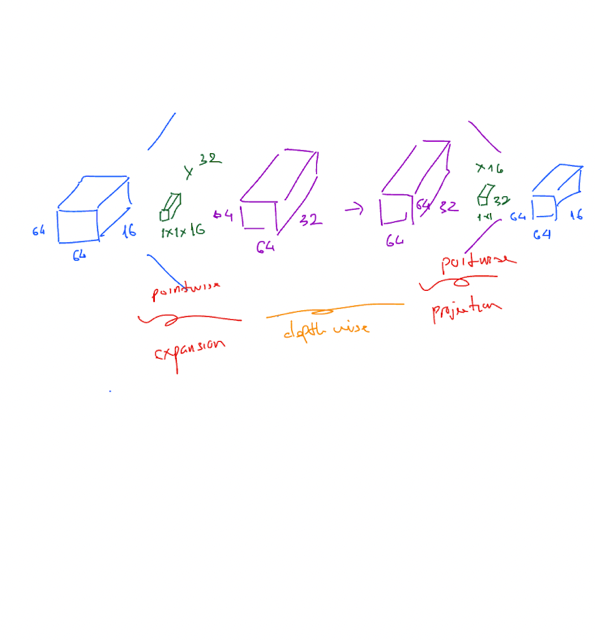</kbd>

<kbd></kbd>

<kbd>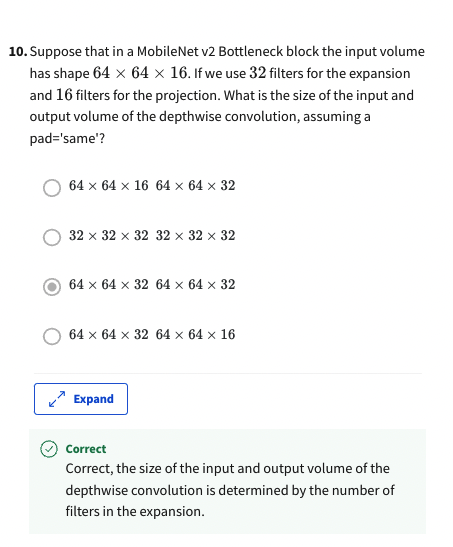</kbd>

 

## Programming Assignment: Residual Networks

 

### • Implement the basic building blocks of ResNets in a deep

> [!NOTE]
> • Implement the basic building blocks of ResNets in a deep
> neural network using Keras
>
> • Put together these building blocks to implement and train a
> state-of-the-art neural network for image classification
>
> • Implement a skip connection in your network
>
> For this assignment, you'll use Keras.

 

- Residual Networks
   

    
    
<kbd>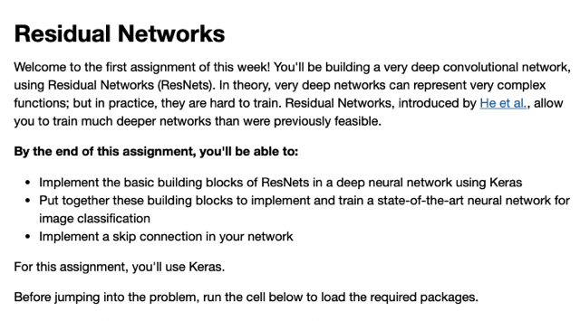</kbd>

     

- 1 - Packages
   

    
    
<kbd>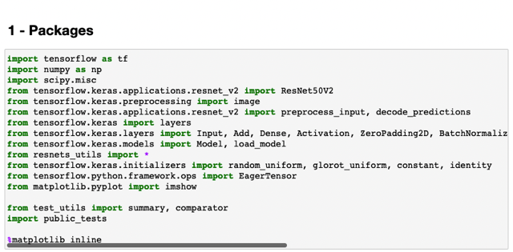</kbd>

     

- 2 - The Problem of Very Deep Neural Networks:  Đại khái là vấn đề Gradient Vanishing - params về 0 rất nhanh  khiến model stop learning Hoặc / Exploding - params trở nên rất lớn
   

    
    
<kbd>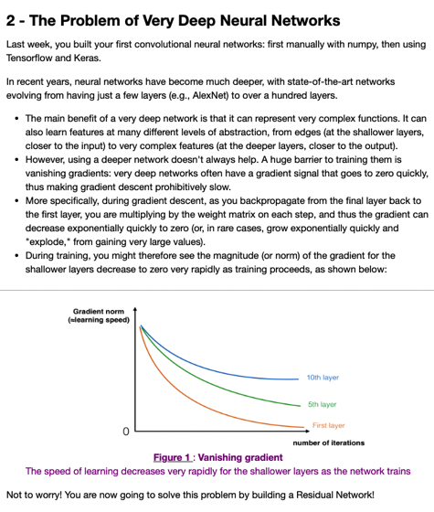</kbd>

     

- 3 - Building a Residual Network:  Nhắc lại rằng RestNet không những giúp giải quyết vấn đề Vanishing Gradient mà còn giúp tăng performance của network  Có hai loại block trong ResNet là **Identity** block và **Convolutional** block
   

    
    
<kbd>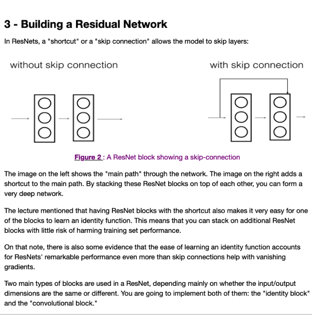</kbd>

     

- 3.1 - The Identity Block:  Đại khái là các step để tạo nên ResNet's identity block  Nói đến việc sẽ thêm 1 bước BatchNorm để tăng tốc training, chỉ cần  một dòng code với Keras.  Và trong bài này mình sẽ skip 2 layer chứ không phải 1 như trong lecture
> [!NOTE]
> Có cái vụ
> BatchNormalization
> chưa hiểu lắm

   

    
    
<kbd>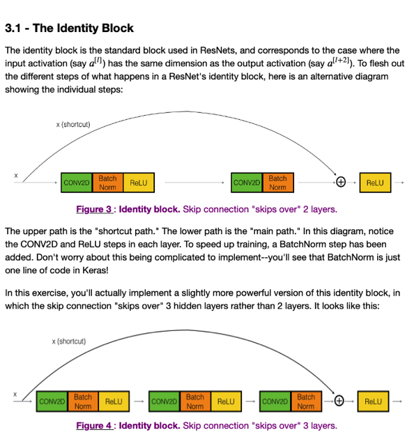</kbd>

     

    
    
<kbd>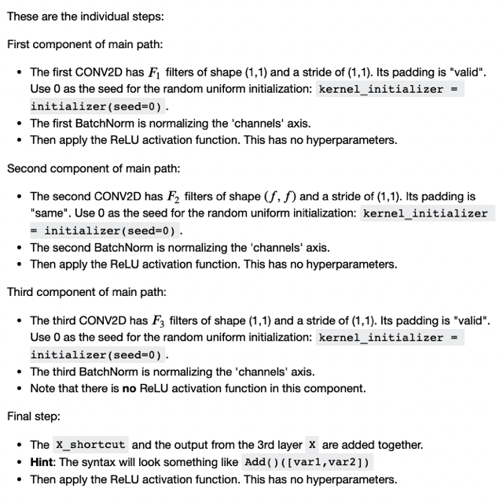</kbd>

     

- Exercise 1 - identity_block: Đại khái là làm theo gợi ý lần lượt khai báo các layer  Conv2D, BatchNorm, Activation (Relu),  Conv2D, BatchNorm, Activation (Relu)  Conv2D, BatchNorm, Add, Activation (Relu)  Với input thằng sau là ouput thằng trước từ đó X được update qua các layer.  Để ý thấy ở đây nó dùng keras.layer.Activation('relu') thay vì keras.layer. RELU()  như ở P.A tuần trước  Và thao tác '**Skip Connection**' được thực hiện bằng cách save X_shortcut và add  với X ở layer **Add**
   

    
    
<kbd>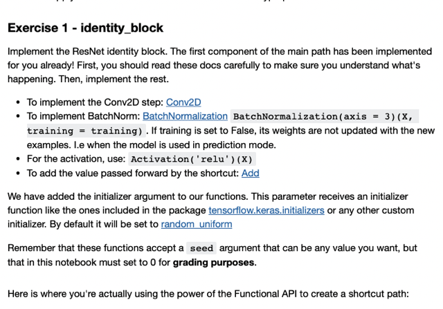</kbd>

     

    
    
<kbd>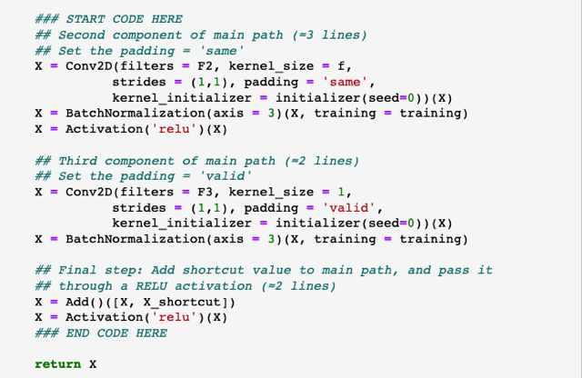</kbd>

    
<kbd></kbd>

    
<kbd>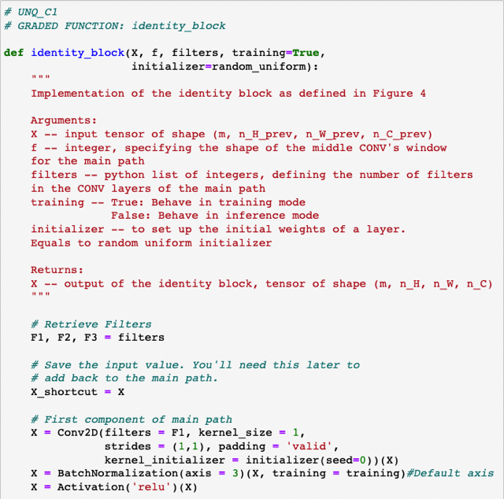</kbd>

     

    
    
<kbd>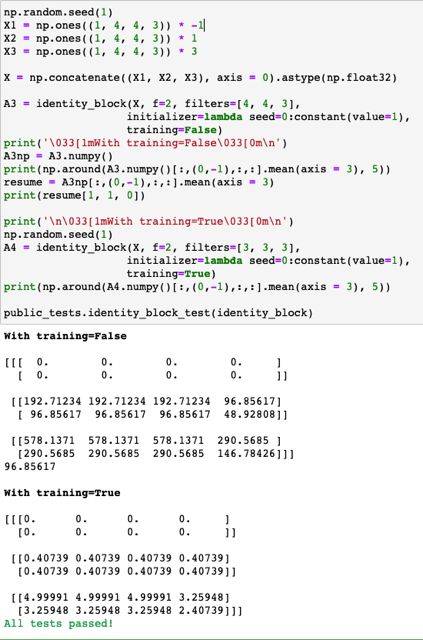</kbd>

     

- 3.2 - The Convolutional Block:  Đại khái là cái này chỉ khác cái identity block ở chỗ nó có thêm bước dùng Conv2D để resize X_shortcut nhằm để X và X_shortcut cùng size cho bước Add, bước này đóng vai trò như \\/**Ws**\\/ trong lecture nói tới.  Nói tới đại khái là không áp dụng Activation function vì mục đích chỉ là resize thôi  Để ý thấy cho X và X_shortcut cùng size thì ở Conv2D cho layer thứ 3 và cho shortcut phải cùng số lượng filter
> [!NOTE]
> Có cái vụ Glorot uniform
> seed là không hiểu

   

    
    
<kbd>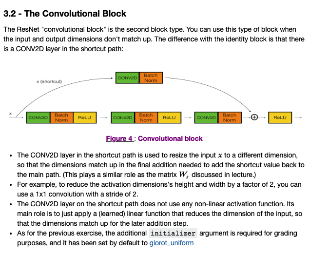</kbd>

     

    
    
<kbd>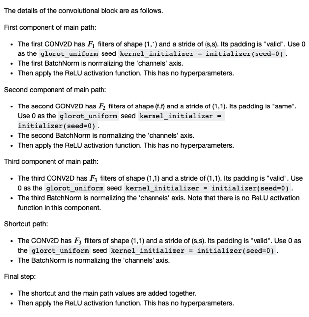</kbd>

     

- Exercise 2 - convolutional_block  Đại khái là làm theo gợi ý lần lượt khai báo các layer  Conv2D, BatchNorm, Activation (Relu),  Conv2D, BatchNorm, Activation (Relu)  Conv2D, BatchNorm, Add, Activation (Relu)  Với input thằng sau là ouput thằng trước từ đó X được update qua các layer.  Chỉ có thêm cái Conv và Batch cho Shortcut với filter là F3
   

    
    
<kbd>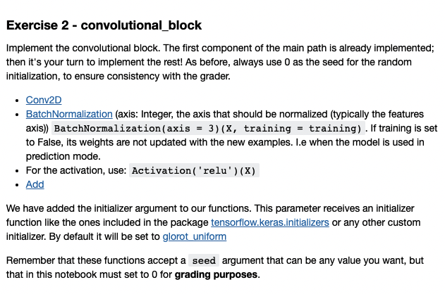</kbd>

     

    
    
<kbd>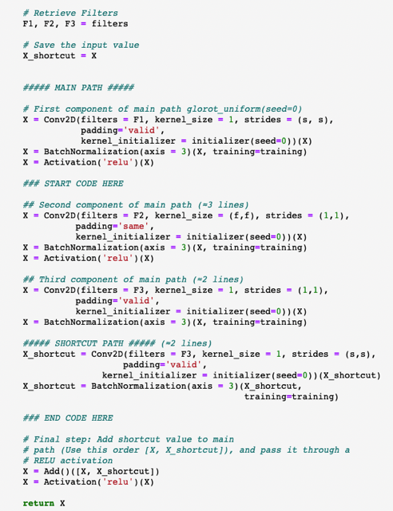</kbd>

    
<kbd></kbd>

    
<kbd>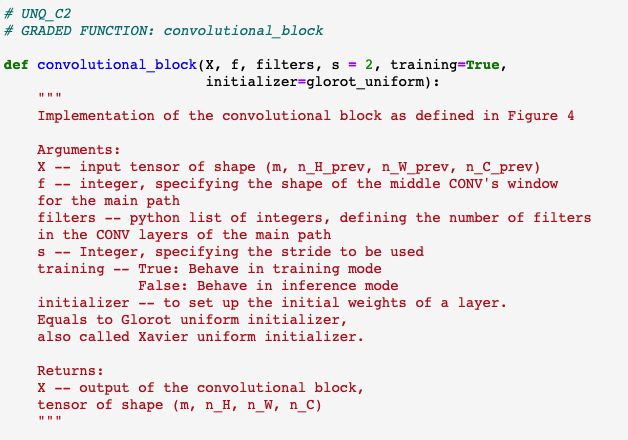</kbd>

     

    
    
<kbd>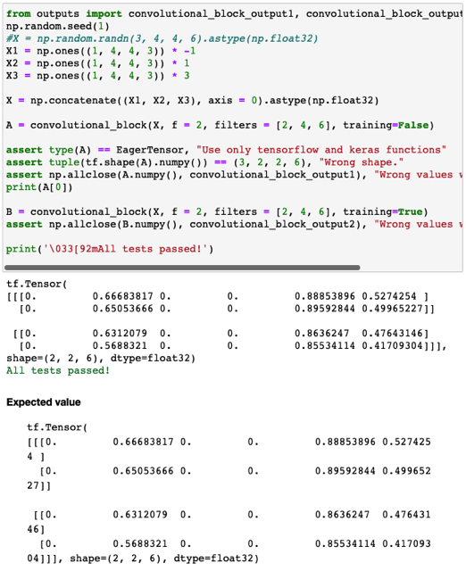</kbd>

     

- 4 - Building Your First ResNet Model (50 layers)  Đại khái là dùng các function ở trên để tạo một network  **so deep**có 50 layers (?!) có kiến trúc như hình
   

    
    
<kbd>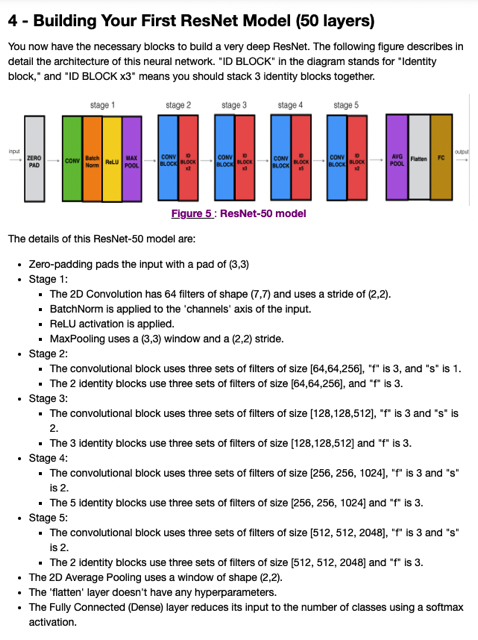</kbd>

     

- Exercise 3 - ResNet50  Đại khái là cũng lần lượt define từng layer theo kiến trúc của network define trong sơ đồ.  Và cuối cùng tạo model: model = Model(inputs = X_input, outputs = X)
   

    
    
<kbd>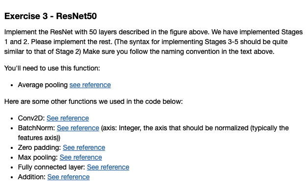</kbd>

     

    
    
<kbd>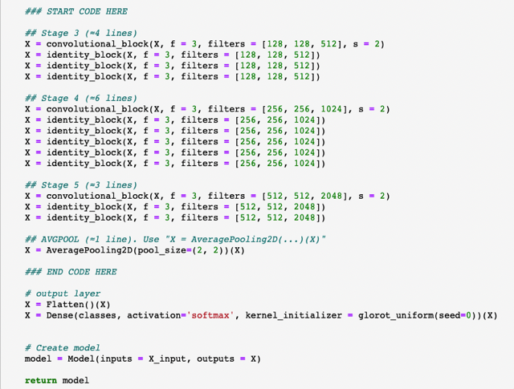</kbd>

    
<kbd></kbd>

    
<kbd>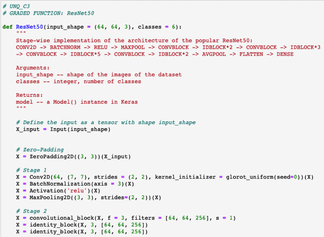</kbd>

     

    
    
<kbd>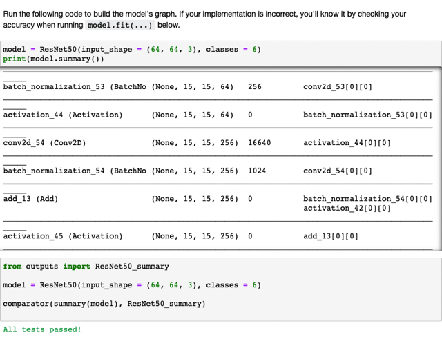</kbd>

     

- Compile và Load Data   Dùng **Adam** optimizers,  **categorical_crossentropy** loss function,  Metrics dùng **accuracy**Data là bộ**hand-sign data** bữa trước
   

    
    
<kbd>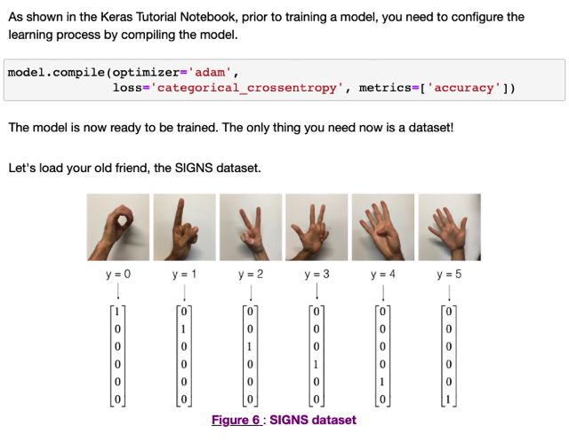</kbd>

     

    
    
<kbd>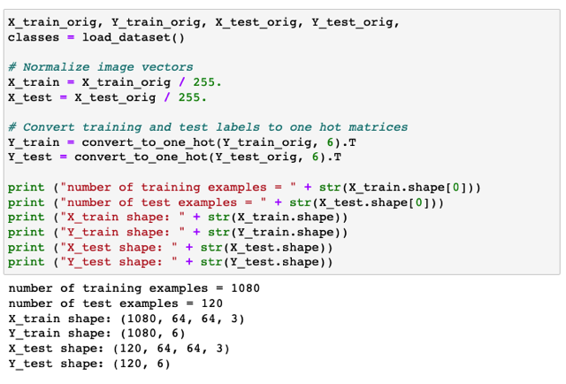</kbd>

     

- ..và train model dùng 10 epochs, batch size = 32
   

    
    
<kbd>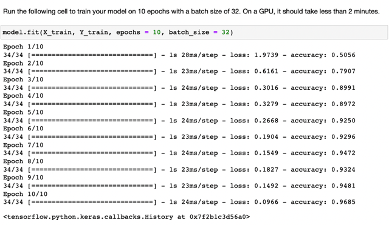</kbd>

     

    
    
<kbd>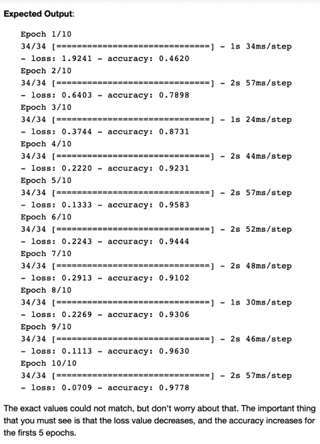</kbd>

     

    
    
<kbd>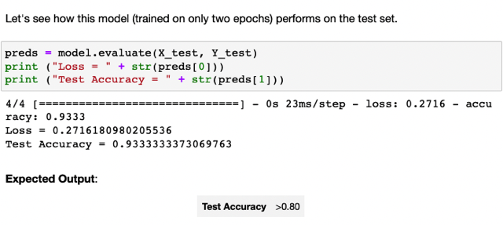</kbd>

     

- Submit và load pretrain model: Đại khái là ổng kêu thích thì train lại với nhiều  epoch hơn và load về cái model đã được train bằng GPU để chạy thử xem accuracy bao nhiêu.  **What you should remember**:  • Very deep "plain" networks don't work in practice because vanishing gradients make them hard to train.  • Skip connections help address the Vanishing Gradient problem. They also make it easy for a ResNet block to learn an identity function.  • There are two main types of blocks: The **identity block** and the **convolutional block**.  • Very deep Residual Networks are built by stacking these blocks together.
> [!NOTE]
> State of the art: HIện đại nhất. Ý là
> dùng cái này là hiện đại nhất rồi

   

    
    
<kbd>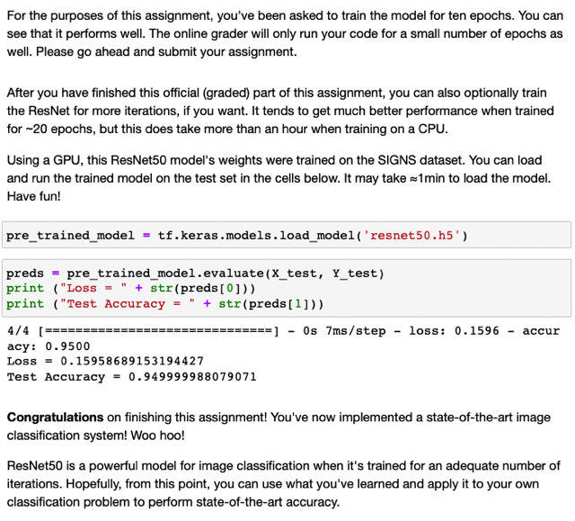</kbd>

     

    
    
<kbd>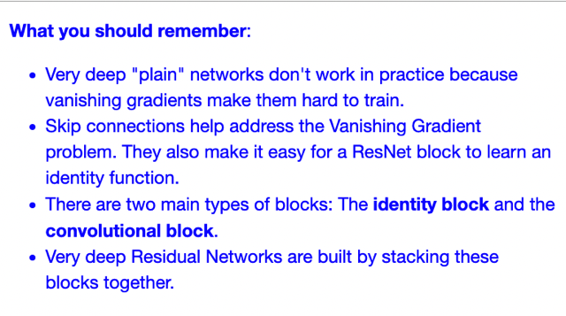</kbd>

     

- 5 - Test on Your Own Image (Optional/Ungraded)  Dùng hình tự chụp để test thử thấy hình như không đúng. Ổng có hỏi là h thử nghĩ xem tại sao ?  Có thể liên quan đến 'distribution' Hình dùng để train là trên mạng, còn đây là hình tự  chụp dẫn đến training set và production set bị khác distribution  Giải pháp là gì? Xem lại Course 3
> [!NOTE]
> Giải pháp là gì -> Xem lại course 3

   

    
    
<kbd>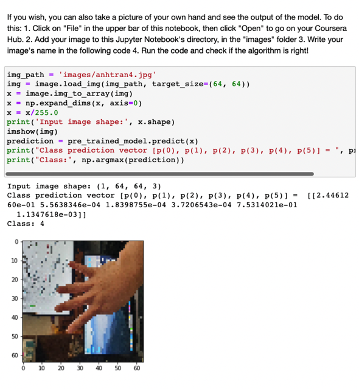</kbd>

     

    
    
<kbd>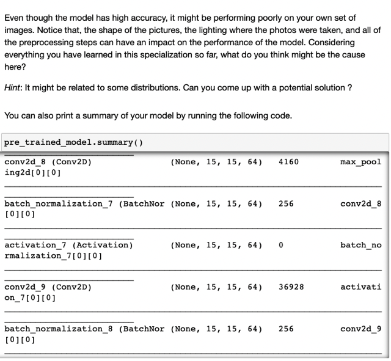</kbd>

     

- 6 - Bibliography  This notebook presents the ResNet algorithm from He et al. (2015).  The implementation here also took significant inspiration and follows the structure given in the GitHub repository of Francois Chollet:  • Kaiming He, Xiangyu Zhang, Shaoqing Ren, Jian Sun - \\_Deep Residual Learning for Image Recognition (2015) \\_  • Francois Chollet's GitHub repository: \\_https://github. com/fchollet/deep-learning-models/blob/master/resnet50. py\\_
   

## Programming Assignment: Transfer Learning With Mobilenet

 

### Welcome to this week's assignment, where you'll be using transfer

> [!NOTE]
> Welcome to this week's assignment, where you'll be using transfer
> learning on a pre-trained CNN to build an Alpaca/Not Alpaca
> classifier! A pre-trained model is a network that's already been trained
> on a large dataset and saved, which allows you to use it to customize
> your own model cheaply and efficiently. The one you'll be using,
> MobileNetV2, was designed to provide fast and computationally
> efficient performance. It's been pre-trained on ImageNet, a dataset
> containing over 14 million images and 1000 classes. By the end of
> this assignment, you will be able to:
>
> • \\/Create a dataset\\/ from a directory
>
> • \\/Preprocess and augment data using the Sequential API\\/
>
> • Adapt a \\/pretrained model to new data\\/ and train a classifier using
> the Functional API and \\/MobileNet\\/
>
> • Fine-tune a classifier's final layers to improve accuracy

<kbd></kbd>

 

- 1 - Packages
   

    
    
<kbd>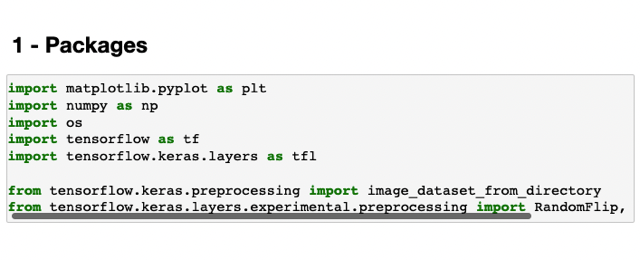</kbd>

     

- 1.1 Create the Dataset and Split it into Training and Validation Sets  Đại khái là dùng \\/**image_dataset_from_directory**() của Keras để **load image từ  thư mục** \\/chỉ định, return một **TensorFlow Dataset**, quy định sẵn batch size, size để nó Resize image, tỉ lệ phân chia và tên các gói để phân chia.
   

    
    
<kbd>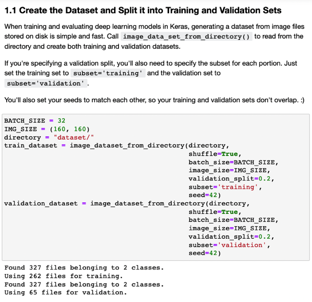</kbd>

    > [!NOTE]
    > This code block is for loading image data from a directory and splitting it into training and
    > validation datasets. It uses the **image_dataset_from_directory**() function **from the
    > TensorFlow library**, which **creates a TensorFlow dataset** from image files located in a
    > directory.
    >
    > The following are the explanations of the parameters used:
    >
    > • **BATCH_SIZE**: It defines the number of images to be processed in a single batch. Here,
    > the batch size is set to 32, meaning that 32 images will be processed at a time.
    >
    > • **IMG_SIZE**: It is a tuple containing the height and width of the image. **The images will be**
    > **resized to this size** before being used in the model. Here, the image size is set to (160,
    > 160).
    >
    > • **directory**: It specifies the directory containing the image files.
    >
    > • **shuffle**: It determines whether the dataset should be shuffled before each epoch. Here, it is
    > set to True, which means the dataset will be shuffled.
    >
    > • **validation_split**: It is the fraction of the data to be used for validation. Here, 20% of the data
    > is used for validation and 80% for training.
    >
    > • **subset**: It specifies whether the dataset to be created is for training or validation. Here, the
    > training subset is used for creating the training dataset, and the validation subset is used for
    > creating the validation dataset.
    >
    > • **seed**: It is used to seed the random number generator. Here, it is set to 42 for
    > reproducibility.
    >
    > The image_dataset_from_directory() function returns a TensorFlow dataset that can be
    > used for training a machine learning model. In this code block, two datasets are created:
    > train_dataset and validation_dataset, each containing images for training and validation
    > respectively.

     

    
    
<kbd>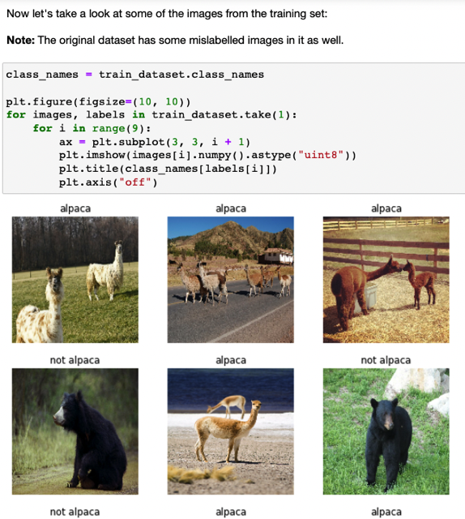</kbd>

    > [!NOTE]
    > Có một số hình bị sai

     

- 2 - Preprocess and Augment Training Data:  Đại khái là nói về \\/**prefetch()**\\/ data đã từng dùng ở assignment  trước để kiểu như chuẩn bị để khi chạy G.D luôn có sẵn data. Lợi hại hơn nữa là nó có thể tối ưu số lượng data chuẩn bị sẵn giùm mình luôn bằng cách để \\/buffer_size = AUTOTUNE.  Lợi hại hơn nữa là nó có thể làm cái vụ Data Augmentation nữa\\/
   

    
    
<kbd>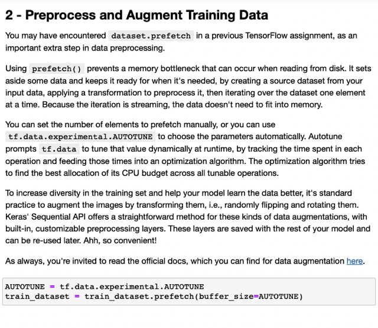</kbd>

     

- Exercise 1 - data_augmenter:  Đại khái đơn giản là khởi tạo 1 Sequential và bỏ vào 2 layer: RandomFlip và RandomRotation  data_augmentation = tf.keras.Sequential() data_augmentation.add(RandomFlip('horizontal')) data_augmentation.add(RandomRotation(0.2))  Sau đó xài thử trên một image xem chơi
   

    
    
<kbd>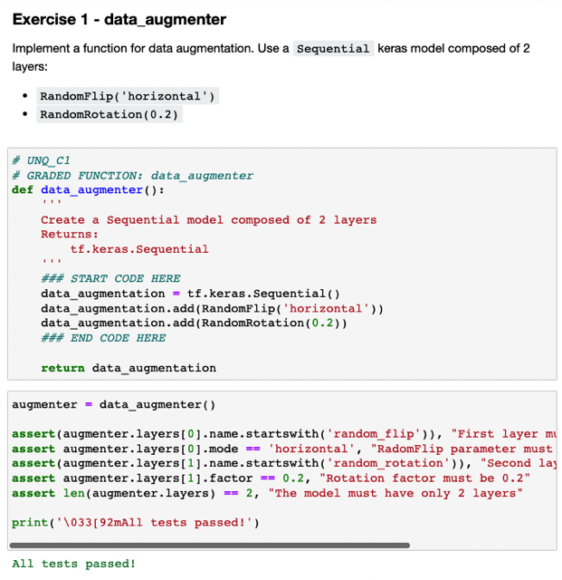</kbd>

     

    
    
<kbd>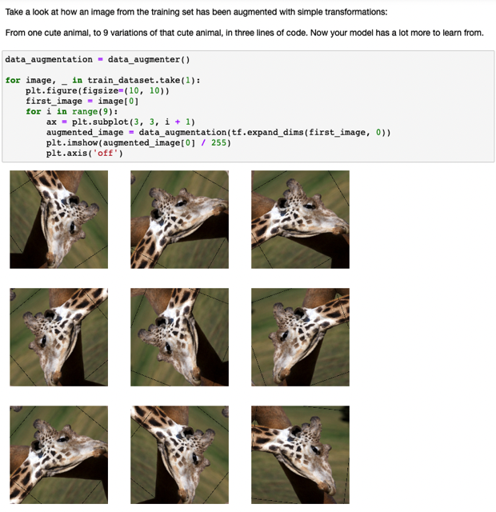</kbd>

     

- **What you should remember:**  • When calling \\/image_data_set_from_directory\\/(), specify the train/val subsets and match the seeds to prevent overlap  • Use \\/prefetch\\/() to prevent memory bottlenecks when reading from disk  • Give your model more to learn from with simple data \\/augmentations\\/ like rotation and flipping.  • When using a pretrained model, it's best to \\/reuse the weights\\/ it was trained on.
   

    
    
<kbd>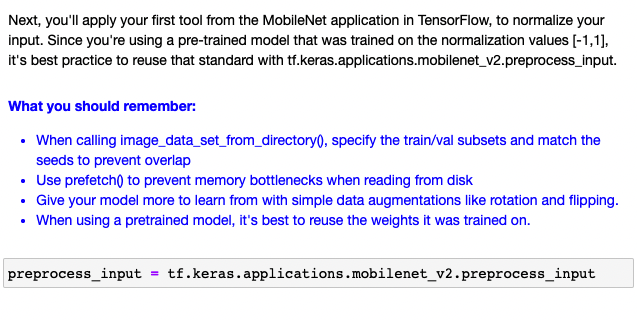</kbd>

    > [!NOTE]
    > Dùng lại preprocess_input???

     

- 3 - Using MobileNetV2 for Transfer Learning
   

    
    
<kbd>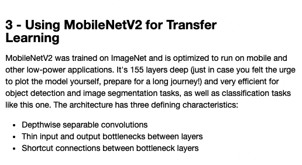</kbd>

     

- 3.1 - Inside a MobileNetV2 Convolutional Building Block
   

  
  - Đại khái là nói lại về MobileNet v2 building block
     

      
      
<kbd>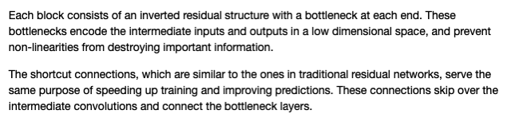</kbd>

      
<kbd></kbd>

      
<kbd>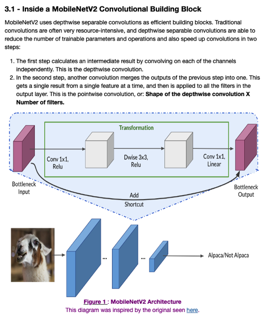</kbd>

      > [!NOTE]
      > Đại khái là nói lại về MobileNet v2 building block

       

      
      
<kbd></kbd>

       

      
      
<kbd></kbd>

      > [!NOTE]
      > Đại khái là nó expand ra để tính toán được nhiều feature hữu
      > ích hơn, sau đó co lại để đáp ứng điều kiện dung lượng bộ nhớ
      > hạn hẹp -> Tốt hơn MobileNet v1 mà vẫn đáp ứng bộ nhớ nhỏ

      > [!NOTE]
      > Đại khái như vậy là đủ hiểu
      > MobileNet v2 rồi, muốn xem
      > kĩ hơn để biết chi tiết thì đọc
      > Paper của Sandler

      > [!NOTE]
      > Từ nxnx3 -> nxnx18 thì ta dùng 18 cái filter 1x1x3
      >
      > Còn từ nxnx18 về lại nxnx3 thì dùng 3 cái filter 1x1x18

       

  
  - Đại khái là nó dùng lại cái MobileNet v2, \\/include_top\\/ = True tức là giữ nguyên layer cuối (Softmax), và weights đã được pretrained  Summary xem thì nhận thấy :  Đại khái là cấu trúc 1 Bottleneck layer thường sẽ như vầy  -> Expand Conv - Expand BN - Expand Relu Depthwise - Depthwise BN - Depthwise Relu Project Conv - Project BN - Add (Skip connection) ->
     

      
      
<kbd>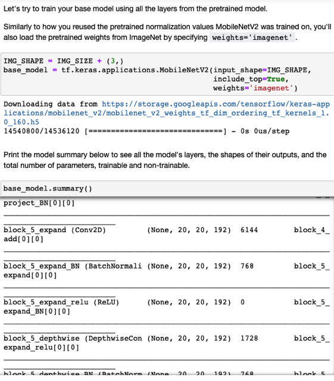</kbd>

      > [!NOTE]
      > Đại khái là nó dùng lại cái MobileNet v2,
      > include_top = True tức là giữ nguyên layer cuối
      > (Softmax), và weights đã được pretrained

      > [!NOTE]
      > Chưa hiểu IMAGE_SHAPE = IMG_SIZE + (3,) là sao

       

      
      
<kbd>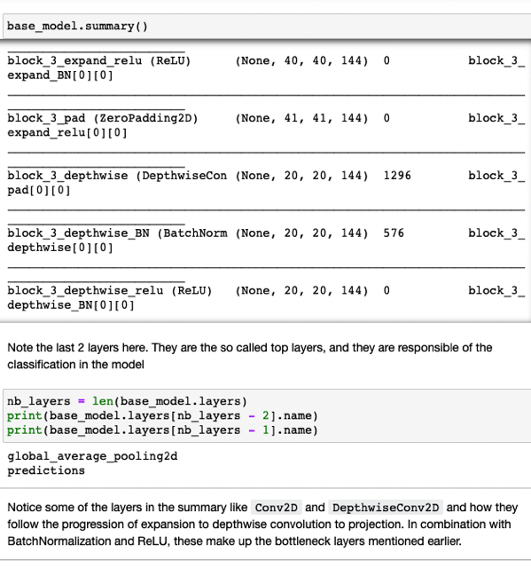</kbd>

      > [!NOTE]
      > Đại khái là cấu trúc 1 Bottleneck layer thường sẽ như vầy
      >
      > -> Expand Conv - Expand BN - Expand Relu
      > Depthwise - Depthwise BN - Depthwise Relu
      > Project Conv - Project BN - Add (Skip connection) ->

       

- What you should remember:  MobileNetV2's unique features are:  Depthwise separable convolutions that provide lightweight feature filtering and creation Input and output bottlenecks that preserve important information on either end of the block  Depthwise separable convolutions deal with both spatial and depth (number of channels) dimensions
   

- Đại khái là Xem thử performance của cái pretrain network rao sao trên 1 batch data  Kết quả không tốt do pretrain data không có alpaca, nên việc tiếp theo là bỏ layer cuối (top layer) mà train lại layer cuối
   

    
    
<kbd>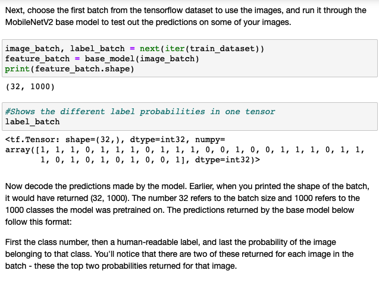</kbd>

    > [!NOTE]
    > Đại khái là lấy 1 batch data (32 cái) ra và nói về cái format của kết
    > quả, trả về 2 con số probability cao nhất ứng với khả năng của 1
    > hình thuộc về 2 loại

     

    
    
<kbd>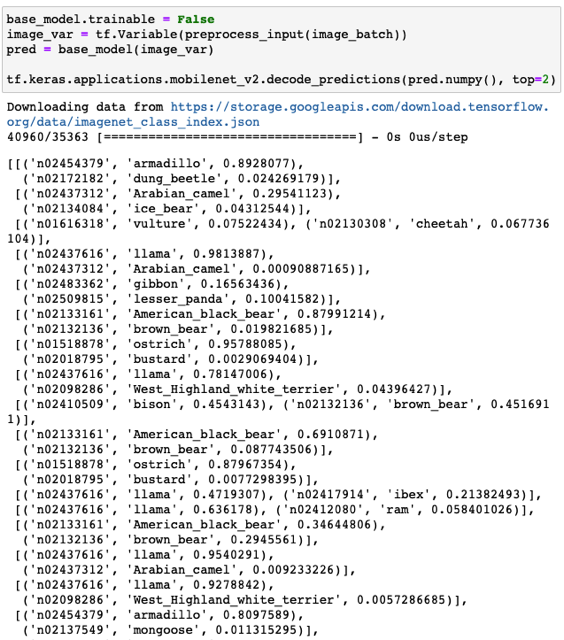</kbd>

     

    
    
<kbd>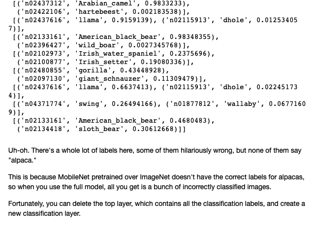</kbd>

    > [!NOTE]
    > Đại khái là kết quả không tốt do pretrain data không có alpaca, nên
    > việc tiếp theo là bỏ layer cuối (top layer) mà train lại layer cuối

     

- 3.2 - Layer Freezing with the Functional API  Đại khái ta sẽ bỏ layer cuối và đóng băng (freez) cái pretrain network  đơn giản bằng cách set params \\/include_top = false và , model.trainable = false  Sau đó add 1 layer và train nó.\\/
   

    
    
<kbd>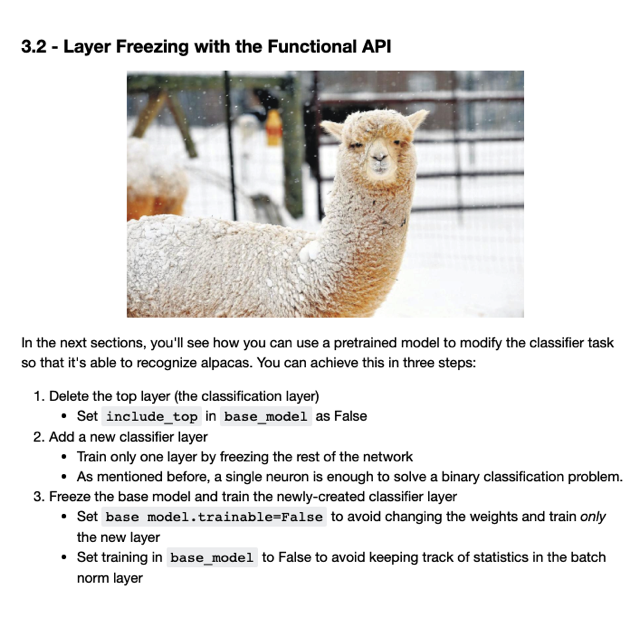</kbd>

     

- Exercise 2 - alpaca_model:  Theo gợi ý lần lượt define model mới, dùng lại Pretrain model  Add thêm layer cuối với GlobalAveragePooling2D, Dropout, và Dense với 1 unit  Chỉ chưa hiểu tại sao layer cuối dùng Linear mà ko phải sigmoid
   

    
    
<kbd>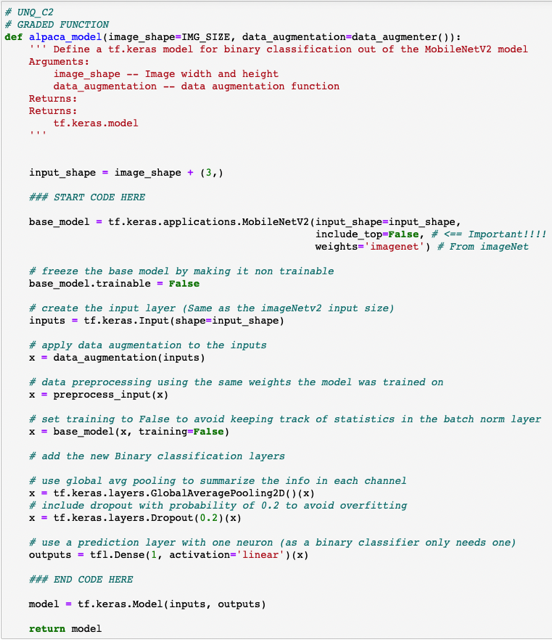</kbd>

    > [!NOTE]
    > Tại sao lại Linear ở cuối mà ko phải Sigmoid

     

    
    
<kbd>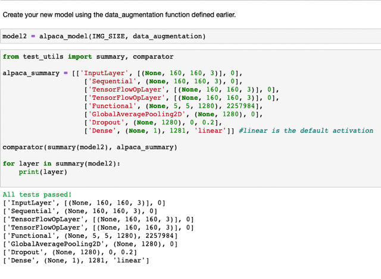</kbd>

     

- Compile & train model: Adam optimizer, BinaryCrossentropy loss function, accuracy
   

    
    
<kbd>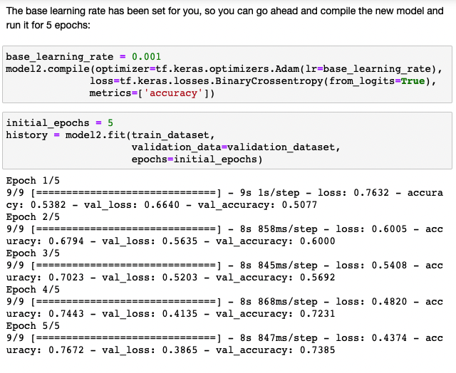</kbd>

     

    
    
<kbd>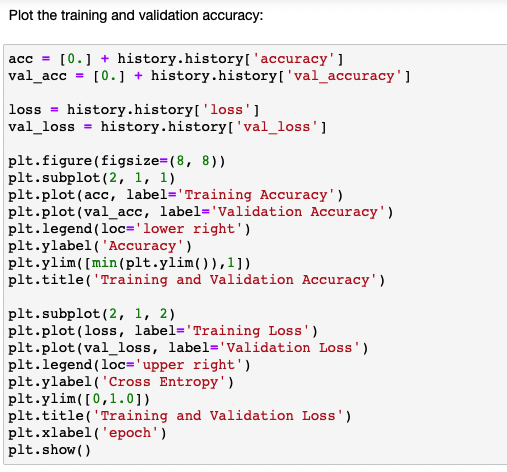</kbd>

     

    
    
<kbd>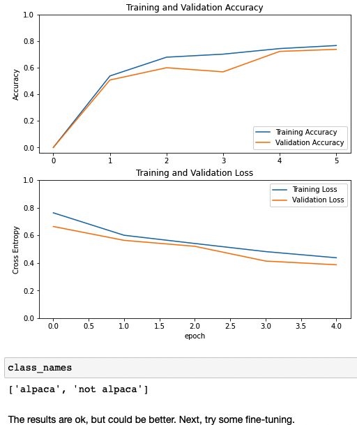</kbd>

     

- 3.3 - Fine-tuning the Model:  Đại khái là gỡ băng 1 số layer cuối (bao nhiêu thì tuỳ nên phải thử) để nó train các 'high feature' với data của con alpaca, giữ nguyên các  'low feature'
   

    
    
<kbd>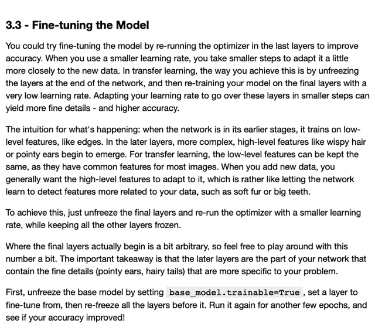</kbd>

     

- Exercise 3:  Đại khái là lấy base_model ra (model2. layers[4]) sửa lại một chút như unfreez từ layer số 120 trở đi
   

    
    
<kbd>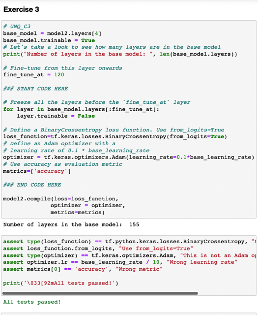</kbd>

    > [!NOTE]
    > tại sao model2.layers[4] ???

     

    
    
<kbd>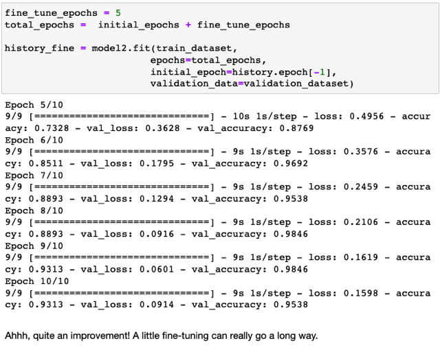</kbd>

    > [!NOTE]
    > Tốt hơn hẳn, validation_acc: 95%

     

    
    
<kbd>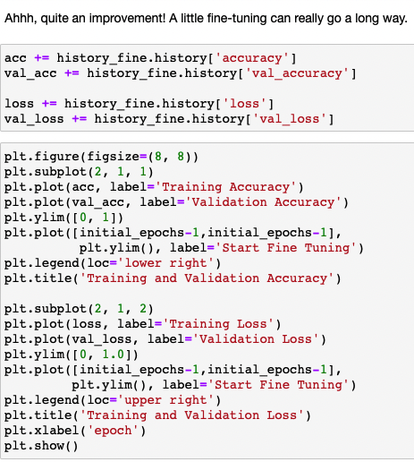</kbd>

     

    
    
<kbd>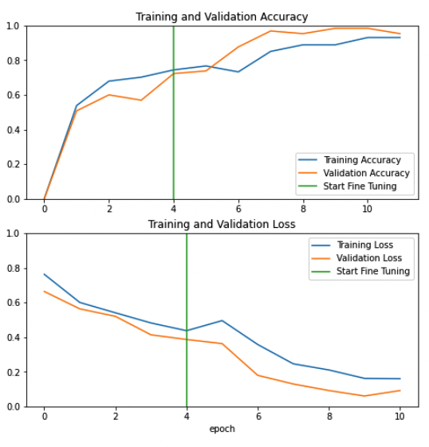</kbd>

     

- **What you should remember**:  • To adapt the classifier to new data: Delete the top layer, add a new classification layer, and train only on that layer  • When freezing layers, avoid keeping track of statistics (like in the batch normalization layer)  • Fine-tune the final layers of your model to capture high-level details near the end of the network and potentially improve accuracy  **Congratulations!**You've completed this assignment on transfer learning and fine-tuning. Here's a quick recap of all you just accomplished:  • Created a dataset from a directory  • Augmented data with the Sequential API  • Adapted a pretrained model to new data with the Functional API and MobileNetV2  • Fine-tuned the classifier's final layers and boosted the model's accuracy
   

