# C5w1_recurrent Neural Networks

📊 **Progress:** `67` Notes | `187` Screenshots

---

**Learning Objectives**
 • Define notation for building sequence models
 • Describe the architecture of a basic RNN
 • Identify the main components of an LSTM
 • Implement backpropagation through time for a basic RNN and an LSTM
 • Give examples of several types of RNN
 • Build a character-level text generation model using an RNN
 • Store text data for processing using an RNN
 • Sample novel sequences in an RNN
 • Explain the vanishing/exploding gradient problem in RNNs
 • Apply gradient clipping as a solution for exploding gradients
 • Describe the architecture of a GRU
 • Use a bidirectional RNN to take information from two points of a sequence
 • Stack multiple RNNs on top of each other to create a deep RNN
 • Use the flexible Functional API to create complex models
 • Generate your own jazz music with deep learning
 • Apply an LSTM to a music generation task

## Why Sequence Models?

 

<kbd>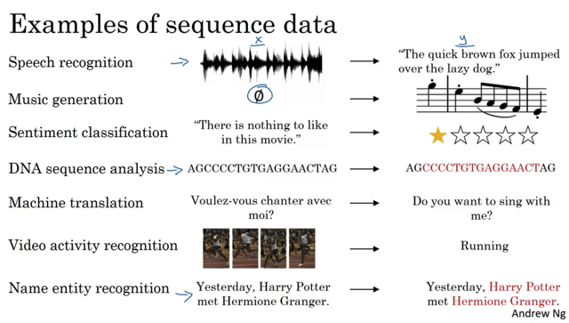</kbd>

 

## Notation

 

### 1 Sequence models have a wide range of applications, such as \\*Named-entity

> [!NOTE]
> 1 Sequence models have a wide range of applications, such as \**Named-entity
> recognition\**, which is used to find entities such as people's names, company
> names, times, locations, countries, and currency names in different types of text.
>
> 2 A sequence model operates on an \**input sequence of features\** (words) and
> produces an \**output sequence of targets\** (labels).
>
> 3 The input sequence can be represented as x with the \**superscripts\** <1> to <9> to index
> the \**different positions\**. Similarly, the output sequence can be represented as y with
> the superscripts 1 to 9.
>
> 4 \**T(x)\** is used to denote the \**length of the input sequence\**, and \**T(y)\** is used to
> denote the \**length of the output sequence\**.
>
> 5 The individual words in the sentence can be \**represented\** by a dictionary of
> words. A vocabulary is created by making a list of the words to be used in the
> representation.
>
> 6 \**Dictionary sizes can vary depending on the application\**. For example, 30,000
> to 50,000 is common for commercial applications, and some large internet
> companies use dictionary sizes of a million words or more.
>
> 7 One way to create a dictionary is to\**find the top occurring words in the training
> set and some online dictionaries\**.

 

  
  
<kbd>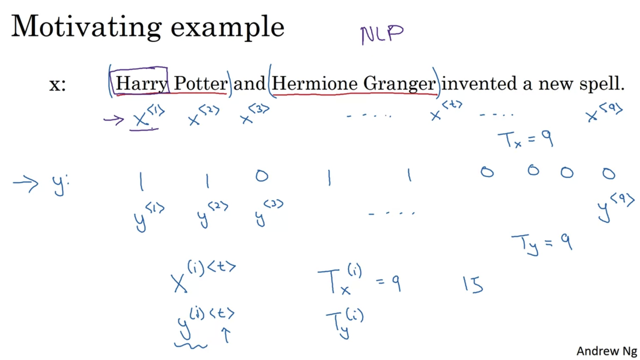</kbd>

  > Đại khái là "bây giờ" : 
  > - Bài toán **named-entity recognition** kiểu như cho 1 câu, chỉ ra từ nào
  > là tên riêng thì label = 1, từ nào không phải thì label là 0
  >
  > - Mỗi data sample x (i) sẽ là **1** **chuỗi (sequence) features**kí hiệu thứ tự dùng <> 
  >
  > - Output cũng sẽ là **1 chuỗi labels Ty(i)**
  >
  > - Mỗi data sample x (i) sẽ có chiều dài chuỗi là **Tx (i)**

   

  
  
<kbd>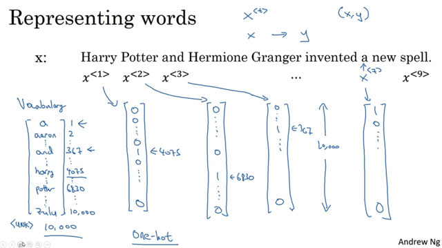</kbd>

  > Đại khái là dựa vào 1 bộ dictionary, mỗi "element" của chuỗi x (i) sẽ
  > được biến thành 1 **one-hot encoder vector** trong đó:
  >
  > Vị trí số 1 sẽ là vị trí của "từ" / element trong dictionary, còn lại số 0 hết

   

## Recurrent Neural Network Model

 

### 1 In the previous video, sequence learning problems were defined using

> [!NOTE]
> 1 In the previous video, sequence learning problems were defined using
> a specific notation.
>
> 2 Using a \**standard neural network\** for learning the mapping from x to
> y does not work well due to \**different input and output lengths\** and
> \**the inability to share learned features across\** \**different positions\** of
> texts.
>
> 3 \**Recurrent Neural Networks (RNNs)\** are a solution that address the
> disadvantages of a standard neural network by \**passing on information
> from previous time steps\** and \**sharing parameters across all time
> steps.\**
>
> 4 A diagram of a simple RNN was presented, which shows how the
> network scans through the data from left to right, with the same set of
> parameters being used at each time step.
>
> 5 The parameters of the RNN, which include \**Wax\**, \**Waa\**, and \**Wya\**, were
> discussed.

> [!NOTE]
> 1 The video introduces the notation used to define sequence learning problems and then talks about how to build a neural network to learn the mapping from input sequence to output sequence.
>  2 Using a standard neural network for this task is not ideal, because the inputs and outputs can be different lengths and different examples. Additionally, a naive neural network architecture like this does not share features learned across different positions of text.
>  3 Recurrent Neural Networks (RNNs) are a better option because they overcome these limitations. RNNs are designed to handle variable-length sequences and can learn to share information across different positions of text.
>  4 A recurrent neural network takes a sequence of inputs x1, x2, ..., xTx and produces a sequence of outputs y1, y2, ..., yTy. At each time step, the RNN passes the output of the previous time step to the current time step.
>  5 The RNN architecture consists of an input layer, a hidden layer, and an output layer. The input layer takes the input sequence, the hidden layer processes the input sequence and passes the output to the output layer, which produces the output sequence.
>  6 The RNN architecture uses shared parameters across different time steps to learn to generalize across the input sequence. The parameters include the weights governing the connection from input to hidden layer (Wax), the weights governing the connection between hidden layers (Waa), and the weights governing the connection from hidden to output layer (Wya).
>  7 The RNN architecture scans through the data from left to right, and at each time step, it inputs the current input and produces the current output. The architecture also receives a fake activation at time zero, which is usually a vector of zeros.
>  8 RNNs are widely used in various natural language processing tasks such as language modeling, machine translation, and text generation. They have also been successfully applied in other domains such as speech recognition and image captioning.

 

  
  
<kbd>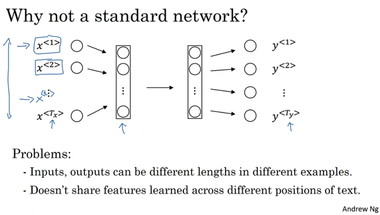</kbd>

  > Đại khái là nếu dùng N.N thông thường thì gặp những nhược điểm:
  >
  > - Chiều dài mỗi câu mỗi khác 
  >
  > - Không 'học' / nắm bắt được sự liên quan giữa các từ ở các
  > vị trí khác nhau

   

  
  
<kbd>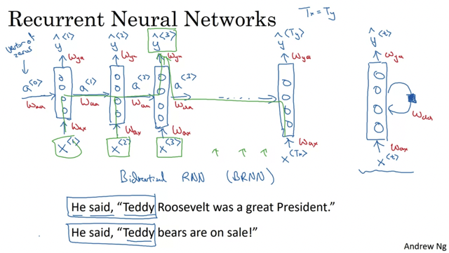</kbd>

  > Đại khái là như sau:
  >
  > Mỗi một "từ" x<i> sẽ được 'learn' bởi network layer để map với y^<i>
  > Bài cuối sẽ nói đến Deep RNN - ta có nhiều layer hơn.
  >
  > Nhưng đồng thời cũng pass output a<i> cho từ kế tiếp: Đại khái là
  > bằng cách này **một 'từ' sẽ được 'học' bởi cả những từ trước đó
  > nữa**.
  >
  > Và sẽ có **Bidirectional Recurrent NN** trong đó một từ sẽ được học
  > cả những từ sau nó.
  >
  > Các layer của từng từ sẽ **share chung params Wax, và Waa**
  >
  > Một số paper hay sách mô tả RNN theo kiểu rút gọn
  >
  > Đây là đ/v Tx = Ty, có thể Tx != Ty thì sẽ nói sau

   

  
  
<kbd>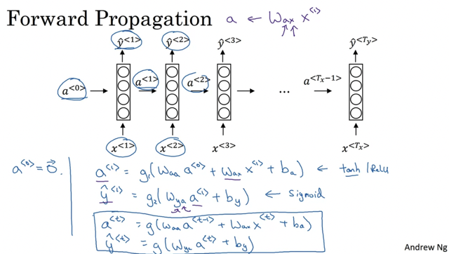</kbd>

  > Đại khái là
  >
  > Tính a từ x thì là Wax, tính a từ y thì là Way, tính y từ a thì Wya
  >
  > TÍnh a thì thường dùng reLU hay TanH
  >
  > Tính y thì tuỳ vào yêu cầu có thể là sigmoid

   

  
  
<kbd>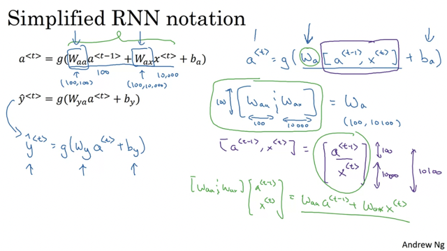</kbd>

  > Đại khái là gom Waa và Wax (stack together) lại cho gọn thành Wa
  > và [a<t-1> | x<t>] (cũng là stack hai cái đó lại)
  >
  > thì 2 phép tính là như nhau

   

## Backprop Through Time

 

### 1 \\*Backpropagation\\* in a recurrent neural network (RNN) is

> [!NOTE]
> 1 \**Backpropagation\** in a recurrent neural network (RNN) is
> essential for updating the network's parameters using gradient
> descent.
>
> 2 The backpropagation algorithm in RNN is carried out in the
> opposite direction of the forward propagation calculations.
>
> 3 The loss function is essential for computing the loss for a
> particular word in the sequence, which is necessary to compute
> the overall loss for the entire sequence.
>
> 4 \**Backpropagation through time\** is the name given to the
> recursive calculation that goes from right to left in the RNN
> architecture.
>
> 5 RNN architecture can be used for a wide range of applications
> beyond the motivating example where the length of the input
> sequence was equal to the length of the output sequence.

> [!NOTE]
> 1 The video explains how backpropagation in recurrent neural networks (RNNs) works.
>  2 The programming framework usually takes care of backpropagation, but it is still useful to understand how it works in RNNs.
>  3 Forward propagation in RNNs computes activations from left to right, and in backpropagation, calculations are carried out in the opposite direction of the forward prop arrows.
>  4 To compute backpropagation, an element-wise loss is defined for a certain word in the sequence, and an overall loss is defined for the entire sequence.
>  5 Backpropagation through time is used to calculate the appropriate quantities to update the parameters using gradient descent.
>  6 The most significant recursive calculation in the backpropagation procedure is from right to left, which gives it the name "backpropagation through time."
>  7 The video only shows one example of RNN architecture, in which the length of the input sequence was equal to the length of the output sequence.
>  8 In the next video, a wider range of RNN architecture will be shown to tackle a wider set of applications.

 

  
  
<kbd>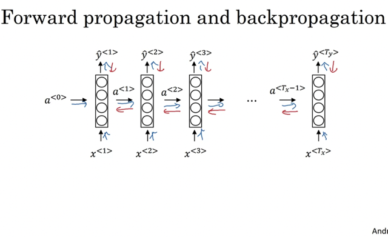</kbd>

   

  
  
<kbd>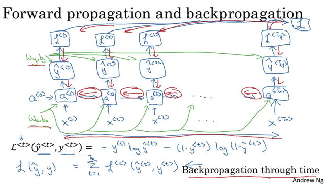</kbd>

  > Đại khái tính loss cho 1 sample x(i) là tổng loss của các item
  > trong sequence x(i)<1>, x(i)<2>...,x(i)<Tx>

  > Ở đây đại khái phải hiểu là vì ta đang solve bài toán gọi
  > là Name Entity gì đó trong đó mục tiêu là xác định các
  > từ trong câu có phải là tên riêng hay không (yes or no)
  > -> Nên y<i> chỉ hai gía trị binary 1 | 0 nên bài toán này
  > giống như **binary classification**. Nói vậy để hiểu tại
  > sao dùng hàm loss function y như của Logistic
  > Regression  (có tên là **Log Loss**)
  >
  > Nếu y có thể mang nhiều giá trị hơn (thay vì 1 | 0) thì
  > loss function sẽ là **Softmax**

   

## Difference Types Of Rnns

 

### 1 Introduction to RNN architectures with different input and

> [!NOTE]
> 1 Introduction to RNN architectures with different input and
> output lengths
>
> 2 Many-to-many architecture with equal input and output
> sequence lengths
>
> 3 Many-to-one architecture with variable-length input sequence
> and single output value
>
> 4 One-to-many architecture for music generation
>
> 5 One-to-one architecture for standard neural network
>
> 6 Many-to-many architecture for variable-length input and
> output sequences, like machine translation.

> [!NOTE]
> 1 RNN architectures with varying Tx and Ty:
>  2 In this video, the presenter introduces the concept that the number of inputs, Tx, and outputs, Ty, in an RNN architecture need not always be the same. They provide examples of different applications where Tx and Ty can be different, such as movie sentiment classification and machine translation. The presenter mentions that the basic RNN architecture can be modified to address these different problems.
>  3 Many-to-many architecture:
>  4 The presenter explains the many-to-many architecture, which was covered in previous videos. This architecture is used when the input sequence has many inputs as a sequence, and the output sequence also has many outputs. The input sequence, x, and output sequence, y, have the same length, Tx = Ty.
>  5 Many-to-one architecture:
>  6 The presenter discusses the many-to-one architecture, which is used in sentiment classification problems. In this architecture, x is a sequence of words and y is a single number indicating the sentiment of the text. The RNN reads each word of x one at a time and outputs y at the last time-step when it has already input the entire sentence.
>  7 One-to-one architecture:
>  8 The one-to-one architecture is a standard neural network, where there is a single input, x, and a single output, y. This type of architecture was covered in the first two courses in the sequence.
>  9 One-to-many architecture:
>  10 The presenter introduces the one-to-many architecture, which is used in music generation problems. The input, x, could be an integer indicating the genre of music or the first note of the piece. The RNN outputs a set of notes corresponding to a musical piece. The network architecture ends up looking like a loop, where the output of each time-step is fed into the input of the next time-step.
>  11 Many-to-many architecture with different input and output lengths:
>  12 The presenter introduces the many-to-many architecture with different input and output lengths, which is used in machine translation problems. The number of words in the input sentence and the number of words in the output sentence can be different. The presenter provides an alternative RNN architecture to address this problem.

 

  
  
<kbd>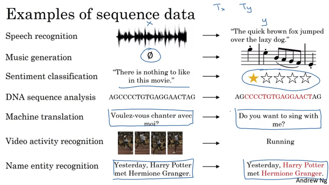</kbd>

   

  
  
<kbd>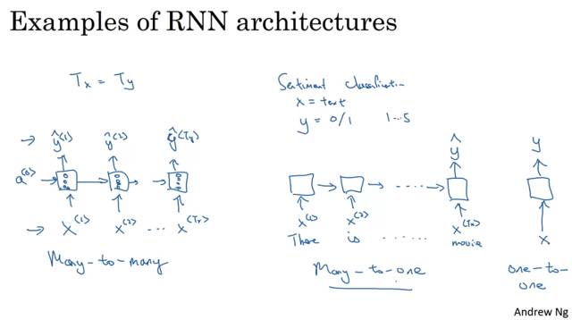</kbd>

   

  
  
<kbd>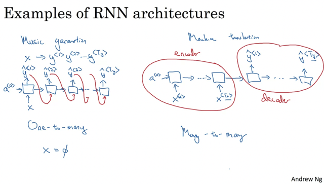</kbd>

   

  
  
<kbd>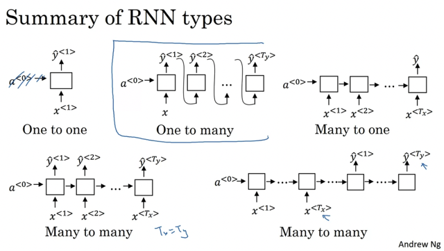</kbd>

   

## Language Model And Sequence Generation

 

### 1\\* Language modeling\\* is a crucial task in natural language processing that

> [!NOTE]
> 1\**Language modeling\** is a crucial task in natural language processing that
> involves \**predicting the probability of a particular sequence of words\**.
>
> 2 A language model is used in \**speech recognition systems\** to identify the
> \**probability of a particular sentence\**, and it is also used in \**machine
> translation\** systems to output \**only likely sentences.\**
>
> 3 To build a language model using an RNN, you need \**a training set of a
> large corpus of text\**, which you \**tokenize\** and \**map to one-hot vectors\** or
> indices in a vocabulary.
>
> 4 An e\**nd-of-sentence token\** can be appended to every sentence in the
> training set to capture the end of a sentence.
>
> 5 The RNN model estimates the \**probability of different sequences\** by setting
> the inputs x^t to be equal to y of t minus 1.

> [!NOTE]
> Language modeling is one of the most fundamental tasks in natural language processing, and recurrent neural networks (RNNs) are well-suited to this task. 
>
> A language model estimates the probability of a particular sequence of words in a sentence. For example, if you were to hear the sentence "the apple and pear salad was delicious" and "the apple and pair salad was delicious", a good speech recognition system would output the second sentence as it is more likely. 
>
> A language model would estimate the probability of each sentence, with the second sentence being much more likely.
> Language models are used in speech recognition systems to pick the most likely sentence from a set of possible sentences. They are also used in machine translation systems to output **only likely sentences**.
>
> To build a language model using an RNN, you need a training set comprising a large corpus of text. The text is tokenized to form a vocabulary, with each word mapped to a one-hot vector or an index in the vocabulary. An end-of-sentence (EOS) token can be appended to each sentence to explicitly capture when sentences end. If a word in the training set is not in the vocabulary, it is replaced with an unknown word token (UNK).
>
> An RNN model is built to estimate the probability of different sequences of words. The input sequence is represented by output y rather than input x in a language model. The input x^t is set to be equal to y of t minus 1 in an RNN language model.
>
> In summary, language modeling is an important task in natural language processing, and RNNs are particularly good at this task. To build a language model using an RNN, a large corpus of text is required, which is tokenized to form a vocabulary. An RNN model is then built to estimate the probability of different sequences of words in a sentence

 

  
  
<kbd>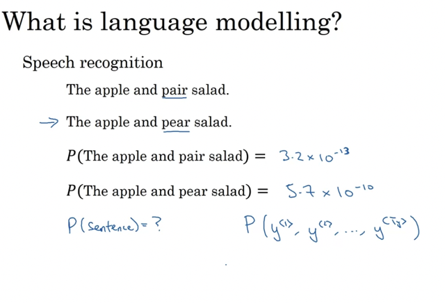</kbd>

  > Này là bài toán khác, hồi nãy là N**ame Entity Recognition** -
  > Xác định từ trong câu là name hay không phải name. Còn cái
  > này là xác định **từ trong câu là từ gì**.
  >
  > Ví dụ như input là một đoạn thu âm: Thì mục tiêu của bài
  > toán này kiểu như nó tính ra:
  > - Khả năng audio này này là câu "The apple ...pair salad" là
  > bao nhiêu.
  > - Khả năng audio này này là câu "The apple ...pear salad" là
  > bao nhiêu.
  >
  > Từ đó quyết định kết quả là câu có P cao hơn.

   

  
  
<kbd>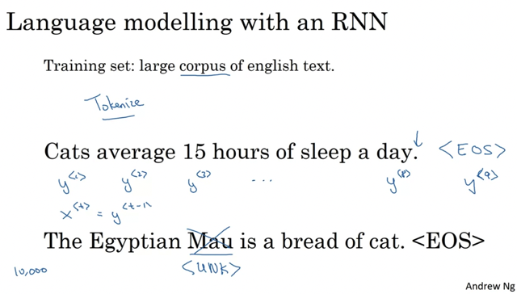</kbd>

  > Training set cho cái này là 1 **corpus**: 1 set rất lớn câu tiếng Anh
  > chẳng hạn
  >
  > Tokenize: Biến mỗi từ thành 1 one-hot vector (sử dụng một bộ dictionary)
  > ví dụ 'cat' -> [0 0 ...0 1 0 ...0] số 1 tại vị trí tương ứng với chữ 'cat'
  > trong dictionary
  >
  > Thường thường ta thay add 1 extra token <EOS> = End of sentence
  > vào cuối câu để biểu thị kết thúc câu
  >
  > Có thể bỏ dấu . / ? vào từ điển nếu muốn tokenize dấu chấm câu.
  >
  > Từ không có trong từ điển thì tokenize bằng <UKN>

   

  
  
<kbd>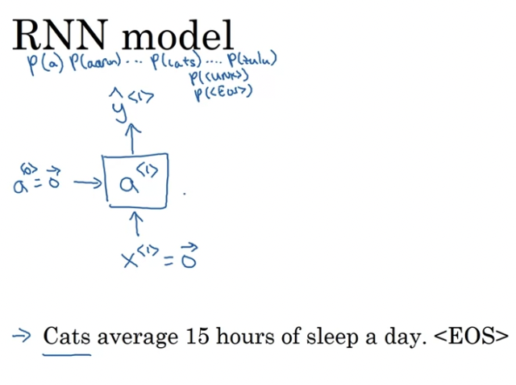</kbd>

  > Đại khái là bắt đầu với từ đầu tiên trong sequence - x<i>
  > Nó sẽ dùng Softmax với 10000 unit (hay 10002 nếu có thêm UKN và EOS 
  > Token) để tính các **probability** từ từ này (x<1>) là
  > lần lượt là các từ trong dictionary là bao nhiêu,
  >
  > Ví dụ cho dễ hiểu hơn:
  >
  > Probability từ x<1> là từ 'a' - P(a) là bao nhiêu?
  > Probability từ x<1> là từ 'aaron' - P(aaron) là bao nhiêu?
  > ...
  > Probability từ x<1> là từ 'cat' - P(cat) là bao nhiêu?
  > ...
  > Probability từ x<1> là từ 'zulu' - P(zulu) là bao nhiêu?
  >
  > -> y^<1> là vector: [P(a) P(aaron) ...P(cat) ...P(zulu)]

  > X<1> = vector 0 là sao chưa hiểu lắm - Có thể là
  > initialization -> Đúng là vậy, initialize nó bằng np.
  > zeros() chứ không có gì khó hiểu hết. a_0 cũng vậy

   

  
  
<kbd>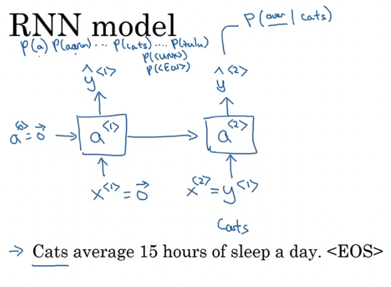</kbd>

  > Tiếp theo để tính toán đ/v từ thứ 2 ta...
  >
  > - Bỏ vào x<2> chính là y<1> - Đại khái cho nó biết là đáp án đúng của 
  > từ trước nó là từ gì (Ở đây là 'cat')
  >
  > - Bỏ vào a<1>
  >
  > để tương tự với tính [P(a) P(aaron) ...P(average)...P(zulu)]

   

  
  
<kbd>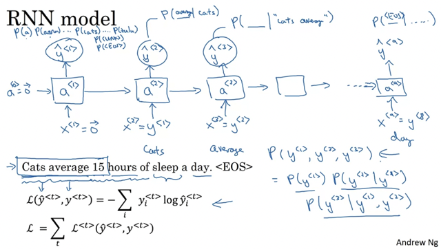</kbd>

  > Làm tương tự với từ thứ <t>....đến hết.
  > Xong define **L đối với mỗi time step** (đại khái là mỗi lần train 1 từ trong
  > sequence) là tổng Loss trên các training data tại time step đó.
  >
  > Và vì y có thể có nhiều giá trị chứ không chỉ 1 | 0 nên hàm loss
  > là hàm **Cross Entropy**
  >
  > Và Cost hay Loss tổng là **tổng Loss trên mọi time step**

   

  
  
<kbd>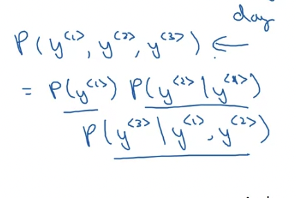</kbd>

  > Ở đây đại khái là cho một new sentence y<1> y<2> y<3> ta
  > sẽ tính ra **khả năng mà chuỗi này gì ("**\/you can figure
  > out what is the chance of this entire sentence would be")
  >
  > \/bằng cách nhân 3 cái probabiitiy sau lại
  > "what's the chance of y_1," 
  > "what's the chance of y_2, given y_1,"
  > "what's the chance of y_3, given y_1, y_2,"

   

## Sampling Novel Sequences

 

### 1 Sampling novel sequences is a way \\*to informally get a sense

> [!NOTE]
> 1 Sampling novel sequences is a way \**to informally get a sense
> of what is learned\** in a sequence model.
>
> 2 To sample novel sequences, you first sample the first word,
> then use the softmax distribution to \**randomly sample the next
> word\** and so on until the end of the sentence or a
> predetermined number of words is reached.
>
> 3 If the sequence model is built on a word-level vocabulary,
> each y1, y2, y3,... represents a word, but if it is built on a
> character-level vocabulary, each y1, y2, y3,... represents a
> \**character\**.
>
> 4 Building a character-level language model has pros and cons,
> such as being able to assign a probability to any sequence of
> characters, but having longer sequences and being more
> computationally expensive to train.

> [!NOTE]
> 1 The video discusses how to informally assess what a sequence model has learned by generating novel sequences.
>
>  2 To generate novel sequences, one needs to sample from the distribution that the sequence model has learned. The video explains that this involves sampling the first word from a softmax distribution of possible outputs based on the input to the first time step. The sampled word is then passed into the second time step, where the model predicts the probability distribution of the next word based on the previous word. This process is repeated until a stopping condition is met, such as generating an end-of-sentence token or a specified maximum number of words.
>
>  3 The video also explains that the process of generating novel sequences can be applied to both word-level and character-level language models. A character-level language model uses the individual characters in the training data as its vocabulary, whereas a word-level language model uses the words in the training data as its vocabulary.
>
>  4 One advantage of using a character-level language model is that it avoids the problem of generating unknown word tokens, as all possible character sequences are part of the vocabulary. However, a character-level language model may require more training data and computation time than a word-level language model.
>
> 5 The video suggests that the choice between using a word-level or character-level language model depends on the application and the available data.

 

  
  
<kbd>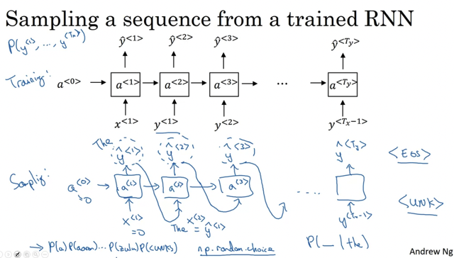</kbd>

  > Đại khái là vầy: 
  >
  > Mục đích của cái này là**XEM THỬ sequence model nó học được gì**
  >
  > Ví dụ từ thứ nhất, nó tính ra vector này  (tạm gọi là
  > probability vector của từ thứ nhất): [P(a), P(Aaron),....P(Zulu)] đại khái như
  > đã hiểu là nó chứa các thông số thể hiện "Probability mà từ đầu tiên trong
  > sequence này LÀ lần lượt các từ trong dictionary list)
  >
  > Bỏ vector này np.random.choice() -> y^<1>: Đại khái mình hiểu là nó sẽ **lấy
  > randomly nhưng theo xác xuất quy định bởi probability vector**
  >
  > Sau khi huấn luyện một mô hình chuỗi, một trong các cách bạn có thể làm
  > quen với những gì đã học là bằng cách tạo ra các chuỗi mới. Đầu tiên, bạn
  > cần chọn từ đầu tiên để mô hình tạo ra. Bạn sẽ sử dụng hàm softmax để
  > chọn từ tiếp theo **dựa trên xác suất**. Sau đó, bạn **sử dụng từ vừa chọn
  > để tạo ra từ tiếp theo bằng cách truyền nó vào mô hình**. Tiếp tục lặp lại quá
  > trình này cho tới khi đủ số lượng từ hoặc tạo ra từ kết thúc câu nếu trong từ
  > điển của bạn có từ kết thúc câu. Nếu mô hình của bạn tạo ra một từ không
  > xác định, bạn có thể lựa chọn tạo lại từ khác hoặc giữ nguyên từ đó trong
  > đầu ra.
  >
  > Training thì input của từ này là label của từ trước đó x<i> = y<i-1> còn
  > sampling  thì input là random sampling with distribution của từ trước đó,

   

  
  
<kbd>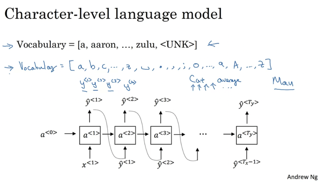</kbd>

  > Đại khái là có thể thay 'Word model" bằng "Character model"
  > trong đó đại khái là nó ở cấp 'character' thay vì 'word'
  >
  > Pros là nó không bị trường hợp <Unknown> word Cons là nó
  > tạo ra sequence dài hơn rất nhiều bới 1 từ có vài kí tự dẫn đến
  > 'computational expensive' hơn và cần nhiều data hơn
  >
  > Ở cấp ký tự thì **không 'nắm bắt' được sự liên hệ** như giữa
  > các từ trong 1 câu

   

  
  
<kbd>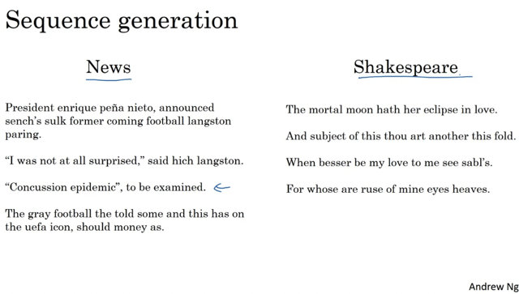</kbd>

  > Ví dụ của cái này, đại khái là nó tạo ta những
  > content có phong cách giống giống

   

## Vanishing Gradients With Rnns

 

### 1 Introduction to RNNs and their applications to\\* language modeling\\*

> [!NOTE]
> 1 Introduction to RNNs and their applications to\**language modeling\**
> and \**name entity recognition\**.
>
> 2 The problem of \**vanishing gradient\** in the basic RNN algorithm.
>
> 3 Explanation of the \**vanishing gradien\**t problem and its impact on the
> RNN's \**ability to capture long-term dependencies\**.
>
> 4 Comparison between the local and global influence of the RNN
> model's output and input on the computation.
>
> 5 \**Difficulty\** of getting the neural network to \**memorize\** and use the
> \**relevant information from earlier in the sequence.\**
>
> 6 Discussion of the solution to the vanishing gradient problem with
> \**GRUs\**, which will allow the neural network to \**capture longer-range
> dependencies.\**
>
> 7 \**Exploding gradient problem\** and the solution of\**gradient clipping.\**
>
> 8 The significance of the vanishing gradient problem in training RNNs
> over a \**large number of time steps\**, which can be \**equivalent\** to training
> a v\**ery deep neural network\**.

> [!NOTE]
> 1 Introduction
>  • Recap of how RNNs work and their applications
>  • Mention of backpropagation used for RNN training
>  • Discussion of the vanishing gradient problem in basic RNNs
>  • Plan to address this problem in upcoming videos
>  2 Long-term Dependencies in Language Modeling
>  • Example of a sentence where a word earlier in the sentence affects the later part of the sentence
>  • Explanation of how basic RNNs struggle with capturing very long-term dependencies
>  • Comparison to the vanishing gradient problem in very deep neural networks
>  • Discussion of the difficulty in getting a neural network to memorize information for a long time
>  3 Local Influences in Basic RNNs
>  • Description of how the output of a basic RNN is mainly influenced by values close to it
>  • Difficulty in strongly influencing the output with an input that was very early in the sequence
>  • Explanation of how errors associated with later timesteps have a hard time affecting earlier computations due to the vanishing gradient problem
>  4 Weakness of Basic RNN Algorithm
>  • Identification of the weakness in the basic RNN algorithm
>  • Discussion of the importance of addressing this weakness to allow RNNs to capture long-range dependencies
>  5 Exploding Gradients and Gradient Clipping
>  • Explanation of the exploding gradient problem in deep neural networks
>  • Solution to exploding gradients using gradient clipping
>  • Importance of addressing vanishing gradients, which is a harder problem to solve
>  6 Summary and Next Steps
>  • Recap of vanishing and exploding gradients in RNNs
>  • Discussion of how RNNs with long sequences face similar problems to very deep neural networks
>  • Introduction of GRUs as a solution to the vanishing gradient problem
>  • Plan to cover GRUs in the next video

 

  
  
<kbd>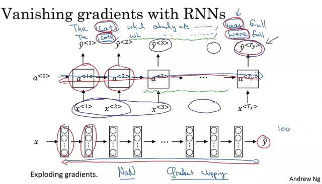</kbd>

  > Nói chung đại khái là nói về những thách thức của basic
  > RNN:
  > **-** **Gradient Vanishing**: Qua nhiều time-step, gradient bị vanish
  > giống giống như train một N.N rất deep - nhiều layer.
  >
  > **- Vấn đề không 'nhớ' được** rằng lúc đầu là they - số nhiều để
  > sau phải dùng were.
  >
  > **- Gradient exploding** thì ít gặp hơn và có cách xử bằng 
  > **Gradient Clipping** còn G.V thì khó nhận biết và xử lý hơn.

   

## Clarifications

 

<kbd>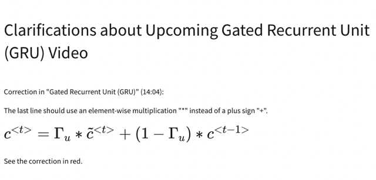</kbd>

 

<kbd>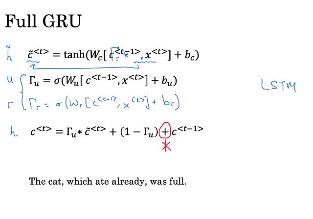</kbd>

 

## Gated Recurrent Unit (gru)

 

### 1 Gated Recurrent Units (GRUs) are modifications to the basic RNN hidden

> [!NOTE]
> 1 Gated Recurrent Units (GRUs) are modifications to the basic RNN hidden
> layer that allow for \**better capturing of long-range connections\** and \**addressing
> vanishing gradient\** problems.
>
> 3 The GRU unit involves a\**memory cell (C) that provides memory for previous
> inputs\**, allowing the network to \**remember relevant information for long-range
> connections\**.
>
> 4 At each time step, \**a candidate value (C~t)\** is computed for \**potentially
> overwriting the memory cell value (C_t)\** using an activation function (tanh)
> applied to the previous memory cell value, current input, and weight and bias
> parameters.
>
> 5 The update gate (\**Gamma_u\**) \**determines whether the candidate value is used to
> update the memory cell value\**. It is a\**value between 0 and 1\**, often computed using
> a \**sigmoid\** function.
>
> 6 The gate allows the network to \**decide when to update the memory cell value\**,
> \**based on the relevance of the current input to long-range connections\**.
>
> 7 \**The key equation for the GRU involves combining the candidate value and
> previous memory cell value with the gate value to determine the updated memory
> cell value.\** 
>
> 8 The gate is an important component of the GRU and can be thought of as a way
> to decide whether to update the memory cell value based on the relevance of the
> current input.
>
> 9 The GRU was developed by Junyoung Chung, Caglar Gulcehre, KyungHyun
> Cho, and Yoshua Bengio, who published two papers on the topic. [1]
>
> 10 The GRU unit is designed to \**allow the network to remember important
> information from previous inputs and use it to better capture long-range
> connections\** in sequences of data. [1]

> [!NOTE]
> 1 The video introduces the gated recurrent unit (GRU), which is a modification to the RNN hidden layer that helps with capturing long-range connections and addressing the vanishing gradient problem.
>
>  2 The basic RNN formula for computing activations at time t is the activation function applied to the parameter W_a times the activations for the previous time step, the current input, and a bias.
>
>  3 The RNN unit is depicted as a box that takes as input the activation from the previous time step and the current input, and then computes a new activation value using a linear calculation and a tanh activation function.
>
>  4 The output activation value can be passed to a softmax unit to generate outputs.
>
>  5 The GRU unit introduces a memory cell variable, denoted as C, that can store information such as whether a subject of a sentence is singular or plural.
>
>  6 At each time step, the GRU unit computes a candidate value, c tilde, for overwriting the memory cell using an activation function, tanh of W_c, applied to the previous memory cell value, the current input, and a bias.
>
>  7 The GRU unit also has a gate variable, denoted as Gamma_u, that decides whether to update the memory cell with the candidate value.
>
>  8 The gate variable is a value between 0 and 1, which can be obtained using a sigmoid function applied to a linear calculation of the previous activation value and the current input.
>
>  9 If the gate variable is close to 0, then the memory cell is not updated, and if it is close to 1, then the memory cell is updated.
>
>  10 The GRU unit computes an activation value, a, that is equal to the memory cell value, C, and this activation value can be passed to a softmax unit to generate outputs.
>
>  11 The GRU unit can be used in natural language processing tasks to better capture long-range dependencies in sentences and improve performance on tasks such as language translation and sentiment analysis.

 

  
  
<kbd>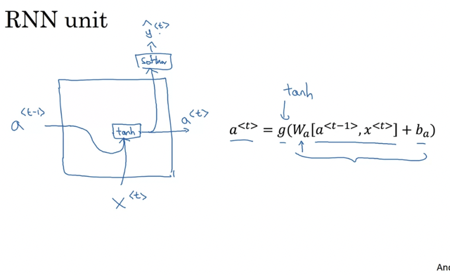</kbd>

  > Minh hoạ 1 RNN unit: Đại khái là lấy activation của previous time-step
  > và current input để tính ra activation của unit.
  >
  > The formula for computing the activations of an RNN unit involves the
  > **activation function applied to the previous activation** and the **current
  > input**, passed through some **weights** and a **bias**. This can be
  > represented visually as a box with inputs for a previous time step and
  > current input, and output activation.

   

  
  
<kbd>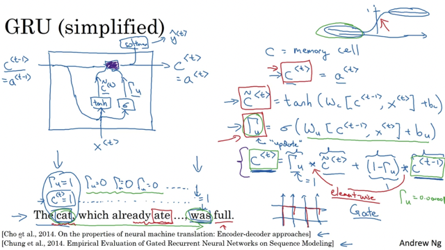</kbd>

  > Tạm thời chưa hiểu (nó work như thế nào) nhưng quan trọng phải
  > nhớ những notation này:
  >
  > Đại khái có khái niệm C là **memory cell**: Sẽ giúp network **nhớ
  > được thông tin cần thiết / liên quan cho những mối liên hệ xa
  > (giữa các unit)**
  >
  > Đại khái C<t> = a<t>
  >
  > Đại khái C~<t> là candidate để thay cho C<t>
  >
  > Đại khái gamma u có vai trò để quyết định có update value của C
  > hay là không dựa trên: (\/**t\_he relevance of the current
  > input**\/\_???)
  >
  > Gamma u tính bằng Sigmoid nên đại khái là most of the time nó
  > sẽ có value ~= 1 hoặc ~=0.

  > Chưa hiểu:
  > Nó work như thế nào.
  > Taị sao nó lại giúp khắc phục vấn đề Gradient Vanishing

  > Mục đích của GRU là khắc phục vấn đề Gradient Vanishing và nắm
  > bắt được mối quan hệ long-range của các unit trong sequence

  > 1 **Gated Recurrent Units (GRUs)** are **modifications to the basic RNN**
  > hidden layer that allow for **better capturing of long-range connections** and
  > **addressing vanishing gradient** problems.
  >
  > 3 The GRU unit involves a **memory cell (C)** that **provides memory for
  > previous inputs**, **allowing the network to remember relevant information for
  > long-range connections.**
  >
  > 4 At each time step, **a candidate value (C~t)** is computed for **potentially
  > overwriting the memory cell value (C_t)** using an activation function (tanh)
  > applied to the previous memory cell value, current input, and weight and bias
  > parameters. [1]
  >
  > 5 The **update gate (Gamma_u)** **determines whether the candidate value is
  > used to update the memory cell value**. It is a value between 0 and 1, often
  > computed using a sigmoid function. [1]
  >
  > 6 \/**The gate allows the network to decide when to update the memory cell
  > value, based on t\_he relevance of the current input\_ to long-range
  > connections**.\/
  >
  > 7 The key equation for the GRU involves combining the **candidate value** and
  > **previous memory cell value** with the **gate value** to **determine the updated
  > memory cell value**.
  >
  > 8 The gate is an important component of the GRU and can be thought of as**a
  > way to decide whether to update the memory cell** value **based on the
  > relevance of the current input.**
  >
  > 9 The GRU was developed by Junyoung Chung, Caglar Gulcehre, KyungHyun
  > Cho, and Yoshua Bengio, who published two papers on the topic. [1]
  >
  > 10 The GRU unit is designed to **allow the network to remember important
  > information from previous inputs** and use it to better **capture long-range
  > connections in sequences of data**. [1]

  > **"the relevance of the current input"**: Hiểu đại khái là nếu input x
  > tại một unit nào đó có ảnh hưởng đến các unit ở xa hơn (long
  > range connection) thì nó sẽ được giữ lại và tính toán sau này (ví dụ
  > như They và were vậy

   

  
  
<kbd>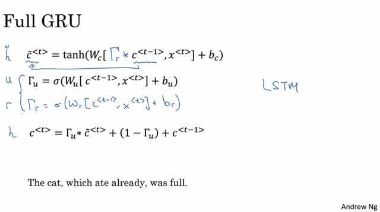</kbd>

  > Full version có thêm Gammar r trong công thức tính c~

   

## Clarification

 

<kbd>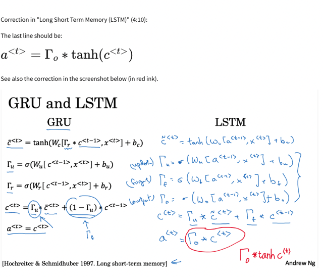</kbd>

 

## Long Short Term Memory

 

### 1 GRU (Gated Recurrent Unit) and LSTM (Long Short-Term Memory) units are used

> [!NOTE]
> 1 GRU (Gated Recurrent Unit) and LSTM (Long Short-Term Memory) units are used
> to learn long-range connections in a sequence.
>
> 2 LSTM is \**more powerful\** than GRU.
>
> 3 LSTM has three gates: \**forget gate\**, \**update gate\**, and \**output gate\**.
>
> 4 The equations governing the behavior of LSTM include a candidate value for
> updating the memory cell and the memory cell itself.
>
> 5 The forget gate in LSTM allows the memory cell to \**keep or discard the old value\**.
>
> 6 The update gate in LSTM \**adds the new value to the memory cell\**.
>
> 7 The output gate in LSTM \**controls the information flow from the memory cell\**.
>
> 8 LSTMs can be \**hooked up in parallel\** to pass information for a long time.
>
> 9 LSTMs and GRUs are \**good at memorizing certain values for a long time\**.

> [!NOTE]
> 1 In the video, the speaker discusses the concept of the LSTM, or long short-term memory unit, which is a powerful tool for learning long-range connections in a sequence.
>
>  2 The LSTM is a more general version of the GRU, or gated recurring unit, which also allows for learning long-range connections in a sequence.
>
>  3 The equations that govern the behavior of the LSTM are more complicated than those of the GRU, with three gates instead of two.
>
>  4 The LSTM uses separate update and forget gates, as well as an output gate, to control the flow of information.
>
>  5 The update gate controls the degree to which new information is allowed to enter the memory cell, while the forget gate controls the degree to which old information is allowed to leave.
>
>  6 The output gate controls the degree to which information is allowed to leave the memory cell and be used as output.
>
>  7 The LSTM has the ability to store values in its memory cell for long periods of time, making it a good tool for tasks that require memorization of certain values.
>
>  8 The equations governing the behavior of the LSTM involve multiple inputs, including the previous time step, the current input, and the previous memory cell value.
>
>  9 These inputs are combined in complex ways to determine the new value of the memory cell.
>
>  10 The behavior of the LSTM can be visualized using a diagram that shows how the various inputs and gates are combined to determine the output.

 

  
  
<kbd>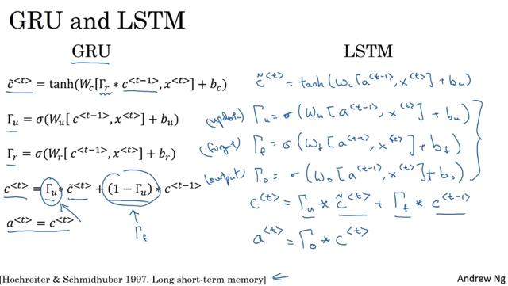</kbd>

  > - Không còn cho c<t-1> bằng a<t-1> nên dùng a<t-1> trong tính c~<t>
  > và Gamma u
  >
  > - Có thêm Gamma f - Forget và thay cho 1-Gamma u trong công thức tính c<t>
  >
  > - Có thêm Gamma o - Output để tính a<t> (không còn cho rằng a<t>
  > luôn bằng c<t>)

   

  
  
<kbd>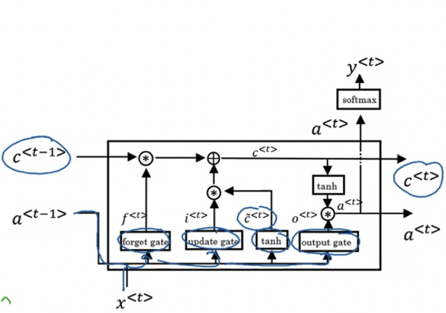</kbd>

   

  
  
<kbd>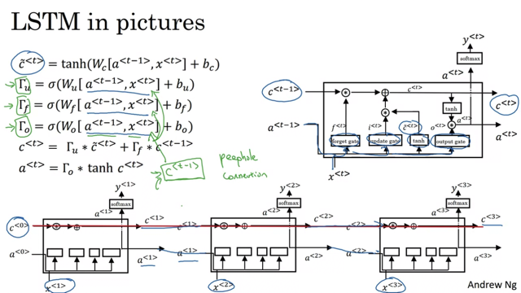</kbd>

  > One interesting property of the LSTM is that it is very good at
  > memorizing certain values for a long time. This is because, as shown
  > in the video, multiple LSTMs can be connected in parallel and
  > passed through time, allowing values to be passed from one LSTM
  > to another.
  >
  > **Đại khái là các unit nối lại bằng thêm một đường màu đỏ cho phép
  > thông tin được giữ lại và pass đi xuyên suốt.**
  >
  > Overall, the LSTM is a powerful type of RNN that is able to learn
  > l**ong-term dependencies** in sequences. Its equations are **more
  > complex** than those of the GRU, but its multiple gates give it more
  > **flexibility** and **control** over which information to remember and which
  > to forget.
  >
  > **Nói chung LSTM phức tạp nhưng linh hoạt hơn còn GRN đơn giản
  > nhưng cho phép scale up tốt hơn**

  > Có thể có một phiên bản
  > khác (variation) **Peephole Connection** ...

   

## Bidirectional RNN

 

### 1 Introduction of two more ideas to build more powerful models in

> [!NOTE]
> 1 Introduction of two more ideas to build more powerful models in
> RNN.
>
> 2 Bidirectional RNN addresses the \**problem of not having enough
> information from past and future\** to predict a label for a word.
>
> 3 The forward and backward recurrent components in bidirectional
> RNN work cyclically to compute network activations.
>
> 4 \**Bidirectional\** RNN with LSTM blocks is commonly used in NLP
> problems to label things in a sentence.

> [!NOTE]
> 1 The video discusses two additional ideas that can be used to build more powerful models: bidirectional RNN and deep RNN.
>
>  2 To motivate the need for bidirectional RNN, the video uses the example of named entity recognition. In this example, determining whether a word like "Teddy" is a part of a person's name requires information not just from the beginning of the sentence, but also from later in the sequence.
>
>  3 A standard RNN is unidirectional, meaning it can only take information from earlier in the sequence. A bidirectional RNN, on the other hand, can take information from both earlier and later in the sequence. It achieves this by adding a backward recurrent layer to the network, in addition to the forward recurrent layer.
>
> 4 The network is connected in a cyclic pattern, where each forward recurrent unit is connected to the corresponding backward recurrent unit for the same time step. This allows the network to consider information from the past, present, and future.
>
> 5 A bidirectional RNN can use different types of recurrent units, such as standard RNN blocks, GRU units, or LSTM blocks. In natural language processing, a bidirectional RNN with LSTM blocks is commonly used for labeling tasks.
>
> 6 Bidirectional RNNs are a modification of the basic RNN architecture and can be used to improve performance in tasks that require considering information from both earlier and later in a sequence.

 

  
  
<kbd>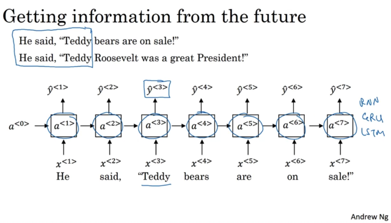</kbd>

   

  
  
<kbd>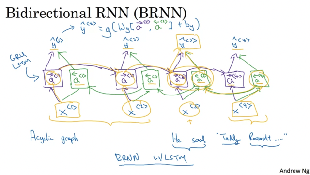</kbd>

  > - Đại khái là có thêm 1 chiều Backward nữa (nhưng không phải là Back
  > Prop mà vẫn là Forward Prop)
  >
  > - Đại khái nó giúp lấy thông tin từ những unit sau cho việc Predict
  > những cái ở đầu giúp giải quyết vấn đề là có những thứ phải cần thêm
  > thông tin ở sau mới biết được ví dụ như câu He said Teddy Roosevelt,.
  > .. Trong đó chữ Teddy cần thêm ngữ cảnh phía sau để xác định là tên
  > ông Tổng thống chứ không phải gấu Teddy

  > - Lúc sau ổng có nói là cái này bắt buộc phải thu hết toàn bộ
  > Vd như nói xong hết thì mới xử lý, nên cái nào có thể thoả mãn
  > yêu cầu này thì BRNN rất hiệu quả còn cần real-time thì phải có 
  > n.n kiểu khác.

   

## Deep Rnns

 

### 1 \\*Stacking\\* multiple layers of RNNs together can create even deeper and

> [!NOTE]
> 1 \**Stacking\** multiple layers of RNNs together can create even deeper and
> more complex models for learning very complex functions.
>
> 2 A deep RNN is created by \**unrolling a standard RNN in time and stacking
> the layers on top of each other.\**
>
> 3 The notation used for deep RNNs is \**a[l]\** to denote the activation associated
> with layer l and <t> to denote the time associated with the activation.
>
> 4 A deep RNN can have \**multiple recurrent layers that are connected in time\**,
> f\**ollowed by a deep network that predicts the output\**.
>
> 5 Deep RNNs can also use different recurrent units such as \**GRU\** and \**LSTM\**
> blocks.
>
> 6 Deep RNNs can be \**computationally expensive\** to train, and because of the
> temporal dimension, having just a \**few layers\** can already create a large
> network.
>
> 7 With the basic RNN, GRU, LSTM, bidirectional RNN, and deep versions of
> these models, one can \**construct powerful models\** for learning sequence
> models.

 

  
  
<kbd>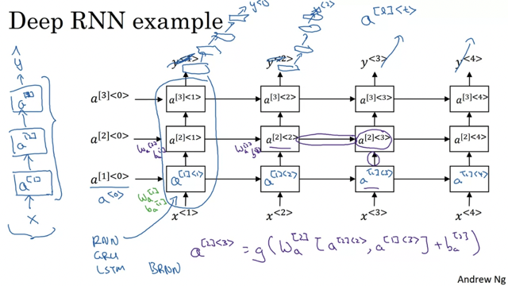</kbd>

  > - Đại khái là có thêm nhiều layer hơn, cũng dễ hiểu.
  >
  > Người ta thường không quá 3 layer vì cái này nó rất lớn, không như
  > Standard N.N.
  >
  > Và có thể từ layer 3 trở đi nó đi thêm vài bước nữa những  nó không có
  > kết nối ngang
  >
  > (\/A deep RNN can have multiple recurrent layers that are connected in
  > time, followed by a deep network that predicts the output\/.)

   

## Quiz

 

<kbd></kbd>

 

<kbd>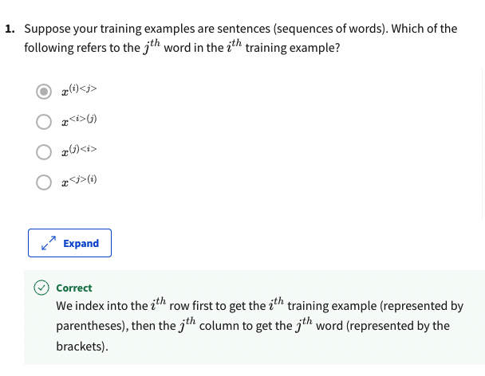</kbd>

 

<kbd>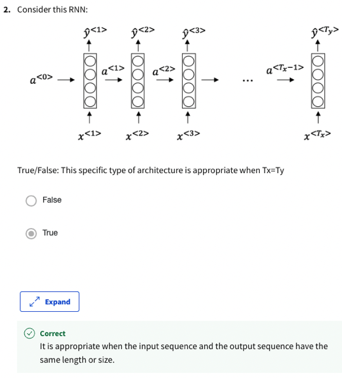</kbd>

 

<kbd>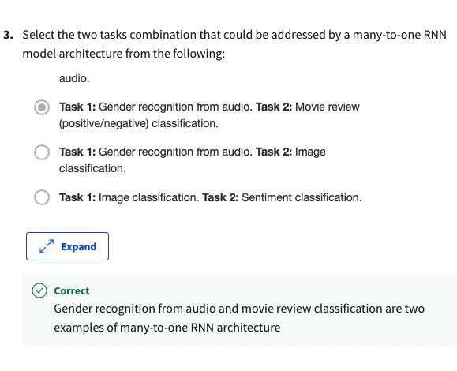</kbd>

 

<kbd>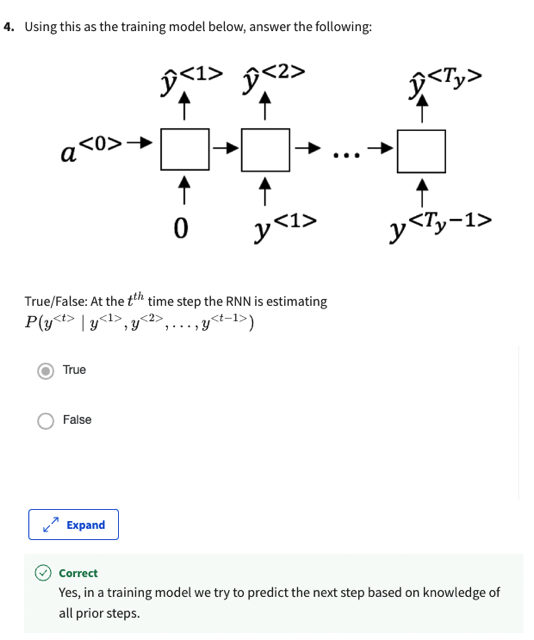</kbd>

 

<kbd>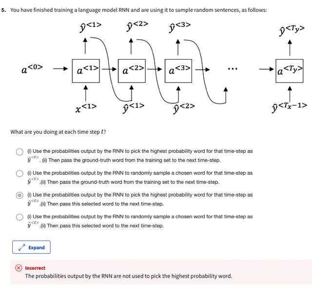</kbd>

> [!NOTE]
> Này đáng lý không nên sai, phải là dùng probability nhưng phải là chọn
> random (randomly sample) chứ không phải là lấy thằng có prob cao nhất.

 

<kbd>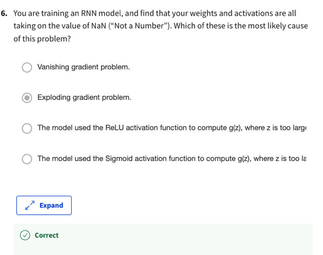</kbd>

 

<kbd>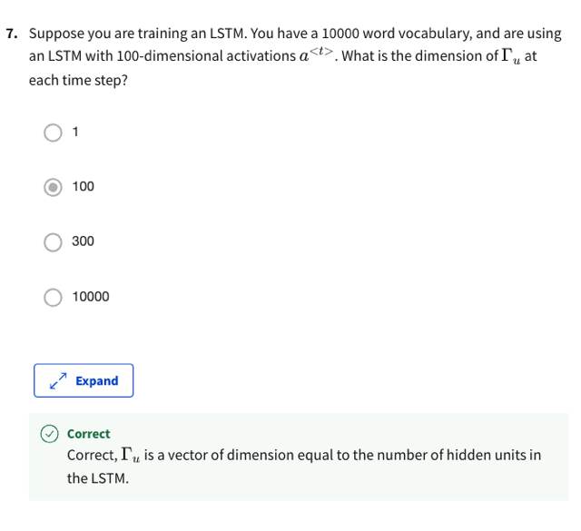</kbd>

> [!NOTE]
> Đoán bừa hên là trúng.

 

<kbd>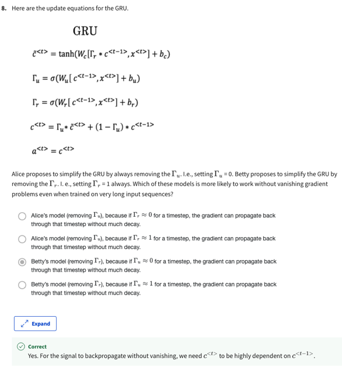</kbd>

<kbd></kbd>

<kbd>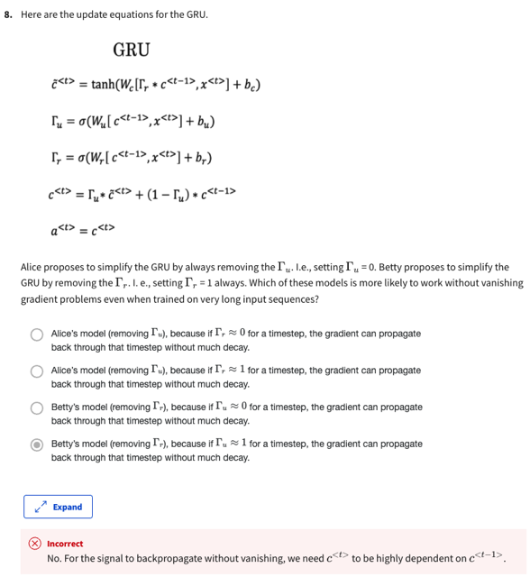</kbd>

> [!NOTE]
> Chua hiểu: muốn C<t> luôn bằng C<t-1> thì Alice đúng chứ

 

<kbd>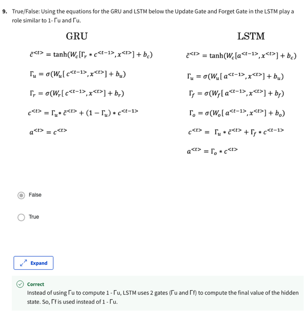</kbd>

 

<kbd>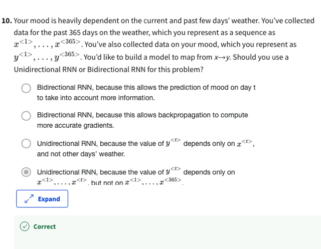</kbd>

 

## Programming Assignments 1

 

### Welcome to the first (required) programming exercise of Course 5 of the

> [!NOTE]
> Welcome to the first (required) programming exercise of Course 5 of the
> Deep Learning Specialization! In this notebook you will build a recurrent
> neural network (RNN) and an LSTM from scratch, using Numpy.
>
> By the end of this assignment, you'll be able to:  • Define notation for
> building sequence models  • Describe the architecture of a basic RNN  •
> Identify the main components of an LSTM  • Implement backpropagation
> through time for a basic RNN and an LSTM  • Give examples of several
> types of RNN
>
> Recurrent Neural Networks (RNN) are very effective for Natural Language
> Processing and other sequence tasks because they have "memory." They
> can read inputs  𝑥 ⟨𝑡⟩ (such as words) one at a time, and remember some
> contextual information through the hidden layer activations that get
> passed from one time step to the next. This allows a unidirectional
> (one-way) RNN to take information from the past to process later inputs. A
> bidirectional (two-way) RNN can take context from both the past and the
> future, much like Marty McFly.

 

- Packages
   

    
    
<kbd>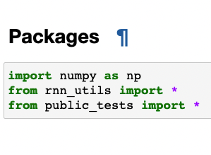</kbd>

     

- 1 - Forward Propagation for the Basic Recurrent Neural Network
   

  
  - 1 - Forward Propagation for the Basic Recurrent Neural Network:  Xem lại sơ đồ của Basic RNN với Tx = Ty
     

      
      
<kbd>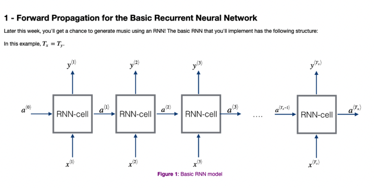</kbd>

       

      
      
<kbd>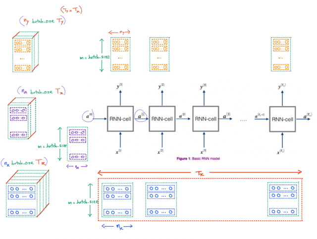</kbd>

      > a và y^ cũng vậy,

       

  
  - Dimensions: Kích thước các thứ  x(i) sẽ là (n_x, m, Tx)   x(i)<t> = xt là (n_x,m) a: (n_a, m) Y: (n_y, m, Ty)
     

      
      
<kbd>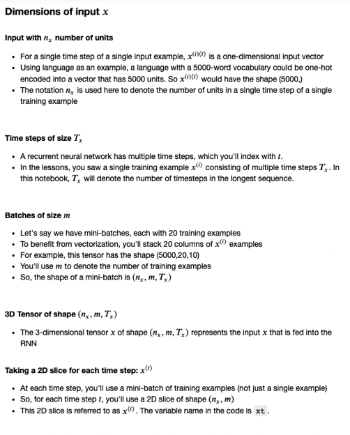</kbd>

      > Mỗi một **x(i)<t>** (ví dụ một word) trong sequence (ví dụ câu) sẽ
      > được ' encoded' thành một encoding vector có thể là **one-hot
      > encoded vector** trong đó số 1 tại vị trí của từ vocab list hoặc là
      > một **dense embedded vector** - vector chứa đựng nhiều thông tin
      > hữu ích về đặc tính của từ và quan hệ của nó đ.v các từ khác hơn
      > là one-hot encoded vector được training từ một Word Embedded
      > Model (đây là những cái học trong week 2, 3).
      >
      > Nên **nx** ở đây là chỉ độ dài của encoded/embedded vector này
      >
      > Do đó thì 1 data instance / sample x(i) sẽ có shape (Tx, nx) (Hay
      > nx, Tx - thứ tự không quan trọng)
      >
      > Tx sẽ là **độ dài của câu (sequence) dài nhất**, các câu ngăn hơn
      > sẽ được  **padding** (học trong w2,3)
      >
      > Và toàn bộ (m) X sẽ là **(nx, m, Tx)**gọi là **3D Tensor**Hoặc một batch_size sẽ là**(nx, batch_size, Tx)**
      >
      > Ở đây ổng cho m = batch_size luôn
      >
      > Hiểu được như vậy thì input của mỗi time step sẽ là:  (**nx**,
      > **batch_size** **= m**)
      >
      > *(Ghi chú từ lần review thứ 1)

       

      
      
<kbd></kbd>

       

  
  - 1.1 - RNN Cell: Đại khái là nói về mô hình của 1 RNN cell chia ra làm phần ruột tính ra a<t> và vần mở rộng (forward) dùng softmax để tính thêm y^<t> nhận input từ a<t-1> và x<t>
     

      
      
<kbd></kbd>

       

  
  - Exercise 1 - rnn_cell_forward  Nhận a_prev (a<t-1>) và xt , dùng tanh và param Waa, Wax, ba tính ra a (a<t) Dùng Softmax và Wya, by tính y^. Tạo cach chứa xt, a_prev, a, params
     

      
      
<kbd></kbd>

       

      
      
<kbd></kbd>

       

      
      
<kbd></kbd>

       

  
  - 1.2 - RNN Forward Pass: Đại khái xem trực quan mô hình  của forward pass RNN như thế nào.
     

      
      
<kbd></kbd>

       

  
  - Exercise 2 - rnn_forward(x, a0, params)  Ini a = zeros(na,m,Tx) y_pred = zeros(ny,m,Tx) Loop: For t in range T_x - Lấy ra xt = x[:,:,t] - Nếu là t = 0 thì aprev = a0, không thì aprev lấy từ a ra - Dùng function rnn_cell_forward(xt, aprev, params) để tính ra a_next, y_pred - Update a_next vào a, yt_pred vào y_pred, add cach và caches
     

      
      
<kbd></kbd>

       

      
      
<kbd></kbd>

      
<kbd></kbd>

      
<kbd></kbd>

      
<kbd></kbd>

      
<kbd></kbd>

       

      
      
<kbd></kbd>

       

  
  - Tóm lại một số điều cần nhớ:  Đại khái là RNN cơ bản là lặp lại 1 single cell nhiều lần  Một Basic RNN đọc input one at a time và ghi nhớ thông tin xuyên suốt qua các hidden layer. Mỗi cell nhận input là hidden state từ cell trước (a_prev) và current time data (xt) và trả ra hidden state (a<t>) và y_predict <t>  *Nhưng Basic RNN có nhược điểm là bị Vanishing Gradient và chỉ làm việc tốt nếu có local context đại khái là thông tin nó hỗ trợ nằm gần nhau chứ không qúa xa. x<t'> hỗ trợ y<t> với t' gần t
     

      
      
<kbd></kbd>

       

- 2 - Long Short-Term Memory (LSTM) Network
   

  
  - 2 - Long Short-Term Memory (LSTM) Network  Đại khái là Trình bày lại 'mô hình' của LSTM network cùng với notation.
     

      
      
<kbd></kbd>

       

      
      
<kbd></kbd>

      > Đại khái là Forget gate này np1 dùng sigmoid để mang 1 trong 2 giá trị 0 hay 1.
      >
      > Nó sẽ quyết định thông tin từ c_prev có được giữ lại và dùng cho  step kế tiếp hay
      > không.

       

      
      
<kbd></kbd>

       

      
      
<kbd></kbd>

       

      
      
<kbd></kbd>

       

      
      
<kbd></kbd>

       

  
  - 2.1 - LSTM Cell
     

      
      
<kbd></kbd>

       

  
  - Exercise 3 - lstm_cell_forward  Nhận xt, a_prev, c_prev tính giá trị của các 'gate', c~, a_next, yt_pred theo công thức
     

      
      
<kbd></kbd>

      
<kbd></kbd>

      
<kbd></kbd>

       

  
  - 2.2 - Forward Pass for LSTM
     

      
      
<kbd></kbd>

       

  
  - Exercise 4 - lstm_forward  Ini a, c = zeros(na,m,Tx) y_pred = zeros(ny,m,Tx) Loop: For t in range T_x - Lấy ra xt = x[:,:,t] - Nếu là t = 0 thì aprev = a0, không thì aprev lấy từ a ra - Dùng function lstm_cell_forward(xt, aprev, cprev params) để tính ra a_next, y_pred - Update a_next vào a, yt_pred vào y_pred, add cach và caches
     

      
      
<kbd></kbd>

       

      
      
<kbd></kbd>

      
<kbd></kbd>

      
<kbd></kbd>

       

  
  - \\*Congratulations! \\*You have now implemented the forward passes for both the basic RNN and the LSTM. When using a deep learning framework, implementing the forward pass is sufficient to build systems that achieve great performance. The framework will take care of the rest. \\*   What you should remember\\*:  • An LSTM is similar to an RNN in that they both use hidden states to pass along information, but an LSTM \\*also uses a cell state\\*, which is like a long-term memory, to help deal with the issue of vanishing gradients  • An LSTM cell consists of a \\_\\*cell state, or long-term memory\\*\\_, \\_\\*a hidden state, or short-term memory\\*\\_, along with 3 gates that constantly update the relevancy of its inputs:  ▪ A \\*forget\\* gate, which \\_\\*decides which input units should be remembered and passed along\\*\\_. It's a tensor with values between 0 and 1.  ◦ If a unit has a value close to 0, the LSTM will "forget" the stored state in the previous cell state.  ◦ If it has a value close to 1, the LSTM will mostly remember the corresponding value.  ▪ An \\*update\\* gate, again a tensor containing values between 0 and 1. It decides on \\_\\*what information to throw away, and what new information to add\\*\\_.  ◦ When a unit in the update gate is close to 1, the value of its candidate is passed on to the hidden state.  ◦ When a unit in the update gate is close to 0, it's prevented from being passed onto the hidden state.  ▪ And an \\*output\\* gate, which decides \\_\\*what gets sent as the output of the time step\\*\\_  Let's recap all you've accomplished so far. You have:  • Used notation for building sequence models  • Become familiar with the architecture of a basic RNN and an LSTM, and can describe their components  The rest of this notebook is optional, and will not be graded, but as always, you are encouraged to push your own understanding! Good luck and have fun.
     

- 3 - Backpropagation in Recurrent Neural Networks (OPTIONAL / UNGRADED)
   

  
  - 3.1 - Basic RNN Backward Pass
     

      
      
<kbd></kbd>

       

      
      
<kbd></kbd>

       

      
      
<kbd></kbd>

       

      
      
<kbd></kbd>

       

      
      
<kbd></kbd>

       

  
  - Exercise 5 - rnn_cell_backward
     

      
      
<kbd></kbd>

       

      
      
<kbd></kbd>

      
<kbd></kbd>

      
<kbd></kbd>

       

      
      
<kbd></kbd>

       

  
  - Exercise 6 - rnn_backward
     

      
      
<kbd></kbd>

       

      
      
<kbd></kbd>

      
<kbd></kbd>

      
<kbd></kbd>

       

      
      
<kbd></kbd>

       

  
  - 3.2 - LSTM Backward Pass
     

      
      
<kbd></kbd>

       

      
      
<kbd></kbd>

      > Cái chỗ 'choose wisely da_next xem chú giải trong hình (note) trong
      > nhánh trước (bản note tự làm  - xây dựng công thức)

       

      
      
<kbd></kbd>

       

      
      
<kbd></kbd>

       

      
      
<kbd></kbd>

       

      
      
<kbd></kbd>

       

      
      
<kbd></kbd>

       

      
      
<kbd></kbd>

       

      
      
<kbd></kbd>

       

      
      
<kbd></kbd>

       

      
      
<kbd></kbd>

       

  
  - Exercise 7 - lstm_cell_backward
     

      
      
<kbd></kbd>

       

      
      
<kbd></kbd>

       

      
      
<kbd></kbd>

       

  
  - 3.3 Backward Pass through the LSTM RNN
     

      
      
<kbd></kbd>

       

  
  - Exercise 8 - lstm_backward
     

      
      
<kbd></kbd>

       

      
      
<kbd></kbd>

       

  
  - Congratulations on completing this assignment! You now understand how recurrent neural networks work! In the next exercise, you'll use an RNN to build a character-level language model. See you there!
     

## Programming Assignments 2

 

### Character level language model - Dinosaurus Island Welcome to Dinosaurus Island! 65

> [!NOTE]
> Character level language model - Dinosaurus Island Welcome to Dinosaurus Island! 65
> million years ago, dinosaurs existed, and in this assignment, they have returned.
>
> You are in charge of a special task: Leading biology researchers are creating new
> breeds of dinosaurs and bringing them to life on earth, and your job is to give names to
> these dinosaurs. If a dinosaur does not like its name, it might go berserk, so choose
> wisely!
>
> Luckily you're equipped with some deep learning now, and you will use it to save the
> day! Your assistant has collected a list of all the dinosaur names they could find, and
> compiled them into this \\_dataset\\_. (Feel free to take a look by clicking the previous
> link.)
>
> To create new dinosaur names, you will\\_\\/\**build a character-level language model\**\\/\\_ to
> generate new names. Your algorithm will \\_\\/learn the different name patterns\\/\\_, and
> \\_\\/randomly generate new names\\/\\_. Hopefully this algorithm will keep you and your team
> safe from the dinosaurs' wrath!
>
> By the time you complete this assignment, you'll be able to:
>
> • \\_\\/Store text data for processing using an RNN\\/\\_
>
> • \\_\\/Build a character-level text generation model using an RNN\\/\\_
>
> • \\_\\/Sample novel sequences in an RNN\\/\\_
>
> • \\_\\/Explain the vanishing/exploding gradient problem in RNNs\\/\\_
>
> • \\_\\/Apply gradient clipping as a solution for exploding gradients\\/\\_

<kbd></kbd>

> [!NOTE]
> Chú ý: Đại khái là tạo môt 'language-model' - 'mô hình ngôn ngữ cấp kí tự' để
> tạo ra tên mới cho 1 loài khủng long dựa trên pattern của các loài hiện có.

 

- Packages
   

    
    
<kbd></kbd>

     

- 1 - Problem Statement
   

  
  - 1.1 - Dataset and Preprocessing  Đại khái là cho một danh sách tên khủng long. Và tìm ở trỏng có cả thảy bao nhiêu 'kí tự' gọi nó là  vocabulary list (đây là bài toán ở cấp)  'kí tự' chứ không phải 'từ' Chuẩn bị sẵn function chuyển / get từ index sang kí tự và ngược lại.
     

      
      
<kbd></kbd>

      > Đại khái là cho một danh sách tên khủng long.
      > Và tìm ở trỏng có cả thảy bao nhiêu 'kí tự' gọi nó là 
      > vocabulary list (đây là bài toán ở cấp) 
      > 'kí tự' chứ không phải 'từ'
      > Chuẩn bị sẵn function chuyển / get từ index sang kí tự và ngược lại.

       

  
  - 1.2 - Overview of the Model a.Nói về các bước (để xây dựng model) Ini params Run FP tính loss function Run BP tính gradient Clip the gradient để tránh Gradient Exploding Update gradient  b.Mô hình của RNN  Đại khái là tại mỗi lần <t>, dự đoán từ tiếp theo nên y<1> chính là x<2>, ..y<t> = x<t+1>
     

      
      
<kbd></kbd>

       

- 2 - Building Blocks of the Model  In this part, you will build two important blocks of the overall model:  1 Gradient clipping: to avoid exploding gradients  2 Sampling: a technique used to generate characters You will then apply these two functions to build the model. 
   

  
  - 2.1 - Clipping the Gradients in the Optimization Loop:  - Nói về hiện tượng gradient trở nên quá lớn - exploding gradient sẽ khiến G.D nó work không tốt, do đó phải làm động tác 'Gradient Clipping' thưc hiện trước khi update params để fix hiện tượng này.  - Nói về phương pháp Gradient Clipping - Simple Element-wise clipping trong đó đơn giản là cho 1 giới hạn, thằng nào quá giới hạn sẽ bị set.  - Dùng np.clip() cho vào 1 vector, và min, max và arg outer - thể hiện đầu ra.
     

      
      
<kbd></kbd>

      
<kbd></kbd>

      
<kbd></kbd>

       

  
  - Exercise 1 - clip  Dùng function np.clip. Clip cũng chỉ đơn giản là cho nó max, min, nó sẽ xem item nào Trong array lớn hơn max hay bé hơn min thì nó set về max, min. Vậy thôi, Để argument out = input để nó update luôn vào cái vả đưa giá trị vào. (Chứ khỏi lưu thành 1 var khác, kiểu vậy)  *Chú ý: Trong 'for gradient in gradients:...' thì gradient chỉ là string - tên các params, phải lấy ra = gradients[gradient]  \\/for gradient in gradients:         np.clip(gradients[gradient], -maxValue, maxValue, out=gradients[gradient])\\/
     

      
      
<kbd></kbd>

      > Chú ý: Trong 'for gradient in gradients:...' thì
      > gradient chỉ là string - tên các params, phải
      > lấy ra = gradients[gradient]

       

  
  - 2.2 - Sampling  Đầu tiên phải hiểu sampling là giả sử \\*ĐÃ TRAIN\\* model rồi, ta muốn xem thử nó generate một sequence mới như thế nào.  Đại khái là từ a<t-1>, x<t> input (ini bằng zeros vector), tính ra y^<1>  có dạng 1 vector có vocab'size element trong đó mỗi element là chỉ số thể  hiện 'probability (khả năng) của từ tiếp theo là chữ thứ 0,1,2...trong vocab list.  Dùng np.choice([0,1,..vocab's size], p = y^<t>.ravel()) để chọn ra ngẫu nhiên 1 idx trong  [0,1,..vocab's size] index rồi dùng idx tạo 1 one-hot vector x<t+1> có value bằng 1 tại idx này. Tiếp tục như vậy,,,  Nói thêm rằng nếu cứ dùng 'cái có max probability' thì nó luôn cho ra  cùng một kết quả nên làm kiểu 'random sampling' này để kiểu như thấy nhiều kết quả hơn   Function ravel() nhận n-D vector và biến thành 1D vector chỉ vậy thôi
     

      
      
<kbd></kbd>

       

      
      
<kbd></kbd>

       

  
  - Exercise 2 - sample
     

      
      
<kbd></kbd>

       

      
      
<kbd></kbd>

       

    
    - Đây, ở đây note lại ý này quan trọng, nếu ta select the most probable, thì model luôn tạo cùng một result - 1 sample tên khủng long everytime, nên mới dùng random choice để ' pick next character's index according to the probability distribution specified by y^<timestep trước>  Cái step thể hiện việc lấy predict thằng (time-step) trước làm input thằng sau là Step 4: Overwrite the input x ....  Nó tạo 1 vector zero độ dài bằng vocab size rồi sét số 1 vào index  mà được \\*chọn random.choice với probability  \\*(random. choice(rang, p=y.ravel())  Rồi gán cho x để lần loop kế tiếp dùng làm input
       

        
        
<kbd></kbd>

         

        
        
<kbd></kbd>

        
<kbd></kbd>

        
<kbd></kbd>

        
<kbd></kbd>

        
<kbd></kbd>

         

  
  - \\*What you should remember\\*:  • Very large, or "exploding" gradients updates can be so large that they "overshoot" the optimal values during back prop -- making training difficult  ▪ Clip gradients before updating the parameters to avoid exploding gradients  • Sampling is a technique you can use to pick the index of the next character according to a probability distribution.  ▪ To begin character-level sampling:  ◦ Input a "dummy" vector of zeros as a default input  ◦ Run one step of forward propagation to get 𝑎⟨1⟩ (your first character) and 𝑦̂ ⟨1⟩ (probability distribution for the following character)  ◦ When sampling, avoid generating the same result each time given the starting letter (and make your names more interesting!) by using \\_\\*np. random.choice\\*\\_
     

- 3 - Building the Language Model
   

  
  - 3.1 - Gradient Descent  In this section you will implement a function performing one step of stochastic gradient descent (with clipped gradients). You'll go through the training examples one at a time, so the optimization algorithm will be stochastic gradient descent.  As a reminder, here are the steps of a common optimization loop for an RNN:  • Forward propagate through the RNN to compute the loss  • Backward propagate through time to compute the gradients of the loss with respect to the parameters  • Clip the gradients  • Update the parameters using gradient descent
     

  
  - Exercise 3 - optimize  Đaị khái là người ta làm sẵn cho function optimize trong đó  họ update ra gradient cho 1 lần iteration của stochastic G.D Bao gồm:    • Forward propagate through the RNN to compute the loss  • Backward propagate through time to compute the gradients of  the loss with respect to the parameters  • Clip the gradients  • Update the parameters using gradient descent  Có nói thêm 1 tính chất của Python là khi bỏ 1 dictionary hay list  vào 1 function thì khi ta thay đổi gì thì ta thay đổi chính các object  đó chứ ko phải bản copy nên nó gọi là '\\*pass by reference\\*'
     

      
      
<kbd></kbd>

       

      
      
<kbd></kbd>

       

      
      
<kbd></kbd>

      
<kbd></kbd>

      
<kbd></kbd>

      
<kbd></kbd>

      
<kbd></kbd>

      > Loop trong range Tx = len(X)
      > Tương ứng mỗi t trong range ..xem hình vẽ cho dể hiểu

      > Giải thích cái khúc tính loss:
      >
      > Tại sao lại là **y^[1][Y[1]]**
      >
      > Đại khái là "Đối với dự đoán cho kí tự thứ 1, đáp án đúng phải là
      > chữ 'd' - kí tự thứ 3 (Y[1] = 3) trong vocab list. **Nhắc lại, Y là
      > vector chứa index của các kí tự đúng trong vocab list**.
      >
      > Vậy ta hãy xem thử dự đoán của model cho kí tự thứ 1 (y^[1])
      > rằng khả năng đáp án đúng chính là kí tự thứ 'd' là bao nhiêu %
      > (cao hay thấp).
      >
      > **y^[1] là vector chứa khả năng (Probability) của các kí tự trong 
      > vocab list là đáp án đúng [P('a'), P('b'), ...P('z')]**
      > và index của chúng trong vocab list tất nhiên lần lượt là 0,1,2,3,..
      >
      > Vậy để lấy "P('d')" - ta lấy 
      > Probability vector y^[1][index của nó trong vocab list]
      >
      > index của nó trong vocab list chính là Y[1]
      >
      > -> **y^[1][Y[1]]** Và nó chính là Loss của timestep <t> = <1>
      >
      >
      > Nếu p('d' - idx = '3') có giá trị cao thì np.log(p('d' - idx = '3')) cao
      > -> loss - np.log(..) sẽ khiến loss giảm nhiều.

      > Tại sao lại x[t][X[t]]
      >
      > Vì X là vector chứa INDEX của các kí tự trong vocab
      > nên kí tự thứ <t> / hay tại time step <t>
      > thì kí tự đó có index là X[t] trong vocab lít
      >
      > Mà ta cần construct một one-hot vector represent cho kí tự
      > đó với một list dài vocab size, số 1 nằm ở index của kí tự đó
      > trong vocab list, còn lại là số 0
      >
      > Nên x[t] ini là zeros((vocabsize, 1))
      > rồi gán số 1 vào index của kí tự đó chính là X[t]
      > Nên mới thành ra x[t][X[t]] = 1 là vậy

       

      
      
<kbd></kbd>

       

      
      
<kbd></kbd>

       

      
      
<kbd></kbd>

      > Step này thì Assignment trước đã làm

       

      
      
<kbd></kbd>

       

  
  - 3.2 - Training the Model  Cách..:  - Lấy một data sample x(i) ra và ...
     

      
      
<kbd></kbd>

      
<kbd></kbd>

      
<kbd></kbd>

      
<kbd></kbd>

      
<kbd></kbd>

      
<kbd></kbd>

      
<kbd></kbd>

      
<kbd></kbd>

      
<kbd></kbd>

      
<kbd></kbd>

      
<kbd></kbd>

      > idx=j%len(example)
      >
      > Đại khái là khi nó chạy Stochastic G.D mỗi iteration
      > (epoch) nó sẽ learn trên một bộ data sample mà ở đây
      > là 1 từ/ 1 tên trong danh sách tên khủng long.
      >
      > Ý nói ở đây là khi loop 1 -> max iterations thì nó lần lượt
      > lấy training set ra từ list, và khi hết list thì quay lại từ
      > đầu. Vậy phải set idx như thế nào.

      > single_example_chars = [c for c in single_example]
      >
      > single_example_ix = [char_to_ix[c] for c in single_example]
      >
      > Nói chung đây là một cái khá hay của Python. Làm qua mới biết.

      > ix_newline = char_to_ix['\n']
      >
      > Y = X[1:] + [ix_newline]
      >
      > Đại khái là 
      > 1. Vì Y[0] = X[1] , Y[1] = X[2] ...
      > nên define Y = X[1:] (lấy từ item 1 trở đi)
      >
      > 2. Rồi append ix_newline ở cuối, mà muốn vậy phài dùng append
      > hoặc cộng array [a] + [b], nên phải bỏ ix_newline vào [] để tạo array

       

      
      
<kbd></kbd>

       

  
  - \\*Conclusion \\*You can see that your algorithm has started to generate plausible dinosaur names towards the end of training. At first, it was generating random characters, but towards the end you could begin to see dinosaur names with cool endings. Feel free to run the algorithm even longer and play with hyperparameters to see if you can get even better results! Our implementation generated some really cool names like maconucon, marloralus and macingsersaurus. Your model hopefully also learned that dinosaur names tend to end in saurus, don, aura, tor, etc.  If your model generates some non-cool names, don't blame the model entirely -- not all actual dinosaur names sound cool. (For example, dromaeosauroides is an actual dinosaur name and is in the training set.) But this model should give you a set of candidates from which you can pick the coolest!  This assignment used a relatively small dataset, so that you're able to train an RNN quickly on a CPU. Training a model of the English language requires a much bigger dataset, and usually much more computation, and could run for many hours on GPUs. We ran our dinosaur name for quite some time, and so far our favorite name is the great, the fierce, the undefeated: \\*Mangosaurus\\*!
    
<kbd></kbd>

     

  
  - Exercise 4 - model
     

- 4 - Writing like Shakespeare (OPTIONAL/UNGRADED)
   

- 5 - References   • This exercise took inspiration from Andrej Karpathy's implementation:  \\_https://gist.github.com/karpathy/d4dee566867f8291f086\\_.  To learn more about text generation, also check out Karpathy's \\_blog post\\_. 
   

## Programming Assignments 3

 

### Improvise a Jazz Solo with an LSTM Network Welcome to your final

> [!NOTE]
> Improvise a Jazz Solo with an LSTM Network Welcome to your final
> programming assignment of this week! In this notebook, you will implement a
> model that uses an LSTM to generate music. At the end, you'll even be able to
> listen to your own music!
>
> \**By the end of this assignment, you'll be able to:\**
>  • Apply an LSTM to a music generation task
>  • Generate your own jazz music with deep learning
>  • Use the flexible Functional API to create complex models
>

<kbd></kbd>

> [!NOTE]
> Đại khái là :
>
> Build model **bằng Keras**, thay vì **numpy** (define function, run
> Gradient Descent...nói chung là tự làm từ đầu đến cuối)
>
> Ví dụ như làm bằng numpy và Keras thì khác nhau ra sao:
>
> \_***Bằng numpy:**\_
> Giống như assignment trước (trong def **model()**, dùng function **optimize**()),
> phải viết các function để làm các step như:
> Loop trong iteration:..
> 1/ Xử lý input (tạm gọi vậy)
>
> 2/ (Trong \/**optimize**\/():)
> - Forward loop để tính loss:
>   For loop trong Tx
>   Tính a<t>, c<t> bằng cách tạo function forward_prop 
>   để tính các giá trị của các gate, c~ này kia dùng 
>   np.tanh(..), np.sigmoid(..)
>   Sau đó tính y^ bằng softmax
> - Backward loop để tính gradient (nhiều function nhỏ khác)
> - Gradient clipping 
> - Update gradient
>
> \_***Bằng Keras:**\_  tạo model với **LSTM** (để nó sẽ handle việc tính mấy
> cái như a, c), **Dense** (handle việc tính a bằng softmax) 
> - Có model rồi chỉ cần gọi 
> .**compile**('optimizer', 'cost function') 
> .**fit**() là xong, nó sẽ làm cái việc training cho mình.

 

- Packages
   

    
    
<kbd></kbd>

     

- 1 - Problem Statement  You would like to create a jazz music piece specially for a friend's birthday. However, you don't know how to play any instruments, or how to compose music. Fortunately, you know deep learning and will solve this problem using an LSTM network! You will train a network to generate novel jazz solos in a style representative of a body of performed work.
   

  
  - 1.1 - Dataset  Nói sơ lược về data và các size
     

      
      
<kbd></kbd>

       

      
      
<kbd></kbd>

       

      
      
<kbd></kbd>

      > Ý quan trọng cần hiểu là input là tương tự như assignment trước, nơi mà
      > mỗi 1 từ hay kí tự trong sequence sẽ là 1 vector (one-hot vector có size
      > bằng vocab list) thì ở đây nó là one-hot vector có size 90 kiểu như có 90
      > music value khác nhau.

       

  
  - 1.2 - Model Overview
     

      
      
<kbd></kbd>

      > Mấy cái dòng dưới chưa hiểu lắm
      >
      > Window of size Tx scanned over the musical
      > corpus là sao?
      >
      > Each x<t> is an index corresponding to a
      > value?

       

- 2 - Building the Model
   

    
    
<kbd></kbd>

    
<kbd></kbd>

    
<kbd></kbd>

     

- Exercise 1 - djmodel  Đại khái là :  Build model \\*bằng Keras\\*, thay vì \\*numpy\\* (define function, run Gradient Descent...nói chung là tự làm từ đầu đến cuối)  Ví dụ như làm bằng numpy và Keras thì khác nhau ra sao:  \\_\\**Bằng numpy:  \\*\\_ Giống như assignment trước (trong def \\*model()\\*, dùng function \\*optimize\\*()), phải viết các function để làm các step như: Loop trong iteration:.. 1/ Xử lý input (tạm gọi vậy)  2/ (Trong \\/\\*optimize\\*\\/():) - Forward loop để tính loss:   For loop trong Tx   Tính a<t>, c<t> bằng cách tạo function forward_prop    để tính các giá trị của các gate, c~ này kia dùng    np.tanh(..), np.sigmoid(..)   Sau đó tính y^ bằng softmax - Backward loop để tính gradient (nhiều function nhỏ khác) - Gradient clipping  - Update gradient   \\_\\**Bằng Keras: \\*\\_  tạo model với \\*LSTM\\* (để nó sẽ handle việc tính mấy cái như a, c), \\*Dense\\* (handle việc tính a bằng softmax)  - Có model rồi chỉ cần gọi  .\\*compile\\*('optimizer', 'cost function')  .\\*fit\\*() là xong, nó sẽ làm cái việc training cho mình.
   

    
    
<kbd></kbd>

    > Đại khái là khi define Input shape thì khỏi nhắc đến m, nó tự biết size là m,..,..

     

    
    
<kbd></kbd>

     

    
    
<kbd></kbd>

    
<kbd></kbd>

    
<kbd></kbd>

    > Đại khái là :
    >
    > Build model **bằng Keras**, thay vì **numpy** (define function, run
    > Gradient Descent...nói chung là tự làm từ đầu đến cuối)
    >
    > Ví dụ như làm bằng numpy và Keras thì khác nhau ra sao:
    >
    > \_***Bằng numpy:**\_
    > Giống như assignment trước (trong def **model()**, dùng function **optimize**()),
    > phải viết các function để làm các step như:
    > Loop trong iteration:..
    > 1/ Xử lý input (tạm gọi vậy)
    >
    > 2/ (Trong \/**optimize**\/():)
    > - Forward loop để tính loss:
    >   For loop trong Tx
    >   Tính a<t>, c<t> bằng cách tạo function forward_prop 
    >   để tính các giá trị của các gate, c~ này kia dùng 
    >   np.tanh(..), np.sigmoid(..)
    >   Sau đó tính y^ bằng softmax
    > - Backward loop để tính gradient (nhiều function nhỏ khác)
    > - Gradient clipping 
    > - Update gradient
    >
    > \_***Bằng Keras:**\_  tạo model với **LSTM** (để nó sẽ handle việc tính mấy
    > cái như a, c), **Dense** (handle việc tính a bằng softmax) 
    > - Có model rồi chỉ cần gọi 
    > .**compile**('optimizer', 'cost function') 
    > .**fit**() là xong, nó sẽ làm cái việc training cho mình.

     

    
    
<kbd></kbd>

    
<kbd></kbd>

    
<kbd></kbd>

     

    
    
<kbd></kbd>

     

    
    
<kbd></kbd>

     

- 3 - Generating Music
   

  
  - 3.1 - Predicting & Sampling:  Đại khái là làm công tác 'Sampling' - nhớ lại sampling là lấy y^ thằng trước bỏ vào thằng sau để run.  Đại khái là sample này nó giúp 'coi thử' (trong quá trình train) thì  kết quả sẽ kiểu như thế nào.  Ở assignment trước đã làm với numpy (function sample()) thì giờ làm với Keras  Và hơn nữa là sẽ dùng nó để tạo thử 1 đoạn nhạc.
     

      
      
<kbd></kbd>

      > Đại khái là làm công tác 'Sampling' - nhớ lại
      > sampling là lấy y^ thằng trước bỏ vào thằng sau để
      > run.
      >
      > Đại khái là sample này nó giúp 'coi thử' (trong quá trình train, 
      > đúng hơn là model đã trained work như thế nào) thì 
      > kết quả sẽ kiểu như thế nào.
      >
      > Ở assignment trước đã làm với numpy (function
      > sample()) thì giờ làm với Keras
      >
      > Và hơn nữa là sẽ dùng nó để tạo thử 1 đoạn nhạc.

       

  
  - Exercise 2 - music_inference_model  Cũng define model bằng keras.LSTM, keras.Dense để tính lấy ra out bỏ vào outpus.  Chỉ thêm bước "\\/l\\*ấy prediction thằng trước bỏ vào làm thành x thằng sau\\/" \\* (x<t+1> = y^<t>)  Giải thích cái đoạn  x = tf.math.argmax(out, axis=1) x = tf. one_hot(indices=x, depth=n_values)  Out ở đây chính là y^<t>, vậy nó là vector chứa các giá trị p thì ở bài này thay vì dựa vào vector này để lấy random.choice thì ở đây lấy luôn thằng nào có P có giá trị max. Cụ thể x = tf.math.argmax(out, axis=1) nó lấy vị trí (index) của cái thằng có P cao nhất trong vector dòng sau là nó tạo one-hot vector một cách rất gọn nhờ function của tensorFlow. Rồi gán cho x, nên lần loop tiếp nó x chính là y_pred của lần loop trước. \\*(Để ý ổng gợi ý dùng 'x', not 'x0' là vì vậy)  \\*Còn model bình thường x nó lấy từ '\\*Input\\*' layer
     

      
      
<kbd></kbd>

      
<kbd></kbd>

      
<kbd></kbd>

       

      
      
<kbd></kbd>

      
<kbd></kbd>

      
<kbd></kbd>

      > Chú ý ổng nhấn mạnh LSTM_cell và Desne là trained - đã được train.
      > Tức là sampling là làm đv 1 model đã train để 'coi' nó ..làm / work)..,
      > như thế nào

       

    
    - Cũng define model bằng keras.LSTM, keras.Dense để tính lấy ra out bỏ vào outpus.  Chỉ thêm bước "\\/\\*lấy prediction thằng trước bỏ vào làm thành x thằng sau"\\*\\/  (x<t+1> = y^<t>)  Thể hiện ở chỗ trong loop Ty, bỏ input của LSTM_cell là x, rồi tính  output gán vào cho x: _, a, c = LSTM_cell(input=x,....) .. x = tf.one_hot(....)  Giải thích cái đoạn   x = tf.math.argmax(out, axis=1)  x = tf.one_hot(indices=x, depth=n_values)  Out ở đây chính là y^<t>, vậy nó là vector chứa các giá trị p thì ở bài này \\*thay vì dựa vào vector này để lấy random.choice là thì ở đây lấy luôn thằng nào có P có giá trị max. \\*  Cụ thể x = tf.math.argmax(out, axis=1) nó lấy \\*vị trí (index) của cái thằng có P  cao nhất trong vector\\*  Sau đó là nó \\*tạo one-hot vector một cách rất gọn\\* nhờ function tf.\\*one_hot\\*() của  tensorFlow.
       

      
      - Cuối cùng gán cho x để rồi lần loop tiếp nó input x của LSTM_cell chính là y_pred của lần loop trước.  Đây chính là điểm thể hiện dòng kẻ màu đỏ lấy cái predict cái trước bỏ vào làm input cái tiếp theo trong mô hình. Chỉ nhớ là lần này không lấy random dựa trên probability distribution như assignment Dinarsour mà lấy luôn thằng cao nhất. Nhớ lại việc lấy random ở bài trước là do muốn ra mỗi lần mỗi khác, còn lần này làm như kiểu này thì nó chỉ ra lần nào cũng giống nhau.  (Để ý ổng gợi ý dùng 'x', not 'x0' là vì vậy)  Còn model bình thường x nó lấy từ 'Input' layer
         

          
          
<kbd></kbd>

           

  
  - Exercise 3 - predict_and_sample
     

      
      
<kbd></kbd>

       

      
      
<kbd></kbd>

       

      
      
<kbd></kbd>

      > kết qủa của inference_model.predict(..) là
      > ouputs chứa Ty probability vectors p<t>
      >
      > [p<1> , p<2> , ...p<Ty>].
      >
      > Nên argmax là ra index của giá trị cao nhất của từng vector.

       

    
    - Không note vài bữa để lâu quay lại có khi không hiểu chỗ này: Tại sao trong music_inference_model()..x=tf.math.argmax(out, axis=1)  mà trong predict_and_sample()..indices = tf.math.argmax(pred, axis=2)  Vì \\*out\\* ở lúc tính x là \\*probability vector\\* \\*có size là vocab size (1, vocabsize)\\* và ta cần lấy ra cái \\*index\\* của cái thằng lớn nhất. Đọc lại cái instruct chổ step 2D nên hiểu được phải lấy axis cuối ở đây là 1 do shape của nó là 2D nên index các axis là 0,1. \\*Tóm lại shape của out là (1, vocabsize)  hoặc nếu chạy 1 batch thì là (batch_szie, vocabsize) -> 2 axis 0,1  Lấy argmax trên trục của vocabsize là lấy axis = 1 \\* Còn cái pred, thì là kết quả của cả quá trình sample, nó chứa Ty cái vector \\*out ở trên \\*(chạy trong loop Ty, tính LSTM_cell ra a, c -> qua densor(a) ra out append out vào outputs, ..rồi chuyển xuốn cho x = tf.math.argmax(out)...\\*)  Vậy nên pred là 1 (hoặc batch_size m) cái x Ty x vocabsize -> 3 axis 0,1,2  Lấy argmax trên trục của vocabsize là lấy axis = 2 \\*
       

    
    - Chỗ này không chắc lắm nhưng chắc là đúng thôi:  Lúc tính x nó tạo từng one-hot vector nên nó tạo bằng \\*tf. one-hot, \\*chỉ định chỗ nào số 1 bởi \\*một\\* giá trị index  còn ở lúc tính y, nó là 1 matrix nên nó dùng \\*to_categorical, cũng tạo one-hot vector nhưng nhiều cái cùng lúc, nên bỏ vào indices là array các index\\*
       

    
    - Như vậy cuối cùng tạo ra là 1 bộ one-hot vector mỗi cái đại diện cho 1 music value được lấy từ thằng (probability cao nhất output sau mỗi timestep)  Rồi nó mới lấy cái này, bỏ vào bước post-processing để tạo ra đoạn nhạc
       

      
      
<kbd></kbd>

       

  
  - 3.2 - Generate Music
     

      
      
<kbd></kbd>

       

  
  - \\*Congratulations!  \\*You've completed this assignment, and generated your own jazz solo! The Coltranes would be proud.  By now, you've:  • \\*Applied an LSTM\\* to a music generation task  • Generated your own jazz music with deep learning  • Used the \\*flexible Functional API\\* to create a more complex model This was a lengthy task. You should be proud of your hard work, and hopefully you have some good music to show for it. Cheers and see you next time!  \\*What you should remember:\\*  • A \\*sequence model\\* can be used to generate musical values, which are then post-processed into midi music.  • You can use a fairly similar model for tasks ranging from generating dinosaur names to generating original music, with the only major difference being the input fed to the model.  • In Keras, \\*sequence generation involves defining layers with shared weights, which are then repeated for the different time steps\\*
     

- 4 - References  The ideas presented in this notebook came primarily from three computational music papers cited below. The implementation here also took significant inspiration and used many components from Ji-Sung Kim' s GitHub repository.  • Ji-Sung Kim, 2016, \\_deepjazz\\_  • Jon Gillick, Kevin Tang and Robert Keller, 2009. \\_Learning Jazz Grammars\\_  • Robert Keller and David Morrison, 2007, \\_A Grammatical Approach to Automatic Improvisation\\_  • François Pachet, 1999, \\_Surprising Harmonies\\_ Finally, a shoutout to François Germain for valuable feedback.
   

