# C5w2_natural Language Processing & Word Embeddings

📊 **Progress:** `39` Notes | `108` Screenshots

---

Natural language processing with deep learning is a powerful combination.
Using word vector representations and embedding layers, train recurrent
neural networks with outstanding performance across a wide variety of
applications, including sentiment analysis, named entity recognition and
neural machine translation. Learning Objectives

• Explain how word embeddings capture relationships between words  •
Load pre-trained word vectors  • Measure similarity between word vectors
using cosine similarity  • Use word embeddings to solve word analogy
problems such as Man is to Woman as King is to ______.  • Reduce bias in
word embeddings  • Create an embedding layer in Keras with pre-trained
word vectors  • Describe how negative sampling learns word vectors more
efficiently than other methods  • Explain the advantages and disadvantages
of the GloVe algorithm  • Build a sentiment classifier using word embeddings
• Build and train a more sophisticated classifier using an LSTM

## Introduction To Word Embeddings

 

### Word Representation

 

#### 1 Last week's topics: RNNs, GRUs, and LSTMs.  2 NLP is being revolutionized by deep learning.  3 Word embeddings are a way of representing words.  4 The weakness of one-hot representation is that it treats each word as a separate entity and doesn't allow for generalization across words.  5 Featurized representations could allow for better generalization and recognition of relationships between words.  6 Features can include gender, royalty, age, whether it is food, size, cost, etc.  7 A 300-dimensional vector can represent a word in a featurized representation.  8 Apple and orange would have similar representations in a featurized representation.

> [!NOTE]
> 1 Introduction to NLP with deep learning:
>  • NLP is a feature of AI that is being revolutionized by deep learning.
>  • The focus of this week is on how RNNs, GRUs, and LSTMs can be applied to NLP.
>  • Word embeddings are a key idea in NLP that helps represent words in a more meaningful way.
>  • With word embeddings, it is possible to build NLP applications even with relatively small labeled training sets.
>  • The end of the week will focus on debiasing word embeddings to reduce gender or ethnicity bias that learning algorithms can sometimes pick up.
>  2 Limitations of one-hot vector representation:
>  • One-hot vector representation treats each word as a separate entity and doesn't allow algorithms to easily generalize across words.
>  • For example, if a language model has learned that "I want a glass of orange juice" is a likely sentence, it may not easily recognize that "I want a glass of apple juice" is also a likely sentence because the relationship between apple and orange is not recognized as closer than the relationship between other words such as man, woman, king, queen, and orange.
>  • The inner product of any two different one-hot vectors is zero, which means that the distance between any pair of these vectors is the same.
>  • This limitation makes it difficult for algorithms to recognize that some words are more similar than others.
>  3 Featurized representation with word embeddings:
>  • Word embeddings allow us to learn a featurized representation of each word.
>  • Each word can have a set of features and values associated with it, such as gender, royalty, age, food, size, cost, etc.
>  • For example, the gender associated with man might be -1, and the gender associated with woman might be +1.
>  • Eventually, each word can have a set of feature values, such as -0.95 for king, +0.97 for queen, and genderless for apple and orange.
>  • The result is a 300-dimensional vector that represents each word, with each dimension representing a different feature.
>  • These vectors can be denoted by e subscript [word number] (e.g. e5391 for man, e9853 for woman).
>  • This representation allows algorithms to recognize that some words are more similar than others based on their feature values.

 

<kbd>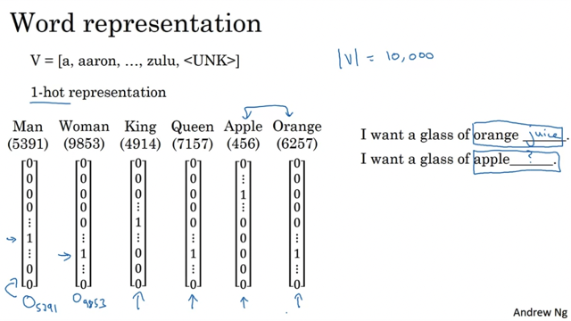</kbd>

> [!NOTE]
> Đại khái là cách define one-hot vector **(one-hot representation)** cho
> các từ không giúp nắm bắt được thực tế có những từ liên quan gần
> nhau như  'Apple' và "Orange', 'King' và ' Queen'
>
> Kiểu như dot(a,b) nào cũng = 0
>
> Nên ngay cả khi thuật toán học được câu trả lời là 'I want a glass of
> orange juice' thì khi làm câu tương tự với 'apple' nó cũng phải  học lại từ
> đầu.

 

<kbd>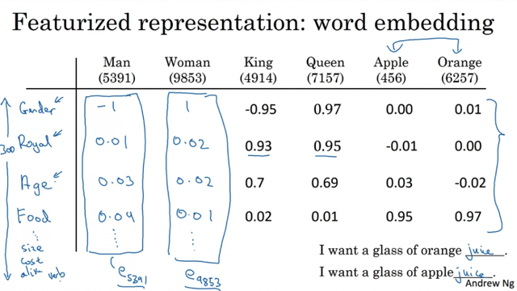</kbd>

> [!NOTE]
> Đại khái là nếu ta có thể tạo feature vector kiểu như này cho các  từ
> thì ta có thể nắm bắt được từ nào là gần nhau, từ nào là food, từ nào
> là đàn ông, đàn bà ....Tức là khai thác được nhiều hơn  đặc tính của
> từng từ. Gọi là (**featurized representation**)
>
> Thực tế thì word vector được define phức tạp hơn như đại khái là vậy,

 

<kbd>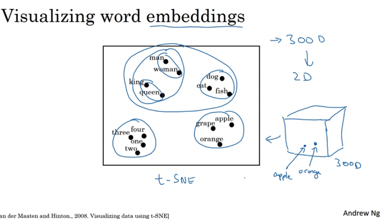</kbd>

> [!NOTE]
> Khái niệm 'Embedded' - Đại khái là việc xây dựng các vector cho 
> các word như slide trước đã nói, từ đó hình dung trong không
> cian 300 chiều (giả sử vector có 300 features), các từ sẽ group
> lại thành nhóm do tương quan giống nhau giữa chúng.
>
> Và t-SNE là phương pháp để plot cái đó thành 2D để xem được

 

### Using Word Embeddings

 

#### Tiếp đại khái ý nói là cái word embedding này có thể được **'làm' bởi large dataset** với hàng tỷ từ trên internet (tự làm hay download pretrained word embedding) chỉ cần **dùng lại** nó trong vấn đề của mình (như name entity recognition vốn **có ít data  hơn** nhiều) - Chính là **'transfer learning'**Cuối cùng đại khái là khái niệm embedding nó rất gần với  khái niệm encoding trong face encoding.****Đúng hơn là ta **train ra 1 cái network để làm công tác encoding**: là cho 1 cái hình vào thì encoding ra được 1 vector sao cho cùng 1 người thì 2 vector gần nhau, khác người thì xa nhau. Và làm được vậy mới bất kì khuôn mặt mới nào.  Còn word embedding là ta sẽ tạo cho **mỗi từ một fixed value vector mang đặc tính của từ đó**, và chỉ cần làm với 1 giới hạn từ vì từ lạ cứ cho là Unknown thôi Nói chung là hai khái niệm này rất gần nhau chỉ khác nhau do cách làm.

 

<kbd>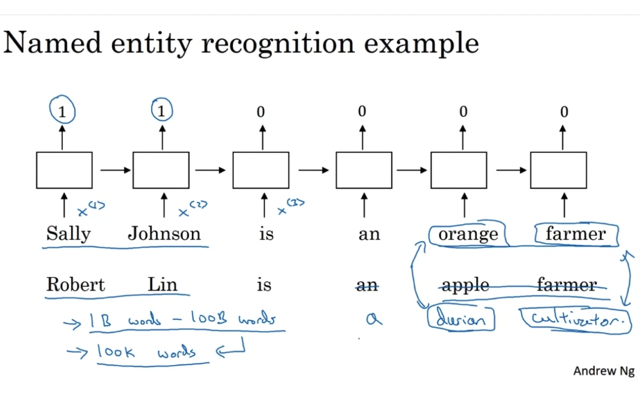</kbd>

> [!NOTE]
> Đại khái là quay lại nói về 'name entity recognition' task, mà ta  đã xác
> định Sally Johnson là tên người, thì với việc bây giờ ta  có 'featurized
> representation' thì sẽ rất dễ cho thuật toán biết được Robert Lin cũng
> là tên người do apple farmer rất gần với orange  farmer.
>
> Tiếp đại khái ý nói là cái word embedding này có thể được **'làm' bởi
> large dataset** với hàng tỷ từ trên internet (tự làm hay download
> pretrained word embedding) chỉ cần **dùng lại** nó trong vấn đề của
> mình (như name entity recognition vốn **có ít data  hơn** nhiều) -
> Chính là **'transfer learning'**

 

<kbd>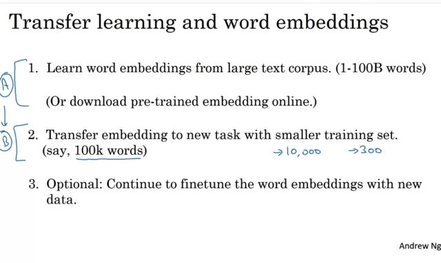</kbd>

> [!NOTE]
> Tóm lại đại khái rất đơn giản là 
> 1. Learn hoặc download pretrained cái word embedding 
> bằng large dataset trên internet
>
> 2. Dùng cái word embedding đó trong bài toán cụ thể cuả mình 
> mà có ít data hơn nhiều
>
> Thay vì dùng 10000 dimension one-hot vector
> thì giờ chỉ cần dùng 300 'dense' vector
>
> 3. Có thể tiếp tục fine-tune cái word embedding đó với data mới
> (chỉ khi dataset của mình cũng không nhỏ thì làm)

> [!NOTE]
> Tiếp đại khái nói là Transfer Learning chỉ useful khi data A lớn
> hơn nhiều data B, nên đ/v một số task của NLP như "
> **named entity recognition**, "**text summarization",** "
> **co-reference resolution**" thì nó ok, còn đ/v "**translation
> modeling**" nơi mà ta có 1 large dataset cho nó thì không

 

<kbd>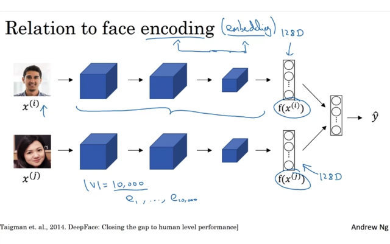</kbd>

> [!NOTE]
> Cuối cùng đại khái là khái niệm embedding nó rất gần với  khái niệm
> encoding trong face encoding.
>
> Face encoding là nó được train bởi neural network (Siamese network
> architecture) để tạo ra **128 dimensional representation of different faces**rồi so sánh để xác định có phải cùng 1 người ko.
>
> Đúng hơn là ta **train ra 1 cái network để làm công tác encoding**: là cho
> 1 cái hình vào thì encoding ra được 1 vector sao cho cùng 1 người thì 2
> vector gần nhau, khác người thì xa nhau. Và làm được vậy mới bất kì
> khuôn mặt mới nào.
>
> Còn word embedding là ta sẽ tạo cho **mỗi từ một fixed value vector
> mang đặc tính của từ đó**, và chỉ cần làm với 1 giới hạn từ vì từ lạ cứ
> cho là Unknown thôi Nói chung là hai khái niệm này rất gần nhau chỉ
> khác nhau do cách làm.

 

### Properties Of Word Embeddings

 

#### 1 Word embeddings can help in building NLP applications.  2 Word embeddings can also help with analogy reasoning.  3 A four-dimensional vector can be used to represent words in this example.  4 The gender is the main difference between man and woman and also between king and queen, as represented by these vectors.  5 An algorithm can compute the difference between vectors to find a word that completes an analogy.  6 The algorithm can find a word w that maximizes the similarity e w compared to e king minus e man plus e woman.  7 Research papers report 30-75% accuracy on analogy using tasks like these.

> [!NOTE]
> Sure, here are the main ideas from the video:
>  1 Word embeddings can be used to build NLP applications. One of the interesting properties of word embeddings is their ability to help with analogy reasoning.
>  2 To illustrate this, consider the question: "man is to woman as king is to what?" Many people would answer "queen." However, is it possible for an algorithm to figure this out automatically?
>  3 To answer this question, imagine representing man, woman, king, and queen as four-dimensional vectors, where each dimension represents some feature (e.g., gender). By subtracting the vector for woman from the vector for man, we get a vector that captures the difference between the two genders. Similarly, by subtracting the vector for queen from the vector for king, we get another vector that captures the difference between the two genders.
>  4 If we want to find the word that is analogous to "queen" in the context of the given analogy, we can try to find a vector that is close to the vector we get by subtracting the vector for woman from the vector for man and adding the vector we get by subtracting the vector for queen from the vector for king.
>  5 More formally, we can try to find a word w that maximizes the similarity between the vector for w and the vector we just described. If we use an appropriate similarity function, this should let us pick out the word "queen" as the most analogous word.
>  6 This method has been shown to work surprisingly well in practice, with research papers reporting anywhere from 30% to 75% accuracy on analogy tasks. This has helped the NLP community develop better intuitions about what word embeddings are doing.

 

<kbd>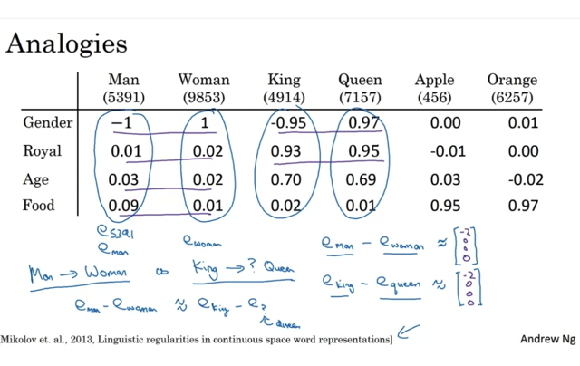</kbd>

> [!NOTE]
> Đại khái là nhờ Word Embedding, ta có thể giải bài toán
> 'Man to woman like King to ...' bằng cách tìm từ nào mà
> khiến eMan - eWoman gằn bằng eKing - e??? vì như thế 
> ta sẽ tìm đc queen vì chính xác 2 cặp này là về Gender

 

<kbd>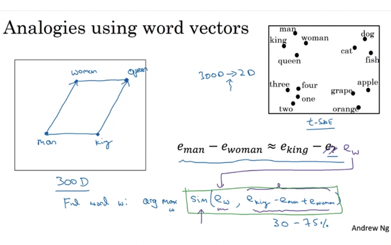</kbd>

> [!NOTE]
> Ổng nói research paper cho biết
> phương pháp này cho độ chính
> xác khá ok từ 30-75%

 

<kbd>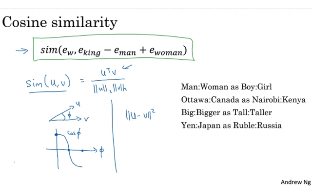</kbd>

> [!NOTE]
> Tên là hàm cosine vì nó chính là cosine giữa 2 vector 
>
> Có thể dùng ||u-v||**2 vốn là hàm tính sự khác nhau giữa 2
> vector, nên phải lấy '-' để chỉ sự giống nhau. Nhưng người
> ta thường dùng hàm cosine hơn.
>
> Nói chung là nếu train dc Word Embedding với large word cortex
> thì sẽ rất dễ dàng tìm được các cặp từ kiểu vậy

 

### Embedding Matrix

 

#### • Formalizing the problem of learning a good word embedding  • Learning an embedding matrix when implementing a word embedding algorithm  • The embedding matrix is a 300-dimensional by 10,000-dimensional matrix for a 10,000-word vocabulary  • The columns of the matrix represent embeddings for the words in the vocabulary  • A one-hot vector is used to represent each word in the vocabulary  • The product of the embedding matrix and a one-hot vector selects the corresponding embedding for the word  • The notation "E 6257" represents the embedding vector for the word " Orange"

 

<kbd>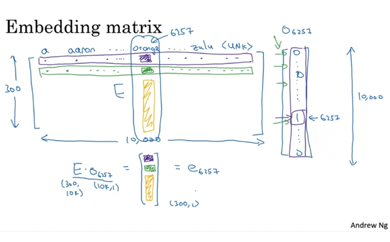</kbd>

> [!NOTE]
> Đại khái là tính (lấy ra) vector e6257 (embedding của từ)
> bằng cách mấy matrix E (Embedding matrix) nhân với
> one-hot vector o6256
>
> Sao không lấy ra bằng E[6257] ta -> Computational Expensive

 

## Learning Word Embeddings: Word2vec & Glove

 

### Learning Word Embeddings

 

#### 1 In this video, you'll learn some concrete algorithms for learning word embeddings, which are used in natural language processing.  2 Historically, researchers used relatively complex algorithms to learn word embeddings. However, over time, they discovered that simpler algorithms could also provide good results, especially for large datasets.  3 Some of the most popular algorithms today are so simple that they might seem almost magical. Therefore, the video will start by introducing slightly more complex algorithms, which can help develop intuition about why they work.  4 **One way to learn a set of embeddings** is by **building a neural language model**, which **predicts the next word in a sequence given the previous words**.  5 To build a neural network for this task, you can start by taking a list of words and constructing a one-hot vector for each word.  6 Next, you can multiply each one-hot vector by a matrix of parameters E to obtain an embedding vector for each word. This step means that each embedding vector is obtained by taking the dot product of the corresponding one-hot vector and the matrix E.  7 Once you have the embedding vectors for all the words, you can fill them into a neural network layer. This layer feeds into a softmax, which classifies among the 10, 000 possible outputs in the vocabulary for the final word we're trying to predict.  8 The neural network layer and softmax each have their own parameters, which are optimized during training using gradient descent.  9 To handle long sentences, you can use a fixed historical window, such as the previous four words, as input to the neural network.  10 The parameters of the model include the matrix E and the weights of the neural network layer and softmax. The same matrix E is used for all the words.  11 By repeatedly predicting the next word given a historical window, the algorithm learns to produce good word embeddings. Specifically, the algorithm learns to produce similar embeddings for words that appear in similar contexts, which allows it to better fit the training set.  12 Overall, this algorithm provides a decent way to learn word embeddings, even though it might seem simplistic compared to other algorithms.

 

<kbd>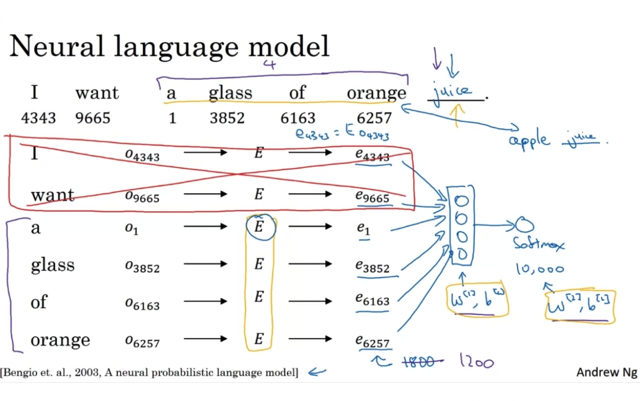</kbd>

> [!NOTE]
> Build a language model (đại khái là ví dụ cho câu I want a glass
> of orange ... _ -> Predict 'juice') **cũng là một cách để làm 'Word
> embedding'**
>
> Mỗi từ, như đã biết, sẽ được biến thành một one-hot vector (ví
> dụ "I" -> o4343, "want" -> o9665)
>
> Dùng Embedding Matrix E để nhân với o4343 -> e4343
> (embedding vector) embedding vector size = 300
>
> Bỏ vào N.N với đầu ra là softmax 10.000 unit **để thuật toán cố
> gắng học / huấn luyện các params sao cho output map  với
> target là từ ' juice'.**Output đại khái là vector of probability khả năng từ còn thiếu là
> từng từ trong word list nên có size 10000
>
> Params sẽ là matrix E và W[1], b[1], W[2], b[2]
>
> Có thể chỉ 'lấy 4 từ trước đó' để train thôi (input sẽ chỉ có 
> [e1 e3852..e6257] gọi là dùng**'Fixed history" -**Đây là cách để 
> handle với long-short sentences

 

<kbd>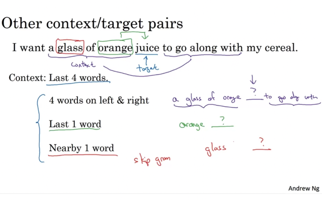</kbd>

> [!NOTE]
> Ý là nếu mục đích chính là 'Word embedding' thì có thể quy định train
> từ kiểu 4 trước 4 sau, hoặc chỉ từ trước hoặc 1 từ gần đó gọi là '**Skip
> Gram**'.

 

### Word2vec

 

#### Skip Gram model: Skip là vì nó bỏ qua một số từ để tìm cách map hai từ xa nhau nào đó.  Như mô hình trước, từ 'context' sẽ được one-hot encoded (o_c) rồi thông qua matrix E để biến thành embedding vector e_c tương tự bài trước define một network đầu ra là softmax để tính ra y^ = probability vector  Với y cũng one-hot vector. tính loss function bằng hàm cross entropy  Và dùng Gradient Descent để train params của model gồm Matrix E và Theta (params của softmax)

 

<kbd>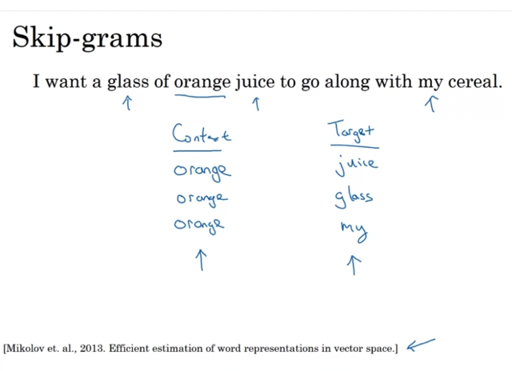</kbd>

 

<kbd>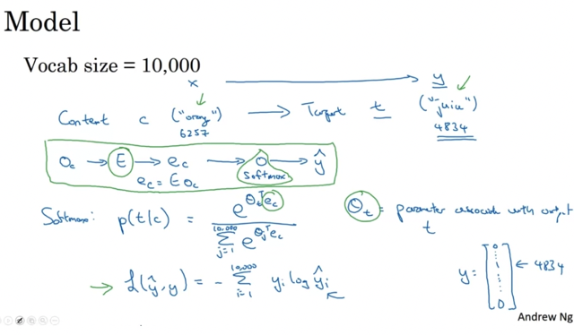</kbd>

> [!NOTE]
> Skip Gram model: Skip là vì nó bỏ qua một số từ để tìm cách map hai từ
> xa nhau nào đó.
>
> Như mô hình trước, từ 'context' sẽ được one-hot encoded (o_c) rồi thông
> qua matrix E để biến thành embedding vector e_c tương tự bài trước
> define một network đầu ra là softmax để tính ra y^ = probability vector
>
> Với y cũng one-hot vector. tính loss function bằng hàm cross entropy
>
> Và dùng Gradient Descent để train params của model gồm Matrix E và
> Theta (params của softmax)

 

<kbd>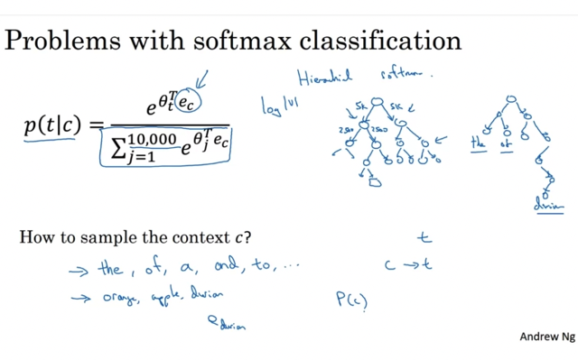</kbd>

> [!NOTE]
> Đại khái là Softmax nó có cái step phải tính tổng hết toàn bộ data
> training nên khi scale lên sẽ rất chậm.
>
> Còn cái nữa là nếu lấy context c một cách random thì  những từ như
> the, of, a...sẽ xuất hiện nhiều do đó người ta có một số cách để giải
> quyết chuyện này.

 

### Negative Sampling

 

#### Đại khái là biến nó thành 10.000 bài toán  binary classification với logistic regression bằng cách 'tạo' target y đại khái nói là cặp Orange-juice thì đúng (=1), các cặp khác (orange-king,...) thì sai (=0) - **số từ sai quy định bởi 'k'**  Dựa vào cách define y như vậy, ta train 10.000 bài toán binary thì đại khái sẽ nhanh hơn là train bài toán softmax.

 

<kbd>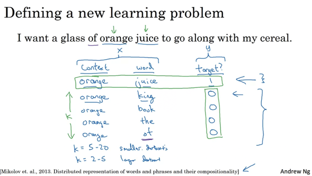</kbd>

 

<kbd>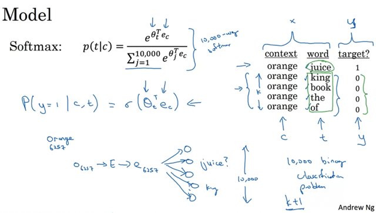</kbd>

> [!NOTE]
> Skip-Gram with Softmax
>
> Đại khái là y (target) sẽ là one-hot vector có size = 10.000 số 1 ở
> index của cái từ đúng (ví dụ ở đây là từ  cần tìm ...orange __ ->
> orange juice) trong vocab list. y^ đương nhiên cũng là vector có
> size 10000 nhưng các giá trị của nó lần lượt là 'probability của các
> từ trong vocab là từ đúng.
>
> Như vậy trong quá trình training bằng G. D, tại mỗi iteration, như
> đã biết ta lần lượt forward prop đê tính y^, rồi từ y^,y -> tính loss
> bằng hàm cross entropy, rồi với loss -> back prop để tính gradient
> và update params để xong một lần iteration. Và chạy ví dụ 1000
> lần Iterations (no.epochs = 1000)
>
> Vấn để là ở chỗ tính y^, vì dùng softmax nên trong công thức nó
> phải có bước tính tổng hết 10.000 unit của softmax layer nên rất
> '**computational expensive**'

> [!NOTE]
> Sample Negative
>
> Đại khái là biến nó thành 10.000 bài toán 
> binary classification với logistic regression
> bằng cách 'tạo' target y đại khái nói là cặp
> Orange-juice thì đúng (=1), các cặp khác (orange-king,...)
> thì sai (=0) - **số từ sai quy định bởi 'k'**
>
> Dựa vào cách define y như vậy, ta train 10.000 bài toán binary
> thì đại khái sẽ nhanh hơn là train bài toán softmax.
>
> Chưa hiểu cụ thể nó train như thế nào nhưng tạm thời biết vậy.

 

<kbd>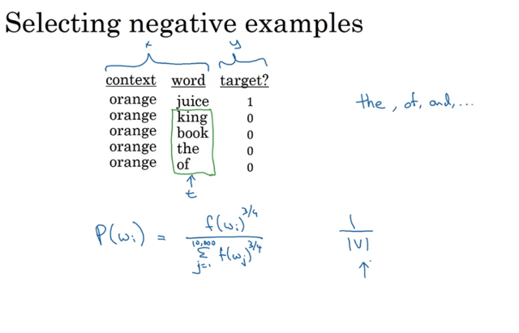</kbd>

> [!NOTE]
> Cuối cùng là đại khái cách để chọn mấy từ sai (ngẫu nhiên kia) -
> thì đại khái là nếu chọn ngẫu nhiên thật thì lại một lần nữa ta sẽ
> gặp nhiều  từ 'the' 'a' ...nên ông gì đó đề ra cách chọn có công
> thức như vầy đại khái là sao cho hợp lý.

> [!NOTE]
> \/"Somewhere in-between Extreme of taking uniform
> distribution vs Extreme of taking whatever was the observed
> distribution" -> Chưa hiểu lắm. \/ Câu trên đề cập đến khái
> niệm chọn phân phối xác suất để mô tả một tập dữ liệu hoặc
> sự kiện.
>
> Ở hai đầu cực, bạn có thể giả định một phân phối đồng đều,
> trong đó tất cả các kết quả có cùng xác suất xảy ra. Ví dụ, nếu
> bạn tung một xúc xắc sáu mặt công bằng, mỗi số có xác suất
> 1/6 được tung ra.
>
> Ở cực khác, bạn có thể sử dụng phân phối quan sát được của
> dữ liệu, đại diện cho tần suất mà mỗi kết quả xảy ra. Ví dụ, nếu
> bạn có một bộ điểm kiểm tra, bạn có thể sử dụng phân phối
> quan sát của các điểm số để tính xác suất để đạt được một
> điểm số nhất định.
>
> Tuy nhiên, trong nhiều trường hợp, cả phân phối đồng đều và
> phân phối quan sát đều không phù hợp. Thay vào đó, bạn cần
> tìm một phân phối nằm ở giữa hai đầu cực này mà phù hợp
> nhất với dữ liệu. Phân phối này nên bao gồm các đặc điểm
> chính của dữ liệu, chẳng hạn như trung bình, phương sai và
> hình dạng. Quá trình này thường được thực hiện thông qua
> các phương pháp thống kê và suy luận.

 

<kbd></kbd>

> [!NOTE]
> Transfer learning: Đại khái ổng nói cũng như các vấn
> để deep learning khác ta có thể download các
> **pre-trained word-vectors** để dùng.

 

### Clarifications About ...

 

<kbd>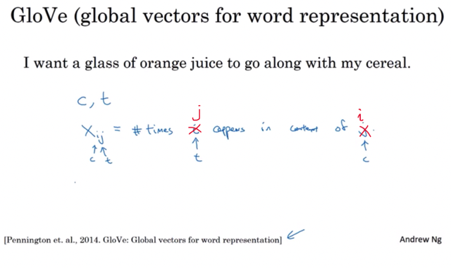</kbd>

 

<kbd>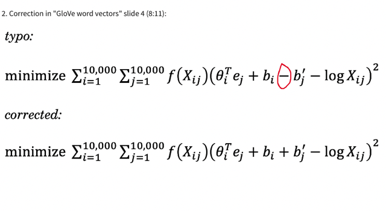</kbd>

 

### Glove Word Vectors

 

#### 1 Introduction to the GloVe algorithm for computing word embeddings  2 Explanation of the X_ij count and its relation to word occurrences in the corpus  3 Optimization objective of the GloVe algorithm  4 Weighting factor to account for frequent and infrequent words  5 Symmetry of the roles of theta and e in the GloVe algorithm  6 Training procedure for the GloVe algorithm

 

<kbd>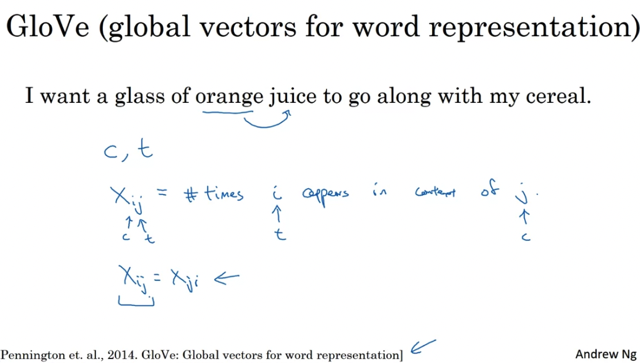</kbd>

> [!NOTE]
> Đại khái là define Xij mang ý nghĩa 'how often từ i và từ j xuất hiện cùng
> nhau' - tính bằng cách đếm số lần từ i xuất hiện khi có j xuất hiện
>
> Xij sẽ = Xji nếu ta quy định theo kiệu 'có xuất hiện gần nhau' còn nếu quy
> định theo kiểu từ này xuất hiện ngay sau từ kia  thì có thể Xij khác Xji.

 

<kbd>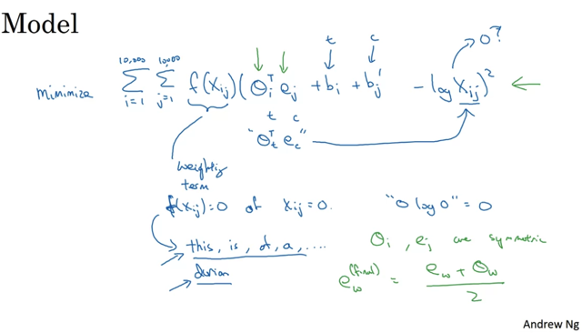</kbd>

> [!NOTE]
> Đại khái là xây dựng optimization objective như vậy - minimize
> Tuy đơn giản những thật sự sẽ giúp làm được Word Embedding
> rất tốt
>
> Hàm f là để kiểm soát không xảy ra 0log0 - nếu Xij = 0 thì bỏ qua, đại
> khái vậy Đồng thời để tăng giảm 'tần xuất / trọng số / mức độ' của các
> từ the/a/an sao cho nó không quá cao và những từ hiếm như 'durian'
> sao cho nó không quá thấp.

> [!NOTE]
> Chữ màu xanh chưa hiểu lắm nhưng đại khái
> ổng nói một điều funny là Theta_i và e_j có vai
> trò symmetric -  (như nhau??) nên Ew (final) có
> thể tính bằng trung bình của e_w và theta_w

 

<kbd>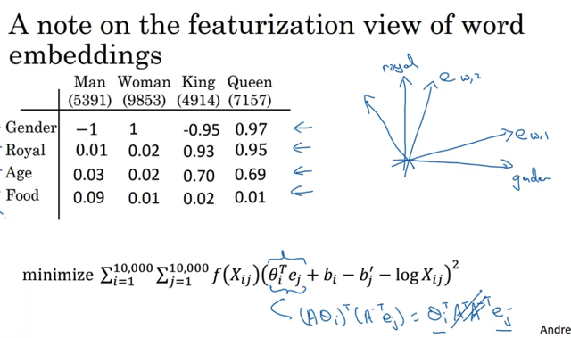</kbd>

> [!NOTE]
> Cũng chưa hiểu lắm

 

## Applications Using Word Embeddings

 

### Sentiment Classification

 

<kbd>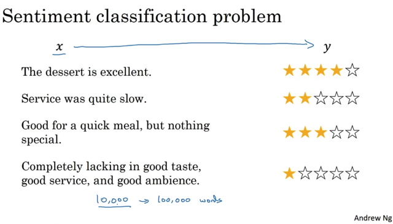</kbd>

 

<kbd>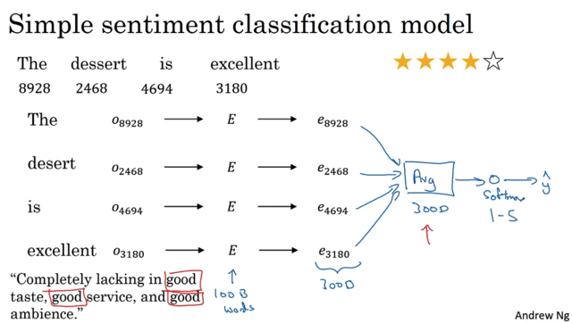</kbd>

> [!NOTE]
> Đại khái là một cách đơn giản có thể tạo model như vầy, mỗi từ trong
> comment biến thành one-hot vector, rồi embedding vector nhờ
> Embedding Matrix (download pre-trained E matrix), tính average thành 1
> vector lại rồi bỏ vào một layer softmax với 5 unit (thể hiện rating từ 1 - 5)
> -> y^ và train network simple này
>
> Nhưng solution đơn giản này thì bị cái là nó sẽ không xử lý tốt  data kiểu
> như " Completely lacking in **good** taste, **good** service, and **good**
> ambience" vì câu này sẽ có vẻ good hơn là bad

 

<kbd>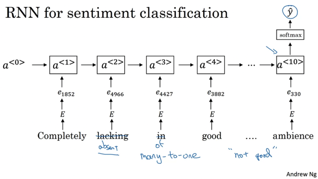</kbd>

> [!NOTE]
> Đại khái là đây là một cách hiệu quả hơn phương án trước, ở đây ta train
> model bằng RNN theo structure many-to-one như trong hình.
>
> Với cách làm này ổng nói nó sẽ work rất tốt, và ngay cả khi ví dụ
> như thay 'lacking' bằng 'absent' - một từ không có trong training
> set nhưng miễn là nó xuất hiện khi training cái Embedding Matrix E
> mà cái này chắc chắn phải có rồi vì E được train với cả tỷ từ lận - thì
> model vẫn sẽ work tốt với các từ mới này

 

### Debiasing Word Embeddings

 

#### 1 Machine learning and AI algorithms are increasingly trusted to make important decisions, and it is important to eliminate bias in their decisions.  2 Word embeddings, which can learn analogies, may reflect gender, ethnicity, age, sexual orientation, and other biases of the text used to train the model.  3 Bias relating to socioeconomic status is also a concern, as machine learning algorithms are used in important decisions ranging from college admissions to the criminal justice system.  4 To reduce or eliminate bias in word embeddings, one can **identify the direction corresponding to a particular bias** and **perform neutralization to get rid of bias in words that are not definitional**.  5 **The bias direction can be found using a singular value decomposition algorithm**, and the neutralization step can make words gender-neutral.

 

<kbd>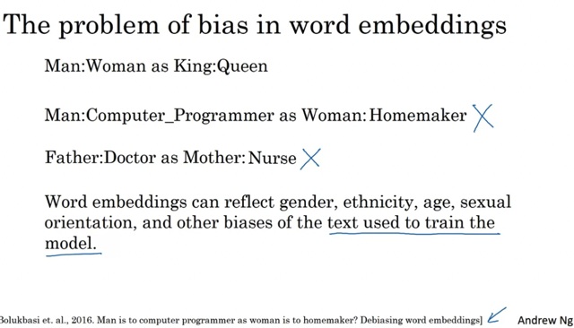</kbd>

> [!NOTE]
> Đại khái là làm sao để ML không tạo ra những kết quả có định kiến /
> thiên kiến (bias)

 

<kbd>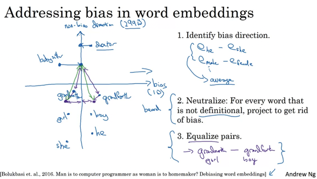</kbd>

> [!NOTE]
> Đại khái là làm 3 bước:
>
> 1. Xác định bias direction: Đại khái là bằng cách tính average hiệu
> của một số vector như e_he - e_she, e_male - e_female .. ta sẽ
> xác định được đâu là '**Bias direction**'. 
>
> 2. Tiếp những từ **'non-definitional'** thì **project** để loại bỏ bias - khái
> niệm '**project**' tương tư như của **Principal Component Analysis.**
>
> 3. Đại khái là **manually** chọn ra các cặp từ cần phải được '**equalize**'
> - để đảm bảo loại bỏ hoàn toàn bias.
>
> Nói chung đại khái là vậy nhưng cụ thể thế nào thì phải qua
> Programming Assigment mới rõ dc

> [!NOTE]
> Đại khái là
>
> Bước 1: Cái từ nào nên 'trung tính' thì 'quán chiếu' nó về trục trung
> tính - để chi, để nó trung tính với các từ phân giới tính. đó là bước
> 1.
>
> Bước 2: Đại khái là 'biến' các từ (chính xác hơn là vector của từ)
> phân giới tính thành hoàn toàn đối xứng với trục trung tính.
>
> Với 2 bước này, từ cần trung tính hoàn toàn nằm trên trục trung tính
> (kết quả của bước 1) sẽ cách đều các từ phân tính từ đó đảm bảo
> các từ như computer, babysitter không hề nghiêng về phía nữ hay
> nam
>
> Các bước làm này đều là những phép toán biến đổi vector, trong đó
> bước một dùng PCA để quán chiếu biến các vector từ trung tính mà
> giảm thiểu thay đổi giá trị nó (đại khái vậy)

 

## Quiz

 

<kbd></kbd>

 

<kbd>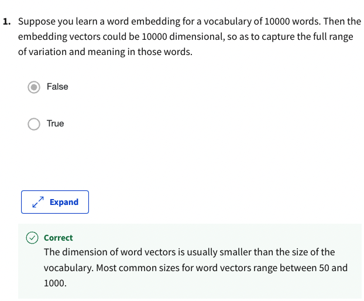</kbd>

 

<kbd>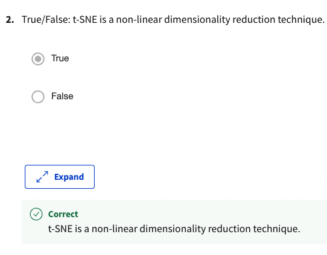</kbd>

 

<kbd>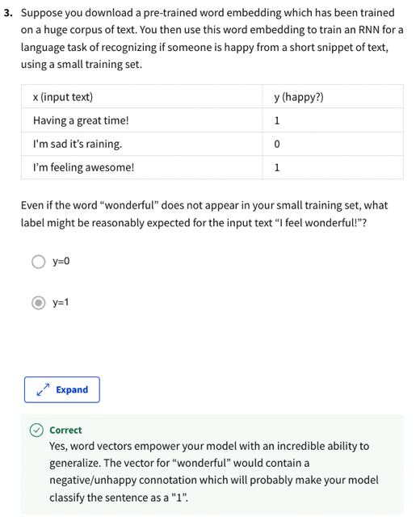</kbd>

 

<kbd>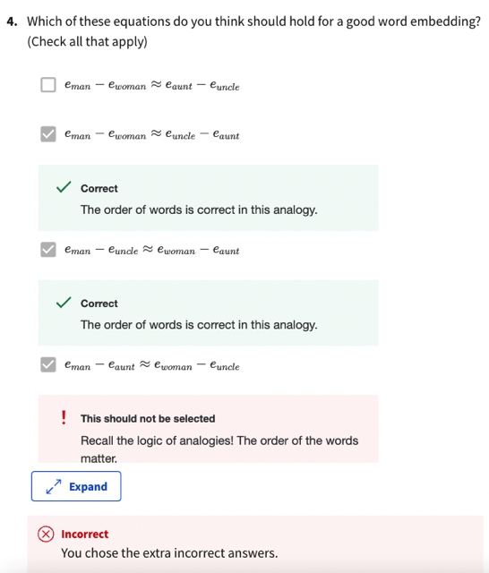</kbd>

 

<kbd>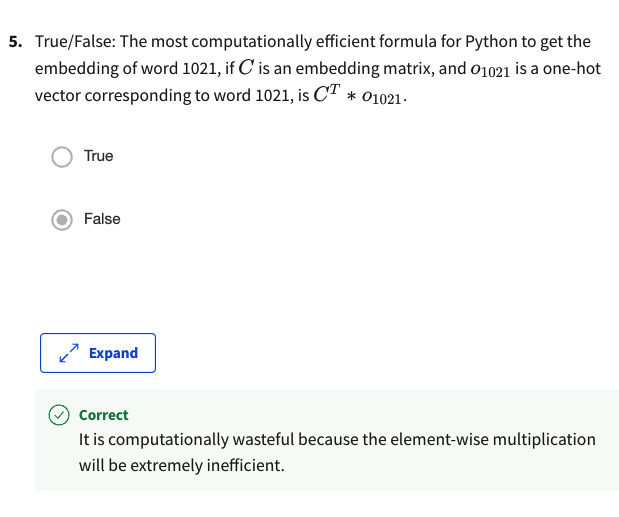</kbd>

 

<kbd>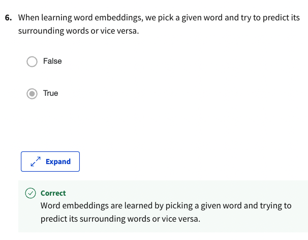</kbd>

 

<kbd>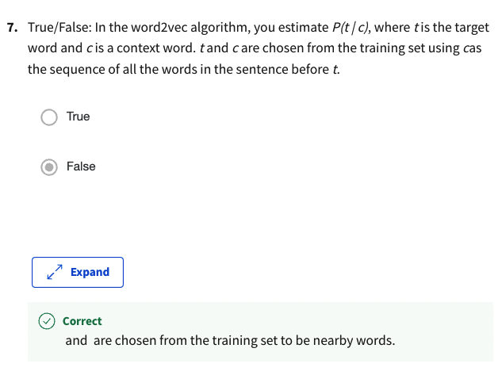</kbd>

 

<kbd>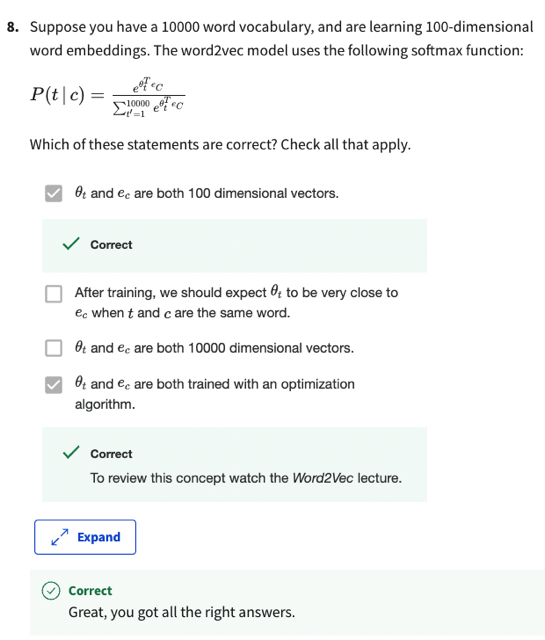</kbd>

 

<kbd>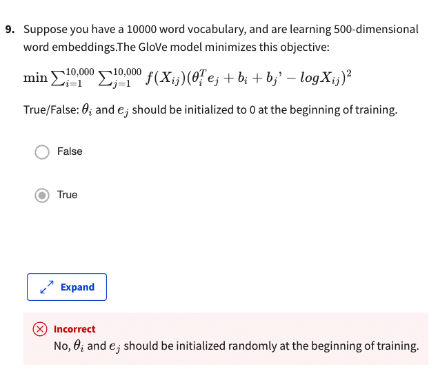</kbd>

 

<kbd>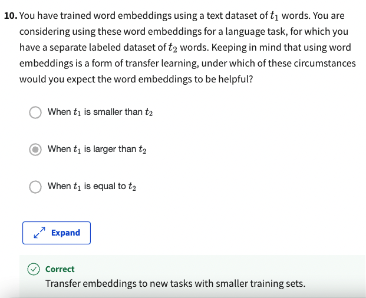</kbd>

 

## Programming Assignments 1

 

### Welcome to your first assignment of Week 2, Course 5 of the Deep Learning Specialization!

> [!NOTE]
> Welcome to your first assignment of Week 2, Course 5 of the Deep Learning Specialization!
>
> Because word embeddings are very computationally expensive to train, most ML practitioners
> will load a pre-trained set of embeddings. In this notebook you'll try your hand at \\_**loading**\\_,
> \\_**measuring similarity between**\\_, and \\_**modifying pre-trained embeddings**\\_.
>
> **After this assignment you'll be able to**:
>  • Explain how word embeddings capture relationships between words
>  • Load pre-trained word vectors
>  • Measure similarity between word vectors using cosine similarity
>  • Use word embeddings to solve word analogy problems such as Man is to Woman as King is to **__**.
>
>
> At the end of this notebook you'll have a chance to try an optional exercise, where you'll modify
> word embeddings to \\_**reduce their gender bias**\\_. Reducing bias is an important
> consideration in ML and NLP, so you're encouraged to take this chall

<kbd>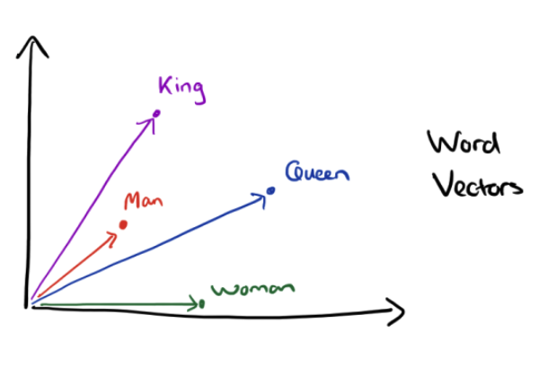</kbd>

 

#### Packages

 

#### 1 - Load the Word Vectors

 

<kbd>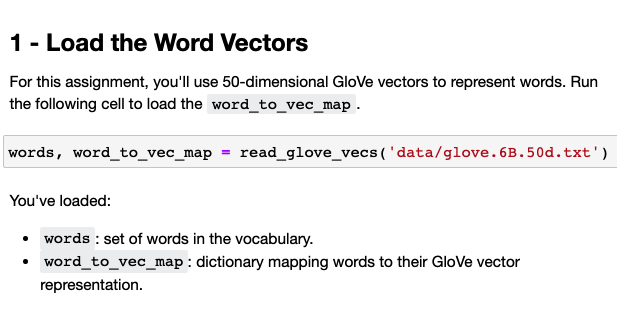</kbd>

 

#### 2 - Embedding Vectors Versus One-Hot Vectors

 

<kbd>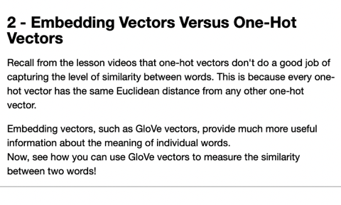</kbd>

 

#### 3 - Cosine Similarity

 

<kbd>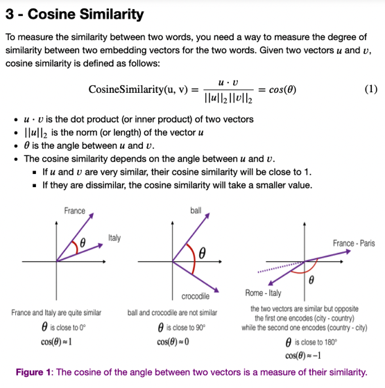</kbd>

 

#### Exercise 1 - cosine_similarity  Theo công thức, dễ chỉ có chú yý arg dùng 1D vector khá nguy hiểm

 

<kbd>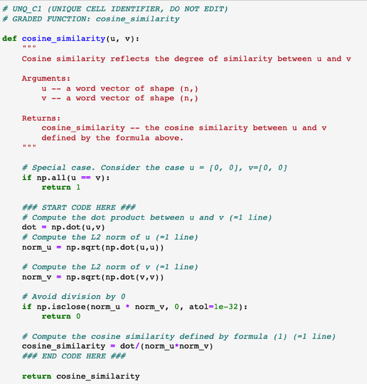</kbd>

<kbd></kbd>

<kbd>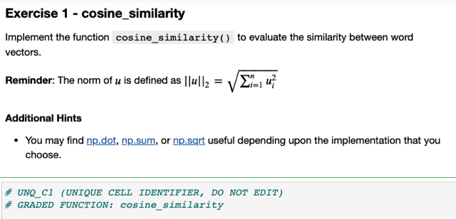</kbd>

 

<kbd>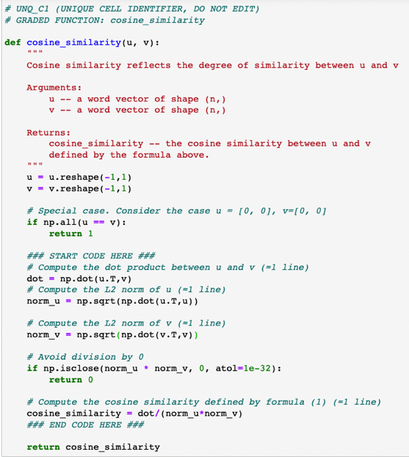</kbd>

 

<kbd>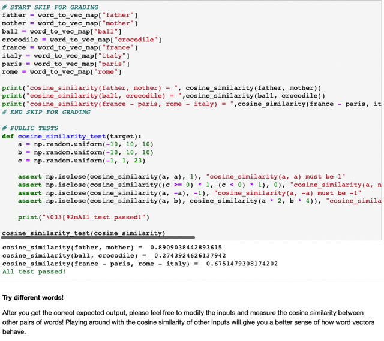</kbd>

 

#### 4 - Word Analogy Task

 

#### Exercise 2 - complete_analogy

 

<kbd>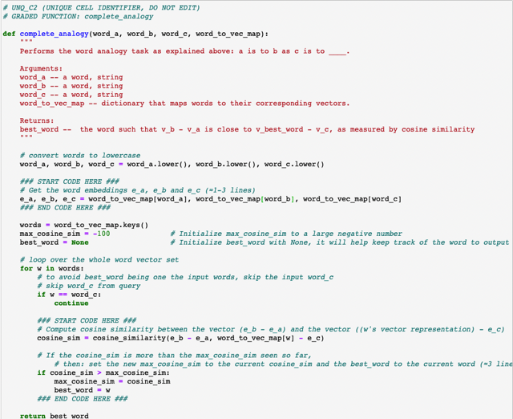</kbd>

 

#### **Congratulations!**You've come to the end of the graded portion of the assignment. By now, you've:  • Loaded some pre-trained word vectors  • Measured the similarity between word vectors using cosine similarity  • Used word embeddings to solve word analogy problems such as Man is to Woman as King is to __.  Cosine similarity is a relatively simple and intuitive, yet powerful, method you can use to capture nuanced relationships between words. These exercises should be helpful to you in explaining how it works, and applying it to your own projects!  **What you should remember**:  • Cosine similarity is a good way to compare the similarity between pairs of word vectors.  ▪ Note that L2 (Euclidean) distance also works.  • For NLP applications, using a pre-trained set of word vectors is often a great way to get started.

 

#### 5 - Debiasing Word Vectors (OPTIONAL/UNGRADED)

> [!NOTE]
> Đại khái là
>
> Bước 1: Cái từ nào nên 'trung tính' thì 'quán chiếu' nó về trục trung
> tính - để chi, để nó trung tính với các từ phân giới tính. đó là bước
> 1.
>
> Bước 2: Đại khái là 'biến' các từ (chính xác hơn là vector của từ)
> phân giới tính thành hoàn toàn đối xứng với trục trung tính.
>
> Với 2 bước này, từ cần trung tính hoàn toàn nằm trên trục trung tính
> (kết quả của bước 1) sẽ cách đều các từ phân tính từ đó đảm bảo
> các từ như computer, babysitter không hề nghiêng về phía nữ hay
> nam
>
> Các bước làm này đều là những phép toán biến đổi vector, trong đó
> bước một dùng PCA để quán chiếu biến các vector từ trung tính mà
> giảm thiểu thay đổi giá trị nó (đại khái vậy)

 

#### 5.1 - Neutralize Bias for Non-Gender Specific Words  Đại khái là thực hiện việc biến một vector từ cần trung tính để nó 'trung tính' với vector bias - vector định kiến tức là làm sao để cho nó vuông góc với bias vector -> cosin similarity = 0 -> Ko liên quan đến nhau

 

<kbd>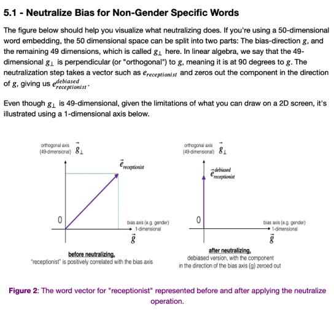</kbd>

> [!NOTE]
> Đại khái là thực hiện việc biến một vector từ cần trung tính để
> nó 'trung tính' với vector bias - vector định kiến tức là làm sao
> để cho nó vuông góc với bias vector -> cosin similarity = 0 -> Ko
> liên quan đến nhau

 

#### Exercise 3 - neutralize  Làm theo công thức thôi

 

<kbd>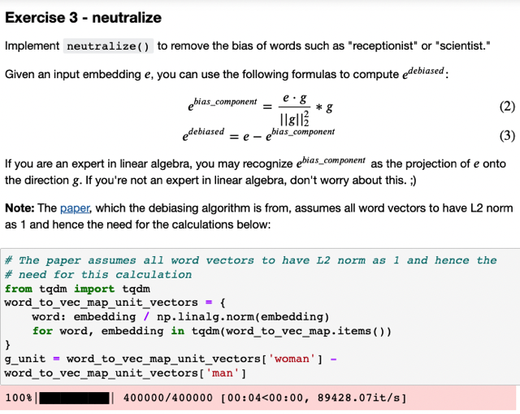</kbd>

 

<kbd>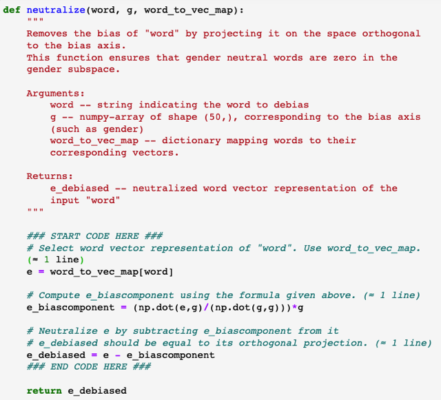</kbd>

 

<kbd>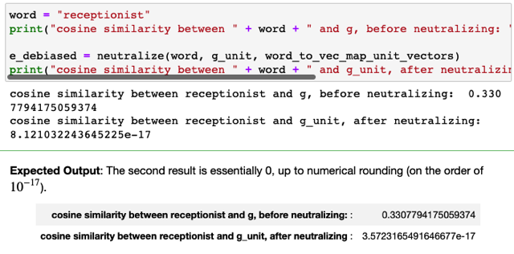</kbd>

 

#### 5.2 - Equalization Algorithm for Gender-Specific Words

 

<kbd>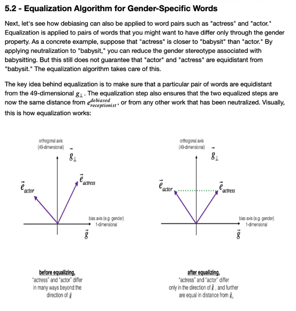</kbd>

> [!NOTE]
> Đại khái là biến đổi các vector từ phân tính thành ra cách đều
> trục trung tính giúp loại bỏ hoàn toàn bias

 

<kbd>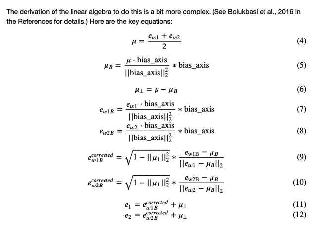</kbd>

 

#### Exercise 4 - equalize

 

<kbd>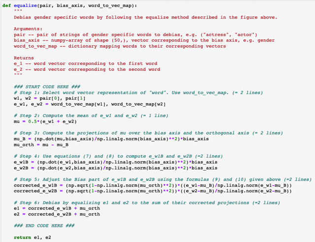</kbd>

 

<kbd>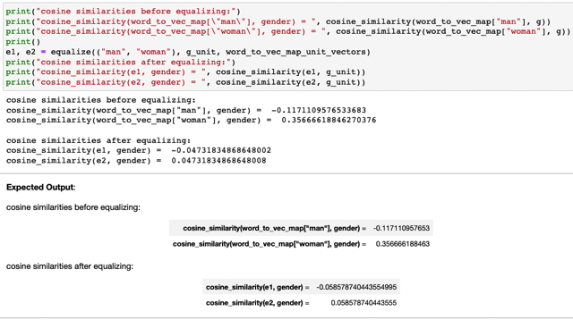</kbd>

> [!NOTE]
> Đại khái là giờ nó gần
> như bằng nhau rồi

 

<kbd>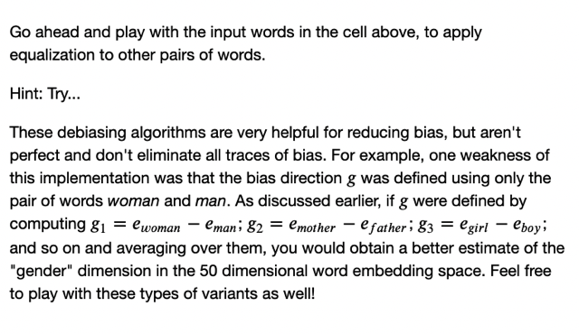</kbd>

 

#### **Congratulations!**You have come to the end of both graded and ungraded portions of this notebook, and have seen several of the ways that word vectors can be applied and modified. Great work pushing your knowledge in the areas of neutralizing and equalizing word vectors! See you next time.

 

#### 6 - References

 

## Programming Assignments 2

 

### \\*What you'll build:

> [!NOTE]
> **What you'll build:** 1 In this exercise, you'll start with a baseline model (Emojifier-V1)
> using word embeddings.
>
> 2 Then you will build a more sophisticated model (Emojifier-V2) that
> further incorporates an LSTM. By the end of this notebook, you'll be
> able to:
>
> • Create an embedding layer in Keras with pre-trained word vectors
>
> • Explain the advantages and disadvantages of the GloVe algorithm
>
> • Describe how negative sampling learns word vectors more efficiently
> than other methods
>
> • Build a sentiment classifier using word embeddings
>
> • Build and train a more sophisticated classifier using an LSTM

 

#### Packages

 

<kbd>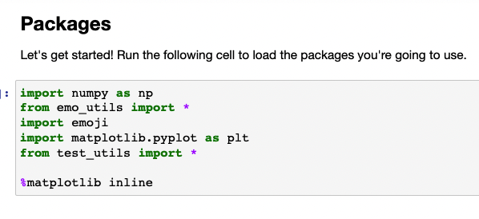</kbd>

 

#### 1 - Baseline Model: Emojifier-V1

 

#### 1.1 - Dataset EMOJISET

 

<kbd>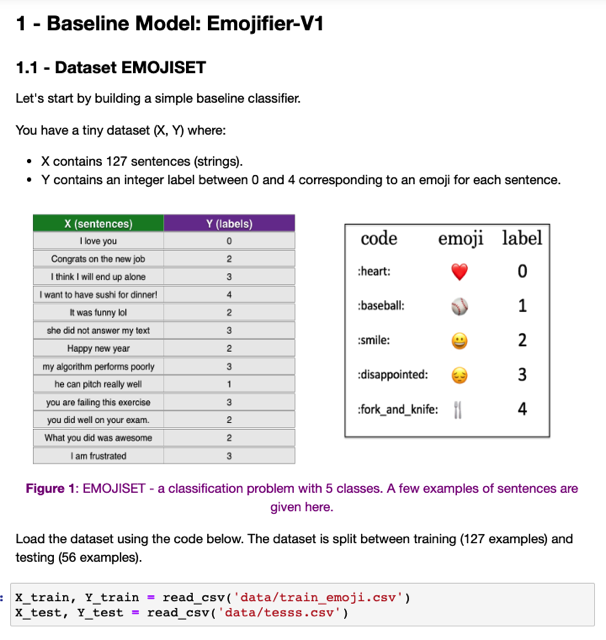</kbd>

 

<kbd>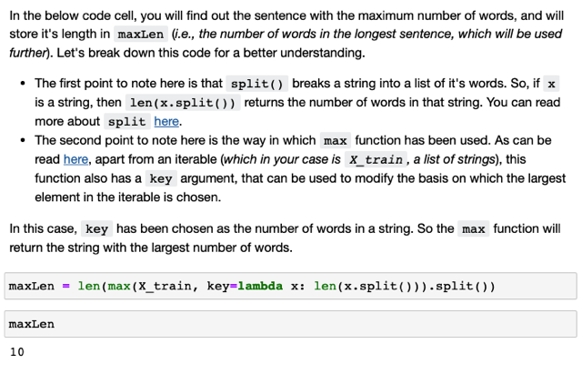</kbd>

 

<kbd>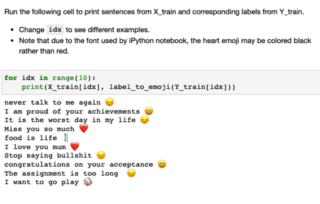</kbd>

 

#### 1.2 - Overview of the Emojifier-V1

 

<kbd>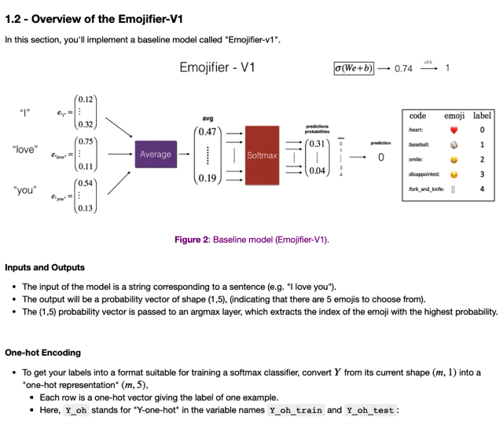</kbd>

 

<kbd>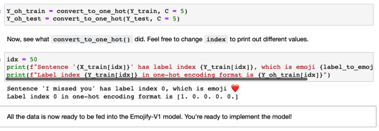</kbd>

 

#### 1.3 - Implementing Emojifier-V1

 

<kbd>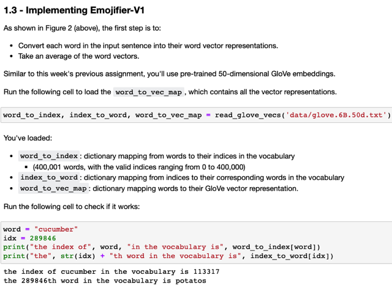</kbd>

 

#### Exercise 1 - sentence_to_avg  Đại khái là tách 1 câu thành list các từ, biến mỗi từ thành embedding vector nhờ Embedding Matrix (ở đây chỉ là 1 dictionary, word -> vector), rồi tính 1 vector average của các e vector đó. Sẽ là vector "đại diện" cho sentence

 

<kbd>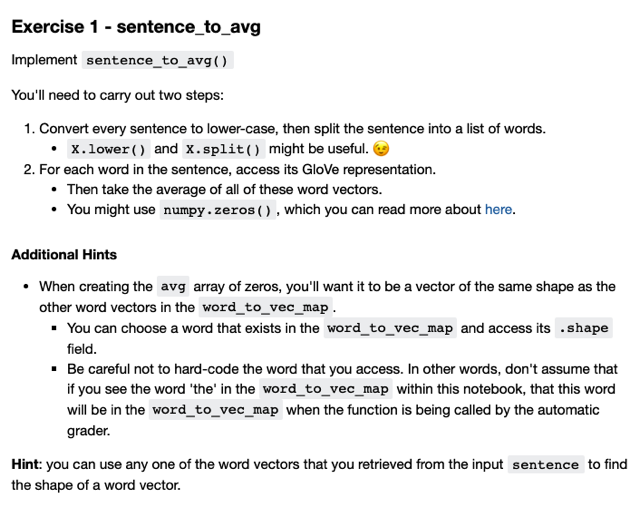</kbd>

 

<kbd>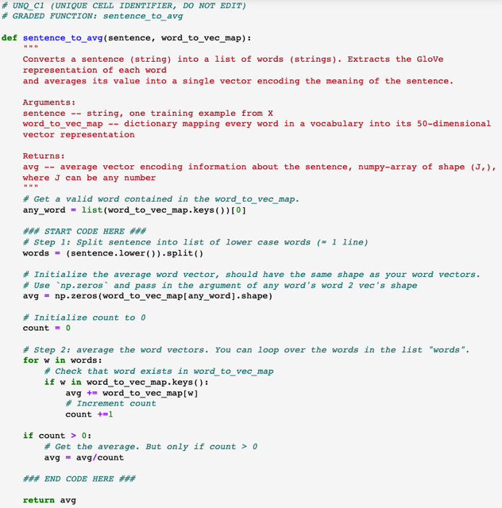</kbd>

 

<kbd>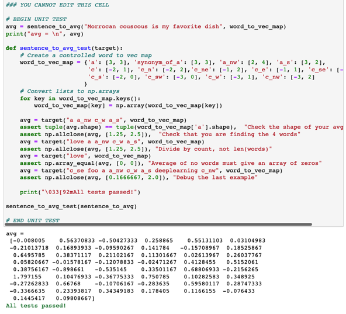</kbd>

 

#### 1.4 - Implement the Model

 

<kbd>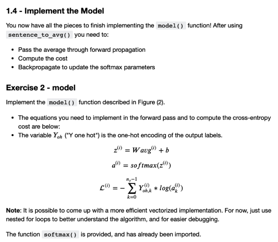</kbd>

 

#### Exercise 2 - model  Đại khái là: Forward prop tính cost function Loop trong iteration,  Loop trong m Với mỗi data sample (là 1 sentence), biến thành embedding vector (của  Sentence đó) bằng function đã làm. Dùng công thức tính z(i), a(i) hay y^(i), loss(i), cộng dồn loss vào cost Dùng công thức (cũng đơn giản nên tự biết, ở đây ổng ko nói mà làm sẵn) để backward prop tính gradient dW, db Update W, b

 

<kbd>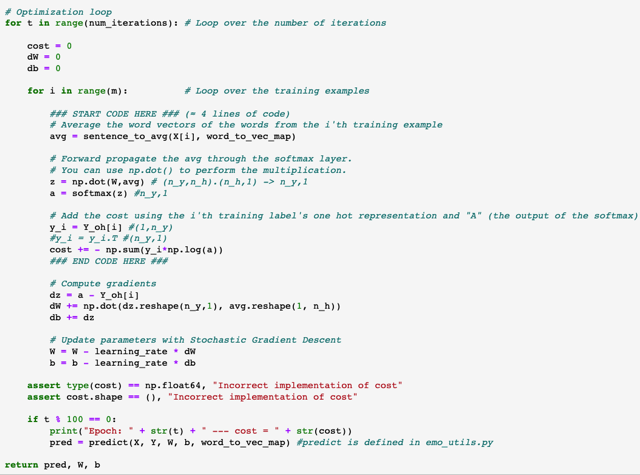</kbd>

<kbd></kbd>

<kbd>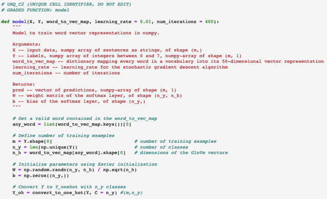</kbd>

 

<kbd>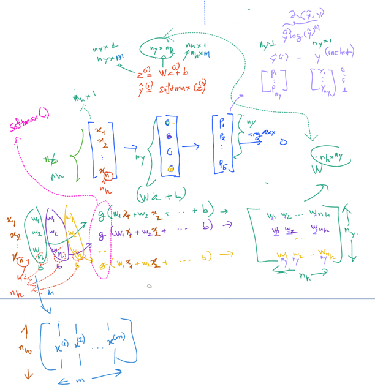</kbd>

 

<kbd>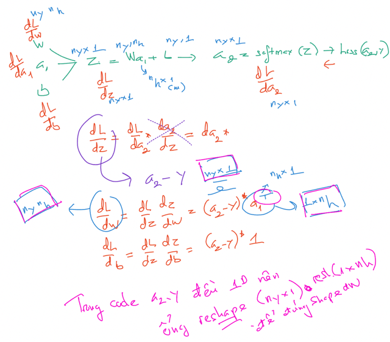</kbd>

 

<kbd>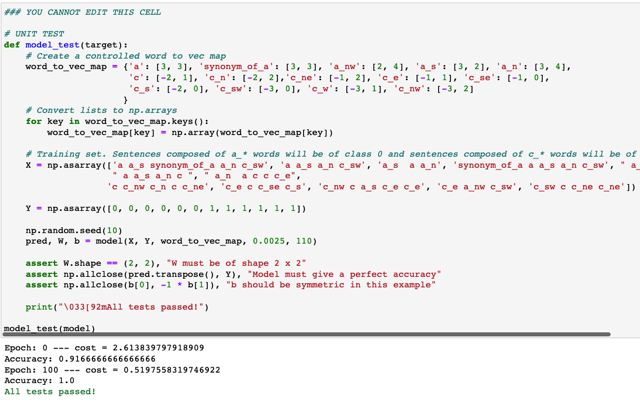</kbd>

 

<kbd>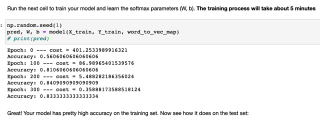</kbd>

 

#### Training

 

<kbd>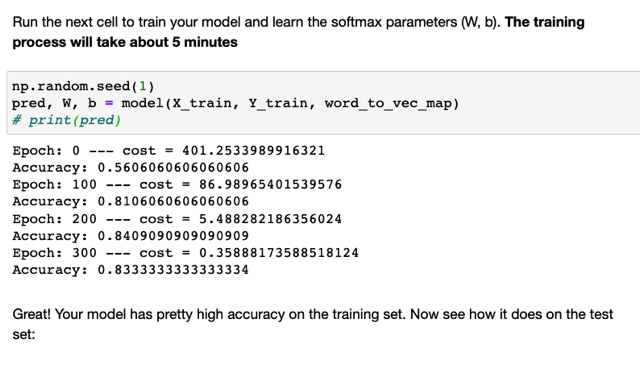</kbd>

 

#### 1.5 - Examining Test Set Performance

 

<kbd>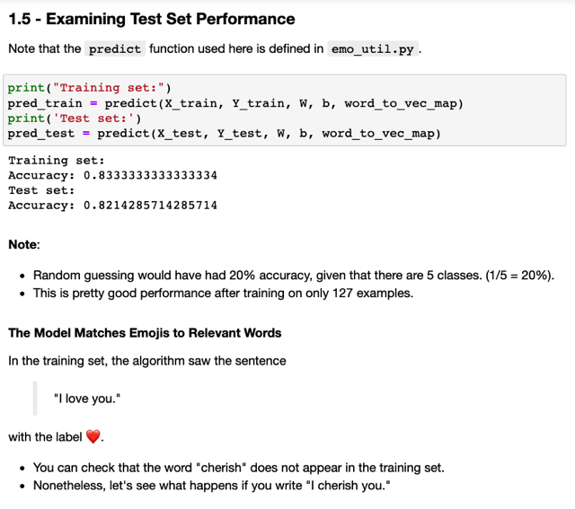</kbd>

 

<kbd>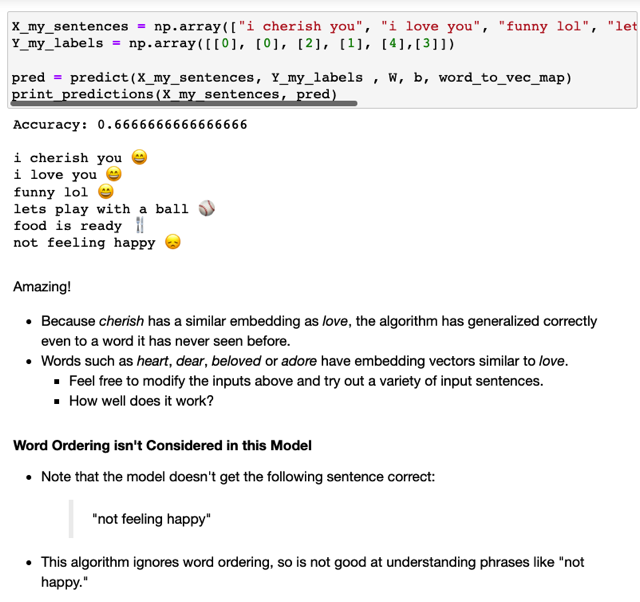</kbd>

 

<kbd>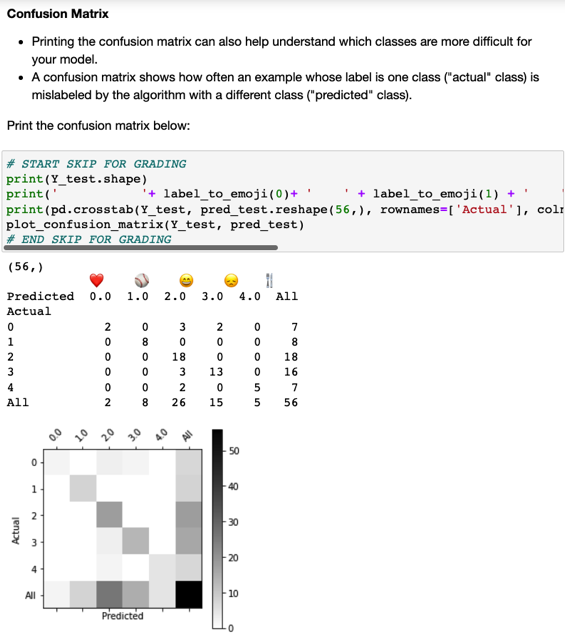</kbd>

 

#### What you should remember:  Even with a mere 127 training examples, you can get a reasonably good model for Emojifying.  This is due to the generalization power word vectors gives you.  Emojify-V1 will perform poorly on sentences such as *"This movie is not good and not enjoyable"*  It doesn't understand combinations of words.  It just averages all the words' embedding vectors together, without considering the ordering of words.

 

#### 2 - Emojifier-V2: Using LSTMs in Keras

 

#### 2.1 - Model Overview

 

<kbd>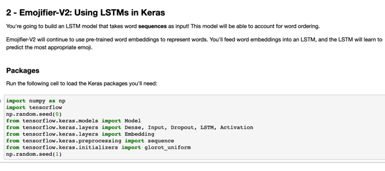</kbd>

 

<kbd>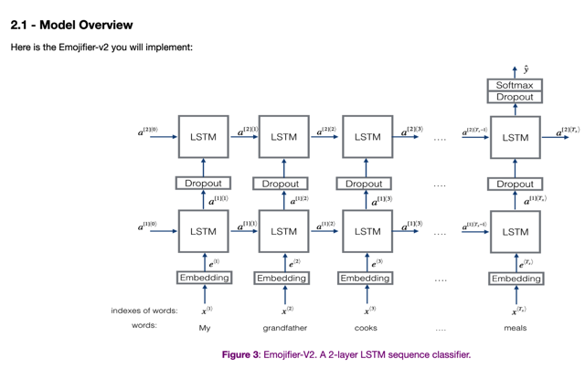</kbd>

 

#### 2.2 Keras and Mini-batching

 

<kbd>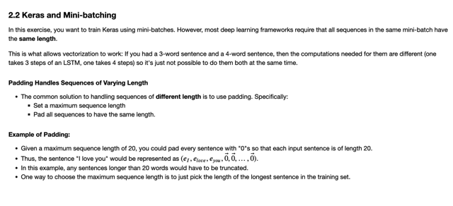</kbd>

 

#### 2.3 - The Embedding Layer

 

<kbd>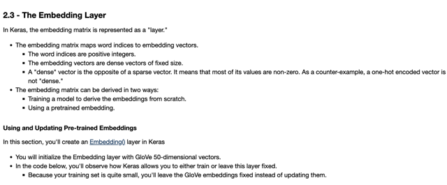</kbd>

 

#### Nói rất rõ, đại khái là ta có thể train Embedding layer hoặc dùng pre-trained weight.  Mục đích cuối cùng của Embedding layer là biến một từ thành một embedding vector sao cho nó đại diện được tốt nhất của từ đó ở các khía cạnh, giúp quá trình học / huấn luyện đạt được hiệu quả (ví dụ giúp train ra một model có thể translate một câu tiếng Pháp sang câu tiếng Anh chuẩn nhất)  Do đó nếu chỉ định Embedding layer là trainable (có dùng pre-trained weights hay không cũng dc) thì khi train (phải hiểu là train cả 1 Network thì nó sẽ tìm cách cải thiện cái việc Embedding này sao cho đạt được mục đích ở trên - bằng cách tìm ra weight tốt nhất

 

<kbd>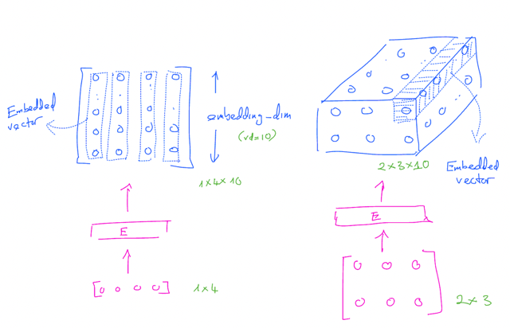</kbd>

<kbd></kbd>

<kbd>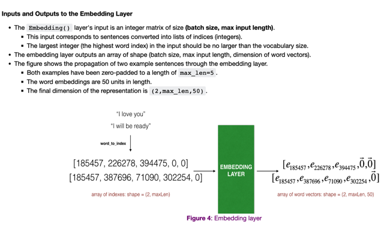</kbd>

 

#### Exercise 3 - sentences_to_indices Ini X_index = zeros (m, max_len) Loop trong m, lấy từng câu (data sample) ra Split câu ra Loop trong các từ, biến mỗi từ thành index nhờ word_to_index (dictionary) Gán vào X_index tại vị trí i,j  Như vậy các vector (chính là các hàng của X_index) đếu bằng size nhau (max_length) mà cái nào ngắn sẽ được fill bằng 0.

 

<kbd>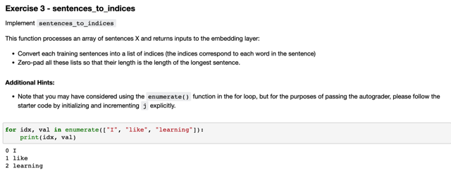</kbd>

 

<kbd>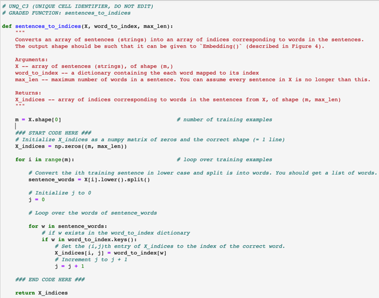</kbd>

 

<kbd>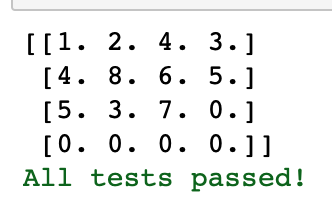</kbd>

 

<kbd>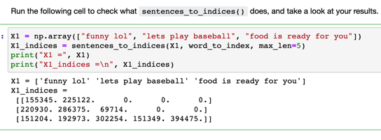</kbd>

 

#### Exercise 4 - pretrained_embedding_layer

 

<kbd>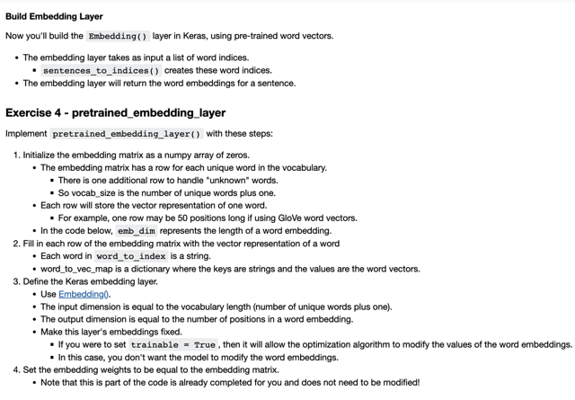</kbd>

 

#### Ở đây nói rất rõ là ta sẽ tự define Embedding layer BẰNG cách **'set the embedding weights to be equal to the embedding matrix'**  Bằng cách nào đó, tải trên mạng blah blah ta có một **dictionary** Trong đó **mỗi từ sẽ với tương ứng một embedded vector** mà vector này đại diện cho nó, có tính chất như thế nào thì xem  lại theo link (mà đại khái là embedded vector dc tạo ra nhằm mục đích chứa trong mình những thông tin hữu ích về các khía cạnh của từ đó như giới tính, ngành nghề ....)  Như vậy, Embedding layer sẽ đại khái là **nhận một từ thì biến thành một embedded vector**, nhận **một list** các từ (1 câu/1 sequence / vector) thì biến thành một **matrix**. Nói chúng là bỏ vào 1 volume (hay còn gọi là Tensor) có **mấy dimension** thì nó **tạo ra thêm một dimension** nữa, vì cứ 1 từ (sẽ biểu thị bởi 1 con số - index) thì nó tạo một vector

 

<kbd>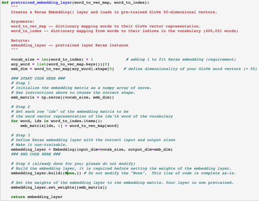</kbd>

> [!NOTE]
> Dù có thắc mắc là **tại sao input_dim**lại bằng**vocab_size**
> nhưng có thể hiểu là Embedding nó có nhiệm vụ là:.. 
>
> Embedding một **index input** thành một **embedding vector**, 
> nên nó như một dictionary

 

<kbd>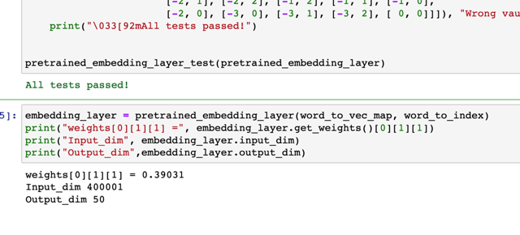</kbd>

 

#### 2.4 - Building the Emojifier-V2

 

<kbd>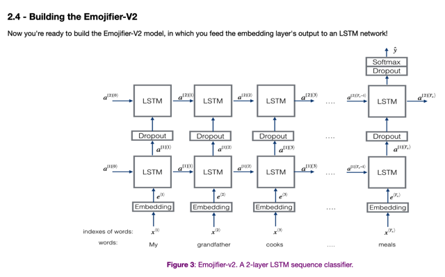</kbd>

 

#### Exercise 5 - Emojify_V2

 

<kbd>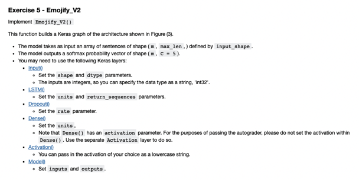</kbd>

 

<kbd>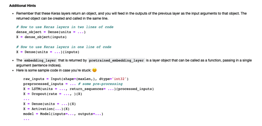</kbd>

 

<kbd>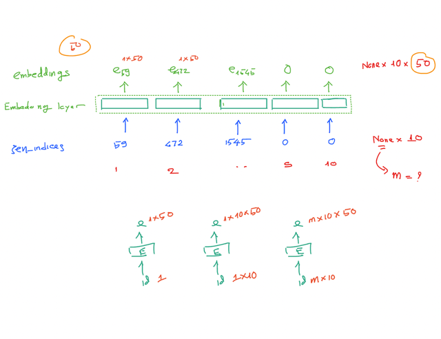</kbd>

<kbd></kbd>

<kbd>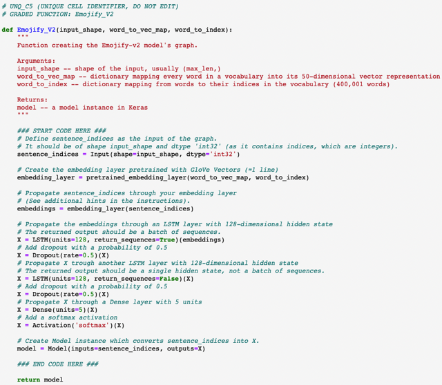</kbd>

> [!NOTE]
> Chưa hiểu Embedding layer lắm (input, output shape) -> Cứ hiểu tạm là nó
> được define để bỏ vào index thì cho ra embedding vector, nên đầu vào là input
> volume shape bao nhiêu ko biết cứ qua nó là thành ra tăng thêm 1 chiều nữa
> (vì idx number
> - 1D thành vector - 2D) -> Hiểu vậy là đúng rồi đó, đọc cái giải thích ChatGPT

 

#### In Keras, an embedding layer is a type of layer that maps **input values** (such as words or categorical variables) to **fixed-size vectors of real numbers**, also known as embeddings. These embeddings can be used as a more compact and dense representation of the original input, making it easier to work with and analyze.  The embedding layer takes as input a matrix of integers, where each row represents a sequence of input values. Each value in the matrix represents a categorical variable, such as a word or an item in a list of categories. The layer then looks up the corresponding **embedding vector** for each **input value** in a **lookup table**, which is **learned during training**.  The size of the embedding vectors is a hyperparameter that needs to be specified when defining the layer. The dimensionality of the embedding space should be chosen such that it is large enough to capture the relevant information in the input data, but not so large as to introduce overfitting.  The output of the embedding layer is a matrix of the same shape as the input matrix, but with **each integer value replaced by its corresponding embedding vector**. This matrix can then be passed on to further layers for processing.  Overall, the embedding layer in Keras is a powerful tool for transforming categorical inputs into dense, continuous representations that can be more easily processed by neural networks. It is commonly used in natural language processing (NLP) applications, where it is used to represent words or sequences of words as embeddings.

<kbd></kbd>

<kbd></kbd>

 

#### Đại khái là mỗi input value sẽ được replace bởi 1 embedded vector (mà item value của vector đó là real number)  Bằng cách nó look up value từ 1 lookup table được **learned during trainning.**  Kểu như mình có thể:  Pre-train rồi gán trainable = false để không train lại cái embedding layer này  Pre-train rồi gán trainable = true để tiếp tục train embedding layer này  Hoặc Train từ đầu (không có pre-train gì cả)  Thì trong assigment này chính là xài cái **pre-train và không train lại**

 

<kbd>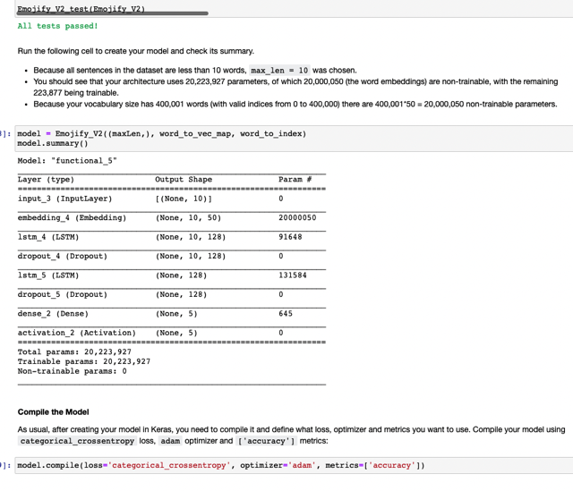</kbd>

> [!NOTE]
> Params cua Embedding layer không trainable

 

#### 2.5 - Train the Model

 

<kbd>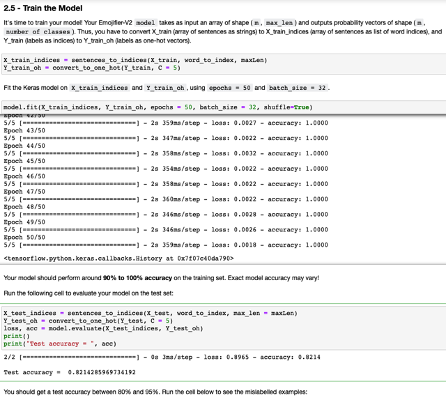</kbd>

 

<kbd>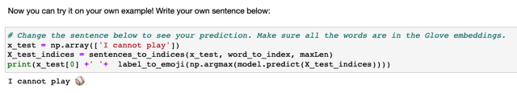</kbd>

 

<kbd>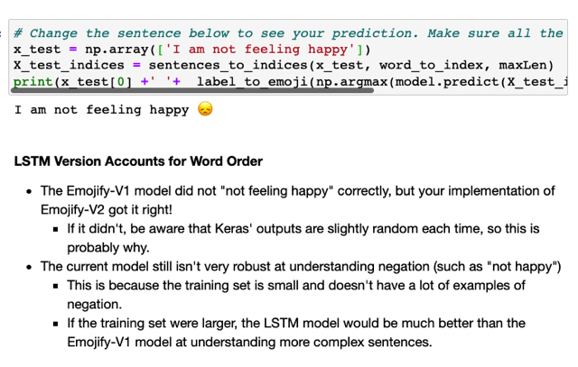</kbd>

 

#### **Congratulations!**You've completed this notebook, and harnessed the power of LSTMs to make your words more emotive! ❤️❤️❤️  By now, you've:  • Created an embedding matrix  • Observed how negative sampling learns word vectors more efficiently than other methods  • Experienced the advantages and disadvantages of the GloVe algorithm  • And built a sentiment classifier using word embeddings!  Cool! (or Emojified: 😎😎😎 )

 

<kbd>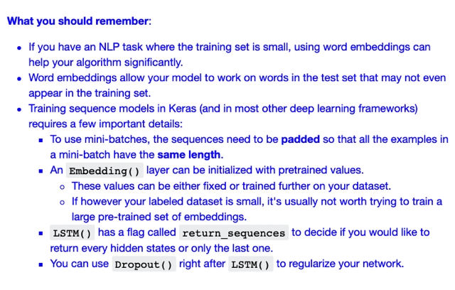</kbd>

 

#### 3 - Acknowledgments

 

