# W1_foundations Of Convolutional Neural Network

📊 **Progress:** `60` Notes | `135` Screenshots

---

1ST REVIEWED: LECTURE `+` PA

mplement the foundational layers of CNNs (pooling, convolutions) and stack them properly in a deep network to solve `multi-class` image classification problems.
**Learning Objectives**
 • Explain the convolution operation
 • Apply two different types of pooling operations
 • Identify the components used in a convolutional neural network (padding, stride, filter, ...) and their purpose
 • Build a convolutional neural network
 • Implement convolutional and pooling layers in numpy, including forward propagation
 • Implement helper functions to use when implementing a TensorFlow model
 • Create a mood classifer using the TF Keras Sequential API
 • Build a ConvNet to identify sign language digits using the TF Keras Functional API
 • Build and train a ConvNet in TensorFlow for a binary classification problem
 • Build and train a ConvNet in TensorFlow for a multiclass classification problem
 • Explain different use cases for the Sequential and Functional APIs

<a id="node-1151"></a>
## Computer Vision

<br>


<a id="node-1152"></a>
### 1 \\*Computer vision\\* is rapidly advancing thanks to deep learning,

> [!NOTE]
> 1 \**Computer vision\** is rapidly advancing thanks to deep learning,
> enabling new applications that were impossible a few years ago.
>
> 2 The computer vision research community's creativity and
> inventiveness in coming up with new neural network architectures
> and algorithms can inspire `cross-fertilization` into other areas.
>
> 3 Computer vision problems include \**image classification\**, \**object
> detection\**, and \**neural style transfer\**, among others.
>
> 4 One of the challenges of computer vision problems is that the
> \**inputs can get really big\**, requiring better implementation of the
> \**convolution operatio\**n, which is one of the fundamental building
> blocks of convolutional neural networks.

> [!NOTE]
> 1 Introduction to Computer Vision and Deep Learning:
>
>  2 The text introduces the topic of computer vision and its rapid advancements thanks to deep learning. It provides examples of computer vision applications such as `self-driving` cars, face recognition, and image classification. The author discusses how deep learning is enabling the creation of new types of art and inspiring `cross-fertilization` into other areas.
>
>  3 Examples of Computer Vision Problems:
>  4 The text provides examples of computer vision problems that will be studied in the course, such as image classification, object detection, and neural style transfer. The author explains the importance of object detection in `self-driving` cars, where the position of other cars needs to be determined to avoid collisions. Additionally, the author discusses how neural style transfer is enabling new types of artwork to be created.
>
>  5 Challenges of Computer Vision Problems:
>  6 The text explains that one of the challenges of computer vision problems is that the inputs can get really big. For example, working with a 1000 by 1000 pixel image with three color channels would result in three million input features. The author explains that this can lead to a very large number of parameters in a neural network, making it difficult to prevent overfitting and requiring significant computational and memory resources.
>
>  7 Convolutional Neural Networks:
>  8 The text discusses the implementation of convolutional neural networks, which are designed to better handle large images by using convolutions as the fundamental building blocks. The author provides an example of how convolutions can be used for edge detection and explains how they can be implemented efficiently using specialized hardware and techniques such as parameter sharing and pooling.
>
>  9 Course Overview:
>  10 The text concludes with a brief overview of the course, which will cover topics such as convolutional neural networks, object detection, and neural style transfer. The author encourages learners to use the tools and techniques learned in the course to create new applications and products.

<br>

  <a id="node-1153"></a>
  <p align="center"><kbd></kbd></p>
  <br>

  <a id="node-1154"></a>
  <p align="center"><kbd>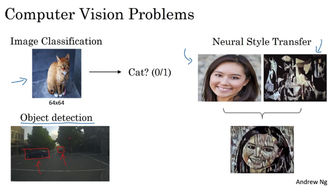</kbd></p>
  > [!NOTE]
  > ..

  <br>

  <a id="node-1155"></a>
  <p align="center"><kbd>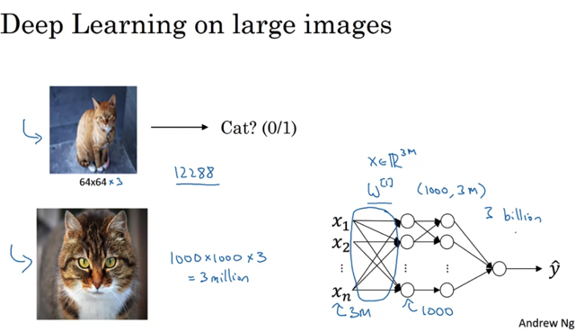</kbd></p>
  > [!NOTE]
  > Nếu X là image size 1000x1000x3 `->` X sẽ là 3 Millions features `->` W[1]
  > sẽ là 1000x3M `=` 3 tỉ cái weights: Quá lớn nên phải dùng 1 cái mới :
  > Convolutional N.N

  <br>


<a id="node-1156"></a>
## Edge Detection Example

<br>


<a id="node-1157"></a>
### • The \\*convolution operation\\* is a fundamental building block of

> [!NOTE]
> • The \**convolution operation\** is a fundamental building block of
> \**convolutional neural networks\**.
>
> • \**Edge detection\** is one of the many applications of the convolution
> operation.
>
> • \**Early\** layers of a neural network \**detect\** \**edges\** while \**later layers\**
> detect \**complete objects\**.
>
> • Convolution involves a \**filter\** or \**kernel\** being passed over an input
> image to produce an output image.
>
> • The output of the convolution operation is determined by taking
> \**element-wise products\** and \**summing\** up the resulting values.
>
> • The \**output\** of the convolution operation is \**smaller\** in size than the
> \**input\** image.

> [!NOTE]
> 1 The convolution operation is a fundamental building block of convolutional neural networks (CNNs).
>
>  2 In this video, **the example of edge detection** is used to demonstrate how the **convolution operation**works**.**
>
>  3 Previous videos have discussed how **early layers** of a neural network might **detect edges**, and how **later layers** might detect more c**omplex features.**
>
>  4 To detect edges in an image, one might first detect vertical edges, followed by horizontal edges.
>
>  5 To detect edges in an image, a 3x3 **filter** (sometimes called a **kernel**) can be constructed **with a specific set of values**, such as 1, 1, 1, 0, 0, 0, `-1,` `-1,` `-1.`
>
>  6 The convolution operation involves taking the filter and **sliding** it across the input image,**computing the `element-wise` product** at each position, and **summing** the results to produce an output value.
>
>  7 The output of the convolution operation is a 4x4 matrix, which can be interpreted as a **new image.**
>
>  8 To compute each element of the output matrix, the filter is **placed over** a 3x3 region of the input image, the `element-wise` product is computed, and the results are summed to produce the output value.
>
>  9 This process is **repeated** for every 3x3 region of the input image, resulting in a 4x4 output matrix.
>
>  10 The output matrix represents the edges detected by the filter in the input image.
>
>  11 **The specific values** in the **filter** **determine what type of edges are detected;** in this case, the filter detects vertical edges followed by horizontal edges.
>
>  12 The notation for convolution can be confusing, as the **asterisk symbol** is used for both convolution and multiplication. In these videos, the asterisk symbol is used to denote convolution.
>
>  13 The process of convolving a 6x6 input image with a 3x3 filter to produce a 4x4 output matrix is demonstrated `step-by-step` in the video.

<br>

  <a id="node-1158"></a>
  <p align="center"><kbd>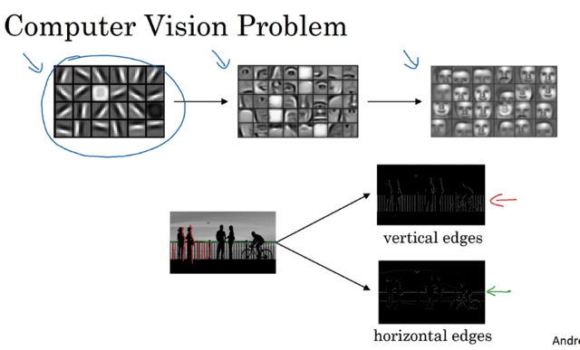</kbd></p>
  > [!NOTE]
  > Để detect object `-` Thì đầu tiên là làm sao xác định (detect) được cái edge `-`
  > đường viền, ranh giới của các object trước

  <br>

  <a id="node-1159"></a>
  <p align="center"><kbd>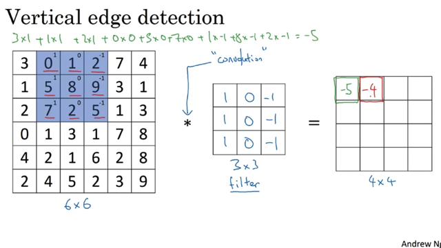</kbd></p>
  <p align="center"><kbd>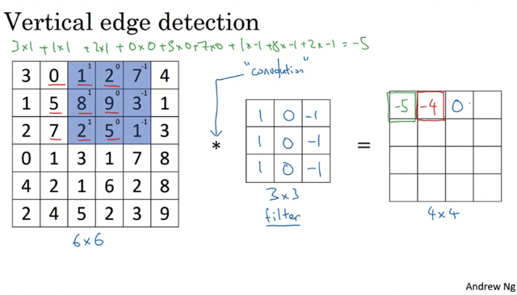</kbd></p>
  <p align="center"><kbd>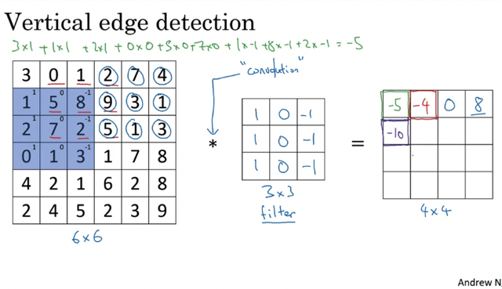</kbd></p>
  <p align="center"><kbd>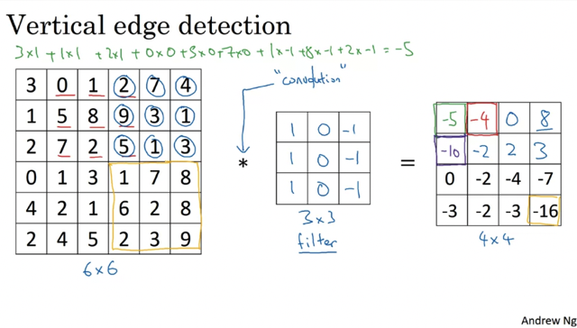</kbd></p>
  <p align="center"><kbd></kbd></p>
  <p align="center"><kbd></kbd></p>
  <p align="center"><kbd></kbd></p>
  <p align="center"><kbd></kbd></p>
  <p align="center"><kbd>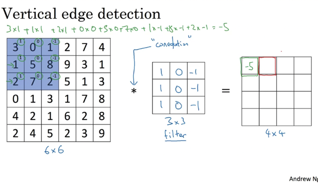</kbd></p>
  > [!NOTE]
  > Filter or Kernel
  >
  > Ví dụ hình 6x6x1 (gray scale nên x1)
  >
  > * Trong toán học * là phép toán 'Convolution', trong Python thì
  > lại là multiply, `element-wised` multiply

  <br>

  <a id="node-1160"></a>
  <p align="center"><kbd>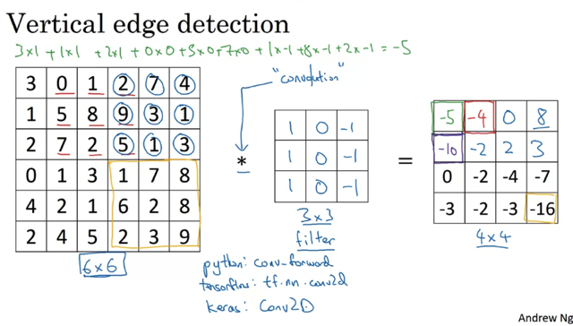</kbd></p>
  > [!NOTE]
  > Turn out to be a '**EDGE** detector' sẽ thấy sau.
  >
  > Python: `conv-forward`
  > TensorFlow: tf.nn.con2d
  > Keras: Conv2D

  <br>

  <a id="node-1161"></a>
  <p align="center"><kbd>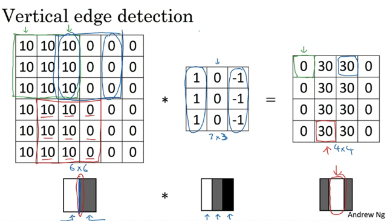</kbd></p>
  > [!NOTE]
  > In case the dimensions here seem a little bit wrong that the
  > detected edge seems really thick, that's only because we are
  > working with very small images in this example. And if you are
  > using, say a 1000 by 1000 image rather than a 6 by 6 image then
  > you find that this does a pretty good job, really detecting the vertical
  > edges in your image
  >
  > Đại khái là bằng cách 'convol' với cái filter, sẽ cho ra kết quả
  > 'detect' được cái '**edge**'. Ta thấy cái hình bên phải chính là cái 
  > edge `-` đường viền đó.

  <br>


<a id="node-1162"></a>
## More Edge Detection

<br>


<a id="node-1163"></a>
### 1 The video discusses \\*edge detection\\*, which is the process of

> [!NOTE]
> 1 The video discusses \**edge detection\**, which is the process of
> i\**dentifying boundaries\** in an image.
>
> 2 The video explains the \**difference between positive and negative
> edges\** and how this is detected using edge detection filters.
>
> 3\**Different edge detection filters\** are discussed, including the three
> by three filter for detecting vertical and horizontal edges, the \**Sobel
> filter\**, and the \**Scharr\** filter.
>
> 4 The video highlights the possibility of using \**machine learning\** to
> \**learn the parameters of an edge detection filter\**.
>
> 5 The \**limitations of edge detection\** in \**small images\** and the
> \**potential for deep learning to improve edge detection in complex
> images\** are also discussed.

> [!NOTE]
> 1 The video discusses the convolution operation and how it can be used to implement a vertical edge detector.
>
>  2 The video explains the difference between positive and negative edges, which refers to the difference between light to dark versus dark to light edge transitions.
>
>  3 The video shows that different types of edge detectors are possible, not just vertical edge detectors, and provides an example of a horizontal edge detector.
>
> 4 The video mentions that historically, there has been a fair amount of debate about what is the best set of numbers to use for edge detection filters, with different researchers using different sets of numbers, such as the Sobel filter or the Scharr filter.
>
>  5 The video introduces the idea of having an algorithm l**earn to create an edge detector rather than `hand-coding` one.** This involves treating the filter parameters 
> as **learnable parameters** that can be optimized using backpropagation.
>
> 6 The ultimate goal is to**learn filter parameters** that can**produce a good edge detector for complex images.**
>
>  7 The video notes that more advanced topics related to convolution and edge detection will be covered in later videos.

<br>

  <a id="node-1164"></a>
  <p align="center"><kbd>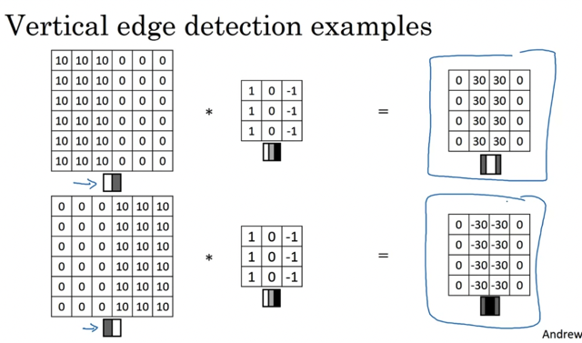</kbd></p>
  > [!NOTE]
  > 1 ví dụ cho thấy nếu ta 'flip' cái hình input thì cái edge sẽ màu dark thay vì
  > light, và nếu ta không quan tâm màu thì ta có thể lấy giá trị tuyệt đối ||30|| `=`
  > `-||30||` `=` 30

  <br>

  <a id="node-1165"></a>
  <p align="center"><kbd>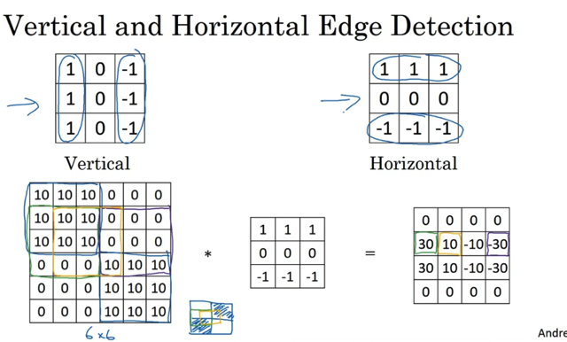</kbd></p>
  > [!NOTE]
  > So in summary, different filters allow you to
  > find vertical and horizontal edges.

  <br>

  <a id="node-1166"></a>
  <p align="center"><kbd>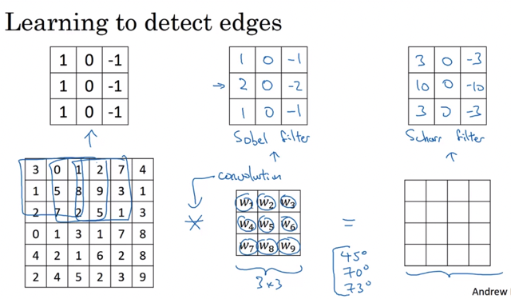</kbd></p>
  > [!NOTE]
  > Đại khái là cái matrix filter để dùng cho viêc edge detection này
  > như cái ở trên [1 1 1 0 0 0 ..] có thể có những kiểu khác với các
  > tên khác nhau có người thích dùng cái. [1 2 1..] gọi là **Sobel** filter, a
  > little bit better có nguời thấy [3 10 3..] tốt hơn gọi là **Scharr** filter.
  >
  > Nhưng cái chính là **với N.N, máy tính nó sẽ học để cho ra cái filter
  > sao cho giúp detect cái edge tốt nhất**, **có thể ra cái Sobel, hoặc
  > thậm chí ra cái tốt hơn cả mấy cái đó.**

  > [!NOTE]
  > Và không chỉ detect edge dọc,
  > ngang mà cả đường chéo, 45 độ
  > 70 độ v.v

  <br>


<a id="node-1167"></a>
## Padding

<br>


<a id="node-1168"></a>
### 1 \\*Padding\\* is a \\*modification\\* to the \\*basic convolutional operation\\* that can

> [!NOTE]
> 1 \**Padding\** is a \**modification\** to the \**basic convolutional operation\** that can
> help build \**deep neural networks\**.
>
> 2 A convolutional operation\**reduces the size of the image.\**
>
> 3 \**Shrinking\** the image too much may lead to \**loss of information. \**  
>
> 4 \**Padding\** is a solution to this problem as it \**preserves\** the size of the
> image.
>
> 5 By padding the image, the output dimension increases by \**2p\** in each
> direction.  
>
> 6 \**Valid convolution \**is a type of convolution that \**doesn't use
> padding.\**
>
> 7 \**Same convolution\** is a type of convolution where the \**output size\** is the
> \**same\** as the\**input size\**.
>
> 8 The amount of \**padding\** \**required\** to achieve the \**same\** convolution is
> \**(f-1)/2\**, where \**f is the size of the filter\**.

> [!NOTE]
> Sure, I can provide a more detailed answer to your request.
>
> 1 Padding is necessary for building deep neural networks:
>
> 2 To build deep neural networks, one modification to the basic convolutional operation that is necessary is padding. Without padding, the image shrinks after every convolutional operation, which is not desirable because it can lead to a very small image size, especially when there are many layers in the network.
>
>  3 The math behind convolutional operation and output dimension:
>
> ```text
> 4 The output dimension of a convolutional operation depends on the dimensions of the input image and the filter size. If an n by n image is convolved with an f by f filter, then the dimension of the output will be (n-f+1) by (n-f+1). For example, if a 6 by 6 image is convolved with a 3 by 3 filter, the output dimension will be 4 by 4 because 6-3+1=4.
> ```
>
>  5 Downsides of not using padding:
>  6 There are two downsides to not using padding. First, the image shrinks after every convolutional operation, which can lead to a very small image size, especially when there are many layers in the network. Second, the pixels near the edges of the image are used much less in the output because they are only touched by a few filters.
>
>  7 How padding works:
> ```text
> 8 Padding involves adding an additional border of pixels around the edges of the input image before convolving it with a filter. By convention, the border pixels are set to zero. The amount of padding is denoted by p. When an n by n image is padded with p pixels and convolved with an f by f filter, the output dimension becomes (n+2p-f+1) by (n+2p-f+1).
> ```
>
>  9 Advantages of padding:
>  10 Padding solves the two downsides of not using padding. First, padding preserves the input image size after every convolutional operation, **preventing the image from becoming too small.**Second, padding **ensures that all pixels in the image contribute equally to the output**, r**educing the bias against edge pixels** that occurs when padding is not used.
>
>  11 Two common choices for padding:
>  12 There are two common choices for padding: Valid convolution and Same convolution. Valid convolution means no padding is used. Same convolution means the amount of padding is chosen such that the output dimension is the same as the input dimension. The formula for calculating the amount of padding needed for Same convolution is p `=` `(f-1)/2.`

<br>

  <a id="node-1169"></a>
  <p align="center"><kbd>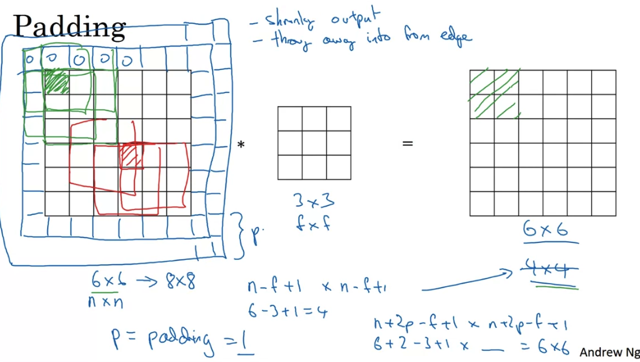</kbd></p>
  > [!NOTE]
  > Đại khái là để khắc phục 2 vấn đề là **'bị nhỏ dần' `-` shrinking output**
  > và **'bỏ qua `/` ít dùng cái ở biên' sẽ khiến model bị bias đối với
  > các info ở cạnh của input** thì người ta dùng '**padding**'
  >
  > Có thể dùng padding p `=` 1, hoặc 2 ...

  <br>

  <a id="node-1170"></a>
  <p align="center"><kbd>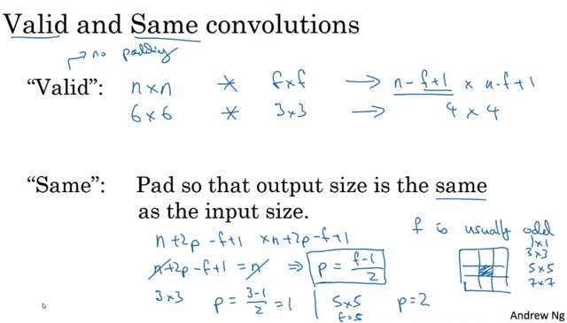</kbd></p>
  > [!NOTE]
  > **Valid padding** là không dùng padding 
  >
  > **Same padding** là sao cho output dimension bằng với input **p `=` (f-1)/2**
  > Conventionally **f thường là số lẻ 3x3, 5x5, 7x7 để padding không bị
  > asymmetric**

  > [!NOTE]
  > Nếu có bối rối ko nhớ đc thì chỉ cần nhớ
  > nếu không có padding thì thì từ n giảm xuống còn n `-` f `+` 1 
  >
  > ```text
  > Vậy muốn giữ nguyên thì + thêm f -1 nữa nên p = (f-1) /  2,
  > ```
  > tại 2 bên quá dể nhớ

  <br>


<a id="node-1171"></a>
## Strided Convolutions

<br>


<a id="node-1172"></a>
### 1 \\*Strided\\* convolutions are a basic building block of Convolutional Neural

> [!NOTE]
> 1 \**Strided\** convolutions are a basic building block of Convolutional Neural
> Networks.
>
> 2 A \**strided\** convolution involves taking an `element-wise` product of an
> image and a filter, but \**instead of stepping the filter by one\**, it is stepped
> by a \**stride s.\**
>
> 3 The output dimensions of the strided convolution are governed by the
> ```text
> formula: (N + 2P - F)/S + 1, where N is the input size, P is the padding, F
> ```
> is the filter size, and S is the stride.
>
> 4 If the output dimensions are \**not an integer\**, they are \**rounded down.\**
>
> 5 The \**convention\** for convolutions is that the \**filter\** must \**lie entirely\** within
> the image or the image plus padding region.
>
> 6 The difference between \**convolution\** and \**cross-correlation\** is that
> convolution involves a flip of the filter on both axes before taking the
> `element-wise` product and summing, while `cross-correlation` does not
> involve this flip. However, the \**deep learning literature\** often r\**efers to both
> operations as convolutions.\**

<br>

  <a id="node-1173"></a>
  <p align="center"><kbd>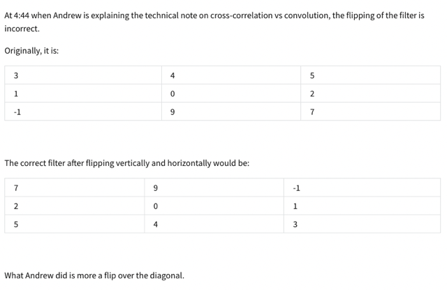</kbd></p>
  <br>

  <a id="node-1174"></a>
  <p align="center"><kbd>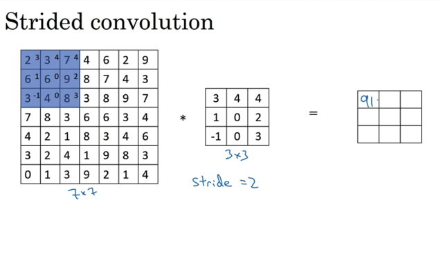</kbd></p>
  <br>

  <a id="node-1175"></a>
  <p align="center"><kbd>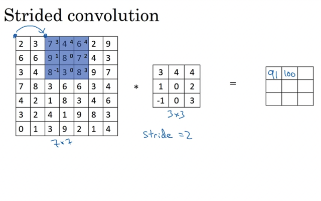</kbd></p>
  <br>

  <a id="node-1176"></a>
  <p align="center"><kbd>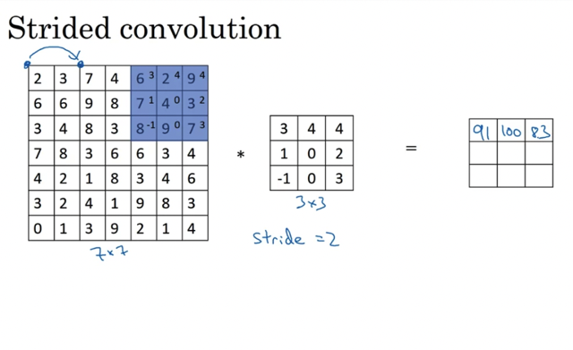</kbd></p>
  <br>

  <a id="node-1177"></a>
  <p align="center"><kbd>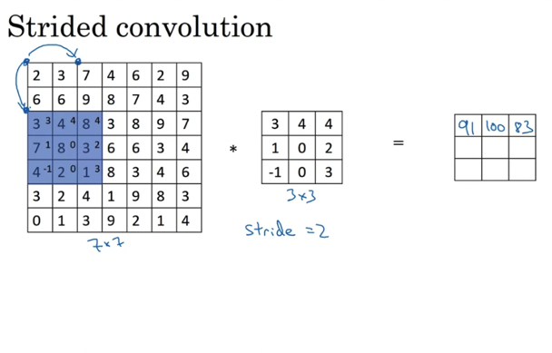</kbd></p>
  <br>

  <a id="node-1178"></a>
  <p align="center"><kbd>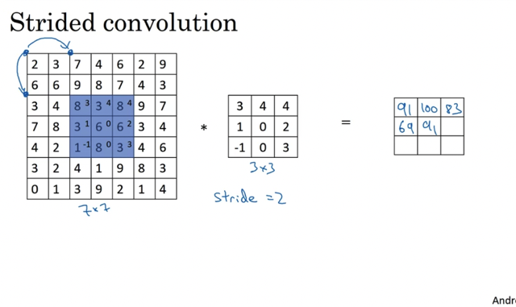</kbd></p>
  <br>

  <a id="node-1179"></a>
  <p align="center"><kbd>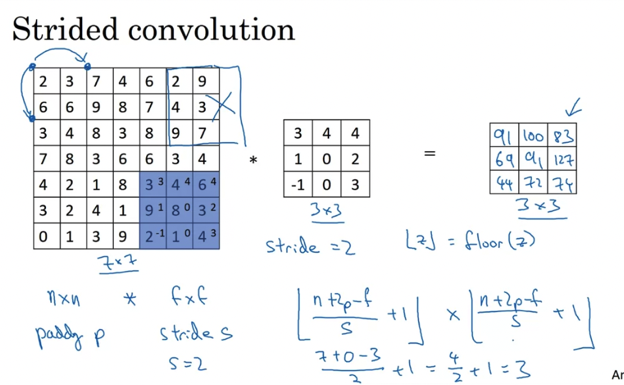</kbd></p>
  > [!NOTE]
  > Kí hiệu [z] (đúng hơn là chỉ có ngoặc ở dưới: Round down
  > `->` Nếu `(n+2p-f)/s` **không nguyên thì round down** `-` làm tròn xuống.
  >
  > Theo convention thì **filter phải nằm trọn trong image `+` padding** thì mới tính

  <br>

  <a id="node-1180"></a>
  <p align="center"><kbd>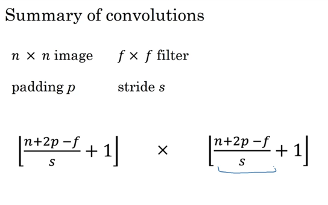</kbd></p>
  > [!NOTE]
  > Chọn s cho kết quả nguyên thì tốt không thì
  > làm tròn cũng được

  <br>

  <a id="node-1181"></a>
  <p align="center"><kbd>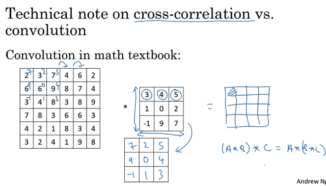</kbd></p>
  > [!NOTE]
  > Đại khái là đúng ra phải gọi là '**Cross-correlation**' chứ không phải
  > convolution vì **trong toán học** phép convolution yêu cầu phải **flip** cái matrix
  > filter horizontally và vertically trước.
  >
  > Điều này sẽ giúp phép toán convolution có tính chất (A*B)*C `=` A*(B*C)
  > gọi là **associativity**nhưng trong Deep learning thì cái này không giúp ích
  > gì mấy nên người ta cứ gọi là Convolution mà không cần phải flip để cho
  > đơn giản

  <br>


<a id="node-1182"></a>
## Convolutions Over Volume

<br>


<a id="node-1183"></a>
### • \\*3D convolution\\* can be used to \\*detect features\\* in

> [!NOTE]
> • \**3D convolution\** can be used to \**detect features\** in
> 3D volumes.
>
> • \**Filters\** are placed in the volume and multiplied with
> corresponding values from the color channels to
> produce an output volume.
>
> • \**Different parameters\** can be used to create \**different
> feature detectors\**.
>
> • \**Multiple filters\** can be used at the same time to
> detect \**multiple types of features\** (more complex features)

> [!NOTE]
> 1 Introduction to 3D convolutions:
>  • Convolution can be implemented not just on 2D images but also on 3D volumes.
>  • An example of a 3D volume is an RGB image, where the dimensions are height, width, and number of color channels.
>  • A 3D filter can be used to detect features in a 3D volume, where the filter also has height, width, and number of channels.
>  • The number of channels in the image and filter must match.
>
>  2 How 3D convolution works:
>  • To perform 3D convolution, the filter is placed in the upper left position of the volume and multiplied with the corresponding numbers from the color channels.
>  • The resulting values are added up to produce the first output.
>  • The filter is then slid over one position at a time, and the process is repeated to produce the rest of the outputs.
>  • This process results in a 2D output volume.
>
>  3 Using 3D convolution to detect features:
>  • By setting the parameters of the filter, different feature detectors can be created.
>  • For example, a filter with all 1s in the red channel and all 0s in the green and blue channels can detect vertical edges in the red channel.
>
>  • A filter with 1s and `-1s` in all three channels can detect edges in any color.
>  • Different combinations of parameters can produce different types of feature detectors.
>
>  4 Using multiple filters:
>  • Multiple filters can be applied to a volume at the same time to detect multiple types of features.
>  • This results in multiple output volumes, each corresponding to a different filter.
>  • By using different combinations of filters, more complex features can be detected.
>
>  5 Summary:
>  • 3D convolution can be used to detect features in 3D volumes.
>  • Filters are placed in the volume and multiplied with corresponding values from the color channels to produce an output volume.
>  • Different parameters can be used to create different feature detectors.
>  • **Multiple filters**can be **used at the same time** to detect **multiple types of features.**

<br>

  <a id="node-1184"></a>
  <p align="center"><kbd>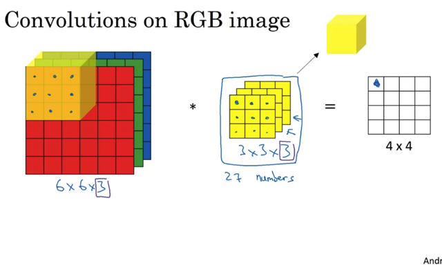</kbd></p>
  > [!NOTE]
  > Đại khái là cũng convol từng **'lớp' của filter
  > với từng 'lớp'**của cái image Xong rồi
  > **sum** **kết quả của cả 3 lớp lại**

  <br>

  <a id="node-1185"></a>
  <p align="center"><kbd>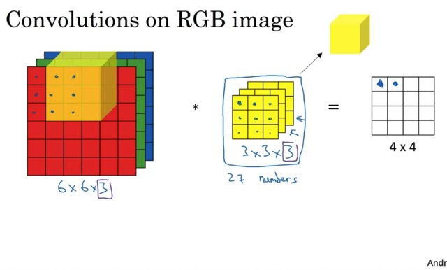</kbd></p>
  <br>

  <a id="node-1186"></a>
  <p align="center"><kbd>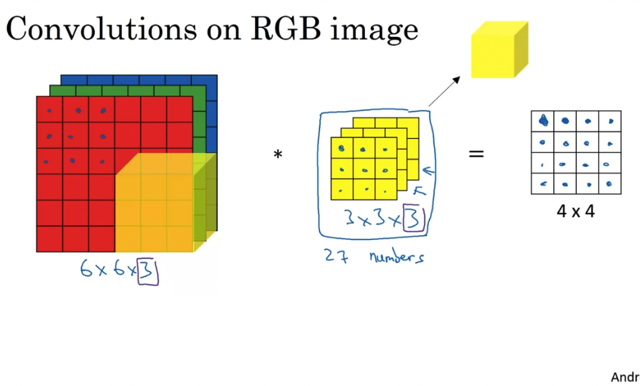</kbd></p>
  <br>

  <a id="node-1187"></a>
  <p align="center"><kbd>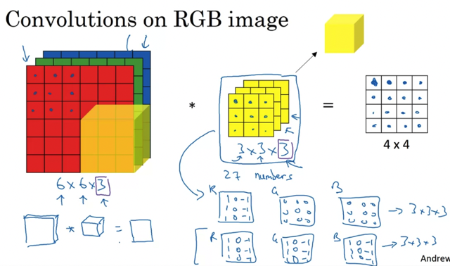</kbd></p>
  > [!NOTE]
  > Feature detector: Đại khái là các thay đổi giá trị của **params khác** (của
  > filter) sẽ giúp **detect feature khác nhau** ví dụ sẽ quyết định được là "
  > Chỉ detect edge with color RED", or "detect edge chung"
  >
  > Đại khái cũng chỉ nói lại việc thay đổi cái param `-` giá trị của cái  Filter sẽ
  > giúp detect các `pattern/feature` khác nhau có điều filter bây h là 3D chứ
  > ko chỉ 2D nên nó có thể detect nhiều pattern phức tạp hơn ví dụ như
  > cũng đường viền nhưng mà đường viền màu này màu  kia nữa chứ
  > không chỉ đường viền chung chung

  <br>

  <a id="node-1188"></a>
  <p align="center"><kbd>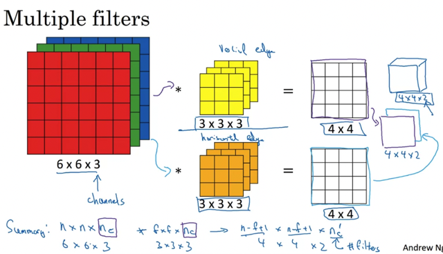</kbd></p>
  > [!NOTE]
  > **Multiple features detector**: Đại khái là kết hợp nhiều filter sẽ **detect
  > dc nhiều features cùng lúc** `->` More complex features detector
  >
  > Mỗi filter ra 1 output xong **stack mấy cái output lại**

  <br>


<a id="node-1189"></a>
## One Layer Of A Convolutional Network

<br>


<a id="node-1190"></a>
### 1 The video demonstrates how to build one layer of a convolutional neural

> [!NOTE]
> 1 The video demonstrates how to build one layer of a convolutional neural
> network using an example of \**convolving a 3D volum\**e with\**two filters\** to
> produce different \**4 by 4 outputs.\**
>
> 2 The resulting outputs are passed through a \**bias\** and \**non-linearity\** to
> produce a\**4 by 4 output\** \**for each filter,\** which are then \**stacked up\** to form a
> \**4 by 4 by 2 output volume.\**
>
> 3 The convolution operation is \**similar to a linear operation\** in a
> `non-convolutional` neural network, where the \**filters\** play a \**role similar to w1\**
> and the \**output\** of the convolution operation plays a role similar to \**w1 times
> a0.
> \**
> 4 One layer of a convolutional neural network can have \**multiple filters,\**
> which can result in a \**higher-dimensional output volume.\**
>
> 5 To calculate the number of parameters in a layer with ten 3 by 3 by 3
> filters, one needs to multiply the number of parameters per filter (28) by the
> number of filters (10), resulting in 280 parameters.

> [!NOTE]
> 1 Get ready to learn how to build one layer of a convolutional neural network.
>
>  2 The video at timestamp 0:12 shows how to convolve a 3D volume with two filters.
>
>  3 The goal in this example is to obtain two different 4 by 4 outputs.
>
>  4 Each output is obtained by **convolving the input with a different filter**, adding a **bias**, and **applying a non-linearity** (kiểu như sigmoid hay relu).
>
>  5 After these operations, we get two 4 by 4 outputs, which we can **stack up** to form a 4 by 4 by 2 output volume.
>
>  6 The computation from a 6 by 6 by 3 input volume to a 4 by 4 by 2 output volume is **one layer of a convolutional neural network.**
>
>  7 The convolution operation plays a role similar to the linear operation in a `non-convolutional` neural network.
>
>  8 The filters used in the convolution operation are similar to the **weights** used in a `non-convolutional` neural network.
>
>  9 Adding **biases** and applying **non-linearities** are also part of the convolutional neural network operation.
>
>  10 The n**umber of filters** used in a layer determines the **number of channels**in the **output volume.**
>
>  11 If we had 10 filters in the example instead of 2, we would have ended up with a 4 by 4 by 10 output volume.
>
>  12 To calculate the number of parameters in a layer, we need to count the parameters in each filter (27 parameters for a 3 by 3 by 3 filter) and add the bias (1 parameter).
>
>  13 If we have 10 filters, we end up with a total of 280 parameters (28 parameters per filter times 10 filters).

<br>

  <a id="node-1191"></a>
  <p align="center"><kbd>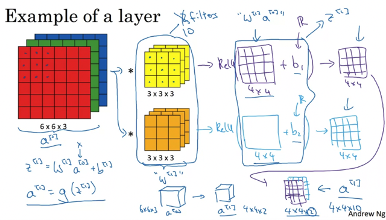</kbd></p>
  > [!NOTE]
  > Giống như a[1] `=` w.a[0] `+` b thì
  > filter đóng vai trò như w

  <br>

  <a id="node-1192"></a>
  <p align="center"><kbd>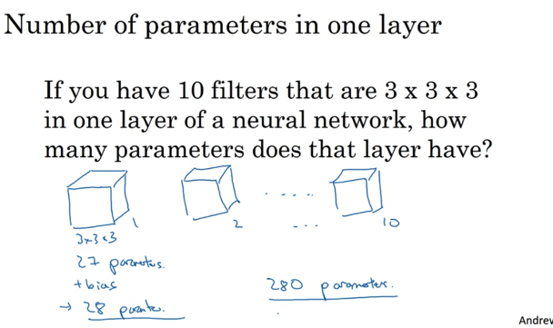</kbd></p>
  > [!NOTE]
  > 10 filter, mỗi cái 3x3x3 `=` 27
  > params, thêm 1 cái bias là 28.
  > Vậy tổng là 280 params

  <br>

  <a id="node-1193"></a>
  <p align="center"><kbd>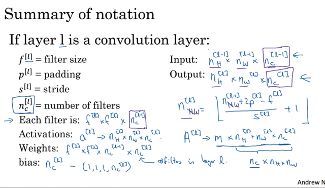</kbd></p>
  > [!NOTE]
  > Khái quát hoá nên có thể bối rối chỉ cần nhớ
  >
  > Muốn convol được thì **số lớp (bề dày, số channel) của filter phải bằng bề 
  > dày của input**để convol xong nó gộp lại thành 1 channel
  >
  > Vậy input `a[l-1]` là nH `[l-1]` x nW `[l-1]` x **nC [l-1]** 
  > thì filter cũng f [l] x f [l] x **nC `[l-1]`
  >
  > NHƯNG LAYER [l] CÓ NHIỀU FILTER `=` nC [l]
  > nên mỗi kết quả từ mỗi filter stack lại thành ra nC [l] channel**nên output là a[l] sẽ (có shape) là nH [l] x nW [l] x nC [l]
  >
  > Và theo quan hệ của conv operation thì 
  >
  > ```text
  > nH [l] = [ n[H] [l-1] - f + 2*p [l] ] / s [l] + 1 (] là round-down)
  > ```
  > nW cũng vậy
  >
  > Tổng số weight layer [l] là: 
  > (1 cái filter có f [l] x f [l] x nC `[l-1]` params) x nC [l] cái filter****=****f [l] x f [l] x nC [l-1]****x nC [l] params

  <br>


<a id="node-1194"></a>
## Simple Convolutional Network Example

<br>


<a id="node-1195"></a>
### 1 Introduction to a deep convolutional neural network for

> [!NOTE]
> 1 Introduction to a deep convolutional neural network for
> \**image classification.\**
>
> 2 Example of a \**ConvNet\** using small images.
>
> 3 Explanation of the \**dimensions\** and \**number of filters\** for
> each convolutional layer.
>
> 4 \**Flattening\** the output of the \**last convolutional layer\** into a
> vector for the final prediction.
>
> 5 The importance of \**selecting\** \**hyperparameters\** in designing
> a convolutional neural network.
>
> 6 Upcoming guidelines and suggestions for \**selecting
> hyperparameters.\**

> [!NOTE]
> 1 Introduction: The video discusses a concrete example of a **deep convolutional neural network for image classification**, and provides practice with the notation introduced in the previous video.
>
> 2 Image Classification Task: The task is to take an image, x, as input and classify it as either a cat or not (0 or 1), making it a **classification** problem.
>
>  3 First Convolutional Layer: A set of 3 by 3 filters is used to detect features in the first layer, with a stride of 1 and no padding. **10 filters**are used, resulting in an output volume of **37 x 37 x 10.**
>
>  4 Notation for First Layer: In the notation used in the video, nh[1] `=` nw[1] `=` 37, and **nc[1] `=` 10**, where nh and nw are the height and width of the output volume, and **nc is the number of filters**.
>
>  5 Second Convolutional Layer: The second layer uses 5 by 5 filters with a stride of 2 and no padding. **20 filters** are used, resulting in an output volume of**17 x 17 x 20.**
>  6 Notation for Second Layer: In the notation used in the video, nh[2] `=` nw[2] `=` 17, and **nc[2] `=` 20.**
>
>  7 Third Convolutional Layer: The third layer also uses 5 by 5 filters with a stride of 2 and no padding. **40 filters**are used, resulting in an output volume of **7 x 7 x 40.**
>
>  8 Notation for Third Layer: In the notation used in the video, the **output volume of the third layer is represented as a flattened vector of length 1,960.**
>
>  9 Flattening and Final Output: The output volume is **flattened** into a long vector and fed into a **logistic regression or softmax unit**, depending on the specific classification task. This gives the final predicted output for the neural network.
>
>  10 Designing Convolutional Neural Networks: The video notes that a lot of the work in designing convolutional neural networks is **selecting hyperparameters** such as total **size**, **stride**, **padding**, and **number of filters.**
>
>  11 Conclusion: The video concludes by mentioning that later videos will provide suggestions and guidelines on making these choices.

<br>

  <a id="node-1196"></a>
  <p align="center"><kbd>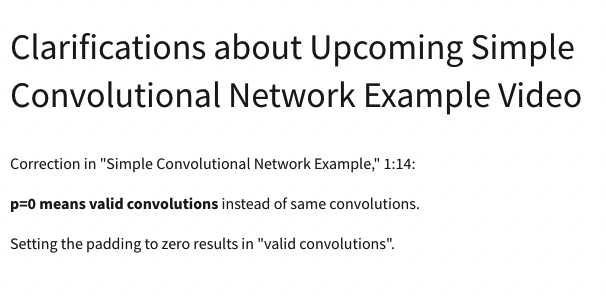</kbd></p>
  <br>

  <a id="node-1197"></a>
  <p align="center"><kbd>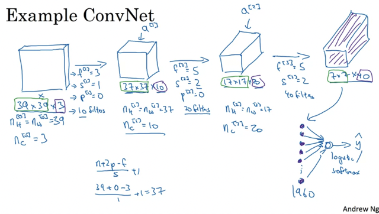</kbd></p>
  > [!NOTE]
  > Some note:
  >
  > Kết quả cuối (volume cuối) 7x7x40 sẽ được **flatten** thành 1 vector
  > và bỏ vào **sigmoid** hay **softmax** để tính 
  >
  > Nhận thấy: **nC tăng dần** qua các layer `3-10-20-40,` **nW, nH** **thì giảm dần**

  <br>

  <a id="node-1198"></a>
  <p align="center"><kbd>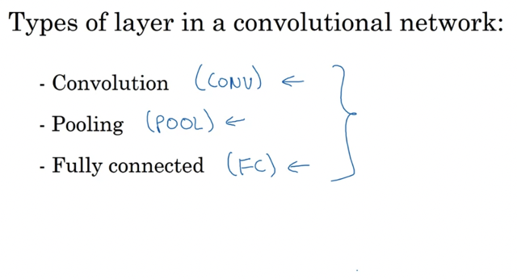</kbd></p>
  > [!NOTE]
  > Convolution thôi cũng được nhưng nó
  > thường có thêm **pooling layer** và **FC** layer

  <br>


<a id="node-1199"></a>
## Pooling Layers

<br>


<a id="node-1200"></a>
### 1 ConvNets use \\*pooling layers\\* to \\*reduce representation size\\*, \\*increase speed\\*

> [!NOTE]
> 1 ConvNets use \**pooling layers\** to \**reduce representation size\**, \**increase speed\**
> and \**make features more robust.\**
>
> 2 \**Max pooling\** is a common type of pooling layer.
>
> 3 In max pooling, the input is divided into regions and the \**output is the maximum
> value of each region.\**
>
> 4 The \**hyperparameters\** of max pooling are\**filter size\** and \**stride\**, which determine
> the s\**ize of the regions\**.
>
> 5 Max pooling helps \**preserve features detected anywhere in the filter\**, while
> \**suppressing others that aren't detected\**.
>
> 6 The intuition behind \**why max pooling works well\** is \**not fully understood.\**
>
> 7 Max pooling has \**hyperparameters\** but no parameters to learn, so it's a \**fixed
> computation.\**
>
> 8 The formulas for figuring out the \**output size\** of convolutional layers also work
> for max pooling.
>
> 9 Max pooling can be applied to \**3D\** \**inputs and the output will have the same
> dimension.\**

> [!NOTE]
> 1 Convolutional layers and pooling layers are commonly used in ConvNets to reduce the size of the representation and make feature detection more robust.
>  • Convolutional layers use filters to detect specific features in the input data, which can be images or other types of multidimensional data.
>  • Pooling layers reduce the size of the representation by taking a sliding window over the input and applying a function (usually max or average) to each window. This reduces the size of the representation while also making the features detected by the ConvNet more robust to small variations in the input.
>
>  2 Max pooling is a type of pooling that takes the maximum value of each window.
>  • To perform max pooling, the input is divided into `non-overlapping` regions (the size of which is determined by the filter size and stride), and the maximum value in each region is taken as the output.
>  • The intuition behind max pooling is that it **preserves features that are detected anywhere in the input, while reducing the impact of small variations in the input**.
>
>  3 Max pooling has hyperparameters (filter size and stride) but no learnable parameters.
>  • This means that the output of max pooling is a fixed function of the input and the hyperparameters, and there is no need to optimize any parameters using gradient descent.
>  • This also means that max pooling can be easily added to ConvNets **without increasing the number of learnable parameters,** which can be important for **reducing overfitting.**
>
>  4 The formulas for calculating the output size of convolutional layers also work for max pooling.
> ```text
> • The output size of a convolutional layer or a pooling layer can be calculated using the formula n + 2p - f / s + 1, where n is the input size, p is the padding size (if any), f is the filter size, and s is the stride.
> ```
>  • This formula can be used to determine the output size of max pooling with different hyperparameters.
>
>  5 Max pooling can also be applied to 3D input data.
>  • If the input data has three dimensions (e.g., a stack of 2D images), max pooling can still be applied using a**3D sliding window** and **taking the maximum value in each window.** • **The output will have the same number of dimensions as the input**, but with **reduced size** in the dimensions corresponding to the pooling window.

<br>

  <a id="node-1201"></a>
  <p align="center"><kbd>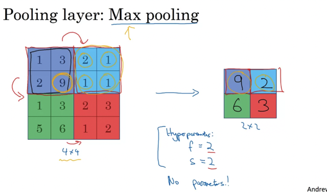</kbd></p>
  > [!NOTE]
  > `\/"Max` pooling helps preserve features detected anywhere in
  > the filter, while suppressing others that aren't detected." `\/` Đại
  > khái là max pooling giúp kiểu như giữ lại những gì (feature) nó
  > phát hiện

  <br>

  <a id="node-1202"></a>
  <p align="center"><kbd>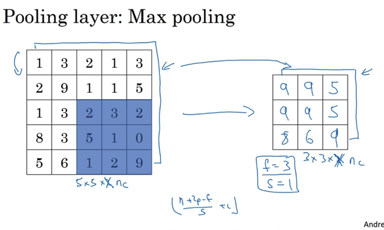</kbd></p>
  > [!NOTE]
  > Quan hệ tính size của input vào output cũng theo công thức 
  > ```text
  > = round-down[ (n - f + 2p) / s ] + 1
  > ```
  >
  > Và nếu là 3 channel thì output cũng có 3 channel
  > (mỗi channel của filter sẽ 'tính'  với 1 channel của input)
  > có điều khác với convol thường thì **pooling nó không gộp các
  > channel kết quả lại** nên kết quả vẫn **giữ số channel**của input 
  > (và của filter)

  <br>

  <a id="node-1203"></a>
  <p align="center"><kbd>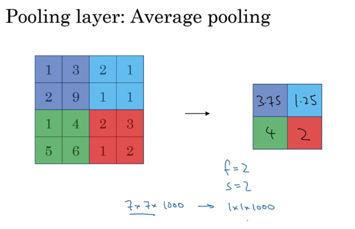</kbd></p>
  <br>

  <a id="node-1204"></a>
  <p align="center"><kbd>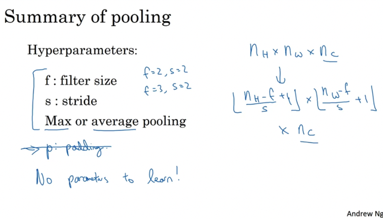</kbd></p>
  <br>


<a id="node-1205"></a>
## CNN Example

<br>

<a id="node-1206"></a>

<p align="center"><kbd>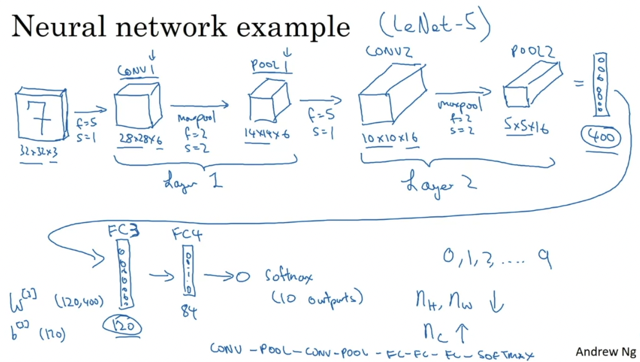</kbd></p>

> [!NOTE]
> `-` Ở đây, và từ đây ổng sẽ ko viết cụ thể số filter
> của từng layer nữa mà tự hiểu rằng số channel
> của output chính là số filter
>
> Ví dụ từ 32x32x3 `->` 28x28x**6** **tự hiểu có 6 filter,** size filter bao nhiêu
>  thì tính theo công thức. Nhẩm được thì nhẩm 
> ```text
> 28 = (32 - f + 2*0)/1 + 1 -> f = ...
> ```
>
> `-` Layer 1 gồm 1 Conv và 1 Pool
> `-` Layer 2 cũng 1 Conv và 1 Pool
> `-` Rồi flatten rồi qua mấy cái Dense (Fully Connected) layer
> nữa cuối cùng là Softmax
>
> ```text
> CONV-POOL-CONV-POOL-FC-FC-FC-SOFTMAX
> ```
>
> Cái mô hình này chính là **LeNet-5**

<br>

<a id="node-1207"></a>

<p align="center"><kbd>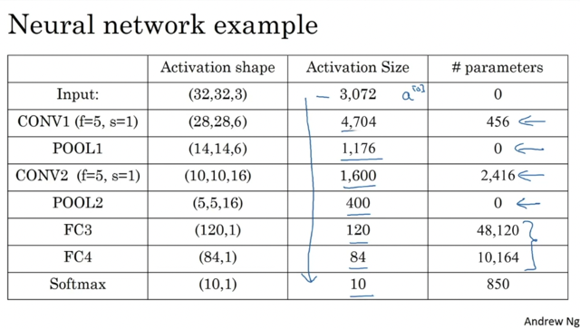</kbd></p>

<br>


<a id="node-1208"></a>
## Why Convolutions?

<br>


<a id="node-1209"></a>
### 1 Convolutional layers have \\*two main advantages\\* over fully

> [!NOTE]
> 1 Convolutional layers have \**two main advantages\** over fully
> connected layers: \**parameter sharing\** and \**sparsity of
> connections.\**
>
> 2 Convolutional layers have a lot\**fewer parameters\**, which
> allows for \**smaller training sets and less overfitting\**.
>
> 3 Convolutional neural networks \**capture translation invariance\**,
> which helps them \**recognize objects regardless of their location\**
> in an image.
>
> 4 \**Training\** a convolutional neural network involves using a
> \**labeled training\** set to \**adjust the weights of the filters\** to
> produce accurate outputs.

> [!NOTE]
> 1 Advantages of convolutional layers over fully connected layers
>
>  2 1.1. Parameter sharing: **feature detectors that are useful in one part of the image are likely useful in other parts of the imag**e. With parameter sharing, the **same feature detector**can be **applied to different positions** in the input image to detect features, reducing the number of parameters needed to train the network.
>
>  3 1.2. Sparsity of connections: convolutional layers only depend on a small, localized region of the input image, resulting in **sparse connections between the input and output layers**. This also **reduces the number of parameters** needed to train the network.
>
>  4 T**ranslation invariance** and **robustness**
>
>  5 2.1. Convolutional structure helps neural networks capture **translation invariance,** where an image shifted a few pixels should **still be recognized** as the same object.
>  6 2.2. Applying the same filter across all positions of the image in the early and late layers of the network helps improve the robustness of the network.
>
>  7 Training a convolutional neural network
>
>  8 3.1. Building a **labeled training set for a specific task**, such as identifying images of cats and dogs.
>  9 3.2. **Preprocessing** the data to **standardize the image size** and pixel values.
>  10 3.3. **Defining the architecture** of the convolutional neural network, including the number and type of layers, activation functions, and optimization algorithm.
>  11 3.4.**Initializing the weights** of the network and using **backpropagation** to **adjust the weights** to **minimize the loss** between the predicted and actual labels.
>  12 3.5. **Evaluating the performance** of the network on a validation set and **adjusting the hyperparameters** as necessary.
>  13 3.6. Finally, **testing** the trained network on a test set to **evaluate its generalization performance.**

<br>

  <a id="node-1210"></a>
  <p align="center"><kbd>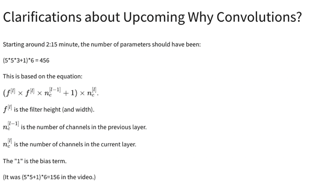</kbd></p>
  <br>

  <a id="node-1211"></a>
  <p align="center"><kbd>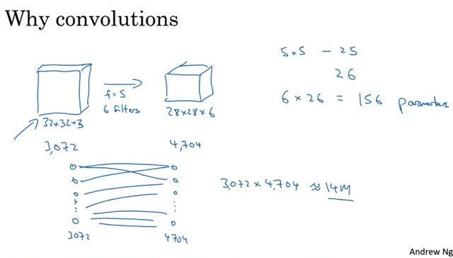</kbd></p>
  > [!NOTE]
  > Thấy rõ đại khái là nếu là n.n thường thì số params sẽ rất lớn khi layer 1 có
  > 3072 unit layer 2 có 4704 unit sẽ ra là **14 triệu params** trong khi ConvNet
  > chỉ cần **156**

  <br>

  <a id="node-1212"></a>
  <p align="center"><kbd>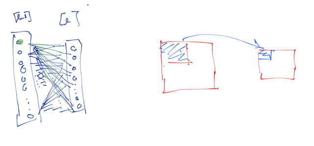</kbd></p>
  <p align="center"><kbd></kbd></p>
  <p align="center"><kbd>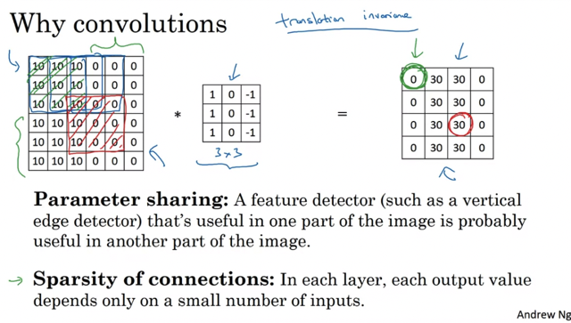</kbd></p>
  > [!NOTE]
  > **Params sharing**: Đại khái là **1 vài weight (trong filter)** có
  > thể giúp **detect feature ở nhiều vị trí khác nhau** trong hình
  > chứ **không nhất thiết phải là mỗi chỗ một cái** `->` **Giảm bớt
  > số weight** cần thiết
  >
  > **Sparsity of connections**: Đại khái là:..
  >
  > `Fully-connected` NN thì **mỗi unit của layer trước**sẽ**connect
  > tới mọi unit của layer sau,**cũng như là **mỗi unit của layer sau
  > sẽ connect với mọi unit của layer trước**
  >
  > Conv NN thì**mỗi output chỉ connect với một vài input
  > thôi -** nhớ lại lúc tính thì mỗi số của là kết quả của phép tính
  > convolution của 1 vài ô trong các channel thôi chứ không phải
  > tất cả

  <br>

  <a id="node-1213"></a>
  <p align="center"><kbd>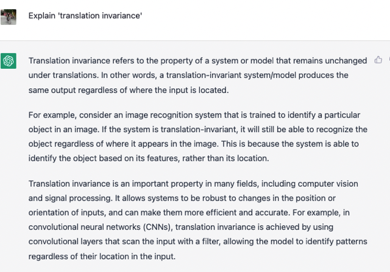</kbd></p>
  > [!NOTE]
  > '**Translation invariance**' là tính chất của một mô hình hoặc một hệ thống
  > có khả năng xử lý các đối tượng, hình ảnh, văn bản,... mà **không bị ảnh
  > hưởng bởi vị trí tương đối giữa chúng** trong không gian hay thời gian.
  >
  > Nói cách khác, tính chất này cho phép mô hình hoặc hệ thống đó **nhận ra
  > các đối tượng giống nhau dù chúng xuất hiện ở những vị trí khác nhau**
  > trên màn hình hoặc thời gian.
  >
  > `->` Đại khái là 1 hệ thống mà có tính chất 'translation invariance' như để
  > detect hình con mèo trong một bức ảnh thì dù con mèo  xuất hiện ở đâu
  > trong bức ảnh nó cũng detect được

  <br>

<a id="node-1214"></a>
- 7 Training a convolutional neural network  `-` Building a \\*labeled training\\* set for a specific task, such as identifying images of cats and dogs.  `-` \\*Preprocessing\\* the \\*data\\* to \\*standardize\\* the \\*image size\\* and pixel values.  `-` \\*Defining the architecture\\* of the convolutional neural network, including the \\*number\\* and\\* type of layer\\*s, \\*activation\\* functions, and \\*optimization\\* algorithm.  `-` \\*Initializing the weights \\*of the network and using \\*backpropagation\\* to \\*adjust the weights\\* to \\*minimize the loss\\* between the \\*predicted\\* and actual labels.  `-` \\*Evaluating the performance\\* of the network on a \\*validation set\\* and \\*adjusting the hyperparameters\\* as necessary.  `-` Finally, \\*testing the trained network\\* on a test set to \\*evaluate its generalization performance.\\*
  <br>

  <a id="node-1215"></a>
  <p align="center"><kbd>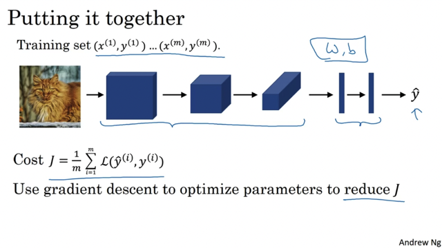</kbd></p>
  <br>


<a id="node-1216"></a>
## Quiz

<br>

<a id="node-1217"></a>

<p align="center"><kbd></kbd></p>

<br>

<a id="node-1218"></a>

<p align="center"><kbd>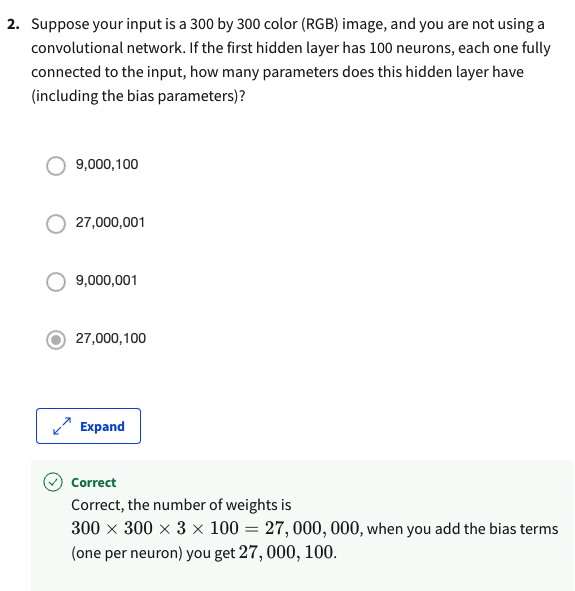</kbd></p>

<br>

<a id="node-1219"></a>

<p align="center"><kbd>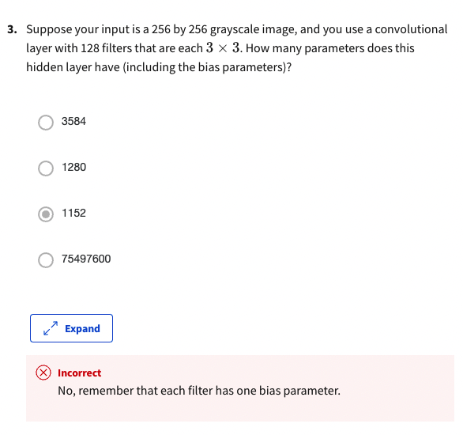</kbd></p>

> [!NOTE]
> ```text
> 3x3 = 9 (weights) + 1 (bias) = 10 x 128 (no. filters) = 1280
> ```

<br>

<a id="node-1220"></a>

<p align="center"><kbd>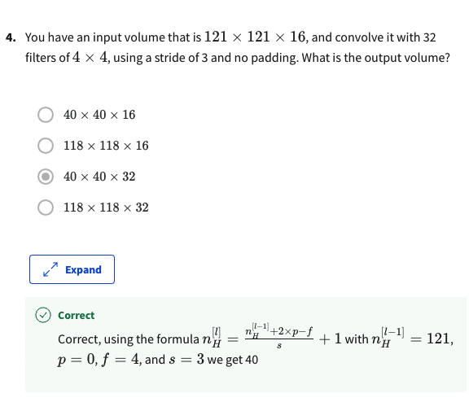</kbd></p>

<br>

<a id="node-1221"></a>

<p align="center"><kbd>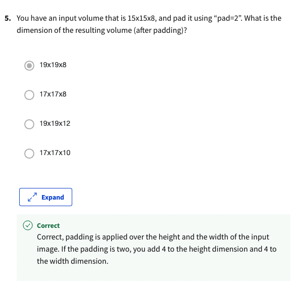</kbd></p>

<br>

<a id="node-1222"></a>

<p align="center"><kbd>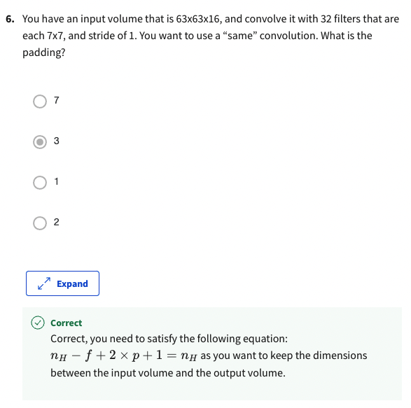</kbd></p>

> [!NOTE]
> Nhẩm rất nhanh (do s `=` 1 nên đỡ rối vụ chia s) là n sau
> ```text
> khi cònv là 63 - 7+1 = 63 - 6 vậy padding phải bù lại để
> ```
> ```text
> giữ nguyên 63 -> 2p = 6 => p = 3
> ```

<br>

<a id="node-1223"></a>

<p align="center"><kbd>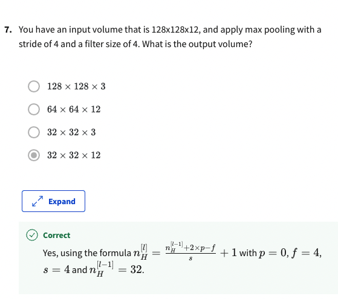</kbd></p>

> [!NOTE]
> Nhẩm: channel vẫn là 12. 128 `-` 4 (f) `/` 4(s) `=`
> 31. Xong `+` 1 là 32 `->` 32x32x12

<br>

<a id="node-1224"></a>

<p align="center"><kbd>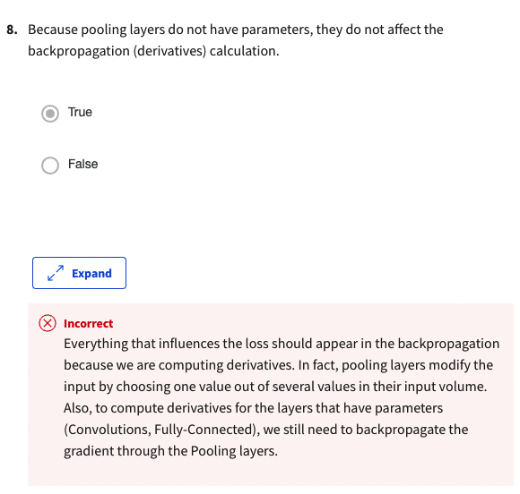</kbd></p>

<br>

<a id="node-1225"></a>

<p align="center"><kbd>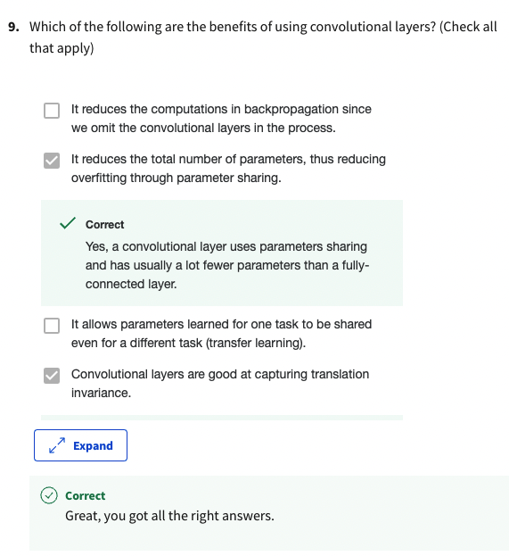</kbd></p>

> [!NOTE]
> Cái ý đầu sai, vì hiển nhiên ta ko thể 'omit' `-` bỏ qua
> cái conv layer trong quá trình backprop
>
> Cái ý 3 transfer learning không chỉ có Conv mới có

<br>

<a id="node-1226"></a>

<p align="center"><kbd>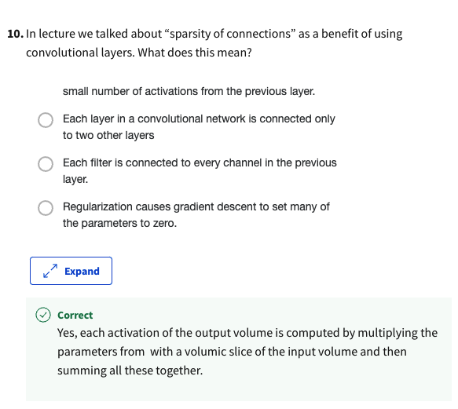</kbd></p>

<br>


<a id="node-1227"></a>
## Programming Assignments: Convolutional Model

<br>


<a id="node-1228"></a>
### Be able to:

> [!NOTE]
> Be able to:  
> • Explain the convolution operation
>
> • Apply two different types of pooling operation
>
> • Identify the components used in a convolutional
> neural network (padding, stride, filter, ...) and their
> purpose
>
> • Build a convolutional neural network

> [!NOTE]
> Nói chung là làm những 'công việc' của
> convolution from scratch bằng numpy

<br>

<a id="node-1229"></a>
- 1 `-` Packages: Matplotlib, numpy
  <br>

    <a id="node-1230"></a>
    <p align="center"><kbd>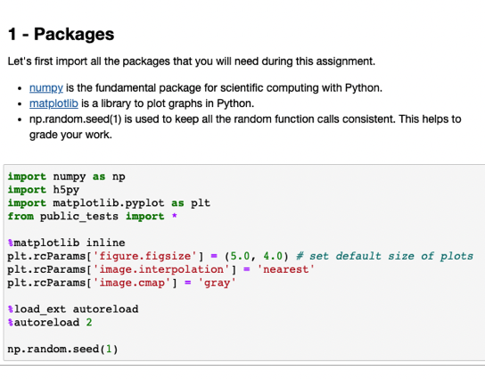</kbd></p>
    <br>

<a id="node-1231"></a>
- 2 `-` Outline of the Assignment: Đại khái là mô tả sơ những function sẽ làm cho  Convolution n.n from scratch (bằng numpy)  Ổng nói dù những Framework như TS, PT bây giờ giúp việc define ConvNet dể dàng nhưng việc hiểu nó vẫn là quan trọng vì nó là một trong những khái niệm khó của Deep Learning   • \\*Convolution functions\\*, including:  ▪ Zero Padding  ▪ Convolve window  ▪ Convolution forward  ▪ Convolution backward (optional)  • \\*Pooling functions\\*, including:  ▪ Pooling forward  ▪ Create mask  ▪ Distribute value  ▪ Pooling backward (optional) Notebook sau sẽ dùng TensorFlow để làm những cái tương tự
  <br>

    <a id="node-1232"></a>
    <p align="center"><kbd>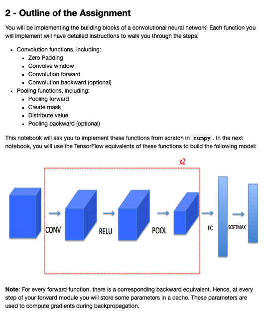</kbd></p>
    > [!NOTE]
    > Ổng nói dù những Framework như TS, PT bây giờ
    > giúp việc define ConvNet dể dàng nhưng việc hiểu nó
    > vẫn là quan trọng vì nó là một trong những khái niệm
    > khó của Deep Learning

    <br>

<a id="node-1233"></a>
- 3 `-` Convolutional Neural Networks
  <br>

  <a id="node-1234"></a>
  - 3.0 `-` Convolutional Neural Networks
    <br>

      <a id="node-1235"></a>
      <p align="center"><kbd>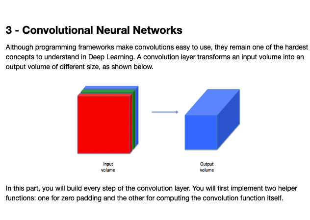</kbd></p>
      <br>

  <a id="node-1236"></a>
  - 3.1 `-` `Zero-Padding:`  Nhắc lại vai trò của padding trong việc giữ cho size không bị giảm và  giúp thông tin tại edge của image không bị ngó lơ `/` xem nhẹ
    <br>

      <a id="node-1237"></a>
      <p align="center"><kbd>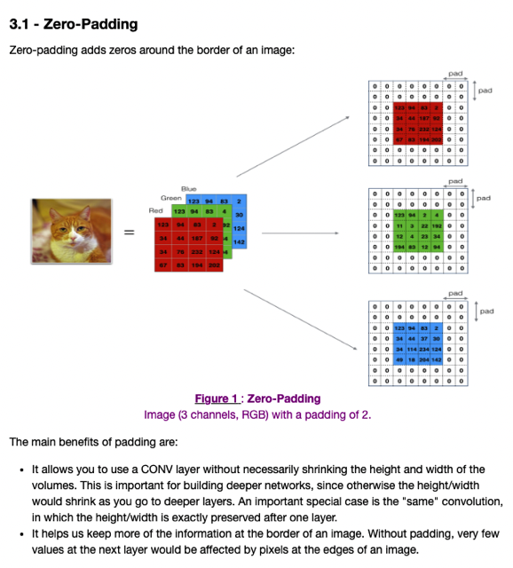</kbd></p>
      <br>

  <a id="node-1238"></a>
  - Function `zero_pad(X,` pad) `->` `X_pad:`  Code function `zero_pad` (X, pad) `->` `X_pad` dùng np.pad() Mỗi data sample là 1 image `->` dài x rộng x 3 (màu RGB)  `->` X `=` có m bộ `-` Do đó X có shape `=` m x `n_h` x `n_w` x `n_c:` `n_c` `=` 3 Trong python X.shape `=` (m, `n_h,` `n_w,` `n_c)`
    <br>

      <a id="node-1239"></a>
      <p align="center"><kbd>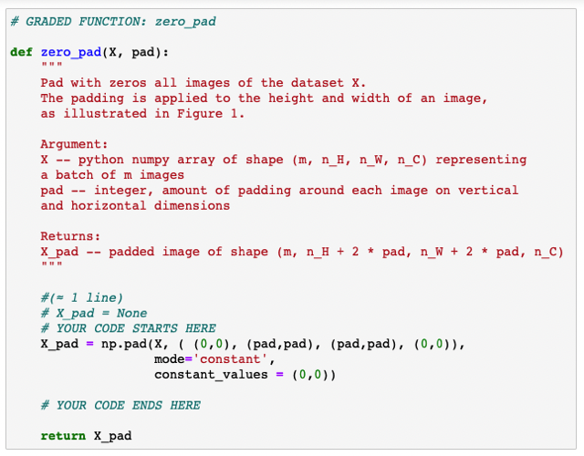</kbd></p>
      > [!NOTE]
      > Dùng function np.pad() của python bỏ
      > vào X và chỉ định các dimension nào
      > cần pad, pad bao nhiêu

      <br>

      <a id="node-1240"></a>
      <p align="center"><kbd>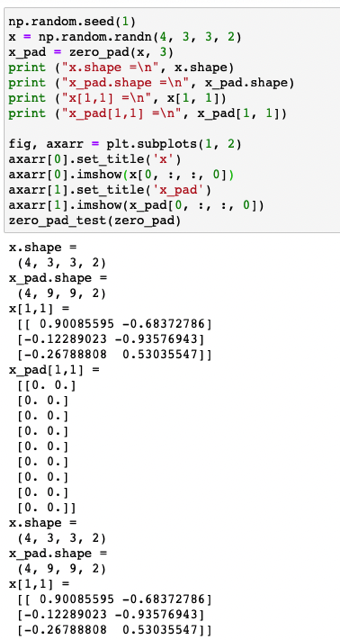</kbd></p>
      <br>

      <a id="node-1241"></a>
      <p align="center"><kbd>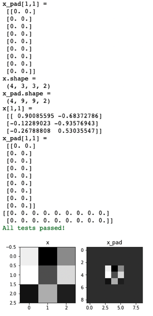</kbd></p>
      <br>

  <a id="node-1242"></a>
  - 3.2 `-` Single Step of Convolution  Đại khái là bỏ filter lên 1 vị trí của input và tính để cho ra 1 số. Thì phép tính này sẽ là phép tính `element-wise` multiplication giữa 2 matrix (đúng hơn là 2 volume) cùng size rồi sum lại.  Quá trình convol thì sẽ (slide window) đi và tính hết các chỗ khác thì đây là 1 bước trong đó.  Nên hiểu là có `n_C_prev` channel luôn, nên đây là phép tính trên 2 volume có size là f, f, `n_C_prev`  f là bề dài, rộng, `n_C_prev` là số channel (bề sâu `/` dầy) của filter
    <br>

      <a id="node-1243"></a>
      <p align="center"><kbd>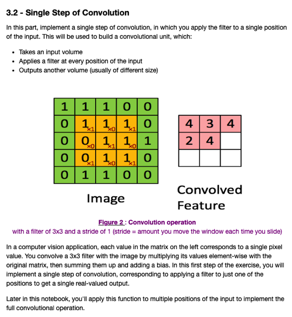</kbd></p>
      > [!NOTE]
      > Đại khái là bỏ filter lên 1 vị trí của input và tính để cho ra 1 số.
      > Thì phép tính này sẽ là phép tính `element-wise` multiplication
      > giữa 2 matrix (đúng hơn là 2 volume) cùng size rồi sum lại.
      >
      > Quá trình convol thì sẽ (slide window) đi và tính hết các chỗ khác
      > thì đây là 1 bước trong đó.
      >
      > Nên hiểu là có `n_C_prev` channel luôn, nên đây là phép tính
      > trên 2 volume có size là f, f, `n_C_prev`
      >
      > f là bề dài, rộng, `n_C_prev` là số channel (bề sâu `/` dầy) của filter

      <br>

      <a id="node-1244"></a>
      <p align="center"><kbd>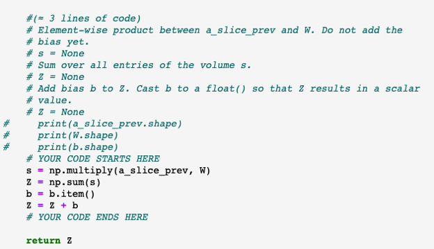</kbd></p>
      <p align="center"><kbd></kbd></p>
      <p align="center"><kbd>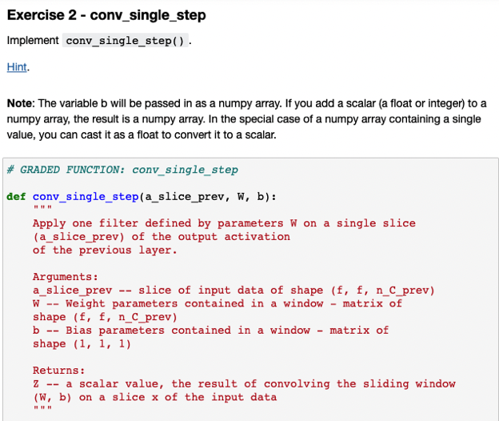</kbd></p>
      <br>

  <a id="node-1245"></a>
  - Exercise 2 `-` `conv_single_step(a_slice_prev,` W, b)  Đại khái là thực hiện 1 bước tính của phép convol.  Dùng np.multiply để `element-wised` multiply  Chỉ có chú ý chỗ khi sum() nó trả về float luôn, nhưng cộng với b (matrix (1,1,1) đang là matrix thì nó thành matrix lại `=>` Cast b thành float trước bằng .item()
    <br>

      <a id="node-1246"></a>
      <p align="center"><kbd>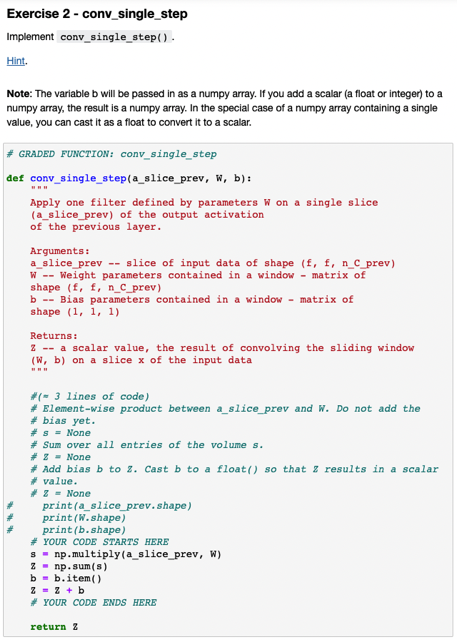</kbd></p>
      <br>

      <a id="node-1247"></a>
      <p align="center"><kbd>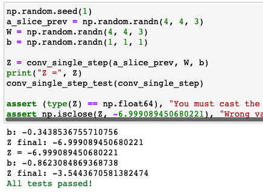</kbd></p>
      <br>

  <a id="node-1248"></a>
  - 3.3 `-` Convolutional Neural Networks `-` Forward Pass  Đại khái làm làm quá trình convol một input volume với nhiều filter để Ra một output volume
    <br>

      <a id="node-1249"></a>
      <p align="center"><kbd>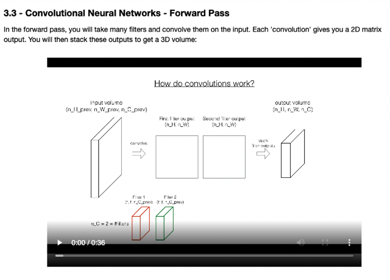</kbd></p>
      <br>

  <a id="node-1250"></a>
  - Exercise 3 `-` `conv_forward:` (...)  Nói chung là đây là function sẽ thực hiện việc convol một input volume, với `n_c` filter để cho ra output volume  Quá trình làm ở lần đầu chưa hiểu lắm nhưng ở lần review thứ 1 thì thấy rõ ràng. Cũng nhờ hình vẽ minh hoạ phân tích kĩ ở lần học. Những chỗ khó là những chỗ sai lần đầu làm :  `-` Loop trong số lần convol: Chính là nH và nW mà lúc đầu thấy bối rối vì  chưa để ý rằng với công thức nH `=` `..nH_prev` thì ta đã biết được size của output thì từ đó chính là số bước convol cần tính.  `-` Lấy 1 'window' để convol, với các thông số `vertical_start` `/` end `-` `horizontal_start` `/` end thì cũng không có gì khó hiểu khi nhìn lại `v_start` chính là bằng h trong range nH * stride. Và end thì dễ rồi bằng start `+` filter size f thôi.
    > [!NOTE]
    > Sai hai chỗ:

    <br>

      <a id="node-1251"></a>
      <p align="center"><kbd>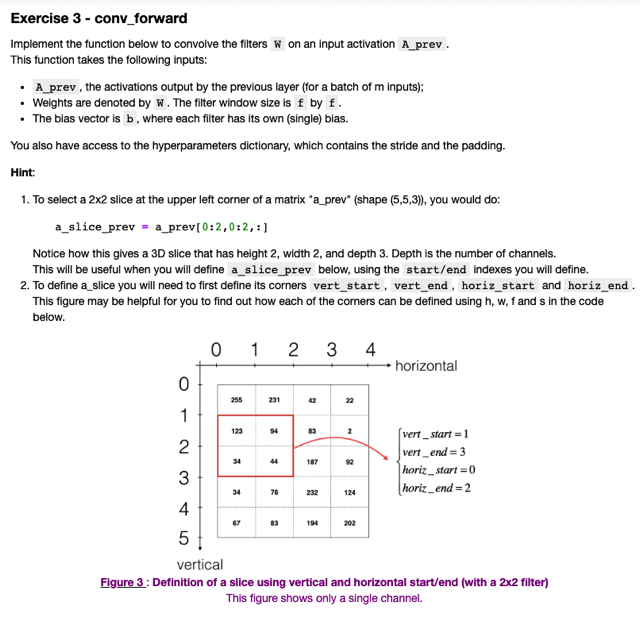</kbd></p>
      <br>

      <a id="node-1252"></a>
      <p align="center"><kbd>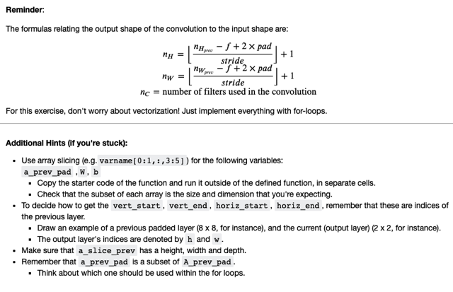</kbd></p>
      <br>

      <a id="node-1253"></a>
      <p align="center"><kbd>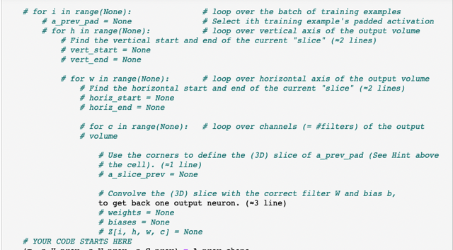</kbd></p>
      <p align="center"><kbd>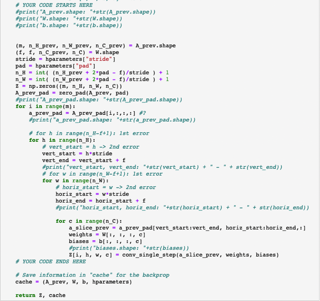</kbd></p>
      <p align="center"><kbd></kbd></p>
      <p align="center"><kbd></kbd></p>
      <p align="center"><kbd>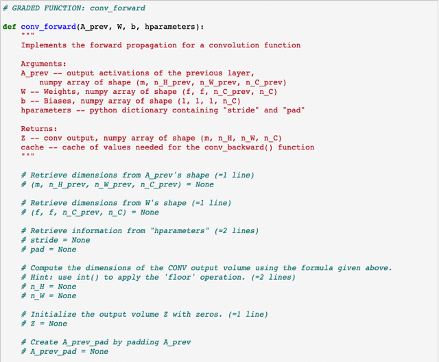</kbd></p>
      <br>

      <a id="node-1254"></a>
      <p align="center"><kbd>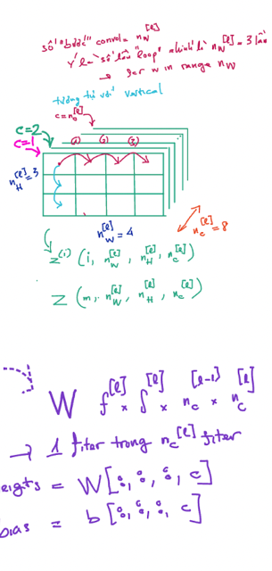</kbd></p>
      <p align="center"><kbd>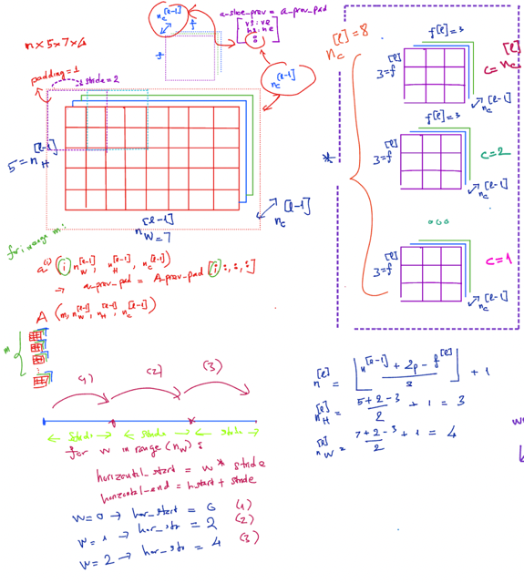</kbd></p>
      <p align="center"><kbd>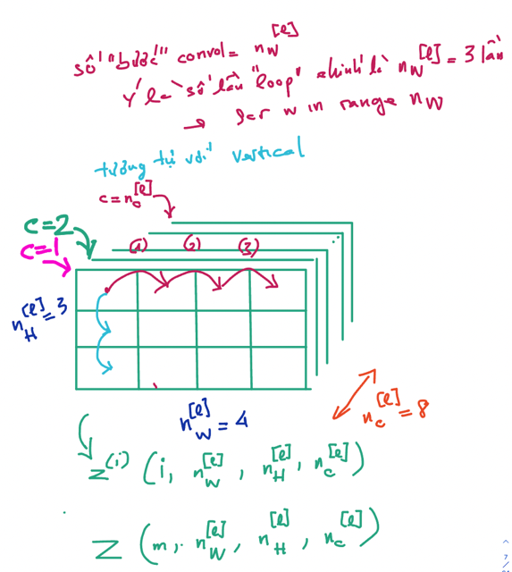</kbd></p>
      <p align="center"><kbd>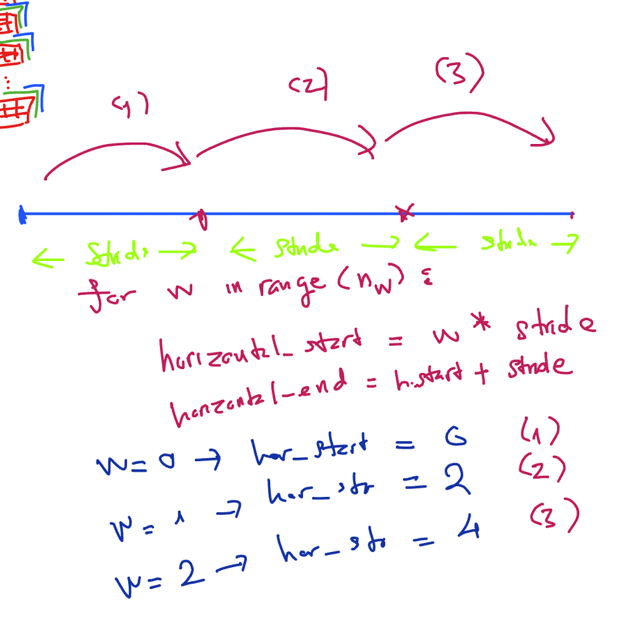</kbd></p>
      <p align="center"><kbd>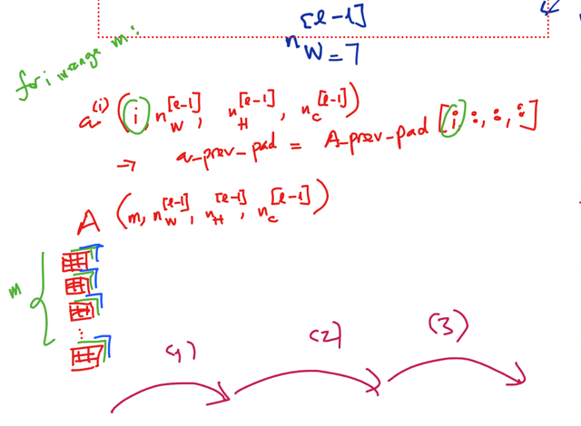</kbd></p>
      <p align="center"><kbd>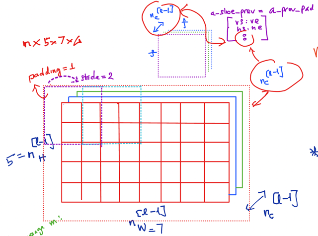</kbd></p>
      <p align="center"><kbd></kbd></p>
      <p align="center"><kbd></kbd></p>
      <p align="center"><kbd></kbd></p>
      <p align="center"><kbd></kbd></p>
      <p align="center"><kbd></kbd></p>
      <p align="center"><kbd></kbd></p>
      <p align="center"><kbd>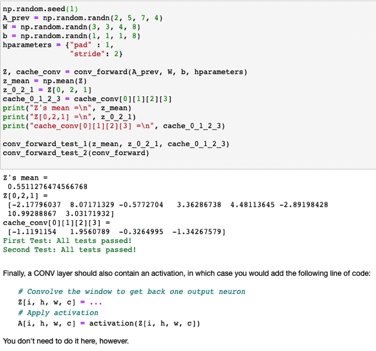</kbd></p>
      <br>

<a id="node-1255"></a>
- 4 `-` Pooling Layer
  <br>

  <a id="node-1256"></a>
  - 4.1 `-` Forward Pooling  Làm `conv_forward` rồi thì cái này dễ hiểu thoi, chỉ thay bằng bước convol bằng phép tính max, mean
    > [!NOTE]
    > Sai 1 chỗ

    <br>

      <a id="node-1257"></a>
      <p align="center"><kbd>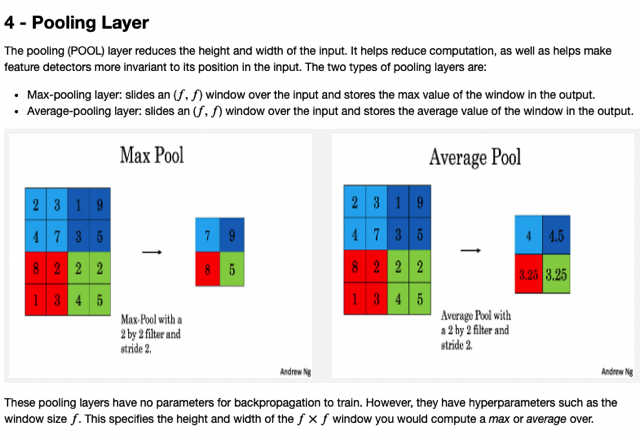</kbd></p>
      <br>

      <a id="node-1258"></a>
      <p align="center"><kbd>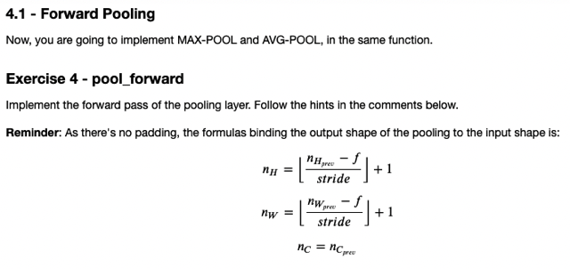</kbd></p>
      <br>

      <a id="node-1259"></a>
      <p align="center"><kbd>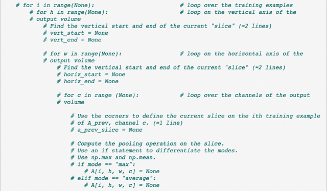</kbd></p>
      <p align="center"><kbd>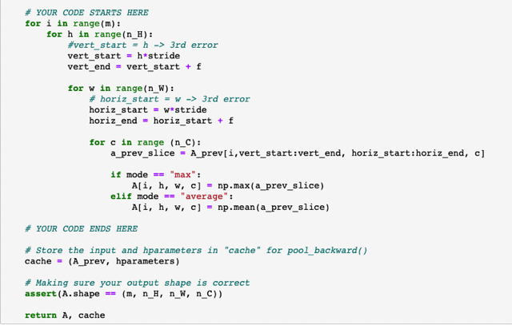</kbd></p>
      <p align="center"><kbd></kbd></p>
      <p align="center"><kbd></kbd></p>
      <p align="center"><kbd>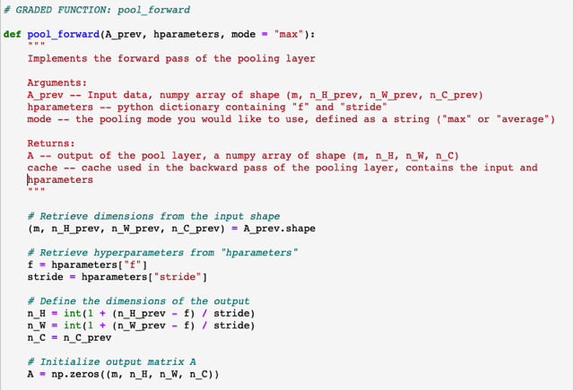</kbd></p>
      <br>

      <a id="node-1260"></a>
      <p align="center"><kbd>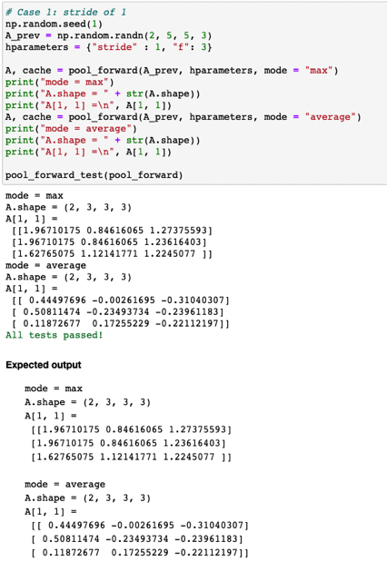</kbd></p>
      <br>

<a id="node-1261"></a>
- What you should remember:
  <br>

    <a id="node-1262"></a>
    <p align="center"><kbd>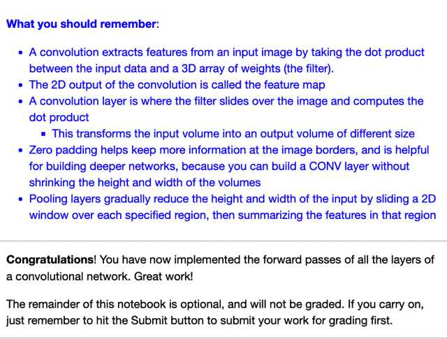</kbd></p>
    <br>

<a id="node-1263"></a>
- 5 `-` Backpropagation in Convolutional Neural Networks
  > [!NOTE]
  > Quay lại sau

  <br>

  <a id="node-1264"></a>
  - 5.1 `-` Convolutional Layer Backward Pass
    <br>

  <a id="node-1265"></a>
  - 5.2 Pooling Layer `-` Backward Pass
    <br>


<a id="node-1266"></a>
## Programming Assignments: Convolutional Model Application

<br>


<a id="node-1267"></a>
### Welcome to the second (required) programming exercise

> [!NOTE]
> Welcome to the second (required) programming exercise
> of Course 4 of the Deep Learning Specialization.
>
> In this notebook you will build ConvNets to create a
> \**mood classifier\** and \**identify sign language digits\**,
> while gaining familiarity with the \**TF Keras Sequential\**
> and \**Functional APIs\** along the way.

<br>

<a id="node-1268"></a>
- 1 `-` Packages
  <br>

    <a id="node-1269"></a>
    <p align="center"><kbd>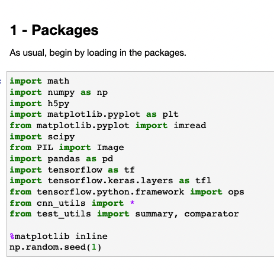</kbd></p>
    <br>

<a id="node-1270"></a>
- 1.1 `-` Load the Data and Split the Data into `Train/Test` Sets
  <br>

    <a id="node-1271"></a>
    <p align="center"><kbd>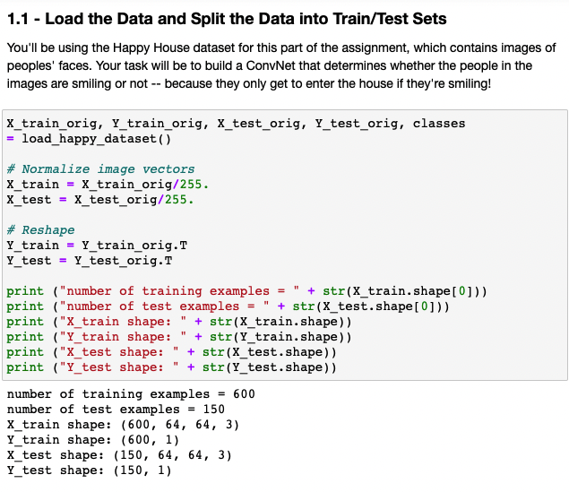</kbd></p>
    <br>

    <a id="node-1272"></a>
    <p align="center"><kbd>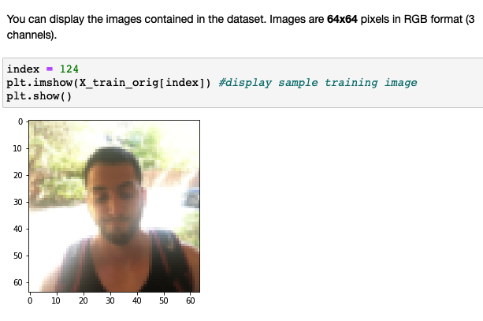</kbd></p>
    <br>

<a id="node-1273"></a>
- 2 `-` Layers in TF Keras
  <br>

    <a id="node-1274"></a>
    <p align="center"><kbd>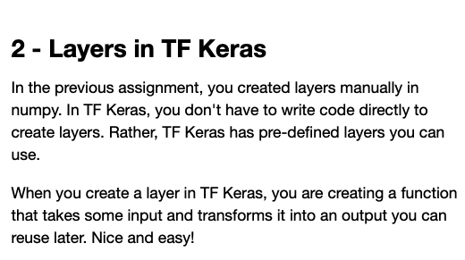</kbd></p>
    <br>

<a id="node-1275"></a>
- 3 `-` The Sequential API: Đại khái là thay vì tự làm như bài trước, nay ta dùng Framework TS Keras's Sequential
  <br>

    <a id="node-1276"></a>
    <p align="center"><kbd>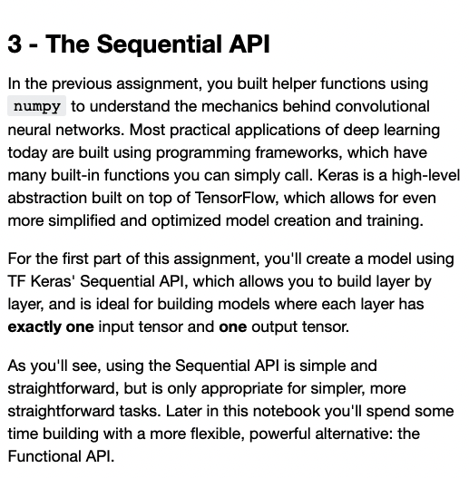</kbd></p>
    > [!NOTE]
    > Ở đây ổng có nói Sequential chỉ phù hợp cho
    > simple và straightforward task còn muốn
    > flexible hơn thì dùng Functional

    <br>

<a id="node-1277"></a>
- 3.1 `-` Create the Sequential Model: Đại khái nó như một list các layer và khi work thì nó sẽ lần lượt 'chạy' từng layer
  <br>

    <a id="node-1278"></a>
    <p align="center"><kbd>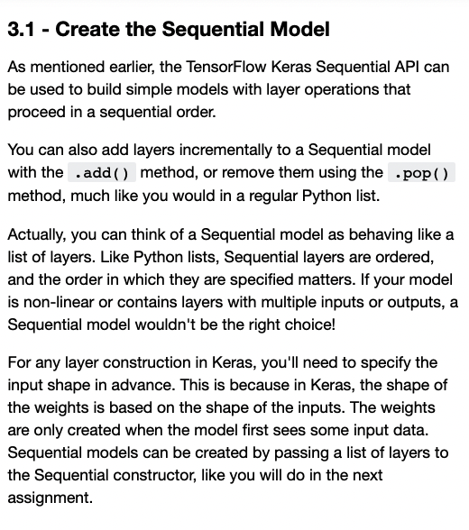</kbd></p>
    > [!NOTE]
    > Đại ý là Sequential phù hợp cho những
    > structure đơn giản  chạy 1 lèo, và 1 input 1
    > output còn nếu muốn flexible hơn kiểu như
    > skip connection, ...hoặc ra nhiều output thì
    > dùng Functional
    >
    > Cái nữa là nó cần biết shape của input trước
    > để kiểu như chuẩn bị nếu không nó phải đợi
    > đến khi bỏ input vào

    <br>

<a id="node-1279"></a>
- Exercise 1 `-` happyModel: Lần lượt define các layer như gợi ý bỏ để define nên Sequential model
  <br>

    <a id="node-1280"></a>
    <p align="center"><kbd>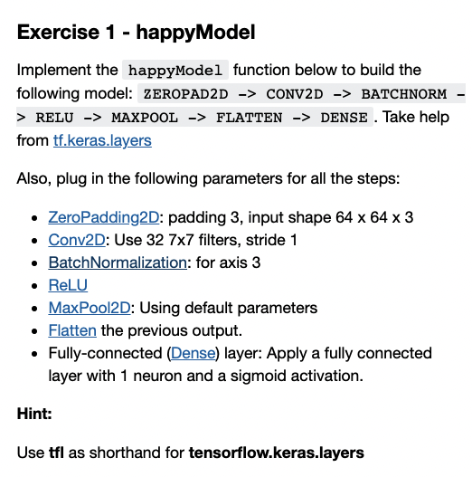</kbd></p>
    > [!NOTE]
    > Ở lần review 1 đã hiểu thêm 1 số thứ:
    >
    > Dense nó có `kernel_ini..là` **glorot_uniform** là 1 kiểu ini
    > randomly do ông **Glorot** phát minh nhằm mục đích giảm hiện
    > tượng **Vanishing Gradient**. Công thức cụ thể thì xem trong
    > sách nhưng đại khái là random. Có lẽ không cần define vì Keras
    > dùng cái này làm default, có những cái khác là **he_uniform**,..
    >
    > BatchNorm nó có hyper param `-` axis thường dùng axis cuối nên
    > ở đây hiểu được tại sao để 3 vì input có 4D `-` m, nH, nW, nC
    > index 0,1,2,3

    <br>

    <a id="node-1281"></a>
    <p align="center"><kbd>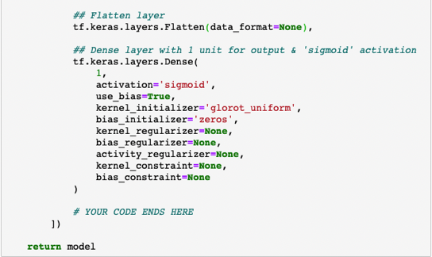</kbd></p>
    <p align="center"><kbd></kbd></p>
    <p align="center"><kbd>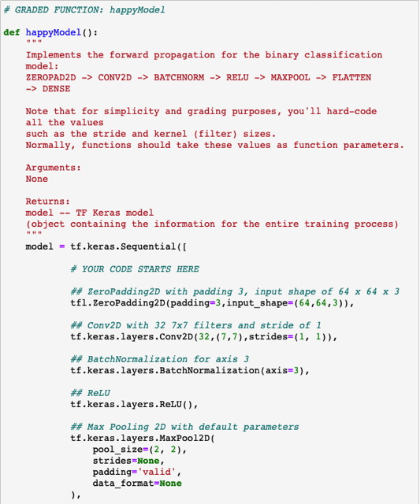</kbd></p>
    <br>

    <a id="node-1282"></a>
    <p align="center"><kbd>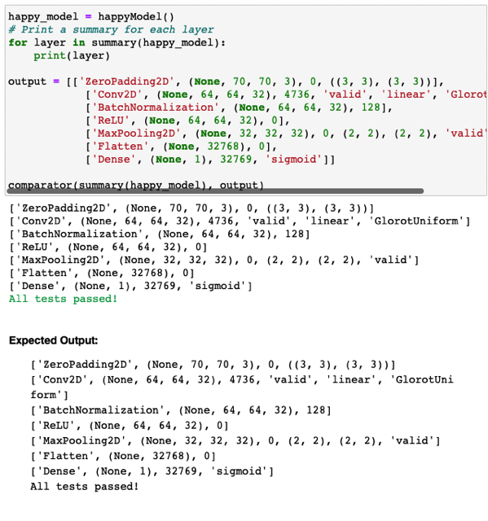</kbd></p>
    <br>

    <a id="node-1283"></a>
    <p align="center"><kbd>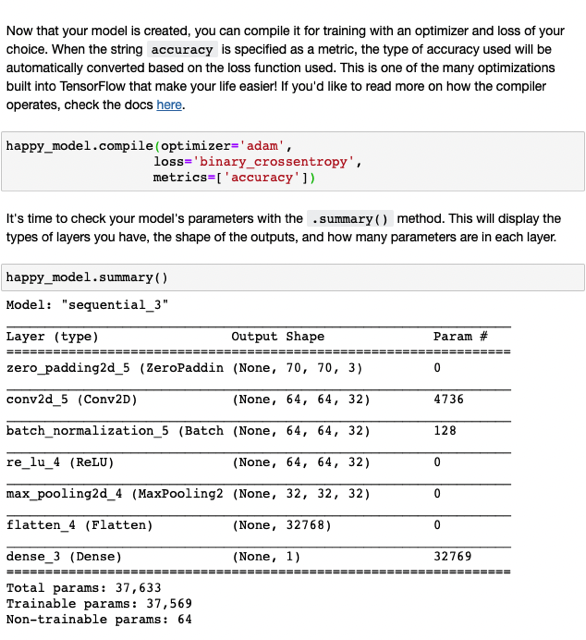</kbd></p>
    > [!NOTE]
    > Define model xong có thể compile với **Adam**
    > optimizer, loss function là **binary_crossentropy**vì
    > đây là bài toán binary classification (output từ
    > sigmoid ra probability trong [0,1]**)**và metrics là **accuracy**

    <br>

<a id="node-1284"></a>
- 3.2 `-` Train and  Dùng `fit(X_train,` `Y_train)` argument epochs, `batch_size`  Evaluate the Model chỉ cần gọi evaluate(bỏ vào test set) quá tiện
  <br>

    <a id="node-1285"></a>
    <p align="center"><kbd>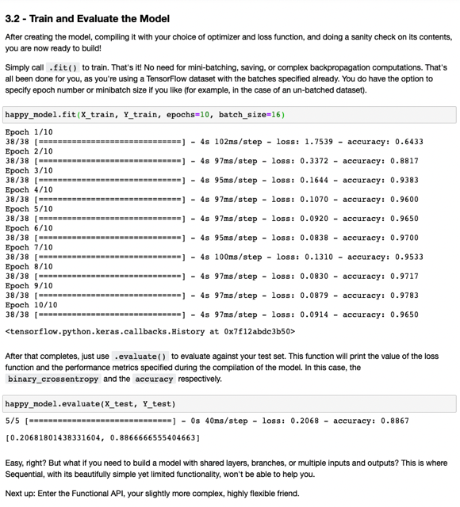</kbd></p>
    <br>

<a id="node-1286"></a>
- 4 `-` The Functional API: Nói sơ về Functional API cho thấy nó flexible, mạnh mẽ hơn Sequential API ví dụ có thể define 'Skip Connection'  hứa hẹn sắp tới sẽ tìm hiểu nhiều hơn
  <br>

    <a id="node-1287"></a>
    <p align="center"><kbd>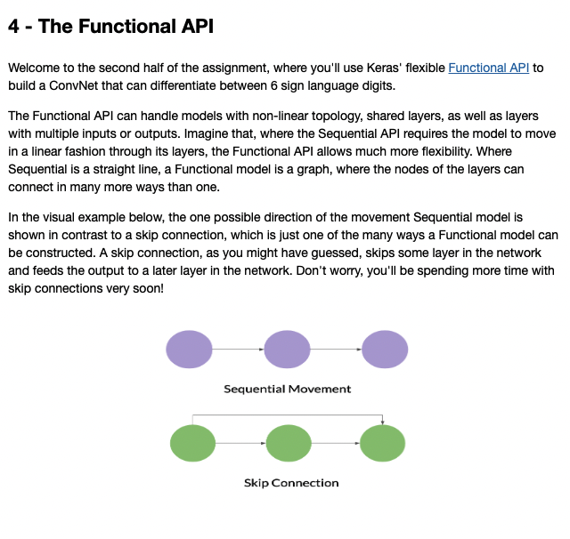</kbd></p>
    <br>

<a id="node-1288"></a>
- 4.1 `-` Load the SIGNS Dataset: Dataset cho vấn đề nhận diện kí tự hình ảnh cho người câm điếc đã dùng ở Course 2
  <br>

    <a id="node-1289"></a>
    <p align="center"><kbd>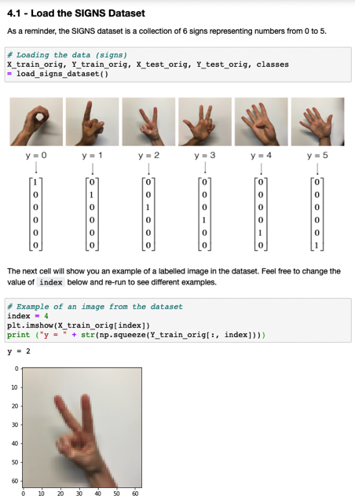</kbd></p>
    <br>

<a id="node-1290"></a>
- 4.2 `-` Split the Data into `Train/Test` Sets Thực hiện việc \\*normalization\\* và dùng custom function `\\*convert_to_one_hot\\*()` để transform `Y_train,` `Y_test`
  <br>

    <a id="node-1291"></a>
    <p align="center"><kbd>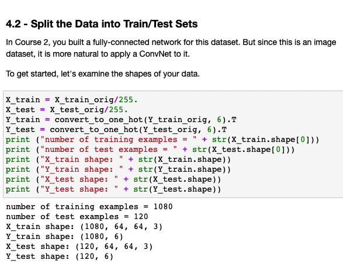</kbd></p>
    <br>

<a id="node-1292"></a>
- 4.3 `-` Forward Propagation  Đại khái là từng bước từng bước define các layer trong ' computational graphs'  Bắt đầu bởi ts.keras.Input() rồi lần lượt Conv2D `-` ReLU `-MaxPool2D` `-` Conv2D `-` ReLU `-` MaxPool2D `-` Flatten `-` FC `-` Output:  Cách thức là: Bỏ output của thằng trước thành input của thằng sau `-`  Đây chính là lý do của cái tên Functional, các layer work như function với việc nhận input và cho ra oupput  Ngoài ra thì một số điểm đáng chú ý Define a input node as a callable object. Flatten `batch_size,` h, w, c `->` `batch_size,` h*w*c Define output using the last of the function's composition `-` Dense
  <br>

    <a id="node-1293"></a>
    <p align="center"><kbd>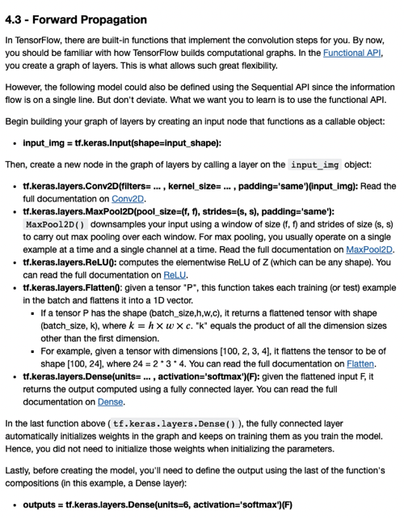</kbd></p>
    > [!NOTE]
    > Define output using the last of the
    > function's composition `-` Dense

    <br>

    <a id="node-1294"></a>
    <p align="center"><kbd>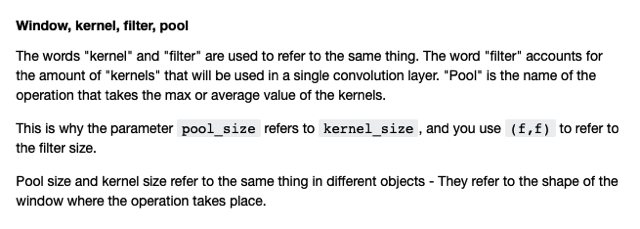</kbd></p>
    <br>

<a id="node-1295"></a>
- Exercise 2 `-` `convolutional_model:` Chỉ chú ý là Conv2D's argument  filters chỉ số lượng filters, kernel mới là filters's size  Z1 `=` `tf.keras.layers.Conv2D(filters=8,` `kernel_size=(4,4),` `strides=(1,` 1), `padding='same'` `)(input_img)`  A1 `=` tf.keras.layers.ReLU()(Z1)  P1 `=` `tf.keras.layers.MaxPool2D(pool_size=(8,` 8), `strides=(8,` 8), `padding='same')(A1)`  Z2 `=` `tf.keras.layers.Conv2D(filters=16,` `kernel_size=(2,2)` , `strides=(1,` 1), `padding='same')(P1)`  A2 `=` tf.keras.layers.ReLU()(Z2)  P2 `=` `tf.keras.layers.MaxPool2D(pool_size=(4,` 4), `strides=(4,` 4), `padding='same')(A2)`  F `=` tf.keras.layers.Flatten()(P2)  outputs `=` `tf.keras.layers.Dense(units=` 6 , `activation='softmax')(F)`  model `=` `tf.keras.Model(inputs=input_img,` `outputs=outputs)`   Xong cũng compile, Sequential và Functional chỉ là phương pháp để tạo kiến trúc model khác nhau chứ vẫn đều là tạo TF Keras model object
  <br>

    <a id="node-1296"></a>
    <p align="center"><kbd>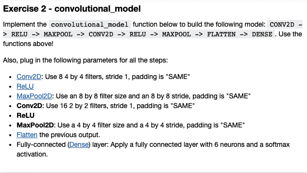</kbd></p>
    <br>

    <a id="node-1297"></a>
    <p align="center"><kbd>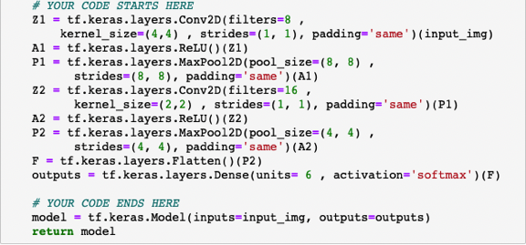</kbd></p>
    <p align="center"><kbd></kbd></p>
    <p align="center"><kbd>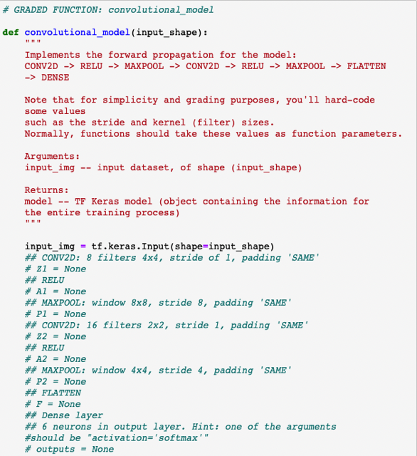</kbd></p>
    <br>

    <a id="node-1298"></a>
    <p align="center"><kbd>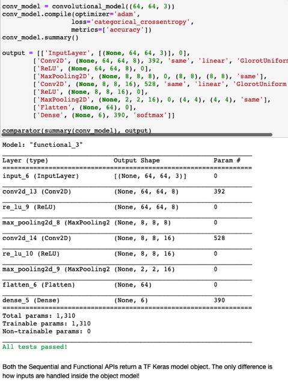</kbd></p>
    > [!NOTE]
    > Xong cùng compile, Sequential và
    > Functional chỉ là phương pháp để tạo kiến trúc model khác
    > nhau chứ vẫn đều là tạo TF Keras model object

    <br>

<a id="node-1299"></a>
- 4.4 `-` Train the Model:  Tạo train `/` test dataset modal cho `Conv_model` với `tf.Dataset.\\*from_tensor_slices\\*()` Gọi fucntion \\*fit()\\* trên `conv_model` created ở trên, bỏ vào `train_dataset` và `test_set,` no. epochs
  <br>

    <a id="node-1300"></a>
    <p align="center"><kbd>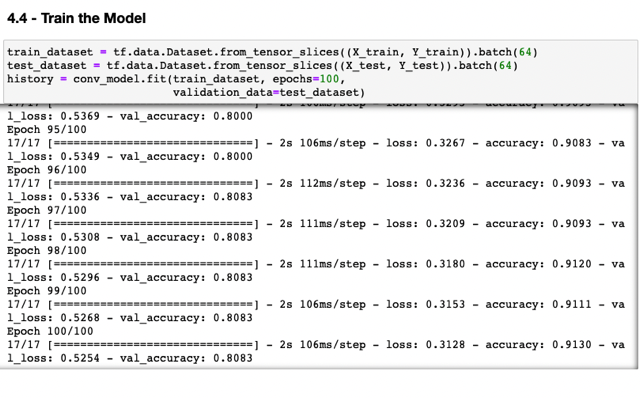</kbd></p>
    <br>

    <a id="node-1301"></a>
    <p align="center"><kbd>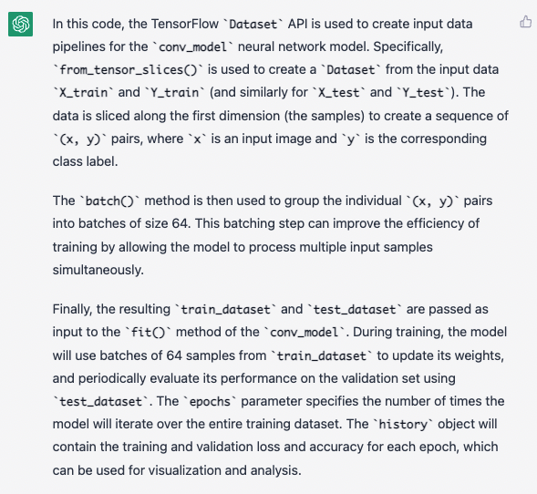</kbd></p>
    <br>

<a id="node-1302"></a>
- 5 `-` History Object: Dùng kết quả (history) của training process để visualize  Có thể thấy bỏ history của Keras model. history bỏ vào DataFrame của Pandas xong là vẽ ra training history dễ dàng. TF và Keras quả thật rất tiện
  <br>

    <a id="node-1303"></a>
    <p align="center"><kbd>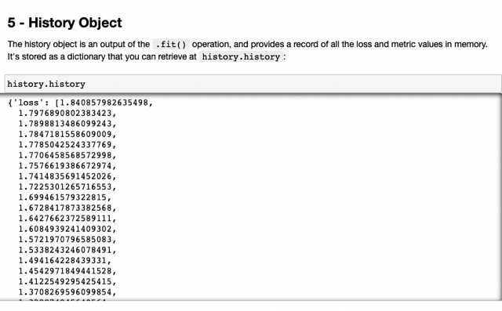</kbd></p>
    <br>

    <a id="node-1304"></a>
    <p align="center"><kbd>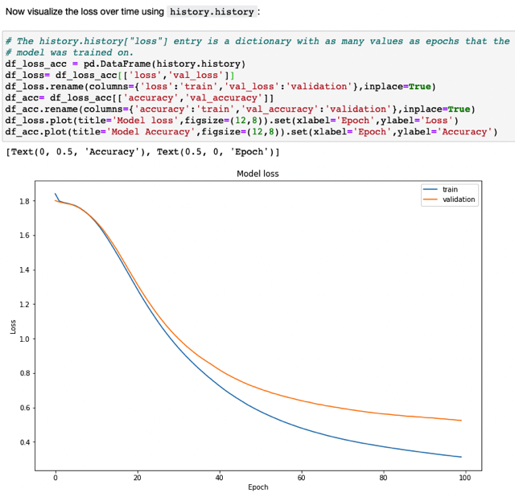</kbd></p>
    > [!NOTE]
    > Có thể thấy bỏ history của Keras model.
    > history bỏ vào DataFrame của Pandas xong là
    > vẽ ra training history dễ dàng. TF và Keras quả thật rất tiện

    <br>

    <a id="node-1305"></a>
    <p align="center"><kbd>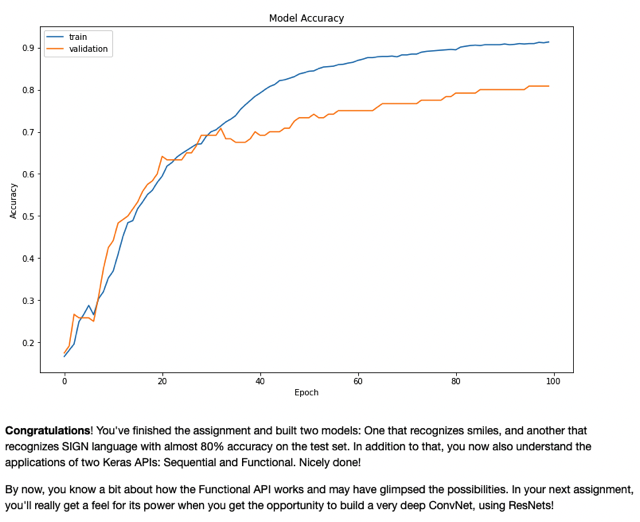</kbd></p>
    <br>

<a id="node-1306"></a>
- 6 `-` Bibliography: Nên đọc thêm
  > [!NOTE]
  > ```text
  > https://www.tensorflow.org/guide/keras/sequential_model
  > ```
  >
  > ```text
  > https://www.tensorflow.org/guide/keras/functional
  > ```

  <br>

    <a id="node-1307"></a>
    <p align="center"><kbd></kbd></p>
    <br>

