# W3_object Detection

📊 **Progress:** `44` Notes | `156` Screenshots

---

1ST REVIEWED: LECTURE, CHƯA PA

Apply your new knowledge of CNNs to one of the hottest (and most challenging!) fields in computer vision: object detection.
**Learning Objectives**
 • Identify the components used for object detection (landmark, anchor, bounding box, grid, ...) and their purpose
 • Implement object detection
 • Implement non-max suppression to increase accuracy
 • Implement intersection over union
 • Handle bounding boxes, a type of image annotation popular in deep learning
 • Apply sparse categorical crossentropy for pixelwise prediction
 • Implement semantic image segmentation on the CARLA self-driving car dataset
 • Explain the difference between a regular CNN and a U-net
 • Build a U-Net

## Object Localization

 

### Đại khái là bài toán bây giờ là không những chỉ phân loại -vd. có phải

> [!NOTE]
> Đại khái là bài toán bây giờ là không những chỉ phân loại -vd. có phải
> xe hơi hay không (\**classification)\** mà còn vẽ cái box xung quanh cái
> xe (\**classification with localization)\**. Và mở rộng hơn là detect nhiều
> object khác loại trên cùng 1 image (\**Object detection\**)
>
> Đại khái là muốn localize thì ta \**sửa cái output layer\**, v.d đang là 
> Softmax ra 4 unit tương ứng 4 loại khả dĩ của cái hình, để
> \**thêm vào 4 chỉ số nữa là bx, by, bw, bh\** = Vị trí của cái object.
>
> Bằng cách \**có thêm 4 thông số này trong training set,\** đại khái
> là ta có thể khiến cho network có thể học được cách xác định
> được 4 chỉ số này trong các mẫu mới -> Localize được cái xe.
>
> Đại khái là label (y) ngoài 4 unit (để chỉ ra 4 loại xe, người,
> moto, nền, hoặc 4 thông số probability tương ứng) thì bây
> giờ sẽ có thêm  Pc - 1 là object, 0 là nền (bx, by, bh, bw) -
> vị trí cái object nếu có hoặc bỏ trống (?) nếu không, và C1
> C1 C3 - class label hoặc Probability class
>
> Cuối cùng là define Loss function có thể dùng \**square của
> từng cặp tương ưng giữa y^ và y \**hoặc kĩ hơn thì dùng
> từng hàm khác nhau  đ/v các chỉ số khác nhau như
>
> - Binary Cross Entropy đ.v pC,
> - Squared Error đ.v bx, by, bh, bw
> - Log (Categorical Cross Entropy) đ.v C1, C2, C3

 

  
  
<kbd>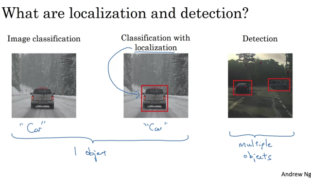</kbd>

  > [!NOTE]
  > Đại khái là bài toán bây giờ là không những chỉ phân loại -vd. có phải
  > xe hơi hay không (**classification)** mà còn vẽ cái box xung quanh cái
  > xe (**classification with localization)**. Và mở rộng hơn là detect nhiều
  > object khác loại trên cùng 1 image (**Object detection**)

   

  
  
<kbd>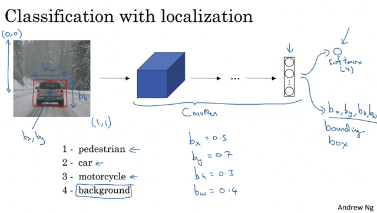</kbd>

  > [!NOTE]
  > Đại khái là muốn localize thì ta **sửa cái output layer**, v.d đang là 
  > Softmax ra 4 unit tương ứng 4 loại khả dĩ của cái hình, để
  > **thêm vào 4 chỉ số nữa là bx, by, bw, bh** = Vị trí của cái object.
  >
  > Bằng cách **có thêm 4 thông số này trong training set,** đại khái
  > là ta có thể khiến cho network có thể học được cách xác định
  > được 4 chỉ số này trong các mẫu mới -> Localize được cái xe.

   

  
  
<kbd>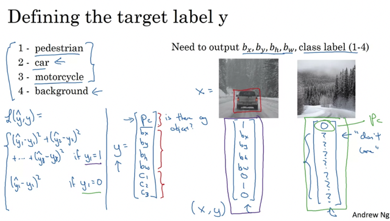</kbd>

  > [!NOTE]
  > Cuối cùng là define Loss function có thể dùng **square của
  > từng cặp tương ưng giữa y^ và y**hoặc kĩ hơn thì dùng
  > từng hàm khác nhau đ/v các chỉ số khác nhau như
  >
  > - Binary Cross Entropy đ.v pC,
  > - Squared Error đ.v bx, by, bh, bw
  > - Log (Categorical Cross Entropy) đ.v C1, C2, C3

  > [!NOTE]
  > Đại khái là label (y) ngoài 4 unit (để chỉ ra 4 loại xe, người,
  > moto, nền, hoặc 4 thông số probability tương ứng) thì bây
  > giờ sẽ có thêm  Pc - 1 là object, 0 là nền (bx, by, bh, bw) -
  > vị trí cái object nếu có hoặc bỏ trống (?) nếu không, và C1
  > C1 C3 - class label hoặc Probability class

   

## Landmark Detection

 

### Đại khái là ta có thể dạy cho máy tính cách xác định các key point

> [!NOTE]
> Đại khái là ta có thể dạy cho máy tính cách xác định các key point
> trên khuôn mặt bằng cách tạo unit của output layer cho 'toạ độ' của
> các  điểm đó l1x, l1y, l2x, l2y....
>
> Dĩ nhiên label (Y train) cũng phải có những landmark này và công
> việc xác định các điểm này tốn nhiều công sức (\**laborious\**)
>
> Ứng dụng của cái này lấy ví dụ như chuyển khuôn mặt cười thành
> khóc, những hiệu ứng của Snapchat như đội nón đều dựa trên
> việc xác định được các landmark của khuôn mặt. \**Recognize emotion\**
>
> Một ví dụ khác là xác định bộ khung - tư thế người.

 

  
  
<kbd>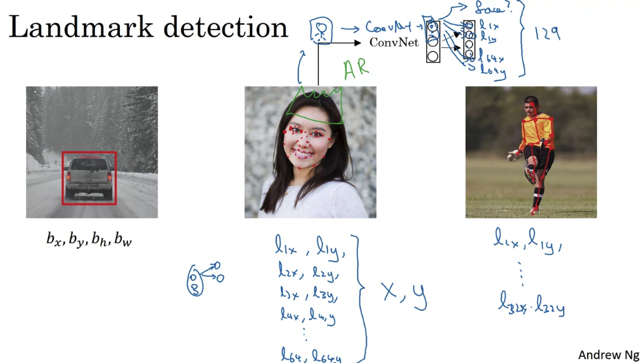</kbd>

  > [!NOTE]
  > Đại khái là ta có thể dạy cho máy tính cách xác định các key point
  > trên khuôn mặt bằng cách tạo unit của output layer cho 'toạ độ' của
  > các điểm đó **l1x, l1y, l2x, l2y....**
  >
  > Dĩ nhiên label (Y train) cũng phải có những landmark này và công
  > việc xác định các điểm này tốn nhiều công sức (laborious)
  >
  > Ứng dụng của cái này lấy ví dụ như chuyển khuôn mặt cười thành
  > khóc, những hiệu ứng của Snapchat như đội nón đều dựa trên
  > việc xác định được các landmark của khuôn mặt. **Recognize emotion**
  >
  > Một ví dụ khác là xác định bộ khung - tư thế người.

   

## Object Detection

 

### Đại khái là chạy (sliding) check từng ô đó xem có phải là xe hay không

> [!NOTE]
> Đại khái là chạy (sliding) check từng ô đó xem có phải là xe hay không
> (bằng cách bỏ vào bài toán classification).
>
> Nhưng nhược điểm là với Deep Learning thì cách làm kiểu Sliding
> Window này rất\**tốn computational resource\**.
>
> Cách này đã có từ lâu khi Machine Learning còn thô sơ và người ta dùng
> với very simple algorithm như Linear regression và nó cũng tạm được.
>
> Nhưng h n.n với ConvNet rất tốn kém nên cách này không dùng được

 

  
  
<kbd>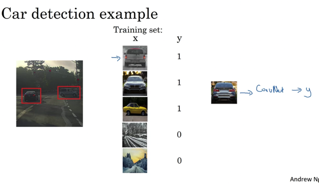</kbd>

  > [!NOTE]
  > Đại khái là đầu tiên người ta train 1
  > convNet để classify xe trước với các
  > training set là hình xe crop sát với cái xe

   

  
  
<kbd>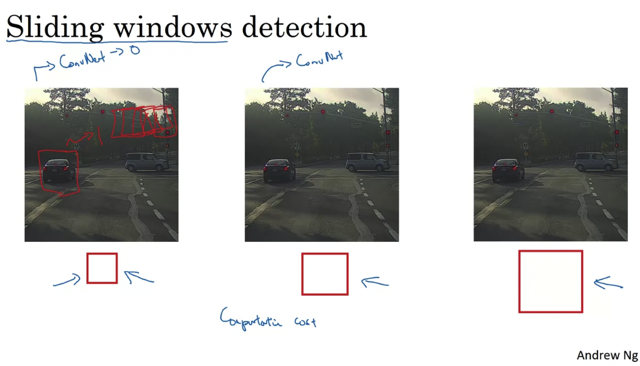</kbd>

  > [!NOTE]
  > Đại khái là \/**chạy (sliding) check từng ô**\/ đó xem có phải là xe hay không
  > (bằng cách **bỏ vào bài toán car classification**).
  >
  > Nhưng nhược điểm là với Deep Learning thì cách làm kiểu Sliding
  > Window này rất  **tốn computational resource.**
  >
  > Cách này đã có từ lâu khi Machine Learning **còn thô sơ** và người ta dùng
  > với very simple algorithm như Linear regression và nó cũng tạm được.
  >
  > Nhưng h n.n với ConvNet rất tốn kém nên cách này không dùng được

   

## Convolutional Implementation

> [!NOTE]
> CONVOLUTIONAL IMPLEMENTATION
> OF SLIDING WINDOWS

 

### Đại khái là có thể thay cái 400 unit FC layer bằng Conv layer

> [!NOTE]
> Đại khái là có thể thay cái 400 unit FC layer bằng Conv layer
> 1x1x400 bằng cách dùng 400 filter 5x5x16. Về mặt toán học tính
> toán thì như nhau.
>
> Tương tự với layer softmax
>
> Vi diệu
>
> Đại khái là thay vì dùng \**sliding window \**để cắt ra từng ô rồi bỏ
> vào convNet để forward ra 1 kết quả xem có phải cái xe hay
> không, làm vậy phải slide và forward 4 lần
>
> Thay vì vậy, \**cứ bỏ cái hình bự vào luôn\** dùng cái \**convNet\**
> nó sẽ tính ra kết quả cuối cùng chính là \**chứa đựng kết quả của
> 4 lần riêng lẻ.\**

 

  
  
<kbd>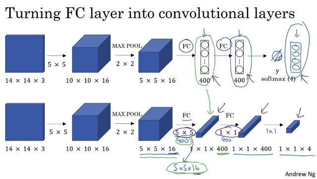</kbd>

  > [!NOTE]
  > Đại khái là có thể thay cái 400 unit FC layer bằng
  > Conv layer 1x1x400 bằng cách dùng 400 filter
  > 5x5x16. Về mặt toán học tính toán thì như nhau.
  >
  > Tương tự với layer softmax

   

  
  
<kbd>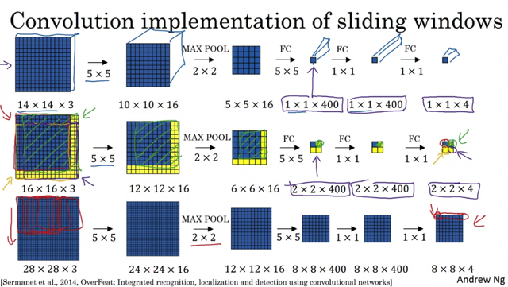</kbd>

  > [!NOTE]
  > Vi diệu
  >
  > Đại khái là thay vì dùng **sliding window**để cắt ra từng ô rồi bỏ vào
  > convNet để forward ra 1 kết quả xem có phải cái xe hay không, làm vậy
  > phải slide và forward 4 lần
  >
  > Thay vì vậy, **cứ bỏ cái hình bự vào luôn** dùng cái **convNet** nó sẽ tính ra
  > kết quả cuối cùng chính là **chứa đựng kết quả của 4 lần riêng lẻ.**

   

  
  
<kbd>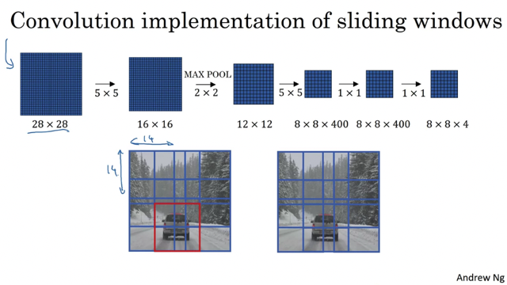</kbd>

   

## Bounding Box Predictions

 

### 1 Sliding windows have a \\*problem with accurate bounding box\\*

> [!NOTE]
> 1 Sliding windows have a \**problem with accurate bounding box\**
> predictions \**even with a convolutional implementation.\**
>
> 2 The \**YOLO\** (You Only Look Once) algorithm offers a way to \**output
> more accurate bounding boxes\** by \**applying image classification and
> localization algorithms\** to a grid system.
>
> 3 The grid system divides the input image into cells, and for each
> cell, a target label vector Y is defined, with the first output
> representing whether there is an image in that grid cell.
>
> 4 \**The target label vector Y includes PC, BX, BY, BH, BW\** to specify
> the bounding box and C1, C2, C3 to specify the object class.
>
> 5 The total volume of the target output is 3 by 3 by 8 because the
> image is divided into a 3 by 3 grid system, and for each grid cell,
> there is an eight-dimensional target vector Y.
>
> 6 To train the neural network, the input is the image, and the output
> is the target label vector Y.

> [!NOTE]
> Sure, here are some more detailed explanations of the main ideas presented in the video:
>  1 Sliding windows with convolutional implementation: In the previous video, the concept of sliding windows was introduced as a method for object detection. However, using sliding windows can be computationally expensive, especially for large images. So, the video explains how to use a convolutional implementation of sliding windows, which is more efficient. However, this method still has a problem of not outputting the most accurate bounding boxes.
>  2 YOLO algorithm for more accurate bounding boxes: The video then introduces the YOLO (You Only Look Once) algorithm as a way to output more accurate bounding boxes. YOLO works by placing a grid on the input image and **applying the image classification and localization algorithm to each grid cell**. The algorithm defines labels for each of the grid cells, where each label is an eight-dimensional vector that specifies the presence of an object in that cell, along with its bounding box coordinates and class probabilities.
>
>  3 Defining YOLO labels for training: To train the YOLO algorithm, the labels for each grid cell are defined by taking the midpoint of the objects and assigning each object to the grid cell containing the midpoint. The label vector for each grid cell is an eight-dimensional vector that specifies the presence of an object, along with its bounding box coordinates and class probabilities. If a grid cell does not contain an object, the label vector has a value of zero for the object presence component and don't cares for the other components.
>
>  4 YOLO output: The YOLO algorithm outputs a 3D tensor with dimensions (grid width, grid height, number of attributes per grid cell). In the case of the example used in the video, the grid has dimensions of 3x3, so the output tensor has dimensions of 3x3x8. Each element of the tensor corresponds to a specific grid cell and contains the label vector for that cell.
>
>  5 YOLO training: To train the YOLO algorithm, the input is the original image and the output is the YOLO output tensor. The neural network is trained using a loss function that penalizes errors in the predicted bounding boxes and class probabilities. The loss function takes into account both the localization and classification errors.
>
> Overall, the video explains how the YOLO algorithm can be used to output more accurate bounding boxes for object detection. It provides a detailed explanation of how the YOLO algorithm works and how to define the labels for training. It also covers how the YOLO algorithm outputs and how to train the neural network using the YOLO output.

 

  
  
<kbd>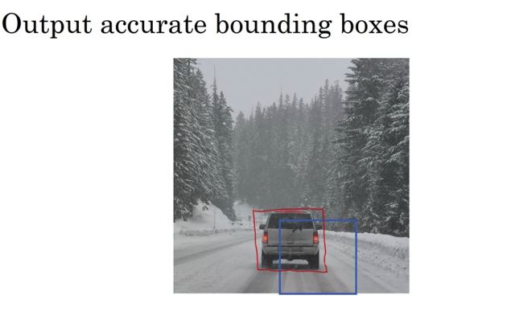</kbd>

  > [!NOTE]
  > Đại khái là làm sao để detect chính xác **bounding box -**một
  > problem của Sliding window dù cho có áp dụng **Convolutional
  > implementation vẫn chưa khắc phục được**. ****Kiểu như có thể B.B đúng phải hình chữ nhật nhưng window chỉ
  > có hình vuông nên ko thể chính xác được

   

  
  
<kbd>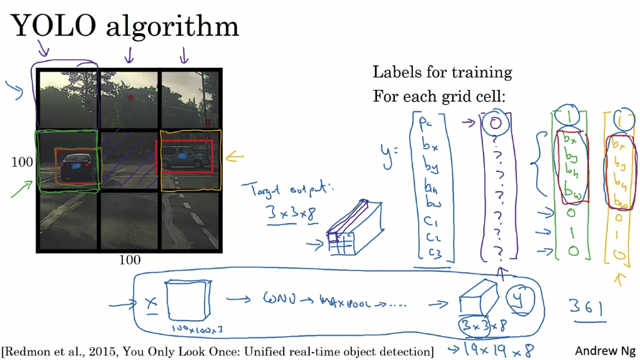</kbd>

  > [!NOTE]
  > "And the basic idea is you're going to take the image classification
  > and localization algorithm that you saw in the first video of this
  > week and apply that to each of the nine grid cells of this image."
  >
  > Đại khái là **áp dụng bài toán classification & localization cho mỗi
  > ô trong 9 ô lưới**
  >
  > (3x3 để minh hoạ, thực tế có thể dùng **more fine grid - lưới dày
  > hơn)**???: YOLO nó assign cái object cho cái ô (grid cell)****và ô giữa
  > dù có dính một phần của cả hai object vẫn coi như không có
  > object nào
  >
  > **Đại khái là ta define output là 1 volume 3x3x8 và dùng Back Prop
  > để training (với y là cũng 3x3x8), xong ta predict với image mới ra
  > một volume 3x3x8 để từ đó với mỗi ô ta xem nó có phải là object
  > hay không bằng \/pC\/, nếu có thì là object gì bằng \/C1, C2, C3\/
  > và 'toạ độ' bao nhiêu \/bx, by, bw, bh**\/Cách assign object to grid cell là ta tính được bx, by rồi thì tất
  > nhiên ta xác định được nó nằm trong ô nào, nên dù cái object nó
  > có trải dài qua nhiều ô thì cũng chỉ có 1 ô được assign

  > [!NOTE]
  > Một vài nhận xét với phương pháp **YOLO**
  >
  > Không phải tính từng ô mà chỉ tính 1 phát một với ConvNet
  >
  > B.B không bị gom gọm trong kích thước Sliding Window
  >
  > Chạy nhanh

   

  
  
<kbd>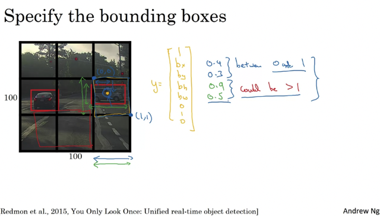</kbd>

   

## Intersection Over Union

 

### Đại khái là tính ra chỉ số \\*Itersection / Unit (giao hợp)\\* và quyết

> [!NOTE]
> Đại khái là tính ra chỉ số \**Itersection / Unit (giao hợp)\** và quyết
> định môt threshold để xem nó có correct hay không
>
> 1 Introduction to Intersection Over Union (IoU) function for
> evaluating object detection algorithms.
>
> 2 IoU computes the overlap between the ground-truth bounding
> box and the predicted bounding box.
>
> 3 Conventionally, an IoU of 0.5 or greater is considered correct,
> but more stringent criteria can also be used.
>
> 4 IoU can be used to measure the overlap between any two
> bounding boxes and is a way to measure similarity.
>
> 5 IoU is used in non-max suppression, which is a tool to improve
> the performance of object detection algorithms.
>
> 6 IoU is not to be confused with the promissory note concept in
> IoU.

 

  
  
<kbd>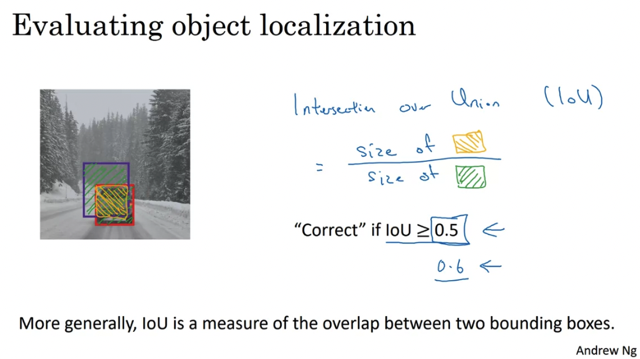</kbd>

  > [!NOTE]
  > Đại khái là tính ra chỉ số Itersection / Unit (giao hợp)
  > và quyết định môt threshold để xem nó có correct hay 
  > không
  >
  > Thường ta lấy 0.5 nhưng có thể tăng lên nếu muốn strict hơn

   

## Non-max Suppression

 

### Main ideas:  1 Object detection algorithms may find multiple

> [!NOTE]
> Main ideas:  1 Object detection algorithms may find multiple
> detections of the same object.
>
> 2 Non-max suppression is a method to ensure that object
> detection algorithms only detect each object once.
>
> 3 Non-max suppression works by \**selecting the most confident
> detection\** and then \**suppressing overlapping detections.\**
>
> 4 The first step of non-max suppression is to \**discard all boxes
> with a probability less than or equal to some threshold.\**
>
> 5 The next step is to repeatedly \**pick the box with the highest
> probability\** and \**output it as a prediction\** and \**suppress all box
> that overlap it\** until there are no more boxes left.

 

  
  
<kbd>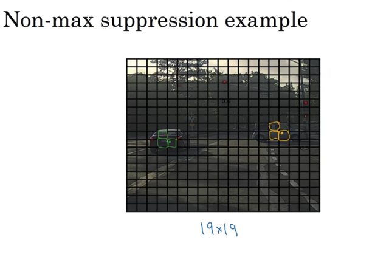</kbd>

  > [!NOTE]
  > Đại khái là trong quá trình có thể nhiều cell cùng detect rằng nó
  > chứa center của cái xe từ đó thành ra nó detect cái xe nhiều lần

   

  
  
<kbd>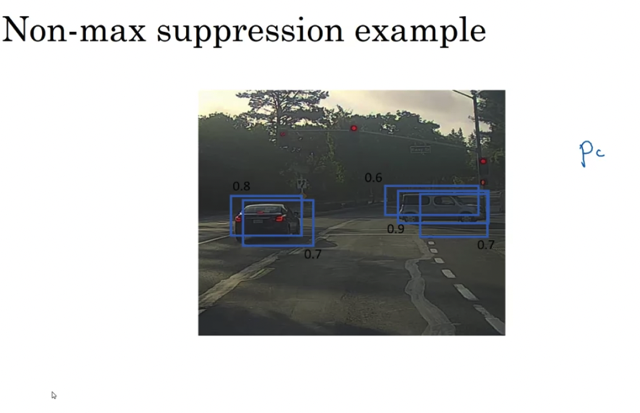</kbd>

  > [!NOTE]
  > Cái Non-max Suppresion sẽ làm là với mỗi object, nó xác định cái B.B
  > có Pc lớn nhất và xác định các b.b khác mà overlap nhiều với cái đầu
  >
  > Cái tên thể hiện hết: Suppression - Bỏ đi, Non-max là không  phải cái lớn
  > nhất (về Probability).

   

  
  
<kbd>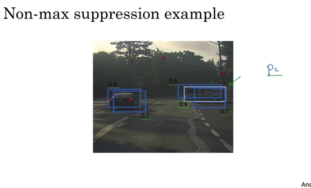</kbd>

   

  
  
<kbd>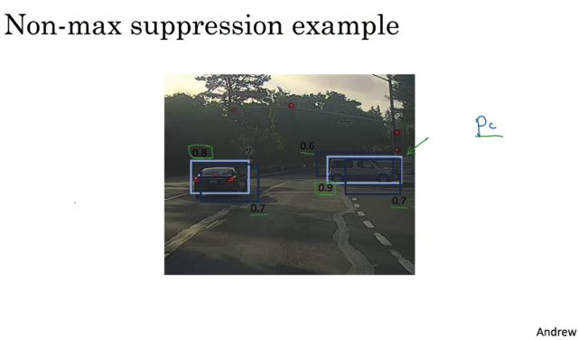</kbd>

   

  
  
<kbd>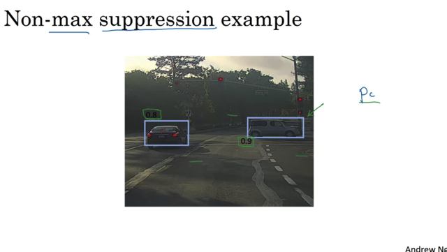</kbd>

   

  
  
<kbd>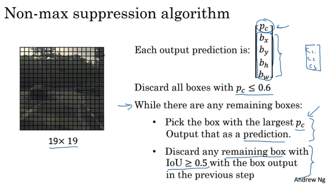</kbd>

   

## Anchor Boxes

 

### 1 Object detection with grid cells has a \\*limitation of detecting only

> [!NOTE]
> 1 Object detection with grid cells has a \**limitation of detecting only
> one object per cell\**.
>
> 2 Anchor boxes are \**pre-defined shapes used to associate multiple
> predictions with different anchor boxes.\**
>
> 3 Anchor boxes \**allow for detecting objects with different shapes
> and sizes in a single grid cell\**.
>
> 4 The \**target label\** with anchor boxes consists of a \**3 by 3 grid and
> anchor box pair, with each pair containing 8 dimensions for object
> detection.\**
>
> 5 Anchor boxes are assigned to the same grid cell as before, but
> with the highest Intersection over Union (IoU) with the object's
> shape. -> ???
>
> 6 The output Y is 3 by 3 by 16 with two anchor boxes or 3 by 3 by
> 24 with three anchor boxes.
>
> 7 Anchor boxes allow for better object detection and localization
> within a single grid cell.

> [!NOTE]
> 1 What is the problem with object detection and how can it be solved with anchor boxes?
>  2 One problem with object detection is that each grid cell can only detect one object, which means that if multiple objects are present in the same grid cell, the network has to pick only one to detect. To solve this problem, we can use the idea of anchor boxes, which involves pre-defining multiple shapes called anchor boxes and associating each grid cell with these anchor boxes. This way, we can assign each object to the anchor box that has the highest intersection-over-union (IoU) with the object's shape, allowing for multiple objects to be detected in the same grid cell.
>  3 How are anchor boxes implemented in the network architecture?
>  4 In the previous approach to object detection without anchor boxes, the output Y was a 3 by 3 by 8 tensor, where 3 by 3 represents the grid cells and 8 represents the 8 outputs associated with each grid cell. With anchor boxes, the same object is assigned to the grid cell that contains the object's midpoint, but is also assigned to a grid cell and anchor box pair with the highest IoU. The output Y is now a 3 by 3 by 16 tensor, where 3 by 3 represents the grid cells, 2 represents the anchor boxes, and 8 represents the outputs associated with each anchor box.
>  5 How are objects encoded using anchor boxes?
>  6 Objects are encoded by assigning them to the anchor box with the highest IoU and then encoding them in the target label using the outputs associated with that anchor box. For example, if a pedestrian is more similar in shape to anchor box 1, then the outputs associated with anchor box 1 will be used to encode the presence of the pedestrian, the bounding box around the pedestrian, and the object class of the pedestrian. Similarly, if a car is more similar in shape to anchor box 2, then the outputs associated with anchor box 2 will be used to encode the presence of the car, the bounding box around the car, and the object class of the car.
>  7 What happens if a grid cell only contains one object?
>  8 If a grid cell only contains one object, then that object will be assigned to the anchor box with the highest IoU and encoded using the outputs associated with that anchor box. If the object is more similar in shape to anchor box 2, then the outputs associated with anchor box 2 will be used to encode the presence of the object, the bounding box around the object, and the object class of the object. If the object is more similar in shape to anchor box 1, then the outputs associated with anchor box 1 will be used to encode the presence of the object, the bounding box around the object, and the object class of the object. If there is no object in a grid cell, then the PC output is set to 0 and the rest of the outputs are set to don't cares.

 

  
  
<kbd>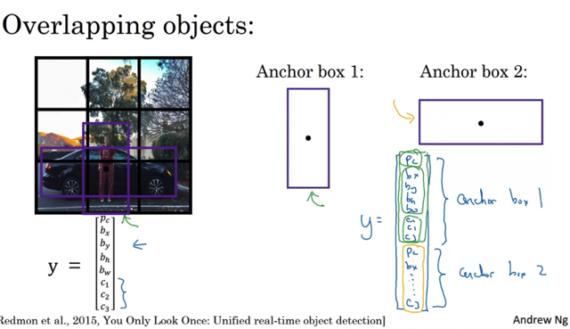</kbd>

   

  
  
<kbd>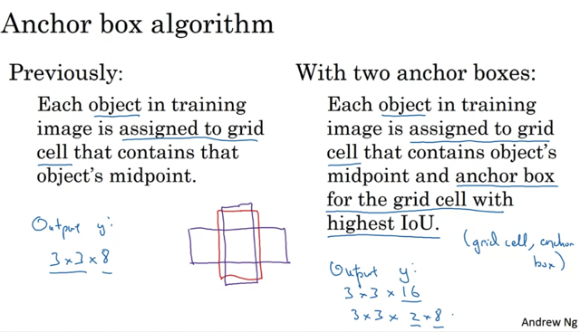</kbd>

  > [!NOTE]
  > Đại khái là thay đổi 1 chút, trước đây trong label y sẽ define 8 giá trị Pc,
  > bx, by, bh, bw, C1, C2, C3 đồng nghĩa với việc: **object thì nó sẽ gán vào
  > một cell**bởi các thông số đó. Hiểu đại khái là giả sử có 2 object thì
  > trong các ô, chỉ có 2 ô sẽ có các giá trị bx, by, bh, bw thôi.
  >
  > Còn bây giờ, 2 object sẽ được 'đánh dấu' / gán vào thêm 2 cái  anchor
  > box nữa

   

  
  
<kbd>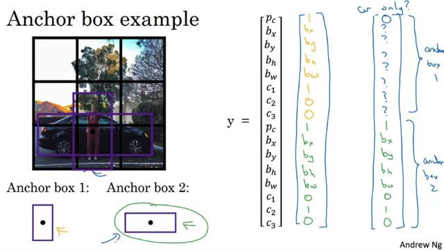</kbd>

  > [!NOTE]
  > Chưa hiểu lắm, hiểu là anchor box nó define
  > như vậy nhưng cụ thể làm gì thì chưa rõ

   

## Yolo Algorithm

 

### 1 The YOLO object detection algorithm combines various components of

> [!NOTE]
> 1 The YOLO object detection algorithm combines various components of
> object detection.
>
> 2 To construct the training set, the appropriate \**target vector y is formed
> for each of the nine grid cells.\**
>
> 3 The final output volume is 3 by 3 by 16, but in practice, it may be more
> like 19 by 19 by 16 or 19 by 19 by 24 if more anchor boxes are used.
>
> 4 The neural network makes predictions by outputting a 3 by 3 by 2 by 8
> volume, where for each of the nine grid cells, a vector is obtained.
>
> 5 Non-max suppression is run to get rid of low probability predictions, and
> independently run non-max suppression for each of the three classes of
> objects to detect pedestrians, cars, and motorcycles.

 

  
  
<kbd>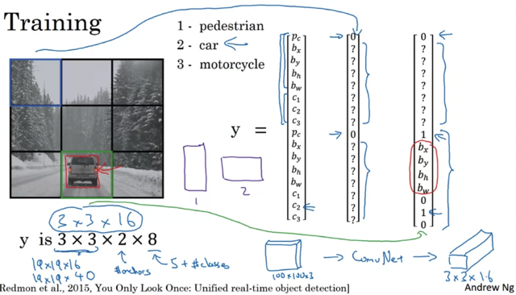</kbd>

  > [!NOTE]
  > Đại khái là training label sẽ có dạng như vậy với 2 object là
  > (3x3) x (số anchor) x (5 + số class) Thực tế có thể là 19x19

   

  
  
<kbd>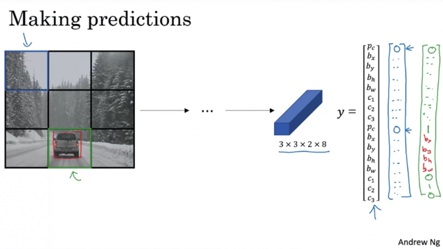</kbd>

  > [!NOTE]
  > Rồi sau khi train, và predict new image thì: Chỉ số đầu pc
  > của mỗi cell sẽ cho biết có object hay không, Nếu có thì
  > các thông số sẽ là vị trí và class của nó

   

  
  
<kbd>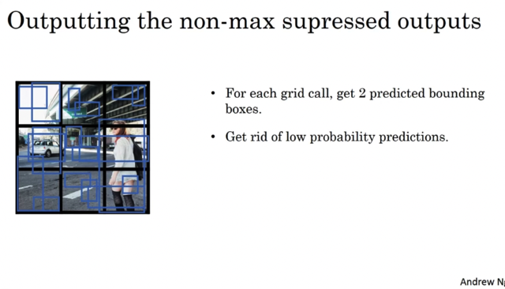</kbd>

  
<kbd>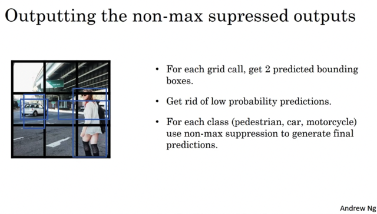</kbd>

  
<kbd></kbd>

  
<kbd></kbd>

  
<kbd>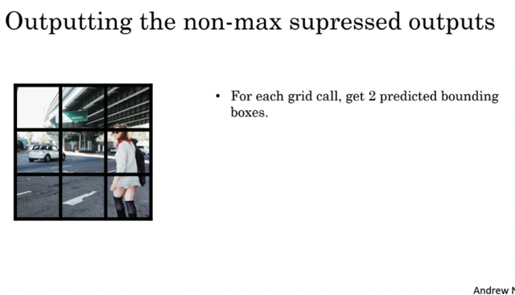</kbd>

   

  
  
<kbd>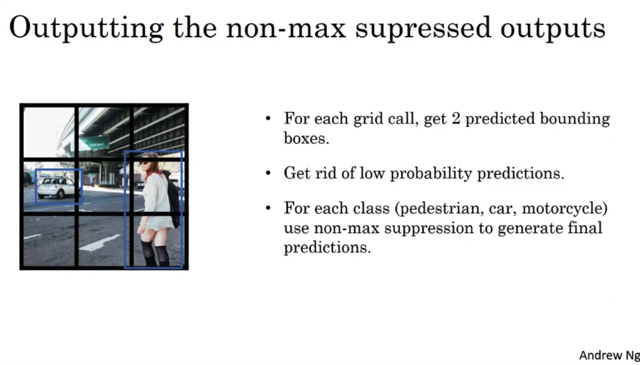</kbd>

  > [!NOTE]
  > Xong tiếp theo là làm quy trình non-max
  > đv mỗi class để xoá đi các bounding box

   

## Region Proposals

 

### 1 Introduction to region proposals in object detection

> [!NOTE]
> 1 Introduction to region proposals in object detection
>
> 2 Comparison between sliding windows and region
> proposals
>
> 3 R-CNN algorithm and its implementation of region
> proposals
>
> 4 Improvements to the R-CNN algorithm, including Fast
> R-CNN and Faster R-CNN
>
> 5 The influence of region proposals in computer vision
>
> 6 The potential for a single-step approach in object
> detection, similar to the You Only Look Once (YOLO)
> algorithm.

> [!NOTE]
> Sure, here is a more detailed response with indexed main ideas:
>  1 Region proposals have been influential in computer vision.
>  • In the object detection literature, region proposals have been a set of ideas that have been very influential in computer vision.
>  • While the speaker tends to use region proposals less often than other algorithms, it is still an idea that researchers may come across in their work.
>  2 Region proposals help to reduce the number of regions in which an algorithm runs the detector.
>  • Sliding windows is a technique in which a detector runs across all different windows of an image to determine if there is an object of interest.
>  • However, running the sliding windows algorithm convolutionally can result in the algorithm running on regions of the image where there is clearly no object of interest.
>  • Region proposals aim to reduce the number of regions in which the algorithm runs the detector by selecting a few regions that make sense to run the algorithm on.
>  3 R-CNN is an algorithm that uses region proposals.
>  • R-CNN stands for Regions with convolutional networks or regions with CNNs.
>  • R-CNN proposes a few windows in which to run the detector by using a segmentation algorithm to find potential objects of interest.
>  • The segmentation algorithm finds blobs in an image and selects these blobs as potential regions for the detector to run on.
>  4 R-CNN outputs a label and a bounding box for each proposed region.
>  • R-CNN outputs a label for each proposed region to determine if there is a car, pedestrian, or motorcycle in that region.
>  • R-CNN also outputs a bounding box for each proposed region to get an accurate bounding box around the object of interest.
>  5 R-CNN is slow, but there have been improvements.
>  • R-CNN is slow because of the clustering step to propose regions.
>  • Fast R-CNN is an improvement that uses a convolutional implementation of sliding windows to classify regions, which speeds up R-CNN.
>  • Faster R-CNN is another improvement that uses a convolutional neural network instead of a segmentation algorithm to propose regions, which speeds up R-CNN even more.
>  6 The idea of region proposals has been influential, but some researchers prefer a more streamlined approach.
>  • Region proposals have been an influential idea in computer vision.
>  • Some researchers, like the speaker, prefer a more streamlined approach where the algorithm can do everything at once, rather than having separate steps for region proposal and object detection.
>  • You Only Look Once (YOLO) is an example of an algorithm that does both region proposal and object detection in one step.

 

  
  
<kbd>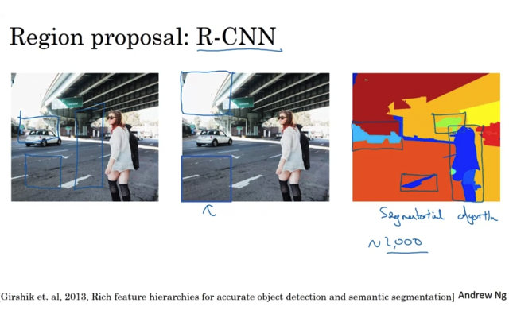</kbd>

  > [!NOTE]
  > Đại khái idea là thay vì chạy (Sliding window + classification) hoặc Sliding
  > window with ConvNet, trong đó ta đều check những cell mà rõ ràng là
  > không có khả năng có object, thì ta sẽ dùng một cái gọi là **Segmentation
  > algorithm** để xác định các **vùng có khả năng có object nhất sau đó chỉ
  > run trên những vùng này**

   

  
  
<kbd>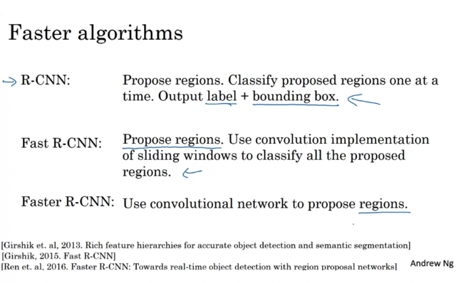</kbd>

  > [!NOTE]
  > Đại khái cái R-CNN nó chậm do bước
  > Region Proposal  nên có vài cách khác
  > dùng Conv để tăng tốc việc này.

   

## Semantic Segmentation With U-net

 

### 1. Semantic segmentation là gì?

> [!NOTE]
> 1. Semantic segmentation là gì?
>
> Semantic segmentation là một kỹ thuật thị giác máy tính liên quan đến gán nhãn cho mỗi
> pixel trong hình ảnh với một nhãn lớp tương ứng. Mục tiêu của semantic segmentation là
> tạo ra một đường viền chi tiết của một đối tượng, để chúng ta biết chính xác những pixel
> thuộc về đối tượng và những pixel nào không thuộc về đối tượng đó.
>
> 2. Ứng dụng của semantic segmentation:
>
> Semantic segmentation có nhiều ứng dụng thương mại, bao gồm xe tự lái, hình ảnh y học
> và lập kế hoạch phẫu thuật. Ví dụ, trong xe tự lái, semantic segmentation có thể được sử
> dụng để xác định các bề mặt lái được, giúp cho xe dễ dàng di chuyển.
>
> 3.Làm thế nào semantic segmentation hoạt động?
>
> Trong semantic segmentation, mục tiêu là gán nhãn lớp cho mỗi pixel trong hình ảnh. Để
> làm được điều này, chúng ta cần sửa đổi kiến trúc của một mạng neural tích chập (CNN).
> Các lớp cuối cùng của CNN được loại bỏ và mạng được sửa đổi để tăng dần kích thước
> đầu ra, sao cho nó phù hợp với kích thước của hình ảnh đầu vào.
>
> 4.Làm thế nào để phân đoạn hình ảnh bằng semantic segmentation?
>
> Để phân đoạn một hình ảnh bằng semantic segmentation, CNN tạo ra một ma trận nhãn
> lớp cho mỗi pixel trong hình ảnh. Số hàng và cột trong ma trận tương ứng với chiều cao và
> chiều rộng của hình ảnh đầu vào, trong khi số kênh tương ứng với số nhãn lớp. Ví dụ, nếu
> chúng ta muốn phân đoạn một hình ảnh thành các ô tô và tòa nhà, chúng ta sẽ có hai kênh:
> một cho ô tô và một cho tòa nhà.
>
> 5.Transpose convolution:
>
> Để tăng kích thước ma trận đầu ra trong semantic segmentation, chúng ta sử dụng một
> phép toán gọi là transpose convolution. Transpose convolution được sử dụng để "hoàn
> ngược" quá trình giảm mẫu xuất hiện ở các lớp trước của CNN. Đầu ra của một transpose
> convolution có cùng hình dạng với đầu vào, nhưng v

> [!NOTE]
> Sure, here is a more detailed answer with indexed main ideas:
>  1 What is semantic segmentation?
>  2 Semantic segmentation is a computer vision technique that involves labeling every pixel in an image with a corresponding class label. The goal of semantic segmentation is to create a detailed outline of an object, so that we know exactly which pixels belong to the object and which do not.
>  3 Applications of semantic segmentation
>  4 Semantic segmentation has many commercial applications, including self-driving cars, medical imaging, and surgical planning. For example, in self-driving cars, semantic segmentation can be used to identify drivable surfaces, making it easier for the car to navigate.
>  5 How does semantic segmentation work?
>  6 In semantic segmentation, the goal is to assign a class label to every pixel in an image. To accomplish this, we need to modify the architecture of a convolutional neural network (CNN). The last few layers of the CNN are removed, and the network is modified to gradually increase the size of the output, so that it matches the size of the input image.
>  7 How is an image segmented using semantic segmentation?
>  8 To segment an image using semantic segmentation, the CNN generates a matrix of class labels for each pixel in the image. The number of rows and columns in the matrix corresponds to the height and width of the input image, while the number of channels corresponds to the number of class labels. For example, if we want to segment an image into cars and buildings, we would have two channels: one for cars and one for buildings.
>  9 Transpose convolution
>  10 To increase the size of the output matrix in semantic segmentation, we use an operation called transpose convolution. Transpose convolution is used to "undo" the downsampling that occurs in the earlier layers of the CNN. The output of a transpose convolution has the same shape as the input, but with additional rows and columns inserted between the original pixels.
>  11 What is the unit algorithm?
>  12 The unit algorithm is a specific neural network architecture that is designed for semantic segmentation. The unit architecture is based on a modified version of a CNN, where the last few layers are removed and the output is gradually increased in size using transpose convolution. The unit architecture is widely used in computer vision applications, such as medical imaging and self-driving cars.

 

  
  
<kbd>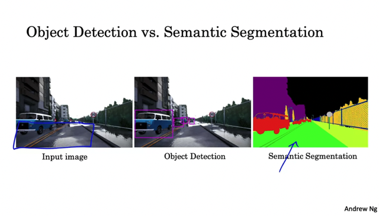</kbd>

  > [!NOTE]
  > Đại khái là ta đã trải qua 2 bước, 1 là **object recognition** - bài toán
  > classification để xác định xem nó là hình con mèo hay không
  > 2 là **object detection** - nâng cấp hơn, không những xác định con mèo
  > mà còn vẽ cái bounding box quanh con mèo.
  >
  > Bây giờ bài toán thứ 3 nâng cấp hơn nữa là không những vẽ b.b
  > mà vẽ sát cái viền của con mèo - **segmentation**

   

  
  
<kbd>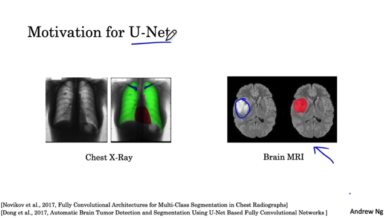</kbd>

  > [!NOTE]
  > Đại khái là một số ứng dụng của cái
  > này, sẽ giúp ích rất nhiều

   

  
  
<kbd>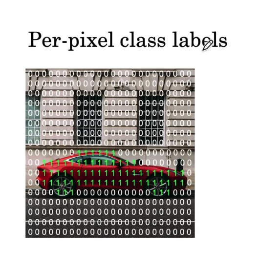</kbd>

  
<kbd></kbd>

  
<kbd>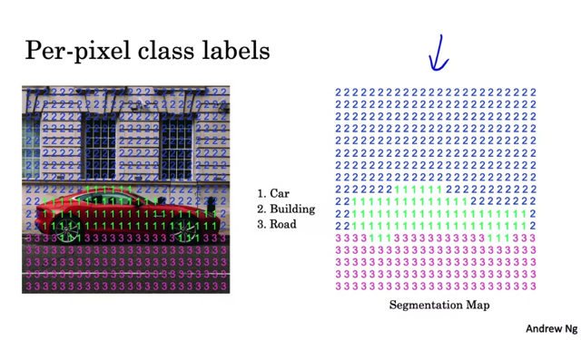</kbd>

  > [!NOTE]
  > N.n phải output 1 matrix như này: mỗi pixel
  > trong image đều được label

   

  
  
<kbd>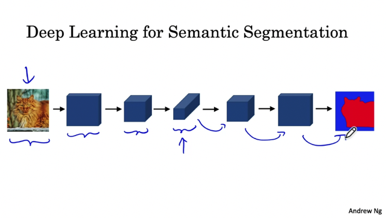</kbd>

  
<kbd></kbd>

  
<kbd>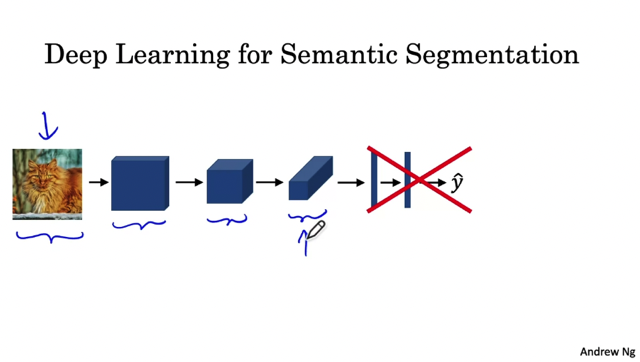</kbd>

  > [!NOTE]
  > Đại khái là để làm segmentation phải thay mấy cái layer cuối theo kiểu
  > tăng cái size lên như này để về lại size ban đầu của input image. Cái này
  > cần tới **Transpose Operation**

   

## Transpose Convolutions

 

### Trong bài giảng này, người giảng giải thích về khái niệm transpose

> [!NOTE]
> Trong bài giảng này, người giảng giải thích về khái niệm transpose
> convolution, là một phần quan trọng trong kiến trúc đơn vị. Để làm
> cho đầu vào kích thước 2x2 được phóng to lên kích thước 4x4, ta
> có thể sử dụng transpose convolution. Khác với convolution thông
> thường, transpose convolution sử dụng một bộ lọc (filter) để phóng
> to dữ liệu đầu ra thay vì áp dụng bộ lọc lên đầu vào. Bài giảng cung
> cấp một ví dụ chi tiết về cách sử dụng transpose convolution với
> đầu vào 2x2, bộ lọc 3x3, padding 1 và stride 2 để phóng to đầu vào
> thành đầu ra 4x4. Một vài bước tính toán được trình bày để minh
> họa quá trình phóng to. Cuối cùng, transpose convolution được cho
> là một cách hiệu quả để phóng to dữ liệu đầu vào nhỏ hơn lên kích
> thước lớn hơn trong bối cảnh của thuật toán học sâu.

 

  
  
<kbd>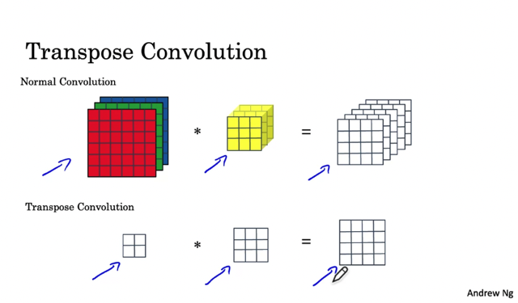</kbd>

   

  
  
<kbd>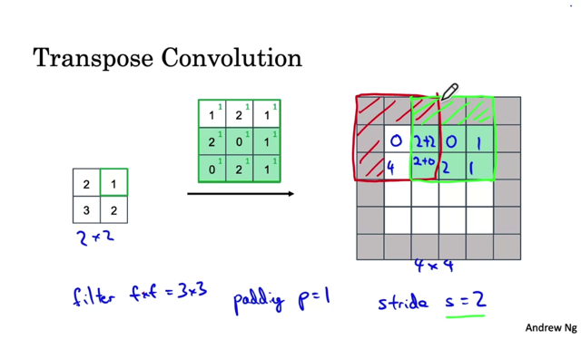</kbd>

  
<kbd>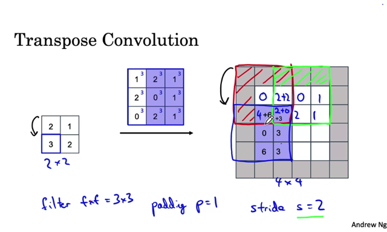</kbd>

  
<kbd>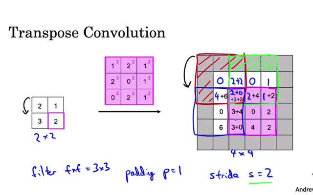</kbd>

  
<kbd></kbd>

  
<kbd></kbd>

  
<kbd></kbd>

  
<kbd>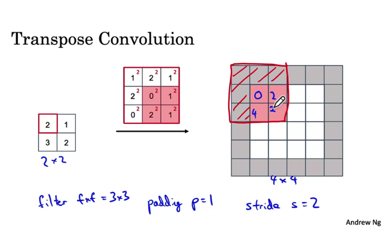</kbd>

   

  
  
<kbd></kbd>

   

## U-net Architecture Intuition

 

### - Đại khái là sử dụng \\*convolution thông thường phần

> [!NOTE]
> - Đại khái là sử dụng \**convolution thông thường phần
> đầu\** của mạng nơ-ron.
>
> - Sử dụng \**transpose convolution trong phần thứ hai
> của mạng nơ-ron để khôi phục lại kích thước ảnh gốc.\**
>
> - Giới thiệu \**skip connections\** từ các lớp trước đến
> các lớp sau để cải thiện hiệu suất bằng cách \**cung cấp
> thông tin bối cảnh cấp cao và thông tin kết cấu cấp
> thấp\** để cho phép mạng nơ-ron bắt được thông tin
> không gian chi tiết, tinh vi.

 

  
  
<kbd>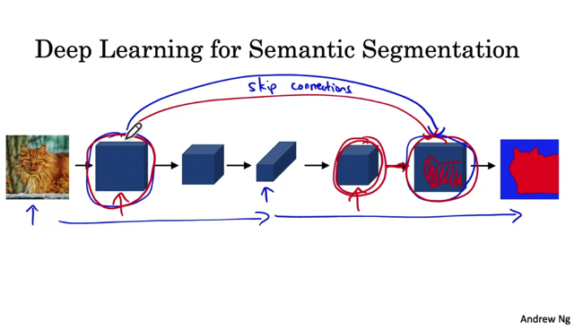</kbd>

  > [!NOTE]
  > Đại khái là dùng Transpose Conv ở những layer cuối và **Skip
  > Connection** cho phép cung cấp **những low-level feature nhưng
  > chi tiết** để cộng với những **high-level feature nhưng chung
  > chung** để tạo nên kết quả cuối cùng

   

## U-net Architecture

 

### 1. Qua 1 vài lớp Conv layer (Conv Relu) giữ nguyên kích thước  (với

> [!NOTE]
> 1. Qua 1 vài lớp Conv layer (Conv Relu) giữ nguyên kích thước  (với
> same padding) nhưng tăng dimensions (tăng số filter lên)
>
> 2,3,4. Dùng (Max) Pooling, giảm kích thước xuống rồi lại qua vài lớp
> Conv-reLu để tăng dimension
>
> 5. Dùng Transpose Conv để (chưa tăng kích thước) mà giảm
> dimensions xuống rồi ghép với cái Skip Connection từ bước 4.
>
> 6,7,8. Dùng Transpose Conv để tăng kích thước + giảm dimensions
> xuống rồi ghép với cái Skip Connection từ bước 3,2,1
>
> 9. Dùng Conv ReLU cho những layer cuối lúc này kích thước đã  phục hồi ban
> đầu, layer cuối dùng Conv (1x1) để xuất ra kết quả cuối cùng.

 

  
  
<kbd></kbd>

  > [!NOTE]
  > Đây là một trong những cái kết trúc
  > neural network nền tảng quan trọng
  > nhất của Computer Vision

   

  
  
<kbd>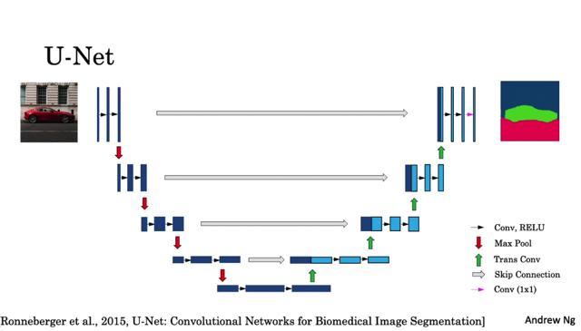</kbd>

   

  
  
<kbd>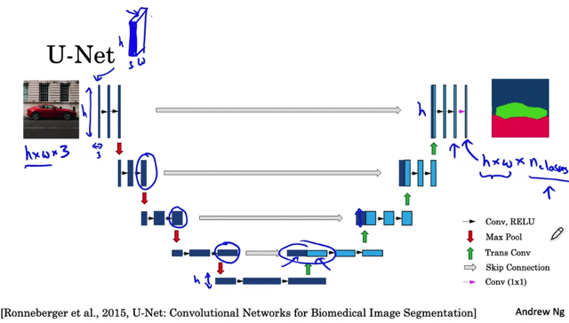</kbd>

  > [!NOTE]
  > 1. Qua 1 vài lớp \/**Conv layer (Conv Relu)**\/ **giữ nguyên kích thước** (với
  > same padding) nhưng **tăng dimensions** (tăng số filter lên)
  >
  > 2,3,4. Dùng \/**(Max) Pooling**\/, giảm kích thước xuống rồi lại qua vài lớp
  > Conv-reLu để tăng dimension
  >
  > 5. Dùng \/**Transpose Conv\/**để (chưa tăng kích thước) mà **giảm
  > dimensions xuống** rồi ghép với cái Skip Connection từ bước 4.
  >
  > 6,7,8. Dùng \/**Transpose Conv\/**để **tăng kích thước** + **giảm dimensions
  > xuống** rồi ghép với cái Skip Connection từ bước 3,2,1
  >
  > 9. Dùng Conv ReLU cho những layer cuối lúc này kích thước đã  phục hồi ban
  > đầu, layer cuối dùng Conv (1x1) để xuất ra kết quả cuối cùng.

   

## Quiz

 

<kbd>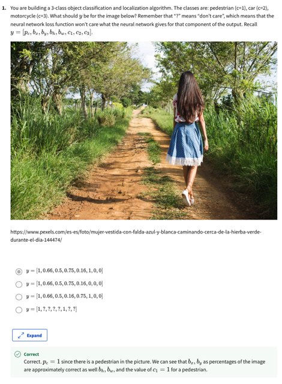</kbd>

 

<kbd>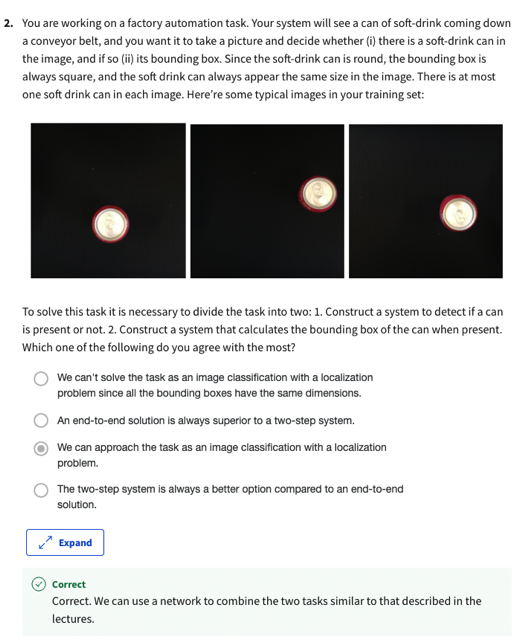</kbd>

 

<kbd>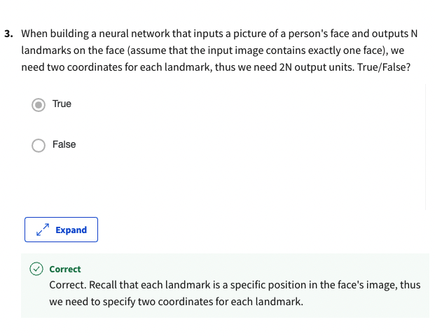</kbd>

 

<kbd>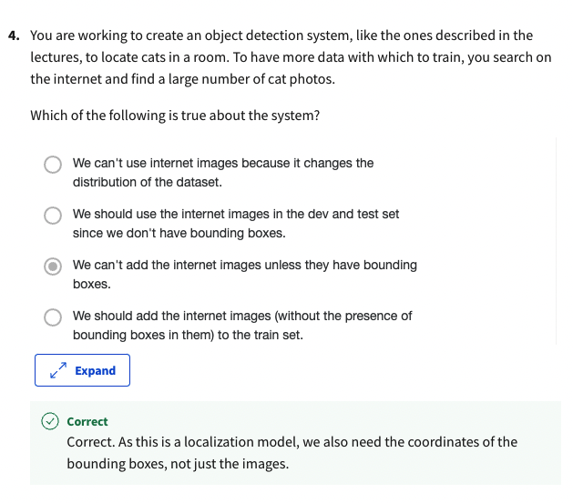</kbd>

 

<kbd>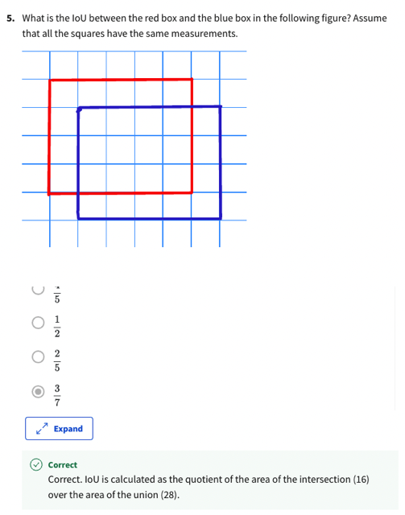</kbd>

 

<kbd>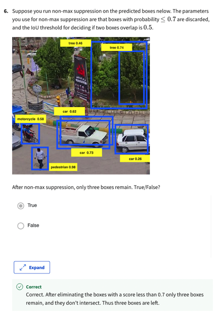</kbd>

 

<kbd></kbd>

 

<kbd></kbd>

 

<kbd></kbd>

 

<kbd></kbd>

 

## Programming Assignment

 

### By the end of this assignment, you'll be able to:

> [!NOTE]
> By the end of this assignment, you'll be able to:
>
> Detect objects in a car detection dataset
> Implement non-max suppression to increase accuracy
> Implement intersection over union
> Handle bounding boxes, a type of image annotation popular in deep learning

<kbd></kbd>

 

- \\*..\\*
   

  
  - Packages
     

      
      
<kbd></kbd>

       

  
  - 1 - Problem Statement
     

      
      
<kbd></kbd>

      
<kbd></kbd>

      
<kbd></kbd>

      > [!NOTE]
      > Đại khái là đi vòng vòng chụp hình, về vẽ **Bounding
      > Box**  quanh cái xe để tạo training set
      >
      > Đại khái ở đây chỉ có 1 object (xe), nếu có 80 class thì có
      > thể dùng c1, c2,....c80 hoặc dùng 80 one-hot encoded
      > vector

       

  
  - 2 - Yolo
     

    
    - YOLO: Đại khái là nó (algorithm) chỉ cần look qua cái image 1 lầnm lúc forward  propagation để predict
       

    
    - 2.1 - Model Details
       

        
        
<kbd></kbd>

         

        
        
<kbd></kbd>

        
<kbd></kbd>

        
<kbd></kbd>

        > [!NOTE]
        > Đại khái là nếu trong lecture chỉ có 2 anchor box, và 3 class nên 
        > y = [Pc, bx, by, bh, bw, c1, c2, c3, ..
        > ..Pc, bx, by, bh, bw, c1, c2, c3]
        >
        > Thì ở đây là có 5 anchorbox và 80 cái class !!!
        >
        > [Pc, bx, by, bh, bw, c1, c2, c3, ..c80 //Anchor box 1
        > ..Pc, bx, by, bh, bw, c1, c2, c3..c80  //Anchor box 2
        > ..Pc, bx, by, bh, bw, c1, c2, c3..c80  //Anchor box 3
        > ..Pc, bx, by, bh, bw, c1, c2, c3..c80  //Anchor box 4
        > ..Pc, bx, by, bh, bw, c1, c2, c3..c80  //Anchor box 5
        > ]

         

        
        
<kbd></kbd>

        > [!NOTE]
        > Đại khái mỗi 1 cell sẽ có 5 box (như khi mình define anchor box),
        > tính 5 con số pc của mỗi cell để biết khả năng (probability) cell đó có
        > object hay không. 
        > Rồi nhân với [c1, ...c80] để ra khả năng có object class nào
        >
        > **Đang nói cho 1 cell nha:**
        >
        > Box 1:
        >
        > pc*[c1,...c80] để ra [pc*c1, pc*c2,....pc*c80]
        >
        > Trong 80 con số này, **số lớn nhất** (v.d pcc3) sẽ thể hiện khả năng 
        > cao (nhất) box 1 này chứa object class số 3 (ở đây class #3 là xe hơi)
        > -> Assign blah blah có nghĩa đại khái là mình sẽ tuyên bố
        > box 1 sẽ chứa xe hơi (class #3) và class score là 44%
        >
        > **Tính tương tự cho 4 box còn lại (của 1 cell)
        >
        >
        > Vậy làm cùng lúc cho 19x19 (tổng số cell) x5 (5 box mỗi cell) thì sao**

         

        
        
<kbd></kbd>

        
<kbd></kbd>

        
<kbd></kbd>

         

    
    - 2.2 - Filtering with a Threshold on Class Scores  Đại khái là thay vì để chung các thông số của 1 box trong 1 vector  [Pc, bx, by, bh, bw, c1, c2...c80]  thì ta chia ra thành 3 vector:  - Box confidence: Pc  - Boxes: bx, by, bh, bw  - Boxes class probability: c1, c2, ...c80  19x19x (số box) x (1 object probability + 4 thông số vị trí object  + 80 thông số class prob)  tách thành  - Box confidence: 19x19x (số box) x (1 object probability)  - Boxes: bx, by, bh, bw: 19x19x (số box) x (4 thông số vị trí object)  - Boxes class probability: c1, c2, ...c80: 19x19x (số box) x (80 thông số class prob)
       

        
        
<kbd></kbd>

        > [!NOTE]
        > Đại khái là thay vì để chung các thông số của 1 box trong 1 vector
        >
        > [Pc, bx, by, bh, bw, c1, c2...c80]
        >
        > thì ta chia ra thành 3 vector:
        >
        > - Box confidence: Pc
        >
        > - Boxes: bx, by, bh, bw
        >
        > - Boxes class probability: c1, c2, ...c80
        >
        > 19x19x (số box) x (1 object probability + 4 thông số vị trí object + 80 thông số
        > class prob)
        >
        > tách thành
        >
        > - Box confidence: 19x19x (số box) x (1 object probability)
        >
        > - Boxes: bx, by, bh, bw: 19x19x (số box) x (4 thông số vị trí object)
        >
        > - Boxes class probability: c1, c2, ...c80: 19x19x (số box) x (80 thông số class
        > prob)

         

        
        
<kbd></kbd>

         

    
    - Exercise 1 - yolo_filter_boxes
       

        
        
<kbd></kbd>

        > [!NOTE]
        > Đại khái là tính Pc trong của một box bằng cách nhân Pc
        > object với  vector class probability [c1, c2, c3...c80]
        >
        > - Để ra 'probability of an object with class c_i'  
        > [Pc*c1, Pc*c2, ... , Pc*c80]
        >
        > - Lấy ra giá trị lớn nhất cùng với index của nó trong 80 cái 
        > Dùng **argmax** và **reduce_max
        >
        > -**Cuối cùng là dùng boolean_max để loại bỏ những cái dưới
        > Threshold
        >
        > Do mình đang làm đv dimension cuối nên axis=-1 để nó lấy cái cuối

         

        
        
<kbd></kbd>

        
<kbd></kbd>

        
<kbd></kbd>

         

        
        
<kbd></kbd>

        
<kbd></kbd>

        
<kbd></kbd>

         

        
        
<kbd></kbd>

         

        
        
<kbd></kbd>

         

    
    - 2.3 - Non-max Suppression
       

        
        
<kbd></kbd>

         

    
    - Exercise 2 - iou
       

        
        
<kbd></kbd>

         

        
        
<kbd></kbd>

        > [!NOTE]
        > Nếu hai box không overlap nhau, thì intersection phải bằng
        > 0  -> inter_width  = max(0, inter_area's width) inter_height  =
        > max(0, inter_area's height)

         

        
        
<kbd></kbd>

         

    
    - 2.4 - YOLO Non-max Suppression
       

        
        
<kbd></kbd>

         

    
    - Exercise 3 - yolo_non_max_suppression
       

        
        
<kbd></kbd>

         

        
        
<kbd></kbd>

         

        
        
<kbd></kbd>

         

    
    - 2.5 - Wrapping Up the Filtering
       

        
        
<kbd></kbd>

         

    
    - Exercise 4 - yolo_eval
       

        
        
<kbd></kbd>

        
<kbd></kbd>

        
<kbd></kbd>

         

        
        
<kbd></kbd>

         

    
    - 3 - Test YOLO Pre-trained Model on Images: Đại khái là dùng Pretrained YOLO model để detect
       

      
      - 3.1 - Defining Classes, Anchors and Image Shape
         

          
          
<kbd></kbd>

           

      
      - 3.2 - Loading a Pre-trained Model
         

          
          
<kbd></kbd>

           

      
      - 3.3 - Convert Output of the Model to Usable Bounding Box Tensors
         

          
          
<kbd></kbd>

           

      
      - 3.4 - Filtering Boxes
         

          
          
<kbd></kbd>

           

      
      - 3.5 - Run the YOLO on an Image
         

          
          
<kbd></kbd>

           

          
          
<kbd></kbd>

           

          
          
<kbd></kbd>

           

          
          
<kbd></kbd>

           

          
          
<kbd></kbd>

           

    
    - 4 - Summary for YOLO
       

        
        
<kbd></kbd>

         

    
    - 5 - References
       

        
        
<kbd></kbd>

         

## PROGRAMMING ASSIGNMENT: \\*Image Segmentation with U-Net\\*

 

### Welcome to the final assignment of Week 3 in Course 4 of the Deep Learning

> [!NOTE]
> Welcome to the final assignment of Week 3 in Course 4 of the Deep Learning
> Specialization! You'll be building your own U-Net, a type of CNN designed for
> quick, precise image segmentation, and using it to predict a label for every
> single pixel in an image - in this case, an image from a self-driving car dataset.

<kbd></kbd>

 

- Image Segmentation with U-Net
   

    
    
<kbd></kbd>

     

- 1 - Packages
   

    
    
<kbd></kbd>

     

- 2 - Load and Split the Data
   

    
    
<kbd></kbd>

     

    
    
<kbd></kbd>

    
<kbd></kbd>

    
<kbd></kbd>

     

- 2.1 - Split Your Dataset into Unmasked and Masked Images
   

    
    
<kbd></kbd>

     

- 2.2 - Preprocess Your Data
   

    
    
<kbd></kbd>

     

- 3 - U-Net
   

    
    
<kbd></kbd>

     

- 3.1 - Model Details
   

    
    
<kbd></kbd>

     

    
    
<kbd></kbd>

     

    
    
<kbd></kbd>

     

- 3.2 - Encoder (Downsampling Block)
   

    
    
<kbd></kbd>

     

- Exercise 1 - conv_block
   

    
    
<kbd></kbd>

    
<kbd></kbd>

    
<kbd></kbd>

     

    
    
<kbd></kbd>

    
<kbd></kbd>

    
<kbd></kbd>

     

    
    
<kbd></kbd>

     

- 3.3 - Decoder (Upsampling Block)
   

    
    
<kbd></kbd>

     

- Exercise 2 - upsampling_block
   

    
    
<kbd></kbd>

     

    
    
<kbd></kbd>

     

    
    
<kbd></kbd>

     

- 3.4 - Build the Model
   

    
    
<kbd></kbd>

     

- Exercise 3 - unet_model
   

    
    
<kbd></kbd>

    
<kbd></kbd>

    
<kbd></kbd>

    
<kbd></kbd>

    
<kbd></kbd>

     

    
    
<kbd></kbd>

     

- 3.5 - Set Model Dimensions
   

    
    
<kbd></kbd>

     

    
    
<kbd></kbd>

     

    
    
<kbd></kbd>

     

- 3.6 - Loss Function: SparseCategoricalCrossentropy
   

    
    
<kbd></kbd>

    > [!NOTE]
    > Đại khái là mỗi pixel là 1 vector 11 dimensions (do có 11 classes)
    > và gía trị mỗi item trong vector là class probabilities của pixel đó.

     

    
    
<kbd></kbd>

    > [!NOTE]
    > Output 128x128x11

     

- 3.7 - Dataset Handling: Display input image và true-mask (đại khái là cái y) hình có segmentation dùng để train và y^ muốn đạt được
   

    
    
<kbd></kbd>

     

    
    
<kbd></kbd>

     

- 4 - Train the Model
   

    
    
<kbd></kbd>

     

- 4.1 - Create Predicted Masks
   

    
    
<kbd></kbd>

    > [!NOTE]
    > Đại khái là bước này nó sẽ xác định cái class
    > của từng pixel thuộc về đây, dùng argument max

     

- 4.2 - Plot Model Accuracy
   

    
    
<kbd></kbd>

     

- 4.3 - Show Predictions
   

    
    
<kbd></kbd>

     

    
    
<kbd></kbd>

     

    
    
<kbd></kbd>

     

- Conclusion You've come to the end of this assignment. Awesome work creating a state-of-the art model for semantic image segmentation! This is a very important task for self-driving cars to get right. Elon Musk will surely be knocking down your door at any moment. ;)  What you should remember:  - Semantic image segmentation predicts a label for every single pixel in an image - U-Net uses an equal number of convolutional blocks and transposed convolutions for downsampling and upsampling - Skip connections are used to prevent border pixel information loss and overfitting in U-Net
   

