# W3_sequence Models & Attention Mechanism

📊 **Progress:** `43` Notes | `119` Screenshots

---

Augment your sequence models using an attention mechanism, an algorithm that helps your model decide where to focus its attention given a sequence of inputs. Then, explore speech recognition and how to deal with audio data.
**Learning Objectives**
 • Describe a basic sequence-to-sequence model
 • Compare and contrast several different algorithms for language translation
 • Optimize beam search and analyze it for errors
 • Use beam search to identify likely translations
 • Apply BLEU score to machine-translated text
 • Implement an attention model
 • Train a trigger word detection model and make predictions
 • Synthesize and process audio recordings to create train/dev datasets
 • Structure a speech recognition project

## Various Sequence To Sequence Architectures

 

### Basic Models

 

- 1 \\*Sequence to sequence models\\* are useful for a variety of applications, including \\*machine translation\\* and \\*speech recognition\\*.  2 The \\*basic model\\* for sequence to sequence involves using an \\*encoder network\\* (e.g., a RNN) to encode the input sequence and a \\*decoder network\\* to decode the output sequence one word at a time.  3 For example, to translate a French sentence to English, the encoder network would encode the French sentence and the decoder network would output the English translation.  4 A similar model can be used for\\* image captioning\\*, where a \\*pre-trained convolutional neural network\\* is used \\*as the encoder\\* \\*network\\* to encode an image and an \\*RNN is used as the decoder\\* \\*network\\* to generate the caption.  5 One key difference between generating translations or captions using a sequence to sequence model and synthesizing novel text using a language model is that in the former, the goal is to \\*generate the most likely translation\\* or caption \\*rather than a random one\\*.
   

    
    
<kbd>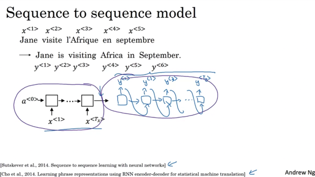</kbd>

> [!NOTE]
> Ổng nói đại khái để làm bài toán translate thì build một cái model
> như vầy trên thực tế đã chứng minh là work khá hiệu quả, chỉ cần
> chuẩn bị dataset French sentences -> English sentences

     

    
    
<kbd>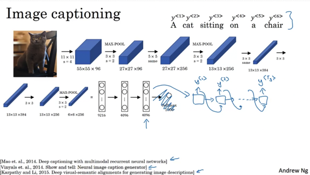</kbd>

> [!NOTE]
> Đại khái là có thể làm vấn đề như image captioning, train a picture thông
> qua 1 ConvNet và dùng cái vector cuối như một cái image representation
> và feed vào cái Sequence to sequence model
>
> Kiểu như là với sentence thì ta tạo representation vector bởi Embedding
> còn Image thì là vector cuối của ConvNet (gọi là encoding vector?)

     

### Picking The Most Likely Sentence

 

- 1 Sequence to sequence machine translation model is s\\*imilar to language models\\*, but there are some significant differences.  2 Machine translation can be thought of as building a \\*conditional language model\\* that estimates the probability of an output sentence based on input.  3 The model starts off the \\*decoded network\\* with the representation of the input sentence, unlike the \\*language model\\*, which starts with a \\*vector of all zeros.\\*  4 The goal of the machine translation model is to \\*find the English sentence that maximizes the conditional probability\\* given a French input sentence.  5 The most common algorithm for finding the English sentence that maximizes the conditional probability is \\*beam search\\*.  6 \\*Greedy search\\* algorithm doesn't work because it may not pick the best words that maximize the \\*joint probability\\* of the whole sentence.
   

    
    
<kbd>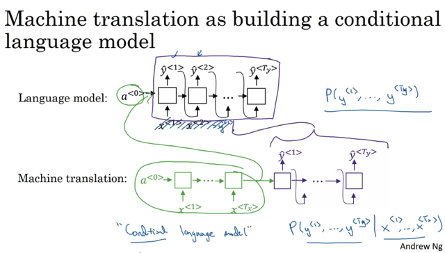</kbd>

> [!NOTE]
> Khác biệt giữa Language Model (nói ở week 1) và Machine Translation
>
> Đều có cái phần 'language model' (màu tím) giống nhau.
>
> Nhưng M.T **"encode"** cái input trước khi bỏ vào cái phần ' language
> model'.
>
> L.M output "Probability of a sentence" - p(y<1>,y<2>,...y<Ty>)
>
> còn M.T output **"Probability of a proper sentence / translation sentence**,
> given the French (original) sentence" - kiểu như một đièu kiện "Ê, ko
> phải là 'probability' của 1 câu nào đó mà phải là 'probability' của 1 câu
> phù hợp - câu dịch đúng. Nên nó dc gọi là **'Conditional language model'**
>
> Tạm hiểu đại khái vậy.

     

    
    
<kbd>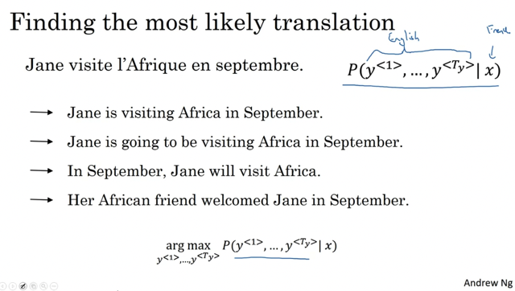</kbd>

> [!NOTE]
> Đại khái là ta không chỉ muốn 'một kết quả' mà phải là 'kết quả tốt nhất,
> phù hợp nhất' Giống như bản dịch chính xác nhất, và ta làm điều này nhờ
> **Beam Search**

     

    
    
<kbd>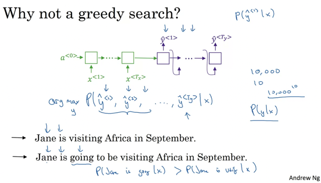</kbd>

> [!NOTE]
> **Greedy search** đại khái là search từ tốt nhất one-by-one,
> nhưng thường lại không phải là cách tạo ra câu tốt nhất

     

### Beam Search

 

- Với mỗi từ ứng viên, tìm tiếp 3 từ có khả năng cao nhất theo sau nó  Ví dụ 3 ứng viên cao nhất cho vị trí thứ 1 của câu là 'in', 'Jane', 'Semtember' thì ở step 2, lần lượt tìm :  - các khả năng của từ thứ 2 nếu từ thứ nhất là 'in' -> ra vector 10000 probability: [P('a', x, 'in'), P('aaron', x, 'in'),....10000 từ...P('zulu', x, 'in')]  - các khả năng của từ thứ 2 nếu từ thứ nhất là 'Jane' -> ra vector 10000 probability [P('a', x, 'Jane'), P('aaron', x, 'Jane'),....10000 từ...P('zulu', x, 'Jane')]  - các khả năng của từ thứ 2 nếu từ thứ nhất là 'September' -> ra vector 10000 probability  [P('a', x, 'September'), P('aaron', x, 'September'),....10000 từ...P('zulu', x, ' September')]  Xong tính Probability của 1 cặp P(y<1>, y<2> | X) theo công thức: \\*P(y<1>, y<2> | X) = P(y<1>|x).P(y<2>|x, y<1>) \\* để có:  [   P('in', 'a' | x), P('in', 'aaron' | x), ...10000 cái...P('in', 'zulu' | x),..   P('jane', 'a' | x), P(' jane', 'aaron' | x), .....P('jane', 'zulu' | x),..   P('september', 'a' | x), P('september', 'aaron' | x),...P('september', 'zulu' | x) ]  Cuối cùng tìm 3 cặp có P(y<1>, y<2> | x) cao nhất.  Giả sử kết quả là {in September}, {jane í}, {jane visiting} thì đồng nghĩa \\*September không còn là ứng viên của từ thứ nhất\\*
   

    
    
<kbd>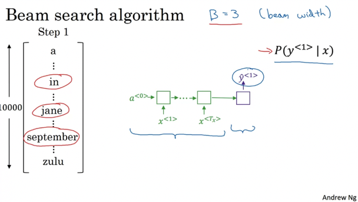</kbd>

> [!NOTE]
> Đại khái là nó không chỉ tính 1 mà là 3 cái probability cao nhất cho từ đầu
> tiên, (B là hyper params '**beam width**', đang set = 3). Kiểu như 3 khả
> năng cao nhất của từ này là gì, chứ không phải chỉ có 1 như trước đây.

     

    
    
<kbd>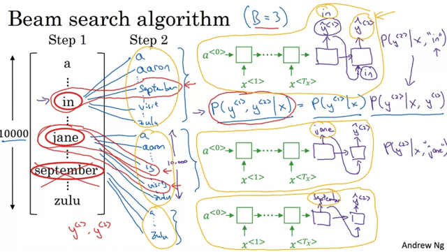</kbd>

> [!NOTE]
> Với mỗi từ ứng viên (của từ đầu tiên), tìm tiếp 3 từ có khả năng cao nhất theo sau nó
>
> Ví dụ 3 ứng viên cao nhất cho vị trí thứ 1 của câu là 'in', 'Jane', 'September' thì ở step 2, lần lượt tìm :
>
> - Các khả năng của từ thứ 2 nếu từ thứ nhất là 'in' -> ra vector 10000 probability:
> [P('a', x, 'in'), P('aaron', x, 'in'),....10000 từ...P('zulu', x, 'in')]
>
> - Các khả năng của từ thứ 2 nếu từ thứ nhất là 'Jane' -> ra vector 10000 probability 
> [P('a', x, 'Jane'), P('aaron', x, 'Jane'),....10000 từ...P('zulu', x, 'Jane')]
>
> - Các khả năng của từ thứ 2 nếu từ thứ nhất là 'September' -> ra vector 10000 probability 
> [P('a', x, 'September'), P('aaron', x, 'September'),....10000 từ...P('zulu', x, 'September')]
>
> Xong tính Probability của 1 cặp P(y<1>, y<2> | X) theo công thức:
> **P(y<1>, y<2> | X) = P(y<1>|x).P(y<2>|x, y<1>)**
> để có: 
>
> [
>   P('in', 'a' | x), P('in', 'aaron' | x), ...10000 cái...P('in', 'zulu' | x),..
>   P('jane', 'a' | x), P('jane', 'aaron' | x), .....P('jane', 'zulu' | x),..
>   P('september', 'a' | x), P('september', 'aaron' | x),...P('september', 'zulu' | x)
> ]
>
> Cuối cùng tìm 3 cặp có P(y<1>, y<2> | x) cao nhất.
>
> Giả sử kết quả là {in September}, {jane is}, {jane visiting} thì
> đồng nghĩa **September không còn là ứng viên của từ thứ nhất**

     

    
    
<kbd>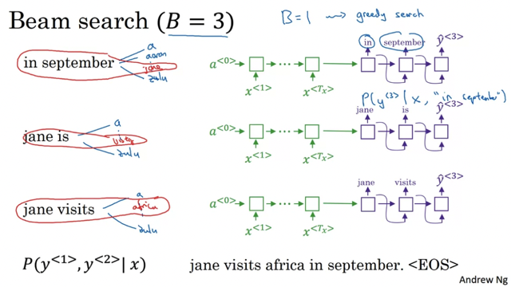</kbd>

> [!NOTE]
> Tiếp tục như vậy ta sẽ có kết quả là bộ y<1>,y<2>...sao cho
> P(y<1>,y<2>...) cao nhất.
>
> Khi B = 1 thì chính là Greedy Search

     

### Refinements To Beam Search

 

- 1 \\*Length normalization\\* can improve the performance of the basic search algorithm.  2 Using \\*logs\\* instead of multiplying probabilities can make the algorithm more \\*numerically stable\\*.  3 The algorithm can be further improved by normalizing the log probability by the number of words in the translation, using a parameter called Alpha.  4 Beam search involves evaluating a large number of possible translations and s\\*electing the highest scoring\\* one.  5 The beam width determines how many possibilities are considered during beam search.  6 A larger beam width can lead to better results but requires more time and memory.
   

    
    
<kbd>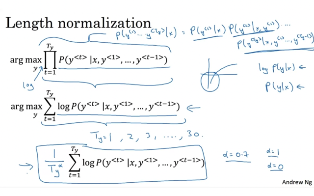</kbd>

> [!NOTE]
> Đại khái là các P nhỏ hơn 1 nên nhân cả đám lại nó ra số rất nhỏ có thể
> gây lỗi liên quan đến numerical value nên thay bằng **log**, vì maximize p
> hay log p thì đều cho cùng kết quả như nhau
>
> Thứ hai để tránh tình trạng nó chọn câu ngắn (vì câu ngắn thường
> Cho p cao hơn do nhân ít hơn) thì làm bước **normalization**
> với hệ số **alpha control mức độ normalization**, alpha = 0 -> 1/ty^0 = 1
> (không normalize) alpha = 1 ) -> 1/ty (full normalize)

     

    
    
<kbd>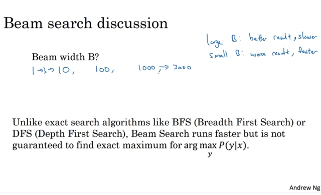</kbd>

     

### Error Analysis In Beam Search

 

- Main ideas:  1 \\*Error analysis\\* and \\*beam search\\* are two important concepts in machine translation.  2 Beam search is an approximate search algorithm that\\* doesn't always output the most likely sentence\\*.  3 It's important to figure out whether it is the \\*beam search algorithm\\* or the \\*RNN model\\* that is causing translation errors.  4 Computing \\*P(y* given x)\\* and \\*P(y-hat given x)\\* using the RNN model can help to determine which component is more to blame for translation errors.  5 If P(y* given x) is greater than P(y-hat given x), then beam search is at fault.  6 If P(y* given x) is less than or equal to P(y-hat given x), then the RNN model is more to blame for translation errors.
   

    
    
<kbd>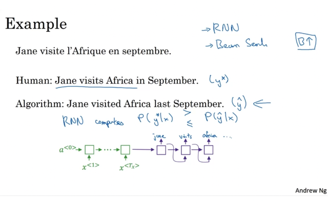</kbd>

> [!NOTE]
> Chưa hiểu tính P(y*|x) và P(y^|x) là sao
> như thế nào chỉ tạm thời hiểu:
> **P(y*|x)** là **true** probability distribution
> còn **P(y^|x)** là '**predicted**' probability distribution

     

    
    
<kbd>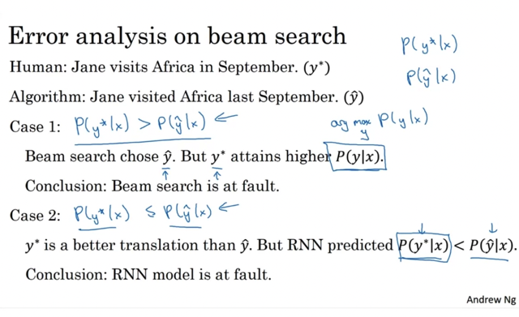</kbd>

> [!NOTE]
> Nói chung là so sánh hai cái đó từ đó kết luận phải
> focus improve cái RNN hay Beam search

     

    
    
<kbd>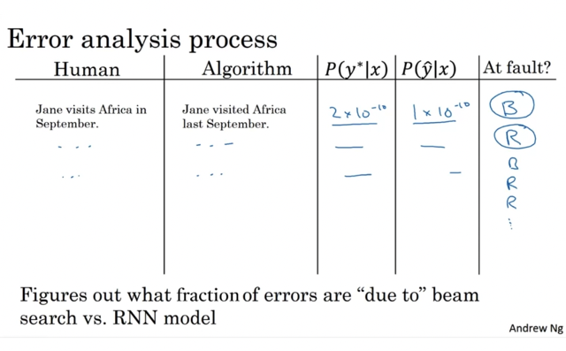</kbd>

> [!NOTE]
> Đại khái là xem tỉ lệ
> thằng nào nhiều

     

### Bleu Score - Bilingual Evaluation

 

- 1 Machine translation faces a challenge where there can be multiple equally good translations of the same sentence.  2 \\*BLEU score\\* is used to \\*evaluate the quality of machine translations\\* by \\*comparing them with human-generated translations\\*.  3 BLEU score is an \\*understudy for human evaluators\\* and measures how good the machine translation is by looking at the types of words it generates.  4 \\*Precision\\* \\*measures\\* are used in BLEU score, where words are given credit only up to the maximum number of times they appear in the reference sentences.  5 The \\*modified precision measure\\* in BLEU score gives a score by clipping the count of the number of times a word appears in reference sentences.  6 The BLEU score takes into account unigrams, bigrams, and longer sequences of words to define the score.
   

    
    
<kbd>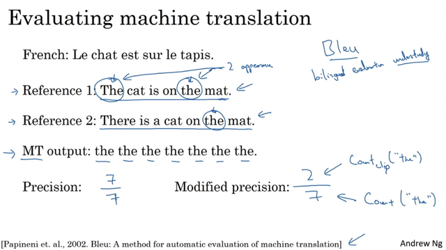</kbd>

> [!NOTE]
> Vấn đề là làm sao để **measure accuracy** đối với nhiều answer đều good như
> nhau
>
> Có nói đến khái niệm **understudy** đại khái là một trợ thủ có thể học theo vai
> trò của một senior để khi cần có thể thay thế senior đó. Thì BLEU score có
> thể như understudy của 1 người ngồi check độ chính xác của kết quả dịch từ
> Machine Translation so với câu reference
>
> Có nói đến câu references được provide trong **dev set** hay**test set**

     

    
    
<kbd>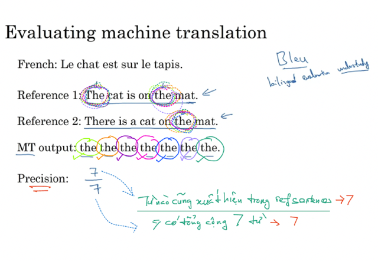</kbd>

> [!NOTE]
> Đại khái là đầu tiên dùng chỉ số ' Precision' đại khái là đếm xem tỉ
> lệ những từ trong câu prediction có xuất hiện trong câu chuẩn
>
> Ví dụ như prediction ra có 7 từ, thì 7 từ đều xuất hiện trong câu
> chuẩn -> tỉ lệ precision là 6/7 
>
> Đại khái là tính kiểu này không ổn, vì nếu nó ra 1 câu tào lao như 
> 'the the ....' thì chỉ số nó vẫn rất cao 7/7.
>
> Nên phải có 1 cách tính khác gọi là chỉ số **modified** **precision**

     

    
    
<kbd>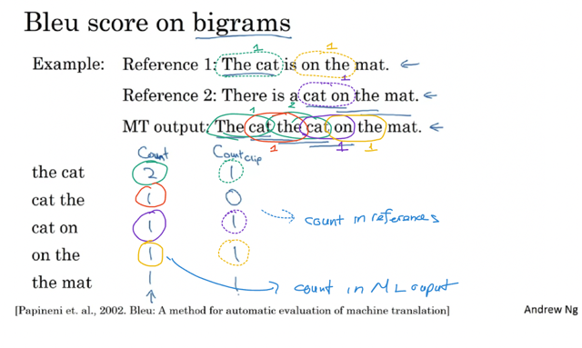</kbd>

> [!NOTE]
> Trong chỉ số Modified precision thì chỉ tính tử số là max
> lần xuất hiện của 1 từ trong câu chuẩn, mẫu số là số lần
> xuất hiện trong câu prediction
>
> Chú ý chỉ lấy chỉ số max lần xuất hiện của từ trong
> reference, ví dụ chữ có 2 chữ dog trong câu ref 1 và 3
> chữ dog trong câu ref 2 thì sẽ tính là 3

     

    
    
<kbd>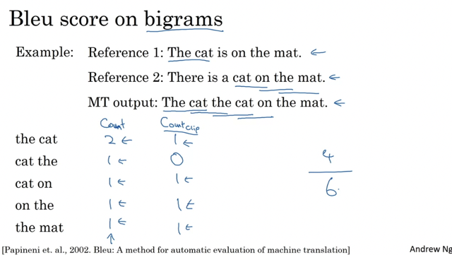</kbd>

> [!NOTE]
> "This allows you to **measure the degree** to which the machine
> translation output is **similar** or maybe **overlaps** with the references."

     

    
    
<kbd>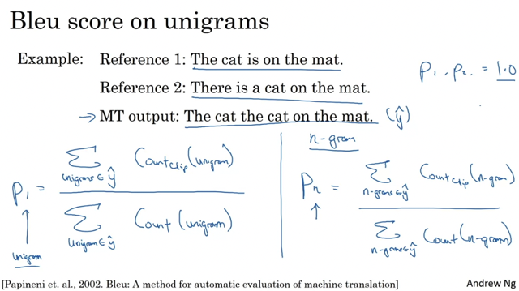</kbd>

> [!NOTE]
> Khái quát hoá: Đại khái là tỉ lệ tổng xuất hiện (của từ / cụm từ - uni/n-gram)
> trong references (chỉ tính max) đối với trong prediction
>
> Khi prediction giống y references thì p sẽ = 1

     

    
    
<kbd>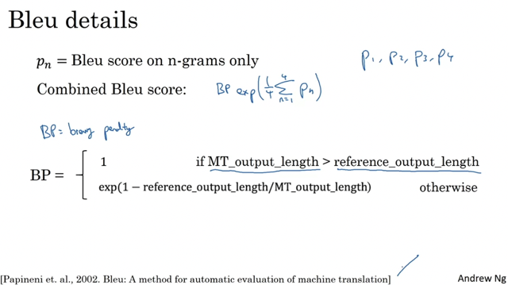</kbd>

> [!NOTE]
> Đại khái ta chỉ cần tính Pn (để có 1 chỉ số duy nhất cho việc evaluation, chứ không
> phải so đo nhiều chỉ số P1, P2...), và chỉ số này bằng e luỹ thừa của trung bình
> cộng của tất cả chỉ số P1,P2...nhân với 1 tham số BP
>
> **BP** - **Brevity Penalty** - chỉ cần hiểu đại khái là nó sẽ ngăn việc hệ thống thiên vị cho
> câu ngắn

     

    
    
<kbd>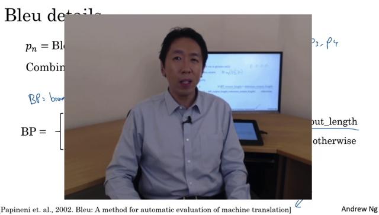</kbd>

> [!NOTE]
> Đại khái là BLEU score này cho một **single evaluation number** để mà
> check việc translation tốt cho vấn đề translation hay image captioning nơi
> mà có thể có nhiều answer chấp nhận được
>
> Có nói thêm là đối với speech recognition thì không vì kết quả phải đúng
> từng từ một)

     

### Attention Model Intuition

 

- Đại khái là: One of the \\*most influential ideas\\* in Deep Learning  Đại khái là \\*thay vì nhớ cả 1 câu dài rồi mới làm\\* (khiến hiểu quả giảm xuống \\*bleu score sẽ thấp dần khi câu càng dài\\*) thì nó sẽ \\*dịch từng phần\\* (giúp bleu score vẫn cao)  Có thêm \\*'tham số' alpha đánh giá mức độ cần tham gia của các từ lân cận / xung quanh trong việc dự đoán từ tiếp theo\\* s<3>  Tham số này sẽ phụ thuộc \\*hidden output\\* \\*a<t>\\* (ở đây là 2 chiều bi-directional network và k\\*ết quả của từ trước đó s<2>\\* )
   

    
    
<kbd>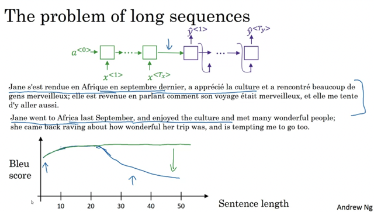</kbd>

> [!NOTE]
> One of the most influential ideas in Deep Learning
>
> Đại khái là thay vì nhớ cả 1 câu dài rồi mới làm (khiến hiểu quả giảm xuống
> bleu score sẽ thấp dần khi câu càng dài) thì nó sẽ dịch từng phần (giúp bleu
> score vẫn cao)

     

    
    
<kbd>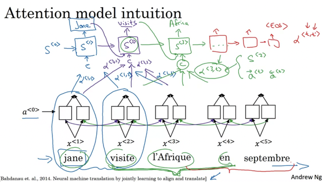</kbd>

> [!NOTE]
> Đại khái là:
>
> Có thêm **'tham số' alpha đánh giá mức độ cần tham gia của các từ lân
> cận / xung quanh trong việc dự đoán từ tiếp theo** s<3>
>
> Tham số này sẽ phụ thuộc **hidden output** **a<t>** (ở đây là 2 chiều
> bi-directional network và **kết quả của từ trước đó s<2>** )

     

### Clarifications

 

- At time 5:32, Andrew says "This network up here looks like a pretty standard RNN sequence with the context vectors as output". The correct wording should say that the context vectors are "inputs" to the post-attention RNN.
   

### Attention Model

 

- 1 Encoder-Decoder architecture is used for machine translation, where one RNN reads in a sentence and another one outputs a sentence.  2 The Attention Model is a \\*modification of the Encoder-Decoder \\*architecture that \\*works better for long sentences\\*.  3 The Attention Model works by \\*looking at parts of the input sentence at a time\\* instead of \\*memorizing the whole sentence\\*.  4 The performance of machine translation systems with the Attention Model is \\*better\\* than that of the Encoder-Decoder architecture for \\*long sentences\\*.  5 The Attention Model was proposed by Dimitri, Bahdanau, Camcrun Cho, and Y\\*oshua Bengio\\*, and it has been influential in many areas of deep learning.  6 The Attention Model uses \\*attention weights\\* to compute the \\*context\\* that the RNN unit should be paying attention to while generating the output sentence.
   

    
    
<kbd>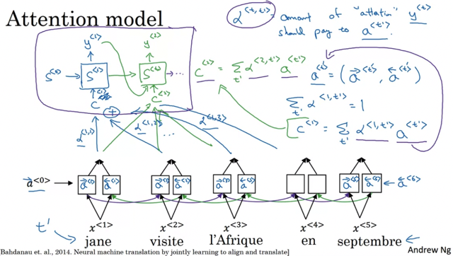</kbd>

> [!NOTE]
> t' chỉ là notation, coi nó như t thôi chẳng qua là dành cho input x
>
> Đặt a<t> là combine a<t> theo 2 chiều
>
> Tính vector "context" c<1>, c<2>.. thể hiện **cần "quan tâm" / "tính tới" nhiều
> hay ít các activation a<t> của các vị trí khác nhau**
>
> Tổng các alpha<1,t'> (t' = 1,2..T'x) bằng 1, ý nói chỉ số alpha là phần trăm, thể
> hiện cần quan tâm nhiều hay ít, rất dễ hiểu

     

    
    
<kbd>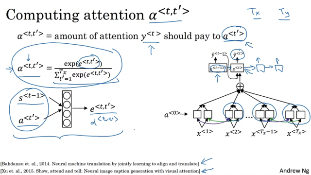</kbd>

> [!NOTE]
> Ta biết nó hệ số alpha - sẽ phụ thuộc vào hidden
> output của từ trước s<t-1> và a<t'> nhưng không biết chính xác quan hệ
> như thế nào nên ta dùng 1 N.N để Gradient Descent nó tự tìm.
>
> Nó sẽ actually work: Cái n,n bằng G.D tìm ra được e hợp lý để thể hiện
> mức độ ảnh hưởng cần thiết của s<t-1> và a<t'> đ.v việc dự đoán từ tiếp
> theo
>
> Còn hàm softmax tính alpha bằng e sẽ đảm bảo tổng alpha = 1

     

    
    
<kbd>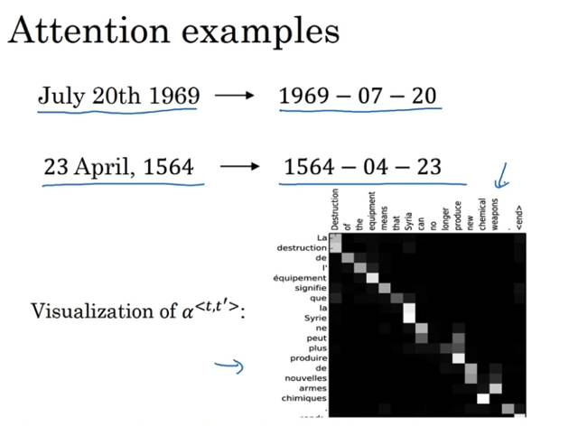</kbd>

> [!NOTE]
> Đại khái là trong Programming assignment sẽ làm cái này: Chuyển date
>
> Và 1 cái hay ho là plot để xem cái weight - đại khái như Xem thử model
> nó đánh giá mức độ ảnh hưởng của các từ lân cận lên 1 từ được dự
> đoán ra sao

     

## Speech Recognition - Audio Data

 

### Speech Recognition

 

- 1 Sequence-to-sequence models have led to significant improvements in speech recognition accuracy.  2 Speech recognition involves finding a text transcript from an audio clip.  3 \\*Spectrograms\\*, which represent the \\*intensity of different frequencies\\* at different times, are commonly used to preprocess audio data.  4 End-to-end deep learning has made \\*phoneme\\* representations unnecessary for speech recognition.  5 Larger datasets, transcribed audio datasets, and deep learning algorithms have driven progress in speech recognition.  6 The attention model and \\*CTC cost\\* are two methods used for speech recognition.  7 The\\* CTC cost\\* function allows the RNN to generate an output that \\*matches\\* the number of input time steps, even if the output has fewer characters.
   

    
    
<kbd>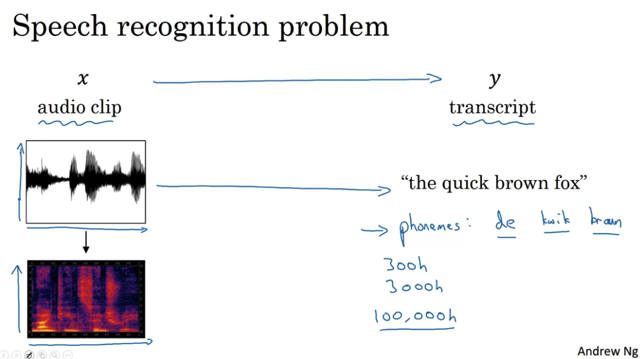</kbd>

> [!NOTE]
> Đại khái là hồi trước người ta thường kiểu như feature engineer: phiên âm
> ròi mới training để map từ raw data - phonemes, cũng hữu ích nhưng với
> data nhiều như bây giờ, người ta có thể train để map thẳng từ raw data
> sang transcript luôn.

     

    
    
<kbd>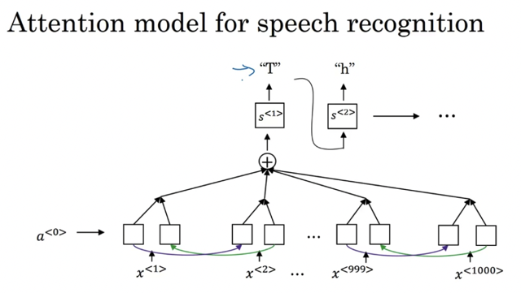</kbd>

> [!NOTE]
> 1 option để làm là Attention model

     

    
    
<kbd>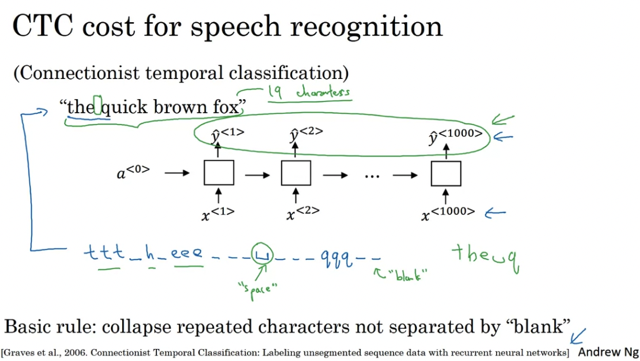</kbd>

> [!NOTE]
> Input thường lớn hơn nhiều output ví dụ 10 second, mỗi
> second có 100 hertz
>
> Vậy để 'làm' với một network như hình (Tx = Ty) thì CTC cho phép cho
> ra output kiểu như với nhiều kí tự lặp lại và 'blank' characters '
> _' như "ttt_h_eee_ _ _..."
>
> Và sau đó nó basic rule là : 'c**ollapse repeated characters not
> separated by "blank**".
>
> Ideas này được dùng để build effective Speech recognition
> system

     

### Trigger Word Detection

 

- Đại khái là đây là 1 cách làm ...có input x như vầy, feed into một RNN như vầy, giờ là \\*làm sao có target label\\*, thì đại khái là chỗ nào người ta vừa nói xong trigger word thì set label là 1, còn lại trước đó là 0. Đang nói đến việc build model và tạo training data.  Và có thể hack 1 chút để dễ training hơn bằng việc thêm nhiều số 1 (a fixed few number of 1) chứ không phải chỉ 1 số ngay tại lúc vừa nói xong trigger word
   

    
    
<kbd>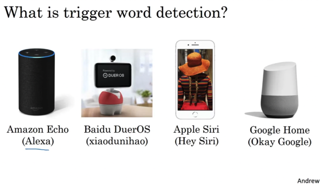</kbd>

> [!NOTE]
> Đại khái là có bạn ổng làm 1 trigger system để bật tắt đèn như 1 fun project

     

    
    
<kbd>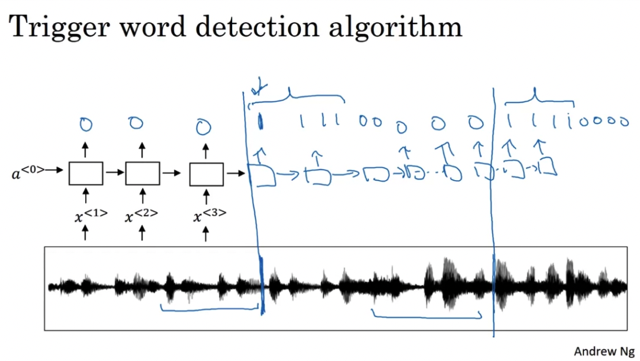</kbd>

> [!NOTE]
> Đại khái là đây là 1 cách làm ...có input x như vầy, feed into một RNN như
> vầy, giờ là **làm sao có target label**, thì đại khái là chỗ nào người ta vừa nói
> xong trigger word thì set label là 1, còn lại trước đó là 0. Đang nói đến việc
> build model và tạo training data.
>
> Và có thể hack 1 chút để dễ training hơn bằng việc **thêm nhiều số 1** (a fixed
> few number of 1) chứ không phải chỉ 1 số ngay tại lúc vừa nói xong trigger
> word

> [!NOTE]
> \/"But I think you should feel quite proud of
> yourself that you've learned enough about
> deep learning that it just takes one picture
> and one slide to describe something as
> complicated as trigger word detection."\/

     

## Quiz

 

<kbd></kbd>

 

<kbd>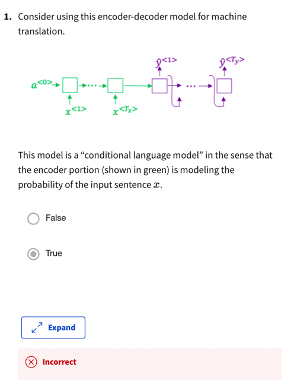</kbd>

> [!NOTE]
> Đáng lý phải là in the sentence that ouput must be good
> enough given the input x, not just a random sentence. ý
> là phải cho ra câu thích hợp với input, chứ không phải 1
> câu ngẫu nhiên nào đó

 

<kbd>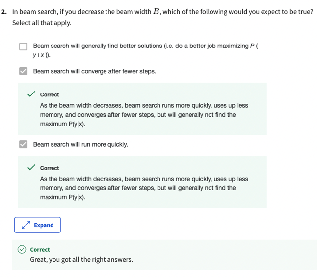</kbd>

 

<kbd>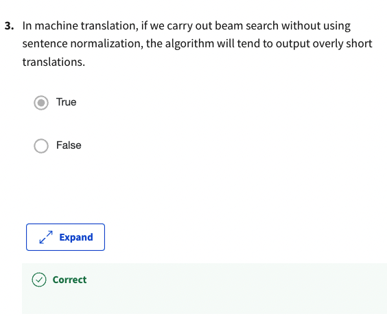</kbd>

 

<kbd>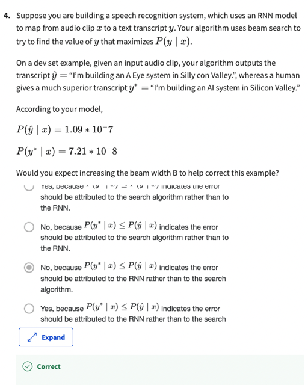</kbd>

 

<kbd>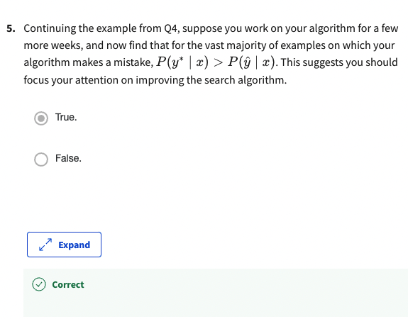</kbd>

 

<kbd>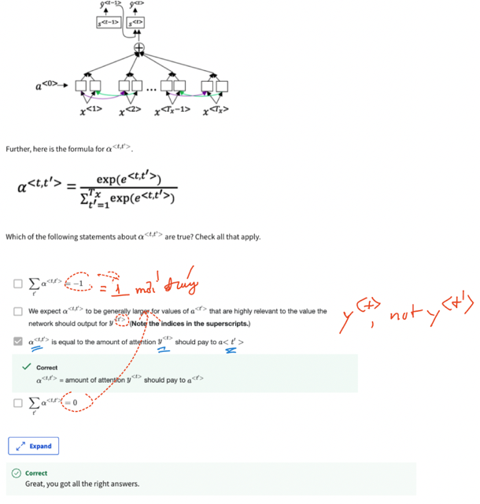</kbd>

 

<kbd>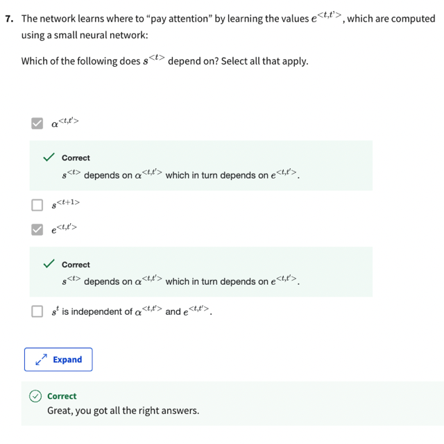</kbd>

 

<kbd>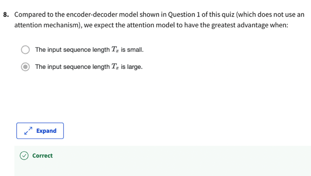</kbd>

 

<kbd>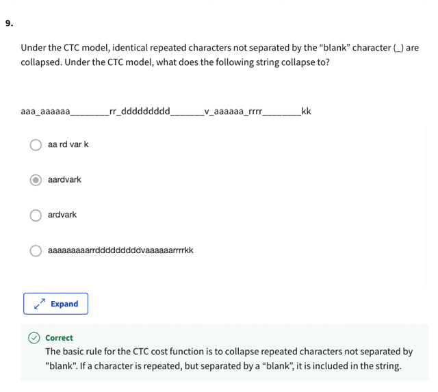</kbd>

 

<kbd>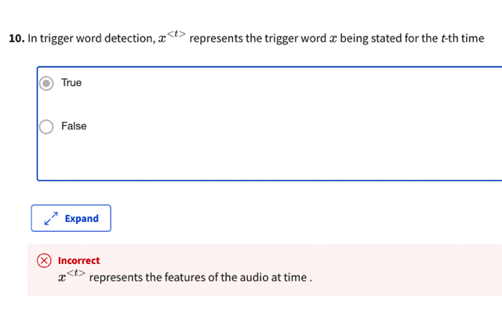</kbd>

> [!NOTE]
> Chưa hiểu chỗ này

> [!NOTE]
> In trigger word detection, x<t> typically represents the audio
> waveform or spectrogram of the audio signal in a specific
> time window or segment, rather than the trigger word being
> stated for the t-th time. The objective is to detect the
> presence of the trigger word or phrase in real-time audio
> streams, which can be achieved by training machine learning
> models to recognize the acoustic patterns associated with
> the trigger word.
>
> Trong việc phát hiện từ kích hoạt (trigger word detection), ký
> hiệu x<t> thường đại diện cho dải âm thanh hoặc phổ âm
> của tín hiệu âm thanh**trong một khung thời gian cụ thể**,
> thay vì từ kích hoạt được **nói ra lần thứ t**. Mục tiêu là phát
> hiện sự hiện diện của từ kích hoạt trong luồng âm thanh thời
> gian thực, đó là việc huấn luyện các mô hình máy học để
> nhận dạng các mẫu âm học liên quan đến từ kích hoạt.

 

## Programming Assignments

 

### Neural Machine Translation

> [!NOTE]
> Neural Machine Translation
>
> Welcome to your first programming assignment for this week!  •
> You will build a Neural Machine Translation (NMT) model to
> translate human-readable dates ("25th of June, 2009") into
> machine-readable dates ("2009-06-25").
>
> • You will do this using an attention model, one of the most
> sophisticated sequence-to-sequence models.
>
> This notebook was produced together with NVIDIA's Deep
> Learning Institute.

 

- Packages
   

    
    
<kbd>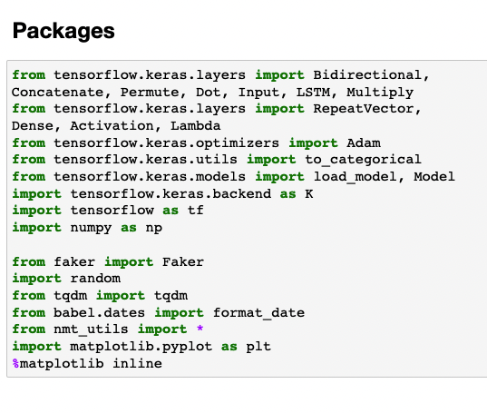</kbd>

     

- 1 - Translating Human Readable Dates Into Machine Readable Dates
   

    
    
<kbd>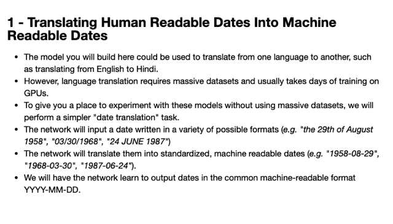</kbd>

     

- 1.1 - Dataset
   

    
    
<kbd>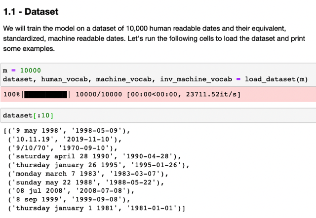</kbd>

     

    
    
<kbd>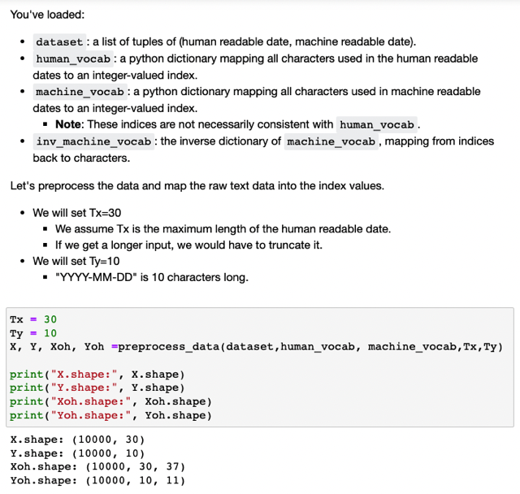</kbd>

     

    
    
<kbd>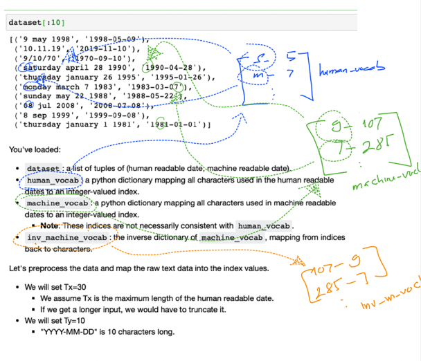</kbd>

     

    
    
<kbd>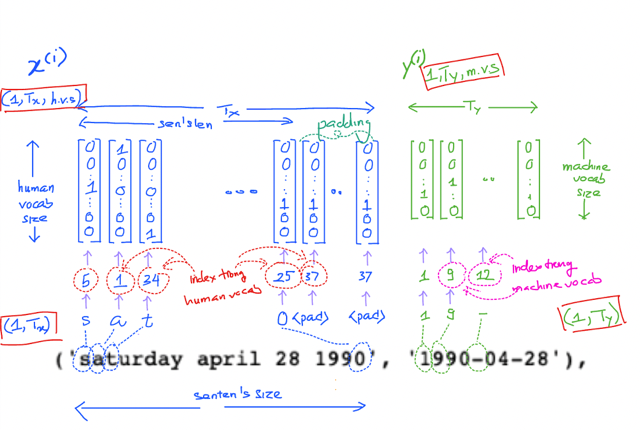</kbd>

     

    
    
<kbd>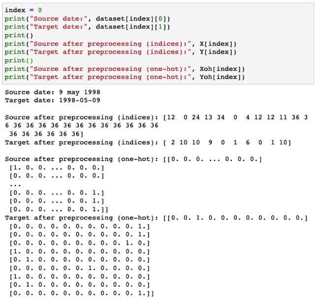</kbd>

     

- 2 - Neural Machine Translation with Attention
   

  
  - • If you had to translate a book's paragraph from French to English, you would not read the whole paragraph, then close the book and translate.  • Even during the translation process, you would read/re-read and focus on the parts of the French paragraph corresponding to the parts of the English you are writing down.  • The attention mechanism tells a Neural Machine Translation model where it should pay attention to at any step.
     

- 2.1 - Attention Mechanism
   

    
    
<kbd>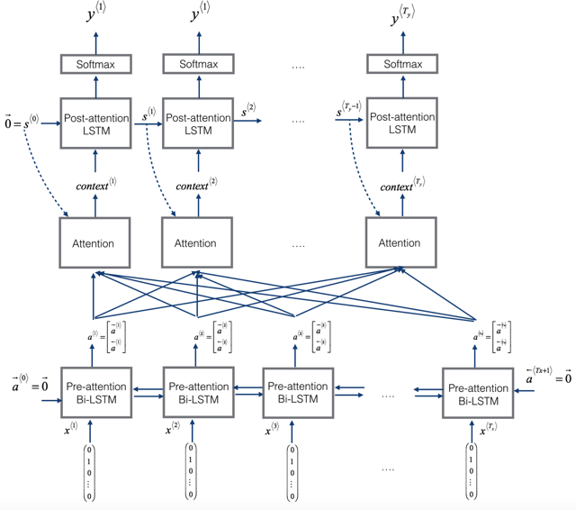</kbd>

     

    
    
<kbd>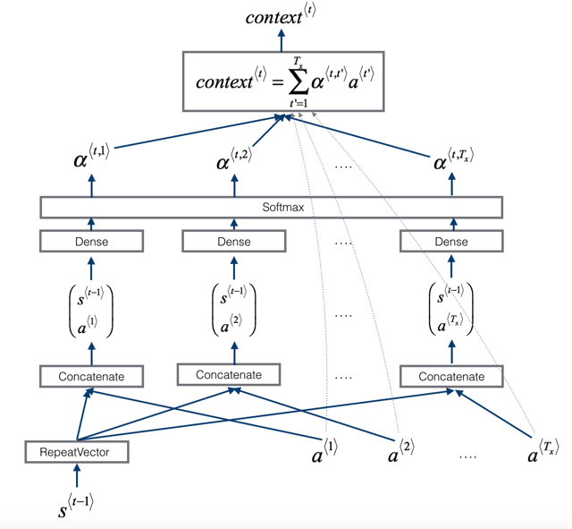</kbd>

     

    
    
<kbd>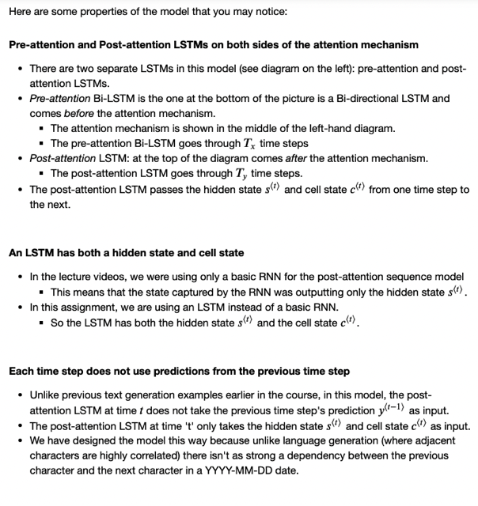</kbd>

     

    
    
<kbd></kbd>

     

    
    
<kbd></kbd>

     

- Exercise 1 - one_step_attention
   

    
    
<kbd></kbd>

     

    
    
<kbd></kbd>

> [!NOTE]
> s_prev (m,n_s) sau khi dc RepeatVector(Tx)(s_prev) sẽ có output là (m,Tx,n_s)

     

    
    
<kbd></kbd>

     

- Exercise 2 - modelf
   

    
    
<kbd></kbd>

     

    
    
<kbd></kbd>

     

    
    
<kbd></kbd>

     

    
    
<kbd></kbd>

    
<kbd></kbd>

    
<kbd></kbd>

     

    
    
<kbd></kbd>

     

    
    
<kbd></kbd>

     

- Exercise 3 - Compile the Model
   

    
    
<kbd></kbd>

     

    
    
<kbd></kbd>

     

    
    
<kbd></kbd>

     

    
    
<kbd></kbd>

     

- 3 - Visualizing Attention (Optional / Ungraded)
   

    
    
<kbd></kbd>

     

- 3.1 - Getting the Attention Weights From the Network
   

    
    
<kbd></kbd>

     

    
    
<kbd></kbd>

     

- \\*Congratulations! \\*You have come to the end of this assignment  \\*Here's what you should remember \\*  • Machine translation models can be used to map from one sequence to another. They are useful not just for translating human languages (like French->English) but also for tasks like date format translation.  • An attention mechanism allows a network to focus on the most relevant parts of the input when producing a specific part of the output.  • A network using an attention mechanism can translate from inputs of length 𝑇𝑥  to outputs of length 𝑇𝑦, where 𝑇𝑥 and 𝑇𝑦 can be different.  • You can visualize attention weights 𝛼⟨𝑡,𝑡′⟩ to see what the network is paying attention to while generating each output.  Congratulations on finishing this assignment! You are now able to implement an attention model and use it to learn complex mappings from one sequence to another.
   

## Programming Assignment

 

### Welcome to the second and last programming assignment of Week 3!

> [!NOTE]
> Welcome to the second and last programming assignment of Week 3!
>
> In this week's videos, you learned about applying deep learning to speech
> recognition. In this assignment, you will construct a speech dataset and
> implement an algorithm for trigger word detection (sometimes also called
> keyword detection, or wake word detection).
>
> Trigger word detection is the technology that allows devices like Amazon
> Alexa, Google Home, Apple Siri, and Baidu DuerOS to wake up upon
> hearing a certain word. For this exercise, our trigger word will be "activate".
> Every time it hears you say "activate", it will make a "chiming" sound. By
> the end of this assignment, you will be able to record a clip of yourself
> talking, and have the algorithm trigger a chime when it detects you saying "
> activate". After completing this assignment, perhaps you can also extend it
> to run on your laptop so that every time you say "activate" it starts up your
> favorite app, or turns on a network connected lamp in your house, or
> triggers some other event?
>
> In this assignment you will learn to:
>  • Structure a speech recognition project
>  • Synthesize and process audio recordings to create train/dev datasets
>  • Train a trigger word detection model and make predictions
>

<kbd></kbd>

 

- Packages
   

    
    
<kbd></kbd>

     

- 1 - Data synthesis: Creating a Speech Dataset
   

  
  - Let's start by building a dataset for your trigger word detection algorithm.  • A speech dataset should ideally be as close as possible to the application you will want to run it on.  • In this case, you'd like to detect the word "activate" in working environments (library, home, offices, open-spaces ...).  • Therefore, you need to create recordings with a mix of positive words ("activate") and negative words (random words other than activate) on different background sounds. Let's see how you can create such a dataset.
     

- 1.1 - Listening to the Data
   

  
  - • One of your friends is helping you out on this project, and they've gone to libraries, cafes, restaurants, homes and offices all around the region to record background noises, as well as snippets of audio of people saying positive/negative words. This dataset includes people speaking in a variety of accents.  • In the raw_data directory, you can find a subset of the raw audio files of the positive words, negative words, and background noise. You will use these audio files to synthesize a dataset to train the model.  ▪ The "activate" directory contains positive examples of people saying the word " activate".  ▪ The "negatives" directory contains negative examples of people saying random words other than "activate".  ▪ There is one word per audio recording.  ▪ The "backgrounds" directory contains 10 second clips of background noise in different environments.  Run the cells below to listen to some examples.
     

      
      
<kbd></kbd>

       

- 1.2 - From Audio Recordings to Spectrograms
   

    
    
<kbd></kbd>

> [!NOTE]
> Đại khái là data từ microphone sẽ cho ta 1 dãy các con số, 1 giây có 44.
> 000 số thể hiện sự thay đổi trong air pressure
>
> Đại khái là để dễ hơn cho training, ta tính ra 'spectrogram' của audio đại
> khái là nó cho biết những tần số khác nhau hiện diện trong audio gì đó
> dùng phép biến đổi Fourier với sliding window thầy bà gì nhà nó

     

    
    
<kbd></kbd>

> [!NOTE]
> Đại khái là xem thử 1 audio biến thành spectrogram như thế nào, ta
> hiểu đại khái là giúp nhìn được âm thanh, to nhỏ, cao thấp ra sao

     

    
    
<kbd></kbd>

> [!NOTE]
> Đại khái là màu xanh lá thể hiện tần số active cao hoặc xuất hiện nhiều (to),
> xanh dương là active thấp, cái cột cao hay thấp do hyperparams của software
> và chiều dài của input
>
> Số timestep là 5511 không biết sao nó lấy số này, nhưng tạm thời biết vậy Tx
> = 5511
>
> và thời gian tiêu chuẩn (không biết tiêu chuẩn cho cái gì) 
> sẽ là 10 giây

     

    
    
<kbd></kbd>

     

    
    
<kbd></kbd>

> [!NOTE]
> Đại khái hiểu các con số này được chọn như hyper.params trừ
> 441000. Tx = 5511, Ty = 1375
>
> Nói đến dùng python module pydub gì đó để synthesize data

     

- 1.3 - Generating a Single Training Example  Đại khái là tạo training data bằng cách 'ghép' đoạn audio background noise, tiếng 'activate' và những negative (từ không phải 'activate') và ghi lại kiểu như thời điểm tiếng activate được chèn để tạo label y (y sẽ là vector 1 chuỗi số 0, và 50 số 1 ở thời điểm kết thúc chữ activate)  Trước hết là chuẩn bị các helper function
   

    
    
<kbd></kbd>

> [!NOTE]
> Đại khái là tổng hợp (**synthesizing**) các âm thanh riêng lẻ ghi âm tiếng
> ' trigger word' = activate, negative word và background noise bằng
> **pydub**, mục đích là để dễ dàng hơn trong việc tạo label y - kiểu như
> nếu tự record 1 audio mà có noise, có trigger word ,,, thì **khó mà đánh
> dấu được trigger word nó ở vị trí nào**
>
> Đại khái là do pydub nó work theo kiểu từng 1 milliseconds nên dẫn đến
> mấy con số liên quan 10 second = 10.000 steps

     

    
    
<kbd></kbd>

     

    
    
<kbd></kbd>

     

    
    
<kbd></kbd>

     

    
    
<kbd></kbd>

     

    
    
<kbd></kbd>

     

    
    
<kbd></kbd>

> [!NOTE]
> Đại khái là nó tạo 1 cặp đầu đuôi nằm trong khoảng 0 - 10000 có độ dài
> bằng cái segment_ms đưa vào, ví dụ 500-550, 670-720 với segment_ms =
> 50 kiểu vậy

     

- Exercise 1 - is_overlapping  Đại khái là check xem đoạn này có chèn tiếng nào chưa (kiểu như tránh chèn chồng lấn các âm thanh ' activate' và các âm thanh không phải 'activate' khác
   

    
    
<kbd></kbd>

     

    
    
<kbd></kbd>

     

    
    
<kbd></kbd>

     

    
    
<kbd></kbd>

     

- Exercise 2 - insert_audio_clip  Đại khái là viết function nhận 1 background audio và 1 audio cần chèn để:  Chèn 1 âm thanh (có thể là ' activate' và không phải ' activate' chưa biết) vào audio background. Cách làm là lấy ngẫu nhiên 1 thời điểm trong độ dài của background sao cho nó chèn được âm thanh vừa (tính độ dài của cái cần chèn trước, rồi mới lấy điểm đầu cuối một cách ngẫu nhiên) dùng \\/\\*get_random_time_segment\\*\\/()  Phải check không chồng lấp với cái có sẵn (nếu có) bằng  function \\/\\*is_overlapping\\*\\/() và keep track những cái đã chèn bằng 1 list   Cuối cùng là dùng pydub để thực hiện việc chèn (tạo ra audio)
   

    
    
<kbd></kbd>

     

    
    
<kbd></kbd>

> [!NOTE]
> Đại khái là viết function nhận 1 background audio và 1 audio cần
> chèn để:
>
> Chèn 1 âm thanh (có thể là ' activate' và không phải ' activate'
> chưa biết) vào audio background. Cách làm là lấy ngẫu nhiên 1
> thời điểm trong độ dài của background sao cho nó chèn được
> âm thanh vừa (tính độ dài của cái cần chèn trước, rồi mới lấy
> điểm đầu cuối một cách ngẫu nhiên) dùng
> **get_random_time_segment**()
>
> Phải check không chồng lấp với cái có sẵn (nếu có) bằng
> function **is_overlapping**() và keep track những cái đã chèn bằng
> 1 list
>
> Cuối cùng là dùng pydub để thực hiện việc chèn (tạo ra audio)

     

- Exercise 3 - insert_ones  Đại khái là 'đánh số' 1 cho vị trí y<t+1> trở đi với 50 step tiếp theo nếu âm thanh 'activate' kết thúc ở y<t>  Chú ý ở chỗ function nhận segment_end_ms đại khái là vị trí trong 10000 milliseconds mà âm thanh kết thúc, nó phải tương ứng với 1 vị trí (time step) \\*<t>\\* trong Ty = 1375 để rồi mới set  y<t+1> -> y<t+50> = 1  Nên tìm t như chuyển đổi đơn vị vậy:  segment_end_y = int(segment_end_ms * Ty / 10000.0)
   

    
    
<kbd></kbd>

     

    
    
<kbd></kbd>

     

    
    
<kbd></kbd>

     

    
    
<kbd></kbd>

     

- Exercise 4 - create_training_example  Đại khái là function kết hợp những function trước lại để chọn (ngẫu nhiên) vị trí và chèn activate và non-activate audio vào background để là tạo training x và update label để tạo y.  x sẽ là spectrogram của cái clip hoàn chỉnh sau khi chèn Tx = (5511,101) tạo bằng Spectrogram  (Spectrogram biến raw audio 10 giây 441000 unit thành matrix x (5511x101))  y sẽ là vector Ty = 1375
   

    
    
<kbd></kbd>

    
<kbd></kbd>

    
<kbd></kbd>

     

    
    
<kbd></kbd>

     

- 1.4 - Full Training Set  Chạy code để tạo bộ dataset 32 cái
   

    
    
<kbd></kbd>

     

    
    
<kbd></kbd>

> [!NOTE]
> Đại khái ổng để sẵn code nếu sau này
> muốn save dataset into a file

     

- 1.5 - Development Set  Cái này đáng chú ý, đại khái là vì nguyên tắc 'cv set và test set phải cùng 1 distribution' - tức là cv và test set càng giống nhau càng tốt do đó vì test sẽ là audio thật (nơi mà ta sẽ nói ' activate' để ra lệnh cho wake up trigger  trong môi trường có âm thanh nhiễu thật. Nên cv set cũng phải thu trực tiếp từ âm thanh  real-life chứ không phải tạo bằng phương pháp như tạo training set.   Ở đây ổng record  25 cái clip như vậy
   

    
    
<kbd></kbd>

     

- 2 - The Model
   

    
    
<kbd></kbd>

     

- 2.1 - Build the Model
   

  
  - Our goal is to build a network that will ingest a spectrogram and output a signal when it detects the trigger word. This network will use 4 layers:  * A convolutional layer * Two GRU layers * A dense layer.
     

      
      
<kbd></kbd>

       

      
      
<kbd></kbd>

       

      
      
<kbd></kbd>

       

      
      
<kbd></kbd>

       

- Exercise 5 - modelf  Lần lượt define các layer như model structure  Cũng như các assignment dùng keras trước cảm thấy sao nó simple như vậy nhưng cứ theo hướng dẫn mà define từng layer với out cái sau là input cái trước thôi  Chỉ có cái mới là TimeDistributed() mà ổng nói mục đích là để  "parameters used for the dense layer are the same for every time step" Chưa hiểu lắm đọc thêm article này  https://machinelearningmastery. com/timedistributed-layer-for-long-short-term-memory-networks-in-python/
   

    
    
<kbd></kbd>

    
<kbd></kbd>

    
<kbd></kbd>

     

    
    
<kbd></kbd>

     

- 2.2 - Fit the Model  Đại khái là train cái model này mất khoảng mấy tiếng, nên ổng train rồi mình load lại thôi.  Nhận xét ổng để model trong file json ta ơi  Tiếp nữa ổng nói nếu không muốn nó fine-tune tiếp cái pretrained model thì phải Block các BatchNorm layer bằng cách  set layer.trainable bằng False.  Cuối cùng define Optimizer là Adam với beta 1, beta 2, lossFunction là 'cross_entropy' vì đây là predict ra 1 hay 0 (binary), metrics dùng 'accuracy'
   

    
    
<kbd></kbd>

     

    
    
<kbd></kbd>

     

- 2.3 - Test the Model  Đại khái là dùng đây là Skewed problem nên đáng lý phải dùng  metric khác như Precision/Recall hơn là 'accuracy' nhưng thôi tạm thời vậy
   

    
    
<kbd></kbd>

     

- 3 - Making Predictions  Đại khái là function này nó nhận file name rồi dùng Spectrogram code để biến thành sample data x rồi bỏ vào model.predict ra predictions đồng thời plot ra prediction
   

    
    
<kbd></kbd>

     

    
    
<kbd></kbd>

     

- 3.1 - Test on Dev Examples
   

    
    
<kbd></kbd>

     

    
    
<kbd></kbd>

     

- \\*Congratulations \\*You've come to the end of this assignment!  \\*Here's what you should remember: \\*  • Data synthesis is an effective way to create a large training set for speech problems, specifically trigger word detection.  • Using a spectrogram and optionally a 1D conv layer is a common pre-processing step prior to passing audio data to an RNN, GRU or LSTM.  • An end-to-end deep learning approach can be used to build a very effective trigger word detection system. \\/  Congratulations\\/ on finishing this assignment!
   

- 4 - Try Your Own Example! (OPTIONAL/UNGRADED)
   

