# W4_face Recognition & Neural Style Transfer

📊 **Progress:** `43` Notes | `111` Screenshots

---

1ST REVIEWED: LECTURE, CHƯA PA

**Learning Objectives**
 • Differentiate between face recognition and face verification
 • Implement one-shot learning to solve a face recognition problem
 • Apply the triplet loss function to learn a network's parameters in the context of face recognition
 • Explain how to pose face recognition as a binary classification problem
 • Map face images into 128-dimensional encodings using a pretrained model
 • Perform face verification and face recognition with these encodings
 • Implement the Neural Style Transfer algorithm
 • Generate novel artistic images using Neural Style Transfer
 • Define the style cost function for Neural Style Transfer
 • Define the content cost function for Neural Style Transfer

## Face Recognition

 

### What's Face

> [!NOTE]
> WHAT'S FACE
> RECOGNITION?

 

### One Shot Learning

 

- 1 Face recognition requires solving the one-shot learning problem  2 Deep learning algorithms historically struggle with one-shot learning  3 One approach to address one-shot learning is to input an image, feed it to a ConvNet, and output a label using a softmax unit with multiple outputs  4 Learning a similarity function, denoted d, is a more effective approach to one-shot learning for face recognition  5 The function d takes two images and outputs the degree of difference between them  6 During recognition time, if the degree of difference is less than a threshold, the two images are predicted to be the same person  7 Learning function d allows for adding new people to the database without needing to retrain the neural network  8 Training a neural network to learn function d is discussed in the next video.
   

    
    
<kbd>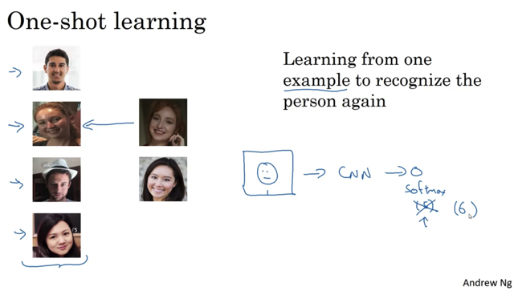</kbd>

    > Đại khái là vấn đề One-shot learning, vì
> không có nhiều data để train

     

    
    
<kbd>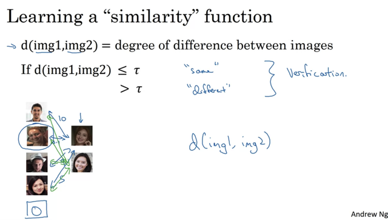</kbd>

    > Đại khái là learn được function d() tính được độ 'difference'
> giữa các images. Cùng 1 người thì ra số nhỏ

     

### Siamese Network

 

- 1 The function d compares two faces and determines their similarity or difference using a Siamese network.  2 A feature vector of 128 numbers is computed by a fully connected layer to encode an input image, which represents a good representation of the image.  3 A Siamese neural network architecture runs two identical convolutional neural networks on two different inputs and then compares them.  4 \\*The Siamese neural network is trained by learning parameters that result in a function d, which tells when two pictures are of the same person.\\*  5 The objective function to make a neural network learn to determine similarity or difference between two faces is defined using the triplet loss function.
   

    
    
<kbd>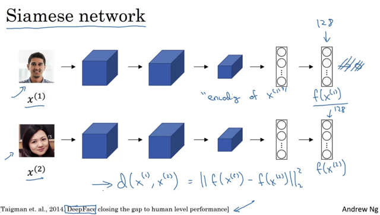</kbd>

     

    
    
<kbd>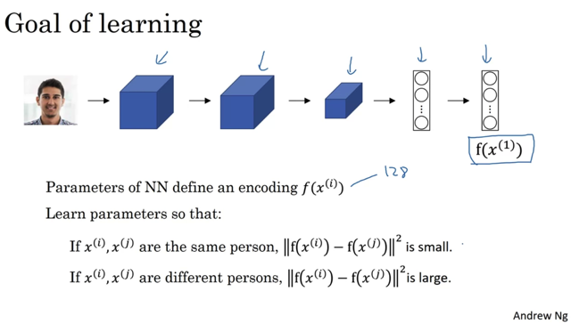</kbd>

    > Đại khái là **learn params của 1 NN sao cho** đưa hai image (x1), x(2)
> vào cho ra đầu ra f(x1), f(x2) sao cho: nếu cùng 1 người thì norm của
> hai vector nhỏ khác nhau thì norm lớn - Đó gọi là Siamese Network

     

### Triplet Loss

 

- 1 Gradient descent can be used to learn the parameters of a neural network to give a good encoding for pictures of faces.  2 The triplet loss function is used to compare pairs of images and ensure that similar images have similar encodings.  3 The triplet loss function involves looking at three images at a time: an anchor image, a positive image (of the same person as the anchor), and a negative image (of a different person).  4 The goal of the triplet loss function is to have the encoding of the anchor image and the positive image be closer together than the encoding of the anchor image and the negative image, with a margin parameter to prevent trivial solutions.  5 The triplet loss function is formalized as the max of the difference between the squared norm of the anchor-positive encoding and the squared norm of the anchor-negative encoding minus a margin parameter and zero.
   

    
    
<kbd>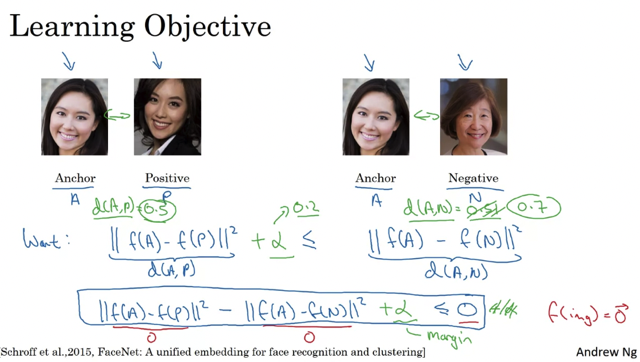</kbd>

    > Đại khái là ở đây ta định nghĩa một loss function để dùng trong
> công việc train siamese network. Bằng cách tạo ra một mệnh đề
> trong đó bắt buộc so sánh các cặp hình ảnh sao cho: **encoding
> của anchor image phải giống với encoding của positive image
> và khác với encoding của negative image.**
>
> Trong đó dùng một distance function tính bằng squared norm
> của cặp encoding của anchor - positive / anchor - negative.
>
> Và một tham số alpha để tránh máy tính nó cho kết quả zero.

     

    
    
<kbd>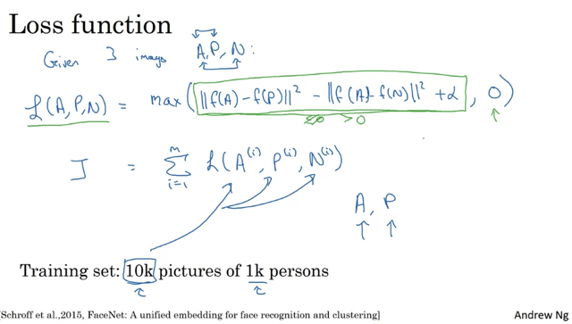</kbd>

    > Đại khái là dựa vào yêu cầu ta define một hàm loss như vầy,
> rồi cost function. Cách define vầy sẽ khiến muốn minimize loss
> thì hiệu số giữa encoding của A và encoding của P phải nhỏ
> hơn nhiều hiệu số giữa encoding của A và encoding của N
>
> Yêu cầu là training set phải có nhiều picture của 1 người để từ
> đó có các cặp A-P, A-N

     

    
    
<kbd>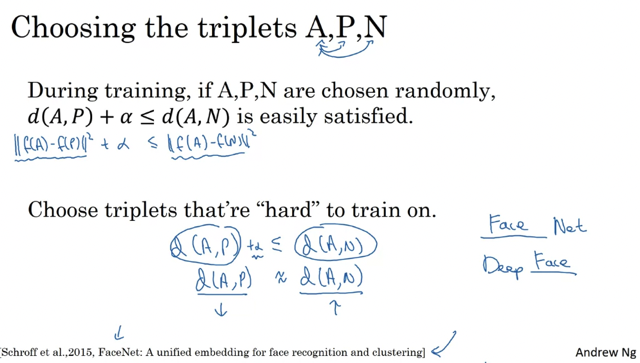</kbd>

    > Đại khái là phải choose triplets A,P,N sao cho làm
> cho việc training khó bởi vì nếu chọn ngẫu nhiên
> thì rất dễ để có cặp A-P khác xa A-N

     

    
    
<kbd>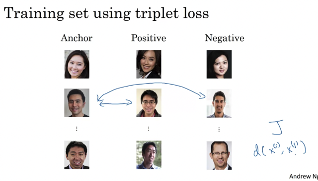</kbd>

    > Tóm lại đại khái là vầy:
>
> Chuẩn bị bộ data theo kiểu cặp 3 cái A-P-N Trong đó có
> A-P là của cùng 1 người,
>
> DÙng hàm Triplet Loss để Gradient Descent để train ra
> params sao cho decoding của hai người khác nhau sẽ
> lớn hơn nhiều decoding của 2 ảnh của cùng 1 người

     

    
    
<kbd>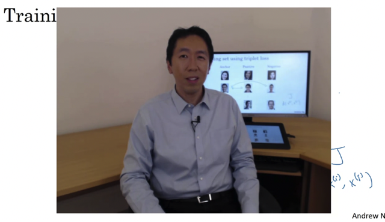</kbd>

    > Tóm lại đại khái là vầy:
>
> Đại khái là một số company có những bộ data rất lớn và khó mà
> tiếp cận được, nhưng một số publish model đã train đó mình có
> thể xài lại được (transfer learning)

     

### Clarification About

> [!NOTE]
> CLARIFICATION ABOUT
> UPCOMING FACE VERIFICATION...

 

### Face Verification And

> [!NOTE]
> FACE VERIFICATION AND
> BINARY CLASSIFICATION

 

- 1 Introduction to Face Recognition: There are different ways to learn parameters for face recognition systems, including the Triplet Loss and a straight binary classification approach.  2 Straight Binary Classification for Face Recognition: Face recognition can be posed as a binary classification problem by using a Siamese Network to compute embeddings and inputting them into a logistic regression unit to predict whether the two images are of the same person or not.  3 Computing the Logistic Regression Unit: The logistic regression unit \\*takes the differences between the encodings as features\\* and \\*trains appropriate weights on these features to predict whether the two images are of the same person or not.\\*  4 Variations on Computing the Formula: There are different variations on computing the formula for the logistic regression unit, including the \\*chi-square similarity formula\\*.  5 Training the Siamese Network: The Siamese Network is trained using pairs of similar and dissimilar images to learn to predict whether the two images are of the same person or not.  6 Pre-Computing Encodings: Pre-computing encodings can save significant computation time and works for both the binary classification approach and the Triplet Loss approach.  7 Creating a Training Set: To train a face verification or recognition system, a training set of pairs of images with target labels of one for same persons and zero for different persons is created.  8 Conclusion: With the knowledge of these techniques, one can train a face verification or recognition system that can perform one-shot learning.
   

    
    
<kbd>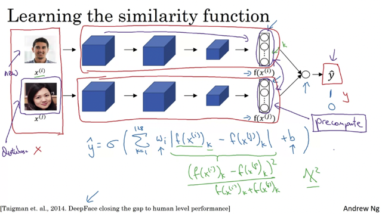</kbd>

    > Đại khái là vầy: Thay vì dùng phương pháp Triplet loss, ta có
> thể dùng cách 'Binary Classification'.
>
> Đại loại ra ta lấy output của Siamese network bỏ vào logistic
> regression. L. G sẽ **đại khái là train input data mà feature là
> sự giống và khác nhau của encoding của 2 bức ảnh kết quả
> bởi Siamese network để rồi train được params sao cho cùng
> người thì ra y^ = 1, khác người thì y^ = 0.**Có một vài 'biến thể' trong cách define logistic regression như
> dùng  **Absolute** value hay **Squared** value. 
>
> Ký hiệu của term f(x(i)) - f(x(j)) gọi là χ - CHI

     

    
    
<kbd>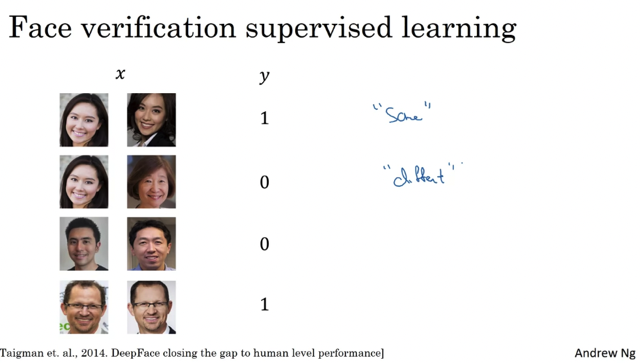</kbd>

    > Các bộ training data sample là các cặp hình, cùng 1 người
> thì y = 1, khác người thì y = 0.

     

## Neural Style Transfer

 

### What's Neural Style Transfer?

 

- Đại khái là một ứng dụng hay ho của ConvNet là cái này, apply style của 1 image cho 1 image khác.  Cần xem thử các feature learned bởi ConvNet tại các layers khác nhau trông như thế nào
   

    
    
<kbd>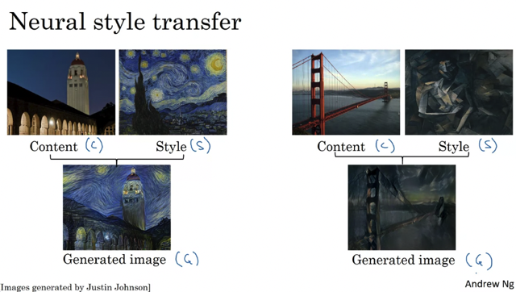</kbd>

    > Đại khái là một ứng dụng hay ho của ConvNet là cái này, apply
> style của 1 image cho 1 image khác.
>
> Cần xem thử các feature learned bởi ConvNet tại các layers khác
> nhau trông như thế nào

     

### What Are Deep Convnets Learning

 

- 1 The video aims to explain what the deeper layers of a ConvNet are really doing and provide visualizations that will help viewers understand the neural network's functioning better.  2 To visualize what hidden units in different layers are computing, one can find out the\\* images that maximize that unit's activation\\* by scanning through the training sets.  3 Hidden units in layer 1 usually detect relatively \\*simple features such as edges or shades of color.\\*  4 Hidden units in d\\*eeper layers\\* of the neural network see a \\*larger region of the image\\* and \\*detect more complex shapes and patterns\\*.  5 The features that second and third layers detect are \\*getting more complicated\\*.  6 The video cites a paper titled "\\*Visualizing and Understanding Convolutional Networks" by Matthew Zeiler and Rob Fergus\\* that offers more sophisticated ways of visualizing when the ConvNet is running.
   

    
    
<kbd>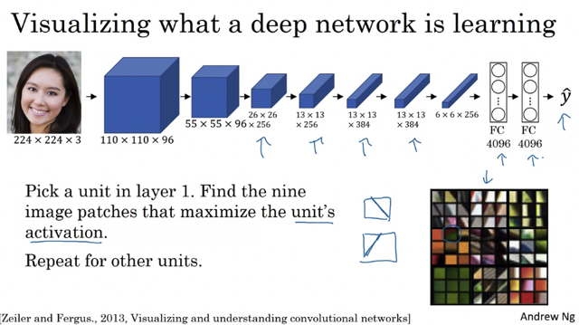</kbd>

    > Đại khái là trong layer 1
>
> Với mỗi hidden layer, tìm 9 cái hình mà có unit activation lớn nhất.
>
> Lần lượt vậy với các hidden layer khác.
>
> In ra để xem nó như thế nào thì thấy càng sâu thì nó học thêm các feature /
> pattern càng  phức tạp s

     

    
    
<kbd>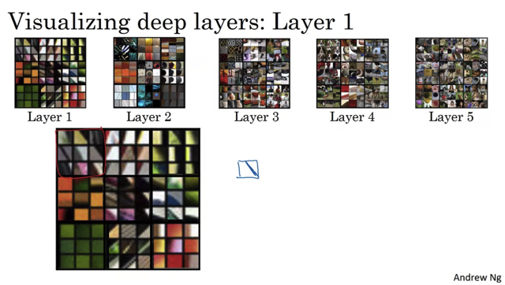</kbd>

     

    
    
<kbd>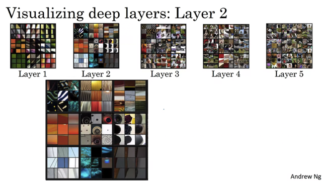</kbd>

     

    
    
<kbd>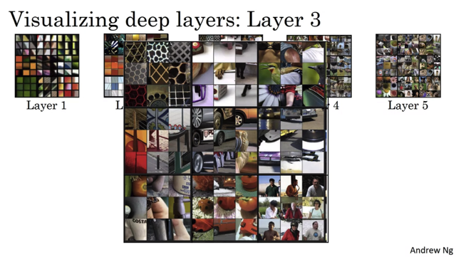</kbd>

     

    
    
<kbd>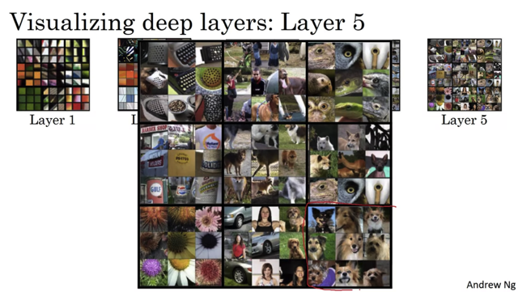</kbd>

     

    
    
<kbd>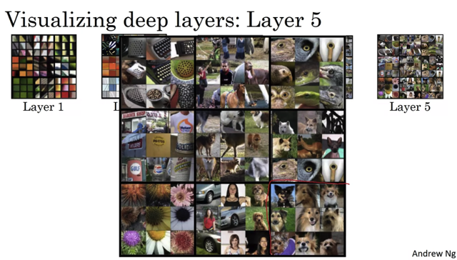</kbd>

     

### Cost Function

 

- Đại khái ý tưởng là define một hàm cost function sao cho bao gồm cost function:  đ/v Content -> Làm sao cho kết quả giống với hình gốc và  đ/v Style -> Làm sao cho kết quả giống với hình style  Và nếu minimize hàm cost function này thì kết quả sẽ vừa giống hình gốc và vừa giống hình style
   

    
    
<kbd>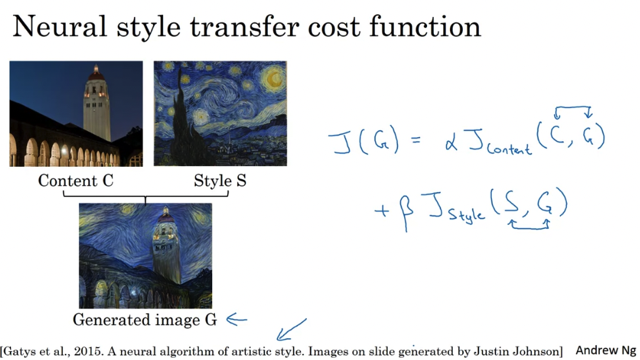</kbd>

    > Đại khái ý tưởng là define một hàm cost function sao cho bao gồm cost
> function:
>
> đ/v Content -> Làm sao cho kết quả giống với hình gốc
>
> đ/v Style -> Làm sao cho kết quả giống với hình style
>
> Và nếu minimize hàm cost function này thì kết quả sẽ vừa giống hình
> gốc và vừa giống hình style

     

    
    
<kbd>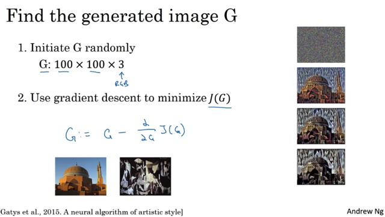</kbd>

     

### Content Cost Function

 

- 1 The neural style transfer algorithm has a cost function with a content cost component and a style cost component.  2 The content cost function measures the similarity of the hidden layer activations between a content image and a generated image.  3 A layer is chosen somewhere in between shallow and deep layers to compute the content cost.  4 A pre-trained ConvNet, such as a VGG network, can be used to measure the similarity between the activations of the content image and the generated image.  5 The content cost function is defined as the element-wise sum of squares of differences between the activations in layer l, between the images in C and G.  6 The content cost function incentivizes the algorithm to find an image G that has hidden layer activations similar to those of the content image.  7 The style cost function will be discussed next.
   

    
    
<kbd>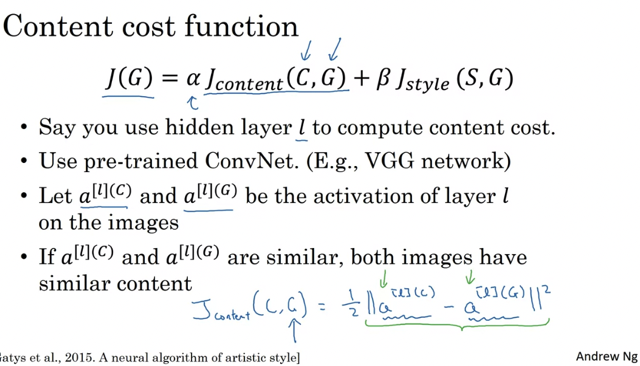</kbd>

    > \/Use hidden layer l to compute content cost: \/ Đại khái là nếu L nhỏ, kiểu
> như bắt buộc cái hình mới phải giống y chang cái hình gốc, còn nếu L lớn
> thì chỉ cần giống giống một cách chung chung thôi.
>
> Vì L nhỏ thì nó ở cấp shallow feature, nên giống ở cấp này tức là phải
> giống ở những nét những feature sơ cấp -> Nên phải giống y mới được
> còn L lớn thì nó ở deep feature nên giống ở cấp này tức là giống ở mức
> pattern - Không cần y chang.

    > *a[l](C) & a[l](G):
> Unrolled into vectors

    > Use pre-trained ConvNet: Đại khái là
> nên dùng pre-trained ConvNet để dùng
> cho step này

     

### Clarification ....

 

  
  
<kbd>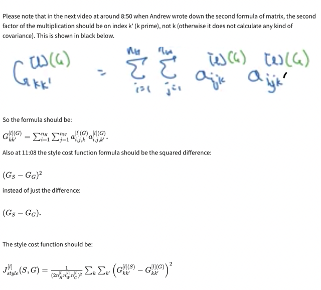</kbd>

   

### Style Cost Function

 

  
  
<kbd>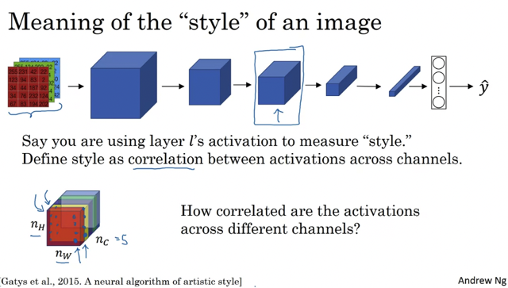</kbd>

  > Đầu tiên phải định nghĩa 'style' là sự
> correlation giữa các channels

   

  
  
<kbd>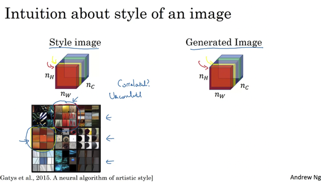</kbd>

  > Đại khái là dùng độ correlated giữa các layer để đánh giá xem
> style của generated image có giống style của style input image
> không
>
> Và độ correlated giữa các channel đại khái là ví dụ như là "nếu
> sọc dọc xuất hiện thì nó sẽ có xu hướng màu cam",..đại khái
> kiểu kiểu vậy sẽ "làm nên" / "tạo nên" style của image.

   

  
  
<kbd>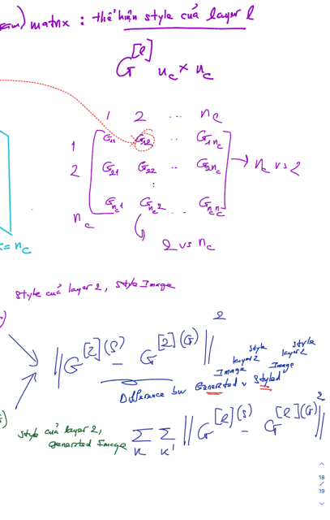</kbd>

  
<kbd>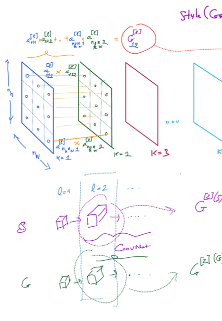</kbd>

  
<kbd></kbd>

  
<kbd></kbd>

  
<kbd>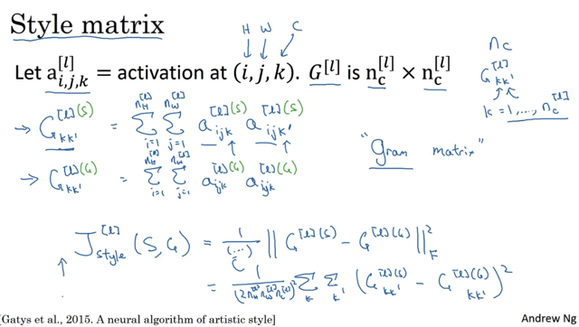</kbd>

  > Đại khái là define matrix 'Style' thể hiện style của 1 layer l còn gọi
> là Gram matrix.
>
> Và Từ đó define nên cost function đại khái à chêch lệch giữa style
> tại layer l của 2 bức hình - gốc và hình generated
>
> Có thể (/2nhnwnc) - normalization gì đó nhưng không quan trọng
> ổng nói vậy chưa hiểu lắm .

   

  
  
<kbd>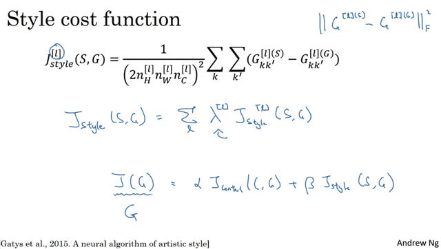</kbd>

  > Đại khái mở rộng ra define cost function thể hiện chênh lệch giữa
> style của các layer l = 1 - L của hai bức hình style gốc và
> generated image;
>
> \/**Thì nếu train dc bức hình generate sao cho minimize hàm J
> này thì bức hình đó sẽ có style gần giống với bức hình gốc nhất.
>
> \/Và kết hợp với Jcontent nữa thì minimize J sẽ ra bức hình có
> content giống content của bức hình content còn style thì giống
> style của bức Styled image.**

   

### 1d & 3d Generalizations

 

  
  
<kbd>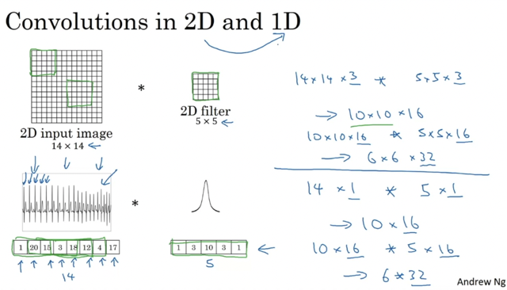</kbd>

  > Chắc không có gì khó hiểu chỉ có ghi chú cho nhớ lại:
>
> Filter dimension không ghi thì cũng phải hiểu là có cùng số
> dimension với input 14x14x3 thì filter cũng 5x5x3 (3 dimension)
>
> và có 16 cái filter thì out sẽ là 10x10x16

   

  
  
<kbd>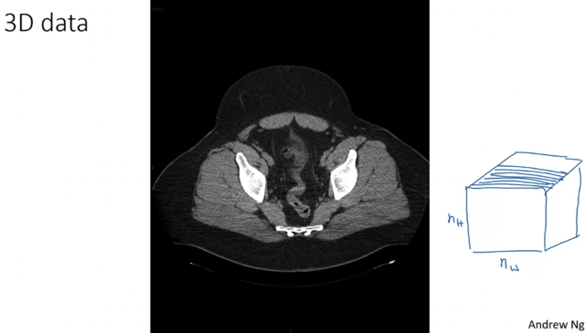</kbd>

   

  
  
<kbd>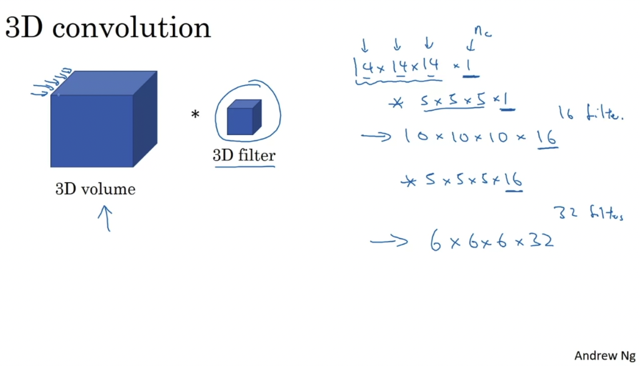</kbd>

   

### Quiz

 

  
  
<kbd></kbd>

   

  
  
<kbd>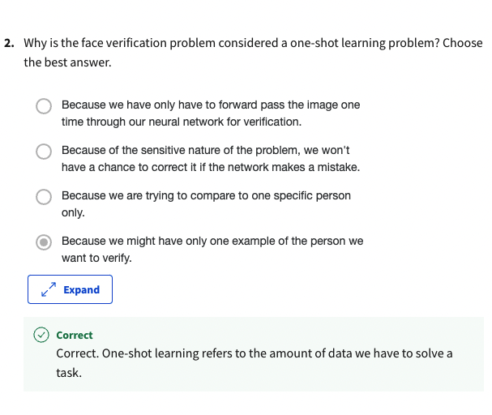</kbd>

  > Correct. One-shot learning
> **refers to the amount of data we
> have** to solve a task.

   

  
  
<kbd>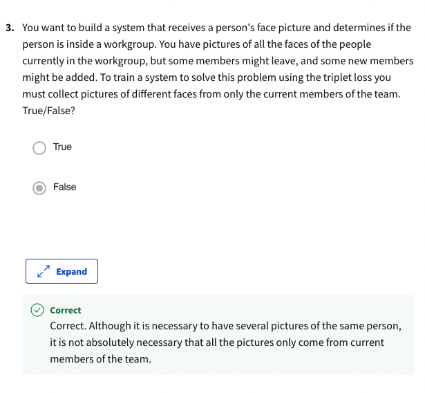</kbd>

  > Correct. Although it is **necessary to have several
> pictures of the same person**, it is **not absolutely
> necessary that all the pictures only come from
> current members of the team**.

   

  
  
<kbd>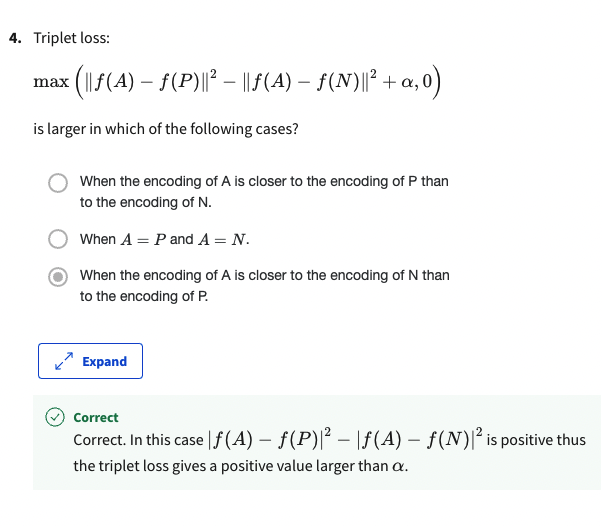</kbd>

   

  
  
<kbd>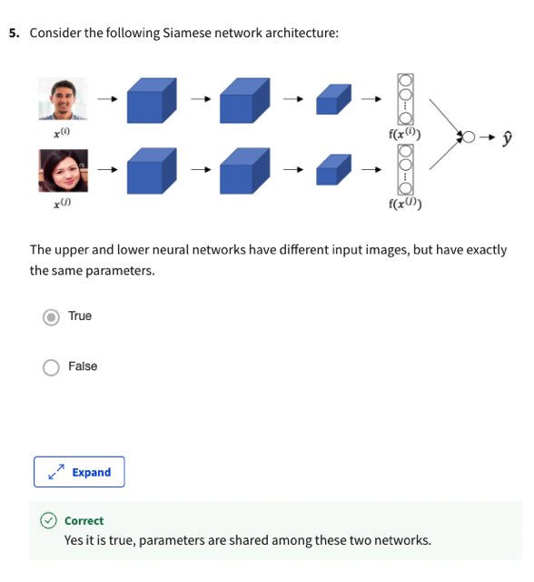</kbd>

   

  
  
<kbd>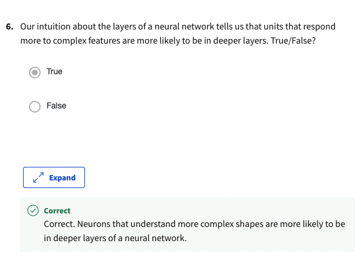</kbd>

   

  
  
<kbd>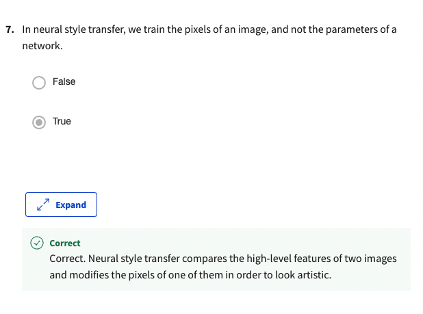</kbd>

   

  
  
<kbd>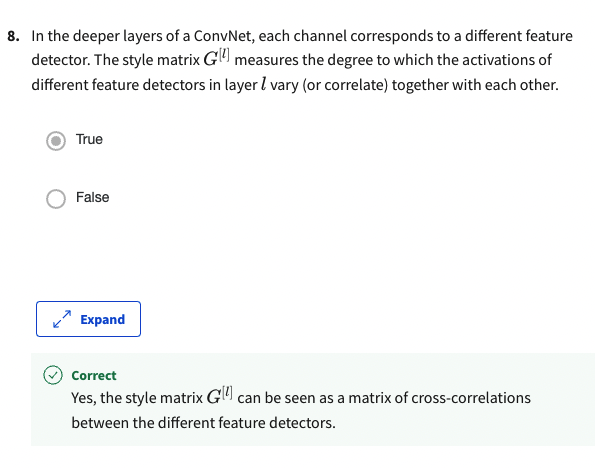</kbd>

   

  
  
<kbd>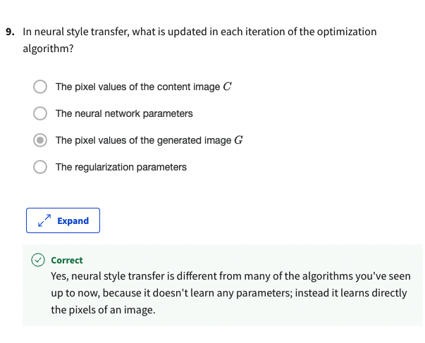</kbd>

   

  
  
<kbd>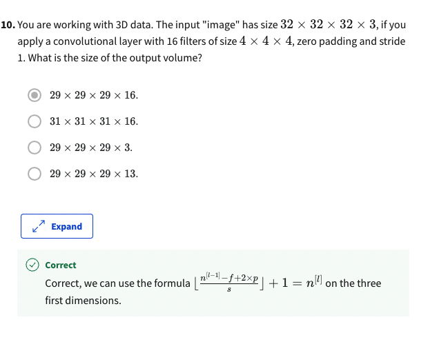</kbd>

   

### Programming Assignment: Face Recognition

 

- Welcome to the first (required) programming exercise of the final week of Course 4 in the Deep Learning Specialization. In this notebook you will build a face recognition system...one much better than the one shown in the cartoon below! :)  By the end of this assignment, you'll be able to:  • Differentiate between face recognition and face verification  • Implement one-shot learning to solve a face recognition problem  • Apply the triplet loss function to learn a network's parameters in the context of face recognition  • Explain how to pose face recognition as a binary classification problem  • Map face images into 128-dimensional encodings using a pretrained model  • Perform face verification and face recognition with these encodings 
  
<kbd>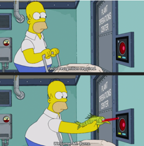</kbd>

  > Đại khái là ..

   

  
  - Face Recognition
     

      
      
<kbd>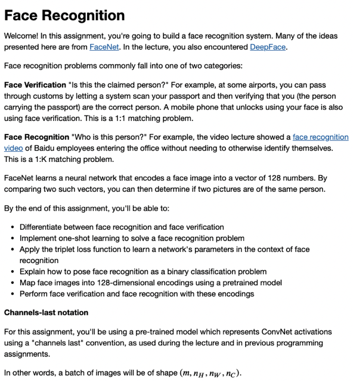</kbd>

       

  
  - 1 - Packages
     

      
      
<kbd>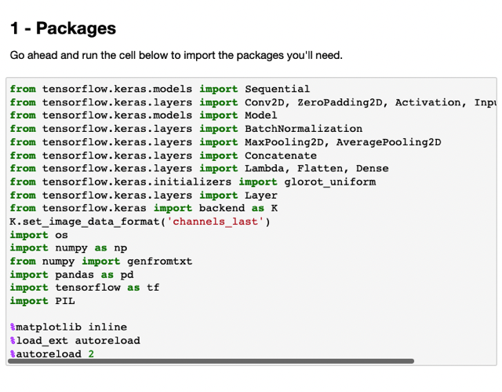</kbd>

       

  
  - 2 - Naive Face Verification:  Đại khái là có thể so sánh độ giống của 2 bức hình (để xác định cùng 1 người theo kiểu pixel to pixel, nhưng rõ ràng sẽ rất kém vì so sánh kiểu đó không ổn, pixel nó thay đổi rất nhiều do độ sáng, góc chụp...) nên thay vì vậy phải tạo ra một hàm để encode và so sánh 2 cái encoding này
     

      
      
<kbd>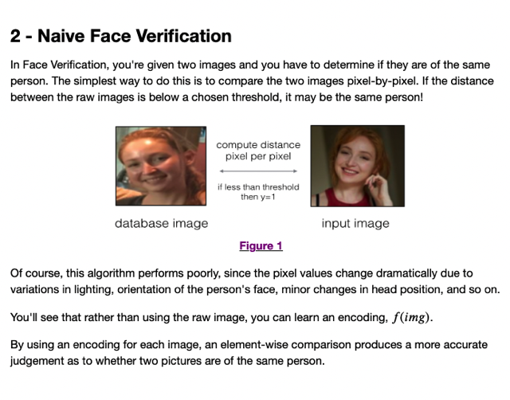</kbd>

      > Đại khái là có thể so sánh độ giống của 2 bức hình (để
> xác định cùng 1 người theo kiểu pixel to pixel, nhưng rõ
> ràng sẽ rất kém vì so sánh kiểu đó không ổn, pixel nó thay đổi rất
> nhiều do độ sáng, góc chụp...) nên thay vì vậy
> phải tạo ra một hàm để encode và so sánh 2 cái encoding này

       

  
  - 3 - Encoding Face Images into a 128-Dimensional Vector
     

  
  - 3.1 - Using a ConvNet to Compute Encodings  Đại khái là cái cần làm là Train một cái NN để encode input  images sao cho: - Cùng một người thì distance (giữa 2 encoding) thấp - Hai người khác nhau thì distance cao.  Mà để train cái NN này thì cần nhiều data và tốn nhiều thời gian cho nên theo lẽ thường của Deep Learning là ta sẽ tìm một cái model đã pretrain để xài (train lại hoặc dùng như khởi đầu)  Và ổng đã tìm sẵn cho mình xài: \\*keras-facenet-h5/model. json\\* và cái Network Implementation dùng để train ra cái model ở trên là làm theo Inception model của ông Szegedy et al, xem trong file\\* inception_blocks_v2.py  \\*Đại khái là xem thử model (pretrained) output, input sao mình sẽ dùng nó để 'tính' / encode ra encoding, để rồi từ đó tính ra distance của 2 encoding.  Nếu distance của encoding của 2 image cùng 1 người mà nhỏ và 2 người khác nhau mà lớn thì model đó good  Đại khái là triplet loss sẽ giúp train model (phải train tiếp dựa trên pretrain model) sao cho thoả mãn tính chất trên
     

      
      
<kbd>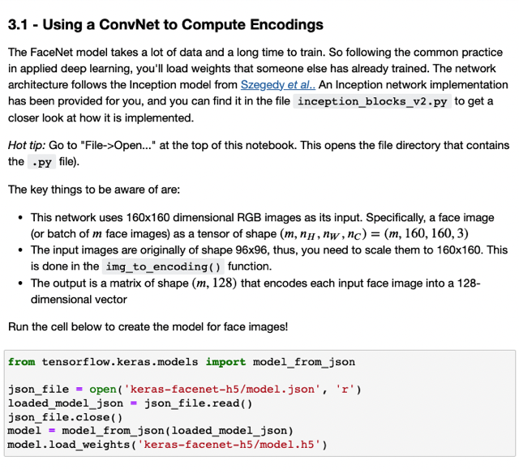</kbd>

      > Đại khái là cái cần làm là Train một cái NN để encode input 
> images sao cho:
> - Cùng một người thì distance (giữa 2 encoding) thấp
> - Hai người khác nhau thì distance cao.
>
> Mà để train cái NN này thì cần nhiều data và tốn nhiều thời gian
> cho nên theo lẽ thường của Deep Learning là ta sẽ tìm một cái
> model đã pretrain để xài (train lại hoặc dùng như khởi đầu)
>
> Và ổng đã tìm sẵn cho mình xài: **keras-facenet-h5/model. json**
> và cái Network Implementation dùng để train ra cái model ở trên
> là làm theo Inception model của ông Szegedy et al, xem trong
> file**inception_blocks_v2.py**

       

      
      
<kbd>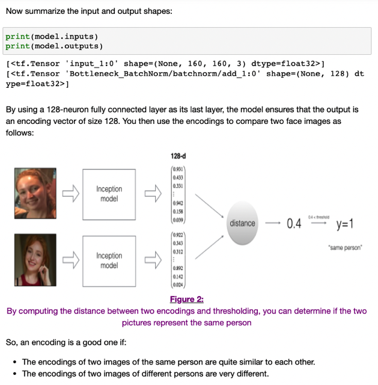</kbd>

      > Đại khái là xem thử model (pretrained) output, input sao
> mình sẽ dùng nó để 'tính' / encode ra encoding, để rồi từ đó
> tính ra distance của 2 encoding.
>
> Nếu distance của encoding của 2 image cùng 1 người mà nhỏ
> và 2 người khác nhau mà lớn thì model đó good

       

      
      
<kbd>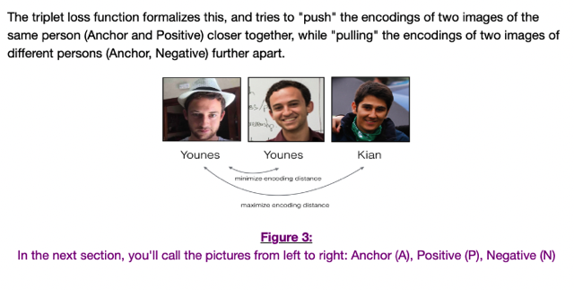</kbd>

      > Đại khái là triplet loss sẽ giúp train model  sao cho thoả mãn tính chất trên

       

  
  - 3.2 - The Triplet Loss  Đại khái là làm chơi cho biết chứ do dùng Pretrained model nên thực tế không cần làm
     

      
      
<kbd>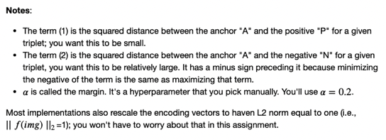</kbd>

      
<kbd></kbd>

      
<kbd>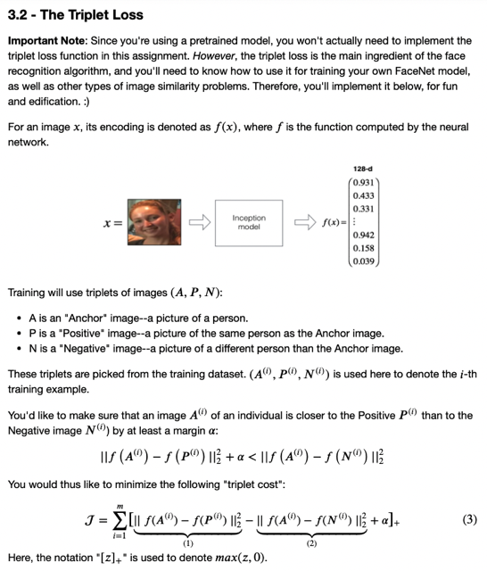</kbd>

      > Đại khái là làm chơi cho biết chứ do dùng
> Pretrained model nên thực tế không cần làm

       

  
  - Exercise 1 - triplet_loss
     

      
      
<kbd>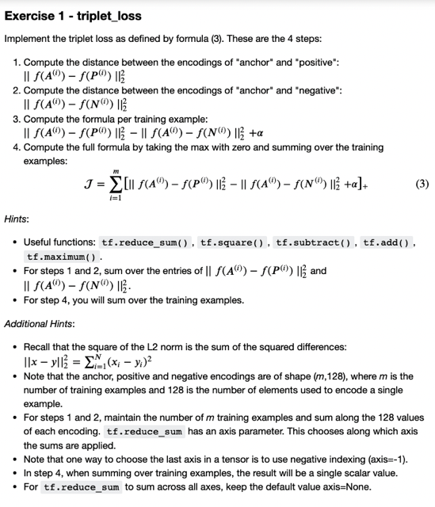</kbd>

       

      
      
<kbd>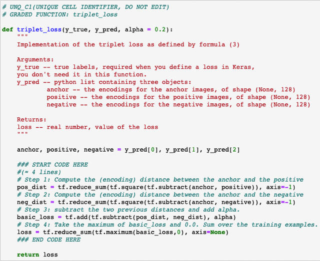</kbd>

       

      
      
<kbd>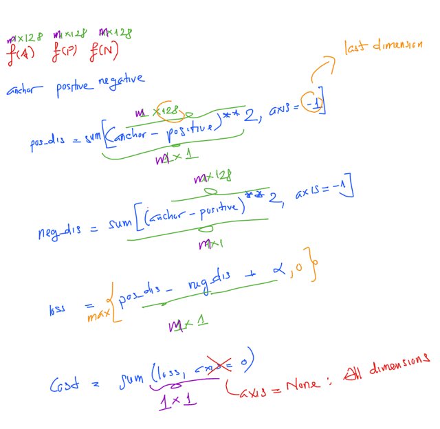</kbd>

       

      
      
<kbd>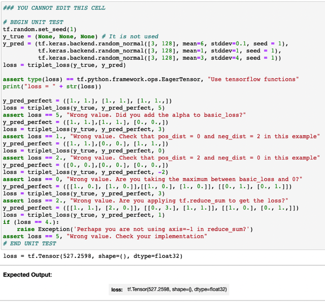</kbd>

       

  
  - 4 - Loading the Pre-trained Model  Đại khái là load cái model (pretrained) ra xài thôi
     

      
      
<kbd>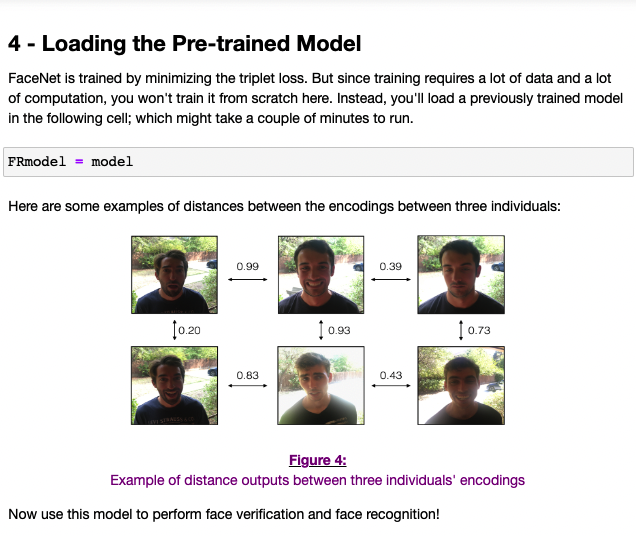</kbd>

      > Đại khái là load cái model (pretrained) ra xài thôi

       

  
  - 5 - Applying the Model
     

      
      
<kbd>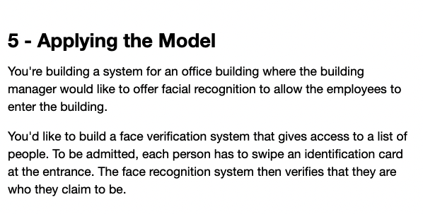</kbd>

       

  
  - 5.1 - Face Verification
     

      
      
<kbd>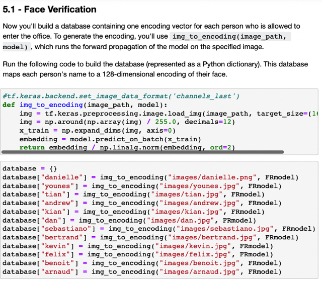</kbd>

      > Đại khái là dùng cái retrained model để tạo các 'encoding'
> của các nhân viên từ ảnh của họ. 
> Tên - encoding

       

      
      
<kbd>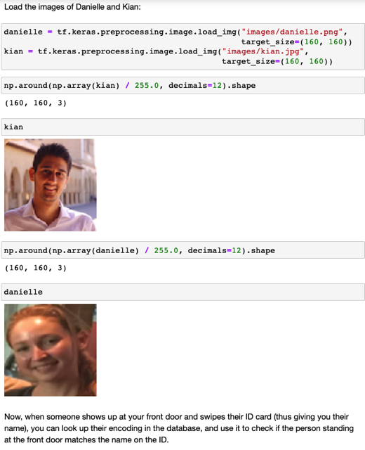</kbd>

       

  
  - Exercise 2 - verify  Đại khái là  Lấy cái hình (chụp từ camera) (từ image path) bỏ vào tính Encoding.  Có cái tên (identity) -> Lấy cái encoding từ database ra  Tính distance giữa 2 cái encoding này bằng function distance of a & b = \\*np.linalg.norm(a-b)\\*  So với threshold để decide
     

      
      
<kbd>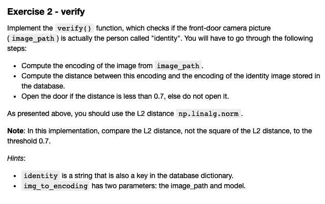</kbd>

       

      
      
<kbd>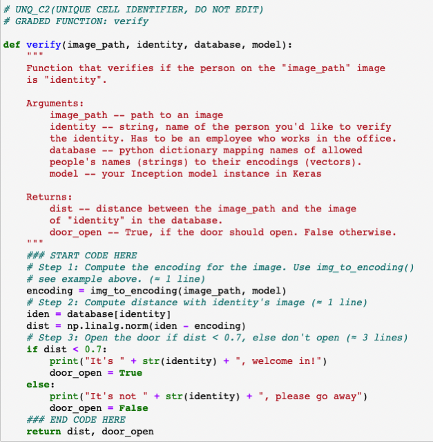</kbd>

      > Đại khái là
>
> Lấy cái hình (chụp từ camera) (từ image path) bỏ vào tính
> Encoding.
>
> Có cái tên (identity) -> Lấy cái encoding từ database ra
>
> Tính distance giữa 2 cái encoding này bằng function distance of a
> & b = **np.linalg.norm(a-b)**
>
> So với threshold để decide

       

      
      
<kbd>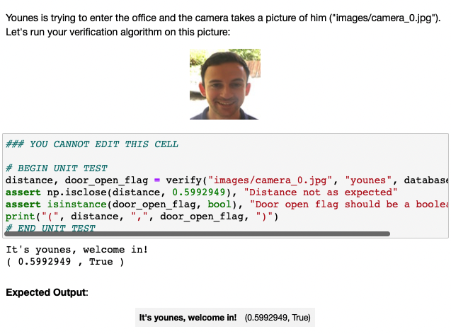</kbd>

       

      
      
<kbd>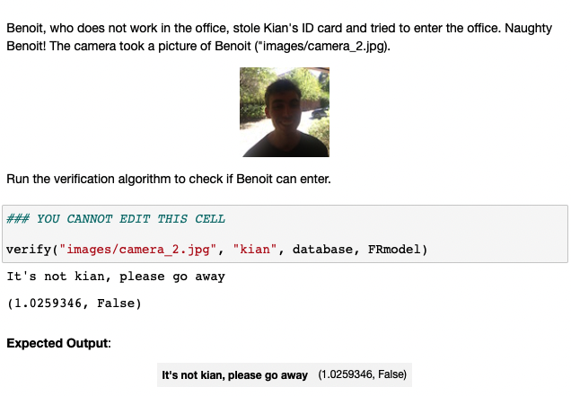</kbd>

       

  
  - 5.2 - Face Recognition  Đại khái là thay vì dùng cái identity (tên) để lấy ra encoding Trong database rồi so nó với encoding của bức hình chụp từ camera thì giờ ta sẽ cứ check hết distance của cam image's encoding với các encoding trong database. Cái nào nhỏ hơn threshold thì Suy ra là người đó, không có thì suy ra là người lạ.
     

      
      
<kbd>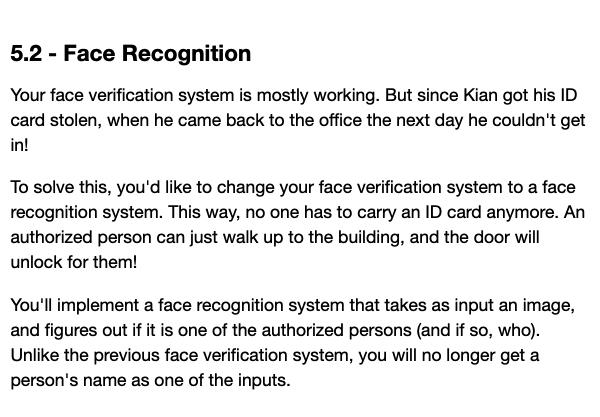</kbd>

      > Đại khái là thay vì dùng cái identity (tên) để lấy ra encoding
> Trong database rồi so nó với encoding của bức hình chụp từ
> camera thì giờ ta sẽ cứ check hết distance của cam image's encoding
> với các encoding trong database. Cái nào nhỏ hơn threshold thì
> Suy ra là người đó, không có thì suy ra là người lạ.

       

  
  - Exercise 3 - who_is_it
     

      
      
<kbd>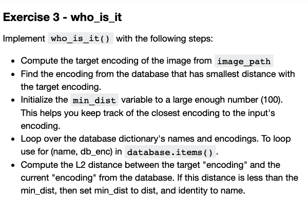</kbd>

       

      
      
<kbd>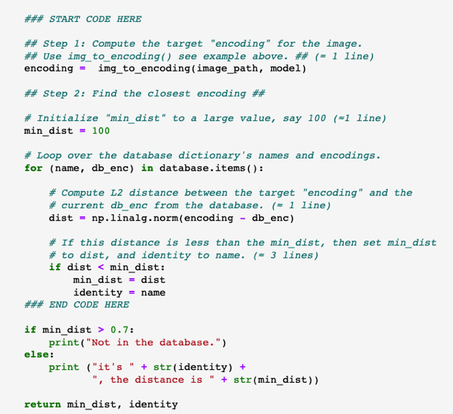</kbd>

      
<kbd></kbd>

      
<kbd>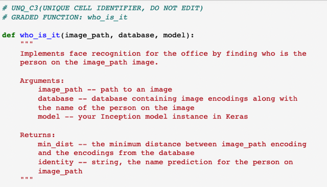</kbd>

       

      
      
<kbd>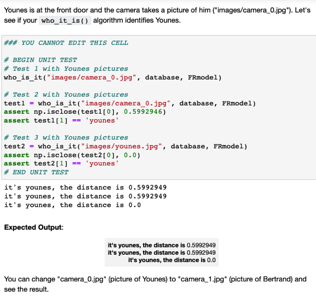</kbd>

       

  
  - \\*Congratulations\\*! You've completed this assignment, and your face recognition system is working well! It not only lets in authorized persons, but now people don't need to carry an ID card around anymore!  You've now seen how a state-of-the-art face recognition system works, and can describe the difference between face recognition and face verification. Here's a quick recap of what you' ve accomplished:  • Posed face recognition as a binary classification problem  • Implemented one-shot learning for a face recognition problem  • Applied the triplet loss function to learn a network's parameters in the context of face recognition  • Mapped face images into 128-dimensional encodings using a pretrained model  • Performed face verification and face recognition with these encodings Great work!  \\*What you should remember\\*:  • Face verification solves an easier 1:1 matching problem; face recognition addresses a harder 1:K matching problem.  • Triplet loss is an effective loss function for training a neural network to learn an encoding of a face image.  • The same encoding can be used for verification and recognition. Measuring distances between two images' encodings allows you to determine whether they are pictures of the same person.
     

    
    - Ways to improve your facial recognition model:  Although you won't implement these here, here are some ways to further improve the algorithm:  Put more images of each person (under different lighting conditions, taken on different days, etc.) into the database. Then, given a new image, compare the new face to multiple pictures of the person. This would increase accuracy.  Crop the images to contain just the face, and less of the "border" region around the face. This preprocessing removes some of the irrelevant pixels around the face, and also makes the algorithm more robust.
       

  
  - 6 - References \\* \\*  1 Florian Schroff, Dmitry Kalenichenko, James Philbin (2015). \\_FaceNet: A Unified Embedding for Face Recognition and Clustering  \\_  2 Yaniv Taigman, Ming Yang, Marc'Aurelio Ranzato, Lior Wolf (2014). \\_DeepFace: Closing the gap to human-level performance in face verification\\_  3 This implementation also took a lot of inspiration from the official FaceNet github repository: \\_https://github.com/davidsandberg/facenet\\_  4 Further inspiration was found here: \\_https://machinelearningmastery. com/how-to-develop-a-face-recognition-system-using-facenet-in-keras-and-an-svm-classifier/\\_  5 And here: \\_https://github.com/nyoki-mtl/keras-facenet/blob/master/notebook/tf_to_keras. ipynb\\_
     

### Programming Assignment: Art Generation with Neural Style Transfer

 

- Welcome to the final (required) programming exercise, of the final  week of Course 4 in the Deep Learning Specialization! In this notebook,  you'll use transfer learning to generate new artistic images.  \\*Upon completion of this assignment, you will be able to:\\*  • Implement the neural style transfer algorithm  • Generate novel artistic images using your algorithm  • Define the style cost function for Neural Style Transfer  • Define the content cost function for Neural Style Transfer Most of the algorithms you've studied optimize a cost function to get a set of parameter values. With Neural Style Transfer, you'll get to optimize a cost function to get pixel values. Exciting!
  
<kbd>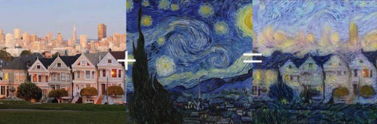</kbd>

   

  
  - 1 - Packages
     

      
      
<kbd>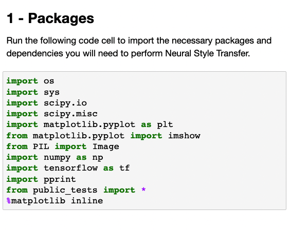</kbd>

       

  
  - 2 - Problem Statement
     

      
      
<kbd>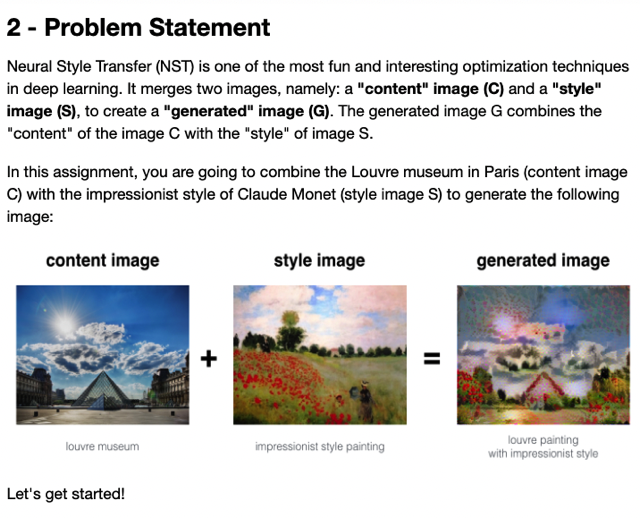</kbd>

       

  
  - 3 - Transfer Learning
     

      
      
<kbd>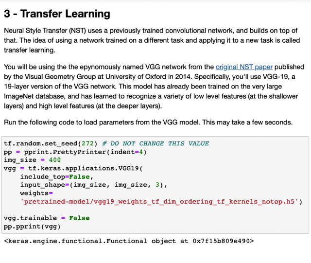</kbd>

      > Đại khái là dùng một cái NN đã train với một kho data image khủng

       

  
  - 4 - Neural Style Transfer (NST)  - First, you will build the content cost function  𝐽𝑐𝑜𝑛𝑡𝑒𝑛𝑡(𝐶,𝐺) - Second, you will build the style cost function  𝐽𝑠𝑡𝑦𝑙𝑒(𝑆,𝐺) - Finally, you'll put it all together to get 𝐽(𝐺) = 𝛼𝐽𝑐𝑜𝑛𝑡𝑒𝑛𝑡(𝐶,𝐺) + 𝛽𝐽𝑠𝑡𝑦𝑙𝑒(𝑆,𝐺)
     

    
    - 4.1 - Computing the Content Cost
       

      
      - 4.1.1 - Make Generated Image G Match the Content of Image C  Đại khái là bước 1 là:  Làm sao để Generated image giống với Content.  Chọn l giữa giữa để 'nó' capture cả low level và high level  features.  Ta dùng content image và generated image bỏ vào cái VGG network để forward prop để lấy ra a(C) và a(G) - Ouput của hidden layer thứ L
         

          
          
<kbd>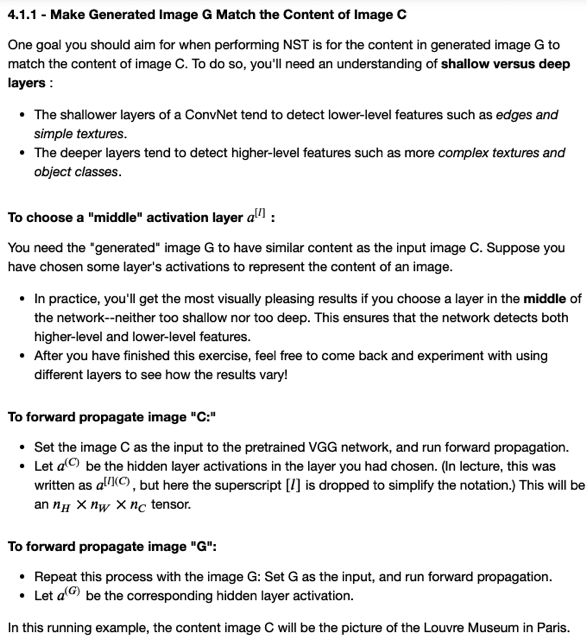</kbd>

          > Đại khái là bước 1 là:
>
> Làm sao để Generated image giống với Content.
>
> Chọn l giữa giữa để 'nó' capture cả low level và high level 
> features.
>
> Ta dùng content image và generated image bỏ vào cái VGG network
> để forward prop để lấy ra a(C) và a(G) - Ouput của
> hidden layer thứ L

           

          
          
<kbd>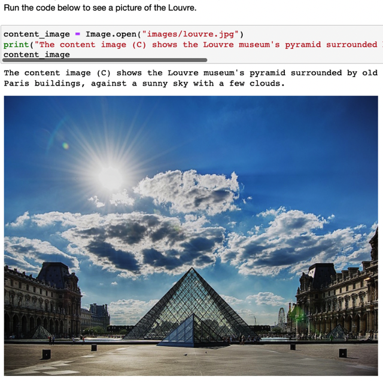</kbd>

           

      
      - 4.1.2 - Content Cost Function 𝐽𝑐𝑜𝑛𝑡𝑒𝑛𝑡(𝐶,𝐺)
         

          
          
<kbd>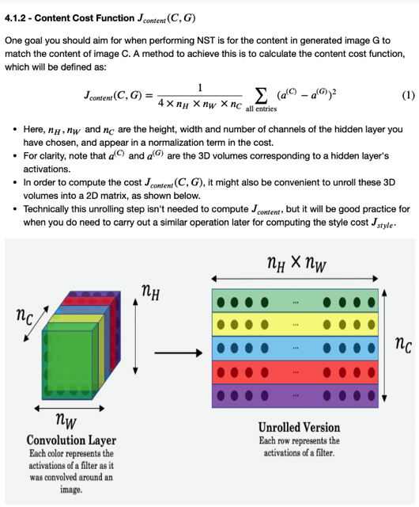</kbd>

          > Đại khái là sau khi forward prop
> để có a(C) và a(G) ta bỏ vào define một 
> Cost function J_content sao cho minimize 'khoảng cách'
> giữa hai volume: ||(a(C) - a(G))|| ^2 
>
> Trong bài có nói có thể có hoặc không việc 'normalization'

           

      
      - Exercise 1 - compute_content_cost  a_C = content_output[-1] a_G = generated_output[-1]      _, n_H, n_W, n_C = a_G.get_shape().as_list()      a_C_unrolled = tf.reshape(a_C, shape=[_, n_H*n_W, n_C]) a_G_unrolled = tf.reshape(a_G, shape=[_, -1, n_C])      J_content = tf.reduce_sum(         tf.square(             tf.subtract(a_C_unrolled, a_G_unrolled)         )     , axis=None)  J_content = J_content / (4*n_H*n_W*n_C)  \\*What you should remember:\\*  • The content cost takes a hidden layer activation of the neural network, and measures how different  a(𝐶) and 𝑎𝐺) are.  • When you minimize the content cost later, this will help make sure 𝐺 has similar content as 𝐶.
         

          
          
<kbd>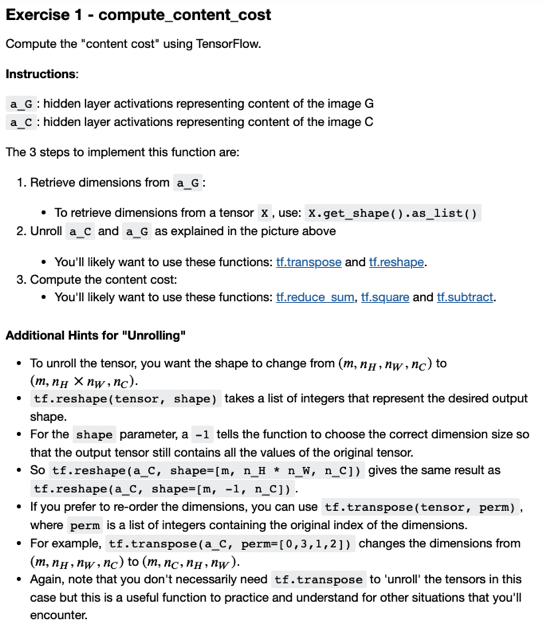</kbd>

           

          
          
<kbd>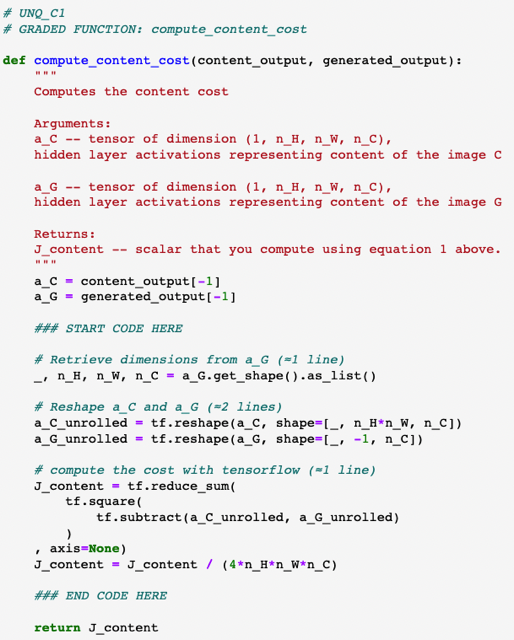</kbd>

           

          
          
<kbd>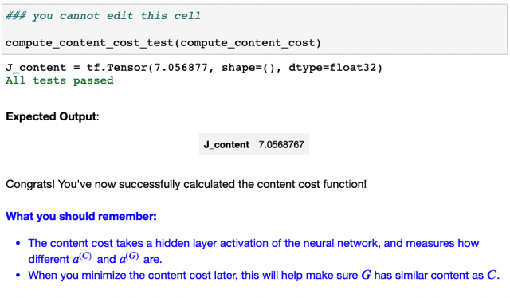</kbd>

           

    
    - 4.2 - Computing the Style Cost
       

      
      - 4.2 - Computing the Style Cost
         

          
          
<kbd>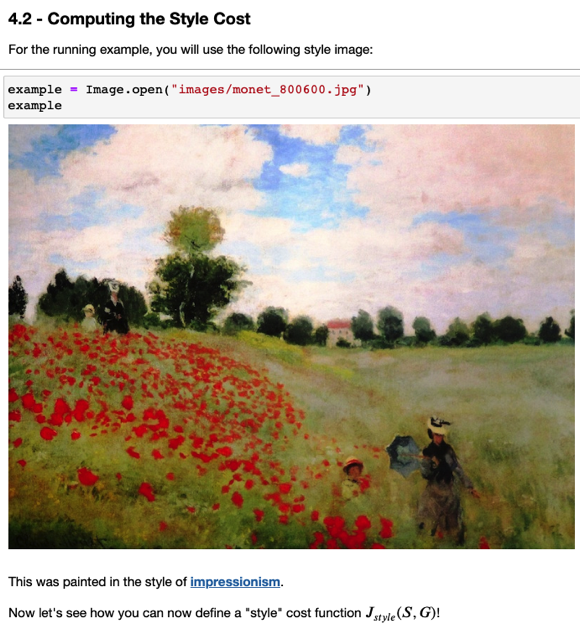</kbd>

           

      
      - 4.2.1 - Style Matrix
         

          
          
<kbd>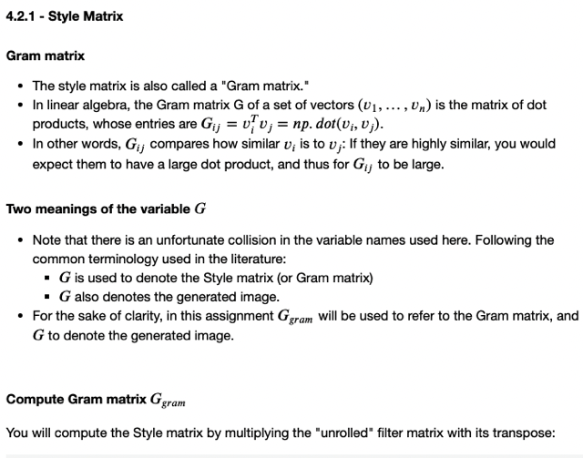</kbd>

           

          
          
<kbd>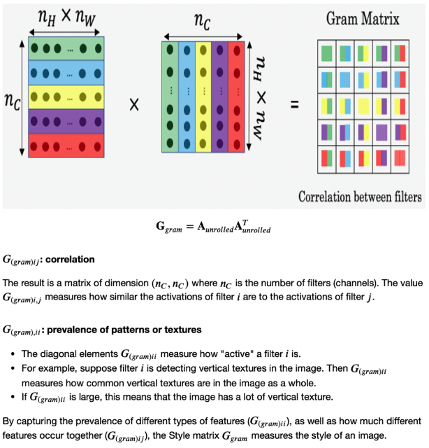</kbd>

           

          
          
<kbd>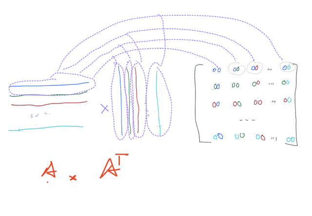</kbd>

          
<kbd></kbd>

          
<kbd>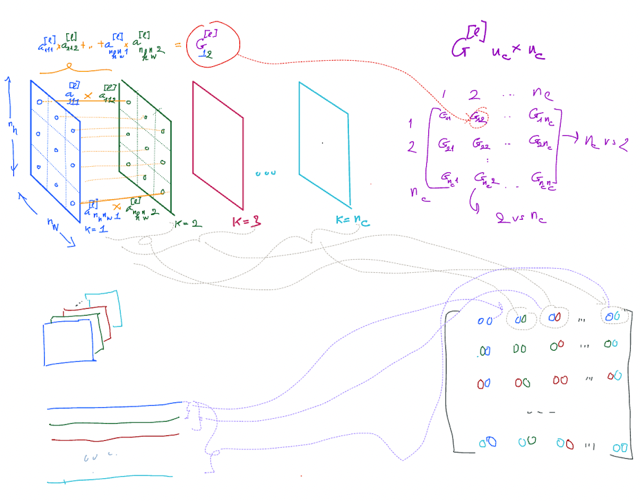</kbd>

           

      
      - Exercise 2 - gram_matrix
         

          
          
<kbd>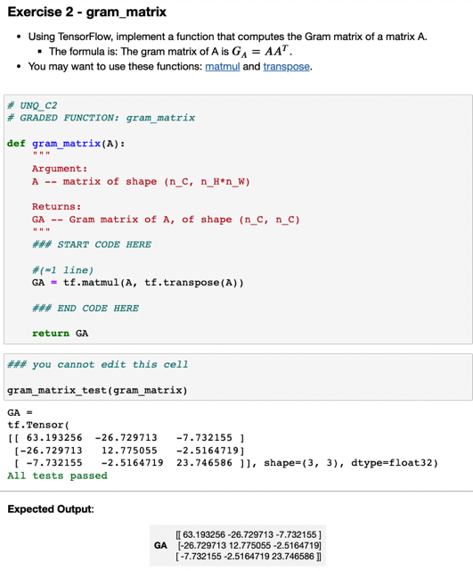</kbd>

           

      
      - 4.2.2 - Style Cost
         

          
          
<kbd>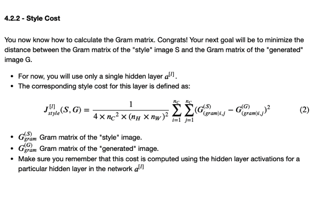</kbd>

           

      
      - Exercise 3 - compute_layer_style_cost
         

          
          
<kbd>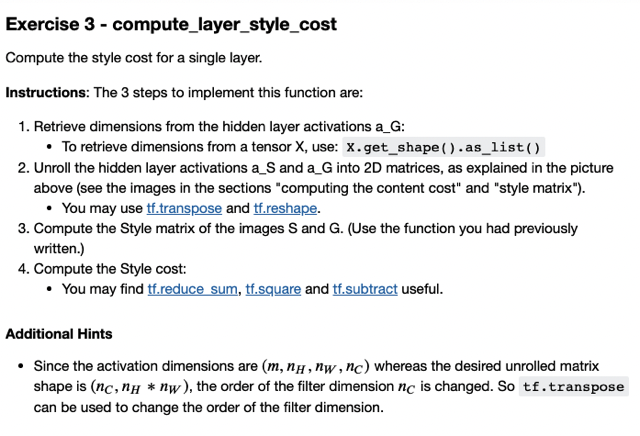</kbd>

           

          
          
<kbd>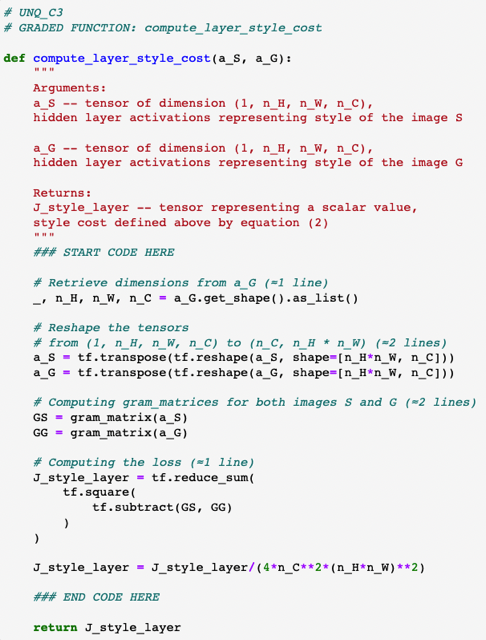</kbd>

           

      
      - 4.2.3 Style Weights  Đại khái là tính J_style với nhiều layer thay vì chỉ một layer nào đó ở giữa giữa network architecture sẽ cho kết quả tốt hơn.  Hiểu đại khái là nếu mình "tính" J_style ảnh hưởng bởi nhiều layer thậm chí tất cả layer thì Generated image sẽ càng giống style với Styled image.  Cho mỗi layer một tham số để control ảnh hưởng nhiều hay ít.
         

          
          
<kbd>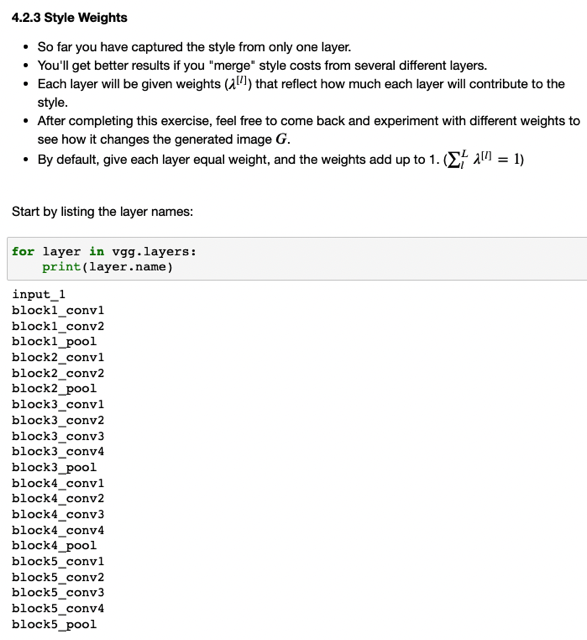</kbd>

          > Đại khái là tính J_style với nhiều layer thay vì chỉ một layer nào
> đó ở giữa giữa network architecture sẽ cho kết quả tốt hơn.
>
> Hiểu đại khái là nếu mình "tính" J_style ảnh hưởng bởi nhiều
> layer thậm chí tất cả layer thì Generated image sẽ càng giống
> style với Styled image.
>
> Cho mỗi layer một tham số để control ảnh hưởng nhiều hay ít.

           

          
          
<kbd>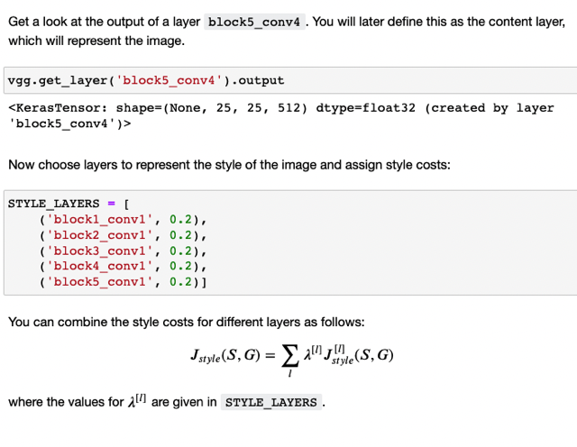</kbd>

          > Ở đây đại khái là chọn mấy layer này (block1_conv1, block2_conv1..)
> mỗi cái đóng góp 20%.

           

      
      - Exercise 4 - compute_style_cost
         

          
          
<kbd>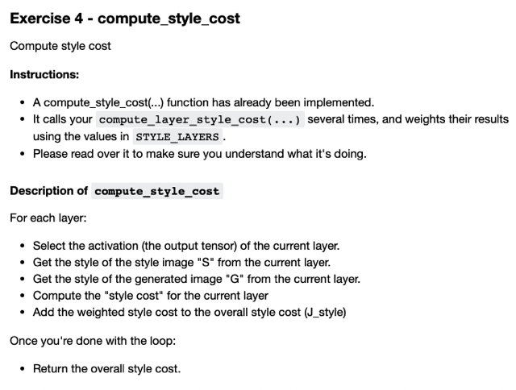</kbd>

           

          
          
<kbd>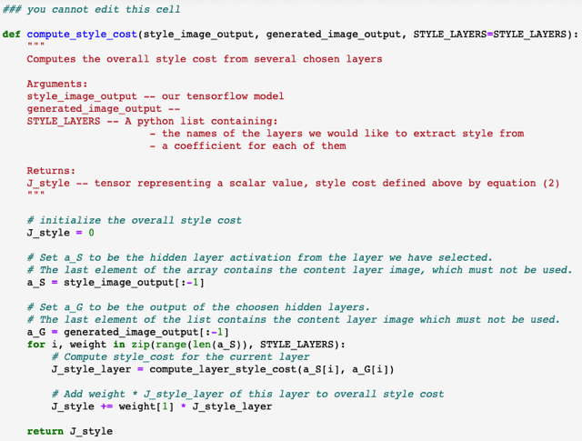</kbd>

          > Đã hiểu vì sao bỏ thằng cuối, xem minh hoạ

           

      
      - How do you choose the coefficients for each layer? The deeper layers capture higher-level concepts, and the features in the deeper layers are less localized in the image relative to each other. So if you want the generated image to softly follow the style image, try choosing larger weights for deeper layers and smaller weights for the first layers. In contrast, if you want the generated image to strongly follow the style image, try choosing smaller weights for deeper layers and larger weights for the first layers.  What you should remember:  The style of an image can be represented using the Gram matrix of a hidden layer's activations.  You get even better results by combining this representation from multiple different layers.  This is in contrast to the content representation, where usually using just a single hidden layer is sufficient.  Minimizing the style cost will cause the image  𝐺   to follow the style of the image  𝑆
         

      
      - 4.3 - Defining the Total Cost to Optimize
         

      
      - Exercise 5 - total_cost  \\*What you should remember:\\*  • The total cost is a linear combination of the content cost 𝐽𝑐𝑜𝑛𝑡𝑒𝑛𝑡(𝐶,𝐺)  and the style cost 𝐽𝑠𝑡𝑦𝑙𝑒(𝑆,𝐺).  • 𝛼 and 𝛽 are hyperparameters that control the relative weighting between content and style.
         

          
          
<kbd>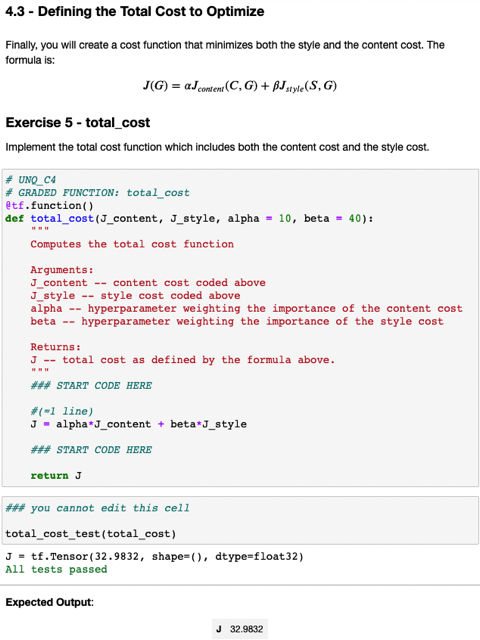</kbd>

           

  
  - 5 - Solving the Optimization Problem
     

    
    - 5 - Solving the Optimization Problem
       

        
        
<kbd>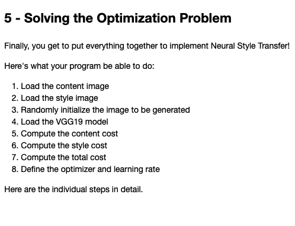</kbd>

         

    
    - 5.1 Load the Content Image
       

        
        
<kbd>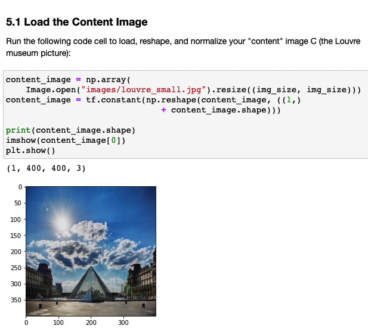</kbd>

         

    
    - 5.2 Load the Style Image
       

        
        
<kbd>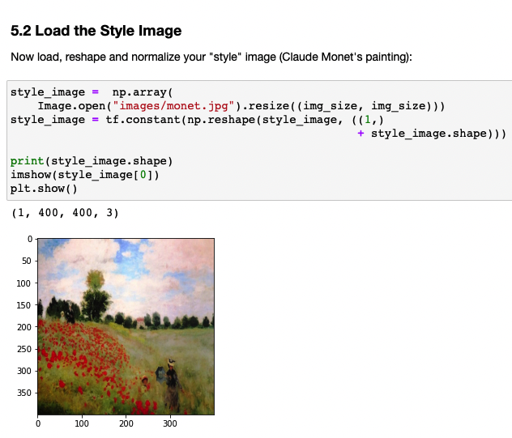</kbd>

         

    
    - 5.3 Randomly Initialize the Image to be Generated
       

        
        
<kbd>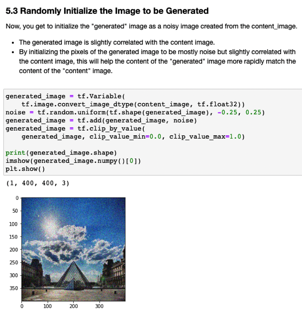</kbd>

         

    
    - 5.4 - Load Pre-trained VGG19 Model
       

        
        
<kbd>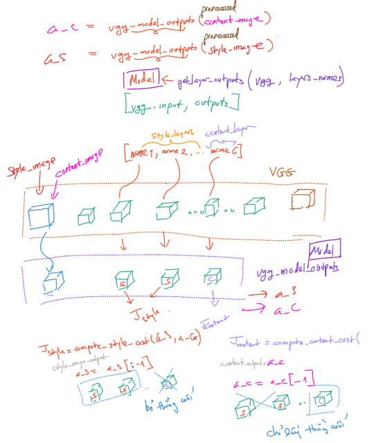</kbd>

        
<kbd></kbd>

        
<kbd>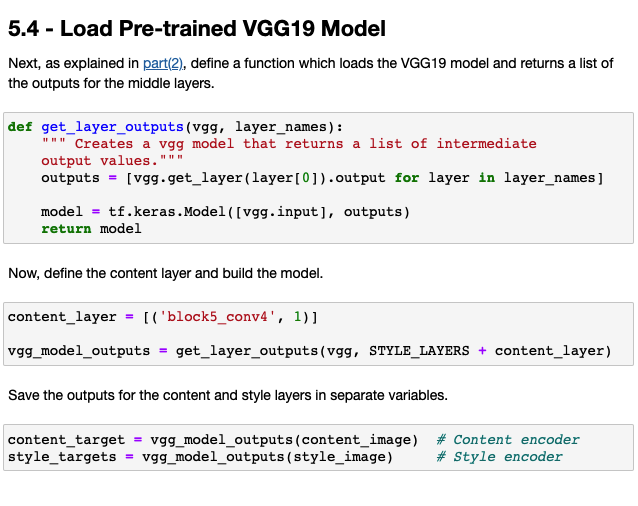</kbd>

        > This is a Python function that takes a pre-trained VGG model (vgg) and a
> list of layer names (layer_names) as inputs and returns a new Keras model
> that outputs the intermediate activations of the specified layers.
>
> The function first creates a list of output tensors by using a list
> comprehension to iterate over layer_names and extract the output tensor
> for each layer from the vgg model. Specifically, for each layer in
> layer_names, it gets the output tensor of that layer from the vgg model
> using vgg.get_layer(layer[0]).output. The output tensor is then added to the
> outputs list.
>
> After collecting the output tensors for all the specified layers, the function
> creates a new Keras model that takes the vgg model's input tensor as input
> and outputs a list of the intermediate activation tensors corresponding to
> the specified layers. The Model function in Keras is used to create this new
> model, and the outputs list and vgg.input tensor are passed as arguments
> to it.
>
> Finally, the function returns the **newly created Keras model**that outputs the
> intermediate activations of the specified layers.

         

    
    - 5.5 - Compute Total Cost
       

      
      - 5.5.1 - Compute Content Cost
         

          
          
<kbd>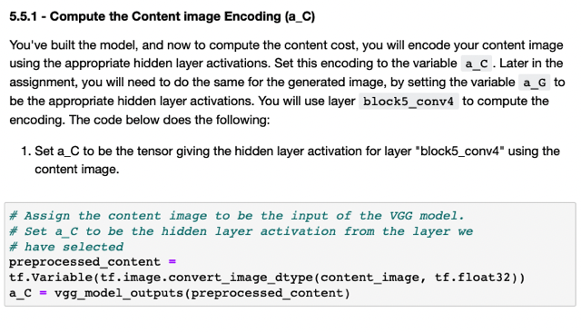</kbd>

           

      
      - 5.5.2 - Compute Style Cost
         

          
          
<kbd>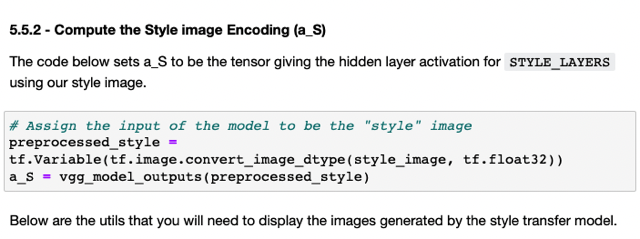</kbd>

           

          
          
<kbd>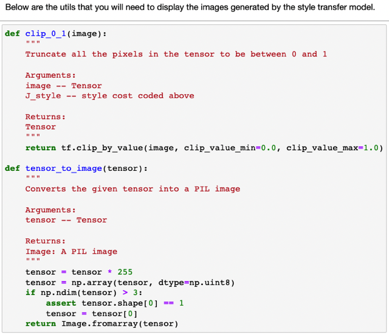</kbd>

           

      
      - Exercise 6 - train_step
         

          
          
<kbd>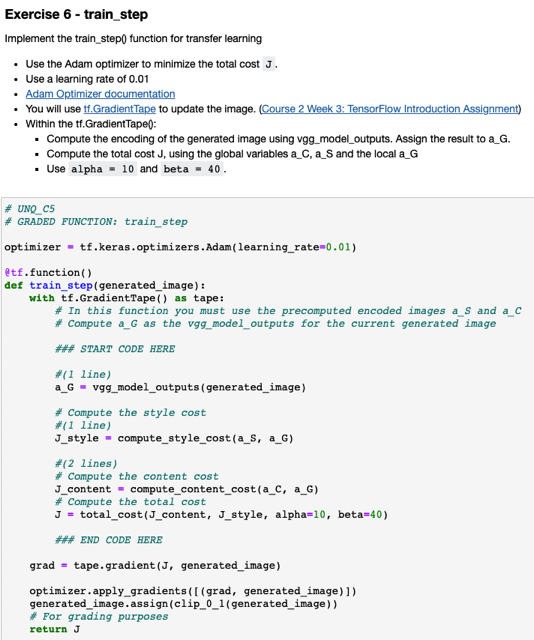</kbd>

           

    
    - 5.6 - Train the Model
       

        
        
<kbd>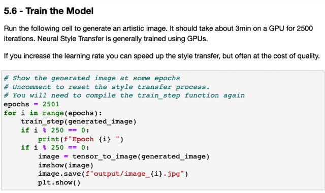</kbd>

         

        
        
<kbd>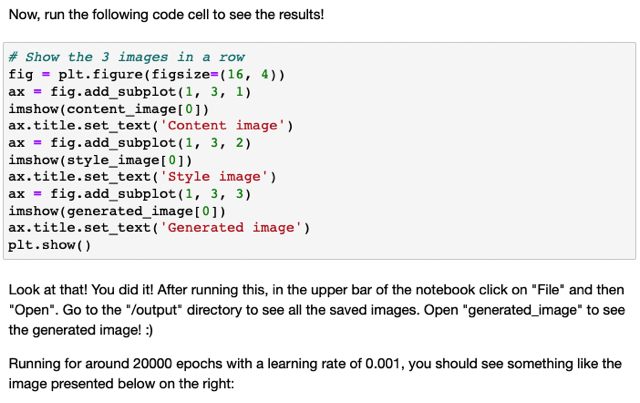</kbd>

         

        
        
<kbd>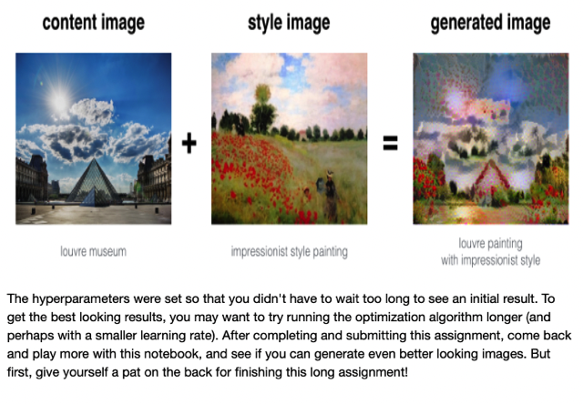</kbd>

         

        
        
<kbd>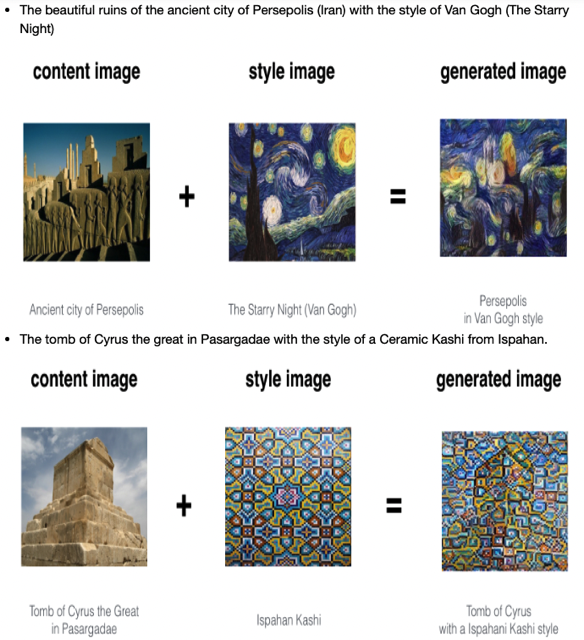</kbd>

         

    
    - \\*Conclusion:  \\*Great job on completing this assignment! You are now able to use Neural Style Transfer to generate artistic images. This is also your first time building a model in which the optimization algorithm updates the pixel values rather than the neural network's parameters. Deep learning has many different types of models and this is only one of them!  \\*What you should remember:  \\* • Neural Style Transfer is an algorithm that given a content image C and a style image S can generate an artistic image  • It uses representations (hidden layer activations) based on a pretrained ConvNet.  • The content cost function is computed using one hidden layer's activations.  • The style cost function for one layer is computed using the Gram matrix of that layer's activations. The overall style cost function is obtained using several hidden layers.  • Optimizing the total cost function results in synthesizing new images.
       

    
    - 6 - Test With Your Own Image (Optional/Ungraded)
      > SẼ QUAY LẠI
> LÀM SAU

       

      
      - Here are some ideas on how to tune your hyperparameters:  To select different layers to represent the style, redefine STYLE_LAYERS  To alter the number of iterations you want to run the algorithm, try changing epochs given in Section 5.6.  To alter the relative weight of content versus style, try altering alpha and beta values  Happy coding!
         

    
    - 7 - References  The Neural Style Transfer algorithm was due to Gatys et al. (2015). Harish Narayanan and Github user "log0" also have highly readable write-ups this lab was inspired by. The pre-trained network used in this implementation is a VGG network, which is due to Simonyan and Zisserman (2015). Pre-trained weights were from the work of the MathConvNet team.  • Leon A. Gatys, Alexander S. Ecker, Matthias Bethge, (2015). \\_A Neural Algorithm of Artistic Style \\_  • Harish Narayanan, \\_Convolutional neural networks for artistic style transfer. \\_  • Log0, \\_TensorFlow Implementation of "A Neural Algorithm of Artistic Style". \\_  • Karen Simonyan and Andrew Zisserman (2015). \\_Very deep convolutional networks for large-scale image recognition \\_  • \\_MatConvNet.\\_
       

