# W4_transformer Network

📊 **Progress:** `130` Notes | `219` Screenshots

---

**Learning Objectives**
 • Create positional encodings to capture sequential relationships in data
 • Calculate scaled dot-product self-attention with word embeddings
 • Implement masked multi-head attention
 • Build and train a Transformer model
 • Fine-tune a pre-trained transformer model for Named Entity Recognition
 • Fine-tune a pre-trained transformer model for Question Answering
 • Implement a QA model in TensorFlow and PyTorch
 • Fine-tune a pre-trained transformer model to a custom dataset
 • Perform extractive Question Answering

## Transformers Network

 

### Transformer Network Intuition

 

- Main idea:  The transformer architecture is a complex neural network architecture that has \\*revolutionized the field of NLP\\*. It allows for \\*parallel processing of sequences\\*, unlike traditional sequential models such as RNNs, GRUs, and LSTMs.  The major innovation of the transformer architecture is \\*combining\\* the use of \\*attention-based representations\\* and a \\*CNN-style of processing\\*.  \\*Self-attention\\* and \\*multi-headed attention\\* are the two key ideas that go into \\*computing rich representations\\* for \\*all the words in a sentence in parallel.\\* These representations can be used for machine translation or other NLP tasks to create effectiveness.  The transformer architecture was introduced in a seminal paper and has been widely used in the field.  The next few videos will dive into the transformer architecture piece by piece so that viewers can understand how it works and apply it with ease.
   

    
    
<kbd>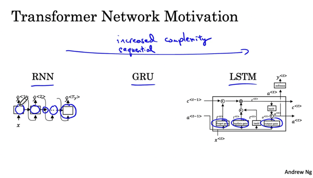</kbd>

> [!NOTE]
> Đại khái là ổng nói  RNN thì bị vanishing gradient khiến mất thông tin
> khi phải truyền đường dài và GRU và LSTM giúp khắc phục chuyện đó
> trong việc nắm bắt "long range dependencies and sequences"
>
> Bất lợi là structure ngày càng phức tạp, và mỗi unit như 1 bottleneck
> khiến thông tin bị chậm đi khi phải di chuyển qua nhiều 'node' (ví dụ
> trong sequence model) nên Transformer nó sẽ giúp thông tin đi song
> song cùng lúc với nhau

     

    
    
<kbd>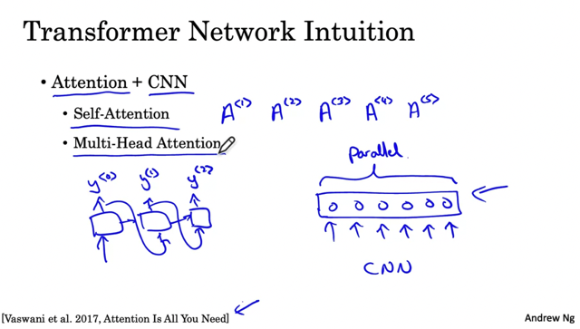</kbd>

> [!NOTE]
> Đại khái là
>
> Transformer network kết hợp tính chất 'parallel' của CNN, và Attention
> based representation
>
> 2 key ideas là **Self-attention**: Đại khái ví dụ ta có một chuỗi 5 từ thì
> ta sẽ tính ra representation của 5 từ đó.
>
> **Multi-head attention** thì dùng for loop để tìm những version khác
> nhau của những representation này.
>
> Và turn out là những **representation này rất giàu thông tin**, có thể dùng
> cho Machine Translation hay những NLP task khác

     

### Self-attention

 

- 1 Self-attention mechanism of transformers is \\*the most important core idea\\* behind what makes transformer networks work.  2 To \\/\\*use attention with a style more like CNNs\\*\\/, you need to \\*calculate self-attention\\*, where you create \\*attention-based representations for each of the words in your input sentence\\*.  3 For every word, you have three values called the \\*query\\*, \\*key\\*, and \\*value\\*, which are the key inputs to \\*computing the attention value for each word\\*.  4 The query, key, and value vectors are supposed to \\*pull up the most information\\* that's needed to help compute the most useful representation.  5 The goal of the operation is to \\*create attention-based representations\\* for each word that \\_\\*look at the surrounding words to figure out what's actually going on in how we're talking about the word in the sentence.\\*\\_
   

    
    
<kbd>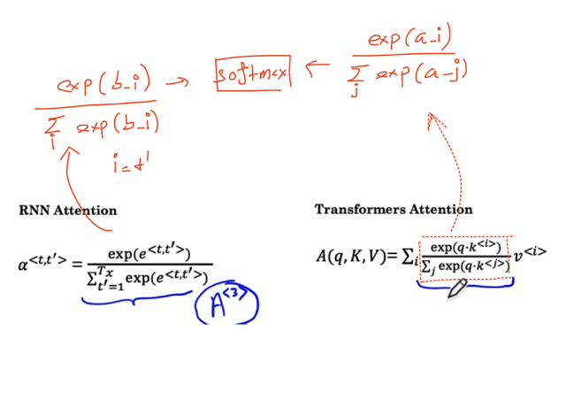</kbd>

    
<kbd></kbd>

    
<kbd>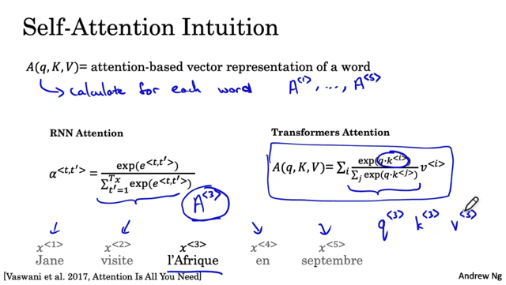</kbd>

> [!NOTE]
> Đại khái là ta cũng **embedding 1 từ thành 1 embedded vector**
>
> Nhưng thay vì chỉ đơn giản là look up embbeded vector từ
> Embedded matrix thì bây giờ..
>
> **Dựa vào hoàn cảnh**, sẽ chọn /**tính các embedded vector khác nhau
> kiểu như tuỳ tình huống phù hợp với từ này trong câu**.
>
> Kiểu như Africa là 1 châu lục? Africa là 1 di tích lịch sử? Africa là một địa
> điểm du lịch?
>
> Đó là **representation** vector A gọi là '**attention-based vector
> representation of a word**' = **vector đại diện của 1 từ được tính toán
> dựa trên hoàn cảnh xung quanh của từ đó**.
>
> Và khi tính toán thì thực ra nó cũn không khác mấy các cơ chế attention
> trong RNN bữa trước chỉ khác cái là nó làm /. tính **CÙNG LÚC** cho 5 từ
> trong câu chứ không phải 1.

> [!NOTE]
> Nhìn trong công thức thấy sự tương đồng khi dùng softmax

     

    
    
<kbd>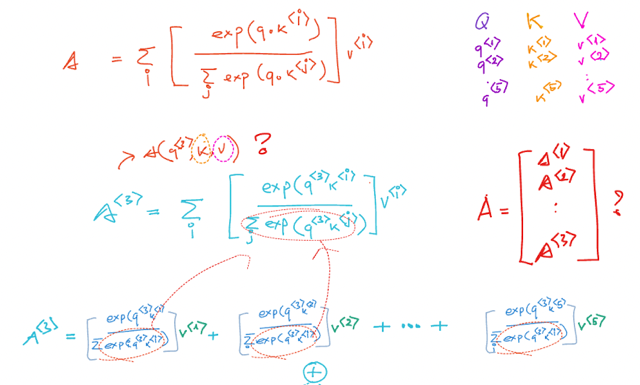</kbd>

    
<kbd>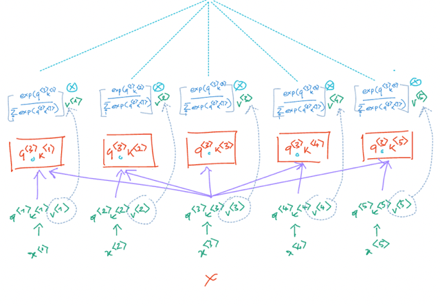</kbd>

    
<kbd></kbd>

    
<kbd></kbd>

    
<kbd>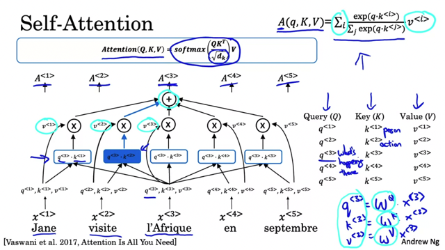</kbd>

> [!NOTE]
> Câu hỏi: Ở Africa có gì xảy ra?
>
> Thì q<3>.k<1> sẽ đánh giá là nếu trả lời là 'Jane' thì tốt như thế nào.
> tương tự,
> Thì q<3>.k<2> sẽ đánh giá là nếu trả lời là 'visit' thì tốt như thế nào.
> Và tương tự vậy cho các từ khác.
>
> Tất cả nhằm mục đích:
> Gom tất cả thông tin cần thiết để tìm ra đại diện tốt nhất / hữu ích nhất
> = representation A<3> cho từ thứ 3 - l'Afrique.
>
> Rồi giả sử đại khái kết quả thấy q<3>.k<2> cho ra số lớn thì đại khái
> cho biết trạng thái phù hợp nhất để  Africa là một điạ điểm để visit.
>
> Rất khó giải thích nhưng hiểu hiểu đại khái là tìm ra cách để **embbed 
> tốt nhất đại diện cho 1 từ.**

> [!NOTE]
> "The key advantage of this representation is the word of l'Afrique
> **isn't some fixed word embedding**. Instead, it lets the
> **self-attention mechanism realize that l'Afrique is the destination
> of a visite**, of a visit, and thus **compute a richer, more useful
> representation** for this word"
>
> Hiểu đại khái là A<3> không chỉ là một **fixed** word embedding -
> mà là một embedding **mang trong mình nhiều thông tin hữu ích
> hơn về hoàn cảnh của nó,** cụ thể trong tình huống này nó là một
> destination để mà visit

> [!NOTE]
> Công thức tổng quát là vầy
>
> Denominator có dấu sqrt chỉ là để **scale cái dot-product attention**
>
> "The term in the denominator is just to scale the dot-product, so it
> **doesn't explode**. You don' t really need to worry about it. But another
> name for this type of attention is the **scaled dot-product attention**."

> [!NOTE]
> q<3> = W(Q).x<3>
> k<3> = W(K).x<3>
> v<3> = W(V).x<3>

     

    
    
<kbd></kbd>

> [!NOTE]
> To recap, associated with each of the five words you end up with a
> **query**, a **key**, and a **value**.
>
> The **query** lets you ask a question about that word, such as what's
> happening in Africa.
>
> The **key** looks at all of the other words, and **by the similarity to the
> query**, helps you figure out which **words gives the most relevant answer
> to that question**. In this case, visite is what's happening in Africa,
> someone's visiting Africa.
>
> Then finally, the **value** allows the representation to plug in **how 'visite'
> should be represented within A^3**, within the representation of Africa.
>
> This allows you to come up with **a representation for the word Africa
> that says this is Africa and someone is visiting Africa**. This is a **much
> more nuanced, much richer representation** for the word than if you just
> had to pull up the same fixed word embedding for every single word
> **without being able to adapt it based on what words are to the left and
> to the right of that word**. We've all got to **take into account and in the
> context**. Now, you have learned about the self-attention mechanism

> [!NOTE]
> Đại khái là thông qua query, key và value mà ta tính
> toán được 1 vector representation của 1 từ mang
> trong mình thông tin hữu ích về hoàn cảnh của từ đó
> chứ không chỉ là 1 embedding vector luôn giống nhau

     

    
    
<kbd>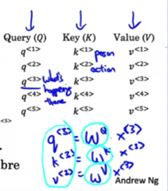</kbd>

    
<kbd></kbd>

    
<kbd>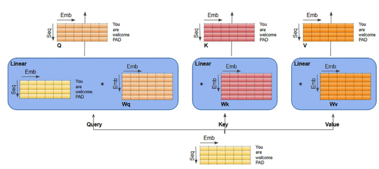</kbd>

     

  
  - Có mấy cái mà mr Andrew hoàn toàn không nói tới hoặc mình không tự hiểu được đó là  Ba cái matrix Q, K, V được tạo ra như thế nào  Thì đây, đaị khái là một cái Attention (không phải Self-attention nha) sẽ cần 3 cái \\*INPUT PARAMS có tên là Query, Key và Value  \\*và ba cái này sẽ dùng để tính ra Q, K, V.  Và (cái này thì ông Andrew có hint) là để làm Self-attention thì ba cái Query, Key và  Value sẽ \\*giống nhau\\*  Đại khái là ta sẽ bỏ cái embedding-encoding block vào và cho nó \\*ĐỒNG THỜI LÀ Query, Key, và Value  Rồi nó tính Q, K, V như thế nào?\\*  Đại khái là thông qua \\*linear layer\\* của Attention với các weights matrix \\*W_Q\\*, \\*W_K\\*, \\*W_V\\* - Đều có size là (\\*emb_dim\\*, \\*emb_dim\\*). Qua các linear layer này Query, Key, Value input params (mà ta sẽ gán vào cho tụi nó bằng cái embedded sequence bao gồm word embedding và positional embedding) sẽ \\*" tạo ra"\\* ba matrix \\*Q\\*, \\*K\\*, \\*V\\* - đều có shape là \\*sequence_len\\* x \\*emb_dim\\*.  Rồi từ Q,K,V nó sẽ tính ra \\*attention score\\* và nói ngắn gọn cộng với những cái mà Andrew cũng đã nói và giải thích rõ trong article 4 của loạt bài đó là: Trong quá trình training, tất cả các \\*word embedding vectors\\* và \\*weights\\* của Attention linear layers \\*W_Q\\*, \\*W_K\\*,\\*W_V\\* sẽ được \\*train\\* sao cho cách sắp xếp/kiến trúc của attention giúp minimize loss qua đó tìm ra được các weight và embedding sao cho word embedded vector phản ánh tốt nhất thông tin của 1 từ.Khúc cuối này khá khó diễn đạt, nhưng đại khái là cách kiến trúc của Attention sẽ giúp khi training nó sẽ cải thiện dần dần embedding vector đồng nghĩa giảm dần cost.
     

### Multi-head Attention

 

- 1 Multi-head attention mechanism is a modification of self-attention mechanism that involves \\*computing multiple self-attentions\\* for a given sequence.  2 The input vectors Q, K, and V are multiplied by matrices WQ, WK, and WV to obtain query, key, and value vectors for each input term.  3 The same set of query, key, and value vectors are used to compute multiple self-attentions.  4 Each self-attention calculation for a sequence is called a \\*head\\*, and the number of heads is denoted by \\*'h'\\*.  5 \\*Each head represents a different feature\\*, and the final output is the \\*concatenation of all the heads\\*.  6 The different heads' values can \\*be computed in parallel\\* because no head's value depends on the value of any other head.  7 In practice, the computation of different heads' values is not done in a big for-loop.
   

    
    
<kbd>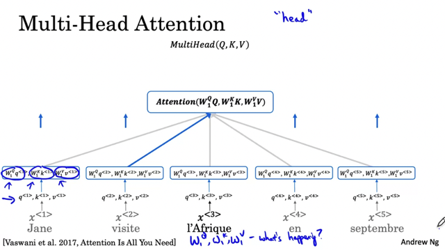</kbd>

> [!NOTE]
> 1 "head" kiểu như 1 bộ các vector
> representation, multi-head có nghĩa là tính
> ra nhiều bộ chứ không chỉ có 1.
>
> Trong đó, để tính ra một bộ thì ta làm gì?
>
> Đ.v mỗi từ tính, ví dụ từ thứ nhất ta ra q<1>, k<1>, v<1> 
> Tính inner dot W1_Q.q<1>, W1_K.k<1>, W1_V.v<1>
>
> Làm vậy với các từ khác
>
> Cuối cùng là dùng các kết quả đó để tính ra "representation" của các
> từ, tạo thành một bộ các representation đầu tiên, đó là một 'head'
>
> Với 'head' đầu tiên này, biểu thị bởi số 1 trong W1_Q, W1_K, W1_V
> các matrix này kiểu được encoded để đặt câu hỏi: Điều gì đã xảy ra ở l'Afrique.
>
> Và trong quá trình tính toán (học. huấn luyện) nó cho thấy "visit" 
> đóng vai trò quan trọng để trả lời câu hỏi này, biểu thị bằng giá trị
> của W1_Q.q<2>, W1_K.k<2>, W1_V.v<2> "lớn nhất" (lớn nhất 
> như thế nào thì để hiểu hơn sau)

     

    
    
<kbd>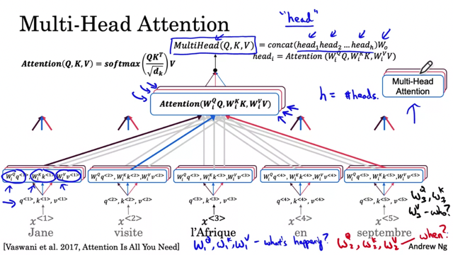</kbd>

> [!NOTE]
> Xong head 1, tính head 2 thì  **W2_Q,K,V**...đại khái biểu thị câu hỏi khác,
> **khi nào** ở l'Afrique (**When**?) và cũng tính tương tự  để tính ra 1 bộ
> representation vector của các từ gọi là head #2
>
> Thì head 2 mang trong mình những thông tin hữu ích để trả lời câu hỏi "When"
> đ/v các từ - Chú ý là đ/v các từ nha, vì mỗi representation vector cho mỗi từ.
>
> Làm tương tự như vậy với **h** lần ví dụ 3 lần (h = 3) hay 8 lần (h=8). Ta có 8
> heads.
>
> Bây giờ **stack các head (concatenate)** lại và nhân cho một cái W_0 để tạo
> thành một ...**multi-head**
>
> Thì cái multi-head này chứa rất nhiều thông tin hữu ích của các  từ trong câu
> này.
>
> Và dù ổng nói cứ hình dung là ta lần lượt tính các head này nhưng  Thực tế thì
> ta**tính nó cùng lúc (parallel)** vì các head này độc lập với nhau

     

### Transformer Network

 

- 1 The transformer architecture \\*combines self-attention\\* and \\*multi-headed attention\\* mechanisms to perform sequence to sequence translation tasks.  2 The encoder block takes the \\*word embeddings\\* as input and uses \\*multi-headed attention to compute Q, K, and V matrices\\* which are then passed through a \\*feed-forward neural network\\*.  3 The \\*decoder\\* block generates the English translation \\*by using multi-headed attention to compute Q, K, and V matrices from the previous output\\* and the \\*French sentence embeddings\\*, and passing them through a \\*feed-forward neural network\\* to \\*generate the next word in the sequence\\*.  4 The transformer architecture uses \\*positional encoding\\* to account for the position of each word in the input sequence.  5 The transformer architecture is \\*repeated N times\\*, typically \\*six\\*, to \\*improve the accuracy\\* of the translation task.  6 The transformer architecture has additional features such as \\*residual connections\\*, \\*layer normalization\\*, and \\*masked multi-headed attention\\* to improve its performance.
   

    
    
<kbd>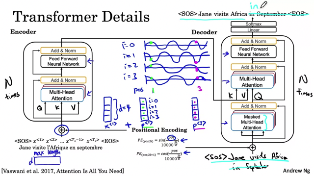</kbd>

> [!NOTE]
> *Tất cả đều chỉ là hiểu đại khái như sau:
>
> Có vẻ như (trong bài trước mình chưa hiểu rõ lắm) đó là
> kết quả của bước multi-head attention tính ra representation
> của các từ gì đó chính là Q, K, V??? Cái này khi làm assignment
> sẽ quay lại xác nhận sau
>
> Trong thực tế người ta hay có thêm SOS (start of
> sentence)  token nữa sẽ hữu ích
>
> N times: Tính ra rồi lấy kết qủa quay ngược lại tính lại
>
> Mask: Che đi 1 phần, rồi xem thử n.n nó predict còn
> lại ra sao
>
> Add & Norm: Giống như batch norm giúp tăng tốc
>
> Positional encoding: công thức sin, cos là để mỗi
> vector p<> của mỗi từ đều khác nhau, và việc tính PE
> là để giúp lưu giữ thông tin vị trí của từng từ trong câu
> giúp ích cho sự translation

     

    
    
<kbd>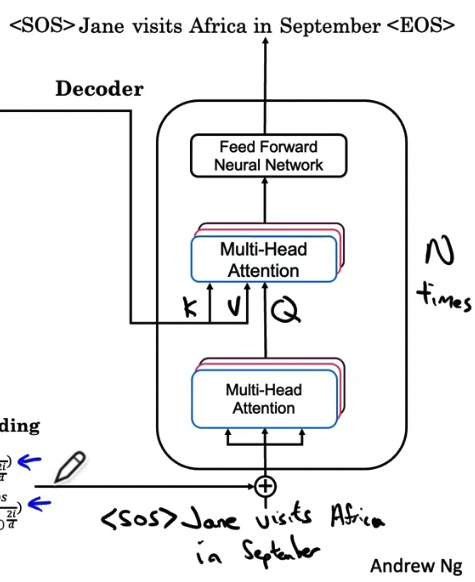</kbd>

> [!NOTE]
> Giải thích đại khái cái block thứ 2 Decoder:
>
> Ban đầu câu translation chưa có gì chỉ có SOS
>
> bỏ vào Multi-Head attention tính ra Q,
>
> Xong mới lấy K, V từ Encoder để vào M.H.A và
> FFNN và quay lại N lần để tính ra chữ thứ 2 là
> gì, hy vọng là nó ra 'Jane'.
>
> Có nghĩa là nó pull thông tin từ Encoder kết
> hợp những từ đã predict (Ban đầu chỉ có SOS -
> Bất đầu câu, sau đó là <SOS> Jane, <SOS>
> Jane visit..) để predict ra từ tiếp theo.

     

    
    
<kbd>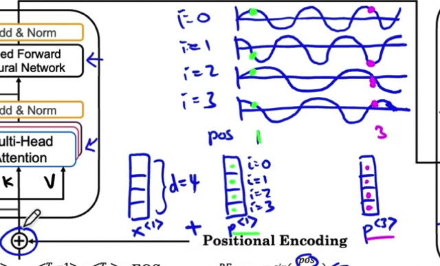</kbd>

> [!NOTE]
> Giả sử **word embedding vector** của các từ là có 4 dimension,
> đồng nghĩa x<1>, x<2>,...đều là vector 4 dimensions
>
> Ta sẽ tạo tương ứng các **positional embedding vector** cũng có
> dimension = 4 p<1>, p<2>...
>
> Thì trong công thức tính PE, **pos** là 'numerical position' của từ, đối
> với "Jane" thì pos = 1
>
> '**i**' là vị trí trong encoding vector = 0,1,2,3
>
> Thì **sin, cos**đại khái là để tạo 1 **unique** (positional encoding)
> vector cho mỗi từ
>
> Ổng vẽ mấy cái plot của các i khác nhau là để giải thích 
> rằng sin, cos sẽ giúp p<1> (màu xanh) khác p<3> (màu tím)
>
> Và p<1> sẽ add directly vào x<1>

> [!NOTE]
> Ngoài ra còn nói về **'Residual network**' giống như ở ResNet
>
> Nhớ lại Residual ở C4 mục đích đại khái là để giữ thông tin lỡ may
> bị gradient vanishing
>
> "And their purpose in this case is to **pass along positional
> information** **through the entire architecture**."

> [!NOTE]
> Đại khái là với RNN thì do mình feed info vào từng từ một nên cơ bản nó có
> thông tin vị trí của các từ trong câu, còn với cái này (Transformer network) tất
> cả các từ xử lý cùng lúc nên không biết thứ tự của từ trong câu, positional
> encoding là để cung cấp thông tin này

     

    
    
<kbd>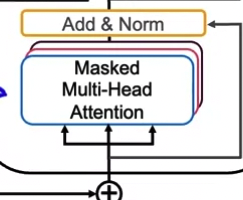</kbd>

> [!NOTE]
> "When training you have access to the entire correct
> English translation, the correct output and they're
> correct input.
>
> And because you have the full correct output you don't
> actually have to generate the words one at a time
> during training.
>
> Instead, what masking does is it blocks out the last part
> of the sentence to mimic what the network will need to
> do at test time or during prediction.
>
> In other words, all that mask multi- head attention does
> is repeatedly pretends that the network had perfectly
> translated.
>
> Say the first few words and hides the remaining words
> to see if given a perfect first part of the translation,
> whether the neural network can predict the next word in
> the sequence accurately."

     

### Loạt Bài Về Transfomrer Của Ketan Doshi

 

- Part 1 - Overview
> [!NOTE]
> https://towardsdatascience.com/transformers-explained-visually-part-1-overview-of-functionality-95a6dd460452

   

  
  - What's a Tramfromer
     

      
      
<kbd>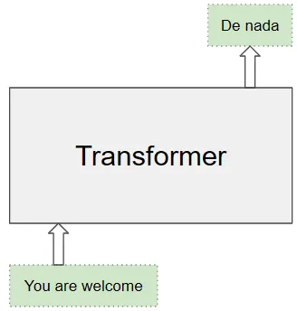</kbd>

       

      
      
<kbd>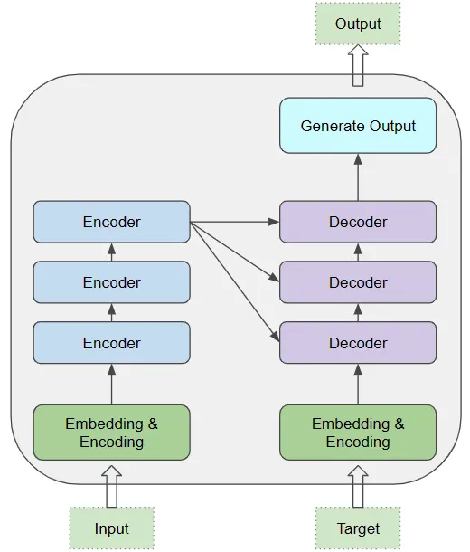</kbd>

> [!NOTE]
> Đại khái là kiến trúc như hình:
> Tất cả các Encoder đều giống nhau hết, Decoder cũng
> vậy

       

      
      
<kbd>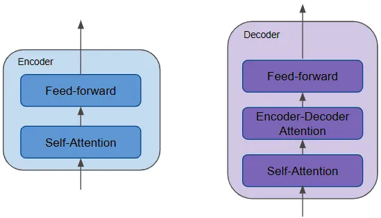</kbd>

> [!NOTE]
> The Encoder contains the all-important Self-attention layer that
> computes the relationship between different words in the sequence, as
> well as a Feed-forward layer.
>
> The Decoder contains the Self-attention layer and the Feed-forward
> layer, as well as a second Encoder-Decoder attention layer.
>
> Each Encoder and Decoder has its own set of weights.

       

      
      
<kbd>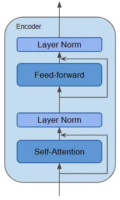</kbd>

> [!NOTE]
> Nhìn kĩ vào trong 1 Encoder, có Self-Attention
> layer, Feed-forward layer với Residual-skip
> connection và LayerNorms

       

  
  - What Attention do?
     

      
      
<kbd>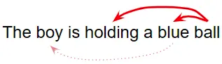</kbd>

> [!NOTE]
> Đại khái là nó giúp nắm bắt được từ nào thì quan hệ
> gần gũi / xa cách với từ nào
>
> "While processing a word, Attention enables the
> model to **focus** on other words in the input that
> are **closely related** to that word."
>
> Ví dụ trong câu này thì ball gần gũi với holding và
> blue hơn là boy. Kiểu như khi cần trả lời câu hỏi  "
> Làm gì với ball?" ->  Holding "Ball như thế nào?" ->
> Blue

       

    
    - eg. Consider two sentences:  The \\*cat\\* drank the milk because \\*it\\* was hungry. The cat drank the \\*milk\\* because \\*it\\* was sweet.
> [!NOTE]
> Ví dụ trong 2 câu này thì từ 'it' "chỉ" tới 2 cái khác nhau

       

        
        
<kbd>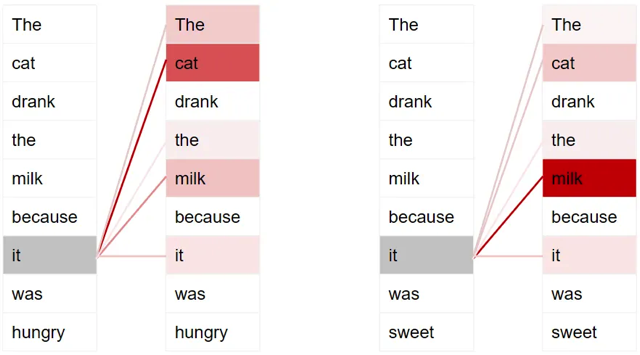</kbd>

> [!NOTE]
> Đại khái là quan hệ của 'it' với các từ 'cat','milk' trong 2 câu sẽ hoàn toàn khác nhau.
> Câu đầu nó gắn mạnh với từ 'cat' hơn câu sau nó gắn mạnh với 'milk' hơn.

         

        
        
<kbd>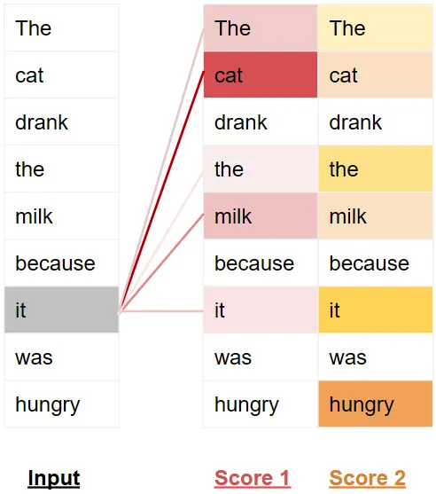</kbd>

> [!NOTE]
> Đại khái là Transformer sẽ include nhiều
> attention scores cho mỗi từ

         

  
  - Training the Transformer
     

      
      
<kbd>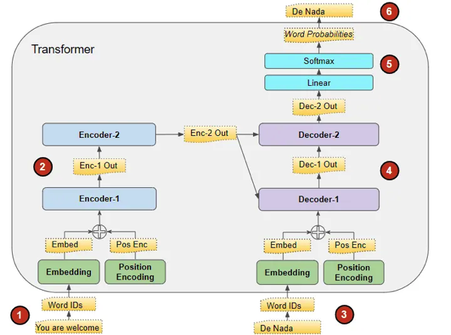</kbd>

       

    
    - 1.The input sequence is \\*converted\\* into \\*Embeddings\\* (with \\*Position Encoding\\*) and \\*fed to the Encoder.\\*  2.The stack of Encoders processes this and produces an \\*encoded representation of the input sequence\\*.  3.The \\*target sequence\\* is \\*prepended\\* with a \\*start-of-sentence token\\*, converted into \\*Embeddings\\* (with Position Encoding), and fed to the Decoder.  4.The stack of Decoders processes this \\*along with the Encoder stack’s encoded representation\\* to produce an \\*encoded representation of the target sequence\\*.  5.The Output layer \\*converts\\* it into \\*word probabilities\\* and the \\*final output sequence\\*.  6.The Transformer’s \\*Loss function\\* \\*compares\\* this output sequence with the target sequence from the training data. This loss is used to generate gradients to train the Transformer during \\*back-propagation\\*.
       

  
  - Inference
     

      
      
<kbd>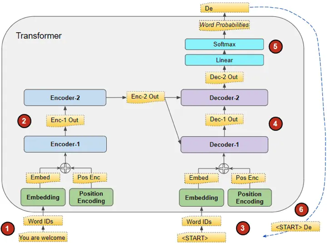</kbd>

> [!NOTE]
> Đại khái là Inference khác Training là (tất nhiên) không có
> một target nào để 'bỏ vào' Decoder' mà thay vào đó là các '
> kết quả' từ previous step giống như Seq2Seq
>
> Nhưng thay vì chỉ bỏ 1 từ 'previous' step output gần nhất thì
> bỏ tất cả sequence dc tạo ra .

       

    
    - 1.The input sequence is \\*converted\\* into \\*Embeddings\\* (with \\*Position Encoding\\*) and \\*fed to the Encoder.\\*  2.The stack of Encoders \\*processes\\* this and produces\\* an encoded representation\\* of the input sequence.  3.Instead of the target sequence, we use an \\*empty sequence\\* with only a \\*start-of-sentence token\\*. This is converted into \\*Embeddings\\* (with \\*Position Encoding\\*) and \\*fed to the Decoder.\\*  4.The stack of Decoders \\*processes\\* this along \\*with the Encoder stack’s encoded representation\\* to produce an \\*encoded representation of the target sequence.\\*  5.The Output layer \\*converts\\* it into \\*word probabilities\\* and produces an \\*output sequence\\*.  6.We \\*take the last word of the output sequence\\* as the \\*predicted word\\*. That word is now filled into the second position of our Decoder input sequence, which now contains a start-of-sentence token and the first word.  7.Go back to step #3. As before, feed the new Decoder sequence into the model. Then \\*take the second word of the output and append it to the Decoder sequence\\*. Repeat this \\*until it predicts an end-of-sentence token\\*. Note that since the Encoder sequence does not change for each iteration, we do not have to repeat steps #1 and #2 each time (\\/Thanks to Michal Kučírka for pointing this out\\/).
       

  
  - Teacher Forcing
     

    
    - Đại khái là, cái việc ta bỏ và để model nó học từ Target sentence vào Decoder giống như là ta đưa đáp án cho nó để giả sử nó có predict một từ sai, thì từ tiếp theo sẽ vẫn được dựa trên giả định là những từ trước đều đúng (nhờ target sentence) giúp không bị sai càng sai, kiểu vậy.  Và để ý cái target không chỉ đóng vai trò như thông thường nơi mà chỉ dùng target (hay label) trong việc tính loss function  Ngoài ra còn giúp cho việc ouptut tất cả các từ cùng lúc nữa giúp tăng tốc quá trình rất nhiều
       

  
  - What are Transformers used for?
     

    
    - Rất nhiều trong những NLP task như language model và text classification. Machine Translation, Text Summarization, Question-Answering, Named Entity Recognition..
       

      
      - Transformer Classification architecture
         

          
          
<kbd>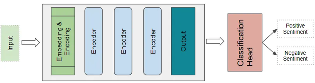</kbd>

           

      
      - Transformer Language Model architecture
         

          
          
<kbd>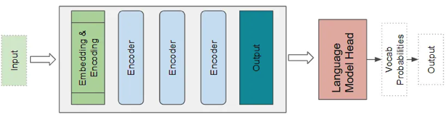</kbd>

           

  
  - How are they better than RNNs?
     

      
      
<kbd>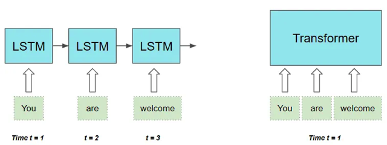</kbd>

> [!NOTE]
> Đại khái là như mr Andrew đã có nói đến, cái Transformer sẽ kết
> hợp ưu điểm của CNN trong việc sử lý cùng lúc giúp tăng tốc
> quá trình training và inference và cái Attention-based learning
> giúp nắm bắt thông tin ngữ cảnh (đại loại vậy). Khắc phục hạn
> chế của RNN (ko xử lý cùng lúc dc, CNN không xử lý thông tin
> chuỗi được)

       

- Part 2 - How It Work
> [!NOTE]
> https://towardsdatascience.com/transformers-explained-visually-part-2-how-it-works-step-by-step-b49fa4a64f34

   

  
  - Architecture Overview
     

      
      
<kbd>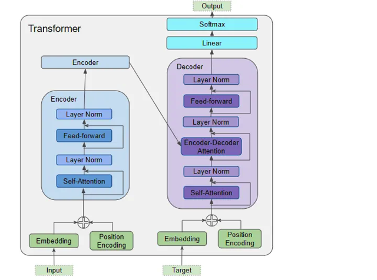</kbd>

       

    
    - Data inputs for both the Encoder and Decoder, which contains:    Embedding layer    Position Encoding layer  The Encoder stack contains a number of Encoders. Each Encoder contains:    Multi-Head Attention layer    Feed-forward layer  The Decoder stack contains a number of Decoders. Each Decoder contains:    Two Multi-Head Attention layers Feed-forward layer  Output (top right) — generates the final output, and contains: Linear layer   Softmax layer.
       

  
  - Embedding and Position Encoding
     

    
    - Embedding
       

        
        
<kbd>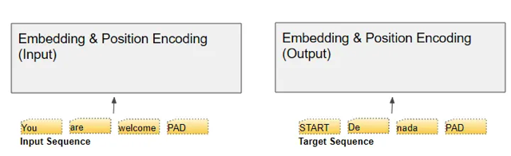</kbd>

> [!NOTE]
> Input sequence thì bỏ vào Input Embedding, target
> sequence thì bỏ vào Output Embedding (có tên vậy vì
> khi inference, thì ko có target sequence mà thay bằng
> chính output sequence)

         

        
        
<kbd>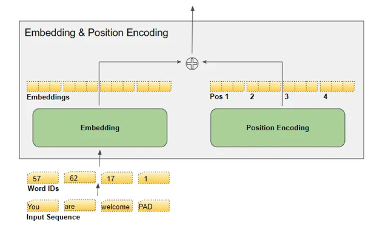</kbd>

> [!NOTE]
> Đại khái như đã biết, mỗi từ sẽ được. map với một
> numeric id dùng một vocabulary, rồi embedding layer sẽ
> map mỗi từ với một embedding vector

         

    
    - Position Encoding
       

      
      - Ở đây giải thích tại sao phải có position encoding, đại khái là vì với cách làm không còn 'handle' từng từ một bỏ vào model mà sẽ 'làm' cùng lúc, dẫn đến không còn có thông tin về vị trí của từ trong câu nữa nên phải dùng cách này để bổ sung
         

          
          
<kbd>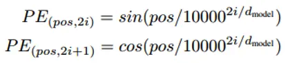</kbd>

> [!NOTE]
> Các vị trí của pe vector sẽ tính theo công thức như
> sau: Số chẵn 0,2,4... thì sin, số lẻ thì cos. \/
> - **pos**\/ is the position of the word in the sequence \/
>
> - **d_model**\/ is the length of the encoding vector (same
> as the embedding vector) and \/
>
> - **i**\/ is the index value into this vector.

           

          
          
<kbd>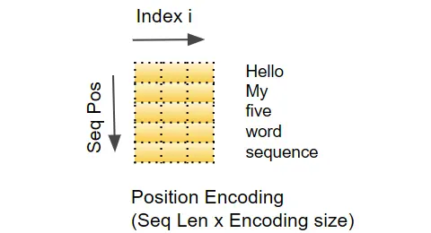</kbd>

> [!NOTE]
> PE vector sẽ có cùng độ dài với word
> embedding vector là **d-model** = **encoding_size**
> **embedding_dim** = d = ...

           

          
          
<kbd>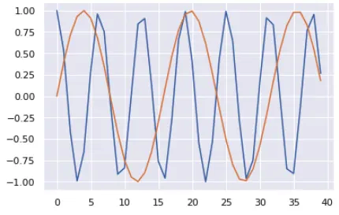</kbd>

           

  
  - Matrix Dimensions
     

      
      
<kbd>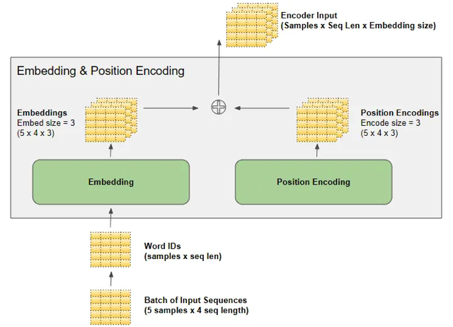</kbd>

> [!NOTE]
> Đại khái như đã nói ở trước, PE vector sẽ có độ
> dài bằng với Word Embedding vector:
> embedding_dim, và do đó mỗi một sequence được
> input vào model sẽ 'trở thành / embedded & encoded thành': 
>
> matrix word embedding và position encoding matrix có shape:
> **sequence_len** x **embedding_dim**
>
> Mở rộng hơn do nó sẽ 'handle' không phải một mà là một **batch_size**
> cái sequence nên input sẽ là: 
> Block word embedding và block position encoding đều có shape là
> **batch_size**, **sequence_len**, **embedding_dim**Block hay còn gọi là volume, tensor

       

    
    - The (\\*samples, sequence length, embedding size\\*) shape produced by the Embedding and Position Encoding layers is preserved all through the Transformer, as the data flows through the Encoder and Decoder Stacks until it is reshaped by the final Output layers.
> [!NOTE]
> Và cái shape như vậy sẽ được giữ xuyên
> suốt cho đến khi Output layer

       

        
        
<kbd>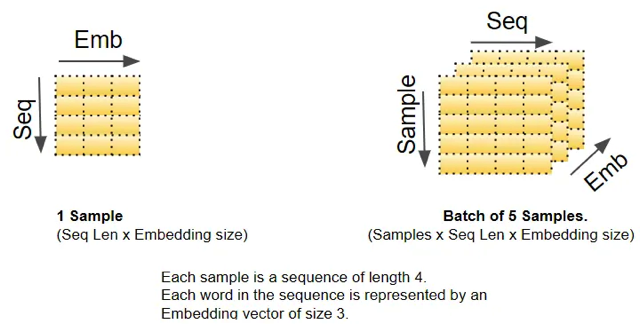</kbd>

> [!NOTE]
> Đại khái là để cho đơn giản, ta bỏ đi cái dimension
> batch_size (hay số sample) mà chỉ dùng hình vẽ như của
> 1 single sample nhưng phải hiểu là thực tế nó sẽ 'xử' một
> batch_size sample cùng lúc

         

  
  - Encoder
     

      
      
<kbd>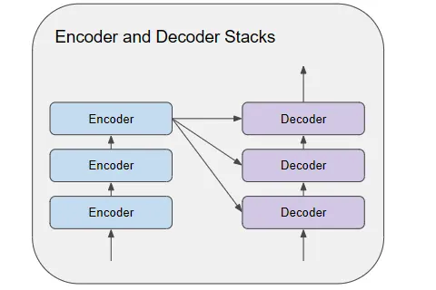</kbd>

       

    
    - The Encoder and Decoder Stacks consists of several (\\*usually six\\*) Encoders and Decoders respectively, connected sequentially.  The first Encoder in the stack receives its input from the Embedding and Position Encoding. The other Encoders in the stack receive their input from the previous Encoder.  Both the Self-attention and Feed-forward sub-layers, have a residual skip-connection around them, followed by a Layer-Normalization.  The output of the last Encoder is fed into each Decoder in the Decoder Stack as explained below.
       

        
        
<kbd>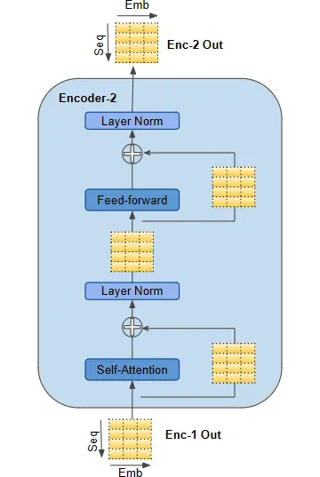</kbd>

         

  
  - Decoder
     

      
      
<kbd>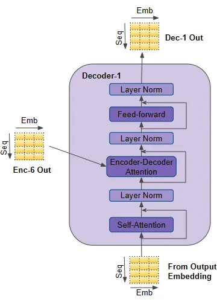</kbd>

       

    
    - The Decoder’s structure is very similar to the Encoder’s but with a couple of differences.  Like the Encoder, the first Decoder in the stack receives its input from the Output Embedding and Position Encoding. The other Decoders in the stack receive their input from the previous Decoder.  The Decoder passes its input into a Multi-head Self-attention layer. This operates in a slightly different way than the one in the Encoder. It is only allowed to attend to earlier positions in the sequence. This is done by masking future positions, which we’ll talk about shortly.  Unlike the Encoder, the Decoder has a second Multi-head attention layer, known as the Encoder-Decoder attention layer. The Encoder-Decoder attention layer works like Self-attention, except that it combines two sources of inputs — the Self-attention layer below it as well as the output of the Encoder stack.  The Self-attention output is passed into a Feed-forward layer, which then sends its output upwards to the next Decoder.  Each of these sub-layers, Self-attention, Encoder-Decoder attention, and Feed-forward, have a residual skip-connection around them, followed by a Layer-Normalization.
       

  
  - Attention
     

    
    - In the Transformer, Attention is used in three places:  - Self-attention in the Encoder — the input sequence pays attention to itself  - Self-attention in the Decoder — the target sequence pays attention to itself  - Encoder-Decoder-attention in the Decoder — the target sequence pays attention to the input sequence  *\\*The Attention layer takes its input in the form of three parameters, known as the Query, Key, and Value.\\*  I\\*n the Encoder’s Self-attention, the Encoder’s input is passed to all three parameters, Query, Key, and Value.\\*
> [!NOTE]
> Có nghĩa đại khái là 1 Attention layer nó quy định
> sẽ nhận input ở dạng 3 params là Query, Key,
> Value hiểu đại khái như **3 cái cổng để nhận
> thông tin vậy**. Và đối vối Self-Attention của
> Encoder, ta sẽ đưa cái Encoder's input (là cái
> sequence embedding/encoding block từ layer
> Embedding và Position Encoding) **vào cả ba cửa
> này** của Attention layer
>
> *Gọi Attention layer là layer con (sublayer) của
> Encoding layer

       

        
        
<kbd>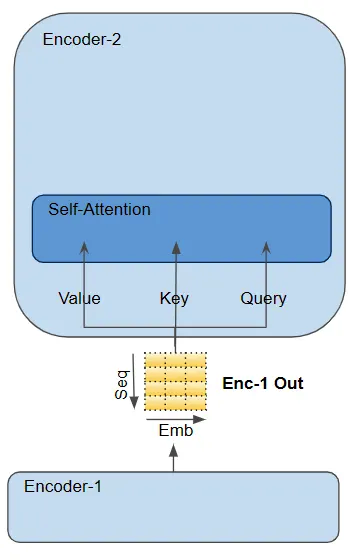</kbd>

         

        
        
<kbd>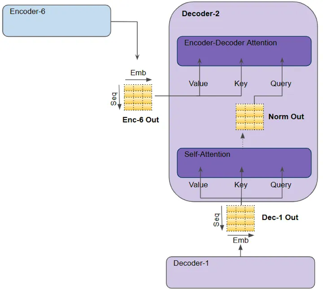</kbd>

> [!NOTE]
> Ở Decoder cũng tương tự như vậy đối
> với cái Attention đầu tiên của nó, còn cái
> thứ 2 thì khác một chút:
>
> Cổng Value và Key sẽ nhận cái block out từ cái Encoder cuối cùng
> (có 6 cái encoder)
>
> Cổng Query thì nhận cái block out từ cái Self-Attention đầu tiên (sau 
> khi qua thêm cái layer norm)

         

  
  - Multi-head Attention
     

      
      
<kbd>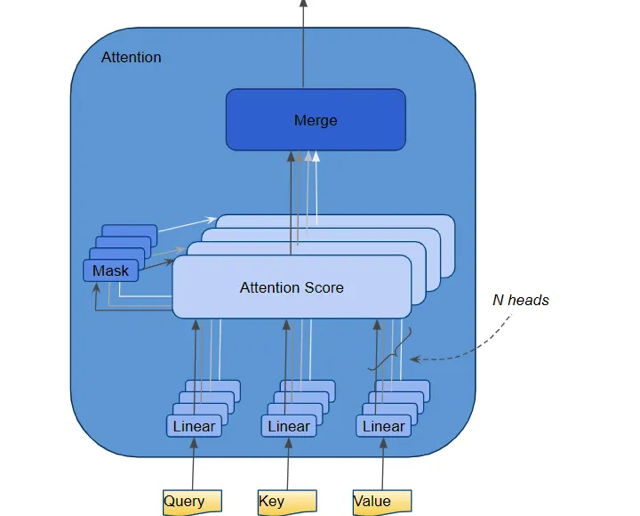</kbd>

       

    
    - The Transformer calls each Attention processor an Attention Head and \\*repeats it several times in parallel\\*. This is known as Multi-head attention. It gives its Attention \\*greater power of discrimination\\*, by \\*combining several similar Attention calculations\\*.  The Query, Key, and Value are each passed through separate \\*Linear layers\\*, each with their \\*own weights\\*, producing three results called \\*Q\\*, \\*K\\*, and \\*V\\* respectively. These are then combined together using the \\*Attention formula\\* as shown below, to produce the \\*Attention Score\\*.
       

        
        
<kbd>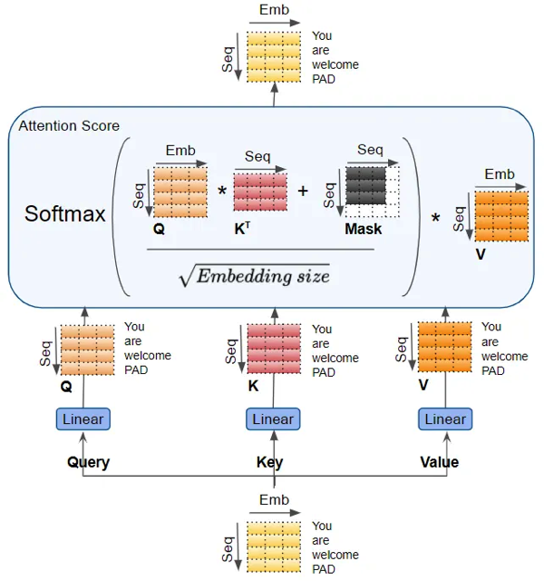</kbd>

> [!NOTE]
> Đây là cái đoạn mà mr Andrew lướt qua đây
>
> Có nghĩa là sau khi thông tin từ sequence Embedding/Encoding được cống
> nạp vào Attention qua ba cổng Query, Key, Value thì nó sẽ được xử lý qua ba
> sublayer của Attention (cũng như Attention  là sublayer của Encoding) để tạo
> ra Q,K,V.
>
> **Và điều quan trọng cần hiểu rằng các Linear layer này có các weight
> (param) là W_Q, W_K, W_V - sẽ được train cùng với / cũng như các
> sequence Embedding cũng được train trong quá trình training**Còn train như thế nào / mục đích gì thì nó sẽ liên quan đến 
> vai trò của Q,K,V. Đại khái là Q,K,V sẽ giúp mục đích cuối cùng là 
> "CỦNG CỐ / BỒI ĐẮP" thêm cho cái sequence embedding block
> sao cho nó mang thêm thông tin ngữ cảnh (bên cạnh thông tin nội 
> dung và vị trí)
>
> Hãy để ý, cái output của Encoder **vẫn là một embedding block có shape
> y hệt như lúc vào** (**batch_size**, **sequence_len**, **embedding_dim**)

         

      
      - The important thing to realize here is that the Q, K, and V values \\*carry an encoded representation of each word in the sequence\\*. The Attention calculations then combine each word with every other word in the sequence, so that the Attention Score encodes a score for each word in the sequence.
> [!NOTE]
> Cụ thể Q,K,V làm gì để trong quá trình training nó
> bồi đắp thông  tin ngữ cảnh cho embedding vector
> thì sẽ giải thích sau
>
> Nhưng để ý là nó có shape y như input embedding
> block, chẳng qua nó mang trong mình những cái gì
> đó giúp trong quá trình huấn luyện nó sẽ giúp đánh
> giá ngữ cảnh của các từ để tìm ra quan hệ giữa
> các từ trong câu. Hiểu đại khái vậy

         

  
  - Attention Masks
     

      
      
<kbd>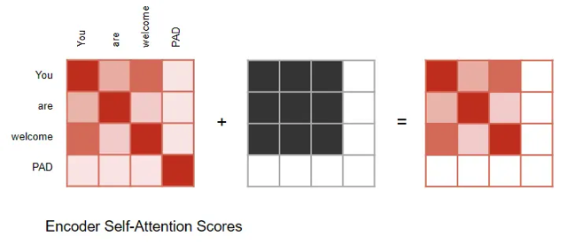</kbd>

> [!NOTE]
> Đại khái Mask sẽ giúp trong lúc tính
> nó sẽ bỏ qua cái padding

       

      
      
<kbd>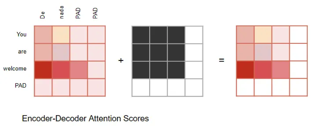</kbd>

       

    
    - In the Decoder Self-attention: masking serves to \\*prevent the decoder from ‘peeking’ ahead at the rest of the target sentence when predicting the next word.  \\*The Decoder processes words in the source sequence and uses them to predict the words in the destination sequence. During training, this is done via Teacher Forcing, where the complete target sequence is fed as Decoder inputs. Therefore, while predicting a word at a certain position, the Decoder has available to it the target words preceding that word as well as the target words following that word. This allows the Decoder to ‘cheat’ by using target words from future ‘time steps’. For instance, when predicting ‘\\/Word 3’\\/, the Decoder should refer only to the first 3 input words from the target but not the fourth word ‘\\/Ketan’\\/.
       

        
        
<kbd>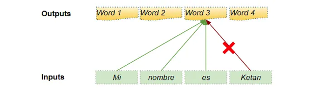</kbd>

> [!NOTE]
> Đại khái là cái Mask này thì khác nó sẽ che đi cái phần
> mà chưa cần tới ví dụ đang predict từ số 3 thì không
> nên cho nó biết từ số 4,5 là gì tránh việc nó cheating
> bằng việc học thông tin từ cả những future timesteps

         

        
        
<kbd>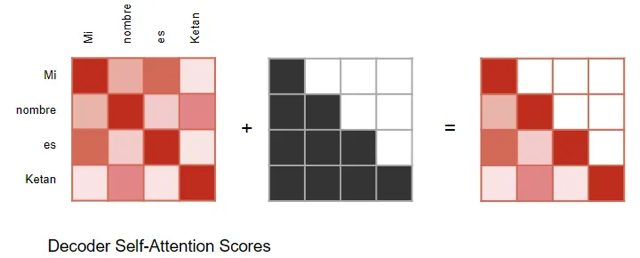</kbd>

         

      
      - When calculating the Attention Score (refer to the picture earlier showing the calculations) masking is applied to the numerator just before the Softmax. The masked out elements (white squares) are set to \\*negative infinity\\*, so that \\*Softmax turns those values to zero\\*.
> [!NOTE]
> Cái này có thể bổ trợ cho việc hiểu thêm về
> khúc này của Programming assignment vốn
> chưa hiểu lắm

         

  
  - Generate Output
     

      
      
<kbd>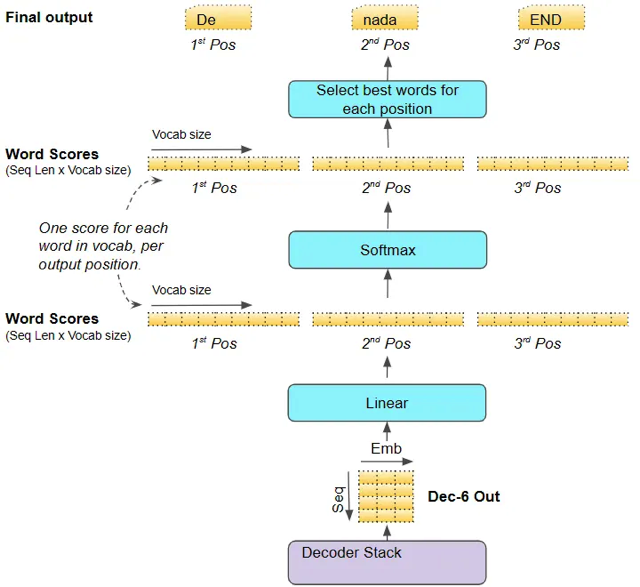</kbd>

       

    
    - The last Decoder in the stack passes its output to the Output component which converts it into the final output sentence.  The Linear layer projects the Decoder vector into \\*Word Scores\\*, with a score value for each unique word in the target vocabulary, at each position in the sentence. For instance, if our final output sentence has 7 words and the target Spanish vocabulary has 10000 unique words, we generate \\*10000 score values\\* for each of those 7 words. The score values indicate the likelihood of occurrence for each word in the vocabulary in that position of the sentence.  The \\*Softmax\\* layer then \\*turns those scores into probabilities\\* (which add up to 1.0). In each position, we find the index for the word with the \\*highest probability\\*, and then map that index to the corresponding word in the vocabulary. Those words then form the output sequence of the Transformer.
> [!NOTE]
> Giải thích quá dể hiểu rồi, đại khái là nó sẽ output ra
> (tương ứng với mỗi từ) 1 vector có 10000 số, rồi
> softmax biến thành 10000 probability number (tổng lại
> bằng 1) từ đó ông nào có probability cao nhất sẽ là từ
> được chọn để dịch cho vị trí đó

       

  
  - Training and Loss Function
     

    
    - During training, we use a loss function such as \\*cross-entropy loss\\* to \\*compare\\* the \\_\\*generated output probability distribution\\*\\_ to the \\*target sequence\\*. The probability distribution gives the probability of each word occurring in that position.  Let’s assume our target vocabulary contains just four words. Our goal is to produce a probability distribution that matches our expected target sequence “De nada END”. This means that the probability distribution for the first word-position should have a probability of 1 for “De” with probabilities for all other words in the vocabulary being 0. Similarly, “nada” and “END” should have a probability of 1 for the second and third word-positions respectively.  As usual, the loss is used to compute gradients to train the Transformer via \\*backpropagation\\*.
       

        
        
<kbd>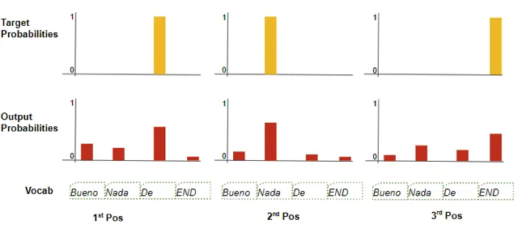</kbd>

> [!NOTE]
> Đại khái là vầy, giả sử từ điển chỉ có 4 từ, thì probability vector của từ thứ
> 1 (vốn dĩ đúng phải là 'De') sẽ là như bên dưới với chỉ số probability dành
> cho 'De' cao, dù cho 'Bueno', 'Nada' cũng có nhưng thấp hơn), trong khi
> kết quả đúng phải là như bên trên với 100% dành cho 'De'.
>
> Dựa vào đó, model sẽ dùng hàm cross-entropy để tính ra loss function
> value từ đó dùng Back-Propagation để tính gradietns

         

- Part 3 - Multi-head Attentions
> [!NOTE]
> https://towardsdatascience.com/transformers-explained-visually-part-3-multi-head-attention-deep-dive-1c1ff1024853

   

  
  - How Attention is used in the Transformer
     

      
      
<kbd>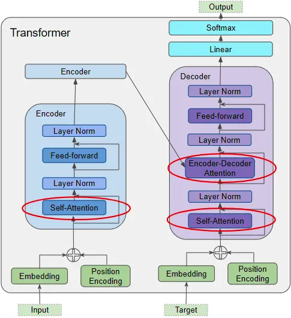</kbd>

       

    
    - Encoder Self-Attention  The input sequence is fed to the Input Embedding and Position Encoding, which produces an encoded representation for each word in the input sequence that captures the meaning and position of each word. This is fed to all three parameters, Query, Key, and Value in the Self-Attention in the first Encoder which then also produces an encoded representation for each word in the input sequence, that now incorporates the attention scores for each word as well. As this passes through all the Encoders in the stack, each Self-Attention module also adds its own attention scores into each word’s representation.
       

        
        
<kbd>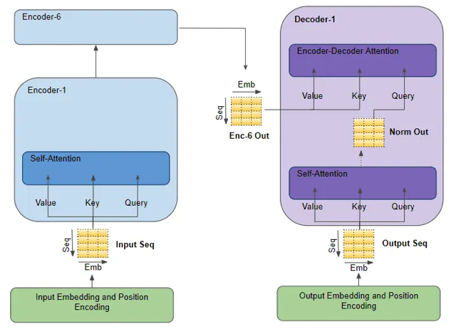</kbd>

         

      
      - Decoder Self-Attention  Coming to the Decoder stack, the target sequence is fed to the Output Embedding and Position Encoding, which produces an encoded representation for each word in the target sequence that captures the meaning and position of each word. This is fed to all three parameters, Query, Key, and Value in the Self-Attention in the first Decoder which then also produces an encoded representation for each word in the target sequence, which now incorporates the attention scores for each word as well. After passing through the Layer Norm, this is fed to the Query parameter in the Encoder-Decoder Attention in the first Decoder
         

        
        - Encoder-Decoder Attention  Along with that, the output of the final Encoder in the stack is passed to the Value and Key parameters in the Encoder-Decoder Attention. The Encoder-Decoder Attention is therefore getting a representation of both the target sequence (from the Decoder Self-Attention) and a representation of the input sequence (from the Encoder stack). It, therefore, produces a representation with the attention scores for each target sequence word that captures the influence of the attention scores from the input sequence as well. As this passes through all the Decoders in the stack, each Self-Attention and each Encoder-Decoder Attention also add their own attention scores into each word’s representation.
           

  
  - Multiple Attention Heads
     

      
      
<kbd></kbd>

       

    
    - n the Transformer, the Attention module repeats its computations multiple times in parallel. Each of these is called an Attention Head. The Attention module \\*splits its Query, Key, and Value parameters N-ways\\* and \\*passes each split independently through a separate Head\\*. All of these similar Attention calculations are then \\*combined together\\* to produce a \\*final Attention score\\*. This is called Multi-head attention and gives the Transformer greater power to encode multiple relationships and nuances for each word.
> [!NOTE]
> Đại khái là nó sẽ split ba cái Query, Key, Value
> làm 8 phần (giả sử h hay N = 8 heads)
>
> Rồi mỗi phần nó sẽ xử lý bằng một head, tính
> toán đã đời, nhiều lần, cuối cùng nó gom lại làm
> kết quả cuối cùng - **final Attention score**

       

  
  - Attention Hyperparameters
     

    
    - - \\*Embedding Size\\* — width of the embedding vector (we use a width of 6 in our example). This dimension is carried forward throughout the Transformer model and hence is sometimes referred to by other names like ‘model size’ etc.  - \\*Query Size\\* (equal to Key and Value size)— the size of the weights used by three Linear layers to produce the Query, Key, and Value matrices respectively (we use a Query size of 3 in our example)  - \\*Number of Attention heads\\* (we use 2 heads in our example) In addition, we also have the Batch size, giving us one dimension for the number of samples.
       

  
  - Input Layers
     

      
      
<kbd>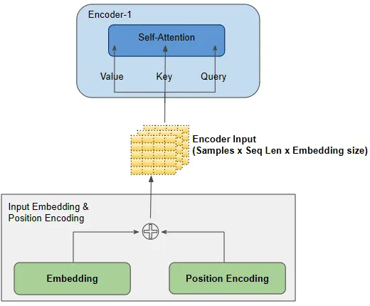</kbd>

       

    
    - The Input Embedding and Position Encoding layers produce a matrix of shape (Number of Samples, Sequence Length, Embedding Size) which is fed to the Query, Key, and Value of the first Encoder in the stack.  To make it simple to visualize, we will drop the Batch dimension in our pictures and focus on the remaining dimensions.
       

        
        
<kbd>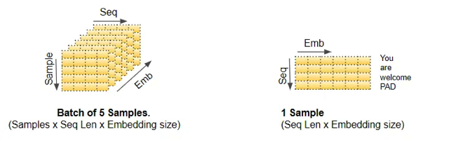</kbd>

         

  
  - Linear Layers
     

      
      
<kbd></kbd>

       

    
    - There are three separate Linear layers for the Query, Key, and Value. Each Linear layer has its own weights. The input is passed through these Linear layers to produce the Q, K, and V matrices.
       

  
  - Splitting data across Attention heads
     

    
    - However, the important thing to understand is that this is a \\*logical split only\\*.  The Query, Key, and Value are \\*not physically split into separate matrices\\*, one for each Attention head. A single data matrix is used for the Query, Key, and Value, respectively, with \\*logically separate sections\\* of the matrix for each Attention head.  Similarly, there are \\*not separate Linear layers\\*, one for each Attention head. All the Attention heads share the same Linear layer but simply operate on their ‘own’ \\*logical section\\* of the data matrix.
> [!NOTE]
> Đại khái là chỉ split về logic thôi chứ vẫn chỉ có 1
> bộ Query, Key, Value tương ứng với 3 Linear thôi.
> Nó sẽ kiểu như partition (phân vùng) ra để handle
> cho mỗi Head 1 vùng

       

        
        
<kbd>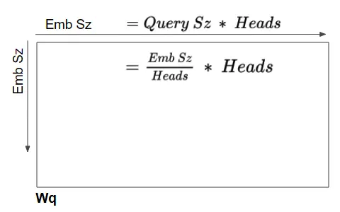</kbd>

> [!NOTE]
> This logical split is done by partitioning the input data as well as the
> Linear layer weights uniformly across the Attention heads. We can
> achieve this by choosing the Query Size as below:
>
> Query Size = Embedding Size / Number of heads

         

        
        
<kbd>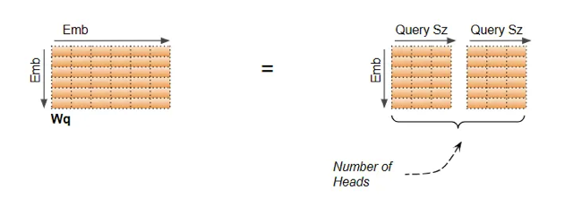</kbd>

> [!NOTE]
> In our example, that is why the Query Size = 6/2 = 3. Even though
> the layer weight (and input data) is a single matrix we can think of
> it as ‘**stacking together**’ the separate layer weights for each head.

         

      
      - The computations for all Heads can be therefore be achieved via a \\*single matrix operation\\* rather than requiring N separate operations. This makes the computations more \\*efficient\\* and keeps the model \\*simple\\* because fewer Linear layers are required, while still achieving the \\*power of the independent\\* Attention heads.
         

  
  - Reshaping the Q, K, and V matrices
     

    
    - The Q, K, and V matrices output by the Linear layers are reshaped to include an explicit Head dimension. Now each ‘slice’ corresponds to a matrix per head.  This matrix is reshaped again by swapping the Head and Sequence dimensions. Although the Batch dimension is not drawn, the dimensions of Q are now (Batch, Head, Sequence, Query size).
       

        
        
<kbd>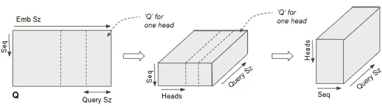</kbd>

         

        
        
<kbd>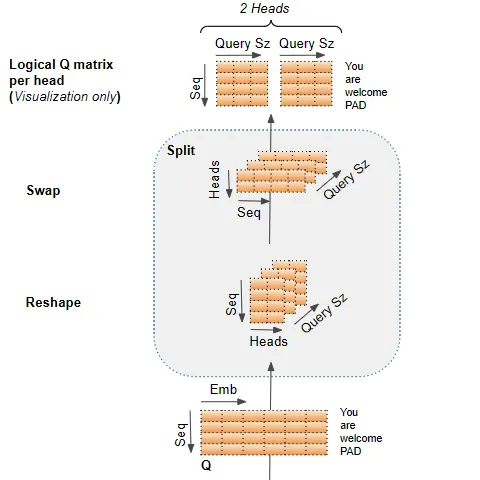</kbd>

> [!NOTE]
> In the picture below, we can see the complete process of splitting our
> example Q matrix, after coming out of the Linear layer.
>
> The final stage is for visualization only — although the Q matrix is a
> single matrix, we can think of it as a logically separate Q matrix per
> head.

         

  
  - Compute the Attention Score for each head
     

      
      
<kbd>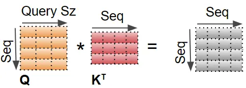</kbd>

> [!NOTE]
> We now have the 3 matrices, Q, K, and V, split across the heads.
> These are used to compute the Attention Score.
>
> We will show the computations for a single head using just the last two
> dimensions (Sequence and Query size) and skip the first two
> dimensions (Batch and Head). Essentially, we can imagine that the
> computations we’re looking at are getting ‘repeated’ for each head and
> for each sample in the batch (although, obviously, they are happening
> as a single matrix operation, and not as a loop).
>
> The first step is to do a matrix multiplication between Q and K.

       

      
      
<kbd>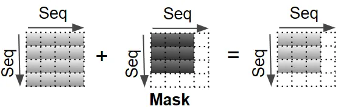</kbd>

> [!NOTE]
> A Mask value is now added to the result. In the Encoder Self-attention, the
> mask is used to mask out the Padding values so that they don’t participate
> in the Attention Score.
>
> Different masks are applied in the Decoder Self-attention and in the
> Decoder Encoder-Attention which we’ll come to a little later in the flow.

       

      
      
<kbd>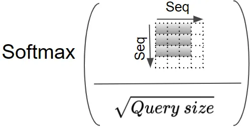</kbd>

> [!NOTE]
> The result is now scaled by dividing by the square root of the
> Query size, and then a Softmax is applied to it.

       

      
      
<kbd>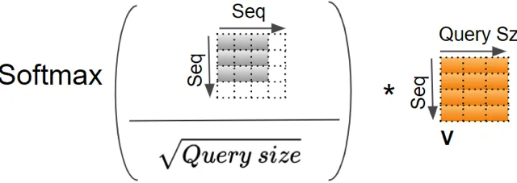</kbd>

> [!NOTE]
> Another matrix multiplication is performed between the output of the Softmax and the V matrix.

       

      
      
<kbd>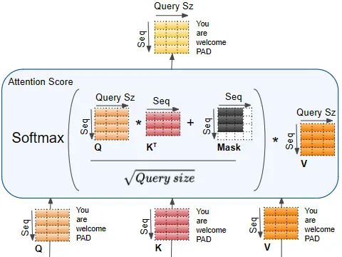</kbd>

> [!NOTE]
> The complete Attention Score calculation in the Encoder
> Self-attention is as below:

       

  
  - Merge each Head’s Attention Scores together
     

    
    - We now have separate Attention Scores for each head, which need to be combined together into a single score. This Merge operation is essentially the reverse of the Split operation.  It is done by simply reshaping the result matrix to eliminate the Head dimension. The steps are:  Reshape the Attention Score matrix by swapping the Head and Sequence dimensions. In other words, the matrix shape goes from (Batch, Head, Sequence, Query size) to (Batch, Sequence, Head, Query size). Collapse the Head dimension by reshaping to (Batch, Sequence, Head * Query size). This effectively concatenates the Attention Score vectors for each head into a single merged Attention Score. Since Embedding size =Head * Query size, the merged Score is (Batch, Sequence, Embedding size). In the picture below, we can see the complete process of merging for the example Score matrix.
       

        
        
<kbd>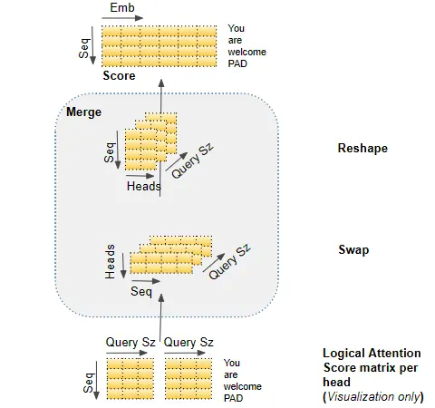</kbd>

         

  
  - End-to-end Multi-head Attention
     

      
      
<kbd>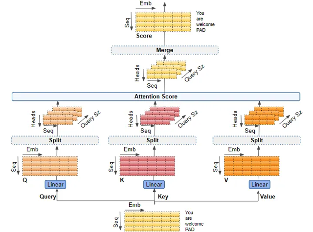</kbd>

> [!NOTE]
> Putting it all together, this is the end-to-end
> flow of the Multi-head Attention.

       

  
  - Multi-head split captures richer interpretations
     

    
    - An Embedding vector captures the meaning of a word. In the case of Multi-head Attention, as we have seen, the Embedding vectors for the input (and target) sequence gets logically split across multiple heads. What is the significance of this?  This means that separate sections of the Embedding can learn different aspects of the meanings of each word, as it relates to other words in the sequence. This allows the Transformer to capture richer interpretations of the sequence.  This may not be a realistic example, but it might help to build intuition. For instance, one section might capture the ‘gender-ness’ (male, female, neuter) of a noun while another might capture the ‘cardinality’ (singular vs plural) of a noun. This might be important during translation because, in many languages, the verb that needs to be used depends on these factors.
       

        
        
<kbd>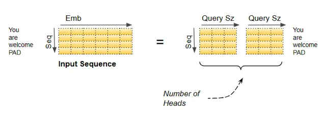</kbd>

         

  
  - Decoder Self-Attention and Masking
     

    
    - The Decoder Self-Attention works just like the Encoder Self-Attention, except that it operates on each word of the target sequence.
       

        
        
<kbd>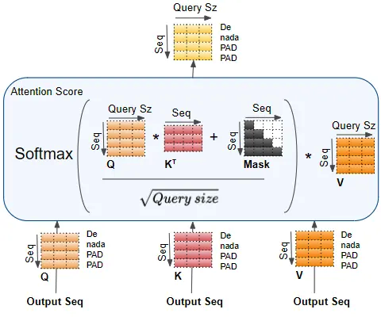</kbd>

         

  
  - Decoder Encoder-Decoder Attention and Masking
     

    
    - The Encoder-Decoder Attention takes its input from two sources. Therefore, unlike the Encoder Self-Attention, which computes the interaction between each input word with other input words, and Decoder Self-Attention which computes the interaction between each target word with other target words, the Encoder-Decoder Attention computes the interaction between each target word with each input word.  Therefore each cell in the resulting Attention Score corresponds to the interaction between one Q (ie. target sequence word) with all other K (ie. input sequence) words and all V (ie. input sequence) words.  Similarly, the Masking masks out the later words in the target output, as was explained in detail in the \\_second article\\_ of the series.
       

        
        
<kbd>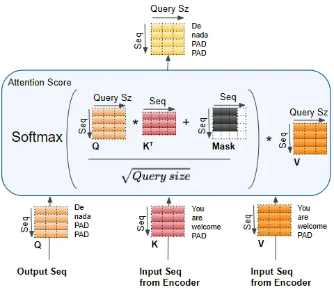</kbd>

         

- Why They Work So Well
> [!NOTE]
> https://towardsdatascience.com/transformers-explained-visually-not-just-how-but-why-they-work-so-well-d840bd61a9d3

   

  
  - How does the input sequence reach the Attention module
     

      
      
<kbd>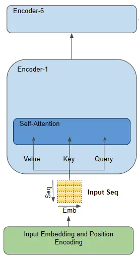</kbd>

       

    
    - As an example, let’s say that we’re working on an English-to-Spanish translation problem, where one sample source sequence is “The ball is blue”. The target sequence is “La bola es azul”.  The source sequence is first passed through the Embedding and Position Encoding layer, which generates embedding vectors for each word in the sequence. The embedding is passed to the Encoder where it first reaches the Attention module.  Within Attention, the embedded sequence is passed through three Linear layers which produce three separate matrices — known as the Q, K, and K. These are the three matrices that are used to compute the Attention Score.  The important thing to keep in mind is that each ‘row’ of these matrices corresponds to one word in the source sequence.
       

        
        
<kbd>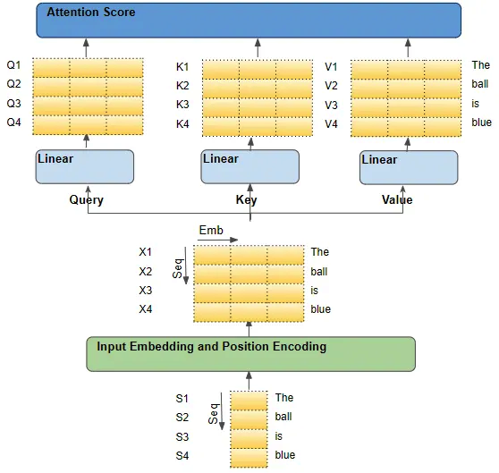</kbd>

         

  
  - Each input row is a word from the sequence
     

    
    - The way we will understand what is going on with Attention, is by starting with the individual words in the source sequence, and then following their path as they make their way through the Transformer. In particular, we want to focus on what goes on inside the Attention Module.  That will help us clearly see how each word in the source and target sequences interacts with other words in the source and target sequences.  So as we go through this explanation, concentrate on what operations are being performed on each word, and how each vector maps to the original input word. We do not need to worry about many of the other details such as matrix shapes, specifics of the arithmetic calculations, multiple attention heads, and so on if they are not directly relevant to where each word is going.  So to simplify the explanation and the visualization, let’s ignore the embedding dimension and track just the rows for each word.
       

        
        
<kbd>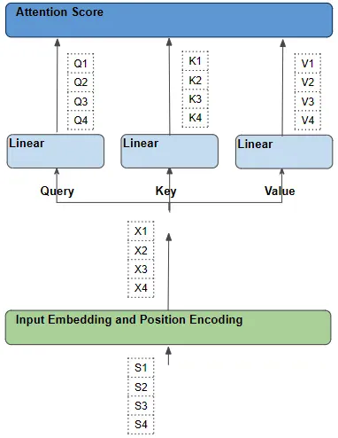</kbd>

> [!NOTE]
> Để đơn giản, tạm thời quên đi mỗi một
> Q1, Q2, K1, K2,..là 1 embedding
> vector, cứ coi như 1 cục đi

         

  
  - Each word goes through a series of learnable transformations
     

    
    - Each such row has been generated from its corresponding source word by a series of transformations — embedding, position encoding, and linear layer.  \\*All of those transformations are trainable operations. This means that the weights used in those operations are not pre-decided but are learned by the model in such a way that they produce the desired output predictions.  \\*The key question is, how does the Transformer figure out what set of weights will give it the best results? Keep this point in the back of your mind as we will come back to it a little later.
       

        
        
<kbd>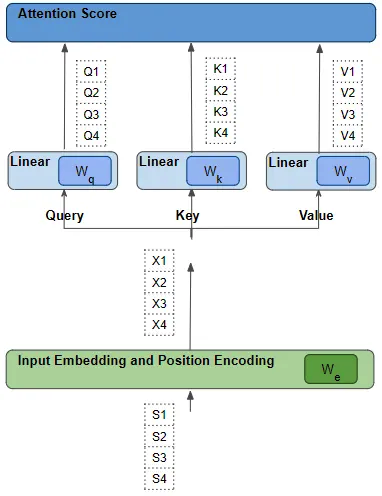</kbd>

         

  
  - Attention Score — Dot Product between Query and Key words
     

      
      
<kbd>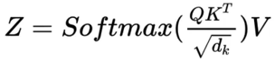</kbd>

      
<kbd></kbd>

      
<kbd></kbd>

       

      
      
<kbd>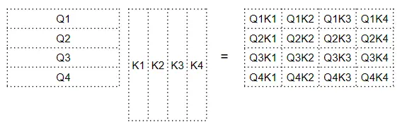</kbd>

> [!NOTE]
> As we can see from the formula, the first step within Attention is to do a matrix multiply
> (ie. dot product) between the Query (Q) matrix and a transpose of the Key (K) matrix.
> Watch what happens to each word.
>
> We produce an intermediate matrix (let’s call it a ‘factor’ matrix) where each cell is a
> matrix multiplication between two words.

       

      
      
<kbd>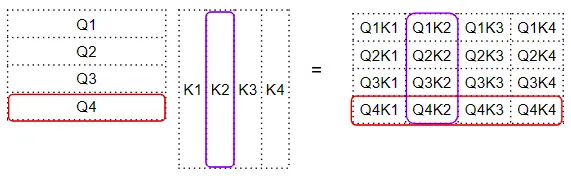</kbd>

> [!NOTE]
> For instance, each column in the fourth row corresponds to a dot product
> between the fourth Query word with every Key word.

       

  
  - Attention Score — Dot Product between Query-Key and Value word
     

      
      
<kbd>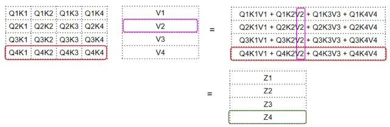</kbd>

> [!NOTE]
> The next step is a matrix multiply between this intermediate ‘factor’ matrix and the
> Value (V) matrix, to produce the attention score that is output by the attention
> module. Here we can see that the fourth row corresponds to the fourth Query word
> matrix multiplied with all other Key and Value words.

       

      
      
<kbd>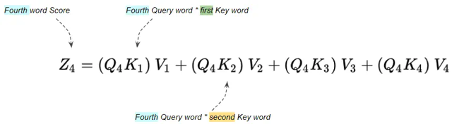</kbd>

> [!NOTE]
> This produces the Attention Score vector (Z) that is output by the Attention Module.
>
> The way to think about the output score is that, for each word, it is the encoded value of
> every word from the “Value” matrix, weighted by the “factor” matrix. The factor matrix is the
> dot product of the Query value for that specific word with the Key value of all words.

       

  
  - What is the role of the Query, Key, and Value words?
     

      
      
<kbd>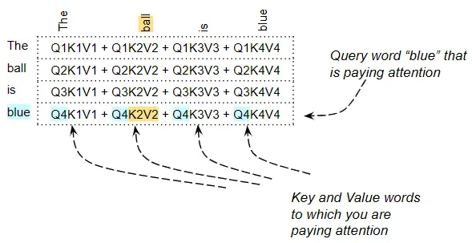</kbd>

> [!NOTE]
> The Query word can be interpreted as the word for which we are
> calculating Attention. The Key and Value word is the word to which we are
> paying attention ie. how relevant is that word to the Query word.

       

    
    - For example, for the sentence, “The ball is blue”, the row for the word “blue” will contain the attention scores for “blue” with every other word. Here, “blue” is the Query word, and the other words are the “Key/Value”.  There are other operations being performed such as a division and a softmax, but we can ignore them in this article. They just change the numeric values in the matrices but don’t affect the position of each word row in the matrix. Nor do they involve any inter-word interactions.
       

  
  - Dot Product tells us the similarity between words
     

    
    - So we have seen that the Attention Score is capturing some interaction between a particular word, and every other word in the sentence, by doing a dot product, and then adding them up. But how does the matrix multiply help the Transformer determine the relevance between two words?  To understand this, remember that the Query, Key, and Value rows are actually vectors with an Embedding dimension. Let’s zoom in on how the matrix multiplication between those vectors is calculated.
       

        
        
<kbd>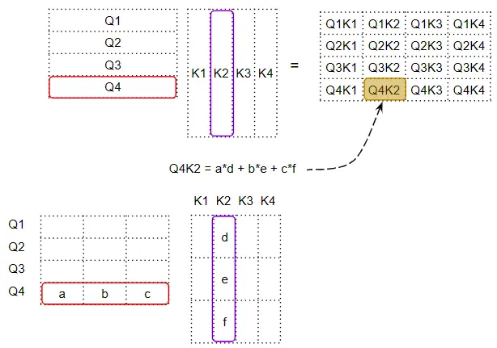</kbd>

         

      
      - When we do a dot product between two vectors, we multiply pairs of numbers and then sum them up.  If the two paired numbers (eg. ‘a’ and ‘d’ above) are both positive or both negative, then the product will be positive. The product will increase the final summation.  If one number is positive and the other negative, then the product will be negative. The product will reduce the final summation.  If the product is positive, the larger the two numbers, the more they contribute to the final summation.  This means that if the signs of the corresponding numbers in the two vectors are aligned, the final sum will be larger.
         

  
  - How does the Transformer learn the relevance between words?
     

    
    - This notion of the Dot Product applies to the attention score as well. If the vectors for two words are more aligned, the attention score will be higher.  So what is the behavior we want for the Transformer?  We want the attention score to be high for two words that are relevant to each other in the sentence. And we want the score to be low for two words that are unrelated to one another.  For example, for the sentence, “The black cat drank the milk”, the word “milk” is very relevant to “drank”, perhaps slightly less relevant to “cat”, and irrelevant to “black”. We want “milk” and “drank” to produce a high attention score, for “milk” and “cat” to produce a slightly lower score, and for “milk” and “black”, to produce a negligible score.  This is the output we want the model to learn to produce.  For this to happen, the word vectors for “milk” and “drank” must be aligned. The vectors for “milk” and “cat” will diverge somewhat. And they will be quite different for “milk” and “black”.  Let’s go back to the point we had kept at the back of our minds — how does the Transformer figure out what set of weights will give it the best results?  The word vectors are generated based on the word embeddings and the weights of the Linear layers. Therefore the Transformer can learn those embeddings, Linear weights, and so on to produce the word vectors as required above.  In other words, it will learn those embeddings and weights in such a way that if two words in a sentence are relevant to each other, then their word vectors will be aligned. And hence produce a higher attention score. For words that are not relevant to each other, the word vectors will not be aligned and will produce a lower attention score.  Therefore the embeddings for “milk” and “drank” will be very aligned and produce a high attention score. They will diverge somewhat for “milk” and “cat” to produce a slightly lower score and will be quite different for “milk” and “black”, to produce a low score.  This then is the principle behind the Attention module.
       

  
  - Summarizing — What makes the Transformer tick?
     

    
    - The dot product between the Query and Key computes the relevance between each pair of words. This relevance is then used as a “factor” to compute a weighted sum of all the Value words. That weighted sum is output as the Attention Score.  The Transformer learns embeddings etc, in such a way that words that are relevant to one another are more aligned.  This is one reason for introducing the three Linear layers and making three versions of the input sequence, for the Query, Key, and Value. That gives the Attention module some more parameters that it is able to learn to tune the creation of the word vectors.
       

  
  - Encoder Self-Attention in the Transformer
     

      
      
<kbd></kbd>

       

    
    - Attention is used in the Transformer in three places:  - Self-attention in the Encoder — the source sequence pays attention to itself  - Self-attention in the Decoder — the target sequence pays attention to itself  - Encoder-Decoder-attention in the Decoder — the target sequence pays attention to the source sequence  In the Encoder Self Attention, we compute the relevance of each word in the source sentence to each other word in the source sentence. This happens in all the Encoders in the stack.
       

  
  - Decoder Self-Attention in the Transformer
     

      
      
<kbd></kbd>

> [!NOTE]
> Most of what we’ve just seen in the Encoder Self Attention applies to Attention in
> the Decoder as well, with a few small but significant differences.

       

      
      
<kbd>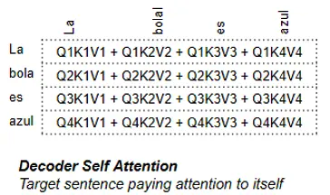</kbd>

> [!NOTE]
> In the Decoder Self Attention, we compute the
> relevance of each word in the target sentence to each
> other word in the target sentence.

       

  
  - Encoder-Decoder Attention in the Transformer
     

      
      
<kbd>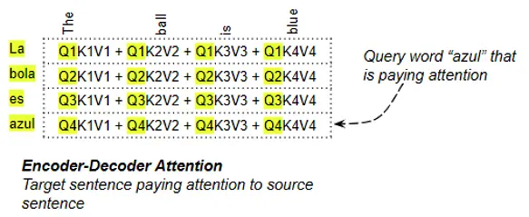</kbd>

> [!NOTE]
> In the Encoder-Decoder Attention, the Query is obtained from the target sentence
> and the Key/Value from the source sentence. Thus it computes the relevance of
> each word in the target sentence to each word in the source sentence.

       

### Quiz

 

  
  
<kbd></kbd>

   

  
  
<kbd>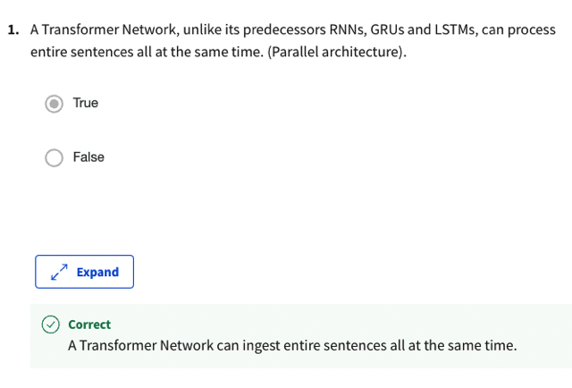</kbd>

   

  
  
<kbd>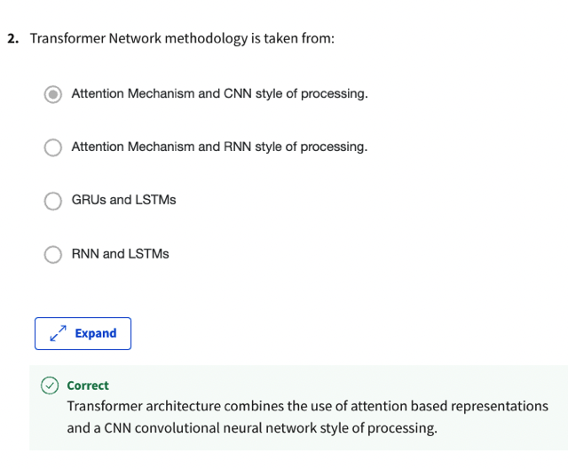</kbd>

   

  
  
<kbd>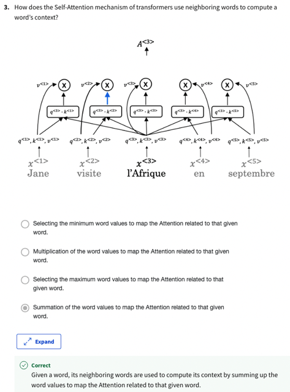</kbd>

   

  
  
<kbd>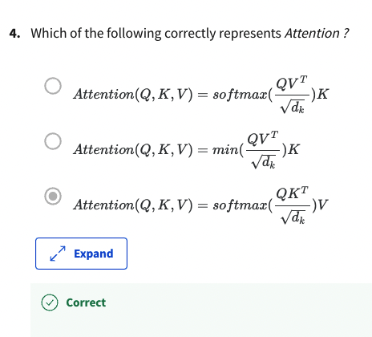</kbd>

   

  
  
<kbd>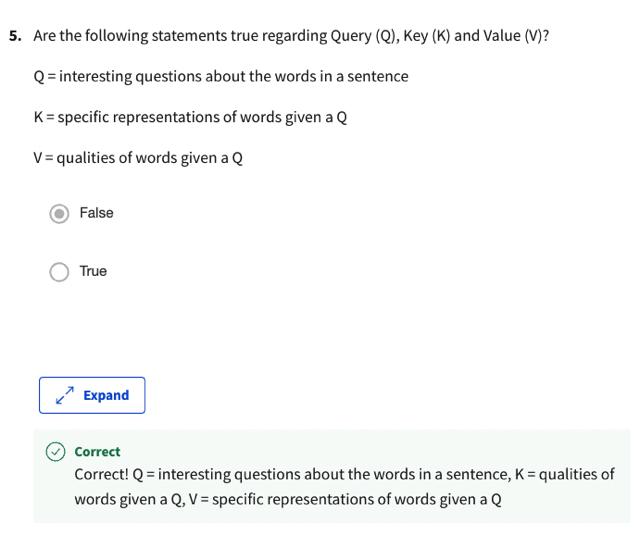</kbd>

> [!NOTE]
> Đại khái là Q đặt ra câu hỏi, K xác định câu trả
> lời nào (từ nào) có ý nghĩa nhất / thích hợp
> nhất / V là đại diện của từ đó

   

  
  
<kbd>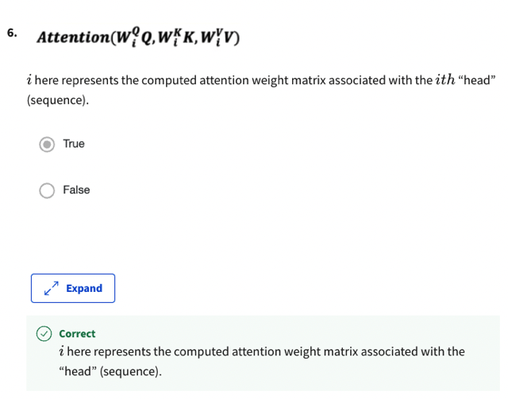</kbd>

   

  
  
<kbd>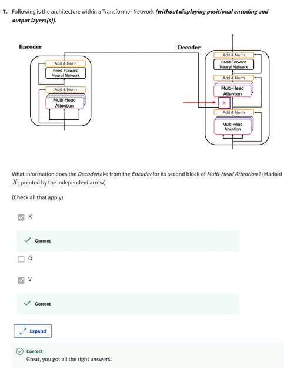</kbd>

   

  
  
<kbd>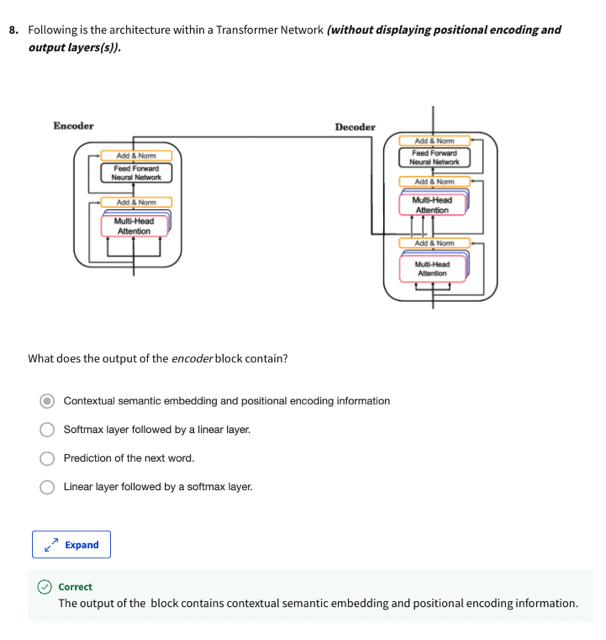</kbd>

   

  
  
<kbd></kbd>

   

  
  
<kbd>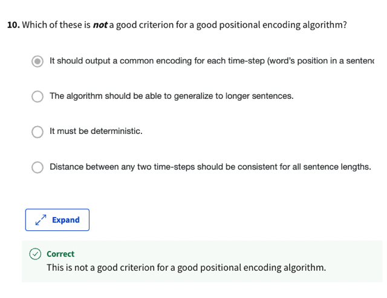</kbd>

> [!NOTE]
> "Unique", not "common" Đại khái là positional encoding phải
> unique ở mỗi từ, không phải chung cho mỗi từ

   

### Programming Assignment

 

- Welcome to Week 4's assignment, the last assignment of Course 5 of the Deep Learning Specialization! And congratulations on making it to the last assignment of the entire Deep Learning Specialization - you're almost done!  Earlier in the course, you've implemented sequential neural networks such as RNNs, GRUs, and LSTMs. In this notebook you'll explore the Transformer architecture, a neural network that takes advantage of parallel processing and allows you to substantially speed up the training process.  \\*After this assignment you'll be able to\\*:  • Create \\/\\*positional encodings\\*\\/ to capture \\*sequential relationships\\* in data  • Calculate \\/\\*scaled dot-product self-attention\\*\\/ with word embeddings  • Implement \\/\\*masked multi-head attention\\*\\/  • Build and train a\\/ Transformer model\\/
   

  
  - Packgages
     

      
      
<kbd>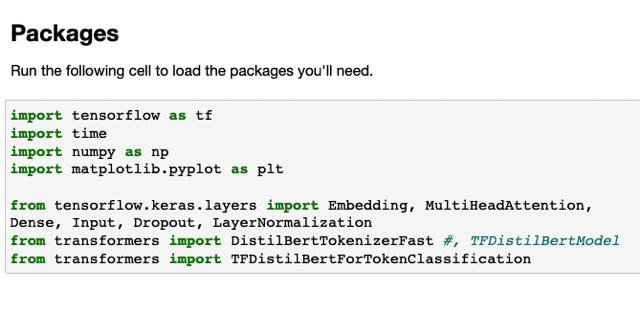</kbd>

       

  
  - 1 - Positional Encoding
     

      
      
<kbd>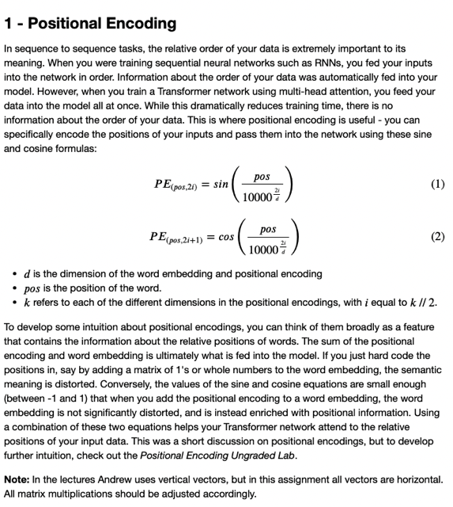</kbd>

> [!NOTE]
> Đại khái là với RNN thì do mình feed info vào từng từ một nên cơ bản
> nó có thông tin vị trí của các từ trong câu, còn với cái này
> (Transformer network) tất cả các từ xử lý cùng lúc nên không biết thứ
> tự của từ trong câu, positional encoding là để cung cấp thông tin này

> [!NOTE]
> Đại khái là bằng cách dùng sin() và cos() thông tin vị trí trong positional
> encoding khiến giá trị bị khống chế trong -1 1 = nhỏ nên word
> embedding không bị distort. Đại khái vậy còn sẽ hiểu rõ hơn ở
> Ungraded Lab

       

      
      
<kbd>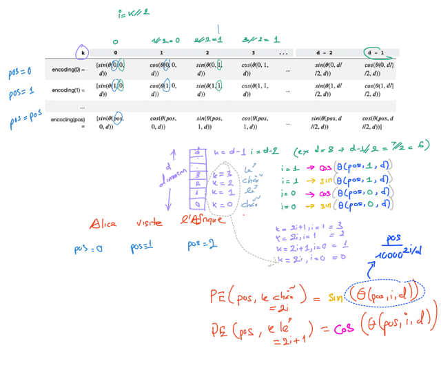</kbd>

      
<kbd></kbd>

      
<kbd>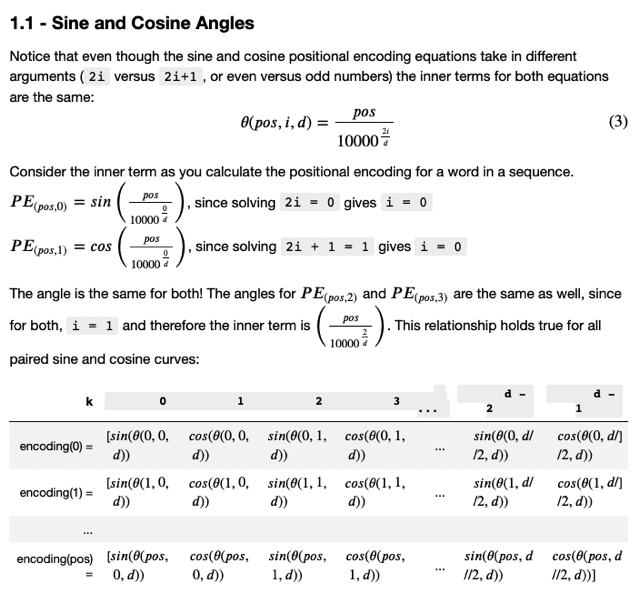</kbd>

> [!NOTE]
> 'd' = **embedding_dimension**

       

  
  - 1.1 - Sine and Cosine Angles
     

    
    - Exercise 1 - get_angles
       

        
        
<kbd>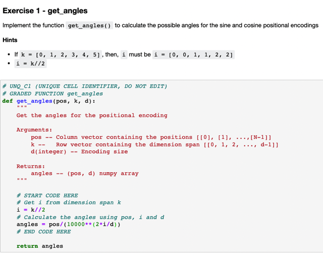</kbd>

         

        
        
<kbd>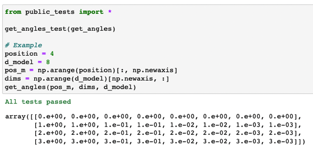</kbd>

> [!NOTE]
> d_model = encoding size = đại
> khái là độ dài của encoding /
> embedding vector = **embedding_dimension**

         

  
  - 1.2 - Sine and Cosine Positional Encodings
     

    
    - Exercise 2 - positional_encoding
       

        
        
<kbd>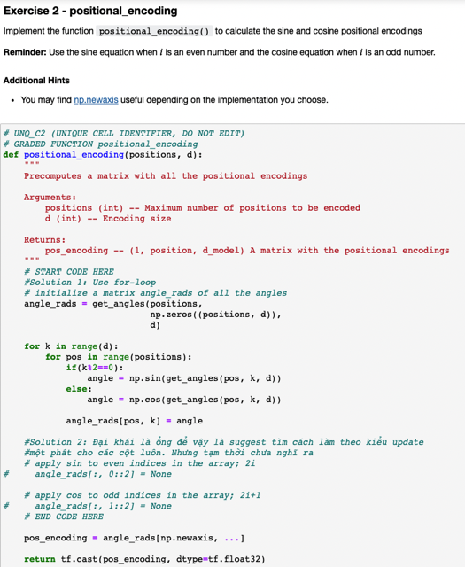</kbd>

> [!NOTE]
> Tạm thời làm bằng for loop (vẫn đúng) cho qua dc phần này
> cho rồi nhưng nên quay lại làm theo kiểu được suggest để
> hiểu

         

        
        
<kbd>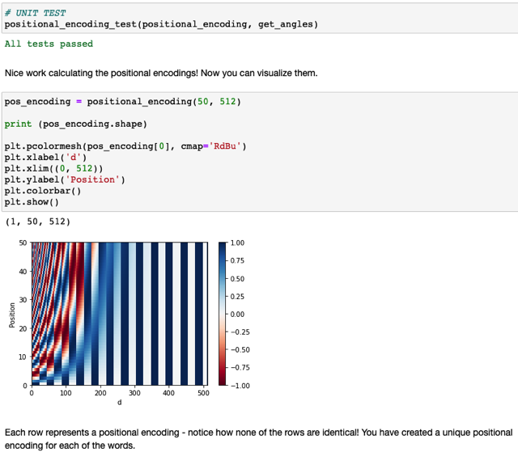</kbd>

         

        
        
<kbd>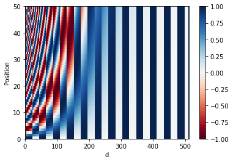</kbd>

         

        
        
<kbd>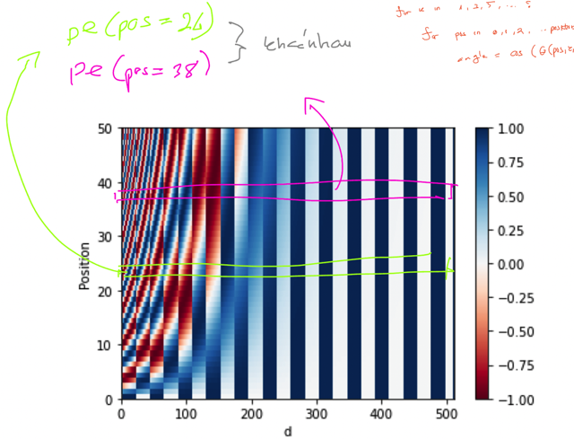</kbd>

        
<kbd></kbd>

        
<kbd>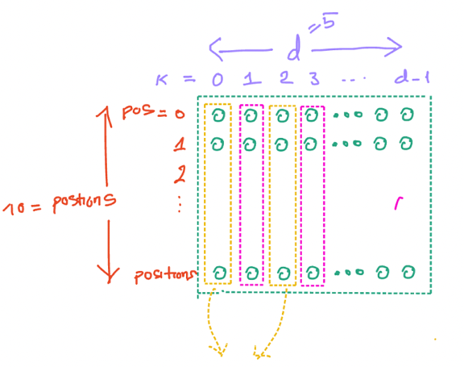</kbd>

         

  
  - 2 - Masking  There are two types of masks that are useful when building your Transformer network: the \\/padding mask\\/ and the \\/look-ahead mask\\/. Both help the softmax computation give the appropriate weights to the words in your input sentence.
     

    
    - 2.1 - Padding Mask
       

        
        
<kbd>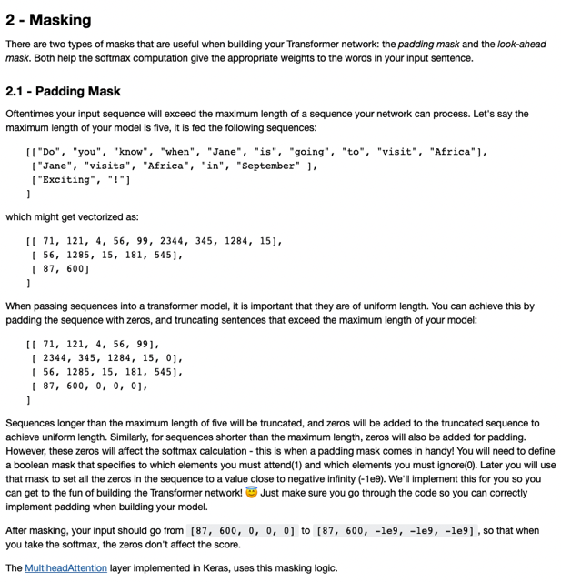</kbd>

> [!NOTE]
> Đại khái là khi bỏ input sequence vào (vào Transformer model) thì cần các
> sequence có cùng độ dài. Kiểu như các câu phải có cùng độ dài
>
> Để làm vậy thì câu dài quá Max-len sẽ bị truncated, câu ngắn hơn thì thêm
> zeros vào (padding)
>
> Mà làm vậy thì các zeros number sẽ ảnh hưởng đến kết quả tính toán của
> hàm softmax, nên cần dùng cái gọi là  Masking.
>
> Đại khái là nó sẽ hướng dẫn là số nào thì "tính", số nào thì "bỏ qua"
>
> Ổng làm giùm mình, chỉ cần đảm bảo hiểu làm được

         

        
        
<kbd>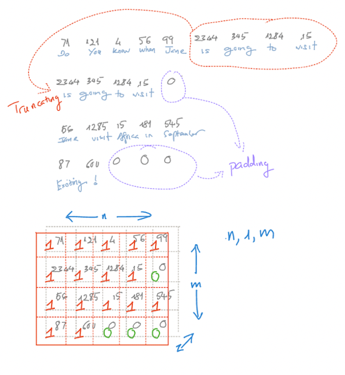</kbd>

        
<kbd></kbd>

        
<kbd>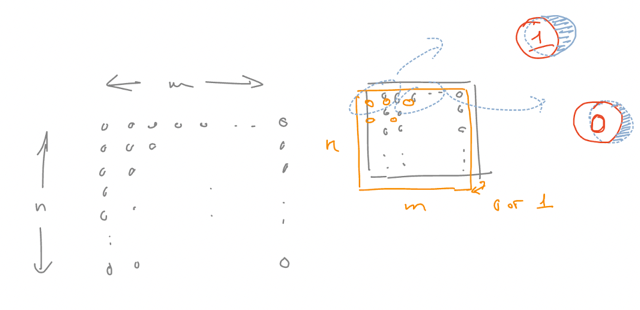</kbd>

         

        
        
<kbd>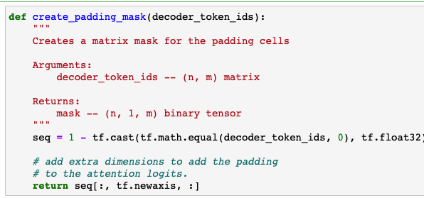</kbd>

         

        
        
<kbd>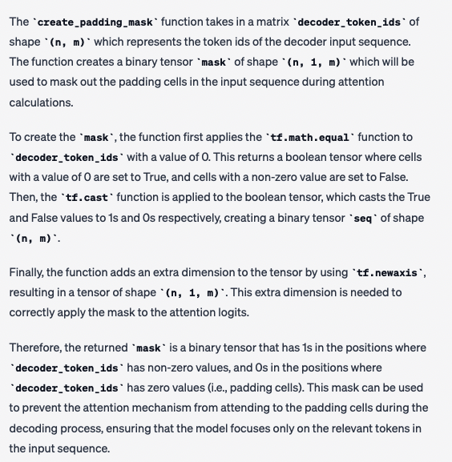</kbd>

> [!NOTE]
> Đại khái là nó dùng tf.math.equal với arg = 0 và
> decoder_token_ids) để tạo matrix và chỗ nào
> khác 0 thì True, = 0 thì False
>
> Sau đó nó biến True thành 1 , False thành 0 bằng tf.cast
>
> Rồi Add cái matrix đó vào để từ 2D (năm) thành 1 cái volume
> 3D (m,1,m) dùng function tf.newaxis
>
> Kiểu như dài nhiêu rộng nhiêu, giờ có thêm sâu bao nhiêu nữa

         

        
        
<kbd>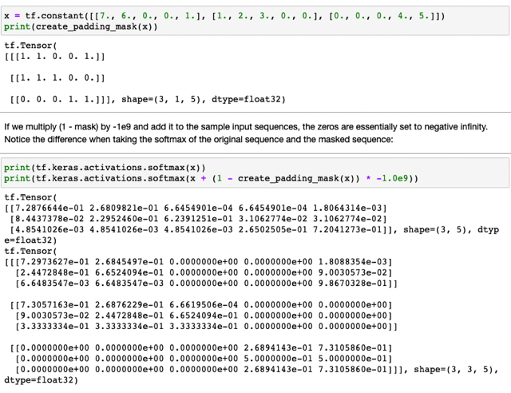</kbd>

         

        
        
<kbd>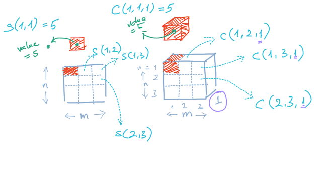</kbd>

> [!NOTE]
> Giải thích cái khái niệm add
> thêm 1 dimension là sao

         

    
    - 2.2 - Look-ahead Mask
       

        
        
<kbd>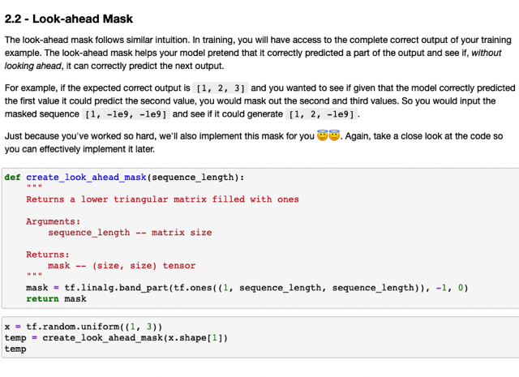</kbd>

> [!NOTE]
> Chưa hiểu lắm cách làm

         

        
        
<kbd>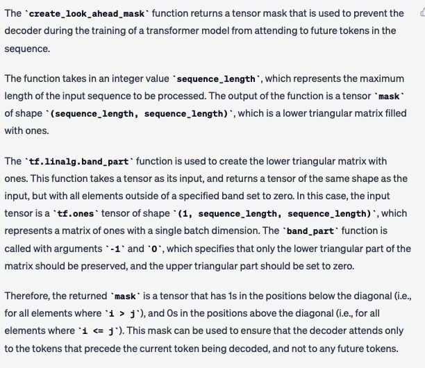</kbd>

         

  
  - 3 - Self-Attention
     

    
    - Exercise 3 - scaled_dot_product_attention
       

        
        
<kbd>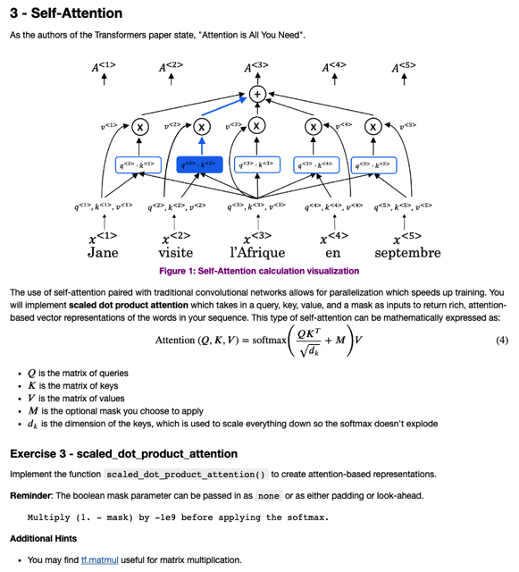</kbd>

         

        
        
<kbd>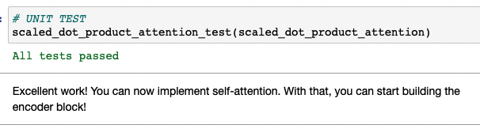</kbd>

        
<kbd></kbd>

        
<kbd>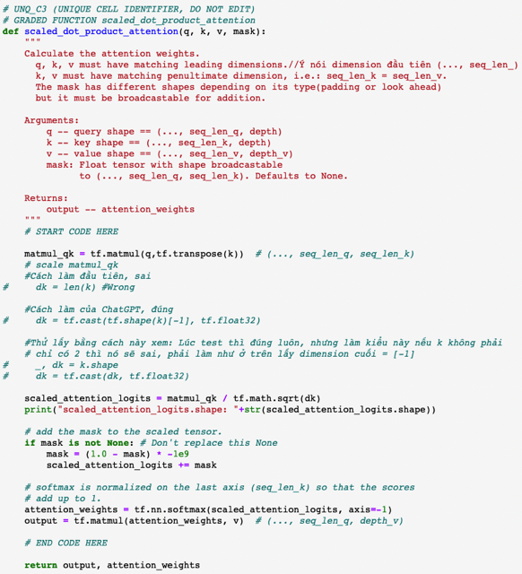</kbd>

> [!NOTE]
> 1. Tính Q@K.T: Dùng hàm tf.matmul và tf.transpose thôi, đơn giản
>
> (..., seq_len_q, depth) @ (..., seq_len_k, depth).T  = (..., seq_len_q,
> seq_len_k)
>
> 2. tính sqrt(dk): Cái này dk chỉ nói là dimension của matrix k, trong bài
> giảng cũng không nói rõ làm stuck chỗ này cho tới khi hỏi ChatGPT. Thì
> ra đại khái là tính như lấy shape rồi lấy cái size của dimension cuối rồi
> cát thành float. Nói tóm lại, trong hướng dẫn nó nói dimension của k tức
> là size của dimension cuối vậy tức là depth? - Đúng là depth
> Nhưng phải làm theo kiểu của ChatGPT vì đảm bao luôn đúng
> bởi access dimension cuối bằng [-1]
>
> 3. Tính cái M - mask cũng không được hướng dẫn rõ ràng
> chỉ nói: "Multiply (1. - mask) by -1e9 before applying the softmax."
> hoá ra phải tính mask = (1 - mask)* -1e9 
> Chưa hiểu tại sao.
>
> 4. Tính cái cục [QK.t/sqrt(dk)] - M rồi bỏ vào softmax: Không đến nổi
> không hiểu
>
> 5. Nhân với V: Matlmul thôi.
>
> Tóm lại stuck ở cái chỗ chưa biết dk là cái gì và mask

> [!NOTE]
> Tìm hiểu lại Mask: Tại sao
> mask = (1 - mask) * -1e9

> [!NOTE]
> Các matrix q,k,v có shape như vậy là sao chưa hiểu luôn
>
> ***depth** sẽ chính là **embedding_dim**

         

        
        
<kbd>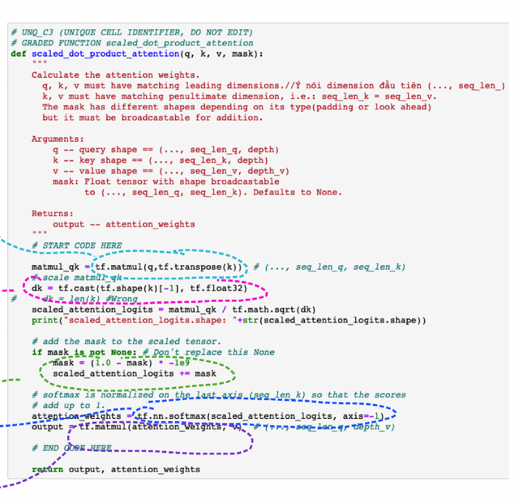</kbd>

         

        
        
<kbd>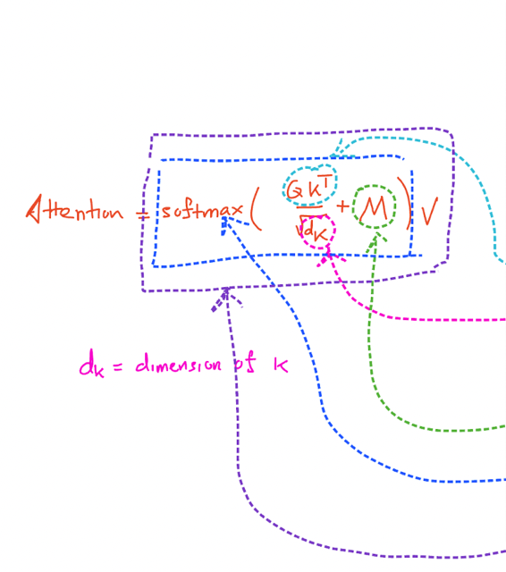</kbd>

         

  
  - 4 - Encoder
     

    
    - 4.1 Encoder Layer
       

        
        
<kbd>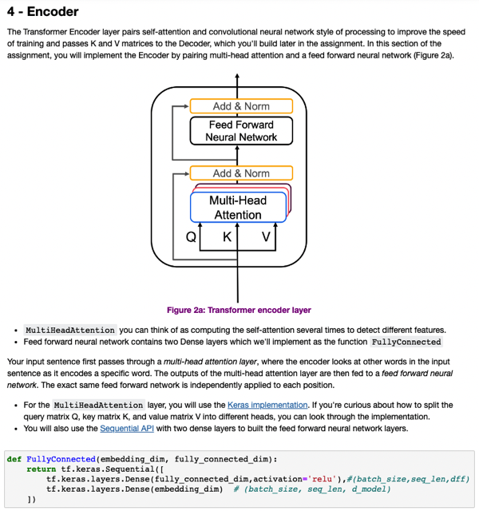</kbd>

         

        
        
<kbd>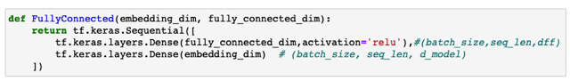</kbd>

> [!NOTE]
> Tại sao: 
> (batch_size, seq_len, **dff***(là gì))
> (batch_size, seq_len,**d_model**
>
> -> **dff** chính là 'fully connected dimension' - size của Fully Connected layer
>
> và **d_model**chính là embedding_dimension**: Size của embedded vector.**

         

      
      - Đại khái hiểu một điểm quan trọng là  Sau khi qua MHA, kết quả nó không ra liền cái embedding vector (hiểu đại khái là mấy cái vector A<1>,A<2>..trong hình vẽ của bài giảng) ..  ..Nói đúng hơn là "chưa vội" lấy kết quả của M.H.A làm word embedding vector..  ..mà những vector output sẽ bỏ vào 2 Dense layer nữa mới để nó học tiếp rồi mới lấy cái output từ đó làm embedding vector.
         

    
    - Exercise 4 - EncoderLayer
       

        
        
<kbd>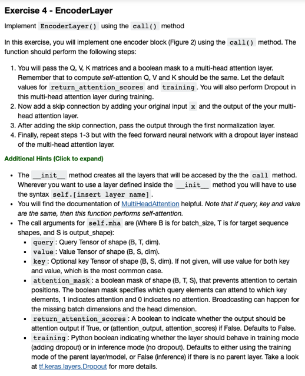</kbd>

         

        
        
<kbd>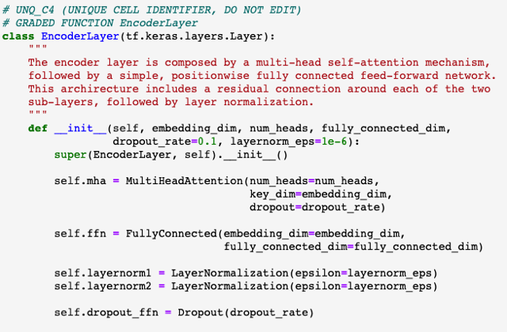</kbd>

> [!NOTE]
> Trong cái ini này thì **embedding_dim** chính là chiều dài của word
> embedded vector A<1>,A<2>.. Đọc trong doc cũng thấy args (không phải
> call argument) thì constructor của Multi-head Attention bỏ vào:
> **num_heads** = Số attention head, trong bài giảng có nói là **"h"**
> **key_dim** = **Size của each attention head for query and key**Tạm hiểu **"size of each attention head"**đại khái là **chiều dài của
> word embedding vector**

         

        
        
<kbd>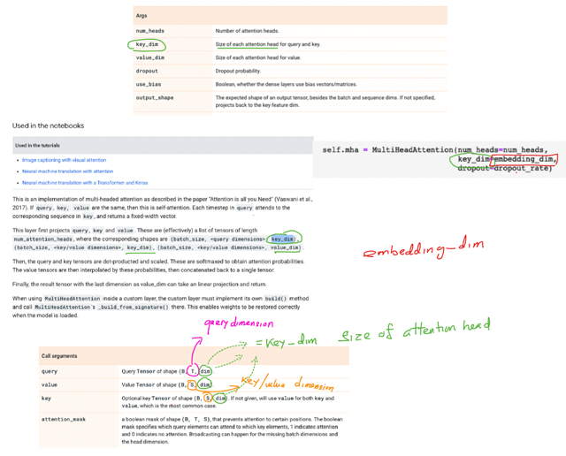</kbd>

         

        
        
<kbd>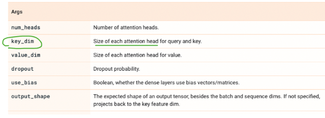</kbd>

         

        
        
<kbd>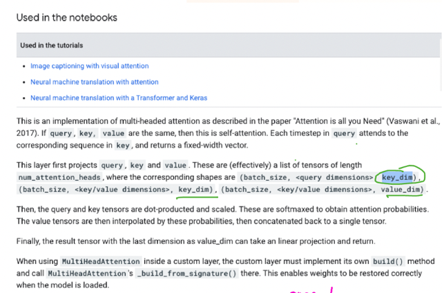</kbd>

         

        
        
<kbd>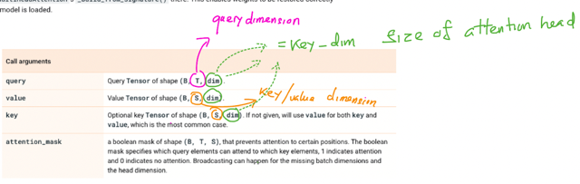</kbd>

         

        
        
<kbd>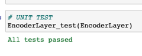</kbd>

        
<kbd></kbd>

        
<kbd>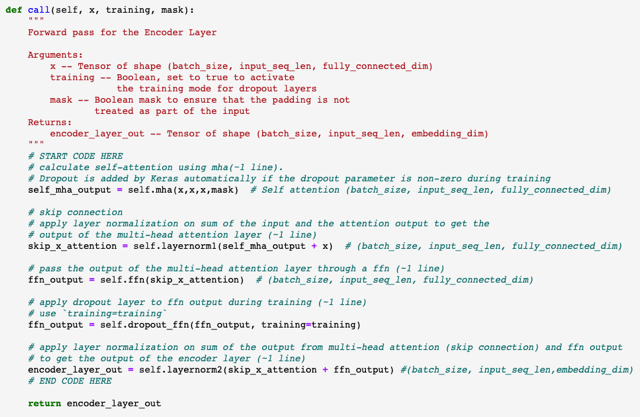</kbd>

> [!NOTE]
> Dù chưa hiểu như đại khái hiểu như vầy****để làm cái đoạn**self.mha_output = self.mha(x,x,x,mask) :** 
>
> Xem document của MultiHeadAttention thấy '**call argument**' của nó là 
> query, value, key, attention_mask,,,
>
> Trong đó query, value và key là **Tensor**với các shape:
>
> - Query: B = batch size, T , dim 
> (trong assignment hint có nói thêm T là **target sequence shape**)
>
> - Value: B, S, dim
> (trong assignment hint có nói thêm S là **ouput shape**)
>
> - Key: B, S, dim
>
> Mà x nó đã ghi sẵn là tensor of shape: 
> B - batch size, input_seq_len, fully_connected_dim
>
> **Đã nói rõ trong hint là sẽ bỏ Q, K, V vào (cùng với mask) vào 
> cái multihead attention layer mà nếu là đang compute self-attention
> thì Q, K, V bằng nhau. Vậy thì là bỏ x,x,x chứ gì nữa.**

> [!NOTE]
> Rồi x tại sao cái dimension thứ 3 của
> x là **fully_connected_dim**?
>
> Khả năng là do để output từ mha khớp với layer tiếp sau đó
> là Fully-Connected layer

> [!NOTE]
> Còn khúc dưới thì không đến nỗi khó quá ko làm được dù chưa thật rõ
> nhưng cứ làm theo hint

         

        
        
<kbd>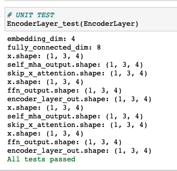</kbd>

        
<kbd></kbd>

        
<kbd>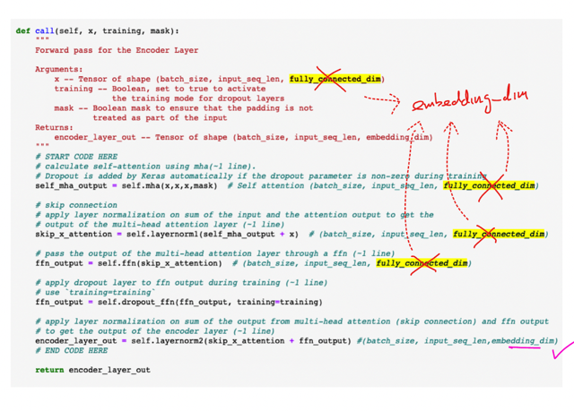</kbd>

> [!NOTE]
> Chỗ này mr Andrew
> hình như đã ghi sai shape

         

    
    - 4.2 - Full Encoder
       

        
        
<kbd>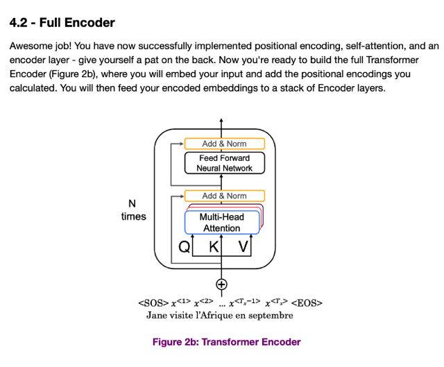</kbd>

         

    
    - Exercise 5 - Encoder
       

        
        
<kbd>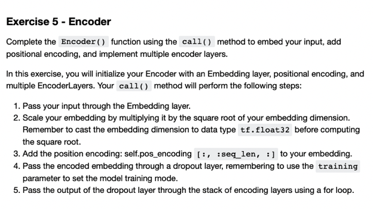</kbd>

         

        
        
<kbd>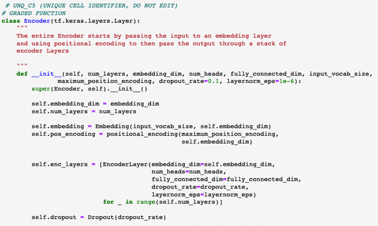</kbd>

         

      
      - Giải thích dòng: \\*self.embedding = Embedding(input_vocab_size, self.embedding_dim) \\*  mà lúc call nó biến x từ:  x  -- Tensor of shape (batch_size, input_seq_len)  để thành ra:  x = self.embedding(x)  # (batch_size, input_seq_len, \\*embedding_dim\\*)  --> Đại khái là bước này define một Embedding layer, bài trước ta đã làm (Embedding), nhưng ở đó mình dùng một pre-trained word embedding matrix để define ra Embedding layer và set cho nó trainable = False.  Còn bây giờ, đại khái là ta chỉ define nó trong 'hệ thống' và khi 'train' nó sẽ train luôn cái Embedding layer's weights = Đồng nghĩa nó sẽ tìm weights sao cho Embedding layer sẽ có thể tạo ra các word embedding vector đại diện tốt cho từ (nắm bắt được các tính chất của từ đó)  - Có thể confuse một chút là cái Self-Attention cũng tìm cách tạo các vector A<> đại diện cho từ sao cho nó nắm bắt ngữ cảnh của từ trong câu thì kệ nó cứ hiểu đại khái là cái (step) nào cũng có tác dụng của nó -> Không có gì confuse sâu khi đọc 4 articles của \\*Ketan Doshi,\\* ta hiểu rằng Self Attention layer sẽ 'add' thêm vào các embedding vector này các thông tin 'ngữ cảnh', tức \\*dimension của vector embedded vẫn vậy\\*, chỉ là được kiểu như là bồi đắp thêm/củng cố thêm thôi.
         

        
        - Embedding layer trong document arg  \\/\\*input_dim\\*\\/: "Integer. Size of the vocabulary",  \\*output_dim\\*: Integer. Dimension of the dense embedding  và  Input shape 2D tensor with shape: (batch_size, \\*input_length\\*).  Output shape 3D tensor with shape: (batch_size, \\*input_length\\*, \\*output_dim\\*).  Hiểu đại khái là đưa \\*input dim\\* là max của số lượng các từ cần embedded vậy không "liên quan" đến \\*input_length !???\\*  Nên khi define ở bài trước thì Embedding(vocab_size, embedding_dim) bài này thì Embedding (input_vacab_size, embedding_dim) Còn khi 'chạy' ta đưa vào một câu dài 10 thì input_length =10 - Input là tensor (batch_size, 10) thì nó cho ra - output là batch_size, 10, 50)
          
<kbd>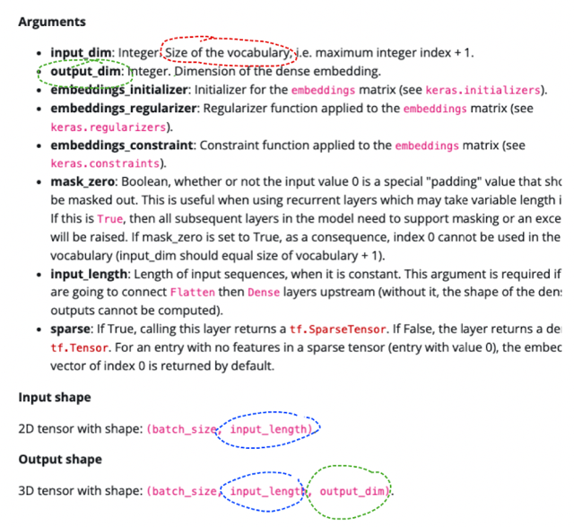</kbd>

          
<kbd></kbd>

> [!NOTE]
> Hiểu đại khái là đưa input dim là max của số
> lượng các từ cần embedded vậy không "liên
> quan" đến input_length Không biết hiểu vậy có
> đúng không!??? Quay lại sau

           

            
            
<kbd>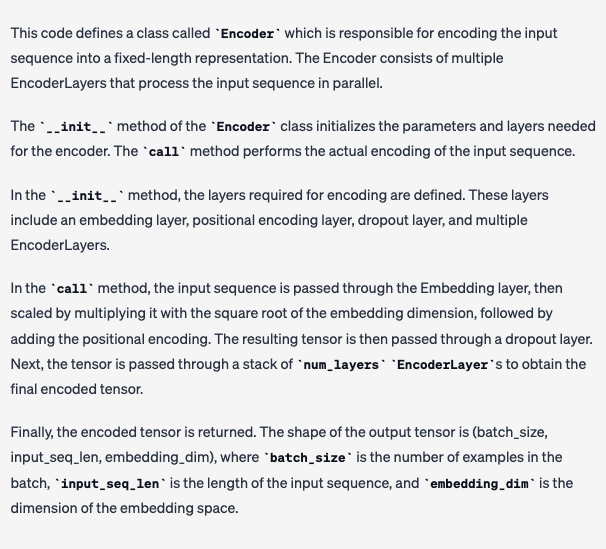</kbd>

             

      
      - Giải thích dòng self.pos_encoding = positional_encoding(max..., \\*embedding_dim\\*)  Thì đại khái là sau loạt bài của \\*Ketan\\*, ta hiểu (rõ hơn) rằng một data instance  (một sequence - hay một câu đi cho rõ) hoặc nhiều (một số lượng batch_size) các sequence sẽ được trải qua quá trình xử lý như sau:  a. Đuợc embedded (trong Keras như bài asigment này thì chính là bước Embedding layer ở trên) -> Tức là quá trình mỗi một từ trong sequence (câu) sẽ được biến thành một embedding vector có độ dài là \\*embedding_dim. \\*Cái này đã nói ở trên   b. Cùng lúc đó, một cách ngắn gọn giải thích lại câu chuyện là tại vì không như RNN mà ở đó ta đưa vào từng từ để learn nên có sẵn thông tin \\*vị trí\\*, bây giờ với Transformer cách làm kết hợp lợi điểm của CNN là xử lý \\*CÙNG LÚC \\*và\\* \\*tuyệt chiêu \\*attention-based  t\\*hì lại \\*không còn thông tin vị trí \\*nên phải dùng\\* kĩ thuật Positional Encoding \\*để bổ sung thông tin này, tạm giải thích gọn vậy thôi.  Vậy thì thông tin của positional encoding này sẽ có cùng shape với embedding vector tức là cũng batch_size, sequence_length, embedding_size. Mà điều có thể gây confuse là mr Andrew hình như không nói rõ trong bài giảng và trong các function như positional_encoding thì dùng chữ \\*d / d_model \\*(trong test_function) rằng cái positional encoding vector và word embedding vector đều có dimension là \\*embedding_dim. \\* *Sẵn tiện trong loạt bài của Ketan cũng cho biết \\*embedding_dim\\* là constant dùng  xuyên suốt nên còn được gọi là \\*d_model\\* giống như dimension của model vậy. Cái này cũng giải thích bối rối \\*d-model\\* ở define \\*FullyConnected\\* (theo link mà xem)  Để kết lại phải nói thêm là cái \\*positional_encoding\\* block sẽ được \\*CỘNG \\*với \\*word embedding\\* block vì cùng size mà (batch, seq_len, emb_dim) trước khi bỏ vào Encoder Câu này giải thích luôn cho dòng \\*x += self.pos_encoding \\*của call() Còn cụ thể tại sao gọi (:,:sequence_len,:) thì chưa hiểu lắm
         

      
      - Giải thích dòng: self.enc_layers = [EncoderLayer(embedding_dim=self.embedding_dim,                                         num_heads=num_heads,                                         fully_connected_dim=fully_connected_dim,                                         dropout_rate=dropout_rate,                                         layernorm_eps=layernorm_eps)                             \\*for _ in range(self.num_layers)]\\*  Đại khái là nó tạo 1 list có \\*num_layers cái \\*EncoderLayer object  Các argument như thế này là define theo required của function\\* __ini__() \\* trong \\*EncoderLayer\\* class  Sau khi đọc loạt bài của Ketan, ta hiểu rằng người ta cho thông tin 'chạy qua' một vài Encode, mà trong loạt bài của Ketan là 6 cái. Đừng lầm lẫn với  Multi-head gì ở đây vốn là mỗi một Encoder chứa 1 cái Multi-head Attention Và như vậy cứ \\*out của thằng (Encoder) trước là input của thằng sau\\* thôi. Nên trong function call() mr Andrew làm vậy trong for-loop num_layers    Cái input của Encoder sẽ là cái volume các embedding vector có shape như sau (\\*batch_size\\*, \\*seq_len\\*, \\*emb_dim\\*)  Kiểu như:  - Có B - \\*batch_size\\* sample (sample là 1 câu đó),  - Mỗi sample /câu có \\*sequence_len\\* từ - Mỗi từ là một embedding vector có size là \\*embedding_dim\\*
         

        
        
<kbd>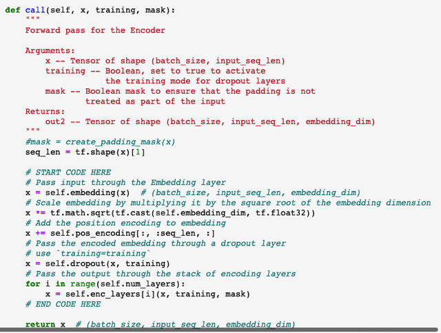</kbd>

         

  
  - 5 - Decoder
     

    
    - 5.1 - Decoder Layer
       

        
        
<kbd>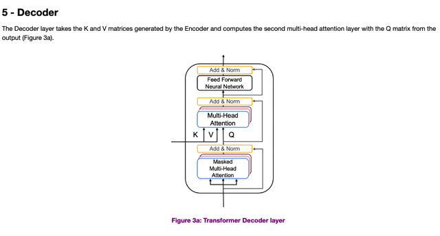</kbd>

         

        
        
<kbd>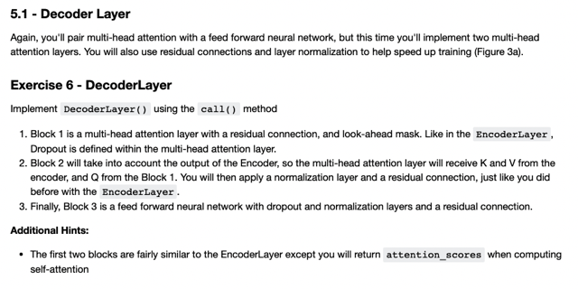</kbd>

         

    
    - Exercise 6 - DecoderLayer
       

        
        
<kbd>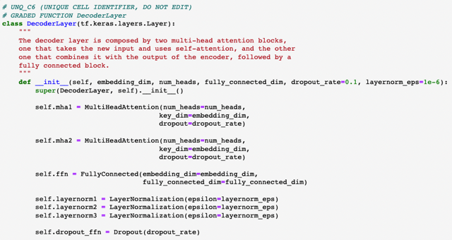</kbd>

         

        
        
<kbd>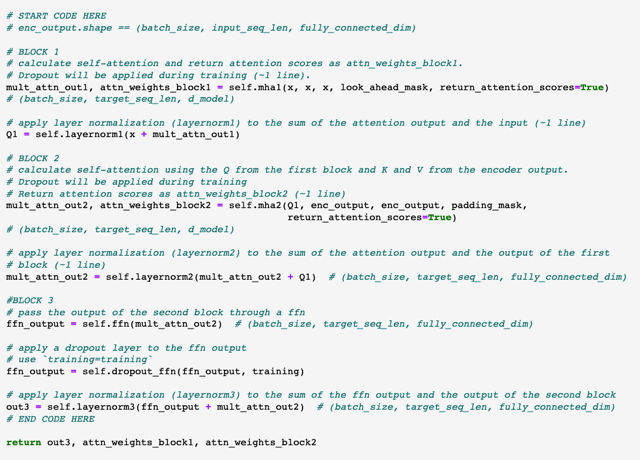</kbd>

        
<kbd>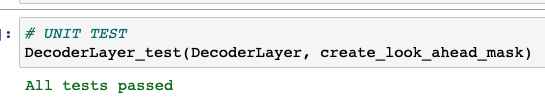</kbd>

        
<kbd></kbd>

        
<kbd></kbd>

        
<kbd>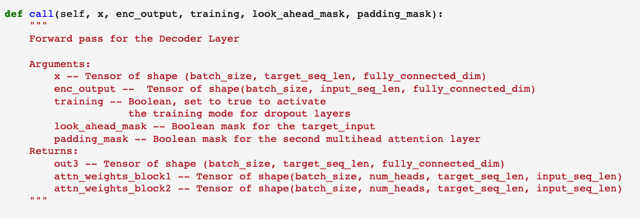</kbd>

         

      
      - Chỗ này mr Andrew hình như đã nhầm khi mà ghi rằng:  \\*x\\* là tensor và \\*enc_output\\* là shape: (batch_size, target_seq_len, \\*full_connected_dim là đâu đúng? phải là embedding_dim chứ)  \\*Mà ở Encoder ổng cũng ghi là output là batch_size, sequence_len, \\*embedding_dim\\* \\* \\*Và output sau mha1 cũng là batch_size, sequence_len, \\*d_model\\* =  \\*embedding_dim Nói chung có thể chỗ nào là fully_connected_dim đều phải sửa là embedding_dim   \\*Vì Theo loạt bài của Ketan thì sequence embedding sẽ giữ nguyên shape là \\*batch_size\\*, \\*sequence_len\\*, \\*embedding_dim\\* xuyên suốt
         

          
          
<kbd>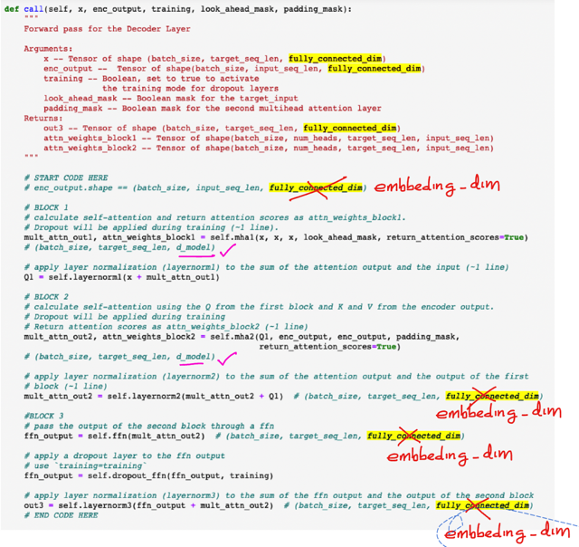</kbd>

> [!NOTE]
> Chỗ này mr Andrew
> hình như đã ghi sai shape

           

          
          
<kbd>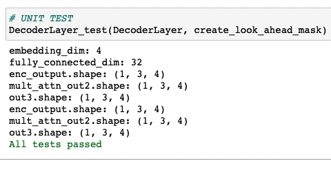</kbd>

           

    
    - 5.2 - Full Decoder
       

        
        
<kbd>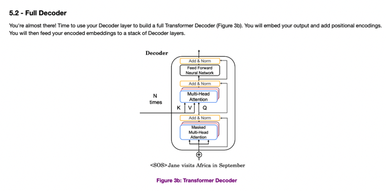</kbd>

         

    
    - Exercise 7 - Decoder
       

        
        
<kbd>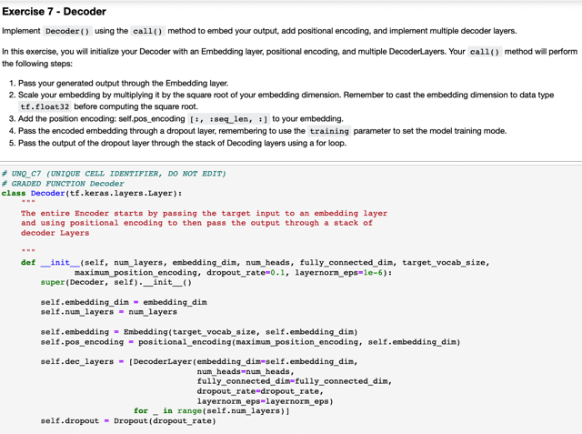</kbd>

         

        
        
<kbd>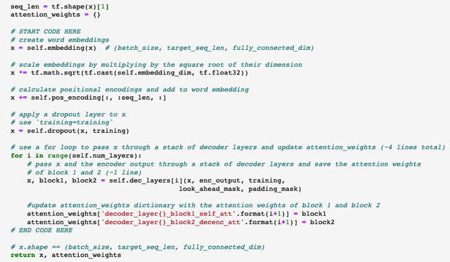</kbd>

        
<kbd>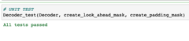</kbd>

        
<kbd></kbd>

        
<kbd></kbd>

        
<kbd>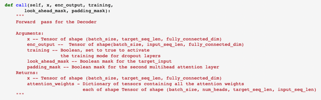</kbd>

         

        
        
<kbd>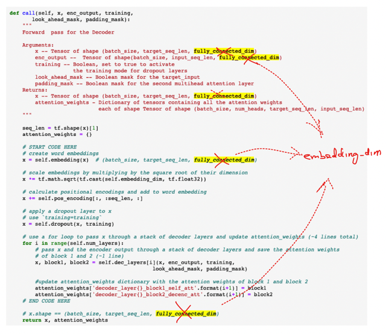</kbd>

> [!NOTE]
> Chỗ này mr Andrew
> hình như đã ghi sai shape

         

  
  - 6 - Transformer
     

    
    - Exercise 8 - Transformer
       

        
        
<kbd>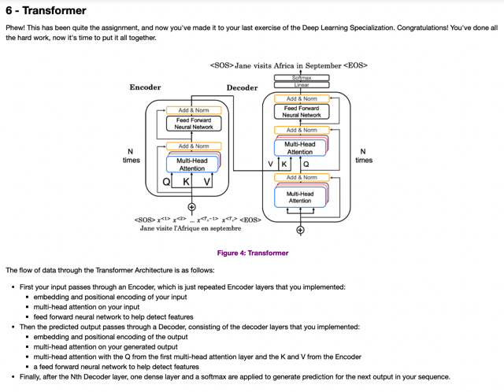</kbd>

         

        
        
<kbd>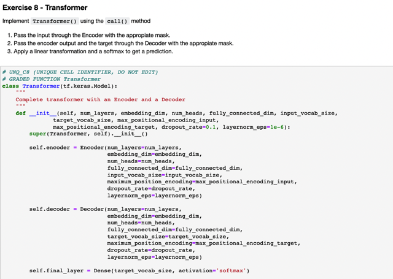</kbd>

         

        
        
<kbd>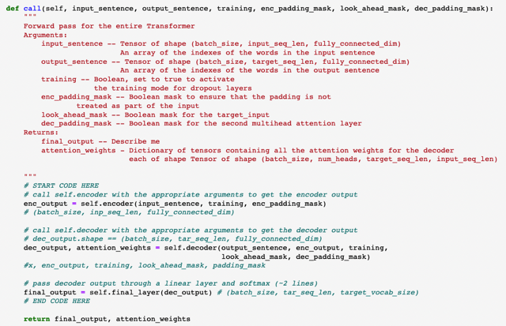</kbd>

         

        
        
<kbd>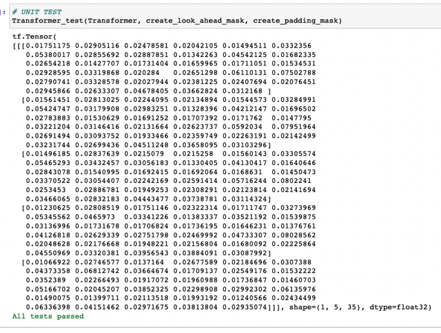</kbd>

         

        
        
<kbd>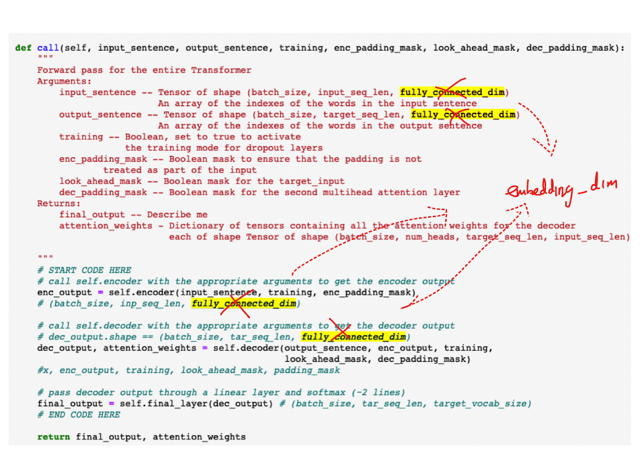</kbd>

> [!NOTE]
> Chỗ này mr Andrew
> hình như đã ghi sai shape

         

  
  - \\*Conclusion \\*You've come to the end of the graded portion of the assignment. By now, you've:  • Created positional encodings to capture sequential relationships in data  • Calculated scaled dot-product self-attention with word embeddings  • Implemented masked multi-head attention  • Built and trained a Transformer model  \\*What you should remember\\*:  • The combination of self-attention and convolutional network layers allows of parallelization of training and \\/faster training\\/.  • Self-attention is calculated using the generated query Q, key K, and value V matrices.  • Adding positional encoding to word embeddings is an effective way to include sequence information in self-attention calculations.  • Multi-head attention can help detect multiple features in your sentence.  • Masking stops the model from 'looking ahead' during training, or weighting zeroes too mu  
     

  
  - 7 - References
     

      
      
<kbd>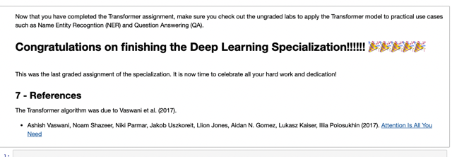</kbd>

       

## Transformer Applications - Ungraded Labs

 

### Tranformer Pre-processing

 

- Welcome to Week 4's first ungraded lab. In this notebook you will delve into the pre-processing methods you apply to raw text to before passing it to the encoder and decoder blocks of the transformer architecture.
   

  
  - Packages
     

    
    - import tensorflow as tf import numpy as np import matplotlib.pyplot as plt import os  from tensorflow.keras.layers import \\*Embedding\\* from tensorflow.keras.preprocessing.text import \\*Tokenizer\\* from tensorflow.keras.preprocessing.sequence import \\*pad_sequences\\*
       

  
  - 1 - Positional Encoding
     

      
      
<kbd>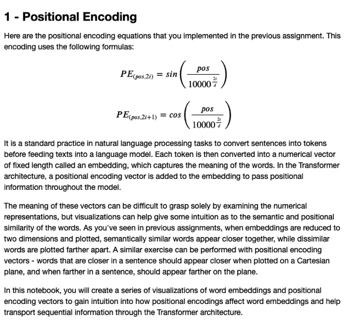</kbd>

> [!NOTE]
> Đại khái là cái sequence embedding output tổng hợp bởi word embedding
> và position encoding chỉ là những con số, khó lòng hình dung được ý
> nghĩa của nó nhưng bằng cách plot nó trên Cartesian plane thì có thể giúp
> nhận thấy rằng từ mà gần nhau trong câu thì sẽ gần nhau trên plot

       

  
  - 1.1 - Positional encoding visualizations
     

      
      
<kbd>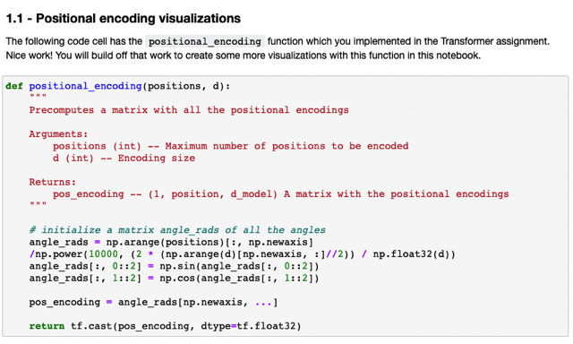</kbd>

       

      
      
<kbd>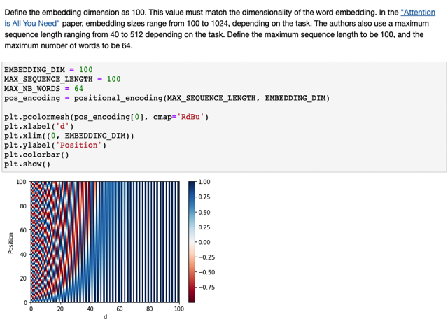</kbd>

       

      
      
<kbd>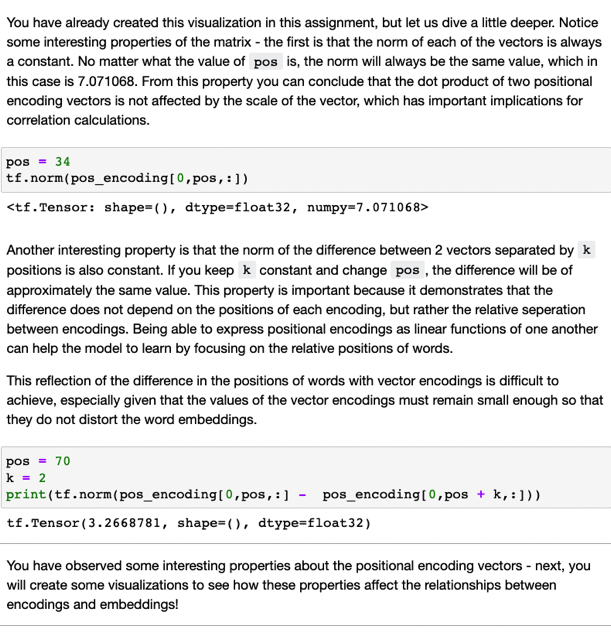</kbd>

> [!NOTE]
> Đại khái là có 2 tính chất quan trọng đó là:
>
> 1. Tất cả các position encoding vector đều có norm bằng nhau dẫn
> đến một kết luận là dot product của 2 vector nay **sẽ không bị ảnh
> hưởng bởi the scale của vector**và do đó đây sẽ là một đặc điểm
> quan trọng trong việc tính toán sự liên quan của các  từ với nhau
>
> 2. **Sự khác biệt** của 2 vector bất kì miễn là pos c**ùng cách nhau k thì
> đều giống nhau** dù pos có thay đổi ra sao.

       

  
  - 1.2 - Comparing positional encodings  Nói chung là dùng visualization để check positional encodinga
     

    
    - 1.2.1 Correlation
       

        
        
<kbd>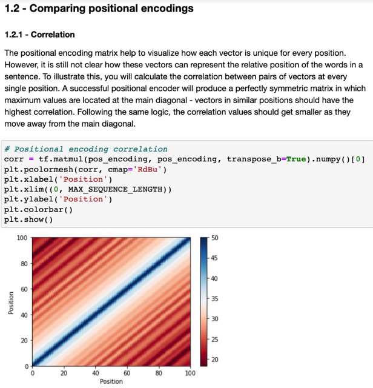</kbd>

> [!NOTE]
> Đại khái là, việc các pe vector khác biệt nhau chưa nói lên điều gì, plot
> matrix các chỉ số correlation của mỗi vector với từng vector ở vị trí khác
> sẽ thấy nếu encoding tốt thì nó phải có dạng đối xứng qua đường chéo
> với đường chéo cao nhất (bản thân mỗi thằng giống chính nó nhất) càng
> xa đường chéo càng giảm

         

    
    - 1.2.2 Euclidean distance
       

        
        
<kbd>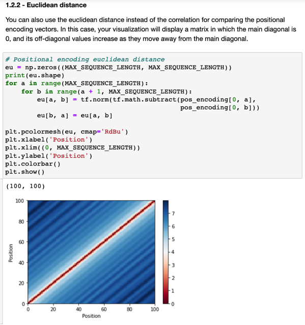</kbd>

> [!NOTE]
> Ngược lại thay vì dùng 'độ giống' (correlation) thì dùng ' độ khác' -
> Euclidean distance thì cũng sẽ thấy dạng đối xứng, càng xa đường chéo
> càng tăng - càng xa nhau càng khác nhau nhiều

         

  
  - 2 - Semantic embedding
     

    
    - You have gained insight into the \\*relationship positional encoding vectors have with other vectors\\* at different positions by creating correlation and distance matrices. Similarly, you can gain a stronger intuition as to \\*how positional encodings affect word embeddings\\* by visualizing the sum of these vectors.
       

  
  - 2.1 - Load pretrained embedding
     

      
      
<kbd>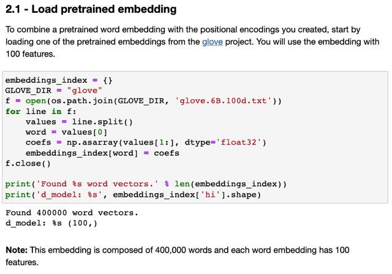</kbd>

> [!NOTE]
> Đại khái là load pre-trained embedding vector from Glove project,
> mỗi vector có 100 features tức embedding_dim = 100

       

      
      
<kbd>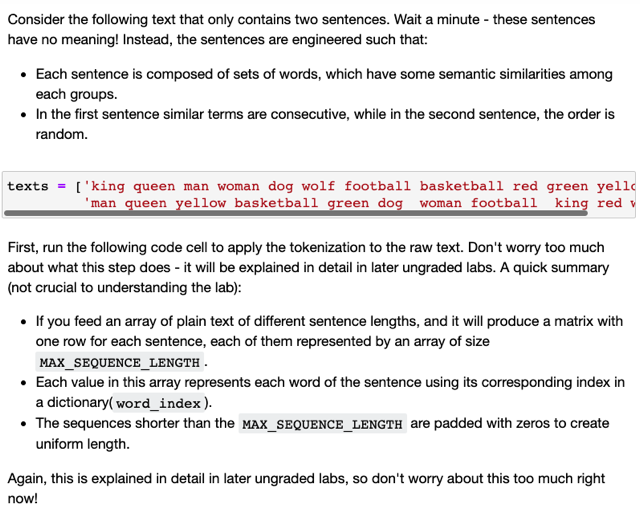</kbd>

> [!NOTE]
> Ổng tạo 2 câu với các cặp từ 'gần nhau' - gần nhau vì ngữ nghĩa, tính
> chất gần nhau thể hiện bởi embedding vector và 1 câu thì để cặp từ
> gần nhau thì sát nhau, 1 câu để lộn xộn

       

      
      
<kbd>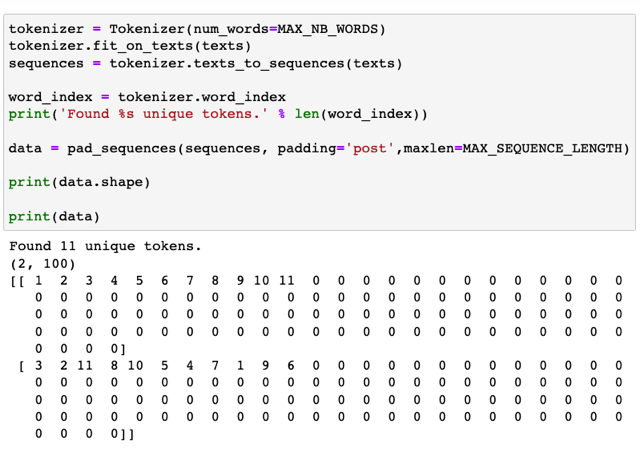</kbd>

> [!NOTE]
> Khúc này ổng nói đại khái là tạm thời có thể lướt qua vì sẽ giải thích kĩ hơn
> sau, nhưng đại khái là cách 1 text có nhiều câu với độ dài ngắn khác nhau
> được tokenize và padding như thế nào trước khi bỏ vào Embedding layer để
> tạo embedding vectors
>
> Cụ thể là cứ **mỗi câu sẽ trở thành một array**, **độ dài fixed** bởi một  const
> MAX_SEQUENCE_LEN, nên câu **ngắn quá thì dc padding** bởi 0, **dài quá
> thì bị truncated**.
>
> Rồi trong array thì **mỗi số là index của từ** trong một **dictionary**, vậy thôi

       

      
      
<kbd>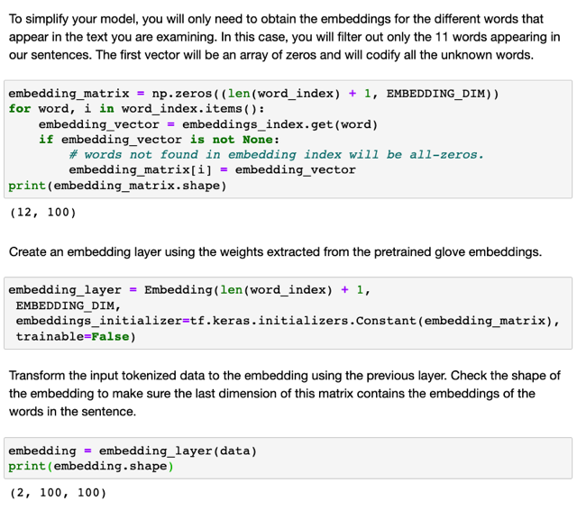</kbd>

> [!NOTE]
> Phần này đại khái là ổng dùng cái pre-trained embedding vectors từ Glove
> project để tạo một cái Embedding layer nhưng để đơn giản thỉ bỏ hết chỉ giữ
> nhưng vector của các từ có trong câu và không phải từ nào trong câu cũng
> chắc chắn có trong cái pre-trained nên sẽ fill bằng 0
>
> Khúc cuối, sau khi embedding, thì xem shape thấy 2,100 (2 câu, mỗi câu 100
> token), đã trở thành 2,100,100 (2 câu, mỗi câu 100 vector, mỗi vector 100 số)

       

  
  - 2.2 - Visualization on a Cartesian plane
     

      
      
<kbd>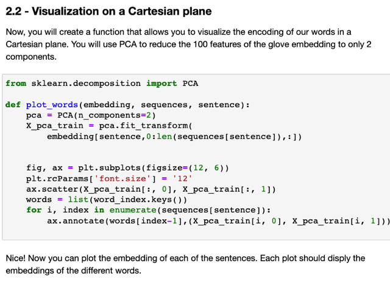</kbd>

> [!NOTE]
> Này đại khái là plot các embedding vector lên Cartesian plane (sau khi
> đã PCA từ 100D còn 2D) thì thể hiện rõ các từ gần nhau sẽ ..gần
> nhau.

       

      
      
<kbd>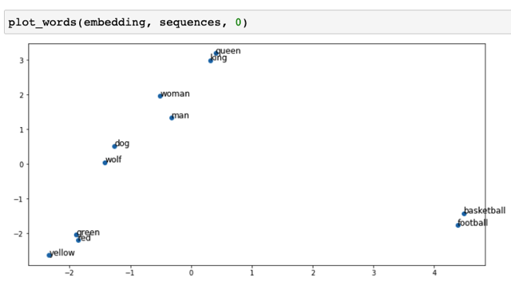</kbd>

       

      
      
<kbd>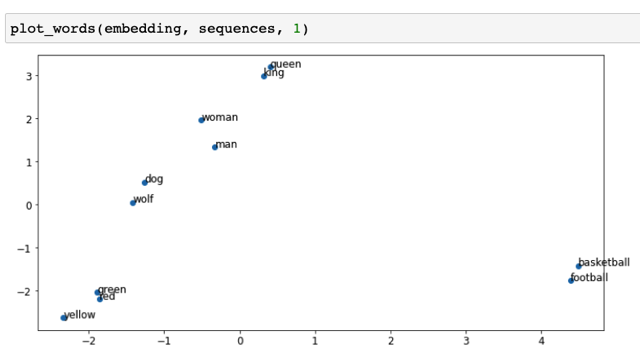</kbd>

       

  
  - 3 - Semantic and positional embedding  Đại khái là với sự kết hợp với Positional Encoding (với trọng số nào đó) thì yếu tố 'vị trí trong câu' của các từ bắt đầu tạo ảnh hưởng (đến embedding vector - nói ở đây chỉ tổng của cả word embedding hay còn gọi là semantic embedding và positional encoding). Cụ thể là từ gần nhau trong câu bắt đầu xích lại gần nhau trên Cartesian plane hơn, như red, wolf - đứng sát nhau trong câu, dù semantic nó xa nhau  Nếu thay đổi trọng số, thì ảnh hưởng của pe vào embedding tổng cũng giảm dần
     

      
      
<kbd>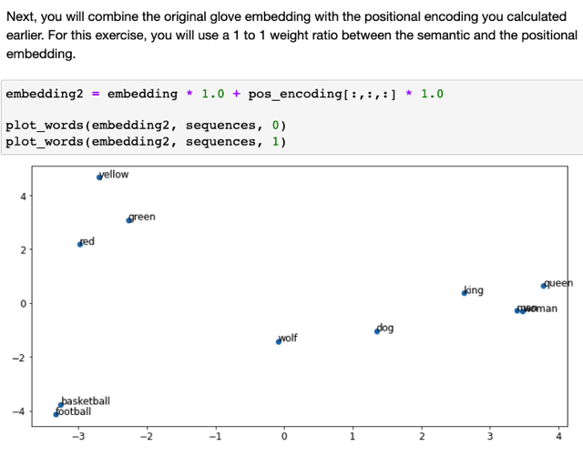</kbd>

       

      
      
<kbd>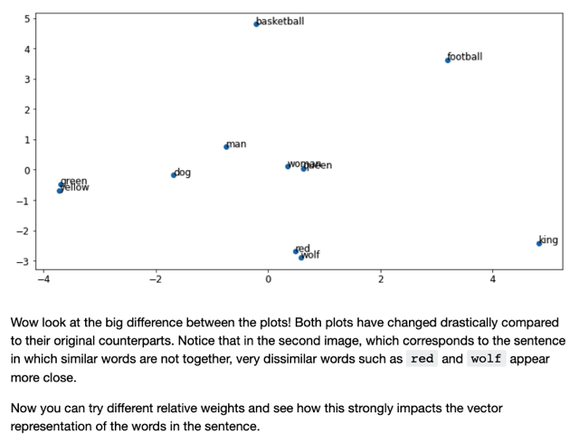</kbd>

> [!NOTE]
> Đại khái là với sự kết hợp với Positional Encoding (với trọng số nào
> đó) thì yếu tố 'vị trí trong câu' của các từ bắt đầu tạo ảnh hưởng (đến
> embedding vector - nói ở đây chỉ tổng của cả word embedding hay
> còn gọi là semantic embedding và positional encoding). Cụ thể là từ
> gần nhau trong câu bắt đầu xích lại gần nhau trên Cartesian plane
> hơn, như red, wolf - đứng sát nhau trong câu, dù semantic nó xa nhau

       

      
      
<kbd>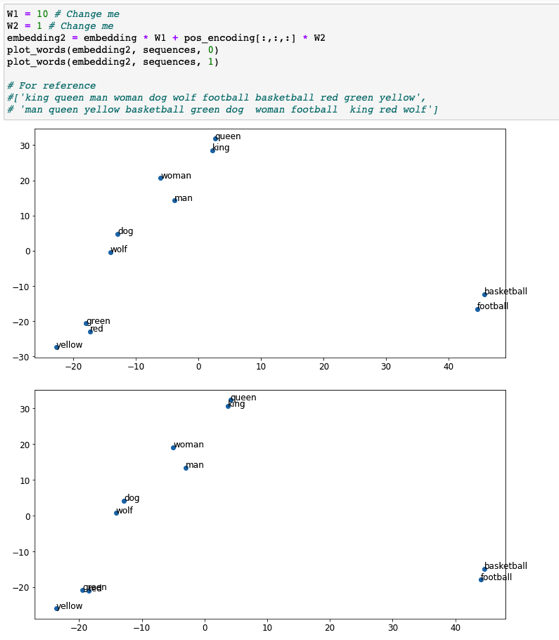</kbd>

       

      
      
<kbd>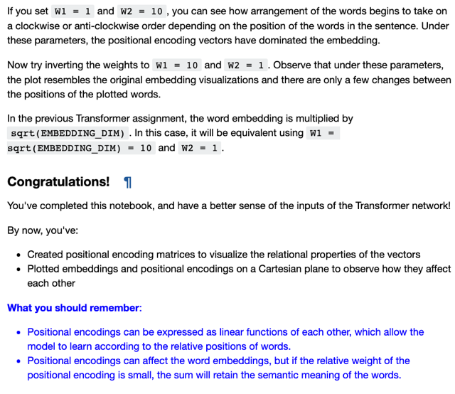</kbd>

> [!NOTE]
> Nếu thay đổi trọng số, thì ảnh hưởng của pe vào embedding tổng cũng giảm
> dần

       

  
  - \\*What you should remember\\*:  • Positional encodings can be expressed as linear functions of each other, which allow the model to learn according to the relative positions of words.  • Positional encodings can affect the word embeddings, but if the relative weight of the positional encoding is small, the sum will retain the semantic meaning of the words.
     

### Transformer Network Application:

> [!NOTE]
> TRANSFORMER NETWORK APPLICATION:
> NAMED-ENTITY RECONITION

 

- 1. Use tokenizers and pre-trained models from the HuggingFace Library.  2. Fine-tune a pre-trained transformer model for Named-Entity Recognition
   

  
  - Packages
     

      
      
<kbd>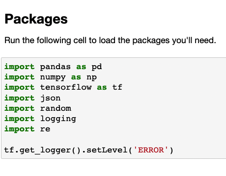</kbd>

       

  
  - 1 - Named-Entity Recogniton to Process Resumes
     

    
    - When faced with a large amount of unstructured text data, named-entity recognition (NER) can help you detect and classify important information in your dataset. For instance, in the running example "Jane vists Africa in September", NER would help you detect "Jane", "Africa", and "September" as named-entities and classify them as person, location, and time.  - You will use a variation of the Transformer model you built in the last assignment to \\*process a large dataset of resumes\\*.  - You will find and \\*classify relevant information\\* such as the companies the applicant worked at, skills, type of degree, etc.
> [!NOTE]
> Đại khái là (ứng dụng NER) xử lý một tập resumes data lớn
> để lấy những thông tin quan trọng từ các candidates

       

  
  - 1.1 - Data Cleaning
     

    
    - Cái này ổng làm một loạt xem qua các function  Khúc đầu đại khái là chuẩn bị một số function để giúp lấy dữ liệu \\*get_entities\\*()... Mấy cái này nhờ CHatGPT sẽ có thể hiểu sau  - \\*convert_dataturks_to_spacy\\*: Hiểu đại khái là convert gì đó  - \\*trim_entity_spans\\*: Removes leading and trailing white spaces from entity spans -> Hiểu đại khái là trim
> [!NOTE]
> Chưa hiểu cụ thể

       

  
  - 1.2 - Padding and Generating Tags
     

      
      
<kbd>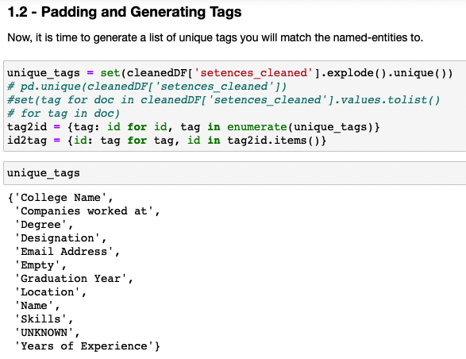</kbd>

> [!NOTE]
> Chưa hiểu nó làm gì nhưng đại khái là lấy ra xem có những tag gì

> [!NOTE]
> Chưa hiểu cụ thể

       

      
      
<kbd>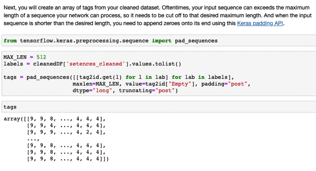</kbd>

> [!NOTE]
> Chưa hiểu cụ thể

       

  
  - 1.3 - Tokenize and Align Labels with 🤗 Library
     

      
      
<kbd>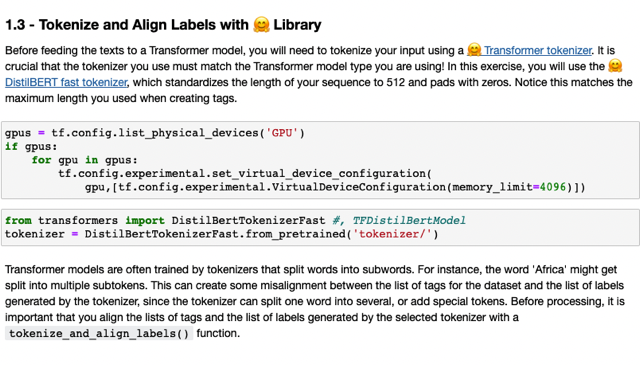</kbd>

> [!NOTE]
> Chưa hiểu cụ thể

> [!NOTE]
> Đại khái là kiểu như phải tokenize cái input trước khi bỏ vào Transformer model,
> và thường dùng 1 cái Transformer tokenizer (kiểu như thư viện) nên phải đảm
> bảo cái thằng tokenizer với Transformer model phải 'hợp' nhau. (Type phải match
> nhau)

       

  
  - Exercise 1 - tokenize_and_align_labels
     

      
      
<kbd>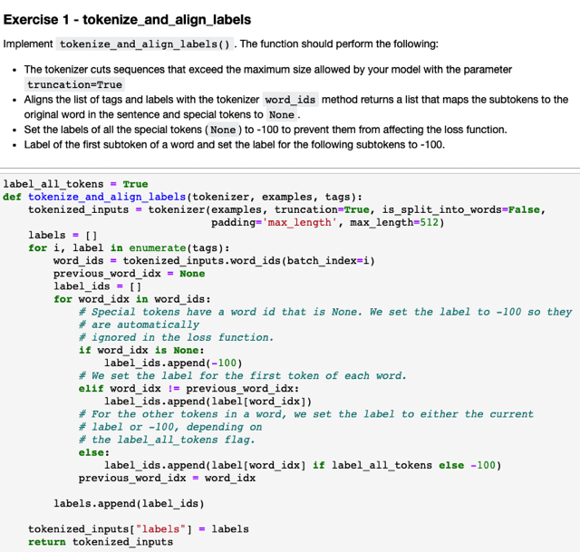</kbd>

> [!NOTE]
> Ok thì đại khái là cái kiểu của thằng Distill..tokenizer này là nó làm cái kiểu bẻ 1
> từ ra thành nhiều subword để tokenize, nên để không bị kiểu như 'lệch'
> (misalignment) với các tags ban đầu thì gán như vầy: Bẻ ra thì cái đầu gán
> bằng (index) cái cũ, còn mấy cái sau thì gán =-100. Cái special token cũng gán
> -100 luôn.

       

      
      
<kbd>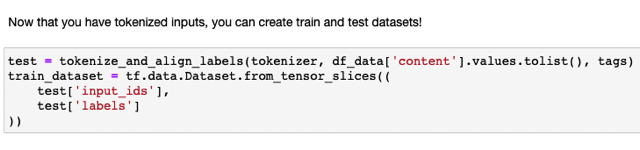</kbd>

> [!NOTE]
> Sau khi tokenize xong giờ mới tạo train/test set đây

       

  
  - 1.4 - Optimization
     

      
      
<kbd>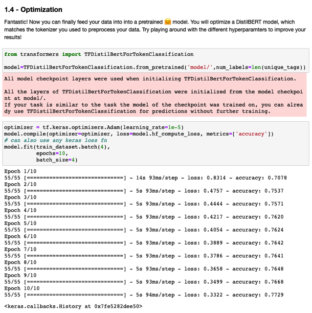</kbd>

> [!NOTE]
> Đại khái là dùng cái Transformer model tên là
> **TFDistilBertForTokenClassification**
>
> Và nó cũng là **pre-trained model**luôn (thể hiện bởi **from_pretrained**) -
> đại khái giống như họ (**HuggingFace library)** có sẵn những pre-trained
> model để sẵn vậy) ta sẽ load về và **fine-tune** thêm nên mới gọi phần này là
> optimization

       

      
      
<kbd>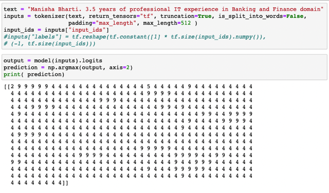</kbd>

> [!NOTE]
> Đại khái là thử 1 text mới, tokenize nó, rồi bỏ vào model predict thử ở đây cái
> **model(inputs).logits hình như chỉ số probability** rồi lấy **argmax để lấy ra
> prediction**

> [!NOTE]
> Cần confirm lại: logits

       

      
      
<kbd>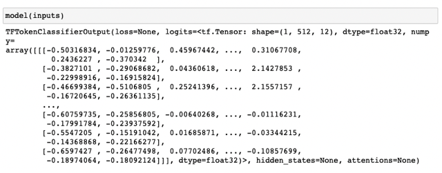</kbd>

> [!NOTE]
> Xem model(input)

       

      
      
<kbd>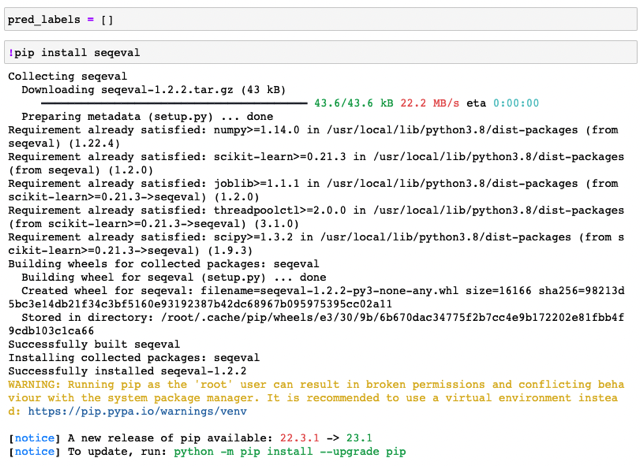</kbd>

> [!NOTE]
> Đoạn này cài thêm cái **Sequeval** chưa hiểu để tác dụng gì
> Nhưng có thể để đọc **value** của **sequence** chăng

       

      
      
<kbd>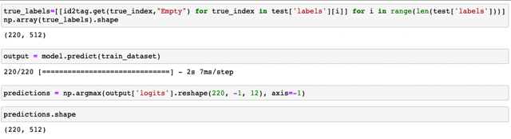</kbd>

> [!NOTE]
> Đoạn này đại khái là predict lại toàn bộ train set

       

      
      
<kbd>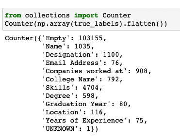</kbd>

      
<kbd></kbd>

      
<kbd>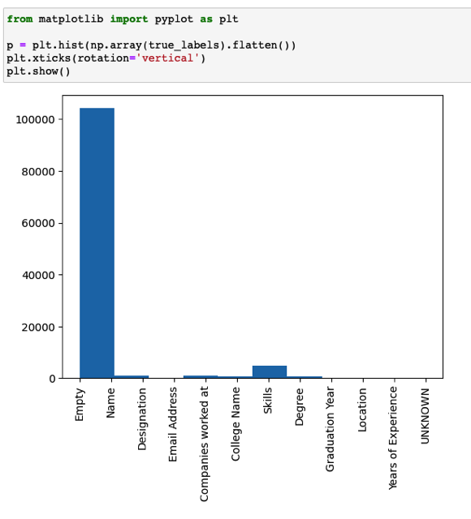</kbd>

> [!NOTE]
> Vẽ thử ra xem và chi tiết thì thấy**TRUE LABEL** 1035 cái name, location 116, ,,,,

       

      
      
<kbd>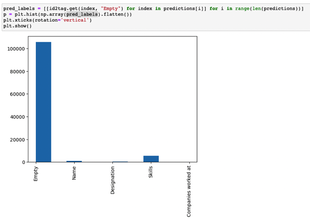</kbd>

> [!NOTE]
> So với Prediction

       

      
      
<kbd>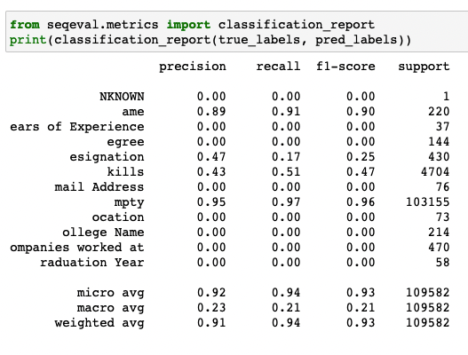</kbd>

> [!NOTE]
> Cuối cùng là xem các thông số để
> evaluate: precision, recall, f1-score

       

  
  - Congratulations!  Here's what you should remember:  - Named-entity recognition (NER) detects and classifies named-entities, and can help process resumes, customer reviews, browsing histories, etc. - You must preprocess text data with the corresponding tokenizer to the pretrained model before feeding your input into your Transformer model.
     

### Transformer Network

> [!NOTE]
> TRANSFORMER NETWORK
> APPLICATION: QUESTION ANSWERING

 

- Welcome to Week 4's third, and the last lab of the course! Congratulations on making it this far. In this notebook you'll explore another application of the transformer architecture that you built.  After this assignment you'll be able to:  - Perform extractive Question Answering  - Fine-tune a pre-trained transformer model to a custom dataset  - Implement a QA model in TensorFlow and PyTorch
   

  
  - 1 - Extractive Question Answering
     

    
    - Question answering (QA) is a task of natural language processing that aims to automatically answer questions. The goal of \\/extractive\\/ QA is to identify the portion of the text that contains the answer to a question. For example, when tasked with answering the question 'When will Jane go to Africa?' given the text data 'Jane visits Africa in September', the question answering model will highlight ' September'.  • You will use a variation of the Transformer model you built in the last assignment to answer questions about stories.  • You will implement extractive QA model in TensorFlow and in PyTorch. \\* Recommendation:\\*  • If you are interested, check out the \\_Course 4: Natural Language Processing with Attention Models\\_ of our \\_Natural Language Processing Specialization\\_ where you can learn how to build Transformers and perform QA using the \\_Trax\\_ library.
> [!NOTE]
> extractive QA có mục đích là dùng train AI
> model sao cho đại khái là cho một story rồi hỏi
> lại những chi tiết của story đó

       

      
      - 1.1 - Data Cleaning
         

          
          
<kbd>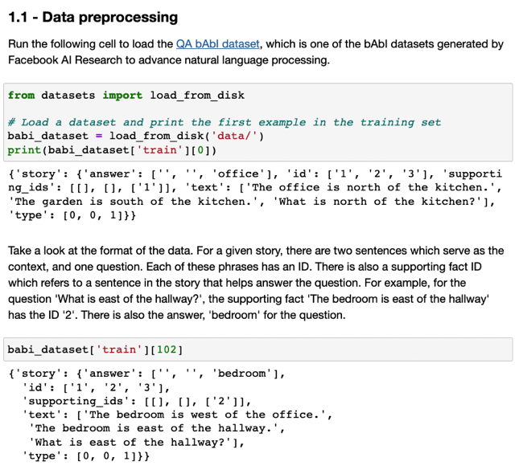</kbd>

> [!NOTE]
> Đại khái là mỗi câu hỏi entry nó có 3 text hai câu đầu là context, câu
> cuối là câu hỏi.Và cái supporting ids là ids của câu giúp trả lời câu hỏi

           

          
          
<kbd>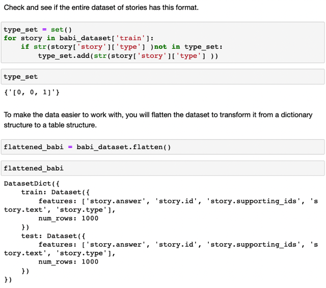</kbd>

> [!NOTE]
> Đại khái là nó loop qua hết và bỏ type_set vào set, check thử chỉ
> có 1 loại là [0,0,1] có nghĩa là mọi dataset đều có format như vậy

           

          
          
<kbd>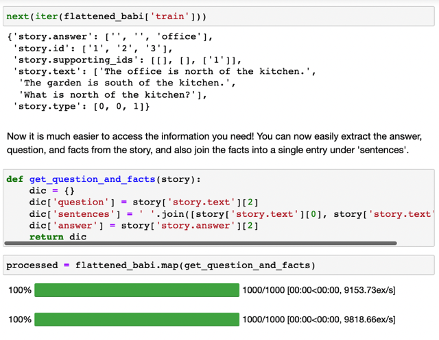</kbd>

           

          
          
<kbd>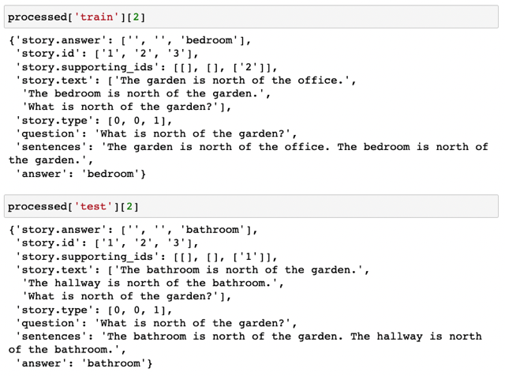</kbd>

           

          
          
<kbd>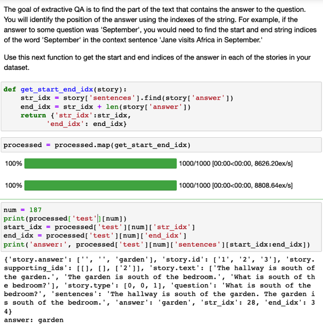</kbd>

> [!NOTE]
> Đại khái là thêm start / end index của cái answer trong câu
>
> Vd story.answer là 'garden' thì tìm trong story.sentences vị trí của Start
> và end của garden là 28 - 34

           

      
      - 1.2 - Tokenize and Align Labels with 🤗 Library
         

        
        - \\*1.2 - Tokenize and Align with \\*🤗\\* Library \\*  Now you have all the data you need to train a Transformer model to perform Question Answering! You are ready for a task you may have already encountered in the Named-Entity Recognition lab - tokenizing and aligning your input. To feed text data to a Transformer model, you will need to tokenize your input using a \\_🤗 Transformer tokenizer\\_. It is crucial that the tokenizer you use must match the Transformer model type you are using! In this exercise, you will use the 🤗 \\_DistilBERT fast tokenizer\\_, which standardizes the length of your sequence to 512 and pads with zeros.  Transformer models are often trained by tokenizers that split words into subwords. For instance, the word 'Africa' might get split into multiple subtokens. This can create some misalignment between the list of tags for the dataset and the list of labels generated by the tokenizer, since the tokenizer can split one word into several, or add special tokens. Before processing, it is important that you align the start and end indices with the tokens associated with the target answer word with a tokenize_and_align() function. In this case, since you are interested in the start and end indices of the answer, you will want to align the index of the sentence to match the index of the token for a word.
> [!NOTE]
> Lại nữa dùng tokenizer DistillBERT để tokenize trước khi bỏ vào
> Transformer model, nhắc lại tầm quan trọng của việc hai thằng đó
> phải 'HỢP' nhau
>
> Thằng DistillBERT này làm việc theo kiểu tokenize ra độ dài 512 và
> pad với 0
>
> Y như Ungraded Lab trước, ta cũng cần phải align lại vì tokenizer
> sẽ split 1 từ ra thành nhiều subword dẫn đến bị lệch..

           

            
            
<kbd>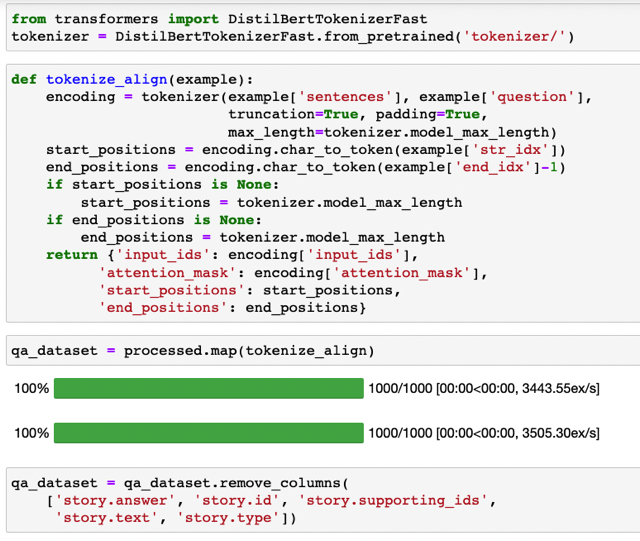</kbd>

> [!NOTE]
> Đại khái là viết function để làm cái việc 'align'

             

          
          - This is a Python function called tokenize_align that takes in an example argument. The purpose of the function is to tokenize and align text data for use in a question-answering model.  The function uses a tokenizer, which is not defined in the code snippet, but is likely an object that performs text tokenization. The tokenizer is used to encode the example's sentences and question, with truncation and padding enabled to ensure that all inputs have the same length. The max_length parameter sets the maximum allowed length of the resulting tokenized sequences.  The char_to_token method of the encoding object is used to align the answer span to the corresponding positions in the tokenized input. The start_positions variable stores the token index of the first character in the answer span, and end_positions stores the token index of the last character in the answer span.  If the answer span's starting or ending character is outside the range of the tokenized input, then char_to_token returns None. In this case, the corresponding start_positions or end_positions variable is set to the maximum token index.  Finally, the function returns a dictionary with the tokenized input IDs, attention mask, start position, and end position. These values can be used as input to a question-answering model.
             

            
            - qa_dataset['train'][200]  ->  {'question': 'What is north of the bathroom?',  'sentences': 'The garden is north of the bathroom. The hallway is south of the bathroom.',  'answer': 'garden',  'str_idx': 4,  'end_idx': 10,  'input_ids': [101,   1996,   3871,   2003,   2167,   1997,   1996,   5723,   1012,   1996,   6797,   2003,   2148,   1997,   1996,   5723,   1012,   102,   2054,   2003,   2167,   1997,   1996,   5723,   1029,   102],  'attention_mask': [1,   1,   1,   1,   1,   1,   1,   1,   1,   1,   1,   1,   1,   1,   1,   1,   1,   1,   1,   1,   1,   1,   1,   1,   1,   1],  'start_positions': 2,  'end_positions': 2}
               

  
  - 2 - Training
     

    
    - 2.1 TensorFlow implementation
       

        
        
<kbd>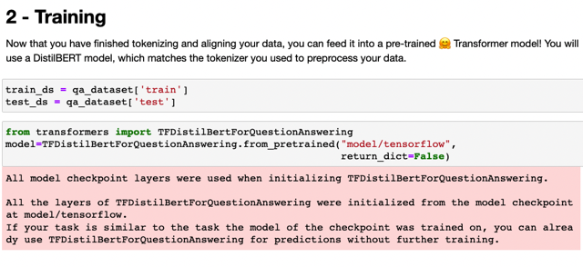</kbd>

> [!NOTE]
> Hiểu tới đâu hay tới đó, ở đây là ổng..
>
> Load train & test set từ qa_dataset
>
> Load pre-trained model

         

        
        
<kbd>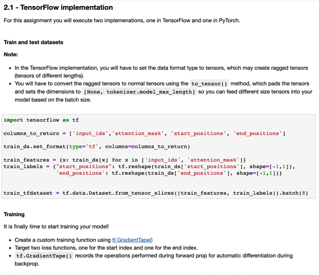</kbd>

> [!NOTE]
> Hiểu tới đâu hay tới đó
>
> Đại khái là nếu implement bằng TensorFlow thì phải set data format sang
> Tensor có thể khiến tạo ra các Tensor dài ngắn khác nhau gọi là ragged tensor
> nên mình phải dùng function **to_tensor**(), function này giúp kiểu như 'sửa
> lại' đễ tạo thành các tensor đều có size [None, tokenizer. model_max_length],
> vậy thôi

         

        
        
<kbd>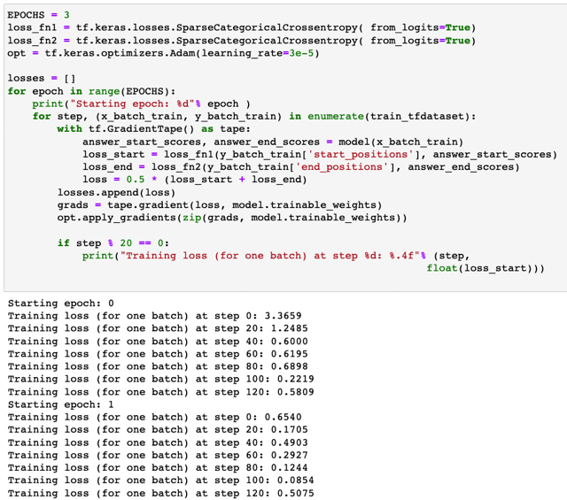</kbd>

> [!NOTE]
> Tại sao lại dùng SparseCategoricalCrossentropy

         

        
        
<kbd>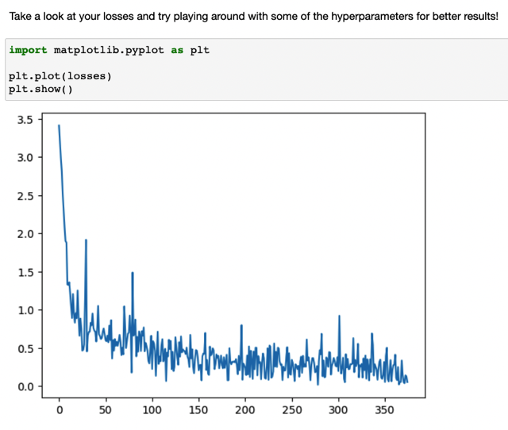</kbd>

         

        
        
<kbd>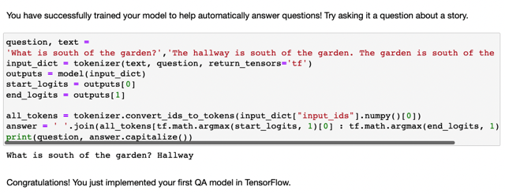</kbd>

         

    
    - 2.2 PyTorch implementation
       

  
  - What you should remember:
     

    
    - • Transformer models are often trained by tokenizers that split words into subwords.  ▪ Before processing, it is important that you align the start and end indices with the tokens associated with the target answer word.  • PyTorch is a relatively light and easy to implement framework that can make rapid prototyping easier, while TensorFlow has advantages in scaling and is more widely used in production  ▪ tf.GradientTape allows you to build custom training loops in TensorFlow  ▪ The Trainer API in PyTorch gives you a basic training loop that is compatible with 🤗 models and datasets
       

### Transformer Using Trax Librabry

 

