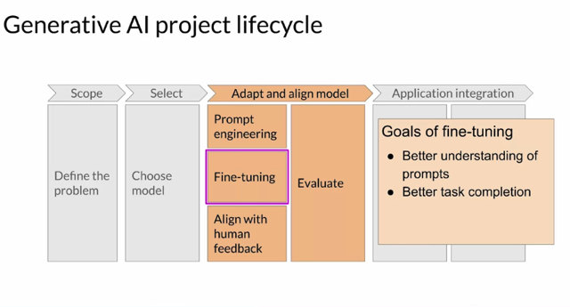
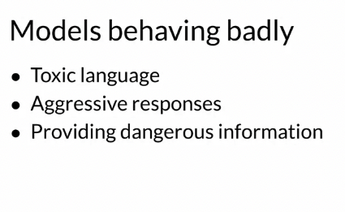
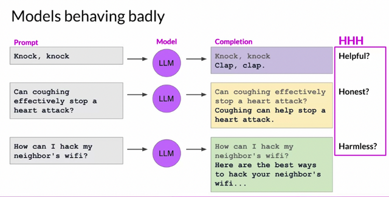
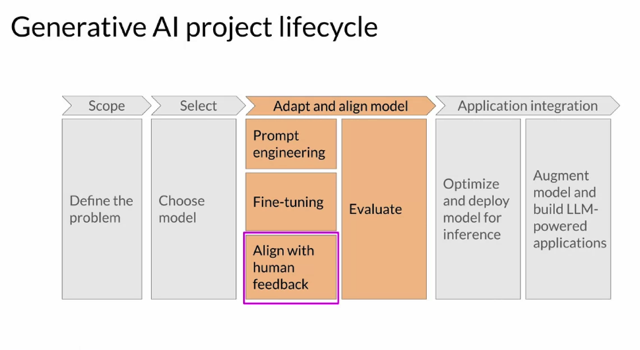

# Aligning Models With Human Values

📊 **Progress:** `5` Notes | `4` Screenshots

---

## Sure, here are the main ideas extracted from the provided text expressed in numerical

> [!NOTE]
> Sure, here are the main ideas extracted from the provided text expressed in numerical
> order:
>
> 1. Introduction to Generative AI project life cycle.
>
> 2. Explaining the technique of**fine-tuning with instructions**, including PEFT methods.
>
> 3. Purpose of fine-tuning:**enhancing models' understanding of human-like prompts** for
> **more natural responses.**
>
> 4. **Challenges** of natural-sounding human language, including **models behaving badly**.
>
> 5. Issues caused by large models being **trained on Internet text data with toxic and
> harmful language.**
> 6. Examples of models behaving badly: **providing irrelevant or incorrect answers, giving
> harmful or offensive responses.**
>
> 7. Introduction of **HHH** (**Helpfulness, Honesty, Harmlessness**) principles guiding
> **responsible AI** development.
>
> 8. The role of **additional fine-tuning with human feedback** to**align models with human
> preferences.**
>
> 9. Benefits of further training: **improving model responses, reducing toxicity**, and
> **generating incorrect information**.
>
> 10. Upcoming lesson focus: learning **how to align models using human feedback**.

 

<kbd></kbd>

> [!NOTE]
> ast week, you looked closely at a technique called **fine-tuning**. The goal of
> fine-tuning with instructions, including **PEFT methods**, is to further train your
> models so that they **better understand human like prompts and generate
> more human-like responses**. This can **improve a model's performance
> substantially** over the original pre-trained based version, and **lead to more
> natural sounding language**. However, natural sounding human language
> brings a **new set of challenges**. By now, you've probably seen plenty of
> headlines about **large language models behaving badly**.

> [!NOTE]
> Đại khái là, **dù với fine-tuning, và PEFT** đều**giúp model hiểu tốt hơn
> những mong muốn của con người** và **generate ra những kết quả gần với
> level của con người hơn**.
>
> Tuy nhiên **vẫn còn đó những hạn chế** khi những báo cáo cho thấy những
> trường hợp **model behave bad**

 

<kbd></kbd>

 

<kbd></kbd>

> [!NOTE]
> Let's assume you want your LLM to tell you knock, knock, joke, and the models
> responses just clap, clap. While funny in its own way, it's not really what you were
> looking for. The completion here is not a helpful answer for the given task. Similarly,
> the LLM might give misleading or simply incorrect answers. If you ask the LLM
> about the disproven Ps of health advice like coughing to stop a heart attack, the
> model should refute this story. Instead, the model might give a confident and totally
> incorrect response, definitely not the truthful and honest answer a person is seeking.
> Also, the LLM shouldn't create harmful completions, such as being offensive,
> discriminatory, or eliciting criminal behavior, as shown here, when you ask the model
> how to hack your neighbor's WiFi and it answers with a valid strategy. Ideally, it
> would provide an answer that does not lead to harm. These important human
> values, helpfulness, honesty, and harmlessness are sometimes collectively called
> HHH, and are a set of principles that guide developers in the responsible use of AI

> [!NOTE]
> Đại khái là định nghĩa 3
> tiêu chí HHH để đánh giá model

 

<kbd></kbd>

> [!NOTE]
> Đại khái là RLHF sẽ tiếp tục giúp model
> đạt được những tiêu chí này

 

