# Computational Challenges For Training Llms

📊 **Progress:** `17` Notes | `13` Screenshots

---

## . ****Memory Limitations** in Training Large Language Models (LLMs)**: The **main issue** faced when training

> [!NOTE]
> . ****Memory Limitations** in Training Large Language Models (LLMs)**: The **main issue** faced when training
> large language models is **running out of memory on GPUs**, especially on consumer hardware. LLMs require a**significant amount of memory to store and train all their parameters**, making it challenging for data centers and
> even high-end hardware like **Nvidia A100 GPUs.**
>
> 2. ****Quantization** to**Reduce Memory Footprint****: One technique to **reduce memory requirements** is
> **quantization**. It involves **reducing the precision of model weights from 32-bit floating-point numbers (FP32)** to**lower precision formats like 16-bit floating-point numbers (FP16)**or **8-bit integers (INT8)**. This **reduces the
> memory needed to store the model weights, activations, and other parameters.**
>
> 3. ****Data Types and Precision****: The data types used in deep learning frameworks are **FP32 for full precision**,
> **FP16 or Bfloat16** for **half precision**, and **INT8 for eight-bit integers**. Quantization **statistically projects the
> original 32-bit floating-point numbers** into the **lower precision space** using **scaling factors calculated based on
> the range of the original numbers.**
>
> 4. ****BFLOAT16 (BF16)** as an Alternative to **FP16****: BFLOAT16 is a **hybrid format** between FP16 and FP32
> and has become popular in deep learning. It **captures the full dynamic range of FP32** but**uses only 16 bits**,
> i**ncreasing model performance and reducing memory footprint.**
>
> 5. ****Savings in Memory Consumption****: By applying **quantization**, memory consumption **can be significantly
> reduced**. Using 16-bit half precision, you can achieve a 50% saving in memory, and with eight-bit integers, it can
> be further reduced by 50%.
>
> 6. ****Scaling Challenges****: As model sizes grow beyond a **few billion parameters**, it becomes **impossible to
> train them on a single GPU**. Training such large models may **require distributed computing technique**s and
> **access to hundreds of GPUs**, making it e**xpensive and impractical.**
>
> 7. ****Fine-Tuning Process****: Fine-tuning, a training process that **comes after pre-training**, also r**equires
> storing all training parameters in memory**. While it may be challenging to pre-train very large models from scratch,
> fine-tuning can still be done on pre-trained models.
>
> 8. **Optional Video on**Training Across GPUs****: An optional video is available to learn more about the **technical
> aspects of training large models across multiple GPUs** and the options available for developers.
>
> Overall, the main ideas **focus on the memory limitations in training large language models**, the use of
> **quantization** to **reduce memory footprint,** the **benefits of BFLOAT16**, and the **challenges of scaling training
> to very large models**.

 

<kbd>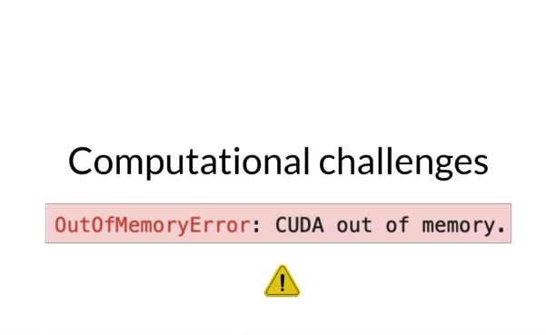</kbd>

 

<kbd>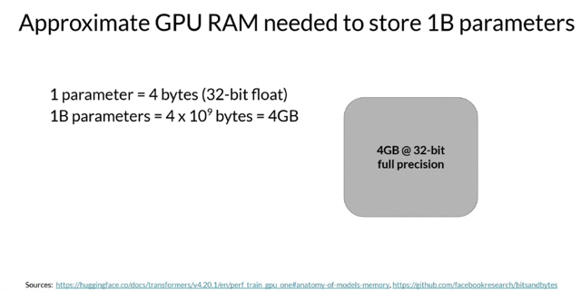</kbd>

> [!NOTE]
> Đại khái là **1 param** của model tốn **4 bytes**bộ nhớ. Vậy
> một **model có 1 tỷ params sẽ cần 4GB**

 

<kbd>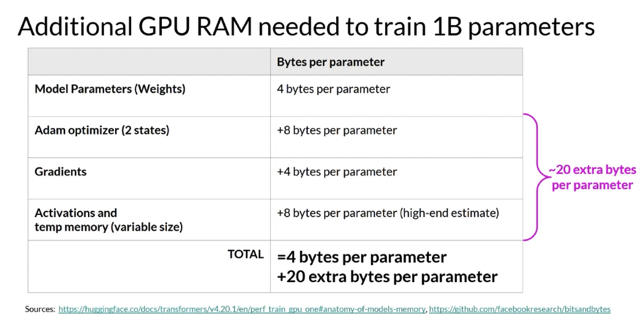</kbd>

> [!NOTE]
> Nhưng model đâu chỉ có params, còn nào là **optimizers** cần**8
> bytes mỗi params**, ngoài ra còn **gradient**, **activation**...dẫn tới dễ dàng cần
> tới hơn **20 bytes cho mỗi parameter của model**

 

<kbd>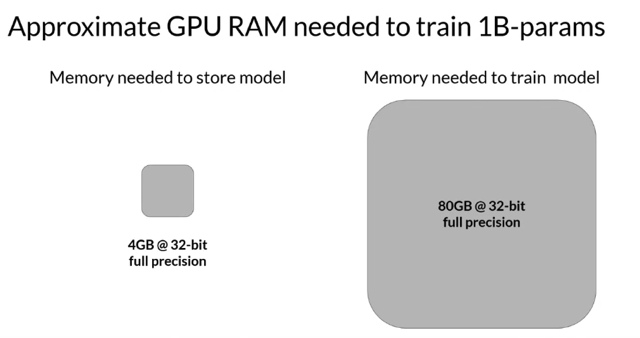</kbd>

> [!NOTE]
> Thành ra để training một **model 1 tỉ params** thì sương sương cần**80 GB
> memory** là bằng dung lượng nhớ của một cái**Nvidia A100 GPU**

> [!NOTE]
> If you want to train the model, you'll have to plan for **additional components** that use
> GPU memory during training. These include two**Adam optimizer states**, **gradients**,
> **activations, and temporary variables** needed by your functions. This can easily lead to
> **20 extra bytes of memory per model parameter**. In fact, to account for all of these
> overhead during training, you'll actually **require approximately 20 times the amount of
> GPU RAM that the model weights alone take up**. To train a one billion parameter
> model at 32-bit full precision, you'll need**approximately 80 gigabyte of GPU RAM**. This
> is **definitely too large for consumer hardware**, and even challenging for hardware used
> in data centers, if you want to train with a single processor. **Eighty gigabyte** is the
> **memory capacity of a single Nvidia A100 GPU**, a common processor used for machine
> learning tasks in the Cloud

 

<kbd>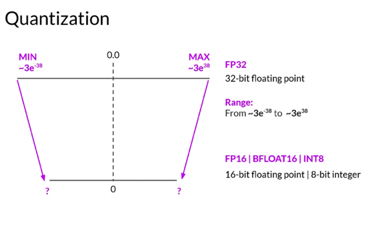</kbd>

> [!NOTE]
> What **options do you have** to **reduce the memory** required for training? One technique
> that you can use to reduce the memory is called **quantization**. The main idea here is
> that you**reduce the memory required to store the weights** of your model by**reducing
> their precision from 32-bit floating point numbers to 16-bit floating point numbers**, or
> eight-bit integer numbers. The corresponding data types used in deep learning
> frameworks and libraries are **FP32 for 32-bit full position**, **FP16, or Bfloat16 for 16-bit
> half precision**, and **int8 eight-bit integers**. The range of numbers you can represent
> with **FP32** goes from approximately **3*10^-38 to 3*10^38**. **By default**, model **weights**,
> **activations**, and other model parameters a**re stored in FP32**. Quantization\_**statistically
> projects the original 32-bit floating point numbers into a lower precision space**\_, using
> s**caling factors** calculated based on the range of the original 32-bit floating point
> numbers.

> [!NOTE]
> Đại khái là một solution để **giảm yêu cầu bộ nhớ xuống** đó là **Quantization**, như ta đã
> biết ở bên **MLOpsSpec**. Đại khái là giảm **precision xuống từ 32-bit floating points xuống
> còn 16-bit f.p hoặc 8-bit integer bằng cách nó tính toán cái khoảng giá trị của params để rồi
> project hay đóng khung lại**

 

<kbd>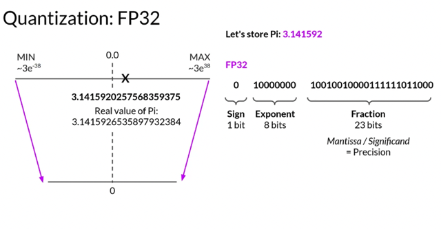</kbd>

> [!NOTE]
> Trong**32-bit floating point**- FP32, thì **1 bit dùng để chỉ "dấu" hay " sign"**, như
> đây là c**ủa số pi là 0 thể hiện nó là số dương**. **8 bit tiếp theo là chứa thông tin
> exponent**thể hiện **giá trị phần nguyên (3)**, và **23 bit còn lại là thể hiện phần lẻ
> (fraction)** gọi là **Mantissa** hay **Significand** là **Precision - Độ chính xác.**

> [!NOTE]
> Let's look at an example. Suppose you want to store a PI to **six decimal places** in
> **different positions**. Floating point numbers are stored as **a series of bits zeros** and
> **ones**. The **32 bits to store numbers in full precision with FP32** consist of **one bit for
> the sign** where **zero indicates a positive number**, and **one a negative number**. Then
> **eight bits for the exponent of the number,** and **23 bits representing the fraction of
> the number.** The fraction is also referred to as the **mantissa**, or **significant**. It
> r**epresents the precision** bits off the number. If you **convert the 32-bit floating point
> value back to a decimal value**, you notice the slight loss in precision. For reference,
> here's the real value of Pi to 19 decimal places

 

<kbd>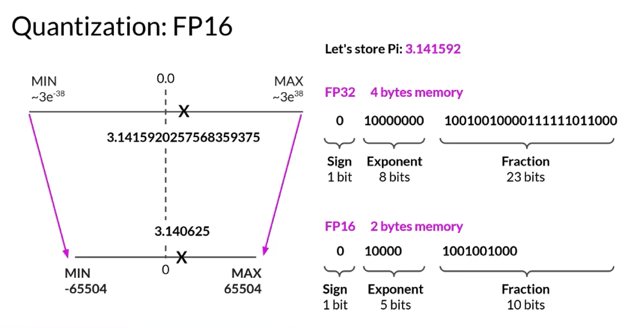</kbd>

> [!NOTE]
> Đại khái là nếu **giảm xuống dụng 16-bit floating point** gọi là **"còn chính xác một
> nửa - haft precision"**thì thay vì tốn **4 bytes memory chỉ còn có 2 bytes**. Và độ
> **chính xác cũng giảm xuống khi chỉ còn 6 số ở phần thập phân thay vì 19 số**.
> Tuy nhiên điều này có thể c**hấp nhận được khi ta đang cần giảm bộ nhớ**

 

<kbd>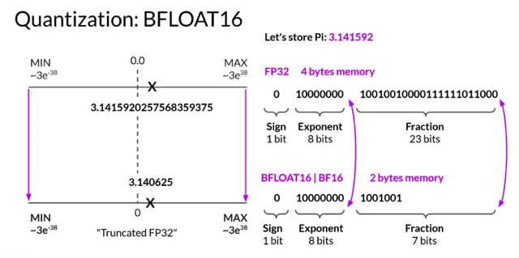</kbd>

> [!NOTE]
> One datatype in particular BFLOAT16, has recently become a **popular** alternative to
> FP16.**BFLOAT16**, short for **Brain Floating Point Format** developed at **Google Brain**
> has become a **popular choice** in deep learning. Many **LLMs, including FLAN-T5**, have
> been pre-trained with BFLOAT16. BFLOAT16 or BF16 is a **hybrid** between **half
> precision FP16 and full precision FP32**. BF16 **significantly helps with training stability**
> and is **supported by newer GPU's** such as NVIDIA's A100. BFLOAT16 is often
> described as a **truncated 32-bit float**, as it**captures the full dynamic range**of the full
> 32-bit float, that uses only 16-bits. BFLOAT16 **uses the full eight bits to represent the
> exponent,** but t**runcates the fraction to just seven bits**. This n**ot only saves memory,**
> but also **increases model performanc**e by speeding up calculations. The downside is
> that BF16 is not well suited for integer calculations, but these are relatively rare in
> deep learning

> [!NOTE]
> Một kiểu **16-bit** mới phát triển do **Google Brain** được ưa chuộng hơn, kiểu như nó
> hybrid giữa 32 và 16 bit. Nó **vẫn giữ 8 bit cho Exponent** nhưng phần **Fraction thì gọt
> bớt (truncate) chỉ còn 7 thay vì 23**. Nên nó còn được gọi là **"Truncated FP32"**. Cái này
> thì có **ưu điểm là không chỉ giúp save memory mà còn tăng tốc và làm ổn định quá
> trình training**

 

<kbd>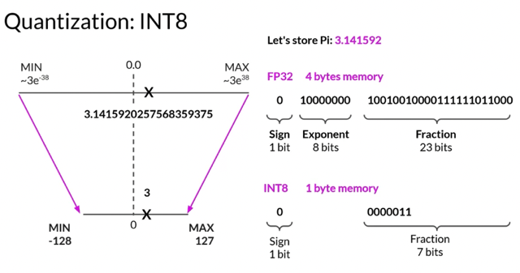</kbd>

> [!NOTE]
> Còn nếu dụng**Integer 8-bit** thì chỉ còn cần **1 byte memory**cho (1
> params) nhưng **rõ ràng là độ chính xác sẽ giảm đáng kể**

 

<kbd>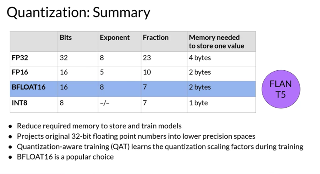</kbd>

> [!NOTE]
> Let's summarize what you've learned here and emphasize the **key points** you should
> take away from this discussion. Remember that the **goal of quantization is to reduce
> the memory required** to store and train models by **reducing the precision** of the model
> weights. Quantization **statistically projects the original 32-bit floating point numbers**
> into **lower precision spaces** using **scaling factors** calculated based on the range of the
> original 32-bit floats. Modern deep learning **frameworks** **and** **libraries** \_**support
> quantization-aware training**\_, which **learns the quantization scaling factors** during the
> training process. The details of this process are beyond the scope of this course. But
> you've seen the key point here, that **you can use quantization to reduce the memory**
> footprint of the model during training. **BFLOAT16** has become a **popular choice** of
> precision in deep learning as it **maintains the dynamic range of FP32**, but **reduces the
> memory footprint by half**. Many LLMs, including **FLAN-T5**, have been **pre-trained with
> BFOLAT16**. Lookout for a mention of BFLOAT16 in next week's lab.

> [!NOTE]
> Đại khái là việc nhắc lại **quantization** giúp **giảm nhẹ model** bằng cách thay
> thế việc dùng **full-precision 32 bit floating point** bằng việc dùng
> **haft-precision 16 bit floating point** thông qua quá trình **quantization-aware
> training** mà ta đã học bên MMOpsSpec. Và hiện tại người ta ưa chuộng
> **BFloat 16** do nó v**ẫn giữ dynamic range của FP32** nhưng vẫn **reduce
> memory xuống còn 1 nửa.** Và nhiều LLM trong đó có**Flan T5** được training
> với cái này

 

<kbd>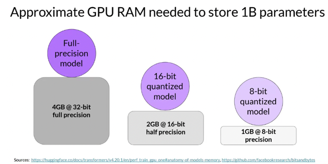</kbd>

> [!NOTE]
> Với cách này, ta vẫn có **1 Billion
> params model** nhưng **chỉ còn cần 1/2
> hoặc 1/4 memory yêu cầu**

 

<kbd>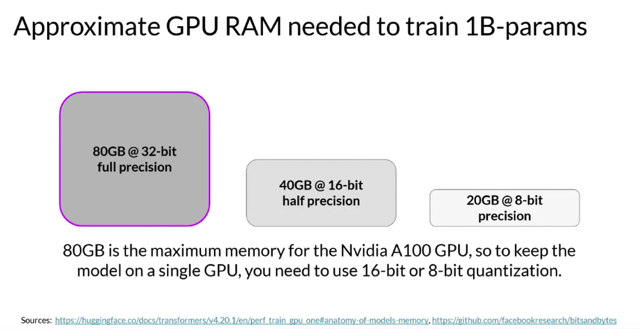</kbd>

> [!NOTE]
> và thay vì **80GB** thì chỉ cần**40 hoặc 20GB** để
> **train model** (ước lượng tổng số params khi
> training gấp 20 lần model params).

 

<kbd>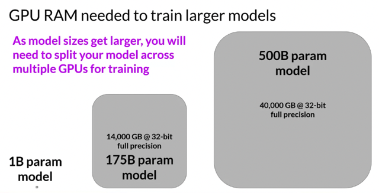</kbd>

> [!NOTE]
> Đại khái là **nếu model ở mức 1 tỉ params** thì với việc **quantization thì
> còn có thể train model trên 1 device duy nhất** vì nó**chứa đủ** (ví dụ xài
> cái Nvidia A100 80GB) nhưng model có thể lớn đến 176B hoặc 500B.
> Lúc này cần phải**distributed training** và **ước lượng đại khái là 500 cái
> mỗi cái 10000 usd, là sương sương tốn 5 triệu đô để mua GPU cho
> việc training**. Đó là lý do thường ta sẽ không train LLM model from scratch

 

