# Fine-tuning With Instruction

📊 **Progress:** `55` Notes | `54` Screenshots

---

## Instruction Fine-tuning

 

### Main ideas:

> [!NOTE]
> Main ideas:
>
> 1. Introduction: The passage begins by **recapping the previous week's topics**, including the **generative AI project
> lifecycle**, **example use cases for large language model**s, and the **tasks they can perform.**
> 2. **Purpose of the Lesson**: The lesson **aims to teach methods to improve the performance** of an existing model for
> **specific use cases** and introduces **important metrics for evaluating** the performance of a **fine-tuned large language
> model (LLM).**
>
> 3. **Fine-Tuning with Instruction Prompts**: The passage discusses fine-tuning as a **supervised learning**process
> where a **data set of labeled examples (prompt completion pairs**) is used to **update the weights of the LLM**.
> Fine-tuning focuses on**improving the model's ability** to **generate relevant completions for specific tasks.**
>
> 4. Instruction Fine-Tuning: A strategy known as**instruction fine-tuning** is introduced, which trains the model using
> **examples demonstrating how it should respond to specific instructions**. For various tasks, the data set contains
> **prompt completion pairs** wit**h clear instructions**.
>
> 5.**Full Fine-Tuning**: When **all the model's weights are updated** during fine-tuning, it is referred to as **full fine-tuning**.
> This process r**esults in a new version of the model with updated weights.**
>
> 6. **Memory** and **Compute Considerations**: **Similar to pre-training**, **full fine-tuning requires sufficient memory** and
> **compute budget**to store and process all the **gradients, optimizers, and other components**. **Memory optimization**
> and **parallel computing strategies** are recommended.
>
> 7. **Preparing Training Data**: Developers can use **publicly available datasets** and **prompt template libraries** to create
> **instruction prompt datasets for fine-tuning**. These libraries include **templates for different tasks and data sets.**
> 8. **Fine-Tuning Proces**s: The passage outlines the**steps for fine-tuning**, which involves **dividing the data into
> training, validation, and test splits**. During fine-tuning, the**model generates completions for prompts**, and t**hese
> completions are compared to the labeled responses** in the training data to c**alculate loss and update the model
> weights**.
>
> 9. **Evaluation**: The fine-tuning process includes **evaluation steps** using the **validation and test data sets** to measure
> the model's performance. The aim is to achieve**improved performance on specific tasks** with the new instruct
> model.
>
> 10. Conclusion: The passage clarifies that when referring to **fine-tuning** in the context of large language models, it
> is synonymous with**instruction fine-tuning.**

 

<kbd>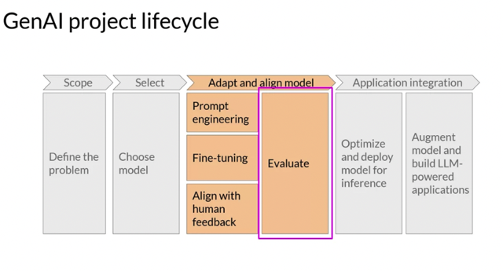</kbd>

> [!NOTE]
> Nói chung là week 2 sẽ tập trung vào
> **Fine-tuning và evaluate fine-tuned  LLM**

 

<kbd>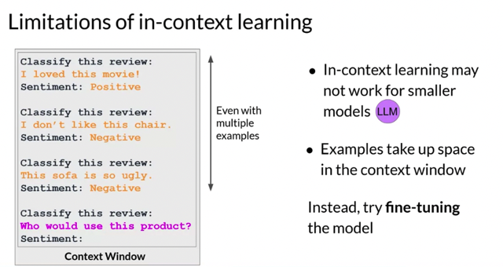</kbd>

> [!NOTE]
> Nhắc lại về i**n-context learning và một số hạn chế của nó**
> như k**hông hiệu quả với model nhỏ** và **bị giới hạn bởi
> context window** khiến k**hông thể cứ prompt dài thiệt dài**
> được. Đó là lúc cần phải**fine-tune**

 

<kbd>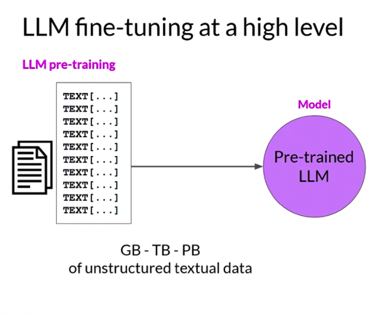</kbd>

> [!NOTE]
> **pre-training** là **train model với self-supervised
> learning** với**số lượng lớn unstructured textual data**

 

<kbd>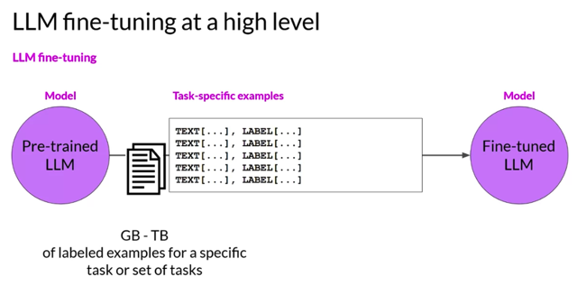</kbd>

> [!NOTE]
> **Fine-tuning** thì là **supervised learning**,
> train model với **data là prompt và label** là
> **completion mong muốn.**

 

<kbd>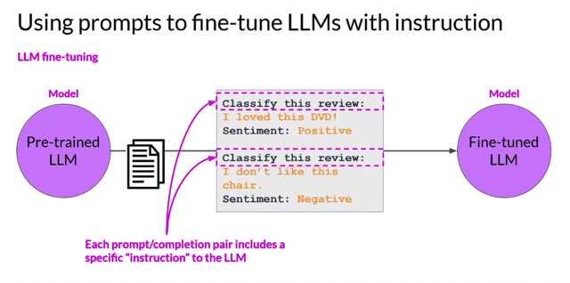</kbd>

 

<kbd>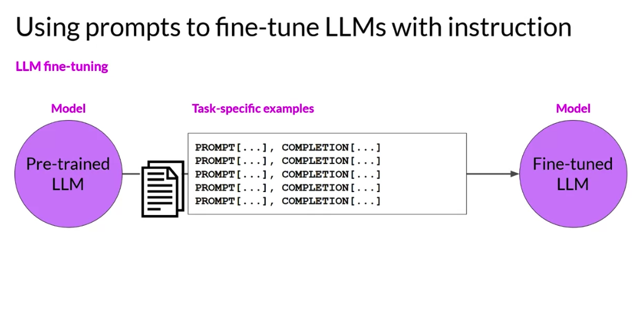</kbd>

 

<kbd>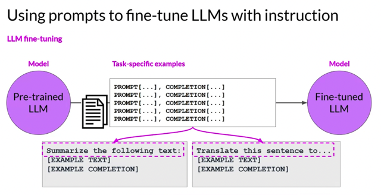</kbd>

> [!NOTE]
> **tuỳ vào specific task** mà**label -
> có dạng một câu trả lời đạt tiêu
> chuẩn cho task đó.**

 

<kbd>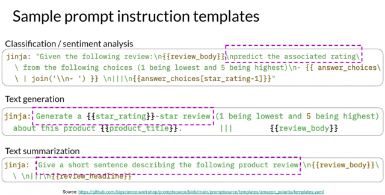</kbd>

> [!NOTE]
> Đại khái là **bước một là phải chuẩn bị data,**
> ta **có thể dùng các bộ data có sẵn như của
> Amazon product review**

 

<kbd>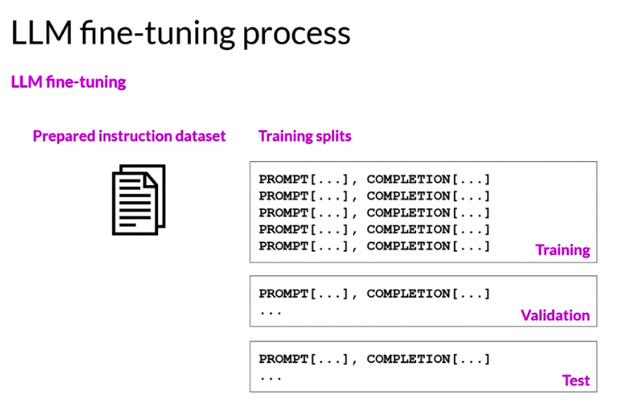</kbd>

> [!NOTE]
> **Chuẩn bị data xong** thì bước tiếp
> theo là**train-valid-test split.**

 

<kbd>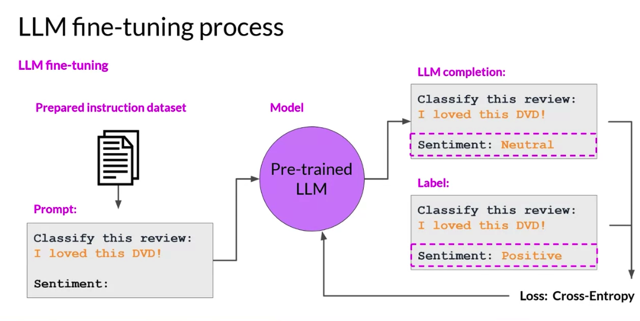</kbd>

> [!NOTE]
> Rồi quá trình**fine-tuning cơ bản là supervised learning**.
> Bắt đầu với **prompting (x trong training set), bỏ vào model
> để nó trả lời**. Dùng **label là một đáp án chuẩn để tính loss**
> (cross entropy) để **update model's weights bằng backprop
> như thường lệ,**

 

<kbd>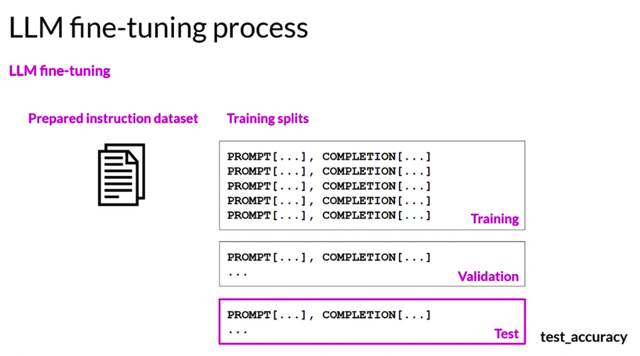</kbd>

> [!NOTE]
> Và khi training xong, **dùng validation để h.p tuning**
> và tính ra**validation accuracy.** Sau cùng là dùng
> **test set tính test_accuracy**

 

<kbd>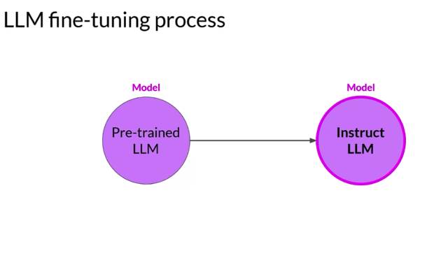</kbd>

> [!NOTE]
> Kết quả là " **instructed model"** có khả năng làm**tốt hơn original
> model ở specific task**

 

## Fine-tuning On A Single Task

 

### 1. While**large language models (LLMs)** are known for \\*their ability to perform multiple language

> [!NOTE]
> 1. While**large language models (LLMs)** are known for **their ability to perform multiple language
> tasks**, some **applications may only require performing a single task.**
>
> 2**. Fine-tuning a pre-trained model** is a technique to **improve the model's performance on a specific
> task** of interest **using a dataset with examples related to that task**.
>
> 3. Fine-tuning can**lead to good results** even with a**relatively small number of examples**, contrary
> to the massive amount of text the model saw during pre-training.
>
> 4. A **potential drawback** of fine-tuning is **catastrophic forgetting**, where the**model's performance
> on other tasks may degrade** after fine-tuning.
>
> 5. To avoid catastrophic forgetting, it's **essential to assess whether maintaining multitask capabilities
> is crucial** for the application.
>
> 6. One option is **multitask fine-tuning**, where the model is**fine-tuned on multiple tasks
> simultaneously**, which **requires more data** and **computational resources.**
>
> 7. Another option is **parameter efficient fine-tuning (PEFT),** which**preserves the original LLM
> weights** and**trains only small task-specific adapter layers and parameters**. PEFT is **more robust
> to catastrophic forgetting**.
>
> 8. PEFT is an **active area of research** and is **aimed at addressing the challenges of fine-tuning and
> multitask learning.**
>
> 9. The text mentions that **multitask fine-tuning will be discussed in more detail in subsequent
> content**, and the focus will move on to **exploring multitask fine-tuning in the next video.**

 

<kbd>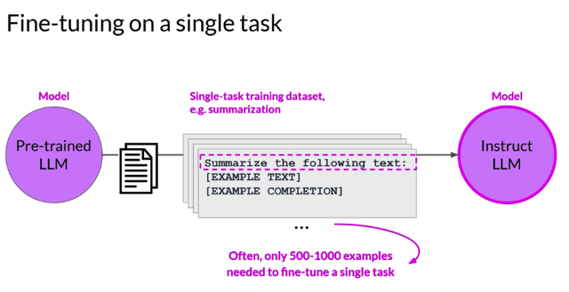</kbd>

> [!NOTE]
> Ý là **dù LLM có thể perform nhiều loại task khác nhau** nhưng **có thể mình chỉ cần nó
> làm tốt trên một task cụ thể nào đó** ví dụ **Summarization** thôi. Lúc này ta sẽ
> **fine-tuning LLM với training data của specific task đó** và **không cần nhiều chỉ 500-1000
> sample cũng có thể đủ** để cải thiện đáng kể khả năng của model trong task mong muốn.
> Tuy nhiên c**ó một hiện tượng có thể xẩy ra là "Catastrophic forgeting"**

 

<kbd>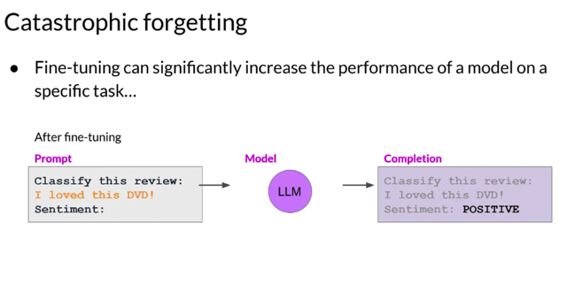</kbd>

<kbd></kbd>

<kbd>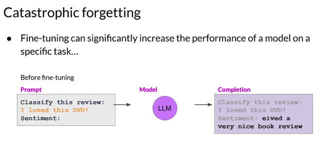</kbd>

> [!NOTE]
> Đại khái là dù **giúp cải thiện khả năng của model trong task mong muón**
> nhưng lại dẫn đến **ảnh hưởng giảm performance trên các task khác.**

 

<kbd>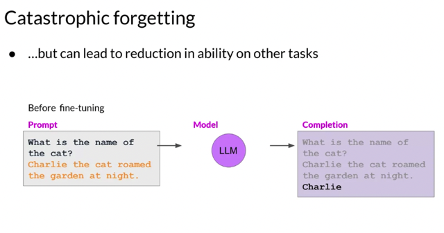</kbd>

> [!NOTE]
> Như **trước khi fine-tuning model đối
> với task sentiment analysis**có thể làm
> tốt câu hỏi "nhớ tên" này

 

<kbd>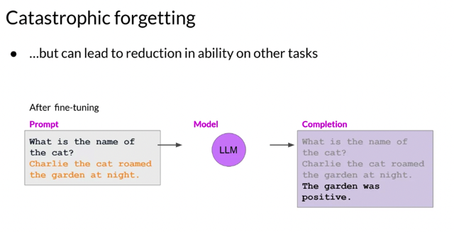</kbd>

> [!NOTE]
> Nhưng **sau khi fine-tuning, nó không
> còn trả lời đúng nữa**, **mà lại trả lời theo
> kiểu sentiment analysis**

 

<kbd>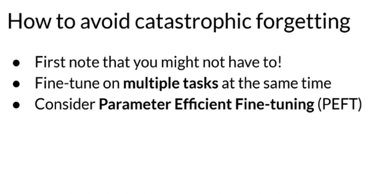</kbd>

> [!NOTE]
> Giải pháp:
>
> 1 là**khỏi care** những task khác có tệ thế nào **nếu ta chỉ cần nó làm tốt thứ
> ta muốn**.
>
> 2 là **fine-tuning với nhiều task cùng lúc** cách này **phải chuẩn bị data
> nhiều** (cho nhiều task) cùng với đó sẽ là**compute budget**..
>
> 3 tốt nhất, đại khái là một technique có tên là **PEFT** giúp **thay vì tweak
> toàn bộ params (gọi là full-training)** thì nó sẽ **chỉ thay đổi các param liên
> quan đến task đang fine-tuning thôi**. Từ đó **giảm thiểu tác động đến các task
> khác.**

 

<kbd>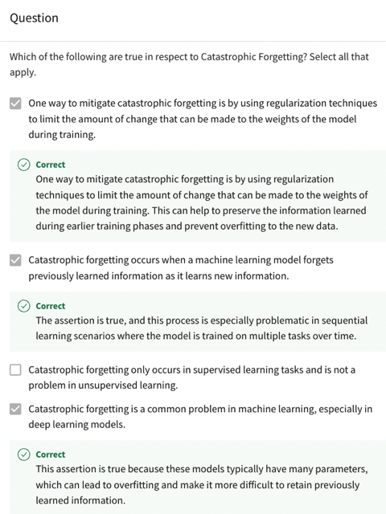</kbd>

 

## Multi-task Instruction Fine-tuning

 

### 1. Multitask Fine-Tuning: It **extends single task fine-tuning** by \\*using a training dataset that includes

> [!NOTE]
> 1. Multitask Fine-Tuning: It **extends single task fine-tuning** by **using a training dataset that includes
> examples for multiple tasks**. The goal is to **improve the model's performance on various tasks
> simultaneously** and **prevent catastrophic forgetting**.
>
> 2. FLAN Family of Models: **FLAN** stands for **Fine-Tuned Language Net.** **FLAN models are fine-tuned**
> using **multitask instruction fine-tuning**. They are **capable of handling multiple tasks** and have been **trained
> on diverse datasets** from different models and papers.
>
> 3. **SAMSum Dataset**: An example of a **prompt dataset used for summarization tasks** in FLAN-T5. It
> consists of **messenger-like conversations with summaries crafted by linguists** to generate a high-quality
> training dataset for language models.
>
> 4. **Additional Fine-Tuning**: While FLAN-T5 is a good general-purpose model, it may **still need improvement
> for specific tasks**. Additional **fine-tuning with domain-specific datasets**, such as **dialogsum**, can enhance
> the model's performance for targeted tasks.
>
> 5. **Custom Fine-Tuning**: Companies can **benefit from fine-tuning with their own internal data**, such as
> **customer support chat conversations**, to **train models tailored to their specific needs**.
>
> 6. Evaluation of Model Completions: To **assess the quality of fine-tuned models**, **various metrics and
> benchmarks can be used** to compare their performance with the original base model.

 

<kbd>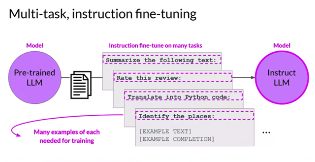</kbd>

> [!NOTE]
> Đại khái là **fine-tuning với data trên nhiều task**. Giúp **cải thiện khả năng
> model trên nhiều task đó và tránh hiện tượng catastrophic forgeting**.
> Nhược điểm là yêu cầu nhiều data và compute budget tương ứng.

 

<kbd>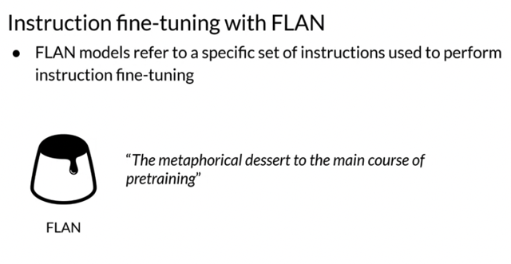</kbd>

> [!NOTE]
> Đại khái là nói về cái tên FLAN model thật ra là để chỉ **những model khác
> nhau**được f**ine tune với specific set of instructions**. FLAN viết tắt của
> **F**ine-tuned **LAnguage N**et.

 

<kbd>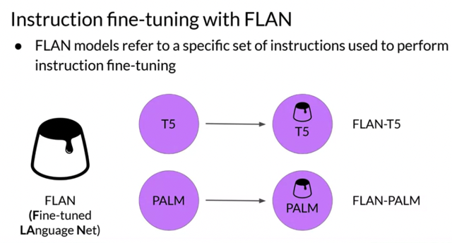</kbd>

> [!NOTE]
> Ví dụ**FLAN-T5 là based model T5
> được instruction Fine-tuned**

 

<kbd>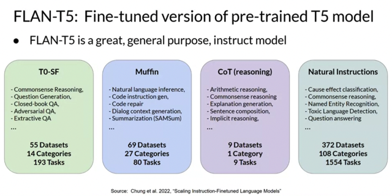</kbd>

> [!NOTE]
> FLAN-T5 được instructed
> fine-tuned với **rất nhiều dataset
> cho rất nhiều specific task**

 

<kbd>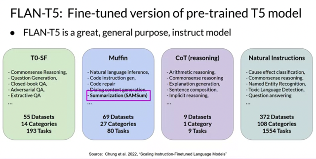</kbd>

> [!NOTE]
> Ví dụ một trong những **dataset** dùng để fine-tuned đó, là
> **SAMsum** - Gồm có các **dialog và summarization**

 

<kbd>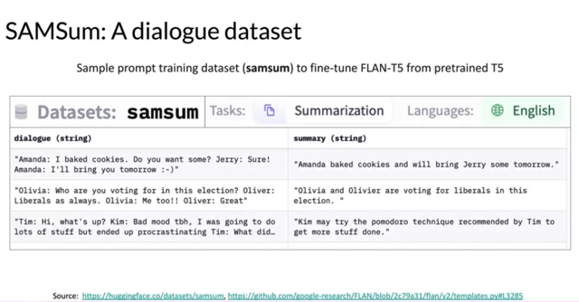</kbd>

> [!NOTE]
> Hàng chục ngàn dialog được
> summarize bởi các linguist

 

<kbd>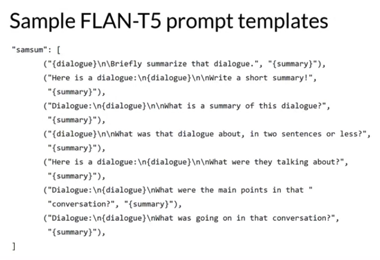</kbd>

> [!NOTE]
> Ví dụ một **prompt template** như sau ta thấy đều có dạng: **Dialog - Câu hỏi (yêu
> cầu) - Câu trả lời chuẩn**. Nhưng **câu hỏi thì có nhiều kiểu** khác nhau. Mục
> đích là để **dạy cho model biết là những dạng yêu cầu có nội dung như vậy thì
> phải summarize như vậy.**

 

<kbd>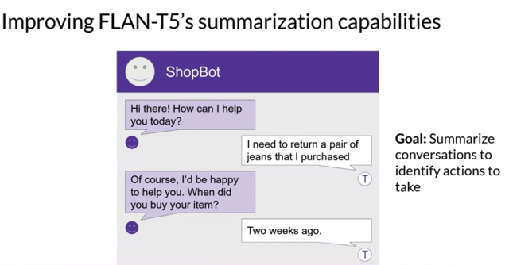</kbd>

> [!NOTE]
> Tuy nhiên vì **SAMsum dataset chỉ là những dialog chủ yếu là giữa bạn bè**nên nếu muốn**cải thiện hơn nữa khả năng summarization đối với các task
> cụ thể ví dụ như chăm sóc khách hàng** của công ty mình thì **ta có thể
> fine-tuning tiếp với các data của mình.**

 

<kbd>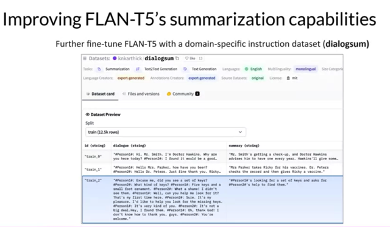</kbd>

> [!NOTE]
> Trong P.A ta sẽ làm việc đó, tức là**fine-tune để tiếp
> tục cải thiện hơn khả năng summarization của FLAN
> T5 với bộ dialogsum dataset**

 

<kbd>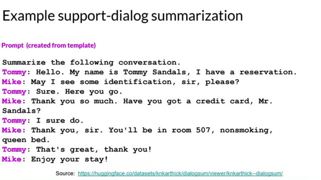</kbd>

> [!NOTE]
> Một **ví dụ** cho thấy câu trả lời của model FLAN-T5 
> trước và sau khi fine-tuning với **dialogsum**

 

<kbd>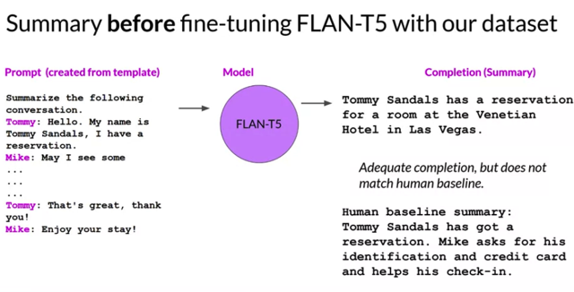</kbd>

 

<kbd>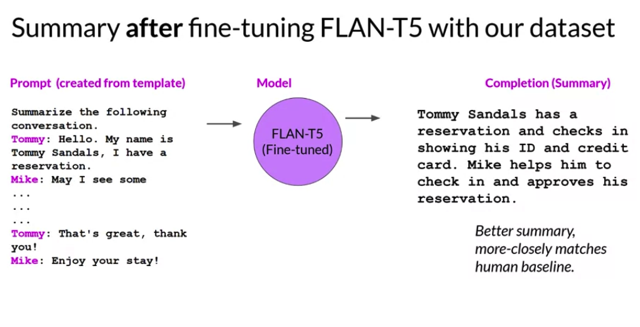</kbd>

> [!NOTE]
> Cho thấy sau khi tuned
> model **summarize tốt hơn**

 

<kbd>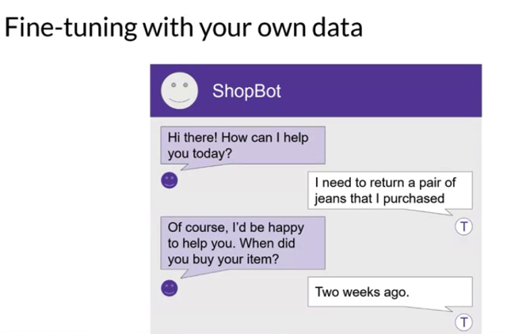</kbd>

> [!NOTE]
> Đại khái nói là có thể fine-tuned tiếp với
> **data của mình**để cải thiện model hơn nữa phù
> hợp với l**ĩnh vực cụ thể**

 

## Scaling Instruct Models

 

### This paper\\/ https://arxiv.org/abs/2210.11416\\/

> [!NOTE]
> This paper\\/ https://arxiv.org/abs/2210.11416\\/
>
>  introduces FLAN (Fine-tuned LAnguage Net), an instruction
> finetuning method, and presents the results of its application. The study
> demonstrates that by fine-tuning the 540B PaLM model on 1836 tasks while
> incorporating Chain-of-Thought Reasoning data, FLAN achieves improvements
> in generalization, human usability, and zero-shot reasoning over the base
> model. The paper also provides detailed information on how each these aspects
> was evaluated.

 

<kbd>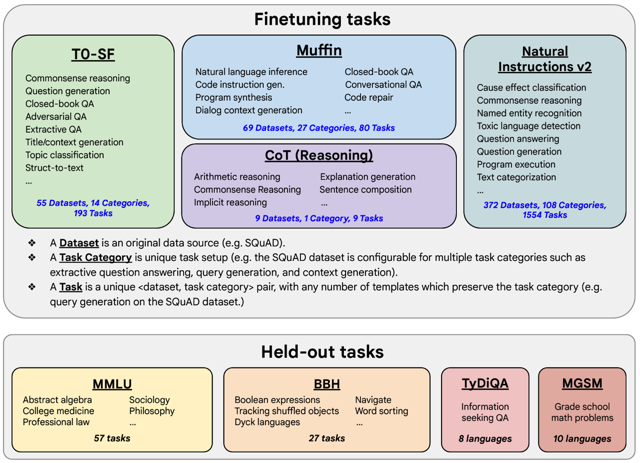</kbd>

> [!NOTE]
> Here is the image from the lecture slides that illustrates the fine-tuning tasks and datasets employed
> in training FLAN. The task selection expands on previous works by incorporating dialogue and
> program synthesis tasks from Muffin and integrating them with new Chain of Thought Reasoning
> tasks. It also includes subsets of other task collections, such as T0 and Natural Instructions v2. Some
> tasks were held-out during training, and they were later used to evaluate the model's performance on
> unseen tasks

 

## Model Evaluation

 

### 1. The speaker discusses the challenge of evaluating the performance of large language models,

> [!NOTE]
> 1. The speaker discusses the challenge of evaluating the performance of large language models,
> particularly in **non-deterministic** and**language-based tasks**.
>
> 2. **Traditional machine learning** metrics like **accuracy** are **not sufficient for language models** due
> to the **complexity of language** and the **non-deterministic nature of their outputs.**
>
> 3. Two widely used evaluation metrics for language models are **ROUGE** (**Recall Oriented
> Understudy for Gisting Evaluation**) and **BLEU** (**Bilingual Evaluation Understudy**).
>
> 4. **ROUGE** measures the **quality of automatically generated summaries** by **comparing them to
> human-generated reference summaries**, while **BLEU evaluates the quality of machine-translated
> text.**
>
> 5. **ROUGE-1**focuses on **individual words (unigrams)**, **ROUGE-2**takes **bigrams into account**, and
> **ROUGE-L** considers the **longest common subsequence** between the **generated and reference
> outputs**.
>
> 6. Both **ROUGE** and **BLEU** have **limitations**, such as **rewarding repeated words** and **not
> considering the ordering of words**.
>
> 7.**Pre-written libraries**, like those from **Hugging Face**, make it easy to calculate **ROUGE**  and
> **BLEU** scores for **model evaluation**.
>
> 8. While ROUGE and BLEU can be used as **diagnostic evaluation tools**, they should not be the
> **sole basis for reporting the final evaluation of a large language model.**
>
> 9. Researchers use**evaluation benchmarks** to provide a **more comprehensive** and **robust**
> assessment of a language model's performance.

 

<kbd>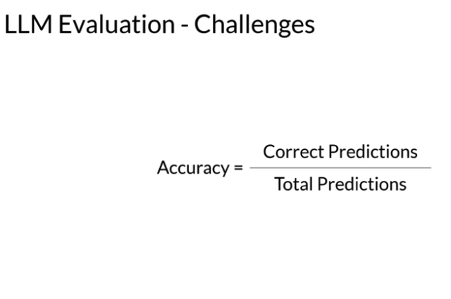</kbd>

> [!NOTE]
> Đại khái là **traditional model**thường dùng các metric như **accuracy** để đánh giá vì nó là các
> **deterministic** - tức là những**vấn đề có thể định lượng là đúng hay sai một cách tuyệt đố**i.
> Trong khi đó **LLM** thường giải quyết c**ác vấn đề un-deterministic liên quan đến ngôn ngữ** -
> nôm na là **không có định nghĩa tuyệt đối là đúng hay sai nên để evaluate LLM khó hơn**

 

<kbd>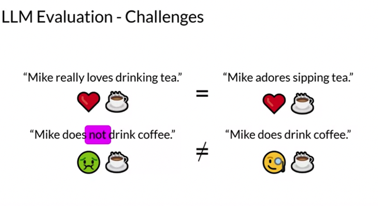</kbd>

> [!NOTE]
> Đại khái là với các vấn đề liên quan đến **language** của LLM thì**đôi khi chỉ khác
> có 1 chữ thôi** ý nghĩa đã khác hoàn toàn. Hoặc cùng **một ý nhưng có câu hay câu
> dở**. Não người dễ dàng nhận ra khác biệt nhưng máy tính thì không. Ta cần phải có
> những**metric để đánh giá khả năng của model một cách có hệ thống.**

 

<kbd>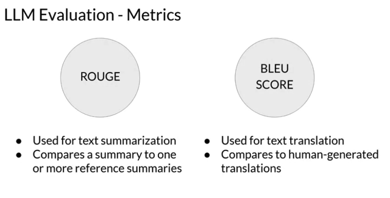</kbd>

> [!NOTE]
> Hai thông số trong đó **BLEU**score mình đã gặp trong
> DLSpec dùng để **đánh giá Translation Model**. Đại khái nó
> sẽ **so sánh kết quả của model với con người,**

 

<kbd>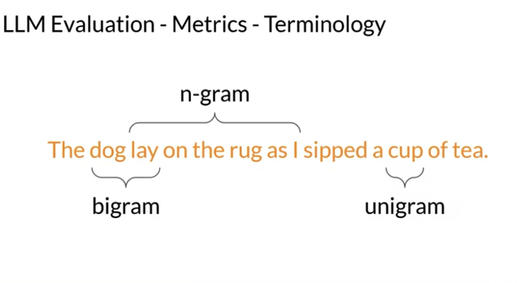</kbd>

> [!NOTE]
> Nhắc lại một chút các khái niệm**uni-gram**,
> **bi-gram** và **n-gram** trong language model là
> những cụm 1 2 hoặc n từ sát nhau

 

<kbd>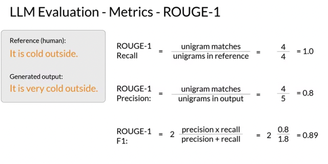</kbd>

> [!NOTE]
> Cách tính **ROUGE 1** khá **naive** chỉ quan tâm đến **độ '
> matching' của các từ đơn lẻ** trong model output **so với
> human output.** **Không quan tâm đến thứ tự**

 

<kbd>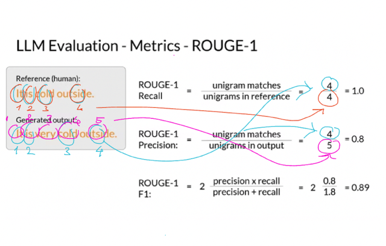</kbd>

 

<kbd>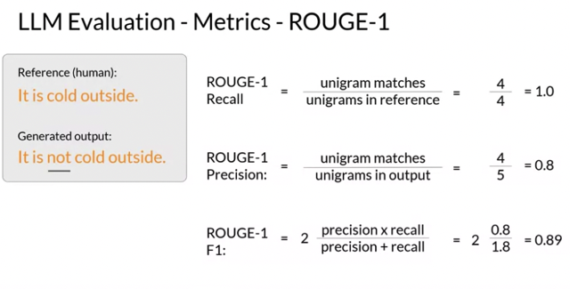</kbd>

> [!NOTE]
> Và cách này bộc lộ nhiều**nhược điểm**khi như ví dụ này
> có c**hữ "not" khiến ý nghĩa hai câu hoàn toàn trái ngược**
> nhưng **ROUGE của model vẫn cao**

 

<kbd>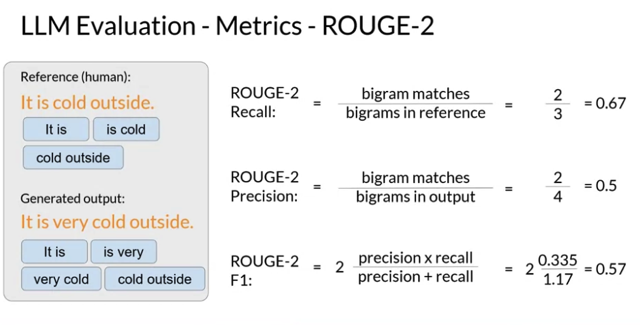</kbd>

> [!NOTE]
> Thay vì dùng uni-gram thì có thể **dùng bi-gram để cải thiện hơn chút**
> ít cách đánh gía khi **có tính thêm một ít yếu tố thứ tự của từ**. Ta thấy
> chỉ số **ROUGE-2 nhỏ hơn so với ROUGE-1**

 

<kbd>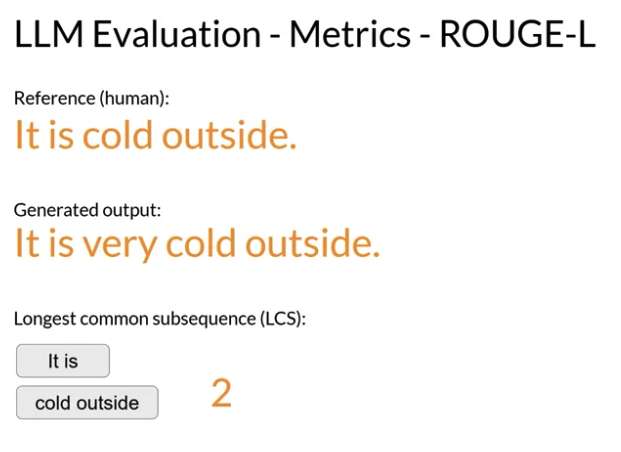</kbd>

> [!NOTE]
> Một cách khác là **tìm những subset dài
> nhất mà hai output match nhau.** Ví dụ "
> it is" và "cold outside"

 

<kbd>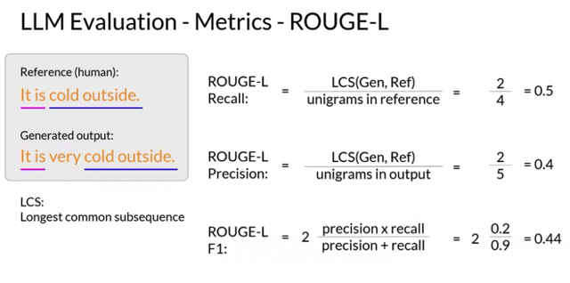</kbd>

> [!NOTE]
> Và tính chỉ số ROUGE-L. Tuy nhiên, các chỉ số
> ROUGE c**hỉ có thể compare các model có chung 1
> task.**

 

<kbd>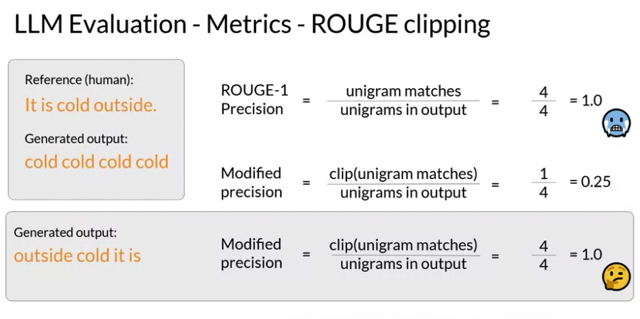</kbd>

> [!NOTE]
> ROUGE có nhược điểm như đã nói là có
> thể **model tệ mà vẫn có điểm cao. Ví dụ
> hai trường hợp dưới**

 

<kbd>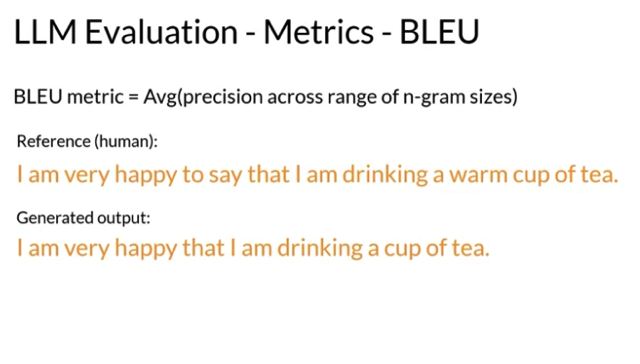</kbd>

 

<kbd>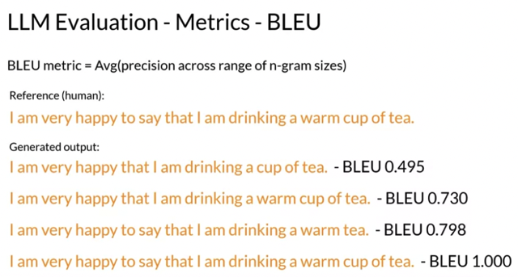</kbd>

> [!NOTE]
> BLUE thì **tính trung bình chỉ số
> precision trên tất cả các n-gram**

 

## Benchmarks

 

### 1. **Evaluating Language Models (LLMs)** requires **more comprehensive benchmark**s beyond simple

> [!NOTE]
> 1. **Evaluating Language Models (LLMs)** requires **more comprehensive benchmark**s beyond simple
> metrics like rouge and blur scores.
>
> 2.**Pre-existing datasets and associated benchmarks** established by LLM researchers help measure
> and compare LLMs holistically.
>
> 3. **Selecting the right evaluation dataset** is crucial to **accurately assess an LLM's performance** and
> **understand its true capabilities.**
>
> 4. Benchmarks like **GLUE** (General Language Understanding Evaluation) and **SuperGLUE** cover
> **various natural language tasks**, encouraging the development of models that can **generalize across
> multiple tasks**.
>
> 5. As models get larger, **their performance against benchmarks like SuperGLUE approaches
> human-level ability on specific tasks**, but they **still fall short in general human-like performance.**
>
> 6. Recent benchmarks like **Massive Multitask Language Understanding** (**MMLU**) and **BIG-bench**
> push LLMs further, testing models on **tasks that require extensive world knowledg**e and
> **problem-solving abilities.**
>
> 7. The **Holistic Evaluation of Language Models** (**HELM**) is a **benchmark framewor**k that aims to
> i**mprove model transparency** and **offers guidance on model selection for specific tasks**.
>
> 8. HELM employs a **multimetric approach**, measuring **seven metrics** across **16 core scenario**s,
> including **fairness, bias, and toxicity**, which are crucial as LLMs become more capable of human-like
> language generation.
>
> 9. HELM is a l**iving benchmark** that continuously evolves with the **addition of new scenarios, metrics,
> and models, providing valuable insights for project needs.**

 

<kbd></kbd>

> [!NOTE]
> 1. Language Model (LLM) evaluation **requires more comprehensive metrics** than simple ones
> like rouge and blur scores to **fully understand a model's capabilities**.
>
> 2. To measure and compare LLMs effectively, researchers often **use pre-existing datasets** and
> **associated benchmarks** **specifically designed for LLM evaluation**.
>
> 3. **Choosing the right evaluation dataset** is **crucial** to **accurately assess an LLM's performance**
> and **understand its true capabilities**.
>
> 4. **Evaluation datasets** may **focus on specific model skills**, such as **reasoning** or **common sense**
> knowledge, or **address potential risks** like **disinformation or copyright infringement.**
>
> 5. An **important consideration** is whether the LLM has been **exposed to the evaluation data**
> during training. **Evaluating the model on unseen data** provides a **more accurate and useful
> understanding of its capabilities.**

> [!NOTE]
> Đại khái là để đánh giá LLM**cần nhiều hơn là chỉ dựa vào các chỉ số như ROUGE hay
> BLEU scores**. Do đó người ta phát triển các **benchmark** - gọi là **thước đo chuẩn hoá để
> giúp đánh giá model** trên **nhiều khả năng khác nhau**.
>
> Và một việc quan trọng phải làm đó là**chọn được cái benchmark và evaluation dataset** để
> đo chính xác khả năng của model trong một tác vụ cụ thể.
>
> Nhưng evaluation dataset này **được thiết kế để test một khả năng nào đó của model như
> reasoning, disinformation,..**
>
> Cuối cùng một điểm quan trọng cần chú ý là p**hải đảm bảo model chưa từng được thấy
> dataset đó trong lúc training**vì như vậy sẽ khiến việc đánh giá không còn chính xác.

 

<kbd>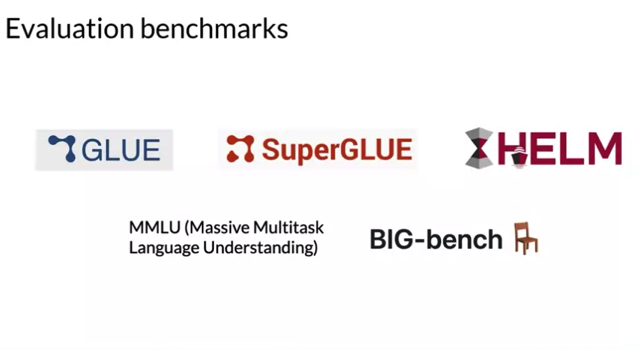</kbd>

> [!NOTE]
> Một số các benchmark

> [!NOTE]
> Benchmarks, such as GLUE, SuperGLUE, or Helm, cover a **wide range of tasks
> and scenarios**. They do this by **designing or collecting datasets** that **test specific
> aspects of an LLM.**

 

<kbd>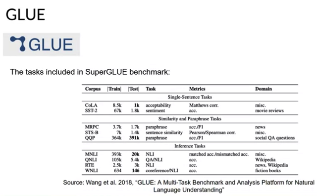</kbd>

> [!NOTE]
> **GLUE**, or**General Language Understanding Evaluation**, was introduced in 2018.
> GLUE is a **collection of natural language tasks**, such as **sentiment analysis** and
> **question-answering**. GLUE was created to encourage the development of models
> that can **generalize across multiple tasks**, and you **can use the benchmark to
> measure and compare the model performance**.

> [!NOTE]
> Đại khái là GLUE được tạo ra nhằm mục đích đánh gía**KHẢ NĂNG HIỂU
> NGÔN NGỮ NÓI CHUNG**của model đối với các task như sentiment
> analysis, question-answering.

 

<kbd>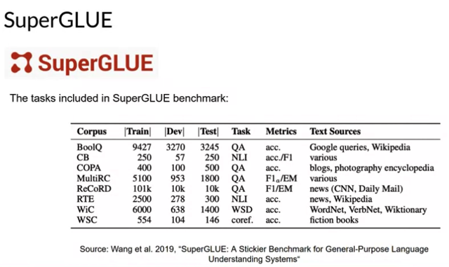</kbd>

> [!NOTE]
> As a **successor** to GLUE, **SuperGLUE** was introduced in 2019, to **address
> limitations** in its predecessor. It consists of a series of tasks, some of which
> are not included in GLUE, and some of which are **more challenging versions**
> of the same tasks. SuperGLUE includes**tasks such as multi-sentence
> reasoning**, and **reading comprehension**

> [!NOTE]
> SuperGLUE nhằm **mục đích tăng độ khó** cũng như **khắc phục những
> nhược điểm của GLUE**và**mở rộng thêm các task**như**khả năng đọc
> hiểu, multi-sentence reasoning**

 

<kbd>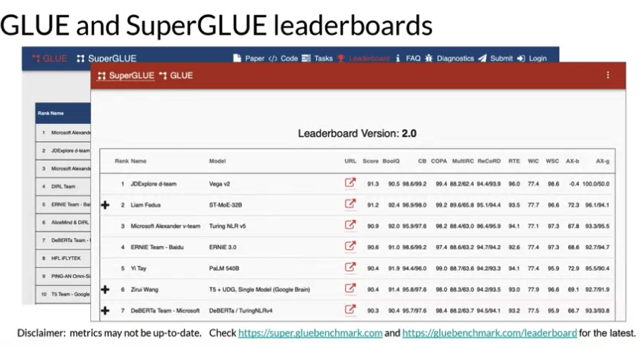</kbd>

> [!NOTE]
> Both the GLUE and SuperGLUE benchmarks have **leaderboards** that can
> be used to c**ompare and contrast evaluated models**. The results page is
> another**great resource for tracking the progress of LLM**

> [!NOTE]
> As models get larger, their **performance against benchmarks** such
> as **SuperGLUE** start to **match human ability** on specific tasks.
> That's to say that models are able to **perform as well as humans on
> the benchmarks tests**, but subjectively we can see that they're not
> performing at human level at tasks in general. There is **essentially an
> arms race between the emergent properties of LLMs**, and the
> **benchmarks that aim to measure them**

> [!NOTE]
> Cả hai đều có leaderboard đánh giá các
> LLM trên những benchmark này

> [!NOTE]
> Ý nói khi các model ngày càng phát triển, thì các
> benchmark ngày càng tiệm cận con người.

 

<kbd>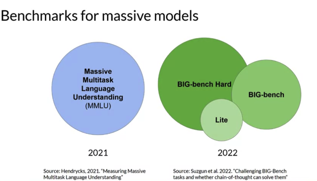</kbd>

> [!NOTE]
> 1. **Massive Multitask Language Understanding (MMLU)** is a benchmark designed specifically
> for **modern Language Models (LLMs)** to evaluate their e**xtensive world knowledge and
> problem-solving abilities**.
>
> 2. MMLU includes tasks that **go beyond basic language understanding**, such as **elementary
> mathematics**, **US history, computer science, law,** and more.
>
> 3.**BIG-bench** is another recent **benchmark** that encompasses a wide range of **204
> tasks**, covering areas **like linguistics, childhood development, math, common sense
> reasoning, biology, physics, social bias, and software development.**
>
> 4. BIG-bench offers **three different sizes of benchmarks** to manage **inference costs,** as
> running these large benchmarks can be**computationally expensive.**

> [!NOTE]
> **MMLU** được design để **đánh giá các khả năng vượt ra phạm vi language như toán
> cơ bản, lịch sử**,....Hoặc **BIG-bench** bao gồm **204 tasks như math, social bias,
> physic**s...Nó có nhiều v**ersion to nhỏ khác nhau để khách hàng chọn lựa**

 

<kbd>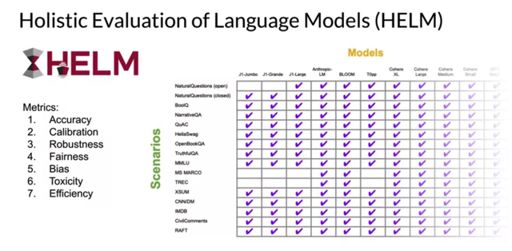</kbd>

> [!NOTE]
> 1. The **Holistic Evaluation of Language Models** (HELM) is a **benchmark framework**designed to
> improve the **transparency** of language models and guide model selection for specific tasks.
>
> 2. HELM adopts a **multimetric approach**, using **seven metrics across 16 core scenarios** to provide
> a **comprehensive evaluation of language models**, revealing **trade-offs between models and
> metrics.**
>
> 3. HELM goes**beyond basic accuracy measures**and includes **metrics for precision, F1 score,
> fairness, bias, and toxicity**, which are essential for assessing **potential harmful behavior** as
> language models become more human-like.
>
> 4. **HELM** is a **dynamic benchmark** that continuously evolves by incorporating new scenarios,
> metrics, and models.
>
> 5. **Researchers and practitioners**can explore the HELM results page to browse evaluated
> language models and review scores relevant to their project's requirements.

> [!NOTE]
> Còn HELM là một bm khác được design để **cải thiện transparency của language
> model.** Nó tiếp cận theo hướng**multi-centric approach** sử dụng **7 metrics trải rộng 16
> core scenarios** nhằm giúp **đánh giá khả năng ngôn ngữ của model**. Nó bao gồm cả các
> metric khư p**recisions, F1 score, fairness, bias và toxicity.** Helm liên tục được nâng cấp

 

