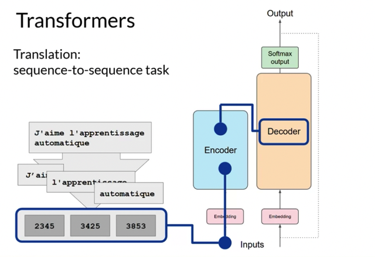
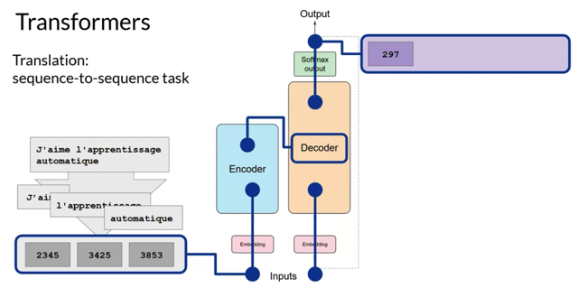
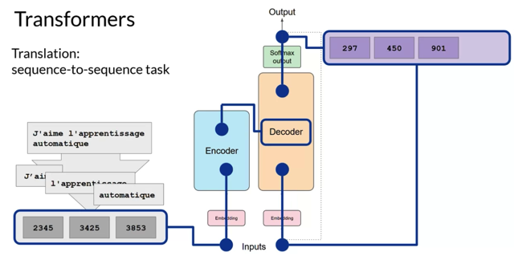
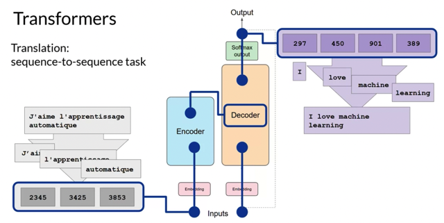
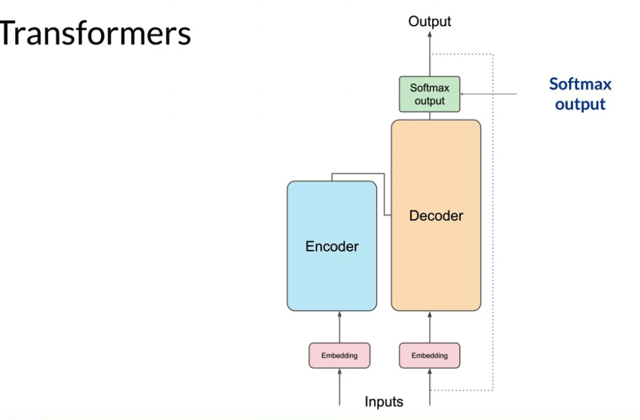
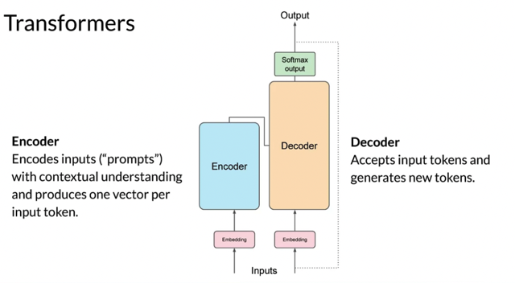
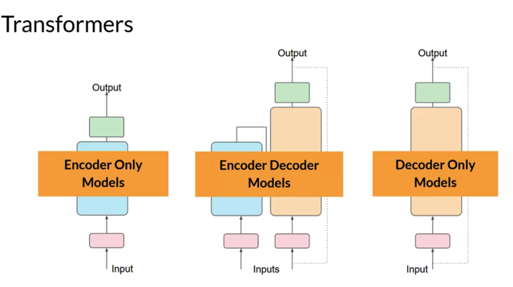

# Generating Text With Transformers

📊 **Progress:** `7` Notes | `7` Screenshots

---

## 1 Transformer Architecture: The passage provides a high-level overview of the **major components** inside

> [!NOTE]
> 1 Transformer Architecture: The passage provides a high-level overview of the **major components** inside
> the**transformer architecture**.
>
> 2 Translation Task: The example focuses on a translation task, where a transformer model is used to
> translate a French phrase into English.
>
> 3 **Tokenization** and **Encoding**: The input words are **tokenized** using a **tokenizer**, **added to the
> encoder side of the network**, **passed through the embedding layer**, and then **fed into the multi-headed
> attention layers**.
>
> 4 **Encoder**: The **input sequence** **goes through the encoder**, which **generates a deep representation
> of the input sequence's structure and meaning**.
>
> 5 **Decoder**: The **deep representation from the encoder** is **inserted into the decoder** to influence its
> **self-attention mechanisms**. A **start of sequence token** is **added to the decoder's input**, and **it
> predicts the next token** based on the**contextual understanding from the encoder**.
>
> 6**Looping and Generation**: The **output token** from the **decoder** is p**assed back as input to generate
> the next token**. This **loop** continues **until an end-of-sequence token is predicted**, generating the**final
> sequence of tokens.**
>
> 7 **Detokenization**: The**final sequence of tokens** can be **detokenized into words**, resulting in the
> **translated output.** 8 Types of **Transformer Models:**
>
> a.**Encoder-Only Models**: They work as **sequence-to-sequence models** and can be used for**classification tasks** with additional layers. **BERT** is an example.
>
> b. **Encoder-Decoder Model**s: They excel at**sequence-to-sequence** tasks like **translation**. They can
> also be trained for **general text generation task**s. Examples include **BART** and **T5**.
>
> c. **Decoder-Only Models**: Widely used models like **GPT**, **BLOOM**, **Jurassic**, **LLaMA**, etc., that
> can **generalize to most tasks.**
>
> 9 **Prompt Engineerin**g: Understanding the details of the underlying architecture is not necessary for
> interacting with transformer models through natural language. **Prompt engineering, using written words as
> prompts,** is the **key to working with transformer model**s.
>
> The passage emphasizes that the goal is to provide **enough background information** to understand the
> **differences between various transformer models** and read their documentation, without needing to
> remember all the details. The next part of the course will focus on prompt engineering.

 

<kbd></kbd>

> [!NOTE]
> Như đã nói ở bài trước, qua các bước **tokenization**, **embedding**,
> **multi-head attention**, **fully connected layers**, **output** của encoder sẽ được
> **insert** vào **khúc giữa của decoder**cung cấp các **thông tin về ngữ cảnh**
> cho **decoder** để nó **dùng khi generating text.**

 

<kbd></kbd>

> [!NOTE]
> Decoder cũng **nhận input bắt đầu từ start of sentence token**, cũng **tokenization**, **embedding**, và
> **multi-head attention**. Sau đó nó **kết hợp với output của encoder** và qua một số**FC layer**
> và **softmax** để p**redict ra từ tiếp theo**. Tiếp tục, **bỏ từ mới generate này** vào **input** của
> decoder để **tiếp tục vòng lặp cho đến khi generate EOS token**.

 

<kbd></kbd>

 

<kbd></kbd>

> [!NOTE]
> Xong hết, các token được
> **detokenize** để **tạo ra câu tiếng Anh**

 

<kbd></kbd>

 

<kbd></kbd>

> [!NOTE]
> Let's summarize what you've seen so far. The **complete transformer
> architecture** consists of an **encoder** and **decoder** components. The
> **encoder** encodes **input sequences**into a **deep representation** of the
> structure and meaning of the input. The **decoder**, working from **input
> token triggers**, uses the **encoder's contextual understanding** to **generate
> new tokens**. It does this in a **loop until some stop condition has been
> reached**

 

<kbd></kbd>

> [!NOTE]
> **Encoder-only models** also work as**sequence-to-sequence models**, but **without
> further modification**, the input sequence and the output sequence or the **same
> length.** Their use is**less common these days**, but by **adding additional layers
> to the architecture**, you can **train encoder-only model**s to perform **classification
> tasks**such as **sentiment analysis**, **BERT** is an example of an encoder-only
> model

> [!NOTE]
> Encoder-decoder models, as you've seen, perform well on
> **sequence-to-sequence tasks** such as **translation**, where the **input
> sequence** and the **output sequence** can be **different lengths**. You can
> also **scale and train this type of model to perform general text
> generation tasks**. Examples of encoder-decoder models include
> BART as opposed to **BERT** and **T5**, the model that you'll use in the
> labs in this course.

> [!NOTE]
> Finally, **decoder-only models** are some of the **most commonly used**today. Again, as they have scaled, their capabilities have grown.
> These models can now generalize to most tasks. Popular
> decoder-only models include the **GPT** family of models, **BLOOM**,
> **Jurassic**, **LLaMA**, and many more

 

