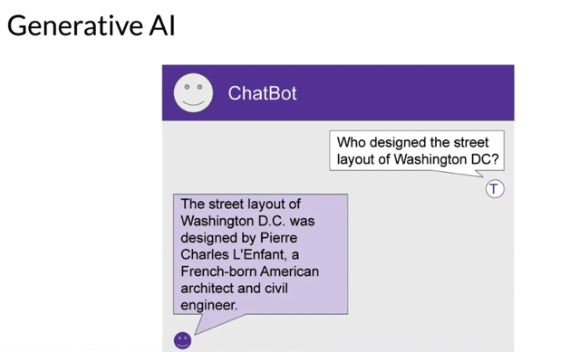
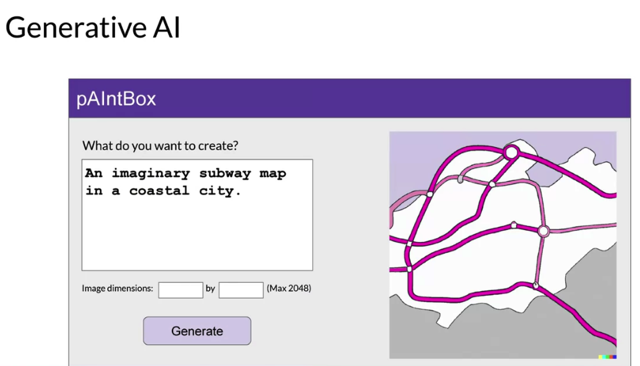
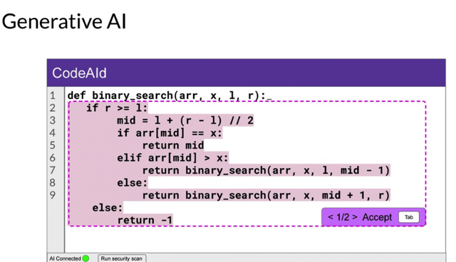
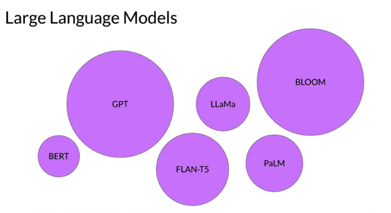
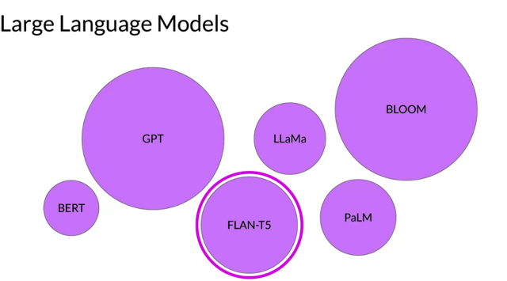
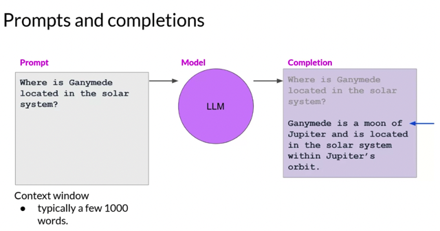

# Generative Ai & Llms

📊 **Progress:** `6` Notes | `6` Screenshots

---

## 1 Introduction to**large language model**s and their **use cases.**

> [!NOTE]
> 1 Introduction to**large language model**s and their **use cases.**
>
> 2 **Generative AI** as a **subset of traditional machine learning.**
>
> 3 **Training process** of large language models on **massive datasets**.
>
> 4 **Emergent properties** and **capabilities of large language models**.
>
> 5 Introduction to **foundation models** and **their parameters.**
>
> 6 The use of open source models like **flan-T5** for **language tasks.**
>
> 7 Focus on l**arge language models** for**natural language generation.**
>
> 8 I**nteracting with language models** through **prompts** and **context windows.**
>
> 9 **Prompt engineering** and f**ine-tuning models** for**specific use cases.**
>
> 10 **Deploying language models** for **business** and **social** tasks.
>
> 11 Contrasting the **interaction with language models** with **traditional programming paradigms**.
>
> 12 Understanding **prompts**, **completions**, and **inference** in language models.
>
> 13 Example of using a language model to answer a question about Ganymede's location in the solar system.

 

<kbd></kbd>

 

<kbd></kbd>

 

<kbd></kbd>

> [!NOTE]
> Generative AI is a subset of traditional machine learning.
> And the machine learning models that underpin generative
> AI have **learned these abilities by finding statistical
> patterns in massive datasets of content** that **was originally
> generated by humans.**

 

<kbd></kbd>

> [!NOTE]
> Large language models have been trained on trillions of words over many weeks and months,
> and with large amounts of compute power
>
> These foundation models, as we call them, with **billions of parameters**, exhibit **emergent
> properties** beyond language alone, and researchers are **unlocking their ability to break down
> complex tasks, reason, and problem solve**. Here are a **collection of foundation models**,
> sometimes called **base models**, and their relative size in terms of**their parameters**. You'll
> cover these parameters in a little more detail later on, but for now, think of them as the **model's
> memory**. And the **more parameters** a model has, the **more memory,** and as it turns out,
> the **more sophisticated the tasks it can perform**

> [!NOTE]
> So sách kích thước (số params)
> của các LLMs hiện nay,

 

<kbd></kbd>

> [!NOTE]
> Throughout this course, we'll represent LLMs with these purple circles, and in the labs, you'll
> make use of a**specific open source model, flan-T5**, to carry out **language tasks**. By
> either **using these models**as they are or by a**pplying fine tuning techniques** to adapt
> them to y**our specific use case,** you can r**apidly build customized solutions without the
> need to train a new model from scratch**

> [!NOTE]
> Ta sẽ dùng FLAN-T5 và fine tuning
> nó cho specific use cases.

 

<kbd></kbd>

> [!NOTE]
> while generative AI models are being created for multiple modalities, including i**mages,
> video, audio, and speech**, in this course you'll **focus on large language models** and their
> uses in **natural language generation**. You will see how they are **built** and **trained**,
> how you can **interact with them** via text known as **prompts**. And how to f**ine tune
> models** for your use case and data, and how you can **deploy them with applications** to
> **solve your business and social tasks**.

 

