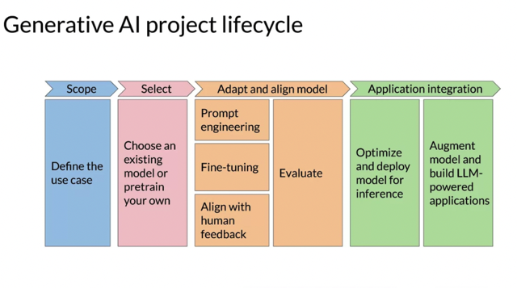
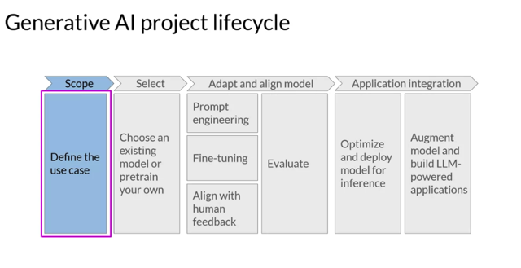
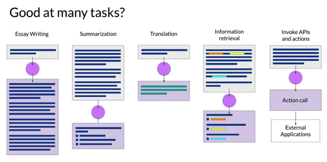
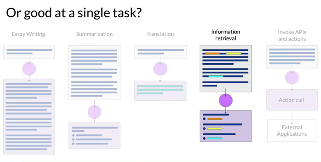
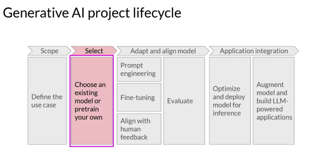
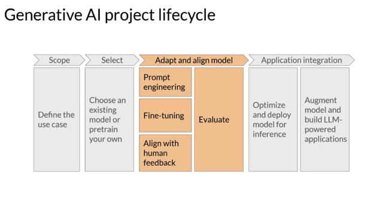
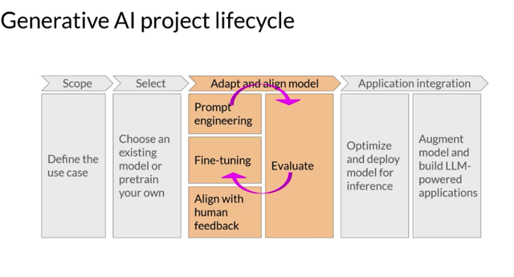
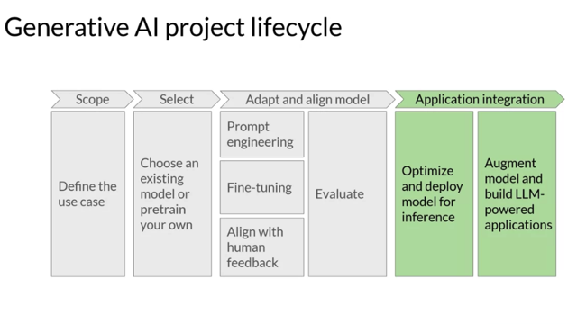

# Generative Ai Project Lifecycle

📊 **Progress:** `9` Notes | `8` Screenshots

---

## 1 Generative AI **project life cycle**: The video introduces a **generative AI project life cycle framework**that guides

> [!NOTE]
> 1 Generative AI **project life cycle**: The video introduces a **generative AI project life cycle framework**that guides
> you through the **process of developing and deploying an LLM-powered application**.
>
> 2 **Defining the scope**: The most important step in any project is to **define the scope accurately and narrowly**.
> Consider the **specific function the LLM will have in your application**, whether it needs to **perform various tasks**
> or **specialize in a specific task** like named entity recognition.**Being specific** saves time and computational
> resources.
>
> 3 **Training**: You can**choose to start with an existing base model** rather than **training from scratch**, although there
> **may be cases where training your own model is necessary**. Considerations and feasibility for this decision are
> covered later in the course.
>
> 4**Assessing and improving model performance**: **Assess the model's performance** and **consider additional
> training** if needed. **Prompt engineering** and **in-context learning** can **help improve performance**. **Fine-tuning**,
> covered in Week 2, can **further enhance the model's capabilities**.
>
> 5 **Reinforcement learning with human feedback**: Week 3 introduces **reinforcement learning with human
> feedback** as an **additional fine-tuning technique** to **ensure the model behaves well** and **aligns with human
> preferences.**
> 6 **Evaluation**: Evaluation is essential to **measure the model's performance** and **alignment with preferences.**
> **Metrics** and **benchmarks** will be explored in the upcoming week.
>
> 7**Deployment and optimization**: Once you have a model that meets performance requirements and aligns well,
> it can be d**eployed and integrated into your application**. **Optimization** for deployment is **crucial** to **maximize
> compute resources and user experience**.
>
> 8 **Infrastructure** **considerations**: **Additional infrastructure** may be required for **optimal functioning of the
> LLM-powered application**. Some limitations of LLMs, such as **inventing information** or **limitations in complex
> reasoning** and **mathematics**, can be addressed using techniques covered later in the course.
>
> 9 **Iterative process**: The **adapt** and **align stage** of app development is **highly iterative**, involving steps like **prompt
> engineering, fine-tuning, and re-evaluation** to achieve **desired performance.**

 

<kbd></kbd>

> [!NOTE]
> 1 Developing and deploying LLM-powered applications: The course aims to provide
> you with the techniques and knowledge necessary to develop and deploy applications
> powered by Language Model (LLM).
>
> 2 **Generative AI project life cycle**: The video introduces a **generative AI project life cycle
> framework** that guides you through the **process** of taking your project **from conception**
> to **launch**.
>
> 3 **Mapping out the tasks**: The framework outlines the **tasks** required **at each stage** of
> the project life cycle, providing a**roadmap for developing and deploying LLM
> applications.**
>
> 4 **Defining the scope**: The **most important step** in any project is to **define the scope
> accurately and narrowly**. For LLMs, **their capabilities depend on the size and
> architecture of the model**. You need to **consider the specific function you want**the LLM
> to have in your application. Is it required to perform **multiple tasks** or just excel at a
> **specific task**, such as **named entity recognition?**
>
> 5 Importance of **specificity**: Being **specific** about the **required functionality** of your LLM
> can **save time and computational resources.** By **narrowing down** the **tasks** and
> **capabilities**, you can **optimize the model design and reduce compute costs**.
>
> 6 Course objectives: By the end of the course, you should gain **intuition** about the
> **decisions** you need to make, **anticipate potential challenges**, and **understand the
> infrastructure required** to **develop and deploy your LLM-powered application.**

 

<kbd></kbd>

> [!NOTE]
> Đại khái đầu tiên là phải **define thật rõ mục tiêu
> của model là gì**, **có những khả năng nào**, thực
> hiện việc gì. Hiểu rõ yêu cầu cho model sẽ giúp
> t**ối ưu model và tránh lãng phí nguồn lực**

 

<kbd></kbd>

> [!NOTE]
> Muốn model **làm được mọi thứ**hay là chỉ cần**thật
> tốt ở một loại task nào đó** thôi

 

<kbd></kbd>

 

<kbd></kbd>

> [!NOTE]
> Once you're happy, and **you've scoped your model requirements enough to begin
> development**. Your first decision will be **whether to train your own model from
> scratch** or **work with an existing base model**. In general, you'll **start with an
> existing model**, although there are some cases where you may find it **necessary
> to train a model from scratch**. You'll learn more about the considerations behind
> this decision later this week, as well as**some rules of thumb**to help you **estimate
> the feasibility of training** your own model

> [!NOTE]
> Khi đã có **scope rõ ràng** cho model thì tiếp đến là **cân nhắc nên phát
> triển từ một base model hay là build một cái mới hoàn toàn.** Thường
> thì sẽ dùng base model nhưng đôi khi có thể phải build mới. Những
> bài sau sẽ dạy ta về cách **ước lượng tính chất** **feasibility** của **quá trình
> tự training model**

 

<kbd></kbd>

> [!NOTE]
> 1 **Assessing model performance**: After obtaining your trained model, the next step is to
> **assess its performance** to ensure it **meets the requirements of your application.**
>
> 2 **In-context learning** and **prompt engineering**: **Prompt engineering** can be an **effective
> approach to improve model performance**. **In-context learning**, where examples suited to
> your task and use case are used, can help **fine-tune the model's behavior** and **improve
> performance.**
>
> 3 **Fine-tuning the model**: If the model **still does not perform adequately**, even with
> i**n-context learning**,**fine-tuning can be applied**. This **supervised learning** process,
> covered in **Week 2,** involves **further training the model on task-specific data** to enhance
> its performance.
>
> 4 **Reinforcement learning with human feedback**: Week 3 introduces **reinforcement
> learning with human feedback** as an additional **fine-tuning technique**. This approach
> helps **ensure that the model behaves in a way that aligns with human preferences and
> desired behavior**.
>
> 5 **Evaluation**: **Evaluation is crucial**in assessing model performance. In the upcoming
> week, you will explore **metrics** and **benchmarks** that can be used to m**easure the model'
> s performance and alignment with preferences**.
>
> 6 **Iterative process**: The development stage of the application can be **highly iterative**. It
> may **involve multiple iterations** of**prompt engineering**, **evaluation**, **fine-tuning**, and
> **re-evaluation** to achieve the **desired model performance**.
>
> The focus is on **continuously adapting and aligning the model to meet performance
> goals** and **ensure it behaves appropriately in deployment.** This stage involves a
> combination of techniques, evaluation measures, and iterative refinement to optimize
> the model's performance and alignment with human preferences.

> [!NOTE]
> Nói chung là phần này ta sẽ **assess và improve model.** Đầu tiên là với
> **prompt engineering**, nếu ngay cả với**few-shot prompting** vẫn không đạt
> yêu cầu thì ta sẽ **Fine-tuning** model - vốn là một quá trình s**upervised
> training** model với **labeled data** để cải thiện khả năng của model trong vấn
> đề cụ thể mình đang cần. Và cách thứ 3 là dùng **Reinforcement learning
> with human feedback**. Các quá trình này mang**tính chất iterative**, có
> nghĩa là ta sẽ l**àm đi làm lại cho đến khi nào đạt** kết qủa mong muốn.

 

<kbd></kbd>

 

<kbd></kbd>

> [!NOTE]
> Finally, when you've **got a model that is meeting your performance needs** and is
> **well aligned**, you can **deploy** it into your infrastructure and **integrate it with your
> application**. At this stage, an important step is to **optimize your model for
> deployment**. This can ensure that you're **making the best use of your compute
> resources** and providing the **best possible experience** for the users of your
> application. The last but very important step is to **consider any additional
> infrastructure that your application will require to work well**. There are some
> **fundamental limitations of LLMs** that can be**difficult to overcome through training
> alone** like their**tendency to invent information** when they don't know an answer,
> or their **limited ability to carry out complex reasoning and mathematics**. In the last
> part of this course, you'll learn some powerful techniques that you can use to
> overcome these limitations.

> [!NOTE]
> Cuối cùng là **optimize model để deploy** và **handle một số bước cuối** cần thiết để **cải
> thiện một số điểm yếu** của model như **thiên hướng bịa ra câu trả lời** mà nó không
> biết hoặc **khả năng hạn chế** trong việc thực hiện những **phép logic và toán học**
> phức tạp vốn k**hông thể chỉ làm thông qua training.**

 

