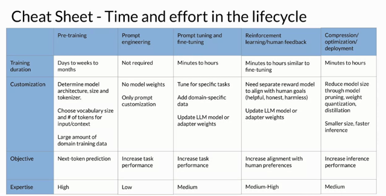

# Generative Ai Project Lifecycle Cheat Sheet

📊 **Progress:** `0` Notes | `1` Screenshots

---

## Here are the main ideas extracted from the lecture text in numerical order points:

> [!NOTE]
> Here are the main ideas extracted from the lecture text in numerical order points:
>
> 1. Introduction to the **various stages** of a **generative AI project life cycle**, from **model
> selection** to**fine-tuning** and **alignment with human preferences**.
>
> 2. Providing a cheat sheet to help **plan the different phases of the project** and **estimate the
> time and effort required for each.**
>
> 3. Acknowledgment that pre-training a large language model can be a **complex** and
> **resource-intensive process** due to **architectural decisions, data requirements, and
> expertise**.
>
> 4. Emphasizing that **starting with an existing foundation model** can significantly **simplify the
> development process.**
>
> 5. Mention of **assessing the model's performance through prompt engineering**, which
> **requires less technical expertise** and **no additional model training**.
>
> 6. Discussion of **prompt tuning** and **fine-tuning** as methods to **improve model performance**,
> with **consideration of the use case, performance goals, and compute budget.**
>
> 7. Highlighting that **fine-tuning**, especially with a **small training dataset**, can be a **relatively
> quick** phase, **possibly completed in a single day.**
>
> 8. Explanation of aligning the model using **reinforcement learning from human feedback**
> and the **potential use of existing reward models** or **creating new ones.**
>
> 9. Reference to optimization techniques, which typically fall in the middle in terms of
> **complexity** and **effort** but can **proceed quickly if they don't significantly impact model
> performance**.
>
> 10. The hope that, after completing all these steps, a **well-trained and tuned generative
> language model (LLM) optimized for deployment will be achieved.**
>
> 11. Mention of the upcoming exploration of **remaining LLM performance issues** and
> techniques to address them before launching the application.
>
> These points provide an **overview of the lecture's main concepts** related to the **project life
> cycle for generative AI** and the **stages involved in developing and optimizing a language
> model for deployment.**

 

<kbd></kbd>

 

