# Generative Configuration

📊 **Progress:** `15` Notes | `13` Screenshots

---

## 1 **Configuration parameters** for **influencing** **next-word generation**: The text introduces \\*various configuration

> [!NOTE]
> 1 **Configuration parameters** for **influencing** **next-word generation**: The text introduces **various configuration
> parameters** that can be used to **control the behavior of language models** during the generation of text. These
> parameters are **different from the training parameters** and are invoked during **inference**. They provide**control over**
> **aspects** such as the **maximum** **number of tokens** in the generated output and the **level of creativity.**
>
> 2 **Methods** for controlling model behavior during inference:
>
> a. **Max new tokens**: This parameter**limits the number of tokens that the model will generate**, putting **a cap** on the
> **selection process**. It allows **users to control the length of the completion**.
>
> b. **Random sampling**: Instead of **always** choosing the word with the **highest probability**, random sampling s**elects
> an output word at random** \\_**based on the probability distribution.**\\_ This introduces **variability** and **reduces** the
> likelihood of word **repetition**, but can **sometimes** **produce output that is less sensible or coherent.**
>
> c. **Top k** sampling: By **specifying a value for k**, the model only **considers the k tokens with the highest probability** for
> selection. This **provides randomness** while**preventing the selection of highly improbable words**, resulting in**more
> reasonable and sensible text**.
>
> d. **Top p** sampling: This technique **limits the random samplin**g to predictions whose **combined probabilities do not
> exceed a certain threshold (p)**. The model chooses from these tokens using random probability weighting, ensuring a
> **balance between randomness and sensibility**.
>
> 3 **Temperature** parameter: The temperature parameter**influences the shape of the probability distribution** used by the
> model to select the next token. **Higher temperatures increase randomness** by **spreading the probability more** evenly
> across tokens, while **lower temperatures** **concentrate the probability on a smaller number of words**, resulting in **less
> random** and **more predictable output.**
>
> 4 **Prompt engineering** and**parameter experimentation**: The text highlights the**importance of prompt engineering**and **experimenting with different configuration parameters** t**o optimize the performance of language models**. By
> carefully **crafting prompts** and **adjusting parameters**, users can **achieve desired results**in generating text that is
> **natural, creative, and avoids repetition**.
>
> 5 Introduction to **LLMs and transformers**: The text mentions **LLMs (Large Language Models) and transformers**, which
> are the model architecture that powers these language models. LLMs have the **ability to perform a variety of tasks** and
> **transformers** are **instrumental** in enabling their **advanced capabilities.**
>
> 6 Tasks performed by LLMs and application development: The text briefly touches upon the tasks that LLMs can perform
> and mentions the next steps in the **application development process**, building upon the foundational knowledge
> discussed so far.

 

<kbd>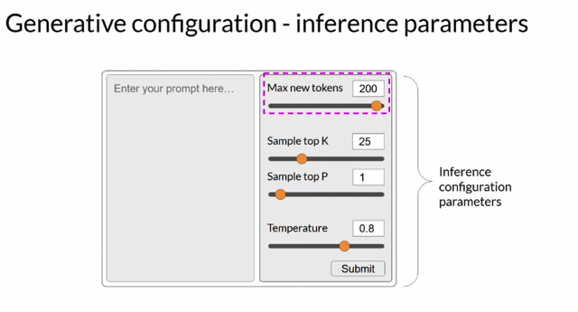</kbd>

> [!NOTE]
> In this video, you'll examine some of the **methods** and **associated configuration**
> **parameters** that you can use to **influence the way that the model makes the final
> decision** about **next-word generation**. If you've used LLMs in playgrounds such as
> on the **Hugging Face**website or an **AWS**, you might have been presented with
> **controls** like these to adjust how the LLM behaves. Each model exposes **a set of
> configuration parameters** that can i**nfluence the model's output during inferenc**e.
> Note that these are **different than the training parameters** which are learned during
> training time. Instead, these **configuration parameters** are **invoked at inference time**and give you **control over things like the maximum number of tokens** in the
> completion, and **how creative the output is**

> [!NOTE]
> Đại khái là các **LLM** thường **cho phép config các
> inference params để thay đổi chút ít "cách" mà LLM
> model trả lời.** Nó k**hông liên quan đến các model
> params** vốn được **học lúc training.**

 

<kbd>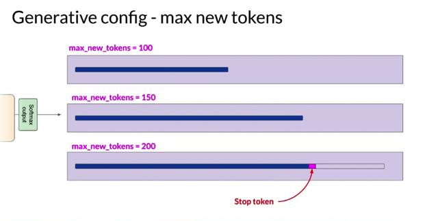</kbd>

> [!NOTE]
> Ví dụ **max_new_token** cho phép **giới hạn số token model generate**. Ở
> đây khi sét bằng 200, để ý nó không dài hơn câu trên với m.n.t = 150
> bao nhiêu vì có thể một config khác đã hạn chế hoặc nó đã gặp
> stop_token (end of sentence)

 

<kbd>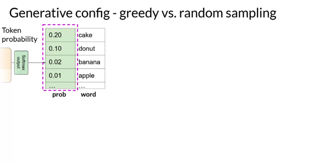</kbd>

> [!NOTE]
> Khi model output ra t**oken probability scores** của
> nó sẽ có **hai cách để decide** ra từ được chọn
> **Greedy** và **Random sampling**

 

<kbd>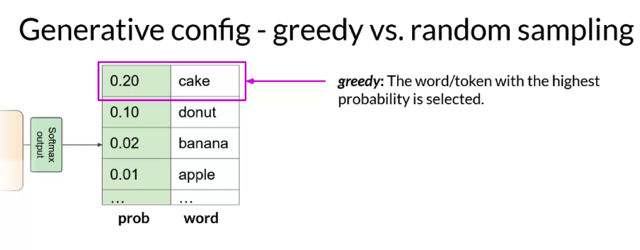</kbd>

> [!NOTE]
> **Greedy** đại khái là **luôn chọn từ giá trị
> probability score cao nhất**, dẫn đến **câu
> trả lời luôn giống nhau.**

 

<kbd>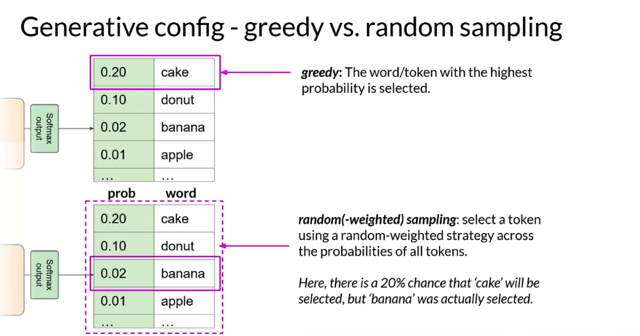</kbd>

> [!NOTE]
> Còn **random sampling** with **distribution** là**chọn ngẫu
> nhiên với distribution** **bởi model** output, giúp **mỗi lần
> câu trả lời sẽ mỗi khác và từ đó có tính sáng tạo và
> khác biệt cao hơn**

 

<kbd>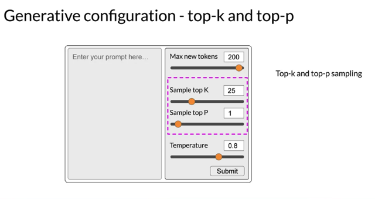</kbd>

> [!NOTE]
> Let's explore **top k** and**top p** **sampling techniques** to help**limit the
> random sampling** and **increase the chance that the output will be
> sensible**. Two Settings, top p and top k are **sampling techniques** that we
> can **use to help limit the random sampling** and **increase the chance that
> the output will be sensible**.

 

<kbd>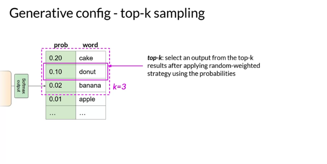</kbd>

> [!NOTE]
> To **limit the options** while **still allowing some variability**, you can**specify a top k
> value** which instructs the model to**choose from only the k tokens with the highest
> probability.** In this example here,**k is set to 3**, so you're restricting the model to
> **choose from these 3 options**. The model then selects from these options using
> the probability weighting and in this case, it chooses **donut** as the next word. This
> method can help the **model have some randomness** while **preventing the selection
> of highly improbable completion words**. This in turn **makes your text generation
> more likely to sound reasonable** and to **make sens**e.

> [!NOTE]
> Top k đại khái là cho **model chọn random** nhưng **chỉ trong k từ có
> probability cao nhất thôi**. Dẫn đến nó **vẫn có chút variability và
> creative** nhưng **không quá lố**. khiến câu trả lời **vẫn có chút sự đa
> dạng và sáng tạo** nhưng **không trở nên quá vô lý**

 

<kbd>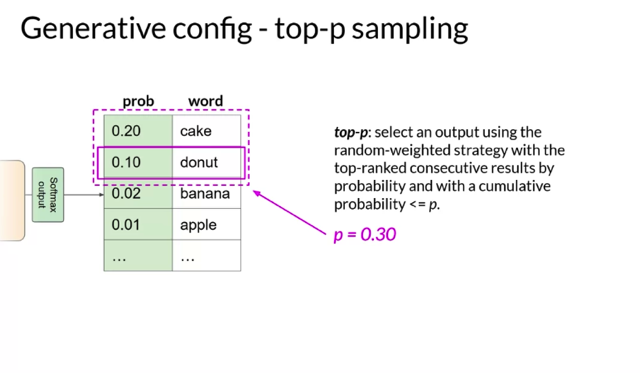</kbd>

> [!NOTE]
> Với top k ta cho nó chọn trong k từ có p cao nhất thì với
> top p ta cho nó **chọn trong những từ mà p cao hơn một
> mức nào đó**. Mục đích cũng như vậy

 

<kbd>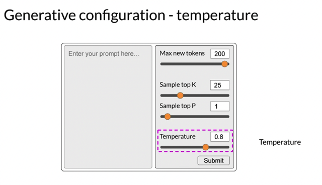</kbd>

> [!NOTE]
> One more parameter that you can use to **control the randomness
> of the model output** is known as **temperature**. This parameter
> influences the **shape of the probability distribution** that the model
> calculates for the next token

 

<kbd>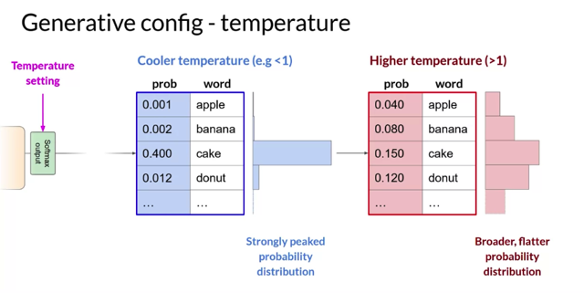</kbd>

> [!NOTE]
> Broadly speaking, the **higher** the **temperature**, the **higher the randomness**, and the **lower**
> the **temperature**, the **lower the randomness**. The temperature value is a **scaling factor**that's **applied within the final softmax layer** of the model that\_**impacts the shape of the
> probability distribution of the next token**\_. In contrast to the top k and top p parameters,
> **changing the temperature actually alters the predictions that the model will make**. If you
> choose a **low value of temperature**, say less than one, **the resulting probability
> distribution from the softmax layer** is more **strongly peaked** with the probability being
> **concentrated in a smaller number of words**. You can see this here in the blue bars beside
> the table, which show a probability bar chart turned on its side. Most of the **probability
> here is concentrated on the word cake**. The model will **select from this distribution using
> random sampling** and the resulting text will be **less random** and will **more closely follow
> the most likely word sequences that the model learned during training**. If instead you set
> the temperature to a **higher value**, say, g**reater than one,** then the model will calculate a
> **broader flatter probability distribution** for the next token. Notice that in contrast to the blue
> bars, the probability is more **evenly spread across the tokens**. This leads the model to
> generate text with a **higher degree of randomness** and **more variability** in the output
> compared to a cool temperature setting. This can help you generate text that **sounds
> more creative**. If you **leave the temperature value equal to one**, this will leave the
> softmax function as default and the unaltered probability distribution will be used

> [!NOTE]
> Đại khái là temperature sẽ **điều chỉnh mức độ ngẫu nhiên.**Nếu giá trị thấp **ví dụ nhỏ
> hơn 1, nó sẽ giảm mức ngẫu nhiên** của model's output probability distribution
> xuống, hệ quả kiểu như là **nó tăng mức độ tập trung lên, khiến những từ có p cao
> trở nên cao hơn, dễ được chọn hơn**. Hiểu nôm na là **nó phóng đại mức tập trung
> xác suất từ đó tăng xác suất chọn những từ có vùng xác suất cao**, dẫn đến **giảm đi
> sự đa dạng và tính ngẫu nhiên**. Ngược lại, **nếu giá trị temperature cao**, như lớn hơn
> 1, nó sẽ **giảm nhẹ độ tập trung xác suất xuống**, khiến mô hình**xác suất dàn trải hơn**
> kết quả là c**ác từ có khả năng được chọn đa dạng hơn**

 

<kbd>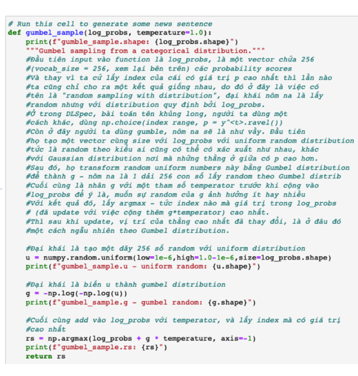</kbd>

> [!NOTE]
> Ở đây copy slice từ P.A của NLP C3W2 có dùng **gumbel distribution** để
> r**andom sampling**, trong đó ta t**hấy có tham số temperature** có lẽ cũng tương
> tự như**ý nghĩa của temperature config của LLM**. Trong function này,**nôm na
> là một "lớp" random noise tạo thành từ gumbel distribution** được **add vào
> phân phối xác suất do model tạo ra (log_probs)** với **mức độ được control bởi
> temperature**. từ đó thay đổi theo hướng **khuếch đại (tập trung lên)** hoặc **giảm
> nhẹ (phân tán bớt)** giá trị của phân phối xác suất do model tạo ra. Từ đây ta
> có thể hiểu hơn về định nghĩa của Gumbel distribution,

 

<kbd>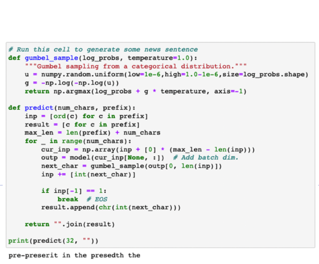</kbd>

 

<kbd>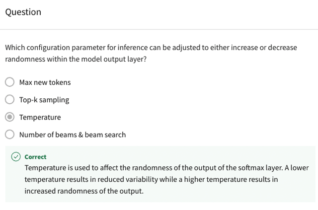</kbd>

 

### In the context of language models, the "**temperature**" parameter is used to \\*control the randomness or

> [!NOTE]
> In the context of language models, the "**temperature**" parameter is used to **control the randomness or
> variability** of the **generated text.** It **affects the shape of the probability distribution**that the model
> calculates for **selecting the next token.**
> The **math** behind the temperature concept involves **applying a scaling factor** within the **final softmax
> layer**of the model. The **softmax function** takes a **vector of logits** (scores associated with each token
> in the vocabulary) and**converts them into a probability distribution**. The temperature parameter
> **modifies the logits** before applying the softmax function.
>
> Here's the math behind it:
>
> 1 Let's say we **have a vector of logits**, denoted as **z**, representing the**scores associated with each
> token**in the **vocabulary**.
>
> 2 The modified logits, denoted as **z',**are calculated by **dividing each logit by the temperature value
> (T)**: **z' = z / T** The temperature value is **typically greater than 0**, with **higher values** leading to **more**
> **randomness** in the output.
>
> 3 After obtaining the modified logits, we**apply the softmax function** to **convert them into probabilities**:
> **softmax(z') = exp(z') / sum(exp(z'))** The softmax function **normalizes the logits by exponentiating
> them and dividing by their sum**, resulting in a **probability distribution across all tokens.**
>
> 4 The **resulting probability distribution** is then **used for sampling the next token** during text
> generation. **Higher probabilities indicate a higher chance of selecting a particular token**, but the
> **temperature value influences the shape and spread of the distribution.**
>
> ◦ **Higher temperatur**e values (e.g.,**above 1**) lead to a **more uniform distribution**, where **probabilities
> are more evenly spread across tokens**. This results in **higher randomness and variability in the
> generated text.**
>
> ◦ **Lower temperature** values (e.g., below 1) **sharpen the distribution**, making it **more peaked**. This
> **concentrates probabilities** on a **smaller set of tokens**, \\_**increasing the likelihood of generating text that
> aligns with the most probable word sequences learned during training.**\\_
>
> To summarize, the temperature parameter in language models allows users to control the trade-off
> between randomness and determinism in the generated text. Higher values introduce more
> randomness and variability, while lower values result in more focused and deterministic output.

> [!NOTE]
> Bài giải thích quá
> hay của GPT

 

