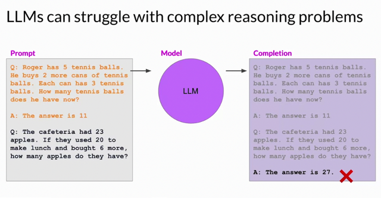
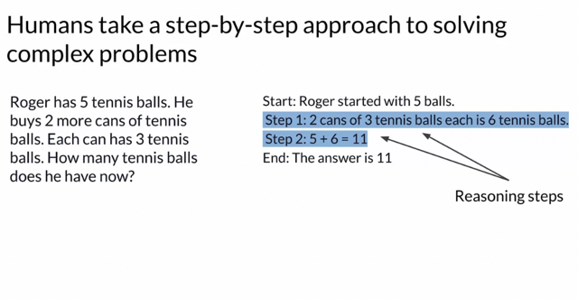
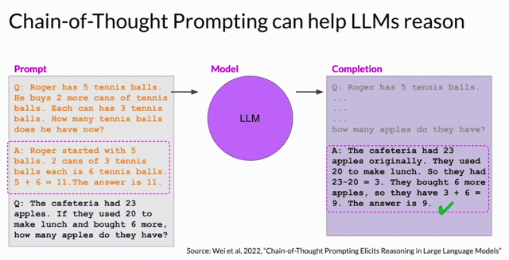
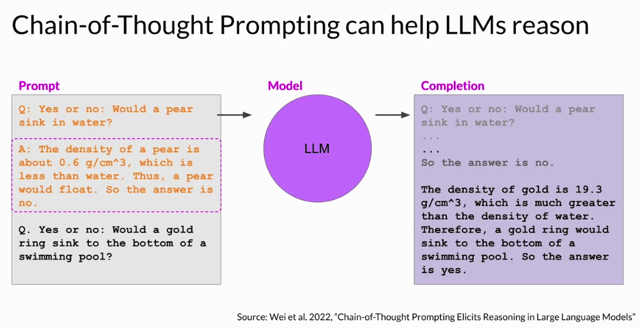

# Helping Llms Reason And Plan With Chain Of Thought

📊 **Progress:** `5` Notes | `5` Screenshots

---

## Main Ideas:

> [!NOTE]
> Main Ideas:
>
> 1. **Reasoning in LLMs:** Large Language Models (LLMs) need the ability to reason 
> through steps in applications, but complex reasoning, especially multi-step math, can be 
> challenging.
>
> 2. **Example Difficulty:** An example is provided where the LLM struggles with a multi-
> step math problem about apples in a cafeteria, even when given a similar example 
> problem.
>
> 3. **One-Shot Inference:** Presenting an LLM with an example problem to guide its 
> response is termed one-shot inference. But, the LLM can sometimes produce incorrect 
> results, as illustrated with the apples problem.
>
> 4. **Human-like Reasoning:** Researchers have found success in prompting the model 
> to reason more like humans, by breaking down problems step-by-step. An example is 
> provided where a problem of calculating tennis balls is divided into multiple intermediate 
> calculations.
>
> 5. **Chain of Thought Prompting:** This technique involves presenting problems to the 
> model with intermediate reasoning steps included. It teaches the LLM to reason through 
> tasks, improving its accuracy in problem-solving.
>
> 6. **Applying Chain of Thought:** The apples problem is revisited using the chain of 
> thought prompting, resulting in a more accurate, transparent response from the LLM.
>
> 7. **Broad Applicability:** Beyond arithmetic, chain of thought prompting can also aid 
> LLMs in reasoning through different types of problems, as demonstrated with a physics 
> problem about a gold ring in a pool.
>
> 8. **Limitations:** Even with improved reasoning, LLMs can sometimes falter in tasks 
> requiring accurate calculations, like e-commerce operations or tax calculations.
>
> 9. **Upcoming Solution:** A teased solution in the next segment suggests combining the 
> LLM with a program better at math to tackle such tasks.

 

<kbd></kbd>

> [!NOTE]
> LLM fail khi tính những bài toán đơn giản này.
> Researcher tìm cách khắc phục nó bằng cách làm cho nó
> suy nghĩ theo các bước như con người,

 

<kbd></kbd>

> [!NOTE]
> Đại khái là break thành các step trung gian như thế này
> (reasoning steps) sẽ giúp LLM giải quyết tốt các câu hỏi
> reasoning
>
> Ask model thực hiện các bước như vậy gọi là "**chain of thought
> prompting**"

 

<kbd></kbd>

> [!NOTE]
> Sửa lại prompt Theo kiểu vẫn đưa một ví dụ trước (Một ví dụ
> của câu hỏi và câu trả lời đúng mong muốn, gọi là **One-shot
> learning** như ta đã biết ở week 1)
>
> Nhưng sửa lại thay vì chỉ để A: The answer is 11 thì bây giờ
> **diễn giải thành từng bước việc tính toán các bước trung
> gian diễn ra như thế nào.** 
>
> Kết quả với điều này LLM đã có thể trả lời đúng

 

<kbd></kbd>

> [!NOTE]
> Không những toán, mà các câu hỏi reasoning
> như vật lý cũng có thể được thực hiện tốt với
> **chain of thought prompting**

 

<kbd></kbd>

> [!NOTE]
> Tuy vậy để LLM tính toán phức tạp hơn hoặc các
> bài toán yêu cầu độ chính xác cao hơn thì bài
> sau sẽ nói về cách connect LLM tới chương trình
> tính toán mạnh hơn

 

