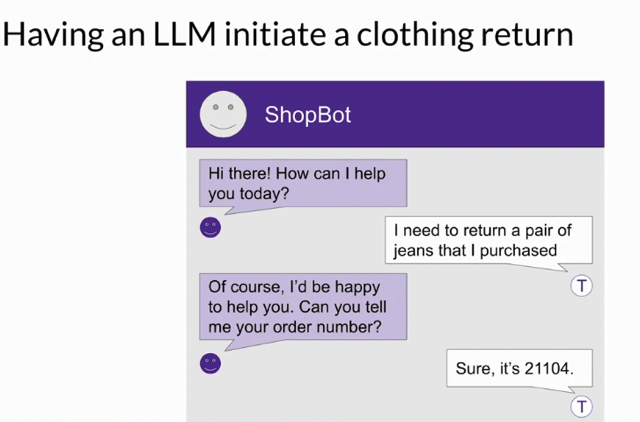
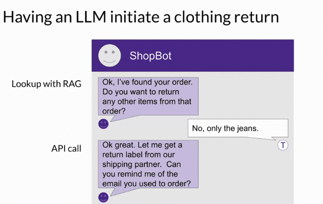
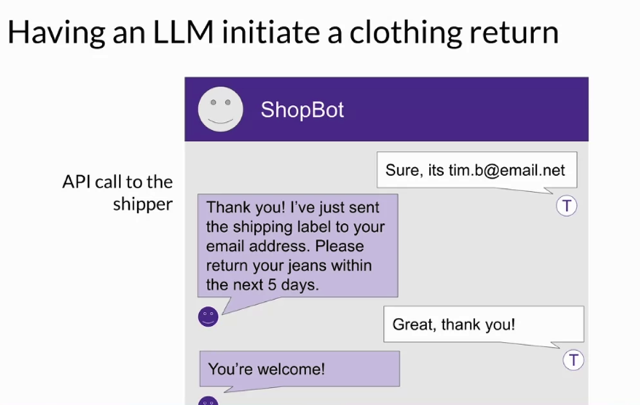
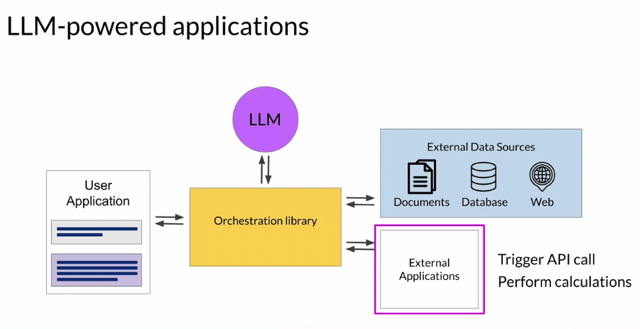
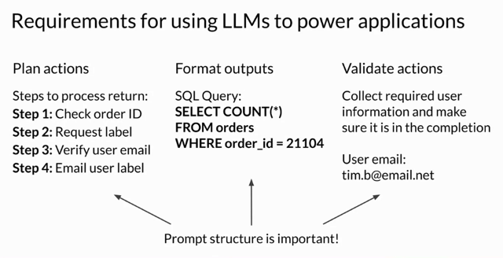

# Interacting With External Applications

📊 **Progress:** `5` Notes | `5` Screenshots

---

## Here are the main ideas extracted from the text:

> [!NOTE]
> Here are the main ideas extracted from the text:
>
> 1. ****LLM Interaction****:
>    - LLMs (Large Language Models) can **interact with both external datasets and external 
>    applications.**
>
> 2. **Illustrative Example - **ShopBot****:
>    - The example used is a customer service bot, ShopBot, for **processing return requests**.
>    - A customer wants to**return jeans.**
>    - ShopBot**asks for an order number.**
>    - It **retrieves the order from a back-end order database**.
>    - After confirming items for return, the bot **requests a return label from the company's shipping 
>    partner using a Python API**.
>    - The customer's email is confirmed and used to send the return label.
>
> 3. **Benefits and Applications of Integrating LLMs**:
>    - **Connecting LLMs to external applications** allows them to **interact with the broader world**, 
>    making them **more versatile.**
>    - They can **trigger actions when interacting with APIs**.
>    - LLMs can **connect with other programming resources** for added functionalities like **accurate 
>    calculations**.
>
> 4. ****Role of Prompts and Completions****:
>    - **LLMs** serve as **reasoning engines for applications**.
>    - **Actions are based on the completions generated by the LLM**.
>    - The model **n**eeds to **generate a set of clear instructions that are both understandable and 
>    correspond to allowed actions**.
>    - The completion format should be something the broader application can comprehend, from a 
>    simple sentence to complex scripting.
>
> 5. **Validation and Information Gathering**:
>    - Necessary information for validation, such as verifying an email address in the ShopBot example, 
>    needs to be acquired from the user and contained in the completion.
>
> 6. **Importance of Structured Prompts**:
>    - **Properly structuring prompts is vital** for the**quality of the output** and for ensuring the output 
>    adheres to a desired format or specification.
>
> The above points provide a concise summary of the main ideas and concepts presented in the 
>    text about the integration and application of Large Language Models like ShopBot in real-world 
>    scenarios.

 

<kbd></kbd>

> [!NOTE]
> Nhờ vào RAG ở bài trước, shopBot có thể trích xuất
> thông tin order của customer từ company database.

 

<kbd></kbd>

> [!NOTE]
> Sau đó, nhờ vào việc có thể kết nối với api, nó
> sẽ thực hiện việc gọi api để gửi email cho user
> return label. Do đó nó hỏi user email

 

<kbd></kbd>

> [!NOTE]
> Sau khi API hoàn thành, nó trả
> lời cho customer là shipping
> label đã được gởi đi

 

<kbd></kbd>

> [!NOTE]
> Nhờ vào việc có thể connect tới
> External applications, LLM có thể khắc
> phục các điểm yếu của mình

 

<kbd></kbd>

> [!NOTE]
> Đại khái là Prompt structure
> đúng rất quan trọng

 

