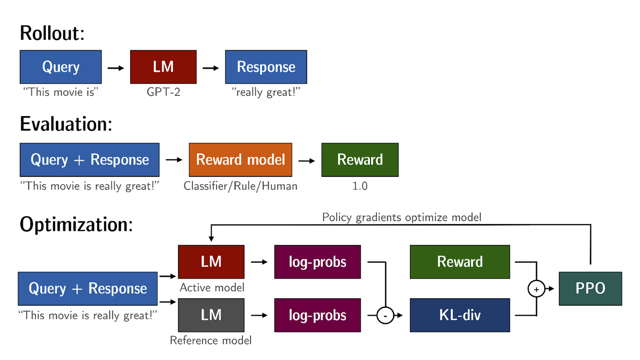

# Kl Divergence

📊 **Progress:** `1` Notes | `1` Screenshots

---

## KL-Divergence, or **Kullback-Leibler Divergence**, is a concept often encountered in the

> [!NOTE]
> KL-Divergence, or **Kullback-Leibler Divergence**, is a concept often encountered in the
> field of **reinforcement learning**, particularly when using the **Proximal Policy
> Optimization (PPO)** algorithm. It is a mathematical **measure of the difference between
> two probability distributions**, which helps us **understand how one distribution differs
> from another**. In the context of PPO, KL-Divergence plays a **crucial role in guiding the
> optimization process** to **ensure that the updated policy does not deviate too much from
> the original policy**.
>
> In PPO, the goal is to **find an improved policy** for an agent by **iteratively updating its
> parameters based on the rewards** received from interacting with the environment.
> However, **updating the policy too aggressively can lead to unstable learning or drastic
> policy changes**. To address this, PPO introduces a **constraint that limits the extent of
> policy update**s. This constraint is enforced by using**KL-Divergence.**
>
> To understand how KL-Divergence works, imagine we have**two probability
> distributions**: the **distribution of the original LLM**, and a **new** **proposed distribution of an
> RL-updated LLM**. KL-Divergence measures the **average amount of information gained**
> when we **use the original policy** to **encode samples from the new proposed policy**. By
> **minimizing the KL-Divergence between the two distribution**s, PPO **ensures that the
> updated policy stays close to the original policy**, preventing **drastic changes** that may
> negatively impact the learning process.
>
> A **library** that you can use to train **transformer language models with reinforcement
> learning**, using techniques such as **PPO**, is **TRL** (T**ransformer Reinforcement
> Learning**). In  this link  you can read more about this library, and its integration with
> **PEFT** (**Parameter-Efficient Fine-Tuning**) methods, such as **LoRA** (Low-Rank Adaption).
> The image shows an overview of the PPO training setup in TRL.

> [!NOTE]
> Như cũng đã biết về**KL Divergence** trong GAN Spec, nó là công cụ để
> **đo sự sai khác (divergence) giữa hai mô hình phân phối xác suất
> (probability distribution model)**.
>
> Thì trong RLHF, **RL algorithm** cụ thể là **PPO** sẽ**nhận reward của
> Reward model** để **update Policy** bằng cách**update LLM weights theo
> cách khiến LLM ngày càng nhận được nhiều reward hơn**
>
> đồng nghĩa với việc **LLM completion ngày càng align tốt hơn với human
> preference**.
>
> Tuy nhiên, n**ếu việc update policy diễn ra quá 'aggressively'**, có thể dẫn
> tới **mất ổn định** quá trình learning hoặc h**iện tượng Reward hacking**
> như bài trước đã nói xuất phát từ '**drastic policy changes'**
>
> Do đó PPO sử dụng một**'constrain'** là **KL-Divergence** để kiểm soát,
> **giữ không cho distribution của  RL updated model không diverge quá
> nhiều** với distribution của model gốc.
>
> Nói chung là việc này có lib giúp cụ thể là TRL

 

<kbd></kbd>

 

