# Lab3 Walkthrough

📊 **Progress:** `14` Notes | `16` Screenshots

---

## In the described lecture, the process of detoxifying a language model using

> [!NOTE]
> In the described lecture, the process of detoxifying a language model using 
> Reinforcement Learning from Human Feedback (RLHF) is summarized in the following 
> steps:
>
> 1. **Introduction and Purpose:**
>    - The purpose of the lab is to**lower the toxicity of an instruction fine-tuned model** from 
> a **previous lab (Lab 2)** using**RLHF.**   - The goal is to **optimize for "not hate" using a hate speech reward model.**
>    - **Proximal Policy Optimization (PPO)** will be employed for the **RLHF process.**
>
> 2. ****Library Installation:****
>    - Required Python libraries are imported, including**PyTorch, transformers, datasets, 
> and more.**
>    - A new library called **"trl"** is introduced, which **provides access to PPO functionality.**
>
> 3. ****Model and Data Setup**:**
>    - Loading of the **pre-trained models from Lab 2 (Peft model)** and a**Facebook binary 
> classifier for hate speech detection.**
>    - Creating a **sentiment pipeline for sentiment analysis** using **hugging face's inference 
> pipelines.**
>
> 4. ****Toxicity Evaluation**:**
>    - **Setting up a toxicity evaluation mechanism** using the**Facebook RoBERTa hate speech 
> model.**
>    - **Determining** the**toxicity score for sample nontoxic and toxic texts**.
>
> 5. **Initializing **PPO Trainer**:**
>    - **Initializing a PPOTrainer** with specific configurations (e.g., **learning rates, batch size**).
>    - Setting up a **reference model for KL divergence comparison** to **prevent reward hacking** 
> during training.
>
> 6. ****Fine-tuning with RLHF**:**
>    - Utilizing the **PPOTrainer** to **fine-tune the model using RLHF**.
>    - **Passing prompt-response pairs**and**their associated not_hate scores** to the **PPOTrainer.**
>    - **Minimizing KL divergence** and **maximizing advantage** during PPO training.
>
> 7. ****Quantitative and Qualitative Comparison**:**
>    - **Comparing the model's response quality** before and after**fine-tuning using toxicity evaluation**.
>    - Using **sentiment pipeline to classify prompt-response pairs** and **measuring not_hate scores.**
>    - **Showing qualitative comparisons of model responses before and after detoxification**.
>
> 8. **Results and Conclusion:**
>    - Observing that, after PPO fine-tuning with the hate speech reward model, the**overall 
> toxicity of model responses is reduced.**
>    - Acknowledging that **for greater differences**, starting with a**relatively toxic dataset is beneficial.**
>
> Overall, the process involves**fine-tuning the model using Proximal Policy Optimization** and 
> the**feedback from the hate speech reward model** to **minimize toxicity**and **optimize for generating 
> responses that are less likely to contain hate speech**. The result is a model that **produces less 
> toxic outputs based on quantitative and qualitative evaluations.**

 

<kbd>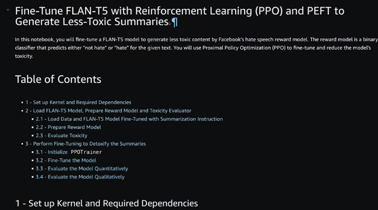</kbd>

> [!NOTE]
> Mục tiêu của lab 3 là 'detoxify' model đã train ở lab 2 -
> tức làm cho nó tuân thủ nguyên tắc không tạo ra những
> câu trả lời toxic - bằng RLHF

 

<kbd>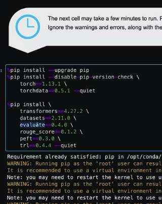</kbd>

> [!NOTE]
> Import một số lib như bữa trước như transformer,
> dataset, evaluate, rouge_score để evaluate model,
> peft để " Parameterized Efficient Fine Tuning', đặc
> biệt có thêm trl giúp Reinforcement Learning

 

<kbd>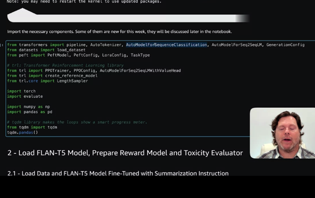</kbd>

> [!NOTE]
> Một số component đặc biệt có cái mới là AutoModelForSequenceClassification giúp nhận
> một string of text và predict cho ta biết có chứa hated speech hay không. Rồi thì
> load_dataset, PeftModel, PeftConfig, LoraConfig từ peft. Rồi từ trl thì PPOTrainer,.... Đặc
> biệt có cái LengthSampler giúp kiểu như giúp tự động lấy ra một đoạn sampling không
> quá 512
>
> Rồi những component quen thuộc như evaluate, np, pandas, tqdm - cái này ổng nói giúp
> tạo cái progress bar.

 

<kbd>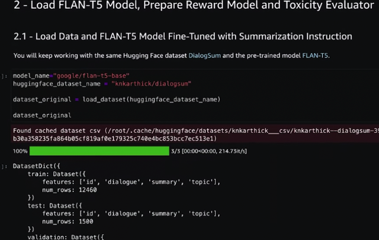</kbd>

> [!NOTE]
> Load dataset

 

<kbd>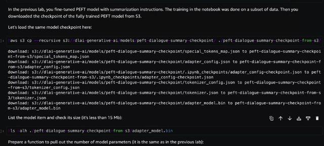</kbd>

> [!NOTE]
> Download pre-trained model

 

<kbd>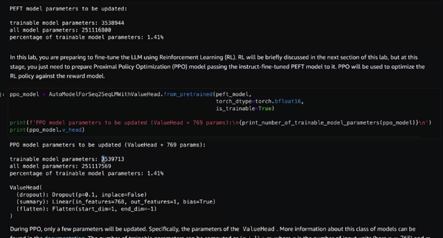</kbd>

 

<kbd>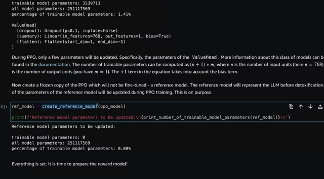</kbd>

> [!NOTE]
> Reference model để prevent reward hacking

 

<kbd>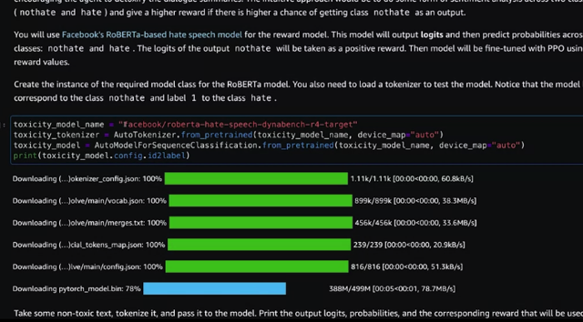</kbd>

> [!NOTE]
> Load pre-trained 'ROBERTA-based hate
> speech model' của Facebook sẽ dùng làm reward model

 

<kbd>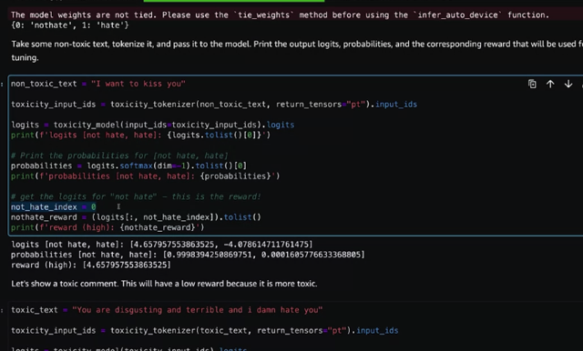</kbd>

> [!NOTE]
> Cái này là cái model nói ở trên giúp đánh giá độ toxicity (ví dụ ở đây là
> sự thù ghé) của input text. Ổng lưu ý nhấn mạnh rằng chỉ số positive -
> không toxic nằm ở vị trí thứ 0. Đại khái là vì ta sẽ lấy output (ở dạng
> logits) để làm reward nên nếu lấy sai sẽ khiến RLHF ra một model còn
> toxic bạo nữa.
>
> Thì cái này sẽ chính là Reward model

 

<kbd>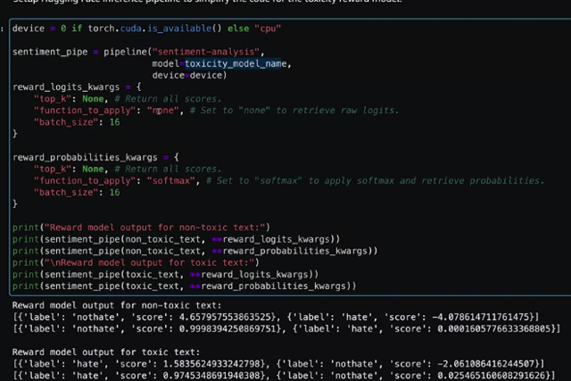</kbd>

> [!NOTE]
> Đoạn này nói về cái gọi là 'Inference Pipeline' kiểu như là một cái rất tiện lợi từ
> HuggingFace's transformer. Ta chỉ cần define 'loại' task mà ta muốn cùng với tên model,
> thì từ đó chỉ việc 'dùng' - như gọi và bỏ vào đó input text không cần phải lo về việc
> tokenize, ....rồi gọi các function của model như generate hay predict gì cả rất handy

 

<kbd>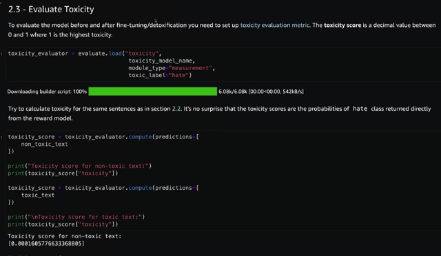</kbd>

> [!NOTE]
> Đây là dùng lib evaluate để đánh
> giá tính toxicity của model

 

<kbd>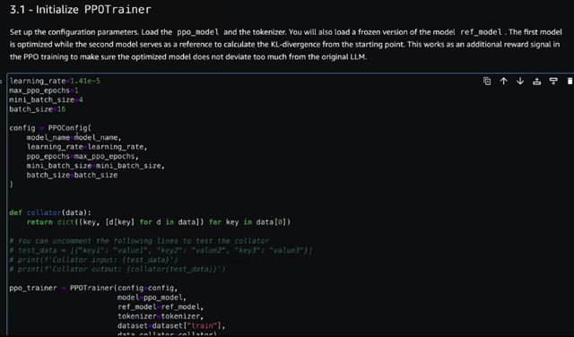</kbd>

> [!NOTE]
> Đây là cái sẽ update LLM model
> bằng RL algorithm đây.

 

<kbd>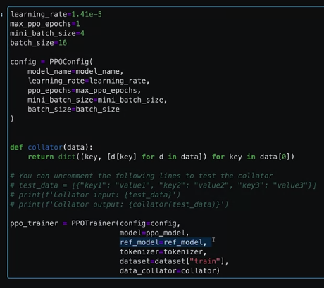</kbd>

> [!NOTE]
> Ref_model để làm cái
> vụ 'KLDivergence'

 

<kbd>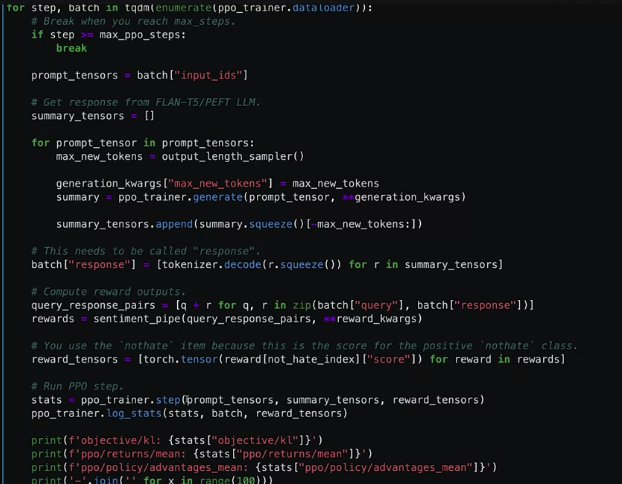</kbd>

> [!NOTE]
> Quá trình RLHF

 

<kbd>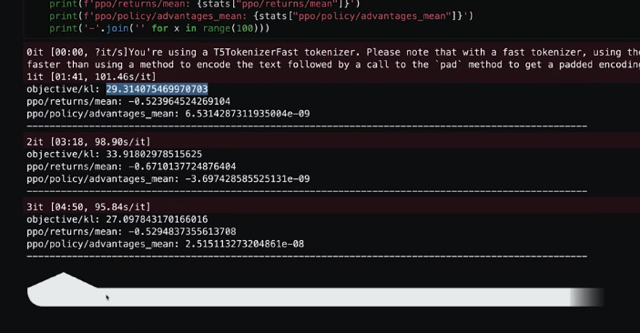</kbd>

 

<kbd>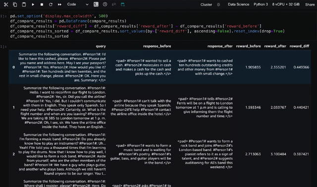</kbd>

> [!NOTE]
> Đánh giá kết quả

 

