# Lab 1 - Generative Ai Use Case: Summarize Dialogue

📊 **Progress:** `24` Notes | `29` Screenshots

---

## In this lab, you will do the **dialogue summarization task using generative AI**. You will

> [!NOTE]
> In this lab, you will do the **dialogue summarization task using generative AI**. You will 
> **explore how the input text affects the output of the model**, and **perform prompt 
> engineering** to **direct it towards the task you need**. By comparing **zero shot, one shot, and 
> few shot inferences**, you will t**ake the first step towards prompt engineering** and see how 
> it can enhance the generative output of Large Language Models.  
> **The labs are accessible to learners who purchased the course. If you have not yet 
> purchased access, you can do so through the "Upgrade to Submit" button below.**
> **If you have already paid for the course, start the lab by first ticking the checkbox 
> below indicating you will adhere to the Coursera Honor Code, then click the 
> "Launch App"\\/ \\/button.**
>
> The lab is formally ungraded, but you will need to click on the **Submit** button to complete 
> the lab. This button is on the top right of the Vocareum page and **not** on the AWS 
> console.

 

### 1 - Set up Kernel and

> [!NOTE]
> 1 - Set up Kernel and
> Required Dependencies

 

<kbd>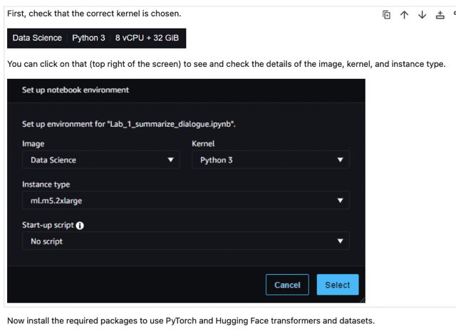</kbd>

> [!NOTE]
> Check Kernel

 

<kbd>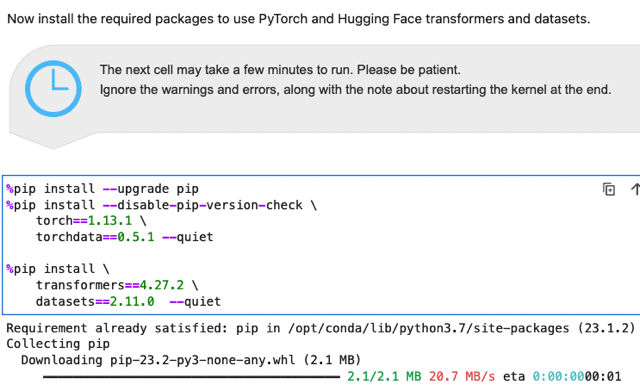</kbd>

> [!NOTE]
> Install transformer,
> dataset và pytorch

 

<kbd>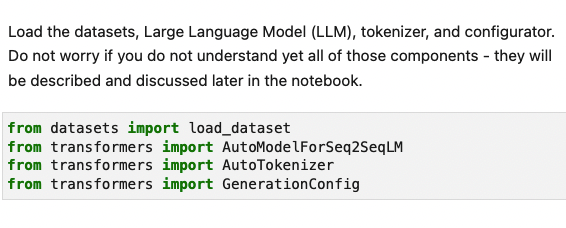</kbd>

> [!NOTE]
> Import load_dataset,
> Tokenizer, LLM model...

 

### 2 - Summarize Dialogue

> [!NOTE]
> 2 - Summarize Dialogue
> without Prompt Engineering

 

<kbd>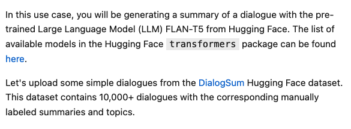</kbd>

> [!NOTE]
> https://huggingface.co/docs/transformers/index

> [!NOTE]
> Ta sẽ dùng pre-trained LLM model của HuggingFace là FLAN-T5 để
> làm thử nhiệm vụ summary dialog. Trước hết ta sẽ load một dialog
> từ DialogSum dataset (cũng của HuggingFace). Mỗi dialog được
> label để có summary và topic.

 

<kbd>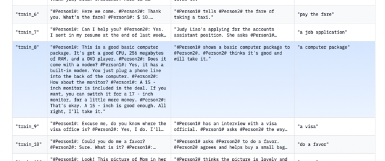</kbd>

<kbd></kbd>

<kbd>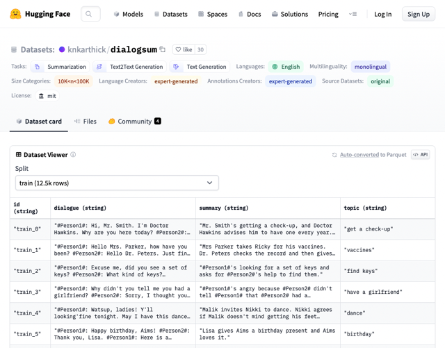</kbd>

> [!NOTE]
> Ta thấy nó ghi "
> expert-generated", size 10k -
> 100k

 

<kbd>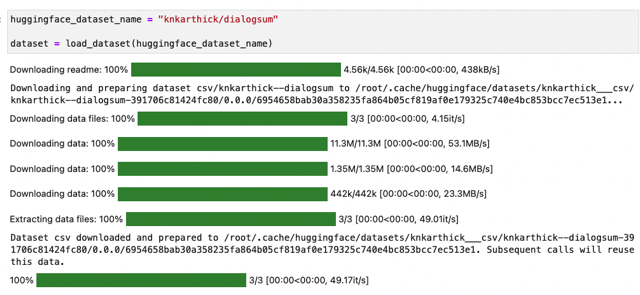</kbd>

> [!NOTE]
> Dùng function load_dataset với
> input là tên của dataset.

 

<kbd>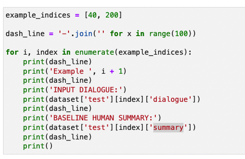</kbd>

> [!NOTE]
> Đại khái chỉ định 2 index để lấy 2 dialog trong test set của dataset. In ra
> dialogue và summary (label) để so sánh với summary của model (prediction)

 

<kbd>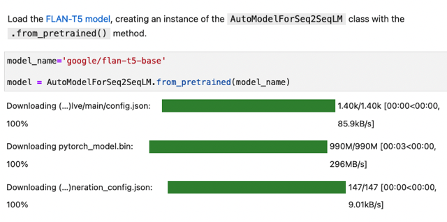</kbd>

> [!NOTE]
> Kế tiếp là load cái pretrained LLM model, define cái tên để bỏ vào
> AutoModelForSeq2SeqLM. from_pretrained()

 

<kbd>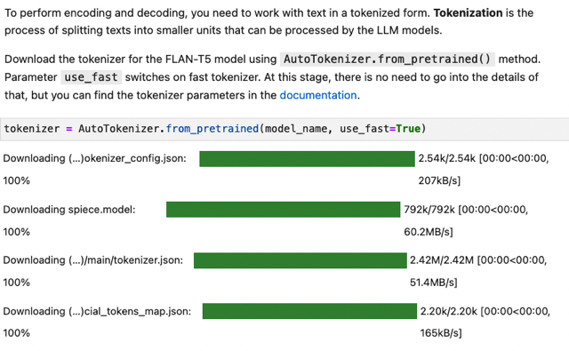</kbd>

> [!NOTE]
> Đại khái dùng cái tên model đó, để load cái tokenizer cho
> nó. Có thể hiểu là mỗi model có thể có cách tokenize khác
> nhau, nên phải load cái tokenizer phù hợp. Thì tương tự,
> AutoTokenizer.from_pretrained() giúp load cái tokenizer
> tương thích với model

 

<kbd>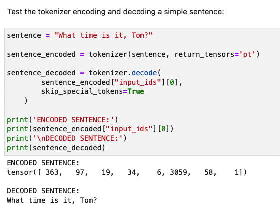</kbd>

> [!NOTE]
> Test thử cái tokenizer, cho một câu nào đó,
> tokenizer sẽ tokenize thành 1 tensor mỗi từ được
> đại diện bởi 1 index (trong vocab)

 

<kbd>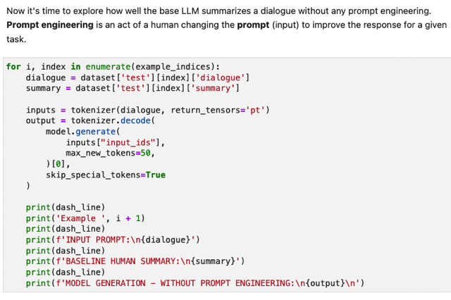</kbd>

> [!NOTE]
> Rồi, cho model predict thử - generate summary mà không có cái prompt
> nào hết. Loop lần lượt trong example_indices (chứa hai cái index của 2
> data sample), dùng index, lấy data sample từ test sét (dataset['test']), và tạo
> var chứa dialogue content và label (summary). Kế tối, bỏ dialog vào
> tokenizer để tokenize. Sau đó bỏ vào model.generate() để model predict,
> để ý không có prompt gì đi kèm, và max_new_tokens = 50 để giới hạn độ
> dài. Sau đó kết quả của nó được đưa vào tokenizer.decode để in ra.

 

<kbd>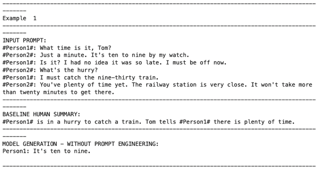</kbd>

 

<kbd>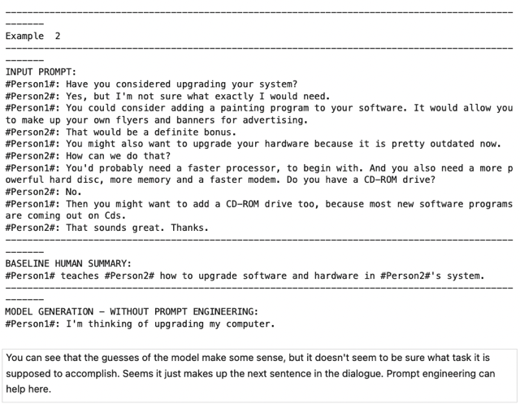</kbd>

> [!NOTE]
> Đại khái là model nó không biết
> mình muốn nó làm gì, thành ra
> câu trả lời rất ất ơ.

 

### 3 - Summarize Dialogue with

> [!NOTE]
> 3 - Summarize Dialogue with
> an Instruction Prompt

 

### 3.1 - Zero Shot Inference with

> [!NOTE]
> 3.1 - Zero Shot Inference with
> an Instruction Prompt

 

#### In order to instruct the model to perform a task - summarize a dialogue - you can take the  dialogue and convert it into an instruction prompt. This is often called **zero shot  inference**. You can check out this blog from AWS for a quick description of what zero  shot learning is and why it is an important concept to the LLM model.  Wrap the dialogue in a descriptive instruction and see how the generated text will  change:

 

<kbd>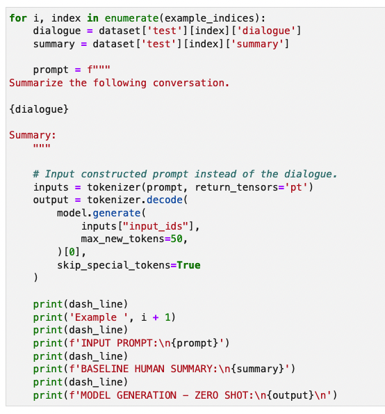</kbd>

> [!NOTE]
> Ok, đại khái là có thêm cái prompt, tức là không phải khơi khơi đưa dialogue vào
> model (sau khi tokenize) mà ghi thêm yêu cầu ("Summarize the ..."). Tất nhiên ta
> vẫn sẽ tokenize cái text - chứa cả promt và dialog content, trước khi đưa vào
> model

 

<kbd>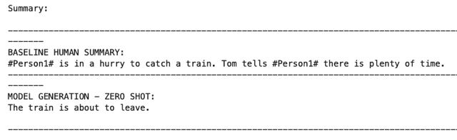</kbd>

> [!NOTE]
> Câu trả lời đã tốt hơn.

 

#### This is **much better**! But the model **still does not pick up on the nuance of the conversations** though.   **Exercise:**   • **Experiment with the prompt text** and**see how the inferences will be changed.** Will the inferences change if you end the prompt with just empty string vs. Summary: ?   • Try to **rephrase the beginning of the prompt text** from Summarize the following  conversation. to something different - and see how it will influence the generated output. 

 

### 3.2 - Zero Shot Inference with the

> [!NOTE]
> 3.2 - Zero Shot Inference with the
> Prompt Template from FLAN-T5

 

<kbd>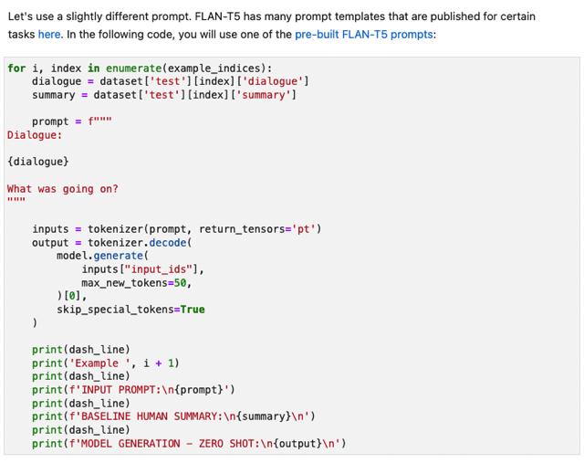</kbd>

> [!NOTE]
> https://github.com/google-research/FLAN/blob/main/flan/v2/templates.py

 

<kbd>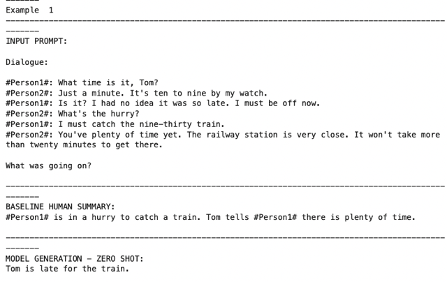</kbd>

 

#### Notice that this prompt from FLAN-T5 did **help a bit**, but still **struggles to pick up on the nuance** of the conversation. This is what you will try to solve with the few shot inferencing

 

### 4 - Summarize Dialogue with One

> [!NOTE]
> 4 - Summarize Dialogue with One
> Shot and Few Shot Inference

 

#### One shot and few shot inference are the practices of **providing an LLM with either one or more full examples of prompt-response pairs** that match your task - **before your actual prompt**that you want completed. This is called "**in-context learning**" and **puts your model into a state that understands your specific task**. You can read more about it in this blog from HuggingFace.

> [!NOTE]
> Đại khái là cung cấp thêm ví dụ về một prompt-response pairs - kiểu
> như yêu cầu và câu trả lời mong muốn. Trước khi đưa ra prompt thật
> sự được yêu cầu. Cái này gọi là In-context learning, nếu là 1 ví dụ thì
> gọi là one-shot, nhiều thì few-shot

 

### 4.1 - One Shot Inference

 

<kbd>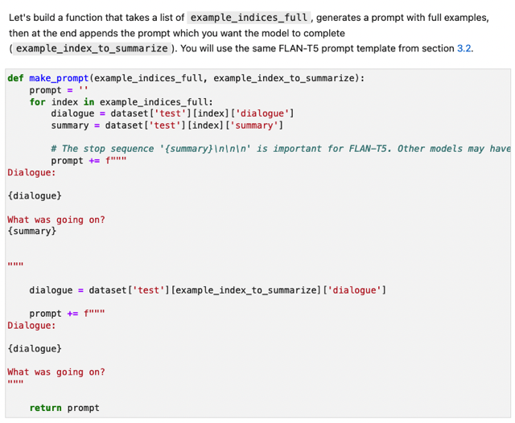</kbd>

> [!NOTE]
> Tạo function để 'tạo prompt, để chứa 1 hoặc vài
> example (lấy từ một dialog và label khác) trước khi
> add với dialog mình muốn nó làm

 

<kbd>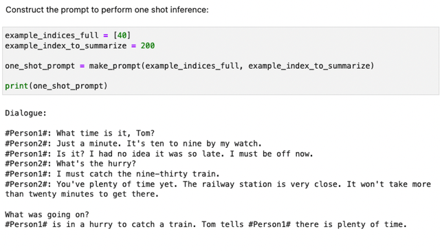</kbd>

> [!NOTE]
> Tạo prompt chứa 1 shot (lấy ví dụ là
> dialog và label index 40)

 

<kbd>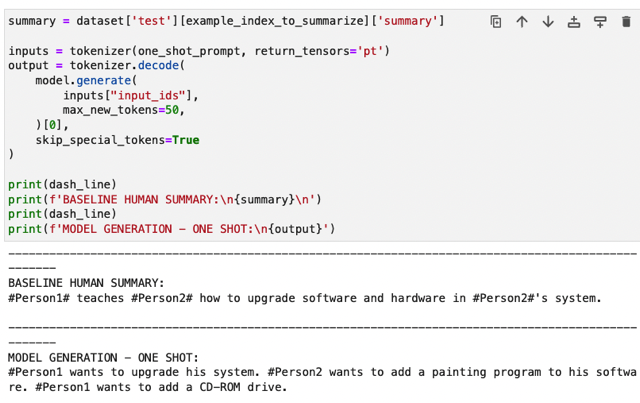</kbd>

 

### 4.2 - Few Shot Inference

 

<kbd>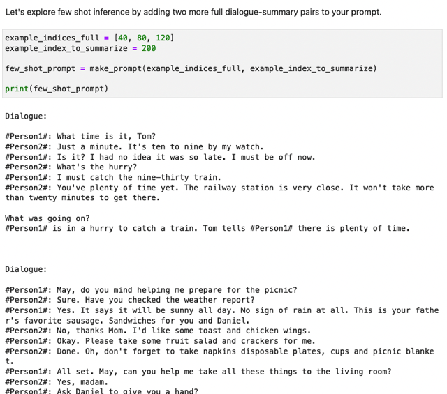</kbd>

> [!NOTE]
> Lần này tạo prompt
> chứa hẳn 3 shot.

 

<kbd>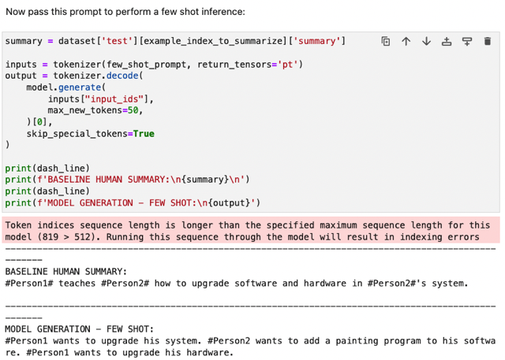</kbd>

 

#### In this case, **few shot** **did not provide much of an improvement** over one shot inference. And, **anything above 5 or 6 shot will typically not help much**, either. Also, you need to **make sure that you do not exceed the model's input-context length which**, in our case, if **512** tokens. Anything above the context length will be ignored.  However, you can see that **feeding in at least one full example (one shot) provides the model with more information** and **qualitatively improves** the summary overall.

> [!NOTE]
> Đại khái là cho thấy trong trường hợp này few
> shot có vẻ không giúp ích gì thêm, tuy nhiên rõ
> ràng là so với zero shot, one shot giúp model
> output tốt hơn thấy rõ.

 

### 5 - Generative Configuration

> [!NOTE]
> 5 - Generative Configuration
> Parameters for Inference

 

#### You can **change the configuration parameters** of the generate() method to**see a different  output** from the LLM. So far the only parameter that you have been setting  was **max_new_tokens**=50, which **defines the maximum number of tokens** to generate. A  **full list of available parameters** can be found in the Hugging Face Generation  documentation.   (https://huggingface.co/docs/transformers/v4.29.1/en/main_classes/ text_generation#**transformers.GenerationConfig**)  A convenient way of organizing the configuration parameters is to  use **GenerationConfig class.**

 

#### Change the **configuration parameters** to investigate their influence on the output.  Putting the parameter **do_sample** = **True**, you **activate various decoding strategies** which  **influence the next token** from the **probability distribution**over the**entire vocabulary**. You  can then a**djust the outputs changing temperature** and other parameters (such  as **top_k** and **top_p**).  Uncomment the lines in the cell below and rerun the code. **Try to analyze the results**. You  can read some comments below.

 

#### Comments related to the choice of the parameters in the code cell above:  Choosing max_new_tokens=10 will make the output text too short, so the dialogue summary will be cut.  Putting do_sample = True and changing the temperature value you get more flexibility in the output.

 

<kbd>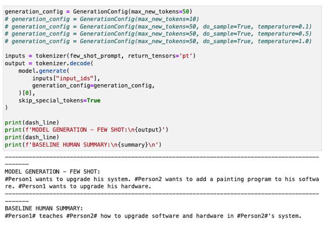</kbd>

 

<kbd>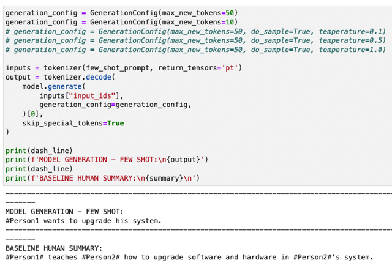</kbd>

> [!NOTE]
> max_neew_token = 10 khiến quá giới hạn, nội dụng sẽ bị cắt ngắn nhiều

 

<kbd>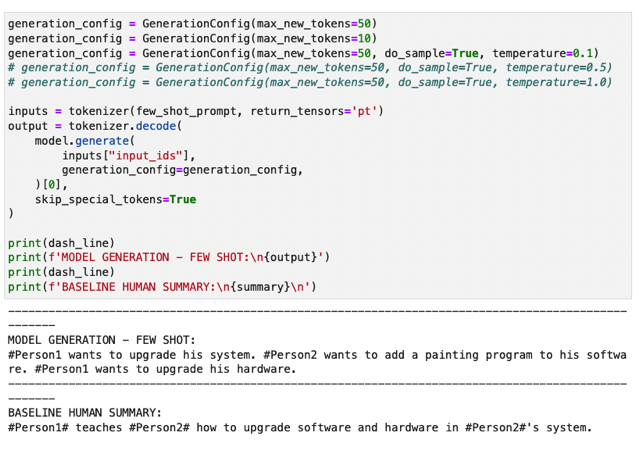</kbd>

> [!NOTE]
> với do_sample, và temperature tăng thì câu
> trả lời flexible hơn đa dạng hơn

 

<kbd>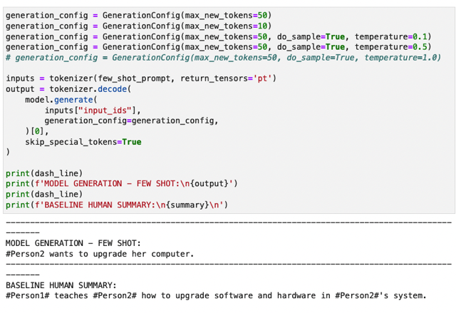</kbd>

 

<kbd>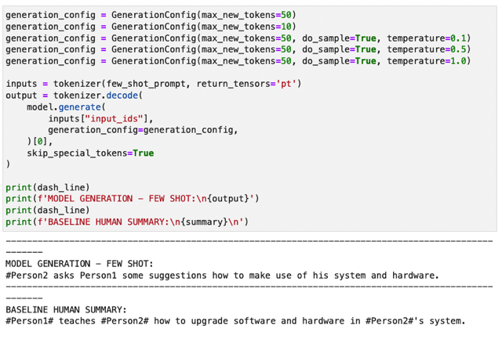</kbd>

 

### Conclusion

 

#### As you can see, **prompt engineering** can take you a long way for this use case, but there are some **limitations**. Next, you will start to explore how you can use **fine-tuning** to help your LLM to understand a particular use case in better depth!

> [!NOTE]
> Prompt engineering có những hạn chế, do
> đó cần phải fine-tuning model

 

