# Lab 3 - Fine-tune Flan-t5 To Generate More-positive Summaries

📊 **Progress:** `26` Notes | `43` Screenshots

---

## In this notebook, you will **fine-tune a FLAN-T5**model to \\*generate

> [!NOTE]
> In this notebook, you will **fine-tune a FLAN-T5**model to **generate
> less toxic content** with **Meta AI's hate speech reward model**.
>
> The **reward model** is a **binary classifier** that predicts either **"not
> hate"** or **"hate"** for the **given text**.
>
> You will use **Proximal Policy Optimization (PPO)** to fine-tune and
> reduce the model's toxicity.

> [!NOTE]
> Brief: Fine-tune model FLAN-T5 model với phương pháp RLHF
> để bớt toxic với Meta AI's hate speech classifier đóng vai trò
> reward model. Sử dụng PPO algorithm

 

### 1 - Set up Kernel and

> [!NOTE]
> 1 - Set up Kernel and
> Required Dependencies

 

<kbd>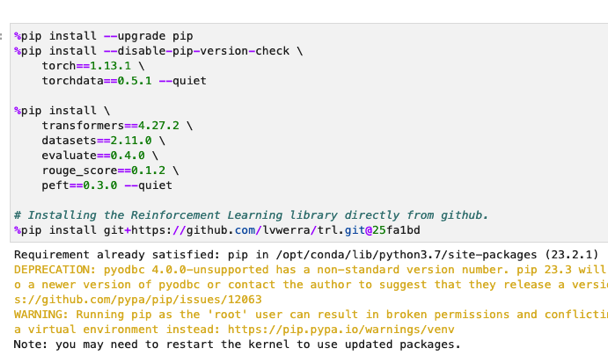</kbd>

 

<kbd>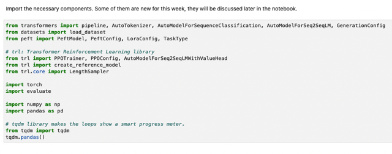</kbd>

> [!NOTE]
> Import một số lib như bữa trước như transformer,
> **dataset**, **evaluate**, **rouge_score** để **evaluate model**,
> **peft** để **"Parameterized Efficient Fine Tuning"**, đặc
> biệt có thêm trl giúp Reinforcement Learning

 

### 2 - Load FLAN-T5 Model, Prepare

> [!NOTE]
> 2 - Load FLAN-T5 Model, Prepare
> Reward Model and Toxicity Evaluator

 

### 2.1 - Load Data and FLAN-T5

> [!NOTE]
> 2.1 - Load Data and FLAN-T5
> Model Fine-Tuned with
> Summarization Instruction

 

<kbd>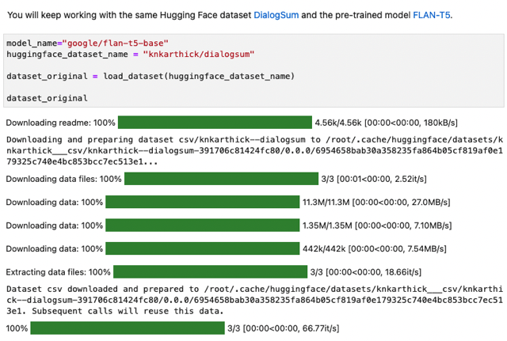</kbd>

> [!NOTE]
> Load pre-trained model FLAN-T5, và bộ dataset DialogSum

 

<kbd>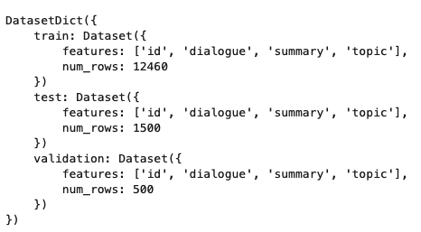</kbd>

> [!NOTE]
> Như đã từng gặp, nó có dạng DatasetDict,
> chứa 3 bộ train/validation/test.

 

<kbd>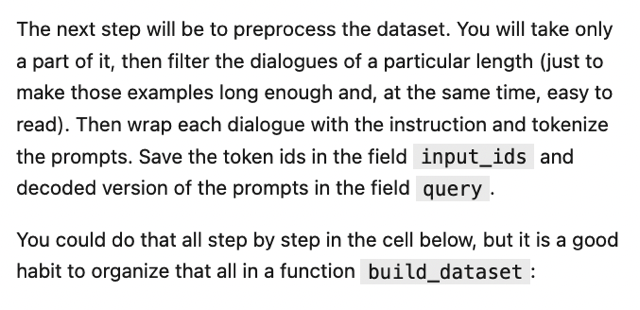</kbd>

> [!NOTE]
> Đại khái là bước kế tiếp là preprocess dataset. Ta sẽ chỉ 'làm' trên một phần của
> dataset thôi.
>
> Filter với một độ dài nhất định để chỉ chọn các câu dài ở mức nào đó,  loại bỏ
> những câu ngắn quá. Nói là câu chứ thật ra là dialog.
>
> Wrap dialogue với instruction để tạo thành prompt có dạng như bữa trước và
> tokenize cái prompt. (Thành dạng token index)
>
> Save vào field input_ids, còn decoded version của cái prompt = kiểu như cái
> prompt dạng text thì save vào field query.

 

<kbd>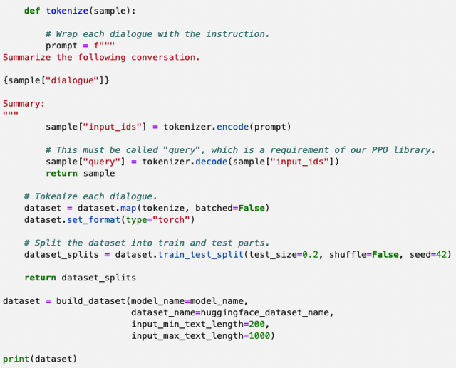</kbd>

<kbd>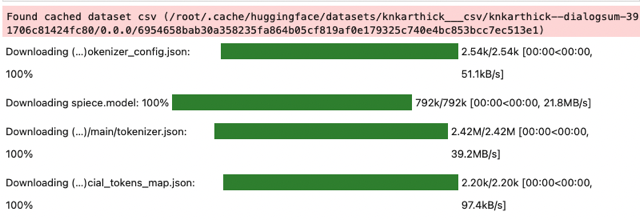</kbd>

<kbd></kbd>

<kbd></kbd>

<kbd>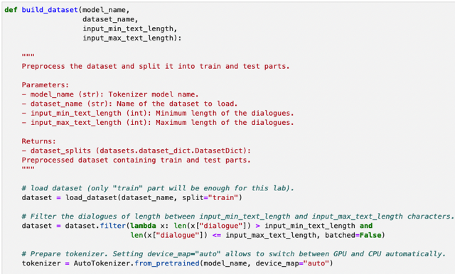</kbd>

> [!NOTE]
> Function build_dataset:
>
> Đầu tiên là gọi function load_dataset của transformer với tên dataset, split='train' tức
> chỉ định chỉ lấy bộ train dataset thôi.
>
> Sử dụng function filter() để filter các data sample  dài trong khoảng nhất định define
> bởi input argument.
>
> Dùng AutoTokenizer.from_pretrained(tên model) - đây là lib của HuggingFace  rất tiện
> giúp load cái tokenizer đúng cho model. Vì như đã biết trong LLM FineTuning  Short
> course của DeepLearning AI có nói, mỗi LLM nói riêng và language model nói chung
> được train với một dataset riêng, nên đương nhiên có bộ token map riêng.
>
> Tiếp define function (function trong function) tokenize() nhận sample và return prompt
> theo dạng 'Yêu cầu - dialog - Summary:' rồi tokenize, và assign 1 feature mới 'input_ids'
> bỏ nó vào function dataset.map

 

<kbd>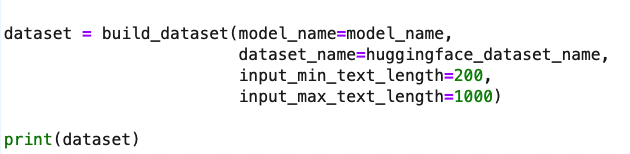</kbd>

 

<kbd>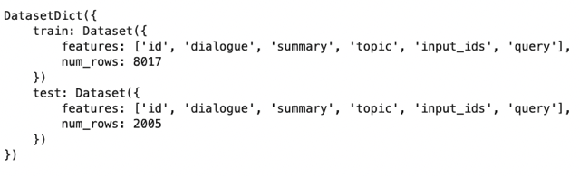</kbd>

> [!NOTE]
> Dataset sẽ có thêm input_ids là "cái
> prompt được tokenized"

 

<kbd>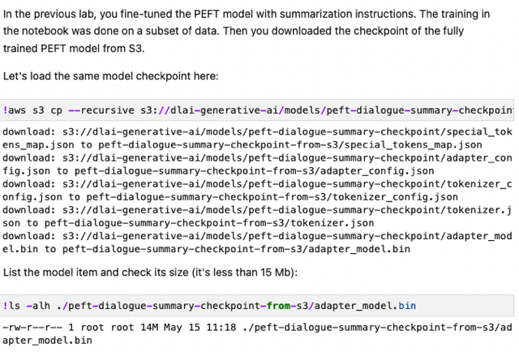</kbd>

> [!NOTE]
> Download model checkpoint - model được
> fine-tuned với PEFT bữa trước

 

<kbd>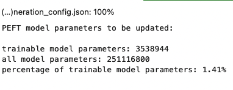</kbd>

> [!NOTE]
> Như đã biết, vì được fine-tune với
> PEFT nên chỉ có 1.41% số
> params là trainable thôi.

 

<kbd>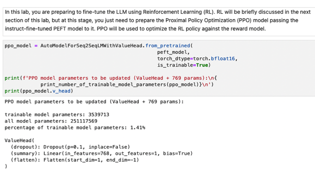</kbd>

> [!NOTE]
> Chuẩn bị PPO model - Cái RL algorithm giúp
> update LLM dựa trên reward model's feedback

 

<kbd>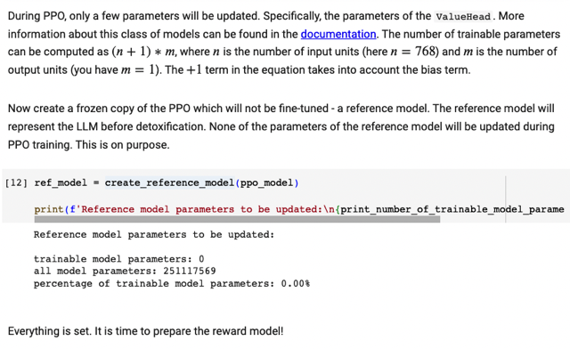</kbd>

> [!NOTE]
> Tiếp theo là tạo một 'Reference model' - là bản copy của
> LLM sắp được fine-tune với RLHF. Model này sẽ được
> frozen mà đóng vai trò trong KL Divergence giúp khắc phục
> hiện tượng 'Reward hacking'

 

### 2.2 - Prepare Reward Model

 

<kbd>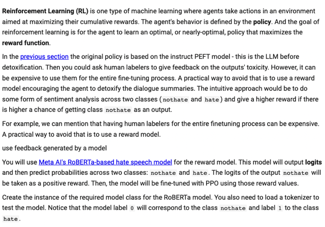</kbd>

> [!NOTE]
> Đại khái là sơ lược lại Reinforcement Learning là quá trình update agent (model) policy
> sao cho dần tối ưu reward nhận được. Người ta phát triển RLHF để fine-tune LLM theo
> hướng ngày càng align tốt hơn với human preference. Vấn đề là việc sự dụng real human
> là rất tốn kém trong quá trình fine-tuning. Do đó giải pháp là train một reward model trước -
> là một classification model train với Supervised Learning cho nó học được các classify cặp
> prompt-completion sao cho toxic thì cho score thấp còn non-toxic = align tốt với human
> preference thì cho score cao (logit). Từ đó cho nó đóng vai trò của 'human' trong quá trình
> RLHF. Thì ở đây ta đã có sẵn một Reward model như vậy, chính là sử dụng RoBERTa
> model của Facebook, được train để classify hate và not-hate text message.

 

<kbd>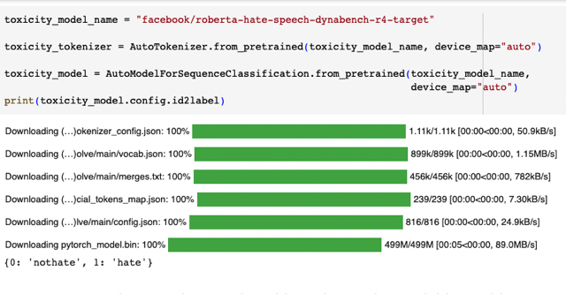</kbd>

> [!NOTE]
> Download pre-train model và tokenizer "của nó". Việc load model này dùng Component
> khác LLM model ở trên có lẽ là do khác loại. Ở đây có thể hiểu là model này thuộc loại
> Sequence Classification nên dùng AutoModelForSequenceClassfication.
> from_pretrained(model name) để load

 

<kbd>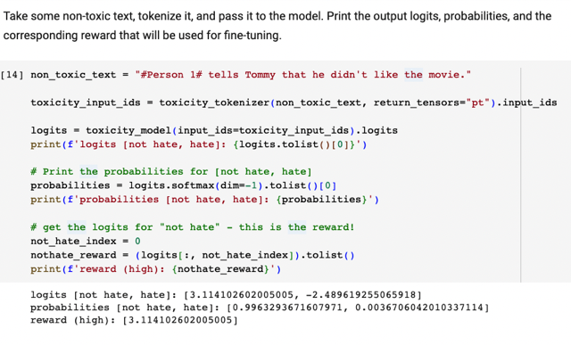</kbd>

> [!NOTE]
> Ở dưới đại khái là lấy một câu ví dụ có tính ghét hay thích 'hate' or 'not-hate'.
> Tokenize nó với tokenizer của reward model. Sau khi tokenized, kết quả
> (tokenized sequence) chứa trong field .**input_ids**Inference vào reward model và xem thử **logits** - với field .**logits** - giá trị này
> sẽ chính là reward đưa vào PPO để update LLM.
>
> Từ logits. gọi function softmax() nó sẽ chuyển thành probability scores 
>
> Thì ta thấy với câu này, logits cho class not_hate là 3.1, còn hate là -2.4 chứng
> tỏ model nhận định câu này là có tính chất 'ghét'. Khi quy ra probability thì thấy
> 99% là thuộc class 'not hate' - Quả thật, câu này tuy nói rằng Tommy không thích
> bộ phim nhưng không phải mang tính chất thù ghét - hate
>
> (Ồng để not_hate_index = 0, ý cho khỏi lộn vì cái này quy định trong config
> có khi positive class nằm trước có khi nằm sau phải check cho kĩ nếu không
> lấy nhầm logit của negative class (toxic) thì càng train sẽ tạo LLM càng toxic hơn)

 

<kbd>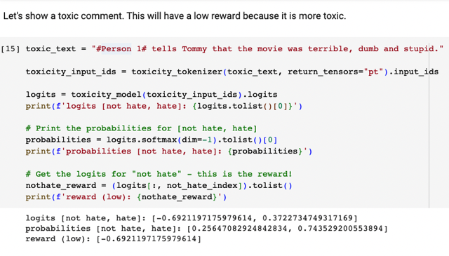</kbd>

> [!NOTE]
> Thử 1 câu khác, câu này quả thật mang tính thù
> ghét với các từ terrible, ....Kết quả cho thấy
> model cho ra 74% là 'hate' class cho thấy Meta AI's RoBERTa rất tốt

 

<kbd>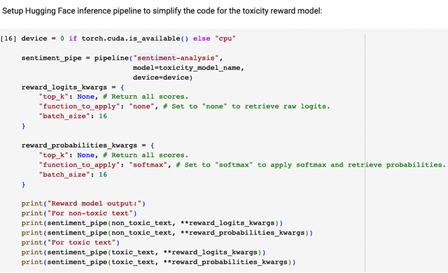</kbd>

> [!NOTE]
> Ở đây là setup Hugging Face inference pipeline với pineline('loại' task =
> sentiment-analysis, tên model) - Hơi lạ nhưng hiểu đây kiểu như ' cách' gọi /
> inference tới model. Khi dùng thì chỉ việc bỏ cái câu cần check vào, cùng với "
> keyword argument" - kiểu như config.
>
> Thì nó giúp ta không phải tokenize, rồi gọi inference vào model ...
>
> Nói thêm cái keyword argument ở đây define 2 cái, khác nhau ở 1 cái "
> function_to_apply" : "none" ý là sẽ xuất ra dạng logit. 1 cái "funciton_to_apply" : "
> softmax" thì sẽ giúp xuất ra probability

 

<kbd>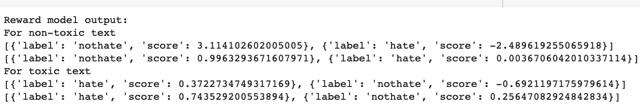</kbd>

 

### 2.3 - Evaluate Toxicity

 

<kbd>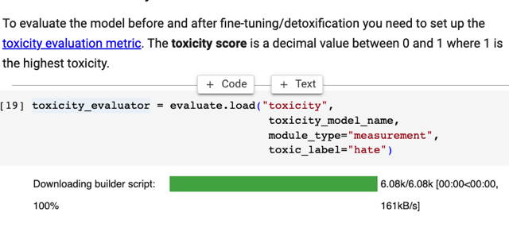</kbd>

> [!NOTE]
> Dùng lib evaluate load 'toxicity' evaluator, với
> model name là cái reward model RoBERTa ở
> trên với vài argument chưa hiểu

 

<kbd>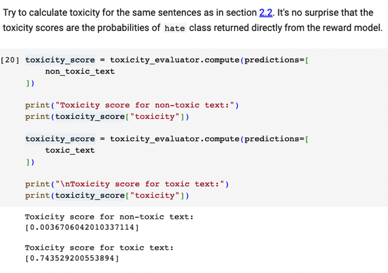</kbd>

> [!NOTE]
> Dùng cái "toxicity evaluator" này tính thử / Evaluate thử cái hai cái
> câu ở trên (1 câu không hate, 1 câu hate). Kết quả cho thấy chỉ số
> của câu đầu đúng là thấp (không hate) chỉ có 0.003 còn của câu
> sau (quả thật là hate) thì toxicity tới 0.74

 

#### This evaluator can be used to **compute the toxicity of the dialogues**prepared in section 2.1. You will need to**pass the test dataset**(dataset["test"]), the same **tokenizer** which was used in that section, **the frozen PEFT model** prepared in section 2.2, and the **toxicity evaluator**. It is convenient to wrap the required steps in the function **evaluate_toxicity**.

> [!NOTE]
> Mục đích dùng cái toxicity evaluator này là ta sẽ đánh
> giá độ toxicity của các output của model.

 

<kbd>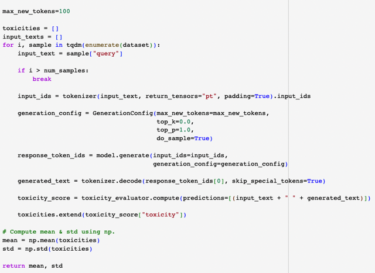</kbd>

<kbd></kbd>

<kbd>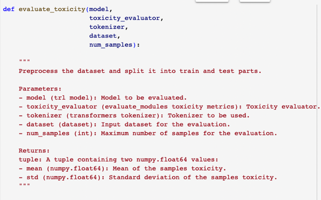</kbd>

> [!NOTE]
> Function này sẽ nhận model, dataset, lần lượt inference data từ dataset vào model,
> lấy cái output, decode ra lại thành text, rồi bỏ vào evaluator để tính độ toxic. Sau cùng
> hết thì tính ra mean và standard deviation của các chỉ số toxic.
>
> Nhận xét: chỉ "đơn giản" là lấy text từ dataset, không 'custom' lại prompt gì cả, có nghĩa
> là nó chỉ thuần tuý là dialog, inference vào LLM - cụ thể là cái PEFT fine-tuned Flan-T5 
> thì nó cho ra gì ta???
>
> Thì việc này sẽ chính là dùng trong KL Divergence - ta sẽ tính ra thông số tạm gọi là
> mean toxic và standard deviation toxic của  Reference model và của Updated model
> và dùng KL Divergence để khống chế không cho Update LLM 'reward hacking' - hiện
> tượng LLM chỉ vì lo tối ưu reward mà generate ra completion tầm bậy

 

<kbd>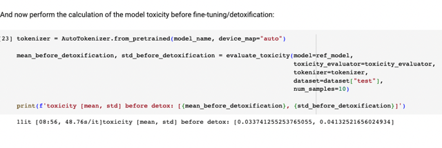</kbd>

> [!NOTE]
> Dùng function này, tính 'toxic' mean và standard deviation của
> Reference (Frozen) model trước, dùng 'test' set.

 

### 3 - Perform Fine-Tuning to

> [!NOTE]
> 3 - Perform Fine-Tuning to
> Detoxify the Summaries

 

### 3.1 - Initialize PPOTrainer

 

<kbd>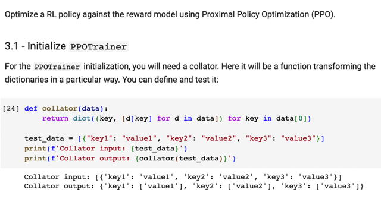</kbd>

 

<kbd>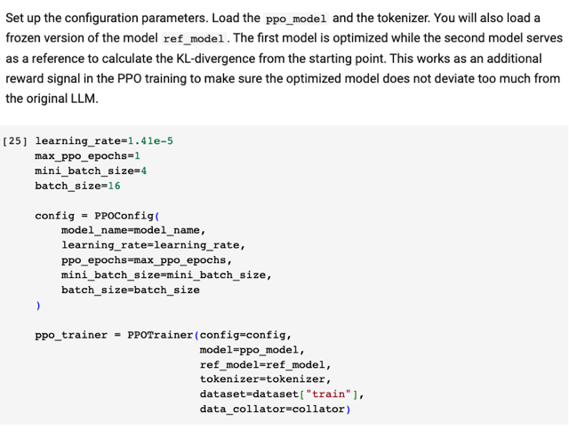</kbd>

> [!NOTE]
> Define PPOConfig với các h.p như learning rate,
> batch_size. Bỏ vào model (được sẽ fine-tune) và
> Reference model (được frozen) giúp làm cái vụ KLDivergence

 

### 3.2 - Fine-Tune the Model

 

<kbd>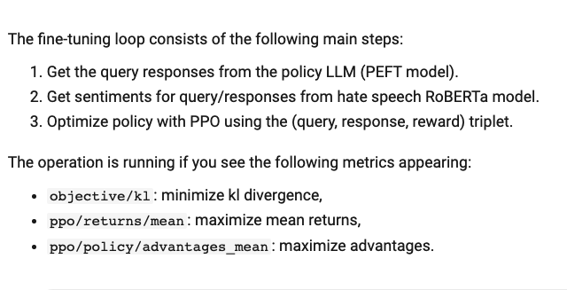</kbd>

> [!NOTE]
> Các bước của Fine-tuning with RLHF loop:
>
> 1. Lấy query response từ LLM (đang được fine-tune) là cái FLAN-T5 được
> fine-tuned với PEFT tuần trước
>
> 2. Bỏ cặp query-response này vào Reward model (RoBERTA)  để ra logit = reward
> score.
>
> 3.Bỏ reward vào PPO để nó optimize policy = update LLM

 

<kbd>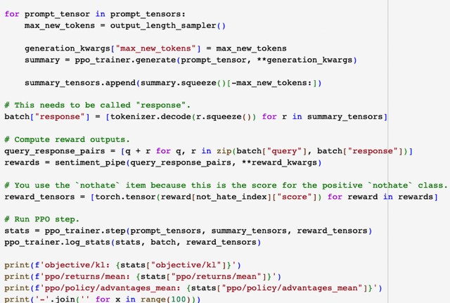</kbd>

<kbd></kbd>

<kbd>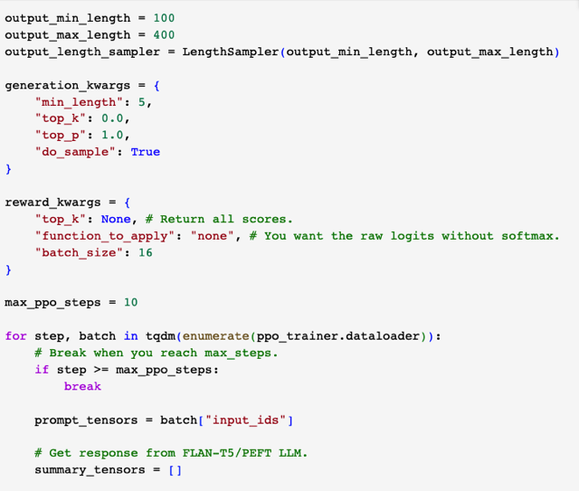</kbd>

 

<kbd>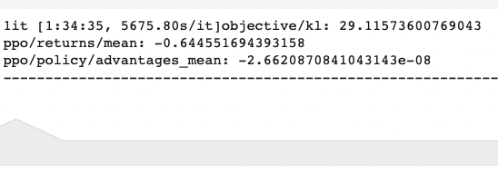</kbd>

 

### 3.3 - Evaluate the Model Quantitatively

 

<kbd>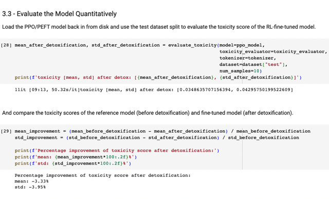</kbd>

> [!NOTE]
> Dùng evaluator để evaluate độ toxicity của updated model (như đã biết nó sẽ lấy các
> dialog của test set inference vào model để generate completion rồi bỏ vào evaluator.
> Cuối cùng sau khi đi hết test sét, tính mean và standard deviation)
>
> So sánh hai chỉ số này với hai chỉ số tính bởi Reference model ở trên, cho thấy chỉ
> số của fine-tuned model cao hơn của reference model ~3%. Tức độ non-toxic đã
> tăng

 

### 3.4 - Evaluate the Model Qualitatively

 

<kbd>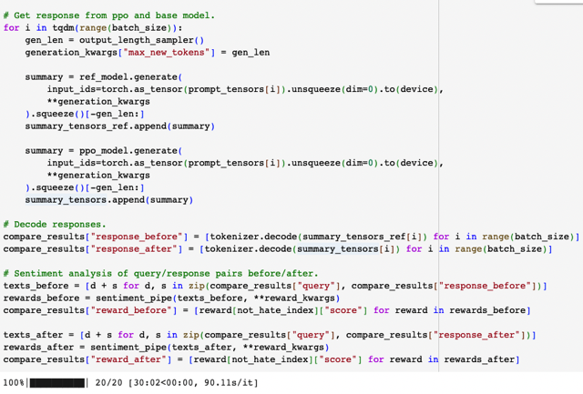</kbd>

<kbd></kbd>

<kbd>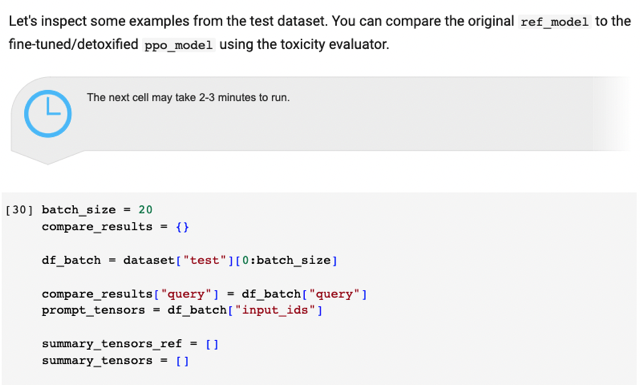</kbd>

> [!NOTE]
> Đại khái là
>
> Lấy 20 data samples dạng text (column 'query') từ test set. và prompt (column '
> input_ids')
>
> Loop:
>
> Inference prompt vào Reference model, lấy summary (completion) bỏ vào list
> summary_tensors_ref
>
> Inference prompt vào RFHF fine-tuned model (ppo model) để lấy completion, bỏ vào
> list summary_tensors
>
> Xong decode các completion của hai bộ trên và bỏ vào sentiment_pipeline() (là cái
> RoBerta = reward model) để nó xuất ra 'reward'và plot ra xem thử

 

<kbd>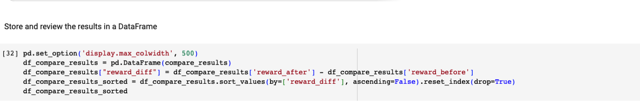</kbd>

 

<kbd>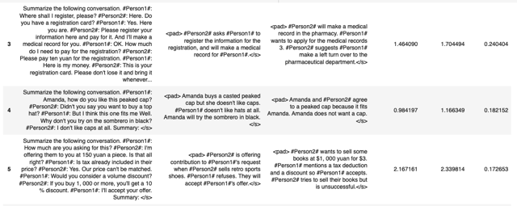</kbd>

<kbd></kbd>

<kbd>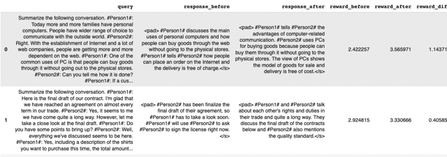</kbd>

> [!NOTE]
> Kết quả cho thấy chỉ số logits do RoBERTa model generate
> trên các completion của model mới cao hơn ref model chứng
> tỏ độ not-hate đã được cải thiện

 

