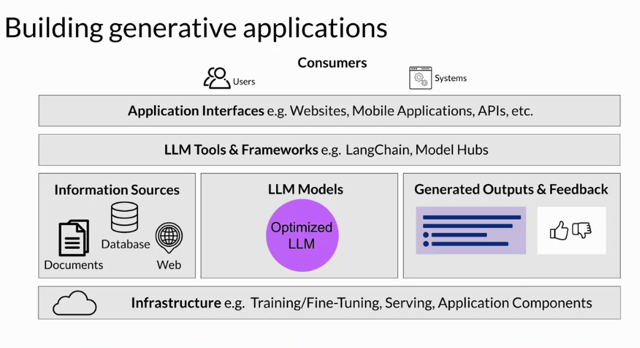

# LLM Application Architectures

📊 **Progress:** `0` Notes | `1` Screenshots

---

## **Summary:**

> [!NOTE]
> **Summary:**
>
> 1. **Building LLM-powered Applications**:
>    - Key components are needed to create applications powered by Large Language 
> Models (LLMs).
>    - The **infrastructure layer** offers compute, storage, and network for LLMs and 
> application components, available on-premises or via cloud services.
>    - LLMs can be foundational or task-specific and must be deployed on suitable 
> infrastructure. The need for real-time or near-real-time interactions and information 
> retrieval from external sources is crucial.
>    - Outputs from LLMs are returned to the user or application. Mechanisms may be 
> needed to capture/store outputs or gather user feedback for model refinement.
>
> 2. **Tools & Frameworks**:
>    - Use of additional tools and frameworks simplifies the integration of LLM techniques.
>    - Tools like "len chain" offer libraries for techniques such as "pow react". Model hubs 
> allow central management and sharing of models.
>    - Security components and user interfaces, like websites or APIs, form the final layer of 
> the application.
>
> 3. **End-to-End Generative AI**:
>    - The LLM is just a part of the overall architecture in generative AI applications. End-
> users or systems will interact with the entire application stack.
>
> 4. **Model Fine-tuning & Optimization**:
>    - Aligning LLMs with human preferences like helpfulness and honesty is achieved 
> through Reinforcement Learning with Human Feedback (RLHF).
>    - RLHF is popular and effective in improving model alignment and safety.
>    - Techniques such as distillation, quantization, or pruning optimize the model, reducing 
> hardware resource requirements.
>
> 5. **Enhancing Model Deployment**:
>    - Structured prompts and connections to external data sources can enhance model 
> performance in deployment.
>
> 6. **Role of LLMs**:
>    - LLMs can act as reasoning engines in applications, tapping into their intelligence to 
> power beneficial applications.
>
> 7. **Future Prospects**:
>    - Frameworks like "len chain" expedite the building, deployment, and testing of LLM 
> applications, marking an exciting era for developers.
>    - The course will conclude by exploring emerging research areas in the field.

 

<kbd></kbd>

 

