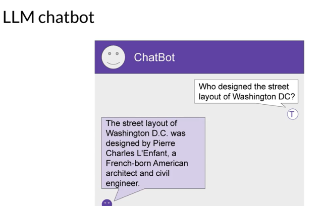
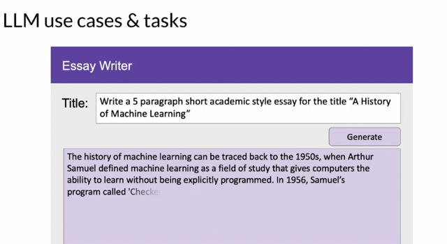
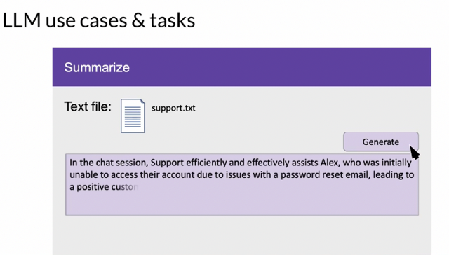
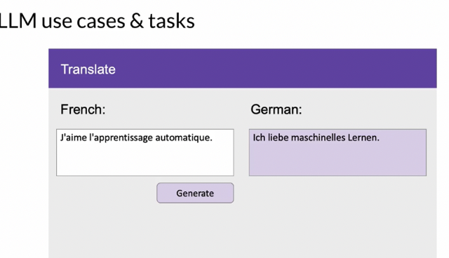
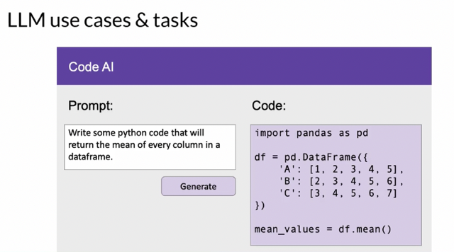
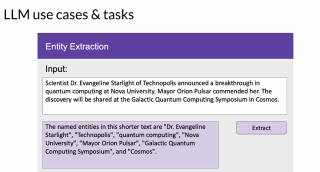
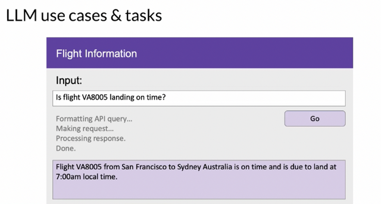
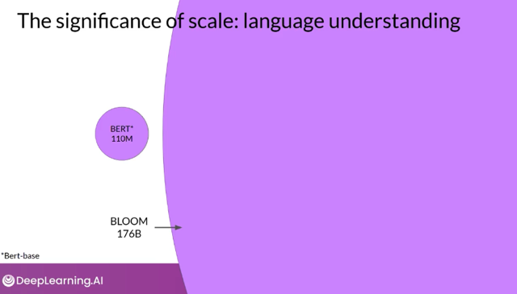

# LLM Use Cases And Tasks

📊 **Progress:** `9` Notes | `8` Screenshots

---

## 1 LLMs and generative AI are **not limited to chat tasks.**

> [!NOTE]
> 1 LLMs and generative AI are **not limited to chat tasks.**
>
> 2**Next word prediction** is a **base concept** that can be used for **various text generation tasks.**
>
> 3 Examples of tasks include **essay writing, conversation summarization, translation, and code
> generation.**
>
> 4 LLMs can be used for **information retrieval tasks like named entity recognition.**
>
> 5 **Augmenting LLMs** by **connecting them to external data sources** or APIs is an **active area of
> development.**
>
> 6 The **scale of foundation models** affects **their subjective understanding of language.**
>
> 7 **Smaller models** can be **fine-tuned for specific tasks.**
>
> 8 The **architecture powering LLMs** has contributed to thei**r rapid increase in capability.**
>
> 9 Further exploration of the architecture will be discussed in the next video.

 

<kbd></kbd>

> [!NOTE]
> Đại khái là tuy LLM nổi tiếng với chatbot nhưng concept đằng sau nó là predicting next
> words có thể được apply vào rất nhiều ứng dụng khác

 

<kbd></kbd>

> [!NOTE]
> Như viết một essays
> dựa vào a prompt

 

<kbd></kbd>

> [!NOTE]
> ..summarize text

 

<kbd></kbd>

> [!NOTE]
> translating human language to human language

 

<kbd></kbd>

> [!NOTE]
> Or to machine language

 

<kbd></kbd>

> [!NOTE]
> Extracting information, name entity recognition

 

<kbd></kbd>

> [!NOTE]
> Cái này mới dữ nè đây là cái đang active development" là **"augmenting LLM"** đại khái là tự gọi api để request thông tin mà nó không biết luôn - có nghĩa là
> nó sẽ **không chỉ trả lời những cái nó học được** mà **sẽ tự tìm hiểu để trả lời.
> Nói cách khác, nó sẽ chủ động interacting với thế giới**

> [!NOTE]
> Finally, an area of **active development** is **augmenting LLM**s by **connecting
> them to external data sources** or**using them to invoke external API**s. You
> can use this ability to **provide the model with information it doesn't know
> from its pre-training** and to **enable your model to power interactions with
> the real-world.**

 

<kbd></kbd>

> [!NOTE]
> Developers have **discovered that** as the **scale of foundation models grows** from
> **hundreds of millions** of parameters to **billions**, even **hundreds of billions**, the
> **subjective understanding of language** that a model possesses also **increases**.
> This language understanding stored within the parameters of the model is what
> **processes, reasons, and ultimately solves the tasks you give it**, but it's also true
> that **smaller models can be fine tuned to perform well on specific focused tasks.**

 

