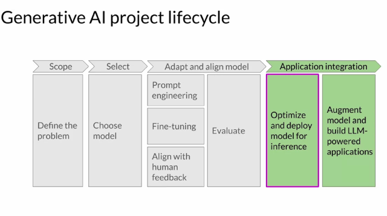
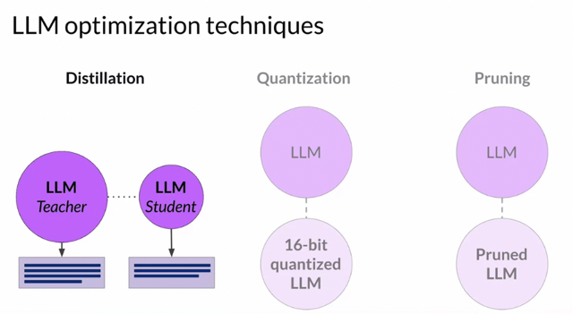
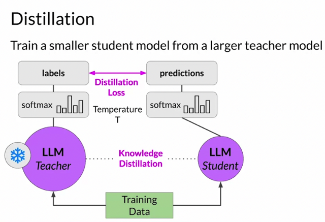
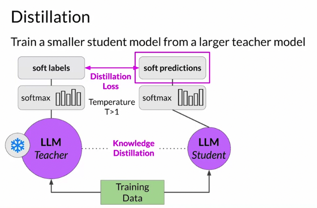
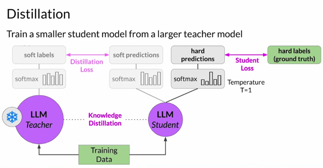
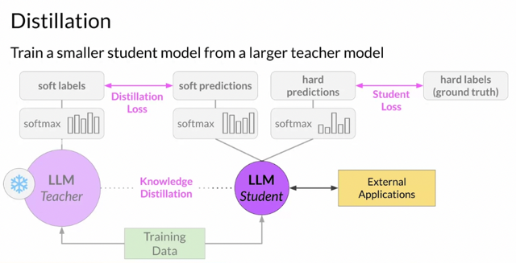
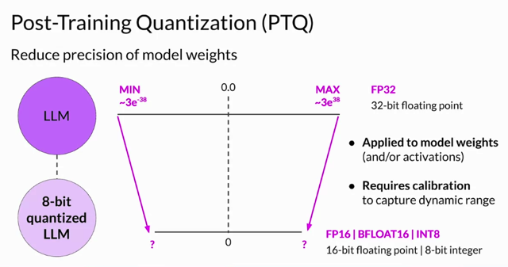
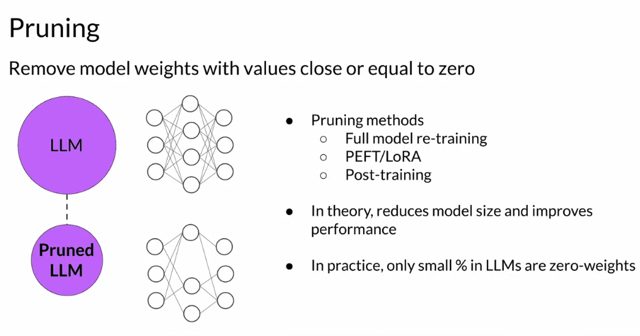

# Model Optimizations For Deployment

📊 **Progress:** `13` Notes | `8` Screenshots

---

<a id="node-563"></a>
## 1. **Considerations for Model Integration**:

> [!NOTE]
> 1. **Considerations for Model Integration**:
>
>    - Questions to ask when integrating a large language model (LLM) into applications 
> include:
>      - Speed and latency requirements.
>      - Available compute resources.
>      - Trade-offs between model performance, inference speed, and storage.
>      - Interaction with external data or applications.
>      - The intended application or API interface for model consumption.
>
> 2. **Optimization Techniques**:
>    - To address inference challenges with LLMs, optimization techniques are crucial.
>    - These challenges relate to computing, storage, and low latency, especially for edge 
> devices.
>    - Three primary optimization techniques are introduced: Distillation, Quantization, and 
> Pruning.
>
> 3. **Distillation**:
>    - Distillation involves training a smaller student model to mimic a larger teacher model's 
> behavior.
>    - The student model learns from the teacher model, focusing on matching predictions.
>    - Distillation loss measures the difference between soft labels (teacher's predictions) 
> and hard labels (ground truth).
>    - Temperature scaling is used to adjust the softness of the teacher's output.
>
> 4. **Quantization**:
>    - Quantization reduces the precision of model weights, saving memory and compute 
> resources.
>    - It can be applied to weights only or both weights and activation layers.
>    - Post Training Quantization (PTQ) transforms model weights to lower precision 
> representations.
>    - Calibration is performed to capture the dynamic range of parameter values.
>
> 5. **Pruning**:
>    - Pruning aims to reduce model size by eliminating weights with little impact on 
> performance.
>    - These are weights close to or equal to zero.
>    - Some pruning methods require full model retraining, while others are post-training.
>    - Pruning can lead to improved inference performance and reduced model size.
>
> 6. **Overall Optimization Goals**:
>    - Optimization techniques like quantization, distillation, and pruning aim to reduce 
> model size and improve inference performance without sacrificing accuracy.
>    - Optimizing models for deployment ensures efficient operation and a better user 
> experience.
>
> These optimization techniques are essential for adapting large language models to real-
> world applications, addressing computational constraints, and enhancing their efficiency 
> during deployment.

<br>

<a id="node-564"></a>

<p align="center"><kbd></kbd></p>

<br>

<a id="node-565"></a>

<p align="center"><kbd></kbd></p>

<br>

<a id="node-566"></a>

<p align="center"><kbd></kbd></p>

> [!NOTE]
> You **start with your fine tune LLM** as your **teacher model** and create a **smaller LLM for
> your student model**. You **freeze the teacher model's weights** and use it to **generate
> completions for your training data**.
>
> At the same time, you **generate completions for the training data using your student
> model**.
>
> The **knowledge distillation** between teacher and student model is achieved by
> **minimizing a loss function called the distillation loss.** To calculate this loss, distillation uses
> the **probability distribution over tokens that is produced by the teacher model's softmax
> layer**.
>
> Now, the teacher model is **already fine tuned** on the training data. So the p**robability
> distribution likely closely matches the ground truth data** and **won't have much variation in
> tokens**.
>
> That's why**Distillation applies a little trick adding a temperature parameter** to the softmax
> function. As you learned in lesson one, a**higher temperature increases the creativity** of
> the language the model generates. With a temperature parameter **greater than one**, the
> probability **distribution becomes broader** and **less strongly peaked**.
>
> This softer distribution provides you with a set of tokens that are similar to the ground truth
> tokens. In the context of Distillation,**the teacher model's output is often referred to as soft
> labels** and the student model's predictions as **soft predictions.**

> [!NOTE]
> Đại khái như đã học khái niệm **distillation** trong **MLOps Spec**, trong đó ta
> sẽ **dùng một teacher model** để **teach một student model**nhỏ hơn.
>
> Bắt đầu với **teacher model** là một**fine-tuned LLM**, được **freeze**. **Inference
> teacher model để lấy completion**. Đồng thời cũng **inference student model
> để lấy completion**. 
>
> **Distillation loss** sẽ được tính dựa trên **teacher model's 
> output logits** và**student model's logits** sử dụng các loss function như **cross
> entropy loss** hoặc **KL Divergence** với t**ham số temperature T.**
>
> T đóng vai trò **điều chỉnh độ 'mềm' của teacher knowledge**. nôm nà là **nếu T
> lớn ~= 1 thì output của teacher more creative hơn và ngược lại.**
>
> Trong quá trình này, student model sẽ **học được cách bắt chước teacher
> model.**
> Cơ bản tóm gọn là train student với label là prediction của teacher model
> (người ta gọi là **soft label**) và student prediction sẽ được gọi là **soft prediction**

<br>

<a id="node-567"></a>

<p align="center"><kbd></kbd></p>

<br>

<a id="node-568"></a>

<p align="center"><kbd></kbd></p>

> [!NOTE]
> In parallel, you train the student model to**generate the correct predictions** based on your
> **ground truth training data**
>
> Here, you **don't vary the temperature setting** and instead use the**standard softmax
> function**. Distillation refers to the student model outputs as the hard predictions and hard
> labels.
>
> The loss between these two is the **student** **loss**. The**combined distillation and
> student losses** are used to **update the weights** of the student model **via back
> propagation**.
>
> The key benefit of distillation methods is that the **smaller student model can be used for
> inference** in deployment **instead of the teacher** model. In practice, distillation is **not as
> effective for generative decoder models**. It's typically **more effective for encoder only
> models**, such as BERT that **have a lot of representation redundancy**. Note that with
> Distillation, you're t**raining a second, smaller model to use during inference**. You **aren't
> reducing the model size of the initial LLM** in any way.

> [!NOTE]
> Song song với quá trình đó là ta cũng **train Student model** với **Ground truth label nữa**, tính loss giữa
> **student prediction và ground truth label**. Gọi là **hard label** và **hard prediction**.
>
> Xong **kết hợp cả distillation loss và student loss** để **update student's weight** thông qua **backprop**.
>
> Nói chung, người ta nhận thấy phương pháp này**tốt cho Encoder model** (ý là các LLM có structure
> dạng Encoder only hơn là Decoder model (như GPT)
>
> Và ta phải hiểu rằng, ở đây ta**tạo ra một student model nhỏ hơ**n nhưng perform không kém teacher
> model chứ k**hông phải là thu nhỏ teacher model**

<br>

<a id="node-569"></a>

<p align="center"><kbd></kbd></p>

<br>

<a id="node-570"></a>

<p align="center"><kbd></kbd></p>

> [!NOTE]
> Let's have a look at the next model optimization technique that actually reduces the
> size of your LLM. You were introduced to the second method, **quantization**, back
> in week 1 in the **context of training**.
>
> Specifically **Quantization Aware Training**, or **QAT** for short. However, after a
> model is trained, you can perform **post training quantization**, or **PTQ** for short
> to optimize it for deployment.
>
> **PTQ transforms a model's weights to a lower precision representation**, such as
> **16-bit floating point or 8-bit integer**. To **reduce the model size and memory
> footprint**, as well as the compute resources needed for model serving, quantization
> can be applied to **just the model weights or to both weights and activation layers**.
> In general, quantization approaches that include the activations can have a higher
> impact on model performance. Quantization also **requires an extra calibration step
> to statistically capture the dynamic range of the original parameter values.
>
> As with other methods, there are tradeoffs because sometimes quantization results
> in a small percentage reduction in model evaluation metrics. However, that reduction
> can often be worth the cost savings and performance gains.**

> [!NOTE]
> Phần này bên MLOpsSpec đã học, bài **Quantization**. Đại khái là có thể **quantization aware
> training (như tuần 1 có nói rồi)** - t**raining nhưng chú ý đến quantization**. Thì ở đây là nói về
> **quantization sau khi đã train xong.**
>
> Nôm na là nó sẽ **thể hiện model's weight bằng lower precision representation** (giảm độ
> chính xác xuóng như **16-bit float hay 8-bit int** từ đó sẽ**giảm model size.** Và có thể apply
> cho cả **weight và activation layers** hoặc chỉ weight thôi.
>
> Và như các phương pháp khác, nó luôn c**ó trade off** giữa việc giảm evaluation metric
> (accuracy) với mode size. Tuy nhiên thường là trade of này ok

<br>

<a id="node-571"></a>

<p align="center"><kbd></kbd></p>

> [!NOTE]
> The last model optimization technique is pruning. At a high level, the goal is to **reduce model
> size for inference by eliminating weights that are not contributing much to overall model
> performance**. These are the weights with **values very close to or equal to zero**.
>
> Note that **some pruning methods** require **full retraining** of the model, while others fall into
> the category of **parameter efficient fine tuning**, such as **LoRA**. There are also methods that
> focus on **post-training Pruning**. In theory, this reduces the size of the model and improves
> performance. **In practice**, however, there may n**ot be much impact** on the size and
> performance if **only a small percentage of the model weights are close to zero**.
>
> Quantization, **Distillation** and Pruning all aim to r**educe model size** to **improve model
> performance** during **inference without impacting accuracy.** Optimizing your model for
> deployment will help **ensure that your application functions well** and provides your **users with
> the best possible experience sense.**

> [!NOTE]
> Cũng đã học bên MLOpsSpec, **Pruning** đại khái là **loại bỏ các weights mà ít đóng góp**
> vào model's prediction mà c**ụ thể là các weight có giá trị nhỏ ~=0.**
>
> Theo lý thuyết thì phương pháp này sẽ **giúp giảm model size và improve efficiency** tuy
> nhiên **thực tế nếu chỉ có ít  model weights ~=0** thì technique này cũng **không phát huy
> tác dụng mấy.**
>
> Nói chung là có các phương pháp để cố gắng giảm size của model, giảm thời gian
> inference xuống, ...giúp việc triển khai model lên các thiết bị được hiệu quả

> [!NOTE]
> Distillation, also known as the teacher-student method, is a technique used to reduce the size of a
>  large language model while preserving its performance. The basic idea is to train a smaller, more
>  computationally efficient model (the "student") to mimic the behavior of a larger, more accurate model 
> (the "teacher"). Here are the steps involved in the distillation method for reducing the size of a large 
> language model:
>
> 1. **Pretrained Teacher Model**:
>    - Start with a large, pretrained language model that serves as the teacher. This model has been
>  trained on a massive amount of data and is highly accurate but computationally expensive.
>
> 2. **Select a Smaller Student Model**:
>    - Choose a smaller and more computationally efficient model architecture that will serve as the student. 
> The student model typically has fewer parameters and is easier to deploy in resource-constrained environments.
>
> 3. **Prepare Training Data**:
>    - Collect or create a dataset that consists of input-output pairs where the teacher model generates 
> predictions or probabilities. You can use unlabeled data or generate synthetic data for this purpose.
>
> 4. **Temperature Parameter**:
>    - Introduce a temperature parameter (usually denoted as "T") that controls the softness of the 
> teacher's predictions. A higher temperature makes the teacher's predictions softer, while a lower 
> temperature makes them harder. This parameter is used during training and inference.
>
> 5. **Distillation Loss**:
>    - Train the student model to mimic the teacher's behavior by minimizing the distillation loss. 
> The distillation loss is a combination of two components:
>      - **Knowledge Distillation Loss**: This loss measures how closely the student's predictions 
> match the teacher's predictions. It is often calculated using a softmax cross-entropy loss with 
> temperature scaling.
>      - **Regularization Loss**: To encourage the student to be more confident in its predictions, 
> an additional regularization loss may be applied. This loss discourages the student from being 
> overly confident in cases where the teacher has low confidence.
>
> 6. **Training**:
>    - Train the student model on the dataset, using the distillation loss as the optimization objective. 
> During training, the teacher model's predictions are used as soft targets for the student model. 
> The student model learns to approximate the teacher's decision boundaries and uncertainty.
>
> 7. **Fine-Tuning (Optional)**:
>    - Optionally, you can fine-tune the student model on downstream tasks or domain-specific data 
> to further adapt it to specific applications.
>
> 8. **Inference**:
>    - During inference, the student model uses the learned knowledge from the teacher to make p
> redictions on new data. The temperature parameter may be adjusted to control the trade-off between 
> accuracy and confidence.
>
> The distillation method is a powerful technique for reducing the size of large language models while 
> maintaining their performance to some extent. It allows for the transfer of knowledge from a teacher 
> model to a smaller student model, making it feasible to deploy efficient models in various applications. 
> The choice of hyperparameters, including the temperature parameter, plays a crucial role in fine-tuning 
> the trade-offs between model size, performance, and confidence in predictions.

> [!NOTE]
> The distillation loss, often referred to as the "knowledge distillation loss," is a key component in 
> the teacher-student distillation process. It measures how closely the student
>  model's predictions match the soft targets (probabilistic predictions) of the teacher model. The popularly 
> used formula for the distillation loss is based on cross-entropy and temperature scaling. Here's the formula 
> for the distillation loss:
>
> Let's define the following terms:
> - `S`: Softmax function.
> - `T`: Temperature parameter.
> - `y_teacher`: Teacher model's logits or probabilities for a given input.
> - `y_student`: Student model's logits or probabilities for the same input.
>
> The distillation loss is calculated as follows:
>
> 1. **If working with logits** (unnormalized scores):
>
>    The distillation loss for a single training example is typically calculated using the softmax function with 
> temperature scaling for both the teacher and student predictions:
>
>    ```
>    Loss_distillation = CrossEntropy(S(y_teacher / T), S(y_student / T))
>    ```
>
>    In this formula:
>    - `S(y_teacher / T)` and `S(y_student / T)` apply the softmax function to the teacher's and student's 
> logits divided by the temperature `T`. This scaling with temperature makes the teacher's and student's 
> predictions softer (more uniform) when `T` is high and sharper (more confident) when `T` is low.
>
> 2. **If working with probabilities** (already softmaxed outputs):
>
>    If the teacher and student model outputs are probabilities (i.e., they have already been through the 
> softmax function), you can calculate the distillation loss as follows:
>
>    ```
>    Loss_distillation = CrossEntropy(y_teacher, S(y_student / T))
>    ```
>
>    In this case:
>    - `y_teacher` is the probability distribution provided by the teacher model.
>    - `S(y_student / T)` applies the softmax function to the student's logits divided by the temperature `T`.
>
> 3. **Weighting Distillation Loss**:
>
>    You can also weight the distillation loss relative to other components of the loss function, depending 
> on your specific training objectives. For example, you may combine it with other losses (e.g., a task-specific 
> loss for a downstream task) using a weighted sum.
>
>
> The key idea behind the distillation loss is to encourage the student model to produce similar probability
>  distributions to the teacher model, thereby transferring the knowledge from the teacher to the student. 
> The temperature parameter `T` controls the softness of these distributions, allowing you to adjust the trade-off 
> between mimicking the teacher's behavior closely (lower `T`) and introducing more uncertainty (higher `T`) in 
> the student's predictions.
>
> By minimizing the distillation loss along with other relevant losses during training, the student model learns 
> to approximate the teacher's decision boundaries, capture patterns in the data, and benefit from the teacher's 
> knowledge and generalization capabilities. This knowledge transfer is especially useful for making the student 
> model more efficient while maintaining its performance.

> [!NOTE]
> Yes, the Kullback-Leibler (KL) Divergence is commonly used in  knowledge distillation,
> particularly as a  component  of the distillation  loss. The KL Divergence measures the
> difference between two  probability distributions, which  makes it well-suited for quantifying
> the  disparity between the teacher model's predictions (the "soft targets") and  the student
> model's predictions. Here's why KL Divergence is often used in the distillation loss:
>
> 1. **Measuring Divergence**: KL Divergence is a well-established measure for quantifying
> the difference between  two probability distributions. In knowledge distillation, it helps
> assess how far the student's predictions deviate  from the teacher's predictions.
>
> 2. **Alignment of Probability Distributions**: The primary goal of knowledge distillation is to
> align the probability  distributions generated by the teacher and student models. KL
> Divergence provides a clear metric for achieving this alignment.
>
> 3. **Temperature Scaling**: When applying the KL Divergence in distillation, it is typically
> used in conjunction  with temperature scaling. The temperature parameter (often denoted
> as `T`) is applied to both the teacher's and  student's softmax outputs. This scaling controls
> the "softness" of the distributions and adjusts the trade-off between  accuracy and
> confidence in the student's predictions.
>
> 4. **Regularization Effect**: KL Divergence acts as a regularization term in the distillation
> loss. It encourages  the student model to produce predictions that are not only accurate
> (similar to the teacher's) but also more  calibrated and less extreme. This helps prevent
> overfitting to the specific data used during training.
>
> The formula for the distillation loss with KL Divergence typically looks like this:
>
> ``` Loss_distillation = KL_Divergence(S(y_teacher / T), S(y_student / T)) ```
>
> In this formula:
>
> - `S(y_teacher / T)` and `S(y_student / T)` are the softmax outputs of the teacher and
> student models,
>
> respectively, scaled by the temperature `T`.
> - `KL_Divergence` calculates the KL Divergence between these two probability
> distributions.
>
> Overall, KL Divergence is a useful tool in knowledge distillation because it provides a
> principled way to measure the  difference between probability distributions and helps guide
> the student model to produce predictions that closely match those  of the teacher model.
> This alignment is essential for transferring the knowledge from the teacher to the student,
> resulting  in an efficient model that retains the performance of the larger, pretrained teacher
> model.

> [!NOTE]
> Whether to use Cross-Entropy loss or KL Divergence (Kullback-Leibler 
> Divergence) in knowledge distillation depends on your specific goals 
> and how you want the student model to mimic the teacher model. Both 
> loss functions have their advantages and use cases:
>
> 1. **Cross-Entropy Loss**:
>
>    - **Use Cases**:
>      - Cross-Entropy loss is commonly used in knowledge distillation 
> when you want the student model to directly replicate the probability 
> distribution of the teacher model. In this case, you aim to match not 
> only the maximum probability prediction but also the entire probability 
> distribution over classes.
>
>    - **Advantages**:
>      - It encourages the student model to produce similar probabilities to 
> the teacher model, leading to a more faithful replication of the 
> teacher's behavior.
>      - Cross-Entropy loss can be easier to implement and compute 
> compared to KL Divergence.
>
>    - **Considerations**:
>      - Using Cross-Entropy loss may result in sharper, more confident 
> predictions from the student model, which might be beneficial in 
> certain scenarios.
>
> 2. **KL Divergence Loss**:
>
>    - **Use Cases**:
>      - KL Divergence is particularly useful when you want to transfer 
> knowledge while introducing some level of uncertainty in the student's 
> predictions. It allows you to control the "softness" of the student's 
> predictions by adjusting the temperature parameter `T`.
>
>    - **Advantages**:
>      - It provides a clear way to regulate the balance between matching 
> the teacher's distribution (with a lower `T` for sharper distributions) 
> and introducing more uncertainty (with a higher `T` for softer 
> distributions) in the student's predictions.
>      - KL Divergence acts as a form of regularization, which can help 
> prevent overfitting to the training data and improve generalization.
>
>    - **Considerations**:
>      - KL Divergence might be preferred when you want to maintain a 
> degree of diversity or smoothness in the student model's predictions, 
> which can be beneficial in ensemble methods or when the student is 
> part of a larger system.
>
>
> In summary, you can choose between Cross-Entropy loss and KL 
> Divergence in knowledge distillation based on your specific objectives:
>
> - Use **Cross-Entropy loss** when you want the student model to 
> closely replicate the teacher's probability distribution, leading to 
> confident and sharp predictions similar to the teacher's. This is 
> suitable when you aim for a highly faithful student model.
>
> - Use **KL Divergence** when you want to control the "softness" of the 
> student's predictions and introduce some level of uncertainty. This 
> allows you to balance accuracy and confidence in the student's 
> predictions while potentially preventing overfitting. KL Divergence is 
> especially valuable when you want the student model to act as a more 
> diverse or uncertain predictor. Adjusting the temperature parameter `T` 
> gives you fine control over this balance.

> [!NOTE]
> Training the student model in knowledge distillation can involve two 
> types of losses: the distillation loss and the student loss. The term 
> "student loss" refers to the loss computed using the ground truth 
> labels from the training data, similar to the way a traditional supervised 
> learning model is trained. Here's a breakdown of these two types of 
> losses:
>
> 1. **Distillation Loss**:
>    - The distillation loss is the primary loss function used in knowledge 
> distillation. It quantifies how well the student model mimics the teacher 
> model's predictions. This loss is typically based on the difference 
> between the probability distributions produced by the teacher and 
> student models, often using KL Divergence or Cross-Entropy loss with 
> temperature scaling.
>    - The goal of the distillation loss is to transfer the knowledge from 
> the teacher model to the student model, encouraging the student 
> model to make predictions similar to those of the teacher. It helps the 
> student model capture the patterns and nuances learned by the 
> teacher.
>
> 2. **Student Loss**:
>    - The student loss, on the other hand, is calculated using the ground 
> truth labels from the training data. It measures how well the student 
> model can directly predict the correct labels for the training examples. 
> This loss is similar to what you would use in a regular supervised 
> learning setting.
>    - Including the student loss ensures that the student model not only 
> learns from the teacher's knowledge but also maintains its ability to 
> predict the true labels. It helps ensure that the student model doesn't 
> lose sight of the primary task it was originally designed for.
>
>
> During the training process, the overall loss function is a combination 
> of these two losses, often weighted by hyperparameters to control 
> their relative importance. The total loss can be defined as:
>
> ```
> Total Loss = λ * Distillation Loss + (1 - λ) * Student Loss
> ```
>
> In this equation:
> - `λ` is a hyperparameter that determines the trade-off between the 
> distillation loss and the student loss. It controls how much emphasis is 
> placed on matching the teacher's predictions versus directly predicting 
> the ground truth labels.
>
> The presence of the student loss ensures that the student model 
> doesn't deviate too far from its original purpose, which is to perform 
> well on the primary task (e.g., classification). The distillation loss 
> complements this by allowing the student model to benefit from the 
> teacher's knowledge and generalize better.
>
> In practice, the choice of `λ` and how you combine these two losses 
> depends on your specific goals. You can adjust the balance to 
> prioritize either fidelity to the teacher model or maintaining high 
> accuracy on the primary task, depending on the application and 
> performance requirements.

<br>

