# Optional Video: Efficient Multi-gpu Compute Strategies

📊 **Progress:** `14` Notes | `11` Screenshots

---

## 1. Training **large language models** can **lead to out-of-memory issues** on **GPUs** due to their \\*huge size and

> [!NOTE]
> 1. Training **large language models** can **lead to out-of-memory issues** on **GPUs** due to their **huge size and
> memory requirements**.
>
> 2. **Quantization** is a technique used to **reduce memory requirements** by **reducing the precision of model weights**,
> converting them from **32-bit floating-point numbers** (FP32) to **lower precision formats like 16-bit floating-point (FP16)**
> or **8-bit integers (INT8)**.
>
> 3. **Quantization** statistically **projects the original 32-bit floating-point numbers** into **lower precision spaces** using
> **scaling factors**.
>
> 4. **Modern deep learning frameworks** and libraries support **quantization-aware training**, where quantization **scaling
> factors** are learned during the **training process**.
>
> 5. **BFLOAT16 (BF16)**, a **hybrid** between **FP16 and FP32**, has become **popular in deep learning**, **maintaining
> the dynamic range of FP32** but **reducing memory footprint by half.**
>
> 6. **Quantization** can significantly **reduce the memory consumption** **required** to store and train models, making it
> **feasible** **to train large models on single GPUs** with 16-bit or 8-bit quantization.
>
> 7. As models scale beyond a **few billion parameters**, **training on a single GPU becomes impossible**, **necessitating
> the use of distributed computing techniques** across multiple GPUs.
>
> 8. **Fine-tuning** is an **additional training process** that **also requires significant memory capacity** and **may require
> access to hundreds of GPUs for large models**.

 

<kbd>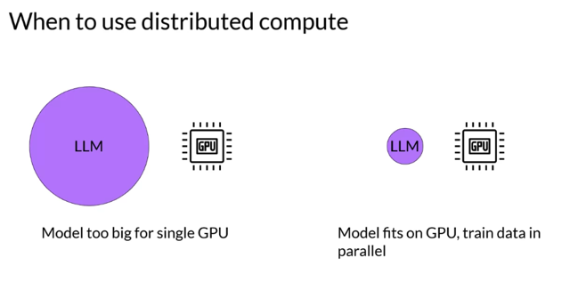</kbd>

> [!NOTE]
> Đại khái là ngay cả khi model có thể fit trên GPU thì vẫn có những lợi ích của
> distributed training

 

<kbd>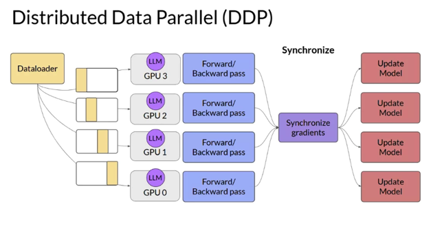</kbd>

> [!NOTE]
> You'll begin by considering **the case where your model is still fits on a single GPU**. The first
> step in scaling model training is to **distribute large data-sets across multiple GPUs** and
> **process these batches of data in parallel**. A popular implementation of this model replication
> technique is **Pytorches distributed data-parallel**, or **DDP** for short. DDP **copy your model
> onto each GPU**and **sends batches of data to each of the GPUs** in **parallel**. **Each
> data-set is processed in parallel** and then a **synchronization step combines the results of
> each GPU**, which **in turn updates the model on each GPU**, which is always identical across
> chips. This implementation allows **parallel computations**across all GPUs that results in
> **faster training**

> [!NOTE]
> Như cũng đã biết bên MLOps Spec, kiểu đang nói là copy model trên nhiều GPU, rồi mỗi GPU
> train một phần data. Sau đó các params sẽ được Sync để update model. Nhưng tất nhiên kiểu
> này yêu cầu GPU phải chứa đủ model bao gồm model' s weights, hyper-params, gradients,
> optimizer states..

 

<kbd>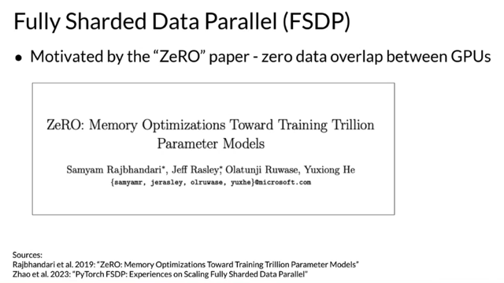</kbd>

> [!NOTE]
> If your model is **too big** for this, you should look into another technique called **modal
> sharding**. A popular implementation of modal sharding is **Fully Sharded Data Parallel,** or
> **FSDP** for short. FSDP is motivated by a paper published by researchers at Microsoft in 2019
> that proposed a technique called **ZeRO**. ZeRO stands for**zero redundancy optimizer**and
> the goal of ZeRO is to optimize memory by distributing or sharding model states across GPUs
> with ZeRO data overlap. This allows you to **scale model training across GPUs** when **your
> model doesn't fit in the memory** of a single chip. Let's take a quick look at how ZeRO works
> before coming back to FSDP.

 

<kbd>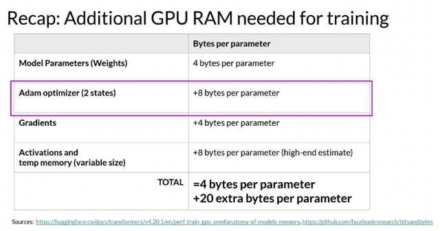</kbd>

> [!NOTE]
> Bài trước đã có nói weight của Adam optimizer là lớn nhất với 8
> bytes / params, gấp đôi các model's weights và gradients.

> [!NOTE]
> Earlier this week, you looked at all of the **memory components** required for training
> LLMs, the **largest memory requirement was for the optimizer states**, which take up
> **twice as much space as the weights**, followed by **weights** themselves and the
> **gradients**. Let's represent the parameters as this blue box, the gradients and yellow
> and the optimizer states in green.

 

<kbd>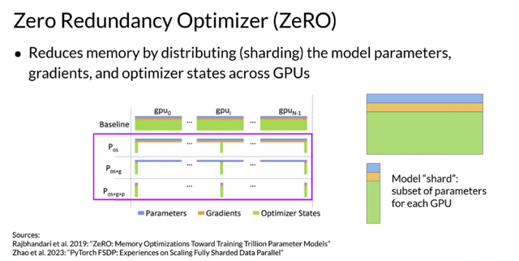</kbd>

> [!NOTE]
> One **limitation** off the **model replication strategy** that I showed before is that **you need
> to keep a full model copy on each GPU**, which **leads to redundant memory
> consumption**. You are **storing the same numbers** on every GPU. **ZeRO**, on the other
> hand, **eliminates this redundancy** by distributing also referred to as **sharding the model
> parameters, gradients, and optimizer** states across GPUs **instead of replicating them**. At
> the same time, the **communication overhead** for a sinking model states stays close to that
> of the previously discussed ADP.

> [!NOTE]
> Đại khái là việc**mỗi GPU chứa một bản copy của model** rõ ràng
> là dẫn đến **redundancy trong việc lưu trữ**. Thì giải pháp **ZeRO**
> mang đến là thay vì copy cùng một model thì nó **'share' 1 subset các
> parameters cho mỗi GPU.**

 

<kbd>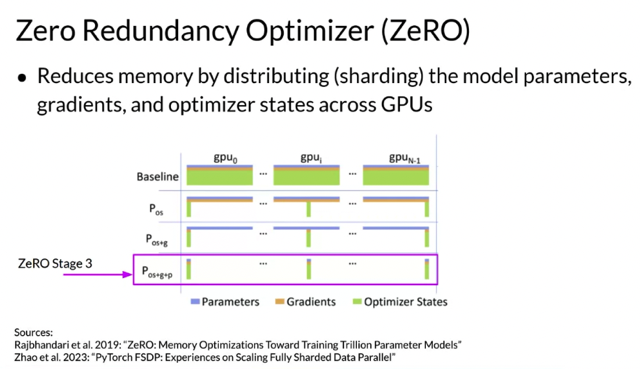</kbd>

> [!NOTE]
> ZeRO offers three optimization stages.**ZeRO Stage 1**, shots **only optimizer states** across
> GPUs, this can **reduce your memory footprint** by up to a factor of **four**. **ZeRO Stage 2** also
> shots the **gradients** across chips. When applied together with Stage 1, this can reduce your
> memory footprint by up to **8 times**. Finally, **ZeRO Stage 3** shots all components including
> the **model parameters** across GPUs. When applied together with Stages 1 and 2, memory
> reduction is linear with a number of GPUs. For example, sharding across 64 GPUs could
> reduce your memory by **a factor of 64**

> [!NOTE]
> Đại khái là với **cấp độ 1**, nó sẽ **shard optimizer's states**, có thể giúp
> **giảm memory xuống 4 lần**. Ở **stage 2**, thêm **gradients** cùng với stage 1
> có thể giúp **giảm 8 lần** memory cần thiết. **Stages 3** thì shard luôn
> **model params**. và ở cấp này, factor sẽ là bằng số GPU - ví dụ có **64
> GPU thì giảm 64 lần.**

 

<kbd>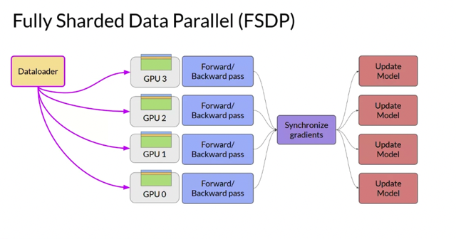</kbd>

 

<kbd>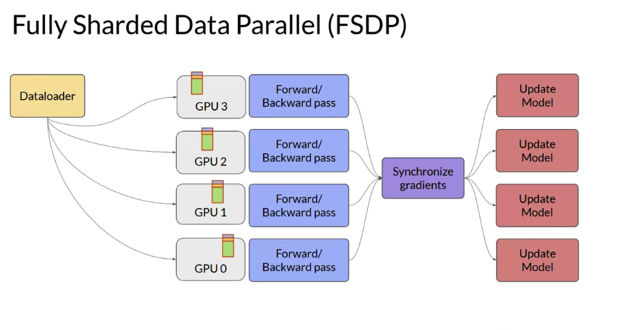</kbd>

> [!NOTE]
> When you use **FSDP**, you **distribute the data across multiple GPUs** as
> you saw happening in DDP. But with FSDP, you **also distributed or shard the
> model parameters, gradients, and optimize the states across the GPU nodes**
> using one of the **strategies** specified in the **ZeRO paper**. With this strategy, you
> **can now work with models that are too big to fit on a single chip**

> [!NOTE]
> Đại khái là với **FSDP** ta **không những chia data cho các GPU** mà còn **chia
> model params, gradients, optimizer**. Do đó với cách này ta **có thể làm data
> distribution với model lớn hơn sức chứa của GPU**

 

<kbd>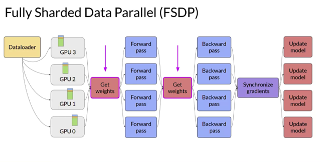</kbd>

> [!NOTE]
> In **contrast to DDP**, where each GPU has **all of the model states required for processing
> each batch of data available locally**, FSDP **requires you to collect this data from all of the
> GPUs before the forward and backward pass**. Each CPU requests data from the other GPUs
> on-demand to materialize the sharded data into uncharted data for the duration of the
> operation. After the operation, you release the uncharted non-local data back to the other
> GPUs as original sharded data You can also choose to keep it for future operations during
> backward pass for example. Note, this requires more GPU RAM again, this is a typical
> performance versus memory trade-off decision. In the final step after the backward pass,
> FSDP is synchronizes the gradients across the GPUs in the same way they were for DDP

 

<kbd>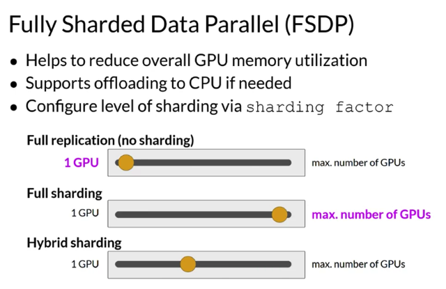</kbd>

 

<kbd>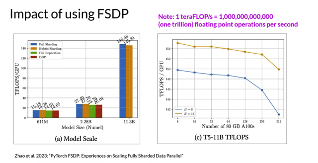</kbd>

> [!NOTE]
> The passage discusses Model Sharding S using FSDP (Fully Sharded Data
> Parallelism), a technique to reduce overall GPU memory utilization when training
> large language models. FSDP allows adjusting the sharding factor to manage
> the trade-off between performance and memory usage. A sharding factor of one
> replicates the full model like DDP (Distributed Data Parallelism), while the
> maximum number of available GPUs enables full sharding, offering significant
> memory savings but increased communication between GPUs.
>
> Tests comparing FSDP and DDP performance in teraflops per GPU show similar
> results for smaller models but demonstrate FSDP's advantage for larger models
> with 11.3 billion parameters, where DDP runs into out-of-memory errors. FSDP
> handles larger models effectively, achieving higher teraflops when lowering
> model precision to 16-bit. As the model size increases across more GPUs,
> communication between chips starts to impact performance, slowing down
> computation.
>
> In summary, FSDP is **suitable** for both **small and large models**, allowing
> **seamless scaling** of model training across multiple GPUs. Researchers explore
> compute optimal models to achieve better performance with smaller models due
> to the complexity and expense of training large models across GPUs.

 

