# Optional Video: Ppo

📊 **Progress:** `23` Notes | `12` Screenshots

---

<kbd>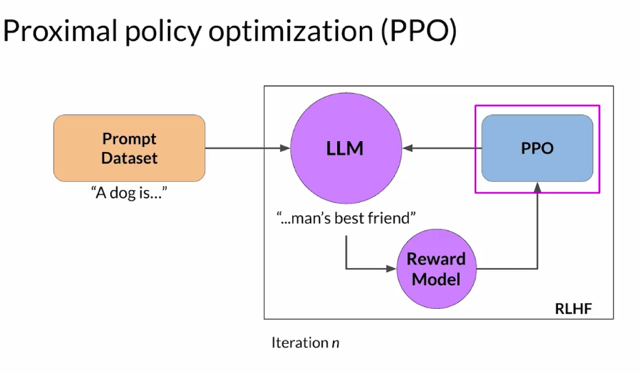</kbd>

> [!NOTE]
> What does PPO stand for and what do those terms mean in the context of
> reinforcement learning? PPO stands for **Proximal Policy Optimization**, which is a
> **powerful algorithm** for **solving reinforcement learning problems**. As the name
> suggests, PPO **optimizes a policy**,**in this case the LLM**, to be **more aligned with
> human preferences**. Over many **iterations**, PPO **makes updates to the LLM**. The
> updates are **small** and**within a bounded region**, resulting in an **updated LLM that is
> close to the previous version**, hence the name Proximal Policy Optimization.
> Keeping the changes within this small region result in a **more stable learning.**

> [!NOTE]
> Đại khái là PPO sẽ handle việc update policy trong trường hợp này
> chính là LLM weights sao cho tối ưu reward = trở nên more align với
> human preferences. Nó sẽ update 'từng chút một' giữa sự thay đổi
> nhỏ và trong một giới hạn (bounded region) nhờ vậy mà quá trình
> training ổn định.

 

<kbd>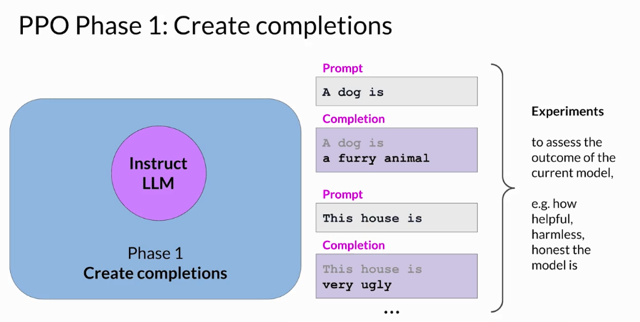</kbd>

> [!NOTE]
> You **start** PPO with your**initial instruct LLM**, then at a high level, **each cycle of PPO
> goes over two phases**. 
>
> In Phase I, the LLM, is used to **carry out a number of
> experiments**,**completing the given prompts**. These experiments **allow you to
> update the LLM against the reward model in Phase II**. Remember that the **reward
> model captures the human preferences**. For example, the **reward can define how
> helpful, harmless, and honest the responses are**. The **expected reward of a
> completion is an important quantity** used in the PPO objective. We **estimate this
> quantity through a separate head of the LLM called the value function.**

> [!NOTE]
> Chưa hiểu lắm, đại khái là trong mỗi PPO iteration sẽ có 2
> phases. Phase 1 là thực hiện một số experiments : Đưa prompt
> cho LLM để nó generate completions
>
> Sau đó nó sẽ estimate chất lượng của các completion thông qua
> value function

 

<kbd>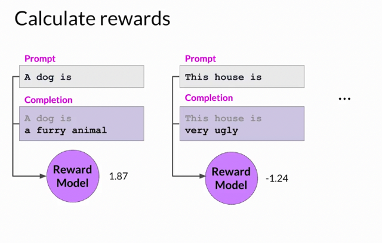</kbd>

> [!NOTE]
> Let's have a closer look at the **value functio**n and the**value loss**. Assume a
> **number of prompts are given**. First, you**generate the LLM responses to the
> prompts**, then you **calculate the reward for the prompt completions using the
> reward model**. For example, the first prompt completion shown here might
> receive a reward of 1.87. The next one might receive a reward of -1.24, and
> so on. You have a set of prompt completions and their corresponding rewards.

> [!NOTE]
> Cụ thể làcho cho model các prompt khác nhau để nó
> generate các completion, sau đó inference vào
> Reward model để output ra scores.

 

<kbd>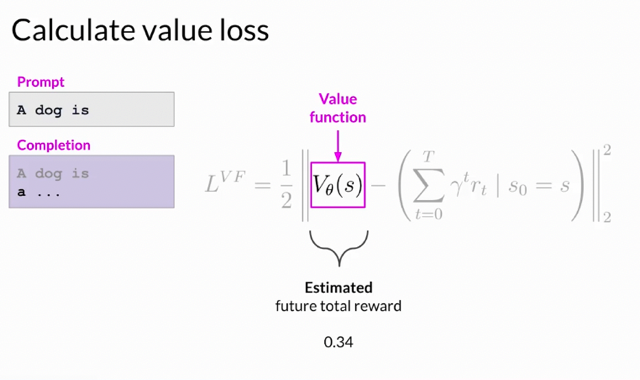</kbd>

> [!NOTE]
> The **value function** **estimates** the **expected total reward** for a g**iven State S**. In
> other words, **as the LLM generates each token of a completion**, you want to **estimate the
> total future reward** based on the **current sequence of tokens**. You can think of this as **a
> baseline to evaluate the quality of completions against your alignment criteria**. Let' s say that
> at this step of completion, the estimated future total reward is 0.34.

> [!NOTE]
> Nói về value function tính value loss. Thì nó sẽ tính / estimate **tổng reward value
> tương lai** (total future reward) **dựa trên các current sequence of tokens** - đóng
> vai trò là **current state S.**Ví dụ prompt 'a dog is' khi model generate 'a..' thì
> estimated total reward là 0.34

 

<kbd>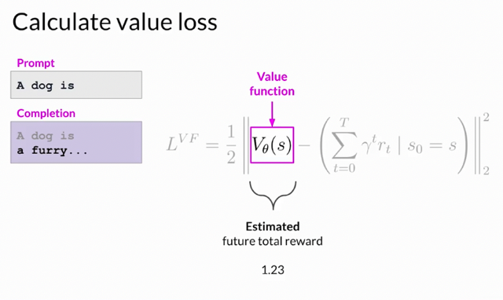</kbd>

> [!NOTE]
> Và với các token được generate tiếp theo thì estimated total
> reward sẽ thay đổi. Ví dụ khi model generate 'furry' thì total
> estimated reward tăng lên 1.23

> [!NOTE]
> With the next generated token,
> the estimated future total reward
> increases to 1.23

 

<kbd>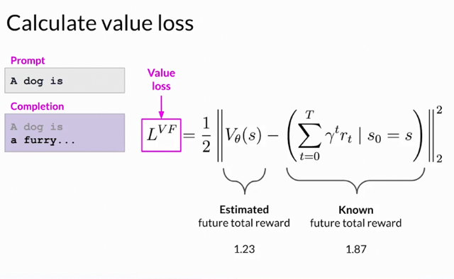</kbd>

> [!NOTE]
> The goal is to **minimize the value loss** that is the **difference between
> the actual future total reward** in this example, 1.87, and its
> **approximation to the value function**, in this example, 1.23. The **value
> loss** makes**estimates for future rewards more accurate**. The value
> function is then used in **Advantage Estimation in Phase 2**, which we
> will discuss in a bit.

> [!NOTE]
> Đại khái bước tiếp Theo nó sẽ tính loss = difference giữa
> estimated total reward và Know total reward (output bởi
> Reward model)

 

<kbd>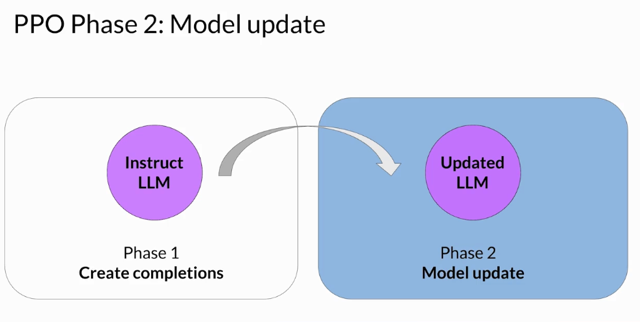</kbd>

> [!NOTE]
> Sure. In Phase 2, you **make a small updates to the model** and**evaluate the impact of
> those updates** on your **alignment goal** for the model. The **model weights updates are
> guided by the prompt completion**, **losses, and rewards**.
>
> PPO also **ensures to keep the model updates within a certain small region** called the
> **trust region**. This is where the **proximal** aspect of PPO comes into play. Ideally, this
> series of small updates will **move the model towards higher rewards**. The**PPO policy
> objective** is the main ingredient of this method. Remember, the objective is to **find a policy
> whose expected reward is high**. In other words, you're trying to **make updates to the LLM
> weights** that **result in completions more aligned with human preferences** and so**receive
> a higher reward**

> [!NOTE]
> Đại khái là phase 2, PPO sẽ update LLM weights và evaluate updated model theo các tiêu chí
> của alignment goal. Quá trình model weight được update được dẫn dắt bởi prompt completion,
> loss và reward.
>
> PPO cũng đảm bảo giữ model update nhỏ gọi là 'trúst region'  và là nguồn gốc của cái term '
> proximal'
>
> Ở trạng thái lý tưởng thì việc này sẽ 'kéo' model theo hướng nhận được reward cao hơn trong
> tương lai.
>
> Và main ingredient của quá trình này là PPO policy objective. Nhiệm vụ chính là tìm ra policy
> sao cho  Expected reward cao hay nói cách khác đó là ta sẽ tìm cách update weight sao cho
> completion trở nên align tốt hơn với human preference từ đó nhận được reward cao hơn.

 

<kbd>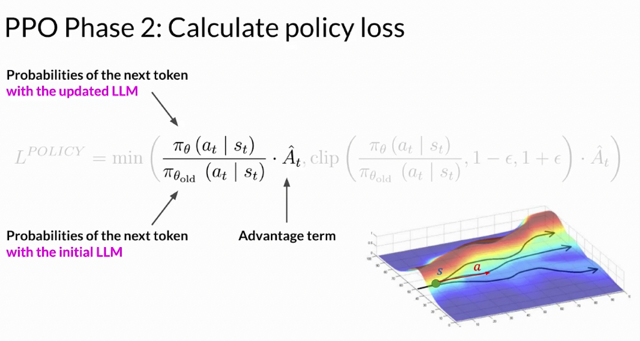</kbd>

> [!NOTE]
> The **policy loss** is the **main objective** that the **PPO algorithm tries to optimize** during
> training. I know the math looks complicated, but it's actually simpler than it appears. Let's
> break it down step-by-step. First, focus on the most important expression and ignore the rest
> for now.
>
> **Pi (a_t|s_t)** in this context of an LLM, is the **probability of the next token a_t given the
> current prompt s_t**. The **action a_t is the next token**, and **the state s_t**is the
> **completed prompt up to the token t**.
>
> The denominator is the **probability of the next token** with the **initial version of the LLM
> which is frozen**.
>
> The **numerator** is the **probabilities of the next token**, **through the updated LLM**,
> which we can change for the better reward.
>
> **A^_t** is called the **estimated advantage term of a given choice of action**. The
> **advantage term** estimates **how much better or worse the current action is** **compared
> to all possible actions at data state**.
>
> We look at the **expected future rewards** of a **completion following the new token**, and
> we **estimate how advantageous this completion is compared to the rest**.
>
> There is a **recursive formula** to **estimate this quantity** based on the **value function** that we
> discussed earlier. Here, we focus on intuitive understanding. Here is a visual representation
> of what I just described. You have a **prompt s**, and you have **different paths to complete it**,
> illustrated by different paths on the figure. The **advantage term** tells you **how better or worse**
> the **current token a_t** is with respect to **all the possible tokens**. In this visualization, the top
> path which **goes higher is better completion**, receiving a **higher reward.** The bottom path
> goes down which is a worst completion.

> [!NOTE]
> Đầu tiên pi_0(a_t | s_t) là probability của next token a_t given s_t là chuỗi current
> completed prompt up to token <t>. Và pi_0 ý nói là tính trên Updated LLM.
>
> Cái dưới pi_old(a_t | s_t) cũng tương tự nhưng mà 'tính' bởi cái reference model - cái
> bản copy của LLM được giữ nguyên để làm cái cong tác KLDivergence.
>
> Còn cái A^_t đại khái là estimated advantage term - ước lượng độ tốt hơn hay tệ hơn khi
> so sánh current action với mọi posible actions. Nó được tính dựa trên value function hồi
> nãy chưa hiểu lắm Nhưng nôm na là nó sẽ đánh giá với mọi possible action t - tức là
> trong các candidate cho token tiếp theo a_t (như cái mũi tên đỏ - a  chỉ các hướng là các
> possible token a_t) thì cái nào sẽ có thể cho reward cao nhất (trong trường hợp này là
> cái ở trên, giúp estimated reward 'đi lên'. Hiểu nôm na là thế

> [!NOTE]
> So I do have a question EK, why does **maximizing this term** lead to **higher rewards**? 
>
> Let'
> s consider the case where the **advantage** is **positive** for the **suggested token**. A positive
> advantage means that the **suggested token is better than the average**. Therefore,
> **increasing the probability of the current token seems like a good strategy**that leads to
> higher rewards. This **translates to maximizing the expression** we have here. 
>
> If the
> **suggested token is worse than average**, the **advantage will be negative**. Again,
> **maximizing the expression will demote the token, which is the correct strategy**. 
>
> So the
> overall conclusion is that **maximizing this expression results in a better aligned LLM**.
>
> Great. So let's just maximize this expression then.**Directly maximizing the expression**
> would **lead into problems** because our calculations are reliable under the **assumption**
> that our **advantage estimations are valid**. The advantage estimates are valid **only when
> the old and new policies are close to each other**. This is where the rest of the terms
> come into play.

> [!NOTE]
> Đại khái giải thích tại sao maximize cái expression này sẽ dẫn đến better policy
> = better aligned model.
>
> Đó là vì nếu advantage đánh giá một suggested token là positive, là tốt. Thì điều
> này sẽ increase probability của token đó, và ngược lại. Chưa hiểu lắm nhưng
> nôm na đó là cách mà nó update LLM weight
>
> Một cái nữa là, nếu chỉ có cái expression này (cái phần đầu của công thức), thì
> vẫn chưa đủ  vì nhận định ở trên cho rằng "việc maximize nó khiến có better
> policy" chỉ đúng khi advantage estimation đúng và điều này chỉ đúng nếu policy
> cũ và mới phải gần nhau đủ. Do đó phải có phần sau của công thức để đảo bảo
> thoả mãn điều kiện này

 

<kbd>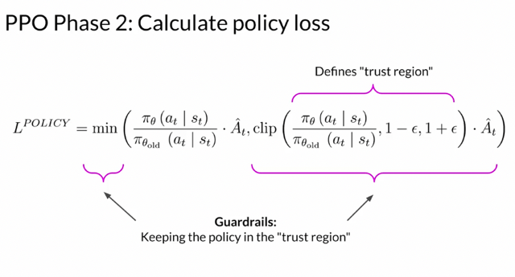</kbd>

> [!NOTE]
> So stepping back and looking at the whole equation again, what happens here is that you**pick the smaller of the two terms.**
>
> The one we just discussed and this second modified version of it. Notice that this second
> expression**defines a region**, where **two policies are near each other**. These extra
> terms are **guardrails**, and simply **define a region in proximity to the LLM**, where **our
> estimates have small errors**. This is called the**trust region**. These extra terms **ensure
> that we are unlikely to leave the trust region**.
>
> In summary, **optimizing the PPO policy objective** results in a **better LLM without
> overshooting to unreliable regions**

> [!NOTE]
> Chưa hiểu lắm nhưng đại khái là nhìn tổng thể sẽ thấy phương
> trình nà là lấy min của 2 term. Thì cái term thứ 2 giống như hành
> lang bảo vệ để sự update LLM weight không vượt quá một phạm
> vi an toàn (trust region) giúp LLM  more aligned với human
> preference nhưng không trở nên reward hacking

 

<kbd>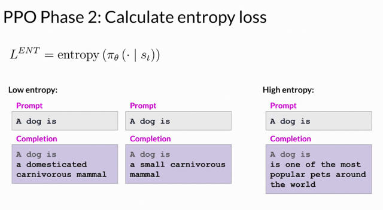</kbd>

> [!NOTE]
> Còn có thêm một cái term nữa nôm na là giúp có vai trò như temperature
> bữa trước, giúp kiểm soát tính creativity của model.
>
> Điểm khác biệt với temperature là entropy control model creativity ở
> training time thay vì inference time như temperaturę

> [!NOTE]
> Yes. You also have the **entropy loss**. While the policy loss **moves the model
> towards alignment goal**, entropy **allows the model to maintain creativity**. If you
> kept**entropy low**, you might end up **always completing the prompt in the same
> way** as shown here. **Higher entropy** guides the LLM towards **more creativity**.
> This is **similar to the temperature setting** of LLM that you've seen in Week 1. The
> difference is that the**temperature influences model creativity at the inference
> time**, while the**entropy influences the model creativity during training**.

 

<kbd>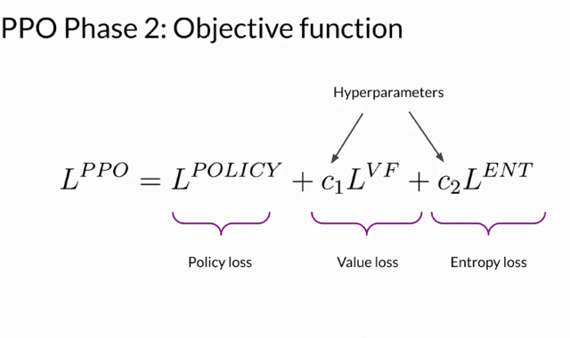</kbd>

 

<kbd>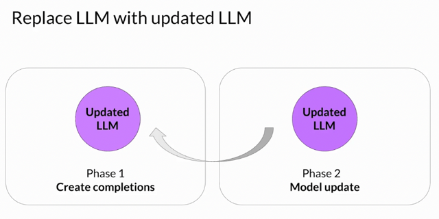</kbd>

> [!NOTE]
> Sau một iteration với 2 phases quá trình
> lại tiếp tục với updated model.

 

