# Parameter Efficient Fine-tuning

📊 **Progress:** `92` Notes | `111` Screenshots

---

## Peft

 

### The passage discusses the concept of **Parameter Efficient Fine-Tuning** (PEFT) in the context of training

> [!NOTE]
> The passage discusses the concept of **Parameter Efficient Fine-Tuning** (PEFT) in the context of training
> Language Model Models (LLMs). The main ideas extracted from the text are as follows:
>
> 1. **Full fine-tuning** of LLMs is **computationally intensive** due to the**large memory requirements** for
> storing model **weights**, **optimizer states, gradients, forward activations, and temporary memory**
> throughout the training process.
>
> 2. **PEFT** is a method that **updates only a small subset of parameters** during **fine-tuning**,
> **reducing the memory requirements** significantly compared to full fine-tuning.
>
> 3. **PEFT** can**freeze most of the model weights**, focusing on fine-tuning **only a subset of existing
> model** **parameters**, or **add a small number of new parameters or layers** and fine-tune only the new
> components.
>
> 4. By using PEFT, the number of trained parameters becomes **much smaller** than the number of
> parameters in the original LLM, making the **memory requirements more manageabl**e, and in some
> cases, it can be performed on a **single GPU.**
>
> 5. PEFT is**less prone to catastrophic forgetting** problems that can occur during full fine-tuning.
>
> 6. Full fine-tuning **results in a new version of the model for every task**, leading to **expensive storage
> problems** when fine-tuning for multiple tasks.
>
> 7. PEFT allows **efficient adaptation of the original LLM** to multiple tasks by**training only a small
> number of weights**and **combining them with the original LLM weights** for inference.
>
> 8. There are t**hree main classes**of PEFT methods: s**elective methods, reparameterization methods,
> and additive methods.**
>
> 9. **Selective methods**fine-tune **only a subset of the original LLM parameters,** but they have**mixed
> performance** and **trade-offs** between parameter efficiency and compute efficiency.
>
> 10. **Reparameterization** methods **create new low rank transformations** of the original network
> weights, **reducing the number of parameters to train.**
>
> 11. **Additive**methods k**eep all of the original LLM weights frozen** and introduce **new trainable
> components,** such as **adapter** methods that **add new trainable layers**or **soft prompt method**s
> that **manipulate the input**to achieve better performance.
>
> 12. **Prompt tuning**is a **specific soft prompt techniqu**e that will be explored in the next lesson.
>
> Overall, the passage highlights the challenges of fine-tuning large LLMs and presents PEFT as an efficient
> approach to handle memory requirements and adapt models to multiple tasks effectively. It also outlines
> the different methods within the PEFT framework and their respective trade-offs.

 

<kbd>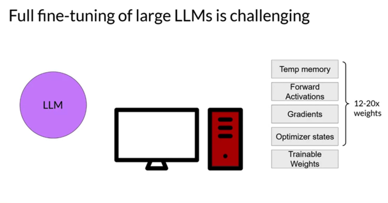</kbd>

> [!NOTE]
> As you saw in the first week of the course, **training LLMs is computationally intensive**.
> **Full fine-tuning requires memory** not just to store the **model**, but various **other
> parameters** that are required during the training process. Even if your computer can hold
> the model weights, which are now on the order of **hundreds of gigabytes** for the largest
> models, you must also be able to allocate memory for **optimizer states, gradients,
> forward activations, and temporary memor**y throughout the training process

> [!NOTE]
> Đại khái là nói rằng việc **full-fine tuning** - trong đó**mọi model's weight đều được tuned** /
> updated cũng **rất tốn memory** khi không chỉ cần chứa đủ **model mà còn là các
> optimizers states, gradients.**....Tổng cộng lại **có thể gấp 10 đến 20 lần model's weight**s

 

<kbd>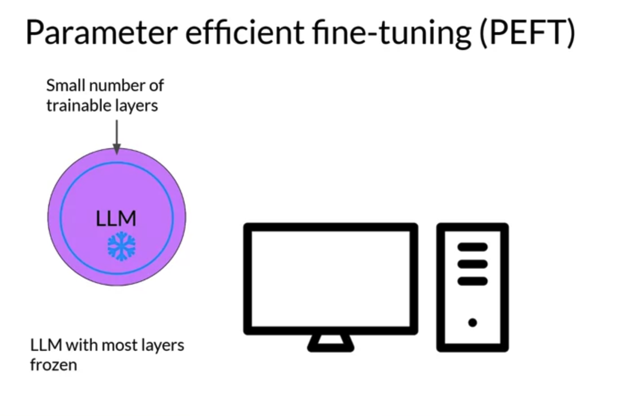</kbd>

> [!NOTE]
> In contrast to full fine-tuning where **every model weight is updated** during
> supervised learning, **parameter efficient fine tuning** methods **only update a
> small subset of parameters**. Some path techniques**freeze most of the
> model weight**s and**focus on fine tuning a subset of existing model
> parameters**, for example, particular **layers** or components.

> [!NOTE]
> Đại khái là **PEFT** thì tiếp cận theo cách khác, **không cần update toàn
> bộ model's params** mà **chỉ một số thô**i. Có thể bằng cách **đóng băng
> phần lớn params** (hay layers), chỉ **chừa ra và fine tune một số khác**

 

<kbd>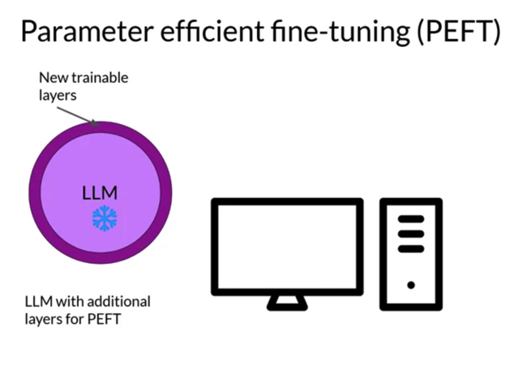</kbd>

> [!NOTE]
> Cách khác thì **hoàn toàn không động tới params cũ luôn** mà **thêm
> vào các trainable layers mới** và**update các params đó.**

> [!NOTE]
> Other techniques **don't touch the original model weights** at all, and
> instead **add a small number of new parameters or layers** and
> **fine-tune only the new components**

 

<kbd>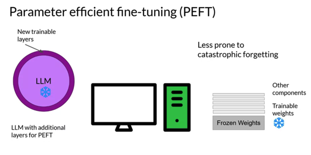</kbd>

> [!NOTE]
> With PEFT, most if not all of the **LLM weights are kept frozen**. As a result,
> the number of **trained parameters is much smaller** than the number of
> parameters in the original LLM. In some cases, just **15-20% of the original
> LLM weights**. This makes the **memory requirements for training much more
> manageable.** In fact, PEFT can often be performed on a **single GPU**. And
> because the original LLM is only slightly modified or left unchanged, PEFT is
> **less prone to the catastrophic forgetting** problems of full fine-tuning

> [!NOTE]
> Đại khái là nhờ vậy mà **số params phải tune thấp hơn nhiều** nên cũng
> **giảm gánh nặng bộ nhớ** đòi hỏi đồng thời **giảm thiểu hiện tượng
> catastrophic forgetting** bởi vì **phần lớn hoặc tất cả các params cũ đều
> được giữ nguyên**

 

<kbd>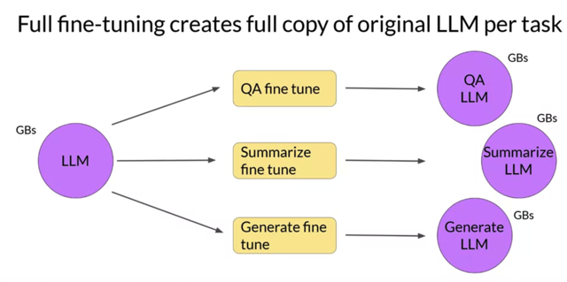</kbd>

> [!NOTE]
> Full fine-tuning **results in a new version of the model for every
> task** you train on. Each of these is the **same size** as the
> original model, so it can **create an expensive storage problem**
> if you're fine-tuning for multiple tasks.

> [!NOTE]
> Đại khái là với full fine tuning thì **mỗi task được tune
> sẽ tạo một model có size tương đương**, thành ra để
> handle tất cả các task, ta phải **tăng khả năng lưu
> trữ lên tương xứng**

 

<kbd>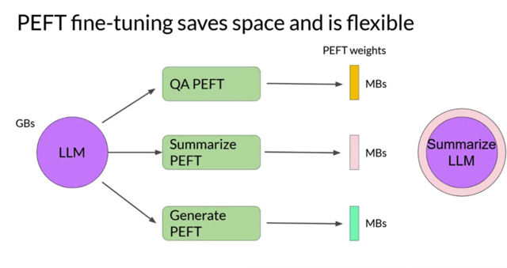</kbd>

<kbd>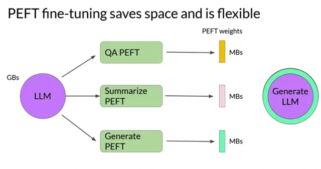</kbd>

<kbd></kbd>

<kbd></kbd>

<kbd>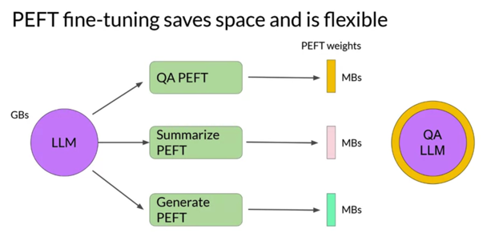</kbd>

> [!NOTE]
> Đại khái với PEFT, **mỗi task kiểu như chỉ tạo thêm một số layers hay weights**.
> Và nó **sẽ được kết hợp với model cũ**. Tuy nhiên v**ới mỗi task khác nhau, kiểu
> như ta có thể rút cái này ra gắn cái kia vào**từ đó**không cần phải tốn quá nhiều
> storage để lưu trữ như full finetuning**

 

<kbd>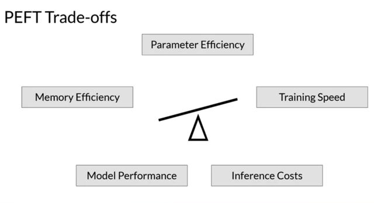</kbd>

> [!NOTE]
> Có nhiều cách làm với các ưu
> nhược điểm khác nhau

 

<kbd>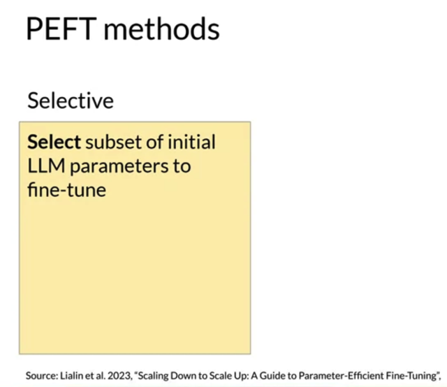</kbd>

> [!NOTE]
> Selective methods are those that fine-tune**only a subset of the original LLM
> parameters**. There are **several approaches** that you can take to identify which
> parameters you want to update. You have the option to **train only certain
> components**of the model or specific layers, or even **individual parameter types**.
> Researchers have found that the**performance of these methods is mixed and
> there are significant trade-offs between parameter efficiency and compute
> efficiency.**

> [!NOTE]
> Kiểu này đại khái là **chỉ lựa một subset các params** của LLM
> để f.t thôi, có nhiều cách làm nhưng**trade off giữa hiệu quả
> và compute efficiency khá cao** nên sẽ không nói tới ở đây

 

<kbd>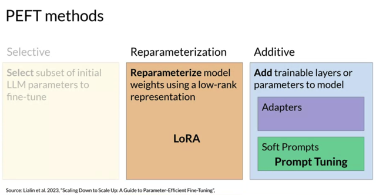</kbd>

> [!NOTE]
> **Reparameterization** methods also **work with the original LLM parameters**, but r**educe
> the number of parameters to train** by \_**creating new low rank transformations of the
> original network weights**\_. A commonly used technique of this type is **LoRA**, which we'll
> explore in detail in the next video. Lastly, additive methods carry out fine-tuning by
> keeping all of the original LLM weights frozen and introducing new trainable
> components. Here there are two main approaches. **Adapter** methods a**dd new trainable
> layers** to the architecture of the model, typically inside the **encoder or decoder**
> components after the attention or feed-forward layers. **Soft prompt methods**, on the
> other hand, **keep the model architecture fixed** and frozen, and **focus on manipulating
> the input**to achieve better performance. This can be done by **adding trainable
> parameters to the prompt embeddings** or keeping the input fixed and **retraining the
> embedding weights**. In this lesson, you'll take a look at a specific soft prompts
> technique called prompt tuning

> [!NOTE]
> Cái **Reparameterization** **cũng làm với model params** nhưng kiểu như **tạo một cái low
> rank transformation của cái model weights** **rồi mới update** điển hình nhất là **LoRA**. Sẽ
> nói rõ ở các bài sau
>
> Cuối cùng là**additive** kiểu như**add thêm layers vào, freeze cái model weights** và **chỉ
> update cái added layer's weight.** Có thể thêm vào Encoder hoặc Decoder.
>
> Còn cách **Soft Prompt** là nó sẽ **chỉ thay đổi cái input**, tức là nó t**rain lại cái embedding
> của iiput hoặc cái prompt**

 

## PEFT TECHNIQUES 1: LoRA

 

### 1. **LoRA** (**Low-rank Adaptation**) is a **parameter-efficient fine-tuning** technique falling into the

> [!NOTE]
> 1. **LoRA** (**Low-rank Adaptation**) is a **parameter-efficient fine-tuning** technique falling into the
> **re-parameterization category**.
>
> 2. LoRA **reduces the number of parameters to be trained** during fine-tuning by **introducing
> low-rank decomposition matrices** alongside the **original weights in self-attention layers** of a
> language model.
>
> 3. The **dimensions of the low-rank matrice**s are set so that **their product approximates the
> attention weights being modified**.
>
> 4. During fine-tuning, the **original model parameters are frozen**, and only the **low-rank matrices
> are updated** using s**upervised learning**.
>
> 5. LoRA fine-tuning results in a **significant reduction in trainable parameters** while **achieving good
> performance gains**, making it **computationally efficient**.
>
> 6. **LoRA matrices are small**, allowing **fine-tuning for multiple task**s, with the ability to **switch out
> matrices at inference time**.
>
> 7. The **choice of rank for LoRA matrices** **impacts model performance**, and **ranks in the range
> of 4-32** offer a**good trade-off between parameter reduction** and **performance preservation**.
>
> 8. LoRA **can be applied to various models** beyond language models.
>
> 9. **Researchers** have found that **LoRA performs well and is a powerful fine-tuning method.**
>
> 10. **LoRA principles** can be **useful in other domains and models**.
>
> 11. The final path method, which focuses on training input text, will be explored next.

 

<kbd>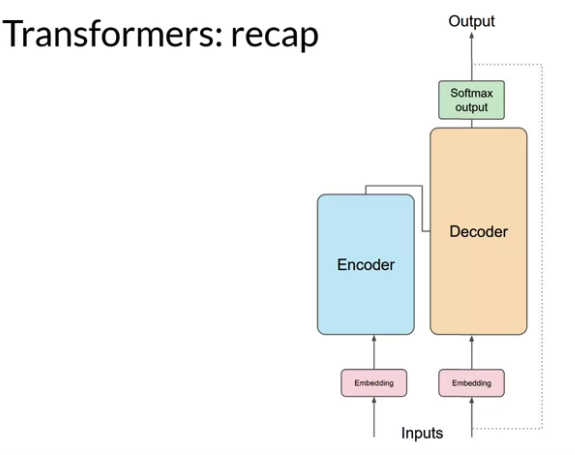</kbd>

> [!NOTE]
> As a quick reminder, here's the diagram of the t**ransformer architecture**
> that you saw earlier in the course.

 

<kbd>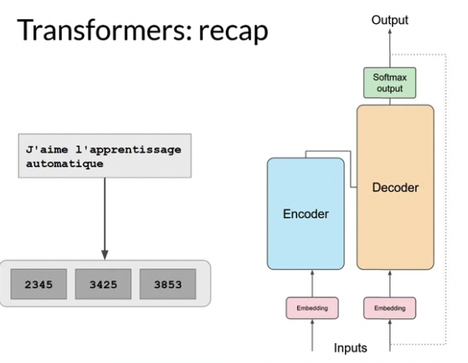</kbd>

> [!NOTE]
> The**input prompt is turned into tokens**, which are then
> **converted to embedding vectors**

 

<kbd>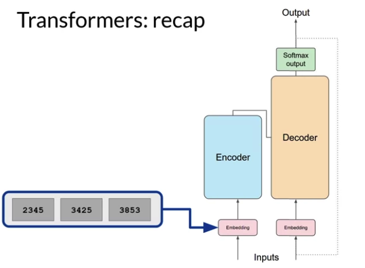</kbd>

> [!NOTE]
> and **passed into the encoder
> and/or decoder parts of the transformer.**

 

<kbd>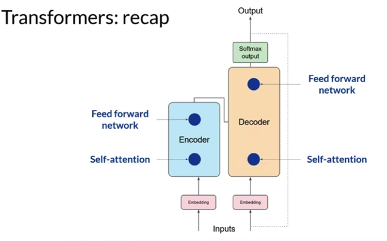</kbd>

> [!NOTE]
> In both of these components, there are**two kinds of neural networks;
> self-attention** and**feedforward networks**. The **weights of these
> networks** are **learned during pre-training.**

 

<kbd>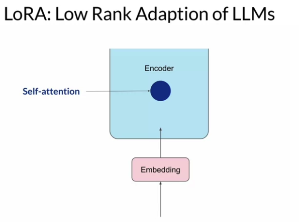</kbd>

> [!NOTE]
> After the **embedding** vectors are created, they're **fed into the
> self-attention layers** where a **series of weights are applied to
> calculate the attention scores.**

 

<kbd>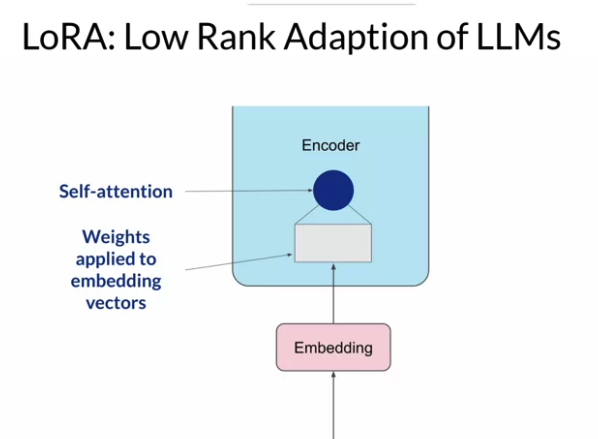</kbd>

> [!NOTE]
> During **full fine-tunin**g, **every parameter
> in these layers is updated.**

> [!NOTE]
> Đại khái là nói lại về**Transformer model** có **3 chỗ** chính có**weight được
> trained** đó là **Embedding** và **Self-Attention** và **Fully-connected layer**.
>
> Và trong **Full-Finetuning**, **toàn bộ các params** này đều được **update**

 

<kbd>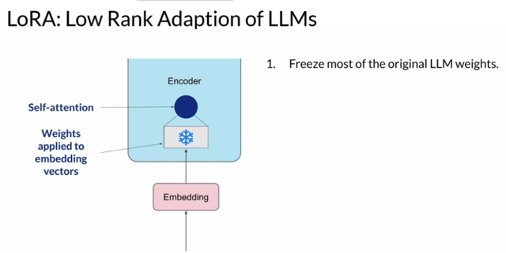</kbd>

> [!NOTE]
> **LoRA** is a strategy that**reduces the number of parameter**s to be trained during
> fine-tuning by **freezing all of the original model parameters** and then \_**injecting a pair of
> rank decomposition matrices alongside the original weights.**\_

> [!NOTE]
> Thì đại khái với **loRA**, nó **sẽ không đụng tới các params cũ**, mà chỉ kiểu như nó tạo một **Low
> rank decomposition matrices** - là một khái niệm trong toán học mô ta cách **dùng matrix U (m, k)
> và V (k, n)** với **k nhỏ hơn nhiều so với m và n** để tính **U.V xấp xỉ cho A (m, n)**. Thì loRa sẽ dùng
> cái phương pháp này với **weight matrix của model's Self-Attention layers**.

 

#### Low-rank decomposition, also known as low-rank approximation, is a **mathematical technique** used to**approximate a given matrix** with**two or more lower-dimensional matrices**. It is a way of **compressing information in the original matrix** while **retaining its essential features**. The resulting **lower-dimensional matrices** are called **low-rank decomposition matrices.**  In the context of neural networks and language models like LLMs, low-rank decomposition can be applied to r**educe the complexity and computational cost of the model**. It is particularly useful when **dealing with large matrices**, as it can **significantly reduce the number of parameters** to be trained while **preserving important patterns and relationships within the data.**  Suppose we have an original matrix **A** of size **m x n.** Low-rank decomposition approximates this matrix u**sing two smaller matrices, U and V,**with dimensions **m x k** and **k x n**, respectively, where k is typically much smaller than both m and n. The **product of U and V (U x V) is an approximation of the original matrix A.**  Mathematically, low-rank decomposition can be represented as:  **A ≈ U x V**  where "≈" denotes the approximation.  The key idea behind low-rank decomposition is to **represent the original matrix A**as a **sum of outer products of columns from U and rows from V**. This allows us to approximate A with a reduced number of parameters (k x (m + n)) instead of the original number of parameters (m x n).  The process of finding the low-rank decomposition involves optimization techniques that seek to minimize the reconstruction error between the original matrix A and its approximation U x V.  In the context of LLM fine-tuning with LoRA (Low-Rank Approximation), low-rank decomposition matrices are introduced alongside the original attention weight matrices in the self-attention layers. These low-rank matrices have reduced dimensions, and their product approximates the attention weights, allowing for efficient fine-tuning with fewer parameters to be updated. By using low-rank decomposition, the fine-tuning process becomes more computationally efficient without sacrificing the performance of the model.

 

<kbd>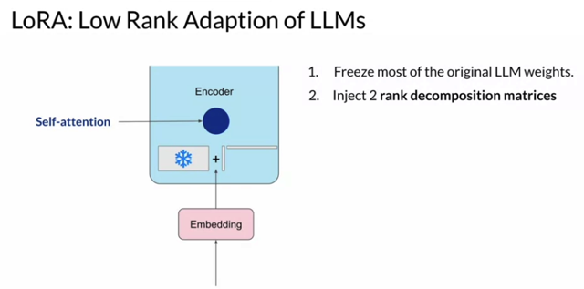</kbd>

> [!NOTE]
> The **dimensions of the smaller matrices** are set so that
> **their product is a matrix** with the **same dimensions as
> the weights they're modifying**.

 

<kbd>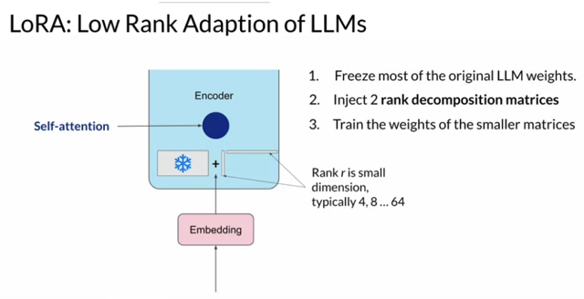</kbd>

> [!NOTE]
> You then**keep the original weights of the LLM frozen** and
> \_**train the smaller matrices**\_ using the **same supervised learning
> process you saw earlier this week.**

> [!NOTE]
> Sau đó nó sẽ**train cái low rank decomposition matrices này**
> bằng **supervised learning** trong quá trình fine-tuning như đã biết

 

<kbd>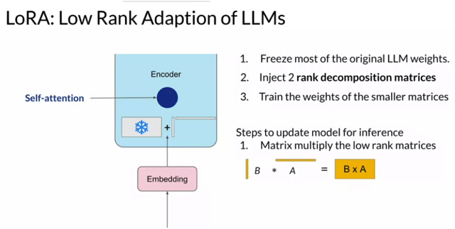</kbd>

> [!NOTE]
> For inference, the **two low-rank matrices** are
> **multiplied together** to create a **matrix with the same
> dimensions as the frozen weights.**

> [!NOTE]
> Đến khi **inference** (là lúc làm việc - predict) nó sẽ **nhân hai cái low
> rank matrices này lại (U.V)** để **add vào cái original matrix (ví dụ A).**

 

<kbd>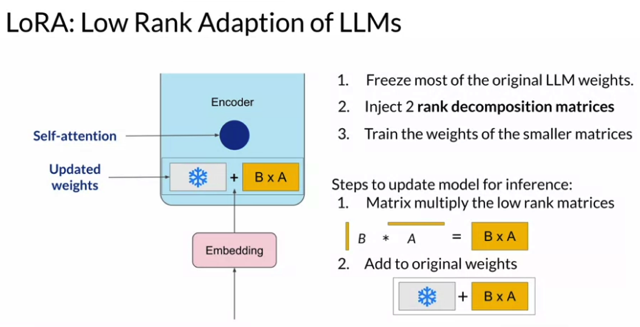</kbd>

> [!NOTE]
> You then **add this to the original weights** and **replace
> them in the model with these updated values**.

 

<kbd>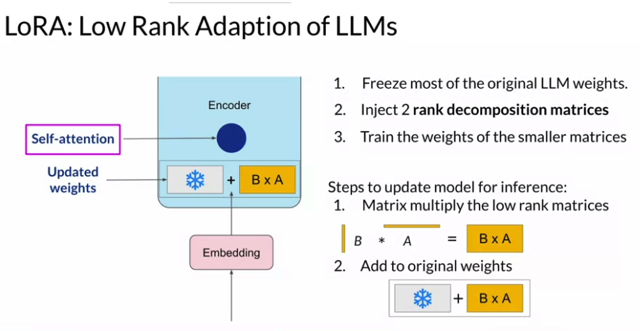</kbd>

> [!NOTE]
> You now have a LoRA fine-tuned model that can carry out your specific task.
>
> Because this model has the same number of parameters as the original, there is
> little to no impact on inference latency.
>
> Researchers have found that **applying LoRA to just the self-attention layers** of the
> model is**often enough to fine-tune** for a task and achieve performance gains.
>
> However,**in principle**, you can **also use LoRA on other components like the
> feed-forward layers.**
> But since **most of the parameters of LLMs are in the attention layers**, you get the
> **biggest savings in trainable parameters by applying LoRA to these weights
> matrices.**

> [!NOTE]
> Thì đại khái là theo nghiên cứu thì c**hỉ cần apply loRA với Self-Attention
> layer là đủ** vì nó **chứa phần lớn params của model**. Tuy nhiên cũng
> **không hại gì khi làm luôn cho các component khác** như**Feed Forward
> layers** phía sau Self Attention

 

<kbd>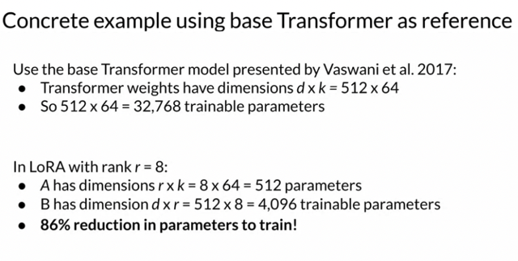</kbd>

> [!NOTE]
> Let's look at a practical example using the **transformer architecture** described in
> the **Attention is All You Need paper.** The paper specifies that the **transformer
> weights** have dimensions of **512 by 64**. This means that each **weights matrix has
> 32,768 trainable parameters**. If you use LoRA as a fine-tuning method with the
> rank equal to 8, you will instead train two small rank decomposition matrices
> whose small dimension is 8. This means that Matrix A will have dimensions of
> 8 by 64, resulting in **512** total parameters. Matrix B will have dimensions of 512 by
> 8, or **4,096** trainable parameters. By updating the weights of these new low-rank
> matrices instead of the original weights, you'll be training 4,608 parameters
> instead of 32,768 and **86% reduction**

> [!NOTE]
> Đại khái là lấy ví dụ từ một layer của b**ase Transformer model** được
> giới thiệu lần đầu tiên năm **2017** trong nghiên cứu mang tên **Attention
> is All You Need**. Trong đó với **weight matrix có shape 512x64** sẽ có
> **32768 params**. Với loRa, số params phải train chỉ còn lại là **512 +
> 4096,** **thấp hơn rất nhiều  - giảm 86%**

 

<kbd>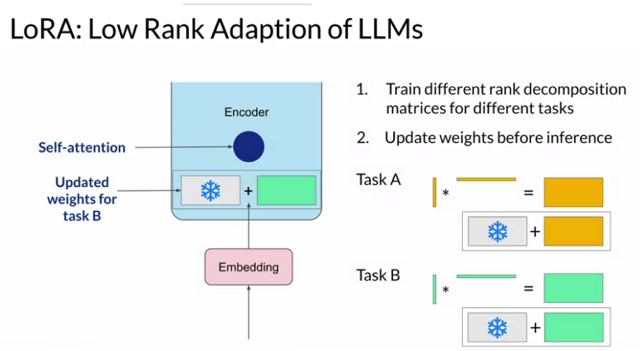</kbd>

<kbd></kbd>

<kbd>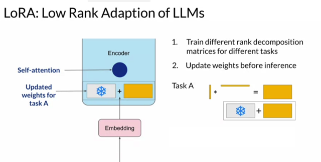</kbd>

> [!NOTE]
> Ý là với cách này, ta **chỉ có thêm một ít weight cần lưu trữ** (thay vì với **mỗi
> task lại đẻ ra một cái model sẽ dẫn đến gánh nặng cho việc lưu trữ** tất cả
> model này). Nên ta **tha hồ mà làm với các task khác nhau**, **mỗi task thành
> một bộ đồ chơi để gắn vào model gốc khi cần inference.**

 

<kbd>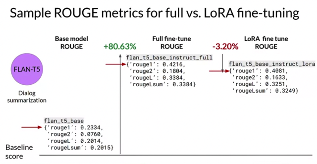</kbd>

> [!NOTE]
> Cho thấy các chỉ số **ROUGE metrics** của LoRA fine-tuning model
> **không kém bao nhiêu so với full tuning model** nhưng lại **giảm
> rất nhiều số params phải train.**

 

<kbd>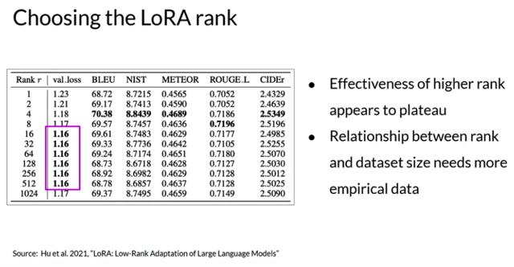</kbd>

> [!NOTE]
> Câu hỏi về **rank nên chọn** đang được **active research**, theo nghiên cứu
> mới nhất với các mức Rank khác nhau và các chỉ số **val_loss**, **BLEU** và
> **ROUGE** scores....cho thấy từ**2-16 là mang lại lợi ích** còn **trở lên nữa
> như ta thấy val_loss không giảm là bao**.

 

## Peft Techniques 2: Soft Prompt

 

### Main ideas from the text:

> [!NOTE]
> Main ideas from the text:
>
> 1. Introduction to **Parameter Efficient Fine Tuning** (PEFT): The text introduces **PEFT**, a method **aimed
> at efficiently updating model weights** or **improving model performance without training every parameter
> again**. PEFT includes two methods: **LoRA** and **Prompt Tuning.**
>
> 2. **Prompt Engineering** vs. **Prompt Tuning**: Prompt Engineering involves**manually crafting language
> prompts** to improve model completions, which can be **time-consuming** and **limited** by the **context
> window.** Prompt Tuning, on the other hand,**adds additional trainable tokens called soft prompts** to the
> prompt and a**llows the supervised learning process to determine their optimal values**, making it more
> efficient.
>
> 3. **Soft Prompts**: Soft prompts are **virtual tokens** in the **continuous multidimensional embedding space**,
> and the model **learns their values during supervised learning** to maximize performance for a given
> task. Soft prompts are **small** on disk and allow **easy swapping of tasks during inference**.
>
> 4. **Performance of Prompt Tunin**g: In comparison to full fine tuning, prompt tuning may **not perform as
> well for smaller language models (LLMs)**, but its performance i**mproves as the model size increases.**
> For LLMs with around **10 billion parameters**, **prompt tuning can be as effective as full fine tuning**,
> offering a significant performance boost over prompt engineering alone.
>
> 5. **Interpretability** of Soft Prompts: A potential concern is the i**nterpretability of learned virtual tokens**.
> While they **don't correspond to known tokens**, words, or phrases in the vocabulary, an analysis shows
> that the **nearest neighbor tokens to soft prompt location**s **form** t**ight semantic clusters**, **suggesting that
> the prompts are learning word-like representations.**
>
> 6. Recap of Week 2: The text briefly summarizes the content covered in week 2, including **instruction
> fine-tuning**, **prompt templates**, e**valuation metrics** (**ROUGE** and **HELM**), and the **effectiveness of PEFT**
> in reducing compute and memory resources during fine-tuning.
>
> Overall, PEFT, particularly **Prompt Tunin**g and **LoRA**, provides **efficient methods** for fine-tuning
> language models, making it**possible to achieve improved performance with reduced computational
> costs.**

 

<kbd>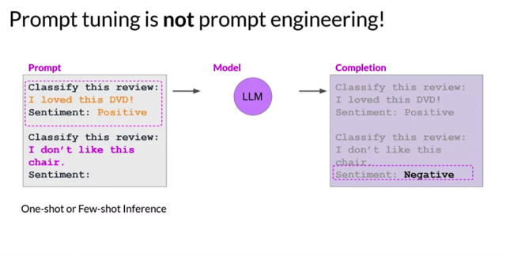</kbd>

> [!NOTE]
> With **LoRA**, the goal was to**find an efficient way to update the weights** of the model
> **without having to train every single parameter again**. There are also **additive
> methods** **within PEFT** that aim to improve model performance without changing the
> weights at all. In this video, you'll explore a**second parameter efficient fine tuning
> method** called **prompt tuning**.
>
> Now, prompt tuning sounds a bit like **prompt engineering**, but they are quite different
> from each other. With prompt engineering, you **work on the language of your prompt** to
> get the completion you want. This could be as simple as **trying different words or
> phrases** or more complex, like **including examples** for **One or Few-shot Inference**.
> The goal is to **help the model understand the nature of the task you're asking** it to carry
> out and to **generate a better completion**. However, there are **some limitations** to
> prompt engineering, as it can **require a lot of manual effort to write and try different
> prompts**. You're also **limited by the length of the context window**, and at the end of the
> day, you may **still not achieve the performance you need** for your task

> [!NOTE]
> Đại khái là nói về cách thứ 2 trong PEFT là **Prompt Tuning**. Trước hết nói lại
> về **Prompt Engineering** trong đó mình sẽ **thử các cách prompt khác nhau**như thử các **từ**, **phrase khác**, hoặc t**hêm example (One-shot)**hay **nhiều
> example (Few-shot inference)**mục đích **để model nó hiểu mình cần nó làm
> gì.** Tuy nhiên **hạn chế của context window** cũng như việc **phải manually thử
> đi thử lại nhiều lần** mà có khi vẫn không đạt được kết quả như ý muốn.

 

<kbd>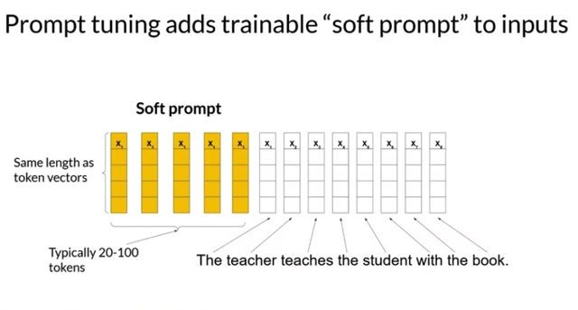</kbd>

> [!NOTE]
> With **prompt tuning**, you add **additional trainable tokens** to your prompt
> and **leave it up to the supervised learning process** to determine their
> **optimal values**. The set of trainable tokens is called a **soft prompt**, and
> it gets \_**prepended to embedding vectors that represent your input text**\_.
> The soft prompt vectors have the **same length as the embedding
> vectors** of the language tokens. And including somewhere between **20
> and 100 virtual tokens** can be sufficient for good performance

> [!NOTE]
> Đại khái là **tạo thêm 20-100 cái embedding
> vector đại diện cho Soft-prompt**và **gắn vào
> embedding tensor** của input words.

 

<kbd>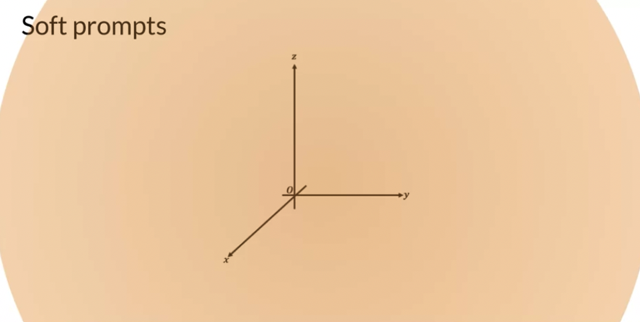</kbd>

<kbd>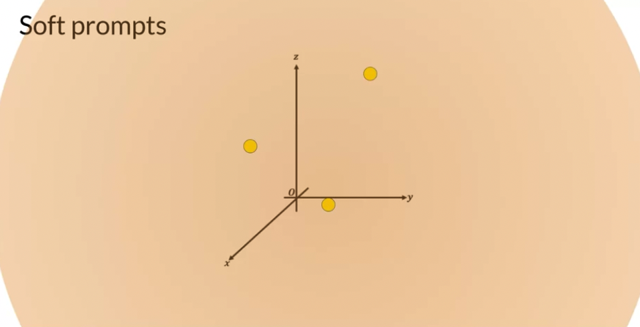</kbd>

<kbd></kbd>

<kbd></kbd>

<kbd>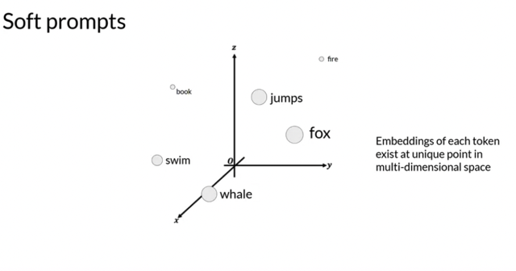</kbd>

> [!NOTE]
> The tokens that represent natural language are hard in the sense that they each correspond
> to a **fixed location in the embedding vector space**. However, the **soft prompts are not
> fixed discrete words** of **natural language**. Instead, you can **think of them as virtual
> tokens that can take on any value within the continuous multidimensional embedding space.**And through **supervised learning**, the model **learns the values for these virtual tokens**
> that **maximize performance for a given task**.

> [!NOTE]
> Chưa hiểu lắm nhưng đại khái **không như prompt thông thường** là các **từ cụ thể** thì
> **soft prompt**sẽ **không phải là một discrete fixed words** **trong ngôn ngữ**kiểu như một
> / những từ cụ thể nào đó, mà nó**là một vector / dãy con số nào đó trong
> embedding space**.

 

<kbd>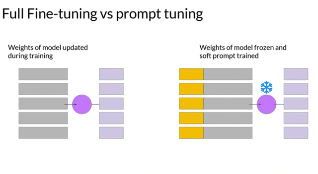</kbd>

<kbd></kbd>

<kbd>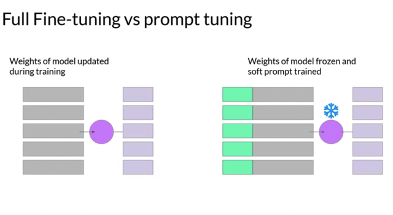</kbd>

> [!NOTE]
> In full fine tuning, the training data set consists of **input prompts and output
> completions or labels**. The weights of the large language model are updated
> during supervised learning. In contrast with prompt tuning, the **weights of the
> large language model are frozen**and the underlying model does not get updated.
> Instead, the **embedding vectors of the soft prompt gets updated over time to
> optimize the model's completion of the prompt.** Prompt tuning is a very parameter
> efficient strategy because **only a few parameters are being trained**. In contrast
> with the millions to billions of parameters in full fine tuning, similar to what you
> saw with LoRA. You can train a**different set of soft prompts for each task and
> then easily swap them out at inference time.**

> [!NOTE]
> Đại khái là giống lora, quá trì**nh fine-tuning chỉ train/update các giá trị của của
> soft-prompt embedding**, **không động tới LLM weights**. Vì mỗi
> bộ soft prompt được train rất nhẹ và **có thể train nhiều task** để tạo **các bộ
> soft-prompt khác nhau để switch qua lại khi perform các task khác nhau lúc inference**

 

<kbd>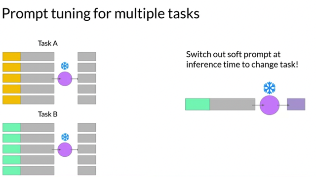</kbd>

> [!NOTE]
> You can **train a set of soft prompts for one task** and **a different set for
> another**. To use them for inference, you **prepend your input prompt with the
> learned tokens** to switch to another task, you**simply change the soft
> prompt**. Soft prompts are **very small on disk,** so this kind of fine tuning is
> **extremely efficient and flexible**

> [!NOTE]
> Switch qua lại có nghĩa là**với các task khác
> nhau**, lúc inference, ta **chỉ việc gắn bộ
> soft-prompt khác vào input embedding**

 

<kbd>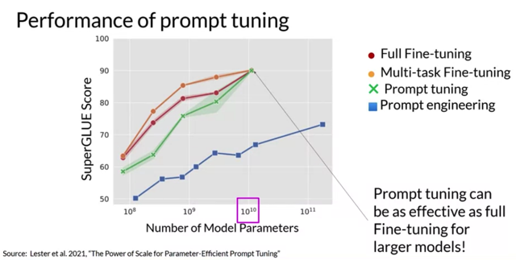</kbd>

> [!NOTE]
> Kết quả cho thấy với **small LLM thì prompt-tuning không
> bằng** nhưng với **LLM lớn hơn thì nó ngang ngửa Full-fine
> tuning**. Và **vượt xa prompt engineering**

 

<kbd>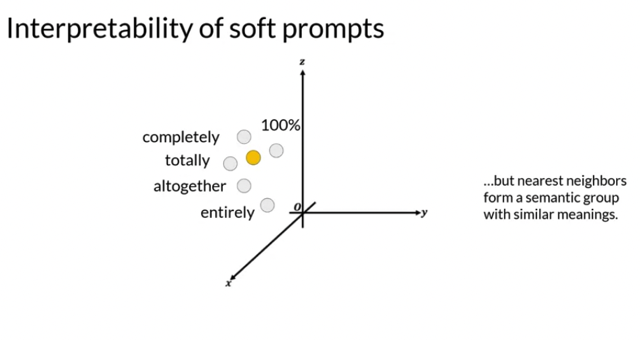</kbd>

> [!NOTE]
> Đại khái là như ta đã nói, **soft-prompt sau khi train** là một v**ector nằm trong embedding
> space** không phải là / ta k**hông biết được nó là hay có represent những từ cụ thể nào**
> trong ngôn ngữ không - nên mới gọi là **virtual token vì nó có thể là bất cứ giá trị nào
> trong không gian liên tục**
>
> (Kiểu như mỗi từ được embedding thành 1 vector, nhưng bốc 1 vector trong embedding
> space ra thì chưa chắc nó map với một từ thuộc ngôn ngữ mình dùng )
>
> nhưng n**ghiên cứu những từ lân cận cho thấy model learn được soft-prompt là "dạng
> dạng" của những từ này**

> [!NOTE]
> One potential issue to consider is the **interpretability** of **learned** **virtual tokens.**
> Remember, because the **soft prompt tokens \_can take any value within the continuous
> embedding vector space**\_. The \_**trained tokens don't correspond to any known
> token**\_, word, or phrase in the vocabulary of the LLM. However, an analysis of the
> **nearest neighbor tokens** to the soft prompt location**shows that they form tight
> semantic clusters**. In other words, the **words closest to the soft prompt tokens have
> similar meanings**. The words identified usually have \_**some meaning related to the
> task, suggesting that the prompts are learning word like representations**\_

 

<kbd>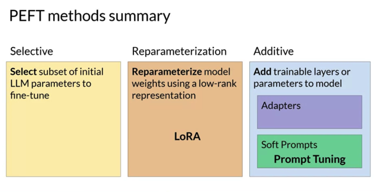</kbd>

> [!NOTE]
> You explored two PEFT methods in this lesson **LoRA**, which uses**rank
> decomposition matrices** to update the model parameters in an efficient way. And
> **Prompt Tuning,** where **trainable tokens are added to your prompt** and the model
> weights are left untouched. Both methods **enable you to fine tune model**s with the
> potential for improved performance on your tasks while using **much less compute
> than full fine tuning methods**. LoRA is b**roadly used** in practice because of the
> **comparable performance to full fine tuning** for many tasks and data sets, and you'
> ll get to try it out for yourself in this week's lab.

> [!NOTE]
> Nói chung**LoRA**và **Prompt tuning**là **hai phương pháp của PEFT**giúp fine
> tune model giúp n**ó cải thiện các task cụ thể một cách hiệu quả** và **tiết kiệm**so
> với**full tuning.** Trong đó **loRa được sử dùng rộng rãi hơn** vì khả năng của nó
> cho thấy**không kém cạnh gì full fine tuning**

 

<kbd>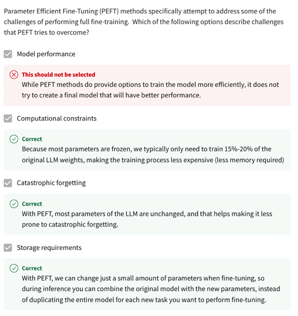</kbd>

 

## Lab 2 Walktrhough

 

### Certainly, here are the main ideas extracted from the provided text:

> [!NOTE]
> Certainly, here are the main ideas extracted from the provided text:
>
> 1. **Lab Introduction and Goals:**
>    - This week's lab involves **trying out fine-tuning with PEFT and LoRA**to enhance the 
> **summarization ability** of the **Flan-T5 model.**
>    - Chris, a colleague, will guide through the lab activities.
>
> 2. **Lab 2 Overview and **Hands-On Approach**:**
>    - Lab 2 focuses on **hands-on experience** with **full fine-tuning** and **Parameter-Efficient 
> Fine-Tuning (PEFT)**using **prompt instructions**.
>    - Goal is to **improve Flan-T5 model** for **summarization** with personalized prompts.
>
> 3. **Model Fine-Tuning:**
>    - For f**ull fine-tuning**, individual model **weights are modified for summarization task** 
> using dataset.
>    - SageMaker instance type: **8 CPU, 32GB (ml.m5.2xl).**
>    - Required libraries installation:**torch, torchdata, evaluates, LoRA, PEFT.**
>
> 4. **Library and Model Setup:**
>    - **Load datasets**, **original model**, and **tokenizer**.
>    - Define **convenience functions** for**data handling and tokenization**.
>
> 5. ****Full Fine-Tuning**:**
>    - **Tokenize** and **create prompts** for dataset elements.
>    - **Utilize TrainingArguments** and **Trainer** from **transformers library** for training.
>    - **Evaluate model performance using ROUGE metric.**
>
> 6. ****Comparative Evaluation**:**
>    - **Compare summaries** generated by**original Flan-T5**, **instruction fine-tuned model**, and 
> **PEFT model**.
>    - **Qualitative assessment** of sample inputs.
>    - Quantitative assessment using **ROUGE metrics.**
> 7. **Parameter-Efficient Fine-Tuning (**PEFT**):**
>    - Introduction of PEFT and its efficiency in resource usage.
>    - **Utilize LoRA rank parameter for PEFT configuration**.
>    - Limit training to only a small portion of model parameters (1.4%).
>
> 8. **Resource Management and Inference:**
>    - Set **is_trainable flag to false** to indicate **inference-only operation**.
>    - This **minimizes resources needed for prediction**, **reducing memory, and computation footprint.**
>
> 9. **Comparison of Model Outputs:**
>    - **Compare human baseline, original Flan-T5, instruction fine-tuned, and PEFT fine-
> tuned model outputs**.
>    - Use **ROUGE** metrics to q**uantitatively evaluate summarization** quality.
>
> 10. **PEFT Performance Evaluation:****- Show PEFT's slightly lower ROUGE performance compared to full fine-tuning**.
>      - Emphasize **PEFT's efficiency in terms of resource usage** and**time savings** for larger 
> datasets.
>
>
> These main ideas cover the lab's content, including the introduction, the objectives of Lab 
> 2, hands-on fine-tuning, resource-efficient PEFT, model comparison, and evaluation 
> using ROUGE metrics.

 

<kbd>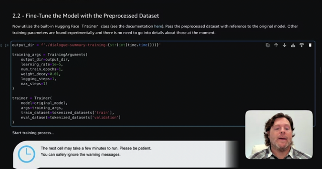</kbd>

 

<kbd>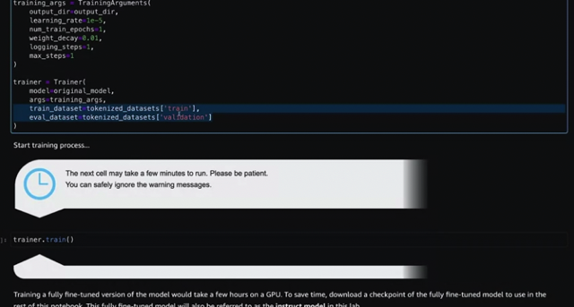</kbd>

 

<kbd>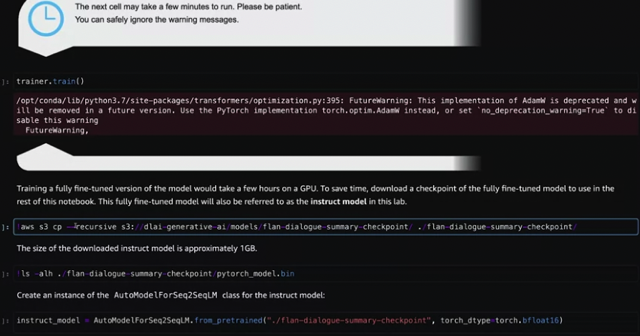</kbd>

> [!NOTE]
> đại khái là để rút ngắn thời gia, download cái pre-train
> (checkpoint) được train với thời gian lâu hơn

 

<kbd>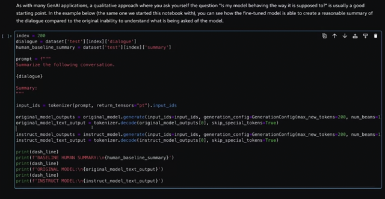</kbd>

 

<kbd>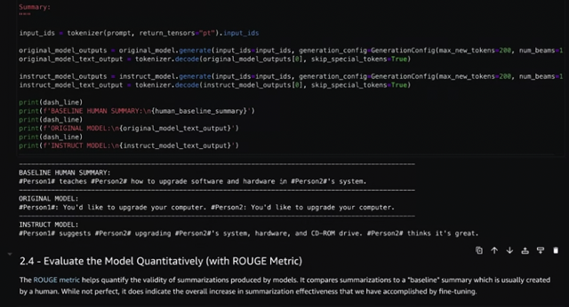</kbd>

> [!NOTE]
> Cho thấy Full-fine tuning model
> đã cải thiện hơn original model ở
> summarization task

 

<kbd>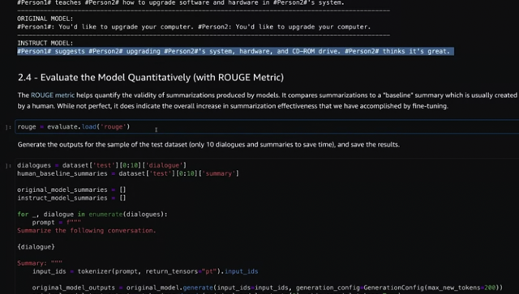</kbd>

> [!NOTE]
> Tiếp, đánh giá
> bằng ROUGE

 

<kbd>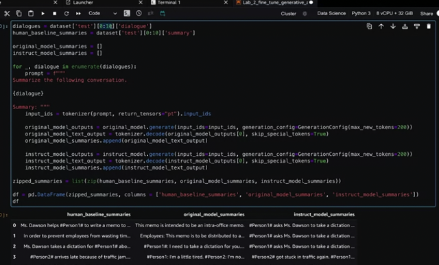</kbd>

> [!NOTE]
> Lấy 10 câu trong tét
> sét để đánh giá

 

<kbd></kbd>

> [!NOTE]
> Cho thấy ROUGE score cao
> hơn original model

 

<kbd>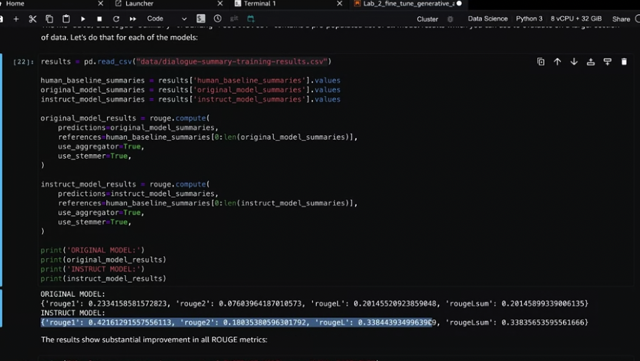</kbd>

> [!NOTE]
> Đánh giá tiếp với nhiều data hơn save
> trong csv file này/ cho thấy ROUGE
> score cao hơn khá rõ

 

<kbd>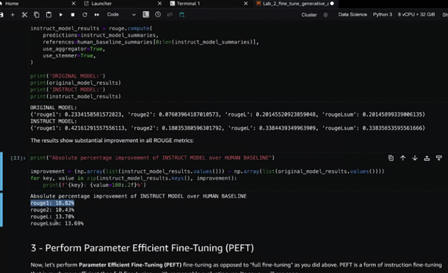</kbd>

> [!NOTE]
> rồi xem thử Improvement
> theo percentage

 

<kbd>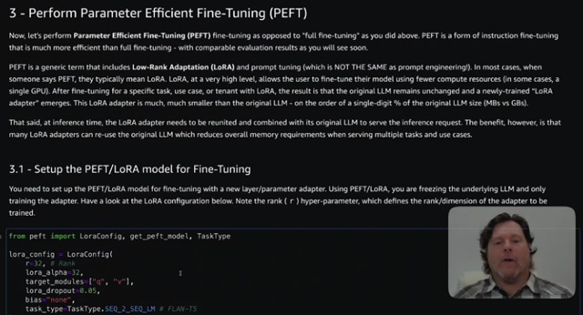</kbd>

 

<kbd>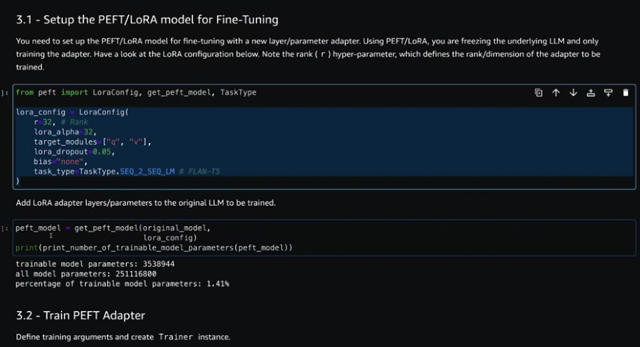</kbd>

> [!NOTE]
> Rank 32

 

<kbd>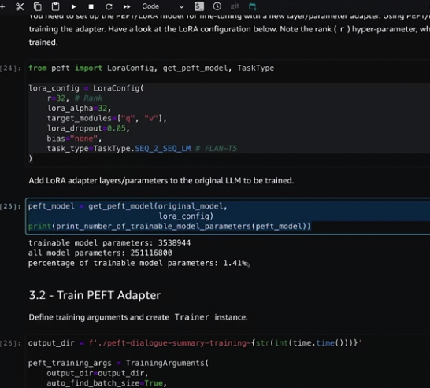</kbd>

> [!NOTE]
> một convenient function của Peft lib tiện cho viêc tạo
> lora model với lora config và original model

 

<kbd>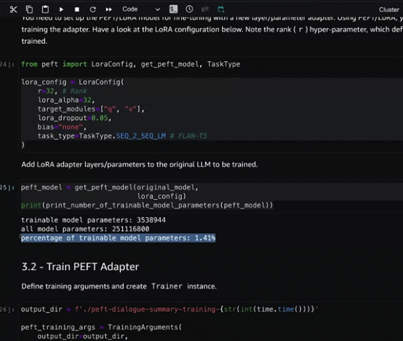</kbd>

> [!NOTE]
> Số trainable
> param chỉ co 1.4%

 

<kbd>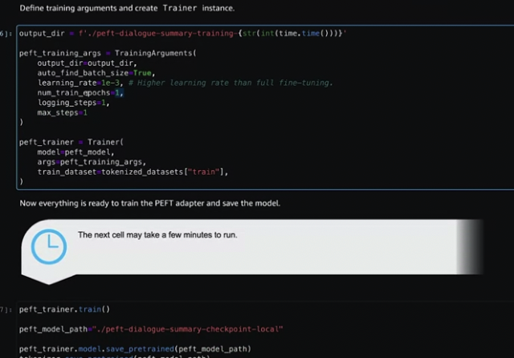</kbd>

 

<kbd>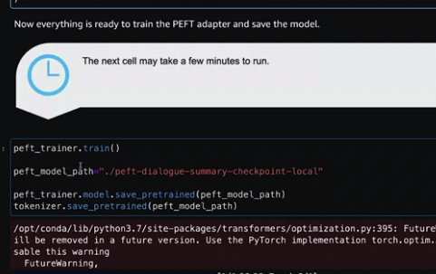</kbd>

> [!NOTE]
> Tương tự, cũng pretrained
> trước, load ra cho nhanh

 

<kbd>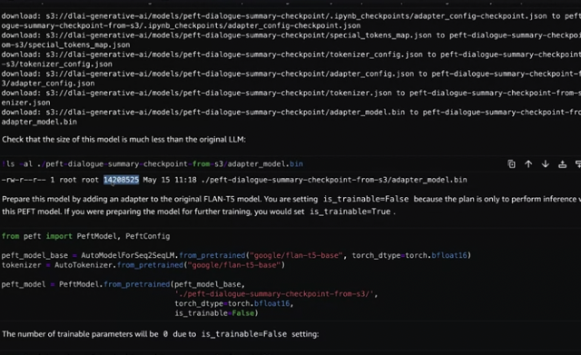</kbd>

> [!NOTE]
> Cho thấy chỉ có 14 megabyte
>
> Khúc này nói ta phải merge vào original model trước khi inference
>
> Và có thể swap các PEFT adapter khi cần cho những task khác nhau

 

<kbd>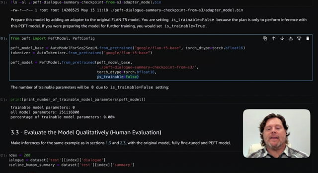</kbd>

> [!NOTE]
> Khúc này nhấn mạnh khi inference
> thì set is_trainable = False để tiết
> kiệm compute resource

 

<kbd>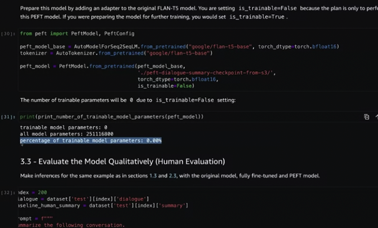</kbd>

 

<kbd>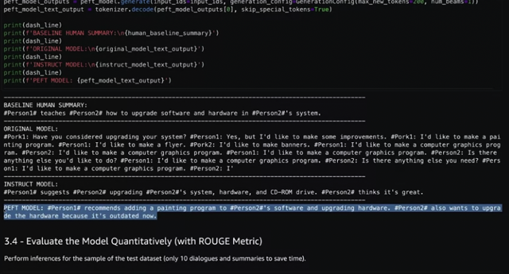</kbd>

> [!NOTE]
> Tương tự test bằng mắt
> người trước, thấy nó ok

 

<kbd>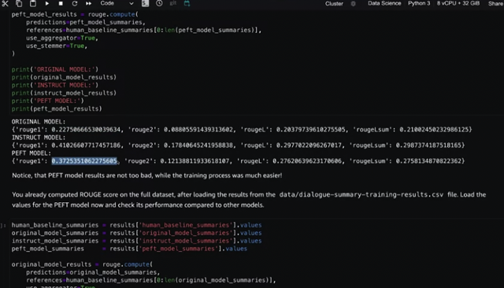</kbd>

> [!NOTE]
> test băng ROUGE score thấy nó kém
> full fine-tuning nhưng không tệ khi nó
> nhẹ hơn nhiều

 

<kbd>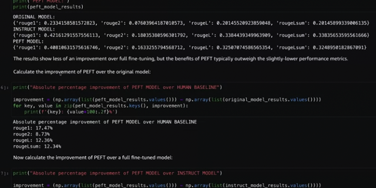</kbd>

 

## Lab 2 - Fine-tune A Generative Ai

> [!NOTE]
> LAB 2 - FINE-TUNE A GENERATIVE AI
> MODEL FOR DIALOGUE SUMMARIZATION

 

### In this notebook, you will fine-tune an existing **LLM** from **Hugging Face**

> [!NOTE]
> In this notebook, you will fine-tune an existing **LLM** from **Hugging Face**
> for **enhanced dialogue summarization**. You will use the **FLAN-T5**model, which provides a **high quality instruction tuned model** and can
> summarize text out of the box. To improve the inferences, you will
> explore a **full fine-tuning approac**h and **evaluate the results** with
> **ROUGE** metrics. Then you will perform **Parameter Efficient
> Fine-Tuning (PEFT),** evaluate the resulting model and see that the
> benefits of PEFT outweigh the slightly-lower performance metrics.

 

#### 1 - Set up Kernel, Load Required Dependencies, Dataset and LLM

 

#### 1.1 - Set up Kernel and Required Dependencies

 

<kbd>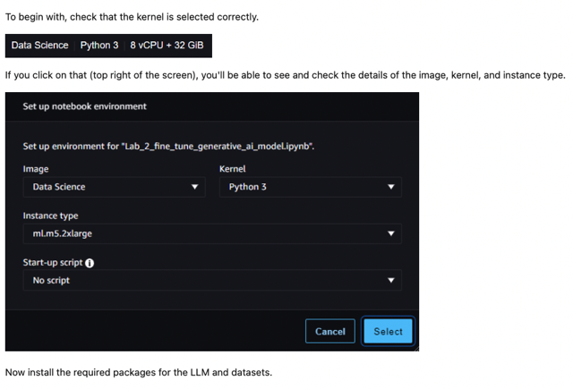</kbd>

 

<kbd>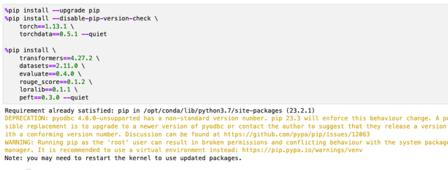</kbd>

 

<kbd>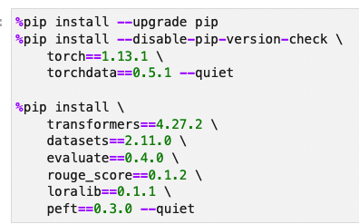</kbd>

> [!NOTE]
> Install các lib cần thiết torch, transformer,
> datasets, evaluate, rouge_score, lorallib, peft.

 

<kbd>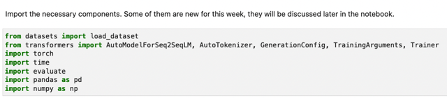</kbd>

 

#### 1.2 - Load Dataset and LLM

 

<kbd>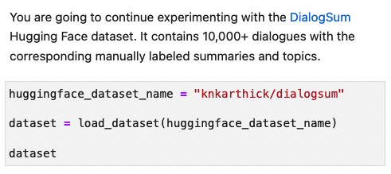</kbd>

> [!NOTE]
> Tiếp tục làm việc với **DialogSum dataset** của **Hugging Face** có
> **10.000 dialogues**được **labeled với summaries và topics**

 

<kbd>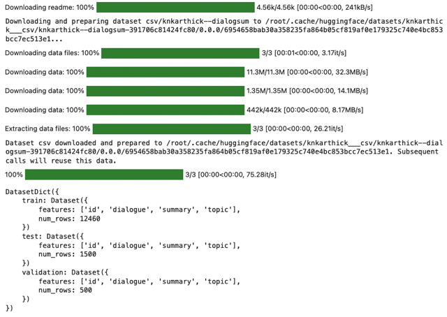</kbd>

 

<kbd>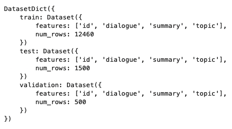</kbd>

> [!NOTE]
> Bộ dataset có cấu trúc như vầy là
> dictionary chứa ba dataset
> train/validation/test. Mỗi bộ có 4 features

 

<kbd>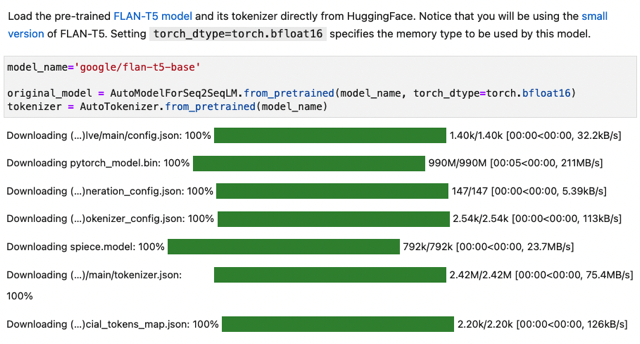</kbd>

> [!NOTE]
> Đại khái là ta sẽ load cái **pre-trained LLM là FLAN-T5** và cái **tokenizer**
> tương ứng từ **HuggingFace** library. Chỉ dùng phiên bản nhỏ của nó, và
> **set memory type** với câu lệnh **torch_dtype = torch.bfloat16**

 

<kbd>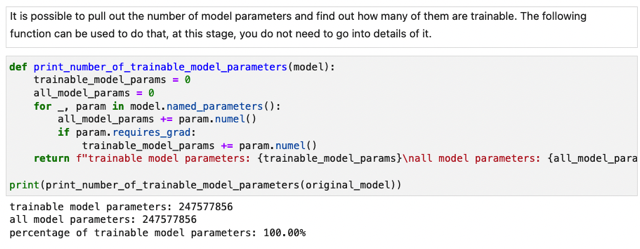</kbd>

> [!NOTE]
> Cho một function để xem s**ố lượng trainable parameter của model**.
>
> Xem sơ qua thì cơ bản là **loop trong các params của model** bằng function model.
> **named_parameters**() và xem cái cái có var **requires_grad** = True thì tính cộng thêm
> vào số lượng**trainable param**s bằng **param.numel()**
>
> Kết quả cho thấy **FLAN-T5** này có 247 triệu trainable params

 

#### 1.3 - Test the Model with Zero Shot Inferencing

 

#### Test the model with the zero shot inferencing. You can see that the **model struggles to summarize the dialogue compared to the baseline summary**, but it **does pull out some important information** from the text which indicates the model **can be fine-tuned to the task at hand**

 

<kbd>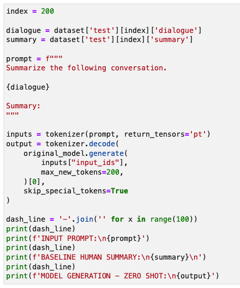</kbd>

> [!NOTE]
> **Lấy trong bộ test set,** dùng index=200 lấy ra data sample, lấy cái cột 
> 'dialogue' sẽ dùng để đưa vào model để predict và 'summary' là summary
> do người tạo, sẽ dùng để so sánh cũng như là finetuning
>
> Tạo prompt theo dạng: 
>
> "Summarize the ...: 
> + dialog +
> Summary:"
>
>
> Bỏ qua **tokenizer()** function của H.F để tokenize.
>
> Bỏ vào model để **predict (generate)**In ra kết quả và human's summary để so sánh

 

<kbd></kbd>

> [!NOTE]
> Đại khái ta nhận xét là nó trả lời**khá tệ** khi
> cơ bản không phải là summarization.

 

#### 2 - Perform Full Fine-Tuning

 

#### 2.1 - Preprocess the Dialog-Summary Dataset

 

<kbd>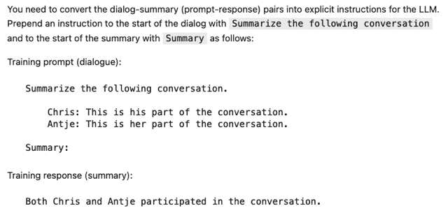</kbd>

> [!NOTE]
> Convert cái**dialog-summary pairs**
> thành dạng **explicit instructions.**

 

<kbd>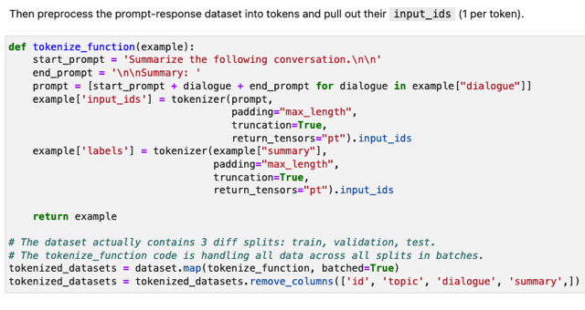</kbd>

> [!NOTE]
> Function**tokenize_function()** sẽ nhận một dataset giúp:  Dùng list comprehension,
> loop qua các dialogue trong cột 'dialogue' của dataset để tạo prompt theo dạng:
>
> "Summarize the ...",   dialog  "Summary":
>
> Bỏ kết qủa **vào tokenizer của Hugging Face** với các hyper-params như padding dùng
> max_length, truncation=True có lẽ là cho phép cắt bớt câu dài. Kết qủa sẽ là list prompt được
> tokenized (thành dạng index)
>
> Sau đó, **gán thành một cột mới 'input_ids'** vào dataset (example)
>
> Lấy cột 'summary' của dataset ra, tokenize tương tự rồi assign vào cột mới có tên '**labels**'
>
> ===
>
> map function này với dataset, như vậy nó sẽ dùng function này để tạo ra hai column mới
> như trên đã nói 'input_ids' chứa tokenized prompt data và 'labels' chứa tokenized 'label' là
> cái human-based summary.
>
> Cuối cùng là drop đi các cột id, topic, dialogue, summary. Chỉ còn lại 2 cột trên

 

<kbd>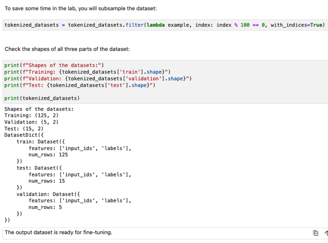</kbd>

> [!NOTE]
> Ở đây để cho giảm thời gian người ta dùng filter để **tạo bộ subdata
> nhỏ hơn** kiểu như cứ 100 cái thì lấy 1 cái.
>
> Có thể thấy, Dataset bây giờ chỉ còn có 2 column, là iput_ids và labels
> và số row chỉ = 1/100 bộ gốc

 

#### Certainly! This piece of code is part of a data preprocessing pipeline for  fine-tuning a Large Language Model, such as GPT-3, on a summarization task.  Summarization tasks involve generating concise and coherent summaries of  longer pieces of text, like conversations in this case. Let's break down the code  and explain its context step by step:  1. **Import Libraries and Set Up Tokenizer:**    Before this code snippet, you would need to import the necessary libraries,  including the Hugging Face `transformers` library, which provides pre-trained  language models and tokenization functions. The code assumes that you have already  imported the required libraries and initialized the `tokenizer` variable.  2. **Tokenize Function:**    The `tokenize_function` is defined to process a single example from your dataset.  The input to this function is an example, which seems to be a dictionary containing at least the following keys:    - `"dialogue"`: A list of strings representing the conversation/dialogue.    - `"summary"`: A string representing the summary of the conversation.  3. **Start and End Prompts:**    The function first creates a `start_prompt` and an `end_prompt`.     These prompts are added to the dialogue to form the input for the model.     The `start_prompt` is added before each dialogue, and the `end_prompt` is added after each dialogue.  4. **Tokenization and Padding:**    - The `prompt` list is constructed by combining each dialogue with the start  and end prompts.    - The `tokenizer` is then used to tokenize the combined prompts. Tokenization  involves breaking the text into smaller units (tokens) that the language model can  understand.    - `padding="max_length"` ensures that the tokenized sequences are padded to the  maximum length within a batch, which is required for efficient batch processing during  training.    - `truncation=True` handles cases where the text is longer than the maximum token  limit, by truncating it to fit.    - The tokenized sequences are returned as PyTorch tensors, specifically the `input_ids`  which are the numerical representations of the tokens.  5. **Label Tokenization:**    The summary text is tokenized in a similar manner as the prompt, and its tokenized `input_ids`  are extracted. These tokenized summaries will serve as the labels during training, where the  model's task is to generate similar sequences.  6. **Updating Example:**    The `input_ids` for both the prompt and summary are added to the example dictionary.  7. **Return Processed Example:**    The modified example dictionary, now including tokenized inputs and labels, is returned  by the `tokenize_function`.  8. **Dataset Preprocessing:**    - The `map` function applies the `tokenize_function` to each example in the dataset in batches.    - The `remove_columns` function removes unnecessary columns like `'id'`, `'topic'`, `'dialogue'`,  and `'summary'` from the processed dataset.    - The `filter` function is applied to further downsample the dataset. It retains only every 100th  example, discarding the rest. This can be useful for speeding up experimentation.  The overall purpose of this code is to process the raw dialogue and summary data into a format  suitable for fine-tuning the language model on the summarization task. It tokenizes the text, prepares  input-output pairs (prompt-dialogue, summary), and creates a dataset that is then ready for training  the language model.

 

#### 2.2 - Fine-Tune the Model with the Preprocessed Dataset

 

<kbd>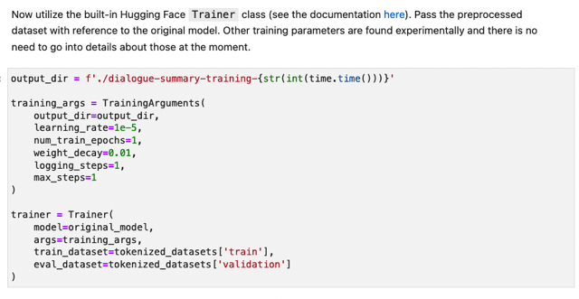</kbd>

> [!NOTE]
> Đại khái là sử dụng **HuggingFace's Trainer class**. Đầu tiên là tạo TrainingArguments 
> với một số parameters khác qua thử nghiệm người ta thấy vậy là good (learning rate, 
> num_train_epochs, ...)
>
> Khởi tạo Trainer với **preprocessed data (train và eval set)**, **original model** và training
> argument.

 

<kbd>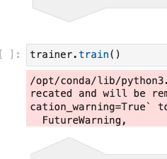</kbd>

> [!NOTE]
> Gọi train() để start training

 

<kbd>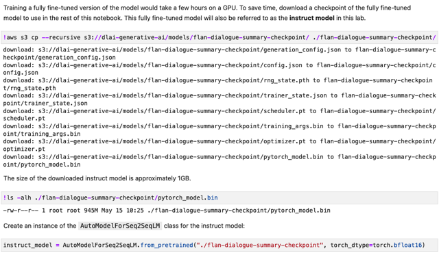</kbd>

> [!NOTE]
> Thì đại khái là train mất nhiều thời gian, nên họ sẽ **load pre-trained (checkpoint) để dùng**.
>
> Và sẽ dùng tên gọi**instruct model** để chỉ cái model này - cái model được **full - finetuning**Để ý dùng **AutoModelForSeq2SeqLM.from_pretrained**(file path chứa cái model checkpoint)

 

<kbd>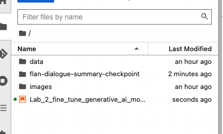</kbd>

> [!NOTE]
> Cái checkpoint download về đây,

 

#### 2.3 - Evaluate the Model Qualitatively (Human Evaluation)

 

<kbd>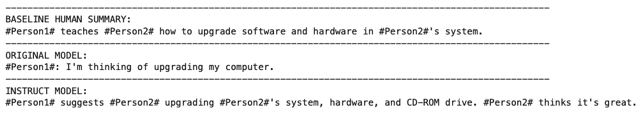</kbd>

<kbd></kbd>

<kbd>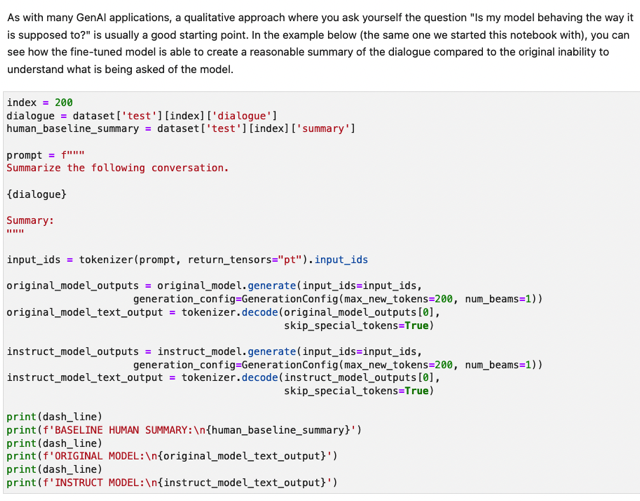</kbd>

> [!NOTE]
> Chú ý là ở trên ta chỉ tạo bộ dataset với hai cột mới, còn dataset cũ nó vẫn còn đó.
>
> Lấy index = 200. Lấy **dialogue** và cái **ground truth human-based label** của nó từ cột
> '**summary**' ra từ bộ**test set.**
>
> Tạo prompt theo pattern như trên 
> (Summary the following + dialog + Summary:)
>
> Dùng **tokenizer để tokenize cái prompt thành input_ids**
>
> Bỏ vào **model.generate()** với **generation config**. 
>
> Dùng **tokenizer để decode nó ra text để xem.**
>
> Kết quả cho thấy model **đã cải thiện** được khả năng đối với task summarization này
> Khi kết quả có thể thấy nó đã có vẻ như là một summary

 

#### 2.4 - Evaluate the Model Quantitatively (with ROUGE Metric)

 

<kbd>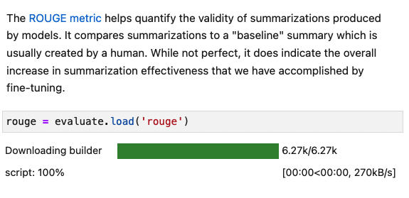</kbd>

> [!NOTE]
> Kế tiếp dùng **ROUGE** metric để **đánh gía một cách hệ thống** hơn vì
> không thể cứ in ra rồi ngồi check được. Thì ROUGE nó sẽ so sánh
> model's prediction với các ground truth label là summary do human
> tạo ra.
>
> Đầu tiên l**oad cái rouge model từ evaluate lib**

 

<kbd>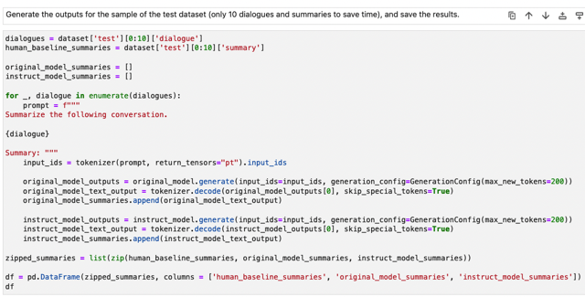</kbd>

> [!NOTE]
> Đại khái là**lấy 10 data sample** đầu tiên từ test set để đưa vào model (original) (tương tự như ở trên chỉ
> khác loop trong 10 cái lần lượt, tạo prompt, tokenize đưa cho model predict và dùng tokenizer
> để decode ra dạng text và bỏ vào cái list original_model_summaries
>
> Làm tương tự nhưng với instruct model - cái đã full fine-tuning
>
> Cũng chuẩn bị 1 list chứa human summary. 
>
> Như vậy ta có bộ summary chuẩn, bộ summary do original model và do full fine tuning model
>
> Xong zip lại và dùng Panda để show ra

 

<kbd></kbd>

 

<kbd>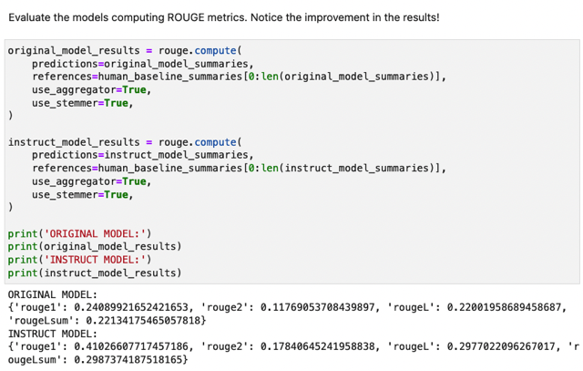</kbd>

> [!NOTE]
> Dùng **rouge library** để check **ROUGE** metric, bỏ vào function **compute ()**
> original model prediction và human summary để xem Rouge score của 
> original model
>
> Và tương tự compute() với instructed model prediction và human summary
> để xem rouge score của fine tunned model
>
> Cho thấy chỉ số của prediction do **Instruct model** cao hơn của **original model**

 

<kbd>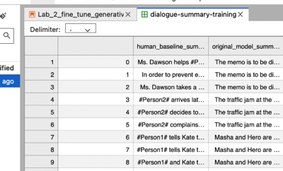</kbd>

<kbd></kbd>

<kbd>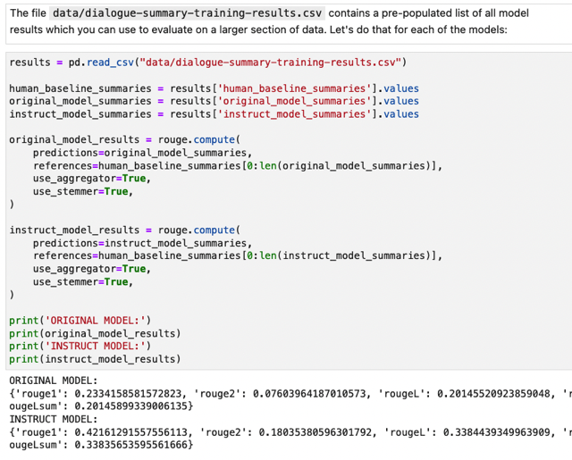</kbd>

> [!NOTE]
> Check với nhiều câu hơn chứa trong file csv,

 

<kbd>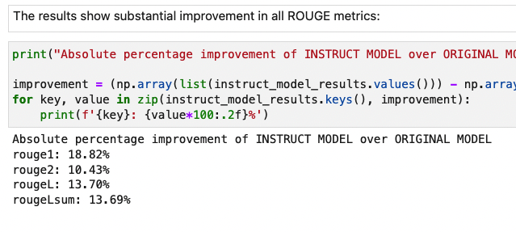</kbd>

> [!NOTE]
> Xem thử improvement theo % cho thấy
> Instruct model quả thật cải thiện hơn

 

#### 3 - Perform Parameter Efficient Fine-Tuning (PEFT)

 

<kbd>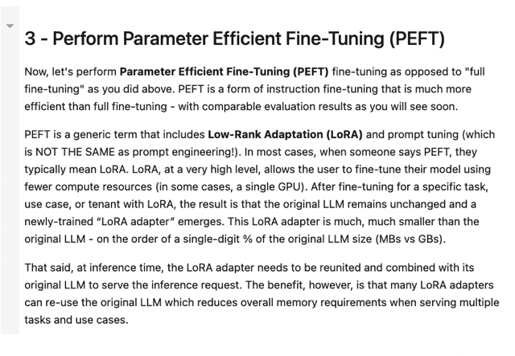</kbd>

> [!NOTE]
> Như đã biết trong lecture, PEFT cho phép fine tuning model để kiểu **không tác
> động tới original pre-trained params** của LLM, mà thay vào đó nó **chỉ train ra thêm
> một bộ params nhỏ** - mà với phương pháp LoRA thì người ta gọi là **LoRA adapter.**
>
> Và vì **nó nhỏ**, nên việc training (fine-tuning) cũng **không tốt kém quá nhiều compute
> expense** cũng như là **yêu cầu lưu trữ**cho những extra newly trained params này.
>
> Với cách làm này, thì **với mỗi specific task khác nhau**, sẽ **tạo ra một bộ params khác
> nhau** và khi dùng người ta sẽ ..kiểu như **gắn nó vào cùng với pre-train params cũ** của
> LLM. Tuy hơn bất tiện nhưng cũng đồng nghĩa là **với task khác nhau người ta chỉ cần
> thay thế bộ LoRa adapter khác**.
>
> Nói thêm là k**hi nhắc đến PEFT khả năng cao người ta đang nói tới LoRA**

 

#### 3.1 - Setup the PEFT/LoRA model for Fine-Tuning

 

<kbd>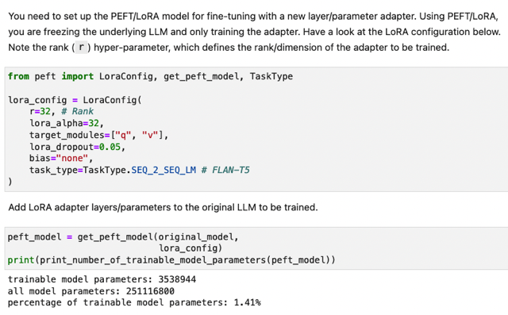</kbd>

> [!NOTE]
> Đầu tiên ra sẽ set up configuration cho LoRa, thông số rank. 
>
> Như đã
> biết trong lecture, phương pháp này đại khái là ví dụ như LLM weight
> matrix là A (m,n) thì nó sẽ train 2 matrix U (m,r) và V(r,n) với r là rank nhỏ
> hơn nhiều m, n. Dẫn tới là U và V có số params nhỏ hơn nhiều A
>
> Ví dụ A = 1000x1000 = 1 triệu params. 
> U = 1000x10: 10.000 params, V = 10x1000 = 10.000 params -> UV chỉ
> có 20.000 parasm nhỏ hơn rất nhiều lần so với 1 triệu.
>
> Và khi train xong, khi dùng Inference, ta sẽ cộng UV (m,r x r,n = m,n)
> vào A.
>
> ===
>
> Các hyper-params khác có thể hiểu sơ như lora_dropout có thể là dropout rate
> liên quan đến việc dùng Dropout để regularization, task_type là SEQ2SEQ vì
> Đang làm task text summarization là sequence to sequence
>
> ===
>
> Cuối cùng là dùng function get_peft_model Theo video walkthrough nói là
> Convenient function của lora giúp tạo một 'lora model' dựa vào model cũ và lora
> config.
>
> In ra xem số trainable params cho thấy số lora params chỉ chiếm 1% của toàn bộ

 

#### 3.2 - Train PEFT Adapter

 

<kbd>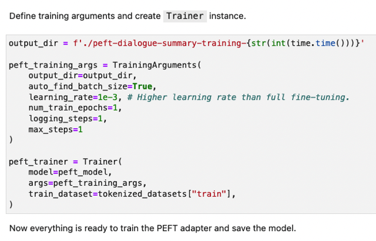</kbd>

> [!NOTE]
> Tương tự, cũng dùng Hugging Face's trainer để train. Với lora model, và
> bộ preprocessed data (bộ data với 2 columns input_ids và labels

 

<kbd>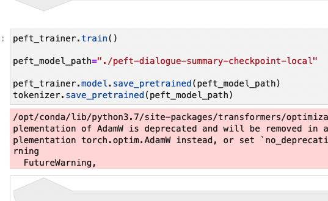</kbd>

> [!NOTE]
> Tương tự load pre-trained
> checkpoint cho nhanh

 

#### 3.3 - Evaluate the Model Qualitatively (Human Evaluation)

 

#### 3.4 - Evaluate the Model Quantitatively (with ROUGE Metric)

 

## Week 2 Quiz

 

<kbd></kbd>

 

<kbd>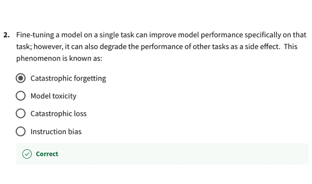</kbd>

 

<kbd>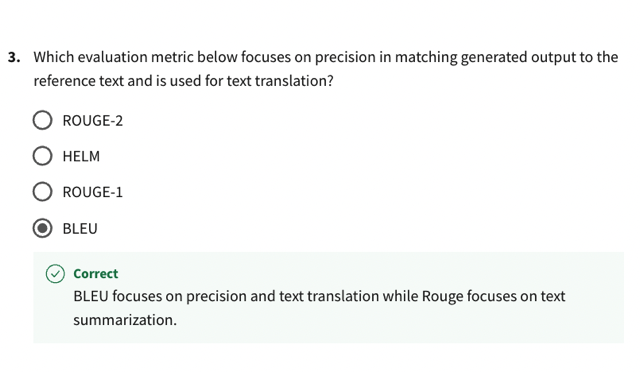</kbd>

 

<kbd>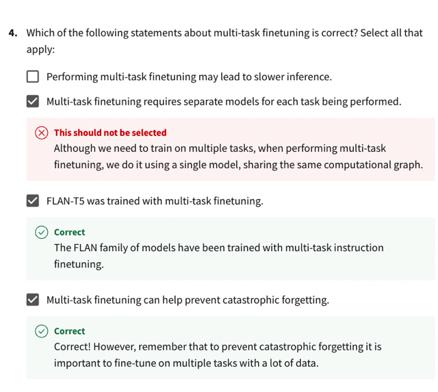</kbd>

 

<kbd>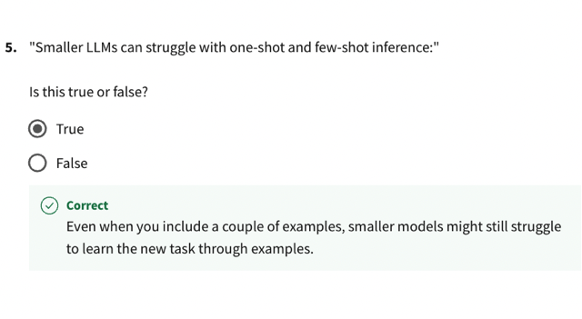</kbd>

 

<kbd>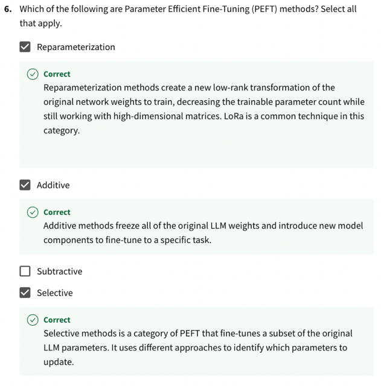</kbd>

 

<kbd>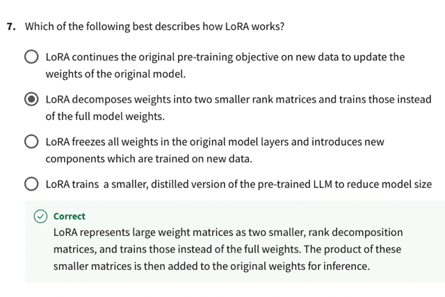</kbd>

 

<kbd>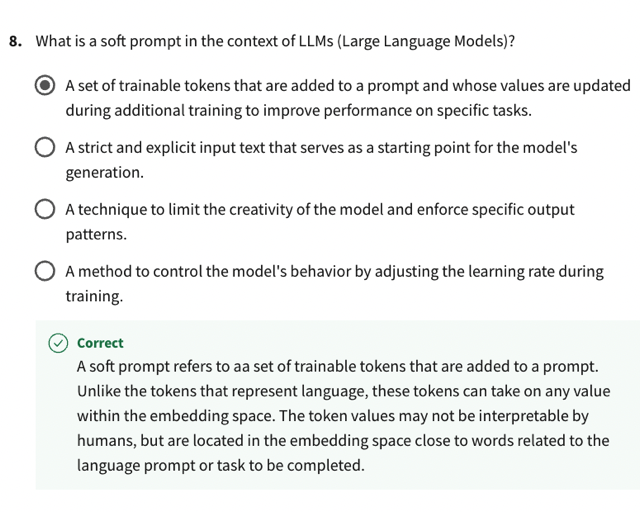</kbd>

 

<kbd>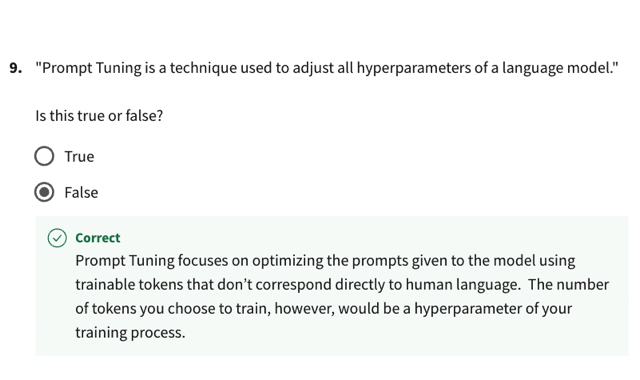</kbd>

 

<kbd>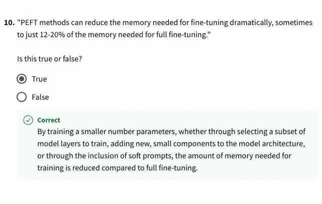</kbd>

 

## Week 2 Res

 

