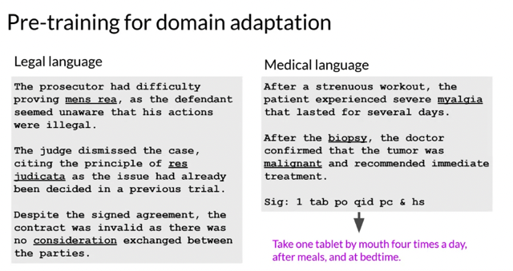
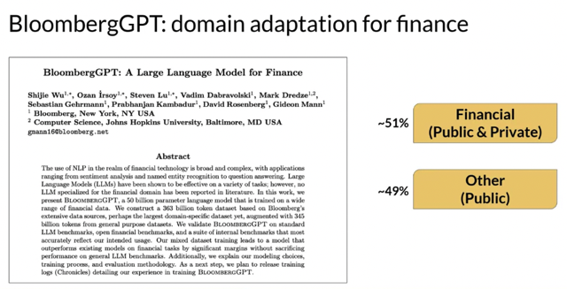
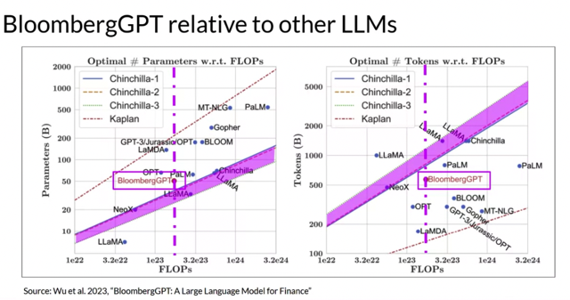
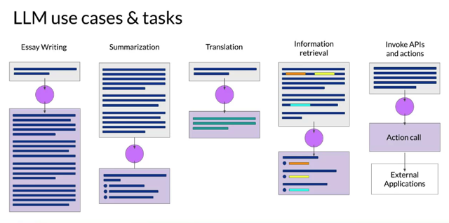
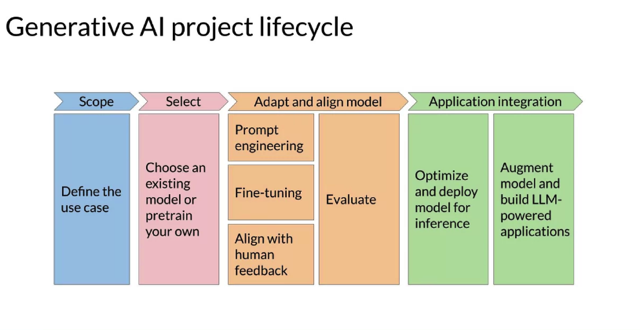
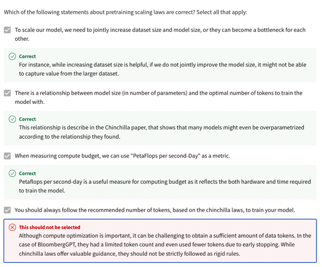

# Pre-training For Domain Adaptation

📊 **Progress:** `4` Notes | `6` Screenshots

---

## The main ideas from this passage are as follows:

> [!NOTE]
> The main ideas from this passage are as follows:
>
> 1. ****Pretraining Your Own Model**:** While working with **existing Language Model Models** (LLMs) **saves time and allows
> for faster prototyping**, there are **situations** where it **may be necessary to pretrain your own model from scratch**. This is
> **especially** **true** when dealing with **specialized domains** that use **specific vocabulary** and**language structures not
> commonly found in general language.**
>
> 2. ****Domain Adaptation for Specialized Domains**:** In certain domains like **law, medicine, finance**, etc., the language
> contains**unique and domain-specific terms** that are not**well-covered in the training data of existing LLMs**. This can lead
> to **difficulties** in **model understandin**g and **usage of these specialized terms.**
>
> 3. ****Benefits of Pretraining from Scratch:**** **Pretraining a model from scratch** allows for**better performance** in highly
> **specialized domains**. It enables the model to**learn the domain-specific vocabulary**and **language structures** that are
> crucial for achieving good results in such areas.
>
> 4. ****BloombergGPT** as a Pretrained Model for **Finance**:** BloombergGPT is an example of a **large language model that
> has been pretrained specifically for the finance domain**. It combines **both finance data** and **general-purpose text data** to
> achieve top results in**financial benchmarks**while maintaining **competitive performance in general LLM benchmarks**.
>
> 5. ****Challenges** in Pretraining for **Specific Domains**:** When pretraining a model for a specific domain, there are
> **challenges related to trade-offs between model size, training data size, and available compute budget**. Real-world
> constraints, such as **limited availability of domain-specific training data**, may necessitate making trade-offs in model
> development.
>
> 6. **Recap of Topics Covered:** The passage briefly recaps the topics covered throughout the week, which include
> **common use cases for LLMs**, the t**ransformer architecture**, **influencing model output at inference time**, g**enerative AI
> project lifecycle**, **pretraining process**, c**omputational challenges**, and**scaling laws for LLMs.**
>
> Overall, the passage emphasizes the **importance of domain-specific pretraining** for **achieving optimal performance in
> specialized areas** and highlights the example of **BloombergGPT** as a**model tailored for finance.**

 

<kbd></kbd>

> [!NOTE]
> Đại khái là **ngôn ngữ trong một số lĩnh vực cụ thể** (chuyên môn như luật, y
> khoa) **sử dụng những từ ngữ chuyên ngành** mà **LLM nếu không được huấn
> luyện qua sẽ không hiểu.** Do đó sẽ cần phải **pretrain LLM model trên những dữ
> liệu chuyên ngành.**

 

<kbd></kbd>

> [!NOTE]
> Đại khái là ví dụ **BloombergGPT** được **pretrain với 51% dữ liệu tài
> chính** và **49% là những dữ liệu chung chung.**

 

<kbd></kbd>

> [!NOTE]
> Đại khái hai biểu đồ để thể hiện **quan hệ tối ưu theo Chinchilla paper** của**compute
> budget và model size (bên trái)** và c**ompute budget và số lượng data (token)**. Với**dải
> màu hồng là tối ưu theo chinchilla research**, và **đường dọc gạch gạch màu hồng là
> compute budget của công ty.** Cho thấy với khía cạnh **model size** thì Bloomberg GPT đã
> t**iệm cận được mức tối ưu**, nếu có thể giảm parameter hơn chút nữa để nó nằm trong
> dải màu hồng thì tốt. Còn với d**ataset thì phải tăng thêm data nữa**, nhưng có điều thể
> hiện rằng trong l**ĩnh vực chuyên môn cụ thể nào đó sẽ có một giới hạn khi không phải
> lúc nào cũng có quá nhiều dữ liệu để dùng.**

 

<kbd></kbd>

 

<kbd></kbd>

 

<kbd></kbd>

> [!NOTE]
> Sai là đúng, không phải lúc nào cũng có đủ data để theo được
> "đường tối ưu" của Chinchilla paper. Model size thì có thể
> giảm bằng optimize được chứ data thì không phải lúc nào
> (lĩnh vực nào) cũng có nhiều

 

