# Pre-training Large Languguage Models

📊 **Progress:** `22` Notes | `14` Screenshots

---

## 1 Generative AI Project Life Cycle: The video introduces the **generative AI project life cycle,** which involves

> [!NOTE]
> 1 Generative AI Project Life Cycle: The video introduces the **generative AI project life cycle,** which involves
> several steps before launching a generative AI app.
>
> 2 **Model Selection**: To **develop the application**, one needs to **choose a model to work with**, either **an
> existing one** or **train a new model from scratch.**
>
> 3 **Pre-Training Phase**: The **initial training process** for Large Language Models (**LLMs**) is referred to as
> **pre-training**, where the model**learns from vast amounts of unstructured textual data**.
>
> 4 **Autoencoding** Models: Autoencoding models (**encoder-only)** are**pre-trained**using **masked language
> modeling**, ideal for tasks that benefit from **bi-directional contexts.**
>
> 5 **Autoregressive** Models: Autoregressive models **(decoder-only**) are pre-trained using **causal language
> modeling**, used for **text generation** and show **strong zero-shot inference abilities.**
>
> 6 **Sequence-to-Sequence** Models: Sequence-to-sequence models use **both encoder and decoder parts of
> the transformer architecture** and are often **used for translation, summarization, and question-answering.**
>
> 7 **Larger Models**: Larger models tend to be**more capable without** **additional in-context learning** or**further training**. Researchers have been **developing larger models** driven by advances in architecture, data
> availability, and computing resources.
>
> 8 **Challenges** of Large Models: Training **enormous models** is **difficult and expensiv**e, making continuous
> training of larger models infeasible.
>
> Overall, the text discusses the **different model architectures**, thei**r pre-training objectives**, and**their applications**,
> as well as the **challenges associated with training large language models**.

 

<kbd>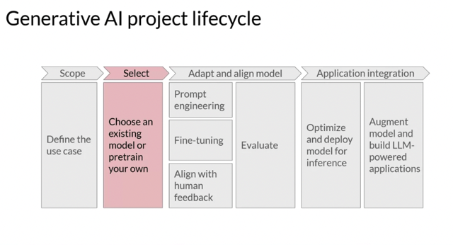</kbd>

 

<kbd>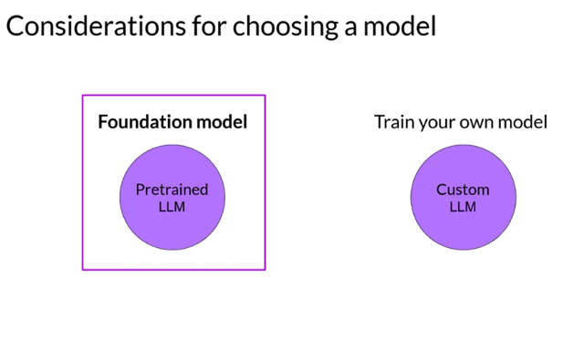</kbd>

> [!NOTE]
> Đại khái là phần này sẽ focus vào việc chọn
> based model để phát triển lên

 

<kbd>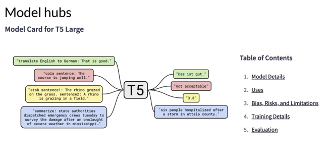</kbd>

> [!NOTE]
> In general, however, you'll begin the process of developing your application using
> an existing foundation model. Many open-source models are available for members
> of the AI community like you to use in your application. The developers of some of
> the major frameworks for building generative AI applications like **Hugging Face** and
> **PyTorch**, have curated h**ubs where you can browse these models**. A really useful
> feature of these hubs is the **inclusion of model cards**, that **describe important detail**s
> including the **best use cases** for each model, **how it was trained**, and **known
> limitation**s. You'll find some links to these model hubs in the reading at the end of
> the week. The exact model that you'd choose will depend on the details of the task
> you need to carry out. **Variance of the transformer model architecture** are suited to
> **different language tasks**, largely because of differences in how the models are
> trained.

 

<kbd>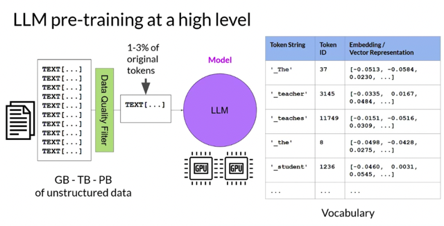</kbd>

> [!NOTE]
> To help you better understand these differences and to develop intuition about which
> model to use for a particular task, let's take a closer look at how large language models
> are trained. With this knowledge in hand, you'll find it easier to navigate the model hubs
> and find the best model for your use case. To begin, let's take a high-level look at the
> i**nitial training process** for LLMs. This phase is often referred to as **pre-training**. As you
> saw in Lesson 1, **LLMs encode a deep statistical representation of language**. This
> understanding is developed during the models pre-training phase when the model **learns
> from vast amounts of unstructured textual data**. This can be gigabytes, terabytes, and
> even petabytes of text. This data is pulled **from many sources**, including **scrapes off the
> Internet and corpora of texts** that have been **assembled specifically for training** language
> models. In this **self-supervised learning** step, the model **internalizes the patterns and
> structures present in the language**. These patterns then **enable the model to complete
> its training objective**, which d**epends on the architecture** of the model, as you'll see
> shortly. During pre-training, the **model weights get updated to minimize the loss of the
> training objective**. The **encoder generates an embedding or vector representation for
> each token.** Pre-training also **requires a large amount of compute and the use of GPUs**.
> Note, when you scrape training data from public sites such as the Internet, you often
> need to**process the data to increase quality**, address **bias**, and **remove other harmful
> content**. As a result of this data quality curation, often **only** **1-3% of tokens are used** for
> pre-training. You should **consider this when you estimate how much data you need** to
> collect if you decide to pre-train your own model.

> [!NOTE]
> Đại khái là nó sẽ **phát triển hiểu biết chung về ngôn ngữ** trong giai đoạn
> **pre-training**, với **data được tập hợp (assemble) từ nhiều nguồn,** với l**earning
> objective cụ thể** thì **tuỳ** từng 'dạng' model như **Autoencoder (encoder only)**,
> **Autoregressive (Decoder only)** hoặc **Seq2Seq (cả Encoder và Decoder)**. Quá
> trình training là **self-supervise**, như ta đã biết khi **target label được lấy từ chính
> input data (che 1 từ đi bắt đoán)** sẽ giúp model**nắm bắt được những deep
> statistical representation of language** đồng thời tạo các **embedding vector của
> các token.**

 

<kbd>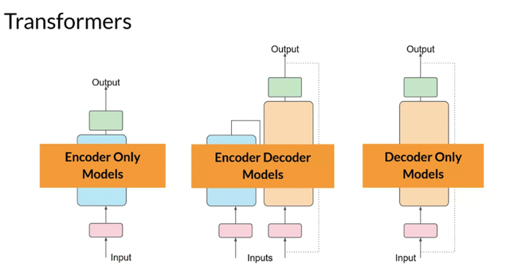</kbd>

 

<kbd>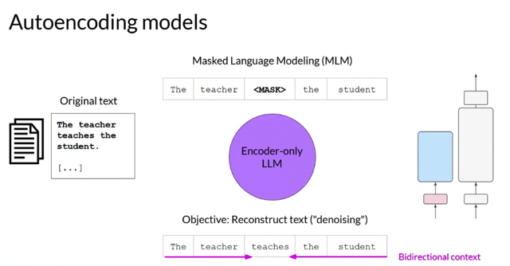</kbd>

> [!NOTE]
> **Encoder-only models** are also known as **Autoencoding models**, and they are **pre-trained**
> using **masked language modeling**. Here, **tokens in the input sequence are randomly masked,**
> and **the training objective is to predict the mask tokens** in order to **reconstruct the original
> sentence**. This is also called a **denoising objective**. Autoencoding models spilled
> **bi-directional representation**s of the input sequence, meaning that the model **has an
> understanding of the full context of a toke**n and not just of the words that come before

> [!NOTE]
> Đại khái cái thể loại**Transformer structure** mà **chỉ có Encoder** không thôi có tên gọi là
> **AutoEncoder**. Nó sẽ được **pretrain bởi cơ chế gọi là Masked Language Modeling (MLM)**,
> khá giống bài toán **CBOW** trong đó các t**ừ input sẽ bị mask / che đi một cách ngẫu nhiên**
> để **training model dự đoán từ đó để reconstruct lại câu hoàn chỉnh**. Objective kiểu này gọi là
> **denoising** **objective**. Và nó sẽ sử dụng **bi-directional**để nắm bắt **full context** chứ không
> chỉ những từ trước đó.
>
> Tuy nhiên khác với CBOW ở chỗ mục đích của Encoder này là **learn general language
> representation** còn **CBOW** chỉ là **learn word embedding.** Và tất nhiên **structure của cái
> này như đã nói là Transformer**, cụ thể là Encoder.
>
> **BERT** chính là dùng cái này - **Bidirectional Encoder Representation From Transforme**r.

 

### **Masked language modeling** and **CBOW** (Continuous Bag of Words) model are \\*both

> [!NOTE]
> **Masked language modeling** and **CBOW** (Continuous Bag of Words) model are **both
> techniques used in natural language processing**, but they are **different approaches** to
> language modeling.
>
> 1 Masked Language Modeling: **Masked language modeling** is a task that involves
> **predicting missing words in a sentence**. In this approach, **certain words** in the input text
> are **randomly masked**, and the model' s goal is to **predict the masked words** based on the
> **context of the surrounding word**s. This technique is prominently used in**transformer-based
> language models** like **BERT** (**Bidirectional Encoder Representations from Transformers**).
> BERT learns **bidirectional context** by considering b**oth the left and right context** of a word.
> By **pre-training on a large corpus**, BERT \\_**learns general language representations**\\_ that can
> then be **fine-tuned** on specific downstream tasks like text **classification**, **named entity
> recognition**, **question answering**, etc.
>
> 2 **CBOW** (**Continuous Bag of Words**) Model: The CBOW model is a type of **word
> embedding model** used to r**epresent words in a continuous vector space**. It takes a **context
> of surrounding words** as input and **predicts the target word** in the middle. The context
> window can be either fixed or dynamically determined. The CBOW model**tries to
> maximize the probability of the target word given the context words**. This approach is
> useful for \\_**generating dense vector representations of words**\\_, which can be further used in
> various natural language processing tasks like l**anguage modeling, sentiment analysis,
> and word similarity calculations.**
>
> In summary, both masked language modeling and CBOW model **aim to capture contextual
> information from surrounding words**, but \\_**they differ in their goals and techniques**\\_. Masked
> language modeling is used for **pre-training large language models** like BERT, while the
> CBOW model is used for **generating word embeddings** in continuous vector spaces.

> [!NOTE]
> Cách làm có vẻ giống nhau, nhưng **khác
> nhau về mục đích và technique**

 

<kbd>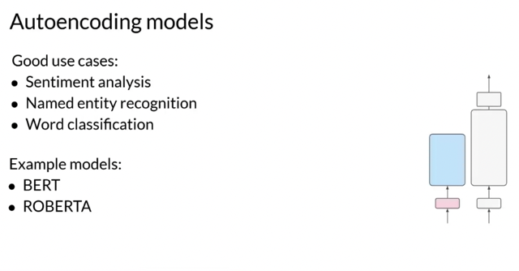</kbd>

> [!NOTE]
> **Encoder-only models** are **ideally suited** to task that benefit from this **bi-directional
> contexts**. You can use them to **carry out sentence classification tasks**, for example,
> **sentiment analysis** or **token-level tasks** like **named entity recognition** or **word
> classification**. Some well-known examples of an autoencoder model are **BERT** and
> **RoBERTa**

> [!NOTE]
> Một số task mà Autoencoding
> model làm rất tốt và BERT là ví
> dụ của dạng này

 

<kbd>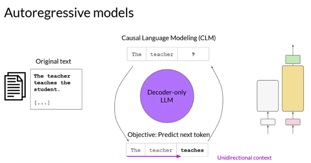</kbd>

> [!NOTE]
> Now, let's take a look at **decoder-only** or **autoregressive** **models**, which are
> **pre-trained** using **causal language modeling**. Here, the **training objective** is to
> **predict the next token** based on the **previous sequence of tokens**. Predicting the
> next token is sometimes called f**ull language modeling** by researchers.
> Decoder-based autoregressive models, **mask the input sequence** and **can only see
> the input tokens leading up to the token in question**. The model has **no knowledge
> of the end of the sentence**. The model then **iterates over the input sequence one by
> one to predict the following token**. In contrast to the encoder architecture, this
> means that the **context is unidirectional**. By learning to predict the next token from a
> vast number of examples, the model **builds up a statistical representation of
> language**. Models of this type make use of the decoder component off the original
> architecture without the encoder.

> [!NOTE]
> Còn dạng transformer **chỉ sử dụng Decoder** thì gọi là **Autoregressive** model,
> nó được **train theo kiểu predict từ chỉ dựa trên những từ trước đó**, (khác với
> encoder khi nó có context của cả trước và sau từ cần đoán). Và nhiệm vụ
> kiểu này được gọi là **full-language model**. Chỉ có tính chất **uni-directional**. Từ
> được predict sẽ **tiếp tục được bỏ vào thành context cho từ cần đoán tiếp
> theo.** Dần model sẽ học được **statistical representation của language.**

 

<kbd>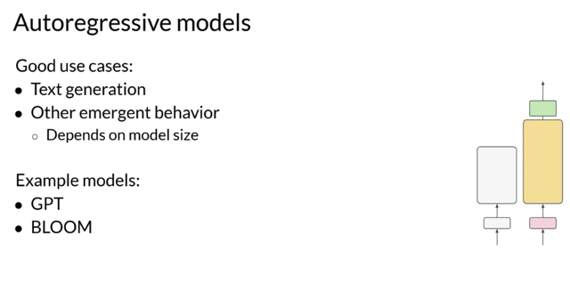</kbd>

> [!NOTE]
> **Decoder-only models** are often used for**text generation**,
> although **larger decoder-only models** show **strong zero-shot
> inference abilities**, and can often **perform a range of tasks well**.
> Well known examples of decoder-based autoregressive models
> are **GPT** and **BLOOM**.

> [!NOTE]
> Những model kiểu này mạnh về **zero-shot inference**
> ability ví dụ **Summarization**, **generating text**. Điển hình
> dạng này là **GPT và BLOOM.**

 

<kbd>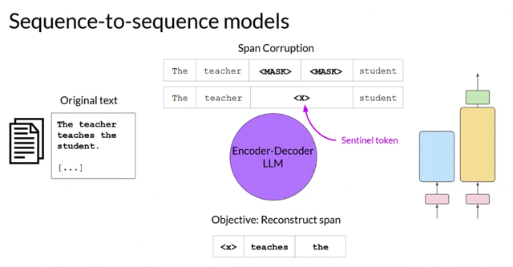</kbd>

> [!NOTE]
> The final variation of the transformer model is the **sequence-to-sequence model**
> that uses **both the encoder and decoder** parts off the original transformer
> architecture. The exact **details of the pre-training objective vary** from model to
> model. A popular sequence-to-sequence model **T5**, **pre-trains the encoder using
> span corruption**, which **masks random sequences of input tokens.** Those mass
> sequences are then **replaced with a unique Sentinel token**, shown here as x.
> Sentinel tokens are **special tokens** added to the vocabulary, but **do not
> correspond to any actual word** from the input text. The decoder is then tasked
> with **reconstructing the mask token sequences auto-regressively**

> [!NOTE]
> Đại khái đối với những model dạng **Sequence2Sequence** có structure **cả encoder và decoder**.
> Và l**earning objective mỗi cái mỗi khác**, ở đây lấy ví dụ của**T5,** đó là nó sẽ **mask 1 chuỗi nhỏ
> trong sequence thay thế bằng một token đặc biệt gọi là Sentinel token**, và model được giao
> nhiệm vụ **reconstruct cái mask token sequence này.**
>
> Cái model kiểu này sẽ **tốt cho những bài toán mà ta đưa vào một body of text** và muốn **tạo ra
> một body of text**: Ví dụ điển hình cho bài toán dạng này là **translation, text summarization**

 

<kbd>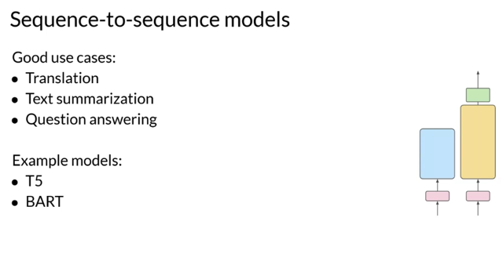</kbd>

> [!NOTE]
> You can use sequence-to-sequence models for translation,
> **summarization**, and question-answering. They are generally useful in
> cases where you have a **body of texts as both input and output.** Besides
> **T5**, which you'll use in the labs in this course, another well-known
> encoder-decoder model is **BART**, not bird.

 

<kbd>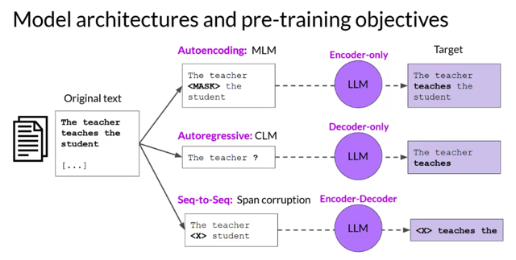</kbd>

> [!NOTE]
> To summarize, here's a**quick comparison** of the **different model architectures** and
> the **targets** off the **pre-training objectives**. **Autoencoding** models are pre-trained
> using **masked language modeling**. They correspond to the **encoder** part of the
> original transformer architecture, and are often used with **sentence classification
> or token classification**. **Autoregressive** models are pre-trained using **causal
> language modeling**. Models of this type make use of the **decoder** component of
> the original transformer architecture, and often used for **text generation.**
> **Sequence-to-sequence** models use **both the encoder and decoder** part off the
> original transformer architecture. The **exact details of the pre-training objective
> vary** from model to model. The **T5** model is pre-trained using **span corruption.**
> Sequence-to-sequence models are often used for **translation, summarization,
> and question-answering**

> [!NOTE]
> Tóm tắt như sau về Cấu trúc
> model, objective và sở trường (loại
> nhiệm vụ mà nó làm tốt)

 

<kbd>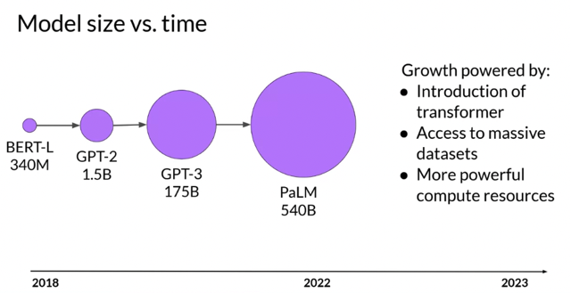</kbd>

> [!NOTE]
> One additional thing to keep in mind is that **larger models of any architecture are
> typically more capable** of carrying out their tasks well. Researchers have found that the
> **larger a model**, the **more likely it is to work as you needed** to **without additional
> in-context learning** or **further training**. This observed trend of increased model capability
> with size has driven the development of larger and larger models in recent years. This
> growth has been fueled by inflection points and research, such as the introduction of
> the highly scalable transformer architecture, access to massive amounts of data for
> training, and the development of more powerful compute resources.

> [!NOTE]
> Model **càng lớn, nó càng có khả năng làm tốt** nhiệm vụ của mình
> mà k**hông cần in-context learning hoặc fine-tuning**. Điều này dẫn
> tới sự ra đời của **các model ngày càng lớn hơn**

 

<kbd>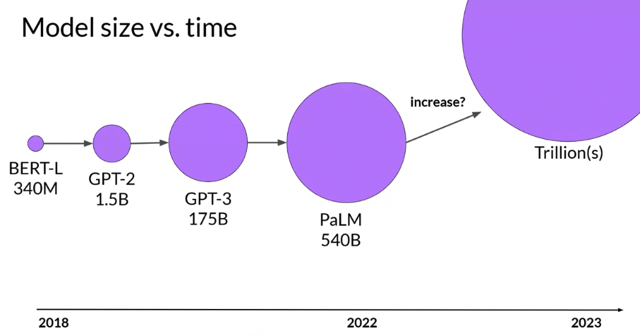</kbd>

> [!NOTE]
> This steady increase in model size actually led some researchers to hypothesize the
> existence of a new Moore's law for LLMs. Like them, you may be asking, can we just keep
> adding parameters to increase performance and make models smarter? Where could this
> model growth lead? While this may sound great, it **turns out that training these enormous
> models is difficult and very expensive**, so much so that **it may be infeasible to continuously
> train larger and larger models.** Let's take a closer look at some of the challenges
> associated with training large models in the next video.

> [!NOTE]
> Đặt ra câu hỏi liệu xu hướng này có kéo dài. Thì bài
> sau sẽ nói đến những **thách thức và chi phí để train
> một cái model to như vậy**

 

