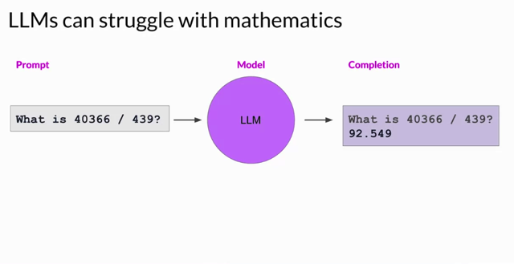
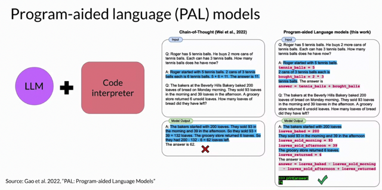
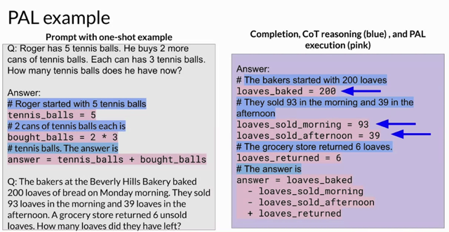
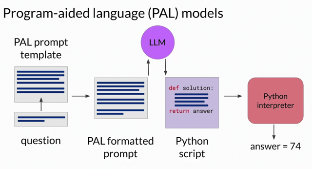
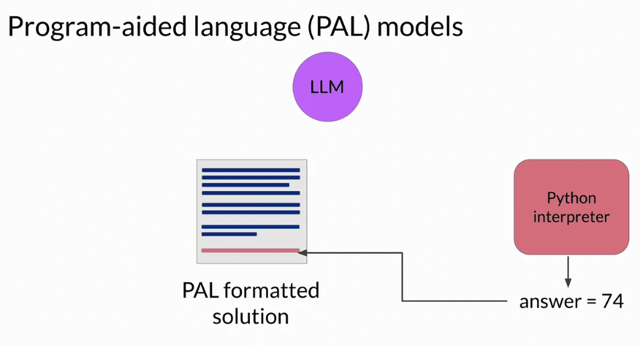
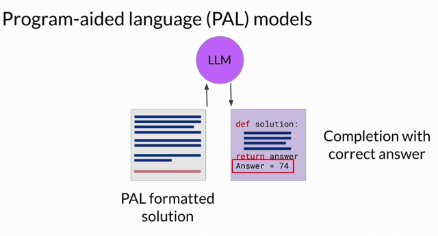
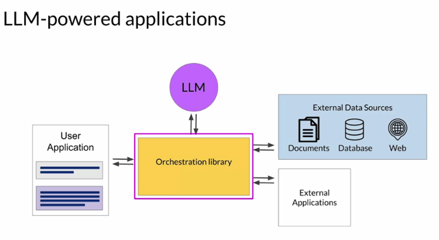
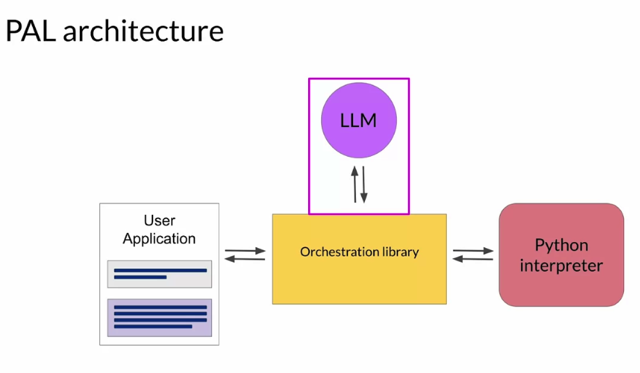
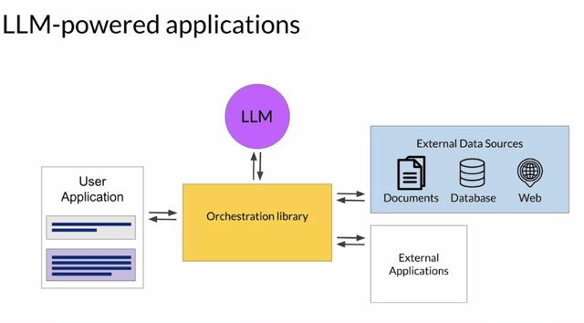

# Program-aided Language Model (pal)

📊 **Progress:** `8` Notes | `9` Screenshots

---

## 1. **LLM's Mathematical Limitations:** LLMs have a restricted capacity to execute

> [!NOTE]
> 1. **LLM's Mathematical Limitations:** LLMs have a restricted capacity to execute 
> arithmetic and other math operations. While "chain of thought prompting" can be used to 
> aid reasoning, it doesn't guarantee accuracy in mathematical calculations.
>
> 2. **Mistakes in Calculations:** LLMs predict tokens based on the training data and not 
> actual computations, leading to potential errors in calculations, which can be detrimental 
> in practical applications like billing or cooking.
>
> 3. **Solution - PAL (Program-Aided Language Models):** An innovative approach called 
> program-aided language models (PAL) was introduced by Luyu Gao and team in 2022. 
> This model combines LLMs with an external code interpreter (like Python) to accurately 
> perform calculations.
>
> 4. **How PAL Works:** 
>    - LLMs generate reasoning and corresponding Python scripts using the "chain of 
> thought prompting".
>    - The Python scripts generated by the model are then executed by an interpreter.
>    - Example completions are illustrated through an image from the original PAL paper.
>
> 5. **Structuring PAL Prompts:** 
>    - Reasoning is written in words, with the corresponding Python code alongside.
>    - The reasoning part starts with a pound sign, allowing it to be recognized as a 
> comment in Python.
>
> 6. **PAL Example:** An example regarding a bakery's bread count is provided, showing 
> the chain of thought in blue and the Python code in pink. The model produces variables 
> and operations to compute the final answer.
>
> 7. **Interaction with an External Interpreter:** 
>    - First, a PAL formatted prompt is created by combining an example and a new 
> question.
>    - The prompt is given to the LLM, which produces a Python script based on the format.
>    - This script is executed by a Python interpreter to get the accurate answer, which is 
> then appended back to the original prompt.
>    - The combined information is given back to the LLM, ensuring it provides the correct 
> answer.
>
> 8. **Advantages of PAL:** For problems involving intricate math operations, PAL ensures 
> the calculations done by applications are reliable and accurate.
>
> 9. **Automating the Process:** The manual transition between LLMs and the interpreter 
> can be managed by an orchestrator. This system can initiate calls to external sources or 
> applications and take actions based on the LLM’s output.
>
> 10. **Complex Applications:** While PAL focuses on executing Python code, real-world 
> scenarios might require interactions with various data sources and multiple decisions, 
> validation actions, and external application calls.
>
> 11. **Next Steps:** The following video will delve into strategies to use LLMs in powering 
> more intricate applications.

 

<kbd></kbd>

> [!NOTE]
> **Chain of thought prompting** **chỉ khắc phục phần nào**, với bài toán
> phức tạp hơn, **yêu cầu chính xác cao hơn thì LLM vẫn fail**. Vì
> b**ehind the scene** nên nhớ **LLM không thật sự thực hiện việc tính
> toán**, mà nó chỉ output **probability**

 

<kbd></kbd>

> [!NOTE]
> Đại khái là để khắc phục, 2022 PAL ra
> đời cho phép kết hợp LLM và Code
> interpreter như Python

 

<kbd></kbd>

> [!NOTE]
> Đại khái là sửa lại cái chain of thought prompt theo kiểu các bước có thể
> được gửi qua cho Python interpreter như câu nào describe reasoning step
> thì có # để qua python nó bỏ qua, các câu màu tím define variable chứa giá
> trị các bước tính toán trung gian. Thì idea là LLM nó sẽ bắt chước như vậy
> và trả lời ra theo kiểu cũng gồm các step và variable với assigned value như
> vậy. Thì sau đây sẽ kết hợp với Python để nó thực hiện việc tính toán

 

<kbd></kbd>

> [!NOTE]
> Bắt đầu với PAL prompt template ví dụ như ở trên (define các step với #,
> define các variable được assigned intermediate value). Kết hợp câu hỏi để
> thành PAL formatted prompt
>
> Inference vào model để nó generate ra kiểu function script có thể đọc được
> bởi Python.
>
> Pass qua cho Python interpreter để tính toán ra giá trị chính xác.

 

<kbd></kbd>

 

<kbd></kbd>

> [!NOTE]
> Có thể thêm vài bước như lại update correct calulation
> result vào prompt rồi inference vào model lại nhưng cơ
> bản là vậy. Nhờ có interpreter, kết quả tính toán được
> đảm bảo chính xác.

 

<kbd></kbd>

> [!NOTE]
> Thì để handle các việc đó chính là vai
> trò của **Orchestration library.**

 

<kbd></kbd>

> [!NOTE]
> Ví dụ như nó nhận question, tạo prompt, đưa
> vào model, nhận completion (python script) rồi
> pass qua Python interpreter...

 

<kbd></kbd>

> [!NOTE]
> Nói chung nói về in real world vai trò của **Orchestration library** là
> khá đa năng, giúp connect LLM với nào là Document, Web hay
> Databases (để trích xuất dữ liệu cập nhật) hay application như
> Python interpreter vừa nói.

 

