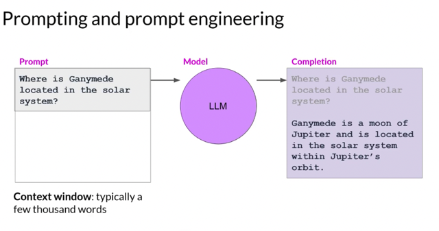
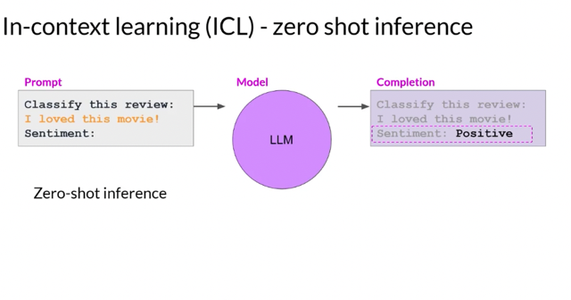
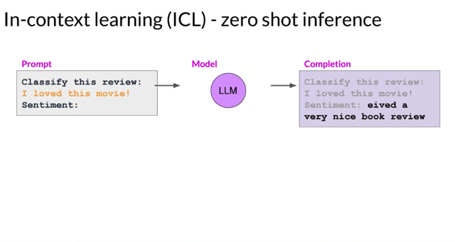
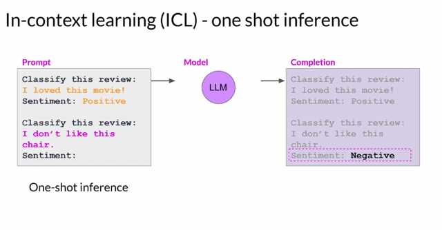
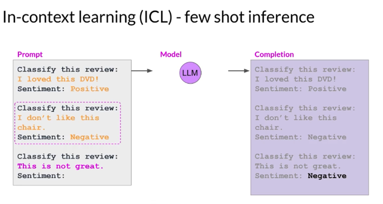
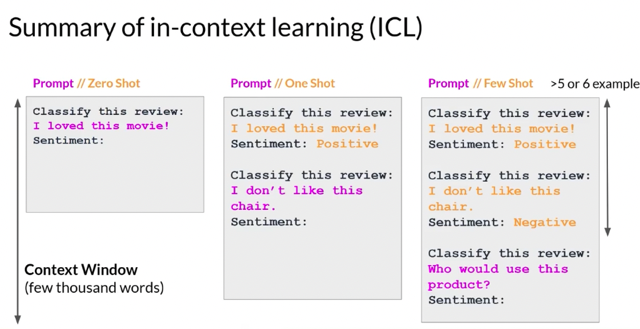
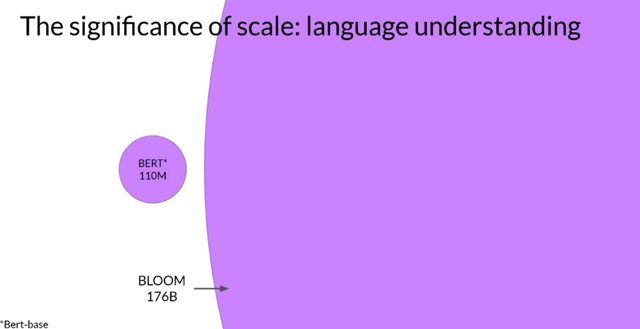
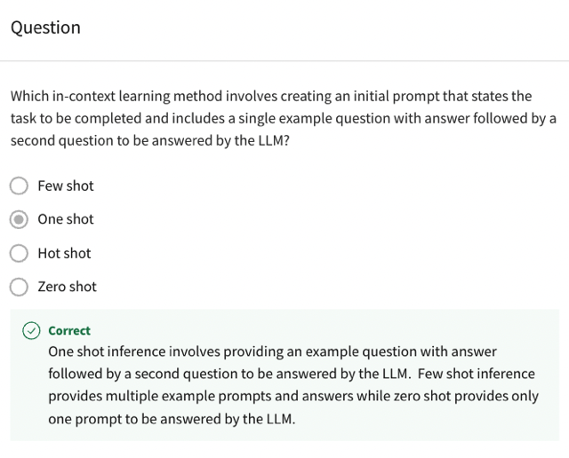

# Prompting And Prompt Engineering

📊 **Progress:** `7` Notes | `8` Screenshots

---

## 1 Terminology: The passage introduces key terms related to working with **transformer models**, such as

> [!NOTE]
> 1 Terminology: The passage introduces key terms related to working with **transformer models**, such as
> **prompt** (input text), **inference** (generating text), **completion** (output text), and **context window** (the
> available text for the prompt).
>
> 2 **Prompt Engineering**: **Prompt engineering** involves **refining the language and structure of prompts** to
> **get the desired model behavior**.**Including examples** of the task within the prompt is a **powerful strategy** to
> **improve model performance.**
>
> 3 **Zero-Shot Inference**: Zero-shot inference involves using prompts that enable the model to **perform a task it
> hasn't been explicitly trained on**. The model can l**everage i**ts **general language understanding** to provide
> accurate responses. **Larger** **models** perform well in zero-shot inference.
>
> 4 **One-Shot Inference**: One-shot inference involves**including a single example** within the prompt to **guide
> the model's behavior.** This **helps smaller models understand the task** and generate appropriate responses.
>
> 5 **Few-Shot Inference**: Few-shot inference**expands on one-shot inference** by **including multiple examples**
> in the prompt. Providing **examples** with **different output classes** helps the model**understand the desired
> behavior.**
>
> 6 **Context Window Limitations**: The context window places a **limit on the amount of in-context learning** that
> can be passed into the model. If including multiple examples doesn't yield good performance, **fine-tuning the
> model with new data may be necessary.**
>
> 7 **Model Scale and Task Performance**: The **scale of the model**, determined by the **number of parameters**,
> affects its ability to perform multiple tasks. **Larger models excel at zero-shot inference** and can successfully
> complete various tasks, while **smaller models are typically limited to tasks similar to their training.**
>
> 8 **Experimenting with Configuration**: O**nce a suitable model is found**, **different configuration settings** can
> be explored to i**nfluence the structure and style of the generated completions.**
>
> The passage provides insights into **prompt engineering, zero-shot inference, one-shot inference, context window
> limitations**, and the **relationship between model scale and task performance.**

 

<kbd></kbd>

> [!NOTE]
> kay, Just to remind you of some of the **terminology**. The **text that you feed into the
> model** is called the **prompt**, the **act of generating text** is known as **inference**, and
> the **output text** is known as the **completion**. The **full amount of text** or the memory
> that is available to use for the prompt is called the **context window**. Although the
> example here shows the model performing well, **you'll frequently encounter
> situations where the model doesn't produce the outcome that you want on the first
> try**. You may have to **revise** the language in your prompt or the way that it's written
> several times to get the model to behave in the way that you want. **This work to
> develop and improve the prompt is known as prompt engineering**. This is a big
> topic. But one **powerful strategy** to get the model to produce better outcomes is to
> **include examples** of the task that you want the model to carry out inside the
> prompt

> [!NOTE]
> Đại khái là thường thì ta sẽ không có được câu trả lời mong muốn hay làm cho model
> trả lời theo cách mà mình mong muốn ngay từ đầu, mà phải **revise** (improve, thay đổi)
> **cái prompt dần dần** cho **đến khi model nó hiểu mình cần gì**. Quá trình đó gọi là **prompt
> engineering**. Và một strategy quan trọng là **đưa** **ví dụ vào trong prompt**.

 

<kbd></kbd>

> [!NOTE]
> Đưa ví dụ của dạng câu trả lời mà mình mong muốn vào prompt gọi là**In-context learning - ICL**. **Zero
> shot** (đọc thêm câu trả lời của GPT) **đại khái là khả năng "hỏi gì cũng biết"** - ý là**khả năng đưa ra
> những dự đoán cho những vấn đề mà nó chưa từng được huấn luyện**. Thì đại khái chỉ gần đây khi
> LLM với việc đã được **huấn luyện trên nhiều chủ đề, nhiều nguồn data rộng khắp** mới có thể cho
> phép nó**transfer kiến thức trên nhiều lĩnh vực khác nhau** mới có thể **cho khả năng zero-shot learning.**

 

### **Zero-shot inference** refers to the **ability of a model to make predictions** or \\*perform

> [!NOTE]
> **Zero-shot inference** refers to the **ability of a model to make predictions** or **perform
> inference on tasks** or **data points** it has n**ever been explicitly trained on.** In **traditional**
> machine learning, models are **typically trained on a specific task or dataset**, and they
> **struggle** to **generalize to new tasks** or data points **outside** their **training distribution**.
>
> However, with the**advancements in transformer models**, such as **GPT-3**, zero-shot
> inference has become possible. These models are **pre-trained on large**amounts of
> **diverse data** and **learn general language understanding**, allowing them to**transfer
> knowledge across tasks**. **Zero-shot inference** leverages this **transfer learning capability**,
> enabling the model to **perform reasonably well on unseen tasks** or data points **without
> any specific training or fine-tuning**.
>
> In**zero-shot inference**, the model is **given a prompt or a description of the task** it needs
> to perform, along with the**input data**, **without any explicit examples** of that particular task
> during training. The model **uses its understanding of language and the knowledge** it
> gained **during pre-training** to **generate predictions** or perform the desired inference on
> the given task.
>
> For example, a **language model pre-trained on a variety of topics**, such as news articles,
> books, and encyclopedias, can be u**sed for zero-shot inference on tasks** like
> **question-answering or text summarization**, even if it **hasn't been trained specifically on
> those tasks**. By providing a prompt or description of the task, the model can generate
> relevant responses or summaries based on its understanding of language and the
> context provided.
>
> Zero-shot inference offers a flexible and efficient way to utilize pre-trained models
> across a wide range of tasks without the need for extensive task-specific training. It
> demonstrates the generalization and transfer learning capabilities of large-scale
> language models like GPT-3.

 

<kbd></kbd>

> [!NOTE]
> Thực hiện **zero-shot inference** với
> các model nhỏ hơn,**specific hơn
> thì perform không tốt.**

 

<kbd></kbd>

> [!NOTE]
> Nhưng **đưa cho nó thêm ví dụ của một
> câu trả lời mong muốn** gọi là**one-shot
> inference** thì nó trả lời được.

 

<kbd></kbd>

 

<kbd></kbd>

> [!NOTE]
> Tóm lại đại khái là với **large model**, ta có thể **cứ hỏi nó thôi**, không cần phải
> cung cấp ví dụ hay thông tin gì thêm gọi là**zero-shot inference**, nhưng với
> s**maller model** ta có thể dùng **one-shot hay few-shot
> inference.** Tuy nhiên **giới hạn của context window** sẽ không cho phép ta cung
> cấp quá nhiều example hay thông tin context. Khi đó, ta sẽ phải **Fine tuning để
> tuning model với một bộ dữ liệu** nhằm giúp kiểu như **huấn luyện thêm cho
> model để nó có thể work trên một chủ đề hẹp** hoặc một**specific task** nào đó.

 

<kbd></kbd>

> [!NOTE]
> Đại khái là **model càng lớn**, nó c**àng có thể "hỏi gì cũng biết, gì cũng làm được**" -
> **zeros shot inference**. Còn **model nhỏ hơn** chỉ có thể "trả lời" / "làm" những task mà
> gần gần với **những gì nó được huấn luyện thôi.** Và có thể mình phải**tìm kiếm một
> model phù hợp** với task mình cần sau đó là ta sẽ **fine-tuning thêm cho model**

 

<kbd></kbd>

 

