# React: Combining Reasoning And Action

📊 **Progress:** `3` Notes | `11` Screenshots

---

## **Structured Prompts and Complex Workflows with LLMs**

> [!NOTE]
> **Structured Prompts and Complex Workflows with LLMs**
>
> In this lesson, we dive deeper into **enhancing the capabilities of Large Language Models** 
> (LLMs) in **complex workflows and applications.**
>
> 1. **Introduction**:
>    - LLMs are great at predicting probable tokens based on context.
>    - However, they have **limitations**, especially in **arithmetic** and **complex operations.**
>
> 2. **Program-Aided Language Models (PAL)**:
>    - Introduced by Luyu Gao and collaborators in 2022 at Carnegie Mellon University.
>    - Combines an LLM with an external code interpreter, like Python.
>    - Uses "**chain of thought**" **prompting** to **create Python scripts**.
>    - The LLM reasons, writes code, and the interpreter executes the calculations.
>
> 3. ****PAL Workflow****:
>    - Start by **formatting the prompt** with **examples and desired outputs**.
>    - LLM **creates a Python script**.
>    - An **external interpreter** executes the script, getting the **correct answer**.
>    - **Integrate** the correct answer **back into the model** for consistency.
>
> 4. **Automating PAL**:
>    - An **orchestrator** can **manage the flow** between the LLM and external systems.
>    - It interprets and executes the model's plan, automating interactions.
>
> 5. **Introducing **ReAct****:
>    - A **prompting strategy** combining **reasoning** with **action planning**.
>    - Proposed by Princeton and Google researchers in 2022.
>    - **Requires the model** to **reason over multiple sources**, like Wikipedia, and 
> **decide on a series of actions**.

 

### 6. **ReAct Workflow**:

> [!NOTE]
> 6. **ReAct Workflow**:
>    - A **structured prompt** contains:
>      - A ****thought**** (a reasoning step).
>      - An ****action**** (an instruction from a predefined list, e.g., **search, lookup, finish**).
>      - An ****observation**** (new information from an external search).
>    - The model then **repeats this cycle as needed until the final answer is achieved**.
>
> 7. **ReAct Instructions**:
>    - **Define the task clearly**.
>    - **Define the allowed actions** to **prevent unintended actions**.
>    - **A series of examples** can guide the LLM.
>
> 8. **Inference with ReAct**:
>    - Begin with the **ReAct example prompt.**
>    - **Include the instructions** and the **question** for the LLM.
>    - Once the LLM understands, it **can reason and plan actions for the given application**.
>
> 9. ****LangChain Framework****:
>    - Provides **modular components** to work with LLMs.
>    - Contains **prompt templates**, **memory storage**, and **tools** to work with **external datasets 
> and APIs.**
>    - **"Chains"** are predefined **workflows**, while **"Agents"** can **determine dynamic workflows** 
> based on user input.
>
> 10. **Considerations**:
>    - **Larger models perform better** with **advanced prompting techniques.**
>    - **Smaller** models might **require fine-tuning**.
>    - It's beneficial to **start with a capable model** and then, **based on data collection, fine-
> tune a smaller model for deployment.**
>
> In summary, while LLMs have**inherent limitations**, combining them with frameworks like 
> **PAL** and **ReAct**, and tools like **LangChain**, can **extend their capabilities**, making them 
> powerful assets in complex applications.

 

<kbd>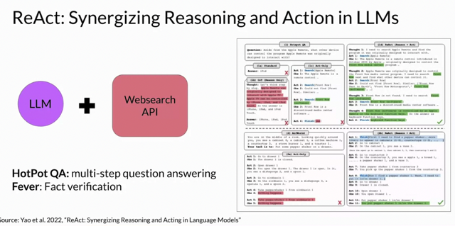</kbd>

 

<kbd>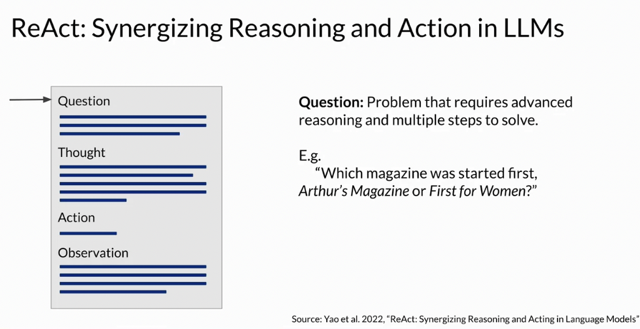</kbd>

 

<kbd>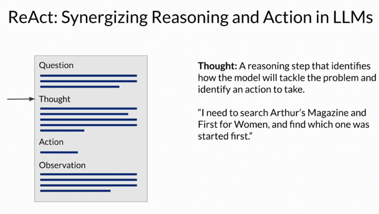</kbd>

 

<kbd>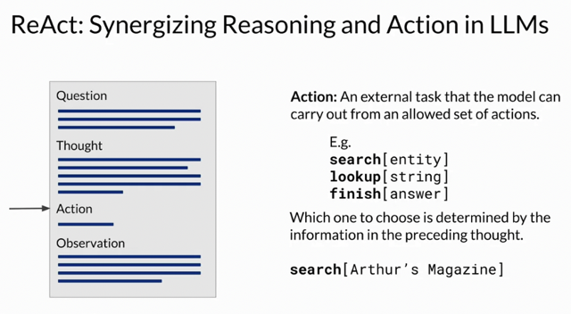</kbd>

 

<kbd>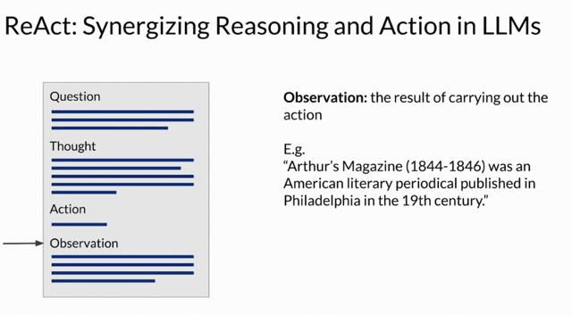</kbd>

 

<kbd>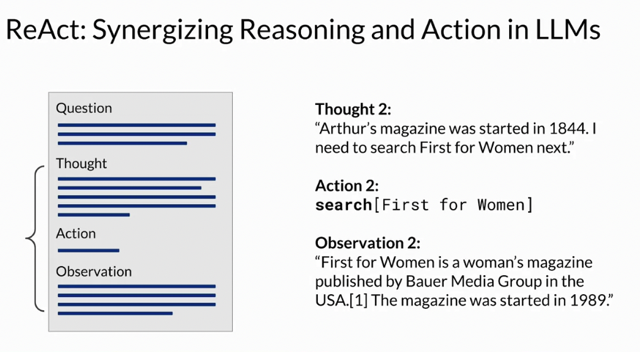</kbd>

 

<kbd>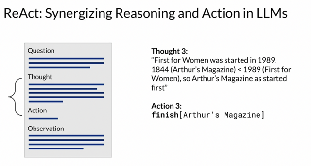</kbd>

 

<kbd>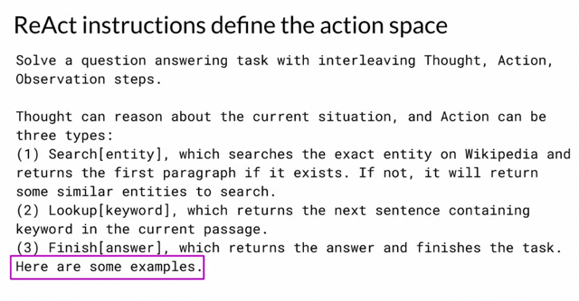</kbd>

 

<kbd>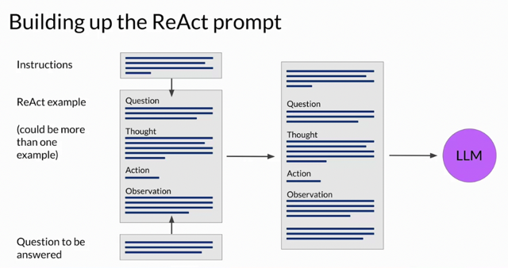</kbd>

> [!NOTE]
> Cơ bản **React** Prompt là một **'prompt technique'** trong đó
> **hướng dẫn LLM generate completion** theo kiểu **các bước
> suy nghĩ và hành động** để rồi từ đó nó (orchestration) sẽ
> dựa vào đó để mà gọi API

 

<kbd>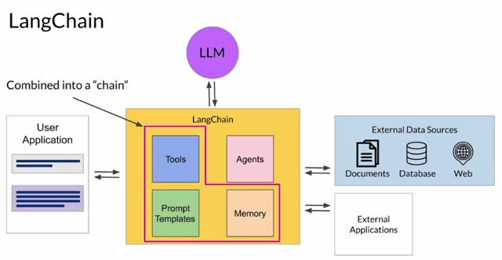</kbd>

> [!NOTE]
> Thì một Orchestration nổi tiếng đang
> được active research gần đây và có
> ShortCourse là **LangChain**.

 

<kbd>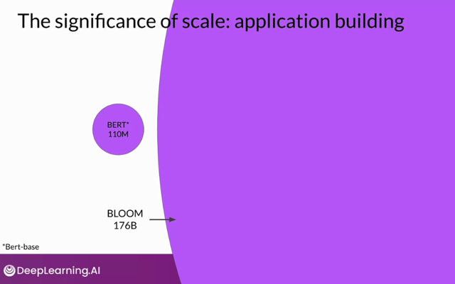</kbd>

> [!NOTE]
> Đại khái là kích thước model có thể **ảnh
> hưởng đến khả năng hiểu của nó khi deal
> với các advanced prompting technique này.**

 

